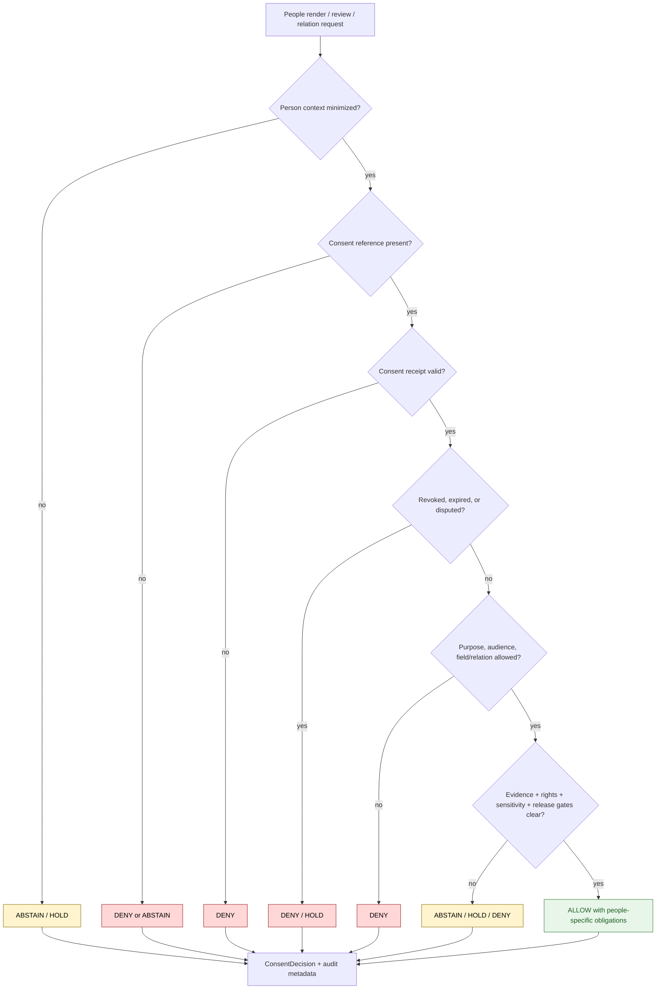

<!-- [KFM_META_BLOCK_V2]
doc_id: kfm://policy/consent/people
title: People Consent Policy README
type: policy-readme
version: v0.1
status: draft
owners: OWNER_TBD — Consent steward · Privacy steward · People-DNA-Land steward · Policy steward · Docs steward
created: 2026-06-15
updated: 2026-06-15
policy_label: restricted
related:
  - ../README.md
  - ../../../docs/domains/people-dna-land/CONSENT_MODEL.md
  - ../../../docs/domains/people-dna-land/CONSENT.md
  - ../../../docs/domains/people-dna-land/CONSENT_REGISTER.md
  - ../../../docs/domains/people-dna-land/PEOPLE_DOMAIN_MODEL.md
  - ../../../docs/domains/people-dna-land/SENSITIVITY_PROFILE.md
  - ../../../docs/domains/people-dna-land/SCOPE_AND_BOUNDARY.md
  - ../../../docs/doctrine/trust-membrane.md
  - ../../../docs/doctrine/directory-rules.md
  - ../../../packages/policy-runtime/README.md
  - ../../../apps/governed-api/README.md
tags: [kfm, policy, consent, people, living-person, privacy, genealogy, people-dna-land, render-gate, revocation]
notes:
  - "Initial README for the policy/consent/people lane."
  - "This lane scopes consent policy for people/living-person records and genealogy-adjacent person claims; DNA-specific consent should remain separately identified when required."
  - "Consent constrains rendering; it does not publish data and does not replace rights, sensitivity, evidence, review, release, correction, or rollback gates."
  - "Placement remains PROPOSED until the consent-policy placement ADR resolves top-level and domain-scoped consent homes."
  - "Runtime enforcement, schemas, fixtures, tests, revocation infrastructure, and consent-decision receipts remain NEEDS VERIFICATION."
[/KFM_META_BLOCK_V2] -->

<a id="top"></a>

<div align="center">

# People Consent Policy

`policy/consent/people/`

**Consent-policy sublane for people and living-person records: purpose-bound render checks, revocation handling, privacy-preserving identifiers, and fail-closed consent decisions.**


[Scope](#1-scope) · [Repo fit](#2-repo-fit) · [Inputs](#5-inputs) · [Exclusions](#6-exclusions) · [People consent lifecycle](#7-people-consent-lifecycle) · [Diagram](#8-diagram) · [Definition of done](#14-definition-of-done)

</div>

---

> [!IMPORTANT]
> **Status:** draft / `NEEDS VERIFICATION`  
> **Owners:** `OWNER_TBD` — Consent steward · Privacy steward · People-DNA-Land steward · Policy steward · Docs steward  
> **Path:** `policy/consent/people/README.md`  
> **Responsibility root:** `policy/` — policy-as-code and policy documentation  
> **Truth posture:** CONFIRMED file path / PROPOSED people-consent policy sublane / UNKNOWN runtime enforcement

> [!CAUTION]
> **People consent does not publish person data.** A valid consent decision only says a scoped render is not blocked by consent. Evidence closure, rights, sensitivity, review, release, correction, and rollback controls still apply.

---

## Quick jump

- [1. Scope](#1-scope)
- [2. Repo fit](#2-repo-fit)
- [3. People consent boundary](#3-people-consent-boundary)
- [4. Default posture](#4-default-posture)
- [5. Inputs](#5-inputs)
- [6. Exclusions](#6-exclusions)
- [7. People consent lifecycle](#7-people-consent-lifecycle)
- [8. Diagram](#8-diagram)
- [9. Decision vocabulary](#9-decision-vocabulary)
- [10. People-specific obligations](#10-people-specific-obligations)
- [11. Revocation and relationship-change posture](#11-revocation-and-relationship-change-posture)
- [12. Inspection path](#12-inspection-path)
- [13. Validation expectations](#13-validation-expectations)
- [14. Definition of done](#14-definition-of-done)
- [15. Open verification items](#15-open-verification-items)

---

## 1. Scope

`policy/consent/people/` is a proposed consent-policy sublane for people and living-person records in KFM.

It should describe and eventually bind policy checks for whether person-related data may be rendered, reviewed, exported, linked, or materialized under a valid consent grant and within its purpose, audience, retention, and revocation constraints.

In scope:

- living-person consent posture
- person-record render consent
- genealogy-adjacent person claims where consent is required
- subject and holder pseudonym handling
- relationship-link display constraints
- purpose-bound review and render gates
- revocation, suspension, and cache invalidation posture
- obligations such as redact, generalize, restrict audience, withhold relation, or require review

Out of scope:

- DNA kit or genomic consent internals when a separate DNA-specific lane is required
- legal advice
- rights/licensing policy
- sensitivity tier policy
- schema definitions
- release approval
- raw living-person data storage
- public UI implementation
- identity-provider credentials

[Back to top](#top)

---

## 2. Repo fit

| Concern | Owning root | Expected relationship |
|---|---|---|
| People consent policy sublane | `policy/consent/people/` | This README; active policy files remain `NEEDS VERIFICATION` |
| Consent policy parent | `policy/consent/` | Parent consent posture and shared gate vocabulary |
| People / DNA / Land consent doctrine | `docs/domains/people-dna-land/CONSENT_MODEL.md` | Human-facing consent model and domain guidance |
| People domain model | `docs/domains/people-dna-land/` | Domain docs; not executable policy authority |
| Runtime policy evaluation | `packages/policy-runtime/` or governed API policy runtime | Implementation home remains `NEEDS VERIFICATION` |
| Public / reviewer API boundary | `apps/governed-api/` | Consent checks should be enforced through governed interfaces |
| Consent schemas | `schemas/contracts/v1/` or verified consent schema home | Machine shape remains `NEEDS VERIFICATION` |
| Stored receipts and proofs | `data/receipts/`, `data/proofs/`, or verified homes | Exact homes remain `NEEDS VERIFICATION` |

> [!WARNING]
> The parent consent lane is itself PROPOSED pending consent-policy placement resolution. This people sublane must not become active policy authority until the parent placement and domain ownership are accepted.

## 3. People consent boundary

People consent is one independent render gate. It is not identity truth, personhood truth, rights clearance, sensitivity clearance, evidence closure, review approval, release approval, correction, or rollback.

Short rule:

```text
policy/consent/people/       = people/living-person consent gate, if accepted
policy/consent/              = shared consent gate posture
policy/sensitivity/          = sensitivity, geoprivacy, and exposure policy
contracts/                   = object meaning
schemas/contracts/v1/         = machine-readable shape
release/                     = publication, correction, rollback control
data/                        = lifecycle state, receipts, proofs, artifacts
```

## 4. Default posture

People consent policy should fail closed.

A people-related render, review, export, link, or derivative request should return `DENY`, `ABSTAIN`, or `HOLD` when any of these are missing, stale, ambiguous, expired, revoked, disputed, or unsupported:

- consent grant reference
- subject pseudonym or holder binding
- requested purpose
- requested audience
- requested relation or attribute
- retention window
- revocation status
- evidence reference
- sensitivity context
- rights context
- release or candidate state
- audit context

## 5. Inputs

| Input family | Examples | Required posture |
|---|---|---|
| Consent record | ConsentGrant, consent receipt, ConsentSidecar reference, status-list reference | Verified, scoped, and revocation-checkable |
| Person context | subject pseudonym, holder reference, person-record reference, living-person flag | Minimized and privacy-preserving |
| Relationship context | parent/child/spouse/household/property relation claim | Purpose-bound and evidence-backed |
| Request context | actor, audience, purpose, scope, field/relationship requested, timestamp | Explicit and auditable |
| Revocation state | RevocationReceipt, tombstone, status-list bit, invalidation event | Checked before consequential render |
| Evidence context | EvidenceRef, EvidenceBundle status, citation validation | Required for consequential claim display |
| Sensitivity context | living-person, family-sensitive, private-property, cultural, health-like, or safety flags | Fail closed when unresolved |
| Release context | candidate, released, superseded, withdrawn, rollback requested | Explicit; consent never substitutes for release |

## 6. Exclusions

| Does not belong here | Correct home |
|---|---|
| Consent schemas | `schemas/contracts/v1/` |
| People object semantic contracts | `contracts/` |
| Raw living-person records | `data/` lifecycle roots with policy controls |
| DNA kit/genomic identifiers | domain-controlled data homes; never public logs or docs |
| Consent receipts and proof storage | `data/receipts/`, `data/proofs/`, or verified homes |
| Release manifests and rollback authority | `release/` |
| Rights/licensing policy | accepted rights policy lane |
| Sensitivity and geoprivacy policy | `policy/sensitivity/` |
| Public UI or API implementation | `apps/` or governed UI/API packages |
| Runtime helper code | `packages/policy-runtime/` |
| Legal advice | Outside repository policy docs |

## 7. People consent lifecycle

People consent state must remain explicit, revocable, auditable, and purpose-bound.

| State | Meaning | Runtime posture |
|---|---|---|
| `draft` | Consent record is being prepared | Not usable for public or reviewer materialization |
| `granted` | Consent grant exists and can be evaluated | Check purpose, scope, audience, retention, revocation, and obligations |
| `limited` | Consent allows constrained person fields, relations, purpose, or audience only | Enforce obligations and restrictions |
| `disputed` | Consent or relation is challenged | `HOLD` for review; do not render publicly |
| `expired` | Retention or validity window has ended | `DENY` unless renewed and verified |
| `revoked` | Consent was withdrawn | `DENY` and invalidate dependent caches |
| `unknown` | Consent cannot be verified | `ABSTAIN` or `DENY`, never implicit allow |

## 8. Diagram



## 9. Decision vocabulary

| Decision | Meaning | Required behavior |
|---|---|---|
| `ALLOW` | Consent permits this scoped people-related action | Enforce obligations and still require other gates |
| `DENY` | Consent blocks the action | Do not reveal protected person details beyond safe denial text |
| `ABSTAIN` | Consent cannot be evaluated due to missing support | Block action and name missing support where safe |
| `HOLD` | Human review or dispute resolution is required | Do not render publicly |
| `ERROR` | Runtime, schema, signature, status-list, or evaluator failure | Fail closed and record failure |

## 10. People-specific obligations

| Obligation | Example effect |
|---|---|
| `redact_person_attribute` | Withhold a field such as contact, age, health-like detail, or private note |
| `redact_relation` | Withhold family, household, or land relation link |
| `generalize_person` | Show aggregate or non-identifying summary only |
| `restrict_audience` | Limit to steward, reviewer, named party, or authenticated surface |
| `purpose_limit` | Permit genealogy review but deny public map rendering |
| `review_required` | Route disputed or sensitive material to privacy / domain review |
| `cache_invalidate` | Remove cached derivatives after revocation or correction |
| `withhold_living_person` | Suppress living-person display unless all gates clear |

## 11. Revocation and relationship-change posture

Revocation and relationship correction must take effect at render time.

Required posture:

- check revocation before consequential render
- treat unavailable revocation state as fail-closed
- invalidate person, relation, and derived-summary caches when consent is revoked or disputed
- preserve correction lineage when a relationship is withdrawn or corrected
- avoid logging raw person identifiers, private family claims, or DNA/vendor identifiers
- retain audit records with minimized subject references

## 12. Inspection path

People-consent policy modules, schemas, fixtures, receipts, and tests remain `NEEDS VERIFICATION`. Use these local inspection commands before treating this lane as implemented.

```bash
# From the repository root, inspect the people consent policy lane.
find policy/consent/people -maxdepth 4 -type f | sort

# Inspect parent consent policy and People-DNA-Land consent docs.
find policy/consent docs/domains/people-dna-land -maxdepth 4 -type f | grep -Ei 'consent|people|person|privacy|sensitivity|release' | sort

# Inspect likely people-consent tests and fixtures.
find tests fixtures -maxdepth 5 -type f 2>/dev/null | grep -E 'consent|people|person|privacy|revocation' | sort
```

## 13. Validation expectations

Useful validation for this lane should cover:

- missing consent returns `DENY` or `ABSTAIN`
- living-person render with no consent returns `DENY`
- expired consent returns `DENY`
- revoked consent returns `DENY`
- disputed relationship returns `HOLD`
- requested field or relation outside scope returns `DENY`
- unresolved rights, sensitivity, evidence, or release state still blocks render even when consent is valid
- obligations are preserved in the output decision
- revocation invalidates dependent caches or derivatives
- raw person identifiers and private relation details are not leaked in logs

## 14. Definition of done

- [ ] Owners are confirmed and `OWNER_TBD` is replaced.
- [ ] Parent consent placement ADR is resolved.
- [ ] People-consent policy runtime language and bundle location are confirmed.
- [ ] People-specific ConsentDecision shape is created or linked where accepted.
- [ ] Revocation, dispute, and relation-withdrawal handling are documented or linked.
- [ ] Tests and fixtures cover allow, deny, abstain, hold, error, expired, revoked, disputed, and out-of-scope paths.
- [ ] Consent decisions are auditable and replayable with minimized subject references.
- [ ] Public renders use governed interfaces and check consent every time.
- [ ] Release approval remains separate from people-consent decisions.
- [ ] Rollback and cache invalidation path is documented.

## 15. Open verification items

| Item | Why it matters |
|---|---|
| Confirm accepted placement for `policy/consent/people/` | Prevents duplicate consent policy homes |
| Confirm people vs DNA sublane split | Keeps living-person and genomic controls distinct |
| Confirm schemas and contracts | Required for machine-checkable decisions |
| Confirm revocation and dispute handling | Required for effective runtime consent |
| Confirm tests and fixtures | Required before active enforcement |
| Confirm audit event shape | Required for accountability and replay |
| Confirm cache invalidation path | Required for revocation effectiveness |
| Confirm living-person identifier handling | Prevents privacy leakage |

<details>
<summary>Appendix A — illustrative people-consent policy input shape</summary>

This example is illustrative. It is not a verified schema.

```json
{
  "person": {
    "person_ref": "PERSON_REF_TBD",
    "living_person": true,
    "subject_pseudonym": "SUBJECT_PSEUDONYM_TBD"
  },
  "request": {
    "actor": "ACTOR_REF_TBD",
    "audience": "restricted_review",
    "purpose": "genealogy_review",
    "scope": "restricted_render",
    "requested_fields": ["relationship_summary"],
    "now": "2026-06-15T00:00:00Z"
  },
  "consent": {
    "grant_ref": "CONSENT_GRANT_REF_TBD",
    "status": "granted",
    "expires_at": "EXPIRY_TBD",
    "revocation_status": "not_revoked"
  },
  "context": {
    "evidence_ref": "EVIDENCE_REF_TBD",
    "rights_status": "RIGHTS_STATUS_TBD",
    "sensitivity_tier": "SENSITIVITY_TIER_TBD",
    "release_state": "candidate"
  }
}
```

</details>

<details>
<summary>Appendix B — no-loss preservation note</summary>

The target file was an empty placeholder. This README adds a bounded people-consent policy sublane without claiming runtime enforcement, legal sufficiency, schemas, fixtures, tests, revocation infrastructure, consent receipts, or CI coverage.

It preserves the People-DNA-Land consent doctrine's keystone rule: consent constrains render-time materialization and does not publish data.

</details>

## Status summary

`policy/consent/people/` should define people/living-person consent policy only if the parent consent-policy placement is accepted.

It should enforce purpose-bound, revocable, retention-aware, fail-closed people-consent checks while preserving separate rights, sensitivity, evidence, review, release, correction, rollback, schema, contract, and lifecycle boundaries.

<p align="right"><a href="#top">Back to top</a></p>
