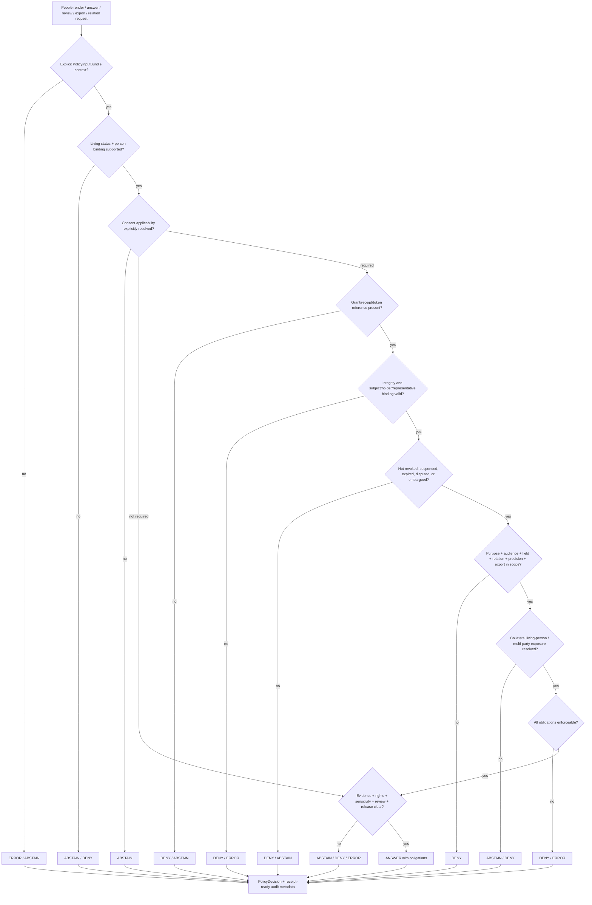

<!-- [KFM_META_BLOCK_V2]
doc_id: kfm://policy/consent/people
title: policy/consent/people/ — People and Living-Person Consent Gate
type: policy-readme
version: v0.2
status: draft
owners: OWNER_TBD — Consent steward · Privacy steward · People-DNA-Land domain steward · Policy steward · Policy-runtime steward · Evidence steward · Release steward · Docs steward
created: 2026-06-15
updated: 2026-07-14
policy_label: "restricted-review; consent; people; living-person; genealogy; relationship; residence; purpose-bound; revocable; finite-outcomes; explicit-inputs; no-hidden-fetches; fail-closed; evidence-aware; rights-aware; sensitivity-aware; release-gated; cache-invalidation; replayable; rollback-aware; no-reidentification; no-secrets"
current_path: policy/consent/people/README.md
truth_posture: CONFIRMED repository path, parent and sibling consent READMEs, People-DNA-Land consent doctrine, people-domain assertion-first model, living-person T4 sensitivity posture, PolicyInputBundle and PolicyDecision semantic contracts, paired policy schemas, canonical PolicyDecision outcome and policy-family enums, policy-runtime package placeholder version, and TODO-only policy workflow / PROPOSED people-specific consent rule family, applicability decision, engine-result normalization, reason-code registry, obligation registry, consent-token or sidecar binding, revocation introspection, representative authority, multi-party relationship consent, receipt emission, cache dependency tracking, and governed API integration / CONFLICTED top-level policy/consent placement versus domain-nested consent placement, duplicate CONSENT.md versus CONSENT_MODEL.md doctrine carriers, people versus people-dna-land segment conventions, and engine-native ALLOW-RESTRICT-HOLD vocabulary versus canonical ANSWER-ABSTAIN-DENY-ERROR PolicyDecision vocabulary / UNKNOWN executable people-consent policy modules, accepted credential format, evaluator binding, active policy bundle, runtime enforcement, deployed revocation service, production caches, release integration, and branch-protection enforcement / NEEDS VERIFICATION accepted owners, placement ADR, schema hardening, validators, fixtures, tests, CI, reason codes, obligation interpreter, consent applicability rules, living-status evidence, authorized-representative rules, multi-party consent, death-of-subject handling, receipt/proof links, retention and purge rules, cache invalidation SLOs, and rollback automation
evidence_snapshot:
  repository: bartytime4life/Kansas-Frontier-Matrix
  repository_id: "1059091169"
  visibility: public
  base_ref: main
  base_commit: 98b39c7171129b90ca858e2e3849ed121c0d7769
  prior_blob: 244e5020f74af99f37d680c8e2f790b3b3b3577c
  bounded_path_search: target lane, parent and People-DNA-Land consent lanes, people-domain and sensitivity doctrine, policy contracts and schemas, policy runtime package, policy workflow, Directory Rules, and repository-indexed people-consent terminology
related:
  - ../README.md
  - ../people-dna-land/README.md
  - ../../../docs/domains/people-dna-land/CONSENT_MODEL.md
  - ../../../docs/domains/people-dna-land/CONSENT.md
  - ../../../docs/domains/people-dna-land/CONSENT_REGISTER.md
  - ../../../docs/domains/people-dna-land/PEOPLE_DOMAIN_MODEL.md
  - ../../../docs/domains/people-dna-land/SENSITIVITY_PROFILE.md
  - ../../../docs/domains/people-dna-land/SCOPE_AND_BOUNDARY.md
  - ../../../docs/domains/people-dna-land/API_CONTRACTS.md
  - ../../../docs/domains/people-dna-land/CANONICAL_PATHS.md
  - ../../../docs/standards/CONSENT_TOKENS.md
  - ../../../contracts/policy/policy_input_bundle.md
  - ../../../contracts/policy/policy_decision.md
  - ../../../schemas/contracts/v1/policy/policy_input_bundle.schema.json
  - ../../../schemas/contracts/v1/policy/policy_decision.schema.json
  - ../../../packages/policy-runtime/README.md
  - ../../../packages/policy-runtime/pyproject.toml
  - ../../../apps/governed-api/README.md
  - ../../../docs/doctrine/directory-rules.md
  - ../../../docs/doctrine/trust-membrane.md
  - ../../../docs/registers/DRIFT_REGISTER.md
  - ../../../docs/registers/VERIFICATION_BACKLOG.md
  - ../../../.github/workflows/policy-test.yml
tags: [kfm, policy, consent, people, living-person, genealogy, relationship, privacy, revocation, render-gate, policy-input-bundle, policy-decision, obligations, reason-codes, fail-closed, rollback]
notes:
  - "This revision changes only policy/consent/people/README.md."
  - "The path is CONFIRMED repository-present, but its authority remains CONFLICTED because current People-DNA-Land path doctrine says the consent placement ADR is unresolved and prefers domain-nested consent rules pending that ADR."
  - "Bounded repository search surfaced this README for the people consent lane and did not surface an executable people-consent policy module, people-specific consent schema, or people-consent fixture/test family. This is search-limited and not proof of permanent absence."
  - "PolicyDecision is repository-present with canonical outcomes ANSWER, ABSTAIN, DENY, and ERROR and policy_family consent. Engine-native ALLOW, RESTRICT, and HOLD require explicit normalization before governed callers consume them."
  - "PolicyInputBundle is repository-present, but its paired schema remains a permissive placeholder requiring only id; the people-specific context described here is not yet machine-enforced."
  - "The policy runtime package is version 0.0.0 and the policy-test workflow currently contains TODO echo steps, so runtime and CI enforcement remain unproved."
[/KFM_META_BLOCK_V2] -->

<a id="top"></a>

# People and Living-Person Consent Gate

`policy/consent/people/`

> Consent-policy boundary for living-person attributes, genealogy-adjacent person claims, family and household relationships, residence and migration events, person-linked derivatives, and people-facing exports. This lane may determine whether consent blocks one precisely scoped action; it cannot establish person identity, relationship truth, source authority, evidence closure, rights clearance, sensitivity clearance, review approval, release approval, or publication.


**Quick links:** [Purpose](#purpose) · [Authority](#authority-level) · [Status](#status-and-evidence) · [Scope](#scope-and-bounded-context) · [Invariants](#keystone-invariants) · [Repo fit](#repository-fit-and-directory-rules-basis) · [Belongs](#what-belongs-here) · [Exclusions](#what-does-not-belong-here) · [Inputs](#explicit-policy-input) · [Decisions](#decision-vocabulary-and-normalization) · [Applicability](#consent-applicability) · [Lifecycle](#people-consent-lifecycle) · [Evaluation](#evaluation-order) · [Revocation](#revocation-correction-and-cache-invalidation) · [Audit](#audit-replay-and-data-minimization) · [Threats](#threat-model) · [Validation](#validation-and-test-matrix) · [Implementation](#smallest-sound-implementation-sequence) · [Done](#definition-of-done) · [Open](#open-verification-register) · [Rollback](#rollback-correction-and-supersession)

> [!IMPORTANT]
> **People consent is necessary where policy requires it, but never sufficient.** A consent result may only say that consent does or does not block the exact operation, audience, purpose, person or holder binding, field, relation, temporal window, precision, export, and derivative that were evaluated. Materialization still requires evidence, source-role, rights, sensitivity, review, release, correction, and rollback gates.

> [!CAUTION]
> **Repository presence is not policy activation.** This README exists, but current evidence does not establish executable people-consent rules, an accepted policy bundle, evaluator wiring, a people-consent schema, synthetic fixtures, tests, receipt emission, deployed revocation introspection, cache invalidation, or production enforcement.

---

## Purpose

This lane documents the people- and living-person-specific consent boundary within the broader People / Genealogy / DNA / Land context.

It exists to make consent decisions:

- explicit rather than inferred;
- purpose-bound;
- audience-bound;
- subject-, holder-, or authorized-representative-bound;
- field-, relation-, event-, precision-, export-, and operation-specific;
- time-bounded;
- living-status-aware;
- revocation-, suspension-, dispute-, and correction-aware;
- finite in outcome;
- obligation-bearing;
- auditable and replayable;
- privacy-preserving;
- correctable and reversible;
- fail-closed.

The lane must prevent a consent record, public-source record, tree entry, obituary, directory listing, or administrative record from being misused as:

- a general publication license;
- proof that a person is living or deceased;
- proof that two assertions identify the same person;
- proof that a family, household, residence, occupancy, or land relation is true;
- permission to publish another living person's information;
- a source-rights grant;
- a sensitivity downgrade;
- a release approval;
- a waiver of citation;
- permission to reconstruct revoked, redacted, or withheld information;
- permission to expose direct identifiers, contact details, private notes, or precise residence;
- permission to bypass governed APIs.

[Back to top](#top)

---

## Authority level

This lane is **policy-authoritative only after placement, ownership, review, bundle, and activation controls are accepted**.

| Concern | Authority in this lane |
|---|---|
| People-consent admissibility | Potential authority after accepted executable rules and review. |
| Consent applicability | Potential authority after a reviewed applicability rule and fixtures exist. |
| Person identity or living status | None. The assertion-first domain model and admissible evidence remain authoritative. |
| Relationship truth | None. Relationship assertions and hypotheses remain evidence- and review-bound. |
| Policy input meaning | None. `contracts/policy/policy_input_bundle.md` owns meaning. |
| Policy decision meaning | None. `contracts/policy/policy_decision.md` owns the canonical result. |
| Machine shape | None. `schemas/contracts/v1/` owns shape. |
| Runtime execution | None. `packages/policy-runtime/` is the executor boundary. |
| Rights and sensitivity | None. Independent policy families must also pass. |
| Evidence and source role | None. Evidence and source registries remain independent. |
| Review and release | None. Review artifacts and `release/` retain authority. |
| Receipts and proofs | None. Emitted trust artifacts live outside this lane. |
| Public API/UI behavior | None. Governed applications consume normalized decisions and obligations. |

A people-consent rule can block or constrain an operation. It cannot publish, prove, or authorize beyond that exact gate.

[Back to top](#top)

---

## Status and evidence

### Current repository state

| Surface | Status | Safe conclusion |
|---|---:|---|
| `policy/consent/people/README.md` | **CONFIRMED** | This README exists and previously described a proposed people-consent sublane. |
| Other indexed files in this exact lane | **NOT SURFACED IN BOUNDED SEARCH** | No executable rule, bundle, data document, manifest, lock, fixture, or lane-local test was found. Search-limited, not proof of permanent absence. |
| Parent consent README | **CONFIRMED v0.1** | Parent boundary exists but still uses engine-native outcome language and remains placement-PROPOSED. |
| People-DNA-Land consent README | **CONFIRMED v0.2** | Restricted-domain sibling is repository-grounded and explicitly records placement and outcome-vocabulary conflicts. |
| People domain model | **CONFIRMED draft doctrine** | Assertion-first identity, relationship hypotheses, living-person T4 defaults, and source-role anti-collapse are documented. |
| Sensitivity profile | **CONFIRMED draft doctrine** | Living-person fields and private joins default to T4; tier transitions require receipts and review. |
| `PolicyInputBundle` contract | **CONFIRMED** | Explicit inputs and no-hidden-fetch boundary are documented. |
| `PolicyInputBundle` schema | **CONFIRMED permissive placeholder** | Requires only `id`; rich people-consent context is not machine-enforced. |
| `PolicyDecision` contract/schema | **CONFIRMED** | Canonical outcome enum is `ANSWER | ABSTAIN | DENY | ERROR`; `policy_family: consent` exists. |
| Policy runtime package | **CONFIRMED placeholder** | `kfm-policy-runtime` is version `0.0.0`; executable people-consent enforcement is not proved. |
| Policy workflow | **CONFIRMED TODO-only** | OPA tests and fixture coverage are echo stubs; success cannot prove people-consent behavior. |
| Governed API integration | **UNKNOWN** | No people-consent evaluator binding or obligation interpreter is established here. |
| Receipts, cache invalidation, rollback | **NEEDS VERIFICATION** | Required by doctrine; no accepted people-consent implementation is proved. |

### Evidence boundary

This README may state inspected repository facts and bounded doctrine. It must not claim:

- executable people-consent policy;
- accepted consent credential format;
- live living-status resolution;
- representative-authority verification;
- multi-party consent enforcement;
- deployed revocation introspection;
- cache invalidation performance;
- production policy selection;
- receipt or proof emission;
- public release safety;
- legal sufficiency.

[Back to top](#top)

---

## Scope and bounded context

### In scope

This sublane may govern consent applicability and consent constraints for:

- living-person person attributes;
- names, aliases, contact details, age or birth information, and private notes;
- genealogy-adjacent person assertions;
- family, household, guardianship, and other relationship displays;
- residence and migration events;
- person-level map labels, popups, Evidence Drawer content, Focus Mode answers, and exports;
- person-linked derived summaries and inferred relationships;
- audience-, purpose-, field-, relation-, precision-, and retention-limited review;
- suspension, revocation, dispute, correction, withdrawal, and cache invalidation;
- consent decisions for public, restricted-review, steward, partner, export, and AI surfaces.

### Out of scope

This sublane does not own:

- DNA kit, segment, match, or genomic-consent internals when the restricted-domain or DNA-specific lane applies;
- land-title, ownership, occupancy, parcel-boundary, or chain-of-title truth;
- person identity resolution or `PersonCanonical` promotion;
- relationship evidence or relationship review;
- source acquisition or source authority;
- rights or licensing clearance;
- sensitivity tier assignment or redaction profile definition;
- semantic contracts or JSON Schemas;
- lifecycle data storage;
- receipt or proof storage;
- release approval;
- UI or API implementation;
- credentials, tokens, keys, or private source content;
- legal advice.

### Relationship to the broader lane

Use the narrower people rule family only when the operation is genuinely people/living-person-specific. Use the broader People-DNA-Land consent boundary when the request crosses DNA/genomic, land-linked person, private person-parcel, or mixed derivative concerns.

No caller may choose the weaker lane to avoid stronger controls.

[Back to top](#top)

---

## Keystone invariants

1. **Consent does not publish person data.**
2. **Consent does not prove person identity, living status, relationship, residence, occupancy, ownership, or title.**
3. **Public availability is not implied consent.** A public directory, obituary, social post, court record, tree, or government record does not waive KFM's evidence, rights, sensitivity, purpose, audience, and release duties.
4. **Living-person status is explicit evidence, not a guess.** Unknown, stale, or disputed living status fails closed.
5. **Assertion-first identity remains intact.** A `PersonAssertion` is not a person; a `PersonCanonical` is a reviewed derivative.
6. **Relationship hypotheses stay hypotheses.** Consent cannot promote a modeled or candidate relationship into asserted truth.
7. **One person's consent does not automatically authorize another person's data.** Multi-party and collateral-person exposure remains unresolved and fail-closed.
8. **Authorized-representative claims require their own evidence and scope.** The runtime must not infer authority from relationship labels.
9. **Revocation and correction apply at render time.**
10. **No hidden fetches.** The evaluator receives an explicit policy input snapshot; missing facts remain missing.
11. **Canonical public outcomes are finite:** `ANSWER`, `ABSTAIN`, `DENY`, or `ERROR`.
12. **Obligations are enforceable conditions, not suggestions.**
13. **Sensitive details do not appear in public reason text, logs, URLs, telemetry, or receipts.**
14. **No reidentification.** Aggregated, generalized, or redacted outputs must not be joined back to identify a protected person.
15. **Promotion remains a governed state transition.**

[Back to top](#top)

---

## Repository fit and Directory Rules basis

### Owning root

The primary responsibility is admissibility policy, so the owning root is `policy/`.

### Placement status

The current path is repository-present:

```text
policy/consent/people/README.md
```

Its **authority placement remains CONFLICTED**:

- the Atlas/sensitivity materials reference `policy/consent/people/`;
- current People-DNA-Land canonical-path doctrine says a new top-level `policy/consent/` lane is ADR-class and prefers domain-nested consent rules pending that ADR;
- the current repository contains the top-level parent and both child README lanes.

Therefore:

- do not call this child path canonical before an accepted ADR;
- do not create duplicate executable people-consent rules under both top-level and domain-nested homes;
- do not infer activation from directory presence;
- keep any future move reversible with drift, supersession, and forward-pointer records.

### Responsibility crosswalk

| Concern | Owning surface | Boundary |
|---|---|---|
| Human-facing people consent boundary | This README, subject to placement ADR | Explanation only. |
| People/domain doctrine | `docs/domains/people-dna-land/` | Meaning, assertion-first model, sensitivity posture. |
| Executable policy source | Accepted `policy/` lane | Must await placement decision. |
| Policy input meaning | `contracts/policy/policy_input_bundle.md` | Explicit input semantics. |
| Canonical decision meaning | `contracts/policy/policy_decision.md` | Finite public/runtime decision semantics. |
| Machine shape | `schemas/contracts/v1/policy/` plus accepted consent schemas | Current input schema is not sufficient. |
| Policy execution helpers | `packages/policy-runtime/` | Executor only; version currently `0.0.0`. |
| Public trust path | `apps/governed-api/` | Clients cannot evaluate or select policy directly. |
| Receipts and proofs | `data/receipts/`, `data/proofs/`, or accepted homes | Emitted instances do not belong here. |
| Release/correction/rollback | `release/` | Consent never replaces release authority. |
| Tests and fixtures | `tests/`, `fixtures/` under accepted conventions | Synthetic data only. |

[Back to top](#top)

---

## What belongs here

After the placement ADR and policy-language decision, this lane may contain:

- people-consent policy source;
- applicability rules for living-person operations;
- purpose/audience/field/relation/precision checks;
- revocation, expiry, suspension, and dispute rules;
- people-specific reason-code and obligation data documents when policy-owned;
- safe policy package documentation;
- references to accepted contracts, schemas, fixtures, and tests;
- migration and supersession notes for this rule family.

A future executable rule should be small, deterministic, explicit-input, no-network, and fail-closed.

[Back to top](#top)

---

## What does not belong here

| Do not put here | Correct owner |
|---|---|
| Raw person records, direct identifiers, addresses, private notes | Controlled `data/<phase>/` homes |
| DNA kit IDs, segments, genomic exports | Restricted domain-controlled data; never public fixtures |
| Consent tokens, bearer credentials, private keys | Request/runtime secret handling; never committed |
| Consent receipts or proof instances | `data/receipts/`, `data/proofs/`, or accepted homes |
| Person, relationship, event, or consent semantic contracts | `contracts/` |
| JSON Schemas | `schemas/contracts/v1/` |
| Policy runtime code | `packages/policy-runtime/` |
| Governed API routes or serializers | `apps/governed-api/` |
| UI components or map logic | `apps/` or accepted UI package |
| Rights and sensitivity rules | Their independent accepted policy lanes |
| Release manifests, correction notices, rollback cards | `release/` |
| Real living-person examples | Nowhere in public repository fixtures |
| Legal conclusions | Outside repository policy documentation |

[Back to top](#top)

---

## Explicit policy input

A future evaluator should receive a people-consent specialization of `PolicyInputBundle`. It must not discover missing facts from source systems, RAW stores, UI state, vector indexes, model prompts, or operator memory.

### Required semantic input families

| Family | Minimum context | Fail-closed posture |
|---|---|---|
| Evaluation identity | input id, spec hash, version, request time | Missing identity or hash binding → `ERROR` or `ABSTAIN`. |
| Operation | render, answer, review, export, join, link, derive, correct, withdraw, rollback | Unknown operation → `DENY` or `ERROR`. |
| Audience | public, restricted-review, steward, named party, partner, export, AI, map runtime | Unknown audience → `DENY`. |
| Person binding | pseudonymous subject/person/assertion refs; no raw identifiers | Missing or ambiguous binding → `ABSTAIN` or `DENY`. |
| Living-status context | living/deceased/unknown/disputed plus evidence ref and observation time | Unknown, stale, or disputed → fail closed. |
| Consent applicability | whether this exact operation requires consent and why | Missing applicability decision → no implicit exemption. |
| Grant context | grant/receipt/sidecar/token refs, issuer, subject/holder binding, integrity status | Missing or invalid → `DENY` or `ERROR`. |
| Representative context | representative ref, authority evidence, scope, expiry | Unverified authority → `DENY` or `ABSTAIN`. |
| Purpose and scope | requested purpose, allowed purposes, requested fields/relations/events, precision, export | Any excess → `DENY` or constrained outcome. |
| Relationship context | edge type, participants, living-status mix, evidence role, multi-party impact | Collateral living-person exposure unresolved → `ABSTAIN`/`DENY`. |
| Time | issued, effective, expiry, retention, revocation checked-at, embargo | Stale or expired → `DENY`. |
| Revocation/dispute | active, suspended, revoked, disputed, endpoint/status proof | Unavailable or stale → fail closed. |
| Evidence | EvidenceRef/Bundle refs, resolver status, citation state, freshness | Unresolved → `ABSTAIN`. |
| Source role | observed, administrative, modeled, candidate, etc. | Role missing/collapsed → `ABSTAIN` or `DENY`. |
| Rights | terms, redistribution/export limits, embargo, uncertainty | Unknown → `DENY`. |
| Sensitivity | T-tier, living-person, family-sensitive, contact, residence, private join flags | Missing → `DENY`. |
| Release/review | candidate/released/withdrawn, manifest ref, review refs, correction/rollback refs | Not eligible → `DENY` or `ABSTAIN`. |
| Evaluator | policy bundle id/hash/version, evaluator version, timeout/fail mode | Missing/stale → `ERROR`. |
| Prior decisions | superseded decision refs, correction state, stale flag | Must not silently reuse a stale allow. |
| Cache dependencies | derivative, API, AI, export, tile, search, summary cache refs | Missing dependency view blocks a claim of effective revocation. |

> [!WARNING]
> The repository-present `PolicyInputBundle` schema currently requires only `id` and allows additional properties. The table above is a semantic target, not current machine enforcement.

[Back to top](#top)

---

## Decision vocabulary and normalization

### Canonical decision

Repository-present `PolicyDecision` permits:

```text
outcome = ANSWER | ABSTAIN | DENY | ERROR
policy_family = consent
```

This README must not create a second public decision contract.

### Engine-to-canonical mapping

| Engine/internal result | Canonical `PolicyDecision` | Conditions |
|---|---|---|
| `ALLOW` | `ANSWER` | Only for this consent gate; all obligations and independent gates still apply. |
| `RESTRICT` | `ANSWER` with obligations | Only when the caller proves every obligation is supported and enforced. Otherwise `DENY` or `ERROR`. |
| `HOLD` | `ABSTAIN` with `require_steward_review` | Preserve review reason internally; do not expose sensitive detail. |
| `DENY` | `DENY` | Stable safe reason code required. |
| unresolved evidence/applicability | `ABSTAIN` | Do not manufacture consent or exemption. |
| evaluator, schema, signature, timeout, status-service failure | `ERROR` | Fail closed; never downgrade to `ANSWER`. |

`ANSWER` means only that the consent policy family does not block the evaluated action after obligations. It is not evidence closure, rights clearance, sensitivity clearance, review approval, or release authorization.

### Proposed reason-code registry

| Code | Meaning | Typical outcome |
|---|---|---|
| `CONSENT_PERSON_NOT_APPLICABLE_CONFIRMED` | Applicability was explicitly resolved as not required for this operation. | `ANSWER` |
| `CONSENT_PERSON_MISSING_GRANT` | Required grant or reference absent. | `DENY` / `ABSTAIN` |
| `CONSENT_PERSON_INVALID_INTEGRITY` | Signature, receipt, token, or sidecar invalid. | `DENY` / `ERROR` |
| `CONSENT_PERSON_BINDING_MISMATCH` | Grant does not bind to requested person/holder/representative. | `DENY` |
| `CONSENT_PERSON_LIVING_STATUS_UNKNOWN` | Living/deceased status cannot be supported. | `ABSTAIN` / `DENY` |
| `CONSENT_PERSON_REPRESENTATIVE_UNVERIFIED` | Claimed representative authority is unproved or out of scope. | `DENY` / `ABSTAIN` |
| `CONSENT_PERSON_REVOKED` | Grant revoked. | `DENY` |
| `CONSENT_PERSON_SUSPENDED` | Grant temporarily suspended. | `DENY` / `ABSTAIN` |
| `CONSENT_PERSON_EXPIRED` | Grant or retention window expired. | `DENY` |
| `CONSENT_PERSON_DISPUTED` | Consent, identity, relationship, or authority is disputed. | `ABSTAIN` |
| `CONSENT_PERSON_PURPOSE_OUT_OF_SCOPE` | Requested purpose not granted. | `DENY` |
| `CONSENT_PERSON_AUDIENCE_OUT_OF_SCOPE` | Requested audience not granted. | `DENY` |
| `CONSENT_PERSON_FIELD_OUT_OF_SCOPE` | Requested person attribute not granted. | `DENY` |
| `CONSENT_PERSON_RELATION_OUT_OF_SCOPE` | Requested relationship or participant exposure not granted. | `DENY` |
| `CONSENT_PERSON_PRECISION_OUT_OF_SCOPE` | Requested location/detail precision exceeds grant. | `DENY` / constrained `ANSWER` |
| `CONSENT_PERSON_EXPORT_OUT_OF_SCOPE` | Export/download not granted. | `DENY` |
| `CONSENT_PERSON_MULTI_PARTY_UNRESOLVED` | Another living person's consent/interest is unresolved. | `ABSTAIN` / `DENY` |
| `CONSENT_PERSON_EVIDENCE_UNRESOLVED` | Evidence closure missing or stale. | `ABSTAIN` |
| `CONSENT_PERSON_RIGHTS_UNRESOLVED` | Rights posture unresolved. | `DENY` |
| `CONSENT_PERSON_SENSITIVITY_UNRESOLVED` | Sensitivity or redaction posture unresolved. | `DENY` |
| `CONSENT_PERSON_RELEASE_NOT_ELIGIBLE` | Review/release/correction/rollback state blocks operation. | `DENY` / `ABSTAIN` |
| `CONSENT_PERSON_OBLIGATION_UNSUPPORTED` | Caller cannot enforce a required obligation. | `DENY` / `ERROR` |
| `CONSENT_PERSON_REVOCATION_UNAVAILABLE` | Current revocation status cannot be verified. | `ERROR` / `DENY` |
| `CONSENT_PERSON_CACHE_INVALIDATION_UNPROVED` | Revocation cleanup cannot be demonstrated. | `ABSTAIN` / `DENY` |
| `CONSENT_PERSON_EVALUATOR_ERROR` | Policy evaluator failed. | `ERROR` |

### Proposed obligation registry

| Obligation | Required downstream effect |
|---|---|
| `redact_person_attribute` | Remove protected field or private note. |
| `redact_relation` | Remove family, household, representative, residence, or land relation. |
| `suppress_living_person` | Suppress living-person detail or object. |
| `suppress_derived_relation` | Block modeled/inferred relationship output. |
| `generalize_person` | Return aggregate or non-identifying summary only. |
| `generalize_residence` | Reduce residence/location precision to approved geography. |
| `restrict_audience` | Enforce named audience/authentication boundary. |
| `purpose_limit` | Bind use to exact approved purpose. |
| `retention_limit` | Stop use/render after expiry and trigger cleanup. |
| `block_export` | Disable download, copy, bulk API, or offline packaging. |
| `review_required` | Require privacy/domain/steward review before materialization. |
| `citation_required` | Attach admissible source/evidence attribution where safe. |
| `cache_invalidate` | Invalidate every recorded dependent cache. |
| `no_reidentification` | Prohibit joining generalized output back to a person. |
| `safe_denial_only` | Return a non-confirming public denial message. |

If a caller cannot interpret and enforce every obligation, it must fail closed.

[Back to top](#top)

---

## Consent applicability

A missing grant must not be confused with a policy determination that consent is not required.

A people-consent applicability decision should explicitly consider:

- whether the subject is living, deceased, unknown, or disputed;
- whether the output is person-level, relationship-level, aggregate, generalized, or fully non-identifying;
- whether the operation is public render, restricted review, internal validation, correction, withdrawal, or cache purge;
- whether the source's public availability changes rights or sensitivity (it does not automatically remove consent duties);
- whether another living person is exposed through a relationship;
- whether an authorized representative has valid authority for this purpose;
- whether release, law, policy, or agreement independently requires consent;
- whether an emergency or statutory exception is claimed — no such exception is established by this README.

`CONSENT_PERSON_NOT_APPLICABLE_CONFIRMED` may be emitted only when the applicability determination itself is explicit, evidence-backed, policy-versioned, and auditable.

[Back to top](#top)

---

## People consent lifecycle

| State | Meaning | Runtime posture |
|---|---|---|
| `draft` | Grant is being prepared. | Not usable. |
| `granted` | Grant exists and may be evaluated. | Check binding, applicability, purpose, scope, audience, retention, revocation, and obligations. |
| `limited` | Only constrained fields, relations, purposes, audiences, precision, or operations are permitted. | Enforce all obligations. |
| `suspended` | Temporarily blocked. | `DENY` or `ABSTAIN`; no public materialization. |
| `disputed` | Consent, identity, living status, relationship, or representative authority is challenged. | `ABSTAIN`; steward review required. |
| `expired` | Validity or retention ended. | `DENY`; new grant required. |
| `revoked` | Consent withdrawn. | `DENY`; correction and cache invalidation required. |
| `superseded` | New grant/decision replaces prior scope. | Historical record retained; current evaluation uses explicit successor. |
| `unknown` | Status cannot be verified. | `ABSTAIN`, `DENY`, or `ERROR`; never implicit allow. |

Historical decisions are immutable. A state change produces a new decision/receipt and supersession link rather than rewriting the past.

[Back to top](#top)

---

## Evaluation order



### Independent gate composition

| Gate | Question | People consent cannot replace it |
|---|---|---|
| Identity/evidence | What assertion or person thread is supported? | Consent does not prove identity. |
| Source role | What kind of support is this source? | Public/admin/tree records do not become authority. |
| Rights | May KFM use or redistribute this material? | Consent is not a license. |
| Sensitivity | What tier, precision, transform, and audience apply? | Consent is not a downgrade. |
| Consent | Is this subject-bound use permitted and current? | Only this lane's decision. |
| Review | Has required steward/privacy review occurred? | Grant presence is not review. |
| Release | Is the exact artifact/claim released? | `ANSWER` is not publication. |
| Correction/rollback | Can output be withdrawn or reverted? | Consent does not create rollback. |

[Back to top](#top)

---

## People-specific object and surface posture

| Object/surface | Consent concern | Minimum safe posture |
|---|---|---|
| `PersonAssertion` / `NameAssertion` | May identify a living person. | Treat as assertion, verify living status, apply purpose/audience/field controls. |
| `PersonCanonical` | Reconciled derivative can amplify identity exposure. | Independent identity review + consent/sensitivity/release gates. |
| Family/household relationship | One edge exposes multiple people. | Multi-party/collateral exposure check; redact or abstain when unresolved. |
| `RelationshipHypothesis` | Modeled/candidate relation may be mistaken. | Never promoted by consent; suppress unless evidence/review/release support it. |
| Residence/migration event | Can expose current or historical location. | Living-status and location-precision controls; generalize when allowed. |
| Contact/private-note fields | Direct privacy risk. | T4/deny by default; explicit field scope required. |
| Public-source record | Public availability may still be sensitive or rights-limited. | No implied consent; all gates still apply. |
| Obituary/death record | May support non-living status but can expose living relatives. | Evidence and freshness review; collateral-person controls. |
| Person-level map popup | High reidentification risk. | Governed API only; approved obligations and release state. |
| Aggregate count/statistic | Reidentification through small cells or joins. | Aggregation/redaction receipt + no-reidentification controls. |
| Focus Mode/AI answer | Model may reconstruct withheld relationships. | Evidence-bounded output; deny reconstruction; AIReceipt where applicable. |
| Export/bulk API | Enables offline joins and reidentification. | Separate explicit export scope; block by default. |
| Search/index result | Existence itself may be sensitive. | Safe non-confirming behavior when policy requires. |

[Back to top](#top)

---

## Revocation, correction, and cache invalidation

Revocation and correction must affect the next consequential decision; they must not wait for a new public release cycle.

### Required revocation behavior

1. Verify current revocation/suspension status before each consequential operation.
2. Fail closed when the status service, list, signature, or binding cannot be verified.
3. Emit a new immutable decision and receipt reference.
4. Mark prior grants/decisions superseded or revoked; do not mutate history.
5. Trigger dependency-aware invalidation for:
   - governed API caches;
   - map/popup/Evidence Drawer caches;
   - AI context and answer caches;
   - search and index derivatives;
   - relationship and family-group summaries;
   - exports and offline packages where revocation terms require it;
   - downstream generalized or aggregate products when reidentification or grant scope makes them dependent.
6. Preserve correction lineage and safe public explanation.
7. Verify invalidation with a receipt or drill result.
8. Escalate previously released impact to release/correction authority.

### Relationship correction

A corrected or withdrawn relationship must:

- remove or suppress the edge from governed responses;
- invalidate family/household summaries and AI contexts;
- preserve the original assertion and correction lineage;
- avoid implying wrongdoing or confirming sensitive facts in public reason text;
- trigger re-evaluation of dependent person-level claims.

### Death or changed living status

No automatic privacy downgrade is established here. A reported death requires admissible evidence, temporal review, collateral-person analysis, and any embargo/rights rules before policy changes. Unknown or disputed status remains fail-closed.

[Back to top](#top)

---

## Audit, replay, and data minimization

A consequential people-consent evaluation should be replayable without persisting sensitive person data in the decision record.

### Receipt-ready metadata

- decision id;
- policy family `consent`;
- canonical outcome;
- stable reason codes;
- obligations;
- evaluated-at time;
- input bundle id/hash;
- policy bundle id/hash/version;
- evaluator profile/version;
- pseudonymous person/assertion/holder/representative refs;
- living-status evidence refs and freshness, not raw evidence;
- grant/receipt/status pointers and digests, not bearer tokens;
- release/review/evidence refs;
- prior/superseded decision refs;
- cache dependency set or invalidation receipt ref;
- correction/rollback refs where applicable.

### Never place in logs, receipts, reason strings, URLs, or public errors

- direct person identifiers;
- full names when not already approved for the surface;
- addresses, coordinates, contact details, private notes;
- relationship details that reveal another protected person;
- raw consent tokens or bearer credentials;
- signing keys or private key material;
- raw DNA identifiers or segments;
- unredacted source payloads;
- sensitive denial facts such as “this named person revoked consent.”

Public denials should be safe and non-confirming where revealing record existence would itself create harm.

[Back to top](#top)

---

## Threat model

| Threat | Failure mode | Required control |
|---|---|---|
| Consent laundering | One valid grant is treated as general publication permission. | Exact operation/purpose/audience/field/relation binding. |
| Public-source fallacy | Public record is treated as implied consent. | Explicit applicability and independent gates. |
| Identity overreach | Grant attached to one assertion is reused for another person thread. | Deterministic binding and identity-review refs. |
| Relationship spillover | One person's grant exposes another living person. | Multi-party/collateral exposure rule; fail closed. |
| Representative spoofing | Family/guardian label is treated as legal authority. | Separate representative-authority evidence and scope. |
| Stale revocation | Cached status permits use after withdrawal. | Freshness limit, fail-closed introspection, cache purge. |
| Scope expansion | Restricted review grant becomes public render/export. | Purpose/audience/operation/export subset checks. |
| Unsupported obligation | Caller drops redaction or audience limits. | Obligation capability negotiation; deny on unsupported. |
| Reidentification | Generalized person data is joined to recover identity. | No-reidentification obligation, small-cell/join controls. |
| Search side channel | Denial or result count confirms a protected record. | Non-confirming public response. |
| AI reconstruction | Model infers revoked or withheld relationship/person detail. | Deny reconstruction, evidence-bounded context, cache invalidation. |
| Hidden fact fetch | Evaluator reaches RAW/source systems for missing context. | Explicit `PolicyInputBundle`; no hidden network/data fetch. |
| Vocabulary drift | Internal `ALLOW/HOLD` bypass canonical decision semantics. | Required normalization to `PolicyDecision`. |
| Placement split-brain | Two executable people-consent homes diverge. | ADR before activation; one authority; migration receipt. |
| Cache leakage | Revoked data remains in map/API/AI/export caches. | Dependency index, invalidation SLO, replay/drill. |
| Logging leakage | Sensitive details appear in telemetry or errors. | Pseudonymous refs, structured safe reasons, redaction tests. |

[Back to top](#top)

---

## Validation and test matrix

All fixtures must be synthetic, generalized, or redacted.

| Test | Expected result | Current status |
|---|---|---|
| Missing explicit policy input | `ERROR` / `ABSTAIN`; no hidden fetch | **NOT IMPLEMENTED / NEEDS VERIFICATION** |
| Consent applicability unresolved | `ABSTAIN` | **NOT IMPLEMENTED** |
| Explicit not-applicable case | `ANSWER` with reason; other gates still required | **NOT IMPLEMENTED** |
| Living status unknown/stale | `ABSTAIN` / `DENY` | **NOT IMPLEMENTED** |
| Missing required grant | `DENY` / `ABSTAIN` | **NOT IMPLEMENTED** |
| Invalid signature/receipt/token | `DENY` / `ERROR` | **NOT IMPLEMENTED** |
| Subject/holder binding mismatch | `DENY` | **NOT IMPLEMENTED** |
| Representative authority missing | `DENY` / `ABSTAIN` | **NOT IMPLEMENTED** |
| Revoked/suspended/expired grant | `DENY` | **NOT IMPLEMENTED** |
| Purpose or audience out of scope | `DENY` | **NOT IMPLEMENTED** |
| Attribute/relationship/precision/export out of scope | `DENY` or constrained `ANSWER` | **NOT IMPLEMENTED** |
| Multi-party living-person exposure unresolved | `ABSTAIN` / `DENY` | **NOT IMPLEMENTED** |
| Public-source record with no grant | No implied consent | **NOT IMPLEMENTED** |
| Relationship hypothesis with consent | Still not truth; deny/abstain without evidence/review | **NOT IMPLEMENTED** |
| Valid consent but unresolved evidence | `ABSTAIN` | **NOT IMPLEMENTED** |
| Valid consent but unknown rights/sensitivity/release | `DENY` / `ABSTAIN` | **NOT IMPLEMENTED** |
| `RESTRICT` with enforceable obligations | Canonical `ANSWER` + obligations | **NOT IMPLEMENTED** |
| Unsupported obligation | `DENY` / `ERROR` | **NOT IMPLEMENTED** |
| Engine `HOLD` | Canonical `ABSTAIN` + review obligation | **NOT IMPLEMENTED** |
| Engine failure/timeout/status unavailable | `ERROR`; fail closed | **NOT IMPLEMENTED** |
| Revocation cache purge | All dependency classes invalidated within accepted SLO | **NOT IMPLEMENTED** |
| Relationship correction | Edge/summary/AI/search derivatives invalidated | **NOT IMPLEMENTED** |
| Safe public denial | No existence or sensitive-detail leakage | **NOT IMPLEMENTED** |
| Log/token/PII leak test | No raw identifiers, credentials, addresses, relations | **NOT IMPLEMENTED** |
| Replay determinism | Same accepted inputs/bundle/evaluator produce equivalent decision | **NOT IMPLEMENTED** |
| Consent-does-not-publish | `ANSWER` with no release manifest still does not publish | **NOT IMPLEMENTED** |
| Placement split-brain guard | Duplicate executable rule homes fail governance check | **NOT IMPLEMENTED** |

### Current workflow limitation

The repository's `policy-test` workflow currently echoes TODO steps for OPA tests and fixture coverage. A green workflow is not evidence that these tests exist or pass.

[Back to top](#top)

---

## Smallest sound implementation sequence

1. **Resolve placement and ownership.**
   - Accept an ADR for top-level versus domain-nested consent rules.
   - Name consent/privacy/domain/policy owners and reviewers.
   - Record migration and supersession rules.

2. **Resolve vocabulary and applicability.**
   - Adopt canonical `PolicyDecision` outcomes.
   - Define internal engine-result normalization.
   - Define consent applicability and safe reason codes.
   - Decide representative and multi-party posture.

3. **Harden contracts and schemas.**
   - Extend `PolicyInputBundle` or define an accepted typed people-consent context.
   - Define grant/token/sidecar/status references without embedding secrets.
   - Bind decisions to input, bundle, evaluator, and prior-decision hashes.

4. **Create synthetic fixtures.**
   - Positive, negative, disputed, revoked, multi-party, representative, unknown-living-status, safe-denial, no-release, and cache-invalidation cases.

5. **Implement executable policy and tests.**
   - No-network deterministic evaluation.
   - Applicability, binding, scope, time, revocation, collateral-person, and obligation rules.
   - Replace TODO workflow steps with real checks.

6. **Wire runtime normalization and obligations.**
   - Approved bundle selection only.
   - Canonical decision adapter.
   - Caller obligation capability checks.
   - Safe reason rendering.

7. **Implement audit and revocation operations.**
   - Receipt-ready metadata.
   - Dependency index.
   - Cache invalidation and correction drills.
   - Replay comparison.

8. **Integrate governed API/release gates.**
   - Public clients cannot select policy or bypass obligations.
   - Consent `ANSWER` remains subordinate to evidence, rights, sensitivity, review, and release.
   - Exercise rollback before production reliance.

[Back to top](#top)

---

## Definition of done

### Governance

- [ ] Owners and required reviewers are accepted.
- [ ] Placement ADR is accepted.
- [ ] One executable authority home is designated.
- [ ] Parent, restricted-domain, and people sublane precedence is documented.
- [ ] Duplicate `CONSENT.md` / `CONSENT_MODEL.md` doctrine carriers are superseded or intentionally mirrored.
- [ ] People versus people-dna-land segment conflicts are resolved or explicitly mapped.

### Contracts and schemas

- [ ] Consent applicability semantics are accepted.
- [ ] Representative and multi-party semantics are accepted.
- [ ] PolicyInputBundle or typed context is machine-enforced beyond `id`.
- [ ] Canonical PolicyDecision normalization is tested.
- [ ] Reason-code and obligation registries are versioned.
- [ ] Grant/token/sidecar/status references are schema-bound and privacy-safe.

### Policy and runtime

- [ ] Executable people-consent policy exists in the accepted home.
- [ ] Approved bundle identity and evaluator binding are explicit.
- [ ] Policy runtime is more than a `0.0.0` placeholder or its maturity is explicitly accepted.
- [ ] No hidden fact fetching occurs.
- [ ] Obligations are enforced or the operation fails closed.
- [ ] Governed API integration is tested.

### Revocation, correction, and rollback

- [ ] Fresh revocation/suspension checks occur before consequential operations.
- [ ] Cache dependency classes are documented.
- [ ] Invalidation SLO and drill exist.
- [ ] Relationship and living-status corrections propagate.
- [ ] Prior public effects trigger correction/release review.
- [ ] Rollback to a known-good policy bundle is tested.
- [ ] Historical decisions remain immutable and linked.

### Tests and CI

- [ ] Synthetic fixture matrix covers the cases above.
- [ ] Real policy tests replace TODO workflow steps.
- [ ] Safe-denial and logging-leak tests pass.
- [ ] Replay determinism tests pass.
- [ ] Consent-does-not-publish test passes.
- [ ] Placement split-brain check passes.
- [ ] CI evidence is attached to review.

### Publication boundary

- [ ] Public or restricted rendering uses governed interfaces only.
- [ ] Consent decisions do not bypass evidence, source role, rights, sensitivity, review, release, correction, or rollback.
- [ ] No real living-person data appears in repository fixtures or documentation examples.

[Back to top](#top)

---

## Open verification register

| ID | Item | Evidence that settles it |
|---|---|---|
| `CONSENT-PEOPLE-01` | Accepted policy placement | ADR |
| `CONSENT-PEOPLE-02` | Accepted owners and reviewers | CODEOWNERS / governance record |
| `CONSENT-PEOPLE-03` | Parent vs restricted-domain vs people-lane precedence | ADR / policy architecture |
| `CONSENT-PEOPLE-04` | People vs people-dna-land segment mapping | ADR / canonical path register |
| `CONSENT-PEOPLE-05` | Consent applicability semantics | Contract + policy + fixtures |
| `CONSENT-PEOPLE-06` | Living-status evidence and freshness rule | Contract + validator + fixtures |
| `CONSENT-PEOPLE-07` | Authorized-representative authority model | Contract/schema + policy |
| `CONSENT-PEOPLE-08` | Multi-party/collateral-person consent | ADR + schema + tests |
| `CONSENT-PEOPLE-09` | Death-of-subject transition and embargo | Sensitivity/retention ADR |
| `CONSENT-PEOPLE-10` | Accepted grant/token/sidecar credential format | Standard + schema + integration |
| `CONSENT-PEOPLE-11` | Revocation/status hosting and freshness | Runtime config + tests |
| `CONSENT-PEOPLE-12` | PolicyInputBundle schema hardening | Schema + fixtures + validator |
| `CONSENT-PEOPLE-13` | Canonical reason-code registry | Contract/data doc + tests |
| `CONSENT-PEOPLE-14` | Obligation interpreter and capability negotiation | Runtime code + tests |
| `CONSENT-PEOPLE-15` | Executable people-consent policy | Policy module + bundle manifest |
| `CONSENT-PEOPLE-16` | Accepted evaluator and bundle selection | Runtime/deployment config |
| `CONSENT-PEOPLE-17` | Evaluation receipt/proof linkage | Accepted object/path + replay test |
| `CONSENT-PEOPLE-18` | Cache dependency index and invalidation SLO | Runtime tests/receipts |
| `CONSENT-PEOPLE-19` | Governed API and UI integration | Code/tests/runtime traces |
| `CONSENT-PEOPLE-20` | AI/search/export reconstruction controls | Integration tests |
| `CONSENT-PEOPLE-21` | Retention, purge, tombstone, and correction policy | ADR + lifecycle drill |
| `CONSENT-PEOPLE-22` | Real policy workflow replacement | Executable CI logs |
| `CONSENT-PEOPLE-23` | Production enforcement | Deployment evidence, logs, receipts, drill |
| `CONSENT-PEOPLE-24` | Doctrine supersession for duplicate consent docs | Supersession/drift record |

[Back to top](#top)

---

## Review burden and change discipline

Trust-bearing changes require consent, privacy, people-domain, policy, and docs review. Also require:

- contract/schema review for field or object changes;
- security/runtime review for credentials, signatures, evaluator, or status services;
- evidence/source review for living-status, identity, relationship, or source-role inputs;
- release review for correction, withdrawal, or rollback behavior;
- AI/search/export review when outputs can reconstruct protected people or relations;
- an ADR before creating parallel policy, schema, contract, receipt, proof, or release authority;
- synthetic fixtures only;
- explicit change budget and rollback plan;
- no merge based solely on documentation completeness.

[Back to top](#top)

---

## Rollback, correction, and supersession

### Documentation rollback

This change is one file and can be reverted by restoring the prior blob:

```text
244e5020f74af99f37d680c8e2f790b3b3b3577c
```

### Future policy rollback

An active people-consent policy must support:

- immutable versioned bundles;
- a prior known-good bundle reference;
- decision/input/bundle/evaluator hash linkage;
- evaluator compatibility checks;
- withdrawal of unsafe versions;
- replay comparison;
- correction notice when public behavior was affected;
- dependency-aware cache invalidation;
- no mutation of historical decisions;
- safe fallback that remains fail-closed.

### Supersession

Later changes should issue a new version, preserve lineage, identify what is superseded, and never erase evidence needed to explain prior decisions. A path move must preserve history and leave a clear forward pointer.

[Back to top](#top)

---

## Status summary

`policy/consent/people/` is a **CONFIRMED repository-present but placement-CONFLICTED README-only people-consent lane**.

Its safe current role is to document the living-person consent boundary and the evidence required before activation. It must not be presented as proof of executable consent enforcement.

The next smallest governed step is not more prose. It is an ADR-backed placement and precedence decision, canonical applicability/outcome vocabulary, hardened policy inputs, synthetic fixtures, executable policy tests, fail-closed runtime wiring, revocation/cache drills, receipt/replay support, and release/rollback integration.

<p align="right"><a href="#top">Back to top</a></p>
