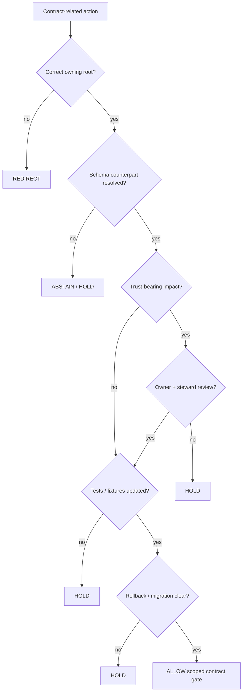

<!-- [KFM_META_BLOCK_V2]
doc_id: kfm://policy/contract
title: Contract Policy README
type: policy-readme
version: v0.1
status: draft
owners: OWNER_TBD — Policy steward · Contract steward · Schema steward · Architecture steward · Docs steward
created: 2026-06-15
updated: 2026-06-15
policy_label: restricted
related:
  - ../README.md
  - ../bundles/README.md
  - ../../contracts/README.md
  - ../../schemas/contracts/v1/
  - ../../docs/architecture/contract-schema-policy-split.md
  - ../../docs/adr/ADR-0002-contracts-vs-schemas-split.md
  - ../../docs/adr/ADR-0001-schema-home--schemas-contracts-v1-is-canonical.md
  - ../../docs/doctrine/trust-membrane.md
  - ../../docs/doctrine/directory-rules.md
  - ../../packages/policy-runtime/README.md
  - ../../tests/README.md
tags: [kfm, policy, contract, contracts, semantic-meaning, admissibility, schema-split, review]
notes:
  - "Initial README for policy/contract."
  - "This path is for admissibility rules around contract-related changes; it is not the semantic contract authority."
  - "Contract meaning belongs in contracts/ and machine shape belongs in schemas/contracts/v1/."
  - "Runtime enforcement, fixtures, tests, policy modules, bundle registration, and review workflows remain NEEDS VERIFICATION."
[/KFM_META_BLOCK_V2] -->

<a id="top"></a>

<div align="center">

# Contract Policy

`policy/contract/`

**Policy lane for contract-related admissibility checks: whether a proposed object contract, contract change, or contract-bound payload may proceed through governed review and validation gates.**


[Scope](#1-scope) · [Repo fit](#2-repo-fit) · [Boundary](#3-authority-boundary) · [Inputs](#5-inputs) · [Exclusions](#6-exclusions) · [Diagram](#8-diagram) · [Definition of done](#14-definition-of-done)

</div>

---

> [!IMPORTANT]
> **Status:** draft / `NEEDS VERIFICATION`  
> **Owners:** `OWNER_TBD` — Policy steward · Contract steward · Schema steward · Architecture steward · Docs steward  
> **Path:** `policy/contract/README.md`  
> **Responsibility root:** `policy/` — policy-as-code and policy documentation  
> **Truth posture:** CONFIRMED file path / PROPOSED contract-policy lane / UNKNOWN runtime enforcement

> [!CAUTION]
> This directory must not become a second `contracts/` root. Contract meaning belongs in `contracts/`; machine shape belongs in `schemas/contracts/v1/`; this lane may only express policy decisions about whether contract-related work may pass a governed gate.

---

## Quick jump

- [1. Scope](#1-scope)
- [2. Repo fit](#2-repo-fit)
- [3. Authority boundary](#3-authority-boundary)
- [4. Default posture](#4-default-posture)
- [5. Inputs](#5-inputs)
- [6. Exclusions](#6-exclusions)
- [7. Contract gate lifecycle](#7-contract-gate-lifecycle)
- [8. Diagram](#8-diagram)
- [9. Decision vocabulary](#9-decision-vocabulary)
- [10. Contract-policy obligations](#10-contract-policy-obligations)
- [11. Change and rollback posture](#11-change-and-rollback-posture)
- [12. Inspection path](#12-inspection-path)
- [13. Validation expectations](#13-validation-expectations)
- [14. Definition of done](#14-definition-of-done)
- [15. Open verification items](#15-open-verification-items)

---

## 1. Scope

`policy/contract/` is a proposed policy lane for admissibility checks around contract-related work.

It should describe and eventually bind checks for whether a contract proposal, contract update, object-family change, field-invariant change, or contract-bound payload may proceed through review, validation, promotion, or publication-adjacent gates.

In scope:

- contract-change gate posture
- reviewer requirements for trust-bearing contract changes
- checks that contract, schema, policy, tests, fixtures, and docs remain separated
- checks that contract-bound objects have required evidence, sensitivity, rights, release, or rollback context where applicable
- finite policy outcomes for contract-related review gates

Out of scope:

- writing semantic contract content
- JSON Schema definitions
- executable application code
- release approval
- lifecycle data storage
- receipt and proof storage
- source acquisition
- public UI implementation

[Back to top](#top)

---

## 2. Repo fit

| Concern | Owning root | Expected relationship |
|---|---|---|
| Contract policy gates | `policy/contract/` | This README; active policy files remain `NEEDS VERIFICATION` |
| Contract meaning | `contracts/` | Semantic authority for object families and field intent |
| Machine-readable shape | `schemas/contracts/v1/` | Schema authority for contract-shaped payloads |
| Four-layer split explanation | `docs/architecture/contract-schema-policy-split.md` | Meaning / shape / admissibility / proof split |
| Policy bundles | `policy/bundles/` | Bundle packaging or manifest lane when used |
| Runtime policy evaluation | `packages/policy-runtime/` | Evaluator helper code; not policy authority |
| Tests and fixtures | `tests/`, `fixtures/` | Proof that behavior is enforceable |
| Release decisions | `release/` | Publication, correction, supersession, and rollback authority |

## 3. Authority boundary

This lane may decide whether a contract-related action can pass a policy gate. It must not define what the contract means or what the machine shape is.

```text
policy/contract/       = admissibility gates for contract-related actions
contracts/             = semantic meaning and object-family intent
schemas/contracts/v1/   = machine-readable shape
tests/ + fixtures/     = enforceability proof
release/               = publication, correction, rollback control
data/                  = lifecycle state, receipts, proofs, artifacts
```

## 4. Default posture

Contract policy should hold or abstain when authority or proof is missing.

A contract-related action should not proceed when any of these are unresolved:

- owning contract root
- object-family owner
- schema counterpart
- policy impact
- tests and fixtures
- backward-compatibility posture
- evidence dependency
- sensitivity, rights, or release impact
- migration and rollback target
- reviewer class
- documentation update path

## 5. Inputs

| Input family | Examples | Required posture |
|---|---|---|
| Contract reference | contract path, object family, field, invariant, version | Must resolve to `contracts/` or a verified contract home |
| Schema reference | schema path, `$id`, version, validation profile | Must resolve to `schemas/contracts/v1/` or accepted schema home |
| Proposed action | create, update, deprecate, split, merge, rename, promote | Explicit and reviewable |
| Impact context | public API impact, release impact, sensitive-domain impact, compatibility | Truth-labeled and reviewed |
| Evidence context | EvidenceRef, EvidenceBundle dependency, source role, citation requirement | Required when claims depend on evidence |
| Validation context | tests, fixtures, validator output, policy decision examples | Required before stronger readiness claims |
| Rollback context | rollback target, migration note, supersession note, correction note | Required for trust-bearing changes |

## 6. Exclusions

| Does not belong here | Correct home |
|---|---|
| Semantic contract Markdown | `contracts/` |
| JSON Schema files | `schemas/contracts/v1/` |
| Runtime evaluator implementation | `packages/policy-runtime/` |
| Public API routes or UI code | `apps/` or governed UI packages |
| Release manifests and rollback authority | `release/` |
| Lifecycle data and artifacts | `data/` lifecycle roots |
| Receipts and proof storage | verified receipt / proof homes |
| Source descriptors and registries | verified source / catalog / registry homes |
| Broad doctrine and architecture explanation | `docs/` |

## 7. Contract gate lifecycle

| State | Meaning | Policy posture |
|---|---|---|
| `draft` | Contract change is being written | Not active; requires review path |
| `candidate` | Contract change is ready for validation | May run policy/tests in validation only |
| `reviewed` | Required stewards reviewed the change | Eligible for staged adoption |
| `active` | Contract version may be used by governed flows | Requires schema/test/policy alignment where applicable |
| `deprecated` | Contract remains available but should not be newly selected | New work should use successor |
| `superseded` | Contract replaced by successor | Retain for replay and audit |
| `withdrawn` | Contract change must not be used | Runtime gates should hold or route to replacement |

## 8. Diagram



## 9. Decision vocabulary

| Decision | Meaning | Required behavior |
|---|---|---|
| `ALLOW` | Contract-related action may proceed under stated obligations | Scope to action and version |
| `DENY` | Action violates root authority, safety, or governance | Block or redirect |
| `REDIRECT` | Proposed content belongs in another responsibility root | Name correct home when known |
| `HOLD` | Human review, migration, tests, or rollback support is required | Do not promote |
| `ABSTAIN` | Policy cannot decide because support is missing | Block and name missing support where safe |
| `ERROR` | Runtime, schema, repository, or validator failure | Stop and record failure |

## 10. Contract-policy obligations

| Obligation | Example effect |
|---|---|
| `schema_alignment_required` | Schema counterpart must be updated or intentionally unchanged |
| `fixture_required` | Valid, invalid, denied, and abstain fixtures are required |
| `review_required` | Contract steward or domain steward must review |
| `migration_note_required` | Rename, split, merge, or breaking change needs migration notes |
| `rollback_required` | Trust-bearing change needs rollback target |
| `release_check_required` | Public or release-adjacent change must go through release gate |
| `sensitivity_review_required` | Sensitive-domain fields require policy review |
| `docs_update_required` | Downstream docs and examples must be updated or marked unchanged |

## 11. Change and rollback posture

Contract changes can alter the meaning of records already published or reviewed. Treat them as trust-bearing unless proven otherwise.

Required posture:

- preserve old contract versions when replay or audit depends on them
- document breaking changes and migration notes
- keep correction and rollback paths visible for public-impacting changes
- keep contract, schema, policy, and test changes separate but linked
- do not infer release approval from contract acceptance
- do not mark generated contract text as confirmed without evidence and review

## 12. Inspection path

Contract-policy modules, fixtures, tests, validators, and CI remain `NEEDS VERIFICATION`.

```bash
find policy/contract -maxdepth 4 -type f | sort
find contracts schemas/contracts/v1 -maxdepth 4 -type f | sort
find tests fixtures -maxdepth 5 -type f 2>/dev/null | grep -E 'contract|schema|policy|fixture' | sort
```

## 13. Validation expectations

Useful validation for this lane should cover:

- contract content proposed under `policy/contract/` returns `REDIRECT`
- schema content proposed under `policy/contract/` returns `REDIRECT`
- missing schema counterpart returns `ABSTAIN` or `HOLD`
- missing fixtures returns `HOLD`
- breaking contract change without migration note returns `HOLD`
- trust-bearing contract change without steward review returns `HOLD`
- public-impacting contract change without rollback target returns `HOLD`
- generated contract text without evidence remains `PROPOSED`, not `CONFIRMED`

## 14. Definition of done

- [ ] Owners are confirmed and `OWNER_TBD` is replaced.
- [ ] Runtime policy language and bundle location are confirmed.
- [ ] Policy fixtures cover allow, deny, redirect, hold, abstain, and error outcomes.
- [ ] Contract/schema alignment checks are implemented or linked.
- [ ] Review requirements by contract impact class are documented.
- [ ] Migration and rollback requirements are enforced for breaking changes.
- [ ] Release-adjacent contract changes remain separate from release approval.
- [ ] CI or validator coverage is documented or linked.

## 15. Open verification items

| Item | Why it matters |
|---|---|
| Confirm whether `policy/contract/` is accepted or should be `policy/contracts/` | Prevents naming drift |
| Confirm policy runtime language | Prevents non-runnable policy guidance |
| Confirm contract/schema validator paths | Required for enforceability |
| Confirm tests and fixtures | Required before active enforcement |
| Confirm reviewer classes | Required for trust-bearing contract changes |
| Confirm bundle registration | Required for runtime policy use |
| Confirm rollback process | Required for safe contract evolution |

<details>
<summary>Appendix A — no-loss preservation note</summary>

The target file was an empty placeholder. This README adds a bounded contract-policy lane without claiming runtime enforcement, policy modules, tests, fixtures, bundle registration, CI coverage, or reviewer assignments.

It preserves the KFM four-layer split: `contracts/` owns meaning, `schemas/contracts/v1/` owns machine shape, `policy/` owns admissibility, and `tests/` plus `fixtures/` own enforceability proof.

</details>

## Status summary

`policy/contract/` should define admissibility gates for contract-related actions only if this singular policy lane is accepted.

It should protect the contract/schema/policy/test split while ensuring trust-bearing contract changes remain reviewed, validated, migration-aware, release-separated, and rollback-capable.

<p align="right"><a href="#top">Back to top</a></p>
