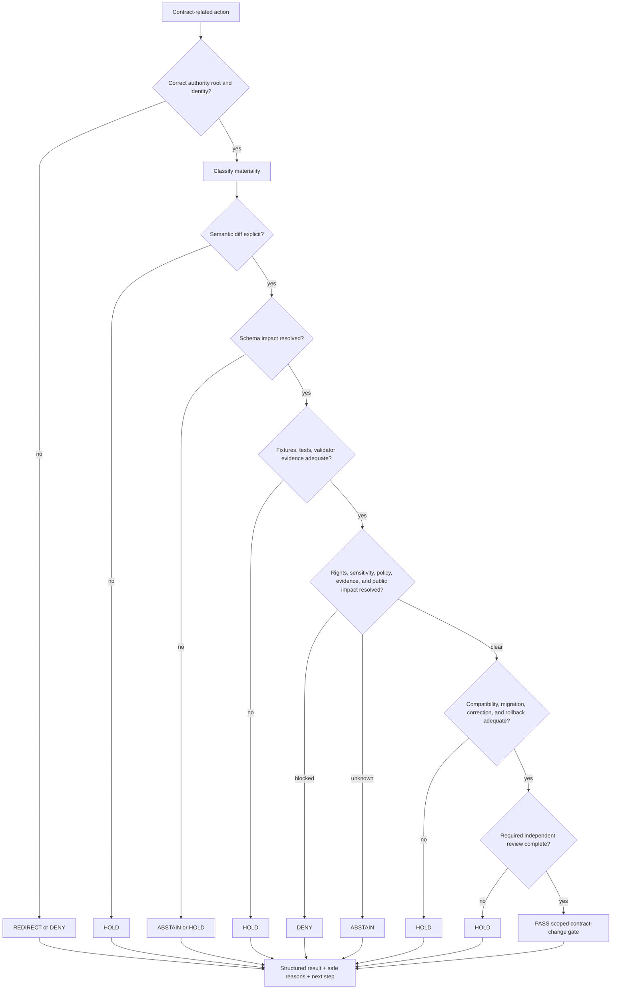

<!-- [KFM_META_BLOCK_V2]
doc_id: kfm://policy/contract
title: policy/contract/ — Contract-Change Admissibility Boundary
type: policy-readme; directory-readme; contract-change-gate-boundary
version: v0.3
status: draft; repository-grounded; readme-only-direct-lane; contract-schema-ci-confirmed; structural-policy-boundary-guards-confirmed; contract-policy-enforcement-not-established
owners: OWNER_TBD — Policy steward · Contract steward · Schema steward · Architecture steward · Validation steward · Release steward · Docs steward
created: 2026-06-15
updated: 2026-07-22
policy_label: "public-governance; restricted-review; contract-policy-boundary; fail-closed; no-semantic-authority; no-schema-authority; no-release-authority"
current_path: policy/contract/README.md
owning_root: policy/
responsibility: admissibility posture for contract-related repository actions; determines whether a proposed contract change has enough authority, paired shape, review, validation, migration, compatibility, evidence, policy, and rollback support to proceed without redefining contract meaning, schema shape, release state, or implementation behavior
truth_posture: CONFIRMED target path, singular policy-root placement across the inspected Directory Rules sources, canonical contracts root, repository machine-schema convention with ADR-0001 still proposed, current make test / make validate / make boundary-guards command wiring, selected schema-fixture coverage, README-only direct tests/contracts and policy/contract lanes, expanded policy-test readiness holds, 15-test structural policy-boundary suite, placeholder policy runtime, README-only bundle lane, and README-only policy-validator lane / PROPOSED contract-change classification, gate inputs, obligations, reviewer classes, and executable enforcement sequence / CONFLICTED three Directory Rules copies with overlapping placement authority and two doc identities / UNKNOWN branch-protection requirements, current workflow pass rates, accepted evaluator and bundle selection, exhaustive contract/schema pairing, runtime consumers, and release-gate integration / NEEDS VERIFICATION accepted owners, child-lane naming ratification, direct contract-policy Rego module, contract-policy fixtures and tests, reason-code registry, validator entry point, bundle registration, contract-policy receipts, separation of duties, and rollback automation
evidence_snapshot:
  repository: bartytime4life/Kansas-Frontier-Matrix
  visibility: public
  base_ref: main
  base_commit: 91a2df5aa12c0a060167bc8b79716caf0f04ee35
  prior_blob: 3d75be8c9f1269d58e7db3a10b6234e2fd4d1d90
  prior_snapshot_base: aebbca0f18fe8cd907b36b267cc5372a636830d8
  inventory_method: GitHub connector file reads at the pinned commit, a base comparison from the v0.2 snapshot, and bounded repository code, branch, duplicate-identity, workflow-threat, and open-pull-request searches
  direct_lane_files_confirmed:
    - policy/contract/README.md
  bounded_inventory_note: no competing policy/contracts lane, direct contract-policy Rego module, direct fixture/test module, dedicated validator, bundle registration, runtime consumer, contract-policy receipt emitter, or release integration was established by the bounded searches; the prior v0.2 branch remains visible, but no overlapping open pull request was surfaced; this is not proof of permanent absence
related:
  - ../README.md
  - ../bundles/README.md
  - ../decision/README.md
  - ../../contracts/README.md
  - ../../contracts/policy/README.md
  - ../../schemas/contracts/v1/policy/README.md
  - ../../tests/contracts/README.md
  - ../../tests/schemas/test_common_contracts.py
  - ../../tools/validators/policy/README.md
  - ../../packages/policy-runtime/README.md
  - ../../docs/architecture/contract-schema-policy-split.md
  - ../../docs/architecture/directory-rules.md
  - ../../docs/architecture/DIRECTORY_RULES.md
  - ../../docs/doctrine/directory-rules.md
  - ../../docs/adr/ADR-0001-schema-home--schemas-contracts-v1-is-canonical.md
  - ../../docs/adr/ADR-0002-contracts-vs-schemas-split.md
  - ../../docs/adr/ADR-0003-policy-singular-is-canonical-(policies-is-compatibility).md
  - ../../docs/registers/POLICY_GATE.md
  - ../../docs/registers/DRIFT_REGISTER.md
  - ../../.github/workflows/contracts-validate.yml
  - ../../.github/workflows/policy-test.yml
  - ../../.github/workflows/policy-boundary-guards.yml
  - ../../.github/workflows/validator-suite.yml
  - ../../.github/workflows/link-check.yml
  - ../../data/receipts/generated/README.md
  - ../../Makefile
tags: [kfm, policy, contracts, contract-change, admissibility, governance, schemas, fixtures, validators, migration, compatibility, rollback, fail-closed]
notes:
  - "v0.3 preserves the v0.2 authority split and proposed gate model while refreshing the repository evidence boundary after 277 intervening commits."
  - "The existing path is retained. This documentation revision adds one generated-work receipt but creates no policy rule, contract, schema, fixture, test, validator, runtime behavior, proof, release, or lifecycle artifact."
  - "Three Directory Rules copies are repository-present: lowercase architecture v1.3.1, uppercase architecture v1, and doctrine v1.4. Their canonical placement and supersession conflict remains unresolved and is not settled here."
  - "A policy/contract README, structural boundary test, generated receipt, schema-valid fixture, or green workflow is not executable contract-change policy and does not authorize release or publication."
[/KFM_META_BLOCK_V2] -->

<a id="top"></a>

# Contract-Change Admissibility Boundary

`policy/contract/`

> **One-line purpose.** Define the fail-closed policy boundary for deciding whether a contract-related repository action may proceed to validation or review, while leaving semantic meaning to `contracts/`, machine shape to `schemas/contracts/v1/`, enforceability to fixtures/tests/validators, and release authority to `release/`.


**Quick navigation:** [Status](#status-and-evidence-boundary) · [Purpose](#purpose) · [Authority](#authority-boundary) · [Repository fit](#repository-fit) · [Current state](#confirmed-current-state) · [Change classes](#contract-change-classes) · [Inputs](#required-gate-input) · [Gate model](#contract-change-gate-model) · [Outcomes](#outcomes-and-normalization) · [Obligations](#obligations) · [Validation](#validation-and-negative-cases) · [CI](#ci-and-workflow-boundary) · [Security](#security-rights-sensitivity-and-public-impact) · [Rollback](#migration-correction-supersession-and-rollback) · [Implementation](#smallest-sound-implementation-sequence) · [Done](#definition-of-done) · [Open](#open-verification-register) · [Evidence](#evidence-ledger) · [Changelog](#changelog)

> [!IMPORTANT]
> **CONFIRMED current state:** this path exists under the singular `policy/` root, and the three inspected Directory Rules sources agree that policy/admissibility belongs there. Bounded search surfaced no competing `policy/contracts/` lane or overlapping open pull request; the prior v0.2 task branch remains visible. The direct lane remains README-only.
>
> **CONFIRMED adjacent enforcement:** contract/schema CI runs repository-owned tests, selected schemas have valid/invalid fixture coverage, and a separate command-bearing suite runs 15 structural policy/API boundary tests. That suite is not a contract-change policy gate and its path filter does not include this README.
>
> **NOT ESTABLISHED:** a contract-policy Rego module, direct contract-policy fixtures and tests, dedicated validator, accepted bundle selection, functional policy runtime, emitted contract-policy decision receipt, or release-gate integration.

> [!CAUTION]
> This directory must never become a second contract or schema authority. A policy gate may decide whether a proposed action is admissible under supplied context; it may not define what an object means, invent a field shape, create evidence, approve release, or treat generated text as reviewed truth.

---

## Status and evidence boundary

This README is grounded to `main@91a2df5aa12c0a060167bc8b79716caf0f04ee35`, which is 277 commits ahead of the v0.2 evidence snapshot. Statements about current repository presence are bounded to the files, comparison, and searches listed in the [evidence ledger](#evidence-ledger). Workflow definitions were inspected, but current run results, branch protection, deployment, and production enforcement were not established during authoring.

| Surface | Status | Safe conclusion |
|---|---:|---|
| `policy/contract/README.md` | **CONFIRMED** | This boundary document exists and is the only direct-lane file established by bounded search. |
| `policy/contract/` placement | **CONFIRMED current path / doctrine-aligned** | All three inspected Directory Rules copies place admissibility under singular `policy/`; no move or parallel lane is justified by inspected evidence. |
| Directory Rules source set | **CONFLICTED / NEEDS VERIFICATION** | Lowercase architecture v1.3.1, uppercase architecture v1, and doctrine v1.4 copies overlap; the placement rule used here agrees across them, but canonical document identity and supersession remain unresolved. |
| `policy/contracts/` competitor | **NOT SURFACED** | No competing child lane was found. This does not ratify a permanent naming convention by itself. |
| Contract semantic root | **CONFIRMED** | `contracts/` is the repository-facing semantic-meaning root. |
| Machine-schema convention | **CONFIRMED repository path / ADR still proposed** | Machine shapes use `schemas/contracts/v1/`; ADR-0001 remains proposed. |
| Contract/schema fixture harness | **CONFIRMED code** | `tests/schemas/test_common_contracts.py` validates valid and invalid fixtures for selected schema families. |
| Direct semantic-contract suite | **NOT ESTABLISHED** | `tests/contracts/` is README-only in its bounded evidence; complete semantic enforcement is not proved. |
| Contract/schema CI | **CONFIRMED workflow wiring** | `contracts-validate` runs `make test` with read-only repository permission. Current pass result and required-check status are unknown. |
| Contract-policy Rego module | **NOT ESTABLISHED** | No direct executable policy module was found in this lane. |
| Policy-test behavior | **CONFIRMED readiness holds** | Two command-bearing readiness jobs verify that accepted OPA evaluation, bundle activation, policy-runtime behavior, and complete policy fixture coverage remain unwired; they do not execute policy or emit `PolicyDecision`. |
| Structural policy-boundary suite | **CONFIRMED adjacent executable coverage** | `make boundary-guards` / `make boundary-guards-ci` run 15 structural/static/API tests in four modules. This is not contract-change policy evaluation, and the workflow path filter excludes this README and generated receipts. |
| Policy validators | **README-only direct validator lane** | `tools/validators/policy/` contains routing documentation and no established executable validator. |
| Policy runtime | **CONFIRMED placeholder** | Package version is `0.0.0`; functional evaluator, exports, consumers, and package tests are not established. |
| Policy bundles | **CONFIRMED README-only** | No accepted bundle artifact, manifest, selector, evaluator binding, or activation is established. |
| Contract-policy receipts and release use | **UNKNOWN / NEEDS VERIFICATION** | No accepted receipt flow, promotion dependency, or runtime consumer was proved. |

### Truth labels

| Label | Use in this README |
|---|---|
| `CONFIRMED` | Verified from current repository files or bounded connector search at the pinned base. |
| `PROPOSED` | Recommended contract-change behavior not established as current implementation. |
| `UNKNOWN` | Not resolvable from inspected evidence. |
| `NEEDS VERIFICATION` | Checkable, but unresolved strongly enough to act as fact. |
| `DENY` | A proposed action would collapse authority, bypass a trust boundary, or expose unsupported material. |

---

## Purpose

`policy/contract/` is the human-facing policy boundary for contract-related repository actions.

It should answer one bounded question:

> Does this proposed contract action have the authority, paired machine shape, evidence context, policy context, validation support, review path, compatibility plan, migration path, and rollback support required to proceed to its next governed state?

This README is for contract stewards, schema stewards, policy reviewers, validation maintainers, domain owners, release stewards, documentation maintainers, and coding agents reviewing changes to trust-bearing object meaning.

### In scope

- classifying contract-related actions and their materiality;
- checking responsibility-root placement;
- requiring the correct schema posture without authoring schema content;
- requiring fixtures, tests, validators, review, migration, and rollback when material;
- checking evidence, rights, sensitivity, public-interface, and release impact;
- returning bounded gate outcomes and obligations;
- routing unsupported work to the correct responsibility root;
- preserving replay, deprecation, supersession, and correction support.

### Out of scope

- writing canonical semantic contract content;
- defining JSON Schema or DTO fields;
- implementing the policy runtime or evaluator;
- storing policy bundles, receipts, proofs, lifecycle data, or release records;
- approving lifecycle promotion, merge, release, deployment, or publication;
- changing source authority, evidence status, rights, sensitivity, or consent facts;
- implementing public API, map, UI, export, or AI behavior;
- turning CI completion, file presence, or generated prose into policy permission.

---

## Authority boundary

The lane is authoritative only as reviewed policy documentation for contract-change admissibility. It is non-authoritative for every adjacent responsibility until executable policy and tests are accepted.

| Responsibility | Authority home | Role of `policy/contract/` |
|---|---|---|
| Contract meaning and invariants | `contracts/` | Inspect references and impact; never redefine meaning here. |
| Machine-checkable shape | `schemas/contracts/v1/` | Require or waive a paired-shape change with explicit rationale; never author shape here. |
| Admissibility rules | accepted modules under `policy/` | This lane may host future contract-change policy source, but no executable module is established now. |
| Policy bundle packaging | `policy/bundles/` | Require an accepted bundle reference when runtime evaluation exists; never activate by directory presence. |
| Runtime evaluation mechanics | `packages/policy-runtime/` | Consume an accepted evaluator result when implemented; never treat placeholder code as enforcement. |
| Fixtures | accepted `fixtures/` or test-local fixture lane | Require deterministic positive and negative examples where material. |
| Tests | `tests/` | Prove boundary behavior; no complete direct semantic suite is established. |
| Validator implementation | `tools/validators/` | Invoke an accepted validator; none is established for this lane. |
| Governance indexes | `control_plane/`, `docs/registers/` | Cross-check ownership, gate identity, deprecation, and drift. |
| Receipts and proofs | `data/receipts/`, `data/proofs/` | Reference emitted records; never store them here. |
| Release, correction, withdrawal, rollback | `release/` | Require relevant support; never approve it here. |
| Public behavior | governed application and runtime roots | Require downstream compatibility evidence; never become a public path. |

```text
policy/contract/          = contract-change admissibility boundary
contracts/                = semantic meaning and invariants
schemas/contracts/v1/     = machine-checkable shape
tests/ + fixtures/        = deterministic enforceability evidence
tools/validators/         = executable validation
packages/policy-runtime/  = future evaluation mechanics
control_plane/            = machine-readable governance indexes
data/receipts + proofs/   = emitted process memory and proof
release/                  = release, correction, withdrawal, rollback authority
```

A trust-bearing object family is not implementation-ready merely because one row exists. Meaning, shape, policy, fixtures, tests, validators, registry state, migration, and release impact must be evaluated separately and linked where applicable.

---

## Repository fit

### Directory Rules basis

`policy/contract/README.md` explains an admissibility boundary under the singular `policy/` responsibility root. The three inspected Directory Rules copies disagree about their own canonical location and supersession, but all assign allow/deny/restrict/abstain or admissibility responsibility to `policy/`. That shared placement rule, the existing path, and current contribution guidance support retaining this lane without using the document conflict to create a new home.

- No root is added, removed, moved, or renamed.
- No parallel contract, schema, policy, registry, proof, receipt, or release home is created.
- The singular policy root remains canonical; ADR-0003 is repository-present but still proposed.
- The child name `contract/` is retained because it is the current repository path and no competing `contracts/` child lane was found.
- Ratifying a repo-wide child-lane naming law remains a separate governance decision.

### Directory Rules document conflict

The repository contains three overlapping Directory Rules artifacts:

| Path | Version and identity | Current posture |
|---|---|---|
| `docs/architecture/directory-rules.md` | v1.3.1 · `kfm://doc/directory-rules` | Lowercase architecture copy; current contribution guidance uses it for preflight while recording its placement as unresolved. |
| `docs/architecture/DIRECTORY_RULES.md` | v1 · `kfm://doc/directory-rules` | Older same-identity copy with nonconforming casing; explicitly `PROPOSED / CONFLICTED`. |
| `docs/doctrine/directory-rules.md` | v1.4 · `kfm://doc/doctrine/directory-rules` | Doctrine copy that names itself the proposed home and carries a distinct document identity. |

This README links all three, uses only their shared `policy/` responsibility rule, and does not select a winner, create another copy, or modify the drift register. Canonical identity, version ordering, and supersession require a separate ADR/migration decision.

### Authority and supersession graph

| Artifact | Current posture | Relationship to this README |
|---|---:|---|
| `docs/architecture/directory-rules.md` | repository-present v1.3.1 / review | Current contribution-preflight basis; canonical placement remains unresolved. |
| `docs/architecture/DIRECTORY_RULES.md` | repository-present v1 / draft / same identity as lowercase copy | Older conflicted duplicate; not selected as a separate authority. |
| `docs/doctrine/directory-rules.md` | repository-present v1.4 / draft / distinct identity | Proposed doctrine home; overlaps the architecture copies. |
| `contracts/README.md` | repository-present canonical semantic root | Upstream authority boundary. |
| ADR-0001 | repository-present / `proposed` | Proposed canonical machine-schema home. |
| ADR-0002 | repository-present / `draft` | Proposed contracts-schemas-policy-fixtures-tests-validators split. |
| ADR-0003 | repository-present / `proposed` | Proposed singular policy-root decision. |
| `docs/registers/POLICY_GATE.md` | repository-present / draft register | Human-facing gate vocabulary; not executable policy. |
| `policy/bundles/README.md` | repository-present / README-only lane | Future immutable bundle boundary; no accepted activation. |
| `tests/contracts/README.md` | repository-present / direct README-only lane | Intended semantic enforceability boundary. |
| `tools/validators/policy/README.md` | repository-present / README-only routing index | Future executable validator relationship. |
| `packages/policy-runtime/README.md` | repository-present / greenfield placeholder | Future evaluation helper boundary. |

No inspected artifact supersedes this path. This v0.3 revision supersedes v0.2 at the same path; v0.2 already preserved and superseded the v0.1 content.

---

## Confirmed current state

### Direct lane inventory

| Path | Status | Interpretation |
|---|---:|---|
| `policy/contract/README.md` | **CONFIRMED** | Current documentation boundary. |
| direct `.rego` module | **NOT ESTABLISHED** | No executable contract-change policy was surfaced. |
| direct fixture family | **NOT ESTABLISHED** | No contract-policy positive or negative fixtures were surfaced. |
| direct test module | **NOT ESTABLISHED** | No executable test for this lane was surfaced. |
| dedicated validator | **NOT ESTABLISHED** | No accepted contract-policy validator entry point was surfaced. |
| bundle registration or active selector | **NOT ESTABLISHED** | No runtime activation or bundle binding is proved. |
| emitted PolicyDecision or policy receipt flow | **NOT ESTABLISHED** | This README emits no decision or receipt. |

### Adjacent executable evidence

`tests/schemas/test_common_contracts.py` discovers schemas in selected families, finds matching fixture directories, requires valid fixtures to pass, and requires invalid fixtures to fail. That is useful machine-shape evidence. It does not prove:

- semantic completeness of every Markdown contract;
- contract-to-schema equivalence;
- contract-change policy evaluation;
- compatibility or migration safety;
- domain-steward review;
- public API or release readiness.

`contracts-validate.yml` executes `make test`; the Makefile currently scopes that command to `tests/schemas` and `tests/contracts`. The direct `tests/contracts/` lane remains README-only in its own repository-grounded inventory.

`policy-test.yml` remains a readiness-hold workflow, but its implementation is now more explicit than at the v0.2 snapshot. Two standard-library inspection jobs confirm that Rego sources exist elsewhere under `policy/` while Rego test modules, an accepted OPA command, non-README bundle artifacts, evaluator binding, functional policy runtime, dedicated policy validators, and complete policy fixture coverage remain absent. The jobs deliberately fail on maturity drift so real evaluation can be wired through a separately reviewed change; they do not execute policy.

`policy-boundary-guards.yml` is a separate command-bearing workflow. Its Make target runs 15 structural/static/API tests across control-plane metadata, explorer adapter/store boundaries, connector/pipeline non-publication, and governed API boundaries, with JUnit output. This is useful adjacent enforcement, not contract-change policy evaluation. Its path filters do not include `policy/contract/README.md` or `data/receipts/generated/`, so this documentation update does not directly trigger that suite.

---

## Contract-change classes

The following classification is **PROPOSED**. A future executable policy must bind these classes to stable inputs, reason codes, obligations, tests, and reviewer requirements.

| Change class | Examples | Default review posture | Minimum additional support |
|---|---|---|---|
| `editorial` | spelling, formatting, link repair, clarification with no semantic effect | standard contract/docs review | diff proves meaning and machine shape are unchanged |
| `compatible_semantic` | clearer invariant, additive optional meaning, non-breaking documentation | contract owner plus affected consumer review | schema-impact statement, targeted tests where behavior is claimed |
| `shape_coupled` | semantic change that requires schema or fixture updates | contract + schema + validation review | paired schema posture, valid/invalid fixtures, validator/test result |
| `policy_coupled` | rights, sensitivity, admissibility, obligations, audience, or release behavior changes | contract + policy + affected steward review | policy impact, negative cases, reason codes, obligation handling |
| `consumer_coupled` | API, UI, map, export, pipeline, connector, or runtime interpretation changes | contract + affected consumer owner | compatibility tests and bounded rollout plan |
| `breaking` | required field removal/change, invariant reversal, identity change, split, merge, rename | multi-surface review and migration hold | versioning, migration, replay, deprecation, correction, rollback |
| `release_significant` | alters meaning of a released claim or public trust surface | independent release/policy review | release impact, correction/withdrawal posture, rollback target |
| `authority_structural` | moves meaning, creates parallel home, changes canonical root or schema authority | `DENY` or `HOLD` pending accepted ADR | ADR, drift entry, migration plan, compatibility and rollback |

### Materiality rule

Treat a change as the most protective applicable class. An editorial label must not hide a semantic, policy, compatibility, evidence, or public-impact change.

---

## Required gate input

A future contract-change policy should evaluate an explicit, complete input bundle. It must not infer missing facts from prose, path names, model output, repository memory, or UI state.

| Input family | Minimum content | Fail-closed behavior when unresolved |
|---|---|---|
| Action identity | action id, operation, actor/ref, target contract path, base and candidate hashes | `ERROR` or `HOLD` |
| Contract identity | document id, family, version, status, owner posture, supersession links | `ABSTAIN` or `HOLD` |
| Placement context | owning root, Directory Rules basis, ADR references, compatibility class | `REDIRECT`, `DENY`, or `HOLD` |
| Semantic diff | changed definitions, invariants, exclusions, lifecycle meaning, compatibility claims | `HOLD` |
| Schema posture | paired schema path/version, changed/unchanged rationale, validation result | `ABSTAIN` or `HOLD` |
| Fixture/test posture | positive and negative fixtures, test paths, observed outcomes | `HOLD` |
| Validator posture | accepted entry point, version/digest when material, structured result | `ERROR` or `HOLD` |
| Policy context | rights, sensitivity, consent, audience, obligations, bundle/evaluator refs when implemented | `DENY`, `ABSTAIN`, or `HOLD` |
| Evidence context | EvidenceRefs and resolver state when the contract governs claim-bearing objects | `ABSTAIN` |
| Consumer impact | API/UI/runtime/pipeline/export consumers, compatibility evidence, rollout | `HOLD` |
| Release impact | current release state, published instances, correction/withdrawal need | `DENY` or `HOLD` |
| Migration and rollback | migration id, old/new version mapping, replay support, rollback target | `HOLD` |
| Review context | required reviewer classes, completed review records, separation of duties | `HOLD` |

Input validation proves only that the gate received an accepted shape. It does not prove that the supplied facts are true, complete, current, or authorized.

---

## Contract-change gate model

The gate below is a **PROPOSED decision model**, not current executable behavior.



A `PASS` permits only the stated next repository step. It is not merge approval, policy activation, lifecycle promotion, release approval, or publication authority.

---

## Outcomes and normalization

The repository uses multiple finite vocabularies for different layers. This README must not flatten them.

### Contract-change workflow outcomes

| Outcome | Meaning | Required behavior |
|---|---|---|
| `PASS` | Declared contract-change conditions are satisfied for the scoped next step | Preserve scope, evidence, obligations, and review state |
| `FAIL` | A deterministic declared check failed | Block and report the failed check |
| `REDIRECT` | Proposed content belongs under another responsibility root | Name the verified home when known; do not duplicate authority |
| `HOLD` | Review, migration, validation, compatibility, correction, or rollback support is pending | Do not merge or promote |
| `ABSTAIN` | Required evidence or authority context cannot be resolved | Block and name missing support safely |
| `DENY` | The action violates policy, authority, sensitivity, rights, or trust-membrane requirements | Block without leaking protected details |
| `ERROR` | Gate machinery, repository resolution, schema loading, or validator execution failed | Fail closed; no policy conclusion is valid |

### Runtime normalization boundary

Canonical `PolicyDecision` and `DecisionEnvelope` shapes currently use primary outcomes such as `ANSWER`, `ABSTAIN`, `DENY`, and `ERROR`. Lower-level `PASS`, `FAIL`, `REDIRECT`, or `HOLD` values must be normalized through an accepted mapping before a governed runtime consumes them.

Do not store an unmapped lower-level result in a field whose schema permits only the canonical runtime vocabulary. Do not invent free-text states such as `maybe`, `best_effort`, or `looks_safe`.

---

## Obligations

A non-denied result may carry obligations. Downstream callers must preserve them until an accepted consumer proves completion.

| Obligation | Typical trigger | Required effect |
|---|---|---|
| `schema_alignment_required` | semantic change affects machine shape | update or explicitly justify unchanged schema |
| `fixture_required` | new or changed positive/negative behavior | add deterministic fixtures in the accepted lane |
| `validator_required` | machine-checkable invariant is introduced | add accepted validator and structured result |
| `review_required` | trust-bearing or domain-significant change | route to verified reviewer class |
| `policy_review_required` | rights, sensitivity, consent, access, obligations, or release behavior changes | hold until policy review completes |
| `evidence_review_required` | contract governs claim-bearing objects | verify EvidenceRef/EvidenceBundle posture |
| `migration_note_required` | rename, split, merge, identity change, or breaking semantics | document old-to-new mapping and replay |
| `deprecation_required` | old version remains readable but should not be newly selected | preserve successor and deprecation window |
| `correction_review_required` | released claims may change meaning | assess correction or withdrawal |
| `rollback_required` | material or public-impacting change | provide tested or reviewable rollback target |
| `consumer_update_required` | API/UI/runtime/pipeline interpretation changes | update consumers and compatibility tests |
| `release_check_required` | change affects released or public-bound behavior | route through release authority; do not infer approval |
| `docs_update_required` | related explanations or examples become inaccurate | update or record intentionally unchanged docs |
| `receipt_required` | consequential policy evaluation or generated work needs replay | emit only to an accepted receipt lane |

An obligation is not complete merely because it appears in a decision object. Completion needs independently verifiable evidence.

---

## Review burden and separation of duties

| Change class | Minimum reviewer posture | Status |
|---|---|---:|
| editorial | contract or docs maintainer | **PROPOSED role class** |
| compatible semantic | contract owner plus affected consumer | **PROPOSED role class** |
| shape coupled | contract + schema/validation reviewer | **PROPOSED role class** |
| policy coupled | contract + policy/sensitivity/rights reviewer | **PROPOSED role class** |
| breaking or authority structural | architecture + contract/schema + affected owners | **PROPOSED; ADR may be required** |
| release significant | author and release/policy approver should be separate where maturity permits | **PROPOSED; assignment not established** |

`.github/CODEOWNERS` currently routes `/policy/` and related trust roots to the verified GitHub identity `@bartytime4life`. That is a review-routing fact, not proof of independent stewardship, role assignment, completed review, or branch-protection enforcement.

---

## Validation and negative cases

### Confirmed repository commands

| Command | Confirmed behavior | What it does not prove |
|---|---|---|
| `make test` | runs `pytest` for `tests/schemas` and `tests/contracts` | complete semantic contract policy, policy runtime, release readiness |
| `make validate` | runs schema validators and `make test` | contract-policy evaluation or publication authority |
| `make policy` | emits a TODO message | no policy test or OPA evaluation occurs |
| `make boundary-guards` | runs 15 structural/static/API tests in four modules | contract-change policy, evaluator/bundle parity, rights or sensitivity decisions, release readiness |
| `make boundary-guards-ci` | runs the same suite and writes JUnit under `artifacts/qa/` | a JUnit report is not a policy decision, proof, receipt, or release approval |

### Required future negative cases

A future executable contract-change gate should prove at least these outcomes:

| Case | Expected outcome |
|---|---|
| semantic contract content proposed under `policy/contract/` | `REDIRECT` or `DENY` |
| JSON Schema proposed under `policy/contract/` | `REDIRECT` or `DENY` |
| new machine-relevant field without schema-impact statement | `HOLD` |
| claimed schema alignment without valid and invalid fixtures | `HOLD` |
| breaking change without versioning and migration | `HOLD` |
| identity or canonical-root change without accepted ADR | `DENY` or `HOLD` |
| rights/sensitivity/public-impact change without policy review | `DENY` or `HOLD` |
| claim-bearing contract without resolvable evidence posture | `ABSTAIN` |
| released-object meaning change without correction/rollback analysis | `HOLD` |
| generated contract prose represented as `CONFIRMED` without evidence/review | `DENY` |
| policy evaluator unavailable or result malformed | `ERROR` |
| lower-level result cannot normalize to the consumer schema | `ERROR` |
| all declared support present for a scoped compatible change | `PASS` with bounded obligations |

### Report requirements

A validator or policy result should identify:

- exact contract path and candidate version;
- input and candidate hashes;
- change class;
- finite outcome;
- stable, public-safe reason codes;
- unresolved references;
- obligations and next steps;
- evaluator/bundle/validator identity when implemented;
- review state;
- migration, correction, and rollback references where required.

The report must not expose secrets, restricted source payloads, exact sensitive locations, living-person data, DNA/genomic material, or security exploit details.

---

## CI and workflow boundary

### Relevant observed workflows

The following table is a bounded trigger/threat preflight, not an exhaustive inventory of every workflow that may run on a pull request.

| Workflow | Trigger and permission posture | Current role for this change |
|---|---|---|
| `contracts-validate` | all pull requests, pushes to `main`, dispatch; `contents: read`; hosted runner | installs repository test dependencies and runs `make test` |
| `policy-test` | all pull requests, pushes to `main`, dispatch; `contents: read`; hosted runner | runs two standard-library readiness holds; no OPA evaluation or repository dependency install |
| `validator-suite` | all pull requests, pushes to `main`, dispatch; `contents: read`; hosted runner | installs declared dependencies, runs `make schemas`, and checks an invalid EvidenceBundle canary; not contract-policy evaluation |
| `link-check` | all pull requests, pushes to `main`, dispatch; `contents: read`; hosted runner | runs a standard-library readiness hold; it does not resolve Markdown links yet |
| `docs-control-plane` | all pull requests, pushes to `main`, dispatch; `contents: read`; hosted runner | validates control-plane YAML and register metadata; unrelated to contract-policy semantics |
| `policy-boundary-guards` | path-scoped pull requests/pushes; `contents: read`; hosted runner | command-bearing 15-test suite, but this README and generated-receipt path are outside its trigger filter |

The directly inspected workflows use `actions/checkout@v7` and, where Python setup is needed, `actions/setup-python@v7` rather than immutable commit SHAs. Branch-protection coupling, required-check status, current pass rates, organization defaults, effective behavior of uninspected workflows, and the exhaustive changed-path trigger set remain `NEEDS VERIFICATION`.

### Threat posture for changes under this lane

- Pull-request content is untrusted.
- The directly inspected workflows use hosted runners, explicit read-only repository permission, and no deployment, release, OIDC, secret, comment, or repository-write step.
- `contracts-validate`, `validator-suite`, and `docs-control-plane` install declared or pinned dependencies, so submitted packaging, validator, test, and configuration content can become execution inputs on hosted runners even though this PR changes only documentation and a receipt.
- `policy-test` and `link-check` install no repository dependencies and perform bounded standard-library inspection.
- None of the directly inspected workflows emits a `PolicyDecision`, generated receipt, proof, release record, deployment, or publication side effect.
- The code-search threat queries were noisy because documentation and receipts describe forbidden events; absence of `pull_request_target`, `workflow_run`, OIDC, or self-hosted execution was therefore not treated as globally proved.
- A successful readiness hold proves only that its documented placeholder boundary has not drifted unexpectedly.
- New executable policy, evaluator, bundle, validator, or test files should intentionally fail the relevant readiness hold until real enforcement is accepted and wired deliberately.

---

## Security, rights, sensitivity, and public impact

Contract changes can alter how sensitive or consequential records are understood. They must fail closed when the change affects or obscures:

- living-person, genealogy, DNA, or genomic semantics;
- archaeology, cultural, Indigenous, burial, or sacred-place handling;
- rare species, rare plants, habitat, or geoprivacy;
- private land or stewardship relations;
- critical infrastructure or reconstruction-sensitive topology;
- source rights, license terms, attribution, consent, or access restrictions;
- emergency, hazard, or operational-safety interpretation;
- exact location, temporal precision, confidence, uncertainty, or stale-state meaning;
- evidence, review, release, correction, withdrawal, or rollback requirements.

A contract-policy gate must evaluate supplied governed context. It must not discover private facts, infer consent, downgrade sensitivity, resolve unclear rights by optimism, fetch hidden source data, or expose denied details in reason text.

Public clients remain downstream of governed APIs and released, policy-filtered artifacts. Contract acceptance does not create a safe public path.

---

## Migration, correction, supersession, and rollback

Contract changes can alter interpretation of old data and released claims. Review the following independently:

| Concern | Required question |
|---|---|
| Compatibility | Can old and new consumers distinguish versions safely? |
| Replay | Can historical records still be interpreted under the contract version that governed them? |
| Migration | Is the transformation deterministic, reviewable, and reversible where practical? |
| Deprecation | Is the predecessor retained with successor and selection guidance? |
| Supersession | Is the replacement explicit without deleting lineage? |
| Correction | Do previously released claims need correction or recompile? |
| Withdrawal | Must a version or derived artifact stop being selected? |
| Rollback | Is there a known target and bounded way to restore prior behavior? |

### Documentation rollback

For this README revision:

- before merge: close the draft pull request or reset the review branch;
- after merge: revert the README commit and its generated-receipt commit;
- prior target blob: `3d75be8c9f1269d58e7db3a10b6234e2fd4d1d90`.

Reverting this README restores documentation only. It does not roll back contracts, schemas, policy, tests, runtime, data, or releases because this revision changes none of those surfaces.

---

## Smallest sound implementation sequence

This is a **PROPOSED** sequence. Each step should be a bounded reviewable change and must re-inspect current repository evidence before implementation.

1. **Ratify the gate contract.** Define the exact input, finite result, reason-code, obligation, and versioning semantics in the correct contract/schema roots.
2. **Choose the policy source shape.** Add one fail-closed contract-change policy module under `policy/contract/` or another ADR-approved child path.
3. **Add deterministic fixtures.** Cover pass, redirect, hold, abstain, deny, and error cases without production or sensitive data.
4. **Add executable tests.** Prove authority separation, schema-impact handling, breaking-change holds, and public-impact denial.
5. **Add a dedicated validator or adapter.** Return structured results and normalize lower-level outcomes into accepted consumer schemas.
6. **Replace readiness holds deliberately.** Update `make policy` and `policy-test.yml` only after an evaluator, command, and bundle/selection boundary are accepted.
7. **Bind an immutable bundle and evaluator.** Record version, digest, dependency closure, timeout, and failure posture; file presence must not activate it.
8. **Integrate one non-public consumer.** Start with a dry-run review tool; emit no release or publication side effect.
9. **Add receipt and replay support.** Store process memory in the accepted receipt lane and verify hashes and decision reconstruction.
10. **Prove correction and rollback.** Exercise a breaking-change hold, deprecation, supersession, and rollback scenario before release-gate use.
11. **Graduate cautiously.** Require policy, validation, security, consumer, and release reviews before any promotion dependency or public-impact use.

Do not combine these steps into a broad “policy runtime” PR unless repository evidence proves the change remains reviewable and reversible.

---

## Definition of done

This lane may be described as **documented** when:

- [x] its responsibility and exclusions are explicit;
- [x] the current repository maturity is evidence-bounded;
- [x] contract, schema, policy, proof, runtime, and release authority remain separated;
- [x] current CI and readiness-hold behavior are described without overclaiming;
- [x] validation, migration, correction, and rollback burdens are visible.

This lane may be described as **executable** only when:

- [ ] owners and reviewer classes are accepted;
- [ ] the child-lane name and policy source location are ratified or documented as the current accepted convention;
- [ ] input and result contracts have accepted machine schemas;
- [ ] a contract-change policy module exists and is bundle-bound;
- [ ] deterministic positive and negative fixtures exist;
- [ ] executable policy tests run a pinned accepted evaluator;
- [ ] a dedicated validator or adapter emits structured finite results;
- [ ] lower-level outcomes normalize into accepted `PolicyDecision` or envelope shapes;
- [ ] reason codes and obligations are stable and tested;
- [ ] policy runtime and bundle selection fail closed;
- [ ] at least one bounded consumer proves integration without publication authority;
- [ ] receipts support replay without becoming proof or release authority;
- [ ] breaking-change migration, correction, deprecation, supersession, and rollback cases pass;
- [ ] CI wiring and branch-protection expectations are documented and verified;
- [ ] release integration, if any, remains independently governed.

A README, passing schema fixture, or green readiness workflow does not satisfy the executable definition of done.

---

## Open verification register

| Item | Current status | Evidence needed to resolve it |
|---|---:|---|
| Accepted role owners and reviewer classes | `NEEDS VERIFICATION` | verified stewardship assignments and review policy |
| Permanent child-lane naming (`contract/` vs another convention) | `NEEDS VERIFICATION` | accepted Directory Rules refinement or ADR; no competing lane currently surfaced |
| Direct contract-change policy module | `NOT ESTABLISHED` | reviewed `.rego` or equivalent source plus tests |
| Contract-change input/result contracts and schemas | `NEEDS VERIFICATION` | accepted semantic contracts, schemas, registry entries, and fixtures |
| Dedicated validator entry point | `NOT ESTABLISHED` | executable file, version, tests, and structured report contract |
| Stable reason-code and obligation registries | `NEEDS VERIFICATION` | accepted register and compatibility policy |
| Accepted evaluator and bundle format | `UNKNOWN` | evaluator ADR, immutable bundle manifest, digest, and selection contract |
| Functional policy runtime | `NOT ESTABLISHED` | installable package, API, tests, consumer, and health evidence |
| Contract-policy fixture and test coverage | `NOT ESTABLISHED` | positive/negative fixtures and executable results |
| Complete contract-to-schema pairing | `UNKNOWN` | generated inventory and semantic/shape crosswalk validation |
| Current workflow pass rates and required checks | `UNKNOWN` | GitHub run history, rulesets, and branch-protection evidence |
| Receipt and replay path | `NEEDS VERIFICATION` | accepted receipt schema/producer, stored instances, and replay test |
| Release-gate dependency | `UNKNOWN` | explicit release integration, separation of duties, correction, and rollback proof |
| Directory Rules canonical document placement and identity | `CONFLICTED / NEEDS VERIFICATION` | ADR/migration resolving lowercase architecture v1.3.1, uppercase architecture v1, and doctrine v1.4 copies plus the duplicate `kfm://doc/directory-rules` identity |

---

## Evidence ledger

| Evidence | Observation supported | Limits |
|---|---|---|
| `policy/contract/README.md` at prior blob `3d75be8c…` | v0.2 scope, authority split, gate model, obligations, migration, rollback, and bounded implementation plan | Documentation only; its July 19 repository snapshot and CI inventory required refresh |
| `policy/README.md` | Singular `policy/` root is the repository-facing policy authority lane | Root README remains a short `PROPOSED` scaffold |
| `contracts/README.md` | `contracts/` owns semantic meaning; policy contracts are separate from executable policy | Does not prove complete inventory or semantic correctness |
| three Directory Rules copies | All assign admissibility to singular `policy/`; versions, casing, identity, canonical placement, and supersession conflict | Shared placement rule is usable here; selecting a canonical document remains out of scope |
| ADR-0001 | Proposed `schemas/contracts/v1/` machine-schema home | Status remains proposed |
| ADR-0002 | Proposed division across contracts, schemas, policy, fixtures, tests, validators, receipts, proofs, release, and control plane | Status remains draft/proposed |
| ADR-0003 | Proposed singular policy-root decision | Does not specifically ratify the child name `contract/` |
| `tests/schemas/test_common_contracts.py` | Selected schema families use valid/invalid fixture validation | Does not prove semantic or policy enforcement |
| `tests/contracts/README.md` | Intended semantic-contract test lane is direct README-only in bounded evidence | Search-limited; current run result not inspected |
| `Makefile` | `make test`, `make validate`, `make boundary-guards`, and `make boundary-guards-ci` are command-bearing; `make policy` remains a TODO output | No OPA evaluation or contract-change policy command |
| `contracts-validate.yml` | Read-only CI runs `make test` on pull requests and `main` pushes with checkout/setup-python v7 major tags | Current pass rate and required-check status unknown |
| `policy-test.yml` | Two read-only readiness jobs fail on unreviewed policy-lane maturity drift | They evaluate no policy and emit no decision |
| `policy-boundary-guards.yml` | Path-scoped read-only CI runs a 15-test structural/static/API suite and validates JUnit output | Its trigger excludes this README/receipt change; it is not contract-policy evaluation |
| `validator-suite.yml`, `link-check.yml`, `docs-control-plane.yml` | Broad pull-request workflows provide aggregate validator, readiness-hold, and control-plane signals | Bounded threat inspection only; exhaustive trigger and current-run status remain unproved |
| `policy/bundles/README.md` | Bundle lane is README-only; no accepted activation | Runtime state and future format unknown |
| `packages/policy-runtime/README.md` | Policy runtime is a `0.0.0` greenfield placeholder | No functional evaluator or consumer |
| `tools/validators/policy/README.md` | Policy validator routing boundary is documented | Executable validators are not established |
| `.github/CODEOWNERS` | `/policy/` review routes to `@bartytime4life` | Independent stewardship and enforcement remain unverified |
| bounded code/branch/PR searches | Only this direct lane, no competing identity, no matching open PR or branch surfaced | Search is not a recursive checkout or permanent absence proof |

---

## Maintenance triggers

Re-review this README when any of the following changes:

- contract or schema authority ADR status;
- `policy/contract/` naming or contents;
- policy input/result contracts or schemas;
- `tests/contracts/` direct executable coverage;
- policy fixtures, validators, evaluator, runtime, or bundles;
- `make policy`, `make boundary-guards`, `contracts-validate`, `policy-test`, `policy-boundary-guards`, `validator-suite`, or `link-check` behavior;
- reason-code, obligation, review, migration, correction, or rollback rules;
- first runtime consumer or release-gate integration;
- Directory Rules placement or supersession resolution.

A maintenance revision should pin a new evidence snapshot, preserve this file's stable identity and anchors where practical, and record any authority conflict instead of silently normalizing it.

---

## Changelog

### v0.3 — 2026-07-22

- Refreshed the evidence boundary to `main@91a2df5a…`, 277 commits after the v0.2 snapshot, without changing the lane's authority or proposed gate semantics.
- Exposed all three repository-present Directory Rules copies, their identity/casing/version conflict, and the shared `policy/` placement rule used by this README.
- Updated Makefile and CI evidence for `actions/checkout@v7`, `actions/setup-python@v7`, expanded policy readiness holds, aggregate validators, documentation readiness, control-plane checks, and the 15-test structural policy-boundary suite.
- Clarified that structural boundary guards are adjacent executable evidence, not contract-change policy evaluation, and that their path filter does not include this README or generated receipts.
- Updated the rollback blob, evidence ledger, workflow threat posture, maintenance triggers, and generated-work provenance boundary.
- Preserved all v0.2 contract/schema/policy/test separation, finite outcomes, obligations, negative cases, migration, correction, rollback, implementation sequence, and open verification work.

### v0.2 — 2026-07-19

- Preserved the existing contract/schema/policy/test separation, scope, exclusions, finite gate outcomes, obligations, and rollback posture.
- Replaced blanket `NEEDS VERIFICATION` claims with a repository-grounded current-state matrix.
- Confirmed the current `policy/contract/` path and singular policy-root fit without claiming child-lane ratification.
- Corrected the Directory Rules link to the live `docs/architecture/directory-rules.md` artifact and exposed its unresolved placement conflict.
- Distinguished confirmed contract/schema CI from unimplemented semantic contract policy enforcement.
- Recorded the policy-test readiness hold, README-only bundle and validator lanes, and placeholder policy runtime.
- Added contract-change classes, explicit gate inputs, outcome normalization, obligations, review burden, negative cases, workflow threat posture, implementation sequence, definition of done, evidence ledger, and maintenance triggers.
- Removed the stale implication that this README alone created or activated a policy lane.

### v0.1 — 2026-06-15

- Expanded an earlier placeholder into the first bounded contract-policy README.
- Established the core four-layer authority split and initial gate lifecycle.

---

## No-loss preservation note

The v0.1 document's strongest material remains represented here:

- contract meaning stays in `contracts/`;
- machine shape stays in `schemas/contracts/v1/`;
- policy owns admissibility only;
- tests and fixtures prove behavior;
- missing authority, review, validation, migration, or rollback support fails closed;
- contract acceptance does not imply release approval;
- breaking changes preserve lineage and rollback.

The v0.2 blob remains the mechanical rollback target. No runtime, policy, contract, schema, test, fixture, validator, receipt, proof, release, lifecycle, API, UI, map, export, or AI behavior is changed by this README revision.

<p align="right"><a href="#top">Back to top</a></p>
