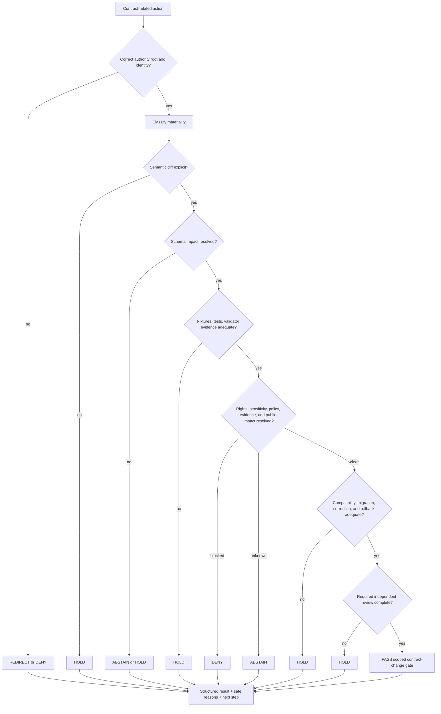

<!-- [KFM_META_BLOCK_V2]
doc_id: kfm://policy/contract
title: policy/contract/ — Contract-Change Admissibility Boundary
type: readme
version: v0.4
status: draft; BOUNDARY_COMPACT; repository-grounded; readme-only-direct-lane; accepted-directory-rules; adjacent-contract-schema-tests-confirmed; adjacent-policy-validators-confirmed; contract-policy-enforcement-not-established; fail-closed; non-release; non-publication
owner: NEEDS VERIFICATION — .github/CODEOWNERS routes /policy/ to @bartytime4life; accepted Contract policy stewardship, independent approval controls, and a stable local scope ID were not established
created: 2026-06-15
updated: 2026-08-13
policy_label: "public; policy; contract-change; admissibility; trust-membrane; fail-closed; no-semantic-authority; no-schema-authority; no-evidence-authority; no-release-authority; no-publication-authority"
current_path: policy/contract/README.md
owning_root: policy/
responsibility: admissibility posture for contract-related repository actions; determines whether a proposed contract change has enough authority, paired shape, review, validation, migration, compatibility, evidence, policy, and rollback support to proceed without redefining contract meaning, schema shape, release state, or implementation behavior
truth_posture: CONFIRMED accepted ADR-0029 and canonical Directory Rules v2 placement, singular policy root, canonical semantic contracts root, configured schemas/contracts/v1 machine-shape surface, README-only direct Contract policy lane, executable adjacent contract/schema tests, 12 paired deterministic policy validators, 18-test structural boundary suite, bounded inactive Pass 12 Rego profile, broad policy readiness holds, placeholder general policy runtime, and unaccepted repository-wide bundle selection / PROPOSED contract-change classes, gate input, obligations, reviewer classes, and implementation sequence / UNKNOWN effective required checks, accepted general evaluator and bundle selector, exhaustive contract/schema equivalence, governed consumers, decision receipts, production enforcement, and release integration / NEEDS VERIFICATION accepted owners, local scope ID, direct Contract Rego module, Contract fixtures and native tests, dedicated Contract validator, reason-code and obligation compatibility, separation of duties, replay, and rollback automation
evidence_repository: bartytime4life/Kansas-Frontier-Matrix
evidence_visibility: public
evidence_base_ref: main
evidence_base_commit: 1a61d3fbdc111bb3292086a30a53ccc50ed1bb8a
prior_blob: cf8fe811c35d9efaf43f05ab9da181ccbb4d3670
prior_snapshot_base: 91a2df5aa12c0a060167bc8b79716caf0f04ee35
authority_evidence: accepted ADR-0029 blob b01322ef64f8c2b1ecb41de7ef4685b97cfa2a62 adopts Directory Rules blob fd49a0b83e55cef52c1124281f093e263526898d as the sole writable human Directory Rules authority
implementation_evidence: policy root blob 6c5021f9d92778581a4e9331a9dd6ddb7efc5f6; contracts root blob e0b7c126e00a8ac6e8890774ed26cf21aef534ba; Makefile blob c5d0aee3de558d76c1e1639bcfd8cf1c71a0d326; policy validators tree 9d27cf72099a1234e2ba0187fd0247e5f8ac9760; contract tests tree 7aaff0b5ffe5361d51a94006efc0501b60cb6734
inventory_method: GitHub connector reads at the pinned main commit plus deterministic local inspection of the same target and path-disjoint evidence blobs, bounded executable/test/workflow inventory, exact target-path pull-request search, and no-network documentation validation
direct_lane_tree: 9ec2846e7d4eba112718aea03a103e1cce0a242c
direct_lane_files_confirmed: policy/contract/.gitkeep; policy/contract/README.md
bounded_inventory_note: no competing policy/contracts lane, direct Contract Rego module, direct Contract fixture/test module, dedicated Contract validator, accepted bundle registration, governed runtime consumer, Contract PolicyDecision or receipt emitter, or release integration was established; adjacent policy validators and contract/schema tests exist but do not activate this lane
related:
  - ../README.md
  - ../bundles/README.md
  - ../decision/README.md
  - ../../contracts/README.md
  - ../../contracts/policy/README.md
  - ../../schemas/contracts/v1/policy/README.md
  - ../../tests/contracts/README.md
  - ../../tests/schemas/test_common_contracts.py
  - ../../tools/validators/policy/README.md
  - ../../packages/policy-runtime/README.md
  - ../../docs/architecture/contract-schema-policy-split.md
  - ../../docs/architecture/directory-rules.md
  - ../../docs/doctrine/directory-rules.md
  - ../../docs/adr/ADR-0029-adopt-directory-governance-standard-v2.md
  - ../../docs/adr/ADR-0001-schema-home--schemas-contracts-v1-is-canonical.md
  - ../../docs/adr/ADR-0002-contracts-vs-schemas-split.md
  - ../../docs/adr/ADR-0003-policy-singular-is-canonical-(policies-is-compatibility).md
  - ../../docs/registers/POLICY_GATE.md
  - ../../docs/registers/DRIFT_REGISTER.md
  - ../../.github/workflows/contracts-validate.yml
  - ../../.github/workflows/contract-drift.yml
  - ../../.github/workflows/policy-test.yml
  - ../../.github/workflows/policy-boundary-guards.yml
  - ../../.github/workflows/validator-suite.yml
  - ../../.github/workflows/link-check.yml
  - ../../Makefile
tags: [kfm, policy, contracts, contract-change, admissibility, governance, schemas, fixtures, validators, migration, compatibility, rollback, fail-closed]
notes:
  - "v0.4 reconciles this boundary with accepted ADR-0029 and current mixed-maturity validation evidence while preserving the v0.3 gate model and stable document identity."
  - "The existing path is retained. This one-file revision creates no policy rule, contract, schema, fixture, test, validator, receipt, proof, runtime behavior, release object, lifecycle transition, or public artifact."
  - "docs/doctrine/directory-rules.md is the sole writable human Directory Rules authority; docs/architecture/directory-rules.md is a read-only compatibility dependency pending the controlled migration recorded by ADR-0029."
  - "A policy/contract README, validator result, schema-valid fixture, passing test, or green workflow is not executable Contract policy and does not authorize merge, release, deployment, promotion, or publication."
[/KFM_META_BLOCK_V2] -->

<a id="top"></a>

# Contract-Change Admissibility Boundary

`policy/contract/`

> **One-line purpose.** Define the fail-closed policy boundary for deciding whether a contract-related repository action may proceed to validation or review, while leaving semantic meaning to `contracts/`, machine shape to `schemas/contracts/v1/`, enforceability to fixtures/tests/validators, and release authority to `release/`.


**Quick navigation:** [Status](#status-and-evidence-boundary) · [Purpose](#purpose) · [Authority](#authority-boundary) · [Ownership](#local-ownership-and-scope) · [Identity](#naming-identity-and-versioning) · [Lifecycle](#lifecycle-exposure-mutation-and-retention) · [Repository fit](#repository-fit) · [Current state](#confirmed-current-state) · [Change classes](#contract-change-classes) · [Inputs](#required-gate-input) · [Gate model](#contract-change-gate-model) · [Outcomes](#outcomes-and-normalization) · [Obligations](#obligations) · [Validation](#validation-and-negative-cases) · [CI](#ci-and-workflow-boundary) · [Security](#security-rights-sensitivity-and-public-impact) · [Rollback](#migration-correction-supersession-and-rollback) · [Implementation](#smallest-sound-implementation-sequence) · [Done](#definition-of-done) · [Open](#open-verification-register) · [Evidence](#evidence-ledger) · [Last reviewed](#last-reviewed) · [Changelog](#changelog)

> [!IMPORTANT]
> **CONFIRMED current state:** accepted ADR-0029 adopts Directory Rules v2 and makes `docs/doctrine/directory-rules.md` the sole writable human Directory Rules authority. Its mandatory three-way split assigns semantic meaning to `contracts/`, machine shape to `schemas/`, and admissibility to singular `policy/`. This direct lane contains only `.gitkeep` and this README; no competing `policy/contracts/` lane or overlapping open pull request was found.
>
> **CONFIRMED adjacent validation:** contract/schema CI runs repository-owned schema and contract tests; `tests/contracts/` now contains two executable modules and a three-family fixture manifest; `tools/validators/policy/` contains 12 deterministic validators with paired tests and workflows; and the separate boundary suite declares 18 structural/static/API tests. These are bounded validation surfaces, not a Contract policy evaluator.
>
> **NOT ESTABLISHED:** a Contract-specific Rego module, direct Contract policy fixtures or native tests, a dedicated Contract validator, accepted repository-wide bundle selection, functional general policy runtime, authenticated Contract `PolicyDecision` flow, governed consumer, production enforcement, or release-gate integration.

> [!CAUTION]
> This directory must never become a second contract or schema authority. A policy gate may decide whether a proposed action is admissible under supplied context; it may not define what an object means, invent a field shape, create evidence, approve release, or treat generated text as reviewed truth.

---

## Status and evidence boundary

This README is grounded to `main@1a61d3fbdc111bb3292086a30a53ccc50ed1bb8a`. Statements about repository presence are bounded to the paths, blobs, trees, workflows, and searches listed in the [evidence ledger](#evidence-ledger). Current implementation evidence outranks older README maturity claims. Effective rulesets, required-check enforcement, independent approval, deployed consumers, and production enforcement remain outside the established evidence boundary.

| Surface | Status | Safe conclusion |
|---|---:|---|
| `policy/contract/` direct inventory | **CONFIRMED README-only boundary** | `.gitkeep` and this README are the only direct files; no Contract rule source is present. |
| `policy/contract/` placement | **CONFIRMED / adopted** | ADR-0029 makes Directory Rules v2 effective; §9.3 assigns admissibility to singular `policy/`. |
| Directory Rules authority | **CONFIRMED accepted decision** | `docs/doctrine/directory-rules.md` is the sole writable human authority; the lowercase architecture path is read-only compatibility, not parallel authority. |
| `policy/contracts/` competitor | **NOT SURFACED** | No competing child lane was found. This does not ratify a permanent naming convention by itself. |
| Contract semantic root | **CONFIRMED canonical responsibility** | `contracts/` owns human-readable meaning and invariants without becoming schema, policy, evidence, or release authority. |
| Machine-schema convention | **CONFIRMED configured path / ADR still proposed** | Repository validation uses `schemas/contracts/v1/`; ADR-0001 and ADR-0002 remain proposed rather than accepted. |
| Contract/schema tests | **CONFIRMED bounded executable coverage** | `tests/schemas/` and `tests/contracts/` contain executable checks; the latter has two modules, 12 source-declared tests, and a three-family manifest. Complete semantic equivalence is not proved. |
| Contract/schema CI | **CONFIRMED workflow wiring** | `contracts-validate` runs the manifest validator and `make test`; `contract-drift` runs strict schema/contract tests. Effective required-check status remains unknown. |
| Contract-specific Rego module | **NOT ESTABLISHED** | No direct executable Contract policy module was found in this lane. |
| Policy-test behavior | **CONFIRMED broad readiness holds** | Static jobs preserve the general evaluator/bundle/runtime hold while recognizing one separately governed inactive Pass 12 Rego lane and paired deterministic policy validators. No repository-wide policy is evaluated. |
| Structural policy-boundary suite | **CONFIRMED adjacent executable coverage** | Four modules declare 18 structural/static/API tests. Their path filter excludes this README, and they do not evaluate Contract policy. |
| Policy validators | **CONFIRMED mixed adjacent support** | Twelve deterministic validators have paired tests and workflows; none is a dedicated Contract-change gate or authoritative policy evaluator. |
| Policy runtime | **CONFIRMED placeholder** | Package version is `0.0.0`; functional evaluator, exports, consumers, and package tests are not established. |
| Policy bundles | **CONFIRMED documentation plus inactive profile** | A Pass 12 packaging profile is documented, but no accepted repository-wide manifest, selector, evaluator binding, or active bundle is established. |
| Contract-policy receipts and release use | **UNKNOWN / NEEDS VERIFICATION** | No accepted receipt flow, promotion dependency, or runtime consumer was proved. |

### Truth labels

| Label | Use in this README |
|---|---|
| `CONFIRMED` | Verified from current repository files or bounded connector search at the pinned base. |
| `PROPOSED` | Recommended contract-change behavior not established as current implementation. |
| `UNKNOWN` | Not resolvable from inspected evidence. |
| `NEEDS VERIFICATION` | Checkable, but unresolved strongly enough to act as fact. |
| `DENY` | A proposed action would collapse authority, bypass a trust boundary, or expose unsupported material. |

---

## Purpose

`policy/contract/` is the human-facing policy boundary for contract-related repository actions.

It should answer one bounded question:

> Does this proposed contract action have the authority, paired machine shape, evidence context, policy context, validation support, review path, compatibility plan, migration path, and rollback support required to proceed to its next governed state?

This README is for contract stewards, schema stewards, policy reviewers, validation maintainers, domain owners, release stewards, documentation maintainers, and coding agents reviewing changes to trust-bearing object meaning.

### In scope

- classifying contract-related actions and their materiality;
- checking responsibility-root placement;
- requiring the correct schema posture without authoring schema content;
- requiring fixtures, tests, validators, review, migration, and rollback when material;
- checking evidence, rights, sensitivity, public-interface, and release impact;
- returning bounded gate outcomes and obligations;
- routing unsupported work to the correct responsibility root;
- preserving replay, deprecation, supersession, and correction support.

### Out of scope

- writing canonical semantic contract content;
- defining JSON Schema or DTO fields;
- implementing the policy runtime or evaluator;
- storing policy bundles, receipts, proofs, lifecycle data, or release records;
- approving lifecycle promotion, merge, release, deployment, or publication;
- changing source authority, evidence status, rights, sensitivity, or consent facts;
- implementing public API, map, UI, export, or AI behavior;
- turning CI completion, file presence, or generated prose into policy permission.

---

## Authority boundary

The lane is authoritative only as reviewed policy documentation for contract-change admissibility. It is non-authoritative for every adjacent responsibility until executable policy and tests are accepted.

| Responsibility | Authority home | Role of `policy/contract/` |
|---|---|---|
| Contract meaning and invariants | `contracts/` | Inspect references and impact; never redefine meaning here. |
| Machine-checkable shape | `schemas/contracts/v1/` | Require or waive a paired-shape change with explicit rationale; never author shape here. |
| Admissibility rules | accepted modules under `policy/` | This lane may host future contract-change policy source, but no executable module is established now. |
| Policy bundle packaging | `policy/bundles/` | Require an accepted bundle reference when runtime evaluation exists; never activate by directory presence. |
| Runtime evaluation mechanics | `packages/policy-runtime/` | Consume an accepted evaluator result when implemented; never treat placeholder code as enforcement. |
| Fixtures | accepted `fixtures/` or test-local fixture lane | Require deterministic positive and negative examples where material. |
| Tests | `tests/` | Prove bounded behavior; current schema/contract tests do not evaluate this policy lane. |
| Validator implementation | `tools/validators/` | Invoke accepted validators by declared scope; adjacent policy validators do not substitute for a dedicated Contract gate. |
| Governance indexes | `control_plane/`, `docs/registers/` | Cross-check ownership, gate identity, deprecation, and drift. |
| Receipts and proofs | `data/receipts/`, `data/proofs/` | Reference emitted records; never store them here. |
| Release, correction, withdrawal, rollback | `release/` | Require relevant support; never approve it here. |
| Public behavior | governed application and runtime roots | Require downstream compatibility evidence; never become a public path. |

```text
policy/contract/          = contract-change admissibility boundary
contracts/                = semantic meaning and invariants
schemas/contracts/v1/     = machine-checkable shape
tests/ + fixtures/        = deterministic enforceability evidence
tools/validators/         = executable validation
packages/policy-runtime/  = future evaluation mechanics
control_plane/            = machine-readable governance indexes
data/receipts + proofs/   = emitted process memory and proof
release/                  = release, correction, withdrawal, rollback authority
```

A trust-bearing object family is not implementation-ready merely because one row exists. Meaning, shape, policy, fixtures, tests, validators, registry state, migration, and release impact must be evaluated separately and linked where applicable.

---

## Local ownership and scope

| Field | Current posture |
|---|---|
| Inherited parent | [`policy/`](../README.md), the adopted singular policy-source root |
| Local owner | `NEEDS VERIFICATION`; CODEOWNERS routes `/policy/` to `@bartytime4life`, but routing is not accepted stewardship or independent approval |
| Local scope ID | `NEEDS VERIFICATION`; do not invent one from the path or document ID |
| Permitted writers | Reviewed repository contributors operating through governed Git history |
| Intended readers | Contract, schema, policy, validation, architecture, consumer, security, and release reviewers |
| Decision-instance home | The process or release object that records the decision, never this rule/document lane |
| Current execution authority | None; this lane is documentation-only and cannot emit or authenticate a decision |

This README narrows the parent root to Contract-change admissibility. It cannot expand `policy/` authority, accept owners by assertion, or convert a proposed role class into a completed review.

---

## Naming, identity, and versioning

| Surface | Rule |
|---|---|
| Stable documentation identity | Preserve `kfm://policy/contract` and `policy/contract/README.md` unless an accepted migration changes both identity and path. |
| Child-lane name | Retain current singular `contract/`; absence of `policy/contracts/` is not a repo-wide naming law. |
| Future rule package | Must use a reviewed, stable package/entrypoint name recorded in fixtures, tests, bundle metadata, and consumers; the README does not assign it. |
| Semantic contract versions | Belong under `contracts/`; this lane evaluates declared impact and compatibility but does not version meaning. |
| Machine schema versions | Belong under the accepted schema profile; directory presence does not ratify a schema as complete or canonical. |
| Policy/bundle/evaluator versions | Must be explicit, immutable or digest-bound where consequential, replayable, and independently reviewable. |
| Outcome/reason/obligation vocabulary | Must be versioned compatibly; an unreviewed rename, deletion, or remapping fails closed. |
| Breaking change | Requires explicit predecessor/successor identity, migration, deprecation, consumer impact, correction analysis, and rollback target. |

File placement, a friendly label, a workflow name, or a generated identifier must never activate policy or satisfy version authority.

---

## Lifecycle, exposure, mutation, and retention

| Concern | Boundary |
|---|---|
| Lifecycle | This directory owns no RAW, WORK, QUARANTINE, PROCESSED, CATALOG, TRIPLET, or PUBLISHED instance and cannot move one between phases. |
| Exposure | The README may be public repository documentation; it is not a public policy-query endpoint or data interface. |
| Mutation | Changes occur through reviewed Git history. Runtime, workflow, validator, or model writes into this lane are not authorized. |
| Retention | Git history preserves documentation lineage; emitted decisions, receipts, proofs, and release records remain in their accepted owning lanes. |
| Sensitive content | Real protected coordinates, living-person data, DNA/genomic material, credentials, consent tokens, private source payloads, and exploit details are prohibited. |
| Inputs | References, hashes, status, review, evidence, rights, sensitivity, compatibility, migration, and rollback context—never hidden fetches or raw sensitive payloads. |
| Outputs | Documentation guidance today; a future evaluator may return a bounded structured result only after its contracts, schemas, rules, tests, bundle, and consumer binding are accepted. |

A documentation edit does not change lifecycle state. A future `PASS` would authorize only its explicitly named next step and would remain separate from merge, promotion, release, deployment, and publication.

---

## Repository fit

### Directory Rules basis

Accepted [ADR-0029](../../docs/adr/ADR-0029-adopt-directory-governance-standard-v2.md) adopts the exact [Directory Rules v2](../../docs/doctrine/directory-rules.md) bytes and makes that doctrine path the sole writable human Directory Rules authority. Section 9.3 makes the contract/schema/policy split mandatory, and §16 assigns this local object-family boundary the `BOUNDARY_COMPACT` profile.

`policy/contract/README.md` therefore explains admissibility for contract-related actions under singular `policy/`; it does not own semantic contracts or machine schemas.

- No root is added, removed, moved, or renamed.
- No parallel contract, schema, policy, registry, proof, receipt, or release home is created.
- The singular policy root is adopted placement through ADR-0029; ADR-0003 remains proposed only for the narrower `policy/` versus `policies/` compatibility decision.
- The child name `contract/` is retained because it is the current repository path and no competing `contracts/` child lane was found.
- Ratifying a repo-wide child-lane naming law remains a separate governance decision.

### Directory Rules authority and compatibility

The accepted authority relationship is:

| Path | Current posture | Effect here |
|---|---|---|
| `docs/adr/ADR-0029-adopt-directory-governance-standard-v2.md` | **ACCEPTED** decision | Establishes adoption, sole-write authority, and controlled compatibility migration. |
| `docs/doctrine/directory-rules.md` | **ADOPTED** exact v2 bytes | Normative human placement authority used by this README. |
| `docs/architecture/directory-rules.md` | **READ-ONLY COMPATIBILITY** dependency | Preserved for existing links pending governed tombstone/reference migration; it may not receive independent rule edits. |

The former uppercase architecture duplicate is absent from the current tree. This README neither advances the legacy tombstone migration nor authorizes deletion. External-consumer closure, final reference migration, and physical retirement remain governed by ADR-0029.

### Authority and supersession graph

| Artifact | Current posture | Relationship to this README |
|---|---:|---|
| ADR-0029 | **accepted** | Adopts Directory Rules v2 and the controlled legacy-path migration. |
| `docs/doctrine/directory-rules.md` | adopted sole writable human authority | Assigns admissibility to `policy/` and defines the local README profile. |
| `docs/architecture/directory-rules.md` | read-only compatibility dependency | Legacy link surface only; not a writable authority. |
| `contracts/README.md` | repository-grounded v0.4 canonical semantic root | Owns human-readable object meaning and invariants. |
| ADR-0001 | repository-present / `proposed` | Proposed canonical machine-schema home. |
| ADR-0002 | repository-present / `draft` | Proposed contracts-schemas-policy-fixtures-tests-validators split. |
| ADR-0003 | repository-present / `proposed` | Proposed singular policy-root decision. |
| `docs/registers/POLICY_GATE.md` | repository-present / draft register | Human-facing gate vocabulary; not executable policy. |
| `policy/bundles/` | documentation plus inactive Pass 12 profile | No accepted repository-wide bundle selection or activation. |
| `tests/contracts/` | two test modules plus manifest and documentation | Bounded contract/fixture integrity evidence; not complete semantic proof. |
| `tools/validators/policy/` | 12 validators plus routing documentation | Deterministic inactive-profile validation; no Contract-specific evaluator. |
| `packages/policy-runtime/README.md` | repository-present / greenfield placeholder | Future evaluation helper boundary. |

No inspected artifact supersedes this path. This v0.4 revision supersedes v0.3 at the same stable path and document identity.

---

## Confirmed current state

### Direct lane inventory

| Path | Status | Interpretation |
|---|---:|---|
| `policy/contract/README.md` | **CONFIRMED** | Current documentation boundary. |
| `policy/contract/.gitkeep` | **CONFIRMED inert placeholder** | Preserves the directory; carries no semantics or enforcement. |
| direct `.rego` module | **NOT ESTABLISHED** | No executable Contract-change policy was surfaced. |
| direct fixture family | **NOT ESTABLISHED** | No Contract-policy positive or negative fixtures were surfaced. |
| direct native policy test | **NOT ESTABLISHED** | No evaluator-backed test for this lane was surfaced. |
| dedicated Contract validator | **NOT ESTABLISHED** | No accepted Contract-change validator entry point was surfaced. |
| bundle registration or active selector | **NOT ESTABLISHED** | No runtime activation or bundle binding is proved. |
| emitted `PolicyDecision` or policy receipt flow | **NOT ESTABLISHED** | This README emits no decision or receipt. |

### Adjacent executable evidence

`tests/schemas/test_common_contracts.py` discovers schemas in selected families, finds matching fixture directories, requires valid fixtures to pass, and requires invalid fixtures to fail. `tests/contracts/` now adds two executable modules: one exercises a deterministic, no-network three-family contract-fixture manifest and its fail-closed negative cases; the other checks IdentityToken schema, fixture, vocabulary, and declared-validator wiring. That is useful bounded machine-shape and cross-root integrity evidence. It does not prove:

- semantic completeness of every Markdown contract;
- contract-to-schema equivalence;
- contract-change policy evaluation;
- compatibility or migration safety;
- domain-steward review;
- public API or release readiness.

`contracts-validate.yml` executes the manifest validator and `make test`; the Makefile scopes that command to `tests/schemas` and `tests/contracts`. `contract-drift.yml` runs the same two test roots with strict configuration and marker handling. The stale maturity wording in `tests/contracts/README.md` does not override the executable files now present.

`policy-test.yml` remains a broad readiness-hold workflow. Its static jobs recognize one separately governed `PROPOSED_INACTIVE` Pass 12 release-gate profile with native Rego tests, verify that every current `tools/validators/policy/validate_*.py` helper has a paired no-network test and workflow, inventory `PolicyDecision` shape fixtures, and preserve the hold on a repository-wide bundle manifest, general evaluator binding, functional policy runtime, and general OPA command. It deliberately does not evaluate a repository-wide policy or emit a `PolicyDecision`.

`tools/validators/policy/` contains 12 deterministic validators covering inactive profiles such as PolicyDecision vocabulary and semantics, PolicyInputBundle profile, evaluation binding, obligations, reviewer roles, enforcement maturity, threshold registry, transform simulation, conditional closure, and sovereignty-exception receipts. Each has a paired test and focused workflow. These validators check declared artifacts; they do not execute Contract policy, create evidence, or authorize release.

`policy-boundary-guards.yml` is a separate command-bearing workflow. Its Make target runs four modules that declare 18 structural/static/API tests across control-plane metadata, explorer adapter/store boundaries, connector/pipeline non-publication, and governed API boundaries, with JUnit output. This is useful adjacent enforcement, not Contract-change policy evaluation. Its path filters do not include this README, so this documentation update does not directly trigger that suite.

---

## Contract-change classes

The following classification is **PROPOSED**. A future executable policy must bind these classes to stable inputs, reason codes, obligations, tests, and reviewer requirements.

| Change class | Examples | Default review posture | Minimum additional support |
|---|---|---|---|
| `editorial` | spelling, formatting, link repair, clarification with no semantic effect | standard contract/docs review | diff proves meaning and machine shape are unchanged |
| `compatible_semantic` | clearer invariant, additive optional meaning, non-breaking documentation | contract owner plus affected consumer review | schema-impact statement, targeted tests where behavior is claimed |
| `shape_coupled` | semantic change that requires schema or fixture updates | contract + schema + validation review | paired schema posture, valid/invalid fixtures, validator/test result |
| `policy_coupled` | rights, sensitivity, admissibility, obligations, audience, or release behavior changes | contract + policy + affected steward review | policy impact, negative cases, reason codes, obligation handling |
| `consumer_coupled` | API, UI, map, export, pipeline, connector, or runtime interpretation changes | contract + affected consumer owner | compatibility tests and bounded rollout plan |
| `breaking` | required field removal/change, invariant reversal, identity change, split, merge, rename | multi-surface review and migration hold | versioning, migration, replay, deprecation, correction, rollback |
| `release_significant` | alters meaning of a released claim or public trust surface | independent release/policy review | release impact, correction/withdrawal posture, rollback target |
| `authority_structural` | moves meaning, creates parallel home, changes canonical root or schema authority | `DENY` or `HOLD` pending accepted ADR | ADR, drift entry, migration plan, compatibility and rollback |

### Materiality rule

Treat a change as the most protective applicable class. An editorial label must not hide a semantic, policy, compatibility, evidence, or public-impact change.

---

## Required gate input

A future contract-change policy should evaluate an explicit, complete input bundle. It must not infer missing facts from prose, path names, model output, repository memory, or UI state.

| Input family | Minimum content | Fail-closed behavior when unresolved |
|---|---|---|
| Action identity | action id, operation, actor/ref, target contract path, base and candidate hashes | `ERROR` or `HOLD` |
| Contract identity | document id, family, version, status, owner posture, supersession links | `ABSTAIN` or `HOLD` |
| Placement context | owning root, Directory Rules basis, ADR references, compatibility class | `REDIRECT`, `DENY`, or `HOLD` |
| Semantic diff | changed definitions, invariants, exclusions, lifecycle meaning, compatibility claims | `HOLD` |
| Schema posture | paired schema path/version, changed/unchanged rationale, validation result | `ABSTAIN` or `HOLD` |
| Fixture/test posture | positive and negative fixtures, test paths, observed outcomes | `HOLD` |
| Validator posture | accepted entry point, version/digest when material, structured result | `ERROR` or `HOLD` |
| Policy context | rights, sensitivity, consent, audience, obligations, bundle/evaluator refs when implemented | `DENY`, `ABSTAIN`, or `HOLD` |
| Evidence context | EvidenceRefs and resolver state when the contract governs claim-bearing objects | `ABSTAIN` |
| Consumer impact | API/UI/runtime/pipeline/export consumers, compatibility evidence, rollout | `HOLD` |
| Release impact | current release state, published instances, correction/withdrawal need | `DENY` or `HOLD` |
| Migration and rollback | migration id, old/new version mapping, replay support, rollback target | `HOLD` |
| Review context | required reviewer classes, completed review records, separation of duties | `HOLD` |

Input validation proves only that the gate received an accepted shape. It does not prove that the supplied facts are true, complete, current, or authorized.

---

## Contract-change gate model

The gate below is a **PROPOSED decision model**, not current executable behavior.


```mermaid
flowchart TD
    request["Contract-related action"] --> placement{"Correct authority root and identity?"}
    placement -->|no| redirect["REDIRECT or DENY"]
    placement -->|yes| classify["Classify materiality"]
    classify --> semantic{"Semantic diff explicit?"}
    semantic -->|no| hold1["HOLD"]
    semantic -->|yes| schema{"Schema impact resolved?"}
    schema -->|no| abstain1["ABSTAIN or HOLD"]
    schema -->|yes| proof{"Fixtures, tests, validator evidence adequate?"}
    proof -->|no| hold2["HOLD"]
    proof -->|yes| policy{"Rights, sensitivity, policy, evidence, and public impact resolved?"}
    policy -->|blocked| deny["DENY"]
    policy -->|unknown| abstain2["ABSTAIN"]
    policy -->|clear| migration{"Compatibility, migration, correction, and rollback adequate?"}
    migration -->|no| hold3["HOLD"]
    migration -->|yes| review{"Required independent review complete?"}
    review -->|no| hold4["HOLD"]
    review -->|yes| pass["PASS scoped contract-change gate"]

    redirect --> report["Structured result + safe reasons + next step"]
    hold1 --> report
    abstain1 --> report
    hold2 --> report
    deny --> report
    abstain2 --> report
    hold3 --> report
    hold4 --> report
    pass --> report
```

A `PASS` permits only the stated next repository step. It is not merge approval, policy activation, lifecycle promotion, release approval, or publication authority.

---

## Outcomes and normalization

The repository uses multiple finite vocabularies for different layers. This README must not flatten them.

### Contract-change workflow outcomes

| Outcome | Meaning | Required behavior |
|---|---|---|
| `PASS` | Declared contract-change conditions are satisfied for the scoped next step | Preserve scope, evidence, obligations, and review state |
| `FAIL` | A deterministic declared check failed | Block and report the failed check |
| `REDIRECT` | Proposed content belongs under another responsibility root | Name the verified home when known; do not duplicate authority |
| `HOLD` | Review, migration, validation, compatibility, correction, or rollback support is pending | Do not merge or promote |
| `ABSTAIN` | Required evidence or authority context cannot be resolved | Block and name missing support safely |
| `DENY` | The action violates policy, authority, sensitivity, rights, or trust-membrane requirements | Block without leaking protected details |
| `ERROR` | Gate machinery, repository resolution, schema loading, or validator execution failed | Fail closed; no policy conclusion is valid |

### Runtime normalization boundary

Canonical `PolicyDecision` and `DecisionEnvelope` shapes currently use primary outcomes such as `ANSWER`, `ABSTAIN`, `DENY`, and `ERROR`. Lower-level `PASS`, `FAIL`, `REDIRECT`, or `HOLD` values must be normalized through an accepted mapping before a governed runtime consumes them.

Do not store an unmapped lower-level result in a field whose schema permits only the canonical runtime vocabulary. Do not invent free-text states such as `maybe`, `best_effort`, or `looks_safe`.

---

## Obligations

A non-denied result may carry obligations. Downstream callers must preserve them until an accepted consumer proves completion.

| Obligation | Typical trigger | Required effect |
|---|---|---|
| `schema_alignment_required` | semantic change affects machine shape | update or explicitly justify unchanged schema |
| `fixture_required` | new or changed positive/negative behavior | add deterministic fixtures in the accepted lane |
| `validator_required` | machine-checkable invariant is introduced | add accepted validator and structured result |
| `review_required` | trust-bearing or domain-significant change | route to verified reviewer class |
| `policy_review_required` | rights, sensitivity, consent, access, obligations, or release behavior changes | hold until policy review completes |
| `evidence_review_required` | contract governs claim-bearing objects | verify EvidenceRef/EvidenceBundle posture |
| `migration_note_required` | rename, split, merge, identity change, or breaking semantics | document old-to-new mapping and replay |
| `deprecation_required` | old version remains readable but should not be newly selected | preserve successor and deprecation window |
| `correction_review_required` | released claims may change meaning | assess correction or withdrawal |
| `rollback_required` | material or public-impacting change | provide tested or reviewable rollback target |
| `consumer_update_required` | API/UI/runtime/pipeline interpretation changes | update consumers and compatibility tests |
| `release_check_required` | change affects released or public-bound behavior | route through release authority; do not infer approval |
| `docs_update_required` | related explanations or examples become inaccurate | update or record intentionally unchanged docs |
| `receipt_required` | consequential policy evaluation or generated work needs replay | emit only to an accepted receipt lane |

An obligation is not complete merely because it appears in a decision object. Completion needs independently verifiable evidence.

---

## Review burden and separation of duties

| Change class | Minimum reviewer posture | Status |
|---|---|---:|
| editorial | contract or docs maintainer | **PROPOSED role class** |
| compatible semantic | contract owner plus affected consumer | **PROPOSED role class** |
| shape coupled | contract + schema/validation reviewer | **PROPOSED role class** |
| policy coupled | contract + policy/sensitivity/rights reviewer | **PROPOSED role class** |
| breaking or authority structural | architecture + contract/schema + affected owners | **PROPOSED; ADR may be required** |
| release significant | author and release/policy approver should be separate where maturity permits | **PROPOSED; assignment not established** |

`.github/CODEOWNERS` currently routes `/policy/` and related trust roots to the verified GitHub identity `@bartytime4life`. That is a review-routing fact, not proof of independent stewardship, role assignment, completed review, or branch-protection enforcement.

---

## Validation and negative cases

### Confirmed repository commands

| Command | Confirmed behavior | What it does not prove |
|---|---|---|
| `make test` | runs `pytest` for `tests/schemas` and `tests/contracts` | complete semantic equivalence, Contract policy, runtime enforcement, release readiness |
| `make validate` | runs the aggregate schema-validator profile and `make test` | Contract-policy evaluation or publication authority |
| `make policy` | emits a TODO message | no policy test or OPA evaluation occurs |
| `make boundary-guards` | runs four modules declaring 18 structural/static/API tests | Contract-change policy, evaluator/bundle parity, rights or sensitivity decisions, release readiness |
| `make boundary-guards-ci` | runs the same suite and writes JUnit under `artifacts/qa/` | a JUnit report is not a policy decision, proof, receipt, or release approval |
| contract-fixture manifest validator | validates three declared schema/fixture families with deterministic polarity and stable outcomes | complete contract inventory, semantic equivalence, or Contract policy |
| 12 policy validators | validate paired inactive policy profiles with no-network tests and focused workflows | authoritative policy evaluation, Contract admissibility, or release permission |

### Required future negative cases

A future executable contract-change gate should prove at least these outcomes:

| Case | Expected outcome |
|---|---|
| semantic contract content proposed under `policy/contract/` | `REDIRECT` or `DENY` |
| JSON Schema proposed under `policy/contract/` | `REDIRECT` or `DENY` |
| new machine-relevant field without schema-impact statement | `HOLD` |
| claimed schema alignment without valid and invalid fixtures | `HOLD` |
| breaking change without versioning and migration | `HOLD` |
| identity or canonical-root change without accepted ADR | `DENY` or `HOLD` |
| rights/sensitivity/public-impact change without policy review | `DENY` or `HOLD` |
| claim-bearing contract without resolvable evidence posture | `ABSTAIN` |
| released-object meaning change without correction/rollback analysis | `HOLD` |
| generated contract prose represented as `CONFIRMED` without evidence/review | `DENY` |
| policy evaluator unavailable or result malformed | `ERROR` |
| lower-level result cannot normalize to the consumer schema | `ERROR` |
| all declared support present for a scoped compatible change | `PASS` with bounded obligations |

### Report requirements

A validator or policy result should identify:

- exact contract path and candidate version;
- input and candidate hashes;
- change class;
- finite outcome;
- stable, public-safe reason codes;
- unresolved references;
- obligations and next steps;
- evaluator/bundle/validator identity when implemented;
- review state;
- migration, correction, and rollback references where required.

The report must not expose secrets, restricted source payloads, exact sensitive locations, living-person data, DNA/genomic material, or security exploit details.

---

## CI and workflow boundary

### Relevant observed workflows

The following table is a bounded trigger/threat preflight, not an exhaustive inventory of every workflow that may run on a pull request.

| Workflow | Trigger and permission posture | Current role for this change |
|---|---|---|
| `contracts-validate` | all pull requests, pushes to `main`, dispatch; `contents: read`; hosted runner | runs the three-family manifest validator and `make test` |
| `contract-drift` | all pull requests, pushes to `main`, dispatch; `contents: read`; hosted runner | runs strict tests over `tests/schemas` and `tests/contracts` |
| `policy-test` | all pull requests, pushes to `main`, dispatch; `contents: read`; hosted runner | preserves broad readiness holds and validates bounded inactive policy-lane wiring; no repository-wide evaluation |
| `validator-suite` | all pull requests, pushes to `main`, dispatch; `contents: read`; hosted runner | runs aggregate schema, workflow-security, directory-topology, receipt-integrity, materiality, and fail-closed checks; not Contract policy evaluation |
| `link-check` | all pull requests, pushes to `main`, dispatch; `contents: read`; hosted runner | executes no-network link-check tests and validates local targets in changed Markdown |
| `policy-boundary-guards` | path-scoped pull requests/pushes; `contents: read`; hosted runner | command-bearing 18-test suite; this README is outside its path filter |

The directly inspected workflows pin `actions/checkout` and `actions/setup-python` to immutable commit SHAs, disable persisted credentials, use GitHub-hosted runners, and declare read-only repository permission. Branch-protection coupling, required-check status, organization defaults, bypass actors, effective behavior of uninspected workflows, and the exhaustive changed-path trigger set remain `NEEDS VERIFICATION`.

### Threat posture for changes under this lane

- Pull-request content is untrusted.
- The directly inspected workflows use hosted runners, explicit read-only repository permission, and no deployment, release, OIDC, secret, comment, or repository-write step.
- `contracts-validate`, `contract-drift`, and `validator-suite` install declared test dependencies, so submitted packaging, validator, test, and configuration content can become execution inputs on hosted runners even though this revision changes only Markdown.
- `policy-test` and `link-check` use standard-library inspection for their bounded checks after GitHub-managed runtime setup.
- None of the directly inspected workflows emits a `PolicyDecision`, generated receipt, proof, release record, deployment, or publication side effect.
- A successful readiness hold proves only that its documented placeholder boundary has not drifted unexpectedly.
- New executable policy, evaluator, bundle, validator, or test files should intentionally fail the relevant readiness hold until real enforcement is accepted and wired deliberately.

---

## Security, rights, sensitivity, and public impact

Contract changes can alter how sensitive or consequential records are understood. They must fail closed when the change affects or obscures:

- living-person, genealogy, DNA, or genomic semantics;
- archaeology, cultural, Indigenous, burial, or sacred-place handling;
- rare species, rare plants, habitat, or geoprivacy;
- private land or stewardship relations;
- critical infrastructure or reconstruction-sensitive topology;
- source rights, license terms, attribution, consent, or access restrictions;
- emergency, hazard, or operational-safety interpretation;
- exact location, temporal precision, confidence, uncertainty, or stale-state meaning;
- evidence, review, release, correction, withdrawal, or rollback requirements.

A contract-policy gate must evaluate supplied governed context. It must not discover private facts, infer consent, downgrade sensitivity, resolve unclear rights by optimism, fetch hidden source data, or expose denied details in reason text.

Public clients remain downstream of governed APIs and released, policy-filtered artifacts. Contract acceptance does not create a safe public path.

---

## Migration, correction, supersession, and rollback

Contract changes can alter interpretation of old data and released claims. Review the following independently:

| Concern | Required question |
|---|---|
| Compatibility | Can old and new consumers distinguish versions safely? |
| Replay | Can historical records still be interpreted under the contract version that governed them? |
| Migration | Is the transformation deterministic, reviewable, and reversible where practical? |
| Deprecation | Is the predecessor retained with successor and selection guidance? |
| Supersession | Is the replacement explicit without deleting lineage? |
| Correction | Do previously released claims need correction or recompile? |
| Withdrawal | Must a version or derived artifact stop being selected? |
| Rollback | Is there a known target and bounded way to restore prior behavior? |

### Documentation rollback

For this README revision:

- before merge: close the draft pull request or reset the review branch;
- after merge: revert the single README commit through normal reviewed history;
- prior target blob: `cf8fe811c35d9efaf43f05ab9da181ccbb4d3670`.

Reverting this README restores documentation only. It does not roll back contracts, schemas, policy, tests, runtime, data, or releases because this revision changes none of those surfaces.

---

## Smallest sound implementation sequence

This is a **PROPOSED** sequence. Each step should be a bounded reviewable change and must re-inspect current repository evidence before implementation.

1. **Ratify the gate contract.** Define the exact input, finite result, reason-code, obligation, and versioning semantics in the correct contract/schema roots.
2. **Choose the policy source shape.** Add one fail-closed contract-change policy module under `policy/contract/` or another ADR-approved child path.
3. **Add deterministic fixtures.** Cover pass, redirect, hold, abstain, deny, and error cases without production or sensitive data.
4. **Add executable tests.** Prove authority separation, schema-impact handling, breaking-change holds, and public-impact denial.
5. **Add a dedicated validator or adapter.** Return structured results and normalize lower-level outcomes into accepted consumer schemas.
6. **Replace readiness holds deliberately.** Update `make policy` and `policy-test.yml` only after an evaluator, command, and bundle/selection boundary are accepted.
7. **Bind an immutable bundle and evaluator.** Record version, digest, dependency closure, timeout, and failure posture; file presence must not activate it.
8. **Integrate one non-public consumer.** Start with a dry-run review tool; emit no release or publication side effect.
9. **Add receipt and replay support.** Store process memory in the accepted receipt lane and verify hashes and decision reconstruction.
10. **Prove correction and rollback.** Exercise a breaking-change hold, deprecation, supersession, and rollback scenario before release-gate use.
11. **Graduate cautiously.** Require policy, validation, security, consumer, and release reviews before any promotion dependency or public-impact use.

Do not combine these steps into a broad “policy runtime” PR unless repository evidence proves the change remains reviewable and reversible.

---

## Definition of done

This lane may be described as **documented** when:

- [x] its responsibility and exclusions are explicit;
- [x] the current repository maturity is evidence-bounded;
- [x] contract, schema, policy, proof, runtime, and release authority remain separated;
- [x] current CI and readiness-hold behavior are described without overclaiming;
- [x] validation, migration, correction, and rollback burdens are visible.

This lane may be described as **executable** only when:

- [ ] owners and reviewer classes are accepted;
- [ ] the child-lane name and policy source location are ratified or documented as the current accepted convention;
- [ ] input and result contracts have accepted machine schemas;
- [ ] a contract-change policy module exists and is bundle-bound;
- [ ] deterministic positive and negative fixtures exist;
- [ ] executable policy tests run a pinned accepted evaluator;
- [ ] a dedicated validator or adapter emits structured finite results;
- [ ] lower-level outcomes normalize into accepted `PolicyDecision` or envelope shapes;
- [ ] reason codes and obligations are stable and tested;
- [ ] policy runtime and bundle selection fail closed;
- [ ] at least one bounded consumer proves integration without publication authority;
- [ ] receipts support replay without becoming proof or release authority;
- [ ] breaking-change migration, correction, deprecation, supersession, and rollback cases pass;
- [ ] CI wiring and branch-protection expectations are documented and verified;
- [ ] release integration, if any, remains independently governed.

A README, passing schema fixture, or green readiness workflow does not satisfy the executable definition of done.

---

## Open verification register

| Item | Current status | Evidence needed to resolve it |
|---|---:|---|
| Accepted role owners and reviewer classes | `NEEDS VERIFICATION` | verified stewardship assignments and review policy |
| Stable local Contract policy scope ID | `NEEDS VERIFICATION` | accepted policy-family/scope registry entry and compatibility rule |
| Direct contract-change policy module | `NOT ESTABLISHED` | reviewed `.rego` or equivalent source plus tests |
| Contract-change input/result contracts and schemas | `NEEDS VERIFICATION` | accepted semantic contracts, schemas, registry entries, and fixtures |
| Dedicated validator entry point | `NOT ESTABLISHED` | executable file, version, tests, and structured report contract |
| Stable reason-code and obligation registries | `NEEDS VERIFICATION` | accepted register and compatibility policy |
| Accepted evaluator and bundle format | `UNKNOWN` | evaluator ADR, immutable bundle manifest, digest, and selection contract |
| Functional policy runtime | `NOT ESTABLISHED` | installable package, API, tests, consumer, and health evidence |
| Contract-policy fixture and test coverage | `NOT ESTABLISHED` | positive/negative fixtures and executable results |
| Complete contract-to-schema pairing | `UNKNOWN` | generated inventory and semantic/shape crosswalk validation |
| Current workflow pass rates and required checks | `UNKNOWN` | GitHub run history, rulesets, and branch-protection evidence |
| Receipt and replay path | `NEEDS VERIFICATION` | accepted receipt schema/producer, stored instances, and replay test |
| Release-gate dependency | `UNKNOWN` | explicit release integration, separation of duties, correction, and rollback proof |
| ADR-0029 compatibility migration closure | `NEEDS VERIFICATION` | reference migration, external-consumer assessment, tombstone evidence, and authorized retirement record |

---

## Evidence ledger

| Evidence | Observation supported | Limits |
|---|---|---|
| `policy/contract/README.md` at prior blob `cf8fe811…` | v0.3 scope, gate model, obligations, security, migration, rollback, and no-loss baseline | Its July 22 authority and maturity inventory became stale |
| ADR-0029 + `docs/doctrine/directory-rules.md` | Accepted sole-write authority; mandatory contract/schema/policy split; `BOUNDARY_COMPACT` profile | Does not complete the separately governed legacy-path retirement |
| `docs/architecture/directory-rules.md` | Read-only compatibility dependency remains present | Not a writable placement authority |
| `policy/README.md` blob `6c5021f9…` | Adopted singular policy-root placement, mixed maturity, bounded inactive Rego profile, 12 paired validators, 18-test structural suite, general hold | Root evidence does not activate the Contract lane |
| `contracts/README.md` blob `e0b7c126…` | `contracts/` owns semantic meaning and invariants under a repository-grounded v0.4 boundary | Does not prove every semantic contract correct or implemented |
| ADR-0001 | Proposed `schemas/contracts/v1/` machine-schema home | Status remains proposed |
| ADR-0002 | Proposed division across contracts, schemas, policy, fixtures, tests, validators, receipts, proofs, release, and control plane | Status remains draft/proposed |
| ADR-0003 | Proposed singular policy-root decision | Does not specifically ratify the child name `contract/` |
| `tests/schemas/test_common_contracts.py` | Selected schema families use valid/invalid fixture validation | Does not prove semantic or policy enforcement |
| `tests/contracts/` tree `7aaff0b5…` | Two executable modules, 12 source-declared tests, and a three-family manifest exist | Bounded shape/cross-root evidence, not complete semantic equivalence or Contract policy |
| `Makefile` | `make test`, `make validate`, `make boundary-guards`, and `make boundary-guards-ci` are command-bearing; `make policy` remains a TODO output | No OPA evaluation or contract-change policy command |
| `contracts-validate.yml` + `contract-drift.yml` | Read-only CI runs manifest and strict schema/contract checks using immutable action pins | Effective required-check status and complete semantic coverage remain unknown |
| `policy-test.yml` blob `ac8f125e…` | Broad readiness holds recognize one bounded Rego lane and require paired support for policy validators | Evaluates no repository-wide bundle and emits no decision |
| `policy-boundary-guards.yml` blob `1d7ba1df…` | Path-scoped read-only CI declares 18 structural/static/API tests and validates JUnit output | Trigger excludes this README; suite is not Contract policy evaluation |
| `tools/validators/policy/` tree `9d27cf72…` | Twelve deterministic validators exist with paired tests/workflows | No dedicated Contract-change validator or policy authority |
| `validator-suite.yml` + `link-check.yml` | Broad pull-request workflows provide aggregate validator/topology/receipt and changed-Markdown link signals | Results are exact-head CI evidence only, not policy or approval |
| `policy/bundles/` tree `01eec734…` | Documentation and an inactive Pass 12 profile exist | No accepted repository-wide manifest, selector, or activation |
| `packages/policy-runtime/README.md` | Policy runtime is a `0.0.0` greenfield placeholder | No functional evaluator or consumer |
| `.github/CODEOWNERS` | `/policy/` review routes to `@bartytime4life` | Independent stewardship and enforcement remain unverified |
| bounded code/tree/PR searches | Only `.gitkeep` and this README in the direct lane; no competing path or matching open PR surfaced | Search is not proof of permanent absence |

---

## Maintenance triggers

Re-review this README when any of the following changes:

- contract or schema authority ADR status;
- `policy/contract/` naming or contents;
- policy input/result contracts or schemas;
- `tests/contracts/` direct executable coverage;
- policy fixtures, validators, evaluator, runtime, or bundles;
- `make policy`, `make boundary-guards`, `contracts-validate`, `policy-test`, `policy-boundary-guards`, `validator-suite`, or `link-check` behavior;
- reason-code, obligation, review, migration, correction, or rollback rules;
- first runtime consumer or release-gate integration;
- ADR-0029 compatibility-path migration or retirement.

A maintenance revision should pin a new evidence snapshot, preserve this file's stable identity and anchors where practical, and report authority or maturity drift instead of silently normalizing it.

---

## Last reviewed

| Field | Value |
|---|---|
| Review date | 2026-08-13 |
| Repository snapshot | `main@1a61d3fbdc111bb3292086a30a53ccc50ed1bb8a` |
| Prior target blob | `cf8fe811c35d9efaf43f05ab9da181ccbb4d3670` |
| Authority basis | accepted ADR-0029 + adopted Directory Rules blob `fd49a0b83e55cef52c1124281f093e263526898d` |
| Direct-lane tree | `9ec2846e7d4eba112718aea03a103e1cce0a242c` before this revision |
| Review scope | target path, parent/adjacent authority, contract/schema tests, policy validators, general policy readiness, bundle/runtime placeholders, CI triggers, open PR overlap, and one-file rollback |
| Human approval | pending; documentation validation is not review approval |

Re-review on any [maintenance trigger](#maintenance-triggers), especially a Contract rule/test/validator appearing, a general evaluator or bundle being accepted, ADR-0029 migration advancing, or a governed consumer/release dependency being introduced.

---

## Changelog

### v0.4 — 2026-08-13

- Reconciled the lane with accepted ADR-0029 and the adopted `docs/doctrine/directory-rules.md` authority, replacing the stale three-copy conflict posture.
- Applied the Directory Rules `BOUNDARY_COMPACT` profile while preserving the stable path, document ID, Contract-change gate model, and fail-closed boundary.
- Updated the direct inventory to `.gitkeep` plus this README and retained the absence of a Contract-specific Rego module, fixtures, native tests, validator, bundle binding, consumer, decision receipt, or release integration.
- Recorded current adjacent evidence: two executable `tests/contracts/` modules with 12 source-declared tests, a three-family manifest, 12 paired deterministic policy validators, one bounded inactive Pass 12 Rego profile, an 18-test structural suite, and broad general-policy readiness holds.
- Updated contract/schema CI, immutable action-pin, threat, evidence, verification, maintenance, and one-file rollback posture without treating validation as policy, review, release, deployment, promotion, or publication authority.

### v0.3 — 2026-07-22

- Refreshed the evidence boundary to `main@91a2df5a…`, 277 commits after the v0.2 snapshot, without changing the lane's authority or proposed gate semantics.
- Exposed all three repository-present Directory Rules copies, their identity/casing/version conflict, and the shared `policy/` placement rule used by this README.
- Updated Makefile and CI evidence for `actions/checkout@v7`, `actions/setup-python@v7`, expanded policy readiness holds, aggregate validators, documentation readiness, control-plane checks, and the 15-test structural policy-boundary suite.
- Clarified that structural boundary guards are adjacent executable evidence, not contract-change policy evaluation, and that their path filter does not include this README or generated receipts.
- Updated the rollback blob, evidence ledger, workflow threat posture, maintenance triggers, and generated-work provenance boundary.
- Preserved all v0.2 contract/schema/policy/test separation, finite outcomes, obligations, negative cases, migration, correction, rollback, implementation sequence, and open verification work.

### v0.2 — 2026-07-19

- Preserved the existing contract/schema/policy/test separation, scope, exclusions, finite gate outcomes, obligations, and rollback posture.
- Replaced blanket `NEEDS VERIFICATION` claims with a repository-grounded current-state matrix.
- Confirmed the current `policy/contract/` path and singular policy-root fit without claiming child-lane ratification.
- Corrected the Directory Rules link to the live `docs/architecture/directory-rules.md` artifact and exposed its unresolved placement conflict.
- Distinguished confirmed contract/schema CI from unimplemented semantic contract policy enforcement.
- Recorded the policy-test readiness hold, README-only bundle and validator lanes, and placeholder policy runtime.
- Added contract-change classes, explicit gate inputs, outcome normalization, obligations, review burden, negative cases, workflow threat posture, implementation sequence, definition of done, evidence ledger, and maintenance triggers.
- Removed the stale implication that this README alone created or activated a policy lane.

### v0.1 — 2026-06-15

- Expanded an earlier placeholder into the first bounded contract-policy README.
- Established the core four-layer authority split and initial gate lifecycle.

---

## No-loss preservation note

The v0.1 document's strongest material remains represented here:

- contract meaning stays in `contracts/`;
- machine shape stays in `schemas/contracts/v1/`;
- policy owns admissibility only;
- tests and fixtures prove behavior;
- missing authority, review, validation, migration, or rollback support fails closed;
- contract acceptance does not imply release approval;
- breaking changes preserve lineage and rollback.

The v0.3 blob `cf8fe811c35d9efaf43f05ab9da181ccbb4d3670` is the mechanical rollback target. No runtime, policy rule, semantic contract, schema, test, fixture, validator, receipt, proof, release object, lifecycle state, API, UI, map, export, or AI behavior is changed by this README revision.

<p align="right"><a href="#top">Back to top</a></p>
