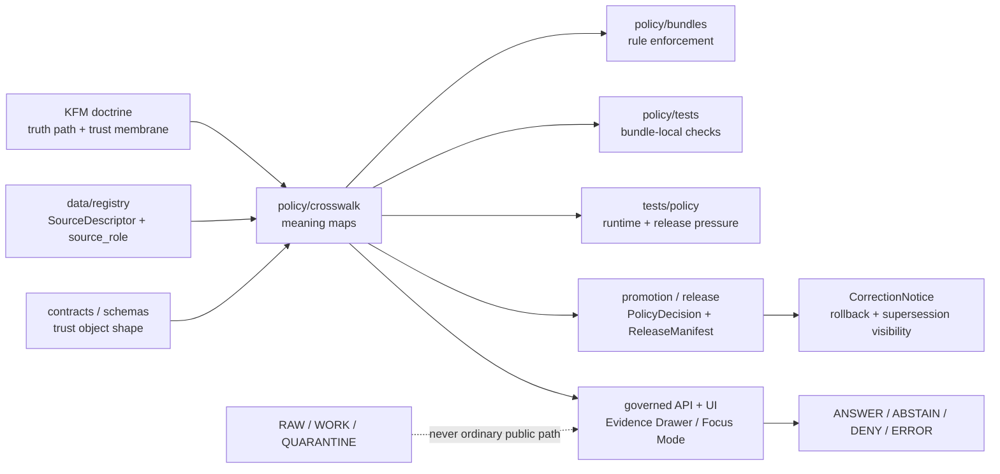

<!-- [KFM_META_BLOCK_V2]
doc_id: kfm://doc/TODO-NEEDS-VERIFICATION
title: Policy Crosswalk
type: standard
version: v1
status: draft
owners: TODO-NEEDS-VERIFICATION
created: 2026-04-26
updated: 2026-04-26
policy_label: TODO-NEEDS-VERIFICATION
related: [TODO-NEEDS-VERIFICATION]
tags: [kfm, policy, crosswalk, governance, evidence]
notes: [Target path policy/crosswalk/README.md; repository tree was not mounted during authoring; owner, doc_id, policy_label, related links, adjacent file inventory, workflow badges, and enforcement claims require branch verification.]
[/KFM_META_BLOCK_V2] -->

<a id="top"></a>

# Policy Crosswalk

Translate KFM policy doctrine into reviewable crosswalk matrices that keep source roles, rights, sensitivity, promotion gates, runtime outcomes, proof objects, and review obligations aligned — without becoming a second policy engine.

<p align="center">
  
  
  
  
  
  
  
</p>

<p align="center">
  <a href="#scope">Scope</a> ·
  <a href="#repo-fit">Repo fit</a> ·
  <a href="#accepted-inputs">Inputs</a> ·
  <a href="#exclusions">Exclusions</a> ·
  <a href="#directory-tree">Tree</a> ·
  <a href="#usage">Usage</a> ·
  <a href="#crosswalk-tables">Tables</a> ·
  <a href="#validation">Validation</a> ·
  <a href="#rollback">Rollback</a> ·
  <a href="#faq">FAQ</a>
</p>

---

## Impact block

| Field | Value |
|---|---|
| **Status** | `draft` |
| **Owners** | `TODO-NEEDS-VERIFICATION` |
| **Target path** | `policy/crosswalk/README.md` |
| **Evidence mode** | `CORPUS_ONLY` / `NO_LOCAL_REPO_EVIDENCE` until a mounted branch proves otherwise. |
| **Primary job** | Keep policy-facing vocabulary, trust seams, finite outcomes, and downstream proof obligations mapped and reviewable. |
| **Truth posture** | **CONFIRMED** doctrine / **PROPOSED** directory role / **UNKNOWN** implementation depth / **NEEDS VERIFICATION** branch inventory. |
| **Policy posture** | Cite-or-abstain; fail closed when rights, source role, sensitivity, review state, release state, or evidence closure is unresolved. |
| **Public posture** | This directory does not authorize publication. It identifies what must be checked before public or semi-public reliance. |

> [!IMPORTANT]
> This README is repo-ready guidance for `policy/crosswalk/`. It does **not** prove executable policy bundles, active CI gates, mounted fixtures, route behavior, runtime wiring, publication enforcement, or release maturity. Those claims require current branch evidence.

| What this document does | What it does not do |
|---|---|
| Defines the governed role of policy crosswalks. | Does not define executable policy by itself. |
| Lists accepted inputs, exclusions, and proof expectations. | Does not replace policy bundles, schemas, validators, source registries, or steward review. |
| Gives row templates, tables, validation checks, and rollback guidance. | Does not claim the target paths, tests, workflows, or runtime consumers already exist. |
| Keeps unresolved owner, path, schema-home, and tooling questions visible. | Does not turn `UNKNOWN` or unclear cases into permissive defaults. |

---

## Scope

`policy/crosswalk/` is the translation lane between KFM policy doctrine and the places where policy meaning must survive implementation pressure.

It should help maintainers answer questions like:

- Which `source_role` can support which `claim_type`?
- Which rights or sensitivity condition must produce `deny`, `restrict`, `generalize`, or `needs-review`?
- Which policy result maps to which `DecisionEnvelope`, `PolicyDecision`, `RuntimeResponseEnvelope`, release gate, or correction path?
- Which downstream proof lane must verify the behavior before a public or semi-public surface can rely on it?
- Which unresolved items remain **NEEDS VERIFICATION** rather than being normalized into quiet acceptance?

The core rule is simple:

> Policy crosswalks make policy meaning inspectable. They do not replace policy bundles, schemas, validators, proofs, release decisions, or steward review.

### Operating law

| Rule | Meaning |
|---|---|
| **Map meaning, do not enforce it here** | Crosswalks explain how doctrine, source roles, rights, sensitivity, runtime outcomes, and proof objects relate. Enforcement belongs in branch-confirmed policy bundles, validators, gates, and runtime code. |
| **Keep authority separated** | Source registries ground `source_role`; schemas/contracts define shape; policy bundles evaluate decisions; proof lanes validate behavior. Crosswalks connect them without becoming any of them. |
| **Preserve finite outcomes** | Runtime-facing mappings must stay inside `ANSWER`, `ABSTAIN`, `DENY`, and `ERROR` unless the governing contract changes. |
| **Fail closed by default** | Unclear rights, sensitivity, source role, review state, or release state should map to `deny`, `restrict`, `generalize`, or `needs-review`, not `allow`. |
| **Name the proof lane** | Material mappings must point to tests, fixtures, validators, review records, release manifests, proof packs, or explicit open verification. |

<p align="right"><a href="#top">Back to top ↑</a></p>

---

## Repo fit

| Relationship | Path | Status | Role |
|---|---|---|---|
| This README | `policy/crosswalk/README.md` | **PROPOSED** | Directory orientation and review contract. |
| Parent policy lane | [`../README.md`](../README.md) | **NEEDS VERIFICATION** | Expected parent boundary for policy surfaces, bundles, fixtures, tests, and runtime coordination. |
| Policy bundles | `../bundles/` | **NEEDS VERIFICATION** | Expected home for executable rule families or equivalent policy data. |
| Policy-local tests | `../tests/` | **NEEDS VERIFICATION** | Expected home for bundle-local assertions. |
| Repo-facing policy proof | [`../../tests/policy/README.md`](../../tests/policy/README.md) | **NEEDS VERIFICATION** | Expected downstream proof lane for runtime, release, and correction pressure. |
| Contracts / object map | `../../contracts/` | **NEEDS VERIFICATION** | Expected semantic contract home for trust-bearing object families. |
| Schemas | `../../schemas/` | **NEEDS VERIFICATION** | Expected machine-shape home where the branch proves it. |
| Source registry | `../../data/registry/` | **NEEDS VERIFICATION** | Expected home for source descriptors and source-role grounding. |
| Receipts / proofs / manifests | `../../data/receipts/`, `../../data/proofs/`, `../../data/manifests/` | **NEEDS VERIFICATION** | Expected emitted-artifact lanes; not policy authority. |
| UI / runtime consumers | `../../apps/`, `../../packages/`, `../../tools/` | **UNKNOWN** | Runtime and UI homes must be verified before crosswalks cite concrete components. |

> [!NOTE]
> Relative links are intentionally conservative. Replace or expand them only after the active branch confirms target files and repository conventions.

### Authority boundary

| Boundary | Crosswalk may do | Crosswalk must not do |
|---|---|---|
| Source authority | Reference `SourceDescriptor`, `source_role`, source rights, and source caveats. | Become a source registry or silently assign authority without registry evidence. |
| Policy authority | Map policy result grammar to obligations, reasons, trust objects, and proof lanes. | Become executable policy, Rego, runtime middleware, or a release approver. |
| Contract authority | Reference trust-bearing object families and required fields. | Define divergent schemas or shadow contract files. |
| Runtime authority | Map policy results to finite runtime outcomes. | Claim route behavior, adapter behavior, or UI behavior without implementation proof. |
| Publication authority | Identify gates and proof expectations. | Approve release, publish artifacts, or override steward review. |

<p align="right"><a href="#top">Back to top ↑</a></p>

---

## Accepted inputs

| Input type | Belongs here when it is used to… | Examples |
|---|---|---|
| Source-role crosswalks | Map source authority to claim burden. | `direct_observation → measurement_claim`, `regulatory_record → statutory_claim`. |
| Rights and sensitivity matrices | Define safe, restricted, generalized, or denied exposure. | `restricted_exact_location → generalize`, `unclear_rights → deny`. |
| Policy-result mappings | Keep result grammar stable and reviewable. | `allow`, `deny`, `restrict`, `generalize`, `needs-review`. |
| Reason / obligation mappings | Make denial and next-step vocabulary diffable. | `RIGHTS_UNCLEAR`, `REQUIRE_TRANSFORM_RECEIPT`, `STEWARD_REVIEW_REQUIRED`. |
| Promotion-gate mappings | Connect policy meaning to release obligations. | Ownership, schema validity, evidence closure, catalog closure, review state. |
| Runtime outcome mappings | Preserve finite user-visible behavior. | `ANSWER`, `ABSTAIN`, `DENY`, `ERROR`. |
| Domain-lane policy seams | Identify domain-specific safety or release burden. | Archaeology exact locations, rare species, DNA/genomics, hydrology flood-role misuse. |
| Gap trackers | Hold unresolved branch, owner, tool, and source questions visibly. | Schema-home ambiguity, OPA availability, source license verification. |

### Minimum fields for a crosswalk row

| Field | Why it exists |
|---|---|
| `crosswalk_id` | Stable review handle. |
| `status` | `CONFIRMED`, `PROPOSED`, `NEEDS VERIFICATION`, or `UNKNOWN`. |
| `policy_seam` | The responsibility boundary being mapped. |
| `source_role` / `claim_type` | Prevents authority collapse. |
| `policy_result` | Finite policy consequence. |
| `runtime_outcome` | Finite user-visible consequence where a runtime surface is involved. |
| `reason_codes` | Stable denial / hold / review vocabulary. |
| `obligation_codes` | Required next action. |
| `trust_objects` | Objects that must carry the meaning forward. |
| `proof_lane` | Where the behavior must be tested or verified. |
| `open_verification` | Remaining branch, source, owner, tooling, or release checks. |
| `notes` | Human-readable caveats and review comments. |

<p align="right"><a href="#top">Back to top ↑</a></p>

---

## Exclusions

| Does **not** belong in `policy/crosswalk/` | Goes instead to | Why |
|---|---|---|
| Executable policy bundles, Rego packages, or equivalent rule engines | `../bundles/` or branch-confirmed policy bundle home | Crosswalks map meaning; bundles enforce rules. |
| Contract or schema definitions | `../../contracts/` and/or `../../schemas/` after ADR resolution | Crosswalks must not become a shadow schema registry. |
| Source descriptors | `../../data/registry/` or verified source registry home | Source identity and role are registry concerns. |
| Generic fixtures | `../fixtures/`, `../tests/`, or `../../tests/policy/` depending on purpose | Crosswalk rows may reference fixtures; they should not own all fixtures. |
| Runtime glue, adapters, or app components | `../../apps/`, `../../packages/`, or verified runtime home | Crosswalks do not prove runtime wiring. |
| Receipts, proof packs, manifests, or catalogs | `../../data/receipts/`, `../../data/proofs/`, `../../data/manifests/`, `../../data/catalog/` | Emitted artifacts are evidence/proof memory, not policy authorship. |
| Publication approval decisions | Release / review / promotion homes after verification | Crosswalks identify required decisions; they do not self-approve release. |
| Emergency, legal, medical, or operational instructions | Official authorities and governed product guidance | KFM policy surfaces must not overstate authority. |

> [!CAUTION]
> A crosswalk row can mention a release gate, but it cannot satisfy that gate. Treat release approval, steward review, sensitivity review, and public publication as separate governed state transitions.

<p align="right"><a href="#top">Back to top ↑</a></p>

---

## Directory tree

The shape below is a **PROPOSED starter layout**. Keep names repo-native if the mounted branch already uses a different convention.

```text
policy/crosswalk/
├── README.md                              # this file
├── source-role-to-claim-policy.md         # PROPOSED
├── rights-sensitivity-release.md          # PROPOSED
├── reason-obligation-reviewer-map.md      # PROPOSED
├── promotion-gate-map.md                  # PROPOSED
├── runtime-outcome-map.md                 # PROPOSED
├── domain-lane-policy-map.md              # PROPOSED
└── gaps.md                                # PROPOSED: unresolved checks, conflicts, and owner gaps
```

| File | Proposed responsibility | First useful rows |
|---|---|---|
| `source-role-to-claim-policy.md` | Map `source_role` to permitted, restricted, or blocked `claim_type`. | Source role unknown; regulatory source used for non-regulatory claim; community observation used as legal status. |
| `rights-sensitivity-release.md` | Map rights and sensitivity classes to release posture. | Rights unclear; exact sensitive geometry; public-safe generalized derivative. |
| `reason-obligation-reviewer-map.md` | Keep reason codes, obligation codes, and review routing diffable. | `RIGHTS_UNCLEAR`, `STEWARD_REVIEW_REQUIRED`, `REQUIRE_TRANSFORM_RECEIPT`. |
| `promotion-gate-map.md` | Connect policy meaning to promotion obligations and release proof. | Evidence closure missing; catalog closure missing; review state missing. |
| `runtime-outcome-map.md` | Map policy and evidence states to runtime outcomes. | `ANSWER`, `ABSTAIN`, `DENY`, `ERROR`. |
| `domain-lane-policy-map.md` | Preserve domain-specific caution without scattering it across runtime code. | Archaeology, rare species, DNA/genomics, critical infrastructure, operational hazards. |
| `gaps.md` | Keep open verification visible and reviewable. | Owner gaps, schema-home ambiguity, OPA/Conftest/Cosign availability, workflow proof. |

> [!WARNING]
> Do not add a parallel `schemas/`, `contracts/`, or executable rule tree under `policy/crosswalk/`. Crosswalk files should point to authoritative homes, not fork them.

<p align="right"><a href="#top">Back to top ↑</a></p>

---

## Quickstart

Run these checks from the repository root before editing this directory.

### 1. Confirm the branch and visible policy surface

```bash
pwd
git status --short
git branch --show-current || true
find policy -maxdepth 3 -type f 2>/dev/null | sort
```

### 2. Inspect adjacent proof and contract homes

```bash
find contracts schemas tests/policy data/registry data/receipts data/proofs data/manifests \
  -maxdepth 3 -type f 2>/dev/null | sort
```

### 3. Search for trust-bearing vocabulary before adding a new mapping

```bash
grep -RInE \
  'SourceDescriptor|source_role|EvidenceBundle|EvidenceRef|DecisionEnvelope|PolicyDecision|RuntimeResponseEnvelope|ReleaseManifest|CatalogMatrix|ProofPack|CorrectionNotice|reason_codes|obligation_codes|reviewer_roles|rights_class|sensitivity_class|ANSWER|ABSTAIN|DENY|ERROR' \
  policy contracts schemas tests data docs apps packages tools 2>/dev/null || true
```

### 4. Verify workflow claims before documenting gate enforcement

```bash
find .github/workflows -maxdepth 2 -type f 2>/dev/null | sort
```

### 5. Keep unresolved authority visible

```bash
grep -RInE \
  'TODO-NEEDS-VERIFICATION|NEEDS VERIFICATION|UNKNOWN|CONFLICTED|schema home|policy home|source registry' \
  policy docs contracts schemas tests data 2>/dev/null || true
```

> [!NOTE]
> Commands are intentionally conservative and read-only. Replace them with repo-native validators once the branch proves the relevant tooling.

<p align="right"><a href="#top">Back to top ↑</a></p>

---

## Usage

### Crosswalk authoring pattern

1. **Name the seam.** Identify the policy boundary: source admission, sensitivity, rights, promotion, runtime answer, correction, or release.
2. **Bind it to trust objects.** Name the object families that must preserve the decision.
3. **Map positive and negative paths.** Every `allow` path needs at least one denial, restriction, review, or abstention counterpart where risk matters.
4. **Point to proof.** Link to branch-confirmed tests, fixtures, validators, review records, or emitted artifacts. Mark missing proof as **NEEDS VERIFICATION**.
5. **Keep authority separated.** Do not bury policy bundles, schemas, source registry data, or runtime logic in the crosswalk.
6. **Record uncertainty.** Do not convert unknown rights, unclear source roles, or missing review into permissive defaults.

### Row lifecycle

| State | Meaning | Required movement |
|---|---|---|
| `draft` | Proposed row exists for review. | Must name seam, result, reason/obligation shape, and open verification. |
| `reviewed` | Steward or maintainer has checked meaning. | Must retain unresolved checks if implementation proof is missing. |
| `branch-confirmed` | Branch evidence confirms linked files, tests, schemas, or policy bundle homes. | May replace placeholders with repo-backed links. |
| `enforced` | A verified validator, policy bundle, runtime gate, or release gate carries the mapping. | Must link to proof lane or artifact. |
| `superseded` / `withdrawn` | A newer row or correction replaces it. | Must preserve lineage and reason. |

> [!IMPORTANT]
> `branch-confirmed` and `enforced` are not documentation vibes. They require actual repo evidence, tests, workflow output, runtime proof, or emitted artifacts.

### Illustrative starter card — sensitive exact location

This is a shape example, not proof of a checked-in fixture or runtime behavior.

```yaml
crosswalk_id: policy-crosswalk:example-sensitive-location-public
status: PROPOSED
policy_seam: sensitive-location-publication
source_role: steward_controlled_occurrence
claim_type: public_map_feature
policy_result: generalize
runtime_outcome: ANSWER
reason_codes:
  - EXACT_LOCATION_RESTRICTED
obligation_codes:
  - REQUIRE_GEOPRIVACY_TRANSFORM
  - REQUIRE_TRANSFORM_RECEIPT
  - REQUIRE_REVIEW_RECORD
trust_objects:
  - DecisionEnvelope
  - EvidenceBundle
  - ReleaseManifest
  - CorrectionNotice
proof_lane: tests/policy/
open_verification:
  - Verify exact sensitive-geometry policy bundle home.
  - Verify transform receipt schema and release-manifest linkage.
notes:
  - "Exact geometry must not flow to ordinary public clients."
  - "Public answer may proceed only after transform and review evidence."
```

### Illustrative starter card — unclear rights

```yaml
crosswalk_id: policy-crosswalk:example-unclear-rights
status: PROPOSED
policy_seam: rights-publication
source_role: third_party_dataset
claim_type: public_layer_release
policy_result: deny
runtime_outcome: DENY
reason_codes:
  - RIGHTS_UNCLEAR
obligation_codes:
  - REQUIRE_RIGHTS_REVIEW
  - REQUIRE_SOURCE_DESCRIPTOR_UPDATE
trust_objects:
  - SourceDescriptor
  - PolicyDecision
  - ReleaseManifest
proof_lane: tests/policy/
open_verification:
  - Verify current source license and redistribution terms.
notes:
  - "Unknown rights block public release until source terms are verified."
```

### Illustrative starter card — weak or unresolved evidence

```yaml
crosswalk_id: policy-crosswalk:example-unresolved-evidence-ref
status: PROPOSED
policy_seam: evidence-resolution-runtime
source_role: TODO-NEEDS-VERIFICATION
claim_type: focus_mode_answer
policy_result: needs-review
runtime_outcome: ABSTAIN
reason_codes:
  - EVIDENCE_REF_UNRESOLVED
  - SUPPORT_INSUFFICIENT
obligation_codes:
  - REQUIRE_EVIDENCEBUNDLE_RESOLUTION
  - REQUIRE_CITATION_VALIDATION
trust_objects:
  - EvidenceRef
  - EvidenceBundle
  - CitationValidationReport
  - RuntimeResponseEnvelope
proof_lane: tests/policy/
open_verification:
  - Verify EvidenceRef resolver contract and citation validator home.
notes:
  - "Generated language must not fill evidence gaps."
```

<p align="right"><a href="#top">Back to top ↑</a></p>

---

## Diagram



<p align="right"><a href="#top">Back to top ↑</a></p>

---

## Crosswalk tables

### Policy result grammar

| Result / state | Meaning | Expected consequence |
|---|---|---|
| `allow` | Request or release is policy-safe as scoped. | Continue with named obligations and evidence linkage. |
| `deny` | Rights, sensitivity, source role, actor, or release posture blocks the action. | Explicit denial with stable reason codes; no quiet fallback. |
| `generalize` | Exposure is allowed only after masking, aggregation, or geometry reduction. | Transform state and receipt linkage must remain visible. |
| `restrict` | Surface is limited to a narrower actor, role, mode, or access class. | Public path must not inherit privileged scope. |
| `needs-review` / `STEWARD_REVIEW` | Machine policy cannot safely finish alone. | Route to auditable review with reason and obligation codes. |
| `withdrawn` | Released material has been removed from outward use. | Preserve lineage and correction visibility. |
| `superseded` | A newer reviewed state replaces an older one. | Keep prior release trace and replacement link visible. |

### Runtime outcomes

| Outcome | Meaning | Crosswalk expectation |
|---|---|---|
| `ANSWER` | Evidence is sufficient and policy-safe. | Evidence and trust cues survive into user-facing surfaces. |
| `ABSTAIN` | Evidence is weak, stale, partial, conflicted, ambiguous, unresolved, or out of scope. | Decline or narrow scope with inspectable reason. |
| `DENY` | Policy blocks the request. | Calm refusal with accountable policy reason. |
| `ERROR` | Technical failure prevented governed handling. | Explicit failure; no fake evidence or policy success. |

### Policy result to runtime outcome guide

| Policy / evidence state | Usual runtime outcome | Notes |
|---|---|---|
| `allow` + sufficient evidence + release-safe scope | `ANSWER` | Must preserve citations, review state, and relevant limitations. |
| `allow` + insufficient support | `ABSTAIN` | Evidence burden outranks permissive policy. |
| `generalize` + transform complete + review complete | `ANSWER` | Answer must reflect generalized scope and not leak exact restricted detail. |
| `generalize` + transform missing | `DENY` or `ABSTAIN` | Use `DENY` for policy block; `ABSTAIN` for unresolved support. |
| `restrict` + actor lacks access | `DENY` | Do not downgrade by silently revealing public fragments unless separately approved. |
| `needs-review` | `ABSTAIN` or `DENY` | Choose based on whether policy blocks now or evidence/review is incomplete. |
| `deny` | `DENY` | Include stable reason code. |
| technical failure | `ERROR` | Never convert technical failure into an authoritative answer. |

### Crosswalk matrix columns

| Column | Required? | Notes |
|---|---:|---|
| `crosswalk_id` | yes | Stable ID for review and diffing. |
| `policy_seam` | yes | Source admission, rights, sensitivity, promotion, runtime, correction, or domain-specific seam. |
| `status` | yes | Use the narrowest truthful label. |
| `source_role` | conditional | Required when a source authority claim is involved. |
| `claim_type` | conditional | Required when a public or semi-public claim is being mapped. |
| `policy_result` | yes | Must use finite grammar. |
| `runtime_outcome` | conditional | Required when the crosswalk affects Focus Mode, Evidence Drawer, API answers, exports, or map popups. |
| `reason_codes` | yes | Empty reasons are only acceptable for well-supported `allow` rows with explicit obligations. |
| `obligation_codes` | conditional | Required for `allow`, `generalize`, `restrict`, and `needs-review` when downstream work remains. |
| `trust_objects` | yes | Names the objects that must carry the meaning forward. |
| `proof_lane` | yes | Points to tests, fixtures, validators, or emitted proof artifacts. |
| `open_verification` | conditional | Required for any row not fully branch-confirmed. |

### Responsibility seams

| Surface | Owns what | Must not become |
|---|---|---|
| `policy/crosswalk/` | Meaning maps between doctrine, policy results, trust objects, and proof lanes. | Rule engine, schema registry, runtime adapter, or release approver. |
| `policy/bundles/` | Executable or machine-readable rule families. | Generic fixture warehouse or app glue. |
| `policy/fixtures/` | Small policy examples where branch convention supports them. | Canonical contract home. |
| `policy/tests/` | Bundle-local assertions. | End-to-end runtime proof. |
| `tests/policy/` | Repo-facing proof that policy survives runtime, release, and correction pressure. | A second policy bundle tree. |
| `contracts/` / `schemas/` | Contract and machine-shape authority after branch/ADR verification. | Hidden policy decision store. |
| `data/registry/` | SourceDescriptor and source-role grounding. | Policy-result authority. |
| `data/receipts/` / `data/proofs/` / `data/manifests/` | Process memory, proof memory, and release memory. | Policy authorship or review approval. |

<p align="right"><a href="#top">Back to top ↑</a></p>

---

## Domain caution map

| Domain / surface | Default crosswalk posture | Typical negative path |
|---|---|---|
| Archaeology, sacred sites, burials, cultural heritage | Deny exact public locations unless steward-reviewed public-safe transforms exist. | `deny` or `generalize` with `STEWARD_REVIEW_REQUIRED`. |
| Rare species, habitat, fauna, flora | Fail closed on exact occurrence exposure. | `generalize` with geoprivacy receipt, or `deny` when transform/review missing. |
| People, genealogy, DNA/genomics, living persons | Restrict living-person and DNA/genomic material by default; separate assertions from canonical records. | `deny` or `restrict` with review and rights obligations. |
| Critical infrastructure, roads, rail, facilities | Separate observations, restrictions, administrative status, operational context, and public-safe representation. | `restrict`, `generalize`, or `needs-review`. |
| Hazards and operational context | Do not become an emergency alert system; preserve issue time, expiry, source role, and official-source boundaries. | `ABSTAIN` or `DENY` for life-safety instruction requests. |
| Hydrology, soils, geology, atmosphere, agriculture | Preserve source role, model/observation/regulatory distinction, units, uncertainty, and temporal basis. | `ABSTAIN` on source-role mismatch, stale evidence, or unsupported inference. |
| 3D, scenes, digital twins | Treat visual realism as a derived carrier, not proof. | `ABSTAIN` when scene lacks evidence burden or review state. |

<p align="right"><a href="#top">Back to top ↑</a></p>

---

## Review checklist

Before a crosswalk change is ready for review:

- [ ] `doc_id`, `owners`, `policy_label`, and `related` were replaced with repo-backed values or left as explicit placeholders.
- [ ] The active branch was scanned for actual `policy/`, `contracts/`, `schemas/`, `tests/`, `data/`, `.github/workflows/`, `apps/`, and `packages/` homes.
- [ ] No implementation claim outruns current branch evidence.
- [ ] Every `allow` has a corresponding negative or review-bearing path where risk matters.
- [ ] Reason codes and obligation codes are stable enough to diff.
- [ ] Runtime outcomes remain finite: `ANSWER`, `ABSTAIN`, `DENY`, `ERROR`.
- [ ] Sensitive, unclear-rights, unclear-source-role, and unresolved-review cases fail closed.
- [ ] No crosswalk file creates a second schema, contract, source registry, or executable policy authority.
- [ ] A downstream proof lane is named for each material policy mapping.
- [ ] Correction, withdrawal, and supersession remain visible rather than overwritten.
- [ ] Any OPA/Rego/Conftest/Sigstore/Cosign/tooling claim is marked **NEEDS VERIFICATION** unless the branch proves it.
- [ ] Rollback is simple: revert the crosswalk change without changing runtime, canonical data, or release artifacts.

<p align="right"><a href="#top">Back to top ↑</a></p>

---

## Validation

Use the checks below as a starting point. They are not proof of enforcement until the mounted branch confirms paths, validators, workflows, and expected outputs.

### Markdown and structure checks

```bash
# Confirm file exists at the expected location after repo placement.
test -f policy/crosswalk/README.md

# Confirm KFM meta block remains present.
grep -n '\[KFM_META_BLOCK_V2\]' policy/crosswalk/README.md
grep -n '\[/KFM_META_BLOCK_V2\]' policy/crosswalk/README.md

# Confirm no hidden implementation confidence slipped in.
grep -RInE 'passing|production|published|verified|secure|complete|implemented|deployed' \
  policy/crosswalk 2>/dev/null || true
```

### Crosswalk integrity checks

```bash
# Confirm rows and examples use finite policy grammar.
grep -RInE 'allow|deny|generalize|restrict|needs-review|STEWARD_REVIEW|withdrawn|superseded' \
  policy/crosswalk 2>/dev/null || true

# Confirm runtime outcomes remain finite.
grep -RInE 'ANSWER|ABSTAIN|DENY|ERROR' \
  policy/crosswalk policy contracts schemas tests apps packages docs 2>/dev/null || true

# Confirm risky terms resolve to negative or review-bearing posture.
grep -RInE 'rights_unclear|sensitivity|exact_location|generalize|restrict|deny|review|DNA|archaeology|rare species' \
  policy/crosswalk policy tests contracts schemas data docs 2>/dev/null || true
```

### Proof-lane checks

```bash
# Confirm proof lanes cited by crosswalks actually exist before removing NEEDS VERIFICATION labels.
find tests/policy policy/tests policy/fixtures -maxdepth 3 -type f 2>/dev/null | sort

# Confirm policy bundle homes before claiming enforcement.
find policy/bundles -maxdepth 3 -type f 2>/dev/null | sort

# Confirm release, receipts, proofs, and manifests before claiming publication readiness.
find data/receipts data/proofs data/manifests data/catalog release -maxdepth 3 -type f 2>/dev/null | sort
```

> [!WARNING]
> A successful grep is not a passing policy test. It is a low-cost guardrail for review. Branch-native validators and CI must carry final enforcement claims.

<p align="right"><a href="#top">Back to top ↑</a></p>

---

## Rollback

Rollback should be boring.

| Change type | Rollback action | What must remain visible |
|---|---|---|
| README-only edit | Revert the Markdown commit. | Reason for revert and any unresolved verification gap. |
| Added crosswalk file | Revert file addition or mark file `withdrawn` if review history must remain visible. | Supersession or withdrawal note. |
| Changed policy-result mapping | Revert row or add superseding row; do not silently overwrite release history. | Prior row, replacement row, reason code, reviewer note. |
| Mapping linked to policy bundle | Revert crosswalk and policy bundle together only if both changed in same PR. | Test result and proof-lane impact. |
| Mapping linked to release behavior | Do not rely on README rollback alone. Coordinate with release, manifest, proof, and correction paths. | `CorrectionNotice`, `RollbackPlan`, or release equivalent after branch verification. |

> [!IMPORTANT]
> Crosswalk rollback does not undo runtime, release, or publication effects by itself. If a mapping influenced outward behavior, rollback must involve the governed release/correction surface.

<p align="right"><a href="#top">Back to top ↑</a></p>

---

## Open verification backlog

| Item | Status | Why it matters |
|---|---|---|
| Confirm `policy/crosswalk/` exists or should be created. | **NEEDS VERIFICATION** | Avoids creating a directory that conflicts with repo convention. |
| Confirm parent `policy/` structure and bundle home. | **NEEDS VERIFICATION** | Prevents crosswalks from pointing to wrong enforcement location. |
| Resolve `contracts/` vs `schemas/` authority. | **NEEDS VERIFICATION** / **CONFLICTED** | Prevents shadow schema drift. |
| Confirm `tests/policy/` and `policy/tests/` roles. | **NEEDS VERIFICATION** | Keeps local bundle assertions separate from end-to-end proof. |
| Confirm source registry path. | **NEEDS VERIFICATION** | `source_role` cannot be authoritative without registry grounding. |
| Confirm reason/obligation code registry or accepted home. | **NEEDS VERIFICATION** | Prevents duplicate denial vocabulary. |
| Confirm OPA/Rego/Conftest/Cosign/Sigstore availability before naming enforcement. | **NEEDS VERIFICATION** | Tooling claims are version- and environment-sensitive. |
| Confirm owners and reviewer roles. | **NEEDS VERIFICATION** | Steward review cannot be routed to invented owners. |
| Confirm release, correction, and rollback object homes. | **NEEDS VERIFICATION** | Crosswalks must not become release memory. |

<p align="right"><a href="#top">Back to top ↑</a></p>

---

## FAQ

### Does `policy/crosswalk/` define policy?

Not by itself. It maps policy meaning and proof obligations. Executable policy belongs in the branch-confirmed policy bundle home.

### Does this directory prove runtime behavior?

No. Runtime behavior must be proven through governed API, UI, end-to-end, or release proof lanes. Crosswalks should point to that evidence, not replace it.

### Why not put schemas here?

Because policy crosswalks are about meaning and responsibility seams. Contract and schema authority must stay in the verified contract/schema home to avoid drift.

### Why include runtime outcomes in a policy crosswalk?

Because public-facing behavior must remain finite and inspectable. A policy block should surface as `DENY`, weak evidence should surface as `ABSTAIN`, and technical failure should surface as `ERROR`, not as a misleading answer.

### What should happen when rights or sensitivity are unclear?

Fail closed. Use `deny`, `restrict`, `generalize`, or `needs-review` with stable reason and obligation codes. Do not let unclear cases become public by omission.

### What is the most important maintenance rule?

Do not let crosswalks become decorative. Each material row should point to the object, policy, test, review, release, or correction surface that carries the obligation forward.

<p align="right"><a href="#top">Back to top ↑</a></p>

---

## Appendix

<details>
<summary>Crosswalk row template</summary>

```yaml
crosswalk_id: policy-crosswalk:<slug>
status: TODO-CONFIRMED-PROPOSED-UNKNOWN-NEEDS-VERIFICATION
policy_seam: TODO
source_role: TODO
claim_type: TODO
policy_result: TODO-allow-deny-generalize-restrict-needs-review-withdrawn-superseded
runtime_outcome: TODO-ANSWER-ABSTAIN-DENY-ERROR
reason_codes:
  - TODO
obligation_codes:
  - TODO
trust_objects:
  - TODO
proof_lane: TODO
open_verification:
  - TODO
notes:
  - TODO
```

</details>

<details>
<summary>Compact Markdown table template</summary>

```markdown
| crosswalk_id | status | policy_seam | policy_result | runtime_outcome | proof_lane | open_verification |
|---|---|---|---|---|---|---|
| `policy-crosswalk:<slug>` | `PROPOSED` | `TODO` | `deny` | `DENY` | `tests/policy/` | `TODO` |
```

</details>

<details>
<summary>Glossary</summary>

| Term | Working meaning |
|---|---|
| **Inspectable claim** | A consequential public or semi-public statement that can be reconstructed to admissible evidence, source role, policy posture, review state, release state, and correction lineage. |
| **Trust membrane** | Governed boundary between canonical/internal stores and public or role-limited surfaces. |
| **EvidenceRef** | Stable reference token that points to evidence. |
| **EvidenceBundle** | Policy-safe resolved evidence payload. |
| **DecisionEnvelope** | Decision-bearing object that carries result, reasons, obligations, and review posture. |
| **PolicyDecision** | Policy-specific decision record used by gates, release, or runtime paths. |
| **RuntimeResponseEnvelope** | Finite runtime response wrapper: `ANSWER`, `ABSTAIN`, `DENY`, or `ERROR`. |
| **ReleaseManifest** | Release-scope object linking outward artifacts to validation, policy, evidence, and rollback state. |
| **CorrectionNotice** | Visible correction, withdrawal, or supersession object preserving release history. |
| **Fail closed** | Default to deny, restrict, generalize, quarantine, or review when evidence, rights, source role, or sensitivity is unresolved. |

</details>

<details>
<summary>Maintainer command appendix</summary>

```bash
# Confirm this README is not the only policy/crosswalk artifact.
find policy/crosswalk -maxdepth 2 -type f 2>/dev/null | sort

# Confirm policy-result vocabulary is not duplicated into hidden homes.
grep -RInE 'allow|deny|generalize|restrict|needs-review|STEWARD_REVIEW|withdrawn|superseded' \
  policy contracts schemas tests data docs 2>/dev/null || true

# Confirm runtime outcomes remain finite.
grep -RInE 'ANSWER|ABSTAIN|DENY|ERROR' \
  policy contracts schemas tests apps packages docs 2>/dev/null || true

# Confirm sensitive or unclear-rights paths do not silently allow public release.
grep -RInE 'rights_unclear|sensitivity|exact_location|generalize|restrict|deny|review' \
  policy tests contracts schemas data docs 2>/dev/null || true
```

</details>

