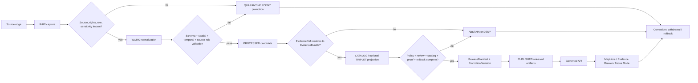
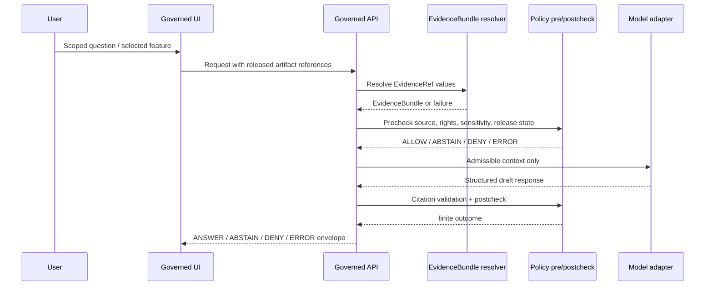

<!-- [KFM_META_BLOCK_V2]
doc_id: kfm://doc/NEEDS_UUID_domain-lane-policy-map
title: Domain Lane Policy Map
type: standard
version: v1.1-draft
status: draft
owners: governance/policy owner — NEEDS_VERIFICATION
created: NEEDS_VERIFICATION
updated: 2026-04-27
policy_label: public-draft-NEEDS_VERIFICATION
related: [NEEDS_VERIFICATION]
tags: [kfm, policy, crosswalk, domain-lanes, governance, evidence]
notes: [Repo path presence, owner, doc_id, creation date, adjacent policy files, schema homes, validators, tests, and workflow links require mounted-repo verification.]
[/KFM_META_BLOCK_V2] -->

# Domain Lane Policy Map

Map KFM domain lanes to default policy burdens, release posture, review gates, and public-interface constraints.

<p align="center">
  
  
  
  
  
</p>

> [!IMPORTANT]
> This file is a **policy crosswalk**, not a policy engine, source registry, schema, release manifest, proof object, or runtime enforcement surface. It should guide policy-as-code, validators, fixtures, Evidence Drawer payloads, Focus Mode behavior, and promotion review without claiming that any of those implementations already exist.

## Quick navigation

| Start here | Crosswalk | Runtime trust | Adoption |
|---|---|---|---|
| [Scope](#1-scope) · [Evidence boundary](#2-evidence-and-repo-boundary) · [Repo fit](#3-repo-fit) | [Policy flow](#4-kfm-policy-law-in-one-flow) · [Policy families](#5-shared-policy-families) · [Domain lanes](#6-domain-lane-crosswalk) | [Escalation](#7-escalation-rules) · [Evidence Drawer and Focus Mode](#8-evidence-drawer-and-focus-mode-requirements) | [Machine-readable sketch](#9-proposed-machine-readable-shape) · [Definition of done](#10-definition-of-done) · [Change discipline](#11-review-rollback-and-change-discipline) |

## At a glance

| Field | Working value |
|---|---|
| Document role | Governance crosswalk for lane-level burden, release posture, review gates, and UI/AI constraints. |
| Target path | `policy/crosswalk/domain-lane-policy-map.md` — **PROPOSED / NEEDS VERIFICATION**. |
| Evidence mode | **CORPUS_ONLY / NO_LOCAL_REPO_EVIDENCE** for implementation behavior. |
| Default truth posture | Cite-or-abstain; deny unsafe exposure; fail closed on unresolved rights, sensitivity, review, or release state. |
| Default publication posture | Public only after evidence, rights, source-role, sensitivity, review, catalog, proof, release, rollback, and correction obligations close. |
| Normal consumers | Policy-as-code, validators, fixtures, source stewards, release reviewers, Evidence Drawer, Focus Mode, and governed API response design. |
| Non-consumers | Public clients, raw model output, direct source connectors, and direct canonical/internal-store readers. |

---

## 1. Scope

This crosswalk gives maintainers one place to answer:

> “For this domain lane, what policy burden applies before KFM may ingest, validate, publish, map, summarize, or explain a claim?”

It is intended for governance reviewers, source stewards, domain-lane owners, API/UI implementers, Focus Mode implementers, validator authors, fixture authors, and release reviewers deciding whether a candidate can move toward publication.

### In scope

This document covers lane-level defaults for:

- source-role discipline;
- rights and redistribution posture;
- sensitivity, precision, and geoprivacy;
- evidence closure and citation behavior;
- review and stewardship requirements;
- public-safe geometry and derived artifacts;
- Evidence Drawer and Focus Mode obligations;
- promotion, correction, withdrawal, and rollback triggers.

### Out of scope

This document does **not** define or prove:

- final Rego/OPA rules;
- JSON Schema or OpenAPI contracts;
- source-specific allowlists;
- production authorization roles;
- public API route names;
- UI component paths;
- source credentials or live connector behavior;
- branch protection, CI workflows, or deployed runtime enforcement.

Those items require mounted-repo verification before they can be claimed as implemented.

### What this file should prevent

| Anti-pattern | Why this crosswalk blocks it |
|---|---|
| Treating a map layer as truth | Lanes carry evidence, source-role, review, release, and correction burden even when displayed as tiles, popups, scenes, graph edges, or summaries. |
| Publishing a weakly supported claim because it is visually polished | Public surfaces must resolve EvidenceRef to EvidenceBundle and pass policy/review gates before making consequential claims. |
| Borrowing a low-risk lane’s burden for a high-risk lane | Sensitive lanes retain their own review, geoprivacy, consent, cultural, legal, or public-safety burden. |
| Treating AI output as proof | Focus Mode is interpretive only and must return finite, evidence-bounded outcomes. |
| Confusing prior plans with implementation | PROPOSED paths, schemas, validators, policies, fixtures, and routes remain unverified until current repo evidence proves them. |

[Back to top](#domain-lane-policy-map)

---

## 2. Evidence and repo boundary

| Claim class | Status | Working interpretation |
|---|---:|---|
| KFM doctrine | **CONFIRMED from attached corpus** | KFM is governed, evidence-first, map-first, time-aware, policy-aware, and centered on inspectable claims. |
| Target file path | **PROPOSED / NEEDS VERIFICATION** | `policy/crosswalk/domain-lane-policy-map.md` is the requested target path, but current repo contents were not visible during this authoring pass. |
| Current implementation | **UNKNOWN** | No mounted KFM checkout, policy files, schemas, workflows, tests, logs, dashboards, or proof objects were available for direct inspection. |
| Policy IDs in this file | **PROPOSED** | The `P0`–`P12` identifiers are editorial crosswalk handles unless a future repo-backed registry adopts them. |
| Domain lane release posture | **PROPOSED from doctrine and lane reports** | Defaults are conservative and should be tightened or relaxed only through source descriptors, policy tests, and review records. |
| External standards and live source facts | **NEEDS VERIFICATION** | Live endpoints, versions, source terms, rights, credentials, rate limits, and operational behavior must be rechecked before activation. |

> [!NOTE]
> Lower-level implementation evidence may refine this file later. It should not silently override KFM doctrine; conflicts should be resolved through ADRs, test fixtures, policy review, and change notes.

### Evidence labels used here

| Label | Use in this document |
|---|---|
| `CONFIRMED` | Verified from current attached KFM corpus, current visible workspace evidence, generated artifact evidence, or other admissible evidence available to the authoring pass. |
| `PROPOSED` | Recommended design, path, schema, validator, policy, workflow, or runtime behavior not verified as current implementation. |
| `UNKNOWN` | Not verified strongly enough because current repo files, tests, workflows, logs, dashboards, or runtime evidence were unavailable. |
| `NEEDS VERIFICATION` | Checkable value that must be verified before use as current fact. |
| `CONFLICTED` | Evidence layers disagree or authority is unresolved. |
| `ABSTAIN` | Evidence is insufficient to make the requested claim. |
| `DENY` | Policy, safety, rights, sensitivity, review, or release boundary blocks the requested publication/exposure/action. |
| `ERROR` | Technical or process failure prevents a reliable result. |

[Back to top](#domain-lane-policy-map)

---

## 3. Repo fit

**Target path:** `policy/crosswalk/domain-lane-policy-map.md`

**Document role:** standard governance crosswalk for translating domain-lane burden into policy gates, release posture, and UI/AI constraints.

### Upstream inputs to verify

These are likely upstream control surfaces. Their exact paths and names require repo inspection.

| Surface | Expected role | Status |
|---|---|---:|
| Source authority / source registry | Defines source identity, source role, rights, cadence, sensitivity, and activation state. | NEEDS VERIFICATION |
| Lifecycle doctrine | Defines `RAW -> WORK/QUARANTINE -> PROCESSED -> CATALOG/TRIPLET -> PUBLISHED`. | NEEDS VERIFICATION |
| Evidence contracts | Defines `EvidenceRef`, `EvidenceBundle`, claim envelopes, and citation closure. | NEEDS VERIFICATION |
| Promotion contracts | Defines `DecisionEnvelope`, `PromotionDecision`, `ReleaseManifest`, proof pack, rollback reference. | NEEDS VERIFICATION |
| UI trust contracts | Defines Evidence Drawer, Focus Mode, trust chips, finite outcomes, and negative states. | NEEDS VERIFICATION |
| Domain-lane docs | Defines lane-specific object families, source risks, and release constraints. | NEEDS VERIFICATION |
| ADRs / change records | Resolve schema-home, policy-home, and crosswalk-registry authority. | NEEDS VERIFICATION |

### Downstream consumers

This crosswalk should be consumed by:

- `policy/**` deny/allow rules;
- `tools/validators/**` source-role, evidence, rights, geoprivacy, freshness, and release validators;
- `tests/fixtures/**` positive and negative lane fixtures;
- `apps/**` or `packages/**` governed API response envelopes;
- map layer descriptors and Evidence Drawer payloads;
- Focus Mode / governed AI runtime envelopes;
- release review and rollback runbooks;
- documentation control-plane indexes and policy-navigation pages.

### Repo adoption posture

| Adoption step | Minimum safe action | Do not do yet |
|---|---|---|
| Verify file home | Confirm target path and neighboring policy docs in mounted repo. | Create parallel policy homes without ADR. |
| Map policy IDs | Decide whether `P0`–`P12` become registry IDs, aliases, or doc-only handles. | Treat editorial IDs as implemented policy rules. |
| Add fixtures | Create positive and negative lane fixtures. | Publish any lane because the crosswalk exists. |
| Wire UI/AI | Add Evidence Drawer and Focus Mode fixtures against governed envelopes. | Allow UI or AI to read RAW/WORK/QUARANTINE or direct model output. |
| Promote | Require validation, policy, review, catalog, proof, release, rollback, and correction closure. | Treat promotion as a file move or tile alias change. |

[Back to top](#domain-lane-policy-map)

---

## 4. KFM policy law in one flow

The policy burden follows the claim, not the display surface.



**Reading rule:** a tile, map popup, graph edge, scene, dashboard, export, AI answer, or story node may carry a claim only when the claim can be reconstructed to evidence, source role, time/spatial scope, policy posture, review state, release state, and correction lineage.

### Claim-carrier rule

| Carrier | Allowed role | Not allowed role |
|---|---|---|
| MapLibre layer / popup | Render released, policy-safe artifacts and expose trust state. | Canonical truth, policy authority, citation authority, or direct raw-store reader. |
| Cesium scene / story node | Conditional downstream 3D explanation where 3D carries evidence burden. | Default truth surface or realism-based certainty. |
| Graph / triplet projection | Derived reasoning/navigation layer. | Replacement for canonical evidence or policy decisions. |
| Search/vector index | Rebuildable retrieval accelerator. | Sovereign truth or uncited claim source. |
| Focus Mode / governed AI | Evidence-bounded interpretation with finite outcomes. | Root truth, direct public model client, or proof object. |
| Dashboard / export | Released view with visible source/review/release/correction state. | Unreviewed publication shortcut. |

[Back to top](#domain-lane-policy-map)

---

## 5. Shared policy families

The policy families below are crosswalk handles. They should be wired to actual policy files, schemas, validators, and tests only after repo conventions are verified.

| ID | Policy family | Governing question | Minimum public-release burden |
|---:|---|---|---|
| `P0` | Source admission | Is the source identified, role-labeled, rights-reviewed, cadence-known, and allowed for the requested use? | SourceDescriptor or equivalent record exists; unknown rights block public promotion. |
| `P1` | Lifecycle state | Is the record in an allowed lifecycle state for this surface? | Public clients never read `RAW`, `WORK`, `QUARANTINE`, canonical restricted stores, or model runtimes directly. |
| `P2` | Evidence closure | Can every consequential claim resolve to admissible evidence? | EvidenceRef resolves to EvidenceBundle; missing support returns `ABSTAIN` or `DENY`. |
| `P3` | Rights and redistribution | Are license, attribution, access, redistribution, and downstream-use obligations satisfied? | Unknown or restricted rights block public release unless a policy-approved exception exists. |
| `P4` | Sensitivity and geoprivacy | Could release expose protected people, locations, infrastructure, species, archaeological sites, cultural resources, or private data? | Sensitive exact geometry fails closed; release requires suppression, generalization, redaction, or staged access. |
| `P5` | Source-role authority | Is the source being used only for claims it is competent to support? | Observations, regulatory layers, assessor rows, title instruments, models, alerts, remote-sensing detections, and narratives are not interchangeable. |
| `P6` | Time, freshness, and validity | Is the claim’s time basis explicit and current enough for its purpose? | Must carry observed/effective/recording/valid/as-of/retrieval time as appropriate; stale or expired operational context is visibly qualified or blocked. |
| `P7` | Review and stewardship | Does this lane require human, steward, cultural, legal, or domain review? | ReviewRecord or equivalent decision is required where sensitivity, sovereignty, cultural context, DNA, living persons, archaeology, rare species, or critical infrastructure are implicated. |
| `P8` | Catalog, proof, and release | Are catalog closure, proof objects, release manifest, and rollback target complete? | Promotion is a governed state transition, not a file move or UI toggle. |
| `P9` | Public interface and AI boundary | Does UI/API/AI expose only governed outputs with finite trust state? | Evidence Drawer and Focus Mode consume released evidence through governed APIs; no raw model output or direct browser-to-model-provider path. |
| `P10` | Correction, supersession, and rollback | Can the claim be corrected, withdrawn, superseded, or rolled back without erasing lineage? | CorrectionNotice / rollback reference / supersession links exist when public meaning changes. |
| `P11` | Public-safety and legal-context caution | Could the output be misread as official emergency, legal, medical, title, regulatory, or life-safety instruction? | Use context labels, disclaimers, official-source routing, and denials where KFM is not the authority. |
| `P12` | Local exposure and access boundary | Is local or third-party access denied by default and auditable? | AuthN/AuthZ, logging, least privilege, no-public-raw-path, and no-direct-internal-store controls are required before exposure. |

### Policy-family grouping

| Group | Families | Practical meaning |
|---|---|---|
| Admission | `P0 P3 P5` | Can this source support this kind of claim for this audience? |
| Lifecycle and evidence | `P1 P2 P6` | Is the claim supported, in the right state, and time-aware? |
| Sensitivity and review | `P4 P7 P11 P12` | Could release cause harm, confusion, legal exposure, or access-boundary failure? |
| Publication and repair | `P8 P9 P10` | Can the output be released, inspected, cited, corrected, and rolled back? |

[Back to top](#domain-lane-policy-map)

---

## 6. Domain-lane crosswalk

### Reading the crosswalk

- **Default release posture** is conservative. A lane may publish a narrower public-safe product only after evidence, rights, review, catalog, proof, release, rollback, and correction gates pass.
- **Default public outcome** describes the expected runtime response if the necessary burden is or is not satisfied.
- **Policy overlays** reference the shared policy families above.
- **Blocking condition** lists the most common reason the lane should abstain, deny, quarantine, or hold promotion.

### Posture legend

| Posture | Meaning |
|---|---|
| Public-safe after release | Public output can exist after normal KFM proof and release closure. |
| Contextual by default | Output may be public, but must be labeled as context, model, regulatory layer, observation, or interpretation as appropriate. |
| Generalized public derivative | Public products should use generalized, redacted, buffered, masked, aggregated, or otherwise transformed outputs. |
| Restricted assertion-first | Assertions may exist, but public exposure is denied or restricted unless evidence, consent, review, and policy allow it. |
| Exact public denied by default | Exact public location or precision is blocked unless an approved reviewed transform or exception exists. |

### Lane posture matrix

| Domain lane | Default release posture | Default public outcome | Required overlays | Primary blocking condition |
|---|---|---|---|---|
| Hydrology | Public-safe after governed release. | `ANSWER` for released, cited, non-emergency hydrology context; `ABSTAIN` if source/time/evidence closure fails. | `P0 P1 P2 P3 P5 P6 P8 P9 P10 P11` | Hydrology claim drifts into hazards, regulatory certainty, or emergency guidance. |
| Soil and soil moisture | Public-safe when source role, units, support, time, and observed/derived status are explicit. | `ANSWER` for bounded soil context; `ABSTAIN` for unsupported extrapolation. | `P0 P1 P2 P3 P5 P6 P8 P9 P10` | Map unit, source version, scale/support, or observation/model boundary missing. |
| Atmosphere, air, climate, and Earth observation | Contextual by default. | `ANSWER` with visible knowledge-character labels; `ABSTAIN` when model/observation/freshness is unclear. | `P0 P1 P2 P3 P5 P6 P8 P9 P10 P11` | Modeled or anomaly layer presented as direct observation or official regulatory truth. |
| Habitat | Generalized public derivative unless reviewed otherwise. | `ANSWER` for generalized released support; `ABSTAIN`/`DENY` for sensitive precision or unresolved steward review. | `P0 P1 P2 P3 P4 P5 P6 P7 P8 P9 P10` | Model, regulatory habitat, observed habitat, and derived suitability collapse into one category. |
| Fauna | Generalized public derivative; exact sensitive occurrence fails closed. | `ANSWER` for generalized, public-safe context; `DENY` for exact sensitive occurrence; `ABSTAIN` for taxonomy/source ambiguity. | `P0 P1 P2 P3 P4 P5 P6 P7 P8 P9 P10` | Exact sensitive location, unknown rights, unknown source role, or taxonomy ambiguity. |
| Flora | Generalized public derivative; rare/sensitive precision fails closed. | `ANSWER` for generalized released context; `DENY` for exact rare/sensitive occurrence; `ABSTAIN` for pending review. | `P0 P1 P2 P3 P4 P5 P6 P7 P8 P9 P10` | Rare-species precision, restricted license, or source/steward review gap unresolved. |
| Agriculture | Public aggregate/context allowed with strict source-role and privacy boundaries. | `ANSWER` for released aggregate/context; `ABSTAIN` for unsupported field-level inference. | `P0 P1 P2 P3 P4 P5 P6 P8 P9 P10 P11` | Derived agronomic signal presented as direct observed private farm condition. |
| Geology and natural resources | Generalized public context after evidence/source-role review. | `ANSWER` for released generalized context; `ABSTAIN`/`DENY` for unsupported precision, rights, or legal/resource authority. | `P0 P1 P2 P3 P4 P5 P6 P7 P8 P9 P10 P11` | Observation, interpretation, model, mineral occurrence, permit, lease, production, and legal/resource claim conflated. |
| Roads, rail, and trade routes | Public for modern official context; generalized/steward-reviewed for historic/cultural/private/sensitive routes. | `ANSWER` for released corridor context; `ABSTAIN` for uncertain historic geometry; `DENY` for sensitive overprecision. | `P0 P1 P2 P3 P4 P5 P6 P7 P8 P9 P10 P11` | Historic route evidence becomes falsely precise public geometry or cultural corridor releases without review. |
| Settlements, cities, and infrastructure | Public for legal/status context; sensitive infrastructure requires review/generalization. | `ANSWER` for released status/context; `DENY` for restricted exact exposure; `ABSTAIN` for unsupported legal status. | `P0 P1 P2 P3 P4 P5 P6 P7 P8 P9 P10 P11 P12` | Critical infrastructure exact geometry or condition claim lacks source/date/review or reaches public tile/API/search/graph output. |
| Archaeology | Exact public locations denied by default. | `DENY` for exact site location; `ABSTAIN` for unreviewed anomaly; `ANSWER` for reviewed public-safe generalized context. | `P0 P1 P2 P3 P4 P5 P6 P7 P8 P9 P10 P11 P12` | LiDAR/aerial/geophysical/model candidate treated as confirmed site or exact site location exposed. |
| Hazards | Contextual/analytical only; not emergency alerting. | `ANSWER` for released historical/regulatory/scientific context; `ABSTAIN` for stale operational context; `DENY` for life-safety instruction framing. | `P0 P1 P2 P3 P5 P6 P7 P8 P9 P10 P11 P12` | Warning/watch/advisory lacks issue time, expiry, retrieval time, freshness, and context-only label. |
| People, genealogy, DNA, and land ownership | Restricted assertion-first by default. | `DENY` for living-person/DNA public exposure without consent; `ABSTAIN` for chain gaps/conflicts; `ANSWER` for released evidence-bound historical/public-safe claims. | `P0 P1 P2 P3 P4 P5 P6 P7 P8 P9 P10 P11 P12` | Person records, DNA outputs, assessor rows, title instruments, parcels, and geometry treated as unquestioned canonical truth. |

### Lane cards

<details open>
<summary><strong>Environmental baseline lanes</strong></summary>

| Lane | Public-safe when | Hold / abstain / deny when |
|---|---|---|
| Hydrology | Source role, waterbody/reach identity, time basis, evidence bundle, catalog, proof, release, and rollback are closed; wording avoids emergency/legal certainty. | The claim implies current emergency conditions, official flood determination, regulatory certainty, or live operational advice without authority. |
| Soil and soil moisture | Source version, spatial support, unit conventions, observation/model status, and date/season/time basis are visible. | Soil interpretations outrun map scale/support, or modeled moisture is presented as direct field observation. |
| Atmosphere / air / climate / EO | Observation/model/anomaly/fusion/remote-sensing character is labeled; freshness and retrieval state are visible. | A model/anomaly layer is treated as direct observation or official regulatory truth. |
| Geology and natural resources | Generalized public geology/resource context is evidence-bound and source-role qualified. | Legal/resource, permit, lease, production, safety-sensitive, private, or precision-sensitive claims lack review or source authority. |
</details>

<details>
<summary><strong>Ecology and land-use lanes</strong></summary>

| Lane | Public-safe when | Hold / abstain / deny when |
|---|---|---|
| Habitat | Public output is generalized or reviewed, and the claim distinguishes model, observed habitat, regulatory habitat, and derived suitability. | Sensitive habitat support, model uncertainty, or steward review is unresolved. |
| Fauna | Public output is generalized and avoids sensitive occurrence precision. | Exact den/nest/roost/hibernacula/spawning/protected-species location or source-right ambiguity appears. |
| Flora | Public output is generalized and rare/sensitive precision is suppressed. | Exact rare plant occurrence, restricted license, or steward review gap remains. |
| Agriculture | Public output is aggregate/contextual, with crop/soil/weather/source-role and privacy boundaries visible. | Private farm-operational inference or field-level condition is unsupported or privacy-sensitive. |
</details>

<details>
<summary><strong>Human geography, infrastructure, cultural, and legal-risk lanes</strong></summary>

| Lane | Public-safe when | Hold / abstain / deny when |
|---|---|---|
| Roads, rail, and trade routes | Modern official context is source-role validated; historic/cultural/private/sensitive routes are generalized or steward-reviewed. | Historic narrative evidence becomes exact geometry or cultural corridor exposure lacks review. |
| Settlements, cities, and infrastructure | Legal/status claims are evidence-bound; infrastructure precision and condition/inspection claims are public-safe. | Exact critical infrastructure exposure, condition details, or unsupported legal status reaches public surfaces. |
| Archaeology | Geometry is suppressed/generalized with transform receipt and cultural/steward review. | Exact site location is requested, or remote-sensing/model anomaly is treated as confirmed site. |
| Hazards | Historical/regulatory/scientific context is cited, labeled, and non-emergency. | Output gives life-safety instruction or stale/expired operational context lacks freshness labels. |
| People, genealogy, DNA, and land ownership | Historical or public-safe assertions are evidence-bound; consent/review obligations are satisfied where needed. | Living-person/DNA exposure lacks consent; chain of title has gaps; assessor/parcels are treated as title truth. |
</details>

### Cross-cutting non-lane surfaces

| Surface | Status | Policy treatment |
|---|---:|---|
| MapLibre 2D shell | CONFIRMED doctrine / PROPOSED implementation | Renderer only. It must not fetch raw/work/quarantine data or become truth, policy, citation, or publication authority. |
| Cesium / 3D scenes / story nodes | CONDITIONAL | Admit only when 3D carries real evidence burden and trust parity survives: evidence, source role, review, release, and correction state must remain visible. |
| Governed AI / Focus Mode | EVIDENCE-SUBORDINATE | Interpretive only. It resolves evidence through governed APIs, validates citations, returns finite outcomes, and never creates root truth. |
| Graph/triplet projections | DERIVED / REBUILDABLE | Useful for reasoning and navigation, but cannot override canonical evidence, policy decisions, review state, consent, or correction lineage. |
| Tiles, PMTiles, COGs, vector indexes, summaries | DERIVED / REBUILDABLE | Delivery accelerators only. They do not replace evidence, catalog, proof, or promotion state. |

[Back to top](#domain-lane-policy-map)

---

## 7. Escalation rules

When policies collide, the safer posture wins until reviewed.

| Trigger | Required behavior | Runtime / promotion result |
|---|---|---|
| Unknown source role | Quarantine candidate or block public release. | `ABSTAIN`, `DENY`, or promotion `HOLD`. |
| Unknown rights or redistribution posture | Block public promotion; require source steward review. | `DENY` for public release. |
| EvidenceRef cannot resolve | Do not make the claim. | `ABSTAIN` or `ERROR`, depending on whether the failure is evidentiary or technical. |
| Evidence exists but is not published/review-allowed | Do not expose through public UI/API/AI. | `DENY`. |
| Exact sensitive geometry appears in public surface | Suppress, generalize, redact, or deny. | `DENY` unless reviewed transform exists. |
| Sensitive lane tries to borrow hydrology’s burden profile | Reject the promotion assumption. | `HOLD` pending lane-specific policy review. |
| Operational warning or advisory is stale/expired | Show stale/expired context only if policy allows; otherwise abstain. | `ABSTAIN` or visibly stale `ANSWER` for context only. |
| AI output lacks supported citations | Do not release generated answer as truth. | `ABSTAIN` or `ERROR`. |
| Catalog/proof/release objects do not close | Do not update public alias. | Promotion `DENY` or `HOLD`. |
| Public meaning changes after release | Emit correction, withdrawal, supersession, or rollback record. | Existing release remains traceable; alias may repoint only with receipt. |
| Local exposure bypasses governed API | Treat as policy violation. | `DENY` exposure; fix boundary before release. |

### Tie-breaker order

When several policy families apply, evaluate in this order unless repo-backed policy says otherwise:

1. `P1` lifecycle boundary;
2. `P0` source admission and `P3` rights;
3. `P4` sensitivity / geoprivacy and `P12` access boundary;
4. `P5` source-role authority;
5. `P2` evidence closure and `P6` time/freshness;
6. `P7` review/stewardship;
7. `P8` catalog/proof/release and `P10` correction/rollback;
8. `P9` public interface / AI boundary and `P11` public-safety/legal-context caution.

[Back to top](#domain-lane-policy-map)

---

## 8. Evidence Drawer and Focus Mode requirements

Every public or semi-public domain-lane response should expose enough trust state for a reviewer or user to understand what is being claimed and why.

### Evidence Drawer minimum chips

| Chip | Required for | Notes |
|---|---|---|
| Source role | all lanes | Must distinguish observation, regulatory context, administrative record, model, remote-sensing detection, documentary evidence, assessor, title instrument, etc. |
| Evidence availability | all consequential claims | Missing EvidenceBundle support becomes `ABSTAIN`, `DENY`, or `ERROR`. |
| Rights / redistribution posture | all public outputs | Unknown rights block public promotion. |
| Sensitivity / precision posture | sensitive lanes and exact geometry | Must show generalized, redacted, steward-only, restricted, or public-safe status. |
| Time basis | all time-aware claims | observed/effective/recording/valid/as-of/retrieval time as appropriate. |
| Freshness | operational, observational, and watcher-fed lanes | Expiry, cadence, retrieval time, and stale status must be visible. |
| Review state | sensitive, cultural, legal, DNA, living-person, infrastructure, archaeology, and rare-species outputs | Pending review cannot be silently treated as approval. |
| Release state | all public outputs | Release ID, manifest reference, or equivalent release marker. |
| Correction / withdrawal state | all public outputs | Supersession and correction links should remain visible. |
| Generalization state | spatial outputs | Show when geometry has been suppressed, generalized, buffered, masked, or transformed. |

### Focus Mode minimum behavior

Focus Mode must:

1. receive scoped requests only;
2. resolve EvidenceRef to EvidenceBundle before synthesis;
3. apply policy precheck before model invocation;
4. assemble only admissible context;
5. require citation validation after model output;
6. apply policy postcheck before release;
7. return a finite envelope: `ANSWER`, `ABSTAIN`, `DENY`, or `ERROR`;
8. never expose chain-of-thought, raw model output, raw/work/quarantine data, or direct model-provider responses;
9. attach audit references and correction visibility where applicable.



[Back to top](#domain-lane-policy-map)

---

## 9. Proposed machine-readable shape

The following sketch is **illustrative**. It is not a confirmed schema and should not be treated as implementation evidence.

```yaml
schema_version: kfm.policy_crosswalk.v0_proposed
status: draft
source: policy/crosswalk/domain-lane-policy-map.md
truth_posture: proposed_not_implemented

policy_families:
  P0: source_admission
  P1: lifecycle_state
  P2: evidence_closure
  P3: rights_redistribution
  P4: sensitivity_geoprivacy
  P5: source_role_authority
  P6: time_freshness_validity
  P7: review_stewardship
  P8: catalog_proof_release
  P9: public_interface_ai_boundary
  P10: correction_rollback
  P11: public_safety_legal_context
  P12: local_exposure_access_boundary

finite_outcomes:
  runtime: [ANSWER, ABSTAIN, DENY, ERROR]
  promotion: [ALLOW, HOLD, DENY, ERROR]

lanes:
  hydrology:
    default_release_posture: public_safe_after_governed_release
    overlays: [P0, P1, P2, P3, P5, P6, P8, P9, P10, P11]
    answer_when: [evidence_bundle_resolved, source_role_valid, release_manifest_present, not_emergency_guidance]
    abstain_when: [evidence_missing, time_basis_unclear, source_role_unclear]
    deny_when: [public_surface_requests_raw_work_or_quarantine, emergency_instruction_requested]

  soil_and_soil_moisture:
    default_release_posture: public_safe_with_scale_support_units_and_time_basis
    overlays: [P0, P1, P2, P3, P5, P6, P8, P9, P10]
    answer_when: [source_version_visible, unit_conventions_visible, spatial_support_visible]
    abstain_when: [unsupported_extrapolation, map_scale_unclear, observation_model_boundary_unclear]
    deny_when: [raw_or_restricted_source_exposure]

  atmosphere_air_climate_earth_observation:
    default_release_posture: contextual_with_knowledge_character_labels
    overlays: [P0, P1, P2, P3, P5, P6, P8, P9, P10, P11]
    answer_when: [observation_model_anomaly_or_remote_sensing_character_labeled, freshness_visible]
    abstain_when: [freshness_unknown, model_observation_status_unclear]
    deny_when: [life_safety_instruction_requested, official_regulatory_truth_overclaimed]

  habitat:
    default_release_posture: generalized_or_reviewed_public_derivative
    overlays: [P0, P1, P2, P3, P4, P5, P6, P7, P8, P9, P10]
    answer_when: [generalized_public_safe_support, habitat_character_labeled, release_state_present]
    abstain_when: [model_uncertainty_unresolved, steward_review_pending]
    deny_when: [sensitive_exact_habitat_support_exposed]

  fauna:
    default_release_posture: generalized_public_derivatives_only_by_default
    overlays: [P0, P1, P2, P3, P4, P5, P6, P7, P8, P9, P10]
    answer_when: [generalized_location, taxonomy_resolved, source_role_valid]
    abstain_when: [taxonomy_ambiguous, source_role_unknown, rights_unknown]
    deny_when: [exact_sensitive_occurrence_requested, protected_site_precision_exposed]

  flora:
    default_release_posture: generalized_public_derivatives_only_by_default
    overlays: [P0, P1, P2, P3, P4, P5, P6, P7, P8, P9, P10]
    answer_when: [generalized_location, steward_review_satisfied, source_role_valid]
    abstain_when: [review_pending, license_unclear]
    deny_when: [exact_rare_or_sensitive_occurrence_requested]

  agriculture:
    default_release_posture: public_aggregate_or_contextual_with_privacy_controls
    overlays: [P0, P1, P2, P3, P4, P5, P6, P8, P9, P10, P11]
    answer_when: [aggregate_or_public_safe_context, derived_status_labeled, temporal_basis_visible]
    abstain_when: [unsupported_field_level_inference, source_trigger_unverified]
    deny_when: [private_operational_claim_exposed]

  geology_natural_resources:
    default_release_posture: generalized_public_context_after_source_role_review
    overlays: [P0, P1, P2, P3, P4, P5, P6, P7, P8, P9, P10, P11]
    answer_when: [generalized_context, observation_interpretation_or_model_labeled, release_state_present]
    abstain_when: [precision_or_rights_unclear, legal_authority_unsupported]
    deny_when: [safety_sensitive_or_private_resource_precision_exposed]

  roads_rail_trade_routes:
    default_release_posture: public_for_modern_official_context_generalized_for_sensitive_or_historic_context
    overlays: [P0, P1, P2, P3, P4, P5, P6, P7, P8, P9, P10, P11]
    answer_when: [source_role_valid, geometry_precision_supported, review_satisfied_if_cultural]
    abstain_when: [historic_geometry_uncertain]
    deny_when: [sensitive_corridor_overprecision, cultural_route_without_review]

  settlements_cities_infrastructure:
    default_release_posture: public_for_status_context_restricted_for_sensitive_infrastructure
    overlays: [P0, P1, P2, P3, P4, P5, P6, P7, P8, P9, P10, P11, P12]
    answer_when: [legal_or_context_claim_supported, public_safe_geometry, release_state_present]
    abstain_when: [legal_status_unsupported, condition_date_missing]
    deny_when: [critical_infrastructure_exact_or_condition_exposure]

  archaeology:
    default_release_posture: exact_public_location_denied_by_default
    overlays: [P0, P1, P2, P3, P4, P5, P6, P7, P8, P9, P10, P11, P12]
    answer_when: [reviewed_generalized_or_suppressed_geometry, transform_receipt_present, cultural_or_steward_review_satisfied]
    abstain_when: [candidate_anomaly_not_reviewed, evidence_insufficient]
    deny_when: [exact_site_location_requested, sensitive_context_unresolved]

  hazards:
    default_release_posture: contextual_analytical_not_emergency_alerting
    overlays: [P0, P1, P2, P3, P5, P6, P7, P8, P9, P10, P11, P12]
    answer_when: [historical_regulatory_or_scientific_context_released, freshness_visible_if_operational]
    abstain_when: [operational_context_stale_or_expired, evidence_missing]
    deny_when: [life_safety_instruction_requested]

  people_genealogy_dna_land:
    default_release_posture: restricted_assertion_first
    overlays: [P0, P1, P2, P3, P4, P5, P6, P7, P8, P9, P10, P11, P12]
    answer_when: [historical_or_public_safe_claim, evidence_bundle_resolved, consent_and_review_satisfied_if_required]
    abstain_when: [chain_of_title_gap, conflicting_instrument, living_status_unknown]
    deny_when: [dna_public_exposure_without_policy_basis, living_person_public_exposure_without_consent]
```

[Back to top](#domain-lane-policy-map)

---

## 10. Definition of done

### Crosswalk readiness

- [ ] Target file exists at `policy/crosswalk/domain-lane-policy-map.md`.
- [ ] KFM Meta Block v2 placeholders are replaced with repo-backed values or explicitly retained with review notes.
- [ ] Owners are verified against the repo’s owner/CODEOWNERS convention.
- [ ] Adjacent policy, schema, source registry, and runbook paths are verified.
- [ ] Policy-family IDs are either accepted into a registry or clearly mapped to existing policy names.
- [ ] Every lane has at least one positive and one negative fixture plan.
- [ ] The crosswalk is linked from the policy index or equivalent repo navigation surface.
- [ ] No claim in this file implies implemented routes, schemas, workflows, tests, or runtime behavior without repo evidence.

### Lane policy readiness

For a domain lane to move from `draft` to `review`, it should have:

- [ ] source descriptors or equivalent source-admission records;
- [ ] source-role vocabulary and authority constraints;
- [ ] rights and redistribution matrix;
- [ ] sensitivity and precision classification;
- [ ] evidence bundle closure test;
- [ ] public-safe geometry rule;
- [ ] freshness and time-basis rule;
- [ ] review/stewardship gate where applicable;
- [ ] catalog/proof/release/rollback fixture;
- [ ] Evidence Drawer payload fixture;
- [ ] Focus Mode finite-outcome fixture;
- [ ] correction or withdrawal fixture;
- [ ] no-public-raw/work/quarantine test;
- [ ] no-direct-model-client test if AI is involved.

### Promotion readiness

Promotion from candidate to public/restricted release requires:

- [ ] validation reports complete;
- [ ] policy decision complete;
- [ ] review obligations satisfied;
- [ ] catalog closure complete;
- [ ] evidence bundle closure complete;
- [ ] release manifest present;
- [ ] proof pack or equivalent proof object present;
- [ ] rollback target identified;
- [ ] correction path documented;
- [ ] UI/API/AI response envelope fixtures pass;
- [ ] sensitive and exact-location policies pass or deny as expected.

### Suggested first fixture pairs

| Lane | Positive fixture | Negative fixture |
|---|---|---|
| Hydrology | Released non-emergency waterbody/context claim with EvidenceBundle. | Stale emergency-guidance phrasing or unresolved EvidenceRef. |
| Fauna / flora | Generalized public-safe occurrence context. | Exact sensitive occurrence requested. |
| Archaeology | Reviewed generalized site-context claim with transform receipt. | Exact site-location request or unreviewed remote-sensing anomaly. |
| Hazards | Historical/regulatory/scientific context with freshness labels where applicable. | Life-safety instruction request. |
| People / DNA / land | Historical evidence-bound assertion with review state. | Living-person/DNA exposure or chain-of-title gap. |
| Infrastructure | Public-safe legal/status context. | Exact critical infrastructure condition/inspection exposure. |

[Back to top](#domain-lane-policy-map)

---

## 11. Review, rollback, and change discipline

This file should change when:

- a new lane is admitted;
- a lane’s default release posture changes;
- a new policy family is added;
- a source-role vocabulary changes materially;
- a sensitivity or public-geometry rule changes;
- a public interface begins consuming a lane;
- a promotion gate, release manifest, or Evidence Drawer contract changes;
- a correction, withdrawal, or rollback exposes a gap in this crosswalk.

### Change rules

1. Do not silently remove a lane. Mark it deprecated, superseded, merged, or out of scope.
2. Do not relax a sensitive lane’s default without a review record, fixture, and rollback note.
3. Do not add a public output path without an Evidence Drawer and finite-outcome plan.
4. Do not treat repeated doctrine or prior scaffold reports as implementation proof.
5. Do not let source convenience override source-role authority.
6. Do not let visual polish, AI fluency, graph connectivity, or tile availability substitute for evidence closure.
7. Do not turn a proposed policy-family handle into a hidden enforcement assumption.
8. Do not use this document to bypass a stricter lane-specific policy.

### Rollback path

If this crosswalk introduces an unsafe or incorrect lane posture:

1. restore the previous committed version;
2. add a correction note explaining the policy error;
3. mark affected policy fixtures as blocked or pending;
4. invalidate dependent release candidates;
5. require a new review before any lane uses the changed posture again.

### Proposed adoption phases

| Phase | Goal | Evidence needed before claiming complete |
|---:|---|---|
| 0 | Verify repo fit and authority homes. | Mounted repo path, branch, file tree, neighboring policy docs, schema home, owner convention. |
| 1 | Register or map policy-family handles. | Policy index or registry update, ADR if authority is ambiguous. |
| 2 | Add lane fixtures and validators. | Positive/negative fixture files, validator output, CI or local test transcript. |
| 3 | Wire UI/AI trust payloads. | Governed API envelopes, Evidence Drawer fixture, Focus Mode finite-outcome fixture. |
| 4 | Rehearse release and rollback. | ReleaseManifest, PromotionDecision, proof pack, rollback target, correction fixture. |

[Back to top](#domain-lane-policy-map)

---

## Appendix A. Terms

| Term | Working meaning |
|---|---|
| Inspectable claim | A public or semi-public statement that can be reconstructed to admissible evidence, spatial and temporal scope, source role, policy posture, review state, release state, and correction lineage. |
| Lane burden | The rights, sensitivity, source-role, review, publication, and correction burden attached to a domain lane. |
| Public-safe | Suitable for public release after evidence, rights, sensitivity, review, catalog, proof, release, and rollback gates pass. |
| Restricted | Not public by default; may be available only through role-bound, logged, steward-reviewed, or consent-supported access. |
| Steward-only | Accessible only to authorized stewards or reviewers; not for normal public or semi-public surfaces. |
| Generalization | A deliberate transform that reduces precision or sensitivity exposure; should be recorded with reason and receipt. |
| Evidence closure | The state in which EvidenceRef values resolve to EvidenceBundle support sufficient for the claim and release posture. |
| Promotion | A governed state transition with validation, policy, review, proof, release, rollback, and correction readiness. |
| Derived surface | A rebuildable layer, tile, graph projection, search view, summary, model output, scene, or cache that must not replace canonical evidence. |
| Knowledge character | The epistemic type of a layer or claim, such as observation, model, anomaly, regulatory context, administrative record, remote-sensing detection, title instrument, assessor record, or documentary narrative. |
| Transform receipt | A record explaining a suppression, generalization, redaction, buffering, masking, or other public-safety transform. |
| Finite outcome | A bounded runtime or promotion result such as `ANSWER`, `ABSTAIN`, `DENY`, `ERROR`, `ALLOW`, or `HOLD`. |

[Back to top](#domain-lane-policy-map)
