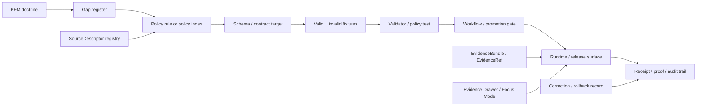
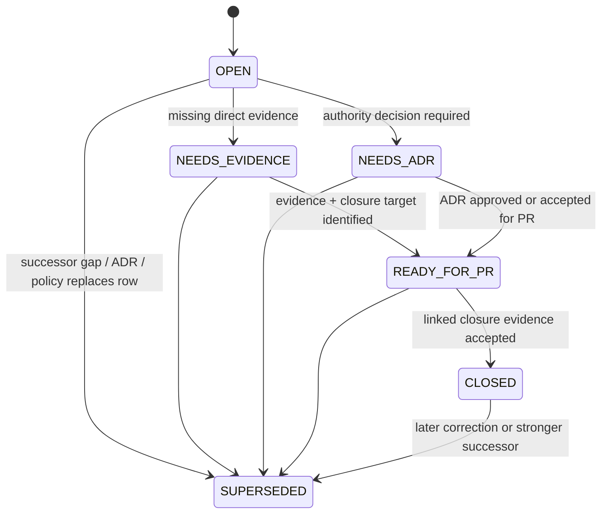

<!-- [KFM_META_BLOCK_V2]
doc_id: kfm://doc/TODO-uuid-policy-crosswalk-gaps
title: Policy Crosswalk Gap Register
type: standard
version: v1.1-draft
status: draft
owners: TODO-policy-owner
created: TODO-created-date
updated: 2026-04-27
policy_label: TODO-policy-label
related: []
tags: [kfm, policy, crosswalk, gaps, governance, release-control, evidence]
notes: [Enhanced from the supplied draft as a repository-ready policy control-plane register. Current target repo path, owner, created date, policy label, branch, workflow gates, and mounted-repo implementation status remain unverified until inspected in the real KFM checkout.]
[/KFM_META_BLOCK_V2] -->

# Policy Crosswalk Gap Register

<p align="center">
  <strong>Kansas Frontier Matrix</strong><br>
  Evidence-first • map-first • time-aware • governed • reversible
</p>

<p align="center">
  
  
  
  
  
  
</p>

<p align="center">
  <a href="#purpose">Purpose</a> ·
  <a href="#evidence-posture">Evidence posture</a> ·
  <a href="#scope">Scope</a> ·
  <a href="#crosswalk-model">Crosswalk model</a> ·
  <a href="#initial-gap-register">Gap register</a> ·
  <a href="#closure-rules">Closure rules</a> ·
  <a href="#validation-commands">Validation</a> ·
  <a href="#rollback-and-supersession">Rollback</a>
</p>

Tracks the gaps between KFM doctrine, policy files, schemas/contracts, fixtures, workflow gates, runtime envelopes, UI trust surfaces, release evidence, and audit artifacts.

> [!IMPORTANT]
> This file is a **gap register**, not proof that a policy rule, schema, workflow, validator, branch rule, review gate, or runtime enforcement path exists. Close a gap only with direct repository evidence, executable validation evidence, emitted proof evidence, or an approved ADR.

| Field | Value |
|---|---|
| Status | `draft` |
| Proposed path | `policy/crosswalk/gaps.md` |
| Owner | `TODO: verify policy owner` |
| Evidence mode | `CORPUS_ONLY` / no mounted target-repo evidence in the source draft |
| Implementation depth | `UNKNOWN` until verified from the real checkout |
| Public posture | Cite-or-abstain; fail closed on unresolved rights, sensitivity, review, or release state |
| Close rule | No closure without linked policy target, schema/contract target, fixture, test or validator, owner, and rollback/supersession path |

| This document does | This document does not do |
|---|---|
| Records policy-crosswalk gaps that affect trust, release, source admission, rights, sensitivity, AI, runtime, UI, correction, and operations. | Prove that the corresponding policy, validator, workflow, schema, or route currently exists. |
| Gives maintainers a small, reviewable path from doctrine to enforceable artifacts. | Replace policy rule bodies, ADRs, source registries, fixtures, release manifests, or proof packs. |
| Preserves unresolved items as explicit governance work. | Authorize public release, production deployment, or direct model/client access. |

---

## Purpose

KFM policy should be inspectable across every trust-bearing seam:

```text
doctrine → policy → schema/contract → fixture/test → workflow/gate → runtime/release surface → audit trail
```

This register records where that chain is incomplete, ambiguous, duplicated, stale, or unverified.

It exists to prevent policy from becoming invisible backend lore, scattered prose, assumed enforcement, or UI-only reassurance.

---

## Evidence posture

> [!WARNING]
> The source draft was prepared under a **no-mounted-repo evidence limit**. The attached KFM corpus is strong enough to define doctrine and expected control-plane structure. It is not enough to claim current policy implementation, route behavior, workflow enforcement, branch protection, active owners, or emitted proof objects.

| Area | Truth label | Working interpretation |
|---|---:|---|
| KFM doctrine | **CONFIRMED** | KFM is governed, evidence-first, map-first, time-aware, policy-conscious, and release-state aware. |
| Target file role | **PROPOSED** | `policy/crosswalk/gaps.md` is treated as a standard policy-control document, not a README-like landing page. |
| Current target file existence | **UNKNOWN** | No mounted KFM repository or existing `policy/crosswalk/gaps.md` was visible in the source draft. |
| Policy implementation depth | **UNKNOWN** | Active rules, tests, fixtures, workflows, owners, branch protections, emitted proof packs, and runtime traces must be verified in the real checkout. |
| Initial rows below | **PROPOSED / NEEDS_VERIFICATION** | Rows are doctrine-grounded starter gaps that must be confirmed, refined, closed, or superseded after repo inspection. |

### Truth labels used here

| Label | Use |
|---|---|
| `CONFIRMED` | Verified from current-session evidence, current repo evidence, command output, tests, logs, generated artifacts, attached governing docs, or approved ADRs. |
| `PROPOSED` | A recommended design, closure path, policy target, or starter gap that has not yet been verified as implemented. |
| `UNKNOWN` | Not verified strongly enough to rely on as current repository behavior. |
| `NEEDS_VERIFICATION` | Plausible or expected, but must be checked against repo files, source terms, workflow config, runtime traces, owners, or release artifacts. |
| `CONFLICTED` | Evidence implies multiple possible homes, meanings, owners, or enforcement paths; requires ADR or explicit reconciliation. |

---

## Scope

Use this file for policy-crosswalk gaps that affect trust, release, runtime behavior, source admission, rights, sensitivity, review, correction, rollback, operations, or public-facing claims.

| Belongs here | Does not belong here |
|---|---|
| Missing policy-to-schema links | Full policy rule bodies |
| Missing policy fixtures or tests | Raw source records |
| Unresolved policy ownership | Secrets, credentials, or tokens |
| Policy gaps blocking publication | General product wishlist items |
| Missing deny, abstain, quarantine, or hold cases | Unreviewed public release artifacts |
| Schema-home or object-family ambiguity that prevents policy targeting | Duplicate canonical definitions |
| Runtime or UI trust-state policy gaps | Model prompts, chain-of-thought, or unpublished context |
| Correction, withdrawal, rollback, and release-lineage gaps | Replacement for ADRs or release notes |

---

## Crosswalk model

Each crosswalk row should eventually connect one policy concern to every artifact needed to prove it is governed.



### State transition discipline



> [!CAUTION]
> Promotion is a governed state transition, not a file move. A policy gap that affects publication, sensitive geometry, rights, source roles, or AI answers should fail closed until closure evidence is reviewable.

---

## Minimum crosswalk row shape

Use this shape when converting a gap into a machine-checkable policy crosswalk entry.

```yaml
gap_id: POL-XWALK-###
short_name: TODO-short-name
surface: source_admission | rights_sensitivity | runtime | release | correction | ops | ui | ai | catalog | lifecycle
doctrine_basis: TODO-source-or-doc-ref
policy_ref: TODO-policy-path-or-none
schema_or_contract_ref: TODO-schema-contract-path-or-none
fixture_refs:
  valid: TODO-valid-fixture
  invalid: TODO-invalid-fixture
validator_or_test_ref: TODO-test-or-validator
workflow_or_gate_ref: TODO-workflow-gate-or-none
runtime_or_release_surface: TODO-envelope-manifest-ui-payload-or-none
current_state: OPEN | NEEDS_EVIDENCE | NEEDS_ADR | READY_FOR_PR | CLOSED | SUPERSEDED
priority: P0 | P1 | P2 | P3
truth_label: CONFIRMED | PROPOSED | UNKNOWN | NEEDS_VERIFICATION | CONFLICTED
owner: TODO-owner
last_verified:
  branch_or_release: TODO-branch-or-release
  date: TODO-date
closure_evidence: TODO-link-to-command-output-test-run-adr-proof-object-or-review-record
rollback_or_supersession: TODO-rollback-or-successor-ref
```

---

## Gap states and priority

### Gap states

| State | Meaning | May close? |
|---|---|---:|
| `OPEN` | Gap is known, but no closure path has been accepted. | No |
| `NEEDS_EVIDENCE` | Direct repo, test, workflow, artifact, owner, or runtime evidence is missing. | No |
| `NEEDS_ADR` | The gap depends on an architecture, schema-home, ownership, or authority decision. | No |
| `READY_FOR_PR` | Evidence and target change are clear enough for a small PR. | Not yet |
| `CLOSED` | Closure evidence is recorded and review accepted. | Yes |
| `SUPERSEDED` | Replaced by a newer gap, ADR, policy, register entry, or correction record. | Yes, with link |

### Priority

| Priority | Use when | Expected response |
|---|---|---|
| `P0` | The gap can permit unsupported publication, policy bypass, source-role collapse, sensitive exposure, direct model/client bypass, or implementation overclaim. | Block release or broad expansion until addressed. |
| `P1` | The gap weakens reviewability, fixture coverage, ownership, runtime trust-state clarity, catalog closure, rollback, or release traceability. | Fix in the next control-plane or schema/policy PR. |
| `P2` | The gap affects maintainability, discoverability, cadence, or future automation but does not immediately affect public trust. | Track and schedule. |
| `P3` | Useful cleanup or documentation polish. | Defer safely. |

### Current starter snapshot

| Metric | Count | Meaning |
|---|---:|---|
| Total starter gaps | 16 | Doctrine-grounded rows requiring repo verification. |
| `P0` | 9 | Potential release, publication, source, lifecycle, evidence, or AI safety blockers. |
| `P1` | 6 | Reviewability, runtime trust-state, catalog, rollback, operations, or ownership gaps. |
| `P2` | 1 | Refresh cadence / maintainability gap. |
| Closed | 0 | No row should be closed until real closure evidence is attached. |

---

## Initial gap register

These rows are starter policy-crosswalk gaps. Confirm them against the real repository before marking any row `READY_FOR_PR` or `CLOSED`.

| ID | Priority | State | Truth | Concern | First closure evidence |
|---|---:|---:|---:|---|---|
| `POL-XWALK-001` | `P0` | `NEEDS_EVIDENCE` | **UNKNOWN** | Mounted policy inventory for the target branch is missing. | Command transcript from real checkout listing `policy/`, `contracts/`, `schemas/`, `tests/`, `.github/workflows/`, current branch, and dirty state. |
| `POL-XWALK-002` | `P0` | `NEEDS_ADR` | **NEEDS_VERIFICATION** | Schema / contract authority is unresolved for policy targets. | Approved schema-home ADR plus updated parent READMEs or registry entries. |
| `POL-XWALK-003` | `P0` | `NEEDS_EVIDENCE` | **UNKNOWN** | Policy index and ownership map are unverified. | `policy/README.md` or equivalent index naming packages, owners, rule purpose, fixtures, and tests. |
| `POL-XWALK-004` | `P0` | `OPEN` | **PROPOSED** | Source-admission policy crosswalk is not verified. | `SourceDescriptor` schema, source registry entries, pass/fail fixtures, and source-admission policy tests. |
| `POL-XWALK-005` | `P0` | `OPEN` | **PROPOSED** | Rights and sensitivity policy matrix is not verified. | Policy matrix with deny/abstain cases for exact public geometry, unknown rights, missing review, and restricted access. |
| `POL-XWALK-006` | `P0` | `OPEN` | **PROPOSED** | RAW / WORK / QUARANTINE public-path denial is not verified. | No-public-internal-ref validator plus failing fixtures for public payloads containing RAW, WORK, or QUARANTINE refs. |
| `POL-XWALK-007` | `P0` | `OPEN` | **PROPOSED** | EvidenceRef → EvidenceBundle resolution policy is not verified. | Evidence resolver contract, closure tests, and negative fixture for unresolved evidence refs. |
| `POL-XWALK-008` | `P1` | `NEEDS_ADR` | **NEEDS_VERIFICATION** | Runtime and gate outcome grammar is not normalized. | Outcome grammar ADR with fixtures for `ANSWER`, `ABSTAIN`, `DENY`, `ERROR`, and gate/release equivalents. |
| `POL-XWALK-009` | `P0` | `OPEN` | **PROPOSED** | Promotion / release policy crosswalk is incomplete or unverified. | Promotion policy tests linking validation reports, catalog closure, review records, `ReleaseManifest`, proof objects, and rollback refs. |
| `POL-XWALK-010` | `P1` | `OPEN` | **PROPOSED** | Catalog closure policy is not verified. | `CatalogMatrix` schema, closure validator, and invalid fixture for mismatched identifiers or missing digests. |
| `POL-XWALK-011` | `P1` | `OPEN` | **PROPOSED** | Evidence Drawer policy payload is not verified. | `EvidenceDrawerPayload` contract and fixtures for positive, stale, denied, corrected, and withdrawn claims. |
| `POL-XWALK-012` | `P0` | `OPEN` | **PROPOSED** | Focus Mode / governed AI policy crosswalk is not verified. | No-direct-model-client check, adapter contract or MockAdapter, AI receipt fixture, citation validation tests, and uncited-output denial. |
| `POL-XWALK-013` | `P1` | `OPEN` | **PROPOSED** | Correction, withdrawal, and rollback policy is not verified. | `CorrectionNotice` / rollback ref contract, propagation tests, and release alias repointing or invalidation procedure. |
| `POL-XWALK-014` | `P1` | `OPEN` | **PROPOSED** | Operational policy, receipt, and supply-chain evidence are not crosswalked. | Run receipt schema, policy check outputs, workflow logs, signature/attestation verification fixtures, and rollback drill note. |
| `POL-XWALK-015` | `P1` | `NEEDS_EVIDENCE` | **UNKNOWN** | Reviewer roles, CODEOWNERS, and branch protections are unverified. | CODEOWNERS/ruleset evidence or documented manual review fallback. |
| `POL-XWALK-016` | `P2` | `OPEN` | **PROPOSED** | Crosswalk refresh cadence is not defined. | Review cadence, owner, and `last_verified_against_branch` field added to this file or a companion index. |

---

## Closure rules

A gap may move to `CLOSED` only when the close evidence is visible, reviewable, linked, and reproducible enough for the risk level.

### Required closure evidence

A closure record should include:

- exact policy file or policy index row;
- schema or contract the policy evaluates;
- at least one valid fixture and one invalid fixture;
- validator, policy test, or test command that exercises the rule;
- workflow, promotion gate, runtime envelope, release object, or UI surface affected;
- owner or reviewer who accepted the closure;
- rollback or supersession instructions;
- date and branch or release context of verification.

### Closure decision table

| Closure question | Required answer |
|---|---|
| Does this policy affect publication, runtime answers, source admission, sensitivity, correction, or rollback? | Use `P0` or `P1` and require fixture-backed tests. |
| Does the policy depend on a canonical object family? | Link the schema/contract and schema-home decision. |
| Does the policy affect public-safe output? | Include deny/abstain fixtures and review-state requirements. |
| Does the policy affect AI or Focus Mode? | Require EvidenceBundle resolution, citation validation, finite outcomes, and AI receipt coverage. |
| Does the policy affect released artifacts? | Require release manifest, catalog/proof linkage, and rollback ref. |
| Is the close evidence only prose? | Keep the row open unless prose is the intended artifact and is linked to review. |

### Closure record template

```yaml
closure_record:
  gap_id: POL-XWALK-###
  closed_by: TODO-reviewer-or-role
  closed_on: TODO-date
  branch_or_release: TODO-branch-or-release
  policy_ref: TODO-policy-ref
  schema_or_contract_ref: TODO-schema-or-contract-ref
  fixture_refs:
    valid: TODO-valid-fixture
    invalid: TODO-invalid-fixture
  validation_command: TODO-command
  validation_result_ref: TODO-log-proof-or-pr-link
  release_or_runtime_surface: TODO-surface
  rollback_or_supersession_ref: TODO-ref
  notes: TODO-notes
```

---

## Validation commands

Run these after mounting the real KFM repository. Adjust paths only after verifying repo-native conventions.

```bash
# 1. Confirm branch, working tree, and repository root.
pwd
git status --short
git branch --show-current || true
git rev-parse --show-toplevel

# 2. Inventory policy, contract, schema, fixture, workflow, and release surfaces.
find policy contracts schemas tests tools .github data docs -maxdepth 4 -type f 2>/dev/null | sort

# 3. Locate trust-bearing object families.
grep -RInE \
  'SourceDescriptor|EvidenceRef|EvidenceBundle|ClaimEnvelope|DecisionEnvelope|PolicyDecision|RuntimeResponseEnvelope|ReleaseManifest|CatalogMatrix|PromotionDecision|ValidationReport|CorrectionNotice|ReviewRecord|RunReceipt|AIReceipt|spec_hash|proof_pack|ProofPack' \
  policy contracts schemas tests tools .github data docs apps packages 2>/dev/null || true

# 4. Locate lifecycle-bypass risks.
grep -RInE \
  'data/raw|data/work|data/quarantine|RAW|WORK|QUARANTINE|public_payload|published|PUBLISHED' \
  policy contracts schemas tests tools apps packages data docs 2>/dev/null || true

# 5. Locate runtime and AI policy seams.
grep -RInE \
  'ANSWER|ABSTAIN|DENY|ERROR|Focus Mode|FocusQuery|Evidence Drawer|CitationValidationReport|ModelAdapter|AIReceipt|no-direct-model-client' \
  policy contracts schemas tests tools apps packages docs 2>/dev/null || true
```

> [!TIP]
> Capture command output in PR notes, a verification artifact, or a reviewable run receipt before changing states in this file.

---

## Review checklist

Use this checklist before marking this file `review`, closing any `P0` / `P1` gap, or relying on this register for release readiness.

- [ ] Target repository branch and dirty state were recorded.
- [ ] Existing `policy/`, `contracts/`, `schemas/`, `tests/`, `.github/workflows/`, `tools/`, `data/`, and `docs/` surfaces were inventoried.
- [ ] Schema-home authority was confirmed or an ADR was opened.
- [ ] Every closed gap links to a policy file, schema/contract target, fixture, test, owner, and closure record.
- [ ] No row claims policy enforcement from doctrine alone.
- [ ] No row claims workflow enforcement without workflow evidence.
- [ ] No row claims runtime behavior without a contract, fixture, test, or trace.
- [ ] Public-facing policy gaps include deny/abstain cases.
- [ ] Sensitive-location, rights, review, and correction gaps fail closed.
- [ ] Governed AI gaps include EvidenceBundle resolution and citation validation expectations.
- [ ] Release-related gaps include proof, catalog, manifest, review, and rollback expectations.
- [ ] Superseded gaps point to the successor row, ADR, policy, or register entry.

---

## Rollback and supersession

This document is control-plane documentation. If an update is wrong:

1. Revert the PR that changed this file.
2. Restore the prior gap states.
3. Add a correction note if downstream docs, policies, tests, releases, or runtime surfaces referenced the incorrect row.
4. Mark replaced rows as `SUPERSEDED` rather than deleting them when the old row explains prior review context.
5. Never use deletion to hide a known policy gap.

### Supersession note template

```text
Superseded gap:
Successor gap / ADR / policy:
Reason:
Date:
Reviewer:
Rollback impact:
```

---

## Open verification backlog

<details>
<summary>Items to verify in the mounted repository</summary>

- Does `policy/crosswalk/` already exist?
- Does `policy/crosswalk/gaps.md` already exist, and does it have stable anchors that must be preserved?
- Is there a repo-native metadata block convention that supersedes KFM Meta Block v2?
- Is `policy/README.md` present and normative?
- Are policy packages Rego/OPA, JSON policy data, TypeScript/Python validators, or another engine?
- Is `contracts/` or `schemas/` canonical for machine-readable object definitions?
- Are `EvidenceBundle`, `EvidenceRef`, `DecisionEnvelope`, `PolicyDecision`, `ReleaseManifest`, `CatalogMatrix`, `ValidationReport`, `CorrectionNotice`, `RuntimeResponseEnvelope`, `RunReceipt`, and `AIReceipt` already defined?
- Are fixture homes under `tests/fixtures/`, `policy/tests/`, `tests/policy/`, or another path?
- Are workflow gates checked in under `.github/workflows/` or external platform settings?
- Is there active branch protection or CODEOWNERS evidence?
- Are release manifests, proof packs, receipts, and catalog-closure artifacts emitted anywhere?
- Is there a runtime API contract for Evidence Drawer and Focus Mode?
- Are sensitive-location, rights, sovereignty, cultural sensitivity, and living-person policies implemented or only described?
- Is there a current source registry with rights, cadence, source role, sensitivity, and activation state?
- Are there no-public-RAW/WORK/QUARANTINE tests?
- Are correction and rollback states visible in release/runtime surfaces?

</details>

---

## Maintainer notes

- Keep this register short enough to review.
- Move detailed policy text into policy files, ADRs, schemas, tests, or runbooks.
- Keep gap IDs stable after review.
- Prefer a new superseding row over silently rewriting a closed row.
- Treat this file as a control-plane object: it should reduce ambiguity, not become another uncrosswalked source of authority.

