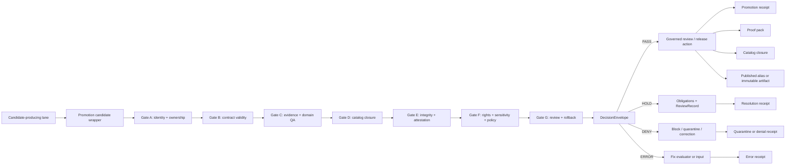

<!-- [KFM_META_BLOCK_V2]
doc_id: kfm://doc/NEEDS-VERIFICATION
title: Promotion Gate Map
type: standard
version: v1
status: draft
owners: TODO-NEEDS-VERIFICATION
created: 2026-04-27
updated: 2026-04-27
policy_label: TODO-NEEDS-VERIFICATION
related: [../README.md, ../promotion/README.md, ../../tools/validators/promotion_gate/README.md, ../../contracts/promotion_gate/README.md, ../../contracts/promotion_review_handoff.md, ../../schemas/promotion_gate/decision_envelope.schema.json, ../../data/receipts/README.md, ../../data/proofs/README.md, ../../data/catalog/README.md]
tags: [kfm, policy, crosswalk, promotion, gate, governance, evidence, release]
notes: [Draft crosswalk for mapping Promotion Gate A-G responsibilities to policy, evidence, catalog, receipt, proof, review, and rollback surfaces; stable doc_id, owners, branch inventory, exact policy label, path existence, schema home, and workflow enforcement remain NEEDS VERIFICATION.]
[/KFM_META_BLOCK_V2] -->

# Promotion Gate Map

Policy crosswalk for mapping KFM Promotion Gate A-G to evidence objects, policy checks, finite decisions, receipts, proofs, review seams, and rollback visibility.

<div align="center">


</div>

| Field | Value |
| --- | --- |
| Intended path | `policy/crosswalk/promotion-gate-map.md` |
| Status | Draft |
| Primary output object | `DecisionEnvelope` |
| Promotion posture | Governed state transition, not a file move |
| Public-release posture | Cite-or-abstain; fail closed where rights, sensitivity, evidence, or review state is unresolved |
| Implementation proof | **NEEDS VERIFICATION** until repo paths, schemas, validators, CI, branch protections, and emitted artifacts are inspected |

**Quick jumps:** [Scope](#scope) · [Repo fit](#repo-fit) · [Evidence posture](#evidence-posture) · [Core rule](#core-rule) · [Outcome grammar](#outcome-grammar) · [Gate map](#gate-map-a-g) · [Flow](#flow) · [Inputs](#accepted-inputs) · [Exclusions](#exclusions) · [Policy crosswalk](#policy-crosswalk) · [Decision envelope](#decision-envelope-contract) · [Trust-object split](#trust-object-split) · [Review and rollback](#review-and-rollback-seam) · [Gate H seam](#gate-h-extension-seam) · [Definition of done](#definition-of-done) · [Open verification](#open-verification-items)

> [!IMPORTANT]
> This file is a **policy crosswalk**. It does not publish artifacts, replace validators, authorize release, or prove that CI enforcement is active on the mounted branch.

---

<a id="scope"></a>

## Scope

This document maps the promotion gate's review-bearing responsibilities to the policy, schema, catalog, proof, receipt, and review surfaces that must participate before outward trust widens.

Use it when maintainers need to answer:

- which gate owns which release precondition
- which policy family should evaluate a promotion risk
- which trust objects must exist before a candidate can proceed
- how `PASS`, `HOLD`, `DENY`, and `ERROR` should route
- where receipts, proofs, review handoffs, and rollback artifacts belong
- what a reviewer needs to see before a release, correction, supersession, or rollback

Do **not** use it as proof that a validator, workflow, schema, or branch protection already exists.

### This crosswalk is

| It is | It is not |
| --- | --- |
| A repo-ready map of gate responsibilities. | A claim that those gates are already wired in CI. |
| A shared vocabulary for policy, validators, receipts, proofs, and review. | A replacement for schema files, policy-as-code, fixtures, or review records. |
| A guide for keeping promotion evidence-bearing and reversible. | A publication approval, public artifact, or legal/rights determination. |
| A way to align humans and machine contracts. | A place to hide undocumented authority or manual exceptions. |

[Back to top](#promotion-gate-map)

---

<a id="repo-fit"></a>

## Repo fit

| Direction | Surface | Role |
| --- | --- | --- |
| This file | `policy/crosswalk/promotion-gate-map.md` | Maps gates to policy and trust-object responsibilities. |
| Upstream contracts | `contracts/promotion_gate/README.md` | Defines the machine-contract boundary, required inputs, and finite gate outcomes. |
| Upstream validators | `tools/validators/promotion_gate/README.md` | Runs or documents the executable promotion-gate lane when present. |
| Schema surface | `schemas/promotion_gate/` or repo-native equivalent | Owns `DecisionEnvelope`, request, receipt, review, and bundle schemas. |
| Policy surface | `policy/promotion/` and domain-specific `policy/<domain>/` | Owns deny-by-default rules, obligations, reason codes, rights, sensitivity, and source-role posture. |
| Trust objects | `data/receipts/`, `data/proofs/`, `data/catalog/`, `data/published/` | Keeps process memory, proof objects, catalog closure, and published surfaces distinct. |
| Review surface | `contracts/promotion_review_handoff.md` and reviewer-facing generated Markdown | Gives stewards a readable view while remaining subordinate to machine-significant artifacts. |

> [!NOTE]
> Exact path homes remain **NEEDS VERIFICATION** until the active repository layout, schema home, and workflow callers are inspected.

[Back to top](#promotion-gate-map)

---

<a id="evidence-posture"></a>

## Evidence posture

| Label | Meaning in this file |
| --- | --- |
| **CONFIRMED** | KFM doctrine requires governed promotion, evidence-first release reasoning, fail-closed posture, and separation of receipts, proofs, catalogs, review, and publication. |
| **PROPOSED** | The normalized A-G crosswalk below and its path patterns are repo-ready guidance unless a mounted repo establishes a different local convention. |
| **NEEDS VERIFICATION** | Owners, exact `policy_label`, schema locations, executable validators, workflow wiring, branch protections, emitted artifact inventory, and merge-blocking status. |
| **UNKNOWN** | Current implementation depth for this exact path and neighboring files. |

### Minimum proof needed before stronger claims

| Claim someone might make | Required proof before saying it |
| --- | --- |
| “The gate blocks publication.” | Workflow evidence, branch protection, passing/failing fixtures, and merge-blocking status. |
| “This schema is canonical.” | Repo schema registry or ADR confirming the schema home. |
| “Receipts and proofs are emitted.” | Generated artifact examples, storage path, schema validation, and replay/inspection command. |
| “Policy is enforced.” | Policy bundle, test fixtures, evaluator command, failure examples, and CI or runtime gate. |
| “Review is required.” | Review contract, reviewer role source, handoff output, and hold-resolution path. |

[Back to top](#promotion-gate-map)

---

<a id="core-rule"></a>

## Core rule

Promotion changes what a candidate is allowed to **mean** outside the working system.

A candidate does not become public truth because bytes moved, a workflow ran, a summary rendered, a map layer loaded, or a model answered. Promotion must be a governed transition from candidate state into release-eligible state with evidence, policy, catalog closure, review posture, receipts, and rollback visibility.

```text
RAW -> WORK / QUARANTINE -> PROCESSED -> CATALOG / TRIPLET -> PUBLISHED
```

The promotion gate sits between **processed / candidate** surfaces and **published / outward-use** surfaces. Public clients and normal UI surfaces consume governed APIs, released artifacts, and EvidenceBundle-backed outputs only.

> [!WARNING]
> Promotion is not a file copy. It is a trust transition. If the system cannot prove why trust widened, it should not widen trust.

[Back to top](#promotion-gate-map)

---

<a id="outcome-grammar"></a>

## Outcome grammar

KFM uses different finite vocabularies for different surfaces. Keep them separate.

| Surface | Recommended finite outcomes | Meaning |
| --- | --- | --- |
| Gate / review evaluation | `PASS`, `HOLD`, `DENY`, `ERROR` | What the promotion gate decides about the candidate. |
| Runtime / public answer | `ANSWER`, `ABSTAIN`, `DENY`, `ERROR` | What a user-facing API or Focus Mode response returns. |
| Release-state / process receipt | `PROMOTED`, `HELD`, `QUARANTINED`, `NO_CHANGE`, `REVERTED`, `ERROR` | What happened to the candidate or release pointer. Exact enum remains schema-controlled. |

### Gate routing

| Gate result | Route | Minimum required record |
| --- | --- | --- |
| `PASS` | Candidate may proceed to governed review or release action. | `DecisionEnvelope`, promotion receipt, proof/catalog references. |
| `HOLD` | Candidate is not promotable yet, but may resolve through explicit obligations or steward review. | Immutable original receipt plus required obligation/review refs. |
| `DENY` | Candidate must not proceed under current evidence, policy, or integrity state. | Denial reason codes and quarantine/blocking reference when applicable. |
| `ERROR` | Evaluator, parser, schema, or system fault prevented safe decision. | Error receipt; no promotion side effect. |

> [!CAUTION]
> `PASS` is not automatic publication. It means the candidate has satisfied the gate's review-bearing checks. Release still follows the governed publication path.

[Back to top](#promotion-gate-map)

---

<a id="gate-map-a-g"></a>

## Gate map A-G

### Gate stack at a glance

| Gate | Decision question | Failure shape |
| --- | --- | --- |
| **A** | Is this a governed candidate with stable identity, owner/steward context, and an eligible lifecycle state? | `HOLD`, `DENY`, or `ERROR` before deeper evaluation. |
| **B** | Do the candidate, release manifest, receipts, policy context, and referenced objects match shared contracts? | `ERROR` for invalid or unreadable structure. |
| **C** | Are consequential claims reconstructable to admissible evidence and domain-quality validation? | `HOLD` for incomplete support, `DENY` for invalid or contradicted support. |
| **D** | Do catalog records and outward identifiers close over the same subject, digest, and scope? | `HOLD` or `DENY` for unresolved catalog closure. |
| **E** | Are release-significant artifacts exactly the artifacts that were reviewed? | `DENY` for digest/signature/attestation mismatch. |
| **F** | Is release allowed under rights, sensitivity, source-role, and policy-label rules? | `DENY` by default when policy cannot safely pass. |
| **G** | Are review intent, correction posture, and rollback visibility present before trust widens? | `HOLD` for missing review/rollback; `DENY` for unacceptable drift. |

<details open>
<summary><strong>Gate A — Identity, ownership, and state eligibility</strong></summary>

| Field | Requirement |
| --- | --- |
| What it proves | Candidate is a governed object with stable identity, owner/steward context, and an allowed lifecycle state. |
| Required trust evidence | `subject_ref`, stable ID, `spec_hash`, owner/steward metadata, prior state, deterministic target path. |
| Policy / validator responsibility | Source admission, lifecycle-state, ownership, branch/context checks, and target-path determinism. |
| Fail-closed route | `HOLD` for missing reviewer-bearing metadata; `ERROR` for malformed identity contract; `DENY` for illegal state transition. |

</details>

<details>
<summary><strong>Gate B — Shared contracts and structural validity</strong></summary>

| Field | Requirement |
| --- | --- |
| What it proves | Candidate, release manifest, receipts, policy context, and referenced objects match published schema/contract shape. |
| Required trust evidence | Request schema, release manifest schema, `DecisionEnvelope` schema, required fixtures. |
| Policy / validator responsibility | Schema validation, contract compatibility, additional-properties posture, enum checks, and required-field checks. |
| Fail-closed route | `ERROR` for invalid shared contracts, unreadable input, schema mismatch, or impossible enum state. |

</details>

<details>
<summary><strong>Gate C — Evidence and domain-quality closure</strong></summary>

| Field | Requirement |
| --- | --- |
| What it proves | Claims and release scope are reconstructable to admissible evidence and domain validation. |
| Required trust evidence | `EvidenceBundle` or `EvidenceBundleRef`, validation reports, domain QA, geometry/CRS/temporal/coverage summaries where applicable. |
| Policy / validator responsibility | Evidence resolver, citation/evidence closure, domain validators, geometry/CRS, temporal coverage, unit rules, quality thresholds. |
| Fail-closed route | `DENY` for contradiction or invalid domain support; `HOLD` when support is incomplete but not contradicted; `ERROR` for validator fault. |

</details>

<details>
<summary><strong>Gate D — Catalog and outward-scope closure</strong></summary>

| Field | Requirement |
| --- | --- |
| What it proves | STAC, DCAT, PROV, release manifest, and outward identifiers describe the same promoted subject and scope. |
| Required trust evidence | Catalog matrix, STAC/DCAT/PROV refs, release manifest, digest identity, correction posture. |
| Policy / validator responsibility | Catalog crosslinking, closure validator, identifier consistency, public-scope checks. |
| Fail-closed route | `DENY` for catalog mismatch or unresolved closure; `HOLD` when required catalog refs are pending. |

</details>

<details>
<summary><strong>Gate E — Integrity, signatures, and attestations</strong></summary>

| Field | Requirement |
| --- | --- |
| What it proves | Reviewed artifacts are exactly the artifacts proposed for release. |
| Required trust evidence | Asset digests, signed decision or attestation refs, signature verification result, manifest digest, optional GeoManifest. |
| Policy / validator responsibility | Artifact integrity, checksum verification, attestation verification, deterministic `spec_hash`. |
| Fail-closed route | `DENY` for mismatch or unverifiable attestation; `ERROR` for unavailable verification tooling if policy requires it. |

</details>

<details>
<summary><strong>Gate F — Rights, sensitivity, and policy evaluation</strong></summary>

| Field | Requirement |
| --- | --- |
| What it proves | Release is publishable under rights, sensitivity, source-role, and policy-label rules. |
| Required trust evidence | `policy_label`, source descriptors, rights statement, sensitivity classification, obligations, reason codes, policy decision. |
| Policy / validator responsibility | OPA/Rego or repo-native policy bundle; deny-by-default for missing rights, unknown labels, restricted data without explicit pass. |
| Fail-closed route | `DENY` for rights/sensitivity/policy violation; `HOLD` for missing but satisfiable obligations; `ERROR` for policy engine fault. |

</details>

<details>
<summary><strong>Gate G — Review, diff, correction, and rollback visibility</strong></summary>

| Field | Requirement |
| --- | --- |
| What it proves | Human review intent and rollback/correction posture are visible before trust widens. |
| Required trust evidence | ReviewRecord, diff artifact, diff-policy result, correction notice, rollback card/ref, supersession link. |
| Policy / validator responsibility | Steward review, drift interpretation, rollback readiness, correction-lineage checks. |
| Fail-closed route | `HOLD` for missing approval or rollback target; `DENY` for unacceptable drift; `ERROR` for incoherent supersession state. |

</details>

[Back to top](#promotion-gate-map)

---

<a id="flow"></a>

## Flow



### Trust transition summary

| Phase | What happens | What must remain separate |
| --- | --- | --- |
| Candidate wrapper | Normalizes the candidate into typed promotion input. | Raw watcher output, working files, and unpublished source-system state. |
| Gate evaluation | Produces gate-level results, reason codes, obligations, and final finite outcome. | Gate checks, policy decisions, and review comments. |
| Decision emission | Produces `DecisionEnvelope` and references relevant trust objects. | Decision envelope, process receipt, proof pack, and catalog matrix. |
| Release action | Updates release pointer or publishes immutable artifact only after gate and review requirements pass. | Published alias, immutable artifact, rollback target, and correction notice. |

[Back to top](#promotion-gate-map)

---

<a id="accepted-inputs"></a>

## Accepted inputs

Promotion inputs should be explicit, typed, and linkable.

| Input family | Examples | Required? |
| --- | --- | --- |
| Candidate identity | `subject_ref`, `candidate_id`, `dataset_version_id`, `spec_hash`, prior release ref | Yes |
| Release object | `release_manifest`, artifact list, target path, digest map | Yes |
| Evidence support | `evidence_bundle_ref` or inline `evidence_bundle`, citation refs, validation reports | Yes |
| Catalog closure | `catalog_refs`, STAC/DCAT/PROV refs, catalog matrix | Yes for outward release |
| Process memory | `run_receipt`, upstream receipts, validator refs, tool versions | Yes |
| Integrity support | checksum list, attestation refs, signature refs, verification report | Conditional by release significance and policy |
| Policy context | `policy_label`, rights, sensitivity, source role, obligations, reason codes | Yes |
| Review context | `review_record`, steward role, review decision, reviewed timestamp | Conditional; required for sensitive or held candidates |
| Drift / correction context | diff artifact, diff-policy result, correction notice, rollback ref | Conditional for supersession, rollback, or material change |

### Input hygiene rules

- Inputs must resolve by reference or carry an explicit reason for non-resolution.
- Inputs must not rely on UI-only state, hidden environment assumptions, or mutable side effects.
- Inputs must carry enough identity and digest information to support replay or incident review.
- Inputs with unresolved rights, sensitivity, source role, or policy label fail closed.

[Back to top](#promotion-gate-map)

---

<a id="exclusions"></a>

## Exclusions

The promotion gate must not accept or promote authority from:

- raw watcher output without a candidate wrapper
- `RAW`, `WORK`, or `QUARANTINE` storage as public evidence
- UI screenshots or map-rendered pixels as release truth
- reviewer handoff Markdown as the release decision
- direct model output or Focus Mode prose
- unsigned or unreferenced sidecar files
- catalog refs that do not resolve to the same subject and scope
- policy labels, rights claims, or sensitivity classes inserted only in workflow YAML
- convenience summaries that cannot be regenerated from declared inputs
- direct client traffic to canonical/internal stores

> [!TIP]
> If a surface is useful but not authoritative, keep it as a derived view with explicit provenance. Do not upgrade it into truth by repetition.

[Back to top](#promotion-gate-map)

---

<a id="policy-crosswalk"></a>

## Policy crosswalk

| Policy concern | Gate(s) | Typical rule | Proposed policy home |
| --- | --- | --- | --- |
| Lifecycle state | A | Candidate must be in an eligible state; no direct `RAW -> PUBLISHED`. | `policy/promotion/lifecycle.rego` or repo-native equivalent |
| Ownership / stewardship | A, G | Owner, steward, reviewer, or reviewer role must be declared where required. | `policy/promotion/ownership.rego` |
| Schema and contract posture | B | Shared contracts must validate before policy can safely reason over input. | Schema validator; not policy-only |
| Evidence closure | C | Consequential claims must resolve to EvidenceBundle support or fail closed. | `policy/promotion/evidence.rego` plus evidence resolver tests |
| Domain QA | C | Geometry, CRS, temporal coverage, unit, threshold, or domain-specific checks must pass. | `policy/<domain>/promotion.rego` and domain validators |
| Catalog closure | D | STAC, DCAT, PROV, and release manifest must resolve to the same subject, digest, and scope. | `policy/promotion/catalog.rego` plus catalog validator |
| Artifact integrity | E | Declared assets must match checksums; no undeclared release-significant sidecars. | `policy/promotion/integrity.rego` and checksum verifier |
| Signatures / attestations | E | Required attestations must verify; unavailable required verification blocks promotion. | `policy/promotion/attestation.rego` |
| Rights and licenses | F | Missing or disallowed rights deny or hold release. | `policy/promotion/rights.rego` |
| Sensitivity | F | Restricted or sensitive data requires explicit pass, transform receipt, or controlled access. | `policy/promotion/sensitivity.rego` |
| Source role | F | A source may only support claims permitted by its source role. | `policy/promotion/source_role.rego` |
| Review and obligations | G | Holds must resolve through ReviewRecord and resolution receipt, not mutation of the original receipt. | `policy/promotion/review.rego` |
| Correction and rollback | G | Superseding release must expose correction or rollback posture before trust widens. | `policy/promotion/correction.rego` |

[Back to top](#promotion-gate-map)

---

<a id="decision-envelope-contract"></a>

## DecisionEnvelope contract

`DecisionEnvelope` is the promotion gate's machine-readable decision carrier. It should be compact enough for CI and policy checks, but rich enough for review, replay, and rollback visibility.

> [!NOTE]
> The field sketch below is **PROPOSED**. The schema registry remains authoritative once the actual schema home is verified.

```yaml
DecisionEnvelope:
  decision_id: string
  subject_ref: string
  candidate_ref: string
  spec_hash: string
  evaluated_at: datetime
  evaluator:
    name: string
    version: string
  outcome: PASS | HOLD | DENY | ERROR
  gate_results:
    - gate: A | B | C | D | E | F | G
      status: PASS | HOLD | DENY | ERROR
      reason_codes: [string]
      obligations: [string]
      evidence_refs: [string]
      receipt_refs: [string]
  policy_decision_ref: string
  evidence_bundle_ref: string
  catalog_matrix_ref: string
  proof_pack_ref: string
  review_record_ref: string
  rollback_ref: string
  correction_notice_ref: string
  notes: string
```

### Envelope rules

- The final `outcome` must collapse to exactly one finite value.
- Gate results should be emitted in deterministic order.
- `ERROR` must not create promotion side effects.
- `HOLD` must preserve obligations and the original receipt.
- `DENY` must include reason codes fit for audit and remediation.
- `PASS` must reference the proof/catalog/review surfaces required by the release significance.

[Back to top](#promotion-gate-map)

---

<a id="trust-object-split"></a>

## Trust-object split

| Surface | Role | Must not become |
| --- | --- | --- |
| `DecisionEnvelope` | Machine-readable gate decision and gate-status carrier. | Runtime answer envelope, publication action, or reviewer prose. |
| `run_receipt` / promotion receipt | Process memory for replay, audit, and incident reconstruction. | Release proof by itself. |
| `EvidenceBundle` | Resolved support package for claim or release scope. | Generated summary or model output. |
| Catalog matrix | Closure object connecting STAC, DCAT, PROV, release manifest, and digest identity. | Decorative metadata checklist. |
| Proof pack | Release-grade evidence package: manifest, evidence, catalog matrix, signatures, validation reports. | Process log or convenience handoff. |
| ReviewRecord | Human approval, denial, escalation, or return-for-rework record. | Hidden authority layer or mutable replacement for the original decision. |
| Promotion review handoff | Derived steward-facing summary of bundle, drift, policy, and trust visibility. | Decision source of truth. |
| Rollback card / correction notice | Auditable release reversal, alias repoint, supersession, or withdrawal record. | Silent overwrite or deletion of history. |

### Separation rule

Receipts explain **what happened**. Proof packs support **why release is trustworthy**. Catalog records explain **what outward users can discover**. Review records explain **who accepted, denied, or held trust expansion**. None of those objects should silently stand in for the others.

[Back to top](#promotion-gate-map)

---

<a id="review-and-rollback-seam"></a>

## Review and rollback seam

A held candidate must resolve through explicit artifacts, not through mutation of the original receipt.

Recommended resolution pattern:

1. Preserve the original `HOLD` decision and receipt.
2. Emit a `ReviewRecord` with reviewer role, decision, timestamp, refs, and comments.
3. Derive a second `DecisionEnvelope` or resolution decision for the post-review state.
4. Emit a compact promotion-resolution receipt linking old held state to resolved state.
5. Route the result to promotion, quarantine, rollback, or rework.
6. Keep the review console and generated Markdown visibly subordinate to the machine artifacts.

This keeps review human-readable without turning reviewer UI into secret truth.

### Rollback visibility checklist

- [ ] Current release ref is known.
- [ ] Candidate release ref is known.
- [ ] Repoint target or immutable prior artifact is known.
- [ ] Supersession or correction notice is prepared when meaning changes.
- [ ] Rollback action is receipt-bearing.
- [ ] Public-facing layers, APIs, exports, and search projections have invalidation or rebuild instructions.

[Back to top](#promotion-gate-map)

---

<a id="gate-h-extension-seam"></a>

## Gate H extension seam

Some KFM materials introduce **Gate H — Artifact Integrity & Signature** for PMTiles, COG, GeoParquet, GeoManifest, or other release artifacts that need explicit offline-verifiable artifact checks.

For this A-G map, Gate H is treated as a **conditional extension seam**:

| When Gate H is useful | How to attach it |
| --- | --- |
| PMTiles, COG, GeoParquet, or derived bundle has a manifest and signature burden. | Add Gate H as a post-Gate-E artifact verifier, or fold its required checks into Gate E if the repo keeps A-G only. |
| UI trust badges expose verification state. | Ensure Evidence Drawer payloads show artifact digest, spec hash, signature status, policy label, and A-G/H gate summary. |
| Offline field verification matters. | Require manifest digest, artifact digest, bundle presence, signature verification, and `offline_verifiable` status. |

> [!NOTE]
> Gate H is **PROPOSED / NEEDS VERIFICATION** for this crosswalk until the repo's final gate taxonomy is decided.

[Back to top](#promotion-gate-map)

---

<a id="definition-of-done"></a>

## Definition of done

A promotion gate implementation is not complete until the crosswalk can be proven with fixtures and artifacts.

- [ ] Gate inputs validate against the repo's chosen schemas.
- [ ] Gate A-G results are emitted in deterministic order.
- [ ] Gate result collapses to exactly one finite outcome.
- [ ] `DecisionEnvelope` validates against schema.
- [ ] Passing and failing fixtures exist for each gate family.
- [ ] Policy emits reason codes and obligations, not only boolean pass/fail.
- [ ] Receipts and proofs are stored or referenced separately.
- [ ] STAC/DCAT/PROV/release manifest closure is validated for outward release.
- [ ] Missing rights, unknown policy labels, restricted exact locations, and unresolved sensitivity fail closed.
- [ ] Review holds can resolve through ReviewRecord and resolution receipt.
- [ ] Rollback or correction posture is visible for superseding releases.
- [ ] CI runs local deterministic fixtures before any branch-level enforcement claim is made.
- [ ] Documentation, schema, policy, validator, fixture, and workflow references are indexed in repo control-plane docs.

### Suggested fixture families

| Fixture family | Expected outcome | Purpose |
| --- | --- | --- |
| `valid_minimal_release_candidate` | `PASS` or `HOLD` depending on review policy | Proves the smallest well-formed candidate can be evaluated. |
| `missing_owner` | `HOLD` | Proves reviewer-bearing metadata is required. |
| `invalid_decision_contract` | `ERROR` | Proves schema failure does not become policy ambiguity. |
| `unresolved_evidence_ref` | `HOLD` or `DENY` | Proves cite-or-abstain posture. |
| `catalog_digest_mismatch` | `DENY` | Proves catalog/release closure matters. |
| `artifact_digest_mismatch` | `DENY` | Proves release artifacts cannot drift after review. |
| `rights_missing` | `DENY` or `HOLD` | Proves rights fail closed. |
| `sensitive_exact_location_public` | `DENY` | Proves sensitivity protections block public release. |
| `review_required_unmet` | `HOLD` | Proves review obligations remain visible. |
| `rollback_ref_missing_for_supersession` | `HOLD` or `DENY` | Proves rollback/correction posture is not optional for material change. |

[Back to top](#promotion-gate-map)

---

<a id="open-verification-items"></a>

## Open verification items

| Item | Why it matters | Status |
| --- | --- | --- |
| Stable `doc_id` | Required for durable documentation registry references. | NEEDS VERIFICATION |
| Owners | Required for policy/crosswalk stewardship. | NEEDS VERIFICATION |
| Final `policy_label` | Required before publication. | NEEDS VERIFICATION |
| Schema home | Multiple materials reference `schemas/`, `schemas/contracts/v1/`, and `contracts/`; repo convention must decide. | NEEDS VERIFICATION |
| Exact gate enum | `PASS/HOLD/DENY/ERROR` is the normalized recommendation; schema must confirm. | NEEDS VERIFICATION |
| Gate H adoption | Artifact-integrity extension appears in later planning materials but may not be part of the base A-G contract. | NEEDS VERIFICATION |
| Workflow enforcement | CI examples do not prove merge-blocking enforcement. | UNKNOWN |
| Emitted artifact inventory | Receipts, proofs, catalogs, bundles, and handoffs must be verified from actual repo outputs. | UNKNOWN |
| Branch protection | Required before claiming promotion gate blocks publication. | UNKNOWN |
| Review authority | Steward roles, reviewer groups, escalation paths, and separation-of-duty requirements must be confirmed. | NEEDS VERIFICATION |
| Rights authority | Policy source for license/rights classifications must be confirmed. | NEEDS VERIFICATION |

[Back to top](#promotion-gate-map)

---

## Appendix A: starter reason-code vocabulary

<details>
<summary><strong>Open starter vocabulary</strong></summary>

These reason codes are a starting point for policy and validator alignment. The schema registry remains the source of truth once implemented.

| Reason code | Typical gate | Meaning |
| --- | --- | --- |
| `missing_required_input` | A, B, G | Required owner, steward, release, review, or context input is absent. |
| `invalid_lifecycle_transition` | A | Candidate attempts a transition that policy does not allow. |
| `invalid_shared_contract` | B | Input failed shared contract/schema validation. |
| `evidence_closure_missing` | C | Required evidence cannot resolve to an EvidenceBundle. |
| `citation_support_incomplete` | C | Cited evidence does not support the claim or release scope strongly enough. |
| `domain_quality_failed` | C | Domain validator failed geometry, CRS, temporal, unit, threshold, or equivalent checks. |
| `catalog_closure_unresolved` | D | STAC/DCAT/PROV/release manifest do not resolve to the same subject and scope. |
| `attestation_unverified` | E | Required signature or attestation verification failed or is unavailable. |
| `artifact_integrity_mismatch` | E, H | Declared digest does not match artifact, manifest, or asset list. |
| `policy_evaluation_failed` | F | Policy engine or policy bundle could not safely evaluate. |
| `policy_label_unknown` | F | Policy label is missing or not recognized by the policy bundle. |
| `rights_missing` | F | License, rights, or upstream terms are missing. |
| `sensitivity_unresolved` | F | Sensitive material lacks explicit transform, review, or controlled-access posture. |
| `source_role_not_authorized` | F | Source role cannot support the proposed claim or release authority. |
| `review_required` | G | Steward review is required before promotion can proceed. |
| `review_record_invalid` | G | Review record is missing required role, decision, timestamp, or supporting refs. |
| `superseding_release_without_correction_path` | G | Candidate supersedes prior release without visible correction or rollback route. |
| `gate_passed` | A-G | Gate passed and emitted no blocking reason codes. |

</details>

[Back to top](#promotion-gate-map)

---

## Appendix B: maintainer review card

Use this compact card during PR review.

| Review question | Expected answer before merge |
| --- | --- |
| Does this doc claim implementation depth? | No, unless supported by current repo evidence. |
| Are paths treated as verified? | No; path homes remain NEEDS VERIFICATION until inspected. |
| Are gate outcomes finite and separate from runtime outcomes? | Yes. |
| Are receipts, proofs, catalog records, review records, and rollback records distinct? | Yes. |
| Does the doc preserve the KFM lifecycle? | Yes: `RAW -> WORK / QUARANTINE -> PROCESSED -> CATALOG / TRIPLET -> PUBLISHED`. |
| Does the doc fail closed for evidence, rights, sensitivity, and review gaps? | Yes. |
| Does the doc leave open verification items visible? | Yes. |

[Back to top](#promotion-gate-map)

