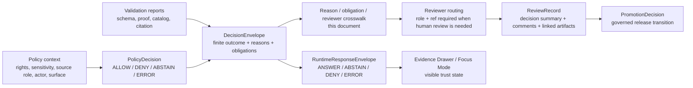
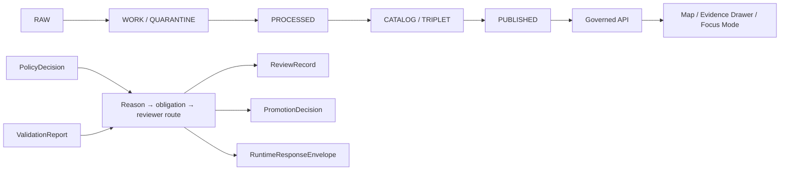

<!-- [KFM_META_BLOCK_V2]
doc_id: kfm://doc/NEEDS-VERIFICATION
title: Reason, Obligation, and Reviewer Map
type: standard
version: v1
status: draft
owners: NEEDS-VERIFICATION
created: 2026-04-27
updated: 2026-04-27
policy_label: NEEDS-VERIFICATION
related: [policy/README.md, policy/crosswalk/README.md, schemas/contracts/vocab/governed-object-vocabulary.json, schemas/contracts/v1/policy/policy_decision.schema.json, schemas/contracts/v1/governance/decision_envelope.schema.json, configs/governance/reviewer-actions.json]
tags: [kfm, policy, crosswalk, reasons, obligations, reviewers, governance]
notes: [Repo not mounted during this revision pass; target path, owners, policy label, related paths, schema homes, reviewer-action registry, and workflow enforcement require mounted-repo verification.]
[/KFM_META_BLOCK_V2] -->

<a id="top"></a>

# Reason, Obligation, and Reviewer Map

<p align="center">
  <strong>Policy reasons → obligations → reviewer routing, without collapsing KFM governance objects.</strong><br>
  <em>Evidence-first • policy-aware • reviewable • fail-closed • promotion-safe</em>
</p>

<p align="center">
  
  
  
  
  
  
  
</p>

<p align="center">
  <a href="#status-and-repo-fit">Status</a> ·
  <a href="#scope">Scope</a> ·
  <a href="#boundary-law">Boundary law</a> ·
  <a href="#operating-model">Operating model</a> ·
  <a href="#reason--obligation--reviewer-vocabulary">Vocabulary</a> ·
  <a href="#crosswalk-matrix">Crosswalk</a> ·
  <a href="#validation-expectations">Validation</a> ·
  <a href="#merge-checklist">Merge checklist</a>
</p>

> [!IMPORTANT]
> This file is a **crosswalk**, not a policy engine, schema registry, `CODEOWNERS` file, reviewer roster, quarantine workflow, or promotion gate. It keeps reason codes, obligation codes, reviewer roles, and reviewer refs aligned so governed outputs stay explainable and auditable.

| Field | Value |
|---|---|
| Proposed target path | `policy/crosswalk/reason-obligation-reviewer-map.md` |
| Document class | Standard policy crosswalk |
| Current status | `draft` |
| Evidence mode | `CORPUS_ONLY / NO_LOCAL_REPO_EVIDENCE` |
| Evidence posture | **CONFIRMED doctrine**, **PROPOSED crosswalk**, **UNKNOWN implementation depth** |
| Owner | **NEEDS VERIFICATION** |
| Policy label | **NEEDS VERIFICATION** |
| Public posture | Cite-or-abstain; fail closed on unresolved rights, sensitivity, source role, review, or release state |
| Merge posture | Do not promote beyond `draft` until owners, registry homes, workflow enforcement, and token lists are verified |

| What this document does | What it does not do |
|---|---|
| Maps reason-code families to likely obligations and reviewer routes. | Does not decide policy outcomes. |
| Keeps machine tokens, human prose, reviewer roles, reviewer refs, evidence refs, and audit refs distinct. | Does not assign named humans or teams. |
| Gives validators and CI a shared routing vocabulary. | Does not prove current schemas, workflows, tests, or registry files exist. |
| Preserves separation between policy, receipts, quarantine, review, promotion, runtime output, and correction. | Does not authorize publication or release. |

---

## Quick navigation

- [Status and repo fit](#status-and-repo-fit)
- [Scope](#scope)
- [Boundary law](#boundary-law)
- [Operating model](#operating-model)
- [Reason / obligation / reviewer vocabulary](#reason--obligation--reviewer-vocabulary)
- [Crosswalk matrix](#crosswalk-matrix)
- [Reviewer action map](#reviewer-action-map)
- [Object-family alignment](#object-family-alignment)
- [Validation expectations](#validation-expectations)
- [Definition of done](#definition-of-done)
- [Merge checklist](#merge-checklist)
- [Rollback and correction posture](#rollback-and-correction-posture)
- [Open verification backlog](#open-verification-backlog)
- [Appendix](#appendix)

---

## Status and repo fit

This draft is intended to be repository-ready after mounted-repo verification. It should be treated as KFM doctrine-aligned guidance, not current implementation proof.

| Area | Determination | Handling |
|---|---|---|
| KFM doctrine | **CONFIRMED** | KFM requires finite outcomes, explicit reason and obligation codes, evidence-bearing objects, review state, correction visibility, rollback readiness, and fail-closed behavior where governance risk matters. |
| Current implementation | **UNKNOWN** | No mounted repository was available during this drafting pass. Active paths, schema homes, registries, workflow YAML, test runner, generated artifacts, dashboards, and policy tooling remain unverified. |
| This crosswalk | **PROPOSED** | Use as a draft control-plane document until token registries, reviewer-role enums, owner refs, and CI enforcement are confirmed. |
| Risk posture | **FAIL-CLOSED** | Missing rights, sensitivity, source-role, evidence, review, promotion, or correction state should block or hold outward action. |

### Primary upstreams and downstreams

| Direction | Object families |
|---|---|
| Primary upstreams | `PolicyDecision`, `DecisionEnvelope`, `ReviewRecord`, `QuarantineRecord`, `RunReceipt`, `PromotionDecision`, governed vocabulary registries |
| Primary downstreams | Promotion-gate summaries, runtime envelopes, Evidence Drawer payloads, CI reviewer handoff artifacts, correction / rollback review |
| Shared linkage | `run_id`, `spec_hash`, object refs, evidence refs, catalog refs, release manifest refs, review refs, audit refs |

> [!NOTE]
> Current repo-specific owner names, reviewer queues, workflow names, schema paths, and registry names are deliberately not fabricated. Keep placeholders visible until verified from current repository evidence.

<p align="right"><a href="#top">Back to top ↑</a></p>

---

## Scope

### Accepted inputs

This crosswalk may be used by docs, schemas, validators, CI summaries, and review handoff artifacts that already operate on governed KFM objects.

| Input family | What belongs here |
|---|---|
| `PolicyDecision` | Policy-local finite decision, reason codes, obligation codes, policy basis refs |
| `DecisionEnvelope` | Policy-significant or release-readiness outcome, reasons, obligations, audit refs |
| `ReviewRecord` | Reviewer role, reviewer ref, decision summary, comments, obligations, linked artifacts |
| `QuarantineRecord` | Blocked or review-needed state, quarantine class, review state, linkage refs |
| `RunReceipt` | Process memory linked by `run_id`, `spec_hash`, outcome, proof refs |
| `PromotionDecision` | Governed release-readiness transition decision |
| `RuntimeResponseEnvelope` | Public / API-facing finite outcome with evidence, policy, review, and denial state |
| `EvidenceBundle` | Claim support package used to resolve `EvidenceRef` before public answer or release |
| `CorrectionNotice` / rollback refs | Visible correction, supersession, or rollback path |
| Vocabulary registries | Reason-code, obligation-code, reviewer-role, and reviewer-action registries once verified |

### Exclusions

This crosswalk must not be used as a shortcut around governed policy, evidence resolution, release readiness, or human review.

| Excluded item | Where it belongs instead |
|---|---|
| Named human assignment or team roster | `CODEOWNERS`, owner registry, steward registry, or access-control config |
| Final policy allow / deny logic | Policy rules and policy engine |
| Promotion-gate authority | Promotion-gate evaluator and `PromotionDecision` |
| Quarantine lifecycle authority | `QuarantineRecord` and quarantine review workflow |
| Evidence resolution | Evidence resolver and `EvidenceBundle` |
| Token definitions | Governed vocabulary registry |
| Narrative reviewer notes | `ReviewRecord.comment`, `ReviewRecord.summary`, or equivalent free-text field |
| Emergency / life-safety decisions | Official source systems and explicit KFM exclusions |

> [!CAUTION]
> This crosswalk can recommend routing. It must not become the only enforcement layer. Policy, validation, release, and access controls still need backend enforcement.

<p align="right"><a href="#top">Back to top ↑</a></p>

---

## Boundary law

KFM governance objects stay separate and linked. They do not absorb one another.



### Canonical separation rules

1. A `PolicyDecision` is not a receipt and is not a promotion result.
2. A `RunReceipt` is process memory, not proof by itself.
3. A `QuarantineRecord` records blocked or review-needed state, not promotion readiness.
4. A `DecisionEnvelope` records a finite governed outcome and can carry reason / obligation codes.
5. A `ReviewRecord` records human review when required.
6. A `PromotionDecision` evaluates release readiness downstream.
7. A `CorrectionNotice` or rollback ref records visible correction, supersession, withdrawal, or recovery state.
8. Linked objects should agree on shared linkage keys such as `run_id` and `spec_hash`; required mismatch is fail-closed.
9. Public runtime output must show finite outcome, evidence status, policy status, review state, and negative-state reasons.

### Lifecycle fit

This crosswalk belongs after policy and validation have produced structured outcomes and before review, runtime display, or release promotion consumes those outcomes.



<p align="right"><a href="#top">Back to top ↑</a></p>

---

## Operating model

### Machine tokens vs human prose

| Field class | Required behavior | Examples |
|---|---|---|
| Controlled machine token | Must come from a registry once schema-covered | `reason_codes[]`, `obligation_codes[]`, `review_state`, `policy_outcome`, `promotion_result`, `reviewer_role` |
| Human explanation | May remain free text | `reason`, `comment`, `definition`, `label`, `public_note`, `decision_summary` |
| Actor routing | Must split role from identity | `reviewer_role` + `reviewer_ref`, `owner_role` + `owner_ref`, `steward_role` + `steward_ref` |
| Evidence linkage | Must point to governed evidence objects | `evidence_bundle_ref`, `evidence_refs[]`, `catalog_refs`, `release_manifest_ref` |
| Audit linkage | Must point to process or review artifacts | `run_receipt_ref`, `ai_receipt_ref`, `audit_ref`, `review_record_ref` |

> [!WARNING]
> Do not encode reviewer identity inside a role token. `reviewer_role: "rights_reviewer"` and `reviewer_ref: "kfm://actor/..."` are reviewable. `reviewer: "Pat from rights"` is not a stable machine boundary.

### Outcome translation

| Policy decision | Receipt posture | Promotion posture | Runtime posture | Review posture |
|---|---|---|---|---|
| `ALLOW` | `PROMOTED` or promotable candidate | `PASS` only when all release gates are satisfied | `ANSWER` only when evidence and citation resolution succeed | May still require review if obligations say so |
| `ABSTAIN` | `HELD` | `HOLD` | `ABSTAIN` | Route to reviewer when evidence, source role, scope, rights, or sensitivity are unresolved |
| `DENY` | `QUARANTINED` or blocked | `DENY` | `DENY` | Review only for correction, appeal, transform, or steward resolution |
| `ERROR` | `ERROR` | `ERROR` | `ERROR` | Route to validator / workflow owner; block promotion |

### Routing rule of thumb

| First unresolved question | Default next step |
|---|---|
| “Can the evidence support the claim?” | Resolve `EvidenceRef` to `EvidenceBundle`; route to `source_steward` or `domain_steward` if unresolved. |
| “Can this be public?” | Check rights, sensitivity, source terms, review state, and release state; route to `rights_reviewer`, `sensitivity_reviewer`, or `policy_reviewer`. |
| “Can this be released?” | Check catalog closure, proof material, release manifest, correction path, rollback path, and promotion decision. |
| “Can AI answer this?” | Require governed evidence context, citation validation, finite runtime outcome, and no direct model-client bypass. |

<p align="right"><a href="#top">Back to top ↑</a></p>

---

## Reason / obligation / reviewer vocabulary

The vocabulary below is a **starter alignment surface**. Tokens marked `PROPOSED` should not be enforced until reconciled with the mounted repository’s active registries.

### Reason-code families

Reason codes explain **why** the current outcome happened. They should be stable machine-readable tokens, not long prose.

| Family | Use when | Example tokens from lineage or proposed registry |
|---|---|---|
| Missing required object | A gate cannot evaluate because a required object is absent | `missing_run_receipt`, `missing_policy_context`, `missing_catalog_refs`, `missing_ai_receipt` |
| Linkage mismatch | Adjacent objects disagree on identity, digest, or release linkage | `receipt_manifest_mismatch`, `spec_hash_mismatch`, `catalog_closure_unresolved` |
| Evidence unresolved | `EvidenceRef` cannot resolve to policy-safe `EvidenceBundle` | `evidence_unresolved` **PROPOSED**, `digest_mismatch` **PROPOSED**, `withdrawn_evidence` **PROPOSED** |
| Policy block | Policy evaluation denies or blocks outward use | `policy_label_blocked`, `policy_evaluation_failed`, `missing_subject_ref` |
| Sensitivity / rights block | Exact location, living person, DNA, cultural, infrastructure, rights, or steward restrictions block public release | `sensitive_exact_location` **PROPOSED**, `rights_unknown` **PROPOSED**, `steward_review_required` **PROPOSED** |
| Correction gap | A superseding release lacks visible correction or rollback linkage | `missing_correction_linkage`, `superseding_release_without_correction_path` |
| Attestation / integrity gap | Signature, digest, manifest, or proof object cannot be verified | `attestation_unverified`, `manifest_digest_unverified` **PROPOSED** |
| Tooling error | Policy, validator, resolver, or CI cannot safely evaluate | `policy_engine_error`, `validator_error` **PROPOSED**, `resolver_error` **PROPOSED** |
| Pass marker | A gate intentionally records successful completion | `gate_passed` |

### Obligation-code families

Obligation codes state **what must happen next** or **what condition must accompany the outcome**.

| Family | Use when | Example tokens from lineage or proposed registry |
|---|---|---|
| Citation / evidence | Output may proceed only with evidence visibility | `cite`, `REQUIRE_CITATION` **NEEDS VERIFICATION** |
| Audit / receipt | A run or runtime response must remain traceable | `RECORD_AUDIT` **NEEDS VERIFICATION**, `publish_reviewed_hash_manifest` |
| Review | Human review is required before merge, release, or outward answer | `review_required`, `review_validation_failure` |
| Withhold | Outward action must not proceed | `withhold`, `block_promotion` |
| Generalize | Exact or sensitive detail must be transformed before outward use | `generalize` |
| Correction | A correction or rollback path must be attached or published | `attach_correction_or_rollback_ref`, `publish_correction_or_rollback_path`, `correction_notice` |
| Ownership / routing | Governance metadata is incomplete | `supply_ownership_and_review_metadata` |
| Manifest / proof | Manifest, catalog, or attestation material must be supplied | `publish_reviewed_hash_manifest` |

### Reviewer role families

Reviewer roles describe the **kind of review needed**. Reviewer refs identify the **actor, group, bot, queue, or registry entry** assigned.

| Reviewer role family | Typical responsibility | Status |
|---|---|---|
| `policy_reviewer` | Policy outcome, deny / abstain rationale, obligation completeness | **PROPOSED** |
| `rights_reviewer` | License, reuse, redistribution, source terms, public-release rights | **PROPOSED** |
| `sensitivity_reviewer` | Exact-location, cultural, living-person, DNA, protected-species, or infrastructure sensitivity | **PROPOSED** |
| `source_steward` | Source role, authority, cadence, normalization, source descriptor fitness | **PROPOSED** |
| `domain_steward` | Domain-specific interpretation and admissible claim scope | **PROPOSED** |
| `catalog_reviewer` | STAC / DCAT / PROV closure, catalog matrix, release-member identity | **PROPOSED** |
| `release_reviewer` | Promotion readiness, correction path, rollback path, release manifest | **PROPOSED** |
| `ai_reviewer` | `AIReceipt`, model-mediated synthesis, citation validation, no raw model output | **PROPOSED** |
| `security_reviewer` | Exposure, auth, secrets, local runtime boundary, public path hardening | **PROPOSED** |
| `governance_maintainer` | Vocabulary drift, schema-home conflict, owner / steward registry gaps | **PROPOSED** |

> [!NOTE]
> These role families are intentionally generic until the mounted repository exposes actual owner, steward, `CODEOWNERS`, queue, or team conventions.

### Token hygiene

| Rule | Why it matters |
|---|---|
| Keep tokens short, stable, and lower snake case unless the registry proves another convention. | Prevents schema drift and makes CI summaries predictable. |
| Keep prose in prose fields. | Prevents machine fields from becoming untestable narrative blobs. |
| Keep role and ref separate. | Allows routing to change without rewriting governance meaning. |
| Keep pass markers explicit but sparse. | Prevents “green by default” behavior and makes successful gates auditable. |
| Keep proposed tokens visibly marked until registry reconciliation. | Avoids accidental enforcement of invented vocabulary. |

<p align="right"><a href="#top">Back to top ↑</a></p>

---

## Crosswalk matrix

Use this table as the default routing map when a governed object has reason and obligation codes but the reviewer path is not yet obvious.

| Condition | Reason-code family | Required / likely obligations | Reviewer route | Expected downstream posture |
|---|---|---|---|---|
| `EvidenceRef` does not resolve to a valid `EvidenceBundle` | Evidence unresolved | `cite`, `review_required`, possibly `block_promotion` | `source_steward` + `domain_steward` | Runtime `ABSTAIN`; promotion `HOLD` or `DENY` |
| Source role is unknown, disputed, or too weak for the claim | Evidence unresolved / policy block | `review_required`, `supply_ownership_and_review_metadata` | `source_steward` + `policy_reviewer` | `ABSTAIN` until role is resolved |
| Rights or redistribution status is unknown | Sensitivity / rights block | `withhold`, `review_required` | `rights_reviewer` | Public release `DENY` or `HOLD` |
| Exact sensitive location would be exposed | Sensitivity / rights block | `generalize`, `withhold`, `review_required` | `sensitivity_reviewer` + `domain_steward` | Public surface `DENY`; generalized derivative may proceed after review |
| Catalog closure is incomplete | Missing required object / attestation gap | `publish_reviewed_hash_manifest`, `review_validation_failure` | `catalog_reviewer` | Promotion `DENY` or `ERROR` |
| `spec_hash`, digest, or manifest linkage disagrees | Linkage mismatch | `review_validation_failure`, `block_promotion` | `release_reviewer` + `governance_maintainer` | Promotion `DENY`; CI should fail |
| Superseding release lacks correction or rollback path | Correction gap | `attach_correction_or_rollback_ref`, `publish_correction_or_rollback_path`, `correction_notice` | `release_reviewer` | Promotion `HOLD` |
| Policy engine returns error or cannot evaluate | Tooling error | `block_promotion`, `review_validation_failure` | `policy_reviewer` + `governance_maintainer` | Runtime / promotion `ERROR` |
| AI-mediated output lacks `AIReceipt` or citation validation | Missing required object / evidence unresolved | `cite`, `review_required`, `block_promotion` | `ai_reviewer` | Runtime `ABSTAIN` or `ERROR`; no public answer |
| Reviewer metadata is missing or overloaded | Missing required object | `supply_ownership_and_review_metadata` | `governance_maintainer` | Merge blocked until role/ref split is repaired |
| Positive result still requires human approval | Pass marker | `review_required` | `release_reviewer` or lane-specific `domain_steward` | Promotion may remain `HOLD` until review record exists |
| No reason codes and no obligations remain after all gates | Pass marker | `cite` and `RECORD_AUDIT` when runtime/public | Automated or assigned reviewer per local convention | Runtime `ANSWER`; promotion `PASS` |

### Fast routing cards

| If you see… | Route first to… | Do not… |
|---|---|---|
| `rights_unknown` | `rights_reviewer` | Publish while “checking later.” |
| `sensitive_exact_location` | `sensitivity_reviewer` + `domain_steward` | Replace exact geometry with vague text without a redaction/generalization receipt. |
| `evidence_unresolved` | `source_steward` | Ask AI to fill the gap. |
| `spec_hash_mismatch` | `release_reviewer` + `governance_maintainer` | Treat the mismatch as a warning if release depends on it. |
| `policy_engine_error` | `policy_reviewer` + `governance_maintainer` | Convert `ERROR` into `ALLOW`. |
| Missing reviewer role/ref | `governance_maintainer` | Put a person’s name into a machine token. |

<p align="right"><a href="#top">Back to top ↑</a></p>

---

## Reviewer action map

Reviewer action tokens are a compact checklist vocabulary for CI summaries and handoff reports. They should not replace review comments.

| Action token | Use when | Default reviewer route |
|---|---|---|
| `review_blind_spots` | A governed family has missing or weak coverage layers | `governance_maintainer` |
| `review_expiring_waivers` | A waiver is near expiry or may alter policy posture | `policy_reviewer` |
| `review_triggered_milestones` | A milestone changes enforcement posture | `release_reviewer` |
| `review_ratchet_escalations` | A warning may become hard-fail | `policy_reviewer` + `governance_maintainer` |
| `review_ledger_need` | A governance-significant change may need a ledger entry | `governance_maintainer` |
| `apply_starter_template_if_needed` | A required ledger / review artifact is missing | `governance_maintainer` |
| `review_fail_level_reconciliation` | A fail-level mismatch blocks merge | `release_reviewer` |
| `review_warn_level_reconciliation` | A warn-level mismatch may require remediation | `release_reviewer` |
| `review_missing_family_ownership` | A governance-facing file lacks an owner or steward | `governance_maintainer` |
| `review_generated_vocabulary_drift` | Generated token artifacts drift from source registries | `governance_maintainer` |
| `review_golden_pack_failures` | Positive / negative golden-pack results fail unexpectedly | `release_reviewer` + `domain_steward` |
| `review_doc_integrity_findings` | Links, anchors, or governance-doc structure break | `governance_maintainer` |

> [!TIP]
> Use one reviewer action per real review task. Do not convert a review summary into a large unstructured action list.

<p align="right"><a href="#top">Back to top ↑</a></p>

---

## Object-family alignment

| Object | Carries reasons? | Carries obligations? | Carries reviewer routing? | Notes |
|---|---:|---:|---:|---|
| `PolicyDecision` | Yes | Yes | Sometimes | Policy-local decision object. Does not decide promotion by itself. |
| `DecisionEnvelope` | Yes | Yes | Yes, when policy-significant | Governance decision envelope. May feed runtime and promotion. |
| `ReviewRecord` | Optional | Yes | Yes | Human review artifact; keeps role, decision summary, comments, timestamp, linked artifacts. |
| `QuarantineRecord` | Yes | Optional | Yes, if review-needed | Blocked-state object; should remain small and linked. |
| `RunReceipt` | Outcome-linked | Refs only | No, except linkage | Process memory. Keep separate from proof and review. |
| `PromotionDecision` | Yes | Yes | Yes, if release needs human gate | Governed state transition; not a file move. |
| `RuntimeResponseEnvelope` | Yes | Yes, when needed | No direct assignment unless surfaced as review-needed | Public / API response with finite outcome. |
| `EvidenceBundle` | Qualification and review state | Usually refs | No direct assignment | Evidence support package; not a reviewer queue. |
| `CorrectionNotice` | Yes | Yes | Optional | Public-facing correction or supersession path. |
| `RollbackPlan` | Yes, when rollback is triggered | Yes | Optional | Operational recovery path; should not replace correction notice for public-facing supersession. |

### Non-collapse rule

Do not move authority across object families just because the same token appears in multiple places.

- `reason_codes[]` can appear in policy, review, runtime, and promotion objects.
- The **meaning of the token** is shared.
- The **authority of the object** remains local.

> [!IMPORTANT]
> A token can be shared. Authority cannot be silently borrowed.

<p align="right"><a href="#top">Back to top ↑</a></p>

---

## Validation expectations

Validation should prove both positive routing behavior and negative fail-closed behavior.

### Required positive fixtures

| Fixture | Must prove |
|---|---|
| `valid_allow_with_citation_and_audit` | `ALLOW` / `ANSWER` can carry citation and audit obligations without human review |
| `valid_hold_with_review_required` | `ABSTAIN` / `HOLD` maps to `review_required` and role/ref routing |
| `valid_sensitive_generalization_required` | Sensitive detail triggers `generalize` and reviewer routing |
| `valid_correction_gap_holds_release` | Superseding release without correction path produces `HOLD` with correction obligation |
| `valid_policy_error_blocks_promotion` | Policy engine error emits `ERROR` and `block_promotion` |

### Required negative fixtures

| Fixture | Must fail because |
|---|---|
| `invalid_unknown_reason_code` | Reason code is not in the registry |
| `invalid_unknown_obligation_code` | Obligation code is not in the registry |
| `invalid_reviewer_ref_without_role` | Reviewer identity exists without reviewer role |
| `invalid_reviewer_role_without_ref_when_required` | Required human review is unassigned |
| `invalid_free_text_machine_state` | Machine outcome uses free text instead of finite token |
| `invalid_promotion_pass_with_unresolved_obligation` | Release passes while obligations remain open |
| `invalid_policy_decision_flattened_into_receipt` | Receipt attempts to replace standalone policy object |
| `invalid_decision_envelope_claims_promotion_authority` | `DecisionEnvelope` claims to be the release transition object |
| `invalid_ai_answer_without_citation_validation` | AI-mediated public answer lacks citation validation |
| `invalid_sensitive_exact_geometry_public` | Public output exposes exact sensitive geometry without approved transform |

### Suggested local validation commands

These are discovery and validation examples only. Adapt them to the mounted repo’s real package manager, schema loader, policy toolchain, and workflow names.

```bash
# Find current reason / obligation / reviewer fields.
grep -RInE \
  'reason_codes|obligation_codes|reviewer_role|reviewer_ref|owner_role|owner_ref|steward_role|steward_ref' \
  policy contracts schemas tests docs apps packages tools 2>/dev/null || true

# Find possible free-text governance fields that need role/ref or token cleanup.
grep -RInE \
  '"reviewer"\s*:|"approver"\s*:|"owner"\s*:|"steward"\s*:|approved_by|assigned_reviewer' \
  policy contracts schemas tests docs apps packages tools 2>/dev/null || true

# Sanity-check finite outcome grammar.
grep -RInE \
  'ALLOW|DENY|ABSTAIN|ERROR|ANSWER|HOLD|PASS|QUARANTINED|PROMOTED' \
  policy contracts schemas tests docs apps packages tools 2>/dev/null || true
```

> [!WARNING]
> These commands prove only what is visible in the checked-out branch. They do not prove enforcement unless paired with schemas, fixtures, tests, and CI evidence.

### Proposed validation order

1. Confirm registry homes and token lists.
2. Validate positive and negative fixtures against schemas.
3. Validate policy behavior for `ALLOW`, `ABSTAIN`, `DENY`, and `ERROR`.
4. Validate reviewer role/ref split.
5. Validate promotion cannot pass with unresolved obligations.
6. Validate runtime cannot answer without evidence and citation closure.
7. Validate correction / rollback linkage for superseding releases.

<p align="right"><a href="#top">Back to top ↑</a></p>

---

## Definition of done

Before this crosswalk is treated as merge-ready, the implementation or docs PR should satisfy the checks below.

- [ ] Evidence basis is stated and does not imply mounted-repo proof without inspection.
- [ ] `NEEDS-VERIFICATION` meta values are replaced or intentionally retained with explanation.
- [ ] Owner / steward / reviewer routing source is verified.
- [ ] Canonical reason-code and obligation-code registry homes are verified.
- [ ] Reviewer-role and reviewer-action registry homes are verified.
- [ ] At least one positive and one negative fixture cover each hardened behavior claim.
- [ ] `PolicyDecision`, `DecisionEnvelope`, `RunReceipt`, `QuarantineRecord`, `ReviewRecord`, `PromotionDecision`, and `CorrectionNotice` remain separate.
- [ ] `reviewer_role` and `reviewer_ref` are represented as separate fields wherever human review is required.
- [ ] Runtime surfaces preserve finite outcomes: `ANSWER`, `ABSTAIN`, `DENY`, `ERROR`.
- [ ] Promotion surfaces preserve finite release posture: `PASS`, `HOLD`, `DENY`, `ERROR` or repo-native equivalent.
- [ ] Sensitive-location, living-person, DNA, cultural, infrastructure, rights, and source-role paths fail closed.
- [ ] Public release paths require evidence, policy, review, catalog/proof, correction, and rollback readiness appropriate to significance.

<p align="right"><a href="#top">Back to top ↑</a></p>

---

## Merge checklist

Use this checklist before promoting this crosswalk from `draft` to `review`.

- [ ] Confirm actual owner / steward / reviewer registry.
- [ ] Replace `NEEDS-VERIFICATION` meta values.
- [ ] Confirm whether reason and obligation registries live under `schemas/contracts/vocab/`, `contracts/vocab/`, or another canonical home.
- [ ] Confirm whether reviewer actions live under `configs/governance/`, `policy/`, or another local convention.
- [ ] Add or update one positive and one negative fixture per hardened behavior claim.
- [ ] Confirm `PolicyDecision` remains separate from `RunReceipt`, `QuarantineRecord`, and `PromotionDecision`.
- [ ] Confirm `reviewer_role` and `reviewer_ref` are represented as separate fields wherever human review is required.
- [ ] Confirm public/runtime outputs expose finite negative states and do not hide `ABSTAIN`, `DENY`, or `ERROR`.
- [ ] Confirm sensitive-location, living-person, DNA, cultural, infrastructure, rights, and source-role review paths fail closed.
- [ ] Add this file to the documentation registry once the real repo registry path is verified.

<p align="right"><a href="#top">Back to top ↑</a></p>

---

## Rollback and correction posture

If this crosswalk is later found to conflict with active repository schemas, policies, or reviewer registries, do not silently patch downstream behavior. Treat the correction as governance-relevant.

| Trigger | Required action |
|---|---|
| Token conflicts with active registry | Mark token `SUPERSEDED` or `DEPRECATED` in registry notes; update fixtures and docs together. |
| Reviewer role conflicts with owner model | Update role/ref mapping through registry or ADR; preserve old token as alias only if policy permits. |
| Crosswalk produces unsafe routing | Block promotion, open correction notice, and add negative fixture. |
| Crosswalk falsely implies implementation | Repair wording, status badges, and documentation registry entry. |
| Public release used incorrect obligation | Publish correction path if public claim was affected; attach rollback or supersession refs. |
| Schema-home decision changes | Update this file’s related paths, migrate fixtures, and record ADR successor link. |

> [!CAUTION]
> If a public or semi-public output used an incorrect reason, obligation, or reviewer route, treat the repair as a correction event, not just a documentation typo.

<p align="right"><a href="#top">Back to top ↑</a></p>

---

## Open verification backlog

| Item | Status | Resolution needed |
|---|---|---|
| Actual repo path exists | **UNKNOWN** | Verify `policy/crosswalk/` in mounted repo |
| Owner / steward assignment | **UNKNOWN** | Replace meta placeholder with actual owner or team |
| Policy label | **UNKNOWN** | Determine whether this file is public, restricted, governed, or another repo-native label |
| Canonical vocabulary home | **CONFLICTED / NEEDS VERIFICATION** | Resolve schema / contract home through repo evidence or ADR |
| Reviewer-action registry path | **NEEDS VERIFICATION** | Confirm whether `configs/governance/reviewer-actions.json` or another path is used |
| Reviewer role enum | **PROPOSED** | Promote role families into a reviewed registry only after owner model is known |
| Reason / obligation starter tokens | **PROPOSED / lineage-backed** | Reconcile with actual active token registry before enforcement |
| CI enforcement | **UNKNOWN** | Verify workflow names, test runner, schema validator, and policy engine |
| `CODEOWNERS` / reviewer identity source | **UNKNOWN** | Confirm how `reviewer_ref`, `owner_ref`, and `steward_ref` should resolve |
| Release / correction gate integration | **UNKNOWN** | Confirm promotion and rollback object paths before wiring |
| Badge targets | **NEEDS VERIFICATION** | Replace static/TODO badges with real targets only after workflows and release state are verified |

<p align="right"><a href="#top">Back to top ↑</a></p>

---

## Appendix

<details>
<summary><strong>Appendix A — Minimal illustrative fixture shape</strong></summary>

This example is illustrative. It should not be treated as a canonical schema.

```yaml
name: policy_denies_public_sensitive_exact_location
input:
  object_family: DecisionEnvelope
  actor_role: public
  surface_class: map_popup
  policy_decision: DENY
  reason_codes:
    - sensitive_exact_location
  obligation_codes:
    - generalize
    - withhold
    - review_required
  reviewer_role: sensitivity_reviewer
  reviewer_ref: kfm://review-queue/sensitivity
  evidence_bundle_ref: kfm://evidence-bundle/example
expected:
  runtime_outcome: DENY
  promotion_result: DENY
  public_exact_geometry: false
  review_record_required: true
```

</details>

<details>
<summary><strong>Appendix B — Field-shape reminders</strong></summary>

| Do | Avoid |
|---|---|
| `reviewer_role: rights_reviewer` | `reviewer: "rights"` |
| `reviewer_ref: kfm://review-queue/rights` | `approved_by: "someone"` |
| `reason_codes: ["policy_label_blocked"]` | `reason_codes: ["Blocked because the thing looked restricted"]` |
| `obligation_codes: ["withhold", "review_required"]` | `obligations: ["Somebody should check this"]` |
| `comment: "Rights state is unclear; routed to steward."` | Encoding prose into machine-token fields |
| `policy_decision_ref: kfm://policy-decision/...` | Copying policy fields into unrelated objects |

</details>

<details>
<summary><strong>Appendix C — Proposed registry starter shape</strong></summary>

This registry shape is illustrative and should be adapted to the mounted repo’s schema conventions.

```yaml
reason_codes:
  - code: evidence_unresolved
    family: evidence_unresolved
    label: Evidence unresolved
    definition: EvidenceRef could not resolve to a policy-safe EvidenceBundle.
    status: proposed

obligation_codes:
  - code: review_required
    family: review
    label: Review required
    definition: Human review is required before merge, release, or outward answer.
    status: proposed

reviewer_roles:
  - role: rights_reviewer
    label: Rights reviewer
    definition: Reviews license, reuse, redistribution, source terms, and public-release rights.
    status: proposed
```

</details>

<details>
<summary><strong>Appendix D — Retained posture sentence</strong></summary>

Adjacent governed objects remain separate and link by stable identifiers such as `run_id`, `spec_hash`, object refs, and audit refs; any required mismatch or missing linkage is fail-closed.

</details>

<p align="right"><a href="#top">Back to top ↑</a></p>

