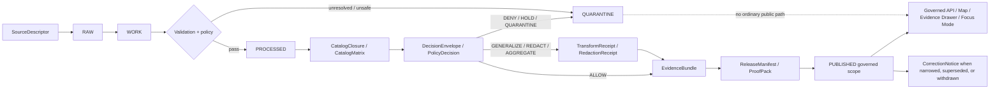

<!-- [KFM_META_BLOCK_V2]
doc_id: kfm://doc/TODO-NEEDS-UUID
title: Rights, Sensitivity, and Release Crosswalk
type: standard
version: v1
status: draft
owners: TODO-NEEDS-POLICY-OWNER
created: 2026-04-27
updated: 2026-04-27
policy_label: TODO-NEEDS-VERIFICATION
intended_path: policy/crosswalk/rights-sensitivity-release.md
evidence_mode: CORPUS_ONLY / NO_LOCAL_REPO_EVIDENCE
truth_posture: CONFIRMED doctrine / PROPOSED vocabulary / UNKNOWN implementation depth
related:
  - TODO-VERIFY-policy-index
  - TODO-VERIFY-policy-tests
  - TODO-VERIFY-source-descriptor-schema
  - TODO-VERIFY-decision-envelope-schema
  - TODO-VERIFY-evidence-bundle-schema
  - TODO-VERIFY-release-manifest-schema
  - TODO-VERIFY-correction-notice-schema
tags:
  - kfm
  - policy
  - rights
  - sensitivity
  - release
  - publication
  - crosswalk
  - governance
notes:
  - Repo-ready Markdown draft created from the supplied KFM Markdown baseline and project guidance.
  - Doc UUID, owner group, final policy label, schema homes, policy bundle paths, and CI/test paths require mounted-repo verification before this document is marked review or published.
[/KFM_META_BLOCK_V2] -->

# Rights, Sensitivity, and Release Crosswalk

A governed policy crosswalk for deciding when KFM material may be **published, generalized, restricted, delayed, quarantined, corrected, withdrawn, superseded, or denied**.

> [!IMPORTANT]
> **Status:** `draft`  
> **Target path:** `policy/crosswalk/rights-sensitivity-release.md`  
> **Path status:** `PROPOSED / NEEDS VERIFICATION` until confirmed in the mounted repository  
> **Evidence mode:** `CORPUS_ONLY / NO_LOCAL_REPO_EVIDENCE` for this drafting pass  
> **Truth posture:** `CONFIRMED doctrine` / `PROPOSED vocabulary` / `UNKNOWN implementation depth`

## Status chips

| Chip | Meaning |
|---|---|
| `DRAFT` | Human-readable standard is ready for review, not yet approved as policy authority. |
| `FAIL_CLOSED` | Unknown rights, sensitivity, evidence, review, catalog, or release closure blocks public release. |
| `CITE_OR_ABSTAIN` | Consequential public claims must resolve EvidenceRef → EvidenceBundle or abstain. |
| `NO_RAW_PUBLIC_PATH` | RAW, WORK, QUARANTINE, unpublished candidate data, and internal canonical stores do not feed ordinary public surfaces. |
| `SCHEMA_SYNC_REQUIRED` | Enum names and object fields must be synchronized with verified schemas / policies before enforcement. |

## Quick navigation

[Purpose](#purpose) · [Use this first](#use-this-first) · [Authority and evidence basis](#authority-and-evidence-basis) · [Operating rule](#operating-rule) · [Scope](#scope) · [Lifecycle position](#position-in-the-kfm-lifecycle) · [Decision inputs](#decision-inputs) · [Vocabulary](#vocabulary) · [Crosswalk](#crosswalk) · [Decision precedence](#decision-precedence) · [Release classes](#release-classes) · [Surface behavior](#surface-behavior) · [Object closure](#object-closure) · [Decision record shape](#decision-record-shape) · [Validation and fixtures](#validation-and-fixtures) · [Examples](#illustrative-examples) · [Policy-as-code handoff](#policy-as-code-handoff) · [Maintenance](#review-and-maintenance-rules) · [Open verification](#open-verification)

---

## Purpose

This crosswalk makes one KFM rule operational:

> **Rights, sensitivity, and release posture are governed publication states, not decorative metadata.**

A record, layer, catalog object, story excerpt, export, Evidence Drawer payload, Focus Mode answer, public API response, tile bundle, graph projection, search result, screenshot, or report may only widen outward when the release decision can be reconstructed from:

- source identity and source role,
- rights and redistribution posture,
- sensitivity and location-exposure posture,
- EvidenceRef → EvidenceBundle resolution,
- review state,
- catalog / proof / release closure,
- rollback and correction posture.

This file is a **policy crosswalk**, not a schema file and not a legal opinion. It gives maintainers a stable decision table to align policy-as-code, fixtures, release review, documentation, Evidence Drawer behavior, Focus Mode behavior, exports, and public UI/API behavior.

[Back to top](#rights-sensitivity-and-release-crosswalk)

---

## Use this first

Use this document when a candidate KFM artifact is about to move outward in audience, precision, permanence, or authority.

| Situation | Use this crosswalk to decide |
|---|---|
| A source is being activated | Whether the source can enter processing, must remain inactive, or needs rights / steward review. |
| A processed candidate is being promoted | Whether it may become cataloged, published, generalized, restricted, embargoed, or quarantined. |
| A map layer, tile, or feature is exposed | What geometry precision, attributes, badges, caveats, and Evidence Drawer payload may be public. |
| Focus Mode is asked to answer | Whether the runtime may answer, must abstain, must deny, or must return an error. |
| A prior release changes | Whether to emit `CorrectionNotice`, rollback, withdrawal, or supersession lineage. |

> [!TIP]
> `DENY`, `ABSTAIN`, `HOLD_REVIEW`, `QUARANTINE`, `GENERALIZE`, `METADATA_ONLY`, `RESTRICT`, and `EMBARGO` are not failures. They are successful governed outcomes when they prevent a false, unsafe, uncited, or unauthorized public claim.

[Back to top](#rights-sensitivity-and-release-crosswalk)

---

## Authority and evidence basis

This document is grounded in KFM doctrine and the supplied Markdown baseline. It does **not** prove current implementation behavior because no mounted repository, tests, workflows, source registries, policy bundles, release manifests, dashboards, logs, or runtime traces were verified during this drafting pass.

| Claim type | Status in this document |
|---|---|
| KFM lifecycle doctrine | `CONFIRMED doctrine` |
| Crosswalk vocabulary and enum names | `PROPOSED` until schema / policy registry alignment |
| Target repository path | `PROPOSED / NEEDS VERIFICATION` |
| Runtime route behavior | `UNKNOWN` |
| Existing schema files / policy files | `UNKNOWN` |
| Existing CI enforcement | `UNKNOWN` |
| Per-source license / rights conclusions | `NEEDS VERIFICATION` source by source |

> [!WARNING]
> A public source, open website, data portal, archive, aggregator, map service, or AI-readable document is not automatically republication-safe. KFM must separately establish source role, rights posture, sensitivity posture, evidence support, and release scope.

[Back to top](#rights-sensitivity-and-release-crosswalk)

---

## Operating rule

KFM release decisions should fail closed when any trust-bearing condition is unresolved.

```text
Unknown rights
OR unknown sensitivity
OR unresolved EvidenceBundle
OR missing required review
OR incomplete catalog closure
OR missing release manifest / rollback reference
OR RAW / WORK / QUARANTINE reference on a public surface
OR direct public path to canonical/internal stores
OR direct public path to model-runtime output
=> no public release
```

A public artifact is not made trustworthy by moving it into a published folder. In KFM, publication is a governed state transition backed by policy, evidence, catalog closure, release proof, review state, and correction lineage.

[Back to top](#rights-sensitivity-and-release-crosswalk)

---

## Scope

### Applies to

This crosswalk applies to release-bearing or release-adjacent surfaces.

| Surface | Use this crosswalk when… |
|---|---|
| Source intake | deciding whether a source can be activated or must remain inactive |
| Dataset promotion | moving processed candidates toward catalog / published state |
| Catalog discovery | exposing STAC / DCAT / PROV-style metadata or internal catalog records |
| Public map layers | publishing tiles, features, layer descriptors, or generalized geometry |
| Evidence Drawer | showing claim support, policy state, review state, caveats, and transform receipts |
| Focus Mode / governed AI | answering, abstaining, or denying over released evidence |
| Search / graph / triplet views | exposing queryable derived views without replacing canonical truth |
| Exports and reports | widening reuse beyond the current interface |
| Screenshots / story nodes | preserving public-safe rendered context with evidence and release refs |
| Corrections and withdrawals | narrowing, superseding, or withdrawing prior release scope |

### Does not replace

This file does **not** replace:

- source-specific license review,
- tribal / steward / cultural review protocols,
- privacy or legal review,
- machine-readable schemas,
- Rego / policy bundle implementation,
- release manifest contracts,
- EvidenceBundle contracts,
- emergency or life-safety alerting rules,
- CODEOWNERS / approval workflow configuration.

[Back to top](#rights-sensitivity-and-release-crosswalk)

---

## Position in the KFM lifecycle



The crosswalk sits at the **policy decision seam** between `PROCESSED`, `CATALOG`, and `PUBLISHED`. It can also force earlier stages into `QUARANTINE` when a source, candidate, transform, review state, or rights posture is not safe enough to continue.

[Back to top](#rights-sensitivity-and-release-crosswalk)

---

## Decision inputs

The following inputs are the minimum useful set for a rights / sensitivity / release decision.

| Input | Expected source | Required question |
|---|---|---|
| `actor_role` | request context / review workflow | Who is asking, reviewing, or releasing? |
| `audience_class` | release request | Public, steward, internal, reviewer, partner, or restricted? |
| `surface_class` | API / UI / export / catalog | Where would the material appear? |
| `action_class` | request / workflow | Publish, discover, render, answer, export, correct, withdraw, or supersede? |
| `lifecycle_state` | dataset / artifact state | Is this RAW, WORK, QUARANTINE, PROCESSED, CATALOG, or PUBLISHED? |
| `source_role` | `SourceDescriptor` | Is the source authoritative, corroborative, modeled, documentary, community, derived, or public-safe generalization? |
| `rights_class` | source descriptor / rights review | Does KFM have permission for the requested release and reuse? |
| `sensitivity_class` | source policy / steward review / validator | What harm, privacy, sovereignty, or precision exposure exists? |
| `public_geometry_class` | transform receipt / layer descriptor | Exact, generalized, aggregate, metadata-only, withheld, or no public geometry? |
| `evidence_state` | EvidenceRef resolver | Do all consequential claims resolve to EvidenceBundle? |
| `review_state` | `ReviewRecord` | Is human / steward review required, complete, denied, or still pending? |
| `catalog_state` | `CatalogClosure` / `CatalogMatrix` | Do catalog, provenance, evidence, release, and artifact references close? |
| `release_state` | `ReleaseManifest` / proof pack | Is release scope immutable, digested, auditable, and rollback-ready? |
| `correction_state` | `CorrectionNotice` / release lineage | Has a previous public state been narrowed, replaced, or withdrawn? |

[Back to top](#rights-sensitivity-and-release-crosswalk)

---

## Vocabulary

The exact enum names should be synchronized with the mounted repo’s schema and policy registries before enforcement. Until then, the following values are `PROPOSED`.

### Actor and audience classes

| Class | Meaning | Default posture |
|---|---|---|
| `public` | unauthenticated or ordinary public user | released public scope only |
| `partner` | authenticated trusted partner with limited terms | released partner scope only |
| `steward` | data steward, cultural steward, rights owner, or source owner | steward-approved restricted scope |
| `reviewer` | policy / rights / security / cultural / release reviewer | review workflow scope |
| `internal` | internal KFM maintainer or service actor | least-privilege internal scope |
| `restricted` | specially authorized role / project / lane | explicit access grant only |

### Surface classes

| `surface_class` | Meaning |
|---|---|
| `map_layer` | MapLibre / map feature / tile / layer descriptor output |
| `public_api` | normal public API response |
| `catalog` | catalog discovery / dataset metadata / distribution metadata |
| `evidence_drawer` | visible trust payload attached to a claim, layer, feature, or answer |
| `focus` | governed AI / Focus Mode response |
| `export` | downloadable report, data export, notebook, bundle, or screenshot |
| `search` | search result, index payload, or graph/triplet query result |
| `review_console` | restricted review interface |
| `correction` | correction, withdrawal, or supersession workflow |

### Rights classes

| `rights_class` | Meaning | Default posture |
|---|---|---|
| `open` | public reuse appears permitted for the requested surface | allow only after evidence / sensitivity / review gates |
| `attribution_required` | release is allowed only with attribution or license display | allow with obligation |
| `share_alike_or_notice_required` | release is allowed only with downstream terms preserved | allow with obligation |
| `noncommercial_or_limited_reuse` | reuse may be narrower than public export or redistribution | restrict, review, or metadata-only |
| `internal_use_only` | KFM may inspect/process but not republish | restrict |
| `consent_required` | release depends on explicit subject / steward / provider permission | hold review or deny |
| `no_redistribution` | source terms prohibit the requested outward release | deny public release |
| `unknown` | rights could not be established | quarantine or deny |
| `conflicted` | sources, terms, or records disagree | quarantine / rights review |

### Sensitivity classes

| `sensitivity_class` | Meaning | Default posture |
|---|---|---|
| `public` | no known sensitivity beyond ordinary citation / attribution | allow only if all other gates pass |
| `public_with_caveat` | public but must show caveat, uncertainty, source-role limit, or freshness warning | allow with visible caveat |
| `precise_location_sensitive` | exact location could create harm, privacy risk, looting risk, or resource exposure | generalize, metadata-only, restrict, or deny |
| `protected_species_or_habitat` | flora/fauna occurrence, nest, den, roost, hibernacula, spawning, rare habitat, or steward-controlled biodiversity precision | generalize / restrict / steward review |
| `cultural_or_sovereignty_sensitive` | cultural, Indigenous, oral-history, sacred, burial, archaeological, or sovereignty-sensitive material | steward review / restrict by default |
| `living_person_or_private` | living person, family privacy, DNA, consent-sensitive, private landowner, or similar exposure | restrict / consent review |
| `critical_infrastructure_sensitive` | infrastructure, dependency, asset condition, vulnerability, or security-sensitive geometry/detail | generalize / metadata-only / restrict |
| `embargoed` | time-delayed release required | embargo until reviewable date |
| `restricted` | controlled access only | no public release |
| `unknown` | sensitivity could not be classified | quarantine / hold review |

### Public geometry classes

| `public_geometry_class` | May expose | Must not expose |
|---|---|---|
| `exact` | exact geometry for public-safe, rights-cleared material | sensitive precision or restricted attributes |
| `generalized` | coarser precision, bbox, county, HUC, grid, range, masked point, or steward-approved transform | original restricted geometry or reversible hints |
| `aggregate` | bins, counts, heatmaps, density surfaces, summaries | individual sensitive record geometry |
| `metadata_only` | non-sensitive extent, title, source role, caveat, contact/review route | precise restricted coordinates |
| `withheld` | no public geometry | public map/search/focus geometry leakage |

### Release decision results

| Result | Meaning | Public behavior |
|---|---|---|
| `ALLOW` | all required gates pass for the requested audience and surface | may publish as requested |
| `ALLOW_WITH_OBLIGATIONS` | release is possible only after named obligations are satisfied | publish only after obligations are recorded |
| `GENERALIZE` | exact value cannot publish, but a transformed public representation may | publish generalized / aggregate form with receipt |
| `METADATA_ONLY` | discovery may publish without precise data or sensitive assets | publish catalog-only or summary-only |
| `RESTRICT` | release is allowed only to a narrower audience / surface | no public fallback |
| `EMBARGO` | release delayed until a date, event, or review condition | no public release until condition clears |
| `HOLD_REVIEW` | steward, rights, cultural, security, or release review required | no public release |
| `QUARANTINE` | unresolved or unsafe candidate must remain outside release flow | no public release |
| `DENY` | policy blocks requested action | no public release |
| `WITHDRAW_OR_SUPERSEDE` | previously released material must be narrowed, corrected, or replaced | emit visible correction lineage |

[Back to top](#rights-sensitivity-and-release-crosswalk)

---

## Crosswalk

### Rights-to-release crosswalk

| Rights condition | Default decision | Required obligations | Release class |
|---|---:|---|---|
| Rights explicitly allow requested public use | `ALLOW` when all non-rights gates pass | `REQUIRE_CITATION`, `RECORD_AUDIT` | `exact_public` or sensitivity-driven class |
| Attribution or notice required | `ALLOW_WITH_OBLIGATIONS` | `REQUIRE_ATTRIBUTION`, `DISPLAY_LICENSE`, `SNAPSHOT_TERMS` | public only with visible obligations |
| Share-alike / downstream terms required | `ALLOW_WITH_OBLIGATIONS` | `PRESERVE_TERMS`, `DISPLAY_LICENSE`, `RECORD_AUDIT` | public only if downstream obligations can be met |
| Limited reuse / noncommercial / source-specific constraint | `HOLD_REVIEW` or `RESTRICT` | `RIGHTS_REVIEW`, `SURFACE_LIMIT`, `EXPORT_BLOCK_IF_NEEDED` | restricted, metadata-only, or denied |
| Internal-use only | `RESTRICT` | `NO_PUBLIC_ARTIFACT`, `ACCESS_CONTROL` | restricted access |
| Consent required and consent present | `ALLOW_WITH_OBLIGATIONS` or `HOLD_REVIEW` | `ATTACH_CONSENT_RECORD`, `REVIEW_REQUIRED` where risk remains | surface-specific |
| Consent required and consent missing | `DENY` or `HOLD_REVIEW` | `REQUEST_CONSENT`, `WITHHOLD_PUBLIC_PAYLOAD` | not public |
| No redistribution | `DENY` | `WITHHOLD_PUBLIC_PAYLOAD`, `NO_EXPORT`, `NO_TILE` | denied public release |
| Rights unknown or conflicting | `QUARANTINE` | `RIGHTS_REVIEW`, `SNAPSHOT_TERMS`, `SOURCE_DESCRIPTOR_UPDATE` | quarantine until resolved |

### Sensitivity-to-release crosswalk

| Sensitivity condition | Default decision | Required obligations | Release class |
|---|---:|---|---|
| Public and non-sensitive | `ALLOW` when rights / evidence / review / catalog gates pass | `REQUIRE_CITATION`, `RECORD_AUDIT` | `exact_public` |
| Public with caveat, uncertainty, modeled status, or source-role limits | `ALLOW_WITH_OBLIGATIONS` | `SHOW_CAVEAT`, `LABEL_SOURCE_ROLE`, `LABEL_UNCERTAINTY` | public with visible caveat |
| Exact location sensitive | `GENERALIZE`, `METADATA_ONLY`, or `RESTRICT` | `GENERALIZE_GEOMETRY`, `CREATE_TRANSFORM_RECEIPT`, `REMOVE_RESTRICTED_FIELDS` | generalized, aggregate, metadata-only, or restricted |
| Protected species / habitat precision | `GENERALIZE` or `HOLD_REVIEW` | `GEOPRIVACY_REVIEW`, `CREATE_REDACTION_RECEIPT`, `NO_EXACT_PUBLIC_POINT` | generalized or restricted |
| Cultural / sovereignty / archaeological / oral-history sensitivity | `HOLD_REVIEW` or `RESTRICT` | `STEWARD_REVIEW`, `CULTURAL_REVIEW`, `ACCESS_PROTOCOL`, `TRANSFORM_IF_ALLOWED` | restricted or metadata-only |
| Living person, DNA, family privacy, or private-property exposure | `RESTRICT`, `HOLD_REVIEW`, or `DENY` | `CONSENT_REVIEW`, `LIVING_PERSON_GATE`, `WITHHOLD_PRIVATE_FIELDS` | restricted or denied |
| Critical infrastructure or vulnerability exposure | `GENERALIZE`, `METADATA_ONLY`, or `RESTRICT` | `SECURITY_REVIEW`, `REMOVE_RESTRICTED_FIELDS`, `GENERALIZE_GEOMETRY` | generalized, metadata-only, or restricted |
| Embargoed | `EMBARGO` | `EMBARGO_UNTIL`, `RECHECK_ON_EXPIRY`, `NO_PUBLIC_RECORD_UNTIL_ALLOWED` | embargoed |
| Sensitivity unknown | `QUARANTINE` | `SENSITIVITY_REVIEW`, `SOURCE_DESCRIPTOR_UPDATE` | quarantine until resolved |

### Lifecycle-to-release crosswalk

| Lifecycle state | Public release behavior | Required action |
|---|---|---|
| `RAW` | never public through ordinary surfaces | preserve, receipt, validate, or quarantine |
| `WORK` | never public through ordinary surfaces | finish deterministic transform and validation |
| `QUARANTINE` | never public | resolve reason, retain receipt, or deny |
| `PROCESSED` | candidate only | bind evidence, policy, catalog, and review state |
| `CATALOG` | discoverability only after closure | ensure catalog triplet / internal refs close |
| `PUBLISHED` | public only through governed release scope | expose via governed API / UI with correction state |

### Evidence / review / catalog closure crosswalk

| Condition | Default decision | Required action |
|---|---:|---|
| EvidenceRef unresolved for consequential claim | `DENY` for publication, `ABSTAIN` for Focus Mode | resolve EvidenceBundle or remove claim |
| Required review missing | `HOLD_REVIEW` | route rights / steward / cultural / security / release review |
| Review denied | `DENY` or `RESTRICT` | record denial and block public path |
| Catalog closure incomplete | `DENY` promotion | complete catalog / provenance / evidence / release refs |
| Release manifest missing rollback target | `DENY` promotion | attach rollback target / supersession strategy |
| Prior public release now unsafe or incorrect | `WITHDRAW_OR_SUPERSEDE` | emit `CorrectionNotice`, rebuild derivatives, update aliases |

[Back to top](#rights-sensitivity-and-release-crosswalk)

---

## Decision precedence

When multiple conditions apply, choose the narrowest safe decision and include all reason codes.

| Priority | Trigger | Result bias |
|---:|---|---|
| 1 | public surface would expose RAW / WORK / QUARANTINE / internal canonical store / direct model output | `DENY` or `QUARANTINE` |
| 2 | no source descriptor, inactive source, unknown rights, unknown sensitivity | `QUARANTINE` |
| 3 | explicit no-redistribution, missing consent where consent is required, denied review | `DENY` |
| 4 | sensitivity can be safely transformed | `GENERALIZE`, `METADATA_ONLY`, or `RESTRICT` |
| 5 | review required but not complete | `HOLD_REVIEW` |
| 6 | evidence / catalog / release closure missing | `DENY` promotion or `ABSTAIN` runtime |
| 7 | all gates pass with obligations | `ALLOW_WITH_OBLIGATIONS` |
| 8 | all gates pass without added obligations | `ALLOW` |

> [!NOTE]
> `ALLOW` is never inferred from silence. It is reached only after the required gates positively pass.

[Back to top](#rights-sensitivity-and-release-crosswalk)

---

## Release classes

Release classes describe what an approved outward surface may expose.

| `release_class` | May expose | Must not expose |
|---|---|---|
| `exact_public` | exact geometry / fields for public-safe, rights-cleared material | unresolved rights, restricted fields, unreviewed sensitive context |
| `generalized_public` | generalized geometry, coarser precision, masked centroid, grid, county, HUC, range, bbox, or other approved transform | original exact restricted geometry or reversible transform hints |
| `aggregate_public` | counts, summaries, bins, density, region-level summaries | individual sensitive record identity or precise source geometry |
| `metadata_only_public` | title, description, source role, non-sensitive extent, caveats, contact / review route | precise restricted coordinates or sensitive attributes |
| `restricted_access` | audience-limited payload under steward / reviewer / internal controls | silent fallback to public API, tiles, screenshots, search, graph, or AI context |
| `embargoed` | no public record, or public placeholder only if allowed | release before embargo clears and review re-runs |
| `review_required` | no public artifact yet | automated publication |
| `quarantine` | no public artifact | treating unresolved material as nearly publishable |
| `denied` | no public artifact | public release, export, or AI answer over the denied scope |
| `withdrawn_or_superseded` | visible correction state, affected release refs, replacement refs if any | silent deletion, history erasure, stale public aliases |

[Back to top](#rights-sensitivity-and-release-crosswalk)

---

## Surface behavior

| Surface | `ALLOW` | `GENERALIZE` / `METADATA_ONLY` | `RESTRICT` / `EMBARGO` | `DENY` / `QUARANTINE` |
|---|---|---|---|---|
| Public map / tiles | render released public geometry | render generalized / aggregate / metadata-only state with visible badge | do not render public payload | do not render |
| Public API | return released fields only | return transformed / reduced payload and obligations | return `DENY` or restricted-mode response | return `DENY`, `ABSTAIN`, or `ERROR` |
| Evidence Drawer | show claim, evidence, rights, sensitivity, review, caveats | show transform receipt and precision caveat | show withheld / restricted reason when allowed | show calm negative state, not hidden failure |
| Focus Mode | `ANSWER` only with citations and policy-safe context | `ANSWER` with caveat or `ABSTAIN` if support is insufficient | `DENY` for restricted content | `ABSTAIN`, `DENY`, or `ERROR` only |
| Export / report | export released scope with terms | export only allowed transformed scope | block or require restricted workflow | block |
| Catalog discovery | publish closed catalog refs | publish metadata-only or generalized extent | omit or show restricted placeholder only if policy allows | omit |
| Search / graph | expose released searchable fields and public-safe relations | expose generalized / metadata-only relation labels | withhold restricted relation or require restricted route | omit or negative state |
| Story / screenshot | show released visuals with release refs and caveats | show transformed visuals and transform caveats | block public story node | block |

[Back to top](#rights-sensitivity-and-release-crosswalk)

---

## Object closure

A release-significant decision is not complete until the relevant object family is present and coherent.

| Object family | What it must prove for this crosswalk |
|---|---|
| `SourceDescriptor` | source identity, owner / steward, source role, access mode, rights posture, sensitivity defaults, cadence, validation plan, publication intent |
| `IngestReceipt` / `RunReceipt` | what was fetched, transformed, validated, hashed, and by what run |
| `ValidationReport` | schema, source-role, rights, sensitivity, geospatial, temporal, catalog, and no-leak checks |
| `DecisionEnvelope` / `PolicyDecision` | result, reason codes, obligation codes, policy basis, actor / audience / surface, audit reference, effective window |
| `ReviewRecord` | required human / steward / cultural / security / rights approval or denial |
| `TransformReceipt` / `RedactionReceipt` | before / after hash, transform method, reason, policy version, actor or workload identity, timestamp |
| `EvidenceBundle` | resolved evidence support, source roles, rights / sensitivity summary, transform receipts, review state, caveats |
| `CatalogClosure` / `CatalogMatrix` | catalog, provenance, release, evidence, and artifact references close without guesswork |
| `ReleaseManifest` / `ProofPack` | public-safe artifact set, digests, policy decisions, review refs, rollback target, correction posture |
| `RuntimeResponseEnvelope` | finite outcome, citations, policy state, audit reference, no restricted leakage |
| `CorrectionNotice` | visible narrowing, withdrawal, replacement, affected releases, public note, and rebuild / rollback refs |

[Back to top](#rights-sensitivity-and-release-crosswalk)

---

## Reason and obligation seed list

The exact registry location is `NEEDS VERIFICATION`. Use these as seed values for policy fixtures and review vocabulary.

### Reason codes

| Code | Meaning |
|---|---|
| `source_descriptor.missing` | source descriptor is absent, inactive, or invalid |
| `rights.unknown` | rights posture is missing or unresolved |
| `rights.conflicted` | record, source, or license terms conflict |
| `rights.no_redistribution` | requested release exceeds permitted reuse |
| `rights.consent_missing` | consent required but absent |
| `sensitivity.unknown` | sensitivity posture is missing or unresolved |
| `sensitivity.exact_location` | exact public location is unsafe |
| `sensitivity.cultural_review_required` | cultural, sovereignty, archaeological, or oral-history review required |
| `sensitivity.living_person` | living-person or private-family exposure risk |
| `sensitivity.critical_infrastructure` | infrastructure / vulnerability exposure risk |
| `sensitivity.embargoed` | release delayed by embargo |
| `evidence.unresolved` | EvidenceRef does not resolve to EvidenceBundle |
| `review.required` | release requires human or steward review |
| `review.missing` | required review record missing |
| `catalog.not_closed` | catalog / provenance / release references do not close |
| `release.rollback_missing` | release lacks rollback target |
| `lifecycle.public_internal_ref` | public payload references RAW, WORK, QUARANTINE, or internal canonical stores |
| `runtime.direct_model_output` | public response would expose unreviewed model output as truth |
| `correction.required` | published material must be corrected, narrowed, withdrawn, or superseded |

### Obligation codes

| Code | Consequence |
|---|---|
| `REQUIRE_CITATION` | attach or resolve EvidenceBundle / citation support |
| `REQUIRE_ATTRIBUTION` | display attribution or license notice |
| `DISPLAY_LICENSE` | display license / notice details where required |
| `PRESERVE_TERMS` | preserve downstream terms or share-alike constraints |
| `SNAPSHOT_TERMS` | record source terms / rights snapshot |
| `RECORD_AUDIT` | attach audit reference |
| `RIGHTS_REVIEW` | route rights review before release |
| `SURFACE_LIMIT` | limit allowed surfaces or audiences |
| `EXPORT_BLOCK_IF_NEEDED` | block export where downstream reuse is not allowed |
| `NO_EXPORT` | prevent export for the requested scope |
| `NO_TILE` | prevent tile generation or tile publication |
| `NO_PUBLIC_ARTIFACT` | prevent creation or exposure of public artifacts |
| `NO_PUBLIC_RECORD_UNTIL_ALLOWED` | suppress public record until embargo / review condition clears |
| `ACCESS_CONTROL` | require access control before restricted handling |
| `RESTRICT_ACCESS` | narrow allowed actors / surfaces |
| `REQUEST_CONSENT` | request consent before release |
| `ATTACH_CONSENT_RECORD` | attach consent evidence to decision closure |
| `REVIEW_REQUIRED` | mark review as required before release |
| `ROUTE_STEWARD_REVIEW` | require steward / cultural / rights / security review |
| `STEWARD_REVIEW` | require steward review |
| `CULTURAL_REVIEW` | require cultural / sovereignty review |
| `SECURITY_REVIEW` | require security review |
| `CONSENT_REVIEW` | require consent / privacy review |
| `GEOPRIVACY_REVIEW` | require geoprivacy review before release |
| `SENSITIVITY_REVIEW` | require sensitivity classification review |
| `ACCESS_PROTOCOL` | apply controlled-access protocol |
| `TRANSFORM_IF_ALLOWED` | transform only if steward / policy review allows it |
| `SHOW_CAVEAT` | show caveat in UI / API / report |
| `LABEL_SOURCE_ROLE` | label source role visibly |
| `LABEL_UNCERTAINTY` | label uncertainty visibly |
| `LIVING_PERSON_GATE` | apply living-person / privacy gate |
| `WITHHOLD_PRIVATE_FIELDS` | remove or suppress private fields |
| `WITHHOLD_PUBLIC_PAYLOAD` | withhold public payload until policy condition clears |
| `GENERALIZE_GEOMETRY` | transform precise geometry before public release |
| `NO_EXACT_PUBLIC_POINT` | prevent exact public point geometry |
| `REMOVE_RESTRICTED_FIELDS` | strip restricted fields from public payloads |
| `CREATE_TRANSFORM_RECEIPT` | record transform details, before / after hashes, and reason |
| `CREATE_REDACTION_RECEIPT` | record redaction details, policy version, and actor/run |
| `SOURCE_DESCRIPTOR_UPDATE` | update source descriptor before release |
| `RECHECK_ON_EXPIRY` | re-run review / policy check when embargo or source term expires |
| `EMBARGO_UNTIL` | prevent release until a date or event condition |
| `METADATA_ONLY` | publish only metadata / discovery-safe information |
| `EMIT_CORRECTION_NOTICE` | create visible correction or supersession lineage |
| `ABSTAIN_RUNTIME` | return no answer because evidence or policy is insufficient |
| `DENY_PUBLICATION` | block public release |

[Back to top](#rights-sensitivity-and-release-crosswalk)

---

## Decision record shape

The executable schema home is `NEEDS VERIFICATION`. This shape is a human-readable target for `DecisionEnvelope` / `PolicyDecision` fixtures.

```yaml
decision_id: kfm://decision/TODO
candidate_ref: kfm://artifact/TODO
policy_version: TODO
request:
  actor_role: public
  audience_class: public
  surface_class: map_layer
  action_class: publish
scope:
  spatial_scope: TODO
  temporal_scope: TODO
  release_scope: TODO
inputs:
  lifecycle_state: PROCESSED
  source_descriptor_ref: kfm://source/TODO
  source_role: authoritative
  rights_class: open
  sensitivity_class: public
  public_geometry_class: exact
  evidence_state: resolved
  review_state: approved_or_not_required
  catalog_state: closed
  release_state: manifest_with_rollback
result:
  policy_result: ALLOW
  release_class: exact_public
  runtime_outcome: ANSWER
  reason_codes:
    - public_safe
  obligation_codes:
    - REQUIRE_CITATION
    - RECORD_AUDIT
closure:
  evidence_bundle_refs:
    - kfm://evidence-bundle/TODO
  review_record_refs: []
  transform_receipt_refs: []
  release_manifest_ref: kfm://release/TODO
  rollback_ref: kfm://rollback/TODO
audit:
  actor_or_workload_id: TODO
  evaluated_at: 2026-04-27T00:00:00Z
  audit_ref: kfm://audit/TODO
```

[Back to top](#rights-sensitivity-and-release-crosswalk)

---

## Decision algorithm

This pseudocode is illustrative and should be translated into repo-native policy tests only after schema and policy bundle homes are verified.

```text
START release_decision(candidate, actor_role, audience_class, surface_class)

1. If candidate.lifecycle_state in RAW, WORK, QUARANTINE:
     DENY with lifecycle.public_internal_ref
     obligation: WITHHOLD_PUBLIC_PAYLOAD

2. Resolve SourceDescriptor.
   If missing, invalid, or inactive:
     QUARANTINE or DENY with source_descriptor.missing

3. Evaluate rights_class.
   If unknown or conflicted:
     QUARANTINE with rights.unknown / rights.conflicted
   If no_redistribution for requested surface:
     DENY with rights.no_redistribution
   If consent_required and no consent record:
     HOLD_REVIEW or DENY with rights.consent_missing

4. Evaluate sensitivity_class.
   If unknown:
     QUARANTINE with sensitivity.unknown
   If exact public exposure is unsafe:
     GENERALIZE, METADATA_ONLY, RESTRICT, or DENY
     require TransformReceipt or RedactionReceipt where transformed

5. Resolve EvidenceRefs.
   If consequential claim lacks EvidenceBundle:
     DENY publication
     ABSTAIN runtime

6. Check required ReviewRecord.
   If required review is missing:
     HOLD_REVIEW

7. Check CatalogClosure / CatalogMatrix.
   If not closed:
     DENY promotion

8. Check ReleaseManifest / ProofPack / rollback target.
   If missing:
     DENY promotion

9. Emit DecisionEnvelope / PolicyDecision with:
     result, reason_codes, obligation_codes, audit_ref,
     evidence_refs, policy_label, review_state, effective window

END
```

[Back to top](#rights-sensitivity-and-release-crosswalk)

---

## Validation and fixtures

### Release validation checklist

Before public or semi-public release, reviewers should be able to check the following without guessing:

- [ ] `SourceDescriptor` exists and states source role, rights posture, sensitivity defaults, validation plan, and publication intent.
- [ ] Candidate is not `RAW`, `WORK`, or `QUARANTINE`.
- [ ] Rights class is not `unknown`, `conflicted`, or incompatible with the requested surface.
- [ ] Sensitivity class is present and compatible with the requested precision and audience.
- [ ] Exact sensitive geometry is absent from public API, public tiles, public catalog, public graph, public search, screenshots, and Focus Mode context.
- [ ] Required transform / redaction receipt exists for generalized, redacted, masked, delayed, or metadata-only releases.
- [ ] EvidenceRefs resolve to EvidenceBundle for every consequential claim.
- [ ] ReviewRecord exists when the lane, source, sensitivity, rights class, or release surface requires it.
- [ ] CatalogClosure / CatalogMatrix closes the catalog, provenance, release, evidence, and artifact references.
- [ ] ReleaseManifest / ProofPack names artifacts, digests, policy decisions, review refs, rollback target, and correction posture.
- [ ] RuntimeResponseEnvelope uses only `ANSWER`, `ABSTAIN`, `DENY`, or `ERROR`.
- [ ] CorrectionNotice is emitted when public meaning is narrowed, withdrawn, or superseded.
- [ ] Tests include at least one allowed fixture and one deny / hold / quarantine fixture for each new policy behavior.
- [ ] No public payload contains direct references to raw, work, quarantine, restricted store, direct model output, or internal canonical records.

### Minimum policy fixture matrix

| Fixture | Scenario | Expected result |
|---|---|---|
| `release.allow.public_safe` | public-safe, rights-cleared, evidence-resolved, catalog-closed, release manifest present | `ALLOW` |
| `release.deny.raw_public` | public map request over RAW / WORK / QUARANTINE | `DENY` |
| `release.quarantine.unknown_rights` | rights unknown for public catalog / API | `QUARANTINE` |
| `release.deny.no_redistribution` | source terms block requested surface | `DENY` |
| `release.hold.consent_missing` | consent required but absent | `HOLD_REVIEW` or `DENY` by lane policy |
| `release.generalize.exact_sensitive` | exact public geometry unsafe but transform allowed | `GENERALIZE` |
| `release.metadata_only.cultural` | cultural / sovereignty sensitivity allows discovery but not precise details | `METADATA_ONLY` or `RESTRICT` |
| `release.restrict.living_person` | living-person / DNA / private-family context | `RESTRICT` or `DENY` |
| `runtime.abstain.unresolved_evidence` | Focus Mode lacks EvidenceBundle support | `ABSTAIN` |
| `promotion.deny.catalog_open` | catalog / provenance / release refs do not close | `DENY` promotion |
| `promotion.deny.rollback_missing` | release manifest lacks rollback target | `DENY` promotion |
| `correction.supersede.sensitivity_reclassified` | prior exact release now requires narrowing | `WITHDRAW_OR_SUPERSEDE` |

[Back to top](#rights-sensitivity-and-release-crosswalk)

---

## Illustrative examples

These are `PROPOSED` fixture shapes. They are examples for review and tests, not proof that the mounted repo already emits these exact payloads.

### Public-safe answer allowed

```yaml
name: public_focus_answer_allowed_when_release_is_public_safe
input:
  actor_role: public
  audience_class: public
  surface_class: focus
  action: answer
  lifecycle_state: PUBLISHED
  rights_class: open
  sensitivity_class: public
  evidence_state: resolved
  review_state: approved_or_not_required
  catalog_state: closed
  release_state: manifest_with_rollback
expected:
  policy_result: ALLOW
  runtime_outcome: ANSWER
  reason_codes:
    - public_safe
  obligation_codes:
    - REQUIRE_CITATION
    - RECORD_AUDIT
```

### Exact public geometry denied but generalized release allowed

```yaml
name: exact_sensitive_location_generalized_before_public_layer
input:
  actor_role: public
  audience_class: public
  surface_class: map_layer
  action: publish
  lifecycle_state: PROCESSED
  rights_class: open
  sensitivity_class: precise_location_sensitive
  public_geometry_class: exact
  evidence_state: resolved
  review_state: approved
expected:
  policy_result: GENERALIZE
  release_class: generalized_public
  reason_codes:
    - sensitivity.exact_location
  obligation_codes:
    - GENERALIZE_GEOMETRY
    - CREATE_TRANSFORM_RECEIPT
    - REMOVE_RESTRICTED_FIELDS
    - REQUIRE_CITATION
```

### Unknown rights quarantined

```yaml
name: unknown_rights_blocks_public_catalog_discovery
input:
  actor_role: public
  audience_class: public
  surface_class: catalog
  action: discover
  lifecycle_state: PROCESSED
  rights_class: unknown
  sensitivity_class: public
  evidence_state: resolved
expected:
  policy_result: QUARANTINE
  runtime_outcome: DENY
  reason_codes:
    - rights.unknown
  obligation_codes:
    - SNAPSHOT_TERMS
    - ROUTE_STEWARD_REVIEW
    - DENY_PUBLICATION
```

### Correction after narrowed release

```yaml
name: released_layer_superseded_after_sensitivity_reclassification
input:
  previous_release_id: rel.example.v1
  new_release_candidate_id: rel.example.v2
  correction_trigger: sensitivity_reclassified
  previous_release_class: exact_public
  new_release_class: generalized_public
expected:
  policy_result: WITHDRAW_OR_SUPERSEDE
  reason_codes:
    - correction.required
    - sensitivity.exact_location
  obligation_codes:
    - EMIT_CORRECTION_NOTICE
    - GENERALIZE_GEOMETRY
    - CREATE_REDACTION_RECEIPT
    - RECORD_AUDIT
```

[Back to top](#rights-sensitivity-and-release-crosswalk)

---

## Policy-as-code handoff

Implementation paths are `PROPOSED` until the mounted repo is inspected.

| Artifact | Proposed home | Handoff note |
|---|---|---|
| Human crosswalk | `policy/crosswalk/rights-sensitivity-release.md` | This document. |
| Policy bundle | `policy/release/rights_sensitivity_release.rego` | Encode decision precedence and crosswalk rules. |
| Policy tests | `policy/release/tests/rights_sensitivity_release_test.rego` | Include positive and negative fixtures. |
| Schema fixtures | `tests/fixtures/policy/release/*.yaml` | Use fixture names from the matrix above. |
| Reason / obligation registry | `schemas/contracts/v1/policy/reason_obligation_codes.schema.json` | Verify actual schema home. |
| Decision envelope schema | `schemas/contracts/v1/policy/decision_envelope.schema.json` | Align with existing `DecisionEnvelope` if present. |
| Runtime response schema | `schemas/contracts/v1/runtime/runtime_response_envelope.schema.json` | Must enforce `ANSWER`, `ABSTAIN`, `DENY`, `ERROR`. |
| Release manifest schema | `schemas/contracts/v1/release/release_manifest.schema.json` | Must require rollback/correction refs for publication. |
| Correction notice schema | `schemas/contracts/v1/release/correction_notice.schema.json` | Must support withdrawal and supersession. |

### Required policy assertions

- Public paths must not expose `RAW`, `WORK`, `QUARANTINE`, internal canonical stores, or direct model-runtime output.
- Unknown rights or unknown sensitivity must not return `ALLOW`.
- Every `GENERALIZE`, `METADATA_ONLY`, or redaction path must have a receipt or review record.
- Every `ALLOW_WITH_OBLIGATIONS` must include obligations and a way to display or enforce them.
- Every public runtime `ANSWER` must cite resolved evidence and include policy-safe context only.
- Every public narrowing, withdrawal, or supersession must emit a visible `CorrectionNotice`.

[Back to top](#rights-sensitivity-and-release-crosswalk)

---

## Review and maintenance rules

1. **Do not add a release class without a deny case.** Every widened release pathway needs at least one negative fixture.
2. **Do not let a transform become invisible.** Generalization, redaction, masking, aggregation, and embargo decisions need receipts or review records.
3. **Do not let UI state become policy state.** Badges, chips, map style, or layer visibility communicate policy; they do not create it.
4. **Do not allow source convenience to outrank source role.** Aggregators, mirrors, OCR extracts, modeled surfaces, and AI proposals must remain visibly typed.
5. **Do not erase public history.** Supersession, withdrawal, and correction must be visible through `CorrectionNotice` rather than silent deletion.
6. **Do not treat open web visibility as redistribution permission.** Public elsewhere does not mean public-safe in KFM.
7. **Do not let Focus Mode widen access.** Governed AI may only interpret released, policy-safe context.
8. **Do not use this file as enum authority until schema home is verified.** This file is the human-readable crosswalk; machine vocabularies belong in the verified schema / policy registry.

[Back to top](#rights-sensitivity-and-release-crosswalk)

---

## Open verification

The following items remain `NEEDS VERIFICATION` before this document should be marked `review` or `published`.

| Item | Why it matters | Resolution target |
|---|---|---|
| `doc_id` UUID | required for stable KFM metadata identity | assign stable UUID / KFM doc ID |
| owner / reviewer group | policy release decisions need accountable ownership | confirm `owners` and CODEOWNERS |
| policy label | the document’s own access classification is not confirmed | set final `policy_label` |
| exact related file paths | mounted repo was not available in this drafting context | inspect repo tree |
| schema home | corpus references both contract and schema homes; repo convention must decide | ADR or verified convention |
| final enum names | reason, obligation, rights, sensitivity, release, and outcome vocabularies need registry alignment | schema / policy registry update |
| executable policy bundle location | policy implementation path is unknown | confirm policy engine and bundle path |
| test runner and CI enforcement | runnable gates cannot be claimed until workflow evidence exists | add / verify workflow |
| source-specific rights review process | per-source terms and steward protocols remain outside this generic crosswalk | source intake review SOP |
| correction publication pattern | exact `CorrectionNotice` and release alias behavior must be verified against release implementation | release/correction contract |
| Evidence Drawer display rules | transform / restriction reasons should be visible without leaking restricted detail | UI contract alignment |
| Focus Mode negative-state behavior | runtime must abstain or deny rather than hallucinate policy-unsafe answers | runtime envelope tests |

[Back to top](#rights-sensitivity-and-release-crosswalk)

---

## Change log

| Version | Date | Change |
|---|---|---|
| `v1-draft` | 2026-04-27 | Expanded baseline into repo-ready crosswalk with status chips, authority basis, actor/surface/geometry vocabulary, decision precedence, decision record shape, fixture matrix, policy-as-code handoff, and open verification table. |
