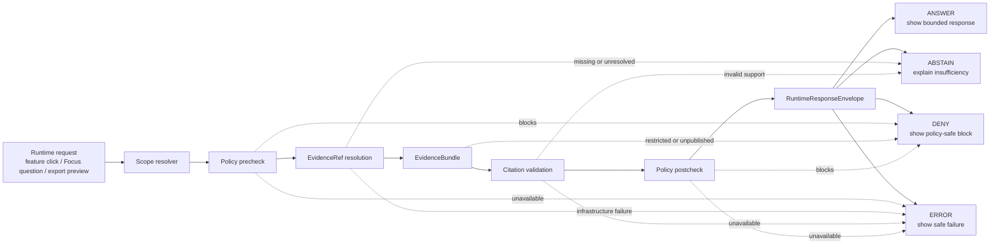

<!-- [KFM_META_BLOCK_V2]
doc_id: kfm://doc/NEEDS-VERIFICATION
title: Runtime Outcome Map
type: standard
version: v1
status: draft
owners: NEEDS_VERIFICATION
created: 2026-04-27
updated: 2026-04-27
policy_label: NEEDS_VERIFICATION
related: [NEEDS_VERIFICATION]
tags: [kfm, policy, crosswalk, runtime-outcomes, governed-ai, focus-mode, evidence, evidence-bundle, decision-envelope, citation-validation, evidence-drawer]
notes: [Repo-ready revision of a draft policy/crosswalk/runtime-outcome-map.md; current repository tree, schema paths, route names, validator names, workflow names, owners, policy registries, and checked-in fixtures were not available during this authoring pass and must be verified before publication.]
[/KFM_META_BLOCK_V2] -->

<a id="top"></a>

# Runtime Outcome Map

<p align="center">
  <strong>A policy crosswalk for KFM’s trust-visible runtime outcomes:</strong><br>
  <code>ANSWER</code> · <code>ABSTAIN</code> · <code>DENY</code> · <code>ERROR</code>
</p>

<p align="center">
  
  
  
  
  
</p>

> [!IMPORTANT]
> **Runtime law:** KFM runtime surfaces return exactly one public-edge outcome: `ANSWER`, `ABSTAIN`, `DENY`, or `ERROR`.
> A fluent response is not enough. Runtime answers must be evidence-bounded, policy-checked, citation-visible, release-aware, and auditable.
>
> **Implementation depth:** Current checked-in schema homes, route names, validators, workflows, fixtures, and UI components are `NEEDS VERIFICATION` until a mounted repository tree is inspected.

---

## Status at a glance

| Item | Status | Meaning |
|---|---:|---|
| Runtime outcome set | **CONFIRMED doctrine** | KFM runtime outputs must use finite, trust-visible outcomes. |
| This document | **DRAFT** | Repo-ready policy crosswalk; not yet verified against checked-in repo paths. |
| Target path | **PROPOSED** | `policy/crosswalk/runtime-outcome-map.md` pending repo inspection. |
| Repository evidence | **UNKNOWN** | No current repo tree, tests, workflows, dashboards, or runtime logs were available during this authoring pass. |
| Schema / validator homes | **NEEDS VERIFICATION** | Candidate paths are listed for maintainers but are not claimed as existing. |
| Public posture | **Fail closed** | When support, policy, citation, integrity, or enforcement is uncertain, do not synthesize a public answer. |

## Quick jumps

[Scope](#scope) · [Repo fit](#repo-fit) · [Outcome law](#outcome-law) · [Flow](#flow) · [Crosswalk](#crosswalk) · [Reason codes](#reason-code-policy) · [Envelope shape](#runtime-response-envelope-shape) · [Policy boundaries](#policy-boundaries) · [Surface behavior](#surface-behavior-matrix) · [Validation](#validation-and-review-gates) · [Examples](#worked-examples) · [Open verification](#open-verification-backlog)

---

## Scope

This file defines how KFM should interpret runtime outcomes when a governed API, Evidence Drawer, Focus Mode response, export preview, or map interaction needs to decide what can be shown.

It is a **policy crosswalk**. It is not a schema file, route implementation, promotion policy, UI component, or validator script.

### Reader contract

This document separates doctrine from implementation status.

| Claim type | Label | How to read it |
|---|---:|---|
| KFM outcome posture | **CONFIRMED doctrine** | The KFM corpus and project rules require finite, evidence-bounded, policy-aware runtime outcomes. |
| Candidate file paths | **PROPOSED** | Useful repo homes to verify or adapt; not proof that those paths exist. |
| Current repo behavior | **UNKNOWN** | Requires direct repository, test, workflow, log, or generated-artifact evidence. |
| Mutable source/tool facts | **NEEDS VERIFICATION** | Confirm versions, tool names, route names, owners, policy registries, and source terms before release. |

### Accepted inputs

Runtime outcome evaluation may consume only governed, release-bounded inputs:

- released or review-safe `EvidenceBundle` references
- `EvidenceRef` resolution results
- `DecisionEnvelope`, `PolicyDecision`, or equivalent policy state
- citation validation reports
- release, review, freshness, rights, and sensitivity state
- user role, request scope, map/time context, and requested surface
- bounded model-adapter output after policy precheck, where AI is enabled

### Exclusions

Runtime outcome evaluation must not consume or emit:

- RAW, WORK, or QUARANTINE data directly
- direct browser-to-model or browser-to-vector-store calls
- raw model output as public truth
- hidden chain-of-thought or unreviewable inference as evidence
- unpublished candidate data as runtime context
- UI-side policy decisions treated as enforcement
- promotion decisions disguised as runtime answers
- emergency, life-safety, legal, medical, or other high-stakes instructions unless a governed KFM policy explicitly allows that surface

[Back to top](#top)

---

## Repo fit

| Item | Value |
|---|---|
| Target path | `policy/crosswalk/runtime-outcome-map.md` |
| Document role | Policy-facing crosswalk between runtime outcome semantics, evidence sufficiency, policy decisions, user-visible states, and validation expectations. |
| Upstream candidates | `schemas/contracts/v1/runtime/runtime_response_envelope.schema.json`; `schemas/contracts/v1/evidence/evidence_bundle.schema.json`; `schemas/contracts/v1/policy/decision_envelope.schema.json`; `policy/README.md`; `policy/reason-codes.*`; `policy/obligation-codes.*` |
| Downstream candidates | Governed API handlers, Evidence Drawer payload mapping, Focus Mode responses, export preview responses, runtime proof fixtures, negative-state UI copy. |
| Verification state | Candidate links are `NEEDS VERIFICATION` until the real repository tree is inspected. |

> [!NOTE]
> This file intentionally keeps candidate paths visible without claiming they exist. A maintainer should update `related:` in the meta block after direct repo verification.

### Neighboring docs that should link here

These are **PROPOSED** link targets and should be adjusted to actual repo conventions:

- `policy/README.md`
- `docs/governed-ai/README.md`
- `docs/ui/evidence-drawer.md`
- `docs/ui/focus-mode.md`
- `docs/architecture/trust-membrane.md`
- runtime envelope schema documentation
- reason-code and obligation-code registries

---

## Outcome law

KFM runtime outcomes are **public-edge outcomes**. They say what the system may return for a bounded request after evidence, policy, citation, integrity, release, and runtime checks have completed.

They are not promotion states. They are not validator states. They are not reviewer decisions. They are not model-confidence labels. They are not UI mood words.

| Outcome | Runtime meaning | Default posture | User-visible obligation |
|---|---|---|---|
| `ANSWER` | A scoped response may be shown because evidence is admissible, policy allows it, citations validate, and the requested surface is in release scope. | Allow with traceability. | Show answer, evidence links, policy/review/freshness state, correction state, and limitations. |
| `ABSTAIN` | The system declines to answer because support is insufficient, ambiguous, stale, conflicted, overbroad, or unresolved. | Fail closed without asserting. | Explain the missing or unresolved condition and offer a narrower safe path when appropriate. |
| `DENY` | The requested answer or surface is blocked by policy, rights, sensitivity, release state, role, embargo, or publication rule. | Block. | State that policy blocked the request and show safe reason codes when allowed. |
| `ERROR` | The system cannot safely complete the runtime path because enforcement, integrity, infrastructure, resolver, validator, policy engine, or adapter behavior failed. | Block rather than guess. | Show a bounded system-failure state, preserve auditability, and avoid fallback answers. |

### Runtime outcome principles

1. `ANSWER` requires inspectable evidence support; it is not “the model sounded confident.”
2. `ABSTAIN` is successful governance, not a broken answer.
3. `DENY` is policy enforcement, not evidence insufficiency.
4. `ERROR` is operational or integrity failure; it must never degrade into an uncited answer.
5. Negative outcomes must be first-class in API responses, UI copy, fixtures, tests, and audit records.
6. A public map popup, Focus Mode answer, export preview, story node, or Evidence Drawer panel must not invent a fifth outcome by prose.

### Precedence rule

When multiple conditions apply, classify by the strongest trust boundary that failed.

| Precedence | Question | Outcome |
|---:|---|---:|
| 1 | Did a required enforcement, integrity, resolver, validator, or runtime component fail? | `ERROR` |
| 2 | Does policy, rights, sensitivity, role, embargo, release state, or publication rule block the request? | `DENY` |
| 3 | Is evidence support missing, unresolved, stale, conflicted, overbroad, or citation-invalid? | `ABSTAIN` |
| 4 | Did evidence, policy, citation, release, freshness, and scope checks all pass? | `ANSWER` |

> [!WARNING]
> Do not use `ERROR` to hide policy denial, and do not use `ABSTAIN` to soften a policy block. The outcome is part of the trust record.

[Back to top](#top)

---

## Flow



### Decision pseudocode

```text
if required_runtime_component_failed:
    return ERROR

if policy_blocks_request or release_state_blocks_surface:
    return DENY

if evidence_missing_or_unresolved:
    return ABSTAIN

if evidence_stale_without_stale_allowance:
    return ABSTAIN

if evidence_conflicted_without_review_resolution:
    return ABSTAIN

if citations_invalid_or_claims_unsupported:
    return ABSTAIN

return ANSWER
```

---

## Crosswalk

### Core runtime decision table

| Trigger condition | Preferred outcome | Why | Required visible state |
|---|---:|---|---|
| EvidenceBundle resolves, policy allows, citations validate, release scope matches. | `ANSWER` | The response has admissible support and a governed publication path. | Evidence refs, citation refs, policy decision, review state, freshness, correction state. |
| No released evidence exists in scope. | `ABSTAIN` | KFM cites or abstains; absence of evidence is not a denial. | `NO_RELEASED_EVIDENCE`; narrowed-scope suggestion if safe. |
| Evidence exists but is unpublished or candidate-only. | `DENY` | Runtime must not use candidate evidence as public context. | `EVIDENCE_NOT_PUBLISHED`; release or review state if safe to disclose. |
| Evidence is stale and stale answers are not explicitly allowed. | `ABSTAIN` | Freshness limits affect answerability. | `EVIDENCE_STALE`; last verified time when safe. |
| Evidence conflicts and no review state resolves it. | `ABSTAIN` | Conflict requires review or narrower claim scope. | `EVIDENCE_CONFLICTED`; conflicting source-role summary when safe. |
| Request is too broad for the active map/time/source scope. | `ABSTAIN` | Scope must be narrowed before answerability can be checked. | `SCOPE_TOO_BROAD`; suggested narrowing dimensions. |
| Source ID, EvidenceRef, or ledger entry cannot resolve. | `ABSTAIN` | The system cannot cite unresolvable support. | `SOURCE_UNRESOLVED` or `EVIDENCE_REF_UNRESOLVED`. |
| Rights, sensitivity, role, embargo, or precise-location policy blocks release. | `DENY` | Policy prohibits the requested surface. | Safe reason code; never leak restricted details. |
| Sensitive location can be generalized and policy allows generalized output. | `ANSWER` | Answer may proceed only at the transformed public-safe support level. | `SHOW_GENERALIZATION`; transform receipt or withheld-count summary. |
| Citation validator rejects a model-supported claim. | `ABSTAIN` | The answer cannot be released as supported. | `CITATION_INVALID`; unsupported claim count when safe. |
| Citation validator is unavailable. | `ERROR` | Validator failure is operational failure, not evidence insufficiency. | `VALIDATOR_UNAVAILABLE`; audit ref. |
| Policy engine is unavailable. | `ERROR` | Policy cannot be bypassed. | `POLICY_ENGINE_UNAVAILABLE`; audit ref. |
| Evidence resolver fails due to infrastructure fault. | `ERROR` | The system cannot prove support. | `EVIDENCE_RESOLVER_ERROR`; audit ref. |
| Model adapter is unavailable where Focus Mode needs it. | `ERROR` | No fluent fallback may be substituted. | `MODEL_UNAVAILABLE`; non-AI fallback link only if already governed. |
| Manifest, digest, or release-scope mismatch is detected. | `ERROR` | Integrity fault blocks runtime release. | `MANIFEST_DIGEST_MISMATCH` or related integrity code; audit ref. |

### Runtime outcomes versus neighboring decision families

| Family | Example outcomes | Relationship to runtime outcomes |
|---|---|---|
| Runtime response | `ANSWER`, `ABSTAIN`, `DENY`, `ERROR` | Public-edge result of a bounded request. This file governs this family. |
| Policy decision | allow / deny plus reason and obligation codes | Feeds runtime outcomes. Policy block generally maps to `DENY`; unavailable policy maps to `ERROR`. |
| Promotion gate | `PASS`, `HOLD`, `DENY`, `ERROR` or repo-confirmed equivalent | Separate release-review workflow. Do not map `HOLD` into runtime v1 unless a checked schema explicitly defines it. |
| Validation result | pass / quarantine / deny / error or repo-confirmed equivalent | Supports lifecycle gating. Runtime may use released validation state but must not expose WORK/QUARANTINE internals directly. |
| Review state | draft / review / published / corrected / withdrawn or repo-confirmed equivalent | Describes release/review posture; does not by itself make a runtime `ANSWER` valid. |

> [!WARNING]
> `HOLD` appears in some KFM planning material as a review or gate posture. For this runtime map, `HOLD` is **not** a v1 runtime outcome unless the mounted repo’s runtime schema confirms it.

[Back to top](#top)

---

## Reason-code policy

Reason codes should be stable enough for tests, UI copy, receipts, and analytics, but specific enough to preserve the difference between evidence insufficiency, policy denial, and runtime failure.

### Reason-code rules

- Use uppercase `SNAKE_CASE`.
- Require at least one primary reason code for every `ABSTAIN`, `DENY`, and `ERROR`.
- Prefer one primary reason and optional supporting reasons over a long, unordered list.
- Do not encode protected source details, precise sensitive locations, private identifiers, or hidden policy internals in public reason codes.
- Register new reason codes before using them in fixtures or UI copy.
- Keep reason codes distinct from obligations. A reason says **why**; an obligation says **what must be shown or withheld**.

### Starter reason-code buckets

| Bucket | Example reason codes | Default outcome |
|---|---|---:|
| Evidence | `NO_RELEASED_EVIDENCE`, `EVIDENCE_CONFLICTED`, `EVIDENCE_STALE`, `EVIDENCE_REF_UNRESOLVED` | `ABSTAIN` |
| Scope | `SCOPE_TOO_BROAD`, `TIME_SCOPE_UNSUPPORTED`, `SOURCE_SCOPE_UNSUPPORTED`, `SURFACE_SCOPE_UNSUPPORTED` | `ABSTAIN` |
| Citation | `CITATION_INVALID`, `UNSUPPORTED_CLAIM`, `CITATION_SCOPE_MISMATCH`, `CITATION_RESOLUTION_FAILED` | `ABSTAIN` |
| Policy | `EVIDENCE_NOT_PUBLISHED`, `SENSITIVITY_BLOCK`, `RIGHTS_BLOCK`, `ROLE_NOT_ALLOWED`, `EMBARGO_ACTIVE` | `DENY` |
| Integrity | `MANIFEST_DIGEST_MISMATCH`, `RELEASE_SCOPE_MISMATCH`, `ARTIFACT_HASH_MISMATCH`, `SPEC_HASH_MISMATCH` | `ERROR` |
| System | `POLICY_ENGINE_UNAVAILABLE`, `EVIDENCE_RESOLVER_ERROR`, `MODEL_UNAVAILABLE`, `VALIDATOR_UNAVAILABLE` | `ERROR` |
| Source governance | `SOURCE_LEDGER_MISSING`, `SOURCE_AUTHORITY_CONFLICT`, `PROJECT_SOURCE_NOT_ACCESSIBLE` | `ERROR` or `ABSTAIN` by policy |

### Obligations

When an `ANSWER` is allowed only under narrowing, transformation, caveat, or review conditions, the envelope should carry obligations instead of hiding limits in prose.

| Obligation | Applies when | User-visible behavior |
|---|---|---|
| `SHOW_GENERALIZATION` | Exact support was transformed. | Display generalized/withheld badge and transform note. |
| `SHOW_STALE_BADGE` | Stale display is explicitly allowed. | Display last-verified and stale-basis state. |
| `SHOW_LIMITATIONS` | Evidence supports a qualified claim only. | Display what the answer is and is not saying. |
| `SHOW_REVIEW_STATE` | Review posture matters to trust. | Display draft/review/published/corrected state. |
| `SHOW_CORRECTION_LINEAGE` | Claim was corrected, superseded, or withdrawn. | Link correction notice or replacement reference. |
| `NO_EXPORT` | Surface may display but not export. | Disable export or return `DENY` for export preview. |
| `SHOW_SOURCE_ROLE` | Source authority differs from viewer expectation. | Display source-role badge or source-role note. |
| `SHOW_COVERAGE_LIMITS` | Coverage is partial in space, time, source family, or release scope. | Display coverage boundary before synthesis. |

---

## Runtime response envelope shape

The schema home is `NEEDS VERIFICATION`. This shape is a policy-facing field-family sketch for reviewers and implementers.

```json
{
  "schema": "kfm.runtime_response_envelope.v1",
  "request_id": "kfm://request/NEEDS-VERIFICATION",
  "outcome": "ANSWER | ABSTAIN | DENY | ERROR",
  "surface": "focus | evidence_drawer | map_popup | export_preview | api",
  "scope": {
    "space": "NEEDS_VERIFICATION",
    "time": "NEEDS_VERIFICATION",
    "release": "NEEDS_VERIFICATION",
    "source_scope": []
  },
  "answer": {
    "text": "Present only when outcome is ANSWER.",
    "limitations": []
  },
  "evidence_refs": [],
  "citations": [],
  "policy": {
    "decision_ref": "kfm://decision/NEEDS-VERIFICATION",
    "reason_codes": [],
    "obligations": []
  },
  "trust_state": {
    "release_state": "NEEDS_VERIFICATION",
    "review_state": "NEEDS_VERIFICATION",
    "freshness_state": "NEEDS_VERIFICATION",
    "correction_state": "NEEDS_VERIFICATION"
  },
  "audit_ref": "kfm://audit/NEEDS-VERIFICATION"
}
```

### Minimum field families

| Field family | Required for | Notes |
|---|---|---|
| `outcome` | all responses | Must be one of the runtime outcomes confirmed by schema. |
| `surface` | all responses | Drives UI copy, export behavior, and negative-state rendering. |
| `scope` | all responses | Map/time/source/release context must be inspectable. |
| `answer` | `ANSWER` only | Must be absent or empty for negative outcomes unless schema defines a safe explanatory payload. |
| `evidence_refs` | `ANSWER`; sometimes negative outcomes | `ANSWER` without support is invalid. Negative outcomes may include safe unresolved refs if policy allows. |
| `citations` | `ANSWER` | Citation IDs must validate against the resolved bundle. |
| `policy.reason_codes` | negative outcomes | Safe reason codes make refusal explainable. |
| `policy.obligations` | qualified `ANSWER` | Shows required caveats, transformation notes, and display duties. |
| `trust_state` | all public UI surfaces | Drives badges, empty states, stale-state copy, and correction visibility. |
| `audit_ref` | all responses | Supports replay, receipts, diagnostics, correction, and rollback. |

### Minimal schema constraints to enforce

This is a **PROPOSED** schema excerpt, not a claim about the current repo schema.

```json
{
  "$schema": "https://json-schema.org/draft/2020-12/schema",
  "title": "RuntimeResponseEnvelopeV1",
  "type": "object",
  "required": ["schema", "request_id", "outcome", "surface", "scope", "policy", "trust_state", "audit_ref"],
  "properties": {
    "outcome": {
      "type": "string",
      "enum": ["ANSWER", "ABSTAIN", "DENY", "ERROR"]
    },
    "evidence_refs": {
      "type": "array",
      "items": { "type": "string" }
    },
    "citations": {
      "type": "array",
      "items": { "type": "string" }
    }
  },
  "allOf": [
    {
      "if": { "properties": { "outcome": { "const": "ANSWER" } } },
      "then": { "required": ["answer", "evidence_refs", "citations"] }
    }
  ]
}
```

---

## Policy boundaries

### What `ANSWER` may do

`ANSWER` may:

- summarize released, admissible evidence
- link citations and evidence refs
- display limitations, source roles, freshness, and review state
- include generalized or redacted outputs when policy allows
- support Focus Mode, Evidence Drawer, popup, API, or export-preview content within scope

`ANSWER` must not:

- cite unresolved material
- rely on hidden model reasoning
- expose precise restricted geometry
- bypass source-role, rights, sensitivity, or release policy
- substitute convenience derivatives for canonical evidence
- imply completeness where coverage is partial

### What `ABSTAIN` may do

`ABSTAIN` may:

- explain missing, stale, conflicted, overbroad, or unsupported conditions
- suggest safe narrowing dimensions
- link to available non-claim navigation surfaces
- create a review or evidence-gap signal if the repo has such a lane

`ABSTAIN` must not:

- provide a speculative answer
- turn evidence absence into a policy denial
- leak restricted evidence while explaining insufficiency

### What `DENY` may do

`DENY` may:

- show a policy-safe reason code
- show a general block category such as rights, sensitivity, role, embargo, or publication state
- direct maintainers to review channels when allowed

`DENY` must not:

- expose the restricted material it is protecting
- show unpublished candidate evidence
- downgrade policy failure into an abstention to appear more helpful

### What `ERROR` may do

`ERROR` may:

- show a bounded system failure state
- include an audit reference
- preserve diagnostics for authorized maintainers
- retry only through controlled runtime behavior

`ERROR` must not:

- return raw model output
- bypass the policy engine
- silently fall back to old or unverified evidence
- hide integrity failures as empty results

[Back to top](#top)

---

## Surface behavior matrix

| Surface | `ANSWER` | `ABSTAIN` | `DENY` | `ERROR` |
|---|---|---|---|---|
| Evidence Drawer | Show claim support, citations, source roles, policy/review/freshness state. | Show missing or unresolved support state. | Show policy block without leaking protected details. | Show resolver/validator/policy failure with audit ref. |
| Focus Mode | Show bounded synthesis with citations and limitations. | Explain why synthesis is not supported. | Explain policy block using safe reason code. | Show model/resolver/policy/citation-system failure; no fallback answer. |
| Map popup | Show only public-safe summary and drawer link. | Show “support unavailable” or “select narrower context.” | Show restricted/unreleased state if safe. | Show safe failure and preserve map interaction. |
| Export preview | Show exportable artifacts and obligations. | Show why export cannot be supported. | Block export for rights/sensitivity/release. | Block export due to integrity or system failure. |
| API response | Return full envelope. | Return full negative envelope. | Return full negative envelope with safe reason codes. | Return full failure envelope with audit ref. |

### Accessibility and UX requirements

- Do not rely on color alone to distinguish `ANSWER`, `ABSTAIN`, `DENY`, and `ERROR`.
- Negative states need stable headings, accessible labels, and reason-code-backed copy.
- `DENY` copy must avoid protected detail leakage.
- `ERROR` copy must distinguish temporary operational failure from evidence insufficiency.
- Export previews must show `NO_EXPORT`, rights, sensitivity, or integrity blocks before the user commits to export.

---

## Worked examples

These examples are **PROPOSED fixtures** for implementation planning. They are not proof of existing tests.

### Example 1 — Evidence Drawer can answer

| Field | Value |
|---|---|
| Request | User clicks a released public-safe map feature and opens the Evidence Drawer. |
| Checks | EvidenceBundle resolves; citations validate; policy allows the public drawer surface. |
| Outcome | `ANSWER` |
| Required copy | Show source role, evidence refs, citations, review state, freshness, and limitations. |

```json
{
  "outcome": "ANSWER",
  "surface": "evidence_drawer",
  "evidence_refs": ["kfm://evidence/EXAMPLE"],
  "citations": ["kfm://citation/EXAMPLE"],
  "policy": {
    "reason_codes": [],
    "obligations": ["SHOW_REVIEW_STATE", "SHOW_LIMITATIONS"]
  },
  "audit_ref": "kfm://audit/EXAMPLE"
}
```

### Example 2 — Focus Mode abstains

| Field | Value |
|---|---|
| Request | User asks for a claim outside the released source/time scope. |
| Checks | Policy does not block the topic, but no released EvidenceBundle supports the claim. |
| Outcome | `ABSTAIN` |
| Required copy | Explain the missing support and suggest narrowing by place, time, source, or released layer when safe. |

```json
{
  "outcome": "ABSTAIN",
  "surface": "focus",
  "policy": {
    "reason_codes": ["NO_RELEASED_EVIDENCE", "SCOPE_TOO_BROAD"],
    "obligations": []
  },
  "audit_ref": "kfm://audit/EXAMPLE"
}
```

### Example 3 — Export preview denies

| Field | Value |
|---|---|
| Request | User attempts to export a precise restricted location or unreleased candidate object. |
| Checks | Policy blocks export based on sensitivity, rights, role, or release state. |
| Outcome | `DENY` |
| Required copy | Show safe block category; do not reveal the protected details. |

```json
{
  "outcome": "DENY",
  "surface": "export_preview",
  "policy": {
    "reason_codes": ["SENSITIVITY_BLOCK", "NO_EXPORT"],
    "obligations": []
  },
  "audit_ref": "kfm://audit/EXAMPLE"
}
```

### Example 4 — API returns error

| Field | Value |
|---|---|
| Request | Runtime API needs policy and citation validation before answering. |
| Checks | Policy engine, resolver, validator, manifest check, or adapter is unavailable. |
| Outcome | `ERROR` |
| Required copy | Show safe failure, audit ref, and no fallback answer. |

```json
{
  "outcome": "ERROR",
  "surface": "api",
  "policy": {
    "reason_codes": ["POLICY_ENGINE_UNAVAILABLE"],
    "obligations": []
  },
  "audit_ref": "kfm://audit/EXAMPLE"
}
```

---

## Validation and review gates

### Definition of done

A runtime-outcome implementation is not review-ready until these are true:

- [ ] `RuntimeResponseEnvelope` schema exists or the schema-home exception is documented.
- [ ] Valid fixtures exist for `ANSWER`, `ABSTAIN`, `DENY`, and `ERROR`.
- [ ] Invalid fixtures prove unknown outcomes are rejected.
- [ ] `ANSWER` fails validation without evidence refs and citation refs.
- [ ] `ABSTAIN` includes reason codes.
- [ ] `DENY` includes safe policy reason codes.
- [ ] `ERROR` includes an audit ref.
- [ ] Browser code cannot call model runtimes, vector stores, object stores, RAW, WORK, or QUARANTINE paths directly.
- [ ] Evidence Drawer and Focus Mode render all four outcomes distinctly.
- [ ] Citation validation blocks unsupported claims.
- [ ] Policy engine unavailable maps to `ERROR`.
- [ ] Unpublished evidence maps to `DENY`.
- [ ] Missing released evidence maps to `ABSTAIN`.
- [ ] At least one end-to-end runtime proof demonstrates positive and negative paths from release scope through UI/API envelope.

### Fixture matrix

| Fixture | Expected result | Must prove |
|---|---:|---|
| `answer.valid.json` | `ANSWER` | Evidence refs and citations resolve and validate. |
| `answer.missing_evidence.invalid.json` | validation failure | `ANSWER` cannot be emitted without evidence support. |
| `abstain.no_released_evidence.json` | `ABSTAIN` | Missing released evidence is not a policy denial. |
| `abstain.citation_invalid.json` | `ABSTAIN` | Unsupported claim is blocked before publication. |
| `deny.unpublished_evidence.json` | `DENY` | Candidate-only context cannot become runtime context. |
| `deny.sensitivity_block.json` | `DENY` | Policy blocks protected detail without leaking it. |
| `error.policy_unavailable.json` | `ERROR` | Policy cannot be bypassed. |
| `error.integrity_mismatch.json` | `ERROR` | Manifest/spec/hash mismatch blocks runtime. |
| `invalid.unknown_outcome.json` | validation failure | Unknown runtime outcomes are rejected. |

### Candidate validation commands

These commands are **PROPOSED** until executable paths are verified.

```bash
# PROPOSED: validate runtime envelope fixtures.
python tools/validators/schema_validate.py \
  --schema schemas/contracts/v1/runtime/runtime_response_envelope.schema.json \
  --fixtures tests/contracts/fixtures/runtime/

# PROPOSED: prove runtime outcomes end to end.
pytest -q tests/e2e/runtime_proof/

# PROPOSED: confirm browser/UI code cannot bypass governed runtime boundaries.
python tools/ci/no_direct_model_client_check.py --root .

# PROPOSED: confirm policy reason and obligation codes are registered.
python tools/validators/policy_reason_code_check.py \
  --policy policy/ \
  --fixtures tests/contracts/fixtures/runtime/
```

### Suggested first PR sequence

1. Verify actual repo paths and schema home.
2. Add or update this crosswalk in the verified policy/docs location.
3. Add `RuntimeResponseEnvelope` enum constraints.
4. Add valid and invalid runtime fixtures.
5. Add reason-code and obligation-code registry entries.
6. Add no-direct-model-client and no-raw-public-path checks.
7. Add one governed runtime proof fixture that exercises all four outcomes.
8. Update Evidence Drawer and Focus Mode copy only after contract fixtures pass.

---

## Rollback and correction path

If a runtime mapping causes an unsafe, misleading, or unsupported public state:

1. Freeze the affected runtime surface if policy or sensitivity risk exists.
2. Preserve the failing `RuntimeResponseEnvelope`, audit ref, fixture, and release scope.
3. Add or update a negative fixture that reproduces the failure.
4. Correct the crosswalk, reason-code mapping, policy rule, citation validation rule, or UI copy.
5. Re-run schema, policy, fixture, and no-bypass checks.
6. Publish a correction note when public output was affected.
7. Keep old outcome mappings only as historical/correction lineage, not active runtime law.

---

## Open verification backlog

| Item | Status | Verification action |
|---|---:|---|
| Actual owner for `policy/crosswalk/` | `NEEDS VERIFICATION` | Inspect `CODEOWNERS` and adjacent policy docs. |
| Current schema home | `NEEDS VERIFICATION` | Verify whether runtime schemas live under `schemas/contracts/v1/`, `contracts/`, or another canonical path. |
| Existing runtime envelope schema | `NEEDS VERIFICATION` | Inspect checked-in schema and update field names here. |
| Existing reason/obligation registries | `NEEDS VERIFICATION` | Link actual registry files or create an ADR. |
| Existing Focus Mode route | `NEEDS VERIFICATION` | Inspect governed API route naming and payload shape. |
| Existing Evidence Drawer payload schema | `NEEDS VERIFICATION` | Align visible states and reason codes with the drawer contract. |
| Promotion outcome names | `NEEDS VERIFICATION` | Confirm gate outcomes and keep them separate from runtime outcomes. |
| UI negative-state copy | `NEEDS VERIFICATION` | Confirm copy and accessibility labels for all four outcomes. |
| Runtime proof fixture lane | `NEEDS VERIFICATION` | Confirm or create fixtures for `ANSWER`, `ABSTAIN`, `DENY`, `ERROR`. |
| Audit/ref receipt format | `NEEDS VERIFICATION` | Verify the current receipt/audit object family and URI pattern. |
| Browser bypass checks | `NEEDS VERIFICATION` | Confirm actual frontend paths and enforcement tools. |

---

## Maintenance notes

- Keep this file synchronized with the runtime envelope schema and policy reason-code registry.
- Do not add a runtime outcome because a UI state needs a new label; add UI state separately unless the envelope schema changes.
- Do not merge promotion, validation, review, and runtime outcomes into one enum.
- Update this crosswalk when a reason code changes behavior.
- Add a correction note if a prior runtime mapping caused an unsafe or misleading public state.
- Re-run fixture and negative-state UI checks whenever `RuntimeResponseEnvelope`, Focus Mode, Evidence Drawer, or policy enforcement changes.

[Back to top](#top)

