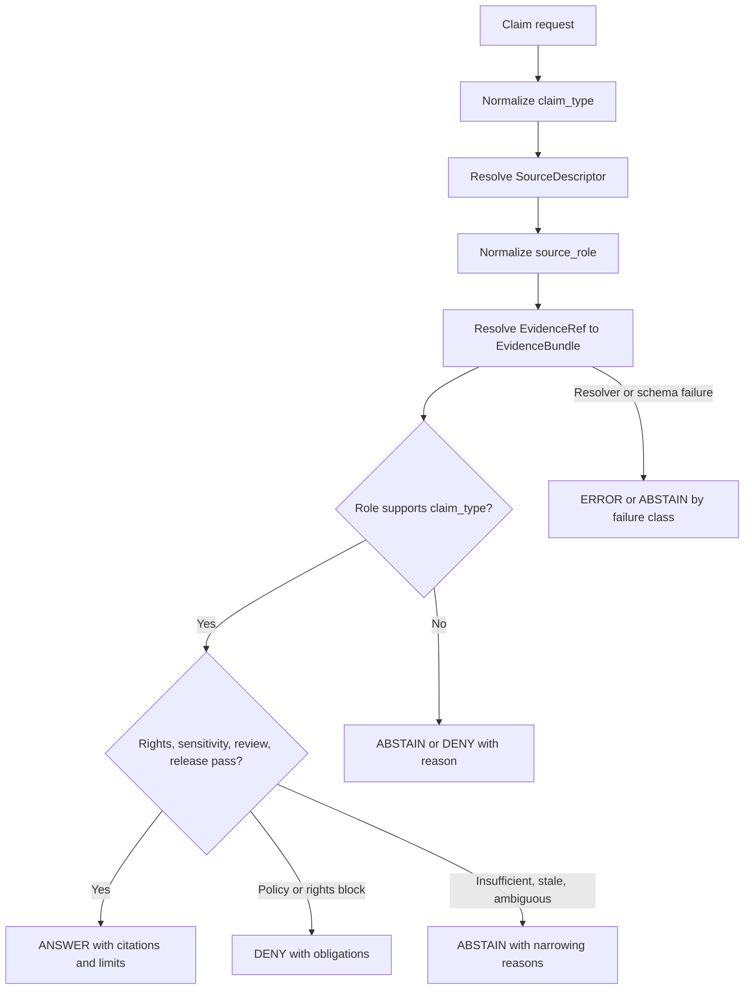
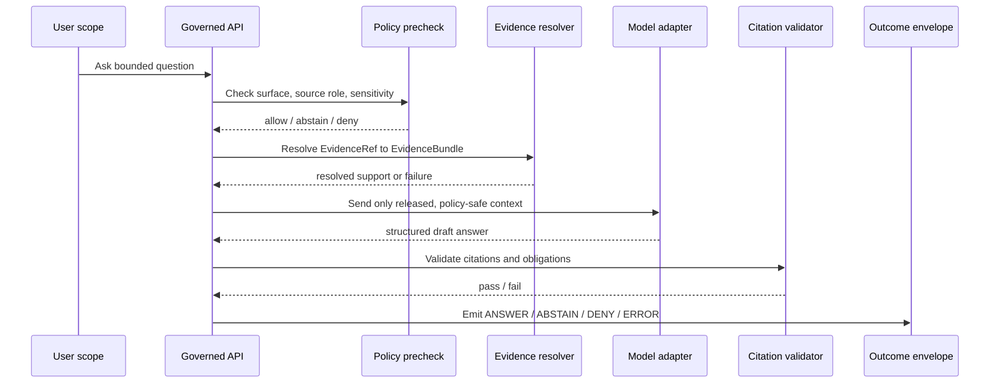

<!-- [KFM_META_BLOCK_V2]
doc_id: kfm://doc/TODO-source-role-to-claim-policy-crosswalk
title: Source Role to Claim Policy Crosswalk
type: standard
version: v1
status: draft
owners: TODO: verify CODEOWNERS/current policy owner
created: 2026-04-27
updated: 2026-04-27
policy_label: TODO: verify public|restricted|internal
related: [TODO: verify source registry docs, SourceDescriptor schema, EvidenceBundle schema, DecisionEnvelope schema, rights policy, sensitivity policy, release manifest policy]
tags: [kfm, policy, crosswalk, source-role, claims, evidence, governance, cite-or-abstain]
notes: [CORPUS_ONLY revision. No mounted repository, CODEOWNERS, schema registry, policy engine, tests, workflows, logs, dashboards, or runtime proof objects were verified in this pass. Proposed paths, enforcement hooks, owners, related links, and machine-contract names must be confirmed in the real repository before publication.]
[/KFM_META_BLOCK_V2] -->

# Source Role to Claim Policy Crosswalk

<p align="center">
  <strong>Admissibility rules for matching KFM source roles to the strongest claims they may support.</strong>
</p>

<p align="center">
  
  
  
  
  
</p>

<p align="center">
  <a href="#decision-spine">Decision spine</a> ·
  <a href="#scope">Scope</a> ·
  <a href="#repo-fit">Repo fit</a> ·
  <a href="#policy-input-contract">Inputs</a> ·
  <a href="#source-role--claim-policy-matrix">Matrix</a> ·
  <a href="#universal-gates">Gates</a> ·
  <a href="#validation-plan">Validation</a> ·
  <a href="#definition-of-done">Definition of done</a>
</p>

> [!IMPORTANT]
> **Source role is an admissibility constraint, not a decorative metadata field.** A source may support one kind of claim while being unusable, insufficient, or actively misleading for another.

KFM’s public value is the **inspectable claim**: an outward statement that can be reconstructed to admissible evidence, spatial scope, temporal scope, source role, policy posture, review state, release state, and correction lineage.

This crosswalk turns that doctrine into a reviewable rule set for governed APIs, Evidence Drawer payloads, Focus Mode answers, map popups, exports, story nodes, source activation, promotion, and publication checks.

---

## Status summary

| Field | Value |
|---|---|
| Target path | `policy/crosswalk/source-role-to-claim-policy.md` — **PROPOSED; verify repo convention before landing** |
| Document status | `draft` |
| Evidence mode | `CORPUS_ONLY / NO_LOCAL_REPO_EVIDENCE` |
| Truth posture | CONFIRMED doctrine from supplied KFM corpus and draft; PROPOSED policy crosswalk; UNKNOWN current repo enforcement |
| Intended consumers | Policy maintainers, source stewards, schema authors, contract authors, governed API implementers, Evidence Drawer reviewers, Focus Mode reviewers, release reviewers |
| Core invariant | `RAW → WORK/QUARANTINE → PROCESSED → CATALOG/TRIPLET → PUBLISHED` |
| Default posture | cite-or-abstain; fail closed for rights, sensitivity, review, release, and exact-location risk |

### What this is

This is a **policy-facing crosswalk** that states which source roles can support which claim types, what must remain out of bounds, and which finite outcome KFM should emit when evidence, rights, sensitivity, review, release, or policy are insufficient.

### What this is not

This document is not the source registry schema, not the EvidenceBundle schema, not a runtime implementation, not a legal opinion, not an emergency alerting procedure, and not proof that any repository file, route, policy bundle, test fixture, dashboard, or deployment currently exists.

---

## Decision spine

Every public or semi-public claim should pass through the same spine: normalize the requested claim, resolve source identity, resolve evidence, apply role compatibility, apply gates, then return one finite outcome.



### Operating rule

A claim is eligible for outward use only when all of the following are true:

1. The source has a `SourceDescriptor` or equivalent source registry entry.
2. The source role is explicit, normalized, and compatible with the requested claim type.
3. Every `EvidenceRef` resolves to an `EvidenceBundle` or equivalent inspectable support object.
4. Spatial, temporal, method, unit, uncertainty, freshness, and correction context are declared where they affect meaning.
5. Rights, sensitivity, public-safe precision, review, and release posture are compatible with the requested surface.
6. The response emits one finite outcome: `ANSWER`, `ABSTAIN`, `DENY`, or `ERROR`.

---

## Scope

### Applies to

- governed API responses
- Evidence Drawer payloads
- Focus Mode answers
- map popups and layer trust badges
- export previews
- story nodes
- release and promotion checks
- source activation review
- citation validation
- abstention and denial logic
- correction, supersession, and withdrawal visibility

### Does not replace

- source registry schema
- domain-specific source descriptors
- rights registry
- sensitivity policy
- release manifest schema
- EvidenceBundle schema
- DecisionEnvelope schema
- emergency alerting systems
- steward-only review procedures
- legal, cultural, tribal, domain-expert, or landowner review

### Non-negotiable boundaries

| Boundary | Rule |
|---|---|
| AI | Model output is interpretive only. EvidenceBundle, policy, review, and release state outrank generated language. |
| UI | Evidence Drawer and Focus Mode explain governed evidence; they do not manufacture new truth in the browser. |
| Maps and scenes | MapLibre layers, Cesium scenes, PMTiles, tiles, story exports, and screenshots are downstream carriers, not source authority. |
| Publication | Promotion is a governed state transition, not a file move or UI toggle. |
| Sensitive detail | Exact archaeological, cultural, rare-species, living-person, DNA, critical-infrastructure, or steward-controlled detail fails closed by default. |

---

## Repo fit

| Field | Status | Guidance |
|---|---:|---|
| Target path | PROPOSED | `policy/crosswalk/source-role-to-claim-policy.md` should be verified against the real repository’s policy/documentation conventions. |
| Existing file | UNKNOWN | No mounted repository was available in this pass. Treat this as a candidate standard doc unless later checkout evidence proves an existing file. |
| Upstream inputs | PROPOSED / NEEDS VERIFICATION | Source registry, `SourceDescriptor`, EvidenceBundle resolver, rights/sensitivity registry, release manifest, review record, correction notice. |
| Downstream consumers | PROPOSED / NEEDS VERIFICATION | Policy engine, promotion gate, governed API, Evidence Drawer, Focus Mode, map popup formatter, export/story validators. |
| Enforcement home | NEEDS VERIFICATION | Verify whether enforcement belongs in Rego/OPA, application validators, schema fixtures, typed runtime guards, or another repo-native mechanism. |
| Machine schema home | NEEDS VERIFICATION | Do not create parallel `contracts/` and `schemas/` authorities without an ADR. |
| Test home | NEEDS VERIFICATION | Negative fixtures should land where the repo already keeps policy and API fixtures. |

> [!NOTE]
> This file should be treated as the **human-readable policy crosswalk**. Machine-enforced schemas, fixtures, policy bundles, and validators should live in the repo’s confirmed machine-authority homes after those homes are verified.

---

## Policy input contract

Any enforcement rule based on this crosswalk should receive these inputs. Names may be adapted to the repo’s confirmed schema, but the semantics should not be silently dropped.

| Input | Required? | Why it matters |
|---|---:|---|
| `claim_type` | yes | Determines what the response is trying to assert. |
| `source_role` | yes | Determines whether the source can support the claim. |
| `source_descriptor_ref` | yes | Links the claim to source identity, role, rights, cadence, sensitivity, and citation rules. |
| `evidence_bundle_ref` | yes for `ANSWER` | `ANSWER` requires inspectable support, not just a pointer or fluent prose. |
| `evidence_resolution_state` | yes | Prevents unresolved pointers from being treated as support. |
| `knowledge_character` | yes | Separates observed, regulatory, modeled, archival, community, operational, discovery, and crosswalk evidence. |
| `rights_state` | yes | Unknown or incompatible rights must block or narrow public release. |
| `sensitivity_state` | yes | Exact-location, living-person, DNA, cultural, critical-infrastructure, and rare-species contexts may fail closed. |
| `review_state` | yes | Distinguishes draft, reviewed, steward-approved, published, corrected, withdrawn, or restricted material. |
| `release_state` | yes | Public claims must be grounded in released or otherwise approved scope. |
| `spatial_support` | yes where spatial | Prevents false precision and support mismatch. |
| `valid_time` / `observed_time` / `effective_time` | conditional | Required when time basis changes claim meaning. |
| `freshness_state` | conditional | Required for current-state and operational-context claims. |
| `citation_state` | yes for outward text | Unsupported or invalid citations trigger `ABSTAIN`, `DENY`, or `ERROR`. |
| `correction_state` | yes | Known correction, supersession, or withdrawal must be visible. |
| `requested_surface` | yes | Public map popup, steward review, export, story, Focus Mode, and API surfaces can have different obligations. |

---

## Outcome grammar

| Outcome | Meaning | Typical trigger | Public posture |
|---|---|---|---|
| `ANSWER` | The claim is supported, policy-safe for the requested surface, citation-valid, and bounded by its evidence. | Compatible source role, resolved EvidenceBundle, rights/review/release pass. | Publish with citations, limitations, time basis, source role, and correction state. |
| `ABSTAIN` | KFM cannot responsibly answer as requested, but the issue is insufficiency, ambiguity, staleness, or unsupported scope rather than a hard policy block. | Ambiguous crosswalk, stale operational data, missing support field, source role too weak for claim. | Explain what is missing or how to narrow the request. |
| `DENY` | KFM must not provide the requested claim or detail because policy, rights, sensitivity, or review state blocks it. | Exact sensitive location, unknown rights for public release, DNA/living-person restriction, source-role misuse with harm risk. | State the block class and safe next path; do not leak restricted detail. |
| `ERROR` | The request or system path is invalid and should not be disguised as an evidentiary answer. | Resolver failure, malformed policy input, schema violation, direct public path bypassing governed evidence resolution. | Return diagnostic category without converting system failure into factual language. |

---

## Normalized source roles

Use these normalized roles for crosswalk decisions. Domain-specific descriptors may use narrower aliases, but they should map back to one role before policy evaluation.

| Normalized source role | Best use | Main caution |
|---|---|---|
| `statutory_administrative` | Legal, regulatory, official administrative, boundary, designation, declaration, parcel, district, or agency reporting context. | Do not treat legal class or administrative status as observed condition, functional capacity, title truth, or physical event proof without additional evidence. |
| `direct_observational_instrumented` | Sensor, gauge, field, survey, lab, station, point cloud, or measured observation. | Must declare support, units, cadence, calibration, uncertainty, observation time, and method limits. |
| `operational_context_feed` | Current or near-current operational context such as public AQI reports, warnings, advisories, service status, reservoir operations, or vehicle positions. | Contextual only unless separately designated as authority; freshness, issue time, expiry, and not-life-safety boundaries must remain visible. |
| `modeled_assimilated_derived` | Forecast, index, interpolation, simulation, classification, suitability surface, anomaly surface, modeled range, flow accumulation, or derived analysis. | Must remain visibly modeled or derived; cannot be silently promoted into direct observation, legal truth, or confirmed occurrence. |
| `documentary_archival` | Maps, plats, newspapers, oral histories, archival descriptions, scans, reports, transcripts, notebooks, historic imagery. | Preserve context; do not flatten interpretive material into current fact or falsely precise geometry. |
| `community_contributed` | Citizen science, civic submissions, local observations, volunteered reports, community knowledge, or contributor records. | Govern with confidence, moderation, permissions, rights, sensitivity, and review; not automatic truth. |
| `mirror_discovery_service` | Discovery index, catalog mirror, data portal, STAC/DCAT index, metadata listing, or availability service. | Provenance anchor only; not a replacement for origin authority or publication rights. |
| `authority_crosswalk_system` | Identity aids, name authorities, hydro/feature crosswalks, gazetteers, code mappings, alias registers. | Supports disambiguation and stitching; not a substitute for primary evidence. Ambiguous crosswalks require `ABSTAIN`. |

### Suggested alias map

| Alias family | Normalize to | Notes |
|---|---|---|
| `official`, `agency_record`, `regulatory_layer`, `legal_record`, `administrative_boundary` | `statutory_administrative` | Use for legal or administrative statements, not physical truth. |
| `sensor`, `gauge`, `station`, `field_survey`, `lab_result`, `point_cloud`, `measured_sample` | `direct_observational_instrumented` | Require support, units, time, method, and uncertainty. |
| `alert_feed`, `advisory_feed`, `status_feed`, `operations_feed`, `near_real_time` | `operational_context_feed` | Require retrieved time, issue time, expiry, and freshness class. |
| `model`, `forecast`, `classification`, `index`, `interpolation`, `simulation`, `derived_surface` | `modeled_assimilated_derived` | Keep method/version/input lineage visible. |
| `archive`, `historic_map`, `newspaper`, `oral_history`, `transcript`, `notebook`, `scan` | `documentary_archival` | Preserve source context and uncertainty. |
| `vgi`, `citizen_science`, `contributor_report`, `community_submission` | `community_contributed` | Require moderation, rights, sensitivity, and review posture. |
| `catalog`, `portal`, `mirror`, `index`, `discovery_service` | `mirror_discovery_service` | Discovery is not origin evidence. |
| `gazetteer`, `crosswalk`, `alias_table`, `identifier_map`, `name_authority` | `authority_crosswalk_system` | Return relationship class and ambiguity. |

---

## Claim type registry

| Claim type | Description | Minimum support |
|---|---|---|
| `source_identification` | “This source exists / was consulted / indexed / describes itself as…” | SourceDescriptor or source registry entry. |
| `source_stated_context` | “The source states or depicts…” | EvidenceBundle, citation span, context preserved. |
| `legal_or_regulatory_status` | Official legal, administrative, regulatory, designation, declaration, or effective-status claim. | Statutory/administrative source role, effective time, jurisdiction, source identity, supersession/correction state. |
| `direct_measurement` | Measured or observed value/event at declared support. | Direct observational/instrumented role, method, support, units, time, uncertainty, calibration where applicable. |
| `operational_context` | Current or near-current operational context. | Operational role, retrieval time, issue/expiry/freshness state, source limits. |
| `modeled_or_derived_analysis` | Claim about model output, index, interpolation, scenario, or derived surface. | Modeled/derived role, method/version, validation limits, input lineage, support, uncertainty. |
| `historical_or_documentary_context` | Claim grounded in archival, documentary, or historical source context. | Documentary/archival role, source span, extraction method, review state, time/context caveats. |
| `community_reported_observation` | Claim that a contributor reported something. | Community role, contributor/record identity where allowed, moderation/confidence, rights, sensitivity. |
| `identity_resolution` | Claim that two identifiers, names, places, taxa, or features correspond. | Crosswalk role, versioned mapping, relationship class, confidence, ambiguity handling. |
| `discovery_or_availability` | Claim about dataset, catalog, or service discoverability. | Mirror/discovery role, index identity, retrieval/citation context. |
| `public_safe_summary` | Generalized outward summary created from reviewed evidence. | Transform receipt, rights/sensitivity pass, review state, release manifest, EvidenceBundle. |
| `exact_location_or_sensitive_detail` | Precise location, identity, DNA, living-person, cultural, rare-species, critical-infrastructure, or restricted detail. | Deny by default unless explicit policy, review, rights, purpose, audience, and public-safe transform rules allow. |
| `current_state` | “This is current now / active now / up to date.” | Fresh source role, retrieval time, issue/effective/expiry time, freshness tolerance, release or operational rules. |
| `release_or_publication_status` | Claim that KFM has released, withdrawn, corrected, or superseded an artifact. | Release manifest, correction notice, catalog/proof closure, review state. |
| `title_or_ownership_truth` | Claim that title, ownership, or legal interest is true beyond assessor or administrative records. | High-burden legal source role, jurisdiction, effective time, instrument chain, review state; deny or abstain unless explicitly supported. |
| `functional_capacity_or_condition` | Claim about current operational capacity, structural condition, availability, or service capability. | Direct observation, authoritative operational source, or reviewed inspection evidence with time/freshness and limits. |
| `confirmed_occurrence_or_event` | Claim that an occurrence, hazard, species, archaeological site, or physical event is confirmed. | Domain-appropriate direct or reviewed evidence; modeled, archival, or community evidence alone is not enough unless policy says otherwise. |
| `emergency_instruction_or_life_safety` | Instructions for emergency action or life-safety response. | Not a KFM publication claim; route to official emergency systems. |

---

## Source role → claim policy matrix

Legend:

- ✅ allowed when universal gates pass
- ⚠️ allowed only with narrowed wording, extra review, or domain-specific obligations
- 🚫 incompatible; return `ABSTAIN` or `DENY` depending on risk
- 🧭 discovery/context only; not evidence for the substantive claim

| Source role | Strongest normal claim | Compatible claim types | Incompatible or high-risk claim types | Default failure behavior |
|---|---|---|---|---|
| `statutory_administrative` | Legal, regulatory, official, administrative, designation, declaration, or source-stated boundary/status claim. | ✅ `legal_or_regulatory_status`, `source_identification`, `source_stated_context`, `release_or_publication_status` when KFM-issued. | 🚫 `direct_measurement`, `confirmed_occurrence_or_event`, `functional_capacity_or_condition`, `title_or_ownership_truth`, current physical condition unless independently supported. | `ABSTAIN` if stronger claim lacks evidence; `DENY` if misuse would create legal, safety, or sensitivity risk. |
| `direct_observational_instrumented` | Measured observation at declared support and time. | ✅ `direct_measurement`, `source_stated_context`; ⚠️ `current_state` only when freshness rules pass. | 🚫 `legal_or_regulatory_status`, `policy_clearance`, `title_or_ownership_truth`, broad model-independent generalization beyond support. | `ABSTAIN` for missing support/units/time/calibration; `DENY` if exact sensitive detail is blocked. |
| `operational_context_feed` | Time-bounded operational context with freshness, issue, and expiry visible. | ✅ `operational_context`; ⚠️ `current_state` when freshness and expiry pass; ✅ `source_stated_context`. | 🚫 `emergency_instruction_or_life_safety`, `legal_or_regulatory_status`, durable historical baseline unless archived and reviewed. | `ABSTAIN` when stale/expired/ambiguous; `DENY` for emergency advice or life-safety substitution. |
| `modeled_assimilated_derived` | Modeled, estimated, predicted, classified, interpolated, or derived result with method limits. | ✅ `modeled_or_derived_analysis`; ⚠️ `public_safe_summary` after review and release. | 🚫 `direct_measurement`, `confirmed_occurrence_or_event`, `legal_or_regulatory_status`, exact observed boundary. | `ABSTAIN` if method/version/support missing; `DENY` if public output hides modeled status or sensitivity. |
| `documentary_archival` | Context-preserving historical or documentary source statement. | ✅ `historical_or_documentary_context`, `source_stated_context`; ⚠️ `identity_resolution` when corroborated. | 🚫 current-state claims, exact modern boundary truth, living-person exposure, cultural/sensitive public detail without review. | `ABSTAIN` for weak extraction/context; `DENY` for rights, cultural, privacy, or exact-location risk. |
| `community_contributed` | Contributor-reported observation or community knowledge with confidence and review visible. | ✅ `community_reported_observation`, `source_stated_context`; ⚠️ candidate evidence with moderation. | 🚫 automatic verified truth, legal status, unrestricted exact coordinates, title/clearance claims. | `ABSTAIN` until moderated/reviewed; `DENY` for restricted identities, exact locations, or missing permissions. |
| `mirror_discovery_service` | Discovery, index, availability, or metadata claim. | ✅ `discovery_or_availability`, `source_identification`. | 🚫 substantive domain claim, origin authority claim, redistribution rights claim, direct evidence claim. | `ABSTAIN` until origin source is resolved; `DENY` if rights or origin authority is misrepresented. |
| `authority_crosswalk_system` | Identity, alias, feature, name, code, or relationship mapping claim. | ✅ `identity_resolution`, `source_stated_context`. | 🚫 primary domain truth, observation, legal status, title truth, confirmed occurrence unless supported elsewhere. | `ABSTAIN` for ambiguous/split/merged/unknown mapping; `DENY` if a risky identity claim would be exposed publicly. |

---

## Universal gates

These gates apply before any `ANSWER`.

| Gate | Required pass condition | Failing outcome | Reason code examples |
|---|---|---|---|
| G1 — source role present | Source role is explicit and normalized. | `ABSTAIN` or `ERROR` | `source_role_missing`, `source_role_unmapped` |
| G2 — source descriptor present | SourceDescriptor or equivalent source registry record exists. | `ABSTAIN` | `source_descriptor_missing` |
| G3 — claim type declared | Claim is classified into a known claim type. | `ERROR` | `claim_type_missing`, `claim_type_unknown` |
| G4 — role compatible | Source role may support the claim type. | `ABSTAIN` or `DENY` | `source_role_incompatible`, `authority_collapse_risk` |
| G5 — evidence resolves | EvidenceRef resolves to EvidenceBundle or equivalent support. | `ABSTAIN` or `ERROR` | `evidence_unresolved`, `bundle_missing`, `digest_mismatch` |
| G6 — support declared | Spatial, temporal, unit, method, and uncertainty support are explicit where relevant. | `ABSTAIN` | `support_missing`, `time_basis_missing`, `unit_missing` |
| G7 — rights pass | Rights and redistribution posture permit the requested surface. | `DENY` | `rights_unknown`, `redistribution_blocked` |
| G8 — sensitivity pass | Public-safe precision and sensitivity rules pass. | `DENY` | `sensitive_exact_location`, `living_person_restricted`, `cultural_review_required` |
| G9 — review/release pass | Review state and release state are sufficient for the surface. | `ABSTAIN` or `DENY` | `review_required`, `not_released`, `withdrawn` |
| G10 — citation valid | Every factual outward statement can be cited to admissible evidence. | `ABSTAIN`, `DENY`, or `ERROR` | `citation_missing`, `citation_mismatch` |
| G11 — correction visible | Known correction, supersession, or withdrawal is included. | `DENY` | `correction_hidden`, `supersession_hidden` |
| G12 — surface allowed | Requested surface is allowed for the policy state. | `DENY` | `surface_not_allowed`, `public_surface_blocked` |
| G13 — bypass absent | Request did not bypass governed API, policy, resolver, or release boundary. | `ERROR` or `DENY` | `trust_membrane_bypass`, `direct_model_client`, `raw_store_public_path` |

### Gate ordering rule

When multiple gates fail, return the safest visible outcome:

1. `ERROR` for malformed input, resolver failure, schema failure, or trust-membrane bypass.
2. `DENY` for rights, sensitivity, public surface, policy, or restricted detail blocks.
3. `ABSTAIN` for unsupported, ambiguous, stale, weak, or missing evidence.
4. `ANSWER` only when all required gates pass.

---

## Domain burden overrides

Domain-specific policies may be stricter than this generic crosswalk. They should not be weaker without an ADR and explicit review.

| Domain / lane | Override |
|---|---|
| Hydrology | Regulatory flood context must not be treated as observed flood evidence. Ambiguous hydrologic identity or crosswalk uncertainty returns `ABSTAIN`. |
| Hazards | Operational warnings/advisories are contextual and not life-safety instructions. KFM must not replace official emergency alerting. |
| Air / climate / EO | Observed values, public reporting, smoke masks, modeled fields, assimilated products, and anomaly surfaces must remain visibly distinct. |
| Fauna / flora / habitat | Sensitive species, rare plants, nest/den/roost/spawning locations, and steward-controlled records deny exact public coordinates unless public-safe transform and review pass. |
| Archaeology / cultural heritage | Exact site locations, burial contexts, sacred sites, controlled records, and looting-risk locations deny public detail by default. Candidate features from LiDAR/geophysics/remote sensing remain candidate-only. |
| People / genealogy / DNA / land | Living-person, DNA, consent, and relationship claims are restricted by default. Assessor/tax data may support assessor facts, not title truth. |
| Roads / rail / trade routes | Historic, Indigenous, archival, reconstructed, or modeled corridors must not be converted into falsely precise public geometry. |
| Settlements / infrastructure | Critical infrastructure exact geometry or condition details require sensitivity review and public-safe release posture. |
| 3D / Cesium scenes | 3D scenes and measurements are presentation or derived state unless independent evidence supports the stronger claim. |
| Governed AI / Focus Mode | AI may summarize only released, policy-safe EvidenceBundles. Missing evidence means `ABSTAIN`; policy block means `DENY`; invalid resolver or schema path means `ERROR`. |

---

## Evidence Drawer and Focus Mode rules

### Evidence Drawer

Evidence Drawer payloads should expose, at minimum:

- claim or layer assertion
- source role and role badge
- claim type
- EvidenceBundle reference
- source descriptor references
- rights and sensitivity posture
- review and release state
- valid, effective, observed, retrieved, and freshness time where applicable
- support and uncertainty
- correction, supersession, or withdrawal state
- transform receipts where public-safe generalization/redaction occurred
- negative outcome reason codes where KFM abstains, denies, or errors

The drawer explains support and limits. It does not create new claims in the browser.

### Focus Mode

Focus Mode may synthesize only after governed evidence resolution.

Required flow:



Focus Mode must not call model runtimes, vector indexes, graph internals, RAW, WORK, QUARANTINE, restricted stores, or object storage directly from the browser.

---

## Language policy

Outward wording must match the strongest supported claim. Prefer constrained verbs that describe what the source can actually support.

| Source role | Prefer wording like | Avoid wording like |
|---|---|---|
| `statutory_administrative` | “The regulatory record designates…” | “The area is physically…” |
| `direct_observational_instrumented` | “The gauge measured…” | “The law says…” |
| `operational_context_feed` | “At retrieval time, the operational feed reported…” | “KFM advises you to…” |
| `modeled_assimilated_derived` | “The model estimates…” | “This occurred…” |
| `documentary_archival` | “The archival map depicts…” | “This is the current boundary…” |
| `community_contributed` | “A contributor reported…” | “KFM verified…” |
| `mirror_discovery_service` | “The catalog indexes…” | “The origin source proves…” |
| `authority_crosswalk_system` | “This crosswalk maps…” | “These are identical…” unless relationship class is unambiguous and evidence-backed. |

### Wording obligations

| When claim includes… | Also show… |
|---|---|
| legal or regulatory status | jurisdiction, effective time, source role, supersession/correction state |
| measured value | unit, support, method, observed time, uncertainty or qualifier |
| current or operational context | retrieved time, issue time, expiry, freshness state, not-life-safety limitation where relevant |
| modeled or derived result | method/version, input lineage, support, validation limits, uncertainty |
| historical or archival context | source date/context, extraction method, uncertainty, modern-use caveat |
| public-safe transformed summary | transform receipt, redaction/generalization state, release state |
| identity resolution | mapping version, relationship class, ambiguity/confidence, source crosswalk identity |

---

## Reason code registry

Reason codes should be stable enough for tests, UI negative states, receipts, and audit review.

| Reason code | Outcome bias | Meaning |
|---|---:|---|
| `source_role_missing` | `ABSTAIN` / `ERROR` | Source role was not provided or cannot be derived. |
| `source_role_unmapped` | `ABSTAIN` | Alias cannot be mapped to a normalized role. |
| `source_descriptor_missing` | `ABSTAIN` | Source registry entry is absent or unresolved. |
| `claim_type_unknown` | `ERROR` | Claim type is missing or outside the registry. |
| `source_role_incompatible` | `ABSTAIN` | Role is too weak or inappropriate for the requested claim. |
| `authority_collapse_risk` | `DENY` | Request would collapse discovery, modeled, community, archival, or administrative source into stronger truth. |
| `evidence_unresolved` | `ABSTAIN` / `ERROR` | EvidenceRef did not resolve to an inspectable EvidenceBundle. |
| `bundle_missing` | `ABSTAIN` / `ERROR` | EvidenceBundle is absent. |
| `digest_mismatch` | `ERROR` | Evidence or artifact integrity check failed. |
| `support_missing` | `ABSTAIN` | Spatial, temporal, unit, method, or uncertainty support is missing. |
| `rights_unknown` | `DENY` | Rights are unknown for requested publication surface. |
| `redistribution_blocked` | `DENY` | Source terms block redistribution or public display. |
| `sensitive_exact_location` | `DENY` | Exact public detail is blocked by sensitivity rules. |
| `living_person_restricted` | `DENY` | Living-person data is restricted. |
| `cultural_review_required` | `DENY` / `ABSTAIN` | Cultural or steward review is required before disclosure. |
| `review_required` | `ABSTAIN` | Review state is not sufficient for the requested surface. |
| `not_released` | `ABSTAIN` / `DENY` | Artifact is not released or approved for the requested surface. |
| `withdrawn` | `DENY` | Artifact or claim has been withdrawn. |
| `citation_missing` | `ABSTAIN` | Outward factual text lacks citation support. |
| `citation_mismatch` | `ABSTAIN` / `ERROR` | Citation does not support the statement. |
| `correction_hidden` | `DENY` | Known correction, supersession, or withdrawal would be hidden. |
| `surface_not_allowed` | `DENY` | Requested UI/API/export/story surface is not allowed for the material. |
| `trust_membrane_bypass` | `ERROR` / `DENY` | Request bypasses governed evidence, policy, resolver, or release path. |
| `direct_model_client` | `ERROR` / `DENY` | Browser or public client attempted direct model-runtime access. |
| `raw_store_public_path` | `ERROR` / `DENY` | Public path attempted RAW, WORK, QUARANTINE, or restricted-store access. |

---

## Illustrative policy input

> [!NOTE]
> This block is illustrative. Adapt field names to the repo’s confirmed schema and policy engine.

```yaml
claim_policy_input:
  claim_id: "kfm://claim/TODO"
  requested_surface: "public_map_popup"
  claim_type: "legal_or_regulatory_status"
  normalized_source_role: "statutory_administrative"
  knowledge_character: "regulatory"
  source_descriptor_ref: "kfm://source/TODO"
  evidence_bundle_ref: "kfm://evidence/TODO"
  evidence_resolution_state: "resolved"
  rights_state: "public_release_allowed"
  sensitivity_state: "public"
  review_state: "published"
  release_state: "released"
  spatial_support:
    support_type: "polygon"
    precision: "source-stated"
    generalized: false
  time_basis:
    effective_time: "TODO"
    observed_time: null
    retrieved_at: "TODO"
    freshness_state: "not_applicable"
  citation_state: "validated"
  correction_state: "none_known"
```

### Illustrative outcome

```yaml
decision:
  outcome: "ANSWER"
  reason_codes: []
  obligations:
    - "show_source_role"
    - "show_effective_time"
    - "show_rights_state"
    - "show_correction_state"
  allowed_language:
    - "The source designates..."
    - "The regulatory record identifies..."
  forbidden_language:
    - "The area flooded..."
    - "The area is physically unsafe..."
```

### Illustrative negative outcome

```yaml
decision:
  outcome: "DENY"
  reason_codes:
    - "sensitive_exact_location"
    - "review_required"
  obligations:
    - "withhold_exact_geometry"
    - "show_public_safe_summary_when_available"
    - "record_redaction_or_generalization_reason"
  allowed_language:
    - "KFM cannot publish exact location detail for this record."
    - "A reviewed public-safe summary may be available."
  forbidden_language:
    - "The exact site is located at..."
```

---

## Validation plan

Use this plan before adopting the crosswalk in enforcement code, promotion gates, API responses, Evidence Drawer payloads, or Focus Mode.

| Test family | Minimum fixture | Expected outcome |
|---|---|---|
| Source role normalization | Alias `regulatory_layer` maps to `statutory_administrative`. | `ANSWER` only if all other gates pass. |
| Unknown source role | Source role `TODO_UNKNOWN_ROLE`. | `ABSTAIN` with `source_role_unmapped`. |
| Missing SourceDescriptor | Known role but missing registry entry. | `ABSTAIN` with `source_descriptor_missing`. |
| Incompatible role / claim | `mirror_discovery_service` asked to prove direct measurement. | `ABSTAIN` or `DENY` with `source_role_incompatible`. |
| Rights failure | Resolved evidence with `rights_state: unknown`. | `DENY` with `rights_unknown`. |
| Sensitivity failure | Exact protected site or rare-species coordinate on public surface. | `DENY` with `sensitive_exact_location`. |
| Evidence resolver failure | EvidenceRef does not resolve or digest fails. | `ERROR` or `ABSTAIN` with resolver reason. |
| Stale operational context | Expired warning/feed without current freshness. | `ABSTAIN` with freshness reason. |
| Citation mismatch | Statement overclaims citation support. | `ABSTAIN` or `ERROR` with `citation_mismatch`. |
| Correction hidden | Known correction not surfaced in outward response. | `DENY` with `correction_hidden`. |
| Focus Mode bypass | Browser tries direct model call or raw vector index call. | `ERROR` or `DENY` with `direct_model_client` or `trust_membrane_bypass`. |
| Public RAW access | Public client requests RAW, WORK, QUARANTINE, or restricted store. | `ERROR` or `DENY` with `raw_store_public_path`. |

### Suggested fixture names

| Fixture | Purpose |
|---|---|
| `valid_statutory_regulatory_answer.yaml` | Happy path for legal/regulatory status with source role and EvidenceBundle resolved. |
| `invalid_discovery_service_as_measurement.yaml` | Discovery source cannot prove direct measurement. |
| `invalid_model_as_confirmed_occurrence.yaml` | Modeled layer cannot be published as confirmed occurrence. |
| `deny_sensitive_exact_location_public.yaml` | Exact sensitive detail denied on public surface. |
| `abstain_stale_operational_context.yaml` | Expired operational feed cannot support current-state claim. |
| `error_evidence_digest_mismatch.yaml` | Integrity failure returns finite error. |
| `deny_focus_mode_direct_model_client.yaml` | Public client cannot bypass governed API. |

---

## Review checklist

Use this checklist before adopting this policy in enforcement code or promotion gates.

- [ ] Source role enum is reconciled with the current `SourceDescriptor` schema.
- [ ] Source role aliases are reconciled with domain-specific source descriptors.
- [ ] Claim type enum is reconciled with the current claim or `DecisionEnvelope` schema.
- [ ] Policy engine home is verified.
- [ ] Machine schema home is verified or an ADR records the home decision.
- [ ] Valid and invalid fixtures exist for every normalized source role.
- [ ] At least one incompatible role/claim pair returns `ABSTAIN`.
- [ ] At least one rights/sensitivity failure returns `DENY`.
- [ ] At least one resolver/schema failure returns `ERROR`.
- [ ] Evidence Drawer fixture displays source role, claim type, rights, sensitivity, review, release, correction state, and reason codes.
- [ ] Focus Mode fixture refuses to answer without resolved EvidenceBundle input.
- [ ] Public exact-location denial is tested for archaeology, sensitive species, critical infrastructure, and other high-risk lanes.
- [ ] Domain overrides are documented in lane-specific policies or source descriptors.
- [ ] Reviewers confirm that output language cannot overstate the source role.
- [ ] Correction and withdrawal visibility is tested.
- [ ] Rollback path is documented for any enforcement change.

---

## Adoption plan

| Step | Action | Output |
|---:|---|---|
| 1 | Verify repo homes for docs, policy, schemas/contracts, fixtures, and tests. | ADR or placement note if conventions are ambiguous. |
| 2 | Reconcile normalized source roles with current `SourceDescriptor` schema. | Alias map and enum update. |
| 3 | Reconcile claim types with current claim, `DecisionEnvelope`, and API schemas. | Claim type registry update. |
| 4 | Add negative fixtures before enabling runtime enforcement. | Valid/invalid fixture set. |
| 5 | Wire policy checks into the smallest governed API path. | PolicyDecision or equivalent in response envelope. |
| 6 | Update Evidence Drawer and Focus Mode to consume the same outcome shape. | Shared payload contract. |
| 7 | Add promotion-gate checks for public surfaces. | Release validation hook. |
| 8 | Run review with policy owner, source steward, UI reviewer, and release reviewer. | Review record and open issues. |

### Rollback path

If enforcement causes false denials, false answers, or incompatible response envelopes:

1. Disable the new policy gate at the feature flag or policy-bundle level, if available.
2. Revert the policy file and fixtures in the same PR or rollback commit.
3. Preserve any generated denial/abstention receipts for audit.
4. Restore the previous response-envelope shape if clients break.
5. Record the correction or supersession in the documentation registry.
6. Re-run negative fixtures before re-enabling.

---

## Open verification items

| Item | Status | Why it remains open |
|---|---:|---|
| Actual existing file at `policy/crosswalk/source-role-to-claim-policy.md` | UNKNOWN | No mounted repository was available in this pass. |
| `doc_id` UUID | NEEDS VERIFICATION | Must be assigned by repo documentation registry or doc-id generator. |
| Owner | NEEDS VERIFICATION | Current CODEOWNERS/current policy ownership must be checked in the real repo. |
| `policy_label` | NEEDS VERIFICATION | Confirm repo label taxonomy before setting `public`, `restricted`, or another value. |
| Related docs | NEEDS VERIFICATION | Source registry, schema, contract, policy, EvidenceBundle, DecisionEnvelope, release, and sensitivity paths must be confirmed before linking. |
| Source role enum | NEEDS VERIFICATION | Domain reports use overlapping role vocabularies; enforcement needs a canonical enum or alias map. |
| Claim type enum | PROPOSED | This draft proposes a registry; confirm against existing claim schemas if present. |
| Policy engine | UNKNOWN | OPA/Rego, application validators, schema tests, or other enforcement mechanism not verified. |
| Fixtures/tests | UNKNOWN | No repo tests or workflow YAML were visible in this pass. |
| Runtime behavior | UNKNOWN | No governed API, Evidence Drawer, Focus Mode, release, or promotion runtime was inspectable. |
| Shield badge policy | NEEDS VERIFICATION | Static badges used here should be replaced or removed if local repo convention differs. |

---

## Definition of done

This document becomes **review-ready** when:

- [ ] metadata block placeholders are replaced with verified repo values;
- [ ] related paths are verified and linked;
- [ ] source role aliases are reconciled with source descriptor schemas;
- [ ] claim types are reconciled with `DecisionEnvelope` or claim schemas;
- [ ] policy fixtures cover `ANSWER`, `ABSTAIN`, `DENY`, and `ERROR`;
- [ ] high-risk domain overrides have at least one negative fixture each;
- [ ] Evidence Drawer and Focus Mode fixtures consume the same policy outcome shape;
- [ ] maintainers can point to the enforcement location or explicitly mark enforcement as future work;
- [ ] review confirms that public wording cannot overstate source role support;
- [ ] rollback and correction behavior are documented in the repo-native runbook or ADR.

This document becomes **publishable** only after repo owners verify doc metadata, policy label, related links, enforcement posture, and release state.

---

<details>
<summary>Appendix A — Compact source-role cards</summary>

### `statutory_administrative`

Supports official legal, regulatory, administrative, declaration, designation, and boundary/status claims. Does not prove physical condition, observed event, or ownership/title truth by itself.

### `direct_observational_instrumented`

Supports measured observation at declared support and time. Requires method, unit, support, time, uncertainty, and calibration/quality qualifiers where relevant.

### `operational_context_feed`

Supports time-bounded operational context. Requires retrieval time, issue time, expiry, freshness state, and source limitation. Does not authorize KFM emergency instructions.

### `modeled_assimilated_derived`

Supports model, estimate, forecast, index, interpolation, scenario, classification, or derived-surface claims. Must remain visibly derived.

### `documentary_archival`

Supports context-preserving historical or documentary claims. Do not flatten into current fact or exact modern geometry without review and corroboration.

### `community_contributed`

Supports contributor-reported observations or community knowledge. Requires moderation, permissions, confidence, rights, sensitivity, and review posture.

### `mirror_discovery_service`

Supports discovery and availability claims. Does not prove origin authority, rights, measurements, or domain facts.

### `authority_crosswalk_system`

Supports identity mapping and disambiguation. Ambiguous, split, merged, deprecated, or weak mappings return `ABSTAIN` unless narrowed.

</details>

<details>
<summary>Appendix B — Implementation notes for maintainers</summary>

- Keep this document human-readable and stable.
- Keep machine enums in the confirmed schema or contract home.
- Keep policy-as-code in the confirmed policy home.
- Keep fixtures with the test suite that exercises the policy engine.
- Avoid separate hand-maintained enum copies in docs, code, policy, and UI.
- Use docs as the explanation layer, not as the only enforcement layer.
- Add an ADR before changing source-role semantics or weakening domain overrides.

</details>

[Back to top](#source-role-to-claim-policy-crosswalk)

