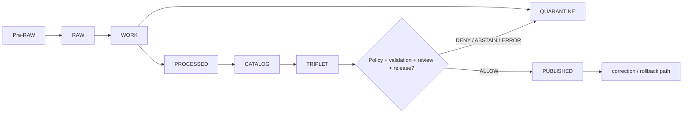

<!-- [KFM_META_BLOCK_V2]
doc_id: kfm://policy/data
title: Data Policy README
type: policy-readme
version: v0.1
status: draft
owners: OWNER_TBD — Policy steward · Data lifecycle steward · Release steward · Security steward · Docs steward
created: 2026-06-15
updated: 2026-06-15
policy_label: restricted
related:
  - ../README.md
  - ../bundles/README.md
  - ../../data/README.md
  - ../../docs/doctrine/lifecycle-law.md
  - ../../docs/doctrine/trust-membrane.md
  - ../../docs/doctrine/directory-rules.md
  - ../../docs/architecture/data-classification-framework.md
  - ../../docs/registers/POLICY_GATE.md
  - ../../packages/policy-runtime/README.md
  - ../../release/
  - ../../tests/README.md
tags: [kfm, policy, data, lifecycle, quarantine, release, receipts, proofs, fail-closed]
notes:
  - "Initial README for policy/data."
  - "This path is for data-lifecycle admissibility policy, not lifecycle data storage."
  - "Lifecycle data belongs in data/; release decisions belong in release/; policy rules and policy documentation belong in policy/."
  - "Runtime enforcement, policy modules, fixtures, tests, bundle registration, and lifecycle-gate integration remain NEEDS VERIFICATION."
[/KFM_META_BLOCK_V2] -->

<a id="top"></a>

<div align="center">

# Data Policy

`policy/data/`

**Policy lane for data-lifecycle admissibility checks: whether records, artifacts, receipts, proofs, catalog entries, triplets, tiles, or published derivatives may cross a governed KFM lifecycle gate.**


[Scope](#1-scope) · [Repo fit](#2-repo-fit) · [Boundary](#3-authority-boundary) · [Inputs](#5-inputs) · [Exclusions](#6-exclusions) · [Lifecycle gates](#7-lifecycle-gates) · [Definition of done](#14-definition-of-done)

</div>

---

> [!IMPORTANT]
> **Status:** draft / `NEEDS VERIFICATION`  
> **Owners:** `OWNER_TBD` — Policy steward · Data lifecycle steward · Release steward · Security steward · Docs steward  
> **Path:** `policy/data/README.md`  
> **Responsibility root:** `policy/` — policy-as-code and policy documentation  
> **Truth posture:** CONFIRMED file path / PROPOSED data-policy lane / UNKNOWN runtime enforcement

> [!CAUTION]
> This directory must not become a second `data/` root. Lifecycle data, receipts, proofs, registry entries, reports, and published materializations belong under `data/` or verified lifecycle homes. This lane may only define policy gates for whether data can move or be exposed.

---

## Quick jump

- [1. Scope](#1-scope)
- [2. Repo fit](#2-repo-fit)
- [3. Authority boundary](#3-authority-boundary)
- [4. Default posture](#4-default-posture)
- [5. Inputs](#5-inputs)
- [6. Exclusions](#6-exclusions)
- [7. Lifecycle gates](#7-lifecycle-gates)
- [8. Diagram](#8-diagram)
- [9. Decision vocabulary](#9-decision-vocabulary)
- [10. Data-policy obligations](#10-data-policy-obligations)
- [11. Publication and rollback posture](#11-publication-and-rollback-posture)
- [12. Inspection path](#12-inspection-path)
- [13. Validation expectations](#13-validation-expectations)
- [14. Definition of done](#14-definition-of-done)
- [15. Open verification items](#15-open-verification-items)

---

## 1. Scope

`policy/data/` is a proposed policy lane for KFM data-lifecycle gates.

It should describe and eventually bind checks for whether a data artifact may be admitted, transformed, quarantined, processed, cataloged, projected into triplets, materialized as tiles, released, corrected, superseded, withdrawn, or used by public clients.

In scope:

- lifecycle-stage admissibility policy
- public-exposure policy for lifecycle stages
- quarantine and hold conditions
- receipt and proof prerequisites
- release-state prerequisites
- sensitivity, rights, evidence, and validation prerequisites
- finite policy outcomes for data movement and display gates

Out of scope:

- storing lifecycle data
- defining data schemas
- source acquisition jobs
- release approval itself
- public UI implementation
- runtime evaluator implementation
- writing receipts or proofs
- storing secrets, credentials, or private source material

[Back to top](#top)

---

## 2. Repo fit

| Concern | Owning root | Expected relationship |
|---|---|---|
| Data lifecycle policy gates | `policy/data/` | This README; active policy files remain `NEEDS VERIFICATION` |
| Lifecycle data and artifacts | `data/` | Data root for raw, work, quarantine, processed, catalog, triplets, receipts, proofs, published, registry, reports |
| Release decisions | `release/` | Publication, correction, supersession, and rollback authority |
| Lifecycle doctrine | `docs/doctrine/lifecycle-law.md` | Foundational lifecycle invariant and stage definitions |
| Runtime policy evaluation | `packages/policy-runtime/` | Evaluator helper code; not policy authority |
| Policy bundles | `policy/bundles/` | Bundle packaging or manifest lane when used |
| Tests and fixtures | `tests/`, `fixtures/` | Proof that behavior is enforceable |
| Public API boundary | `apps/governed-api/` | Public clients should consume governed results only |

> [!NOTE]
> The data root README says lifecycle data belongs in `data/` and policy rules do not. This README preserves that split by keeping only policy gate documentation in `policy/data/`.

## 3. Authority boundary

This lane may decide whether data can pass a gate. It must not store data, define schemas, write release decisions, or become a public data surface.

```text
policy/data/          = admissibility gates for data lifecycle actions
data/                 = lifecycle data, receipts, proofs, artifacts, registry, reports
release/              = publication, correction, supersession, rollback control
schemas/contracts/v1/  = machine-readable shape
contracts/            = semantic meaning
packages/policy-runtime/ = evaluator helper code
apps/governed-api/    = public trust membrane
```

## 4. Default posture

Data policy should fail closed when support is missing.

A data action should return `DENY`, `ABSTAIN`, or `HOLD` when any of these are unresolved:

- lifecycle stage
- source role
- rights posture
- sensitivity posture
- EvidenceRef / EvidenceBundle closure
- validation report
- receipt or proof requirement
- release state
- correction or rollback target
- public audience
- reviewer class

## 5. Inputs

| Input family | Examples | Required posture |
|---|---|---|
| Lifecycle context | Pre-RAW, RAW, WORK, QUARANTINE, PROCESSED, CATALOG, TRIPLET, PUBLISHED | Explicit and stage-valid |
| Data reference | dataset id, artifact ref, tile ref, catalog ref, triplet ref | Governed object reference, not raw shortcut |
| Source context | source descriptor, source role, cadence, rights, limitation flags | Resolved before exposure |
| Evidence context | EvidenceRef, EvidenceBundle status, citation validation | Required when claims depend on evidence |
| Validation context | validation report, checksums, hashes, fixture outcome | Required before promotion claims |
| Sensitivity context | geoprivacy, living-person, rare species, archaeology, infrastructure, private property, cultural flags | Fail closed when unresolved |
| Release context | candidate, released, superseded, withdrawn, rollback requested | Explicit; never inferred from file location alone |
| Audit context | request id, policy version, reason code, reviewer, timestamp | Required for consequential decisions |

## 6. Exclusions

| Does not belong here | Correct home |
|---|---|
| RAW, WORK, QUARANTINE, PROCESSED, CATALOG, TRIPLET, PUBLISHED artifacts | `data/` lifecycle roots |
| Receipts and proofs as stored artifacts | `data/receipts/`, `data/proofs/`, or verified homes |
| Release manifests, rollback cards, correction notices | `release/` or verified release/correction homes |
| JSON Schemas | `schemas/contracts/v1/` |
| Semantic contracts | `contracts/` |
| Source acquisition code | `connectors/`, `pipelines/`, or verified ingestion homes |
| Runtime evaluator implementation | `packages/policy-runtime/` |
| Public API routes or UI components | `apps/` and governed UI packages |
| Secrets or credentials | Secret manager / deployment config, not repo docs |

## 7. Lifecycle gates

| Gate | Policy question | Default posture |
|---|---|---|
| `admit_to_raw` | Is the source capture allowed into RAW? | Hold if source descriptor or rights are missing |
| `raw_to_work` | Can source-native material enter a working transform? | Hold if provenance is missing |
| `work_to_quarantine` | Must this candidate be isolated? | Route unsafe, invalid, or unclear material to quarantine |
| `work_to_processed` | Can transformed data become normalized candidate data? | Hold if validation or provenance is missing |
| `processed_to_catalog` | Can data become catalog-visible internally? | Hold if evidence closure is incomplete |
| `catalog_to_triplet` | Can data be projected into graph/triplet form? | Hold if identity or relation policy is unresolved |
| `candidate_to_published` | Can public-safe materialization proceed? | Requires release gate, proof, review, and rollback support |
| `published_to_superseded` | Can a release be replaced or withdrawn? | Requires correction and rollback authority |

## 8. Diagram



## 9. Decision vocabulary

| Decision | Meaning | Required behavior |
|---|---|---|
| `ALLOW` | Data action may proceed under stated obligations | Scope to gate, artifact, version, and audience |
| `DENY` | Data action is blocked | Do not expose protected details |
| `RESTRICT` | Data may proceed only with constraints | Name redaction, generalization, audience, or review limits |
| `HOLD` | Human review, validation, or receipt/proof is required | Do not promote |
| `ABSTAIN` | Policy cannot decide because support is missing | Block and name missing support where safe |
| `ERROR` | Runtime, schema, repository, or evaluator failure | Fail closed and record failure |

## 10. Data-policy obligations

| Obligation | Example effect |
|---|---|
| `receipt_required` | Stage movement must include a receipt or equivalent proof record |
| `validation_required` | Candidate must have a validation report before promotion |
| `evidence_required` | Claim-bearing data must resolve to evidence support |
| `rights_required` | Rights/license posture must be explicit |
| `sensitivity_review_required` | Sensitive domains require steward review or transform |
| `redaction_required` | Field or geometry must be withheld |
| `generalization_required` | Spatial or attribute precision must be reduced |
| `release_manifest_required` | Public materialization requires release authority |
| `rollback_required` | Public-impacting data needs rollback target |

## 11. Publication and rollback posture

Publication is a governed state transition, not a file move.

Required posture:

- no public read from RAW, WORK, QUARANTINE, PROCESSED, or unreleased catalog/triplet candidates
- public outputs must be released, validated, policy-cleared, and rollback-capable
- derived layers remain derived and must not replace canonical truth
- corrections and supersessions must preserve lineage
- rollback retires or replaces a release; it does not erase the evidence trail

## 12. Inspection path

Data-policy modules, fixtures, tests, validators, and CI remain `NEEDS VERIFICATION`.

```bash
find policy/data -maxdepth 4 -type f | sort
find data release -maxdepth 4 -type f | sort
find tests fixtures -maxdepth 5 -type f 2>/dev/null | grep -E 'data|lifecycle|policy|release|quarantine' | sort
```

## 13. Validation expectations

Useful validation for this lane should cover:

- RAW, WORK, QUARANTINE, and PROCESSED are never public inputs
- candidate-to-published without release manifest returns `HOLD`
- missing EvidenceBundle support returns `ABSTAIN` or `HOLD`
- unresolved rights returns `DENY`, `HOLD`, or `ABSTAIN` according to gate contract
- unresolved sensitivity returns `DENY`, `RESTRICT`, `HOLD`, or `ABSTAIN`
- missing rollback target blocks public-impacting promotion
- denied and abstained decisions include safe reason codes
- public clients use governed APIs and released artifacts only

## 14. Definition of done

- [ ] Owners are confirmed and `OWNER_TBD` is replaced.
- [ ] Runtime policy language and bundle location are confirmed.
- [ ] Policy fixtures cover allow, deny, restrict, hold, abstain, and error outcomes.
- [ ] Lifecycle gate names and inputs are schema-aligned or linked.
- [ ] Receipt and proof prerequisites are documented or linked.
- [ ] Release and rollback requirements are enforced for public-impacting data.
- [ ] Sensitive-domain default handling is covered by fixtures.
- [ ] Public API bypass checks are covered by tests or policy fixtures.
- [ ] CI or validator coverage is documented or linked.

## 15. Open verification items

| Item | Why it matters |
|---|---|
| Confirm whether `policy/data/` is accepted or should be split by lifecycle gate | Prevents policy sprawl |
| Confirm policy runtime language | Prevents non-runnable policy guidance |
| Confirm lifecycle gate schemas | Required for machine-checkable decisions |
| Confirm tests and fixtures | Required before active enforcement |
| Confirm receipt and proof homes | Required for auditability |
| Confirm release gate integration | Required before publication claims |
| Confirm rollback process | Required for reversible data publication |
| Confirm public API enforcement | Prevents trust-membrane bypass |

<details>
<summary>Appendix A — no-loss preservation note</summary>

The target file was an empty placeholder. This README adds a bounded data-policy lane without claiming runtime enforcement, policy modules, tests, fixtures, bundle registration, CI coverage, or release-gate integration.

It preserves the KFM lifecycle invariant: `RAW -> WORK / QUARANTINE -> PROCESSED -> CATALOG / TRIPLET -> PUBLISHED`.

</details>

## Status summary

`policy/data/` should define admissibility gates for data-lifecycle actions only if this policy lane is accepted.

It should protect lifecycle boundaries, public exposure rules, receipts, proofs, validation, sensitivity, rights, release separation, correction lineage, and rollback requirements without becoming lifecycle storage or publication authority.

<p align="right"><a href="#top">Back to top</a></p>
