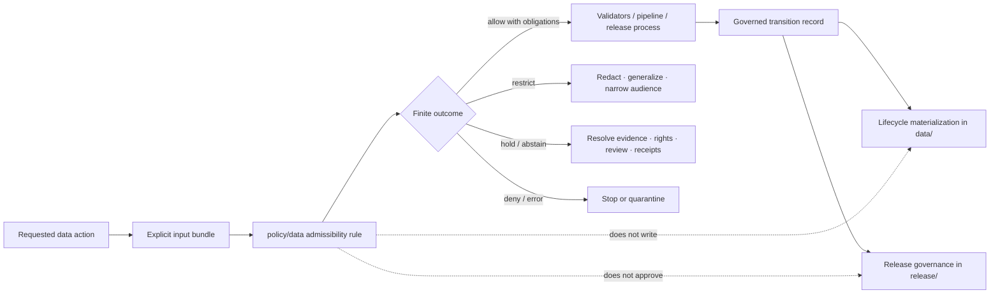

<!-- [KFM_META_BLOCK_V2]
doc_id: kfm://policy/data
title: policy/data/ — Lifecycle Admissibility and Public-Exposure Boundary
type: policy-readme; directory-readme; lifecycle-admissibility-boundary
version: v0.3
status: draft; repository-grounded; readme-only-direct-lane; structural-boundary-tests-confirmed; promotion-bypass-gap-confirmed; executable-data-policy-not-established
owners: OWNER_TBD — Policy steward · Data lifecycle steward · Evidence steward · Rights/sensitivity steward · Validation steward · Release steward · Security steward · Docs steward
created: 2026-06-15
updated: 2026-07-22
policy_label: "public-governance; restricted-review; data-lifecycle-policy; fail-closed; no-data-storage; no-release-authority; no-publication-authority"
current_path: policy/data/README.md
owning_root: policy/
responsibility: define and index admissibility posture for lifecycle transitions and public exposure without storing lifecycle data, evaluating policy as runtime authority, emitting receipts or proofs, approving release, or publishing artifacts
truth_posture: CONFIRMED target path, singular policy root, lifecycle doctrine, release-root separation, static public-boundary tests, connector/pipeline literal non-publisher guard, governed-api abstain-only scaffold, command-bearing boundary workflow, policy and promotion readiness holds, placeholder policy runtime and validators, empty proposed release/policy registers, hydrology automation-smoke APPROVE artifact, and a composed-path blind spot in the literal non-publisher guard / PROPOSED data-action classes, transition gate names, required input bundle, finite outcome normalization, obligations, reviewer classes, and executable implementation sequence / UNKNOWN accepted evaluator, bundle selection, branch-protection requirements, current workflow pass rates, exhaustive contract-schema-policy pairing, runtime consumers, promotion integration, and production enforcement / NEEDS VERIFICATION accepted owners, direct policy/data rule modules, fixtures, tests, validator entry point, reason-code registry, receipt/proof bindings, quarantine-exit records, correction propagation, separation of duties, rollback automation, and disposition of the hydrology promotion scaffold
evidence_snapshot:
  repository: bartytime4life/Kansas-Frontier-Matrix
  visibility: public
  base_ref: main
  base_commit: d24c7bf9ee89c9bb3bd2cd14e0e60b1de6314bc0
  prior_blob: fbcd96008b82a9d1c6e38b357ed6b1bd1a16a5b3
  inventory_method: GitHub connector file reads, base comparison, and bounded code, document-identity, branch, and pull-request searches
  direct_lane_files_confirmed:
    - policy/data/README.md
  bounded_inventory_note: no direct policy/data Rego module, dedicated fixture or test family, executable lifecycle-policy validator, bundle registration, runtime consumer, receipt emitter, release integration, or rollback automation was established; bounded absence is not proof of permanent absence
related:
  - ../README.md
  - ../bundles/README.md
  - ../decision/README.md
  - ../../data/README.md
  - ../../release/README.md
  - ../../docs/doctrine/lifecycle-law.md
  - ../../docs/doctrine/trust-membrane.md
  - ../../docs/doctrine/directory-rules.md
  - ../../docs/architecture/DIRECTORY_RULES.md
  - ../../docs/architecture/directory-rules.md
  - ../../docs/registers/POLICY_GATE.md
  - ../../control_plane/policy_gate_register.yaml
  - ../../control_plane/release_state_register.yaml
  - ../../contracts/runtime/policy_decision.md
  - ../../contracts/data/validation_report.md
  - ../../contracts/data/catalog_matrix.md
  - ../../schemas/contracts/v1/data/README.md
  - ../../tools/validators/lifecycle/README.md
  - ../../tools/validators/policy/README.md
  - ../../tools/validators/validate_promotion_gate.py
  - ../../tools/validators/validate_review_record.py
  - ../../tools/validators/validate_rollback_card.py
  - ../../packages/policy-runtime/README.md
  - ../../tests/policy/boundary_constants.py
  - ../../tests/policy/test_pipeline_connector_non_publisher.py
  - ../../tests/policy/test_explorer_web_adapter_boundary.py
  - ../../apps/governed-api/tests/test_boundary_guards.py
  - ../../apps/governed-api/src/governed_api/stub.py
  - ../../pipelines/domains/hydrology/promote.py
  - ../../release/promotion_decisions/hydrology/run-local-smoke.json
  - ../../.github/workflows/policy-boundary-guards.yml
  - ../../.github/workflows/policy-test.yml
  - ../../.github/workflows/promotion-gate.yml
  - ../../Makefile
tags: [kfm, policy, data, lifecycle, pre-raw, raw, work, quarantine, processed, catalog, triplet, published, evidence, rights, sensitivity, receipts, proofs, release, correction, rollback, fail-closed]
notes:
  - "v0.3 refreshes the evidence boundary across 291 commits since the v0.2 snapshot."
  - "The direct policy/data lane remains README-only in bounded evidence; documentation is not executable enforcement."
  - "The governed API currently abstains, and readiness workflows hold missing policy/promotion behavior."
  - "A hydrology smoke helper can emit APPROVE with unresolved support references through a composed release path that the literal non-publisher guard does not detect."
  - "The v0.2 lifecycle, finite-outcome, obligation, publication, and rollback material is preserved and strengthened."
[/KFM_META_BLOCK_V2] -->

<a id="top"></a>

# Lifecycle Admissibility and Public-Exposure Policy

`policy/data/`

> **One-line purpose.** Define the fail-closed policy boundary for admitting, transforming, quarantining, cataloging, projecting, exposing, correcting, withdrawing, and rolling back KFM data without becoming lifecycle storage, policy runtime, evidence, proof, release authority, or publication machinery.


**Quick navigation:** [Status](#status-and-evidence-boundary) · [Purpose](#purpose) · [Authority](#authority-boundary) · [Scope](#scope) · [Actions](#data-action-classes) · [Inputs](#required-policy-input) · [Transitions](#lifecycle-transition-matrix) · [Outcomes](#finite-outcomes-and-normalization) · [Obligations](#obligations) · [Public boundary](#public-interface-and-non-publisher-boundary) · [Sensitive data](#rights-sensitivity-and-data-minimization) · [Validation](#validation-tests-and-ci) · [Implementation](#smallest-sound-implementation-sequence) · [Rollback](#correction-withdrawal-supersession-and-rollback) · [Done](#definition-of-done) · [Evidence](#evidence-ledger) · [Open](#open-verification-register)

> [!IMPORTANT]
> **Safe current conclusion:** this README is an evidence-grounded policy boundary, not executable data policy. Current tests statically block selected direct public/internal-store coupling and contiguous publication-target literals, while the three governed API routes return `ABSTAIN` scaffolds. A confirmed hydrology smoke helper can still compose a `release/promotion_decisions` path and emit `APPROVE` with unresolved support references; the promotion workflow holds that state and does not execute the helper. None of these surfaces proves policy evaluation, lifecycle authorization, EvidenceBundle closure, accountable review, release approval, correction propagation, or rollback execution.

> [!CAUTION]
> `policy/data/` must never become a second `data/` root. A file under `data/published/`, a passing validator, a catalog record, a triplet, a tile, a merged pull request, or a generated receipt does not by itself prove that publication was authorized.

---

## Status and evidence boundary

| Surface | Current repository evidence | Safe conclusion |
|---|---|---|
| `policy/data/README.md` | **CONFIRMED** | Direct lane exists as this README. |
| Other direct `policy/data/` files | **NOT ESTABLISHED by bounded search** | Do not claim a data-policy module, fixture, test, bundle, or executable gate. |
| Lifecycle data roots | **CONFIRMED root and child documentation** | `data/` stores lifecycle materializations; path presence is not state-transition proof. |
| Lifecycle doctrine | **CONFIRMED draft doctrine** | Pre-RAW and the RAW-to-PUBLISHED invariant are governing design; concrete enforcement remains mixed. |
| Release governance | **CONFIRMED root documentation** | `release/` owns release-facing decisions and governance; `data/published/` stores approved materializations. |
| Release and policy registers | **CONFIRMED empty PROPOSED registers** | The inspected control-plane registers contain `entries: []`; no active gate or release-state entries were established. |
| Governed public API | **CONFIRMED fail-closed scaffold** | `/bootstrap`, `/layers`, and `/evidence` return `ABSTAIN` with `NOT_IMPLEMENTED`; this is containment, not working trust enforcement. |
| Public-boundary tests | **CONFIRMED code** | Explorer and governed API code are checked for internal-store path literals. |
| Connector/pipeline non-publisher test | **CONFIRMED bounded code** | Selected write contexts are checked for contiguous `data/catalog`, `data/published`, and `release/` literals in a five-line window. |
| Hydrology promotion smoke path | **CONFIRMED unsafe scaffold / workflow hold** | The helper composes a release path and emits `APPROVE` with automation review and unresolved evidence/rollback references; CI inspects but does not execute it. |
| Boundary CI | **CONFIRMED command-bearing workflow** | A 15-test static/structural suite runs through `make boundary-guards-ci`; passing is not policy or release approval. |
| Policy evaluation | **NOT ESTABLISHED** | `policy-test` is an explicit readiness hold and emits no `PolicyDecision`. |
| Policy runtime and core rules | **CONFIRMED placeholders** | Runtime source is comment-only, while inspected evidence/release/rights rules are non-enforcing `default deny := false` stubs. |
| Lifecycle/policy/promotion validators | **CONFIRMED README or `NotImplementedError` scaffolds** | Documentation and placeholder entry points cannot authorize transitions. |
| Directory Rules authority | **CONFLICTED** | Three repository copies differ; the supplied canonical PDF supports this existing `policy/` placement but does not resolve repository supersession. |
| Branch protection and current pass rates | **UNKNOWN / NEEDS VERIFICATION** | Workflow presence is not evidence that checks are required or recently passing. |

### Truth labels

- **CONFIRMED** means verified from the pinned repository state or current doctrine file.
- **PROPOSED** means a recommended gate, field, obligation, test, or implementation step not established as active behavior.
- **UNKNOWN** means no adequate current evidence supports a claim.
- **NEEDS VERIFICATION** means evidence could settle the claim, but it has not been checked strongly enough.

---

## Purpose

This lane answers one bounded question:

> Given a named data action, artifact, current lifecycle state, intended next state, audience, and support set, is the action admissible, restricted, held, denied, or unresolved?

It protects these invariants:

```text
(Pre-RAW) -> RAW -> WORK / QUARANTINE -> PROCESSED -> CATALOG / TRIPLET -> PUBLISHED
```

- promotion is a governed state transition, not a file operation;
- no pre-publication stage is an ordinary public source;
- derived artifacts stay derived;
- source role, evidence, rights, sensitivity, review, and release state remain explicit;
- corrections, withdrawals, supersessions, and rollback remain auditable;
- watchers, connectors, pipelines, validators, CI, maps, and AI are non-publishers unless a separately governed release process authorizes an output.

---

## Authority boundary

| Responsibility | Authority home | Role of `policy/data/` |
|---|---|---|
| Data lifecycle materializations | `data/` | Evaluate proposed actions; never store payloads. |
| Release decisions and correction/rollback governance | `release/` | Require and reference governed records; never approve release. |
| Semantic object meaning | `contracts/` | Consume declared meaning; never redefine it here. |
| Machine-checkable shape | `schemas/contracts/v1/` | Require valid shapes where applicable; never become schema authority. |
| Source identity, role, rights, and registry records | accepted source/registry lanes | Require resolved source context; never invent it. |
| Evidence and proof | accepted evidence/proof lanes | Require support; never create evidence closure. |
| Receipts | `data/receipts/` | Require receipt references where governed; never store instances here. |
| Policy rules and bundle source | `policy/` | This lane may eventually hold reviewed rules; README prose is not policy execution. |
| Evaluator helper implementation | `packages/policy-runtime/` | External execution surface; not policy authority. |
| Validators and tests | `tools/validators/`, `tests/`, `fixtures/` | Prove bounded behavior; passing is not transition approval. |
| Public API, map, UI, export, search, graph, and AI | governed application/runtime roots | Receive released, policy-filtered results only. |



---

## Document authority and supersession

- This v0.3 README preserves the v0.2 lifecycle gates, fail-closed posture, finite decisions, obligations, public-boundary rule, and rollback discipline.
- It adds the current promotion-scaffold, composed-path guard, empty-register, and abstain-only API evidence without treating readiness holds as enforcement.
- It does not accept an ADR, ratify every gate name, validate the hydrology smoke decision, or create implementation behavior.
- The three repository Directory Rules copies remain **CONFLICTED**. The supplied canonical PDF confirms that admissibility belongs under singular `policy/`, lifecycle materializations under `data/`, and release decisions under `release/`; it does not settle which repository copy supersedes the others.
- Current repository files, executable tests, emitted decisions, receipts, proofs, manifests, and release records outrank this README for implementation claims.
- If this README conflicts with accepted doctrine or implementation evidence, surface the conflict in the drift register rather than silently normalizing it.

---

## Scope

### In scope

- source admission and Pre-RAW-to-RAW admissibility;
- RAW, WORK, QUARANTINE, PROCESSED, CATALOG, TRIPLET, and PUBLISHED transition posture;
- quarantine entry, persistence, and governed exit requirements;
- public-exposure denial for unreleased/internal data;
- source-role, evidence, rights, sensitivity, validation, review, receipt, proof, release, correction, and rollback prerequisites;
- obligations such as redaction, generalization, audience restriction, citation, delayed exposure, and reevaluation;
- fail-closed handling of missing, stale, conflicting, unsupported, or malformed support;
- correction, withdrawal, supersession, source-rights change, and rollback propagation requirements.

### Out of scope

- lifecycle data storage or file movement;
- connector, watcher, or pipeline implementation;
- schema or semantic contract authoring;
- creation of EvidenceBundles, receipts, proofs, catalogs, triplets, manifests, or release records;
- policy evaluator implementation or bundle activation;
- release approval, publication, deployment, or public-route implementation;
- source credentials, restricted payloads, exact sensitive locations, or private person/genomic data.

---

## Data action classes

| Class | Examples | Minimum review posture | Default when support is missing |
|---|---|---|---|
| `internal_read` | Steward reads RAW/WORK/QUARANTINE for approved purpose | Role and purpose check | `DENY` or `ABSTAIN` |
| `admit` | Pre-RAW event becomes RAW capture | Source, rights, role, sensitivity, receipt | `HOLD` / `ABSTAIN` |
| `transform` | RAW/WORK becomes normalized candidate | Provenance, spec, validation, source-role preservation | `HOLD` / `ERROR` |
| `quarantine` | Material is isolated or remains held | Safe reason code and restricted access | Fail closed into quarantine |
| `quarantine_exit` | Held material returns to governed WORK | Resolution record, review, validation, policy, receipt | `HOLD` / `DENY` |
| `catalog_or_triplet` | PROCESSED candidate becomes discovery or graph projection | Identity, source role, evidence pointers, sensitivity | `HOLD` / `ABSTAIN` |
| `public_materialize` | Candidate becomes public-safe map/data/export | Evidence, policy, review, manifest, proof, correction, rollback | `DENY` / `HOLD` |
| `correct_or_withdraw` | Released item is corrected, superseded, withdrawn, or rolled back | Release authority, lineage, downstream invalidation | `HOLD` / `ERROR` |

These class names are **PROPOSED**. They are not an accepted enum or machine contract.

---

## Required policy input

A consequential decision should be based on an explicit caller-supplied input bundle. It should not fetch hidden facts or infer approval from location.

| Input family | Minimum content |
|---|---|
| Operation | Stable action name and requested effect. |
| Lifecycle | Current state, intended next state, and transition identifier. |
| Artifact identity | Stable object/artifact ID, version, content digest, and `spec_hash` where required. |
| Source | Source descriptor/reference, source role, rights/license, cadence, and restrictions. |
| Evidence | EvidenceRef/EvidenceBundle status and citation-validation state where claims depend on evidence. |
| Validation | Schema/contract status, `ValidationReport` reference, and known quality failures. |
| Sensitivity | Domain, classification, exact-location/reconstruction risk, living-person/genomic flags, and required transform. |
| Audience and purpose | Steward, reviewer, authenticated, public, export, map, API, AI, or other declared audience. |
| Policy execution | Bundle ID/version/digest and evaluator profile when accepted. |
| Review | Required reviewers, current review state, and separation-of-duties posture. |
| Receipts and proofs | Required run/transform/promotion/validation receipts and proof references. |
| Release | Candidate/release state, manifest/decision reference, correction path, and rollback target. |
| Time | Source, observed, valid, retrieval, decision, release, expiry, stale, and correction times where material. |

Missing required context must remain missing. Do not invent it from memory, a filename, a map layer, a catalog row, or generated text.

---

## Lifecycle transition matrix

The lifecycle stages are doctrine-backed. The transition IDs below are **PROPOSED labels** until contracts, schemas, policies, fixtures, and tests ratify them.

| Proposed transition | Required support | Fail-closed result |
|---|---|---|
| `pre_raw_to_raw` | Source identity, role, rights, sensitivity, immutable capture plan, admission receipt target | `HOLD`, `ABSTAIN`, or `DENY` |
| `raw_to_work` | Input digest, retrieval/intake lineage, permitted purpose, transform spec | `HOLD` or `ERROR` |
| `raw_or_work_to_quarantine` | Safe reason code, access restriction, retained provenance | `QUARANTINE` / `DENY` |
| `quarantine_to_work` | Resolution record, steward review, corrected rights/evidence/validation, receipt | `HOLD` or `DENY` |
| `work_to_processed` | Deterministic transform lineage, validation report, source-role preservation | `HOLD` or `ERROR` |
| `processed_to_catalog` | Stable identity, source/evidence links, rights/sensitivity posture, non-authority label | `HOLD` or `ABSTAIN` |
| `processed_to_triplet` | Relation identity, evidence pointers, source role, most-restrictive sensitivity | `HOLD`, `ABSTAIN`, or `DENY` |
| `catalog_or_triplet_to_published` | Policy decision, evidence closure, validation, review, release manifest/decision, proof, correction and rollback | `DENY` or `HOLD` |
| `published_to_corrected` | Correction notice/record, affected-carrier inventory, replacement or withdrawal state | `HOLD` or `ERROR` |
| `published_to_withdrawn_or_rolled_back` | Release authority, rollback target, downstream invalidation, audit trail | `HOLD` or `ERROR` |

A successful action produces a governed decision/transition record. It does not erase upstream lineage or rewrite RAW.

---

## Finite outcomes and normalization

The repository carries two related vocabularies:

- engine- or gate-facing terms such as `ALLOW`, `RESTRICT`, and `HOLD`;
- canonical `PolicyDecision` outcomes currently shaped as `ANSWER`, `ABSTAIN`, `DENY`, or `ERROR`.

The mapping is **CONFLICTED / NEEDS VERIFICATION** and must be explicit before runtime adoption.

| Gate result | Candidate canonical mapping | Required preservation |
|---|---|---|
| `ALLOW` | `ANSWER` or accepted success envelope | Scope, operation, version, audience, obligations, expiry. |
| `RESTRICT` | `ANSWER` with enforceable obligations, or separate accepted restricted outcome | Redaction/generalization/audience limits must not be lost. |
| `HOLD` | `ABSTAIN` with review/closure reason, or separate accepted hold carrier | Pending support and next step remain explicit. |
| `ABSTAIN` | `ABSTAIN` | Missing/stale/conflicted support and safe next step. |
| `DENY` | `DENY` | Public-safe reason codes; no sensitive detail leakage. |
| `ERROR` | `ERROR` | Runtime/validator/evaluator failure; no fallback allow. |

Never use free-text `maybe`, `best_effort`, `low_confidence`, or a successful HTTP response as a substitute for a finite decision.

---

## Obligations

| Obligation | Required downstream effect |
|---|---|
| `quarantine` | Isolate material and record a safe reason. |
| `restrict_audience` | Limit access to the declared steward/reviewer role. |
| `redact` | Remove protected fields or relations before delivery. |
| `generalize` | Reduce spatial or attribute precision and record the transform. |
| `citation_required` | Preserve resolvable citations when safe and applicable. |
| `validation_required` | Block transition until required checks pass. |
| `evidence_required` | Block claim-bearing use until evidence resolves. |
| `rights_review_required` | Hold until reuse/license/source-term posture is settled. |
| `sensitivity_review_required` | Hold or deny until classification and exposure are resolved. |
| `receipt_required` | Require the named process-memory record. |
| `proof_required` | Require release-grade proof support; a receipt alone is insufficient. |
| `review_required` | Route to named role class; generation cannot self-approve. |
| `release_manifest_required` | Require release authority before public materialization. |
| `correction_path_required` | Name how public state is corrected or withdrawn. |
| `rollback_required` | Name a reversible target before public-impacting action. |
| `invalidate_derivatives` | Mark affected tiles, graphs, exports, indexes, caches, and AI carriers stale/withdrawn. |

Obligations must be machine-preservable before an `ALLOW`/success path is considered safe.

---

## Public interface and non-publisher boundary

### Confirmed static guards

Current repository tests establish bounded structural protections:

- connector and pipeline write contexts are checked for references to `data/catalog`, `data/published`, and `release/`;
- Explorer source code is checked for internal lifecycle-store path literals;
- governed API source is checked for the same internal-store path literals;
- the governed API scaffold exposes only `/bootstrap`, `/layers`, and `/evidence`, rejects non-GET methods for those routes, and currently returns `ABSTAIN` / `NOT_IMPLEMENTED` envelopes;
- the command-bearing `policy-boundary-guards` workflow runs the reviewed static/API suite and emits a non-authoritative JUnit artifact.

### Limits of those guards

They do not prove:

- filesystem or database access cannot occur through computed paths, aliases, services, environment variables, SQL, object storage, or external adapters;
- a policy bundle evaluated the request;
- source rights or sensitivity were resolved;
- evidence closed;
- the artifact was promoted or released;
- every client, worker, export, search index, cache, tile service, screenshot, graph, or AI surface obeys the boundary;
- branch protection requires the workflow or that the latest run passed.

### Confirmed promotion and static-guard gap

`tests/policy/test_pipeline_connector_non_publisher.py` inspects selected write-call lines plus a bounded five-line window for three contiguous string literals. The hydrology promotion scaffold instead builds its output as `root / "release" / "promotion_decisions" / ...`, so no contiguous `release/` literal appears in that window. The scaffold then writes a timestamped `APPROVE` record whose EvidenceBundle and rollback-card paths are unresolved and whose reviewer is `automation-smoke`.

The all-PR `promotion-gate` workflow currently treats this as a hold, verifies the unsafe markers remain visible, and deliberately does **not** run the helper. That containment is useful but incomplete: direct or future invocation outside the holding workflow remains unproved, and the lexical guard does not cover equivalent composed paths.

Until the scaffold is removed, converted into a non-authoritative dry-run candidate, or protected by a structural destination check and governed support resolution, its output must not be treated as a valid promotion decision, review record, lifecycle transition, release approval, or publication authority.

Public clients must use governed interfaces and released public-safe artifacts. No UI, API, map, export, graph, search, embedding, screenshot, cache, or AI answer may treat internal lifecycle data as an ordinary public source.

---

## Receipts, proofs, catalogs, triplets, and release anti-collapse

| Artifact | What it can show | What it cannot authorize alone |
|---|---|---|
| Receipt | A process or decision step occurred with recorded inputs/outputs. | Factual truth, policy permission, proof closure, release. |
| Proof pack / EvidenceBundle | Support for a bounded claim or release burden. | Policy, review, release, or publication by itself. |
| Catalog record | Discovery/interchange metadata. | Truth, evidence closure, or release. |
| Triplet/graph edge | A derived relation projection. | Sovereign relationship truth without evidence and policy. |
| Tile/COG/PMTiles/GeoParquet | Efficient delivery carrier. | Canonical truth or publication authority. |
| Validation report | Configured checks ran and produced results. | Policy approval or release approval. |
| Policy decision | Admissibility result for supplied context. | Evidence creation, source-rights discovery, release approval. |
| Release manifest/decision | Governed release scope and state. | Underlying evidence truth or permission beyond its scope. |

A directory name, file extension, digest, signature, or successful build does not collapse these responsibilities.

---

## Rights, sensitivity, and data minimization

Fail closed when rights, consent, sensitivity, audience, or reconstruction risk is unresolved.

| Risk family | Minimum safe posture |
|---|---|
| Living-person or private-person data | Deny public exposure unless a reviewed lawful/public-safe basis exists. |
| DNA/genomic or kinship inference | Restricted by default; explicit consent/authority and anti-reidentification review required. |
| Archaeology, burial, sacred, Indigenous, or cultural places | Withhold or generalize exact locations; steward/sovereignty review required. |
| Rare species or rare plants | Apply geoprivacy and reconstruction-risk controls before delivery. |
| Critical infrastructure or sensitive topology | Deny exact harmful detail and derived reconstruction paths. |
| Private land or stewardship joins | Minimize fields and audience; avoid person/parcel inference without authority. |
| Source terms or unclear reuse rights | Hold/deny until source role, attribution, redistribution, and derivative rights are resolved. |
| Cross-domain joins | Propagate the most restrictive applicable policy and record the join transform. |
| Model or synthetic output | Label as modeled/synthetic; never substitute it for observation or evidence. |

Policy explanations and reason codes must not reveal the protected detail they are denying.

---

## Negative cases and anti-patterns

A future executable lane must cover at least these negative cases:

1. Public client requests RAW, WORK, QUARANTINE, PROCESSED, or unreleased catalog/triplet data.
2. Connector or pipeline attempts to write directly to catalog, published, or release authority.
3. Quarantine exit lacks a resolution record or reviewer.
4. Processed candidate lacks transform lineage or validation.
5. Catalog/triplet output is presented as evidence or release.
6. Claim-bearing public artifact lacks EvidenceBundle support.
7. Rights or sensitivity is unknown or contradicted.
8. Restricted geometry is hidden in UI but remains in delivered payload.
9. Release candidate lacks manifest, decision, proof, correction path, or rollback target.
10. Source-rights change or correction fails to invalidate downstream carriers.
11. Policy evaluator fails or returns an unmapped outcome.
12. AI or operator memory invents missing lifecycle or release state.
13. Receipt, proof, validation, policy, and release objects are silently treated as interchangeable.
14. A file move, merge, deployment, or green check is called publication.
15. A composed or computed publication target bypasses a literal-path guard.
16. An automation-smoke `APPROVE` record with unresolved support is mistaken for accountable review or release authority.

Anti-patterns include allow-by-default stubs, hidden fetches, path-as-state, UI-only redaction, watcher auto-publication, mutable RAW, silent quarantine bypass, orphaned corrections, and self-approved generated policy.

---

## Validation, tests, and CI

### Confirmed current coverage

| Evidence | What is actually established |
|---|---|
| `tests/policy/test_pipeline_connector_non_publisher.py` | Bounded lexical write-context guard for selected connector/pipeline files and contiguous publication-target literals. |
| `tests/policy/test_explorer_web_adapter_boundary.py` | Explorer internal-store path-literal guard. |
| `apps/governed-api/tests/test_boundary_guards.py` | Governed API method/route and internal-store literal guards. |
| `apps/governed-api/src/governed_api/stub.py` | All three registered routes produce `ABSTAIN` / `NOT_IMPLEMENTED` scaffolds. |
| `tests/policy/boundary_constants.py` | Shared forbidden internal path literals. |
| `.github/workflows/policy-boundary-guards.yml` | Read-only, hosted, command-bearing orchestration of 15 static/API tests with JUnit. |
| `.github/workflows/policy-test.yml` | Explicit readiness holds for absent evaluator/bundle/runtime and bounded PolicyDecision schema fixtures. |
| `pipelines/domains/hydrology/promote.py` and tracked smoke record | A composed-path helper can emit `APPROVE` with automation review and unresolved support references. |
| `.github/workflows/promotion-gate.yml` | Read-only readiness hold that inspects but deliberately does not execute the hydrology helper. |
| control-plane policy/release registers | Both inspected registers are PROPOSED and have empty `entries` arrays. |

### Not established

- direct `policy/data` policy modules;
- data-action fixtures for each transition and outcome;
- executable lifecycle-policy validator;
- accepted policy input bundle for lifecycle actions;
- evaluator and bundle activation;
- transition receipt emission and replay;
- quarantine-exit enforcement;
- safe disposition of the hydrology promotion helper and its tracked smoke record;
- structural destination checks that catch composed, aliased, or indirect publication writes;
- accepted non-empty policy-gate and release-state registers;
- release/promotion integration;
- correction and rollback propagation tests;
- production runtime behavior or current pass rates.

### Workflow-trigger boundary for this README

`policy-test` and `promotion-gate` run on pull requests with read-only repository permission and use GitHub-hosted runners. The path-scoped `policy-boundary-guards` workflow does not list `policy/**` or `data/receipts/**` as pull-request triggers, so this documentation change alone is not expected to exercise that suite. Repository-wide PR workflows may still run, and their live run inventory outranks static path assumptions. Branch protection, required checks, and final pass rates remain `NEEDS VERIFICATION`.

---

## Smallest sound implementation sequence

1. **Contain the confirmed promotion scaffold.** Prevent the hydrology helper and tracked smoke record from being consumed as authority; replace hard-coded `APPROVE` with a non-authoritative candidate or fail-closed dry run.
2. **Close the lexical-guard blind spot.** Add destination-aware tests for composed, aliased, indirect, shell, object-store, and adapter-mediated publication targets.
3. **Ratify the input and outcome contracts.** Reconcile gate vocabulary with `PolicyDecision` and lifecycle/release object families.
4. **Choose ownership and sublane shape.** Decide whether one data-policy module or transition-specific modules are appropriate without creating a new root.
5. **Add deterministic fixtures.** Cover allow, restrict, hold, abstain, deny, error, quarantine, public-bypass, stale, correction, rollback, and composed-target cases.
6. **Implement pure rule evaluation.** Explicit inputs only; no hidden repository, network, database, model, or UI lookups.
7. **Implement a validator adapter.** Validate bundle identity, input/output shape, reason codes, obligations, and transition support without becoming policy authority.
8. **Add runtime adapter behind an injected interface.** Keep policy bundle selection reviewed and digest-pinned.
9. **Emit receipt-ready decision metadata.** Preserve inputs, bundle/evaluator identity, outcome, obligations, timestamps, and hashes.
10. **Wire one no-network proof transition.** Prefer a public-safe fixture lane with explicit quarantine and deny cases.
11. **Integrate release dry-run only after gates pass.** No live publication in the first increment.
12. **Run correction and rollback drills.** Prove downstream invalidation and safe restoration.

Each step should be separately reviewable and reversible. Documentation must be updated when behavior materially changes.

---

## Review and separation of duties

| Change class | Minimum proposed review |
|---|---|
| README-only boundary clarification | Policy/data owner plus docs reviewer. |
| Rule or outcome change | Policy steward, data-lifecycle steward, affected contract/schema/test owners. |
| Sensitive-domain rule | Policy, sensitivity/rights, domain, and security review. |
| Evaluator or bundle activation | Policy-runtime, security, validation, and operations review. |
| Public exposure or release-gate change | Independent release steward plus evidence/policy/domain review. |
| Correction or rollback change | Release, data-lifecycle, affected public-surface, and audit review. |

CODEOWNERS currently routes `policy/`, `data/receipts/`, tests, validators, apps, and release paths to `@bartytime4life`. That is review routing, not proof of independent approval or separation of duties.

---

## Correction, withdrawal, supersession, and rollback

A lifecycle decision remains revisable when its support changes.

Required posture:

- corrections create new governed records; they do not erase old lineage;
- withdrawals and supersessions identify affected releases and carriers;
- source-rights, sensitivity, or consent changes may require immediate hold/withdrawal;
- rollback restores a known release state or withdraws the affected release; it does not move derived data back to RAW;
- affected catalogs, triplets, tiles, exports, caches, search/vector indexes, screenshots, stories, maps, APIs, and AI summaries must be invalidated or marked stale where material;
- every public-impacting rule or release change names a rollback target and operator path.

Rollback for this documentation-only update is a Git revert restoring prior blob `fbcd96008b82a9d1c6e38b357ed6b1bd1a16a5b3`; no lifecycle or public state changes.

---

## Definition of done

This lane is not implementation-complete until:

- [ ] owners and independent reviewer classes are accepted;
- [ ] data-action and transition identifiers are ratified;
- [ ] policy input, decision, obligations, and reason-code contracts are aligned;
- [ ] direct policy modules exist under an accepted policy sublane;
- [ ] deterministic positive and negative fixtures exist;
- [ ] an executable validator and tests prove fail-closed behavior;
- [ ] evaluator and bundle selection are accepted, digest-bound, and replayable;
- [ ] quarantine entry and exit are enforceable;
- [ ] receipts and proof prerequisites are machine-linked;
- [ ] structural public-boundary tests catch composed, aliased, indirect, and adapter-mediated publication destinations;
- [ ] the hydrology promotion scaffold and unresolved smoke decision are removed, quarantined as non-authoritative fixtures, or replaced by a fail-closed governed path;
- [ ] structural public-boundary tests are supplemented by runtime/adapter tests;
- [ ] release, correction, withdrawal, supersession, and rollback integration is tested;
- [ ] sensitive-domain and cross-domain restrictions propagate;
- [ ] CI uses repository-native commands and reports non-vacuous results;
- [ ] branch protection and required-check coupling are verified where relied upon;
- [ ] at least one governed no-network transition and rollback drill passes;
- [ ] docs, contracts, schemas, policy, tests, receipts/proofs, and release records remain in separate authority roots.

---

## Evidence ledger

| Evidence | Observation used | Status |
|---|---|---|
| `policy/data/README.md@d24c7bf9...` | Existing v0.2 design, stable `doc_id`, lifecycle gates, obligations, and rollback posture. | CONFIRMED |
| supplied `Directory Rules.pdf` plus three repository copies | Admissibility belongs under singular `policy/`; lifecycle materializations and release decisions remain separate; repository supersession is unresolved. | CONFIRMED placement / CONFLICTED repository authority |
| `policy/README.md`, `data/README.md`, and `release/README.md` | Policy, lifecycle materialization, and release-decision responsibilities remain separate. | CONFIRMED documentation |
| `docs/doctrine/lifecycle-law.md` | Pre-RAW and lifecycle invariant; publication is a governed transition. | CONFIRMED file / draft doctrine |
| `policy-test.yml` and policy-runtime/rule sources | Rego sources exist, but accepted evaluator, tests, bundle, and executable runtime are absent; inspected core rules are non-enforcing stubs. | CONFIRMED readiness hold |
| boundary test files and workflow | Fifteen static/API tests enforce bounded literal and route structure. | CONFIRMED code/workflow / coverage bounded |
| governed API route registry and stub | Three routes exist and return `ABSTAIN` / `NOT_IMPLEMENTED`. | CONFIRMED fail-closed scaffold |
| hydrology promoter, smoke record, and `promotion-gate.yml` | Helper emits `APPROVE` through a composed release path; support refs are unresolved; workflow holds and does not execute it. | CONFIRMED unsafe scaffold / contained in inspected CI |
| policy/release control-plane registers | Both inspected registers are PROPOSED with `entries: []`. | CONFIRMED empty registers |
| generic promotion, review, and rollback validators | Entry points raise `NotImplementedError("Greenfield placeholder")`. | CONFIRMED placeholders |
| prior generated receipt | v0.2 provenance exists with human review pending; it becomes lineage when v0.3 changes the artifact hash. | CONFIRMED lineage |
| open PR and duplicate-identity searches | No overlapping open PR or competing `kfm://policy/data` document surfaced; the prior branch is historical merged work. | CONFIRMED bounded search |

---

## Open verification register

| Item | Why it matters |
|---|---|
| Accept owners and independent reviewer assignments | Prevents generation and release self-approval. |
| Decide whether the lane remains one policy sublane or splits by transition family | Prevents policy sprawl and duplicate authority. |
| Ratify gate/action names and finite outcome normalization | Required for interoperable callers and receipts. |
| Align lifecycle contracts, schemas, policy inputs, decisions, obligations, and reason codes | Prevents prose-only enforcement. |
| Contain or replace the hydrology composed-path promotion helper and smoke record | Prevents unresolved automation output from being mistaken for review or release authority. |
| Expand the non-publisher guard beyond contiguous literals | Required to catch composed, aliased, indirect, shell, object-store, and adapter-mediated targets. |
| Populate and accept policy-gate and release-state registers | Empty PROPOSED registers do not establish active gates or release state. |
| Implement direct policy modules, fixtures, tests, and validator | Required before active enforcement claims. |
| Accept evaluator, bundle format, selector, and digest/replay contract | Required for runtime parity. |
| Verify receipt/proof homes and transition-record shapes | Required for audit and replay. |
| Prove quarantine entry/exit and correction propagation | Required for fail-closed lifecycle operation. |
| Integrate release manifests, decisions, correction, withdrawal, and rollback | Required before publication claims. |
| Expand structural guards to computed/indirect stores and all public carriers | Current literal scans are bounded. |
| Verify workflow pass rates, required checks, and branch protection | Workflow presence alone is insufficient. |
| Resolve Directory Rules duplicate-placement/supersession conflict | Prevents doctrine-link drift. |

---

## Maintenance triggers

Re-review this README when any of these change:

- lifecycle stages or transition names;
- data root topology or release/published separation;
- policy input/decision schemas or outcome vocabulary;
- policy bundle/evaluator selection;
- lifecycle or policy validator implementation;
- hydrology promotion helper, smoke decision, or promotion-gate hold;
- policy-gate or release-state register entries;
- quarantine workflow;
- public-boundary tests, destination construction, API routes, map/export/search/AI carriers;
- receipt/proof or release-manifest contracts;
- correction, withdrawal, supersession, or rollback behavior;
- sensitive-domain policy or rights posture;
- CODEOWNERS, branch protection, or required checks.

<details>
<summary>Appendix A — no-loss preservation note</summary>

The v0.1 README was not an empty placeholder. It established the responsibility boundary, lifecycle gate family, finite outcomes, obligations, and publication/rollback posture. v0.2 preserved those gains and grounded them in repository evidence. v0.3 preserves that substance, refreshes the evidence snapshot, and adds the confirmed composed-path promotion gap, empty control registers, abstain-only public API scaffold, and explicit limits of the holding workflows.

</details>

## Status summary

`policy/data/` is the documentation boundary for lifecycle admissibility and public exposure. Current repository evidence supports selected static guards, read-only readiness holds, and an abstain-only governed API scaffold, but not executable data-policy evaluation or governed lifecycle authorization. A confirmed hydrology helper can emit an unresolved automation-approved smoke decision through a composed release path that the literal guard misses; that artifact is not review, promotion, release, or publication authority. Until the missing rule, fixture, validator, runtime, register, receipt/proof, release, correction, and rollback evidence exists, stronger claims must abstain.

<p align="right"><a href="#top">Back to top</a></p>

