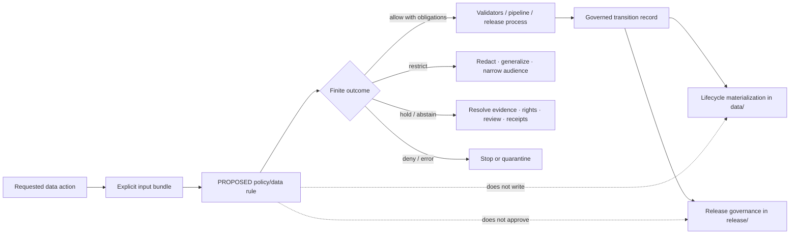

<!-- [KFM_META_BLOCK_V2]
doc_id: kfm://policy/data
title: policy/data/ — Lifecycle Admissibility and Public-Exposure Boundary
type: policy-boundary
readme_profile: BOUNDARY_COMPACT
version: v0.4
status: draft; repository-grounded; documentation-plus-empty-marker; accepted-placement; bounded-validation-evidence; executable-data-policy-not-established; non-release; non-publication
owner: NEEDS VERIFICATION — CODEOWNERS routes /policy/ to @bartytime4life; accepted data-policy stewardship, independent review, and an executable local scope ID were not established
created: 2026-06-15
updated: 2026-08-13
prepared_under_prompt: KFM Repository Build-Out & Markdown Modernization Implementation Agent v6.0.0
policy_label: "repository-facing; internal-policy-source; data-lifecycle-policy; fail-closed; no-data-storage; no-release-authority; no-publication-authority"
current_path: policy/data/README.md
owning_root: policy/
root_registry_id: root.policy
local_scope_id: "kfm://policy/data — stable document identity; executable evaluator scope not accepted"
responsibility: define and index admissibility posture for lifecycle transitions and public exposure without storing lifecycle data, evaluating policy as runtime authority, emitting receipts or proofs, approving release, or publishing artifacts
truth_posture: CONFIRMED same-path target and stable document identity, accepted ADR-0029 placement, active root.policy projection, README plus empty marker inventory, lifecycle and release-root separation, one bounded inactive Rego release-gate profile outside this lane, explicit PolicyInputBundle profile, closed proposed PolicyDecision shape, 18-test structural boundary suite, structural connector output scanner, legacy pipeline lexical canary, abstain-only governed API scaffold, bounded fixture-only promotion and review profiles, no-write publication-denial dry run, proposed rollback-card fixture validator, placeholder general policy runtime and root rollback shim, empty proposed policy/release registers, hydrology automation-smoke APPROVE artifact, and the pipeline canary's composed-path blind spot / PROPOSED data-action classes, transition identifiers, obligations, reviewer classes, and executable implementation sequence / UNKNOWN accepted data evaluator, active bundle selection, production consumers, authenticated decision emission, branch-protection requirements, runtime enforcement, promotion integration, and public deployment / NEEDS VERIFICATION accepted owners, local scope ID, direct policy/data rule modules, dedicated fixtures and tests, data-policy validator entry point, reason-code registry, receipt/proof bindings, quarantine-exit enforcement, correction propagation, independent review, rollback execution, and disposition of the hydrology promotion scaffold
evidence_repository: bartytime4life/Kansas-Frontier-Matrix
evidence_visibility: public
evidence_base_ref: main
evidence_base_commit: 1a61d3fbdc111bb3292086a30a53ccc50ed1bb8a
target_baseline_blob: 4d0f03755e788fd6fbd7fea14f5a46babb688460
target_tree: d8e1afdd37a6fb82cb4408abaf39a9885708cfe7
policy_root_blob: 6c5021f9d92778581a4e9331a9dd6ddb7efc5e35
directory_rules_blob: fd49a0b83e55cef52c1124281f093e263526898d
adr_0029_blob: b01322ef64f8c2b1ecb41de7ef4685b97cfa2a62
root_registry_blob: 024f668b5f0a9239bafa4f8b09e2afd86300ff8c
codeowners_blob: dd2a84aa514d8ecd9208bc347f90f9a2ed37dd61
boundary_workflow_blob: 1d7ba1df0f8ed291a15b1d9a44e404ba95d9e35c
connector_output_scanner_blob: 5b6b69545159e63e672e7c08dc41b519dd265617
promotion_workflow_blob: 9b567aad17de2a7419a2a0238386745c1cb5c11c
release_dry_run_workflow_blob: 7caf1d188bd31d11e159190248e5543b1d2fd36f
inventory_method: exact commit, blob, tree, file, test, workflow, register, CODEOWNERS, document-identity, branch, and open-pull-request inspection; no runtime, deployment, production data, external store, or repository-settings access
direct_lane_files_confirmed: [policy/data/.gitkeep, policy/data/README.md]
open_matching_pull_requests: 0
open_matching_branches: 0
bounded_inventory_note: no direct policy/data Rego module, dedicated fixture or test family, executable data-lifecycle policy validator, bundle registration, evaluator binding, runtime consumer, authenticated decision emitter, release integration, or rollback executor was established; bounded absence is not proof of permanent absence
related:
  - ../README.md
  - ../bundles/README.md
  - ../decision/README.md
  - ../rego/README.md
  - ../../data/README.md
  - ../../release/README.md
  - ../../docs/doctrine/lifecycle-law.md
  - ../../docs/doctrine/trust-membrane.md
  - ../../docs/doctrine/directory-rules.md
  - ../../docs/adr/ADR-0029-adopt-directory-governance-standard-v2.md
  - ../../docs/registers/POLICY_GATE.md
  - ../../control_plane/root_registry.yaml
  - ../../control_plane/policy_gate_register.yaml
  - ../../control_plane/release_state_register.yaml
  - ../../contracts/policy/policy_input_bundle.md
  - ../../contracts/policy/policy_input_bundle_profile_v1.md
  - ../../contracts/policy/policy_decision.md
  - ../../contracts/data/validation_report.md
  - ../../contracts/data/catalog_matrix.md
  - ../../schemas/contracts/v1/policy/policy_input_bundle_profile_v1.schema.json
  - ../../schemas/contracts/v1/policy/policy_decision.schema.json
  - ../../schemas/contracts/v1/data/README.md
  - ../../tools/validators/lifecycle/README.md
  - ../../tools/validators/policy/README.md
  - ../../tools/validators/connector_gate/output_paths.py
  - ../../tools/validators/validate_promotion_gate.py
  - ../../tools/validators/validate_review_record.py
  - ../../tools/validators/validate_rollback_card.py
  - ../../tools/validators/release/validate_rollback_card.py
  - ../../tools/release/release_dry_run.py
  - ../../packages/policy-runtime/README.md
  - ../../tests/policy/boundary_constants.py
  - ../../tests/policy/test_control_plane_register_meta_contract.py
  - ../../tests/policy/test_pipeline_connector_non_publisher.py
  - ../../tests/policy/test_explorer_web_adapter_boundary.py
  - ../../apps/governed-api/tests/test_boundary_guards.py
  - ../../apps/governed-api/src/governed_api/stub.py
  - ../../pipelines/domains/hydrology/promote.py
  - ../../release/promotion_decisions/hydrology/run-local-smoke.json
  - ../../.github/workflows/policy-boundary-guards.yml
  - ../../.github/workflows/policy-test.yml
  - ../../.github/workflows/promotion-gate.yml
  - ../../.github/workflows/release-dry-run.yml
  - ../../Makefile
tags: [kfm, policy, data, lifecycle, pre-raw, raw, work, quarantine, processed, catalog, triplet, published, evidence, rights, sensitivity, receipts, proofs, release, correction, rollback, fail-closed]
notes:
  - "v0.4 reconciles the v0.3 boundary against current main after 3,915 intervening commits."
  - "The direct lane contains this README and an empty marker only; documentation is not executable enforcement."
  - "Accepted Directory Rules v2 resolves placement while leaving data-policy ownership, scope, and activation open."
  - "The structural connector scanner is materially stronger, but pipelines retain a legacy lexical canary that misses the composed hydrology release destination."
  - "Bounded promotion, review, rollback-card, and publication-denial profiles narrow readiness unknowns without creating policy, review, release, rollback, or publication authority."
  - "The v0.3 lifecycle, finite-outcome, obligation, publication, sensitivity, correction, and rollback material is preserved or tightened."
[/KFM_META_BLOCK_V2] -->

<a id="top"></a>

# Lifecycle Admissibility and Public-Exposure Policy

`policy/data/`

> **One-line purpose.** Define the fail-closed policy boundary for admitting, transforming, quarantining, cataloging, projecting, exposing, correcting, withdrawing, and rolling back KFM data without becoming lifecycle storage, policy runtime, evidence, proof, release authority, or publication machinery.


**Quick navigation:** [Status](#status-and-evidence-boundary) · [Purpose](#purpose) · [Authority](#authority-boundary) · [Scope](#scope) · [Actions](#data-action-classes) · [Inputs](#required-policy-input) · [Transitions](#lifecycle-transition-matrix) · [Outcomes](#finite-outcomes-and-normalization) · [Obligations](#obligations) · [Public boundary](#public-interface-and-non-publisher-boundary) · [Sensitive data](#rights-sensitivity-and-data-minimization) · [Validation](#validation-tests-and-ci) · [Implementation](#smallest-sound-implementation-sequence) · [Rollback](#correction-withdrawal-supersession-and-rollback) · [Done](#definition-of-done) · [Evidence](#evidence-ledger) · [Open](#open-verification-register)

> [!IMPORTANT]
> **Safe current conclusion:** this README and an empty marker are the entire direct lane; no data-policy module is established here. Accepted Directory Rules v2 confirms the placement, while current code proves only bounded pieces: an 18-test structural boundary suite, a structural connector-output scanner, an abstain-only three-route governed API, fixture-only promotion and review readiness, a proposed RollbackCard validator profile, and five deterministic no-write publication-denial cases. The legacy pipeline canary still misses the hydrology helper's composed `release/promotion_decisions` destination, and that helper can emit `APPROVE` with unresolved support references. None of these surfaces proves data-policy evaluation, lifecycle authorization, EvidenceBundle closure, accountable review, release approval, correction propagation, rollback execution, or publication.

> [!CAUTION]
> `policy/data/` must never become a second `data/` root. A file under `data/published/`, a passing validator, a catalog record, a triplet, a tile, a merged pull request, or a generated receipt does not by itself prove that publication was authorized.

---

## Status and evidence boundary

| Surface | Current repository evidence | Safe conclusion |
|---|---|---|
| `policy/data/` direct inventory | **CONFIRMED two files** | This README and a zero-byte `.gitkeep` are present; no rule, fixture, test, bundle, or executable gate exists directly here. |
| Placement and root projection | **CONFIRMED / adopted** | ADR-0029 adopts Directory Rules v2; `root.policy` projects policy source as internal, versioned, and durable. The projection does not activate this lane. |
| Lifecycle data root | **CONFIRMED active root with mixed maturity** | `data/` owns instances and currently documents ten canonical lifecycle/accountability lanes; path presence is not transition proof. |
| Lifecycle doctrine | **CONFIRMED draft doctrine** | Pre-RAW and the RAW-to-PUBLISHED invariant are governing design; concrete enforcement remains mixed. |
| Release governance | **CONFIRMED canonical root / mixed maturity** | `release/` owns decisions; `data/published/` owns released carriers. Fixture-first validation does not create an operational release. |
| Release and policy registers | **CONFIRMED empty PROPOSED registers** | The inspected control-plane registers contain `entries: []`; no active gate or release-state entries were established. |
| Data schema pointers | **CONFIRMED seven proposed schemas** | Seven current data schemas point to `policy/data/` in `x-kfm.policy`; metadata linkage does not supply rules, an evaluator, or a decision. |
| General policy inputs and decisions | **CONFIRMED proposed/inactive profiles** | An explicit `PolicyInputBundle` profile and closed four-outcome `PolicyDecision` shape exist, but no accepted data-specific binding or evaluator is established. |
| Other policy execution | **CONFIRMED outside this lane** | One bounded `PROPOSED_INACTIVE` Pass 12 Rego profile has native tests and dedicated OPA CI; twelve fixture-first Python policy validators have tests/workflows. None evaluates `policy/data/`. |
| Governed public API | **CONFIRMED fail-closed scaffold** | `/bootstrap`, `/layers`, and `/evidence` return `ABSTAIN` with `NOT_IMPLEMENTED`; this is containment, not working trust enforcement. |
| Structural boundary suite | **CONFIRMED 18 tests in four modules** | Control-plane metadata, Explorer imports/stores, connector/pipeline outputs, and governed API routes/stores are checked through `make boundary-guards-ci`. |
| Connector output guard | **CONFIRMED structural scanner** | Selected Python, shell, and YAML connector sinks fail closed unless repository output is statically confined to `data/raw`, `data/quarantine`, or `data/receipts`. It is not runtime confinement. |
| Pipeline non-publisher canary | **CONFIRMED legacy lexical scan** | Pipeline write contexts still use a five-line contiguous-literal canary for `data/catalog`, `data/published`, and `release/`; computed destinations remain outside that proof. |
| Hydrology promotion smoke path | **CONFIRMED unsafe scaffold / workflow hold** | The helper composes a release path and emits `APPROVE` with automation review and unresolved evidence/rollback references; CI inspects but does not execute it. |
| Promotion and review readiness | **CONFIRMED bounded fixture-only execution** | `make publish-check` exercises A–G promotion readiness and synthetic ReviewRecord declarations; `PASS` means `APPROVE_READY` for review only. |
| Publication-denial dry run | **CONFIRMED deterministic no-write execution** | Five synthetic evidence, policy, integrity, sensitivity, and review failures remain blocked without assembling a candidate or writing authority. |
| Rollback-card readiness | **CONFIRMED mixed** | A schema-declared fixture validator is implemented; the root compatibility entry point and rollback apply helper remain placeholders, and no rollback executes. |
| Data-policy evaluation | **NOT ESTABLISHED** | `policy-test` retains the general evaluator hold and emits no data `PolicyDecision`. |
| General policy runtime | **CONFIRMED placeholder** | `packages/policy-runtime` remains `0.0.0`; its namespace marker is empty and `core.py` is comment-only. |
| Branch protection and current pass rates | **UNKNOWN / NEEDS VERIFICATION** | Workflow presence is not evidence that checks are required or recently passing. |

### Truth labels

- **CONFIRMED** means verified from the pinned repository state or current doctrine file.
- **PROPOSED** means a recommended gate, field, obligation, test, or implementation step not established as active behavior.
- **UNKNOWN** means no adequate current evidence supports a claim.
- **NEEDS VERIFICATION** means evidence could settle the claim, but it has not been checked strongly enough.

---

## Boundary profile and current lane

| Field | Current bounded result |
|---|---|
| Inherited parent | [`policy/`](../README.md), the adopted singular policy-source root |
| README profile | `BOUNDARY_COMPACT` |
| Stable document identity | `kfm://policy/data` |
| Executable local scope ID | **NEEDS VERIFICATION**; the document identity is not an accepted evaluator scope |
| Repository review route | `@bartytime4life` through CODEOWNERS |
| Accepted local owner and independent reviewer | **NEEDS VERIFICATION** |
| Root exposure | `internal`; public repository visibility does not make policy source a public runtime interface |
| Root mutation | `versioned` |
| Root retention | `durable` |
| Current local payload | Documentation plus an empty marker only |
| Inputs | Explicit action, object, lifecycle, source, evidence, rights, sensitivity, audience, review, release, and time context |
| Outputs | **PROPOSED** finite decision, public-safe reasons, enforceable obligations, and governed references |

```text
policy/data/
├── .gitkeep   # zero-byte marker; no authority or implementation
└── README.md  # this boundary contract
```

The [scope](#scope), [required input](#required-policy-input), [outcome](#finite-outcomes-and-normalization), [validation](#validation-tests-and-ci), and [open verification](#open-verification-register) sections complete the local boundary profile. No child path inherits an implemented policy merely from this README.

---

## Purpose

This lane answers one bounded question:

> Given a named data action, artifact, current lifecycle state, intended next state, audience, and support set, is the action admissible, restricted, held, denied, or unresolved?

It protects these invariants:

```text
(Pre-RAW) -> RAW -> WORK / QUARANTINE -> PROCESSED -> CATALOG / TRIPLET -> PUBLISHED
```

- promotion is a governed state transition, not a file operation;
- no pre-publication stage is an ordinary public source;
- derived artifacts stay derived;
- source role, evidence, rights, sensitivity, review, and release state remain explicit;
- corrections, withdrawals, supersessions, and rollback remain auditable;
- watchers, connectors, pipelines, validators, CI, maps, and AI are non-publishers unless a separately governed release process authorizes an output.

---

## Authority boundary

| Responsibility | Authority home | Role of `policy/data/` |
|---|---|---|
| Data lifecycle materializations | `data/` | Evaluate proposed actions; never store payloads. |
| Release decisions and correction/rollback governance | `release/` | Require and reference governed records; never approve release. |
| Semantic object meaning | `contracts/` | Consume declared meaning; never redefine it here. |
| Machine-checkable shape | `schemas/contracts/v1/` | Require valid shapes where applicable; never become schema authority. |
| Source identity, role, rights, and registry records | accepted source/registry lanes | Require resolved source context; never invent it. |
| Evidence and proof | accepted evidence/proof lanes | Require support; never create evidence closure. |
| Receipts | `data/receipts/` | Require receipt references where governed; never store instances here. |
| Policy rules and bundle source | `policy/` | This lane may eventually hold reviewed data-action rules; README prose, empty markers, and sibling rules are not local execution. |
| Evaluator helper implementation | `packages/policy-runtime/` | External execution surface; not policy authority. |
| Validators and tests | `tools/validators/`, `tests/`, `fixtures/` | Prove bounded behavior; passing is not transition approval. |
| Public API, map, UI, export, search, graph, and AI | governed application/runtime roots | Receive released, policy-filtered results only. |


```mermaid
flowchart LR
    A["Requested data action"] --> I["Explicit input bundle"]
    I --> P["PROPOSED policy/data rule"]
    P --> O{"Finite outcome"}
    O -->|allow with obligations| V["Validators / pipeline / release process"]
    O -->|restrict| R["Redact · generalize · narrow audience"]
    O -->|hold / abstain| H["Resolve evidence · rights · review · receipts"]
    O -->|deny / error| Q["Stop or quarantine"]
    V --> D["Governed transition record"]
    D --> X["Lifecycle materialization in data/"]
    D --> Y["Release governance in release/"]

    P -. "does not write" .-> X
    P -. "does not approve" .-> Y
```

---

## Document authority and supersession

- This v0.4 README preserves the v0.3 lifecycle gates, fail-closed posture, finite decisions, obligations, public-boundary rule, sensitivity posture, and rollback discipline.
- It reconciles current accepted placement, direct-lane inventory, structural connector scanning, bounded promotion/review/rollback-card profiles, and no-write publication-denial behavior without treating readiness evidence as enforcement.
- Accepted ADR-0029 makes `docs/doctrine/directory-rules.md` the single writable human Directory Rules authority. Legacy architecture copies are compatibility or migration surfaces, not competing placement authority.
- It does not accept a data-policy scope, ratify action or transition names, activate a bundle, validate the hydrology smoke decision, create a release record, or change runtime behavior.
- Current repository files, executable tests, emitted decisions, receipts, proofs, manifests, and release records outrank this README for implementation claims.
- If this README conflicts with accepted doctrine or implementation evidence, surface the conflict in the drift register rather than silently normalizing it.

---

## Scope

### In scope

- source admission and Pre-RAW-to-RAW admissibility;
- RAW, WORK, QUARANTINE, PROCESSED, CATALOG, TRIPLET, and PUBLISHED transition posture;
- quarantine entry, persistence, and governed exit requirements;
- public-exposure denial for unreleased/internal data;
- source-role, evidence, rights, sensitivity, validation, review, receipt, proof, release, correction, and rollback prerequisites;
- obligations such as redaction, generalization, audience restriction, citation, delayed exposure, and reevaluation;
- fail-closed handling of missing, stale, conflicting, unsupported, or malformed support;
- correction, withdrawal, supersession, source-rights change, and rollback propagation requirements.

### Out of scope

- lifecycle data storage or file movement;
- connector, watcher, or pipeline implementation;
- schema or semantic contract authoring;
- creation of EvidenceBundles, receipts, proofs, catalogs, triplets, manifests, or release records;
- policy evaluator implementation or bundle activation;
- release approval, publication, deployment, or public-route implementation;
- source credentials, restricted payloads, exact sensitive locations, or private person/genomic data.

---

## Data action classes

| Class | Examples | Minimum review posture | Default when support is missing |
|---|---|---|---|
| `internal_read` | Steward reads RAW/WORK/QUARANTINE for approved purpose | Role and purpose check | `DENY` or `ABSTAIN` |
| `admit` | Pre-RAW event becomes RAW capture | Source, rights, role, sensitivity, receipt | `HOLD` / `ABSTAIN` |
| `transform` | RAW/WORK becomes normalized candidate | Provenance, spec, validation, source-role preservation | `HOLD` / `ERROR` |
| `quarantine` | Material is isolated or remains held | Safe reason code and restricted access | Fail closed into quarantine |
| `quarantine_exit` | Held material returns to governed WORK | Resolution record, review, validation, policy, receipt | `HOLD` / `DENY` |
| `catalog_or_triplet` | PROCESSED candidate becomes discovery or graph projection | Identity, source role, evidence pointers, sensitivity | `HOLD` / `ABSTAIN` |
| `public_materialize` | Candidate becomes public-safe map/data/export | Evidence, policy, review, manifest, proof, correction, rollback | `DENY` / `HOLD` |
| `correct_or_withdraw` | Released item is corrected, superseded, withdrawn, or rolled back | Release authority, lineage, downstream invalidation | `HOLD` / `ERROR` |

These class names are **PROPOSED**. They are not an accepted enum or machine contract.

---

## Required policy input

A consequential decision should be based on an explicit caller-supplied input bundle. It should not fetch hidden facts or infer approval from location.

| Input family | Minimum content |
|---|---|
| Operation | Stable action name and requested effect. |
| Lifecycle | Current state, intended next state, and transition identifier. |
| Artifact identity | Stable object/artifact ID, version, content digest, and `spec_hash` where required. |
| Source | Source descriptor/reference, source role, rights/license, cadence, and restrictions. |
| Evidence | EvidenceRef/EvidenceBundle status and citation-validation state where claims depend on evidence. |
| Validation | Schema/contract status, `ValidationReport` reference, and known quality failures. |
| Sensitivity | Domain, classification, exact-location/reconstruction risk, living-person/genomic flags, and required transform. |
| Audience and purpose | Steward, reviewer, authenticated, public, export, map, API, AI, or other declared audience. |
| Policy execution | Bundle ID/version/digest and evaluator profile when accepted. |
| Review | Required reviewers, current review state, and separation-of-duties posture. |
| Receipts and proofs | Required run/transform/promotion/validation receipts and proof references. |
| Release | Candidate/release state, manifest/decision reference, correction path, and rollback target. |
| Time | Source, observed, valid, retrieval, decision, release, expiry, stale, and correction times where material. |

Missing required context must remain missing. Do not invent it from memory, a filename, a map layer, a catalog row, or generated text.

---

## Lifecycle transition matrix

The lifecycle stages are doctrine-backed. The transition IDs below are **PROPOSED labels** until contracts, schemas, policies, fixtures, and tests ratify them.

| Proposed transition | Required support | Fail-closed result |
|---|---|---|
| `pre_raw_to_raw` | Source identity, role, rights, sensitivity, immutable capture plan, admission receipt target | `HOLD`, `ABSTAIN`, or `DENY` |
| `raw_to_work` | Input digest, retrieval/intake lineage, permitted purpose, transform spec | `HOLD` or `ERROR` |
| `raw_or_work_to_quarantine` | Safe reason code, access restriction, retained provenance | `QUARANTINE` / `DENY` |
| `quarantine_to_work` | Resolution record, steward review, corrected rights/evidence/validation, receipt | `HOLD` or `DENY` |
| `work_to_processed` | Deterministic transform lineage, validation report, source-role preservation | `HOLD` or `ERROR` |
| `processed_to_catalog` | Stable identity, source/evidence links, rights/sensitivity posture, non-authority label | `HOLD` or `ABSTAIN` |
| `processed_to_triplet` | Relation identity, evidence pointers, source role, most-restrictive sensitivity | `HOLD`, `ABSTAIN`, or `DENY` |
| `catalog_or_triplet_to_published` | Policy decision, evidence closure, validation, review, release manifest/decision, proof, correction and rollback | `DENY` or `HOLD` |
| `published_to_corrected` | Correction notice/record, affected-carrier inventory, replacement or withdrawal state | `HOLD` or `ERROR` |
| `published_to_withdrawn_or_rolled_back` | Release authority, rollback target, downstream invalidation, audit trail | `HOLD` or `ERROR` |

A successful action produces a governed decision/transition record. It does not erase upstream lineage or rewrite RAW.

---

## Finite outcomes and normalization

This draft carries two related vocabularies:

- proposed data-gate terms such as `ALLOW`, `RESTRICT`, and `HOLD`;
- the closed, proposed `PolicyDecision` outcome shape `ANSWER`, `ABSTAIN`, `DENY`, or `ERROR`.

No accepted data-specific binding or runtime mapping was established. The candidate normalization below is therefore **PROPOSED / NEEDS VERIFICATION** and must be made explicit before callers or receipts depend on it.

| Gate result | Candidate canonical mapping | Required preservation |
|---|---|---|
| `ALLOW` | `ANSWER` or another accepted success envelope | Scope, operation, version, audience, obligations, expiry. |
| `RESTRICT` | `ANSWER` with enforceable obligations, or a separately accepted restricted outcome | Redaction/generalization/audience limits must not be lost. |
| `HOLD` | `ABSTAIN` with review/closure reason, or a separately accepted hold carrier | Pending support and next step remain explicit. |
| `ABSTAIN` | `ABSTAIN` | Missing/stale/conflicted support and safe next step. |
| `DENY` | `DENY` | Public-safe reason codes; no sensitive detail leakage. |
| `ERROR` | `ERROR` | Runtime/validator/evaluator failure; no fallback allow. |

Never use free-text `maybe`, `best_effort`, `low_confidence`, or a successful HTTP response as a substitute for a finite decision.

---

## Obligations

| Obligation | Required downstream effect |
|---|---|
| `quarantine` | Isolate material and record a safe reason. |
| `restrict_audience` | Limit access to the declared steward/reviewer role. |
| `redact` | Remove protected fields or relations before delivery. |
| `generalize` | Reduce spatial or attribute precision and record the transform. |
| `citation_required` | Preserve resolvable citations when safe and applicable. |
| `validation_required` | Block transition until required checks pass. |
| `evidence_required` | Block claim-bearing use until evidence resolves. |
| `rights_review_required` | Hold until reuse/license/source-term posture is settled. |
| `sensitivity_review_required` | Hold or deny until classification and exposure are resolved. |
| `receipt_required` | Require the named process-memory record. |
| `proof_required` | Require release-grade proof support; a receipt alone is insufficient. |
| `review_required` | Route to named role class; generation cannot self-approve. |
| `release_manifest_required` | Require release authority before public materialization. |
| `correction_path_required` | Name how public state is corrected or withdrawn. |
| `rollback_required` | Name a reversible target before public-impacting action. |
| `invalidate_derivatives` | Mark affected tiles, graphs, exports, indexes, caches, and AI carriers stale/withdrawn. |

Obligations must be machine-preservable before an `ALLOW`/success path is considered safe.

---

## Public interface and non-publisher boundary

### Confirmed static guards

Current repository tests establish bounded structural protections:

- the control-plane policy/release register metadata contract is checked;
- selected Python, shell, and YAML connector sinks are structurally scanned and fail closed unless a repository destination resolves to `data/raw`, `data/quarantine`, or `data/receipts`;
- selected pipeline write contexts retain a legacy canary for contiguous `data/catalog`, `data/published`, and `release/` literals;
- Explorer source code is checked for internal lifecycle-store path literals;
- governed API source is checked for the same internal-store path literals;
- the governed API scaffold exposes only `/bootstrap`, `/layers`, and `/evidence`, rejects non-GET methods for those routes, and currently returns `ABSTAIN` / `NOT_IMPLEMENTED` envelopes;
- the command-bearing `policy-boundary-guards` workflow runs 18 reviewed static/API tests and emits a non-authoritative JUnit artifact.

### Limits of those guards

They do not prove:

- connector destinations are confined at runtime or that every connector form is statically resolved;
- pipeline, filesystem, database, service, environment-variable, SQL, object-store, or external-adapter writes are caught when destinations are composed, aliased, indirect, or outside the selected scan set;
- a policy bundle evaluated the request;
- source rights or sensitivity were resolved;
- evidence closed;
- the artifact was promoted or released;
- every client, worker, export, search index, cache, tile service, screenshot, graph, or AI surface obeys the boundary;
- branch protection requires the workflow or that the latest run passed.

### Confirmed promotion and static-guard gap

`tests/policy/test_pipeline_connector_non_publisher.py` uses the structural scanner for connectors but retains a bounded five-line contiguous-literal scan for selected pipeline write contexts. The hydrology promotion scaffold instead builds its output as `root / "release" / "promotion_decisions" / ...`, so no contiguous `release/` literal appears in that pipeline window. The scaffold then writes a timestamped `APPROVE` record whose EvidenceBundle and rollback-card paths are unresolved and whose reviewer is `automation-smoke`.

The all-PR `promotion-gate` workflow currently treats this as a hold, verifies the unsafe markers remain visible, and deliberately does **not** run the helper. It also runs bounded fixture-first A–G promotion and ReviewRecord checks, where `PASS` means `APPROVE_READY` for review only. That containment is useful but incomplete: direct or future invocation outside the holding workflow remains unproved, and the pipeline canary does not cover equivalent composed paths.

Until the scaffold is removed, converted into a non-authoritative dry-run candidate, or protected by a structural destination check and governed support resolution, its output must not be treated as a valid promotion decision, review record, lifecycle transition, release approval, or publication authority.

Public clients must use governed interfaces and released public-safe artifacts. No UI, API, map, export, graph, search, embedding, screenshot, cache, or AI answer may treat internal lifecycle data as an ordinary public source.

---

## Receipts, proofs, catalogs, triplets, and release anti-collapse

| Artifact | What it can show | What it cannot authorize alone |
|---|---|---|
| Receipt | A process or decision step occurred with recorded inputs/outputs. | Factual truth, policy permission, proof closure, release. |
| Proof pack / EvidenceBundle | Support for a bounded claim or release burden. | Policy, review, release, or publication by itself. |
| Catalog record | Discovery/interchange metadata. | Truth, evidence closure, or release. |
| Triplet/graph edge | A derived relation projection. | Sovereign relationship truth without evidence and policy. |
| Tile/COG/PMTiles/GeoParquet | Efficient delivery carrier. | Canonical truth or publication authority. |
| Validation report | Configured checks ran and produced results. | Policy approval or release approval. |
| Policy decision | Admissibility result for supplied context. | Evidence creation, source-rights discovery, release approval. |
| Release manifest/decision | Governed release scope and state. | Underlying evidence truth or permission beyond its scope. |

A directory name, file extension, digest, signature, or successful build does not collapse these responsibilities.

---

## Rights, sensitivity, and data minimization

Fail closed when rights, consent, sensitivity, audience, or reconstruction risk is unresolved.

| Risk family | Minimum safe posture |
|---|---|
| Living-person or private-person data | Deny public exposure unless a reviewed lawful/public-safe basis exists. |
| DNA/genomic or kinship inference | Restricted by default; explicit consent/authority and anti-reidentification review required. |
| Archaeology, burial, sacred, Indigenous, or cultural places | Withhold or generalize exact locations; steward/sovereignty review required. |
| Rare species or rare plants | Apply geoprivacy and reconstruction-risk controls before delivery. |
| Critical infrastructure or sensitive topology | Deny exact harmful detail and derived reconstruction paths. |
| Private land or stewardship joins | Minimize fields and audience; avoid person/parcel inference without authority. |
| Source terms or unclear reuse rights | Hold/deny until source role, attribution, redistribution, and derivative rights are resolved. |
| Cross-domain joins | Propagate the most restrictive applicable policy and record the join transform. |
| Model or synthetic output | Label as modeled/synthetic; never substitute it for observation or evidence. |

Policy explanations and reason codes must not reveal the protected detail they are denying.

---

## Negative cases and anti-patterns

A future executable lane must cover at least these negative cases:

1. Public client requests RAW, WORK, QUARANTINE, PROCESSED, or unreleased catalog/triplet data.
2. Connector or pipeline attempts to write directly to catalog, published, or release authority.
3. Quarantine exit lacks a resolution record or reviewer.
4. Processed candidate lacks transform lineage or validation.
5. Catalog/triplet output is presented as evidence or release.
6. Claim-bearing public artifact lacks EvidenceBundle support.
7. Rights or sensitivity is unknown or contradicted.
8. Restricted geometry is hidden in UI but remains in delivered payload.
9. Release candidate lacks manifest, decision, proof, correction path, or rollback target.
10. Source-rights change or correction fails to invalidate downstream carriers.
11. Policy evaluator fails or returns an unmapped outcome.
12. AI or operator memory invents missing lifecycle or release state.
13. Receipt, proof, validation, policy, and release objects are silently treated as interchangeable.
14. A file move, merge, deployment, or green check is called publication.
15. A composed or computed publication target bypasses a literal-path guard.
16. An automation-smoke `APPROVE` record with unresolved support is mistaken for accountable review or release authority.

Anti-patterns include allow-by-default stubs, hidden fetches, path-as-state, UI-only redaction, watcher auto-publication, mutable RAW, silent quarantine bypass, orphaned corrections, and self-approved generated policy.

---

## Validation, tests, and CI

### Confirmed current coverage

| Evidence | What is actually established |
|---|---|
| `tests/policy/test_control_plane_register_meta_contract.py` | Control-plane policy/release register metadata contract checks. |
| `tools/validators/connector_gate/output_paths.py` plus `tests/policy/test_pipeline_connector_non_publisher.py` | Structural/static connector output analysis for selected Python, shell, and YAML sinks, plus a legacy lexical publication-target canary for selected pipelines. |
| `tests/policy/test_explorer_web_adapter_boundary.py` | Explorer internal-store path-literal guard. |
| `apps/governed-api/tests/test_boundary_guards.py` | Governed API method/route and internal-store literal guards. |
| `apps/governed-api/src/governed_api/stub.py` | All three registered routes produce `ABSTAIN` / `NOT_IMPLEMENTED` scaffolds. |
| `tests/policy/boundary_constants.py` | Shared forbidden internal path literals. |
| `.github/workflows/policy-boundary-guards.yml` | Read-only, hosted, command-bearing orchestration of 18 static/API tests with JUnit. |
| `policy_input_bundle_profile_v1` schema, validator, fixtures, tests, and workflow | A `PROPOSED_INACTIVE`, fixture-only explicit-input profile for five declared contexts; it validates shape and does not evaluate policy. |
| Bounded Pass 12 Rego profile, native tests, and dedicated OPA CI | One checksum-pinned, `PROPOSED_INACTIVE` release-gate profile outside this lane; it does not establish data-policy execution. |
| `.github/workflows/policy-test.yml` and twelve focused validator families | The general evaluator remains held while additive fixture-first Python policy checks execute. Passing those checks does not activate this lane. |
| `pipelines/domains/hydrology/promote.py` and tracked smoke record | A composed-path helper can emit `APPROVE` with automation review and unresolved support references. |
| Promotion-gate and ReviewRecord validators plus `.github/workflows/promotion-gate.yml` | Bounded fixture-only readiness runs; the workflow inspects but deliberately does not execute the hydrology helper, and `APPROVE_READY` is not approval. |
| `tools/release/release_dry_run.py` plus `.github/workflows/release-dry-run.yml` | Five deterministic synthetic denial cases remain `BLOCKED`; the run assembles no candidate and performs no write, network call, release, or publication. |
| `tools/validators/release/validate_rollback_card.py` and root compatibility shim | Proposed RollbackCard fixtures receive shape/local-consistency validation, while the root shim and rollback apply helper remain placeholders. |
| control-plane policy/release registers | Both inspected registers are PROPOSED and have empty `entries` arrays. |

### Not established

- direct `policy/data` policy modules;
- data-action fixtures for each transition and outcome;
- executable lifecycle-policy validator;
- an accepted data-action input profile covering intake, correction, withdrawal, and rollback;
- evaluator and bundle activation;
- authenticated data-policy decision emission and production consumers;
- transition receipt emission and replay;
- quarantine-exit enforcement;
- safe disposition of the hydrology promotion helper and its tracked smoke record;
- structural pipeline destination checks that catch composed, aliased, or indirect publication writes;
- accepted non-empty policy-gate and release-state registers;
- release/promotion integration;
- correction and rollback execution/propagation tests;
- production runtime behavior or current pass rates.

### Workflow-trigger boundary for this README

`policy-test`, `promotion-gate`, and `release-dry-run` run on pull requests with read-only repository permission and use GitHub-hosted runners. The path-scoped `policy-boundary-guards` workflow does not list `policy/**` as a pull-request trigger, so this documentation-only change is not expected to exercise that suite. Other repository-wide or matching path-scoped workflows may still run, and their live run inventory outranks static path assumptions. Branch protection, required checks, and final pass rates remain `NEEDS VERIFICATION` until the pull-request run is inspected.

---

## Smallest sound implementation sequence

1. **Contain the confirmed promotion scaffold.** Prevent the hydrology helper and tracked smoke record from being consumed as authority; replace hard-coded `APPROVE` with a non-authoritative candidate or fail-closed dry run.
2. **Extend structural output analysis to pipelines.** Reuse an actor-specific allowlist and add tests for composed, aliased, indirect, shell, object-store, and adapter-mediated destinations.
3. **Ratify local governance.** Accept owners, independent reviewers, the executable local scope ID, action classes, and transition identifiers; reconcile the seven data-schema policy pointers.
4. **Bind and extend explicit inputs.** Reuse or revise the inactive input profile to cover admission, transformation, quarantine exit, correction, withdrawal, and rollback without hidden fetches.
5. **Normalize finite outcomes.** Reconcile the proposed gate vocabulary with `PolicyDecision`, obligations, public-safe reason codes, and caller behavior.
6. **Choose the smallest accepted module shape.** Add one reviewed data-policy module or bounded transition modules, with deterministic positive and negative fixtures and native tests.
7. **Implement pure evaluation and validation adapters.** Pin bundle/evaluator identity and validate inputs, outputs, reasons, obligations, and transition support without creating policy authority in tooling.
8. **Add runtime binding behind an injected interface.** Preserve fail-closed behavior, authenticated callers, replay metadata, and digest-pinned bundle selection.
9. **Emit governed decision metadata.** Preserve inputs, bundle/evaluator identity, outcome, obligations, timestamps, hashes, reviewer requirements, and receipt/proof references.
10. **Integrate one no-network lifecycle transition.** Use public-safe fixtures with explicit quarantine, restrict, abstain, deny, and error cases.
11. **Integrate the existing no-write release dry run.** Replace synthetic policy input only after evidence, policy, integrity, sensitivity, and review gates are real; do not add publication in this increment.
12. **Run correction and rollback drills.** Prove governed transition records, downstream invalidation, and safe restoration or withdrawal.

Each step should be separately reviewable and reversible. Documentation must be updated when behavior materially changes.

---

## Review and separation of duties

| Change class | Minimum proposed review |
|---|---|
| README-only boundary clarification | CODEOWNERS reviewer plus docs reviewer until accepted local owners exist. |
| Rule or outcome change | Policy steward, data-lifecycle steward, affected contract/schema/test owners. |
| Sensitive-domain rule | Policy, sensitivity/rights, domain, and security review. |
| Evaluator or bundle activation | Policy-runtime, security, validation, and operations review. |
| Public exposure or release-gate change | Independent release steward plus evidence/policy/domain review. |
| Correction or rollback change | Release, data-lifecycle, affected public-surface, and audit review. |

CODEOWNERS currently routes `policy/`, `data/receipts/`, tests, validators, apps, and release paths to `@bartytime4life`. That is review routing, not proof of independent approval or separation of duties.

---

## Correction, withdrawal, supersession, and rollback

A lifecycle decision remains revisable when its support changes.

Required posture:

- corrections create new governed records; they do not erase old lineage;
- withdrawals and supersessions identify affected releases and carriers;
- source-rights, sensitivity, or consent changes may require immediate hold/withdrawal;
- rollback restores a known release state or withdraws the affected release; it does not move derived data back to RAW;
- affected catalogs, triplets, tiles, exports, caches, search/vector indexes, screenshots, stories, maps, APIs, and AI summaries must be invalidated or marked stale where material;
- every public-impacting rule or release change names a rollback target and operator path.

Rollback for this documentation-only update is a Git revert restoring baseline blob `4d0f03755e788fd6fbd7fea14f5a46babb688460`; no lifecycle or public state changes.

---

## Definition of done

This lane is not implementation-complete until:

- [ ] owners and independent reviewer classes are accepted;
- [ ] data-action and transition identifiers are ratified;
- [ ] policy input, decision, obligations, and reason-code contracts are aligned;
- [ ] the seven data-schema policy pointers resolve to accepted, versioned rules rather than a directory alone;
- [ ] direct policy modules exist under an accepted policy sublane;
- [ ] deterministic positive and negative fixtures exist;
- [ ] an executable validator and tests prove fail-closed behavior;
- [ ] evaluator and bundle selection are accepted, digest-bound, and replayable;
- [ ] quarantine entry and exit are enforceable;
- [ ] receipts and proof prerequisites are machine-linked;
- [ ] structural public-boundary tests catch composed, aliased, indirect, and adapter-mediated publication destinations;
- [ ] the hydrology promotion scaffold and unresolved smoke decision are removed, quarantined as non-authoritative fixtures, or replaced by a fail-closed governed path;
- [ ] structural public-boundary tests are supplemented by runtime/adapter tests;
- [ ] release, correction, withdrawal, supersession, and rollback integration is tested;
- [ ] sensitive-domain and cross-domain restrictions propagate;
- [ ] CI uses repository-native commands and reports non-vacuous results;
- [ ] branch protection and required-check coupling are verified where relied upon;
- [ ] the deterministic no-write release dry run consumes governed evidence, policy, integrity, sensitivity, and review results without acquiring publication authority;
- [ ] at least one governed no-network transition and rollback drill passes;
- [ ] docs, contracts, schemas, policy, tests, receipts/proofs, and release records remain in separate authority roots.

---

## Evidence ledger

| Evidence | Observation used | Status |
|---|---|---|
| `main@1a61d3fbdc111bb3292086a30a53ccc50ed1bb8a` and target blob `4d0f03755e788fd6fbd7fea14f5a46babb688460` | Exact base, same-path baseline, stable `doc_id`, and 3,915-commit reconciliation interval. | CONFIRMED pinned snapshot |
| target tree `d8e1afdd37a6fb82cb4408abaf39a9885708cfe7` | Direct lane contains this README and a zero-byte `.gitkeep` only. | CONFIRMED bounded inventory |
| ADR-0029 and `docs/doctrine/directory-rules.md` | Accepted Directory Rules v2 is the single writable human authority and places policy source under singular `policy/`. | CONFIRMED accepted governance |
| `control_plane/root_registry.yaml` | `root.policy` is internal, versioned, durable, and limited to policy-rule responsibility; data instances, release decisions, and schemas are prohibited here. | CONFIRMED registry projection |
| `.github/CODEOWNERS` | `/policy/` routes to `@bartytime4life`; routing does not prove accepted local ownership or independent review. | CONFIRMED routing / ownership needs verification |
| `policy/README.md`, `data/README.md`, and `release/README.md` | Policy source, ten documented lifecycle/accountability lanes, and release-decision responsibilities remain separate. | CONFIRMED documentation / mixed maturity |
| `docs/doctrine/lifecycle-law.md` | Pre-RAW and lifecycle invariant; publication is a governed transition. | CONFIRMED file / draft doctrine |
| policy/release control-plane registers | Both inspected registers are PROPOSED with `entries: []`. | CONFIRMED empty registers |
| seven `schemas/contracts/v1/data/*.json` policy pointers | Each points to `policy/data/` while remaining proposed/inactive; the pointers do not supply executable rules. | CONFIRMED metadata linkage only |
| `policy_input_bundle_profile_v1` and `PolicyDecision` schema families | Explicit fixture-only input contexts and a closed four-outcome decision shape exist; no accepted data-specific binding is established. | CONFIRMED proposed/inactive shapes |
| parent policy root, Pass 12 Rego lane, policy-test, and twelve focused validators | Bounded execution exists outside this lane while the general runtime/evaluator remains held or placeholder. | CONFIRMED bounded readiness / no local activation |
| boundary test files, connector output scanner, and workflow | Eighteen tests cover control metadata, structural/static connector outputs, a legacy pipeline canary, Explorer imports/stores, and governed API routes/stores. | CONFIRMED code/workflow / coverage bounded |
| governed API route registry and stub | Three routes exist and return `ABSTAIN` / `NOT_IMPLEMENTED`. | CONFIRMED fail-closed scaffold |
| hydrology promoter, tracked smoke record, promotion/review validators, and `promotion-gate.yml` | Helper emits `APPROVE` through a composed release path; support refs are unresolved; fixture checks run while the workflow holds and does not execute the helper. | CONFIRMED unsafe scaffold / contained in inspected CI |
| release dry-run tool and workflow | Five synthetic failure profiles deterministically block without candidate assembly, writes, network, authority, release, or publication. | CONFIRMED no-write denial profile |
| declared RollbackCard validator, root shim, and rollback apply helper | Fixture shape/local consistency is implemented in one profile; compatibility/apply surfaces remain placeholders and no rollback executes. | CONFIRMED mixed readiness |
| open PR, branch-name, and duplicate-identity searches | No overlapping open PR, matching open branch, or competing `kfm://policy/data` document surfaced. | CONFIRMED bounded search |

---

## Open verification register

| Item | Why it matters |
|---|---|
| Accept owners and independent reviewer assignments | Prevents generation and release self-approval. |
| Add `kfm://policy/data` to the machine document registry through its governed process | Targeted metadata validation reports a review-only add candidate; this README does not mutate the registry. |
| Accept an executable local scope ID and decide whether the lane remains one module or splits by transition family | Prevents policy sprawl, ambiguous selection, and duplicate authority. |
| Ratify gate/action names and finite outcome normalization | Required for interoperable callers and receipts. |
| Reconcile the seven data-schema pointers with versioned rules and align lifecycle contracts, explicit inputs, decisions, obligations, and reason codes | Prevents directory-only linkage and prose-only enforcement. |
| Contain or replace the hydrology composed-path promotion helper and smoke record | Prevents unresolved automation output from being mistaken for review or release authority. |
| Extend structural connector output analysis to pipelines and other write adapters | Required to catch composed, aliased, indirect, shell, object-store, and adapter-mediated targets. |
| Populate and accept policy-gate and release-state registers | Empty PROPOSED registers do not establish active gates or release state. |
| Implement direct policy modules, fixtures, tests, and validator | Required before active enforcement claims. |
| Accept the data-action input profile, evaluator, bundle selector, authentication posture, and digest/replay contract | Required for runtime parity and accountable callers. |
| Verify receipt/proof homes and transition-record shapes | Required for audit and replay. |
| Prove quarantine entry/exit and correction propagation | Required for fail-closed lifecycle operation. |
| Integrate release manifests, decisions, correction, withdrawal, and executable rollback | Required before publication claims. |
| Reconcile `release/README.md` dry-run prose with the current deterministic no-write denial profile | Prevents a stale documentation hold from obscuring bounded executable readiness. |
| Expand structural and runtime guards to computed/indirect stores and all public carriers | Current scan sets and static analysis remain bounded. |
| Verify workflow pass rates, required checks, and branch protection | Workflow presence alone is insufficient. |

---

## Maintenance triggers

Re-review this README when any of these change:

- lifecycle stages or transition names;
- data root topology or release/published separation;
- policy input/decision schemas or outcome vocabulary;
- policy bundle/evaluator selection;
- lifecycle or policy validator implementation;
- explicit input-profile contexts or data-schema policy pointers;
- hydrology promotion helper, smoke decision, or promotion-gate hold;
- connector output scanner or pipeline destination analysis;
- promotion, review, RollbackCard, or release dry-run profiles;
- policy-gate or release-state register entries;
- quarantine workflow;
- public-boundary tests, destination construction, API routes, map/export/search/AI carriers;
- receipt/proof or release-manifest contracts;
- correction, withdrawal, supersession, or rollback behavior;
- sensitive-domain policy or rights posture;
- CODEOWNERS, branch protection, or required checks.

<details>
<summary>Appendix A — no-loss preservation note</summary>

The v0.1 README was not an empty placeholder. It established the responsibility boundary, lifecycle gate family, finite outcomes, obligations, and publication/rollback posture. v0.2 preserved those gains and grounded them in repository evidence. v0.3 added the composed-path promotion gap, empty control registers, abstain-only public API scaffold, and limits of holding workflows. v0.4 preserves those controls while reconciling accepted Directory Rules placement, the docs-plus-marker lane, structural connector scanning, 18 boundary tests, explicit inactive inputs, bounded promotion/review/RollbackCard profiles, and deterministic no-write publication denial.

</details>

## Status summary

`policy/data/` is an accepted placement for the documentation boundary around lifecycle admissibility and public exposure, but its direct payload is still only this README and an empty marker. Current evidence supports bounded structural/static guards, fixture-first readiness profiles, a deterministic no-write publication-denial run, and an abstain-only governed API—not executable data-policy evaluation or governed lifecycle authorization. A confirmed hydrology helper can emit an unresolved automation-approved smoke decision through a composed release path that the legacy pipeline canary misses; that artifact is not review, promotion, release, or publication authority. Until accepted rules, inputs, fixtures, validation, runtime binding, registers, receipts/proofs, transition records, release integration, correction propagation, and rollback execution exist, stronger claims must abstain.

<p align="right"><a href="#top">Back to top</a></p>
