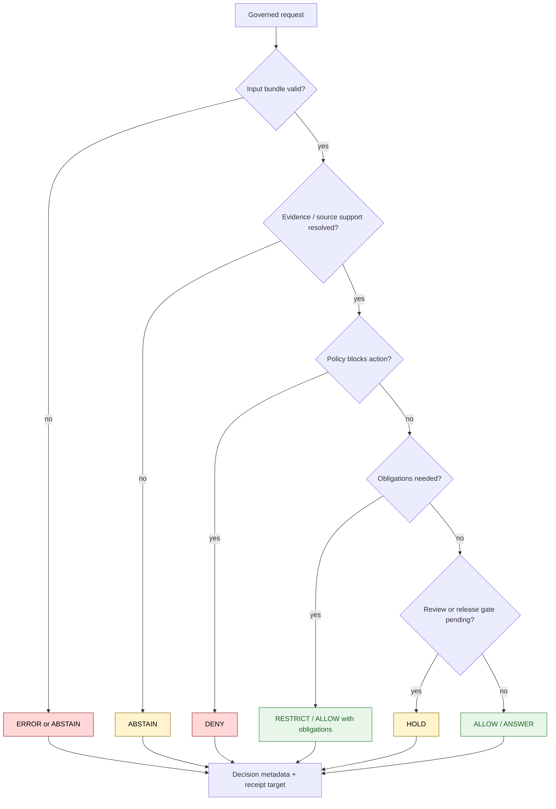

<!-- [KFM_META_BLOCK_V2]
doc_id: kfm://policy/decision
title: Decision Policy README
type: policy-readme
version: v0.1
status: draft
owners: OWNER_TBD — Policy steward · Runtime steward · Governance steward · API steward · Docs steward
created: 2026-06-15
updated: 2026-06-15
policy_label: restricted
related:
  - ../README.md
  - ../bundles/README.md
  - ../data/README.md
  - ../../packages/policy-runtime/README.md
  - ../../packages/policy-runtime/src/policy_runtime/README.md
  - ../../docs/adr/ADR-0020-abstain-is-a-first-class-decision.md
  - ../../docs/registers/POLICY_GATE.md
  - ../../docs/doctrine/trust-membrane.md
  - ../../docs/doctrine/truth-posture.md
  - ../../docs/doctrine/directory-rules.md
  - ../../schemas/contracts/v1/
  - ../../contracts/
tags: [kfm, policy, decision, finite-outcomes, abstain, deny, restrict, hold, error, obligations]
notes:
  - "Initial README for policy/decision."
  - "This path is for policy decision vocabulary and decision-gate posture, not runtime helper implementation or schema authority."
  - "Decision shape belongs in schemas/contracts/v1/ and semantic meaning belongs in contracts/ where accepted."
  - "Runtime enforcement, fixtures, tests, reason-code registers, and bundle registration remain NEEDS VERIFICATION."
[/KFM_META_BLOCK_V2] -->

<a id="top"></a>

<div align="center">

# Decision Policy

`policy/decision/`

**Policy lane for finite decision outcomes, reason-code posture, obligations, and fail-safe handling across KFM governed gates.**


[Scope](#1-scope) · [Repo fit](#2-repo-fit) · [Boundary](#3-authority-boundary) · [Inputs](#5-inputs) · [Outcomes](#7-decision-vocabulary) · [Diagram](#8-diagram) · [Definition of done](#14-definition-of-done)

</div>

---

> [!IMPORTANT]
> **Status:** draft / `NEEDS VERIFICATION`  
> **Owners:** `OWNER_TBD` — Policy steward · Runtime steward · Governance steward · API steward · Docs steward  
> **Path:** `policy/decision/README.md`  
> **Responsibility root:** `policy/` — policy-as-code and policy documentation  
> **Truth posture:** CONFIRMED file path / PROPOSED decision-policy lane / UNKNOWN runtime enforcement

> [!CAUTION]
> A decision outcome is not truth by itself. `ALLOW` or `ANSWER` still depends on evidence, source authority, rights, sensitivity, validation, review, release state, receipts, and rollback support where applicable.

---

## Quick jump

- [1. Scope](#1-scope)
- [2. Repo fit](#2-repo-fit)
- [3. Authority boundary](#3-authority-boundary)
- [4. Default posture](#4-default-posture)
- [5. Inputs](#5-inputs)
- [6. Exclusions](#6-exclusions)
- [7. Decision vocabulary](#7-decision-vocabulary)
- [8. Diagram](#8-diagram)
- [9. Reason-code expectations](#9-reason-code-expectations)
- [10. Obligations](#10-obligations)
- [11. Composition posture](#11-composition-posture)
- [12. Inspection path](#12-inspection-path)
- [13. Validation expectations](#13-validation-expectations)
- [14. Definition of done](#14-definition-of-done)
- [15. Open verification items](#15-open-verification-items)

---

## 1. Scope

`policy/decision/` is a proposed policy lane for finite decision outcomes and decision-gate behavior.

It should describe and eventually bind how policy gates name outcomes, reason codes, obligations, next steps, receipt expectations, and fail-safe behavior across KFM governed workflows.

In scope:

- finite decision vocabulary for policy gates
- reason-code posture and stability expectations
- obligations such as redaction, generalization, review-required, delayed release, citation-required, and rollback-required
- abstain / deny / error boundary rules
- composition rules when multiple gates return outcomes
- receipt-ready decision metadata expectations
- public-surface handling through governed interfaces

Out of scope:

- JSON Schema definitions
- semantic contract text
- runtime helper implementation
- release approval
- lifecycle data storage
- receipt or proof storage
- public UI implementation
- model-generated truth claims

[Back to top](#top)

---

## 2. Repo fit

| Concern | Owning root | Expected relationship |
|---|---|---|
| Decision policy posture | `policy/decision/` | This README; active policy files remain `NEEDS VERIFICATION` |
| Policy bundles | `policy/bundles/` | Bundle packaging or manifest lane when used |
| Runtime evaluation helpers | `packages/policy-runtime/` | Helper code only; not policy authority |
| Decision schemas | `schemas/contracts/v1/` | Machine-readable decision envelope and policy decision shapes when present |
| Decision contracts | `contracts/` | Semantic meaning and obligations when present |
| Reason-code register | `docs/registers/POLICY_GATE.md` or verified register home | Stable codes remain `NEEDS VERIFICATION` |
| Receipts and proofs | `data/receipts/`, `data/proofs/`, or verified homes | Stored trust artifacts; exact homes `NEEDS VERIFICATION` |
| Public trust membrane | `apps/governed-api/` | Public clients receive governed envelopes only |

## 3. Authority boundary

This lane may define policy posture for decisions. It must not implement the policy runtime, own the machine schema, store receipts, or approve release.

```text
policy/decision/       = decision vocabulary and gate posture
policy/bundles/        = reviewed policy bundle artifacts and manifests
packages/policy-runtime/ = evaluator helper code
schemas/contracts/v1/   = machine-readable decision shapes
contracts/             = semantic meaning and obligations
release/               = publication, correction, rollback authority
data/                  = receipts, proofs, lifecycle artifacts
apps/governed-api/     = public trust membrane
```

## 4. Default posture

Decision policy should prefer bounded finite outcomes over free-text statuses.

A gate should return `ABSTAIN`, `DENY`, `HOLD`, or `ERROR` rather than inventing a new status when any of these are unresolved:

- evidence support
- source authority
- rights posture
- sensitivity posture
- release state
- role or access state
- policy bundle status
- schema validation
- reason-code mapping
- receipt or proof target
- runtime trust

## 5. Inputs

| Input family | Examples | Required posture |
|---|---|---|
| Gate context | gate id, operation, audience, lifecycle stage, object ref | Explicit and auditable |
| Policy input | PolicyInputBundle, bundle ref, bundle hash, policy version | Supplied by caller; not inferred from memory |
| Evidence context | EvidenceRef, EvidenceBundle status, citation validation | Required for claim-bearing answers |
| Rights context | license posture, reuse limits, attribution obligations | Required for release or render decisions |
| Sensitivity context | geoprivacy, living-person, protected ecology, archaeology, infrastructure, cultural flags | Fail closed when unresolved |
| Runtime context | evaluator profile, timeout, engine result, validation status | Recorded for replay |
| Receipt context | receipt id, input hash, decision hash, reason codes, next steps | Required for consequential decisions |

## 6. Exclusions

| Does not belong here | Correct home |
|---|---|
| Decision JSON Schemas | `schemas/contracts/v1/` |
| Decision semantic contracts | `contracts/` |
| Runtime evaluator implementation | `packages/policy-runtime/` |
| Policy bundle artifacts | `policy/bundles/` |
| Stored receipts and proofs | `data/receipts/`, `data/proofs/`, or verified homes |
| Release manifests and rollback authority | `release/` |
| Public API routes or UI components | `apps/` and governed UI packages |
| Lifecycle data | `data/` lifecycle roots |
| Free-text decision folklore | Replace with finite vocabulary plus reason codes |

## 7. Decision vocabulary

KFM uses finite outcomes. Exact enum shape may differ by envelope family, but policy gates should keep outcomes bounded and mappable.

| Decision | Use when | Required behavior |
|---|---|---|
| `ALLOW` / `ANSWER` | The scoped action or answer is policy-passed under supplied context | Preserve evidence, obligations, and scope |
| `DENY` | Policy blocks the action or access | Return safe reason code; do not expose protected details |
| `RESTRICT` | Action may proceed only with redaction, generalization, audience, delay, or review constraints | Preserve obligations for downstream enforcement |
| `HOLD` | Steward review, validation, receipt, proof, maturity, or release gate is pending | Do not publish or render publicly |
| `ABSTAIN` | Support is insufficient to produce a cited, policy-passed result | Preserve unresolved handles and next steps |
| `ERROR` | Governance machinery, evaluator, schema, or runtime failed | Fail closed and record failure |

> [!IMPORTANT]
> Avoid inventing `pending`, `partial`, `maybe`, `low_confidence`, or `best_effort` as finite outcomes. Use a bounded outcome plus reason codes, obligations, and scope narrowing.

## 8. Diagram



## 9. Reason-code expectations

Reason codes should be stable, public-safe, and replayable.

| Requirement | Why it matters |
|---|---|
| Stable code names | Allows metrics, receipts, and regression tests to remain comparable |
| Safe wording | Avoids leaking sensitive locations, identities, or source secrets |
| Append-only preference | Prevents old receipts from becoming unreadable |
| Gate-specific mapping | Keeps `DENY`, `ABSTAIN`, `HOLD`, and `ERROR` boundaries consistent |
| Human-readable explanation | Lets public and review surfaces explain outcomes without overclaiming |
| Steward next step | Helps resolve evidence, rights, sensitivity, source, or review gaps |

## 10. Obligations

Policy decisions may carry obligations that downstream systems must preserve.

| Obligation | Example effect |
|---|---|
| `redact` | Withhold field, geometry, relation, or claim detail |
| `generalize` | Lower location precision or attribute detail |
| `restrict_audience` | Limit to steward, reviewer, or authenticated surface |
| `review_required` | Route to steward or policy review |
| `citation_required` | Require evidence/citation display where safe |
| `delay_release` | Defer exposure until a condition or date |
| `rollback_required` | Require rollback target before release-adjacent action |
| `receipt_required` | Require receipt or proof metadata for replay |

## 11. Composition posture

When multiple gates evaluate one request, the final outcome should preserve the most protective decision and all safe obligations.

Recommended severity order:

```text
ERROR > DENY > HOLD > ABSTAIN > RESTRICT > ALLOW / ANSWER
```

This order is PROPOSED for this policy lane and must be reconciled with ADR-0020 and any runtime envelope schemas before implementation.

## 12. Inspection path

Decision-policy modules, reason-code registers, schemas, fixtures, tests, validators, and CI remain `NEEDS VERIFICATION`.

```bash
find policy/decision -maxdepth 4 -type f | sort
find policy docs/registers schemas/contracts/v1 contracts -maxdepth 4 -type f | grep -Ei 'decision|outcome|reason|envelope|policy_gate' | sort
find tests fixtures -maxdepth 5 -type f 2>/dev/null | grep -E 'decision|outcome|reason|policy|abstain|deny' | sort
```

## 13. Validation expectations

Useful validation for this lane should cover:

- every gate returns a finite outcome
- unsupported evidence returns `ABSTAIN`, not a generated answer
- unauthorized or forbidden action returns `DENY`
- evaluator failure returns `ERROR`
- pending review returns `HOLD`
- redaction/generalization produces obligations, not silent mutation
- reason codes are stable and public-safe
- public clients receive decisions through governed APIs only
- receipts preserve input hash, decision hash, reason codes, obligations, and unresolved handles where safe

## 14. Definition of done

- [ ] Owners are confirmed and `OWNER_TBD` is replaced.
- [ ] Accepted decision vocabulary is reconciled across policy, runtime envelopes, and ADR-0020.
- [ ] Reason-code register home is confirmed.
- [ ] Decision schemas and contracts are linked.
- [ ] Runtime policy language and bundle location are confirmed.
- [ ] Fixtures cover allow, deny, restrict, hold, abstain, and error outcomes.
- [ ] Composition order is accepted or revised by ADR.
- [ ] Receipt metadata requirements are implemented or linked.
- [ ] Public API and UI handling is validated through governed interfaces.

## 15. Open verification items

| Item | Why it matters |
|---|---|
| Confirm exact outcome enum by envelope family | Prevents `ALLOW` / `ANSWER` drift |
| Confirm whether `HOLD` is a policy outcome, operational state, or both | Prevents status-axis collapse |
| Confirm reason-code register path | Required for stable receipts and metrics |
| Confirm schemas and contracts | Required for machine-checkable decisions |
| Confirm tests and fixtures | Required before active enforcement |
| Confirm metrics and observability expectations | Required for drift detection |
| Confirm composition order | Prevents inconsistent multi-gate behavior |
| Confirm public-surface rendering rules | Prevents trust-membrane bypass |

<details>
<summary>Appendix A — no-loss preservation note</summary>

The target file was an empty placeholder. This README adds a bounded decision-policy lane without claiming runtime enforcement, policy modules, tests, fixtures, reason-code register implementation, schema coverage, metrics, or CI coverage.

It preserves the project posture that abstention is a first-class governed result and that policy decisions remain subordinate to evidence, rights, sensitivity, review, release, receipts, and rollback where applicable.

</details>

## Status summary

`policy/decision/` should define finite decision policy posture only if this policy lane is accepted.

It should keep KFM decisions bounded, auditable, reason-coded, obligation-preserving, receipt-ready, and routed through governed interfaces without becoming schema authority, runtime implementation, release authority, or truth source.

<p align="right"><a href="#top">Back to top</a></p>
