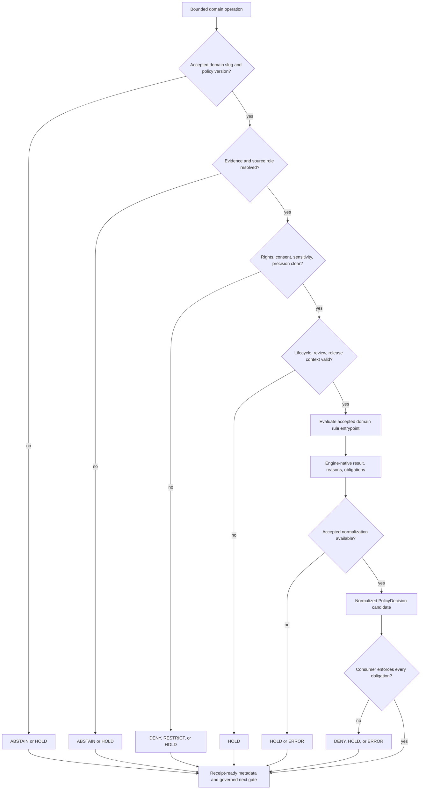

<!-- [KFM_META_BLOCK_V2]
doc_id: kfm://policy/domains
title: Domain Policy README
type: readme; directory-readme; nested-policy-index
version: v0.2
status: draft; repository-grounded; mixed-maturity; evaluator-unbound; non-release; non-publication
owners: NEEDS VERIFICATION — CODEOWNERS routes /policy/ to @bartytime4life; accepted policy/domain stewardship and independent approval controls were not established
created: 2026-06-15
updated: 2026-07-23
policy_label: restricted
current_path: policy/domains/README.md
owning_root: policy/
base_commit: 1f093dfc7295f0c2e63c89c3573061ad08698a88
prior_blob: 1d9908cb1b82308a20a50b6dbf167c3a7acc980a
truth_posture: >
  CONFIRMED same-path target, singular policy root, all 13 canonical domain-policy README paths,
  11 short greenfield scaffolds, 2 substantive domain-policy drafts, nonempty but mostly stubbed
  domain Rego source, 13 domain readiness workflows, CODEOWNERS routing, human domain register,
  and empty machine domain register / PROPOSED domain-policy parent contract, decision normalization,
  child-lane requirements, validation model, and implementation sequence / CONFLICTED human versus
  machine domain inventory, air versus atmosphere slug surfaces, and engine-native versus outward
  decision vocabularies / UNKNOWN accepted evaluator, active bundle, complete input profile, native
  policy tests, decision receipts, governed consumers, required-check status, release integration,
  and rollback execution.
related:
  - ../README.md
  - ../bundles/README.md
  - ../data/README.md
  - ../decision/README.md
  - ../../docs/doctrine/directory-rules.md
  - ../../docs/domains/README.md
  - ../../docs/registers/DOMAIN_LANE.md
  - ../../control_plane/domain_lane_register.yaml
  - ../../contracts/domains/
  - ../../schemas/contracts/v1/domains/
  - ../../packages/domains/README.md
  - ../../packages/policy-runtime/README.md
  - ../../tools/validators/policy/README.md
  - ../../tests/README.md
  - ../../.github/CODEOWNERS
notes:
  - "Same-path modernization of the v0.1 README; no policy behavior, bundle activation, lifecycle state, release decision, or publication state changes."
  - "Directory Rules §12 places domain policy under policy/domains/<lane>/; §15 governs this folder README's first twelve sections."
  - "Static badges summarize inspected repository state only; they are not CI, approval, maturity, release, or publication proof."
[/KFM_META_BLOCK_V2] -->

<a id="top"></a>

# Domain Policy

> **One-line purpose.** `policy/domains/` is KFM's domain-specific admissibility lane: it organizes reviewed policy source and policy-boundary documentation for accepted domain slugs without becoming domain truth, machine shape, evidence, lifecycle storage, runtime implementation, release approval, or publication authority.

[](#status)
[](#domain-lane-inventory)
[](#status)
[](../../control_plane/domain_lane_register.yaml)
[](#status)
[](#authority-level)
[](#last-reviewed)

> [!IMPORTANT]
> **Safe current conclusion:** the domain-policy lane exists, all 13 Directory Rules domain segments have README files, and domain-specific Rego source is nonempty. Current repository evidence does **not** establish an accepted evaluator, active bundle, complete input contract, native policy-test suite, decision-receipt flow, governed production consumer, release-gate integration, or publication enforcement.

> [!CAUTION]
> Policy can constrain a bounded operation; it cannot create evidence, infer consent, clear rights by assertion, downgrade sensitivity, promote lifecycle state, approve release, make generated language authoritative, or turn a path, commit, pull request, badge, map, tile, or workflow into public truth.

> [!WARNING]
> The human [`DOMAIN_LANE.md`](../../docs/registers/DOMAIN_LANE.md) register lists 13 canonical lanes, while [`control_plane/domain_lane_register.yaml`](../../control_plane/domain_lane_register.yaml) currently contains `entries: []`. Treat lane registration as **CONFLICTED**, not synchronized or enforceable.

**Quick navigation:** [Purpose](#purpose) · [Authority](#authority-level) · [Status](#status) · [Belongs](#what-belongs-here) · [Exclusions](#what-does-not-belong-here) · [Inputs](#inputs) · [Outputs](#outputs) · [Validation](#validation) · [Review](#review-burden) · [Related](#related-folders) · [ADRs](#adrs) · [Last reviewed](#last-reviewed) · [Inventory](#domain-lane-inventory) · [Decisions](#policy-decision-model) · [Obligations](#obligations-and-cross-domain-composition) · [Child lanes](#child-lane-contract) · [Trust membrane](#trust-membrane-and-lifecycle) · [Done](#definition-of-done) · [Open verification](#open-verification-register)

---

<a id="1-scope"></a>

## Purpose

`policy/domains/` owns the **domain-specific portion of KFM admissibility policy**. It answers bounded gate questions whose answer depends on a recognized domain's source roles, evidence support, rights, consent, sensitivity, spatial precision, temporal scope, lifecycle state, review state, release context, or cross-domain exposure risk.

Typical questions include:

- may this domain object be rendered, exported, summarized, joined, reviewed, or considered for release;
- must geometry, attributes, relations, or citations be redacted, generalized, aggregated, delayed, audience-restricted, or withheld;
- is the source role sufficient for the requested claim or operation;
- are evidence, rights, consent, sensitivity, validation, review, release, correction, and rollback prerequisites present;
- does a cross-domain join create a stricter obligation than either input carries alone;
- must the candidate remain in `WORK`, enter `QUARANTINE`, or return an abstention, hold, restriction, denial, or error.

A domain policy file belongs here because its primary responsibility is **admissibility for one accepted domain lane**, not merely because it mentions a domain.

[Back to top](#top)

---

<a id="2-repo-fit"></a>
<a id="3-authority-boundary"></a>

## Authority level

**Canonical-by-placement domain policy lane under the singular `policy/` responsibility root; mixed implementation maturity; this README is a documentation and navigation surface, not an executable decision or release authority.**

Directory Rules §12 places domain-specific policy at `policy/domains/<lane>/`. Directory Rules §15 governs this folder README. The lane may contain reviewed policy source and policy documentation, but it must remain subordinate to the surfaces that own meaning, shape, evidence, lifecycle, runtime evaluation, and release.

| Concern | Owning surface | `policy/domains/` relationship |
|---|---|---|
| Canonical domain-lane identity | reviewed decisions, [Directory Rules §12](../../docs/doctrine/directory-rules.md#12-domain-placement-law), and synchronized registers | Consume the accepted slug; do not create or rename a lane through file presence. |
| Domain scope and explanatory doctrine | [`docs/domains/`](../../docs/domains/README.md) | Link and summarize; do not redefine domain truth. |
| Domain object meaning | `contracts/domains/<lane>/` | Consume reviewed semantics; do not host semantic authority. |
| Domain machine shape | `schemas/contracts/v1/domains/<lane>/` | Require accepted shapes; do not host `.schema.json` authority. |
| Domain admissibility source | `policy/domains/<lane>/` | Own reviewed domain-specific rules and their local boundary documentation. |
| Cross-domain/general policy | the lowest common segment under `policy/` | Do not force a shared rule into an arbitrary domain. |
| Evaluation mechanics | [`packages/policy-runtime/`](../../packages/policy-runtime/README.md) or another accepted evaluator | Supply accepted rules; do not place reusable evaluator code here. |
| Validation and proof | `tests/`, `fixtures/`, and [`tools/validators/policy/`](../../tools/validators/policy/README.md) | Link to representative proof; passing checks are not a policy decision instance. |
| Lifecycle material | `data/<phase>/<lane>/`, receipts, proofs, and registries | Evaluate supplied references; never store source payloads or emitted trust objects here. |
| Release, correction, rollback | `release/` | Supply required policy context; never approve, publish, correct, or roll back by itself. |
| Public enforcement | governed APIs and released/public-safe artifacts | Consumers enforce obligations; browsers and maps do not select policy source directly. |

> [!NOTE]
> The extra `policy/domains/air/` README is currently a compatibility guardrail that redirects new work toward `atmosphere`. It must not evolve into parallel policy authority while the slug decision remains unresolved.

[Back to top](#top)

---

<a id="4-default-posture"></a>

## Status

### Repository-grounded snapshot

| Surface | Current evidence at `main@1f093dfc…` | Safe conclusion |
|---|---|---|
| Parent README | **CONFIRMED** v0.1 baseline, blob `1d9908c…` | Same-path v0.2 modernization. |
| Canonical policy root | **CONFIRMED** singular `policy/` root | Domain policy belongs under this lane unless an accepted ADR changes the split. |
| Canonical domain README paths | **CONFIRMED 13/13 present** | Path coverage exists; file presence does not establish executable policy. |
| Child README maturity | **CONFIRMED 11 short greenfield scaffolds + 2 substantive drafts** | Documentation and policy maturity are mixed. |
| Compatibility slug | **CONFIRMED `air/` README present** | Documentation-only redirect toward `atmosphere`; accepted slug/migration decision remains open. |
| Domain Rego source | **CONFIRMED nonempty** | Common `deny_unpublished` and `abstain_on_ambiguous` files are explicitly marked greenfield stubs; specialized source in selected lanes remains unaccepted and evaluator-unbound. |
| Common stub semantics | **CONFIRMED examples use `default deny := false` and commented rule bodies** | Filename intent is not executable fail-closed behavior; no readiness claim is justified. |
| Domain workflows | **CONFIRMED 13 workflow definitions** | They are bounded readiness/hold surfaces, not domain-policy evaluation, evidence closure, release proof, or publication. |
| Human lane register | **CONFIRMED draft lists 13 lanes** | Useful narrative index; not machine enforcement. |
| Machine lane register | **CONFIRMED present with `entries: []`** | Human/machine registration is `CONFLICTED`. |
| CODEOWNERS | **CONFIRMED `/policy/` routes to `@bartytime4life`** | Review routing exists; stewardship, required review, and separation of duties remain unproved. |
| Evaluator, active bundle, complete input profile, native tests, receipts, governed consumers, release integration | **UNKNOWN / NEEDS VERIFICATION** | No complete governed domain-policy flow was established. |

### Default posture

Domain policy must fail closed when material context is missing, stale, conflicted, untrusted, or outside the evaluator's accepted scope. Depending on the accepted contract, that may require `DENY`, `RESTRICT`, `HOLD`, `ABSTAIN`, or `ERROR`; it must never silently fall back to allow.

Unresolved exact archaeology, sacred/cultural material, rare-species or rare-plant locations, living-person or DNA/genomic detail, private person-parcel joins, critical-infrastructure detail, harmful spatial precision, and unclear source rights require the stricter safe path: quarantine, redaction, generalization, aggregation, staged access, delay, review, abstention, hold, or denial.

[Back to top](#top)

---

## What belongs here

- the parent README and accepted child `policy/domains/<lane>/README.md` boundary documents;
- reviewed, domain-specific Rego, OPA-compatible, or equivalent declarative policy source;
- domain rules for source-role sufficiency, evidence closure, rights, consent, sensitivity, precision, public exposure, stale state, review, and release prerequisites;
- domain-specific rule package names, entrypoints, versions, safe reason codes, obligations, effective times, and supersession notes;
- policy source for redaction, generalization, aggregation, audience restriction, delay, quarantine, or review requirements when those requirements are domain-specific;
- domain-specific cross-lane composition rules when one domain clearly owns the stricter policy concern;
- links to paired contracts, schemas, fixtures, tests, validators, bundle membership, evaluator profiles, receipts, consumers, release gates, correction paths, and rollback targets;
- synthetic or public-safe native policy tests only after the repository accepts a colocation convention.

A policy module is not active merely because it is syntactically valid or stored here.

[Back to top](#top)

---

<a id="6-exclusions"></a>

## What does NOT belong here

| Do not put this in `policy/domains/` | Correct responsibility |
|---|---|
| Domain doctrine, scope narratives, architecture, or source guides | `docs/domains/<lane>/` |
| Semantic object definitions | `contracts/domains/<lane>/` |
| JSON Schema, DTO, enum, or field shape | `schemas/contracts/v1/domains/<lane>/` |
| Shared policy that is not owned by one domain | the lowest common policy segment, such as `policy/sensitivity/`, `policy/rights/`, `policy/evidence/`, or another reviewed home |
| Source payloads, credentials, registry instances, or real protected data | connectors, secret stores, and accepted `data/registry/` or lifecycle lanes |
| EvidenceBundles, citations, proofs, receipts, reviews, validation reports, or decisions emitted at runtime | accepted evidence, receipt, proof, review, report, or lifecycle roots |
| RAW through PUBLISHED material | `data/<phase>/<lane>/` |
| Evaluator, adapter, CLI, server, or reusable runtime code | `packages/`, `apps/`, `runtime/`, or `tools/` by responsibility |
| Generic fixtures and tests | `fixtures/` and `tests/` |
| Release manifests, approvals, rollback cards, corrections, or withdrawals | `release/` |
| Public API routes, MapLibre logic, UI components, exports, or AI responses | governed application and runtime roots |
| Real exact sensitive locations, living-person records, DNA/genomic content, consent tokens, or restricted source excerpts | denied; use synthetic, redacted, generalized, or reference-only fixtures |
| A topic folder that is not an accepted domain slug | no path until the lane decision and placement are reviewed |
| A second independently evolving alias such as `air/` alongside `atmosphere/` | compatibility guardrail only until an accepted migration or naming decision |
| Generated language presented as a policy grant, approval, or release decision | governed human and machine review |

[Back to top](#top)

---

<a id="5-inputs"></a>

## Inputs

A domain policy evaluation must receive an explicit, versioned, bounded input. It must not silently fetch missing facts from canonical or internal stores.

| Input family | Minimum governed context | Fail-closed trigger |
|---|---|---|
| Domain identity | accepted lane slug, object family, sublane, policy version, relevant owner/reviewer class | unknown, alias-only, or unsynchronized slug |
| Operation | render, export, transform, join, review, release-candidate check, correction, rollback; stable request/candidate ID | missing or overly broad capability |
| Actor and audience | caller/service class, purpose, public/restricted/steward audience | missing identity where access differs |
| Spatial and temporal scope | requested precision, place/time bounds, source time, valid time, freshness | harmful precision, stale support, or scope mismatch |
| Evidence | `EvidenceRef` and `EvidenceBundle` status, citations, validation and conflict state | unresolved support for a consequential claim |
| Source | `SourceDescriptor` reference, source role, authority, provenance, terms, cadence | unclear role, rights, terms, or freshness |
| Rights, consent, sensitivity | license/terms, consent applicability or revocation, classification, sovereignty/cultural flags, transforms | unknown, expired, revoked, or unsupported posture |
| Lifecycle, review, release | current/requested phase, validation/proof refs, review state, release/correction/rollback refs | skipped phase, missing review, or public exposure without release support |
| Policy execution | bundle ID/version/digest, evaluator profile/version, entrypoint, normalized input hash | unaccepted, ambiguous, or non-replayable evaluator context |
| Cross-domain composition | participating lanes, inherited obligations, join-induced sensitivity, output audience | less restrictive output than any input permits |

The current repository does not establish a complete accepted domain-policy input profile. Shape validity alone is not policy readiness.

[Back to top](#top)

---

## Outputs

A domain policy evaluation may emit:

- an engine-native result with stable package, entrypoint, rule version, reason codes, and obligations;
- a normalized `PolicyDecision` candidate conforming to the accepted outward contract;
- safe public reasons and separately governed reviewer detail;
- redaction, generalization, aggregation, audience, citation, delay, review, quarantine, correction, or rollback obligations;
- bundle/evaluator identity, input hash, evaluated references, effective/expiry time, and receipt-ready replay metadata;
- an explicit readiness hold when prerequisites are absent.

It must not emit source truth, an `EvidenceBundle`, a lifecycle promotion, a release approval, a publication state, or an unsafe protected detail. Obligations that cannot be enforced downstream must cause a hold, denial, abstention, or error rather than a permissive result.

[Back to top](#top)

---

<a id="12-inspection-path"></a>
<a id="13-validation-expectations"></a>

## Validation

### Current validation surfaces

| Surface | What it currently supports | What it does not prove |
|---|---|---|
| [`policy-test`](../../.github/workflows/policy-test.yml) | Policy-root readiness checks and explicit holds | Any domain rule was evaluated or accepted. |
| Domain workflows, represented by [`domain-hydrology.yml`](../../.github/workflows/domain-hydrology.yml) | Required path checks, placeholder detection, parse/static checks, and `WORKFLOW_HOLD` reporting | Domain truth, policy approval, source admission, evidence closure, release readiness, or publication. |
| [`policy-boundary-guards`](../../.github/workflows/policy-boundary-guards.yml) | Selected static, structural, and API trust-membrane boundaries | Domain bundle evaluation or full rule coverage. |
| Canonical schemas and fixtures | Selected machine-shape polarity | Correct policy semantics, rights, sensitivity, obligations, or reviewer decisions. |
| Child README and source inventory | Findability and drift visibility | Executable behavior, package compatibility, bundle membership, or consumer enforcement. |

### Required validation before a domain policy can be treated as active

1. Accepted domain slug and synchronized human/machine registration.
2. Accepted semantic contract, machine schema, evaluator version, bundle manifest, selector, and package/entrypoint naming.
3. Complete operation-specific input profile with fail-closed unknown handling.
4. Positive, negative, ambiguous, stale, restricted, cross-domain, correction, expiry, and evaluator-failure fixtures using synthetic or public-safe data.
5. Native policy tests plus normalization tests for outward decisions, reason codes, and obligations.
6. Deterministic no-network command wired to trusted CI without write, publish, deploy, or secret-bearing side effects.
7. Governed consumer enforcement, including rejection when obligations are not applied.
8. Decision receipts and replay support binding input hash, bundle digest, evaluator version, reasons, obligations, and effective time.
9. Release-gate and rollback tests proving policy is necessary but not sufficient for publication.
10. Observed required-check success and review controls appropriate to the risk.

### Semantic checks for this README

- one H1 and the Directory Rules §15 H2 order;
- all internal fragments, relative links, badge destinations, tables, alerts, code fences, HTML anchors, and Mermaid syntax resolve;
- every canonical lane appears exactly once in the inventory;
- the `air` compatibility lane is visibly non-canonical;
- no status, owner, evaluator, bundle, test, release, or publication claim outruns inspected evidence;
- the trust membrane, lifecycle law, cite-or-abstain posture, correction path, and rollback boundary remain explicit.

[Back to top](#top)

---

## Review burden

[`CODEOWNERS`](../../.github/CODEOWNERS) routes `/policy/` changes to `@bartytime4life`. That is GitHub review routing, not an accepted stewardship assignment, `ReviewRecord`, `PolicyDecision`, release approval, or proof that independent review occurred.

| Change class | Minimum review posture |
|---|---|
| README-only clarification | Policy-aware maintainer plus docs review. |
| Domain rule or package/entrypoint change | Policy steward, affected domain owner, and validation reviewer. |
| Rights, consent, living-person, DNA/genomic, cultural/archaeology, rare-species, rare-plant, infrastructure, harmful precision | Relevant specialist plus policy, privacy/security, source/rights, and release review; fail closed without verified ownership. |
| Cross-domain composition | Policy owners for every affected lane plus evidence, sensitivity, and consumer review. |
| Bundle, selector, signing, evaluator activation | Policy-runtime, supply-chain/security, validation, operations, and release review. |
| Outcome normalization or obligations | Policy, contracts, schemas, validator/test, runtime consumer, and API/UI review. |
| Promotion, release, correction, withdrawal, rollback | Policy plus release, evidence/proof, operations, and separation-of-duties review where required. |
| Domain-lane add, rename, merge, retirement, or alias resolution | ADR-class governance review with migration, compatibility, register, and rollback work. |

Accepted role assignments, required-review rules, branch protection, and independent approval controls remain **NEEDS VERIFICATION**.

[Back to top](#top)

---

## Related folders

| Surface | Relationship |
|---|---|
| [`policy/`](../README.md) | Canonical policy root and shared admissibility boundary. |
| [`policy/bundles/`](../bundles/README.md) | Future accepted bundle source/manifest boundary; current root evidence says README-only. |
| [`policy/data/`](../data/README.md) | Data-policy family distinct from lifecycle data. |
| [`policy/decision/`](../decision/README.md) | Decision-policy family and normalization context. |
| [`docs/domains/`](../../docs/domains/README.md) | Human-facing domain scope and documentation index. |
| [`docs/registers/DOMAIN_LANE.md`](../../docs/registers/DOMAIN_LANE.md) | Human domain-lane inventory. |
| [`control_plane/domain_lane_register.yaml`](../../control_plane/domain_lane_register.yaml) | Machine lane register; currently empty and conflicted with the human register. |
| `contracts/domains/` | Domain semantic meaning. |
| `schemas/contracts/v1/domains/` | Domain machine shape. |
| [`packages/domains/`](../../packages/domains/README.md) | Reusable domain helper code; not policy authority. |
| [`packages/policy-runtime/`](../../packages/policy-runtime/README.md) | Proposed evaluator helper; current root evidence identifies it as a placeholder. |
| [`tools/validators/policy/`](../../tools/validators/policy/README.md) | Policy-validator routing; current root evidence identifies it as README-only. |
| [`tests/`](../../tests/README.md) and `fixtures/domains/` | Representative enforceability evidence and safe examples. |
| `data/registry/`, `data/receipts/`, `data/proofs/` | Source context, process memory, and proof support. |
| `release/` | Promotion, release, correction, withdrawal, and rollback authority. |
| [Directory Rules](../../docs/doctrine/directory-rules.md) | Placement, domain-lane law, anti-drift rules, and README contract. |
| [`CODEOWNERS`](../../.github/CODEOWNERS) | Review routing only. |

[Back to top](#top)

---

## ADRs

| Decision surface | Current status | Relevance |
|---|---:|---|
| [`ADR-0003 — policy/ singular is canonical`](../../docs/adr/ADR-0003-policy-singular-is-canonical-%28policies-is-compatibility%29.md) | **PROPOSED** | Singular root and plural compatibility treatment. |
| [`ADR-0001 — schema home`](../../docs/adr/ADR-0001-schema-home--schemas-contracts-v1-is-canonical.md) | **PROPOSED** | Domain policy schema placement remains under canonical `schemas/`. |
| [`ADR-0002 — contracts vs schemas`](../../docs/adr/ADR-0002-contracts-vs-schemas-split.md) | **DRAFT** | Meaning/shape separation. |
| [`ADR-0020 — abstain is first class`](../../docs/adr/ADR-0020-abstain-is-a-first-class-decision.md) | **PROPOSED** | Outward abstention semantics and normalization pressure. |
| Domain-lane add, rename, merge, retirement | **ADR required by Directory Rules** | Prevents topic-as-folder drift and unsynchronized lane identity. |
| `air` versus `atmosphere` compatibility/migration | **NO ACCEPTED DECISION VERIFIED** | Prevents parallel domain-policy authority and ambiguous bundle selection. |
| Evaluator, bundle, native-result normalization, reason/obligation registries | **NO ACCEPTED DECISION VERIFIED** | Required before policy source can become an active governed flow. |

This README records open decisions. It does not accept an ADR, activate a policy bundle, or create a canonical domain lane through prose.

[Back to top](#top)

---

## Last reviewed

**2026-07-23** against `main@1f093dfc7295f0c2e63c89c3573061ad08698a88`.

Reviewed in this update:

- the complete 340-line prior README and blob `1d9908c…`;
- Directory Rules domain placement, required README order, and review checklist;
- the current policy root README and its evaluator/bundle/readiness boundaries;
- all 13 canonical child domain-policy README paths plus the `air` compatibility README;
- representative common Rego stubs and selected domain-specific policy-source signals;
- the human and machine domain registers;
- CODEOWNERS and the domain-workflow family, including the Hydrology readiness/hold implementation;
- open pull requests and branches overlapping the target path.

Not established: exhaustive descendant inventory, accepted owners, required checks, branch protection, evaluator/bundle activation, native policy tests, complete fixtures, governed consumers, emitted decisions/receipts, release integration, production runtime, or rollback execution.

[Back to top](#top)

---

<a id="7-domain-lanes"></a>

## Domain lane inventory

The canonical lane set below comes from Directory Rules §12 and the human Domain Lane Register. Presence is verified at the pinned base; implementation maturity is not inferred from presence.

| Canonical lane | README at pinned base | Current documentation posture | Policy-source posture |
|---|---:|---|---|
| [`hydrology`](./hydrology/README.md) | CONFIRMED | Short greenfield scaffold | Common stub source surfaced; evaluator unbound. |
| [`soil`](./soil/README.md) | CONFIRMED | Short greenfield scaffold | Common stub source surfaced; evaluator unbound. |
| [`habitat`](./habitat/README.md) | CONFIRMED | Short greenfield scaffold | Common stub source surfaced; evaluator unbound. |
| [`fauna`](./fauna/README.md) | CONFIRMED | Short greenfield scaffold | Common stubs and specialized sensitivity source surfaced; activation unproved. |
| [`flora`](./flora/README.md) | CONFIRMED | Short greenfield scaffold | Common stubs and rights/geoprivacy/sensitivity material surfaced; activation unproved. |
| [`agriculture`](./agriculture/README.md) | CONFIRMED | Substantive repository-grounded draft | Multiple stubs/specialized sources; package/default/outcome conflicts are documented. |
| [`geology`](./geology/README.md) | CONFIRMED | Short greenfield scaffold | Common stubs and rights material surfaced; activation unproved. |
| [`atmosphere`](./atmosphere/README.md) | CONFIRMED | Short greenfield scaffold | Common stub source surfaced; evaluator unbound. |
| [`hazards`](./hazards/README.md) | CONFIRMED | Short greenfield scaffold | Common stubs and referral material surfaced; KFM remains non-alert authority. |
| [`roads-rail-trade`](./roads-rail-trade/README.md) | CONFIRMED | Short greenfield scaffold | Common stub source surfaced; evaluator unbound. |
| [`settlements-infrastructure`](./settlements-infrastructure/README.md) | CONFIRMED | Short greenfield scaffold | Common stubs and infrastructure-redaction source surfaced; activation unproved. |
| [`archaeology`](./archaeology/README.md) | CONFIRMED | Substantive bounded draft | Common stubs and precise-coordinate policy source surfaced; evaluator/release integration unproved. |
| [`people-dna-land`](./people-dna-land/README.md) | CONFIRMED | Short greenfield scaffold | Common stub source surfaced; living-person/DNA exposure must fail closed. |

### Compatibility lane

| Path | Classification | Required behavior |
|---|---|---|
| [`air/`](./air/README.md) | **Compatibility guardrail / CONFLICTED slug** | Redirect new work to `atmosphere`; do not add executable parallel policy, bundle selection, or release behavior until an accepted decision resolves naming and migration. |

> [!NOTE]
> “Common stub source surfaced” means repository files exist and representative examples explicitly identify themselves as greenfield stubs. It does not mean every descendant was exhaustively inspected, every file shares identical bytes, or any rule is accepted, bundled, evaluated, or enforced.

[Back to top](#top)

---

<a id="8-diagram"></a>
<a id="9-decision-vocabulary"></a>

## Policy decision model

KFM currently exposes more than one state vocabulary. Keep the axes separate until an accepted contract defines normalization.

| Axis | Examples | Meaning |
|---|---|---|
| Engine-native domain results | `ALLOW`, `RESTRICT`, `HOLD`, `DENY`, `ABSTAIN`, `ERROR`, or rule relations such as `deny[reason]` | Internal rule semantics; package-specific and not safe to expose without normalization. |
| Current outward `PolicyDecision.outcome` | `ANSWER`, `ABSTAIN`, `DENY`, `ERROR` | Closed schema reported by the policy root README; shape does not prove a working evaluator. |
| Validation | `PASS`, `FAIL`, validator codes | Check result; never policy permission. |
| Workflow readiness | `WORKFLOW_HOLD`, `WORKFLOW_SKIPPED_EXPLICIT` | CI statement that prerequisites are intentionally absent. |
| Lifecycle/release | candidate, held, released, withdrawn, superseded | State-transition vocabulary owned outside this lane. |
| Truth posture | `CONFIRMED`, `PROPOSED`, `UNKNOWN`, `NEEDS VERIFICATION`, `CONFLICTED` | Evidence status; not policy permission. |

> [!CAUTION]
> Do not emit engine-native values directly into an incompatible outward schema, map abstention to denial, map evaluator failure to denial, or interpret a validator pass as release approval. Preserve reasons, obligations, bundle/evaluator identity, input hash, and unresolved state. Without an accepted mapping, return a hold or error rather than inventing one.



[Back to top](#top)

---

<a id="10-domain-policy-obligations"></a>

## Obligations and cross-domain composition

| Obligation | Required effect |
|---|---|
| `redact` | Withhold protected field, relation, geometry, citation detail, or source excerpt. |
| `generalize` | Reduce spatial, temporal, attribute, or relation precision before delivery. |
| `aggregate` | Emit only a reviewed aggregate meeting threshold and disclosure controls. |
| `restrict_audience` | Limit to a verified steward, reviewer, named authority, or authenticated class. |
| `review_required` | Route to the verified specialist or governance role before the next gate. |
| `citation_required` | Require resolvable evidence display where doing so is itself safe. |
| `delay_release` | Defer materialization, release, indexing, cache refresh, or public rendering. |
| `consent_required` | Verify applicable consent and revocation state before processing or exposure. |
| `quarantine_required` | Route unsafe, conflicted, stale, or unresolved material to quarantine. |
| `rollback_required` | Require a valid rollback/correction target before a release-adjacent operation. |
| `safe_reason_only` | Return a public-safe reason while retaining sensitive reviewer detail in a governed channel. |
| `cache_invalidate` | Invalidate outputs affected by expiry, revocation, correction, supersession, or policy change. |

Cross-domain operations must preserve the **most restrictive applicable obligation** unless an accepted policy explicitly documents a safe transform and its receipt. Joining two individually public fields can create sensitive output; absence of a restrictive label on one input is not permission to weaken the other. Client-side hiding, styling, filtering, or map-layer omission is not a security or policy control.

[Back to top](#top)

---

<a id="11-child-lane-contract"></a>

## Child-lane contract

Every material `policy/domains/<lane>/README.md` should state, from verified evidence:

1. accepted lane slug, current path, policy responsibility, and compatibility status;
2. owner/review routing and which role assignments remain unverified;
3. domain docs, semantic contracts, schemas, source descriptors, evidence and lifecycle dependencies;
4. explicit policy scope and non-scope;
5. source-role, evidence, rights, consent, sensitivity, precision, freshness, review, release, correction, and rollback requirements;
6. package/entrypoint/version and default behavior for every material rule;
7. engine-native results, outward normalization, safe reason codes, and enforceable obligations;
8. cross-domain composition and join-induced sensitivity behavior;
9. public API, UI, MapLibre, export, and AI enforcement boundaries;
10. fixtures, native tests, validators, workflow command, bundle membership, evaluator profile, consumer, and receipt/replay support;
11. supersession, expiry, correction, cache invalidation, and rollback behavior;
12. current maturity, conflicts, open verification items, and last-reviewed evidence snapshot.

A child lane must not call itself active, enforced, released, public-safe, or complete until the corresponding rule source, accepted contracts, evaluator/bundle identity, tests, consumers, receipts, reviews, and release gates support that claim.

[Back to top](#top)

---

## Trust membrane and lifecycle

```text
Source and evidence references
  -> explicit domain-policy input
  -> accepted evaluator + pinned bundle
  -> native result + reasons + obligations
  -> normalized PolicyDecision candidate
  -> governed consumer enforcement
  -> validation / review / promotion gates
  -> released public-safe artifact or finite refusal state
```

- Public clients and ordinary UI surfaces use governed APIs and released/public-safe artifacts; they do not read policy source, RAW, WORK, QUARANTINE, candidate, or internal stores directly.
- Domain policy evaluates references and normalized context. It must not secretly retrieve missing facts or treat rendered feature properties as evidence authority.
- Policy is one prerequisite in `RAW -> WORK / QUARANTINE -> PROCESSED -> CATALOG / TRIPLET -> PUBLISHED`; it is not the transition itself.
- Watchers, validators, workflows, maps, AI, commits, and pull requests may propose or test work; none publishes it.
- `EvidenceRef` should resolve to `EvidenceBundle` before a consequential claim is allowed to reach an authoritative surface.
- A policy change affecting released outputs requires supersession/effective-time handling, reevaluation, correction or withdrawal where needed, cache invalidation, and a transparent rollback target.

[Back to top](#top)

---

<a id="14-definition-of-done"></a>

## Definition of done

### Parent lane

- [x] Same-path README and singular policy responsibility verified.
- [x] Directory Rules §12 placement and §15 README contract applied.
- [x] All 13 canonical child README paths inspected at the pinned base.
- [x] `air` compatibility lane surfaced without promoting it to canonical authority.
- [x] Human/machine register conflict made visible.
- [x] Representative source stubs and domain workflows bounded accurately.
- [ ] Accepted domain-policy owners and required-review controls are recorded.
- [ ] Human and machine domain registers are synchronized through governed change.
- [ ] Every child lane is classified by package, entrypoint, source maturity, tests, bundle membership, evaluator, consumer, receipt, release, and rollback support.
- [ ] An accepted native-to-outward decision mapping exists.
- [ ] Cross-domain obligation composition is encoded and tested.
- [ ] A representative end-to-end domain-policy slice emits replayable decisions and proves consumer enforcement.

### Active child policy

A child policy is not done until its accepted slug, scope, source, contracts, schemas, input profile, default behavior, reasons, obligations, fixtures, native tests, normalization, bundle/evaluator identity, governed consumer, receipts, review, correction, and rollback are all reviewable and validated at the required risk level.

[Back to top](#top)

---

<a id="15-open-verification-items"></a>

## Open verification register

| ID | Question | Status |
|---|---|---:|
| DOMPOL-001 | Which decision or machine register is authoritative for the 13-lane inventory, and how will `entries: []` be reconciled? | **CONFLICTED / NEEDS VERIFICATION** |
| DOMPOL-002 | What accepted ADR resolves `air` versus `atmosphere`, alias lifetime, migration, and rollback? | **UNKNOWN** |
| DOMPOL-003 | What is the complete recursive inventory of child policy source, YAML/config, README, tests, fixtures, validators, and duplicates? | **NEEDS VERIFICATION** |
| DOMPOL-004 | Which child sources are pure stubs, specialized proposals, superseded duplicates, or candidates for accepted bundles? | **NEEDS VERIFICATION** |
| DOMPOL-005 | What evaluator version, bundle manifest, selector, signing, activation, and expiry contract are accepted? | **UNKNOWN** |
| DOMPOL-006 | What complete domain-policy input profile is canonical? | **UNKNOWN** |
| DOMPOL-007 | How are `deny[reason]`, native `ALLOW/RESTRICT/HOLD`, and outward `ANSWER/ABSTAIN/DENY/ERROR` normalized without semantic loss? | **CONFLICTED / NEEDS ADR** |
| DOMPOL-008 | Where are reason-code and obligation registries owned, versioned, validated, and enforced? | **UNKNOWN** |
| DOMPOL-009 | Which safe fixtures and native tests prove every sensitive and cross-domain negative case? | **NEEDS VERIFICATION** |
| DOMPOL-010 | Which governed consumer is the first accepted end-to-end domain-policy slice? | **PROPOSED** |
| DOMPOL-011 | What decision-receipt schema, persistence, replay, expiry, and correction contract are accepted? | **UNKNOWN** |
| DOMPOL-012 | Which domain workflows and policy checks are required by branch rules, and how is independent approval enforced? | **UNKNOWN / NEEDS VERIFICATION** |
| DOMPOL-013 | Which release gates require a domain PolicyDecision, bundle digest, receipt, reviewer state, and rollback target? | **UNKNOWN** |
| DOMPOL-014 | What rollback drill proves prior-bundle restoration, stale-decision invalidation, consumer cache invalidation, and correction propagation? | **UNKNOWN** |

[Back to top](#top)

---

<details>
<summary><strong>No-loss and evidence ledger</strong></summary>

| Baseline element | Disposition |
|---|---|
| Stable path, `doc_id`, created date, H1, and domain-policy purpose | **KEEP / CLARIFY** |
| Policy-only authority boundary and exclusions | **KEEP / ENRICH** |
| Repository-fit table | **CONSOLIDATE** into Authority level and Related folders |
| Fail-closed posture | **KEEP / CLARIFY** with current stub/evaluator evidence |
| Inputs matrix | **KEEP / ENRICH** with actor, scope, execution, and cross-domain context |
| Domain lane list | **REPAIR / ENRICH** using verified 13-lane paths plus `air` compatibility classification |
| Mermaid decision flow | **KEEP / ENRICH** with evaluator, normalization, consumer enforcement, and audit stages |
| Native decision vocabulary | **SURFACE CONFLICT** against the current outward schema vocabulary |
| Obligation table | **KEEP / ENRICH** with aggregation, safe reasons, cache invalidation, and composition |
| Child-lane contract | **KEEP / ENRICH** with package, bundle, evaluator, receipt, correction, and rollback requirements |
| Inspection and validation expectations | **REPAIR / ENRICH** using current readiness workflows and explicit proof limits |
| Definition of done and open verification | **KEEP / ENRICH** with repository-grounded closure states |
| No-loss note and status summary | **KEEP / RELOCATE IN DOCUMENT** |

Evidence snapshot: prior target blob `1d9908c…`; Directory Rules blob `2affb08…`; policy root README blob `fa9378a…`; human domain register blob `7cd641d…`; machine domain register blob `81b23be…`; CODEOWNERS blob `dd2a84a…`; representative Hydrology workflow blob `f29f69b…`; directly inspected 13 canonical child READMEs plus the `air` compatibility README.

</details>

## Changelog

| Version | Date | Change | Rollback |
|---|---|---|---|
| v0.1 | 2026-06-15 | Expanded the original short stub into a proposed domain-policy parent contract. | Restore blob `1d9908cb1b82308a20a50b6dbf167c3a7acc980a`. |
| v0.2 | 2026-07-23 | Same-path repository-grounded modernization: Directory Rules section order, verified lane inventory, compatibility classification, source/workflow maturity, decision conflicts, stronger child contract, trust membrane, validation, review, rollback, and open-verification controls. | Before merge, leave or close the draft PR and abandon the branch. After merge, revert the documentation commit; do not rewrite shared history. |

## Status summary

`policy/domains/` is a real domain-policy lane with complete canonical README path coverage and nonempty policy-source scaffolding, but it is not yet a proved domain-policy system. Its safe role is to organize and bound domain-specific admissibility work while keeping evidence, source authority, machine shape, runtime evaluation, lifecycle movement, release, correction, and rollback visible and separate.

Until the lane registers, evaluator, bundles, inputs, tests, consumers, receipts, release gates, review controls, and rollback drills are accepted and observed, domain policy remains **repository-grounded but mixed-maturity, evaluator-unbound, non-release, and non-publication**.

<p align="right"><a href="#top">Back to top</a></p>
