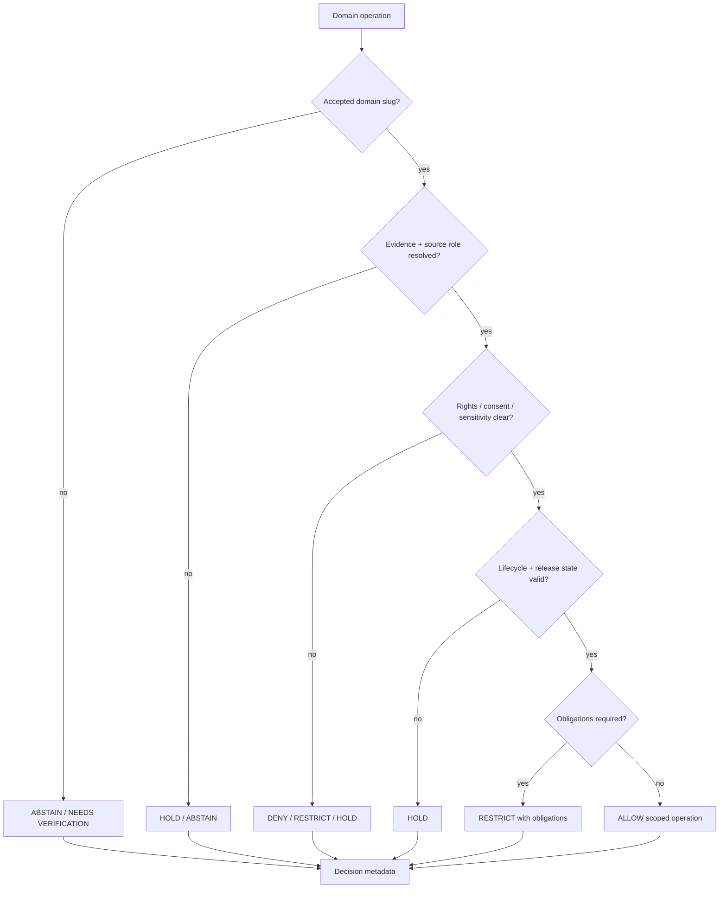

<!-- [KFM_META_BLOCK_V2]
doc_id: kfm://policy/domains
title: Domain Policy README
type: policy-readme
version: v0.1
status: draft
owners: OWNER_TBD — Policy steward · Domain stewards · Sensitivity steward · Release steward · Docs steward
created: 2026-06-15
updated: 2026-06-15
policy_label: restricted
related:
  - ../README.md
  - ../bundles/README.md
  - ../data/README.md
  - ../decision/README.md
  - ../../docs/domains/README.md
  - ../../packages/domains/README.md
  - ../../contracts/domains/
  - ../../schemas/contracts/v1/domains/
  - ../../docs/doctrine/trust-membrane.md
  - ../../docs/doctrine/directory-rules.md
  - ../../packages/policy-runtime/README.md
  - ../../tests/README.md
tags: [kfm, policy, domains, domain-policy, admissibility, sensitivity, rights, release, fail-closed]
notes:
  - "Expands the short policy/domains stub into a governed domain-policy root README."
  - "This path is for domain-specific admissibility policy and policy documentation; it is not domain doctrine, package code, schema authority, contract authority, lifecycle data, or release authority."
  - "Domain docs explain scope under docs/domains/; packages/domains/ may contain helper code only; contracts and schemas own meaning and shape."
  - "Runtime enforcement, child-lane inventory, fixtures, tests, bundle registration, and policy-runtime integration remain NEEDS VERIFICATION."
[/KFM_META_BLOCK_V2] -->

<a id="top"></a>

<div align="center">

# Domain Policy

`policy/domains/`

**Domain-specific policy lane for KFM admissibility rules: sensitivity, rights, review, exposure, lifecycle, release-adjacent, and public-surface constraints that vary by domain.**


[Scope](#1-scope) · [Repo fit](#2-repo-fit) · [Boundary](#3-authority-boundary) · [Inputs](#5-inputs) · [Exclusions](#6-exclusions) · [Domain lanes](#7-domain-lanes) · [Definition of done](#14-definition-of-done)

</div>

---

> [!IMPORTANT]
> **Status:** draft / `NEEDS VERIFICATION`  
> **Owners:** `OWNER_TBD` — Policy steward · Domain stewards · Sensitivity steward · Release steward · Docs steward  
> **Path:** `policy/domains/README.md`  
> **Responsibility root:** `policy/` — policy-as-code and policy documentation  
> **Truth posture:** CONFIRMED file path / PROPOSED domain-policy root contract / UNKNOWN runtime enforcement

> [!CAUTION]
> This directory must not become a substitute for `docs/domains/`, `contracts/domains/`, `schemas/contracts/v1/domains/`, `packages/domains/`, `pipelines/domains/`, `data/`, or `release/`. Domain policy decides admissibility; it does not define domain truth, object meaning, machine shape, helper-code behavior, lifecycle storage, or publication approval.

---

## Quick jump

- [1. Scope](#1-scope)
- [2. Repo fit](#2-repo-fit)
- [3. Authority boundary](#3-authority-boundary)
- [4. Default posture](#4-default-posture)
- [5. Inputs](#5-inputs)
- [6. Exclusions](#6-exclusions)
- [7. Domain lanes](#7-domain-lanes)
- [8. Diagram](#8-diagram)
- [9. Decision vocabulary](#9-decision-vocabulary)
- [10. Domain-policy obligations](#10-domain-policy-obligations)
- [11. Child-lane contract](#11-child-lane-contract)
- [12. Inspection path](#12-inspection-path)
- [13. Validation expectations](#13-validation-expectations)
- [14. Definition of done](#14-definition-of-done)
- [15. Open verification items](#15-open-verification-items)

---

## 1. Scope

`policy/domains/` is the proposed policy root for domain-specific admissibility rules.

It should hold policy documentation, rule modules, bundle inputs, or lane READMEs that answer domain-specific gate questions such as:

- may this domain object be rendered to a public or reviewer surface;
- must geometry or attributes be redacted, generalized, delayed, or withheld;
- is domain steward review required;
- is the source role sufficient for this claim;
- are rights, consent, sensitivity, evidence, lifecycle, and release prerequisites satisfied;
- does a cross-domain join create extra exposure risk;
- should a candidate remain held or be routed to quarantine.

Out of scope:

- human-facing domain doctrine;
- domain package helper code;
- schemas or semantic contracts;
- source acquisition and transformation pipelines;
- lifecycle data storage;
- release approval and rollback authority;
- public UI implementation;
- model-generated truth claims.

[Back to top](#top)

---

## 2. Repo fit

| Concern | Owning root | Expected relationship |
|---|---|---|
| Domain-specific policy | `policy/domains/` | This README and child domain policy lanes |
| General policy posture | `policy/` | Singular policy authority root |
| Domain doctrine and scope | `docs/domains/` | Human-facing domain control plane, not executable policy |
| Domain semantic meaning | `contracts/domains/` | Object meaning and field intent |
| Domain machine shape | `schemas/contracts/v1/domains/` | JSON Schema / machine-readable shape |
| Domain helper code | `packages/domains/` | Reusable helper libraries only |
| Domain pipelines | `pipelines/domains/` and `pipeline_specs/` | Executable or declarative transformations |
| Lifecycle data | `data/` | RAW through PUBLISHED materializations, receipts, proofs, registry, reports |
| Release authority | `release/` | Publication, correction, supersession, rollback |
| Runtime policy evaluation | `packages/policy-runtime/` | Evaluator helper code; not policy authority |

> [!NOTE]
> `docs/domains/README.md` says domain docs explain scope but do not decide policy, schema, release, or evidence truth. `packages/domains/README.md` says helper packages cannot decide policy, evidence, lifecycle promotion, release, or public display. This README fills the corresponding policy/admissibility lane.

## 3. Authority boundary

This lane may decide whether a domain object or domain operation can pass a policy gate. It must not define the domain itself, own the data, or publish the result.

```text
policy/domains/                  = domain admissibility and exposure policy
docs/domains/                    = domain doctrine, scope, status, verification index
contracts/domains/               = domain object meaning
schemas/contracts/v1/domains/    = domain machine shape
packages/domains/                = reusable domain helper code
pipelines/domains/               = executable domain transformations
data/                            = lifecycle state, receipts, proofs, artifacts
release/                         = publication, correction, rollback control
```

## 4. Default posture

Domain policy should fail closed when support is missing.

A domain policy gate should return `DENY`, `RESTRICT`, `HOLD`, or `ABSTAIN` when any of these are unresolved:

- domain slug or owner;
- lifecycle stage;
- source role and authority;
- rights or license posture;
- consent where applicable;
- sensitivity or exposure tier;
- evidence closure;
- validation report;
- public audience;
- release state;
- correction or rollback target;
- cross-domain join impact.

## 5. Inputs

| Input family | Examples | Required posture |
|---|---|---|
| Domain context | domain slug, object family, sublane, owner, reviewer class | Explicit and registered or marked `NEEDS VERIFICATION` |
| Operation context | render, export, transform, join, publish candidate, review, rollback | Explicit and auditable |
| Lifecycle context | RAW, WORK, QUARANTINE, PROCESSED, CATALOG, TRIPLET, PUBLISHED | Explicit and stage-valid |
| Evidence context | EvidenceRef, EvidenceBundle status, citation validation | Required when claims depend on evidence |
| Source context | source descriptor, source role, provenance, update cadence | Resolved before exposure |
| Rights / consent context | license posture, consent state, holder limits, attribution | Required where relevant |
| Sensitivity context | domain sensitivity class, precision, location, living-person, ecology, archaeology, infrastructure, cultural flags | Fail closed when unresolved |
| Release context | candidate, released, superseded, withdrawn, rollback requested | Explicit; never inferred from path alone |

## 6. Exclusions

| Does not belong here | Correct home |
|---|---|
| Domain scope and explanatory docs | `docs/domains/<slug>/` |
| Domain object semantic contracts | `contracts/domains/<slug>/` |
| Domain schemas | `schemas/contracts/v1/domains/<slug>/` |
| Domain helper libraries | `packages/domains/<slug>/` |
| Executable transformation pipelines | `pipelines/domains/<slug>/` |
| Pipeline run specifications | `pipeline_specs/` or verified spec home |
| Lifecycle artifacts | `data/` lifecycle roots |
| Release manifests and rollback authority | `release/` |
| Public UI components or API routes | `apps/` and governed UI/API packages |
| Source data and credentials | lifecycle roots or secret manager, not policy docs |

## 7. Domain lanes

Child folders under `policy/domains/` should map to accepted domain slugs only when there is a clear owner, reviewer, domain doctrine link, schema/contract relationship, fixture strategy, and release posture.

| Lane class | Example purpose | Status |
|---|---|---|
| Environmental domain policy | Sensitivity, generalization, source-role, and exposure gates | NEEDS VERIFICATION |
| Built environment policy | Infrastructure, roads, settlement, hazard, and public-safety exposure gates | NEEDS VERIFICATION |
| People-linked domain policy | Consent, privacy, relation, and living-person exposure gates | NEEDS VERIFICATION |
| Cultural / archaeology policy | Location precision, sovereignty, review, and publication gates | NEEDS VERIFICATION |
| Cross-domain policy | Join-induced exposure and compound-risk gates | NEEDS VERIFICATION |

> [!WARNING]
> Do not create a child policy lane solely because a topic exists. Domain policy lanes should follow accepted domain slugs and responsibility boundaries, not convenience grouping.

## 8. Diagram



## 9. Decision vocabulary

| Decision | Meaning | Required behavior |
|---|---|---|
| `ALLOW` | Domain operation may proceed under supplied context | Scope to domain, object, operation, audience, and version |
| `DENY` | Domain policy blocks the action | Return safe reason code and avoid exposing protected detail |
| `RESTRICT` | Operation may proceed only with obligations | Preserve redaction, generalization, audience, delay, or review limits |
| `HOLD` | Steward review, validation, receipt, proof, or release gate is pending | Do not promote or render publicly |
| `ABSTAIN` | Policy cannot decide because support is missing or unresolved | Preserve unresolved handles where safe |
| `ERROR` | Policy machinery, schema, runtime, or repository support failed | Fail closed and record failure |

## 10. Domain-policy obligations

| Obligation | Example effect |
|---|---|
| `redact` | Withhold protected field, relation, geometry, or claim detail |
| `generalize` | Reduce spatial or attribute precision |
| `restrict_audience` | Limit to steward, reviewer, named party, or authenticated surface |
| `review_required` | Route to domain steward, sensitivity steward, rights steward, or release steward |
| `citation_required` | Require evidence display where safe |
| `delay_release` | Defer publication or public rendering |
| `consent_required` | Require consent check before materialization |
| `rollback_required` | Require rollback target before release-adjacent action |
| `quarantine_required` | Route unsafe or unresolved material to quarantine |

## 11. Child-lane contract

Each child `policy/domains/<slug>/README.md` should state:

- accepted domain slug and owner;
- relevant domain docs link;
- policy scope and non-scope;
- source-role and evidence requirements;
- rights, consent, and sensitivity posture;
- lifecycle gates affected;
- public exposure rules;
- obligations and reason codes;
- fixtures and tests;
- rollback and correction expectations;
- open verification items.

## 12. Inspection path

Domain-policy modules, child lanes, fixtures, tests, validators, and CI remain `NEEDS VERIFICATION`.

```bash
find policy/domains -maxdepth 4 -type f | sort
find docs/domains contracts/domains schemas/contracts/v1/domains packages/domains -maxdepth 3 -type f 2>/dev/null | sort
find tests fixtures -maxdepth 5 -type f 2>/dev/null | grep -E 'domain|policy|sensitivity|rights|release' | sort
```

## 13. Validation expectations

Useful validation for this lane should cover:

- unknown domain slug returns `ABSTAIN` or `HOLD`;
- missing domain owner returns `HOLD`;
- unresolved evidence returns `ABSTAIN` or `HOLD`;
- unresolved rights, consent, or sensitivity does not silently allow public exposure;
- cross-domain joins preserve the most restrictive obligations;
- sensitive exact locations are denied, generalized, or held according to accepted policy;
- public clients consume governed APIs and released/public-safe artifacts only;
- domain policy decisions emit stable reason codes and receipt-ready metadata.

## 14. Definition of done

- [ ] Owners are confirmed and `OWNER_TBD` is replaced.
- [ ] Accepted domain slug inventory is linked.
- [ ] Child lane inventory is complete.
- [ ] Runtime policy language and bundle location are confirmed.
- [ ] Fixtures cover allow, deny, restrict, hold, abstain, and error outcomes.
- [ ] Cross-domain join policy is linked or implemented.
- [ ] Sensitivity and rights obligations are tested for high-risk domains.
- [ ] Public API bypass checks are covered by tests or policy fixtures.
- [ ] Release and rollback requirements remain separate from policy allow decisions.

## 15. Open verification items

| Item | Why it matters |
|---|---|
| Confirm child lane inventory under `policy/domains/` | Prevents stale or undocumented policy lanes |
| Confirm accepted domain slug register | Prevents topic-as-folder drift |
| Confirm runtime policy language | Prevents non-runnable guidance |
| Confirm fixtures and tests | Required before enforcement claims |
| Confirm reason-code register | Required for stable decisions and metrics |
| Confirm cross-domain composition rule | Prevents join-induced exposure gaps |
| Confirm release-gate integration | Required for publication-adjacent policy |
| Confirm public API enforcement | Prevents trust-membrane bypass |

<details>
<summary>Appendix A — no-loss preservation note</summary>

The previous file was a short stub. This README expands it into a governed domain-policy root contract without claiming runtime enforcement, child-lane completeness, policy modules, tests, fixtures, bundle registration, CI coverage, or release-gate integration.

It preserves the responsibility split: `docs/domains/` explains domain scope, `contracts/domains/` defines meaning, `schemas/contracts/v1/domains/` defines machine shape, `policy/domains/` defines admissibility, `packages/domains/` provides helper code, `data/` stores lifecycle artifacts, and `release/` owns publication and rollback decisions.

</details>

## Status summary

`policy/domains/` should define domain-specific admissibility policy only when it remains subordinate to domain doctrine, contract, schema, lifecycle, evidence, release, correction, and rollback boundaries.

It should keep domain policy inspectable, reason-coded, obligation-preserving, fixture-tested, and routed through governed interfaces without becoming domain truth, schema authority, lifecycle storage, package code, or publication authority.

<p align="right"><a href="#top">Back to top</a></p>
