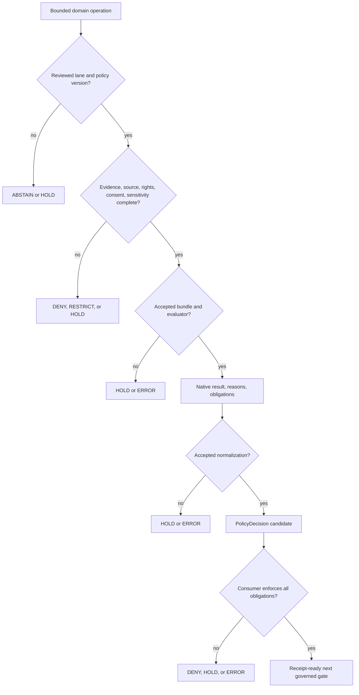

<!-- [KFM_META_BLOCK_V2]
doc_id: kfm://policy/domains
title: Domain Policy Boundary, Lane Inventory, and Activation Contract
type: readme
version: v0.4
status: draft; BOUNDARY_COMPACT; repository-grounded; current-state-reconciled; mixed-maturity; machine-register-projected; evaluator-unbound; fail-closed; non-release; non-publication
owner: NEEDS VERIFICATION — .github/CODEOWNERS routes /policy/ to @bartytime4life; accepted domain-policy stewardship, specialist review, and independent approval controls remain unproved
created: 2026-06-15
updated: 2026-08-13
current_path: policy/domains/README.md
owning_root: policy/
responsibility: Document the domain-specific admissibility-policy boundary, canonical lane projection, physical child inventory, local maturity, activation requirements, validation limits, and compatibility conflicts without creating domain truth, activating policy, approving release, or authorizing publication.
policy_label: internal-operating-policy; repository-public; domain-policy; admissibility; evidence-bound; source-role-aware; rights-aware; consent-aware; sensitivity-aware; fail-closed; release-gated; correction-aware; rollback-aware
base_commit: 2d6a87c307c35c9a10492f43646b817cf7583b2a
base_tree: cb550fab5ee6c8e412f246ec1e06bf84cced7530
target_prior_blob: ed9be975c9da2c7d77d94fab621db39f23953813
domain_lane_tree: f7894b200012dc849bc7d95541762ec8ea969f62
directory_rules_blob: fd49a0b83e55cef52c1124281f093e263526898d
directory_rules_adr_blob: b01322ef64f8c2b1ecb41de7ef4685b97cfa2a62
policy_root_blob: 6c5021f9d92778581a4e9331a9dd6ddb7efc5e35
root_registry_blob: 024f668b5f0a9239bafa4f8b09e2afd86300ff8c
domain_lane_register_blob: 1bfc6f91cfa713a5e3d51ece011b63b46310734f
human_domain_register_blob: 7cd641d99e1e4e3b3823f608d63679a438590c3a
soil_watcher_policy_blob: 3c7d0f99507c94bf539fb75a0ce26e215f79cbde
fauna_tile_allowlist_blob: 3f743b21f3d13b100a1a5bb7c3a7b2bb6d48df69
policy_test_workflow_blob: ac8f125e8a4d3634d86f66836d2aa2c0e3925e75
policy_runtime_core_blob: e7e14cf39ae6919fbbc80f1b471de6b907292edb
bundle_root_readme_blob: 0a13a9c9beddfa764d47e5dd6a2ea7ef91bf0d53
pass12_bundle_readme_blob: 0c36c7c68180e74ccd9277f92284530cc2a96db0
topology_validator_blob: e2992453d5d78015035ae6e312d839bfc3a2cbda
topology_baseline_blob: 717c2480686d254ba6a8b8c19276cfcf0c6bbda2
truth_posture: CONFIRMED accepted Directory Rules v2, singular policy root, a PROPOSED 13-entry machine projection, 14 direct child directories, all 13 canonical lane READMEs as substantive repository-grounded boundaries, 185 tracked files, 126 Rego sources, one non-default operative domain rule body in the fixture-only Soil watcher slice, no domain-local native Rego test, 13 canonical domain workflows, 12 policy-profile validators, a separate bounded Pass 12 native Rego test, CODEOWNERS routing, a placeholder policy runtime, absent air, roads, and settlement direct policy children, and one residual marker-only people child / PROPOSED inactive policy input, vocabulary, obligation, semantics, evaluation-binding, enforcement-maturity, reviewer, transform, sovereignty, threshold, Soil watcher, Fauna tile-field, and Pass 12 profiles / CONFLICTED residual people path identity versus the canonical people-dna-land lane, unresolved air, settlement, and transport register aliases despite absent corresponding direct policy authority, stale statements inside the human register, and engine-native versus outward decision vocabularies / UNKNOWN accepted domain evaluator, active domain bundle, authenticated decision authority, governed consumer, receipt persistence, required-check enforcement, release integration, production operation, and rollback execution
related:
  - ../README.md
  - ../bundles/README.md
  - ../decision/README.md
  - ../../docs/adr/ADR-0029-adopt-directory-governance-standard-v2.md
  - ../../docs/doctrine/directory-rules.md
  - ../../docs/domains/README.md
  - ../../docs/registers/DOMAIN_LANE.md
  - ../../control_plane/domain_lane_register.yaml
  - ../../control_plane/root_registry.yaml
  - ../../contracts/domains/
  - ../../contracts/policy/README.md
  - ../../schemas/contracts/v1/domains/
  - ../../schemas/contracts/v1/policy/README.md
  - ../../packages/domains/README.md
  - ../../packages/policy-runtime/README.md
  - ../../tools/validators/policy/README.md
  - ../../tests/README.md
  - ../../release/README.md
  - ../../.github/CODEOWNERS
notes:
  - "This v0.4 revision reconciles the existing v0.3 README with current main after canonical child-document modernization and physical alias cleanup; it changes documentation only."
  - "No rule, bundle, evaluator, contract, schema, fixture, validator, workflow, registry entry, lifecycle object, receipt, release object, deployment, or public behavior is created or modified."
  - "Static counts and badges describe the pinned repository snapshot; they are not policy, approval, maturity, release, deployment, or publication evidence."
[/KFM_META_BLOCK_V2] -->

<a id="top"></a>

# Domain Policy Boundary and Lane Inventory

> **One-line purpose.** `policy/domains/` is KFM's domain-specific admissibility-policy lane: it organizes reviewed policy source and local boundary documentation for recognized domain identities without becoming domain truth, machine shape, source or evidence authority, lifecycle storage, evaluator authority, release approval, or publication authority.

[](#status)
[](#authority-level)
[](#domain-lane-inventory)
[](#domain-lane-inventory)
[](#current-direct-child-map)
[](#current-source-inventory)
[](#status)
[](#authority-level)
[](#last-reviewed)

> [!IMPORTANT]
> **Safe current conclusion at `main@2d6a87c307c3`:** the proposed machine register and human register identify the same 13 canonical domain lanes, and all 13 canonical policy-lane READMEs are now substantive repository-grounded boundaries. The physical tree has 14 direct directories because an unregistered, marker-only `people/` scaffold remains. Domain source is still 125 explicit `PROPOSED` scaffolds plus one bounded Soil watcher guard; documentation maturity is not policy activation, native policy proof, evaluator acceptance, release authority, or production enforcement.

> [!CAUTION]
> Policy may constrain a bounded operation; it cannot create evidence, infer consent, clear rights by assertion, downgrade sensitivity, promote lifecycle state, approve release, turn generated language into authority, or make a path, commit, pull request, badge, map, tile, workflow, or validator result public truth.

> [!WARNING]
> The machine register is a `PROPOSED` projection with `registration_authority: NEEDS_VERIFICATION`, not a domain-creation instrument. Its unresolved `air -> atmosphere`, `settlement -> settlements-infrastructure`, and `transport -> roads-rail-trade` vocabulary remains even though `air/`, `settlement/`, `roads/`, and `transport/` are absent as direct policy children. Conversely, the residual `people/` markers have no machine-register mapping to `people-dna-land`. The human register also retains stale verification text. Treat register vocabulary, physical paths, and canonical identity as separate evidence axes; never choose or recreate an alias silently.

**Quick navigation:** [Purpose](#purpose) · [Authority](#authority-level) · [Status](#status) · [Child map](#current-direct-child-map) · [Belongs](#what-belongs-here) · [Exclusions](#what-does-not-belong-here) · [Inputs](#inputs) · [Outputs](#outputs) · [Exposure](#exposure-mutation-and-retention) · [Validation](#validation) · [Review](#review-burden) · [Related](#related-folders) · [ADRs](#adrs) · [Last reviewed](#last-reviewed) · [Inventory](#domain-lane-inventory) · [Decisions](#policy-decision-model) · [Obligations](#obligations-and-cross-domain-composition) · [Child lanes](#child-lane-contract) · [Trust membrane](#trust-membrane-and-lifecycle) · [Done](#definition-of-done) · [Open verification](#open-verification-register)

---

<a id="1-scope"></a>

## Purpose

`policy/domains/` owns the **domain-specific portion of KFM admissibility policy**. A rule belongs here when its primary responsibility is to decide whether a bounded operation is admissible for one recognized domain, given explicit evidence, source role, rights, consent, sensitivity, precision, lifecycle, review, release, correction, and rollback context.

Typical questions include:

- may a particular domain object be rendered, exported, transformed, joined, reviewed, or considered for release;
- must geometry, attributes, relations, citations, or source details be redacted, generalized, aggregated, delayed, audience-restricted, or withheld;
- is the source role and evidence posture sufficient for the requested claim or operation;
- do rights, consent, sensitivity, validation, review, release, correction, and rollback prerequisites close;
- does a cross-domain join create a stricter obligation than either input carries alone; and
- must evaluation return a finite allow-like result, restriction, hold, abstention, denial, or error.

A file does not belong here merely because it mentions a domain. Domain meaning stays in contracts and doctrine; machine shape stays in schemas; payloads and state stay in lifecycle roots; evaluation mechanics stay in an accepted runtime; release and publication stay downstream.

[Back to top](#top)

---

<a id="2-repo-fit"></a>
<a id="3-authority-boundary"></a>

## Authority level

This directory is a **`BOUNDARY_COMPACT` child of the canonical singular `policy/` root**. Accepted [ADR-0029](../../docs/adr/ADR-0029-adopt-directory-governance-standard-v2.md) adopts [Directory Rules v2](../../docs/doctrine/directory-rules.md), whose domain placement law uses `policy/domains/<lane>/`. The [root registry](../../control_plane/root_registry.yaml) projects `policy/` as internal, versioned, durable policy-rule authority while prohibiting data instances, release decisions, and schemas. These documents place responsibility; they do not activate any local rule.

[CODEOWNERS](../../.github/CODEOWNERS) routes `/policy/` changes to `@bartytime4life`. That route is not accepted domain stewardship, specialist review, independent approval, a `PolicyDecision`, a release approval, or publication authority.

| Local boundary field | Current evidence |
|---|---|
| Inherited parent | [`policy/`](../README.md), the singular policy responsibility root |
| Local owner | **NEEDS VERIFICATION.** No accepted domain-policy steward or independent approver was established. |
| Local scope ID | **NEEDS VERIFICATION.** `kfm://policy/domains` identifies this document; it is not an accepted evaluator scope or policy-family ID. |
| Current authority | Documentation and reviewed source placement only; no evaluator, decision, lifecycle, release, or publication authority |

| Concern | Owning surface | Role of `policy/domains/` |
|---|---|---|
| Domain identity and placement | accepted decisions, Directory Rules, and synchronized registers | Consume reviewed lane IDs; never create or rename a lane through path presence. |
| Domain scope and explanatory doctrine | [`docs/domains/`](../../docs/domains/README.md) | Link and summarize; never redefine domain truth. |
| Domain object meaning | `contracts/domains/<lane>/` | Consume reviewed semantics; never host semantic authority. |
| Domain machine shape | `schemas/contracts/v1/domains/<lane>/` | Require accepted shapes; never host schema authority. |
| Domain-specific admissibility source | `policy/domains/<lane>/` | Own reviewed local rules and boundary documentation after acceptance. |
| Cross-domain or general policy | the lowest common segment under `policy/` | Do not force a shared rule into an arbitrary domain. |
| Evaluation mechanics | [`packages/policy-runtime/`](../../packages/policy-runtime/README.md) or another accepted evaluator | Supply accepted source; never place reusable evaluator code here. |
| Validation and proof | `tests/`, `fixtures/`, and `tools/validators/` | Reference bounded proof; a passing check is not a policy decision. |
| Lifecycle objects and payloads | `data/<phase>/<lane>/`, receipts, proofs, and registries | Evaluate explicit references; never store or mutate them here. |
| Release, correction, withdrawal, rollback | [`release/`](../../release/README.md) | Supply required context; never approve, publish, correct, or roll back alone. |
| Public enforcement | governed APIs and released public-safe artifacts | Consumers enforce obligations; clients do not select policy source directly. |

[Back to top](#top)

---

<a id="4-default-posture"></a>

## Status

### Repository-grounded snapshot

| Surface | Confirmed state at `main@2d6a87c307c3` | Safe interpretation |
|---|---|---|
| Parent README | v0.3 baseline, blob `ed9be97…` | Same-path v0.4 reconciliation; documentation and provenance only. |
| Directory authority | ADR-0029 is accepted; canonical Directory Rules blob `fd49a0b…` | Domain placement is adopted; implementation maturity still requires evidence. |
| Machine lane register | `PROPOSED`, `machine_projection_only`, 13 entries, reviewed 2026-08-07 | Canonical IDs are projected, but registration authority and owners remain unverified. |
| Human lane register | Draft narrative with the same 13 IDs | Useful human index; its open question about whether the machine file exists is stale. |
| Direct child directories | 14 | Thirteen canonical lanes plus the residual marker-only `people/` drift surface. |
| Canonical child READMEs | 13 of 13 | Every canonical child now has a substantive repository-grounded boundary; this is documentation maturity only. |
| Retired physical alias surfaces | `air/`, `roads/`, and `settlement/` are absent | Their removal reduces parallel path growth; unresolved register vocabulary and migration history still require governance. |
| Residual sparse child | `people/` has no README and contains exactly two nested `.gitkeep` files | It has no machine-register mapping and must not be inferred as equivalent to `people-dna-land`. |
| Recursive inventory | 185 files: 126 Rego, 9 YAML, 1 JSON, 19 Markdown, 30 `.gitkeep` | The Markdown set contains 18 READMEs plus one Fauna redistribution note; maturity does not follow from counts. |
| Domain Rego semantics | Structural scan found one non-default operative rule body, in `soil/watcher_spec.rego`; the other 125 are package/import/default/comment scaffolds | One fixture-only guard exists; no general domain-policy implementation is established. |
| Domain-native Rego tests | None under `policy/domains/` | Domain rule behavior is not natively proved. |
| Canonical domain workflows | 13, one per canonical lane | Readiness/hold surfaces; they are not general domain-policy execution. |
| Policy-profile validators | 12 executable Python validators with dedicated fixture/test/workflow surfaces | Proposed inactive coherence checks; they are not evaluators or decision authorities. |
| Broad `policy-test` | Static readiness guard; recognizes one separate Pass 12 native Rego lane | It evaluates no domain rule and emits no `PolicyDecision`. |
| Policy runtime | Version `0.0.0`, empty initializer, comment-only `core.py` | No accepted general evaluator, bundle selector, normalized decision flow, or consumer. |
| Topology ratchet | Current validator and baseline distinguish conventional README materialization from substantive alias evidence | Ratchet mechanics do not accept an alias, create a lane, or resolve the residual `people/` markers. |
| Required checks and production enforcement | Not established by reviewed repository files | Workflow presence and CODEOWNERS do not prove ruleset enforcement or deployment. |

### Default posture

Domain policy fails closed when material context is missing, stale, conflicted, untrusted, or outside the evaluator's accepted scope. Depending on an accepted contract, that may require `DENY`, `RESTRICT`, `HOLD`, `ABSTAIN`, or `ERROR`; it must never silently fall back to allow.

Exact archaeology, sacred or cultural material, rare-species or rare-plant locations, living-person or DNA/genomic detail, private person-parcel joins, critical-infrastructure detail, harmful spatial precision, and unclear source rights take the stricter safe path: quarantine, redaction, generalization, aggregation, staged access, delay, specialist review, abstention, hold, or denial.

[Back to top](#top)

---

## Current direct-child map

Verified at the pinned base; Directory Rules require direct children only:

```text
policy/domains/
├── README.md                     — this parent boundary and inventory
├── agriculture/                  — canonical lane
├── archaeology/                  — canonical lane
├── atmosphere/                   — canonical lane
├── fauna/                        — canonical lane
├── flora/                        — canonical lane
├── geology/                      — canonical lane
├── habitat/                      — canonical lane
├── hazards/                      — canonical lane
├── hydrology/                    — canonical lane
├── people/                       — unregistered marker-only legacy scaffold; no README
├── people-dna-land/              — canonical lane
├── roads-rail-trade/             — canonical lane
├── settlements-infrastructure/   — canonical lane
└── soil/                         — canonical lane
```

The machine register explicitly projects unresolved vocabulary for `air -> atmosphere`, `settlement -> settlements-infrastructure`, and `transport -> roads-rail-trade`. None of `air/`, `settlement/`, `transport/`, or the former unregistered `roads/` exists as a direct child at the pinned snapshot. The register does **not** project `people`; this README does not invent equivalence from a similar name or two marker files.

[Back to top](#top)

---

## What belongs here

- this parent README and reviewed child `policy/domains/<lane>/README.md` boundaries;
- accepted domain-specific Rego, OPA-compatible, or equivalent declarative policy source;
- rules for domain-specific source-role sufficiency, evidence closure, rights, consent, sensitivity, spatial or temporal precision, public exposure, stale state, review, and release prerequisites;
- stable packages, entrypoints, versions, reason codes, obligations, effective times, and supersession notes for accepted rules;
- domain-specific redaction, generalization, aggregation, audience, delay, quarantine, review, or correction requirements;
- cross-domain composition rules only where a reviewed decision clearly assigns ownership;
- links to paired contracts, schemas, fixtures, tests, validators, bundle membership, evaluator profiles, receipts, consumers, release gates, correction paths, and rollback targets; and
- synthetic or public-safe native policy tests only after the repository accepts a colocation convention.

A syntactically valid or tracked module is not active merely because it is stored here.

[Back to top](#top)

---

<a id="6-exclusions"></a>

## What does NOT belong here

| Prohibited content or responsibility | Correct home or behavior |
|---|---|
| Domain doctrine, architecture, scope narratives, or source guides | `docs/domains/<lane>/` |
| Semantic object definitions | `contracts/domains/<lane>/` |
| JSON Schema, DTO, enum, or field shape | `schemas/contracts/v1/domains/<lane>/` |
| Shared policy not owned by one domain | Lowest common segment under `policy/` |
| Source payloads, credentials, registry instances, or real protected data | Connectors, secret stores, and accepted lifecycle or registry lanes |
| EvidenceBundles, proofs, decisions, reviews, or receipts emitted at runtime | Their accepted evidence, review, receipt, proof, or lifecycle roots |
| RAW through PUBLISHED material | `data/<phase>/<lane>/` |
| Evaluator, adapter, CLI, service, or reusable runtime code | `packages/`, `apps/`, `runtime/`, or `tools/` by responsibility |
| Generic fixtures and tests | `fixtures/` and `tests/` |
| Release manifests, approvals, corrections, withdrawals, or rollback cards | `release/` |
| Public API routes, MapLibre logic, UI components, exports, or AI responses | Governed application and runtime roots |
| Exact sensitive locations, living-person data, DNA/genomic content, consent tokens, or restricted excerpts | Denied here; use synthetic, redacted, generalized, or reference-only fixtures |
| A topic folder without reviewed domain identity | No new path until the lane decision and placement are reviewed |
| Independently evolving alias policy | Compatibility guardrail only until a reviewed migration or naming decision |
| Generated language presented as a grant, approval, or release decision | Governed human and machine review |

[Back to top](#top)

---

<a id="5-inputs"></a>

## Inputs

A domain policy evaluation requires an explicit, versioned, bounded input. It must not silently fetch missing facts from canonical, internal, or public stores.

| Input family | Minimum governed context | Fail-closed trigger |
|---|---|---|
| Domain identity | reviewed lane ID, object family, sublane, policy version, relevant reviewer class | Unknown, alias-only, or conflicted identity |
| Operation | render, export, transform, join, review, release-candidate check, correction, or rollback; stable request/candidate ID | Missing or overly broad capability |
| Actor and audience | caller or service class, purpose, and public/restricted/steward audience | Missing identity where access differs |
| Spatial and temporal scope | requested precision, place/time bounds, source time, valid time, and freshness | Harmful precision, stale support, or scope mismatch |
| Evidence | evidence references, bundle resolution, citations, validation, and conflict state | Unresolved support for a consequential claim |
| Source | descriptor reference, source role, authority posture, provenance, terms, and cadence | Unclear role, rights, terms, or freshness |
| Rights, consent, sensitivity | license/terms, consent applicability or revocation, classification, sovereignty/cultural flags, and transforms | Unknown, expired, revoked, or unsupported posture |
| Lifecycle, review, release | current/requested phase, proof refs, review state, and release/correction/rollback refs | Skipped phase, missing review, or public exposure without release support |
| Policy execution | bundle ID/version/digest, evaluator profile/version, entrypoint, and normalized input hash | Unaccepted, ambiguous, or non-replayable evaluator context |
| Cross-domain composition | participating lanes, inherited obligations, join-induced sensitivity, and output audience | Output less restrictive than any applicable input |

The fixture-only [`PolicyInputBundle explicit context profile v1`](../../contracts/policy/policy_input_bundle_profile_v1.md) machine-checks one bounded proposed subset. A passing profile establishes input coherence only; it does not run policy or prove authority, evidence truth, review, release, or publication.

[Back to top](#top)

---

## Outputs

A future accepted evaluation may emit:

- an engine-native result with stable package, entrypoint, rule version, reason codes, and obligations;
- a normalized `PolicyDecision` candidate conforming to an accepted outward contract;
- safe public reasons and separately governed reviewer detail;
- redaction, generalization, aggregation, audience, citation, delay, review, quarantine, correction, or rollback obligations; and
- bundle/evaluator identity, input digest, evaluated references, effective/expiry time, and receipt-ready replay metadata.

It must not emit source truth, evidence, a lifecycle promotion, an authenticated approval, a release state, or publication authority. If a downstream consumer cannot enforce every obligation, the result must fail closed.

The proposed inactive [`PolicyEvaluationBinding v1`](../../contracts/policy/policy_evaluation_binding_v1.md) proves exact fixture-byte and declaration coherence only. It does not execute or authenticate a decision.

[Back to top](#top)

---

## Exposure, mutation, and retention

| Dimension | Current contract |
|---|---|
| Exposure | Repository-facing documentation and policy source are internally governed. Public clients consume governed APIs and released public-safe artifacts, never this directory directly. |
| Mutation | Versioned changes on reviewed feature branches; no direct lifecycle mutation, hidden fetch, or release-side effect. |
| Retention | Durable policy history. Superseded rules require explicit lineage, effective times, compatibility treatment, and rollback references rather than silent deletion. |
| Sensitive material | Forbidden. Reasons, examples, fixtures, logs, and diffs must not disclose protected payloads or reverse-engineering detail. |
| Runtime writes | None. An evaluator and its accepted receipt/audit sink own any runtime record; this repository path remains source and documentation. |

[Back to top](#top)

---

<a id="12-inspection-path"></a>
<a id="13-validation-expectations"></a>

## Validation

### Current validation surfaces

| Surface | What it proves at the pinned base | What it does not prove |
|---|---|---|
| [`policy-test`](../../.github/workflows/policy-test.yml) | Static readiness invariants, additive validator support, placeholder runtime state, absence of bundle payloads, and recognition of one separately governed release Rego lane | Any domain rule was evaluated; any domain decision was emitted or enforced |
| 13 canonical `domain-*.yml` workflows | Per-lane path/readiness checks and explicit hold behavior | Domain truth, accepted policy, evidence closure, release readiness, or publication |
| 12 `tools/validators/policy/validate_*.py` profiles | Deterministic fixture and semantic-coherence checks with dedicated tests/workflows | General policy evaluation, authenticated decisions, production consumers, or release authority |
| [Soil watcher spec workflow](../../.github/workflows/soil-watcher-spec.yml) | Contract/schema/fixture/validator consistency for a proposed fixture-only, no-network watcher boundary | Native evaluation of `soil/watcher_spec.rego`, source admission, promotion, release, or publication |
| [Fauna tile-field allowlist workflow](../../.github/workflows/fauna-tile-field-allowlist.yml) | Field-name allowlist polarity for a proposed public-candidate profile | Tile-byte safety, geometry safety, evidence closure, policy approval, or public use |
| [Pass 12 release workflow](../../.github/workflows/pass12-release-policy-v1.yml) | Checksum-pinned OPA 1.19.0 formatting, native Rego tests, fixture polarity, and stable deny reasons for one inactive release-gate slice outside domain lanes | A domain bundle, outward normalization, authenticated review, release assembly, deployment, or publication |
| Schemas and fixtures | Selected machine-shape polarity | Correct source truth, rights, consent, sensitivity, policy semantics, or consumer enforcement |

The primary `PolicyDecision` and `PolicyInputBundle` schemas still name validator paths that are absent at this snapshot: `tools/validators/validate_policy_decision.py` and `tools/validators/policy/validate_policy_input_bundle.py`. The 12 newer profile validators do not silently replace those general validators.

### Required before a domain policy is active

1. Reviewed domain identity and synchronized human/machine registration.
2. Accepted semantic contract, schema, input profile, package, entrypoint, evaluator, bundle manifest, selector, and digest/signing posture.
3. Explicit operation, actor, audience, evidence, source, rights, consent, sensitivity, lifecycle, review, release, correction, and rollback context.
4. Fail-closed native tests for allow-like, restriction, hold, abstention, denial, error, stale, malformed, revoked, and cross-domain cases.
5. Stable reason and obligation vocabularies plus lossless native-to-outward normalization.
6. A governed consumer that rejects unknown versions and proves every obligation is enforced.
7. Receipt/replay support binding exact inputs, policy bytes, evaluator identity, output, effective time, and correction state.
8. Independent risk-appropriate review, required-check enforcement, staged rollout, observability, rollback drill, and release-gate integration.

A schema-valid object, green workflow, or passing fixture profile proves only its named bounded check.

[Back to top](#top)

---

## Review burden

| Change | Minimum review burden |
|---|---|
| README clarification with no semantic change | Policy/docs reviewer; verify links, inventory, authority boundary, and no implied activation |
| Compatibility or lane-identity change | Directory-governance review, domain steward, affected-path inventory, migration plan, and ADR where required |
| Rule semantics, defaults, reason codes, or obligations | Policy steward, domain specialist, evidence/source, rights/consent/sensitivity, security/privacy, validator/test, runtime consumer, and release review as applicable |
| Package, entrypoint, bundle, evaluator, or normalization change | Policy/runtime/security review, contract/schema review, native tests, consumer compatibility, receipt/replay, staged rollout, and rollback proof |
| Public exposure or precision change | Independent sensitivity/privacy/cultural/domain review and release authority; client-side hiding is never sufficient |
| Correction, revocation, or rollback behavior | Release, operations, policy, affected domain, cache/index, and audit/receipt review |

Unknown owner identities, required approvals, branch rules, or deployed consumers remain explicit holds. CODEOWNERS routing alone does not close them.

[Back to top](#top)

---

## Related folders

| Surface | Relationship |
|---|---|
| [`policy/`](../README.md) | Parent policy authority and shared fail-closed boundary. |
| [`policy/bundles/`](../bundles/README.md) | Bundle packaging boundary; currently documentation plus one inactive Pass 12 profile, not an active domain bundle. |
| [`policy/decision/`](../decision/README.md) | Proposed decision vocabulary data; does not authenticate decisions. |
| [`docs/domains/`](../../docs/domains/README.md) | Human-facing domain scope, sources, caveats, and doctrine. |
| [`DOMAIN_LANE.md`](../../docs/registers/DOMAIN_LANE.md) | Draft human narrative register; 13 lane IDs align, but parts of its verification backlog are stale. |
| [`domain_lane_register.yaml`](../../control_plane/domain_lane_register.yaml) | Proposed machine projection of 13 lanes and three unresolved aliases; not domain-creation authority. |
| [`contracts/domains/`](../../contracts/domains/) | Domain semantic contracts. |
| [`schemas/contracts/v1/domains/`](../../schemas/contracts/v1/domains/) | Domain machine shapes. |
| [`contracts/policy/`](../../contracts/policy/README.md) and [`schemas/contracts/v1/policy/`](../../schemas/contracts/v1/policy/README.md) | Proposed policy input, decision, vocabulary, obligation, binding, and maturity families. |
| [`packages/domains/`](../../packages/domains/README.md) | Shared domain implementation boundary; not policy authority. |
| [`packages/policy-runtime/`](../../packages/policy-runtime/README.md) | Placeholder general evaluator package. |
| [`tools/validators/policy/`](../../tools/validators/policy/README.md) | Fixture/profile validators; not a policy evaluator. |
| [`release/`](../../release/README.md) | Release, correction, withdrawal, and rollback authority. |
| [`CODEOWNERS`](../../.github/CODEOWNERS) | Review routing only. |

[Back to top](#top)

---

## ADRs

| Decision surface | Current status | Relevance |
|---|---:|---|
| [`ADR-0029 — Adopt Directory Governance Standard v2`](../../docs/adr/ADR-0029-adopt-directory-governance-standard-v2.md) | **ACCEPTED** | Establishes the current Directory Rules authority and domain placement law. |
| [`ADR-0003 — policy/ singular is canonical`](../../docs/adr/ADR-0003-policy-singular-is-canonical-%28policies-is-compatibility%29.md) | **PROPOSED** | Documents singular-root intent; ADR-0029 now supplies accepted directory authority. |
| [`ADR-0001 — schema home`](../../docs/adr/ADR-0001-schema-home--schemas-contracts-v1-is-canonical.md) | **PROPOSED** | Domain-policy machine shapes remain under canonical `schemas/`. |
| [`ADR-0002 — contracts vs schemas`](../../docs/adr/ADR-0002-contracts-vs-schemas-split.md) | **DRAFT** | Preserves meaning/shape separation. |
| [`ADR-0020 — abstain is first class`](../../docs/adr/ADR-0020-abstain-is-a-first-class-decision.md) | **PROPOSED** | Outward abstention semantics and normalization pressure. |
| Add, rename, merge, or retire a domain lane | **ADR required by Directory Rules** | Prevents topic-as-folder drift and unsynchronized identity. |
| Alias and legacy-child disposition | **NO ACCEPTED DECISION VERIFIED** | Required for unresolved `air`, `settlement`, and `transport` register vocabulary plus the residual physical `people/` markers; absent legacy paths do not resolve governance history by themselves. |
| General evaluator, active bundle, normalization, reason/obligation registry | **NO ACCEPTED DECISION VERIFIED** | Required before a general domain-policy flow can be active. |

This README records current decisions and holds. It does not accept an ADR, activate a bundle, or create a canonical lane through prose.

[Back to top](#top)

---

## Last reviewed

**2026-08-13** against `main@2d6a87c307c35c9a10492f43646b817cf7583b2a` (tree `cb550fab5ee6c8e412f246ec1e06bf84cced7530`).

This review covered:

- the complete prior README and blob `ed9be97…`;
- accepted Directory Rules and ADR-0029;
- the root, human domain, and machine domain registers;
- all 14 direct child directories and the complete 185-file recursive inventory;
- all 13 canonical lane READMEs, the three absent former direct alias/legacy paths, and the residual marker-only `people/` child;
- structural semantics across 126 domain Rego files;
- the Soil watcher and Fauna tile-field fixture-only slices;
- the 13 canonical domain workflows, broad `policy-test`, 12 policy-profile validators, and separate Pass 12 native Rego lane;
- the policy contracts/schemas, current bundle boundary, placeholder runtime, topology validator/baseline, and CODEOWNERS route; and
- target-path overlap in open pull requests and remote branch names.

Not established: accepted domain owners, independent approval, branch/ruleset enforcement, active domain bundle, general evaluator, authenticated decisions, complete native tests, governed consumer enforcement, receipt persistence, release integration, production runtime, or rollback execution.

[Back to top](#top)

---

<a id="7-domain-lanes"></a>

## Domain lane inventory

The canonical lane set below is projected by both domain registers. Presence and the source posture are verified at the pinned base; acceptance, activation, or production use is not inferred.

| Canonical lane | README | Documentation posture | Domain-policy source posture |
|---|---:|---|---|
| [`agriculture`](./agriculture/README.md) | Confirmed | Substantive repository-grounded mixed-maturity boundary (v0.3) | Default/comment scaffolds; no domain-native Rego test or evaluator binding. |
| [`archaeology`](./archaeology/README.md) | Confirmed | Substantive repository-grounded mixed-maturity boundary (v0.2) | Default/comment scaffolds; precise-coordinate risk remains release-gated. |
| [`atmosphere`](./atmosphere/README.md) | Confirmed | Substantive repository-grounded scaffold boundary (v0.3) | Default/comment scaffolds; unresolved `air` register vocabulary is not physical policy authority. |
| [`fauna`](./fauna/README.md) | Confirmed | Substantive repository-grounded mixed-maturity boundary (v0.2) | Default/comment scaffolds plus a proposed inactive tile-field YAML profile validated outside Rego. |
| [`flora`](./flora/README.md) | Confirmed | Substantive repository-grounded scaffold boundary (v0.1.0) | Default/comment scaffolds; rights/geoprivacy/sensitivity intent is not active policy. |
| [`geology`](./geology/README.md) | Confirmed | Substantive repository-grounded scaffold boundary (v0.1) | Default/comment scaffolds; no native tests or evaluator binding. |
| [`habitat`](./habitat/README.md) | Confirmed | Substantive repository-grounded scaffold boundary (v0.3) | Default/comment scaffolds; no native tests or evaluator binding. |
| [`hazards`](./hazards/README.md) | Confirmed | Substantive repository-grounded scaffold boundary (v0.1) | Default/comment scaffolds; KFM remains non-alert authority. |
| [`hydrology`](./hydrology/README.md) | Confirmed | Substantive repository-grounded mixed-maturity boundary (v0.1) | Default/comment scaffolds; readiness workflow evaluates no policy. |
| [`people-dna-land`](./people-dna-land/README.md) | Confirmed | Substantive repository-grounded mixed-maturity boundary (v0.2) | Default/comment scaffolds; living-person and DNA exposure fails closed. |
| [`roads-rail-trade`](./roads-rail-trade/README.md) | Confirmed | Substantive repository-grounded scaffold boundary (v0.1) | Default/comment scaffolds; projected `transport` alias remains unresolved. |
| [`settlements-infrastructure`](./settlements-infrastructure/README.md) | Confirmed | Substantive repository-grounded scaffold boundary (v0.1) | Default/comment scaffolds; projected `settlement` alias remains unresolved. |
| [`soil`](./soil/README.md) | Confirmed | Substantive repository-grounded mixed-maturity boundary (v0.1) | One operative fail-closed watcher-spec module in a proposed fixture-only slice; native Rego behavior is not run by its workflow. |

### Residual and retired physical surfaces

| Path | Confirmed classification | Required posture |
|---|---|---|
| `air/` | Absent as a direct policy child; `air -> atmosphere` remains unresolved machine-register vocabulary | Do not recreate parallel policy authority; resolve alias lifetime and migration through governed change. |
| `people/` | Present only as two nested `.gitkeep` markers; no README and no machine-register mapping | Do not infer equivalence to `people-dna-land`; classify or retire through governed change. |
| `roads/` | Absent as a direct policy child; the machine register instead records unresolved `transport -> roads-rail-trade` vocabulary | Do not recreate or silently equate `roads` and `transport`; preserve reviewed migration history. |
| `settlement/` | Absent as a direct policy child; `settlement -> settlements-infrastructure` remains unresolved machine-register vocabulary | Do not recreate parallel policy authority; resolve alias lifetime and migration through governed change. |
| `transport/` | No direct policy child exists at the pinned snapshot | Register vocabulary alone is not path or policy authority. |

### Current source inventory

| Type | Count | Bounded interpretation |
|---|---:|---|
| Rego | 126 | Structural scan: 125 package/import/default/comment scaffolds and one operative Soil watcher guard. |
| YAML | 9 | Includes proposed fixture/config profiles such as the Fauna tile-field allowlist; YAML presence is not policy activation. |
| JSON | 1 | Repository artifact only; inspect its named contract before relying on it. |
| Markdown | 19 | Eighteen READMEs plus `fauna/ebird_redistribution.md`; all 13 canonical direct-child READMEs are substantive, while implementation maturity remains mixed. |
| `.gitkeep` | 30 | Sparse scaffolding, including both residual `people/` markers; never proof of intended implementation or accepted placement. |

[Back to top](#top)

---

<a id="8-diagram"></a>
<a id="9-decision-vocabulary"></a>

## Policy decision model

KFM exposes multiple finite-state vocabularies. Keep their axes separate until an accepted contract and evaluator define lossless normalization.

| Axis | Current examples | Meaning |
|---|---|---|
| Engine-native results | `allow`, `deny[reason]`, or proposed `ALLOW`, `RESTRICT`, `HOLD` | Internal rule semantics; package-specific and unsafe to expose without normalization. |
| Outward `PolicyDecision.outcome` | `ANSWER`, `ABSTAIN`, `DENY`, `ERROR` | Closed proposed schema; shape does not prove execution or authentication. |
| Validation | `PASS`, `FAIL`, validator codes | Check result; never policy permission. |
| Workflow readiness | `WORKFLOW_HOLD`, explicit bounded-pass messages | CI statement about known prerequisites; never release state. |
| Lifecycle and release | candidate, held, released, withdrawn, superseded | State-transition vocabulary owned outside this lane. |
| Truth posture | `CONFIRMED`, `PROPOSED`, `UNKNOWN`, `NEEDS VERIFICATION`, `CONFLICTED` | Evidence status; never policy permission. |

> [!CAUTION]
> Do not expose engine-native values through an incompatible outward schema, map abstention or evaluator failure to denial, or interpret a validator pass as release approval. Preserve reasons, obligations, input and policy digests, evaluator identity, and unresolved state. Without an accepted mapping, return a hold or error.


```mermaid
flowchart TD
    request["Bounded domain operation"] --> identity{"Reviewed lane and policy version?"}
    identity -->|no| hold1["ABSTAIN or HOLD"]
    identity -->|yes| context{"Evidence, source, rights, consent, sensitivity complete?"}
    context -->|no| hold2["DENY, RESTRICT, or HOLD"]
    context -->|yes| runtime{"Accepted bundle and evaluator?"}
    runtime -->|no| hold3["HOLD or ERROR"]
    runtime -->|yes| result["Native result, reasons, obligations"]
    result --> mapping{"Accepted normalization?"}
    mapping -->|no| hold4["HOLD or ERROR"]
    mapping -->|yes| decision["PolicyDecision candidate"]
    decision --> consumer{"Consumer enforces all obligations?"}
    consumer -->|no| hold5["DENY, HOLD, or ERROR"]
    consumer -->|yes| next["Receipt-ready next governed gate"]
```

[Back to top](#top)

---

<a id="10-domain-policy-obligations"></a>

## Obligations and cross-domain composition

The repository now has proposed inactive [`PolicyObligationSet`](../../contracts/policy/policy_obligation_set.md) and [`PolicyObligationReduction`](../../contracts/policy/policy_obligation_reduction.md) profiles with validators. They make fixture-level vocabulary and reduction rules inspectable; they are not an accepted runtime obligation registry.

| Obligation family | Required effect |
|---|---|
| `redact` | Withhold a protected field, relation, geometry, citation detail, or source excerpt. |
| `generalize` | Reduce spatial, temporal, attribute, or relation precision before delivery. |
| `aggregate` | Emit only a reviewed aggregate meeting threshold and disclosure controls. |
| `restrict_audience` | Limit to a verified steward, reviewer, named authority, or authenticated class. |
| `review_required` | Route to the verified specialist or governance role before the next gate. |
| `citation_required` | Require resolvable evidence display where doing so is itself safe. |
| `delay_release` | Defer materialization, release, indexing, cache refresh, or public rendering. |
| `consent_required` | Verify applicable consent and revocation state before processing or exposure. |
| `quarantine_required` | Route unsafe, conflicted, stale, or unresolved material to quarantine. |
| `rollback_required` | Require a valid rollback/correction target before a release-adjacent operation. |
| `safe_reason_only` | Return a public-safe reason while retaining protected review detail in a governed channel. |
| `cache_invalidate` | Invalidate outputs affected by expiry, revocation, correction, supersession, or policy change. |

Cross-domain operations preserve the most restrictive applicable obligation unless an accepted policy documents a safe transform and receipt. Joining individually public fields can create sensitive output. Client-side hiding, styling, filtering, or map-layer omission is not a security or policy control.

[Back to top](#top)

---

<a id="11-child-lane-contract"></a>

## Child-lane contract

Every material `policy/domains/<lane>/README.md` should state, from verified evidence:

1. reviewed lane identity, current path, policy responsibility, and compatibility status;
2. owner/review routing and every unverified role;
3. domain docs, contracts, schemas, sources, evidence, and lifecycle dependencies;
4. explicit scope and non-scope;
5. package, entrypoint, version, default, inputs, native results, safe reasons, and enforceable obligations;
6. rights, consent, sensitivity, precision, freshness, review, release, correction, and rollback requirements;
7. native-to-outward normalization and cross-domain composition behavior;
8. public API, UI, MapLibre, export, and AI enforcement boundaries;
9. fixtures, native tests, validators, workflow command, bundle membership, evaluator, consumer, and receipt/replay support;
10. exposure, mutation, retention, supersession, expiry, cache invalidation, correction, and rollback behavior;
11. current maturity, conflicts, open verification items, and pinned last-reviewed evidence; and
12. a direct-child map containing direct children only.

A child lane must not call itself active, enforced, released, public-safe, or complete until accepted source, contracts, evaluator/bundle identity, tests, consumers, receipts, reviews, release gates, and rollback evidence support that claim.

[Back to top](#top)

---

## Trust membrane and lifecycle

```text
Source and evidence references
  -> explicit domain-policy input
  -> accepted evaluator and pinned bundle
  -> native result, reasons, and obligations
  -> normalized PolicyDecision candidate
  -> governed consumer enforcement
  -> validation, review, and promotion gates
  -> released public-safe artifact or finite refusal state
```

- Public clients and ordinary UI surfaces use governed APIs and released public-safe artifacts; they do not read policy source, RAW, WORK, QUARANTINE, candidates, or internal stores directly.
- Domain policy evaluates supplied references and normalized context. It must not secretly retrieve missing facts or treat rendered feature properties as evidence authority.
- Policy is one prerequisite in `RAW -> WORK / QUARANTINE -> PROCESSED -> CATALOG / TRIPLETS -> PUBLISHED`; it is not the transition itself.
- Watchers, validators, workflows, maps, AI, commits, and pull requests may propose or test work; none publishes it.
- A policy change affecting released outputs requires effective-time and supersession handling, reevaluation, correction or withdrawal where needed, cache invalidation, and a transparent rollback target.

[Back to top](#top)

---

<a id="14-definition-of-done"></a>

## Definition of done

### Parent lane

- [x] Same-path README and singular policy responsibility verified.
- [x] Accepted Directory Rules placement and `BOUNDARY_COMPACT` contract applied.
- [x] All 14 direct child directories and all 13 canonical child READMEs surfaced.
- [x] Proposed 13-entry machine register and same-ID human register reconciled accurately.
- [x] Absent `air`, `roads`, and `settlement` policy children plus residual `people` markers made visible without inventing mappings.
- [x] Complete descendant counts, domain Rego structural posture, policy validators, workflows, and runtime hold recorded at the pinned base.
- [x] Canonical child-document maturity separated explicitly from policy-source, evaluator, consumer, release, and production maturity.
- [ ] Accepted domain-policy owners, specialist reviewers, and independent approval controls are recorded.
- [ ] Human-register stale text, unresolved register aliases, migration history, and the residual `people/` child are resolved through governed change.
- [ ] Every child lane is classified by package, entrypoint, tests, bundle, evaluator, consumer, receipt, release, and rollback support.
- [ ] An accepted native-to-outward decision mapping and obligation-composition contract exist.
- [ ] A representative end-to-end domain-policy slice emits replayable decisions and proves consumer enforcement and rollback.

### Active child policy

A child policy is not done until its reviewed identity, scope, source, contracts, schemas, input profile, defaults, reasons, obligations, fixtures, native tests, normalization, bundle/evaluator identity, governed consumer, receipts, review, correction, release, and rollback are all inspectable and validated at the required risk level.

[Back to top](#top)

---

<a id="15-open-verification-items"></a>

## Open verification register

| ID | Question | Status |
|---|---|---:|
| DOMPOL-001 | Who can graduate `domain_lane_register.yaml` from `PROPOSED` projection to accepted registration authority, and how will stale human-register text be reconciled? | **NEEDS VERIFICATION** |
| DOMPOL-002 | What accepted decisions resolve `air`, `settlement`, and `transport` register aliases, including lifetime, migration evidence, correction, and rollback now that their corresponding direct policy paths are absent? | **UNKNOWN / NEEDS ADR** |
| DOMPOL-003 | What is the intended responsibility and disposition of the unregistered marker-only `people/` child? | **CONFLICTED / NEEDS VERIFICATION** |
| DOMPOL-004 | Which scaffold files should remain, be consolidated, gain native tests, or be retired without manufacturing symmetry? | **NEEDS VERIFICATION** |
| DOMPOL-005 | What evaluator version, bundle manifest, selector, integrity/signing, activation, expiry, and rollback contract are accepted for domain policy? | **UNKNOWN** |
| DOMPOL-006 | Which complete operation-specific domain-policy input profiles are canonical beyond fixture-only v1 profiles? | **UNKNOWN** |
| DOMPOL-007 | How are native booleans, reason sets, `ALLOW/RESTRICT/HOLD`, and outward `ANSWER/ABSTAIN/DENY/ERROR` normalized without semantic loss? | **CONFLICTED / NEEDS ADR** |
| DOMPOL-008 | Where are accepted reason-code and obligation registries owned, versioned, reduced, validated, and enforced? | **PROPOSED / NEEDS VERIFICATION** |
| DOMPOL-009 | Which safe native Rego tests prove each domain's sensitive, stale, malformed, revoked, and cross-domain negative cases? | **UNKNOWN** |
| DOMPOL-010 | Which governed consumer is the first accepted end-to-end domain-policy slice? | **UNKNOWN** |
| DOMPOL-011 | What authenticated decision-receipt persistence, replay, expiry, correction, and revocation contract is accepted? | **UNKNOWN** |
| DOMPOL-012 | Which workflows are required by branch rules, and how are independent review and separation of duties enforced? | **UNKNOWN / NEEDS VERIFICATION** |
| DOMPOL-013 | Which release gates require a domain decision, policy digest, receipt, reviewer state, and rollback target? | **UNKNOWN** |
| DOMPOL-014 | What rollback drill proves prior-policy restoration, stale-decision invalidation, consumer cache invalidation, and correction propagation? | **UNKNOWN** |

[Back to top](#top)

---

<details>
<summary><strong>No-loss and evidence ledger</strong></summary>

| v0.3 element | v0.4 disposition |
|---|---|
| Stable path, document ID, created date, H1 purpose, and policy-only authority | **KEEP / CLARIFY** |
| Accepted Directory Rules and proposed 13-entry register posture | **KEEP / REPIN** to current immutable evidence |
| Seventeen-child physical inventory | **REPAIR** to 14 current directories after `air/`, `roads/`, and `settlement/` removal |
| Four compatibility or legacy children | **REPAIR** to one residual marker-only `people/` child plus separate unresolved register vocabulary |
| Eleven short and two substantive canonical READMEs | **REPAIR** to 13 substantive repository-grounded boundaries without implying policy activation |
| 126-file Rego structural posture | **KEEP / REVERIFY** as 125 explicit proposed scaffolds and one bounded Soil watcher guard |
| Policy validators, workflows, Pass 12 native proof, and placeholder runtime | **KEEP / REVERIFY** with unchanged authority limits |
| Inputs, outputs, decision conflict, obligations, and child contract | **KEEP / CLARIFY** around documentation-versus-implementation maturity |
| Trust membrane, review, definition of done, and open register | **KEEP / UPDATE** against current repository and topology-ratchet evidence |

Evidence snapshot: target prior blob `ed9be97…`; domain tree `f7894b2…`; Directory Rules `fd49a0b…`; ADR-0029 `b01322e…`; machine register `1bfc6f9…`; human register `7cd641d…`; root registry `024f668…`; Soil watcher rule `3c7d0f9…`; Fauna tile allowlist `3f743b2…`; broad policy workflow `ac8f125…`; placeholder runtime core `e7e14cf…`; bundle-root README `0a13a9c…`; Pass 12 profile README `0c36c7c…`; topology validator `e299245…`; topology baseline `717c248…`.

</details>

## Changelog

| Version | Date | Change | Rollback |
|---|---|---|---|
| v0.1 | 2026-06-15 | Expanded the original short stub into a proposed domain-policy parent contract. | Restore through reviewed Git history. |
| v0.2 | 2026-07-23 | Added repository-grounded lane, workflow, decision, child-contract, validation, and trust-membrane detail. | Restore blob `9babcdc53c0df68f23a2f897371e877108491864`. |
| v0.3 | 2026-08-13 | Reconciled accepted Directory Rules, the 13-entry proposed machine register, 17 direct children, complete descendant inventory, current source semantics, profile validators, bounded native release proof, and unresolved activation boundaries. | Before merge, close the draft PR and abandon the branch. After merge, revert the documentation commit through review; do not rewrite shared history. |
| v0.4 | 2026-08-13 | Reconciled 13 substantive canonical child boundaries, 14 physical child directories, three removed alias/legacy paths, one residual marker-only child, the 185-file inventory, and current topology-ratchet evidence while preserving evaluator, release, and publication holds. | Before merge, close the draft PR and abandon the branch. After merge, revert the documentation-and-provenance commit through review; do not rewrite shared history. |

## Status summary

`policy/domains/` is a real domain-policy responsibility lane with 13 substantive canonical child boundaries, a proposed 13-entry machine projection, and nonempty source and validation scaffolding. Its physical tree has narrowed to those 13 canonical lanes plus one unregistered marker-only `people/` child; unresolved alias vocabulary remains governance work, not executable policy authority. The lane is not yet a proved general domain-policy system. The only observed non-default operative domain rule body belongs to an inactive fixture-only Soil watcher slice, while the policy runtime remains a placeholder and no domain-local native Rego tests establish broad behavior.

Until identity drift, owners, evaluator, active domain bundles, complete inputs, native tests, normalization, consumers, receipts, release gates, independent review, and rollback drills are accepted and observed, this lane remains **repository-grounded, mixed-maturity, evaluator-unbound, fail-closed, non-release, and non-publication**.

<p align="right"><a href="#top">Back to top</a></p>
