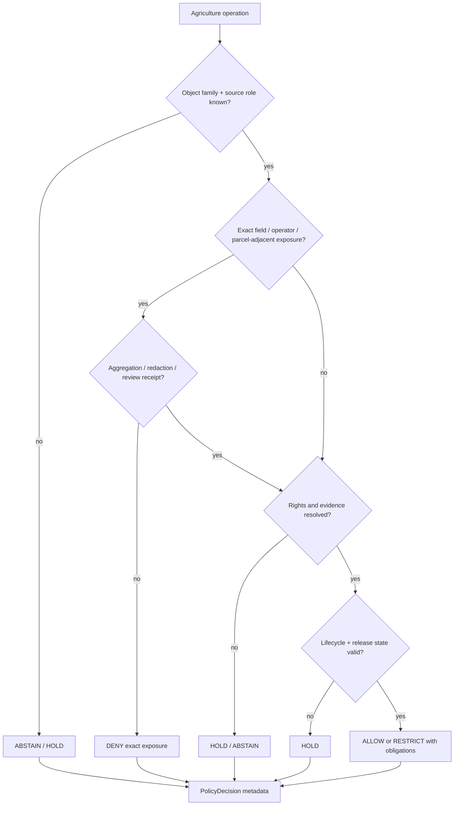

<!-- [KFM_META_BLOCK_V2]
doc_id: kfm://policy/domains/agriculture
title: Agriculture Domain Policy README
type: policy-readme
version: v0.1
status: draft
owners: OWNER_TBD — Agriculture steward · Policy steward · Sensitivity steward · Rights steward · Docs steward
created: 2026-06-15
updated: 2026-06-15
policy_label: restricted
related:
  - ../README.md
  - ../../../docs/domains/agriculture/POLICY.md
  - ../../../docs/domains/agriculture/SENSITIVITY.md
  - ../../../docs/domains/agriculture/README.md
  - ../../../docs/domains/agriculture/DOMAIN.md
  - ../../../docs/domains/agriculture/OBJECTS.md
  - ../../../docs/domains/agriculture/OBJECT_FAMILIES.md
  - ../../../docs/domains/agriculture/PIPELINE.md
  - ../../../docs/domains/agriculture/CROSS_LANE.md
  - ../../../policy/sensitivity/
  - ../../../policy/rights/
  - ../../../policy/release/
  - ../../../schemas/contracts/v1/domains/agriculture/
  - ../../../contracts/domains/agriculture/
  - ../../../packages/policy-runtime/README.md
  - ../../../tests/domains/agriculture/
  - ../../../fixtures/domains/agriculture/
tags: [kfm, policy, domains, agriculture, admissibility, sensitivity, rights, release, redaction, aggregation, fail-closed]
notes:
  - "Replaces the greenfield Agriculture policy stub with a bounded domain-policy README."
  - "This directory is for Agriculture-specific executable policy materials or policy-lane documentation only; it is not a home for docs, contracts, schemas, tests, fixtures, packages, pipelines, registries, or lifecycle data."
  - "Agriculture policy intent is described in docs/domains/agriculture/POLICY.md; this lane is the proposed executable/bundle-side policy home."
  - "Concrete policy files, bundle syntax, tests, fixtures, CI binding, and runtime enforcement remain NEEDS VERIFICATION."
[/KFM_META_BLOCK_V2] -->

<a id="top"></a>

<div align="center">

# Agriculture Domain Policy

`policy/domains/agriculture/`

**Agriculture-specific admissibility policy lane for field/operator exposure, aggregate-release posture, rights, sensitivity, redaction, aggregation, review, and release-adjacent gates.**


[Scope](#1-scope) · [Repo fit](#2-repo-fit) · [Boundary](#3-authority-boundary) · [Inputs](#5-inputs) · [Exclusions](#6-exclusions) · [Policy families](#7-policy-families) · [Definition of done](#14-definition-of-done)

</div>

---

> [!IMPORTANT]
> **Status:** draft / `NEEDS VERIFICATION`  
> **Owners:** `OWNER_TBD` — Agriculture steward · Policy steward · Sensitivity steward · Rights steward · Docs steward  
> **Path:** `policy/domains/agriculture/README.md`  
> **Responsibility root:** `policy/` — policy-as-code and policy documentation  
> **Truth posture:** CONFIRMED file path / PROPOSED Agriculture policy-lane contract / UNKNOWN runtime enforcement

> [!CAUTION]
> Field-level, operator-resolved, private parcel-adjacent, NASS-confidential, or quarantine-adjacent Agriculture material must fail closed for public exact exposure unless a reviewed policy path explicitly allows a transformed, aggregated, redacted, generalized, or restricted output.

---

## Quick jump

- [1. Scope](#1-scope)
- [2. Repo fit](#2-repo-fit)
- [3. Authority boundary](#3-authority-boundary)
- [4. Default posture](#4-default-posture)
- [5. Inputs](#5-inputs)
- [6. Exclusions](#6-exclusions)
- [7. Policy families](#7-policy-families)
- [8. Diagram](#8-diagram)
- [9. Decision vocabulary](#9-decision-vocabulary)
- [10. Agriculture obligations](#10-agriculture-obligations)
- [11. Child-file contract](#11-child-file-contract)
- [12. Inspection path](#12-inspection-path)
- [13. Validation expectations](#13-validation-expectations)
- [14. Definition of done](#14-definition-of-done)
- [15. Open verification items](#15-open-verification-items)

---

## 1. Scope

`policy/domains/agriculture/` is the proposed executable and bundle-side policy lane for Agriculture domain admissibility.

It should hold Agriculture policy modules, bundle manifests, rule documentation, fixtures pointers, or lane READMEs that enforce the intent described by `docs/domains/agriculture/POLICY.md` and `docs/domains/agriculture/SENSITIVITY.md`.

In scope:

- Agriculture sensitivity, rights, promotion, runtime, release, and redaction policy material
- field/operator exposure and private parcel-adjacent joins
- aggregate-only and public-safe materialization gates
- source-role, evidence, validation, receipt, and review prerequisites
- finite policy outcomes and safe reason codes
- obligations such as aggregation, redaction, generalization, audience restriction, review, delay, or rollback

Out of scope:

- Agriculture doctrine and scope documents
- Agriculture semantic contracts
- Agriculture JSON Schemas
- Agriculture package helper code
- Agriculture executable pipelines
- source acquisition jobs
- lifecycle data and registry records
- release approval or rollback authority
- public UI or API implementation

[Back to top](#top)

---

## 2. Repo fit

| Concern | Owning root | Expected relationship |
|---|---|---|
| Agriculture domain policy | `policy/domains/agriculture/` | This README and future Agriculture policy files, if accepted |
| Domain policy parent | `policy/domains/` | Shared domain-policy root contract |
| Agriculture policy intent | `docs/domains/agriculture/POLICY.md` | Human-readable policy reference; not itself executable bundle |
| Agriculture sensitivity posture | `docs/domains/agriculture/SENSITIVITY.md` | Human-readable sensitivity, rights, and release posture |
| Agriculture doctrine and scope | `docs/domains/agriculture/` | Domain docs; not executable policy authority |
| Agriculture contracts | `contracts/domains/agriculture/` | Object meaning and field intent |
| Agriculture schemas | `schemas/contracts/v1/domains/agriculture/` | Machine-readable shape |
| Tests and fixtures | `tests/domains/agriculture/`, `fixtures/domains/agriculture/` | Enforceability proof; presence remains `NEEDS VERIFICATION` |
| Runtime policy evaluation | `packages/policy-runtime/` | Evaluator helper code; not policy authority |

> [!NOTE]
> The prior stub claimed this folder could hold docs, contracts, schemas, fixtures, tests, packages, pipelines, registries, or data artifacts. This README narrows the lane to policy responsibility only.

## 3. Authority boundary

This lane may decide Agriculture-specific admissibility. It must not become Agriculture doctrine, schema authority, contract authority, lifecycle storage, pipeline code, release authority, or public serving code.

```text
policy/domains/agriculture/               = Agriculture admissibility policy
docs/domains/agriculture/                 = Agriculture doctrine, scope, status, policy intent
contracts/domains/agriculture/            = Agriculture object meaning
schemas/contracts/v1/domains/agriculture/ = Agriculture machine shape
packages/domains/agriculture/             = Agriculture helper code, if present
pipelines/domains/agriculture/            = Agriculture transformations, if present
data/                                     = lifecycle artifacts, receipts, proofs, registry
release/                                  = publication, correction, rollback control
```

## 4. Default posture

Agriculture policy should fail closed when support is missing.

A policy gate should return `DENY`, `RESTRICT`, `HOLD`, or `ABSTAIN` when any of these are unresolved:

- object family or domain slug
- source role and provenance
- rights or license posture
- sensitivity tier
- field/operator or parcel-adjacent exposure risk
- cross-lane People, Land, Soil, Hydrology, Habitat, or Infrastructure joins
- EvidenceRef / EvidenceBundle support
- validation report
- redaction or aggregation receipt
- release state and rollback target
- required steward review

## 5. Inputs

| Input family | Examples | Required posture |
|---|---|---|
| Agriculture object context | `OF-AG-*` family, field/crop/irrigation/production/derived layer reference | Explicit and domain-owned or marked `NEEDS VERIFICATION` |
| Source context | NASS, NRCS, USDA, remote-sensing, local upload, manual curation | Source role and rights must be explicit |
| Spatial context | field, parcel-adjacent, county, watershed, generalized tile, aggregate layer | Most restrictive precision rule wins |
| Evidence context | EvidenceRef, EvidenceBundle status, citation validation | Required for claim-bearing outputs |
| Sensitivity context | aggregate public, field-level, operator-resolved, private-parcel-adjacent, quarantine-adjacent | Fail closed when unresolved |
| Rights context | public-domain, licensed, restricted, unclear, attribution required | Required before release or render |
| Release context | candidate, released, superseded, withdrawn, rollback requested | Explicit; never inferred from path alone |
| Audit context | policy version, reason code, reviewer, receipt refs | Required for consequential decisions |

## 6. Exclusions

| Does not belong here | Correct home |
|---|---|
| Agriculture domain docs | `docs/domains/agriculture/` |
| Agriculture semantic contracts | `contracts/domains/agriculture/` |
| Agriculture schemas | `schemas/contracts/v1/domains/agriculture/` |
| Agriculture helper libraries | `packages/domains/agriculture/` |
| Agriculture pipelines | `pipelines/domains/agriculture/` |
| Agriculture pipeline specs | `pipeline_specs/` or verified spec home |
| Source records, registry, receipts, proofs, tiles, catalog, triplets | `data/` lifecycle roots |
| Release manifests and rollback cards | `release/` |
| Public API or UI surfaces | `apps/` and governed UI/API packages |
| Secrets, API keys, private source material | Secret manager / deployment config, not repo docs |

## 7. Policy families

The Agriculture policy reference names these policy families as intent; implementation remains `NEEDS VERIFICATION` until files, bundles, tests, and CI are inspected.

| Family | Policy question | Default posture |
|---|---|---|
| Sensitivity | Can this Agriculture object be exposed at the requested precision? | Deny exact sensitive exposure; allow only reviewed transforms |
| Rights | Does source/license posture permit use and display? | Hold or deny when rights are unclear |
| Promotion | Can candidate Agriculture data cross a lifecycle gate? | Hold without validation, receipts, and steward review |
| Runtime | Can a governed runtime answer or render from this material? | Abstain when evidence or policy support is unresolved |
| Release | Can public-safe materialization proceed? | Requires release authority and rollback target |
| Redaction / aggregation | Which transform is required before exposure? | Preserve obligations and receipts |

## 8. Diagram



## 9. Decision vocabulary

| Decision | Meaning | Required behavior |
|---|---|---|
| `ALLOW` | Operation may proceed under supplied Agriculture context | Scope to object, source, precision, audience, and version |
| `DENY` | Policy blocks exact exposure or unsafe action | Return safe reason code and do not expose protected detail |
| `RESTRICT` | Operation may proceed with aggregation, redaction, generalization, audience restriction, delay, or review | Preserve obligations downstream |
| `HOLD` | Steward review, validation, receipt, proof, or release gate is pending | Do not promote or render publicly |
| `ABSTAIN` | Evidence, source, rights, or policy support is unresolved | Preserve unresolved handles where safe |
| `ERROR` | Policy machinery, schema, runtime, or repository support failed | Fail closed and record failure |

## 10. Agriculture obligations

| Obligation | Example effect |
|---|---|
| `aggregate_required` | Publish county/region/authorized aggregate, not operator or field detail |
| `redaction_required` | Withhold operator, private parcel-adjacent, or restricted source detail |
| `generalization_required` | Reduce spatial or attribute precision |
| `rights_review_required` | Route unclear or restricted source material to rights review |
| `sensitivity_review_required` | Route exact or joined Agriculture material to sensitivity review |
| `receipt_required` | Require AggregationReceipt, RedactionReceipt, TransformReceipt, or equivalent |
| `citation_required` | Preserve safe source/evidence citation where display is allowed |
| `rollback_required` | Require rollback target before public-impacting release |

## 11. Child-file contract

Future files under this lane should state:

- policy family and Agriculture object families covered
- inputs and required context
- finite outcomes
- obligations and reason codes
- rights and sensitivity assumptions
- required receipts and review records
- fixtures and tests
- rollback and correction expectations
- links to `docs/domains/agriculture/POLICY.md` and `SENSITIVITY.md`

## 12. Inspection path

Concrete Agriculture policy files, bundles, fixtures, tests, validators, and CI remain `NEEDS VERIFICATION`.

```bash
find policy/domains/agriculture -maxdepth 4 -type f | sort
find docs/domains/agriculture contracts/domains/agriculture schemas/contracts/v1/domains/agriculture -maxdepth 4 -type f 2>/dev/null | sort
find tests/domains/agriculture fixtures/domains/agriculture -maxdepth 5 -type f 2>/dev/null | sort
```

## 13. Validation expectations

Useful validation for this lane should cover:

- field/operator exact exposure without transform returns `DENY`
- unresolved source role returns `ABSTAIN` or `HOLD`
- unclear rights returns `HOLD` or `DENY`
- missing EvidenceBundle support returns `ABSTAIN`
- missing aggregation/redaction receipt blocks promotion
- cross-lane joins inherit the most restrictive policy row
- public renders use governed APIs and released/public-safe artifacts only
- policy decisions emit stable safe reason codes and receipt-ready metadata

## 14. Definition of done

- [ ] Owners are confirmed and `OWNER_TBD` is replaced.
- [ ] Agriculture policy files and bundle structure are inventoried.
- [ ] Runtime policy language and bundle location are confirmed.
- [ ] Fixtures cover allow, deny, restrict, hold, abstain, and error outcomes.
- [ ] Rights, sensitivity, aggregation, redaction, and release obligations are tested.
- [ ] Cross-lane join policy is linked or implemented.
- [ ] Receipt requirements are linked to accepted schemas or contracts.
- [ ] Public API bypass checks are covered by tests or policy fixtures.
- [ ] Release and rollback requirements remain separate from policy allow decisions.

## 15. Open verification items

| Item | Why it matters |
|---|---|
| Confirm actual child files under `policy/domains/agriculture/` | Prevents stale stub claims |
| Confirm Rego/OPA or equivalent policy language | Prevents non-runnable guidance |
| Confirm policy bundle manifest path | Required for runtime use |
| Confirm tests and fixtures | Required before enforcement claims |
| Confirm Agriculture object-family register | Required for object-specific gates |
| Confirm aggregation/redaction receipt schemas | Required for public-safe transforms |
| Confirm cross-lane join composition | Prevents private parcel/operator leakage |
| Confirm release-gate integration | Required before publication claims |

<details>
<summary>Appendix A — no-loss preservation note</summary>

The previous file was a greenfield scaffold that over-broadened this directory by saying docs, contracts, schemas, fixtures, tests, packages, pipelines, registries, and data lifecycle artifacts could belong here. This README narrows the lane to Agriculture policy only and routes other materials back to their owning roots.

It preserves the Agriculture policy intent already documented in `docs/domains/agriculture/POLICY.md` while keeping executable policy, tests, fixtures, runtime enforcement, and CI status marked `NEEDS VERIFICATION`.

</details>

## Status summary

`policy/domains/agriculture/` should define Agriculture-specific admissibility policy only when it remains subordinate to Agriculture doctrine, contracts, schemas, lifecycle, evidence, release, correction, and rollback boundaries.

It should keep Agriculture policy fail-closed, reason-coded, obligation-preserving, fixture-tested, and routed through governed interfaces without becoming domain doctrine, schema authority, lifecycle storage, package code, pipeline code, or release authority.

<p align="right"><a href="#top">Back to top</a></p>
