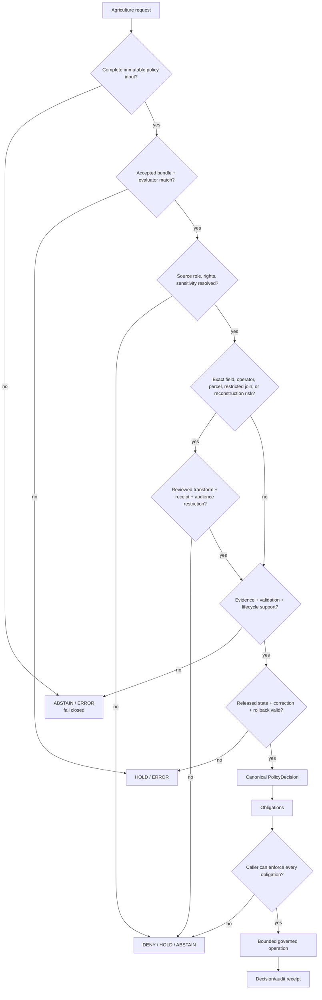

<!-- [KFM_META_BLOCK_V2]
doc_id: kfm://policy/domains/agriculture
title: Agriculture Domain Policy README
type: readme; directory-readme; domain-policy-boundary; policy-index
version: v0.2
status: draft; repository-grounded; policy-scaffolds; evaluator-unimplemented; fail-closed; non-authoritative-for-release
owners: OWNER_TBD — Agriculture steward · Policy steward · Sensitivity and rights steward · Privacy reviewer · Source steward · Contract/schema steward · Validator/test steward · Runtime steward · Release steward · Security steward · Docs steward
created: 2026-06-15
updated: 2026-07-19
supersedes: v0.1 Agriculture domain policy guide
policy_label: restricted-review; policy; agriculture; rights; sensitivity; aggregation; redaction; finite-outcomes; no-public-authority
current_path: policy/domains/agriculture/README.md
owning_root: policy/
responsibility: >
  Agriculture-specific policy boundary and repository index. It records which policy questions
  belong here, the current policy-source inventory and maturity, the required input and decision
  contracts, finite outcomes and obligations, cross-lane composition rules, test and review
  burdens, and the smallest safe implementation sequence without treating scaffolds, READMEs,
  schemas, workflow holds, or file presence as executable enforcement.
truth_posture: >
  CONFIRMED target README and canonical singular policy root; three direct Agriculture Rego
  sources are present but are PROPOSED stubs/scaffolds with inconsistent package namespaces and
  default semantics; redaction_profiles.yaml is a PROPOSED placeholder; the aggregation-threshold
  child README is repository-grounded documentation only; a separate sensitivity Agriculture lane
  contains a placeholder threshold YAML and farm-operator-join scaffold; policy-test and
  domain-agriculture workflows are readiness/drift guards rather than policy evaluation; the policy
  runtime remains a comment-only placeholder; Agriculture policy-deny and aggregate-only test lanes
  are README-led and do not establish executable enforcement /
  PROPOSED bounded Agriculture policy architecture, policy-family map, normalized decision contract,
  reason-code and obligation families, public-surface boundary, review model, validation matrix,
  and implementation sequence /
  CONFLICTED deny-named and abstain-named Rego packages defaulting deny to false versus deny-field
  and farm-operator scaffolds defaulting allow to false; abstain_on_ambiguous exposing a deny relation
  rather than an abstain result; multiple Rego namespace conventions; domain-policy versus
  sensitivity-policy placement; engine-native ALLOW/RESTRICT/HOLD vocabulary versus the current
  PolicyDecision schema's ANSWER/ABSTAIN/DENY/ERROR vocabulary; documentation claims of canonical
  policy artifacts versus unaccepted bundle/evaluator activation /
  UNKNOWN accepted policy bundle, manifest, evaluator, selection rule, deployment binding, real
  Agriculture policy tests, fixture payloads, validator implementation, emitted PolicyDecision
  records, reason-code registry, obligation registry, production consumers, branch-protection
  significance, monitoring, and release-gate adoption /
  NEEDS VERIFICATION owners and CODEOWNERS, accepted package namespace, default-result semantics,
  canonical child placement, policy input contract, source-specific rights rules, sensitive join
  composition, bundle identity and digest, evaluator compatibility, deterministic fixtures,
  no-network tests, API/UI/map/AI obligation handling, correction propagation, and rollback drills.
evidence_snapshot:
  repository: bartytime4life/Kansas-Frontier-Matrix
  repository_id: "1059091169"
  visibility: public
  base_ref: main
  base_commit: 25c0a66f3a722926828b32189802442d40b9b5fd
  prior_blob: ba73c387e16f70895f32444e489d6d55dd577b75
  policy_root_blob: 09cd966ab188d5e831960869117522a98274cb7f
  deny_unpublished_blob: 35c813606f37d3578230092fc526430e256b134d
  abstain_on_ambiguous_blob: 7733c0d6389e5e159346ab0bbd118b300970d728
  deny_field_level_blob: dc626a6975309e1356876715385c748bc30c18c2
  redaction_profiles_blob: f13fbb93fb4b0b53f764c1d21b8189f81cfc0304
  aggregation_thresholds_readme_blob: b5482dc8306c225e718e64fe6d5d879742e93654
  sensitivity_threshold_placeholder_blob: 31947ca3e468a967aed3fc5d44699130b7d588fd
  farm_operator_join_blob: 1b6128c4e2470f198edb6464424c6effc9d246dd
  agriculture_policy_doc_blob: be42d02fae601f4b90a220f336ec36a848d2e51a
  agriculture_sensitivity_doc_blob: 9d25f63d471af78899d8db2ad39a3921c4f11fac
  policy_deny_test_readme_blob: 07f3dcb643e49ce54bae06a17399ee3829d72d1c
  aggregate_only_test_readme_blob: e872e11c71840cb806717bf1199c74c4a01d4e37
  aggregate_only_placeholder_test_blob: 97939b939122f029f35ecf12c81f5989df00ae63
  agriculture_validator_readme_blob: 40d268b425d9939ab6a8cda7bd197ba758572d3f
  policy_test_workflow_blob: 003192e1adb3be65e727b58c3414c7ce0f8cceed
  agriculture_workflow_blob: 1dd9938b92de61c7d905f30170cf6394e6c06ea1
  policy_runtime_core_blob: e7e14cf39ae6919fbbc80f1b471de6b907292edb
  policy_bundles_readme_blob: 77f59c399fbce668c916cbbc385009121d6169f4
related:
  - ../README.md
  - ../../README.md
  - ../../../docs/domains/agriculture/POLICY.md
  - ../../../docs/domains/agriculture/SENSITIVITY.md
  - ../../../docs/domains/agriculture/PIPELINE.md
  - ../../../docs/domains/agriculture/CROSS_LANE.md
  - ../../../docs/domains/agriculture/OBJECTS.md
  - ../../../docs/domains/agriculture/OBJECT_FAMILIES.md
  - ../../../docs/domains/agriculture/policy/README.md
  - ./aggregation_thresholds/README.md
  - ./deny_unpublished.rego
  - ./abstain_on_ambiguous.rego
  - ./deny-field-level.rego
  - ./redaction_profiles.yaml
  - ../../sensitivity/agriculture/aggregation_thresholds.yaml
  - ../../sensitivity/agriculture/farm_operator_join.rego
  - ../../../contracts/policy/policy_input_bundle.md
  - ../../../contracts/policy/policy_decision.md
  - ../../../schemas/contracts/v1/policy/policy_input_bundle.schema.json
  - ../../../schemas/contracts/v1/policy/policy_decision.schema.json
  - ../../../tests/domains/agriculture/policy_deny/README.md
  - ../../../tests/domains/agriculture/aggregate_only/README.md
  - ../../../fixtures/domains/agriculture/
  - ../../../tools/validators/agriculture/README.md
  - ../../../packages/policy-runtime/README.md
  - ../../../policy/bundles/README.md
  - ../../../data/receipts/aggregation/README.md
  - ../../../release/agriculture/README.md
  - ../../../docs/doctrine/directory-rules.md
  - ../../../docs/doctrine/ai-build-operating-contract.md
  - ../../../.github/workflows/policy-test.yml
  - ../../../.github/workflows/domain-agriculture.yml
tags:
  - kfm
  - policy
  - agriculture
  - domain-policy
  - fail-closed
  - policy-input
  - policy-decision
  - source-role
  - rights
  - sensitivity
  - aggregation
  - redaction
  - field-level-deny
  - farm-operator-join
  - evidence
  - finite-outcomes
  - obligations
  - no-network
  - release-gated
  - correction
  - rollback
notes:
  - "This revision changes only policy/domains/agriculture/README.md plus the required AI-generated provenance receipt."
  - "No policy rule, numeric threshold, bundle, evaluator, schema, contract, fixture, test, validator, workflow, receipt instance, release artifact, data object, deployment, or public behavior is created or changed."
  - "A policy file's presence is not activation; a green readiness hold is not policy enforcement."
  - "The most restrictive applicable source, rights, sensitivity, audience, join, lifecycle, and release rule wins."
[/KFM_META_BLOCK_V2] -->

<a id="top"></a>

# Agriculture Domain Policy

> **One-line purpose.** Govern Agriculture-specific allow, deny, restrict, abstain, review, redaction, aggregation, and release-adjacent decisions while keeping evidence, rights, sensitivity, validation, receipts, release authority, and public serving boundaries explicit and separate.

<p>
  
  
  
  
  
  
  
</p>

> [!IMPORTANT]
> **This directory is policy authority only after its exact rule set, input contract, bundle identity, evaluator, tests, and review state are accepted.** Today it contains policy documentation and proposed source scaffolds. It does not establish production enforcement.

> [!CAUTION]
> **Current Rego defaults are not coherent enough to activate.** Two packages named for denial or abstention default `deny := false`; two other Agriculture-related scaffolds default `allow := false`; package namespaces differ; and the ambiguous-input file exposes no abstain result. Do not infer a safe engine contract from filenames.

> [!WARNING]
> **Agriculture aggregation does not erase sensitivity.** Field, operator, person, parcel, ownership, proprietary yield, pesticide/application, well-to-field, and restricted-source joins remain deny/restrict/review candidates even when some inputs are aggregated.

**Quick links:** [Purpose](#purpose) · [Authority](#authority-level) · [Status](#status-and-repository-evidence) · [Belongs](#what-belongs-here) · [Does not](#what-does-not-belong-here) · [Inventory](#confirmed-policy-inventory) · [Families](#policy-family-map) · [Inputs](#minimum-policy-input-contract) · [Decisions](#decision-vocabulary-and-normalization) · [Obligations](#obligation-families) · [Cross-lane](#cross-lane-composition) · [Public surfaces](#public-surface-contract) · [Validation](#validation-tests-and-ci) · [Review](#review-burden-and-separation-of-duties) · [Related](#related-folders) · [Conflicts](#adrs-and-conflict-register) · [Sequence](#smallest-sound-implementation-sequence) · [Done](#definition-of-done) · [Open](#open-verification-register) · [Rollback](#maintenance-correction-and-rollback)

---

## Purpose

`policy/domains/agriculture/` is the Agriculture domain segment under KFM's canonical singular `policy/` responsibility root.

Its durable question is:

> Given a fully declared Agriculture operation and governed context, what bounded action is permitted, refused, narrowed, held for review, or left unanswered—and which obligations must downstream systems preserve?

A complete Agriculture policy implementation should decide only after it knows:

1. the requested operation and audience;
2. the Agriculture object family and source role;
3. spatial and temporal precision;
4. rights, license, confidentiality, consent, and source-use posture;
5. sensitivity and re-identification risk;
6. EvidenceRef/EvidenceBundle support;
7. validation and lifecycle state;
8. aggregation, redaction, review, and receipt state;
9. release, correction, withdrawal, and rollback context;
10. the exact policy bundle, evaluator profile, and decision contract being used.

### In scope

- public, reviewer, restricted, and denied Agriculture audience decisions;
- exact-field, operator, parcel-adjacent, and private-party exposure controls;
- source-role and evidence prerequisites;
- rights, confidentiality, sensitivity, and consent inheritance;
- aggregation, redaction, generalization, delay, and review obligations;
- unpublished, superseded, withdrawn, stale, quarantine-adjacent, or rollback-blocked material;
- cross-lane Agriculture joins;
- finite decisions, safe reason codes, and obligation propagation;
- policy-bundle selection and replay requirements once accepted;
- policy tests and negative cases;
- policy-change correction and rollback posture.

### Out of scope

- Agriculture domain meaning or object definitions;
- machine-shape authority;
- data acquisition, storage, normalization, or transformation;
- evidence creation or proof closure;
- source registry authority;
- release approval;
- application serving, map rendering, exports, or AI generation;
- numeric aggregation thresholds that lack accepted authority;
- agronomic, financial, legal, safety, or operational advice.

[Back to top](#top)

---

## Authority level

**Canonical policy responsibility / non-authoritative for adjacent concerns.**

| Concern | Authority home | Agriculture policy role |
|---|---|---|
| Agriculture policy rule source | Accepted lanes under `policy/` | Owns reviewed decision logic after acceptance. |
| Agriculture policy intent | [`docs/domains/agriculture/POLICY.md`](../../../docs/domains/agriculture/POLICY.md) | Implements and cites intent; does not silently contradict it. |
| Agriculture sensitivity doctrine | [`docs/domains/agriculture/SENSITIVITY.md`](../../../docs/domains/agriculture/SENSITIVITY.md) | Applies the most restrictive relevant row. |
| Object meaning | [`contracts/domains/agriculture/`](../../../contracts/domains/agriculture/) | Consumes semantic meaning; does not redefine it. |
| Machine shape | [`schemas/contracts/v1/`](../../../schemas/contracts/v1/) | Consumes schemas; policy source is not a schema home. |
| Source identity and rights facts | Governed `data/registry/` lanes and review records | Evaluates supplied facts; does not invent them. |
| Evidence | EvidenceRef/EvidenceBundle and `data/proofs/` families | Requires support; cannot create evidence closure. |
| Transformation | `pipelines/`, `packages/`, or accepted tools | Emits obligations; does not perform hidden transformation. |
| Validation | `tools/validators/` and `tests/` | Is validated and tested; a validator is not policy authority. |
| Receipt instances | `data/receipts/` | May require receipts; does not store instances here. |
| Release, correction, rollback | `release/` | Supplies a policy input; cannot approve publication. |
| Policy execution | Accepted policy runtime/evaluator | Executes the exact accepted bundle; helper code does not own rule values. |
| Public API, UI, map, export, AI | Governed applications and released artifacts | Must preserve decisions and obligations; cannot choose policy ad hoc. |
| CI | `.github/workflows/` | Orchestrates checks; a green hold is not policy enforcement. |

### Governing order

When Agriculture policy sources conflict, resolve in this order:

1. KFM core invariants and operating law.
2. Accepted ADRs that explicitly change policy or placement.
3. Sensitive-domain and most-restrictive-row rules.
4. Agriculture policy and sensitivity doctrine.
5. source-specific rights, confidentiality, consent, and use restrictions;
6. accepted policy contract/schema/bundle definitions;
7. this README;
8. current proposed scaffolds and examples.

A lower-ranked artifact must not weaken a higher-ranked denial, restriction, review, or rollback obligation.

[Back to top](#top)

---

## Status and repository evidence

### Confirmed direct inventory

At `main@25c0a66f3a722926828b32189802442d40b9b5fd`, bounded repository inspection establishes:

```text
policy/domains/agriculture/
├── README.md
├── abstain_on_ambiguous.rego
├── aggregation_thresholds/
│   └── README.md
├── deny-field-level.rego
├── deny_unpublished.rego
└── redaction_profiles.yaml
```

| Surface | Confirmed state | Safe conclusion |
|---|---|---|
| This README | Existing v0.1 draft | Parent policy documentation exists but predates the detailed child and workflow evidence. |
| `deny_unpublished.rego` | Fourteen-line `PROPOSED` stub; package `kfm.agriculture_deny_unpublished`; `default deny := false`; only a commented example | Filename and package suggest denial, but no active denial rule exists. |
| `abstain_on_ambiguous.rego` | Fourteen-line `PROPOSED` stub; package `kfm.agriculture_abstain_on_ambiguous`; `default deny := false`; commented example writes `deny[reason]` | No machine-level abstain outcome is implemented. |
| `deny-field-level.rego` | Six-line `PROPOSED` scaffold; generated namespace; `default allow := false` | Fail-closed-looking default exists, but no input contract, reason, obligation, or test is established. |
| `redaction_profiles.yaml` | Seven-line `PROPOSED` placeholder | No redaction profile values or transform contract are implemented. |
| `aggregation_thresholds/README.md` | Repository-grounded v0.2 documentation; no numeric thresholds accepted | Disclosure-control policy expectations exist; executable threshold enforcement does not. |

### Adjacent Agriculture policy surfaces

| Surface | Confirmed state | Boundary consequence |
|---|---|---|
| `policy/sensitivity/agriculture/aggregation_thresholds.yaml` | Eight-line `PROPOSED` placeholder | Placement overlaps the domain child; no numeric values exist. |
| `policy/sensitivity/agriculture/farm_operator_join.rego` | Six-line generated scaffold; `default allow := false` | Sensitive-join intent exists without active decision logic. |
| `policy/sensitivity/README.md` | Five-line greenfield stub | Cross-cutting sensitivity bundle architecture is not established. |
| `policy/bundles/` | README-only in bounded evidence | No accepted bundle artifact, manifest, lock, selector, or active deployment is established. |
| `packages/policy-runtime/.../core.py` | Comment-only greenfield placeholder | No policy evaluator is implemented. |
| `tools/validators/agriculture/` | Repository-grounded README; direct lane remains README-only | No Agriculture validator executable is established. |
| `tests/domains/agriculture/policy_deny/` | README-only test contract | Negative policy expectations exist without collected lane-local tests. |
| `tests/domains/agriculture/aggregate_only/` | README-only test contract | Aggregate-preservation expectations exist without lane-local executable proof. |
| `tests/domains/agriculture/test_nass_aggregate_only.py` | Docstring-only placeholder | No pytest assertion is defined. |
| `.github/workflows/policy-test.yml` | Readiness/drift guard | It confirms absence of an accepted evaluator/test lane; it evaluates no policy. |
| `.github/workflows/domain-agriculture.yml` | Agriculture readiness holds | It emits no Agriculture PolicyDecision, proof, release, or publication authority. |

### Current maturity determination

**CONFIRMED:** Agriculture policy source scaffolds and substantial documentation exist.

**UNKNOWN:** executable coverage, active bundle selection, evaluator compatibility, deployed enforcement, production callers, current decision receipts, and release-gate use.

**NEEDS VERIFICATION:** whether the direct inventory is byte-complete; current branch protection; CODEOWNERS; source-specific terms; owners; and current workflow run results.

> [!NOTE]
> Repository presence is not policy activation. A Rego file, YAML file, schema-valid input, passing readiness workflow, or documentation page cannot be cited as evidence that an Agriculture request would be safely denied or allowed at runtime.

[Back to top](#top)

---

## What belongs here

Accepted Agriculture policy material may include:

- reviewed Rego or equivalent decision modules;
- Agriculture policy data documents whose values are policy authority;
- package-local policy documentation;
- references to accepted shared policy inputs and decisions;
- Agriculture-specific reason-code and obligation mappings;
- bundle inclusion metadata where the canonical bundle design requires it;
- policy-local tests only if the repository's accepted convention places engine-native tests beside rule source;
- a child README for a coherent policy sublane;
- migration, deprecation, correction, and rollback notes for Agriculture policy source.

Every material policy file should identify:

- package or module identity;
- policy family;
- supported operation and object families;
- input contract/version;
- canonical output or normalization contract;
- default behavior;
- reason codes;
- obligations;
- rights and sensitivity dependencies;
- evidence, validation, lifecycle, and release prerequisites;
- fixtures and tests;
- bundle/manifest inclusion;
- change and rollback procedure.

[Back to top](#top)

---

## What does not belong here

| Material | Correct authority home |
|---|---|
| Agriculture doctrine, architecture, object descriptions, and human policy rationale | `docs/domains/agriculture/` |
| Semantic object contracts | `contracts/` |
| JSON Schemas and machine-shape definitions | `schemas/` |
| Source descriptors and source-rights records | `data/registry/` and governed review records |
| Raw, work, quarantine, processed, catalog, triplet, or published data | Corresponding `data/` lifecycle lane |
| AggregationReceipt, RedactionReceipt, RunReceipt, or PolicyDecision instances | Accepted `data/receipts/` lane |
| EvidenceBundle, ProofPack, or citation proof | `data/proofs/` and evidence families |
| Transform implementation | `pipelines/`, `packages/`, or `tools/` according to responsibility |
| Synthetic fixtures | `fixtures/` |
| Enforceability tests | `tests/` unless an accepted policy-engine convention requires colocated native tests |
| General policy runtime/evaluator code | `packages/policy-runtime/` or accepted runtime boundary |
| ReleaseManifest, PromotionDecision, CorrectionNotice, WithdrawalNotice, RollbackCard | `release/` |
| Governed API, UI, map, export, or AI response code | `apps/` and shared packages |
| Credentials, private source payloads, operator identities, parcel joins, or restricted coordinates | Governed private storage—not repository policy docs |
| Generic agronomic advice or thresholds unsupported by accepted evidence/authority | Nowhere in this lane |

[Back to top](#top)

---

## Default posture

Agriculture policy must fail closed when required context is missing, contradictory, stale, unsupported, or unavailable.

The default public posture is:

```text
exact field / operator / person / parcel / private-party detail
  → DENY or HOLD
  → apply reviewed aggregation / redaction / generalization only when authorized
  → require evidence, rights, validation, receipt, review, release, correction, rollback
  → serve only through governed interfaces
```

### Conditions that block an affirmative public result

- unknown operation or object family;
- unknown or collapsed source role;
- unclear rights, confidentiality, consent, or license;
- unresolved sensitivity tier or audience;
- field-, operator-, person-, parcel-, ownership-, irrigation-, or private-party adjacency;
- NASS-confidential or source-restricted detail;
- unsupported spatial, temporal, or attribute precision;
- missing EvidenceRef/EvidenceBundle support;
- missing validation report;
- missing required aggregation, redaction, transform, or review receipt;
- candidate, quarantine, superseded, withdrawn, stale, or rollback-blocked state;
- missing correction path or rollback target;
- missing or mismatched policy bundle identity;
- evaluator failure, input-contract failure, or obligation-handler failure;
- untested policy change.

### Anti-collapse rules

Agriculture policy must not collapse:

- aggregate statistics into field-level truth;
- remotely sensed or modeled context into observed truth;
- a schema-valid object into an allowed object;
- a validator pass into a PolicyDecision;
- a PolicyDecision into evidence or release approval;
- an AggregationReceipt into proof;
- a public-safe transform into permission for the source detail;
- a reviewer-only object into a public object;
- one source's permissive license into permission for a restricted join;
- a green readiness workflow into runtime enforcement;
- generated prose into policy authority.

[Back to top](#top)

---

## Policy family map

| Family | Policy question | Default posture | Candidate outputs |
|---|---|---|---|
| `source_admission` | May this source/object enter the Agriculture lane for this use? | Hold or deny if role, rights, provenance, or terms are unresolved. | Deny/abstain/hold with safe reason. |
| `sensitivity` | May this object be exposed at the requested precision and audience? | Most restrictive row wins; exact private detail denied. | Deny/restrict/review obligations. |
| `rights` | Do source terms permit processing, derivation, display, export, and retention? | Hold or deny when unclear. | Rights review, attribution, no-export, or deny. |
| `aggregation` | Is the product sufficiently aggregated and resistant to reconstruction? | No numeric threshold is assumed; hold until an accepted profile applies. | Aggregate, suppress, generalize, delay, or deny. |
| `redaction` | Which fields, geometries, attributes, labels, or citations must be withheld? | Redact only under an accepted profile with receipt. | Redaction/generalization obligations. |
| `cross_lane_join` | Does a join increase identifiability or authority beyond either input? | Most restrictive input and derived-risk row wins. | Deny, review, de-identify, aggregate, or abstain. |
| `promotion` | May a candidate cross a lifecycle gate? | Hold without evidence, validation, receipts, policy, review, and rollback support. | Gate denial or bounded readiness. |
| `runtime_access` | May a governed caller answer, render, export, or compare this material? | Abstain/deny on unresolved evidence/policy/release state. | Canonical PolicyDecision plus obligations. |
| `release` | May a released public state transition be requested? | Policy may recommend/deny; `release/` remains the authority. | Policy input to release review. |
| `correction_rollback` | What must happen when source, rights, policy, or release state changes? | Re-evaluate affected outputs; fail closed during uncertainty. | Correct, supersede, withdraw, or rollback request. |

These family names are documentation vocabulary until a contract/schema/bundle makes them normative.

[Back to top](#top)

---

## Minimum policy input contract

A consequential Agriculture decision should receive one immutable, explicit `PolicyInputBundle` or equivalent bounded input. It should not fetch hidden facts during evaluation.

| Input group | Minimum content | Failure posture |
|---|---|---|
| Decision identity | request id, policy family, operation, caller/audience, evaluation time | `ERROR` or `ABSTAIN` if missing |
| Policy identity | bundle id, version, digest, evaluator profile, input-contract version | `ERROR` / `HOLD` on mismatch |
| Object identity | object id/family, domain, source version, candidate/release refs | `ABSTAIN` if unresolved |
| Source context | source id, role, authority class, rights/terms, citation obligations | `HOLD` / `DENY` |
| Spatial context | geometry class, precision, support unit, public/generalized geometry ref | `RESTRICT` / `DENY` |
| Temporal context | valid/source/observed/retrieval/release/correction times as material | `ABSTAIN` / stale restriction |
| Sensitivity context | tier, privacy/re-identification flags, restricted joins, audience | Most restrictive row |
| Evidence context | EvidenceRef resolution, EvidenceBundle/review/proof status | `ABSTAIN` / `DENY` |
| Validation context | schema, semantic, geometry, source-role, cross-lane validation status | `HOLD` / `ERROR` |
| Transform context | aggregation/redaction/generalization profile and receipt refs | `HOLD` / `DENY` |
| Lifecycle context | RAW/WORK/QUARANTINE/PROCESSED/CATALOG/PUBLISHED state and candidate status | Public access denied before release |
| Release context | release id/state, policy/review refs, correction path, rollback target | `HOLD` / `DENY` |
| Prior decision context | superseded decisions, overrides, expiry, correction refs | Re-evaluate or hold |

### Input invariants

- Inputs must be sufficient to replay the decision without live source access.
- Policy must not dereference private payloads merely to decide public exposure.
- Absence of a fact must not be treated as a permissive fact.
- Derived join risk must be represented explicitly.
- Overrides must be scoped, attributable, reviewable, expiring where appropriate, and separately auditable.
- The bundle digest and evaluator profile must be pinned for consequential decisions.

[Back to top](#top)

---

## Decision vocabulary and normalization

Current repository surfaces use more than one vocabulary:

- the current shared `PolicyDecision` schema permits `ANSWER`, `ABSTAIN`, `DENY`, and `ERROR`;
- Agriculture documentation also uses `ALLOW`, `RESTRICT`, and `HOLD`;
- Rego scaffolds expose `allow` or `deny` booleans/sets;
- `abstain_on_ambiguous.rego` currently exposes a `deny` relation rather than an abstain relation.

This is **CONFLICTED** and must be normalized before runtime adoption.

### Recommended separation

| Layer | Purpose | Example vocabulary |
|---|---|---|
| Engine-native result | Internal evaluator output | `allow`, `deny`, `restrict`, `hold`, `abstain`, engine error |
| Canonical policy result | Stable cross-system envelope | Accepted `PolicyDecision` outcome enum |
| Obligations | Required downstream transforms/actions | aggregate, redact, generalize, review, no-export, cite, rollback |
| Runtime response | User-facing finite outcome | ANSWER, ABSTAIN, DENY, ERROR or accepted equivalent |
| Release decision | Publication state transition | separately governed promotion/release outcome |

### Documentation mapping—non-normative

| Agriculture intent | Canonical meaning | Typical obligations |
|---|---|---|
| `ALLOW` | Policy has no blocking rule for the declared operation; adjacent gates still apply. | citation, audit, release checks |
| `RESTRICT` | Operation may proceed only under explicit constraints. | aggregate, redact, generalize, audience restrict, no export |
| `HOLD` | Required human/release/evidence/right/sensitivity state is pending. | review, delayed evaluation, no public surface |
| `ABSTAIN` | Policy lacks sufficient governed context to decide. | retrieve/resolve context; do not guess |
| `DENY` | Policy blocks the requested operation/exposure. | no public output; safe reason only |
| `ERROR` | Evaluation could not complete safely. | fail closed; emit diagnostic without protected data |

This README does not amend the machine enum. An accepted contract/ADR must do that.

### Reason-code requirements

Reason codes should be:

- stable and machine-readable;
- safe to expose at the intended audience;
- specific enough for remediation;
- free of protected payload data;
- versioned or registry-bound;
- paired with obligations where applicable.

Candidate Agriculture reason families include:

- `object_context_unresolved`;
- `source_role_unresolved`;
- `rights_unresolved`;
- `source_terms_restrict_use`;
- `sensitivity_unresolved`;
- `field_level_public_denied`;
- `farm_operator_join_denied`;
- `private_parcel_adjacency`;
- `restricted_source_detail`;
- `evidence_unresolved`;
- `validation_incomplete`;
- `aggregation_profile_missing`;
- `redaction_profile_missing`;
- `small_cell_or_reconstruction_risk`;
- `unpublished_or_candidate_only`;
- `release_state_invalid`;
- `rollback_target_missing`;
- `policy_bundle_mismatch`;
- `evaluator_unavailable`.

These are `PROPOSED` until a shared registry is accepted.

[Back to top](#top)

---

## Obligation families

| Obligation | Required downstream behavior |
|---|---|
| `aggregate_required` | Use only an accepted aggregate profile and record the method/profile. |
| `small_cell_suppression_required` | Suppress unsafe cells and apply complementary suppression where needed. |
| `redaction_required` | Remove protected fields/geometry/labels under a reviewed profile. |
| `generalization_required` | Reduce spatial, temporal, or attribute precision. |
| `source_role_badge_required` | Preserve observed/modeled/aggregate/context/restricted character. |
| `citation_required` | Preserve safe source and evidence citations. |
| `rights_review_required` | Route unclear or restrictive source use to a rights reviewer. |
| `sensitivity_review_required` | Route exact, joined, or reconstruction-prone output to sensitivity/privacy review. |
| `human_review_required` | Require an independently recorded review before the next governed transition. |
| `aggregation_receipt_required` | Emit a receipt recording method, profile, inputs, digest, and affected outputs. |
| `redaction_receipt_required` | Record what transform class was applied and why without leaking protected detail. |
| `no_public_render` | Block public API/UI/map/tile/report/export/AI surfaces. |
| `no_export` | Permit bounded in-app review but deny download or external dissemination. |
| `audience_restriction_required` | Restrict to named reviewer/research/steward roles. |
| `delay_required` | Delay exposure until time/source/sensitivity conditions are satisfied. |
| `correction_path_required` | Link a correction/supersession process before exposure. |
| `rollback_required` | Require a prior known-good target and tested rollback route. |
| `audit_receipt_required` | Record policy bundle/input/decision identity for replay. |

Downstream systems must reject obligations they cannot enforce. Silently dropping an obligation is a policy failure.

[Back to top](#top)

---

## Confirmed policy inventory

### Direct rule/source surfaces

| Path | Package / form | Current default | Current maturity | Activation posture |
|---|---|---:|---|---|
| [`deny_unpublished.rego`](deny_unpublished.rego) | `kfm.agriculture_deny_unpublished` | `deny := false` | Commented example only | **DENY activation** |
| [`abstain_on_ambiguous.rego`](abstain_on_ambiguous.rego) | `kfm.agriculture_abstain_on_ambiguous` | `deny := false` | No abstain relation; commented deny example | **DENY activation** |
| [`deny-field-level.rego`](deny-field-level.rego) | `kfm.generated.policy.domains.agriculture.deny_field_level` | `allow := false` | Generated scaffold only | **DENY activation** |
| [`redaction_profiles.yaml`](redaction_profiles.yaml) | Placeholder YAML | none | No profile values | **DENY activation** |
| [`aggregation_thresholds/README.md`](aggregation_thresholds/README.md) | Human-readable child policy contract | none | Documentation only; no numeric thresholds | Not executable |

### Cross-cutting sensitivity surfaces

| Path | Package / form | Current default | Current maturity | Conflict |
|---|---|---:|---|---|
| [`../../sensitivity/agriculture/aggregation_thresholds.yaml`](../../sensitivity/agriculture/aggregation_thresholds.yaml) | Placeholder YAML | none | No threshold values | Overlaps child sublane |
| [`../../sensitivity/agriculture/farm_operator_join.rego`](../../sensitivity/agriculture/farm_operator_join.rego) | generated sensitivity package | `allow := false` | Scaffold only | Separate namespace/root |

### Activation preconditions

No Agriculture policy source should be activated until:

- a canonical package namespace is accepted;
- default-result semantics are harmonized;
- input and decision contracts are accepted;
- a bundle/manifest includes the exact sources and digest;
- a reviewed evaluator profile exists;
- all rules have deterministic positive and negative fixtures;
- engine-native results normalize to the canonical PolicyDecision;
- obligations have tested handlers;
- reason codes are registry-bound;
- no-network and failure tests pass;
- public-surface denial tests pass;
- policy change correction and rollback are tested;
- owners and independent reviewers approve.

[Back to top](#top)

---

## Agriculture policy flow



The flow produces a bounded policy result. It does not publish data, create evidence, or approve release.

[Back to top](#top)

---

## Cross-lane composition

Agriculture frequently composes with other domains. The join is a new risk-bearing operation, not a neutral lookup.

| Related lane | Common relation | Primary risk | Default composition rule |
|---|---|---|---|
| People / Land | operator, owner, parcel, residence, title, private party | re-identification and living-person/private-land exposure | Exact joins denied for public use; most restrictive row wins. |
| Hydrology | irrigation well, withdrawal, drought, watershed | private well-to-field/operator linkage; source-role collapse | Generalize/de-identify; retain hydrology authority and policy. |
| Soil | map unit, suitability, moisture | modeled suitability presented as field fact | Preserve soil/source role; do not infer operator condition. |
| Atmosphere | weather, smoke, drought, stress | modeled/forecast context presented as observed field impact | Label model/context; abstain from unsupported causal claims. |
| Habitat / Flora / Fauna | habitat, wetlands, rare species/plants | sensitive biological locations exposed via farm/field joins | Apply biological geoprivacy and Agriculture restrictions together. |
| Infrastructure | storage, processing, energy, transport | critical facility or private business exposure | Restrict/generalize according to infrastructure and rights policy. |
| Hazards | flood, fire, drought, storm | operational advice or precise private impact inference | KFM is not an alert authority; preserve official-source context. |
| Geology | groundwater/resource/parent material | unsupported causality or private extraction linkage | Preserve geology authority; require evidence for derived claims. |

### Composition invariants

- The join may be more sensitive than either input.
- Aggregation on one side does not make exact detail on the other side safe.
- Source role and valid time remain attached to each contributing record.
- Policy decisions should cite all controlling policies or a composed bundle identity.
- A downstream transform must not reverse an upstream redaction.
- Public clients receive only released, obligation-compliant derivatives.
- AI may explain a resolved decision; it cannot relax it.

[Back to top](#top)

---

## Public-surface contract

Agriculture policy decisions may affect:

- governed API responses;
- MapLibre layers and feature details;
- Evidence Drawer payloads;
- Focus Mode answers;
- compare views;
- exports and reports;
- stories and screenshots;
- graph/search/vector retrieval;
- AI-generated summaries.

Every caller must:

1. validate the PolicyDecision shape and bundle identity;
2. preserve the outcome, reasons, obligations, audience, scope, and expiry;
3. verify required evidence/release references;
4. enforce every obligation before rendering or exporting;
5. avoid leaking protected data in denial/error messages;
6. prevent recombination/reconstruction across layers, times, or exports;
7. record correction/withdrawal/rollback state;
8. fail closed if the policy service, bundle, or obligation handler is unavailable.

### Forbidden shortcuts

- UI loads policy files directly.
- Client chooses a more permissive bundle.
- API treats missing policy as allow.
- Map tile exposure bypasses feature-level obligations.
- Export removes redaction/audience metadata.
- AI receives restricted source detail to decide whether it should be restricted.
- A receipt or validator result is treated as release approval.
- A cached prior allow decision survives a policy, rights, source, or release change without re-evaluation.

[Back to top](#top)

---

## Validation, tests, and CI

### Required test families

| Family | Minimum negative case | Minimum positive/control case |
|---|---|---|
| Policy input | missing source role/evidence/release context fails closed | complete synthetic bundle evaluates deterministically |
| Unpublished | candidate/quarantine material denied from public path | released safe fixture passes adjacent gate checks |
| Ambiguity | conflicting source role or missing context abstains/holds | resolved context normalizes correctly |
| Field precision | exact field/operator/parcel request denied | accepted generalized derivative carries obligations |
| Farm/operator join | identifiable private join denied | synthetic de-identified reviewer case remains restricted |
| Rights | unclear or restrictive terms hold/deny | explicit permitted use preserves attribution obligations |
| Aggregation | missing profile or reconstruction risk blocks release | accepted synthetic profile produces receipt requirement |
| Redaction | missing profile/receipt blocks output | redacted fixture cannot reconstruct protected fields |
| Cross-lane | most restrictive policy is inherited | safe bounded join preserves both source roles |
| Lifecycle | RAW/WORK/QUARANTINE/candidate cannot serve publicly | released fixture includes correction/rollback refs |
| Bundle integrity | digest/version/evaluator mismatch errors | pinned bundle/input replays same result |
| Obligation handling | unsupported obligation blocks caller | caller proves every obligation applied |
| Error safety | evaluator failure leaks no protected input | safe diagnostic emitted |
| Correction/rollback | withdrawn policy/output no longer answers | prior known-good release can be restored |

### Confirmed current limitations

- No Rego test modules are confirmed.
- `policy-test.yml` is a readiness/drift guard and emits no PolicyDecision.
- The Agriculture policy-deny and aggregate-only child lanes are README-led.
- `test_nass_aggregate_only.py` contains no assertion.
- No accepted Agriculture evaluator or bundle selection is confirmed.
- No Agriculture validator executable is confirmed in the direct validator lane.
- No current run proves Agriculture policy enforcement.

### Local-parity target—PROPOSED

A future accepted command should be narrow and deterministic, for example:

```text
make policy-agriculture-test
```

The command name is `PROPOSED`. It should:

- run no-network by default;
- validate policy source and bundle manifest;
- execute engine-native tests;
- validate normalized PolicyDecision outputs;
- exercise synthetic valid and invalid fixtures;
- verify obligation handlers;
- produce machine-readable test reports;
- avoid emitting protected payloads;
- return non-zero on missing coverage or unsafe defaults.

[Back to top](#top)

---

## Security, privacy, and log minimization

Policy evaluation and testing must not log or return:

- operator or living-person identifiers;
- exact private parcel geometry;
- proprietary yield or production values;
- pesticide/application detail;
- restricted well-to-field/operator joins;
- restricted source payloads;
- secrets, tokens, private endpoints, or agreement terms;
- exact sensitive biological/cultural/infrastructure joins;
- hidden policy data that would enable bypass or reconstruction.

Safe outputs should prefer:

- stable decision id;
- outcome;
- bounded reason code;
- obligations;
- policy bundle id/version/digest;
- input digest rather than payload;
- source/evidence/release references safe for the audience;
- reviewer and correction references where authorized.

A denial that leaks the protected fact is a policy failure.

[Back to top](#top)

---

## Review burden and separation of duties

Changes to Agriculture policy are trust-bearing even when syntactically small.

| Change | Required review roles |
|---|---|
| Documentation-only boundary/index change | Agriculture steward + policy/docs review |
| Rego/YAML policy logic or value | Agriculture + policy + sensitivity/rights + test/validator review |
| Field/operator/parcel or private join rule | Privacy/sensitivity + People/Land + Agriculture review |
| Source-specific terms | Rights/source steward + Agriculture review |
| Aggregation/redaction profile | Privacy/sensitivity + policy + transform/receipt + Agriculture review |
| Policy input/decision schema | Contract/schema + runtime + policy + affected caller review |
| Bundle/evaluator/selection change | Policy-runtime + security + supply-chain + policy review |
| Release-affecting change | Release steward + independent policy reviewer + rollback owner |
| Public API/UI/map/AI obligation behavior | Governed API/UI/AI owner + policy + security review |

### Separation rules

- Policy author must not be the sole approver for a policy-significant release.
- Validation success is separate from policy approval.
- Policy approval is separate from release approval.
- Release approval is separate from publication execution.
- Correction, withdrawal, and rollback remain independently authorized.
- Emergency override, if ever supported, must be scoped, expiring, signed, and auditable.

[Back to top](#top)

---

## Child-file contract

Every child README or policy file under this lane should state:

- purpose and policy family;
- authority and non-authority;
- current implementation status;
- package/module identity;
- input contract and version;
- output/normalization contract;
- default behavior;
- reason codes and obligations;
- source-role, rights, sensitivity, evidence, validation, lifecycle, and release inputs;
- tests, fixtures, and no-network posture;
- bundle/manifest inclusion;
- public-surface implications;
- review roles;
- correction, supersession, withdrawal, rollback, and deprecation path;
- open conflicts and verification items.

A child must not claim a threshold, policy value, or enforcement path solely because a planning document named it.

[Back to top](#top)

---

## Related folders

| Path | Relationship |
|---|---|
| [`policy/`](../../README.md) | Canonical singular policy root; current root README remains a short proposed scaffold. |
| [`policy/domains/`](../README.md) | Parent domain-policy grouping. |
| [`aggregation_thresholds/`](aggregation_thresholds/README.md) | Aggregation/disclosure-control documentation; no numeric thresholds or enforcement. |
| [`policy/sensitivity/`](../../sensitivity/README.md) | Cross-cutting sensitivity policy lane; current parent README is a greenfield stub. |
| [`policy/bundles/`](../../bundles/README.md) | Future immutable bundle/manifest boundary; no accepted bundle instance confirmed. |
| [`docs/domains/agriculture/POLICY.md`](../../../docs/domains/agriculture/POLICY.md) | Agriculture policy intent. |
| [`docs/domains/agriculture/SENSITIVITY.md`](../../../docs/domains/agriculture/SENSITIVITY.md) | Sensitivity, rights, and public-release posture. |
| [`docs/domains/agriculture/policy/README.md`](../../../docs/domains/agriculture/policy/README.md) | Human-facing policy aspect index; contains older proposed-path assumptions that need periodic reconciliation. |
| [`contracts/policy/`](../../../contracts/policy/) | Shared policy input/decision meaning. |
| [`schemas/contracts/v1/policy/`](../../../schemas/contracts/v1/policy/) | Shared policy input/decision shapes. |
| [`contracts/domains/agriculture/`](../../../contracts/domains/agriculture/) | Agriculture object and receipt meaning. |
| [`schemas/contracts/v1/domains/agriculture/`](../../../schemas/contracts/v1/domains/agriculture/) | Agriculture machine-shape scaffolds. |
| [`fixtures/domains/agriculture/`](../../../fixtures/domains/agriculture/) | Synthetic Agriculture inputs. |
| [`tests/domains/agriculture/policy_deny/`](../../../tests/domains/agriculture/policy_deny/README.md) | Negative policy test contract; README-only in bounded evidence. |
| [`tests/domains/agriculture/aggregate_only/`](../../../tests/domains/agriculture/aggregate_only/README.md) | Aggregate-preservation test contract; README-only in bounded evidence. |
| [`tools/validators/agriculture/`](../../../tools/validators/agriculture/README.md) | Agriculture validation profile; no direct executable established. |
| [`packages/policy-runtime/`](../../../packages/policy-runtime/README.md) | Proposed evaluator/helper boundary; current core is a placeholder. |
| [`data/receipts/aggregation/`](../../../data/receipts/aggregation/README.md) | Aggregation process-memory boundary; receipt subroot authority remains unresolved. |
| [`release/agriculture/`](../../../release/agriculture/README.md) | Agriculture release/correction/rollback boundary. |
| [`policy-test.yml`](../../../.github/workflows/policy-test.yml) | Policy readiness/drift guard; does not evaluate policy. |
| [`domain-agriculture.yml`](../../../.github/workflows/domain-agriculture.yml) | Agriculture validation/proof/release readiness holds. |

[Back to top](#top)

---

## ADRs and conflict register

| Conflict / decision | Current status | Required resolution |
|---|---|---|
| Canonical singular `policy/` root | Repository-present; doctrine supports it | Preserve; do not create parallel `policies/`. |
| Agriculture package namespace | `kfm.agriculture_*` and `kfm.generated.policy.domains.agriculture.*` coexist | Accept one namespace/versioning convention and migrate with tests. |
| Default result semantics | `deny := false` versus `allow := false` | Define fail-closed engine contract and explicit system-error behavior. |
| Ambiguity result | `abstain_on_ambiguous` currently defines a deny relation | Define canonical abstain/hold normalization. |
| Domain policy vs sensitivity policy | Agriculture rules split across `policy/domains/` and `policy/sensitivity/` | Accept composition/ownership and bundle precedence. |
| Aggregation threshold placement | Child README and separate sensitivity YAML overlap | Decide canonical source/value home without duplicating authority. |
| Decision vocabulary | ALLOW/RESTRICT/HOLD intent versus ANSWER/ABSTAIN/DENY/ERROR schema | Accept normalized PolicyDecision contract or amend via ADR/schema migration. |
| Bundle format and selection | No accepted manifest, bundle artifact, selector, or evaluator binding | Define deterministic bundle and activation contract. |
| Reason/obligation registries | Documentation vocabularies only | Create shared contract/schema/registry and migration rules. |
| Receipt layout | Domain AggregationReceipt versus broader receipt-family paths | Resolve through receipt-layout ADR/migration. |
| Policy change effect on release | No confirmed correction cascade | Define re-evaluation, withdrawal, correction, and rollback triggers. |

Do not resolve these conflicts by prose alone. Use an accepted ADR, contract/schema change, migration note, tests, and rollback plan as appropriate.

[Back to top](#top)

---

## Smallest sound implementation sequence

1. **Inventory and freeze the current source set.**
   - byte-complete policy inventory;
   - hashes, package names, owners, and stated status;
   - no activation.

2. **Accept shared input and decision contracts.**
   - immutable PolicyInputBundle;
   - canonical PolicyDecision;
   - reason and obligation registries;
   - explicit normalization from engine-native results.

3. **Resolve namespace and placement conflicts.**
   - domain versus sensitivity composition;
   - package naming;
   - aggregation/redaction profile ownership;
   - receipt linkage.

4. **Define deterministic synthetic fixtures.**
   - public aggregate;
   - exact field attempt;
   - farm/operator join;
   - rights unclear;
   - evidence unresolved;
   - unpublished candidate;
   - valid transformed reviewer case;
   - evaluator/bundle mismatch.

5. **Implement fail-closed rules and native tests.**
   - no hidden fetches;
   - safe diagnostics;
   - explicit defaults;
   - complete negative coverage.

6. **Build and validate one immutable bundle.**
   - manifest, digest, dependency lock;
   - evaluator profile;
   - test receipt;
   - human review;
   - no deployment yet.

7. **Implement runtime adapter and obligation handlers.**
   - validate input/output;
   - reject unknown obligations;
   - emit replay/audit record;
   - no public caller yet.

8. **Prove public-boundary denial and safe narrow success.**
   - governed API tests;
   - UI/map/export/AI obligation tests;
   - reconstruction and differencing tests.

9. **Integrate with release dry-run.**
   - evidence, validation, rights, policy, review, correction, rollback;
   - independent release review;
   - no automatic publication.

10. **Run correction and rollback drill before activation.**

Each step should be independently reviewable and reversible.

[Back to top](#top)

---

## Definition of done

This Agriculture policy lane is not implementation-complete until:

- [ ] owners and independent reviewers are confirmed;
- [ ] byte-complete source inventory is recorded;
- [ ] package namespace and placement conflicts are resolved;
- [ ] default behavior is explicitly fail-closed and tested;
- [ ] PolicyInputBundle and PolicyDecision contracts/schemas are accepted;
- [ ] engine-native results normalize deterministically;
- [ ] reason-code and obligation registries are accepted;
- [ ] source-role, rights, sensitivity, evidence, validation, lifecycle, and release inputs are mandatory where material;
- [ ] aggregation/redaction profiles are reviewed and versioned;
- [ ] no numeric threshold is invented or exposed without authority;
- [ ] deterministic valid and invalid fixtures exist;
- [ ] Rego/equivalent native tests exist;
- [ ] Agriculture policy-deny and aggregate-only executable tests exist;
- [ ] bundle manifest, digest, dependency lock, and evaluator profile are accepted;
- [ ] policy runtime is implemented and tested;
- [ ] obligation handlers fail closed on unsupported obligations;
- [ ] public API/UI/map/export/AI tests prevent bypass and reconstruction;
- [ ] policy decisions emit auditable, replayable records;
- [ ] release integration preserves separation of duties;
- [ ] correction, withdrawal, supersession, and rollback are tested;
- [ ] CI runs real commands rather than only readiness holds;
- [ ] branch-protection/check significance is documented;
- [ ] documentation and generated receipts are synchronized.

[Back to top](#top)

---

## Open verification register

| Item | Why it matters |
|---|---|
| Byte-complete Agriculture policy inventory | Bounded search is not a full checkout proof. |
| Owner and CODEOWNERS enforcement | Trust-bearing changes need accountable review. |
| Accepted Rego/equivalent namespace | Prevents parallel packages and ambiguous imports. |
| Default semantics | Current stubs mix permissive-deny and restrictive-allow defaults. |
| Canonical decision enum | Callers cannot safely consume conflicting vocabularies. |
| PolicyInputBundle completeness | Hidden/missing facts can turn policy into guessing. |
| Bundle format, manifest, digest, selector | File presence must not become activation. |
| Evaluator implementation and version | Runtime behavior is currently unproved. |
| Reason-code and obligation registries | Prevents caller-specific interpretation drift. |
| Source-specific rights/confidentiality rules | Agriculture sources may differ materially. |
| Aggregation/redaction authority and values | Prevents invented or inconsistent disclosure controls. |
| Sensitive cross-lane join composition | Joins can create new re-identification risk. |
| Deterministic fixture payloads | Required for no-network replay. |
| Agriculture validator implementation | Needed for input/output/profile/receipt checks. |
| Real policy test coverage | README contracts are not executable proof. |
| Public caller obligation support | A decision is unsafe if obligations are ignored. |
| Decision/audit receipt home | Needed for replay without collapsing receipt/proof/release. |
| Release re-evaluation triggers | Policy/source/rights changes may invalidate published outputs. |
| Correction and rollback automation | Required before policy activation affects public state. |
| Current workflow run results and branch protection | Workflow files alone do not prove enforcement. |

[Back to top](#top)

---

## Maintenance, correction, and rollback

### Maintenance triggers

Review this README when:

- any file is added, removed, moved, or renamed under this lane;
- a package namespace or decision enum changes;
- a policy bundle/manifest/evaluator is accepted;
- a reason or obligation registry lands;
- an Agriculture policy test becomes executable;
- aggregation/redaction values are accepted;
- source terms or sensitivity posture change;
- a public caller begins consuming Agriculture decisions;
- a release, correction, withdrawal, or rollback path uses this policy.

### Correction rule

If this README overstates implementation:

1. mark the affected claim `CONFLICTED` or `NEEDS VERIFICATION`;
2. narrow or remove the claim;
3. link the correcting evidence;
4. update generated provenance;
5. notify affected policy/runtime/release reviewers;
6. re-evaluate any release that relied on the incorrect claim.

### Rollback

For this documentation revision:

- restore prior blob `ba73c387e16f70895f32444e489d6d55dd577b75`;
- remove the paired generated receipt if the change is reverted;
- no policy source, data, runtime, release, deployment, or public state requires restoration.

For future policy behavior changes:

- roll back by accepted bundle/version/digest;
- invalidate or supersede affected decisions;
- block new public use during uncertainty;
- correct, withdraw, or roll back affected releases through `release/`;
- preserve prior decision and receipt lineage.

[Back to top](#top)

---

## Changelog

| Date | Version | Change | Status |
|---|---|---|---|
| 2026-06-15 | v0.1 | Replaced a broad greenfield stub with a bounded Agriculture policy README. | Draft; implementation largely unverified. |
| 2026-07-19 | v0.2 | Rebuilt the parent lane as a repository-grounded policy index; inventoried current Rego/YAML/child surfaces; surfaced namespace/default/output/placement conflicts; added input, decision, obligation, cross-lane, public-surface, test, review, implementation, correction, and rollback contracts. | Documentation update only; enforcement remains unimplemented. |

[Back to top](#top)

---

## Evidence ledger

| Evidence | Confirmed observation | Limitation |
|---|---|---|
| Prior parent README | Existing v0.1 boundary and intended Agriculture obligations | Predates detailed current inventory and workflow readiness changes. |
| `deny_unpublished.rego` | Proposed stub with `default deny := false` | No active rule or test. |
| `abstain_on_ambiguous.rego` | Proposed stub with `default deny := false` and deny example | No abstain result or test. |
| `deny-field-level.rego` | Generated scaffold with `default allow := false` | No decision shape, reason, or test. |
| `redaction_profiles.yaml` | Placeholder exists | No profile values. |
| Aggregation-threshold child README | Detailed fail-closed disclosure-control contract | Documentation only; no accepted numeric threshold. |
| Sensitivity Agriculture scaffolds | Placeholder threshold YAML and farm/operator default-deny scaffold | Separate placement/namespace remains unresolved. |
| Agriculture policy/sensitivity docs | Deny-exact/private-join and most-restrictive-row doctrine | Draft doctrine; not runtime proof. |
| Policy-deny/aggregate-only test READMEs | Comprehensive test expectations | README-only maturity; no lane-local executable proof. |
| NASS aggregate placeholder test | Docstring only | No assertions. |
| Agriculture validator README | Broad validation contract and conflicts | Direct lane remains README-only. |
| `policy-test.yml` | Readiness/drift guard with explicit holds | Evaluates no policy and emits no PolicyDecision. |
| `domain-agriculture.yml` | Agriculture readiness holds | No validation/proof/release authority. |
| Policy runtime core | Comment-only placeholder | No evaluator. |
| Policy bundle README | Bundle/manifest boundary documented | No accepted bundle artifact or active selection. |

---

KFM rule: Agriculture policy may decide only from explicit governed context, must fail closed when that context or enforcement path is incomplete, and must never let a scaffold, aggregation, receipt, validator, workflow, map, export, or AI answer substitute for evidence, rights, review, release, correction, or rollback.

<p align="right"><a href="#top">Back to top</a></p>
