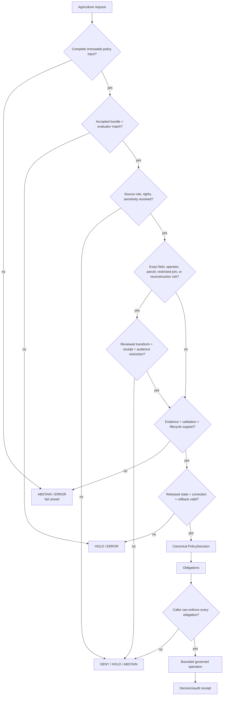

<!-- [KFM_META_BLOCK_V2]
doc_id: kfm://policy/domains/agriculture
title: Agriculture Domain Policy README
type: readme; directory-readme; domain-policy-boundary; policy-index
version: v0.3
status: draft; repository-grounded; mixed-maturity; direct-policy-scaffolds; adjacent-fixture-profiles; evaluator-unbound; fail-closed; non-release; non-publication
owners: "@bartytime4life — verified CODEOWNERS review route; Agriculture, policy, sensitivity, rights, privacy, source, contract/schema, validator/test, runtime, release, security, and docs stewardship assignments NEEDS VERIFICATION"
created: 2026-06-15
updated: 2026-08-13
supersedes: v0.2 Agriculture domain policy index
policy_label: restricted-review; policy; agriculture; rights; sensitivity; aggregation; redaction; finite-outcomes; no-public-authority
current_path: policy/domains/agriculture/README.md
owning_root: policy/
responsibility: >
  Agriculture-specific policy boundary and repository index. It records which policy questions
  belong here, the current policy-source inventory and maturity, the required input and decision
  contracts, finite outcomes and obligations, cross-lane composition rules, test and review
  burdens, and the smallest safe implementation sequence without treating scaffolds, READMEs,
  schemas, workflow holds, or file presence as executable enforcement.
truth_posture: >
  CONFIRMED accepted ADR-0029 placement and canonical singular policy root; verified CODEOWNERS route;
  complete seven-blob direct inventory; three unchanged PROPOSED Rego stubs/scaffolds with inconsistent
  namespaces and defaults; one PROPOSED redaction placeholder; one README-only aggregation sublane;
  two separate Agriculture sensitivity placeholders; no Agriculture-native Rego test; comment-only
  policy runtime; empty bundle payload inventory; broad policy readiness hold; one domain workflow
  that executes a fixture-only CDL watcher while preserving proof and release holds; five focused
  Agriculture workflows for bounded observation, materiality, NDVI, readiness, and connectivity
  profiles; shared PROPOSED_INACTIVE input, decision, reason, obligation, semantics, and reviewer-role
  profiles whose authority flags remain false /
  PROPOSED bounded Agriculture policy architecture, policy-family map, normalization boundary,
  Agriculture-specific reason and obligation families, public-surface contract, review model,
  validation matrix, and dependency-closed activation sequence /
  CONFLICTED deny-named and abstain-named Rego packages defaulting deny to false versus deny-field and
  farm-operator scaffolds defaulting allow to false; abstain_on_ambiguous exposing a deny relation;
  multiple package namespaces; domain-policy versus sensitivity-policy placement; Agriculture-local
  ALLOW/RESTRICT/HOLD language versus outward ANSWER/ABSTAIN/DENY/ERROR; README-local codes versus the
  inactive shared registries /
  UNKNOWN accepted Agriculture bundle, manifest, selector, evaluator, native rule tests, normalized
  authenticated decisions, obligation handlers, production consumers, required-check significance,
  promotion integration, deployment enforcement, monitoring, and release-gate adoption /
  NEEDS VERIFICATION functional steward assignments, accepted package namespace, default-result
  semantics, source-specific rights rules, sensitive-join composition, bundle identity and digest,
  evaluator compatibility, public API/UI/map/AI obligation enforcement, correction propagation,
  cache invalidation, and rollback drills.
evidence_snapshot:
  repository: bartytime4life/Kansas-Frontier-Matrix
  repository_id: "1059091169"
  visibility: public
  base_ref: main
  base_commit: a893b30f4dd1edfed151620c529734f4fd789a89
  prior_blob: 9fd3762577e6804ed69e6ac278cd3252a50bb75e
  policy_root_blob: 6c5021f9d92778581a4e9331a9dd6ddb7efc5e35
  policy_domains_parent_blob: ed9be975c9da2c7d77d94fab621db39f23953813
  sensitivity_parent_blob: 06197c7a7255264b94fb9dd8d7f73844cfa35682
  directory_rules_blob: fd49a0b83e55cef52c1124281f093e263526898d
  adr_0029_blob: b01322ef64f8c2b1ecb41de7ef4685b97cfa2a62
  codeowners_blob: dd2a84aa514d8ecd9208bc347f90f9a2ed37dd61
  deny_unpublished_blob: 35c813606f37d3578230092fc526430e256b134d
  abstain_on_ambiguous_blob: 7733c0d6389e5e159346ab0bbd118b300970d728
  deny_field_level_blob: dc626a6975309e1356876715385c748bc30c18c2
  redaction_profiles_blob: f13fbb93fb4b0b53f764c1d21b8189f81cfc0304
  aggregation_thresholds_readme_blob: b5482dc8306c225e718e64fe6d5d879742e93654
  sensitivity_threshold_placeholder_blob: 31947ca3e468a967aed3fc5d44699130b7d588fd
  farm_operator_join_blob: 1b6128c4e2470f198edb6464424c6effc9d246dd
  agriculture_policy_doc_blob: be42d02fae601f4b90a220f336ec36a848d2e51a
  agriculture_sensitivity_doc_blob: 9d25f63d471af78899d8db2ad39a3921c4f11fac
  policy_deny_test_readme_blob: 07f3dcb643e49ce54bae06a17399ee3829d72d1c
  aggregate_only_test_readme_blob: e872e11c71840cb806717bf1199c74c4a01d4e37
  aggregate_only_placeholder_test_blob: 97939b939122f029f35ecf12c81f5989df00ae63
  agriculture_validator_readme_blob: 40d268b425d9939ab6a8cda7bd197ba758572d3f
  decision_vocabulary_blob: ae68a9f3cf80308f18bd04207ef2c85057750f12
  reviewer_roles_blob: 01559907b2622606f35bb9a8ae5d0347e9b7e263
  policy_test_workflow_blob: ac8f125e8a4d3634d86f66836d2aa2c0e3925e75
  agriculture_workflow_blob: d89d5db8861812f7b0a1024ae37a23ed5bd61354
  policy_runtime_core_blob: e7e14cf39ae6919fbbc80f1b471de6b907292edb
  policy_bundles_readme_blob: 77f59c399fbce668c916cbbc385009121d6169f4
related:
  - ../README.md
  - ../../README.md
  - ../../../docs/domains/agriculture/POLICY.md
  - ../../../docs/domains/agriculture/SENSITIVITY.md
  - ../../../docs/domains/agriculture/PIPELINE.md
  - ../../../docs/domains/agriculture/CROSS_LANE.md
  - ../../../docs/domains/agriculture/OBJECTS.md
  - ../../../docs/domains/agriculture/OBJECT_FAMILIES.md
  - ../../../docs/domains/agriculture/policy/README.md
  - ./aggregation_thresholds/README.md
  - ./deny_unpublished.rego
  - ./abstain_on_ambiguous.rego
  - ./deny-field-level.rego
  - ./redaction_profiles.yaml
  - ../../sensitivity/agriculture/aggregation_thresholds.yaml
  - ../../sensitivity/agriculture/farm_operator_join.rego
  - ../../../contracts/policy/policy_input_bundle.md
  - ../../../contracts/policy/policy_decision.md
  - ../../../contracts/policy/policy_input_bundle_profile_v1.md
  - ../../../contracts/policy/policy_decision_vocabulary.md
  - ../../../contracts/policy/policy_decision_semantics_profile_v1.md
  - ../../../contracts/policy/policy_reviewer_role_vocabulary.md
  - ../../../schemas/contracts/v1/policy/policy_input_bundle.schema.json
  - ../../../schemas/contracts/v1/policy/policy_decision.schema.json
  - ../../../schemas/contracts/v1/policy/policy_input_bundle_profile_v1.schema.json
  - ../../decision/vocabulary.v1.json
  - ../../decision/reviewer_roles.v1.json
  - ../../../tests/domains/agriculture/policy_deny/README.md
  - ../../../tests/domains/agriculture/aggregate_only/README.md
  - ../../../fixtures/domains/agriculture/
  - ../../../tools/validators/agriculture/README.md
  - ../../../packages/policy-runtime/README.md
  - ../../../policy/bundles/README.md
  - ../../../data/receipts/aggregation/README.md
  - ../../../release/agriculture/README.md
  - ../../../docs/doctrine/directory-rules.md
  - ../../../docs/doctrine/ai-build-operating-contract.md
  - ../../../.github/workflows/policy-test.yml
  - ../../../.github/workflows/domain-agriculture.yml
  - ../../../.github/workflows/agriculture-observation.yml
  - ../../../.github/workflows/agriculture-hls-ndvi-zonal-materiality.yml
  - ../../../.github/workflows/agriculture-ndvi-delta-computation.yml
  - ../../../.github/workflows/agriculture-ndvi-readiness.yml
  - ../../../.github/workflows/agriculture-vegetation-connectivity-gate.yml
tags:
  - kfm
  - policy
  - agriculture
  - domain-policy
  - fail-closed
  - policy-input
  - policy-decision
  - source-role
  - rights
  - sensitivity
  - aggregation
  - redaction
  - field-level-deny
  - farm-operator-join
  - evidence
  - finite-outcomes
  - obligations
  - no-network
  - release-gated
  - correction
  - rollback
notes:
  - "This revision changes only policy/domains/agriculture/README.md plus the required AI-generated provenance receipt."
  - "No policy rule, numeric threshold, bundle, evaluator, schema, contract, fixture, test, validator, workflow, receipt instance, release artifact, data object, deployment, or public behavior is created or changed."
  - "The v0.2 target blob was unchanged while current main gained accepted directory governance, inactive shared policy profiles, and bounded Agriculture fixture/captured-input slices; v0.3 reconciles those additions without collapsing their authority."
  - "A policy file's presence is not activation; a green readiness hold is not policy enforcement."
  - "The most restrictive applicable source, rights, sensitivity, audience, join, lifecycle, and release rule wins."
[/KFM_META_BLOCK_V2] -->

<a id="top"></a>

# Agriculture Domain Policy

> **One-line purpose.** Govern Agriculture-specific allow, deny, restrict, abstain, review, redaction, aggregation, and release-adjacent decisions while keeping evidence, rights, sensitivity, validation, receipts, release authority, and public serving boundaries explicit and separate.

<p>
  
  
  
  
  
  
  
  
</p>

> [!IMPORTANT]
> **This directory is policy authority only after its exact rule set, input contract, bundle identity, evaluator, tests, and review state are accepted.** Today it contains policy documentation and proposed source scaffolds. It does not establish production enforcement.

> [!CAUTION]
> **Current Rego defaults are not coherent enough to activate.** Two packages named for denial or abstention default `deny := false`; two other Agriculture-related scaffolds default `allow := false`; package namespaces differ; and the ambiguous-input file exposes no abstain result. Do not infer a safe engine contract from filenames.

> [!WARNING]
> **Agriculture aggregation does not erase sensitivity.** Field, operator, person, parcel, ownership, proprietary yield, pesticide/application, well-to-field, and restricted-source joins remain deny/restrict/review candidates even when some inputs are aggregated.

**Quick links:** [Purpose](#purpose) · [Authority](#authority-level) · [Status](#status-and-repository-evidence) · [Belongs](#what-belongs-here) · [Does not](#what-does-not-belong-here) · [Inventory](#confirmed-policy-inventory) · [Families](#policy-family-map) · [Inputs](#minimum-policy-input-contract) · [Decisions](#decision-vocabulary-and-normalization) · [Obligations](#obligation-families) · [Cross-lane](#cross-lane-composition) · [Public surfaces](#public-surface-contract) · [Validation](#validation-tests-and-ci) · [Review](#review-burden-and-separation-of-duties) · [Related](#related-folders) · [Conflicts](#adrs-and-conflict-register) · [Sequence](#smallest-sound-implementation-sequence) · [Done](#definition-of-done) · [Open](#open-verification-register) · [Rollback](#maintenance-correction-and-rollback)

---

## Purpose

`policy/domains/agriculture/` is the Agriculture domain segment under KFM's canonical singular `policy/` responsibility root.

Its durable question is:

> Given a fully declared Agriculture operation and governed context, what bounded action is permitted, refused, narrowed, held for review, or left unanswered—and which obligations must downstream systems preserve?

A complete Agriculture policy implementation should decide only after it knows:

1. the requested operation and audience;
2. the Agriculture object family and source role;
3. spatial and temporal precision;
4. rights, license, confidentiality, consent, and source-use posture;
5. sensitivity and re-identification risk;
6. EvidenceRef/EvidenceBundle support;
7. validation and lifecycle state;
8. aggregation, redaction, review, and receipt state;
9. release, correction, withdrawal, and rollback context;
10. the exact policy bundle, evaluator profile, and decision contract being used.

### In scope

- public, reviewer, restricted, and denied Agriculture audience decisions;
- exact-field, operator, parcel-adjacent, and private-party exposure controls;
- source-role and evidence prerequisites;
- rights, confidentiality, sensitivity, and consent inheritance;
- aggregation, redaction, generalization, delay, and review obligations;
- unpublished, superseded, withdrawn, stale, quarantine-adjacent, or rollback-blocked material;
- cross-lane Agriculture joins;
- finite decisions, safe reason codes, and obligation propagation;
- policy-bundle selection and replay requirements once accepted;
- policy tests and negative cases;
- policy-change correction and rollback posture.

### Out of scope

- Agriculture domain meaning or object definitions;
- machine-shape authority;
- data acquisition, storage, normalization, or transformation;
- evidence creation or proof closure;
- source registry authority;
- release approval;
- application serving, map rendering, exports, or AI generation;
- numeric aggregation thresholds that lack accepted authority;
- agronomic, financial, legal, safety, or operational advice.

[Back to top](#top)

---

## Authority level

**Canonical policy responsibility / non-authoritative for adjacent concerns.**

| Concern | Authority home | Agriculture policy role |
|---|---|---|
| Agriculture policy rule source | Accepted lanes under `policy/` | Owns reviewed decision logic after acceptance. |
| Agriculture policy intent | [`docs/domains/agriculture/POLICY.md`](../../../docs/domains/agriculture/POLICY.md) | Implements and cites intent; does not silently contradict it. |
| Agriculture sensitivity doctrine | [`docs/domains/agriculture/SENSITIVITY.md`](../../../docs/domains/agriculture/SENSITIVITY.md) | Applies the most restrictive relevant row. |
| Object meaning | [`contracts/domains/agriculture/`](../../../contracts/domains/agriculture/) | Consumes semantic meaning; does not redefine it. |
| Machine shape | [`schemas/contracts/v1/`](../../../schemas/contracts/v1/) | Consumes schemas; policy source is not a schema home. |
| Source identity and rights facts | Governed `data/registry/` lanes and review records | Evaluates supplied facts; does not invent them. |
| Evidence | EvidenceRef/EvidenceBundle and `data/proofs/` families | Requires support; cannot create evidence closure. |
| Transformation | `pipelines/`, `packages/`, or accepted tools | Emits obligations; does not perform hidden transformation. |
| Validation | `tools/validators/` and `tests/` | Is validated and tested; a validator is not policy authority. |
| Receipt instances | `data/receipts/` | May require receipts; does not store instances here. |
| Release, correction, rollback | `release/` | Supplies a policy input; cannot approve publication. |
| Policy execution | Accepted policy runtime/evaluator | Executes the exact accepted bundle; helper code does not own rule values. |
| Public API, UI, map, export, AI | Governed applications and released artifacts | Must preserve decisions and obligations; cannot choose policy ad hoc. |
| CI | `.github/workflows/` | Orchestrates checks; a green hold is not policy enforcement. |

### Governing order

When Agriculture policy sources conflict, resolve in this order:

1. KFM core invariants and operating law.
2. Accepted ADRs that explicitly change policy or placement.
3. Sensitive-domain and most-restrictive-row rules.
4. Agriculture policy and sensitivity doctrine.
5. source-specific rights, confidentiality, consent, and use restrictions;
6. accepted policy contract/schema/bundle definitions;
7. this README;
8. current proposed scaffolds and examples.

A lower-ranked artifact must not weaken a higher-ranked denial, restriction, review, or rollback obligation.

[Back to top](#top)

---

## Status and repository evidence

### Confirmed direct inventory

At `main@a893b30f4dd1edfed151620c529734f4fd789a89`, the complete recursive tree contains seven tracked blobs under this lane:

```text
policy/domains/agriculture/
├── README.md
├── abstain_on_ambiguous.rego
├── aggregation_thresholds/
│   ├── .gitkeep
│   └── README.md
├── deny-field-level.rego
├── deny_unpublished.rego
└── redaction_profiles.yaml
```

| Surface | Confirmed state | Safe conclusion |
|---|---|---|
| This README | v0.2, blob `9fd3762…`, unchanged since 2026-07-19 | The boundary is substantial but its implementation snapshot is stale. |
| `deny_unpublished.rego` | `PROPOSED` stub; package `kfm.agriculture_deny_unpublished`; `default deny := false`; only a commented example | Filename and package suggest denial, but no operative denial rule exists. |
| `abstain_on_ambiguous.rego` | `PROPOSED` stub; package `kfm.agriculture_abstain_on_ambiguous`; `default deny := false`; commented example writes `deny[reason]` | No machine-level abstain outcome exists. |
| `deny-field-level.rego` | `PROPOSED` generated scaffold; package `kfm.generated.policy.domains.agriculture.deny_field_level`; `default allow := false` | A restrictive default exists without input semantics, reasons, obligations, or native tests. |
| `redaction_profiles.yaml` | `PROPOSED` placeholder with no profile values | No redaction transform is authorized or executable. |
| `aggregation_thresholds/README.md` | v0.2 documentation plus structural `.gitkeep`; no numeric thresholds | The sublane documents disclosure-control expectations only. |

The three direct Rego blobs and both direct YAML/README policy candidates retain the same Git blob identities cited by v0.2. No `*_test.rego` exists under this Agriculture lane.

### Current adjacent capability map

| Surface | Current repository evidence | What it proves | What it does **not** prove |
|---|---|---|---|
| Directory governance and review route | Accepted ADR-0029, canonical Directory Rules, Root Registry, and `/policy/ @bartytime4life` in CODEOWNERS | Placement and GitHub review routing are explicit. | Functional steward assignment, independent review, or policy approval. |
| Parent policy indexes | `policy/README.md` v0.3.1 and `policy/domains/README.md` v0.3 | Current mixed-maturity root and domain boundaries are documented. | Agriculture activation or runtime enforcement. |
| Agriculture sensitivity lane | Substantive `policy/sensitivity/README.md`; Agriculture threshold YAML and farm/operator Rego remain `PROPOSED` placeholders | Cross-cutting composition and unresolved placement are visible. | Accepted thresholds, join logic, or native tests. |
| Shared explicit input profile | `PolicyInputBundleProfileV1`: five operations, seven audiences, fixture-only validator/tests/workflow, all authority flags false | One bounded input-coherence profile is machine-checkable. | Policy evaluation, an Agriculture input assembler, or permission to act. |
| Shared decision vocabulary | `PROPOSED_INACTIVE` registry: nine reason codes, eight `ANSWER`-only obligation codes, all governance flags false | Candidate codes and finite outcome relationships are deterministic. | Adoption, runtime normalization, or obligation enforcement. |
| Shared reviewer-role vocabulary | Five `PROPOSED_INACTIVE` role identifiers; all assignment and approval flags false | Stable candidate role names exist. | That a person is assigned, qualified, or approved this lane. |
| Direct Agriculture tests | One substantive deterministic NDVI-delta computation test; remaining direct policy-deny, aggregate-only, join, soil-moisture, catalog, vegetation, and smoke modules are placeholders or smoke-only | A bounded computation slice is tested. | Any direct Agriculture Rego rule or policy outcome. |
| Agriculture validators | Direct `tools/validators/agriculture/` remains documentation-only; domain lane has three substantive fixture validators and four recognized placeholders; evidence lane has one AgricultureObservation validator | Selected materiality, readiness, connectivity, and observation profiles have deterministic checks. | A general Agriculture policy validator or evaluator. |
| Focused Agriculture workflows | Five path-filtered workflows run observation, HLS materiality, NDVI delta, NDVI readiness, and connectivity fixture slices | Those exact no-network profiles are exercised in CI. | Source admission, evidence closure, policy, promotion, release, or publication. |
| `domain-agriculture` | Executes one fixture-only CDL watcher proof, inventories the substantive/placeholder split, and preserves explicit proof and release-dry-run holds | Bounded readiness and drift are checked. | A `PolicyDecision`, proof pack, release approval, or public artifact. |
| Broad `policy-test` | Static policy readiness and fixture-shape checks; recognizes one separately governed inactive Pass 12 Rego lane | Repository-wide absence and graduation triggers remain explicit. | Evaluation of any Agriculture Rego source. |
| Bundle and runtime | `policy/bundles/` has documentation only; `kfm-policy-runtime` remains `0.0.0` with comment-only `core.py` | The held implementation boundary is preserved. | An accepted bundle, selector, evaluator, adapter, or consumer. |

### Current maturity determination

| Level | Agriculture state | Evidence-backed interpretation |
|---|---|---|
| Direct policy source | **M0–M1: scaffold plus documented boundary** | Files and defaults exist; operative rules, coherent native outcomes, and native tests do not. |
| Shared policy profiles | **M2 candidate, `PROPOSED_INACTIVE`** | Input, vocabulary, semantics, reviewer roles, fixtures, validators, tests, and workflows are bounded and non-authoritative. |
| Adjacent Agriculture computations | **M2 fixture/captured-input slices** | Selected observation, NDVI, readiness, materiality, connectivity, and watcher behavior is executable without becoming policy. |
| Agriculture evaluator and governed consumer | **NOT ESTABLISHED** | No accepted bundle/selector/evaluator, normalized authenticated decision, obligation handler, receipt/replay flow, or production consumer is proved. |
| Promotion, release, deployment, publication | **HOLD / separate authority** | No reviewed evidence grants these effects. |

> [!NOTE]
> Repository presence, schema validity, deterministic computation, or a green workflow is not policy activation. None of the adjacent Agriculture profiles may be collapsed into evidence truth, a `PolicyDecision`, release approval, or public-use authority.

[Back to top](#top)

---

## What belongs here

Accepted Agriculture policy material may include:

- reviewed Rego or equivalent decision modules;
- Agriculture policy data documents whose values are policy authority;
- package-local policy documentation;
- references to accepted shared policy inputs and decisions;
- Agriculture-specific reason-code and obligation mappings;
- bundle inclusion metadata where the canonical bundle design requires it;
- policy-local tests only if the repository's accepted convention places engine-native tests beside rule source;
- a child README for a coherent policy sublane;
- migration, deprecation, correction, and rollback notes for Agriculture policy source.

Every material policy file should identify:

- package or module identity;
- policy family;
- supported operation and object families;
- input contract/version;
- canonical output or normalization contract;
- default behavior;
- reason codes;
- obligations;
- rights and sensitivity dependencies;
- evidence, validation, lifecycle, and release prerequisites;
- fixtures and tests;
- bundle/manifest inclusion;
- change and rollback procedure.

[Back to top](#top)

---

## What does not belong here

| Material | Correct authority home |
|---|---|
| Agriculture doctrine, architecture, object descriptions, and human policy rationale | `docs/domains/agriculture/` |
| Semantic object contracts | `contracts/` |
| JSON Schemas and machine-shape definitions | `schemas/` |
| Source descriptors and source-rights records | `data/registry/` and governed review records |
| Raw, work, quarantine, processed, catalog, triplet, or published data | Corresponding `data/` lifecycle lane |
| AggregationReceipt, RedactionReceipt, RunReceipt, or PolicyDecision instances | Accepted `data/receipts/` lane |
| EvidenceBundle, ProofPack, or citation proof | `data/proofs/` and evidence families |
| Transform implementation | `pipelines/`, `packages/`, or `tools/` according to responsibility |
| Synthetic fixtures | `fixtures/` |
| Enforceability tests | `tests/` unless an accepted policy-engine convention requires colocated native tests |
| General policy runtime/evaluator code | `packages/policy-runtime/` or accepted runtime boundary |
| ReleaseManifest, PromotionDecision, CorrectionNotice, WithdrawalNotice, RollbackCard | `release/` |
| Governed API, UI, map, export, or AI response code | `apps/` and shared packages |
| Credentials, private source payloads, operator identities, parcel joins, or restricted coordinates | Governed private storage—not repository policy docs |
| Generic agronomic advice or thresholds unsupported by accepted evidence/authority | Nowhere in this lane |

[Back to top](#top)

---

## Default posture

Agriculture policy must fail closed when required context is missing, contradictory, stale, unsupported, or unavailable.

The default public posture is:

```text
exact field / operator / person / parcel / private-party detail
  → DENY or HOLD
  → apply reviewed aggregation / redaction / generalization only when authorized
  → require evidence, rights, validation, receipt, review, release, correction, rollback
  → serve only through governed interfaces
```

### Conditions that block an affirmative public result

- unknown operation or object family;
- unknown or collapsed source role;
- unclear rights, confidentiality, consent, or license;
- unresolved sensitivity tier or audience;
- field-, operator-, person-, parcel-, ownership-, irrigation-, or private-party adjacency;
- NASS-confidential or source-restricted detail;
- unsupported spatial, temporal, or attribute precision;
- missing EvidenceRef/EvidenceBundle support;
- missing validation report;
- missing required aggregation, redaction, transform, or review receipt;
- candidate, quarantine, superseded, withdrawn, stale, or rollback-blocked state;
- missing correction path or rollback target;
- missing or mismatched policy bundle identity;
- evaluator failure, input-contract failure, or obligation-handler failure;
- untested policy change.

### Anti-collapse rules

Agriculture policy must not collapse:

- aggregate statistics into field-level truth;
- remotely sensed or modeled context into observed truth;
- a schema-valid object into an allowed object;
- a validator pass into a PolicyDecision;
- a PolicyDecision into evidence or release approval;
- an AggregationReceipt into proof;
- a public-safe transform into permission for the source detail;
- a reviewer-only object into a public object;
- one source's permissive license into permission for a restricted join;
- a green readiness workflow into runtime enforcement;
- generated prose into policy authority.

[Back to top](#top)

---

## Policy family map

| Family | Policy question | Default posture | Candidate outputs |
|---|---|---|---|
| `source_admission` | May this source/object enter the Agriculture lane for this use? | Hold or deny if role, rights, provenance, or terms are unresolved. | Deny/abstain/hold with safe reason. |
| `sensitivity` | May this object be exposed at the requested precision and audience? | Most restrictive row wins; exact private detail denied. | Deny/restrict/review obligations. |
| `rights` | Do source terms permit processing, derivation, display, export, and retention? | Hold or deny when unclear. | Rights review, attribution, no-export, or deny. |
| `aggregation` | Is the product sufficiently aggregated and resistant to reconstruction? | No numeric threshold is assumed; hold until an accepted profile applies. | Aggregate, suppress, generalize, delay, or deny. |
| `redaction` | Which fields, geometries, attributes, labels, or citations must be withheld? | Redact only under an accepted profile with receipt. | Redaction/generalization obligations. |
| `cross_lane_join` | Does a join increase identifiability or authority beyond either input? | Most restrictive input and derived-risk row wins. | Deny, review, de-identify, aggregate, or abstain. |
| `promotion` | May a candidate cross a lifecycle gate? | Hold without evidence, validation, receipts, policy, review, and rollback support. | Gate denial or bounded readiness. |
| `runtime_access` | May a governed caller answer, render, export, or compare this material? | Abstain/deny on unresolved evidence/policy/release state. | Canonical PolicyDecision plus obligations. |
| `release` | May a released public state transition be requested? | Policy may recommend/deny; `release/` remains the authority. | Policy input to release review. |
| `correction_rollback` | What must happen when source, rights, policy, or release state changes? | Re-evaluate affected outputs; fail closed during uncertainty. | Correct, supersede, withdraw, or rollback request. |

These family names are documentation vocabulary until a contract/schema/bundle makes them normative.

[Back to top](#top)

---

## Minimum policy input contract

A consequential Agriculture decision should receive one immutable, explicit `PolicyInputBundle` or equivalent bounded input. It should not fetch hidden facts during evaluation.

| Input group | Minimum content | Failure posture |
|---|---|---|
| Decision identity | request id, policy family, operation, caller/audience, evaluation time | `ERROR` or `ABSTAIN` if missing |
| Policy identity | bundle id, version, digest, evaluator profile, input-contract version | `ERROR` / `HOLD` on mismatch |
| Object identity | object id/family, domain, source version, candidate/release refs | `ABSTAIN` if unresolved |
| Source context | source id, role, authority class, rights/terms, citation obligations | `HOLD` / `DENY` |
| Spatial context | geometry class, precision, support unit, public/generalized geometry ref | `RESTRICT` / `DENY` |
| Temporal context | valid/source/observed/retrieval/release/correction times as material | `ABSTAIN` / stale restriction |
| Sensitivity context | tier, privacy/re-identification flags, restricted joins, audience | Most restrictive row |
| Evidence context | EvidenceRef resolution, EvidenceBundle/review/proof status | `ABSTAIN` / `DENY` |
| Validation context | schema, semantic, geometry, source-role, cross-lane validation status | `HOLD` / `ERROR` |
| Transform context | aggregation/redaction/generalization profile and receipt refs | `HOLD` / `DENY` |
| Lifecycle context | RAW/WORK/QUARANTINE/PROCESSED/CATALOG/PUBLISHED state and candidate status | Public access denied before release |
| Release context | release id/state, policy/review refs, correction path, rollback target | `HOLD` / `DENY` |
| Prior decision context | superseded decisions, overrides, expiry, correction refs | Re-evaluate or hold |

### Input invariants

- Inputs must be sufficient to replay the decision without live source access.
- Policy must not dereference private payloads merely to decide public exposure.
- Absence of a fact must not be treated as a permissive fact.
- Derived join risk must be represented explicitly.
- Overrides must be scoped, attributable, reviewable, expiring where appropriate, and separately auditable.
- The bundle digest and evaluator profile must be pinned for consequential decisions.

[Back to top](#top)

---

## Decision vocabulary and normalization

Current repository surfaces use more than one vocabulary:

- the current shared `PolicyDecision` schema permits `ANSWER`, `ABSTAIN`, `DENY`, and `ERROR`;
- `policy/decision/vocabulary.v1.json` is a nine-reason/eight-obligation `PROPOSED_INACTIVE` candidate with all governance flags false;
- Agriculture documentation also uses `ALLOW`, `RESTRICT`, and `HOLD`;
- Rego scaffolds expose `allow` or `deny` booleans/sets;
- `abstain_on_ambiguous.rego` currently exposes a `deny` relation rather than an abstain relation.

This is **CONFLICTED** and must be normalized before runtime adoption.

### Current shared candidate vocabulary

The exact repository-registered candidates are:

| Kind | Exact v1 codes | Current authority |
|---|---|---|
| Reasons | `CONSENT_REQUIRED`, `EVIDENCE_STALE`, `EVIDENCE_UNRESOLVED`, `OPERATION_ALLOWED_WITH_OBLIGATIONS`, `POLICY_BUNDLE_UNAVAILABLE`, `POLICY_INPUT_INCOMPLETE`, `PUBLIC_PRECISION_UNSAFE`, `RIGHTS_UNKNOWN`, `SENSITIVITY_UNRESOLVED` | `PROPOSED_INACTIVE`; fixture-only; non-evaluator |
| Obligations | `ATTACH_CITATIONS`, `ATTACH_RIGHTS_NOTICE`, `DELAY_PUBLICATION`, `GENERALIZE_GEOMETRY`, `REDACT_EXACT_LOCATION`, `REQUIRE_STEWARD_REVIEW`, `VERIFY_ROLLBACK_TARGET`, `WITHHOLD_EXPORT` | `PROPOSED_INACTIVE`; valid only on `ANSWER` in v1 |
| Reviewer roles | `DOMAIN_STEWARD`, `EVIDENCE_STEWARD`, `POLICY_STEWARD`, `RELEASE_STEWARD`, `SECURITY_PRIVACY_REVIEWER` | Identifiers only; no people, approval, or authority assignment |

The associated profile validators prove sorted, unique, schema-conformant fixture semantics and all-false authority posture. They do not run a policy bundle, authenticate a decision, assign a reviewer, or authorize Agriculture behavior.

### Recommended separation

| Layer | Purpose | Example vocabulary |
|---|---|---|
| Engine-native result | Internal evaluator output | `allow`, `deny`, `restrict`, `hold`, `abstain`, engine error |
| Canonical policy result | Stable cross-system envelope | Accepted `PolicyDecision` outcome enum |
| Obligations | Required downstream transforms/actions | aggregate, redact, generalize, review, no-export, cite, rollback |
| Runtime response | User-facing finite outcome | ANSWER, ABSTAIN, DENY, ERROR or accepted equivalent |
| Release decision | Publication state transition | separately governed promotion/release outcome |

### Documentation mapping—non-normative

| Agriculture intent | Canonical meaning | Typical obligations |
|---|---|---|
| `ALLOW` | Policy has no blocking rule for the declared operation; adjacent gates still apply. | citation, audit, release checks |
| `RESTRICT` | Operation may proceed only under explicit constraints. | aggregate, redact, generalize, audience restrict, no export |
| `HOLD` | Required human/release/evidence/right/sensitivity state is pending. | review, delayed evaluation, no public surface |
| `ABSTAIN` | Policy lacks sufficient governed context to decide. | retrieve/resolve context; do not guess |
| `DENY` | Policy blocks the requested operation/exposure. | no public output; safe reason only |
| `ERROR` | Evaluation could not complete safely. | fail closed; emit diagnostic without protected data |

This README does not amend the machine enum. An accepted contract/ADR must do that.

### Reason-code requirements

Reason codes should be:

- stable and machine-readable;
- safe to expose at the intended audience;
- specific enough for remediation;
- free of protected payload data;
- versioned or registry-bound;
- paired with obligations where applicable.

README-local Agriculture reason families include:

- `object_context_unresolved`;
- `source_role_unresolved`;
- `rights_unresolved`;
- `source_terms_restrict_use`;
- `sensitivity_unresolved`;
- `field_level_public_denied`;
- `farm_operator_join_denied`;
- `private_parcel_adjacency`;
- `restricted_source_detail`;
- `evidence_unresolved`;
- `validation_incomplete`;
- `aggregation_profile_missing`;
- `redaction_profile_missing`;
- `small_cell_or_reconstruction_risk`;
- `unpublished_or_candidate_only`;
- `release_state_invalid`;
- `rollback_target_missing`;
- `policy_bundle_mismatch`;
- `evaluator_unavailable`.

These lower-case names are descriptive design shorthand, **not valid v1 registry codes**. An Agriculture implementation must either map them through a reviewed, versioned extension or use accepted shared codes without losing meaning. This README does not mutate or activate the shared registry.

[Back to top](#top)

---

## Obligation families

The table below preserves Agriculture-specific design intent. Its lower-case names are documentation shorthand, not currently registered machine codes. Where a shared v1 candidate exists, an implementation should use the exact uppercase code and document any lossless Agriculture extension.

| Obligation | Required downstream behavior |
|---|---|
| `aggregate_required` | Use only an accepted aggregate profile and record the method/profile. |
| `small_cell_suppression_required` | Suppress unsafe cells and apply complementary suppression where needed. |
| `redaction_required` | Remove protected fields/geometry/labels under a reviewed profile. |
| `generalization_required` | Reduce spatial, temporal, or attribute precision. |
| `source_role_badge_required` | Preserve observed/modeled/aggregate/context/restricted character. |
| `citation_required` | Preserve safe source and evidence citations. |
| `rights_review_required` | Route unclear or restrictive source use to a rights reviewer. |
| `sensitivity_review_required` | Route exact, joined, or reconstruction-prone output to sensitivity/privacy review. |
| `human_review_required` | Require an independently recorded review before the next governed transition. |
| `aggregation_receipt_required` | Emit a receipt recording method, profile, inputs, digest, and affected outputs. |
| `redaction_receipt_required` | Record what transform class was applied and why without leaking protected detail. |
| `no_public_render` | Block public API/UI/map/tile/report/export/AI surfaces. |
| `no_export` | Permit bounded in-app review but deny download or external dissemination. |
| `audience_restriction_required` | Restrict to named reviewer/research/steward roles. |
| `delay_required` | Delay exposure until time/source/sensitivity conditions are satisfied. |
| `correction_path_required` | Link a correction/supersession process before exposure. |
| `rollback_required` | Require a prior known-good target and tested rollback route. |
| `audit_receipt_required` | Record policy bundle/input/decision identity for replay. |

Downstream systems must reject obligations they cannot enforce. Silently dropping an obligation is a policy failure.

[Back to top](#top)

---

## Confirmed policy inventory

### Direct rule/source surfaces

| Path | Package / form | Current default | Current maturity | Activation posture |
|---|---|---:|---|---|
| [`deny_unpublished.rego`](deny_unpublished.rego) | `kfm.agriculture_deny_unpublished` | `deny := false` | Commented example only | **DENY activation** |
| [`abstain_on_ambiguous.rego`](abstain_on_ambiguous.rego) | `kfm.agriculture_abstain_on_ambiguous` | `deny := false` | No abstain relation; commented deny example | **DENY activation** |
| [`deny-field-level.rego`](deny-field-level.rego) | `kfm.generated.policy.domains.agriculture.deny_field_level` | `allow := false` | Generated scaffold only | **DENY activation** |
| [`redaction_profiles.yaml`](redaction_profiles.yaml) | Placeholder YAML | none | No profile values | **DENY activation** |
| [`aggregation_thresholds/README.md`](aggregation_thresholds/README.md) | Human-readable child policy contract | none | Documentation only; no numeric thresholds | Not executable |

### Cross-cutting sensitivity surfaces

| Path | Package / form | Current default | Current maturity | Conflict |
|---|---|---:|---|---|
| [`../../sensitivity/agriculture/aggregation_thresholds.yaml`](../../sensitivity/agriculture/aggregation_thresholds.yaml) | Placeholder YAML | none | No threshold values | Overlaps child sublane |
| [`../../sensitivity/agriculture/farm_operator_join.rego`](../../sensitivity/agriculture/farm_operator_join.rego) | generated sensitivity package | `allow := false` | Scaffold only | Separate namespace/root |

### Activation preconditions

No Agriculture policy source should be activated until:

- a canonical package namespace is accepted;
- default-result semantics are harmonized;
- input and decision contracts are accepted;
- a bundle/manifest includes the exact sources and digest;
- a reviewed evaluator profile exists;
- all rules have deterministic positive and negative fixtures;
- engine-native results normalize to the canonical PolicyDecision;
- obligations have tested handlers;
- reason codes are registry-bound;
- no-network and failure tests pass;
- public-surface denial tests pass;
- policy change correction and rollback are tested;
- owners and independent reviewers approve.

[Back to top](#top)

---

## Agriculture policy flow


```mermaid
flowchart TD
    R["Agriculture request"] --> I{"Complete immutable policy input?"}
    I -->|no| A["ABSTAIN / ERROR<br/>fail closed"]
    I -->|yes| B{"Accepted bundle + evaluator match?"}
    B -->|no| H["HOLD / ERROR"]
    B -->|yes| S{"Source role, rights, sensitivity resolved?"}
    S -->|no| D["DENY / HOLD / ABSTAIN"]
    S -->|yes| X{"Exact field, operator, parcel, restricted join, or reconstruction risk?"}
    X -->|yes| T{"Reviewed transform + receipt + audience restriction?"}
    T -->|no| D
    T -->|yes| E{"Evidence + validation + lifecycle support?"}
    X -->|no| E
    E -->|no| A
    E -->|yes| P{"Released state + correction + rollback valid?"}
    P -->|no| H
    P -->|yes| C["Canonical PolicyDecision"]
    C --> O["Obligations"]
    O --> G{"Caller can enforce every obligation?"}
    G -->|no| D
    G -->|yes| U["Bounded governed operation"]
    U --> Q["Decision/audit receipt"]
```

The flow produces a bounded policy result. It does not publish data, create evidence, or approve release.

[Back to top](#top)

---

## Cross-lane composition

Agriculture frequently composes with other domains. The join is a new risk-bearing operation, not a neutral lookup.

| Related lane | Common relation | Primary risk | Default composition rule |
|---|---|---|---|
| People / Land | operator, owner, parcel, residence, title, private party | re-identification and living-person/private-land exposure | Exact joins denied for public use; most restrictive row wins. |
| Hydrology | irrigation well, withdrawal, drought, watershed | private well-to-field/operator linkage; source-role collapse | Generalize/de-identify; retain hydrology authority and policy. |
| Soil | map unit, suitability, moisture | modeled suitability presented as field fact | Preserve soil/source role; do not infer operator condition. |
| Atmosphere | weather, smoke, drought, stress | modeled/forecast context presented as observed field impact | Label model/context; abstain from unsupported causal claims. |
| Habitat / Flora / Fauna | habitat, wetlands, rare species/plants | sensitive biological locations exposed via farm/field joins | Apply biological geoprivacy and Agriculture restrictions together. |
| Infrastructure | storage, processing, energy, transport | critical facility or private business exposure | Restrict/generalize according to infrastructure and rights policy. |
| Hazards | flood, fire, drought, storm | operational advice or precise private impact inference | KFM is not an alert authority; preserve official-source context. |
| Geology | groundwater/resource/parent material | unsupported causality or private extraction linkage | Preserve geology authority; require evidence for derived claims. |

### Composition invariants

- The join may be more sensitive than either input.
- Aggregation on one side does not make exact detail on the other side safe.
- Source role and valid time remain attached to each contributing record.
- Policy decisions should cite all controlling policies or a composed bundle identity.
- A downstream transform must not reverse an upstream redaction.
- Public clients receive only released, obligation-compliant derivatives.
- AI may explain a resolved decision; it cannot relax it.

[Back to top](#top)

---

## Public-surface contract

Agriculture policy decisions may affect:

- governed API responses;
- MapLibre layers and feature details;
- Evidence Drawer payloads;
- Focus Mode answers;
- compare views;
- exports and reports;
- stories and screenshots;
- graph/search/vector retrieval;
- AI-generated summaries.

Every caller must:

1. validate the PolicyDecision shape and bundle identity;
2. preserve the outcome, reasons, obligations, audience, scope, and expiry;
3. verify required evidence/release references;
4. enforce every obligation before rendering or exporting;
5. avoid leaking protected data in denial/error messages;
6. prevent recombination/reconstruction across layers, times, or exports;
7. record correction/withdrawal/rollback state;
8. fail closed if the policy service, bundle, or obligation handler is unavailable.

### Forbidden shortcuts

- UI loads policy files directly.
- Client chooses a more permissive bundle.
- API treats missing policy as allow.
- Map tile exposure bypasses feature-level obligations.
- Export removes redaction/audience metadata.
- AI receives restricted source detail to decide whether it should be restricted.
- A receipt or validator result is treated as release approval.
- A cached prior allow decision survives a policy, rights, source, or release change without re-evaluation.

[Back to top](#top)

---

## Validation, tests, and CI

### Required test families

| Family | Minimum negative case | Minimum positive/control case |
|---|---|---|
| Policy input | missing source role/evidence/release context fails closed | complete synthetic bundle evaluates deterministically |
| Unpublished | candidate/quarantine material denied from public path | released safe fixture passes adjacent gate checks |
| Ambiguity | conflicting source role or missing context abstains/holds | resolved context normalizes correctly |
| Field precision | exact field/operator/parcel request denied | accepted generalized derivative carries obligations |
| Farm/operator join | identifiable private join denied | synthetic de-identified reviewer case remains restricted |
| Rights | unclear or restrictive terms hold/deny | explicit permitted use preserves attribution obligations |
| Aggregation | missing profile or reconstruction risk blocks release | accepted synthetic profile produces receipt requirement |
| Redaction | missing profile/receipt blocks output | redacted fixture cannot reconstruct protected fields |
| Cross-lane | most restrictive policy is inherited | safe bounded join preserves both source roles |
| Lifecycle | RAW/WORK/QUARANTINE/candidate cannot serve publicly | released fixture includes correction/rollback refs |
| Bundle integrity | digest/version/evaluator mismatch errors | pinned bundle/input replays same result |
| Obligation handling | unsupported obligation blocks caller | caller proves every obligation applied |
| Error safety | evaluator failure leaks no protected input | safe diagnostic emitted |
| Correction/rollback | withdrawn policy/output no longer answers | prior known-good release can be restored |

### Confirmed current executable evidence

| Profile or lane | Executable evidence | Bounded conclusion |
|---|---|---|
| Direct Agriculture Rego | No `*_test.rego` and no operative rule body under this lane | Direct policy behavior is unproved. |
| CDL watcher | `tests.ingest.cdl_watch.test_cdl_watch` runs synthetic sidecar-change cases | Fixture-only watcher proof; no canonical materiality policy or source admission. |
| NDVI delta computation | Deterministic integer-arithmetic generator, five-case fixture manifest, schema, substantive pytest module, and focused workflow | Computational classifications only; no observation, evidence, policy, promotion, or release effect. |
| HLS NDVI zonal materiality | Contract, strict schema, four valid fixtures, validator, pytest suite, and focused workflow | Fixture decision semantics only; thresholds are not production policy. |
| NDVI readiness | Contract, strict schema, fixture, validator, pytest suite, and focused workflow | `EMIT_CANDIDATE` or `HOLD` sidecar semantics only. |
| Vegetation connectivity | Contract, strict schema, case manifest, validator, pytest suite, fixture-polarity replay, and focused workflow | Synthetic component-summary gate only; not a `PolicyDecision`. |
| AgricultureObservation | Fixture-only contract/schema/cases, deterministic validator/tests, and focused workflow | Aggregate county-year observation shape and semantics only. |
| Shared policy candidates | Twelve deterministic policy-profile validators with dedicated tests/workflows, including input, vocabulary, semantics, reviewer roles, bindings, obligations, and maturity | Inactive coherence checks; no Agriculture evaluator, decision authenticity, or runtime enforcement. |
| `domain-agriculture` | Readiness inventory plus bounded CDL execution; proof and release jobs remain explicit holds | Drift is visible; broad Agriculture validation and public authority remain unproved. |
| `policy-test` | Static readiness plus baseline `PolicyDecision` fixture-shape checks | No Agriculture Rego evaluation or emitted decision. |

### Current limitations

- No native Rego test or operative rule body is confirmed for the three direct Agriculture policy modules.
- The direct `tools/validators/agriculture/` lane contains only documentation and `.gitkeep`.
- Four Python files under `tools/validators/domains/agriculture/` remain recognized placeholders; the three substantive validators are adjacent fixture profiles, not policy evaluators.
- Agriculture policy-deny, aggregate-only, farm/operator-join, catalog, soil-moisture, and vegetation-index direct test modules remain placeholders; the smoke test proves only that pytest can collect.
- No accepted Agriculture bundle, selector, evaluator, normalized decision adapter, obligation handler, authenticated decision receipt, replay store, or governed consumer is established.
- `packages/policy-runtime` remains a comment-only `0.0.0` placeholder.
- No current workflow proves source authority, evidence closure, rights/sensitivity clearance, policy approval, promotion, release, deployment, publication, or agronomic suitability.
- Workflow presence does not establish required-check or branch-ruleset significance.

### Current focused commands

The repository-owned workflows currently use commands equivalent to:

```bash
KFM_NO_NETWORK=1 python -m unittest \
  tests.ingest.cdl_watch.test_cdl_watch --verbose

KFM_NO_NETWORK=1 python -m pytest \
  tests/domains/agriculture/test_ndvi_delta_computation.py \
  -q --strict-config --strict-markers

KFM_NO_NETWORK=1 python -m pytest \
  tests/validators/domains/agriculture/hls_ndvi_zonal_materiality/test_validate_hls_ndvi_zonal_materiality.py \
  tests/validators/domains/agriculture/ndvi_readiness/test_validate_ndvi_readiness.py \
  tests/validators/domains/agriculture/vegetation_connectivity_gate/test_validate_connectivity_gate.py \
  -q --strict-config --strict-markers

KFM_NO_NETWORK=1 python tools/validators/evidence/validate_agriculture_observation.py --fixtures
KFM_NO_NETWORK=1 python tools/validators/policy/validate_policy_input_bundle_profile_v1.py --fixtures
KFM_NO_NETWORK=1 python tools/validators/policy/validate_policy_decision_vocabulary.py --registry
KFM_NO_NETWORK=1 python tools/validators/policy/validate_policy_decision_semantics_v1.py --fixtures
KFM_NO_NETWORK=1 python tools/validators/policy/validate_policy_reviewer_role_vocabulary.py --registry
```

These commands are evidence for their named profiles only. They are not a combined Agriculture policy command and must not be reported as one.

### General Agriculture policy parity target—PROPOSED

A future accepted command may be named:

```text
make policy-agriculture-test
```

The name remains `PROPOSED`. Before adoption, it must:

- run deterministically and no-network by default;
- validate the exact policy bundle manifest, digest, selector, and evaluator profile;
- execute native positive and negative Agriculture rule tests;
- validate complete operation- and audience-specific input bundles;
- normalize engine-native results into accepted `PolicyDecision` outcomes without semantic loss;
- validate reason and obligation codes;
- prove that every governed consumer rejects unknown or unsupported obligations;
- exercise rights, sensitivity, cross-lane, stale, malformed, revoked, correction, and rollback cases;
- emit only safe machine-readable test evidence;
- return non-zero on missing coverage, unsafe defaults, or authority drift.

[Back to top](#top)

---

## Security, privacy, and log minimization

Policy evaluation and testing must not log or return:

- operator or living-person identifiers;
- exact private parcel geometry;
- proprietary yield or production values;
- pesticide/application detail;
- restricted well-to-field/operator joins;
- restricted source payloads;
- secrets, tokens, private endpoints, or agreement terms;
- exact sensitive biological/cultural/infrastructure joins;
- hidden policy data that would enable bypass or reconstruction.

Safe outputs should prefer:

- stable decision id;
- outcome;
- bounded reason code;
- obligations;
- policy bundle id/version/digest;
- input digest rather than payload;
- source/evidence/release references safe for the audience;
- reviewer and correction references where authorized.

A denial that leaks the protected fact is a policy failure.

[Back to top](#top)

---

## Review burden and separation of duties

Changes to Agriculture policy are trust-bearing even when syntactically small.

The verified GitHub review route is `@bartytime4life` through `.github/CODEOWNERS`. The inactive reviewer-role registry proposes `DOMAIN_STEWARD`, `EVIDENCE_STEWARD`, `POLICY_STEWARD`, `RELEASE_STEWARD`, and `SECURITY_PRIVACY_REVIEWER`, but those tokens assign no person, record no approval, and grant no authority. Functional assignments and independent review remain `NEEDS VERIFICATION`.

| Change | Required review roles |
|---|---|
| Documentation-only boundary/index change | Agriculture steward + policy/docs review |
| Rego/YAML policy logic or value | Agriculture + policy + sensitivity/rights + test/validator review |
| Field/operator/parcel or private join rule | Privacy/sensitivity + People/Land + Agriculture review |
| Source-specific terms | Rights/source steward + Agriculture review |
| Aggregation/redaction profile | Privacy/sensitivity + policy + transform/receipt + Agriculture review |
| Policy input/decision schema | Contract/schema + runtime + policy + affected caller review |
| Bundle/evaluator/selection change | Policy-runtime + security + supply-chain + policy review |
| Release-affecting change | Release steward + independent policy reviewer + rollback owner |
| Public API/UI/map/AI obligation behavior | Governed API/UI/AI owner + policy + security review |

### Separation rules

- Policy author must not be the sole approver for a policy-significant release.
- Validation success is separate from policy approval.
- Policy approval is separate from release approval.
- Release approval is separate from publication execution.
- Correction, withdrawal, and rollback remain independently authorized.
- Emergency override, if ever supported, must be scoped, expiring, signed, and auditable.

[Back to top](#top)

---

## Child-file contract

Every child README or policy file under this lane should state:

- purpose and policy family;
- authority and non-authority;
- current implementation status;
- package/module identity;
- input contract and version;
- output/normalization contract;
- default behavior;
- reason codes and obligations;
- source-role, rights, sensitivity, evidence, validation, lifecycle, and release inputs;
- tests, fixtures, and no-network posture;
- bundle/manifest inclusion;
- public-surface implications;
- review roles;
- correction, supersession, withdrawal, rollback, and deprecation path;
- open conflicts and verification items.

A child must not claim a threshold, policy value, or enforcement path solely because a planning document named it.

[Back to top](#top)

---

## Related folders

| Path | Relationship |
|---|---|
| [`policy/`](../../README.md) | Canonical singular policy root; v0.3.1 documents mixed maturity and an unbound general evaluator. |
| [`policy/domains/`](../README.md) | v0.3 parent domain-policy grouping and complete direct-child boundary. |
| [`aggregation_thresholds/`](aggregation_thresholds/README.md) | Aggregation/disclosure-control documentation; no numeric thresholds or enforcement. |
| [`policy/sensitivity/`](../../sensitivity/README.md) | Substantive cross-cutting boundary; Agriculture child artifacts remain proposed placeholders. |
| [`policy/decision/`](../../decision/) | Inactive reason/obligation and reviewer-role candidate registries; not emitted decision storage. |
| [`policy/bundles/`](../../bundles/README.md) | Packaging documentation and inactive Pass 12 profile; no accepted Agriculture bundle payload or selector. |
| [`docs/domains/agriculture/POLICY.md`](../../../docs/domains/agriculture/POLICY.md) | Agriculture policy intent. |
| [`docs/domains/agriculture/SENSITIVITY.md`](../../../docs/domains/agriculture/SENSITIVITY.md) | Sensitivity, rights, and public-release posture. |
| [`docs/domains/agriculture/policy/README.md`](../../../docs/domains/agriculture/policy/README.md) | Human-facing policy aspect index; contains older proposed-path assumptions that need periodic reconciliation. |
| [`contracts/policy/`](../../../contracts/policy/) | Shared policy input/decision meaning plus inactive explicit-input, vocabulary, semantics, reviewer-role, binding, obligation, and maturity profiles. |
| [`schemas/contracts/v1/policy/`](../../../schemas/contracts/v1/policy/) | Shared policy input/decision shapes. |
| [`contracts/domains/agriculture/`](../../../contracts/domains/agriculture/) | Agriculture object and receipt meaning. |
| [`schemas/contracts/v1/domains/agriculture/`](../../../schemas/contracts/v1/domains/agriculture/) | Agriculture machine-shape scaffolds. |
| [`fixtures/domains/agriculture/`](../../../fixtures/domains/agriculture/) | Synthetic Agriculture inputs. |
| [`tests/domains/agriculture/policy_deny/`](../../../tests/domains/agriculture/policy_deny/README.md) | README-only negative policy test contract; sibling Python module remains a placeholder. |
| [`tests/domains/agriculture/aggregate_only/`](../../../tests/domains/agriculture/aggregate_only/README.md) | README-only aggregate-preservation contract; sibling NASS module remains a placeholder. |
| [`tools/validators/agriculture/`](../../../tools/validators/agriculture/README.md) | Direct validator lane; documentation-only. |
| [`tools/validators/domains/agriculture/`](../../../tools/validators/domains/agriculture/README.md) | Three substantive fixture validators plus four recognized placeholder modules; not a policy evaluator. |
| [`packages/policy-runtime/`](../../../packages/policy-runtime/README.md) | Proposed evaluator/helper boundary; current core is a placeholder. |
| [`data/receipts/aggregation/`](../../../data/receipts/aggregation/README.md) | Aggregation process-memory boundary; receipt subroot authority remains unresolved. |
| [`release/agriculture/`](../../../release/agriculture/README.md) | Agriculture release/correction/rollback boundary. |
| [`policy-test.yml`](../../../.github/workflows/policy-test.yml) | Broad policy readiness and shape guard; does not evaluate Agriculture policy. |
| [`domain-agriculture.yml`](../../../.github/workflows/domain-agriculture.yml) | Readiness inventory plus a bounded CDL watcher test; proof and release paths remain held. |
| [`agriculture-observation.yml`](../../../.github/workflows/agriculture-observation.yml) | Fixture-only AgricultureObservation validation. |
| [`agriculture-hls-ndvi-zonal-materiality.yml`](../../../.github/workflows/agriculture-hls-ndvi-zonal-materiality.yml) | Fixture-only HLS materiality validation. |
| [`agriculture-ndvi-delta-computation.yml`](../../../.github/workflows/agriculture-ndvi-delta-computation.yml) | Deterministic captured-input computation validation. |
| [`agriculture-ndvi-readiness.yml`](../../../.github/workflows/agriculture-ndvi-readiness.yml) | Fixture-only readiness-sidecar validation. |
| [`agriculture-vegetation-connectivity-gate.yml`](../../../.github/workflows/agriculture-vegetation-connectivity-gate.yml) | Fixture-only connectivity-gate validation. |

[Back to top](#top)

---

## ADRs and conflict register

| Conflict / decision | Current status | Required resolution |
|---|---|---|
| Directory placement | ADR-0029 **accepted**; canonical writable authority is `docs/doctrine/directory-rules.md` | Preserve singular `policy/`; do not create parallel `policies/` or edit the legacy architecture copy as authority. |
| GitHub review route | `/policy/ @bartytime4life` is confirmed in CODEOWNERS | Verify functional steward assignments and independent review separately. |
| Agriculture package namespace | `kfm.agriculture_*` and `kfm.generated.policy.domains.agriculture.*` coexist | Accept one namespace/versioning convention and migrate with tests. |
| Default result semantics | `deny := false` versus `allow := false` | Define fail-closed engine contract and explicit system-error behavior. |
| Ambiguity result | `abstain_on_ambiguous` currently defines a deny relation | Define canonical abstain/hold normalization. |
| Domain policy vs sensitivity policy | Agriculture rules split across `policy/domains/` and `policy/sensitivity/` | Accept composition/ownership and bundle precedence. |
| Aggregation threshold placement | Child README and separate sensitivity YAML overlap | Decide canonical source/value home without duplicating authority. |
| Decision vocabulary | ALLOW/RESTRICT/HOLD intent versus ANSWER/ABSTAIN/DENY/ERROR schema | Accept normalized PolicyDecision contract or amend via ADR/schema migration. |
| Bundle format and selection | No accepted manifest, bundle artifact, selector, or evaluator binding | Define deterministic bundle and activation contract. |
| Reason/obligation registries | Nine-reason/eight-obligation `PROPOSED_INACTIVE` registry with validator/tests/workflow | Review extension and migration rules; do not activate or invent Agriculture codes in prose. |
| Reviewer-role registry | Five `PROPOSED_INACTIVE` identifiers with all authority flags false | Assign verified people and record approval through separate governed actions. |
| Receipt layout | Domain AggregationReceipt versus broader receipt-family paths | Resolve through receipt-layout ADR/migration. |
| Policy change effect on release | No confirmed correction cascade | Define re-evaluation, withdrawal, correction, and rollback triggers. |

Do not resolve these conflicts by prose alone. Use an accepted ADR, contract/schema change, migration note, tests, and rollback plan as appropriate.

[Back to top](#top)

---

## Smallest sound implementation sequence

Current checkpoint: the direct source set is byte-complete for the pinned base; shared input, vocabulary, semantics, reviewer-role, binding, obligation, and maturity candidates now exist; several adjacent Agriculture fixture slices are executable. None resolves the direct rule namespace/default conflict or establishes an Agriculture evaluator.

1. **Reconfirm and govern the current source set.**
   - preserve the byte-complete seven-blob inventory;
   - hashes, package names, owners, and stated status;
   - classify every source as retain, migrate, replace, or retire;
   - no activation.

2. **Graduate or supersede the shared inactive profiles through review.**
   - operation-specific immutable PolicyInputBundle profile;
   - canonical PolicyDecision semantics;
   - reason, obligation, and reviewer-role registries;
   - explicit normalization from engine-native results.

3. **Resolve namespace and placement conflicts.**
   - domain versus sensitivity composition;
   - package naming;
   - aggregation/redaction profile ownership;
   - receipt linkage.

4. **Define deterministic synthetic fixtures.**
   - public aggregate;
   - exact field attempt;
   - farm/operator join;
   - rights unclear;
   - evidence unresolved;
   - unpublished candidate;
   - valid transformed reviewer case;
   - evaluator/bundle mismatch.

5. **Implement fail-closed rules and native tests.**
   - no hidden fetches;
   - safe diagnostics;
   - explicit defaults;
   - complete negative coverage.

6. **Build and validate one immutable bundle.**
   - manifest, digest, dependency lock;
   - evaluator profile;
   - test receipt;
   - human review;
   - no deployment yet.

7. **Implement runtime adapter and obligation handlers.**
   - validate input/output;
   - reject unknown obligations;
   - emit replay/audit record;
   - no public caller yet.

8. **Prove public-boundary denial and safe narrow success.**
   - governed API tests;
   - UI/map/export/AI obligation tests;
   - reconstruction and differencing tests.

9. **Integrate with release dry-run.**
   - evidence, validation, rights, policy, review, correction, rollback;
   - independent release review;
   - no automatic publication.

10. **Run correction and rollback drill before activation.**

Each step should be independently reviewable and reversible.

[Back to top](#top)

---

## Definition of done

This Agriculture policy lane is not implementation-complete until:

- [ ] owners and independent reviewers are confirmed;
- [x] byte-complete direct source inventory is recorded for the pinned base;
- [ ] package namespace and placement conflicts are resolved;
- [ ] default behavior is explicitly fail-closed and tested;
- [ ] PolicyInputBundle and PolicyDecision contracts/schemas are accepted;
- [ ] engine-native results normalize deterministically;
- [ ] reason-code and obligation registries are accepted;
- [ ] source-role, rights, sensitivity, evidence, validation, lifecycle, and release inputs are mandatory where material;
- [ ] aggregation/redaction profiles are reviewed and versioned;
- [ ] no numeric threshold is invented or exposed without authority;
- [ ] deterministic valid and invalid fixtures exist;
- [ ] Rego/equivalent native tests exist;
- [ ] Agriculture policy-deny and aggregate-only executable tests exist;
- [ ] bundle manifest, digest, dependency lock, and evaluator profile are accepted;
- [ ] policy runtime is implemented and tested;
- [ ] obligation handlers fail closed on unsupported obligations;
- [ ] public API/UI/map/export/AI tests prevent bypass and reconstruction;
- [ ] policy decisions emit auditable, replayable records;
- [ ] release integration preserves separation of duties;
- [ ] correction, withdrawal, supersession, and rollback are tested;
- [ ] CI runs real commands rather than only readiness holds;
- [ ] branch-protection/check significance is documented;
- [ ] documentation and generated receipts are synchronized.

[Back to top](#top)

---

## Open verification register

| ID | Item | Current posture |
|---|---|---|
| AGRPOL-001 | Direct seven-blob inventory | **CONFIRMED** at the pinned base; reopens on path or byte drift. |
| AGRPOL-002 | Functional owners and independent reviewers | CODEOWNERS route **CONFIRMED**; role assignment and independent approval **NEEDS VERIFICATION**. |
| AGRPOL-003 | Accepted Rego/equivalent namespace | **CONFLICTED** across `kfm.agriculture_*` and generated namespaces. |
| AGRPOL-004 | Default and native-result semantics | **CONFLICTED** between permissive `deny` defaults, restrictive `allow` defaults, and missing abstain relation. |
| AGRPOL-005 | Canonical outward normalization | `ANSWER/ABSTAIN/DENY/ERROR` shape **CONFIRMED**; Agriculture native-to-outward binding **UNKNOWN**. |
| AGRPOL-006 | Complete Agriculture PolicyInputBundle profile | Shared v1 input profile **PROPOSED_INACTIVE**; Agriculture assembly and accepted completeness **UNKNOWN**. |
| AGRPOL-007 | Bundle manifest, digest, selector, and evaluator | **NOT ESTABLISHED**. |
| AGRPOL-008 | Reason, obligation, and reviewer-role registries | Machine-checkable candidates **PROPOSED_INACTIVE**; Agriculture extension/adoption **NEEDS DECISION**. |
| AGRPOL-009 | Source-specific rights and confidentiality rules | **NEEDS VERIFICATION** per source and requested operation. |
| AGRPOL-010 | Aggregation/redaction authority and numeric values | Placeholders **CONFIRMED**; accepted values and canonical ownership **UNKNOWN**. |
| AGRPOL-011 | Sensitive cross-lane join composition | Most-restrictive posture documented; evaluator composition **NOT ESTABLISHED**. |
| AGRPOL-012 | Direct Agriculture policy fixtures and native tests | **ABSENT / PLACEHOLDER** despite substantive adjacent computation fixtures. |
| AGRPOL-013 | General Agriculture policy validator | Direct lane documentation-only; specialized fixture validators **CONFIRMED**; evaluator-bound validator **ABSENT**. |
| AGRPOL-014 | Governed consumer and obligation handlers | **UNKNOWN**; unsupported obligations must fail closed. |
| AGRPOL-015 | Authenticated decision receipt, replay, expiry, and cache invalidation | **UNKNOWN**. |
| AGRPOL-016 | Release re-evaluation, correction, withdrawal, and rollback propagation | Documentation exists; end-to-end automation and drills **NEEDS VERIFICATION**. |
| AGRPOL-017 | Required-check and branch-ruleset significance | Workflow files **CONFIRMED**; enforcement configuration **UNKNOWN**. |

[Back to top](#top)

---

## Maintenance, correction, and rollback

### Maintenance triggers

Review this README when:

- any file is added, removed, moved, or renamed under this lane;
- a package namespace or decision enum changes;
- a policy bundle/manifest/evaluator is accepted;
- a reason or obligation registry lands;
- an Agriculture policy test becomes executable;
- aggregation/redaction values are accepted;
- source terms or sensitivity posture change;
- a public caller begins consuming Agriculture decisions;
- a release, correction, withdrawal, or rollback path uses this policy.

### Correction rule

If this README overstates implementation:

1. mark the affected claim `CONFLICTED` or `NEEDS VERIFICATION`;
2. narrow or remove the claim;
3. link the correcting evidence;
4. update generated provenance;
5. notify affected policy/runtime/release reviewers;
6. re-evaluate any release that relied on the incorrect claim.

### Rollback

For this documentation revision:

- restore prior v0.2 blob `9fd3762577e6804ed69e6ac278cd3252a50bb75e`;
- remove the paired generated receipt if the change is reverted;
- no policy source, data, runtime, release, deployment, or public state requires restoration.

For future policy behavior changes:

- roll back by accepted bundle/version/digest;
- invalidate or supersede affected decisions;
- block new public use during uncertainty;
- correct, withdraw, or roll back affected releases through `release/`;
- preserve prior decision and receipt lineage.

[Back to top](#top)

---

## Changelog

| Date | Version | Change | Status |
|---|---|---|---|
| 2026-06-15 | v0.1 | Replaced a broad greenfield stub with a bounded Agriculture policy README. | Draft; implementation largely unverified. |
| 2026-07-19 | v0.2 | Rebuilt the parent lane as a repository-grounded policy index; inventoried current Rego/YAML/child surfaces; surfaced namespace/default/output/placement conflicts; added input, decision, obligation, cross-lane, public-surface, test, review, implementation, correction, and rollback contracts. | Documentation update only; enforcement remains unimplemented. |
| 2026-08-13 | v0.3 | Reconciled accepted Directory Rules and CODEOWNERS authority; proved the complete direct inventory; separated direct policy scaffolds from new shared inactive policy profiles and adjacent executable Agriculture fixture slices; aligned exact candidate vocabularies, workflows, validation, maturity, conflicts, review, and open decisions. | Documentation and provenance only; no policy activation, release, or publication. |

[Back to top](#top)

---

## Evidence ledger

| Evidence | Confirmed observation | Limitation |
|---|---|---|
| Complete pinned tree | 13,374 tracked blobs; seven under this lane; three direct Rego files; no direct native Rego test | Repository state is a snapshot and must be rechecked on drift. |
| ADR-0029 and Directory Rules | Singular `policy/` placement is accepted; doctrine path is the sole writable human authority | Placement does not establish implementation maturity. |
| Root Registry | Projects `policy/` as canonical `policy_rule` root with `normative_policy_only` validation profile | Machine projection grants no policy, release, or publication authority. |
| CODEOWNERS | `/policy/ @bartytime4life` | Routes GitHub review only; no functional-role or independent-approval proof. |
| Prior v0.2 README | Strong boundary, source inventory, input/output, public-surface, review, and rollback design | Snapshot predated accepted governance and current fixture profiles. |
| `deny_unpublished.rego` | `PROPOSED` stub with `default deny := false` | No operative denial or native test. |
| `abstain_on_ambiguous.rego` | `PROPOSED` stub with `default deny := false` and deny example | No abstain result or native test. |
| `deny-field-level.rego` | Generated `PROPOSED` scaffold with `default allow := false` | No input binding, reason, obligation, or native test. |
| Direct and sensitivity YAML | Both redaction and aggregation files are value-free `PROPOSED` placeholders | No accepted transform profile or threshold. |
| Aggregation-threshold child README | Detailed fail-closed disclosure-control contract | Documentation only; no accepted numeric threshold or evaluator. |
| Shared policy input profile | Five operations, seven audiences, deterministic validator/tests, all authority flags false | `PROPOSED_INACTIVE`; no Agriculture assembler or evaluator. |
| Shared decision and reviewer registries | Nine reasons, eight obligations, five roles, deterministic validators/tests | `PROPOSED_INACTIVE`; no activation, person assignment, or enforcement. |
| Direct Agriculture tests | NDVI delta is substantive; direct policy-deny, aggregate-only, join, and related modules are placeholders | Computation coverage is not policy coverage. |
| Specialized Agriculture profiles | Observation, materiality, readiness, connectivity, and NDVI artifacts have bounded contracts/schemas/fixtures/validators/tests | Fixture/captured-input semantics only; no source, evidence, policy, promotion, release, or publication authority. |
| `domain-agriculture.yml` | Executes bounded CDL watcher evidence and preserves proof/release holds | Does not emit a policy decision, proof, release, or public artifact. |
| Five focused Agriculture workflows | Exercise exact no-network profile slices | Green results do not compose into an Agriculture policy system. |
| `policy-test.yml` | Readiness and shape guard with explicit holds | Evaluates no Agriculture policy and emits no `PolicyDecision`. |
| Policy runtime core | Comment-only `0.0.0` placeholder | No evaluator, selector, adapter, or consumer. |
| Policy bundle inventory | Documentation only; no non-document payload | No accepted Agriculture bundle artifact, manifest, or active selection. |

---

KFM rule: Agriculture policy may decide only from explicit governed context, must fail closed when that context or enforcement path is incomplete, and must never let a scaffold, aggregation, receipt, validator, workflow, map, export, or AI answer substitute for evidence, rights, review, release, correction, or rollback.

<p align="right"><a href="#top">Back to top</a></p>
