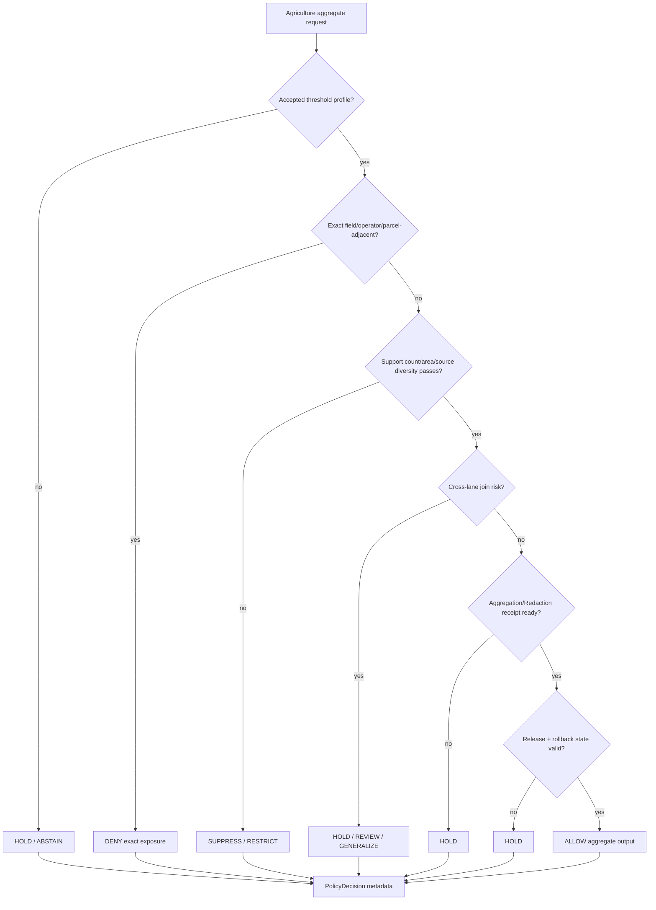

<!-- [KFM_META_BLOCK_V2]
doc_id: kfm://policy/domains/agriculture/aggregation-thresholds
title: Agriculture Aggregation Thresholds Policy README
type: policy-readme
version: v0.1
status: draft
owners: OWNER_TBD — Agriculture steward · Policy steward · Sensitivity steward · Rights steward · Release steward · Docs steward
created: 2026-06-15
updated: 2026-06-15
policy_label: restricted
related:
  - ../README.md
  - ../../README.md
  - ../../../../docs/domains/agriculture/POLICY.md
  - ../../../../docs/domains/agriculture/SENSITIVITY.md
  - ../../../../docs/domains/agriculture/MISSING_OR_PLANNED_FILES.md
  - ../../../../docs/domains/agriculture/PIPELINE.md
  - ../../../../docs/domains/agriculture/CROSS_LANE.md
  - ../../../../policy/sensitivity/
  - ../../../../policy/rights/
  - ../../../../policy/release/
  - ../../../../schemas/contracts/v1/domains/agriculture/
  - ../../../../tests/domains/agriculture/
  - ../../../../fixtures/domains/agriculture/
tags: [kfm, policy, domains, agriculture, aggregation-thresholds, aggregation-receipt, redaction, generalization, public-safe, fail-closed]
notes:
  - "Initial README for the Agriculture aggregation-thresholds policy sublane."
  - "This lane is for policy thresholds and checks that determine whether Agriculture data is aggregated enough for a requested audience or release path."
  - "No concrete numeric thresholds are asserted here; accepted threshold values, schemas, fixtures, and CI enforcement remain NEEDS VERIFICATION."
  - "Field-level, operator-resolved, private parcel-adjacent, and restricted-source Agriculture data should fail closed unless an accepted aggregation/redaction/generalization policy allows a bounded output."
[/KFM_META_BLOCK_V2] -->

<a id="top"></a>

<div align="center">

# Agriculture Aggregation Thresholds Policy

`policy/domains/agriculture/aggregation_thresholds/`

**Policy sublane for Agriculture aggregation thresholds: public-safe grouping, minimum support checks, precision reduction, redaction triggers, and aggregation-receipt requirements.**


[Scope](#1-scope) · [Repo fit](#2-repo-fit) · [Boundary](#3-authority-boundary) · [Inputs](#5-inputs) · [Exclusions](#6-exclusions) · [Threshold classes](#7-threshold-classes) · [Definition of done](#14-definition-of-done)

</div>

---

> [!IMPORTANT]
> **Status:** draft / `NEEDS VERIFICATION`  
> **Owners:** `OWNER_TBD` — Agriculture steward · Policy steward · Sensitivity steward · Rights steward · Release steward · Docs steward  
> **Path:** `policy/domains/agriculture/aggregation_thresholds/README.md`  
> **Responsibility root:** `policy/` — policy-as-code and policy documentation  
> **Truth posture:** CONFIRMED file path / PROPOSED aggregation-threshold policy sublane / UNKNOWN runtime enforcement

> [!CAUTION]
> This README does **not** set numeric public-release thresholds. Until threshold values, fixtures, schemas, and release gates are accepted and tested, exact field/operator/private-parcel-adjacent Agriculture exposure should remain denied, held, restricted, redacted, or generalized.

---

## Quick jump

- [1. Scope](#1-scope)
- [2. Repo fit](#2-repo-fit)
- [3. Authority boundary](#3-authority-boundary)
- [4. Default posture](#4-default-posture)
- [5. Inputs](#5-inputs)
- [6. Exclusions](#6-exclusions)
- [7. Threshold classes](#7-threshold-classes)
- [8. Diagram](#8-diagram)
- [9. Decision vocabulary](#9-decision-vocabulary)
- [10. Obligations](#10-obligations)
- [11. Threshold-record expectations](#11-threshold-record-expectations)
- [12. Inspection path](#12-inspection-path)
- [13. Validation expectations](#13-validation-expectations)
- [14. Definition of done](#14-definition-of-done)
- [15. Open verification items](#15-open-verification-items)

---

## 1. Scope

`policy/domains/agriculture/aggregation_thresholds/` is a proposed Agriculture policy sublane for aggregation-threshold decisions.

It should describe and eventually bind checks that decide whether a crop, yield, acreage, irrigation, remote-sensing, soil/moisture-adjacent, or land-linked Agriculture product is aggregated enough for a requested audience, layer, export, review, or release path.

In scope:

- aggregation-level policy for public-safe Agriculture products
- minimum support and small-cell suppression posture
- field/operator/private parcel-adjacent fail-closed handling
- county, HUC, grid, region, temporal, and source-family aggregation classes
- redaction, suppression, and generalization triggers
- `AggregationReceipt` / `RedactionReceipt` expectations
- test and fixture expectations for positive and negative threshold cases

Out of scope:

- raw Agriculture source data
- numeric thresholds not yet accepted by ADR, policy owner, fixture, or schema
- domain doctrine and source catalogs
- semantic contracts and JSON Schemas
- release approval
- lifecycle storage
- public UI implementation
- executable pipeline transforms

[Back to top](#top)

---

## 2. Repo fit

| Concern | Owning root | Expected relationship |
|---|---|---|
| Aggregation threshold policy | `policy/domains/agriculture/aggregation_thresholds/` | This README and future reviewed threshold policy files, if accepted |
| Agriculture policy parent | `policy/domains/agriculture/` | Domain policy boundary and shared Agriculture obligations |
| Agriculture policy intent | `docs/domains/agriculture/POLICY.md` | Human-facing policy reference; not executable policy bundle |
| Agriculture sensitivity posture | `docs/domains/agriculture/SENSITIVITY.md` | Human-facing sensitivity, rights, and release posture |
| Redaction / aggregation profiles | `policy/domains/agriculture/` or verified policy sublane | Exact home remains `NEEDS VERIFICATION` |
| Threshold tests | `tests/domains/agriculture/` | Required for enforcement claims; presence remains `NEEDS VERIFICATION` |
| Threshold fixtures | `fixtures/domains/agriculture/` | Required for no-network proof; presence remains `NEEDS VERIFICATION` |
| Aggregation receipts | `data/receipts/`, `data/proofs/`, or verified receipt/proof home | Stored artifact home remains `NEEDS VERIFICATION` |
| Release decisions | `release/` | Publication, correction, supersession, rollback authority |

> [!NOTE]
> Agriculture planning docs identify `redaction_profiles.yaml` as a proposed policy file invoked by `AggregationReceipt` and identify `aggregation_threshold/` as a proposed test family. This README provides the policy-lane contract for that threshold work, not proof that it is enforced.

## 3. Authority boundary

This lane may define policy checks for whether Agriculture data is aggregated enough. It must not become a data store, schema home, contract home, public layer registry, or release authority.

```text
policy/domains/agriculture/aggregation_thresholds/ = aggregation threshold policy
policy/domains/agriculture/                       = parent Agriculture policy lane
docs/domains/agriculture/                         = Agriculture doctrine and policy intent
schemas/contracts/v1/domains/agriculture/         = Agriculture machine shape
contracts/domains/agriculture/                    = Agriculture object meaning
tests/domains/agriculture/                        = threshold enforcement tests
fixtures/domains/agriculture/                     = threshold fixtures
data/                                             = lifecycle artifacts, receipts, proofs
release/                                          = publication and rollback authority
```

## 4. Default posture

Aggregation-threshold policy should fail closed.

A threshold gate should return `DENY`, `RESTRICT`, `HOLD`, or `ABSTAIN` when any of these are unresolved:

- accepted threshold profile
- aggregation geography
- temporal bucket
- source role and rights posture
- small-cell or re-identification risk
- field/operator/private parcel-adjacent exposure risk
- cross-lane join impact
- evidence support
- aggregation or redaction receipt
- release state and rollback target
- fixture coverage for the threshold case

## 5. Inputs

| Input family | Examples | Required posture |
|---|---|---|
| Threshold profile | profile id, version, owner, approval state, threshold class | Accepted or marked `NEEDS VERIFICATION` |
| Aggregation geometry | county, HUC, grid, region, generalized tile, masked area | Must be compatible with sensitivity and release posture |
| Temporal bucket | crop year, season, month, week, rolling window | Must be explicit and source-aligned |
| Measure context | acreage, yield, crop class, irrigation, stress index, derived observation | Must be tied to source and object family |
| Support context | count, area support, source count, confidence support, suppressed cell marker | Must be computed or explicitly unknown |
| Sensitivity context | field-level, operator-resolved, parcel-adjacent, restricted-source, quarantine-adjacent | Most restrictive row wins |
| Evidence and rights context | EvidenceRef, EvidenceBundle status, source role, license posture | Required before public-safe claim |
| Release context | candidate, released, superseded, withdrawn, rollback requested | Explicit; never inferred from file path alone |

## 6. Exclusions

| Does not belong here | Correct home |
|---|---|
| Threshold schemas | `schemas/contracts/v1/` |
| AggregationReceipt / RedactionReceipt semantic contracts | `contracts/` |
| Stored receipts, proofs, or lifecycle artifacts | `data/` lifecycle roots |
| Release manifests and rollback cards | `release/` |
| Agriculture source data or source registries | `data/` and source/catalog roots |
| Pipeline code that performs aggregation | `pipelines/domains/agriculture/` or verified pipeline home |
| Package helper code | `packages/domains/agriculture/` |
| Public UI or API routes | `apps/` and governed UI/API packages |
| Secrets, private source material, direct operator identifiers | Secret manager or governed private stores, not repo docs |

## 7. Threshold classes

Threshold values remain `NEEDS VERIFICATION`. This README only defines classes that future policy may need to cover.

| Class | Purpose | Default posture |
|---|---|---|
| `minimum_count` | Prevent release where too few records support an aggregate | Hold or suppress until accepted threshold exists |
| `minimum_area` | Prevent release where aggregate covers too little area | Hold or generalize |
| `minimum_source_diversity` | Prevent a single source/operator from dominating an aggregate | Hold or suppress |
| `minimum_temporal_window` | Prevent overly precise time slices from exposing sensitive activity | Generalize or hold |
| `geometry_generalization` | Require county/HUC/grid/region level instead of field-level geometry | Restrict exact geometry |
| `small_cell_suppression` | Suppress cells that can imply a private operator or parcel | Deny or redact |
| `join_risk_threshold` | Detect compounded exposure after People/Land/Soil/Hydrology joins | Most restrictive row wins |

## 8. Diagram



## 9. Decision vocabulary

| Decision | Meaning | Required behavior |
|---|---|---|
| `ALLOW` | Aggregate passes accepted threshold policy | Scope to profile, geography, time bucket, measure, source, and release context |
| `DENY` | Exact or unsafe exposure is blocked | Do not expose protected detail or threshold internals that increase risk |
| `RESTRICT` | Output may proceed only with suppression, redaction, generalization, or audience restriction | Preserve obligations downstream |
| `HOLD` | Threshold profile, receipt, review, validation, or release support is missing | Do not publish or render publicly |
| `ABSTAIN` | Policy cannot decide because required support is unresolved | Preserve unresolved handles where safe |
| `ERROR` | Policy machinery, schema, runtime, or repository support failed | Fail closed and record failure |

## 10. Obligations

| Obligation | Example effect |
|---|---|
| `aggregate_required` | Output must use accepted county/HUC/grid/region aggregate |
| `small_cell_suppression_required` | Suppress cells below accepted support threshold |
| `generalization_required` | Reduce spatial, temporal, or attribute precision |
| `redaction_required` | Withhold private operator, parcel-adjacent, or restricted source detail |
| `aggregation_receipt_required` | Record threshold profile, support metrics, hash, and transform reason |
| `redaction_receipt_required` | Record what was withheld and why, without leaking details |
| `review_required` | Route borderline or cross-lane cases to steward review |
| `rollback_required` | Require rollback target before public-impacting release |

## 11. Threshold-record expectations

A future threshold policy record or manifest should identify:

- profile id and version;
- owning steward and reviewer;
- affected Agriculture object families;
- geography and temporal bucket classes;
- support metrics used;
- suppression and generalization behavior;
- applicable source families and rights constraints;
- receipt requirements;
- release and rollback requirements;
- positive and negative fixtures;
- reason codes and obligations.

## 12. Inspection path

Concrete threshold profiles, modules, manifests, tests, fixtures, schemas, and CI remain `NEEDS VERIFICATION`.

```bash
find policy/domains/agriculture/aggregation_thresholds -maxdepth 4 -type f | sort
find policy/domains/agriculture tests/domains/agriculture fixtures/domains/agriculture -maxdepth 5 -type f 2>/dev/null | grep -Ei 'aggregation|threshold|redaction|receipt|suppress|generaliz' | sort
find docs/domains/agriculture schemas/contracts/v1 contracts -maxdepth 5 -type f 2>/dev/null | grep -Ei 'aggregation|threshold|redaction|receipt|release' | sort
```

## 13. Validation expectations

Useful validation for this lane should cover:

- no accepted threshold profile returns `HOLD` or `ABSTAIN`;
- exact field/operator/private parcel-adjacent output returns `DENY` unless restricted to an approved non-public audience;
- small support cells are suppressed or held;
- cross-lane joins inherit the most restrictive policy row;
- missing AggregationReceipt or RedactionReceipt blocks public release;
- threshold profile version appears in decision metadata;
- public outputs are reproducible from fixture inputs without live network calls;
- released aggregates have rollback targets.

## 14. Definition of done

- [ ] Owners are confirmed and `OWNER_TBD` is replaced.
- [ ] Accepted threshold classes and values are documented or linked.
- [ ] Threshold profile schema or manifest shape is created or linked.
- [ ] AggregationReceipt / RedactionReceipt contracts and schemas are linked.
- [ ] Positive and negative fixtures are added for each threshold class.
- [ ] Tests cover allow, deny, restrict, hold, abstain, and error outcomes.
- [ ] Cross-lane join-risk behavior is validated.
- [ ] Release and rollback gates consume threshold decisions.
- [ ] Public API bypass checks are covered by policy fixtures or tests.

## 15. Open verification items

| Item | Why it matters |
|---|---|
| Confirm whether this sublane is accepted or should be represented as a file under parent policy | Prevents policy sprawl |
| Confirm numeric threshold authority | Avoids invented or inconsistent public-release thresholds |
| Confirm receipt schema and home | Required for auditable aggregation decisions |
| Confirm fixture location | Required for no-network proof |
| Confirm runtime policy language | Required for executable enforcement |
| Confirm source-specific restrictions | NASS and other sources may impose different aggregation constraints |
| Confirm cross-lane composition rule | Prevents compound re-identification through joins |
| Confirm release integration | Prevents publication without threshold proof and rollback support |

<details>
<summary>Appendix A — no-loss preservation note</summary>

The target file was an empty placeholder. This README adds a bounded aggregation-threshold policy sublane without claiming accepted threshold numbers, runtime enforcement, policy modules, tests, fixtures, schemas, receipt storage, CI coverage, or release-gate integration.

It preserves the Agriculture policy posture that exact field/operator/private parcel-adjacent exposure fails closed unless reviewed policy explicitly allows a transformed, aggregated, redacted, generalized, or restricted output.

</details>

## Status summary

`policy/domains/agriculture/aggregation_thresholds/` should define Agriculture aggregation-threshold policy only if this sublane is accepted and backed by reviewed threshold profiles, fixtures, receipts, tests, and release integration.

It should protect public Agriculture outputs from exact exposure and small-cell leakage while preserving evidence, source-role, rights, sensitivity, receipt, release, correction, and rollback boundaries.

<p align="right"><a href="#top">Back to top</a></p>
