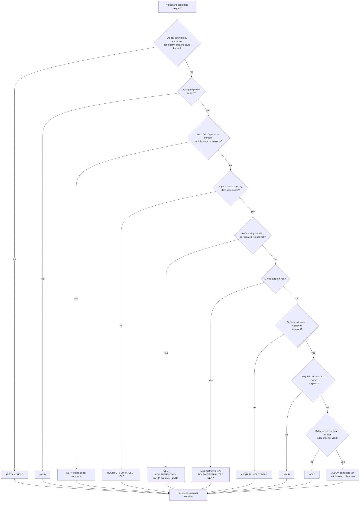

<!-- [KFM_META_BLOCK_V2]
doc_id: kfm://policy/domains/agriculture/aggregation-thresholds
title: Agriculture Aggregation Thresholds Policy README
type: readme; directory-readme; domain-policy-sublane; disclosure-control-boundary
version: v0.2
status: draft; repository-grounded; README-only; fail-closed; numeric-thresholds-unaccepted; implementation-unconfirmed
owners: OWNER_TBD — Agriculture steward · Policy steward · Sensitivity and rights steward · Privacy/re-identification reviewer · Contract/schema steward · Validator/test steward · Release steward · Docs steward
created: 2026-06-15
updated: 2026-07-19
supersedes: v0.1 Agriculture aggregation-thresholds policy guide
policy_label: restricted-review; policy; agriculture; aggregation; suppression; generalization; public-safe; no-public-authority
current_path: policy/domains/agriculture/aggregation_thresholds/README.md
owning_root: policy/
responsibility: >
  Human-readable operating contract for the Agriculture aggregation-threshold policy sublane:
  defines the authority boundary, required decision inputs, finite outcomes, threshold classes,
  suppression/generalization obligations, anti-reconstruction controls, review burden, test
  expectations, and repository evidence status without inventing numeric values or claiming
  executable enforcement.
truth_posture: >
  CONFIRMED target README and parent Agriculture policy lane; policy/sensitivity/agriculture/
  aggregation_thresholds.yaml exists but is a PROPOSED placeholder; Agriculture aggregate-only
  test documentation exists while test_nass_aggregate_only.py remains a docstring-only placeholder;
  AggregationReceipt semantic contract exists; paired schema exists but is permissive and empty;
  data/receipts/aggregation/ README exists while canonical subroot and receipt instances remain
  unverified; domain-agriculture workflow reports explicit readiness holds /
  PROPOSED policy boundary, threshold-profile contract, decision matrix, reason codes, obligations,
  validation plan, and graduation criteria /
  CONFLICTED policy/domains/agriculture/aggregation_thresholds/ sublane versus the separate
  policy/sensitivity/agriculture/aggregation_thresholds.yaml placeholder; hyphenated
  aggregation-receipt.md contract versus underscore aggregation_receipt.md schema metadata;
  domain-specific receipt contract versus broader receipt-family placement /
  UNKNOWN accepted numeric thresholds, executable policy language and evaluator wiring, deterministic
  threshold fixtures, collected tests, validator implementation, emitted AggregationReceipt instances,
  release-gate consumption, branch-protection enforcement, current run results, and steward assignments /
  NEEDS VERIFICATION canonical policy-file placement, threshold authority, source-specific disclosure
  rules, profile schema, receipt layout, public-surface integration, correction/rollback tests, and
  independent policy/release review.
evidence_snapshot:
  repository: bartytime4life/Kansas-Frontier-Matrix
  repository_id: "1059091169"
  visibility: public
  base_ref: main
  base_commit: 5cf7386b17a85feeadbb82a0eb9ec92bded68279
  prior_blob: acc7d7b4edcd52bb01303bda117f2969be4121f1
  parent_policy_blob: ba73c387e16f70895f32444e489d6d55dd577b75
  sensitivity_policy_placeholder_blob: 31947ca3e468a967aed3fc5d44699130b7d588fd
  agriculture_policy_doc_blob: be42d02fae601f4b90a220f336ec36a848d2e51a
  agriculture_sensitivity_doc_blob: 9d25f63d471af78899d8db2ad39a3921c4f11fac
  aggregate_only_test_readme_blob: e872e11c71840cb806717bf1199c74c4a01d4e37
  sibling_placeholder_test_blob: 97939b939122f029f35ecf12c81f5989df00ae63
  aggregation_receipt_contract_blob: 7a658c579011dad0636025f502419372294d9086
  aggregation_receipt_schema_blob: 16c55157c07d3115bfb540b2064e0401bc71b564
  aggregation_receipts_readme_blob: b691830881e7787e8118e30fcad4a95186d3610d
  agriculture_workflow_blob: 1dd9938b92de61c7d905f30170cf6394e6c06ea1
related:
  - ../README.md
  - ../../README.md
  - ../../../README.md
  - ../../../../docs/domains/agriculture/POLICY.md
  - ../../../../docs/domains/agriculture/SENSITIVITY.md
  - ../../../../docs/domains/agriculture/PIPELINE.md
  - ../../../../docs/domains/agriculture/CROSS_LANE.md
  - ../../../../docs/domains/agriculture/OBJECT_FAMILIES.md
  - ../../../../docs/domains/agriculture/MISSING_OR_PLANNED_FILES.md
  - ../../../sensitivity/agriculture/aggregation_thresholds.yaml
  - ../../../../contracts/domains/agriculture/aggregation-receipt.md
  - ../../../../schemas/contracts/v1/domains/agriculture/aggregation_receipt.schema.json
  - ../../../../tests/domains/agriculture/aggregate_only/README.md
  - ../../../../tests/domains/agriculture/test_nass_aggregate_only.py
  - ../../../../fixtures/domains/agriculture/
  - ../../../../tools/validators/agriculture/README.md
  - ../../../../data/receipts/aggregation/README.md
  - ../../../../release/agriculture/README.md
  - ../../../../docs/doctrine/directory-rules.md
  - ../../../../docs/doctrine/ai-build-operating-contract.md
  - ../../../../.github/workflows/domain-agriculture.yml
tags:
  - kfm
  - policy
  - agriculture
  - aggregation-thresholds
  - disclosure-control
  - small-cell-suppression
  - complementary-suppression
  - spatial-generalization
  - temporal-generalization
  - join-risk
  - differencing-risk
  - aggregation-receipt
  - redaction-receipt
  - fail-closed
  - no-network
  - release-gated
notes:
  - "This revision changes only this README plus the required AI-generated provenance receipt."
  - "No numeric threshold, executable policy, schema, contract, fixture, test, validator, workflow, receipt instance, release artifact, or public behavior is created or changed."
  - "Aggregation adequacy is necessary but never sufficient for public release."
  - "The most restrictive applicable source, rights, sensitivity, audience, join, and release rule wins."
  - "Base drift from 52192ad to 5cf7386 was inspected; no target or cited Agriculture aggregation boundary file changed in that range."
[/KFM_META_BLOCK_V2] -->

<a id="top"></a>

# Agriculture Aggregation Thresholds Policy

> **One-line purpose.** Define the fail-closed policy boundary for deciding whether an Agriculture output is sufficiently aggregated, suppressed, generalized, evidence-supported, rights-compatible, reviewable, and release-ready for a requested audience—without treating aggregation as automatic publication permission.

<p>
  
  
  
  
  
  
  
</p>

> [!IMPORTANT]
> **Aggregation is a disclosure-control gate, not a release decision.** Passing an aggregation profile does not establish source authority, truth, rights clearance, EvidenceBundle closure, policy approval, review completion, release approval, correction readiness, or rollback support.

> [!CAUTION]
> **No numeric thresholds are accepted by this README.** The repository contains a placeholder `policy/sensitivity/agriculture/aggregation_thresholds.yaml`, a draft `AggregationReceipt` contract, an empty permissive receipt schema, README-level test plans, and a readiness-hold workflow. Those surfaces do not establish executable threshold enforcement.

> [!WARNING]
> **Precision must not be reconstructed downstream.** Public clients, exports, tiles, reports, compare views, and AI answers must not combine otherwise permissible aggregates in ways that reveal a field, operator, private parcel, restricted source contribution, or unique activity pattern.

**Quick links:** [Purpose](#purpose) · [Authority](#authority-level) · [Status](#status) · [Belongs](#what-belongs-here) · [Does not](#what-does-not-belong-here) · [Default posture](#default-posture) · [Inputs](#inputs) · [Outcomes](#outputs-and-finite-outcomes) · [Threshold classes](#threshold-classes) · [Profile contract](#threshold-profile-contract) · [Validation](#validation) · [Review](#review-burden) · [Related](#related-folders) · [ADRs](#adrs-and-conflicts) · [Done](#definition-of-done) · [Open items](#open-verification-items)

---

## Purpose

`policy/domains/agriculture/aggregation_thresholds/` is the Agriculture policy documentation sublane for **aggregation sufficiency and disclosure-control decisions**.

A complete implementation behind this README should answer:

1. What Agriculture object, measure, source role, geography, time bucket, and audience are being evaluated?
2. Which reviewed threshold profile and version apply?
3. Is the source intrinsically aggregate, modeled, observed, operator-linked, parcel-adjacent, or restricted?
4. Are support count, support area, source diversity, dominance, temporal precision, and join risk known?
5. Can differencing, mosaic comparison, repeated releases, or cross-lane joins reconstruct protected detail?
6. Which suppression, complementary suppression, redaction, generalization, delay, audience restriction, or review obligations apply?
7. Does an `AggregationReceipt`, `RedactionReceipt`, or equivalent governed process-memory object exist?
8. Do evidence, rights, validation, review, release, correction, and rollback gates close independently?
9. Can the same decision be replayed deterministically from synthetic no-network fixtures?
10. Does every unsupported or unsafe state fail closed with a bounded outcome and safe reason code?

### Scope

This lane covers policy for:

- county-year, crop-reporting-district-year, HUC, grid, region, and other reviewed aggregate classes;
- minimum-support and small-cell suppression requirements;
- contributor-dominance and source-diversity checks;
- spatial, temporal, and attribute generalization;
- complementary suppression and differencing-risk controls;
- repeated-release and map-tile reconstruction risk;
- field-, operator-, parcel-, irrigation-, and private-party adjacency;
- cross-lane joins with People/Land, Hydrology, Soil, Habitat, Infrastructure, and other sensitive lanes;
- source-specific, audience-specific, and release-specific aggregation obligations;
- `AggregationReceipt`, `RedactionReceipt`, review, correction, and rollback references;
- finite policy decisions, reason codes, obligations, fixtures, tests, and validation expectations.

This lane does **not** establish that any data is safe, true, public, current, rights-cleared, released, or suitable for agronomic or operational decision-making.

[Back to top](#top)

---

## Authority level

**Canonical policy responsibility / non-authoritative Agriculture sublane.**

Directory Rules place allow/deny/restrict/abstain decisions under `policy/`. Agriculture is a domain segment inside that responsibility root. This README refines the aggregation-threshold boundary; it does not own object meaning, machine shape, data, receipts, proof, release, or public behavior.

| Concern | Authority home | This lane's role |
|---|---|---|
| Agriculture aggregation decision rules | `policy/` after placement is resolved | Documents and, if accepted, hosts policy-owned threshold logic. |
| Agriculture policy intent | `docs/domains/agriculture/POLICY.md` | Applies intent; does not replace it. |
| Sensitivity, rights, and tier posture | `docs/domains/agriculture/SENSITIVITY.md`, `policy/sensitivity/`, `policy/rights/` | Consumes the most restrictive applicable row. |
| Agriculture object meaning | `contracts/domains/agriculture/` | References object meaning; does not redefine it. |
| Machine-readable shape | `schemas/contracts/v1/domains/agriculture/` or accepted shared policy schema | Validates profiles and receipts; does not author shape in README prose. |
| Threshold transformation code | `pipelines/domains/agriculture/` or accepted package/tool lane | Policy decides obligations; transform code performs them. |
| Policy evaluator code | `packages/policy-runtime/` or accepted runtime lane | Evaluates policy; policy values remain policy authority. |
| Synthetic inputs | `fixtures/domains/agriculture/` | Supplies deterministic valid and invalid cases. |
| Enforceability proof | `tests/domains/agriculture/` | Proves outcomes; does not invent thresholds. |
| Validator implementation | `tools/validators/agriculture/` or accepted shared validator lane | Checks profiles, receipts, and outputs. |
| Receipt instances | `data/receipts/` after receipt-layout review | Records process memory; not proof or release authority. |
| Evidence and proof | `data/proofs/`, EvidenceBundle family | Supports claims independently of aggregation receipts. |
| Release, correction, rollback | `release/` | Authorizes or refuses public state transitions. |
| Public API/UI/map/AI | Governed `apps/`, packages, and released artifacts | Consumes only bounded decisions and released outputs. |
| CI orchestration | `.github/workflows/` | Invokes accepted checks; a green hold is not enforcement proof. |

### Governing order

When aggregation sources disagree, apply this order:

1. KFM core invariants and operating law.
2. Accepted ADRs that explicitly amend policy or placement.
3. Sensitive-domain and most-restrictive-row rules.
4. Agriculture policy and sensitivity doctrine.
5. Source-specific rights, confidentiality, and disclosure obligations.
6. This README.
7. Proposed placeholder policy, schema, tests, and workflow scaffolds.

A lower-ranked artifact must not weaken a higher-ranked denial, restriction, review, or release obligation.

[Back to top](#top)

---

## Status

### Confirmed repository state

At `main@5cf7386b17a85feeadbb82a0eb9ec92bded68279`:

```text
policy/
├── domains/
│   └── agriculture/
│       ├── README.md
│       └── aggregation_thresholds/
│           └── README.md                         # this file
└── sensitivity/
    └── agriculture/
        └── aggregation_thresholds.yaml            # PROPOSED placeholder only

contracts/domains/agriculture/
└── aggregation-receipt.md                         # draft semantic contract; path conflict recorded

schemas/contracts/v1/domains/agriculture/
└── aggregation_receipt.schema.json                # permissive scaffold; no required fields

tests/domains/agriculture/
├── aggregate_only/
│   └── README.md                                  # test contract; README-only
└── test_nass_aggregate_only.py                    # docstring-only placeholder

data/receipts/aggregation/
└── README.md                                      # receipt boundary; canonical subroot unresolved

.github/workflows/
└── domain-agriculture.yml                         # explicit readiness HOLD jobs
```

| Surface | Confirmed state | Safe conclusion |
|---|---|---|
| Target README | Present as v0.1 | Policy documentation exists; enforcement does not follow. |
| Parent Agriculture policy README | Present, draft | Defines fail-closed Agriculture policy intent and lane boundary. |
| Sensitivity threshold YAML | Eight-line `PROPOSED` placeholder | No threshold profile, values, rules, owners, or evaluator contract exists there. |
| Agriculture policy doctrine | Present, draft | Requires deny-by-default, most-restrictive-row handling, and receipt/review gates. |
| Agriculture sensitivity doctrine | Present, draft | Aggregate products must not become field/operator truth; private joins fail closed. |
| Aggregate-only test README | Present, repository-grounded | A detailed test contract exists. |
| Executable aggregate-only test | Docstring-only placeholder | No collected pytest assertion is established. |
| `AggregationReceipt` contract | Draft semantic contract | Recommended meaning and fields exist; path and family placement remain conflicted. |
| `AggregationReceipt` schema | `PROPOSED`, empty `properties`, `additionalProperties: true` | It cannot enforce the contract's recommended fields. |
| Aggregation receipt data lane | README present | Receipt boundary exists; canonical subroot and actual instances remain unverified. |
| Agriculture workflow | Command-bearing readiness inspection | Reports `WORKFLOW_HOLD`; it does not evaluate thresholds or release readiness. |
| Accepted numeric thresholds | Not found in inspected evidence | Do not invent, infer, or encode values in this README. |
| Executable policy/evaluator | Not established | Runtime enforcement remains `UNKNOWN`. |
| Release-gate consumption | Not established | Aggregation decisions must not be treated as publication permission. |

### Current maturity determination

**CONFIRMED:** the repository has a coherent documentation spine for Agriculture aggregation, sensitivity, receipts, tests, and CI readiness.

**UNKNOWN:** a governed executable aggregation-threshold system.

**PROPOSED:** graduate this lane only after placement, profile authority, schemas, fixtures, tests, validator/evaluator wiring, receipt emission, release consumption, and independent review are proven together.

[Back to top](#top)

---

## What belongs here

Accepted material is limited to policy-owned aggregation-threshold documentation and, after placement is resolved, executable policy configuration or modules:

- threshold-profile policy files with explicit status and version;
- policy modules that select profiles and return finite decisions;
- source-role, audience, geography, time, measure, support, dominance, and join-risk conditions;
- suppression, complementary suppression, redaction, generalization, delay, and review obligations;
- safe reason-code vocabularies;
- policy-local manifests and indexes;
- references to schemas, contracts, fixtures, tests, validators, receipts, release gates, and ADRs;
- README files explaining policy authority, defaults, change control, and rollback.

Every policy-bearing child file should declare:

- profile or module identity and version;
- status: proposed, accepted, deprecated, superseded, or retired;
- owning and reviewing roles;
- effective and retirement dates where applicable;
- supported object families, source roles, audiences, geographies, and time buckets;
- required inputs and unknown-input behavior;
- finite outcomes, reason codes, and obligations;
- schema and contract references;
- valid and invalid fixture references;
- test and validator references;
- release, correction, and rollback effects;
- hash, signature, or immutable reference when operationally required.

[Back to top](#top)

---

## What does not belong here

| Do not place here | Correct authority home |
|---|---|
| Numeric values copied from confidential, contractual, or unpublished source rules without approval | Reviewed policy source after rights and disclosure review |
| Agriculture object semantics | `contracts/domains/agriculture/` |
| JSON Schemas | `schemas/contracts/v1/` |
| Transform, aggregation, tiling, or export code | `pipelines/`, `packages/`, or `tools/` by responsibility |
| Synthetic or invalid sample payloads | `fixtures/domains/agriculture/` |
| Tests and assertions | `tests/domains/agriculture/` |
| Validator implementation | `tools/validators/agriculture/` or accepted shared validator lane |
| Full source records or private operator/parcel details | Governed lifecycle stores; never README prose |
| `AggregationReceipt` instances | `data/receipts/` after layout is accepted |
| EvidenceBundle or ProofPack material | `data/proofs/` and evidence family |
| Catalog records | `data/catalog/` |
| ReleaseManifest, PromotionDecision, CorrectionNotice, RollbackCard | `release/` |
| Public layers, PMTiles, reports, exports, stories, or API responses | `data/published/` and governed public surfaces after release |
| Secrets, credentials, private endpoints, restricted payloads, exact harmful joins | Secret/private governed systems, not repository documentation |
| AI-generated threshold values or source interpretations | DENY as policy authority |

### Forbidden shortcut

```text
"aggregated"
  ≠ evidence resolved
  ≠ rights cleared
  ≠ sensitivity cleared
  ≠ reviewed
  ≠ released
  ≠ safe against differencing
  ≠ safe against cross-lane reconstruction
  ≠ public
```

[Back to top](#top)

---

## Default posture

Aggregation-threshold policy **must fail closed**.

A decision should return `DENY`, `RESTRICT`, `HOLD`, `ABSTAIN`, or `ERROR` when any required context is absent, stale, conflicted, malformed, unapproved, or unsafe.

### Non-negotiable defaults

- No accepted profile → `HOLD` or `ABSTAIN`.
- Unknown source role or rights → `HOLD`, `ABSTAIN`, or `DENY`.
- Exact field, operator, private parcel, proprietary yield, pesticide, or restricted-source exposure → `DENY` for public exact use.
- Small-cell or contributor-dominance risk → `RESTRICT`, `HOLD`, or `DENY`.
- Differencing, mosaic, repeated-release, or join reconstruction risk → `DENY` or `HOLD` pending a stronger transform and review.
- Missing aggregation/redaction receipt → `HOLD` for public-impacting transition.
- Missing EvidenceRef-to-EvidenceBundle support → `ABSTAIN` or `HOLD`.
- Missing validation or policy evaluator result → `HOLD` or `ERROR`.
- Missing release, correction, or rollback state → `HOLD`.
- Policy-system failure → `ERROR`; never fallback to allow.
- Conflicting rules → most restrictive applicable rule wins.

### Aggregation anti-collapse rules

This lane must not collapse:

- an aggregate source into field-level observation;
- a modeled or remote-sensing product into observed operator truth;
- a county or CRD statistic into a parcel or farm claim;
- schema validity into policy permission;
- a policy `ALLOW` into release approval;
- an `AggregationReceipt` into proof;
- test success into publication authority;
- a README into executable enforcement;
- an omitted input into a permissive default;
- multiple public aggregates into a reconstructed restricted record;
- a lower sensitivity tier into permission to ignore source rights;
- a transformed output into permission to discard provenance.

[Back to top](#top)

---

## Inputs

A threshold evaluation should consume an explicit, versioned decision context.

| Input family | Minimum expected fields | Failure posture |
|---|---|---|
| Request context | operation, requested audience, purpose, public/semi-public/reviewer route | `ABSTAIN` or `HOLD` if absent |
| Agriculture object context | object family, measure, units, source role, derived/observed/modeled character | `ABSTAIN` if unresolved |
| Threshold profile | profile id, version, approval state, effective period, hash/ref | `HOLD` if absent or unaccepted |
| Geography | source geography, requested geography, geometry class, scale, adjacency | `RESTRICT` or `DENY` if too precise |
| Time | source time, valid time, requested bucket, release cadence, overlap | `RESTRICT` or `HOLD` if too precise |
| Support | count, area, source diversity, contributor dominance, uncertainty, missingness | `HOLD` or `RESTRICT` if unknown |
| Sensitivity | tier, field/operator/parcel adjacency, private-party and restricted-source flags | most restrictive row wins |
| Rights | license/terms, disclosure limits, attribution, named agreement, redistribution class | `HOLD` or `DENY` if unclear |
| Join context | joined lanes, join keys, spatial/temporal overlap, re-identification score or review | `DENY` or `HOLD` if reconstructive |
| Prior releases | overlapping outputs, suppression patterns, differencing and mosaic risk | `HOLD` until reconstruction risk is checked |
| Evidence | EvidenceRef, EvidenceBundle status, citations, source version | `ABSTAIN` or `HOLD` if unresolved |
| Validation | schema/contract result, validator report, fixture/test profile | `ERROR` or `HOLD` if absent |
| Receipt context | aggregation/redaction/transform receipt refs and digests | `HOLD` when required and missing |
| Review | owner, policy reviewer, sensitivity/rights review, decision state | `HOLD` when required |
| Release | candidate/released/superseded/withdrawn state, correction path, rollback target | `HOLD` unless independently valid |

### Input minimization

Policy evaluation should receive only the minimum fields needed to decide safely. It should not copy private source rows, operator names, parcel identifiers, exact restricted geometries, or confidential numeric policy values into logs, summaries, public reason strings, or uploaded CI artifacts.

[Back to top](#top)

---

## Outputs and finite outcomes

A policy decision should be bounded to the exact profile, object family, source role, audience, geography, time bucket, measure, and release context supplied.

| Decision | Meaning | Required behavior |
|---|---|---|
| `ALLOW` | The requested aggregate passes the reviewed profile for the declared use | Preserve scope, evidence, rights, receipts, and release obligations; do not imply publication approval |
| `DENY` | Exact exposure or reconstruction risk is forbidden | Return a safe reason code without protected details |
| `RESTRICT` | The request may proceed only after specified suppression, redaction, generalization, delay, audience restriction, or review | Attach enforceable obligations; downstream code must preserve them |
| `HOLD` | Human review, profile approval, validation, receipt, release, correction, or rollback support is incomplete | No public transition |
| `ABSTAIN` | Required evidence, source, scope, or policy input is unresolved | State the unsupported boundary; do not guess |
| `ERROR` | Evaluator, schema, dependency, or runtime failure prevented a decision | Fail closed and emit safe diagnostics |

### Candidate reason-code families

The following are **PROPOSED documentation vocabulary**, not a machine enum until a contract/schema accepts them:

| Family | Example code | Intended use |
|---|---|---|
| Profile | `AGG_PROFILE_MISSING` | No accepted threshold profile |
| Scope | `AGG_SCOPE_UNSUPPORTED` | Requested geography/time/measure is outside profile |
| Precision | `AGG_EXACT_EXPOSURE_DENIED` | Field/operator/parcel precision is forbidden |
| Support | `AGG_SUPPORT_INSUFFICIENT` | Count/area/source support is below policy |
| Dominance | `AGG_CONTRIBUTOR_DOMINANCE_RISK` | One contributor or source dominates |
| Suppression | `AGG_COMPLEMENTARY_SUPPRESSION_REQUIRED` | Primary suppression can be reversed |
| Reconstruction | `AGG_DIFFERENCING_RISK` | Releases can be differenced |
| Join | `AGG_JOIN_REIDENTIFICATION_RISK` | Cross-lane join creates unsafe specificity |
| Rights | `AGG_RIGHTS_UNRESOLVED` | Terms or disclosure rights are unclear |
| Evidence | `AGG_EVIDENCE_UNRESOLVED` | Evidence support does not close |
| Receipt | `AGG_RECEIPT_REQUIRED` | Required process-memory record is missing |
| Review | `AGG_REVIEW_REQUIRED` | Steward or specialist review is pending |
| Release | `AGG_RELEASE_STATE_INVALID` | Release/correction/rollback support is missing |
| System | `AGG_POLICY_SYSTEM_ERROR` | Policy evaluation failed |

### Obligations

| Obligation | Required downstream effect |
|---|---|
| `aggregate_required` | Use only the accepted aggregation unit |
| `primary_suppression_required` | Withhold the unsafe cell or group |
| `complementary_suppression_required` | Suppress additional cells so totals cannot reveal the primary cell |
| `spatial_generalization_required` | Reduce exact geometry to an accepted region/grid/HUC/county class |
| `temporal_generalization_required` | Broaden the time bucket or delay release |
| `attribute_generalization_required` | Coarsen crop, measure, category, or contributor detail |
| `redaction_required` | Remove operator, parcel, private-party, or restricted-source detail |
| `audience_restriction_required` | Limit output to a reviewed role or agreement |
| `rights_review_required` | Obtain source/redistribution review |
| `sensitivity_review_required` | Obtain privacy/re-identification review |
| `aggregation_receipt_required` | Emit immutable aggregation process memory |
| `redaction_receipt_required` | Record what class of detail was withheld and why without leaking it |
| `evidence_resolution_required` | Resolve EvidenceRef to sufficient support |
| `release_review_required` | Route to independent release authority |
| `correction_path_required` | Define how a published aggregate can be corrected or withdrawn |
| `rollback_required` | Pin a prior known-good release or safe fallback |

[Back to top](#top)

---

## Threshold classes

No values in this table are accepted numeric policy. The classes identify what reviewed profiles may need to express.

| Class | Policy question | Typical fail-closed response |
|---|---|---|
| `minimum_count` | Are enough records or units represented? | Suppress, hold, or deny |
| `minimum_area` | Is the supported area broad enough? | Generalize or hold |
| `minimum_source_diversity` | Are enough independent sources represented? | Hold or suppress |
| `maximum_contributor_dominance` | Can one contributor be inferred from the aggregate? | Suppress, restrict, or deny |
| `minimum_temporal_window` | Is the time bucket broad enough? | Broaden, delay, or hold |
| `minimum_spatial_unit` | Is the geography sufficiently generalized? | Generalize or deny exact geometry |
| `attribute_precision_limit` | Are crop/measure/category attributes too specific? | Coarsen or redact |
| `small_cell_suppression` | Does a cell expose too few contributors or records? | Suppress |
| `complementary_suppression` | Can totals reveal a suppressed value? | Suppress additional cells |
| `differencing_risk` | Can overlapping releases reveal hidden values? | Hold or deny release combination |
| `mosaic_reconstruction_risk` | Can adjacent tiles/grids reconstruct a field or parcel? | Generalize, mask, or deny |
| `join_risk_threshold` | Do cross-lane joins create re-identification or source-role collapse? | Most restrictive rule wins |
| `uncertainty_floor` | Is support/uncertainty adequate for the claimed interpretation? | Abstain, label, or hold |
| `source_specific_floor` | Does a source impose a stricter disclosure rule? | Apply source rule; never weaken |
| `audience_specific_floor` | Is the request permitted only for reviewers or named parties? | Restrict audience |
| `release_overlap_limit` | Do prior/current releases compound disclosure risk? | Hold pending reconstruction review |

### Threshold selection rules

A future evaluator should:

1. select only an accepted profile;
2. confirm profile applicability to the source role, object family, measure, geography, time, and audience;
3. evaluate all applicable threshold classes;
4. apply the most restrictive result;
5. calculate suppression and reconstruction risk over the output set, not only one row;
6. preserve required obligations;
7. emit a reviewable decision and receipt references;
8. require separate release authority.

[Back to top](#top)

---

## Source-role and sensitivity matrix

| Input character | Public exact posture | Aggregation policy posture |
|---|---|---|
| County/CRD/state aggregate from an admissible aggregate source | Not automatically public | Evaluate support, rights, evidence, differencing, receipt, and release gates |
| Field-level remote-sensing context | Deny as field truth | Generalize; retain modeled/context source role |
| Field-level NASS claim | `DENY` | Do not manufacture field precision from aggregate source data |
| Proprietary or operator-supplied yield | `DENY` public exact | Named-agreement/restricted review only; aggregation does not erase obligations |
| Field candidate/footprint | Reviewer or restricted | Generalize before any public candidate |
| Well-field-operator or parcel-operator link | `DENY` public exact | Cross-lane privacy and rights review; public reconstruction prohibited |
| Aggregate conservation or irrigation context | Conditional | Evaluate source role, contributor dominance, joins, evidence, and release |
| Modeled suitability/stress indicator | Not observed truth | Preserve model/interpretive character and uncertainty |
| Quarantine-adjacent or unresolved-rights material | `DENY` / `HOLD` | No aggregation shortcut to public release |
| Synthetic test fixture | Never source truth | Valid only for deterministic test behavior |

### Most-restrictive-row examples

- A county statistic joined to a private operator identifier remains restricted.
- A generalized tile that can be mosaicked into field boundaries remains unsafe.
- A large count derived from one dominant contributor remains disclosure-sensitive.
- An aggregate with clear rights but unresolved evidence must abstain or hold.
- An evidence-supported aggregate with no rollback target remains release-blocked.

[Back to top](#top)

---

## Decision flow



The `ALLOW` branch means only that the aggregation policy gate passed for the exact declared context. It does not publish an artifact.

[Back to top](#top)

---

## Threshold-profile contract

A future threshold profile should be machine-readable, immutable or hash-bound, and reviewed separately from this README.

### Minimum semantic fields

| Field | Purpose |
|---|---|
| `profile_id` | Stable profile identity |
| `profile_version` | Immutable semantic version |
| `status` | proposed, accepted, deprecated, superseded, retired |
| `owner_roles` | Responsible policy and domain stewards |
| `reviewer_roles` | Sensitivity, rights, privacy/re-identification, release reviewers |
| `effective_at` / `retired_at` | Validity interval |
| `supersedes` / `superseded_by` | Profile lineage |
| `object_families` | Agriculture object families covered |
| `source_roles` | aggregate, observed, modeled, contextual, restricted, derived |
| `source_families` | Source-specific applicability and restrictions |
| `audiences` | public, semi-public, reviewer, named-agreement, denied |
| `purposes` | Approved use classes |
| `geography_classes` | county, CRD, HUC, grid, region, generalized tile, other reviewed units |
| `temporal_classes` | year, season, month, delayed window, other reviewed buckets |
| `measure_classes` | acreage, yield, crop class, irrigation, stress/suitability, other |
| `threshold_rules` | References to accepted rule values; values may be separately restricted |
| `dominance_rules` | Contributor/source dominance posture |
| `suppression_rules` | Primary and complementary suppression |
| `reconstruction_rules` | Differencing, mosaic, repeated-release, join-risk checks |
| `obligations` | Required transforms, receipts, reviews, release conditions |
| `reason_codes` | Bounded outcomes |
| `schema_ref` / `contract_refs` | Machine and semantic authority |
| `fixture_refs` / `test_refs` | Positive and negative proof cases |
| `policy_hash` | Deterministic content identity |
| `decision_or_adr_refs` | Approval authority and rationale |
| `rollback_ref` | Prior accepted profile or kill-switch posture |

### Profile security posture

- Public documentation may expose profile identity, status, scope, and high-level obligations.
- Numeric values or logic that materially increase re-identification or evasion risk should be restricted to reviewed policy/runtime contexts.
- Threshold secrecy must not substitute for robust aggregation, suppression, evidence, and access controls.
- Profile changes require versioning, fixture updates, regression tests, impact analysis, and rollback.
- Retired profiles remain auditable and must not be silently overwritten.

[Back to top](#top)

---

## Outputs and receipt boundary

A successful aggregation operation should produce or reference distinct artifact families:

| Artifact | Purpose | Must not be treated as |
|---|---|---|
| `PolicyDecision` | Records allow/deny/restrict/hold/abstain/error and obligations | Release approval |
| `AggregationReceipt` | Records aggregation method, inputs, profile, output refs, and process lineage | Evidence or proof |
| `RedactionReceipt` | Records transformed/withheld detail classes and reasons | Permission to reconstruct |
| `ValidationReport` | Records schema/contract/validator outcomes | Scientific endorsement |
| EvidenceBundle / proof support | Supports claim-bearing output | Policy decision |
| ReleaseManifest / promotion decision | Authorizes governed public state transition | Aggregation process memory |
| Correction/Rollback record | Supports reversal and lineage | Optional documentation |

### Receipt requirements

When required, `AggregationReceipt` should bind:

- receipt and run identity;
- profile identity/version/hash;
- input refs and deterministic digest;
- source and evidence refs;
- aggregation unit and time bucket;
- method/recipe identity;
- support, suppression, dominance, and reconstruction-check summaries;
- output refs;
- policy decision ref;
- review state;
- release candidate ref where applicable;
- correction/supersession refs;
- rollback target.

The current paired schema does not enforce those fields. Until schema and validator work lands, a receipt-shaped JSON object must not be represented as schema-validated closure.

[Back to top](#top)

---

## Validation

### Required test families

A complete implementation should include deterministic valid and invalid cases for:

| Case | Expected policy behavior |
|---|---|
| Accepted county-year aggregate with adequate support and complete evidence | `ALLOW` candidate use with receipts/release obligations |
| Missing threshold profile | `HOLD` or `ABSTAIN` |
| Proposed/deprecated/superseded profile used as accepted | `DENY` or `HOLD` |
| Exact field/operator/parcel request | `DENY` public exact |
| Field-level NASS claim | `DENY` |
| Support count or area below profile | `RESTRICT`, suppress, hold, or deny |
| Single contributor/source dominance | `RESTRICT`, suppress, hold, or deny |
| Primary suppression reversible from totals | Complementary suppression required |
| Differencing across releases reconstructs hidden cell | `DENY` or `HOLD` |
| Adjacent tiles reconstruct a field | Generalize/mask or deny |
| Cross-lane People/Land or well/operator join | Most restrictive rule; usually deny/hold |
| Unknown rights or restricted redistribution | `HOLD` or `DENY` |
| Evidence unresolved | `ABSTAIN` or `HOLD` |
| Receipt missing | `HOLD` |
| Permissive empty receipt schema | Negative test must prove this is insufficient |
| Release/rollback missing | `HOLD` |
| Evaluator exception or malformed policy | `ERROR`, fail closed |
| Synthetic fixture presented as source truth | Test failure / deny |
| UI/API/AI output drops obligations or implies extra precision | Test failure / deny |
| Profile version changed without fixture/test update | Drift failure |
| Retired profile used after effective period | `DENY` or `HOLD` |

### Current executable status

- `tests/domains/agriculture/aggregate_only/README.md` defines a comprehensive test boundary.
- `tests/domains/agriculture/test_nass_aggregate_only.py` contains no executable pytest test.
- `schemas/contracts/v1/domains/agriculture/aggregation_receipt.schema.json` cannot enforce receipt fields.
- `policy/sensitivity/agriculture/aggregation_thresholds.yaml` contains no executable threshold profile.
- `.github/workflows/domain-agriculture.yml` reports explicit readiness holds and must not be represented as substantive aggregation enforcement.

### Inspection commands

```bash
git ls-files \
  policy/domains/agriculture \
  policy/sensitivity/agriculture \
  contracts/domains/agriculture \
  schemas/contracts/v1/domains/agriculture \
  tests/domains/agriculture \
  fixtures/domains/agriculture \
  tools/validators/agriculture \
  data/receipts/aggregation \
  release/agriculture \
  .github/workflows/domain-agriculture.yml

python -m pytest --collect-only -q tests/domains/agriculture

python - <<'PY'
import json
from pathlib import Path

schema = json.loads(
    Path("schemas/contracts/v1/domains/agriculture/aggregation_receipt.schema.json").read_text()
)
assert schema.get("properties"), "AggregationReceipt schema remains an empty scaffold"
assert schema.get("required"), "AggregationReceipt schema has no required fields"
PY

grep -RInE \
  'TODO|PROPOSED placeholder|properties.: \{\}|additionalProperties.: true|WORKFLOW_HOLD' \
  policy/sensitivity/agriculture \
  schemas/contracts/v1/domains/agriculture \
  tests/domains/agriculture \
  tools/validators/agriculture \
  .github/workflows/domain-agriculture.yml
```

These are inspection and negative-readiness commands. They are not a substitute for accepted policy fixtures and end-to-end release denial tests.

### Acceptance evidence

To claim enforcement, reviewers should require:

- accepted profile identity and approval record;
- schema-valid profile and decision shapes;
- deterministic valid/invalid fixtures;
- executable policy evaluator;
- executable validator;
- collected positive and negative tests;
- no-network default suite;
- receipt emission and validation;
- API/UI/map/AI obligation-preservation tests;
- release-deny and rollback tests;
- CI run evidence;
- documented required-check and reviewer enforcement.

[Back to top](#top)

---

## Review burden

Aggregation-threshold changes are policy-, privacy-, rights-, and release-significant.

A material change should receive:

- Agriculture domain steward review;
- policy steward review;
- sensitivity/privacy/re-identification review;
- rights/source-terms review when source-specific rules change;
- contract/schema review when fields or enums change;
- fixture/test/validator review when behavior changes;
- release/correction/rollback review when public-impacting gates change;
- security review when logs, artifacts, restricted values, or access controls change.

### Separation of duties

The following should not be collapsed into one unreviewed action:

- profile authoring;
- fixture authoring;
- policy implementation;
- policy validation;
- release approval;
- publication;
- correction/rollback approval.

The generator or threshold author must not be treated as the sole approver for a public-impacting policy change.

### Change-control checklist

- [ ] Profile identity and immutable version changed when behavior changed.
- [ ] Numeric values have an admissible authority and appropriate visibility.
- [ ] Source-specific rights and disclosure rules were rechecked.
- [ ] Positive and negative fixtures changed with the profile.
- [ ] Differencing, mosaic, dominance, and cross-lane reconstruction tests pass.
- [ ] Decision reason codes and obligations remain bounded and non-leaking.
- [ ] Receipt schema/validator and emitted receipt behavior remain aligned.
- [ ] API/UI/map/AI surfaces preserve restrictions.
- [ ] Release, correction, and rollback effects were reviewed.
- [ ] Prior profile remains available for audit and rollback.
- [ ] Documentation and drift registers were updated.
- [ ] Human review state is recorded separately from generation and validation.

[Back to top](#top)

---

## Related folders

| Path | Relationship |
|---|---|
| [`../README.md`](../README.md) | Parent Agriculture domain-policy boundary. |
| [`../../README.md`](../../README.md) | Shared domain-policy root. |
| [`../../../README.md`](../../../README.md) | Canonical policy responsibility root. |
| [`../../../../docs/domains/agriculture/POLICY.md`](../../../../docs/domains/agriculture/POLICY.md) | Agriculture policy intent and deny-by-default register. |
| [`../../../../docs/domains/agriculture/SENSITIVITY.md`](../../../../docs/domains/agriculture/SENSITIVITY.md) | Sensitivity tiers, private joins, transforms, and receipt requirements. |
| [`../../../../docs/domains/agriculture/PIPELINE.md`](../../../../docs/domains/agriculture/PIPELINE.md) | Lifecycle and promotion-gate placement. |
| [`../../../../docs/domains/agriculture/CROSS_LANE.md`](../../../../docs/domains/agriculture/CROSS_LANE.md) | Cross-lane ownership and anti-collapse constraints. |
| [`../../../sensitivity/agriculture/aggregation_thresholds.yaml`](../../../sensitivity/agriculture/aggregation_thresholds.yaml) | Existing `PROPOSED` placeholder; placement and content authority unresolved. |
| [`../../../../contracts/domains/agriculture/aggregation-receipt.md`](../../../../contracts/domains/agriculture/aggregation-receipt.md) | Draft semantic contract for aggregation process memory. |
| [`../../../../schemas/contracts/v1/domains/agriculture/aggregation_receipt.schema.json`](../../../../schemas/contracts/v1/domains/agriculture/aggregation_receipt.schema.json) | Permissive empty scaffold schema. |
| [`../../../../tests/domains/agriculture/aggregate_only/README.md`](../../../../tests/domains/agriculture/aggregate_only/README.md) | Aggregate-only test contract and current maturity assessment. |
| [`../../../../tests/domains/agriculture/test_nass_aggregate_only.py`](../../../../tests/domains/agriculture/test_nass_aggregate_only.py) | Docstring-only placeholder test. |
| [`../../../../fixtures/domains/agriculture/`](../../../../fixtures/domains/agriculture/) | Expected deterministic Agriculture fixtures. |
| [`../../../../tools/validators/agriculture/README.md`](../../../../tools/validators/agriculture/README.md) | Validator-lane documentation; implementation not established here. |
| [`../../../../data/receipts/aggregation/README.md`](../../../../data/receipts/aggregation/README.md) | Aggregation receipt process-memory boundary; canonical subroot unresolved. |
| [`../../../../release/agriculture/README.md`](../../../../release/agriculture/README.md) | Agriculture release, correction, and rollback posture. |
| [`../../../../.github/workflows/domain-agriculture.yml`](../../../../.github/workflows/domain-agriculture.yml) | Readiness-hold workflow; not threshold enforcement. |
| [`../../../../docs/doctrine/directory-rules.md`](../../../../docs/doctrine/directory-rules.md) | Placement and responsibility-root authority. |
| [`../../../../docs/doctrine/ai-build-operating-contract.md`](../../../../docs/doctrine/ai-build-operating-contract.md) | Truth posture, sensitive-domain, receipt, and review discipline. |

[Back to top](#top)

---

## ADRs and conflicts

| Conflict or decision | Current posture | Resolution required |
|---|---|---|
| `policy/domains/agriculture/aggregation_thresholds/` versus `policy/sensitivity/agriculture/aggregation_thresholds.yaml` | **CONFLICTED / NEEDS VERIFICATION** | Decide whether domain policy composes sensitivity policy, one path is canonical, or one is compatibility/migration material. Do not maintain duplicate numeric authority. |
| `aggregation-receipt.md` contract versus schema metadata pointing to `aggregation_receipt.md` | **CONFLICTED** | Resolve filename/path and update contract/schema links together. |
| Domain-specific `AggregationReceipt` meaning versus broader receipt-family layout | **NEEDS VERIFICATION** | Resolve semantic ownership and instance storage without collapsing receipt/proof/release families. |
| Exact threshold values and approval authority | **UNKNOWN** | Establish source, owner, reviewer, versioning, visibility, fixtures, and rollback through accepted governance. |
| Profile schema and reason-code enum | **PROPOSED** | Create or adopt a schema/contract only after authority and use cases are reviewed. |
| Public-surface obligation preservation | **UNKNOWN** | Prove through API/UI/map/export/AI negative tests. |
| CI required-check and branch protection | **NEEDS VERIFICATION** | Inspect repository settings and current runs before claiming enforcement. |

A new ADR or accepted migration note is required if the resolution creates or retires a policy authority home, changes schema/contract authority, establishes a new receipt family, or changes public-release semantics.

[Back to top](#top)

---

## Last reviewed

| Field | Value |
|---|---|
| Date | **2026-07-19** |
| Repository | `bartytime4life/Kansas-Frontier-Matrix` |
| Base ref | `main` |
| Pinned evidence commit | `5cf7386b17a85feeadbb82a0eb9ec92bded68279` |
| Review type | Repository-grounded README revision; policy/runtime behavior not changed |
| Current maturity | README and placeholder scaffolds; executable threshold enforcement unconfirmed |
| Next review trigger | Any threshold value/profile, policy module, schema, contract, fixture, test, validator, receipt, workflow, release-gate, or path-placement change; otherwise six months |

[Back to top](#top)

---

## Definition of done

This sublane is implementation-bearing only when all checked conditions are supported by current evidence:

- [ ] Owning and reviewing roles are confirmed.
- [ ] Canonical policy placement is resolved.
- [ ] Accepted profile authority and visibility rules are documented.
- [ ] Numeric values, where used, have admissible source and approval records.
- [ ] Profile and decision contracts/schemas are non-permissive and versioned.
- [ ] `AggregationReceipt` contract and schema paths align.
- [ ] Receipt instance layout is accepted.
- [ ] Valid and invalid synthetic fixtures exist.
- [ ] Executable policy evaluator and validator exist.
- [ ] Collected tests cover all finite outcomes.
- [ ] Tests cover support, dominance, small-cell, complementary suppression, differencing, mosaic, and join reconstruction.
- [ ] Source-role and modeled/observed anti-collapse tests pass.
- [ ] Evidence, rights, and sensitivity denial tests pass.
- [ ] Receipt-required and invalid-receipt tests pass.
- [ ] API/UI/map/export/AI obligation-preservation and anti-overclaim tests pass.
- [ ] Release without policy/evidence/receipt/review/rollback is denied.
- [ ] Correction, supersession, withdrawal, and rollback are tested.
- [ ] No-network local parity command exists.
- [ ] CI invokes that command without masking failure.
- [ ] Required-check and independent-review enforcement are verified.
- [ ] Emitted receipts and release artifacts are inspectable, hash-bound, and reversible.
- [ ] README, runbooks, ADRs, drift register, and changelog match behavior.

Until then, this lane remains `PROPOSED` and public-impacting use remains fail-closed.

[Back to top](#top)

---

## Open verification items

1. **Policy placement:** Is the canonical implementation under `policy/domains/agriculture/aggregation_thresholds/`, `policy/sensitivity/agriculture/`, or a composed bundle with one authoritative value source?
2. **Threshold authority:** Which steward, source, statute/term, agreement, or approved decision authorizes each value?
3. **Visibility:** Which profile fields and numeric values are public, reviewer-only, restricted, or runtime-only?
4. **Profile schema:** Does a cross-domain aggregation profile already exist elsewhere?
5. **Reason codes:** Is there an accepted shared policy-decision vocabulary?
6. **Receipt contract:** Which filename and semantic home are canonical?
7. **Receipt instances:** Is `data/receipts/aggregation/` accepted or transitional?
8. **Fixtures:** Which synthetic datasets prove small-cell, dominance, suppression, differencing, and join risk?
9. **Evaluator:** Which policy runtime and language are accepted?
10. **Validator:** Which repository-native command checks profile, decision, receipt, and output consistency?
11. **Source rules:** What current NASS, USDA, partner, local, and research-agreement disclosure restrictions apply?
12. **Cross-lane composition:** How are People/Land, Hydrology, Soil, Habitat, and Infrastructure restrictions combined mechanically?
13. **Map reconstruction:** How are tiles, zoom levels, adjacent cells, compare mode, and temporal animation checked?
14. **Release history:** How are overlapping releases evaluated for differencing attacks?
15. **Public interfaces:** Which API/UI/export/AI tests prove obligations cannot be dropped?
16. **CI:** Which workflow/check becomes authoritative after graduation, and is it required?
17. **Review:** How is independent policy/release approval enforced?
18. **Rollback:** What kill switch and prior profile are used when a threshold is found unsafe?

[Back to top](#top)

---

## Rollback

This README change is documentation-only.

Rollback options:

1. Revert the commit that replaces v0.1.
2. Restore blob `acc7d7b4edcd52bb01303bda117f2969be4121f1`.
3. Close the review PR without merging.

No policy values, runtime decisions, data, receipts, releases, deployments, or public state require restoration.

A future behavior-changing rollback must also restore:

- the prior accepted profile and policy hash;
- fixture and test compatibility;
- evaluator/validator wiring;
- receipt and release references;
- public-surface obligation behavior;
- correction, withdrawal, and rollback lineage.

[Back to top](#top)

---

## Changelog

| Date | Version | Change | Status |
|---|---|---|---|
| 2026-06-15 | v0.1 | Expanded the initial placeholder into a proposed aggregation-threshold policy guide without numeric values. | Documentation only; implementation unknown |
| 2026-07-19 | v0.2 | Re-grounded the README in current repository evidence; distinguished the separate sensitivity YAML placeholder, draft receipt contract, empty schema, README-only tests, readiness-hold workflow, and receipt-layout conflicts; added authority boundaries, anti-reconstruction controls, threshold-profile contract, reason codes, obligations, validation matrix, review burden, ADR/conflict register, rollback, and graduation criteria. | Repository-grounded documentation update; no enforcement claim |

<details>
<summary><strong>Preservation note</strong></summary>

v0.2 preserves the useful v0.1 doctrine:

- aggregation thresholds belong under policy responsibility;
- exact field/operator/private parcel-adjacent exposure fails closed;
- no numeric values should be invented;
- aggregation/redaction/generalization obligations require receipts;
- evidence, rights, review, release, correction, and rollback remain separate gates.

It corrects v0.1's stale uncertainty by recording the repository surfaces that now exist while keeping their maturity bounded: the threshold YAML is a placeholder, the receipt schema is empty, the test module has no assertions, and the workflow is a readiness hold.

</details>

---

**KFM rule:** an Agriculture aggregate becomes eligible for further review only after the exact requested context passes an accepted threshold profile and preserves all evidence, rights, sensitivity, source-role, receipt, review, release, correction, and rollback obligations. Aggregation alone never creates public truth or publication authority.

<p align="right"><a href="#top">Back to top</a></p>
