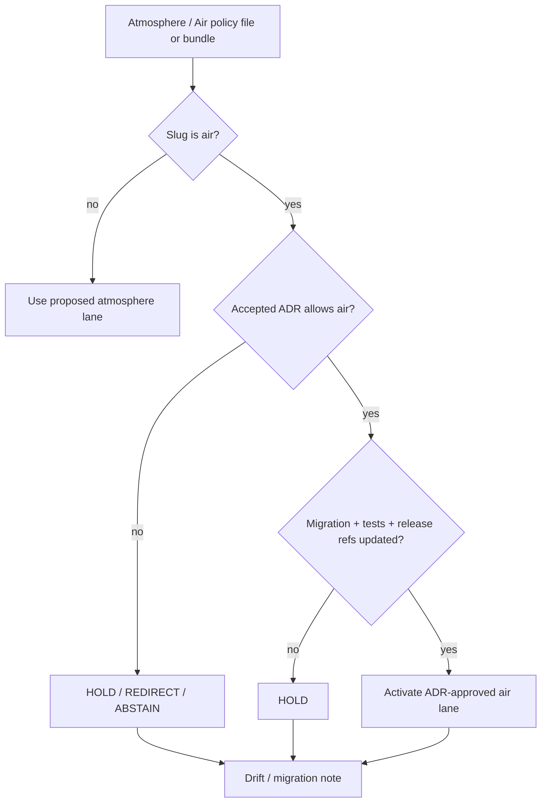

<!-- [KFM_META_BLOCK_V2]
doc_id: kfm://policy/domains/air
title: Air Domain Policy README
type: policy-readme
version: v0.1
status: draft
owners: OWNER_TBD — Atmosphere/Air steward · Policy steward · Sensitivity steward · Release steward · Docs steward
created: 2026-06-15
updated: 2026-06-15
policy_label: restricted
related:
  - ../README.md
  - ../../../docs/domains/atmosphere/README.md
  - ../../../docs/domains/atmosphere/CANONICAL_PATHS.md
  - ../../../docs/domains/atmosphere/API_CONTRACTS.md
  - ../../../docs/domains/atmosphere/MAP_UI_CONTRACTS.md
  - ../../../docs/doctrine/directory-rules.md
  - ../../../policy/domains/
  - ../../../schemas/contracts/v1/domains/atmosphere/
  - ../../../contracts/domains/atmosphere/
  - ../../../packages/policy-runtime/README.md
  - ../../../tests/domains/atmosphere/
  - ../../../fixtures/domains/atmosphere/
tags: [kfm, policy, domains, air, atmosphere, compatibility, slug-drift, admissibility, fail-closed]
notes:
  - "Initial README for policy/domains/air as a slug-conflict guardrail."
  - "Atmosphere/Air doctrine records the air vs atmosphere segment as CONFLICTED and ADR-class."
  - "This path should not become a parallel active policy authority unless an accepted ADR chooses the air segment."
  - "Runtime enforcement, accepted slug, child policy files, tests, fixtures, schemas, bundles, and CI integration remain NEEDS VERIFICATION."
[/KFM_META_BLOCK_V2] -->

<a id="top"></a>

<div align="center">

# Air Domain Policy

`policy/domains/air/`

**Slug-conflict guardrail for Atmosphere / Air policy placement. Use this lane only as a documented compatibility or drift surface until an ADR resolves `air` versus `atmosphere`.**


[Scope](#1-scope) · [Repo fit](#2-repo-fit) · [Boundary](#3-authority-boundary) · [Inputs](#5-inputs) · [Exclusions](#6-exclusions) · [Guardrail rules](#7-guardrail-rules) · [Definition of done](#14-definition-of-done)

</div>

---

> [!IMPORTANT]
> **Status:** draft / `CONFLICTED` / `NEEDS VERIFICATION`  
> **Owners:** `OWNER_TBD` — Atmosphere/Air steward · Policy steward · Sensitivity steward · Release steward · Docs steward  
> **Path:** `policy/domains/air/README.md`  
> **Responsibility root:** `policy/` — policy-as-code and policy documentation  
> **Truth posture:** CONFIRMED file path / CONFLICTED domain segment / UNKNOWN runtime enforcement

> [!CAUTION]
> This directory must not become a second active policy home beside `policy/domains/atmosphere/` unless an accepted ADR chooses `air` as the canonical domain segment. Until then, it is a guardrail README, not proof of active policy enforcement.

---

## Quick jump

- [1. Scope](#1-scope)
- [2. Repo fit](#2-repo-fit)
- [3. Authority boundary](#3-authority-boundary)
- [4. Default posture](#4-default-posture)
- [5. Inputs](#5-inputs)
- [6. Exclusions](#6-exclusions)
- [7. Guardrail rules](#7-guardrail-rules)
- [8. Diagram](#8-diagram)
- [9. Decision vocabulary](#9-decision-vocabulary)
- [10. Air / atmosphere policy obligations](#10-air--atmosphere-policy-obligations)
- [11. Slug-resolution path](#11-slug-resolution-path)
- [12. Inspection path](#12-inspection-path)
- [13. Validation expectations](#13-validation-expectations)
- [14. Definition of done](#14-definition-of-done)
- [15. Open verification items](#15-open-verification-items)

---

## 1. Scope

`policy/domains/air/` is a **guardrail lane** for the Atmosphere / Air domain slug conflict.

It exists because KFM doctrine references the domain as Atmosphere / Air, while repository placement doctrine currently favors `atmosphere` as the domain segment. This README prevents an empty `air` path from silently becoming a parallel policy authority.

In scope:

- documenting the `air` versus `atmosphere` placement conflict
- redirecting contributors toward the accepted or proposed canonical lane
- preventing duplicate policy bundles and rule sets
- naming safe interim posture for any air-quality policy references that land here
- preserving decision, evidence, rights, sensitivity, release, and rollback boundaries

Out of scope:

- defining executable Atmosphere/Air policy rules
- creating a second active policy bundle home
- resolving the ADR by documentation alone
- storing schemas, contracts, fixtures, tests, packages, pipelines, source data, lifecycle artifacts, receipts, proofs, or release manifests
- issuing emergency advisories or life-safety direction

[Back to top](#top)

---

## 2. Repo fit

| Concern | Owning root | Expected relationship |
|---|---|---|
| This guardrail path | `policy/domains/air/` | CONFLICTED compatibility surface until ADR resolution |
| Proposed canonical domain policy lane | `policy/domains/atmosphere/` | Preferred new policy segment unless ADR chooses `air` |
| Atmosphere / Air docs | `docs/domains/atmosphere/` | Human-facing domain doctrine and placement notes |
| Canonical path registry | `docs/domains/atmosphere/CANONICAL_PATHS.md` | Documents segment conflict and proposed placement protocol |
| Decision/runtime helpers | `packages/policy-runtime/` | Evaluator helper code; not policy authority |
| Decision schemas | `schemas/contracts/v1/` or accepted domain schema home | Machine shape remains separate |
| Release authority | `release/` | Publication, correction, supersession, and rollback |
| Public API boundary | `apps/governed-api/` | Public clients consume governed envelopes only |

> [!NOTE]
> The Atmosphere README records the schema/contract slug `air` versus `atmosphere` as `CONFLICTED`. The canonical-paths doc states that new Atmosphere lane paths should use `atmosphere/` until an ADR resolves the naming issue.

## 3. Authority boundary

This path may document the conflict. It must not become an active policy source, bundle registry, schema authority, contract authority, source registry, lifecycle store, public API, or release authority.

```text
policy/domains/air/          = CONFLICTED guardrail / compatibility note
policy/domains/atmosphere/   = proposed canonical Atmosphere policy lane until ADR resolves
contracts/domains/atmosphere/ = proposed Atmosphere object meaning
schemas/contracts/v1/domains/atmosphere/ = proposed Atmosphere machine shape
docs/domains/atmosphere/     = domain doctrine and placement registry
data/                        = lifecycle artifacts, receipts, proofs
release/                     = publication and rollback authority
```

## 4. Default posture

The default posture for this path is **do not activate**.

A policy or bundle reference under `policy/domains/air/` should return `HOLD`, `ABSTAIN`, or `REDIRECT` unless all of these are true:

- an accepted ADR chooses `air` as canonical or explicitly allows this compatibility lane
- the active policy bundle manifest names this path
- tests and fixtures cover the lane
- schema and contract homes are reconciled
- release gates know which slug is authoritative
- drift entries or migration notes close the alternate path

## 5. Inputs

| Input family | Examples | Required posture |
|---|---|---|
| Slug context | `air`, `atmosphere`, alias, compatibility path | Must be reconciled or marked `CONFLICTED` |
| Operation context | render, policy evaluation, source admission, release candidate, export | Must name audience and lifecycle stage |
| Evidence context | EvidenceRef, EvidenceBundle status, citation validation | Required for claim-bearing outputs |
| Source context | EPA AQS, AirNow, OpenAQ-like, smoke, AOD, weather, climate, model fields | Source role and rights must be explicit |
| Sensitivity context | low-cost sensor caveat, model-vs-observation, advisory context, sensitive cross-lane joins | Fail closed when unresolved |
| Release context | candidate, released, superseded, withdrawn, rollback requested | Explicit; never inferred from path alone |
| Migration context | ADR, drift register entry, redirect map, supersession note | Required before activation or migration |

## 6. Exclusions

| Does not belong here | Correct home |
|---|---|
| Active Atmosphere policy rules before ADR resolution | `policy/domains/atmosphere/` or ADR-accepted home |
| Atmosphere domain docs | `docs/domains/atmosphere/` |
| Atmosphere semantic contracts | `contracts/domains/atmosphere/` or ADR-accepted contract home |
| Atmosphere schemas | `schemas/contracts/v1/domains/atmosphere/` or ADR-accepted schema home |
| Tests and fixtures | `tests/domains/atmosphere/`, `fixtures/domains/atmosphere/`, or ADR-accepted homes |
| Lifecycle data, receipts, proofs, and registries | `data/` lifecycle roots |
| Release manifests and rollback cards | `release/` |
| Public API or UI implementation | `apps/` and governed UI/API packages |
| Emergency advisories or life-safety direction | Official issuing authority / Hazards lane redirection |

## 7. Guardrail rules

| Rule | Effect |
|---|---|
| No silent activation | Files under `policy/domains/air/` must not be treated as active policy without ADR support |
| No duplicate bundles | Do not maintain equivalent active bundles under both `air` and `atmosphere` |
| Redirect where safe | New contributors should be redirected to `policy/domains/atmosphere/` until ADR resolves |
| Preserve evidence | Do not erase references found under this path; migrate with receipt or review note |
| Fail closed | Unresolved slug authority should return `HOLD`, `ABSTAIN`, or `REDIRECT`, not `ALLOW` |
| Record drift | Existing `air` paths should be tracked in a drift or migration record |

## 8. Diagram



## 9. Decision vocabulary

| Decision | Meaning | Required behavior |
|---|---|---|
| `REDIRECT` | Content belongs in `policy/domains/atmosphere/` or ADR-accepted canonical home | Name target path and preserve trace |
| `HOLD` | Slug conflict, tests, bundle, migration, or release mapping is unresolved | Do not activate or publish |
| `ABSTAIN` | Policy cannot decide because slug authority or evidence is unresolved | Preserve unresolved handles where safe |
| `DENY` | Attempted public exposure or policy use violates trust membrane or sensitive/advisory rules | Return safe reason code |
| `RESTRICT` | Use is allowed only as compatibility metadata or migration note | Preserve obligations |
| `ALLOW` | Only after ADR, tests, bundle manifest, release mapping, and migration support are accepted | Scope to policy version and slug decision |
| `ERROR` | Repository, schema, runtime, or migration machinery failed | Fail closed and record failure |

## 10. Air / atmosphere policy obligations

| Obligation | Example effect |
|---|---|
| `adr_required` | Slug choice must be resolved before activation |
| `redirect_required` | Contributor or runtime should use `atmosphere` path until ADR says otherwise |
| `drift_record_required` | Existing `air` references must be logged before migration |
| `migration_note_required` | Any path move or alias must be auditable |
| `test_required` | Policy fixtures must prove the chosen slug path |
| `release_mapping_required` | Release and rollback records must use the accepted slug |
| `official_advisory_redirect_required` | Emergency/life-safety content redirects to official authority or Hazards lane |

## 11. Slug-resolution path

A safe resolution should include:

1. ADR choosing `air`, `atmosphere`, or an explicit alias strategy.
2. Inventory of all existing `air` and `atmosphere` policy, schema, contract, test, fixture, data, and release paths.
3. Migration or redirect plan.
4. Tests proving only the accepted path is active.
5. Release and rollback mapping update.
6. Drift register closeout.

## 12. Inspection path

Slug state, policy files, fixtures, tests, and release mapping remain `NEEDS VERIFICATION`.

```bash
find policy/domains -maxdepth 3 -type f | grep -E '/(air|atmosphere)/' | sort
find docs/domains schemas/contracts/v1 contracts tests fixtures packages pipelines data release -maxdepth 5 -type f 2>/dev/null | grep -E '/(air|atmosphere)/' | sort
find docs/registers docs/adr -maxdepth 3 -type f 2>/dev/null | grep -Ei 'air|atmosphere|drift|adr' | sort
```

## 13. Validation expectations

Useful validation for this lane should cover:

- `policy/domains/air/` cannot be selected as active policy unless ADR-supported;
- duplicate active bundles under `air` and `atmosphere` are rejected;
- unresolved slug authority returns `HOLD`, `ABSTAIN`, or `REDIRECT`;
- advisory or life-safety requests are not answered as KFM emergency guidance;
- public clients receive only governed envelopes;
- migration records preserve old references and rollback targets;
- tests verify the chosen slug route and reject the non-canonical route.

## 14. Definition of done

- [ ] Owners are confirmed and `OWNER_TBD` is replaced.
- [ ] ADR resolves `air` versus `atmosphere` policy placement.
- [ ] Existing paths are inventoried.
- [ ] Drift and migration records are created or linked.
- [ ] Active bundle manifest names exactly one canonical policy lane.
- [ ] Tests and fixtures cover canonical, alias, redirect, hold, abstain, and error paths.
- [ ] Release and rollback records use the accepted slug.
- [ ] Public API and UI routing reject direct compatibility-path bypass.

## 15. Open verification items

| Item | Why it matters |
|---|---|
| Confirm whether `policy/domains/atmosphere/` exists | Determines migration target and current drift |
| Confirm accepted domain slug register | Prevents parallel policy homes |
| Confirm ADR status for `air` vs `atmosphere` | Required before activation |
| Confirm active policy bundle path | Required for runtime use |
| Confirm tests and fixtures | Required before enforcement claims |
| Confirm release mapping | Required before publication claims |
| Confirm advisory redirection behavior | Prevents life-safety overclaiming |

<details>
<summary>Appendix A — no-loss preservation note</summary>

The target file was an empty placeholder. This README turns the requested `air` path into a documented guardrail instead of silently treating it as active policy authority.

It preserves the Atmosphere / Air doctrine and the slug-conflict warning already recorded in domain docs while avoiding creation of a parallel active policy home.

</details>

## Status summary

`policy/domains/air/` is a `CONFLICTED` compatibility/guardrail lane until an ADR resolves the Atmosphere / Air segment choice.

It should prevent duplicate policy authority, preserve migration trace, and fail closed while routing new Atmosphere policy work to the accepted or proposed canonical path.

<p align="right"><a href="#top">Back to top</a></p>
