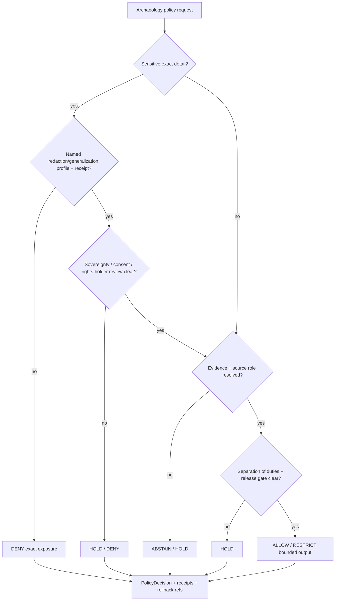

<!-- [KFM_META_BLOCK_V2]
doc_id: kfm://policy/domains/archaeology
title: Archaeology Domain Policy README
type: policy-readme
version: v0.1
status: draft
owners: OWNER_TBD — Archaeology steward · Sensitivity reviewer · Rights-holder representative · Release authority · Policy steward · Docs steward
created: 2026-06-15
updated: 2026-06-15
policy_label: restricted
related:
  - ../README.md
  - ../../../docs/domains/archaeology/PUBLICATION_AND_POLICY.md
  - ../../../docs/domains/archaeology/SENSITIVITY.md
  - ../../../docs/domains/archaeology/README.md
  - ../../../docs/domains/archaeology/OBJECT_FAMILIES.md
  - ../../../docs/domains/archaeology/PIPELINE.md
  - ../../../docs/domains/archaeology/PRESERVATION_MATRIX.md
  - ../../../docs/domains/archaeology/RELEASE_INDEX.md
  - ../../../policy/sensitivity/archaeology/
  - ../../../policy/release/archaeology/
  - ../../../policy/consent/archaeology/
  - ../../../schemas/contracts/v1/archaeology/
  - ../../../schemas/contracts/v1/receipts/
  - ../../../release/candidates/archaeology/
  - ../../../release/manifests/archaeology/
  - ../../../tests/domains/archaeology/
  - ../../../fixtures/domains/archaeology/
tags: [kfm, policy, domains, archaeology, sensitive-domain, deny-by-default, redaction, sovereignty, CARE, release, rollback]
notes:
  - "Replaces the greenfield Archaeology policy stub with a bounded domain-policy README."
  - "This directory is for Archaeology-specific executable policy materials or policy-lane documentation only; it is not a home for docs, contracts, schemas, fixtures, tests, packages, pipelines, registries, release manifests, receipts, proofs, or lifecycle data."
  - "Archaeology exact site geometry, human remains, sacred sites, collection-security detail, and looting-risk exposure default to deny-by-default."
  - "Concrete policy files, bundle syntax, fixtures, tests, CI binding, release integration, and runtime enforcement remain NEEDS VERIFICATION."
[/KFM_META_BLOCK_V2] -->

<a id="top"></a>

<div align="center">

# Archaeology Domain Policy

`policy/domains/archaeology/`

**Archaeology-specific admissibility policy lane for deny-by-default release controls, redaction, generalization, sovereignty review, consent, evidence, separation-of-duties, correction, and rollback gates.**


[Scope](#1-scope) · [Repo fit](#2-repo-fit) · [Boundary](#3-authority-boundary) · [Inputs](#5-inputs) · [Exclusions](#6-exclusions) · [Policy families](#7-policy-families) · [Definition of done](#14-definition-of-done)

</div>

---

> [!IMPORTANT]
> **Status:** draft / `NEEDS VERIFICATION`  
> **Owners:** `OWNER_TBD` — Archaeology steward · Sensitivity reviewer · Rights-holder representative · Release authority · Policy steward · Docs steward  
> **Path:** `policy/domains/archaeology/README.md`  
> **Responsibility root:** `policy/` — policy-as-code and policy documentation  
> **Truth posture:** CONFIRMED file path / PROPOSED Archaeology policy-lane contract / UNKNOWN runtime enforcement

> [!CAUTION]
> Archaeology is a sensitive-domain lane. Exact site geometry, human remains, sacred sites, collection-security detail, looting-risk exposure, oral-history restrictions, and sovereignty-bearing cultural knowledge must fail closed unless a reviewed policy path explicitly allows a bounded, redacted, generalized, audience-restricted, receipt-backed output.

---

## Quick jump

- [1. Scope](#1-scope)
- [2. Repo fit](#2-repo-fit)
- [3. Authority boundary](#3-authority-boundary)
- [4. Default posture](#4-default-posture)
- [5. Inputs](#5-inputs)
- [6. Exclusions](#6-exclusions)
- [7. Policy families](#7-policy-families)
- [8. Diagram](#8-diagram)
- [9. Decision vocabulary](#9-decision-vocabulary)
- [10. Archaeology obligations](#10-archaeology-obligations)
- [11. Child-file contract](#11-child-file-contract)
- [12. Inspection path](#12-inspection-path)
- [13. Validation expectations](#13-validation-expectations)
- [14. Definition of done](#14-definition-of-done)
- [15. Open verification items](#15-open-verification-items)

---

## 1. Scope

`policy/domains/archaeology/` is the proposed executable and bundle-side policy lane for Archaeology domain admissibility.

It should hold Archaeology policy modules, bundle manifests, rule documentation, or lane READMEs that enforce the publication, sensitivity, redaction, sovereignty, consent, and release intent described by `docs/domains/archaeology/PUBLICATION_AND_POLICY.md` and `docs/domains/archaeology/SENSITIVITY.md`.

In scope:

- deny-by-default gates for exact site geometry, human remains, sacred sites, collection-security detail, and looting-risk exposure
- redaction, generalization, differential-privacy, k-anonymity, and audience-tier policy material
- sovereignty label inheritance, CARE labels, consent, revocation, embargo, and cache-invalidation posture
- release-manifest, rollback, correction, stale-state, and supersession policy prerequisites
- separation-of-duties and reviewer-role requirements
- finite policy outcomes and safe reason codes
- `RedactionReceipt`, `ReviewRecord`, `PolicyDecision`, `ReleaseManifest`, and rollback obligations

Out of scope:

- Archaeology domain doctrine and scope documents
- Archaeology semantic contracts
- Archaeology JSON Schemas
- Archaeology package helper code
- Archaeology executable pipelines
- raw site/source data or precise protected locations
- release approval itself
- public UI or API implementation
- receipt/proof storage

[Back to top](#top)

---

## 2. Repo fit

| Concern | Owning root | Expected relationship |
|---|---|---|
| Archaeology domain policy | `policy/domains/archaeology/` | This README and future Archaeology policy files, if accepted |
| Domain policy parent | `policy/domains/` | Shared domain-policy root contract |
| Archaeology publication doctrine | `docs/domains/archaeology/PUBLICATION_AND_POLICY.md` | Human-facing governance reference; not executable policy bundle |
| Archaeology sensitivity doctrine | `docs/domains/archaeology/SENSITIVITY.md` | Human-facing sensitivity catalogue and redaction posture |
| Sensitivity subpolicy | `policy/sensitivity/archaeology/` | Proposed deny lane for sensitivity-specific policy |
| Release subpolicy | `policy/release/archaeology/` | Proposed staged-release policy lane |
| Consent subpolicy | `policy/consent/archaeology/` | Proposed sovereignty / oral-history consent lane |
| Receipts and proofs | `data/receipts/`, `data/proofs/`, or verified homes | Stored trust artifacts, not this lane |
| Release authority | `release/` | Publication, correction, supersession, and rollback authority |
| Runtime policy evaluation | `packages/policy-runtime/` | Evaluator helper code; not policy authority |

> [!NOTE]
> The prior stub claimed this folder could hold docs, contracts, schemas, fixtures, tests, packages, pipelines, registries, or data artifacts. This README narrows the lane to policy responsibility only.

## 3. Authority boundary

This lane may decide Archaeology-specific admissibility. It must not become Archaeology doctrine, schema authority, contract authority, lifecycle storage, pipeline code, release authority, public serving code, or a precise-location repository.

```text
policy/domains/archaeology/               = Archaeology admissibility policy
policy/sensitivity/archaeology/           = proposed sensitivity-specific deny lane
policy/release/archaeology/               = proposed release-specific policy lane
policy/consent/archaeology/               = proposed consent / sovereignty policy lane
docs/domains/archaeology/                 = Archaeology doctrine and policy intent
schemas/contracts/v1/archaeology/         = Archaeology machine shape, if accepted
contracts/domains/archaeology/            = Archaeology object meaning, if accepted
data/                                     = lifecycle artifacts, receipts, proofs, registry
release/                                  = publication, correction, rollback control
```

## 4. Default posture

Archaeology policy should fail closed at every gate.

A policy gate should return `DENY`, `RESTRICT`, `HOLD`, or `ABSTAIN` when any of these are unresolved:

- object family or domain slug
- precise geometry or location exposure risk
- site, collection, human-remains, sacred-site, or looting-risk sensitivity
- sovereignty, CARE, rights-holder, consent, revocation, or embargo state
- source role and provenance
- EvidenceRef / EvidenceBundle support
- redaction profile and `RedactionReceipt`
- reviewer roles and separation-of-duties support
- release state, rollback target, correction path, or stale-state handling
- public audience or export destination

## 5. Inputs

| Input family | Examples | Required posture |
|---|---|---|
| Archaeology object context | site, artifact, collection, survey, preservation-state, oral-history, 3D/remote-sensing derivative | Explicit and domain-owned or marked `NEEDS VERIFICATION` |
| Sensitivity context | audience tier, per-record sensitivity rank, exact geometry, sacred/human-remains/looting-risk flags | Default T4 / rank 5 when unresolved |
| Sovereignty / consent context | CARE label, rights-holder sign-off, consent token, revocation, embargo, sovereignty review | Required for cultural or oral-history material |
| Evidence context | EvidenceRef, EvidenceBundle status, citation validation | Required for claim-bearing output |
| Transform context | redaction profile, generalization level, H3 floor, jitter, DP/k-anonymity profile | Must be named, versioned, and receipt-backed |
| Release context | candidate, released, superseded, withdrawn, rollback requested | Explicit; never inferred from path alone |
| Review context | author, sensitivity reviewer, release authority, rights-holder representative | Required for materiality-sensitive release |
| Audit context | policy version, reason code, receipt refs, decision hash, reviewer refs | Required for consequential decisions |

## 6. Exclusions

| Does not belong here | Correct home |
|---|---|
| Archaeology domain docs | `docs/domains/archaeology/` |
| Archaeology semantic contracts | `contracts/domains/archaeology/` or accepted contract home |
| Archaeology schemas | `schemas/contracts/v1/archaeology/` or accepted schema home |
| Archaeology helper libraries | `packages/domains/archaeology/` |
| Archaeology pipelines | `pipelines/domains/archaeology/` |
| Source data, precise locations, site records, lifecycle artifacts | `data/` lifecycle roots with strict controls |
| Receipts and proofs as stored artifacts | `data/receipts/`, `data/proofs/`, or verified homes |
| Release manifests and rollback cards | `release/` |
| Public API or UI surfaces | `apps/` and governed UI/API packages |
| Secrets, private source material, culturally sensitive details | Secret manager or governed restricted stores, not repo docs |

## 7. Policy families

| Family | Policy question | Default posture |
|---|---|---|
| Sensitivity deny | Can this object leave restricted handling at the requested precision? | Deny exact sensitive exposure |
| Redaction / generalization | What transform is required before any bounded release? | Require named profile and receipt |
| Sovereignty / consent | Are CARE, consent, rights-holder, or sovereignty-review constraints satisfied? | Hold or deny when unresolved |
| Publication | Can material cross the trust membrane through governed API surfaces? | Require PolicyDecision, ReviewRecord, ReleaseManifest, RollbackCard |
| Runtime / AI | Can the system answer without leaking sensitive location or cultural detail? | Abstain, deny, or answer only at bounded scope |
| Correction / rollback | Can an incorrect or stale release be reversed? | Require rollback target and correction lineage |

## 8. Diagram



## 9. Decision vocabulary

| Decision | Meaning | Required behavior |
|---|---|---|
| `ALLOW` | Operation may proceed under supplied Archaeology context | Scope to object, audience, transform, release, and version |
| `DENY` | Policy blocks exact exposure or unsafe action | Do not reveal protected details or precise locations |
| `RESTRICT` | Operation may proceed only with redaction, generalization, audience restriction, embargo, or review constraints | Preserve obligations downstream |
| `HOLD` | Steward review, rights-holder sign-off, receipt, proof, consent, or release gate is pending | Do not promote or render publicly |
| `ABSTAIN` | Evidence, source, rights, consent, sensitivity, or policy support is unresolved | Preserve unresolved handles where safe |
| `ERROR` | Policy machinery, schema, runtime, or repository support failed | Fail closed and record failure |

## 10. Archaeology obligations

| Obligation | Example effect |
|---|---|
| `redaction_required` | Withhold exact site, collection-security, human-remains, sacred-site, or looting-risk detail |
| `generalization_required` | Reduce spatial precision using an accepted profile |
| `redaction_receipt_required` | Record transform profile, version, reason, and hash without leaking protected detail |
| `sovereignty_review_required` | Route sovereignty-bearing or cultural-knowledge material for review |
| `rights_holder_review_required` | Require rights-holder representative sign-off where applicable |
| `consent_required` | Require consent / revocation / embargo check before materialization |
| `restricted_audience_required` | Limit to steward, reviewer, rights-holder, or authenticated surface |
| `rollback_required` | Require rollback target before public-impacting release |
| `official_source_citation_required` | Preserve citation and evidence support where safe |

## 11. Child-file contract

Future files under this lane should state:

- policy family and Archaeology object families covered
- sensitivity ranks and audience tiers used
- source role, evidence, consent, rights, and sovereignty prerequisites
- finite outcomes and safe reason codes
- redaction/generalization profile names and versions
- required receipts and review records
- fixtures and tests
- release, correction, stale-state, and rollback behavior
- links to `PUBLICATION_AND_POLICY.md`, `SENSITIVITY.md`, and `PRESERVATION_MATRIX.md`

## 12. Inspection path

Concrete Archaeology policy files, bundles, fixtures, tests, validators, and CI remain `NEEDS VERIFICATION`.

```bash
find policy/domains/archaeology -maxdepth 4 -type f | sort
find docs/domains/archaeology schemas/contracts/v1 contracts release -maxdepth 5 -type f 2>/dev/null | grep -Ei 'archaeology|redaction|sensitivity|release|rollback|receipt' | sort
find tests/domains/archaeology fixtures/domains/archaeology -maxdepth 5 -type f 2>/dev/null | sort
```

## 13. Validation expectations

Useful validation for this lane should cover:

- exact sensitive site geometry returns `DENY`
- human remains, sacred sites, collection-security detail, and looting-risk exposure return `DENY` unless a restricted reviewed path applies
- missing redaction profile or `RedactionReceipt` returns `HOLD`
- missing sovereignty / consent / rights-holder review returns `HOLD` or `DENY`
- unresolved evidence returns `ABSTAIN` or `HOLD`
- AI and public surfaces cannot substitute generated summaries, tiles, screenshots, or derived layers for denied or abstained claims
- public renders use governed APIs and released/public-safe artifacts only
- release decisions include rollback and correction support

## 14. Definition of done

- [ ] Owners are confirmed and `OWNER_TBD` is replaced.
- [ ] Archaeology policy files and bundle structure are inventoried.
- [ ] Runtime policy language and bundle location are confirmed.
- [ ] Fixtures cover allow, deny, restrict, hold, abstain, and error outcomes.
- [ ] Redaction, sovereignty, consent, rights-holder, release, and rollback obligations are tested.
- [ ] Receipt contracts and schema paths are linked.
- [ ] Public API bypass checks are covered by tests or policy fixtures.
- [ ] Separation-of-duties requirements are enforced or linked.
- [ ] Correction and rollback workflows are linked to release records.

## 15. Open verification items

| Item | Why it matters |
|---|---|
| Confirm actual child files under `policy/domains/archaeology/` | Prevents stale stub claims |
| Confirm Rego/OPA or equivalent policy language | Prevents non-runnable guidance |
| Confirm redaction profile home | Required for deterministic public-safe transforms |
| Confirm receipt schemas and storage homes | Required for auditable redaction and release |
| Confirm tests and fixtures | Required before enforcement claims |
| Confirm sovereignty / consent policy integration | Required for cultural and oral-history material |
| Confirm release-gate integration | Required before publication claims |
| Confirm rollback drill coverage | Required for reversible public release |

<details>
<summary>Appendix A — no-loss preservation note</summary>

The previous file was a greenfield scaffold that over-broadened this directory by saying docs, contracts, schemas, fixtures, tests, packages, pipelines, registries, and data lifecycle artifacts could belong here. This README narrows the lane to Archaeology policy only and routes other materials back to their owning roots.

It preserves the Archaeology doctrine already documented in `PUBLICATION_AND_POLICY.md` and `SENSITIVITY.md` while keeping executable policy, tests, fixtures, runtime enforcement, release integration, and CI status marked `NEEDS VERIFICATION`.

</details>

## Status summary

`policy/domains/archaeology/` should define Archaeology-specific admissibility policy only when it remains subordinate to Archaeology doctrine, contracts, schemas, lifecycle, evidence, sensitivity, sovereignty, release, correction, and rollback boundaries.

It should keep Archaeology policy deny-by-default, reason-coded, obligation-preserving, receipt-backed, fixture-tested, and routed through governed interfaces without becoming domain doctrine, schema authority, lifecycle storage, package code, pipeline code, or release authority.

<p align="right"><a href="#top">Back to top</a></p>
