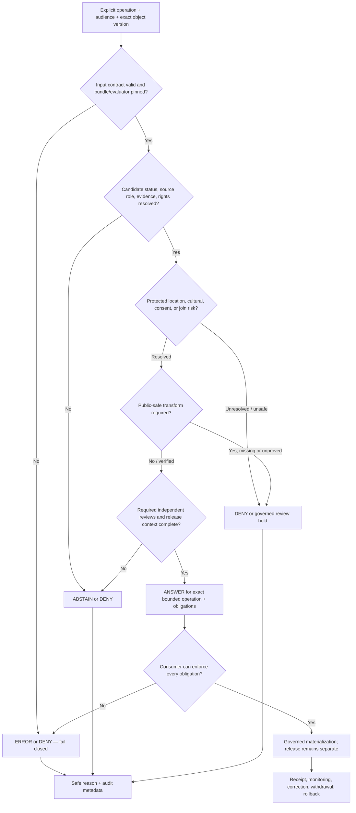

<!-- [KFM_META_BLOCK_V2]
doc_id: kfm://policy/domains/archaeology
title: Archaeology Domain Policy README
type: readme
classification: directory-readme; domain-policy-boundary; sensitive-domain; policy-index
version: v0.2
status: draft; repository-grounded; mixed-maturity; direct-policy-scaffolds; evaluator-unbound; fail-closed; non-release; non-publication
owners: "@bartytime4life — verified CODEOWNERS review route; Archaeology, cultural/sovereignty, rights, consent, sensitivity, evidence, policy, contract/schema, validator/test, runtime, release, security, correction/rollback, and docs stewardship assignments NEEDS VERIFICATION"
created: 2026-06-15
updated: 2026-08-13
supersedes_version: v0.1 Archaeology domain policy guide
policy_label: restricted-review; policy; archaeology; cultural-heritage; sensitive-location; candidate-not-site; finite-outcomes; no-public-authority
current_path: policy/domains/archaeology/README.md
owning_root: policy/
responsibility: "Archaeology-specific policy boundary and repository index for current rule maturity, explicit inputs, finite decisions, obligations, composition, review, public-surface constraints, validation, activation, correction, and rollback without creating archaeological truth, cultural authority, runtime enforcement, release, or publication."
truth_posture: "CONFIRMED canonical policy-root placement, CODEOWNERS routing, complete thirteen-source direct Rego inventory, allow-default-false and deny-default-false scaffolds across direct and adjacent lanes, forty mixed-maturity domain schemas, placeholder direct domain tests, three substantive inactive synthetic validator profiles, one workflow-executed ThreeDDocumentation fixture slice, explicit proof/release holds, empty policy-gate register, and no candidate dossier / PROPOSED bounded Archaeology policy architecture, inputs, normalization, obligations, public-surface contract, validation matrix, and reversible implementation sequence / CONFLICTED result polarity, package namespaces, local and outward vocabularies, compatibility homes, and draft doctrine versus executable policy / UNKNOWN accepted bundle, evaluator, decision emitter, obligation handlers, production consumers, deployment enforcement, and public behavior / NEEDS VERIFICATION functional owners, policy values, cultural and consent authority, transform profiles, evaluator compatibility, negative tests, correction propagation, withdrawal, and rollback drills."
related:
  - ../README.md
  - ../../README.md
  - ../../../docs/domains/archaeology/README.md
  - ../../../docs/domains/archaeology/PUBLICATION_AND_POLICY.md
  - ../../../docs/domains/archaeology/SENSITIVITY.md
  - ../../../docs/domains/archaeology/CULTURAL_REVIEW.md
  - ../../../docs/domains/archaeology/OBJECT_FAMILIES.md
  - ../../../docs/domains/archaeology/PIPELINE.md
  - ../../../docs/domains/archaeology/PRESERVATION_MATRIX.md
  - ../../../contracts/domains/archaeology/README.md
  - ../../../schemas/contracts/v1/domains/archaeology/README.md
  - ../../../fixtures/domains/archaeology/README.md
  - ../../../tests/domains/archaeology/README.md
  - ../../../tools/validators/archaeology/README.md
  - ../../../tools/validators/domains/archaeology/README.md
  - ../../../data/proofs/archaeology/README.md
  - ../../../release/candidates/archaeology/README.md
  - ../../../release/rollback/archaeology/README.md
  - ../../sensitivity/archaeology/sovereignty_chip_required.rego
  - ../../sensitivity/archaeology_precise_coords_redaction.rego
  - ../../bundles/README.md
  - ../../decision/vocabulary.v1.json
  - ../../../contracts/policy/policy_input_bundle_profile_v1.md
  - ../../../contracts/policy/policy_decision_vocabulary.md
  - ../../../packages/policy-runtime/README.md
  - ../../../docs/adr/ADR-0010-deny-by-default-for-dna-rare-species-archaeology-infrastructure.md
  - ../../../docs/adr/ADR-0029-adopt-directory-governance-standard-v2.md
  - ../../../docs/doctrine/directory-rules.md
  - ../../../.github/CODEOWNERS
  - ../../../.github/workflows/domain-archaeology.yml
tags:
  - kfm
  - policy
  - archaeology
  - cultural-heritage
  - sensitive-domain
  - fail-closed
  - candidate-not-site
  - source-role
  - evidence
  - exact-location-deny
  - reverse-inference
  - sovereignty
  - cultural-review
  - consent
  - rights
  - redaction
  - generalization
  - finite-outcomes
  - obligations
  - no-network
  - release-gated
  - correction
  - rollback
notes:
  - "This revision changes only policy/domains/archaeology/README.md plus the required AI-generated provenance receipt."
  - "No Rego rule, policy value, bundle, evaluator, contract, schema, fixture, validator, test, workflow, review record, receipt instance, release artifact, data object, deployment, or public behavior is created or changed."
  - "File presence is not policy activation; a green fixture-profile check or readiness hold is not Archaeology enforcement."
  - "CODEOWNERS routes review but does not assign cultural, sovereignty, rights-holder, policy, or release authority."
  - "The most restrictive applicable source, rights, consent, cultural, sensitivity, audience, join, lifecycle, and release posture must win in any future accepted implementation."
[/KFM_META_BLOCK_V2] -->

<a id="top"></a>

# Archaeology Domain Policy

> **One-line purpose.** Govern Archaeology-specific access, sensitivity, consent, cultural-review, render, promotion, and release-adjacent decisions while keeping candidate status, evidence, source role, protected location, sovereignty, rights, review, receipts, release authority, and public serving explicitly separate.

<p>
  
  
  
  
  
  
  
  
</p>

> [!IMPORTANT]
> **This lane becomes policy authority only when an exact rule set, input contract, bundle identity, evaluator, decision normalization, obligation handlers, tests, and review state are accepted together.** Today it contains a repository-grounded policy boundary and proposed Rego scaffolds. It does not establish production enforcement.

> [!CAUTION]
> **The current Rego surfaces cannot be safely composed by filename.** Ten modules expose only `default allow := false`; three expose `default deny := false` and have no active deny rules. The former are deny-by-default-shaped only if a caller queries `allow`; the latter deny nothing if a caller treats an empty `deny` result as permission. No accepted caller contract selects or normalizes either shape.

> [!WARNING]
> **No public repository artifact should contain exact or reverse-engineerable protected Archaeology location or cultural-review substance.** This README documents controls at a public-safe level; it does not contain site coordinates, burial or human-remains detail, sacred-place detail, collection-security detail, consent secrets, restricted oral history, or looting-risk specifics.

**Quick links:** [Purpose](#purpose) · [Authority](#authority-level) · [Status](#status-and-repository-evidence) · [Belongs](#what-belongs-here) · [Does not](#what-does-not-belong-here) · [Default](#default-posture) · [Families](#policy-family-map) · [Inputs](#minimum-policy-input-contract) · [Decisions](#decision-vocabulary-and-normalization) · [Obligations](#obligation-families) · [Inventory](#confirmed-policy-inventory) · [Invariants](#archaeology-policy-invariants) · [Flow](#archaeology-policy-flow) · [Composition](#cross-lane-composition) · [Public surfaces](#public-surface-contract) · [Validation](#validation-tests-and-ci) · [Review](#review-burden-and-separation-of-duties) · [Related](#related-folders) · [Conflicts](#adrs-and-conflict-register) · [Sequence](#smallest-sound-implementation-sequence) · [Done](#definition-of-done) · [Open](#open-verification-register) · [Rollback](#maintenance-correction-and-rollback)

---

## Purpose

`policy/domains/archaeology/` is the Archaeology and Cultural Heritage segment under KFM's canonical singular `policy/` responsibility root.

Its durable question is:

> Given a fully declared Archaeology operation and governed context, what bounded action is permitted, refused, held, or left unanswered—and which obligations must every downstream system preserve without exposing protected information or manufacturing authority?

A complete implementation should decide only after it knows:

1. the exact operation, object version, and audience;
2. whether the subject is a candidate, observation, interpretation, confirmed assertion, derivative, collection record, or release artifact;
3. source identity, source role, rights, license, and limitations;
4. evidence references, admissibility, freshness, uncertainty, and claim support;
5. spatial and temporal precision, reverse-inference risk, and join context;
6. sensitivity, cultural, sovereignty, consent, revocation, embargo, and rights-holder posture;
7. lifecycle, validation, review, transform, release, correction, withdrawal, and rollback state;
8. the exact policy source, bundle digest, evaluator profile, and normalization contract in use; and
9. whether the consumer can enforce every resulting obligation before materialization.

### In scope

- exact and reverse-engineerable location exposure decisions;
- candidate-versus-confirmed-site separation;
- burial, human-remains, sacred/culturally restricted, collection-security, looting-risk, and protected-oral-history controls;
- source-role, rights, evidence, uncertainty, consent, embargo, revocation, and cultural-review prerequisites;
- public render, search, export, graph, API, map, tile, screenshot, embedding, and governed-AI answer gates;
- redaction, generalization, aggregation, suppression, audience restriction, withholding, and delayed-release obligations;
- lifecycle promotion and release-adjacent prerequisites;
- finite outcomes, public-safe reason codes, and downstream obligations;
- policy replay, correction, withdrawal, supersession, and rollback requirements; and
- deterministic, synthetic, no-network policy tests after contracts are accepted.

### Out of scope

- defining Archaeology object meaning or confirming a site;
- defining JSON Schema shapes;
- collecting, transforming, or storing source and lifecycle data;
- determining cultural or sovereignty authority from repository metadata;
- creating evidence, review, consent, release, or publication records;
- choosing public-safe transform thresholds without accepted authority;
- serving maps, APIs, exports, search, graphs, or AI responses;
- archaeological, legal, cultural-resource, land-use, enforcement, fieldwork, or preservation advice; and
- storing exact protected locations or sensitive review substance.

[Back to top](#top)

---

## Authority level

**Canonical policy responsibility after acceptance / non-authoritative for every adjacent concern.**

Accepted Directory Rules place policy rules and bundles under `policy/`. That placement assigns responsibility; it does not activate a file or prove that a rule is correct, accepted, tested, selected, or enforced.

| Concern | Authority home | This lane's role |
|---|---|---|
| Archaeology policy source | Accepted sources under `policy/` | May own reviewed domain-specific decision logic after acceptance. |
| Archaeology doctrine and policy intent | [`docs/domains/archaeology/`](../../../docs/domains/archaeology/README.md) | Implements cited intent; does not silently convert draft prose into runtime policy. |
| Object meaning | [`contracts/domains/archaeology/`](../../../contracts/domains/archaeology/README.md) | Consumes semantic meaning; does not redefine it. |
| Machine shape | [`schemas/contracts/v1/domains/archaeology/`](../../../schemas/contracts/v1/domains/archaeology/README.md) | Consumes accepted schemas; policy is not shape authority. |
| Source identity and source role | Governed source registry and SourceDescriptor records | Evaluates supplied facts; does not discover or invent authority. |
| Evidence and uncertainty | EvidenceRef/EvidenceBundle and proof lanes | Requires support; cannot create evidence closure. |
| Cultural, sovereignty, consent, and rights-holder facts | Governed review and consent records | Evaluates explicit state; cannot appoint reviewers or infer community authority. |
| Validation | `tools/validators/` and `tests/` | Is checked there; a passing validator does not authorize policy or release. |
| Policy packaging | [`policy/bundles/`](../../bundles/README.md) | Future accepted bundle may bind exact rules and dependencies; none is established for this lane. |
| Policy execution | Accepted evaluator/runtime | Executes the exact accepted bundle; current general runtime remains unbound. |
| Receipt and proof instances | `data/receipts/` and `data/proofs/` | May require references; does not store instances here. |
| Release, correction, withdrawal, rollback | `release/` | Receives policy state; remains the decision authority for publication lifecycle. |
| Public API, UI, map, export, search, graph, AI | Governed applications and released artifacts | Must preserve policy outcomes and obligations; cannot choose policy ad hoc. |
| CI | `.github/workflows/` | Orchestrates checks; green shape checks and explicit holds are not enforcement. |
| GitHub review routing | [`.github/CODEOWNERS`](../../../.github/CODEOWNERS) | Routes review to `@bartytime4life`; does not assign functional or cultural authority. |

### Governing order

When policy sources appear to disagree, stop promotion and resolve the conflict in this order:

1. KFM core invariants and accepted operating law.
2. Accepted ADRs that explicitly change responsibility or policy.
3. Accepted domain, sensitivity, cultural, consent, and rights authority.
4. Accepted semantic contracts and machine profiles.
5. Accepted policy bundle and evaluator binding.
6. Documentation, proposals, scaffolds, fixtures, and planning material.

The most restrictive applicable source, rights, consent, cultural, sensitivity, audience, join, lifecycle, and release posture wins until an authorized decision says otherwise.

[Back to top](#top)

---

## Status and repository evidence

### Current evidence verdict

| Surface | Status | Safe conclusion |
|---|---:|---|
| Direct lane | **CONFIRMED** | One README, 13 Rego sources, 3 documented child lanes, and one source placeholder are present. |
| Direct Rego sources | **CONFIRMED PROPOSED SCAFFOLDS** | Ten expose only `default allow := false`; three expose `default deny := false` with commented candidate rules. |
| Archaeology-native Rego tests | **NOT ESTABLISHED** | No direct native test file or Archaeology policy fixture evaluator was found. |
| Archaeology policy bundle | **NOT ESTABLISHED** | No accepted manifest, lock, selector, digest, activation record, or packaged Archaeology bundle was found. |
| General policy runtime | **UNBOUND / PLACEHOLDER** | The package boundary exists, but no accepted general evaluator or Archaeology consumer binding is established. |
| Shared policy profiles | **PROPOSED_INACTIVE / FIXTURE-ONLY** | Explicit input and vocabulary profiles provide useful candidate shapes but do not authorize this lane. |
| Domain doctrine | **DRAFT / SUBSTANTIVE** | Rich documentation exists; draft prose is not executable policy acceptance. |
| Domain contracts | **DRAFT / BROAD INVENTORY** | Numerous semantic contracts exist, including duplicate or compatibility surfaces that require reconciliation. |
| Domain schemas | **MIXED** | 40 schemas exist: 3 closed substantive `PROPOSED_INACTIVE` fixture profiles, 22 empty permissive scaffolds, and 15 three-field permissive scaffolds. |
| Reusable domain fixtures | **MIXED / SYNTHETIC** | Nine non-README/non-placeholder payloads exist; their names and presence do not prove policy polarity or consumer binding. |
| Direct domain tests | **PLACEHOLDER-ONLY** | 13 one-line placeholder docstrings and one `assert True` smoke test exist. |
| Broad validator lane | **README-ONLY** | `tools/validators/archaeology/` has no executable broad orchestrator. |
| Child validators | **MIXED** | Three substantial fixture-profile validators/tests exist; four named validators are four-line placeholders. |
| Domain workflow | **ONE SUBSTANTIVE FIXTURE SLICE + TWO HOLDS** | CI executes the synthetic ThreeDDocumentation profile; proof construction and release dry-run remain explicit holds. |
| Policy-gate register | **EMPTY / PROPOSED** | No registered Archaeology policy gate is established. |
| Release candidate lane | **NO CHILD DOSSIER ESTABLISHED** | The current README explicitly records no candidate, manifest, release, or publication authority. |
| Production enforcement | **UNKNOWN / NOT ESTABLISHED** | No normalized decision emitter, obligation handler, required-check binding, deployed selector, or public consumer was verified. |

### Truth labels

| Label | Meaning in this README |
|---|---|
| `CONFIRMED` | Verified from current repository bytes, immutable Git identity, or authenticated GitHub metadata. |
| `PROPOSED` | Candidate architecture, rule, code, profile, or process awaiting acceptance. |
| `PROPOSED_INACTIVE` | Concrete profile with governance flags that explicitly withhold activation authority. |
| `UNKNOWN` | Not resolved by the bounded inspection. |
| `NEEDS VERIFICATION` | Checkable, but not verified strongly enough to act as fact. |
| `CONFLICTED` | Current sources expose incompatible meanings or locations and no accepted decision selects one. |
| `NOT ESTABLISHED` | The inspected repository does not provide sufficient positive evidence for the claim. |

### Pinned authoring snapshot

| Evidence | Immutable identity |
|---|---|
| Repository / base | `bartytime4life/Kansas-Frontier-Matrix` · `main@f61d9df6409917610fa45d739fab55cab86f5eb2` |
| Base tree | `abff80bd000194c69a95d461fa28a4137925d9d2` |
| Prior target blob | `8d03cdb11361739e7ad33214f76a0cfe4836ff9b` |
| Prior lane tree | `4ad7b14edb03827d6e26b75501b91ad4af1bbf43` |
| Policy root / domain parent | `6c5021f9d92778581a4e9331a9dd6ddb7efc5e35` · `ed9be975c9da2c7d77d94fab621db39f23953813` |
| Directory Rules / ADR-0029 | `fd49a0b83e55cef52c1124281f093e263526898d` · `b01322ef64f8c2b1ecb41de7ef4685b97cfa2a62` |
| Draft sensitive-domain ADR-0010 | `f9145957bf124e3865f5142a02d414f0f685e6a6` |
| CODEOWNERS / domain workflow | `dd2a84aa514d8ecd9208bc347f90f9a2ed37dd61` · `d51ba3b1244844a83d857a34305e1a167e20dadb` |
| Domain / publication / sensitivity / cultural docs | `e44040a1a2b4fd4ce027e336a9c2fe81b8f29795` · `835bd3afb1b6a41de8f598d16b794873df0b6f75` · `ca7888f2d43f022faeef5e1a6e16ab00526cf7aa` · `2097297fc05b371964e61c3c06481652d33b85b9` |
| Contracts / schemas / fixtures / tests indexes | `d857c0eba2f97c3cab28c5dd76721b7b79942fb1` · `1d2708f4cd74c458258cef457085f058a400681a` · `ab30b7fa620995ed121449ad90a8512f9d1bd0fc` · `229113afacc6acc0839e92318082ccce9e2ceab3` |
| Broad / child validator indexes | `bae2eabb5d29bf7099ed74a66a17c0071ae98557` · `8bcf32cdfad56dd8703a27849682c8b9067f0c5c` |
| Candidate lane / bundle boundary / runtime boundary | `bc5edc7a44ea77a6b8ed25b95569646d8df72754` · `0a13a9c9beddfa764d47e5dd6a2ea7ef91bf0d53` · `5a20cfac50a93f497765421b7566559ae49a39b8` |
| Shared inactive decision vocabulary | `ae68a9f3cf80308f18bd04207ef2c85057750f12` |

The inventory used complete recursive Git-tree inspection, exact file reads, bounded repository search, target history, local worktree verification, and authenticated GitHub overlap search. No open pull request overlapping this target was found at preflight.

### What changed since v0.1

The v0.1 README said concrete policy files, schemas, fixtures, tests, validators, CI binding, and release integration all remained to be verified. The current tree now proves those surfaces exist in mixed forms. This revision replaces the binary “missing or present” framing with maturity-specific evidence:

- policy sources exist, but are scaffolds with incompatible result surfaces;
- schemas exist, but most are permissive scaffolds and three are bounded inactive fixture profiles;
- test filenames exist, but direct policy behavior is not tested;
- validators exist, but substantive coverage is limited to three specialized synthetic profiles;
- CI executes one bounded 3D paradata profile while explicitly holding proof and release work; and
- release documentation exists, but no candidate dossier or publication authority is established.

[Back to top](#top)

---

## What belongs here

Appropriate future content includes:

- accepted Archaeology Rego or equivalent policy source;
- domain-local policy data documents when immutable, reviewed, non-sensitive, and bundle-bound;
- rule-family documentation that is inseparable from the source;
- package and entrypoint notes for accepted rule modules;
- public-safe reason and obligation mappings;
- compatibility and deprecation notes for policy source;
- links to accepted input, decision, review, receipt, test, bundle, evaluator, release, correction, and rollback contracts; and
- README indexes that report current maturity without granting authority.

A placement test:

> If the file decides Archaeology admissibility from explicit governed inputs and can be packaged as reviewed policy source, it may belong here. If it defines meaning, shape, data, evidence, process, execution, review, release, or serving, it belongs in another responsibility root.

[Back to top](#top)

---

## What does not belong here

| Do not place here | Correct responsibility home |
|---|---|
| Archaeology doctrine, research guidance, or runbooks | `docs/domains/archaeology/` and `docs/runbooks/` |
| Object meaning | `contracts/domains/archaeology/` |
| JSON Schema | `schemas/contracts/v1/domains/archaeology/` or an accepted shared schema home |
| SourceDescriptor or authority records | Governed `data/registry/` lanes |
| RAW, WORK, QUARANTINE, PROCESSED, CATALOG, TRIPLET, or PUBLISHED data | `data/<phase>/` |
| Exact protected locations or cultural-review substance | Restricted governed stores, never a public policy README |
| Fixtures | `fixtures/` |
| Tests | `tests/` |
| Validators and evaluator code | `tools/validators/` and accepted runtime/package roots |
| EvidenceBundles and proof instances | `data/proofs/` |
| PolicyDecision, review, consent, transform, or runtime receipt instances | `data/receipts/` or accepted governed record homes |
| Candidate dossiers, manifests, correction notices, withdrawal notices, rollback cards | `release/` |
| Public API, map, UI, export, search, graph, or AI code | Governed application and package roots |
| Credentials, private endpoints, access tokens, consent secrets, or restricted source payloads | Approved secret or restricted-data systems |

[Back to top](#top)

---

## Default posture

The repository projects Archaeology as sensitivity baseline `T4`, and several draft doctrine sources call for deny-by-default treatment of exact or identifying release. That posture is a safety baseline and implementation target; it is **not** proof that current Rego enforces it.

A future accepted gate must fail closed when any material input is missing, stale, contradictory, unauthenticated, unresolvable, or unsupported, including:

- operation, audience, object version, or lifecycle state;
- candidate-versus-confirmed status;
- source identity, source role, rights, or limitations;
- evidence, citation, uncertainty, or freshness;
- exact-location, reverse-inference, collection-security, or cross-domain join risk;
- burial, human-remains, sacred/cultural, oral-history, sovereignty, consent, revocation, or embargo state;
- approved transform profile and transform receipt;
- required cultural, rights-holder, sensitivity, security, policy, or release review;
- bundle identity, digest, dependency closure, evaluator compatibility, or normalization;
- obligation-handler readiness;
- correction, withdrawal, supersession, cache invalidation, or rollback support.

### Fail-closed does not mean “always deny”

Fail-closed means an unresolved state cannot become a permissive public action. Depending on the accepted gate, the safe result may be:

- `DENY` for unsafe, prohibited, or unsupported exposure;
- `ABSTAIN` when evidence or authority is unresolved and a non-answer is safe;
- `ERROR` when the policy machinery or explicit input is invalid; or
- no materialization while a separate governed review process remains pending.

An eventual `ANSWER` is valid only for a bounded operation whose obligations are fully enforceable. It is not a universal allow and never substitutes for release approval.

[Back to top](#top)

---

## Policy family map

| Family | Core question | Unsafe or unresolved posture |
|---|---|---|
| `access` | May this actor or system access this exact object representation? | Deny or abstain; never broaden audience implicitly. |
| `sensitivity` | Is the requested precision and content safe for the declared audience and joins? | Deny exact/reconstructable exposure; require reviewed transform. |
| `consent` | Do consent, revocation, embargo, rights-holder, cultural, and sovereignty constraints permit this use? | Deny or hold outside policy until governed review resolves. |
| `render` | May a map, tile, view, screenshot, graph, search result, or export materialize this representation? | Deny, generalize, redact, suppress, or withhold export. |
| `capability` | May an AI/tooling capability answer, infer, locate, summarize, or combine this material? | Abstain or deny when an answer could leak or triangulate protected detail. |
| `promotion` | Are policy prerequisites satisfied for a named lifecycle transition? | Preserve current state; no promotion from a file move or green check. |
| `release-adjacent` | Has policy supplied one necessary input to release review? | Hold release; policy cannot approve publication. |
| `correction` | Must prior exposure be corrected, withdrawn, superseded, or re-evaluated? | Prevent stale reuse and route governed correction/rollback. |

The shared `PolicyDecision` family vocabulary currently names `access`, `capability`, `consent`, `promotion`, `render`, and `sensitivity`. “Release-adjacent” and “correction” above describe contexts, not newly accepted enum values.

[Back to top](#top)

---

## Minimum policy input contract

The current direct Rego sources declare no accepted input schema. The shared explicit input profile is `PROPOSED_INACTIVE` and fixture-only. The following packet is therefore a **proposed minimum** for Archaeology policy design, not a current runtime claim.

| Input family | Minimum declared context | Failure posture |
|---|---|---|
| Evaluation identity | input ID, canonical hash, profile/version, evaluation time | `ERROR` when absent or malformed |
| Operation | exact action: view, render, answer, export, join, promote, release-check, correct, withdraw | `ERROR` or `DENY`; never infer intent |
| Audience and surface | public, authenticated, steward, restricted reviewer, export, AI, map, search, graph | `DENY` when public/surface context is unknown |
| Object | stable ref, exact version/hash, object family, domain, lifecycle state | `ABSTAIN` or `ERROR` |
| Knowledge character | candidate, observed, measured, reality-based representation, interpretation, derived assertion | `ABSTAIN`; never collapse candidate or interpretation into confirmed fact |
| Source | SourceDescriptor refs, source roles, authority limits, dates, caveats | `ABSTAIN` or `DENY` |
| Rights | license, attribution, reuse/export constraints, embargo, uncertainty | `DENY` when requested use is unsupported |
| Evidence | EvidenceRefs, bundle refs, admissibility, freshness, uncertainty, citation state | `ABSTAIN` or `DENY` |
| Geometry and inference | precision, generalization, tile/search context, join set, reverse-inference risk | `DENY` for unsafe public precision |
| Sensitivity | rank/tier, protected classes, collection security, looting risk, public-safe state | `DENY` when unresolved |
| Cultural and sovereignty | review refs, authority basis, CARE/sovereignty labels, protected knowledge posture | `DENY` or governed review hold |
| Consent | consent scope, audience/use, effective dates, revocation, embargo | `DENY` when absent, expired, revoked, or mismatched |
| Transform | named profile, version, input/output hashes, receipt ref, reconstruction analysis | `DENY` until reviewed transform is complete |
| Review | required roles, reviewer identity refs, independence, object version, outcome | no permissive result until requirements close |
| Release | candidate, manifest, correction, withdrawal, supersession, rollback refs | preserve prior state when incomplete |
| Evaluator | bundle ID/digest, dependency lock, evaluator/version/hash, timeout profile | `ERROR` or `DENY` |
| Prior state | prior decision, receipt, correction, revocation, cache/published carrier refs | re-evaluate; do not silently reuse stale decisions |

### Input minimization

Policy inputs should carry references, categories, hashes, and public-safe state—not raw protected payloads. Logs and receipts must not echo exact coordinates, protected names, consent secrets, restricted narratives, collection locations, or review substance.

[Back to top](#top)

---

## Decision vocabulary and normalization

### Canonical outward outcomes

The current shared `PolicyDecision` contract uses four outward outcomes:

| Outcome | Meaning | Caller behavior |
|---|---|---|
| `ANSWER` | The exact operation may proceed only within declared scope and after every obligation is enforced. | Materialize the bounded result; preserve decision, citations, notices, and obligations. |
| `ABSTAIN` | Evidence, authority, freshness, or support is insufficient for a safe answer. | Return a safe non-answer; do not infer or substitute generated content. |
| `DENY` | The requested action is prohibited or unsafe under the evaluated context. | Do not reveal protected detail; emit only public-safe reasons. |
| `ERROR` | Input, bundle, evaluator, schema, or consumer enforcement failed. | Fail closed; record a safe operational error. |

### Local workflow terms

Draft Archaeology documents and the v0.1 README also use `ALLOW`, `RESTRICT`, and `HOLD`. These are not interchangeable with the outward outcomes without an accepted normalization contract.

| Local term | Candidate outward treatment | Acceptance requirement |
|---|---|---|
| `ALLOW` | `ANSWER` with explicit scope | Must bind operation, audience, object version, reasons, obligations, and expiry/replay context. |
| `RESTRICT` | Usually `ANSWER` only after enforceable obligations; otherwise `DENY` or `ABSTAIN` | Consumer must prove redaction/generalization/audience/export obligations before materialization. |
| `HOLD` | Usually no materialization; may normalize to `ABSTAIN` or a separate workflow state | Gate-specific contract must distinguish pending review from insufficient evidence and prohibition. |
| `ABSTAIN` | `ABSTAIN` | Evidence/authority reason must be safe and explicit. |
| `DENY` | `DENY` | Denial reason must be stable and non-sensitive. |
| `ERROR` | `ERROR` | Failure source and retry posture must be bounded. |

> [!NOTE]
> This table does not select a normalization. It prevents callers from treating a local `RESTRICT` or `HOLD` string as permission. The accepted bundle and evaluator binding must define the mapping and test every branch.

### Current direct-rule incompatibility

The 13 Rego modules expose either `allow` or `deny`, not a canonical `PolicyDecision` object. They do not emit stable reason codes, obligations, input identity, bundle identity, evaluator identity, review references, or replay metadata. Any adapter that interprets these modules today would be an unreviewed source of policy semantics.

[Back to top](#top)

---

## Obligation families

The shared inactive vocabulary contains reusable candidate codes such as `REDACT_EXACT_LOCATION`, `GENERALIZE_GEOMETRY`, `WITHHOLD_EXPORT`, `REQUIRE_STEWARD_REVIEW`, `DELAY_PUBLICATION`, `ATTACH_CITATIONS`, `ATTACH_RIGHTS_NOTICE`, and `VERIFY_ROLLBACK_TARGET`. Archaeology also needs domain-specific acceptance review before any additional code is standardized.

| Obligation family | Required effect | Enforcement evidence |
|---|---|---|
| Exact-location redaction | Remove coordinates and identifying attributes from the exposed representation. | Reviewed transform profile, input/output binding, receipt, and reconstruction test. |
| Geometry generalization | Replace exact geometry with an approved bounded representation. | Profile/version, deterministic transform or declared controlled randomness, receipt, and no-leak test. |
| Suppression | Omit object, attribute, narrative, image, or derived signal entirely. | Decision-bound output diff and consumer test. |
| Restricted audience | Limit access to an authenticated, authorized surface. | Authorization binding and negative bypass tests. |
| Export withholding | Permit bounded view while preventing bulk/download representations. | API/UI/export tests and obligation-handler evidence. |
| Delayed publication / embargo | Prevent exposure until a governed condition or date resolves. | Consent/embargo record and cache invalidation plan. |
| Cultural or sovereignty review | Route the exact version to qualified, authorized review. | Authenticated review record; repository role names are insufficient. |
| Rights-holder review | Resolve permission and reuse scope for the exact operation. | Rights record bound to object version and use. |
| Consent verification | Verify scope, use, audience, expiry, and revocation. | Consent reference and revocation-aware consumer behavior. |
| Citations and source-role notice | Preserve evidence and authority limitations without leaking protected detail. | Resolvable public-safe refs and rendered output test. |
| Correction and withdrawal | Remove or supersede stale or harmful carriers. | Correction/withdrawal record, propagation log, and carrier inventory. |
| Rollback verification | Prove a real prior safe target and executable recovery path. | Rollback card, drill evidence, and re-evaluation after recovery. |

An obligation is not satisfied because its string appears in a decision. The consumer must enforce it before materialization and fail closed when enforcement cannot be proved.

[Back to top](#top)

---

## Confirmed policy inventory

### Direct Rego sources

| Source | Package/result surface | Current effective content | Maturity |
|---|---|---|---|
| [`abstain_on_ambiguous.rego`](./abstain_on_ambiguous.rego) | `kfm.archaeology_abstain_on_ambiguous`; `deny` | `default deny := false`; candidate rule commented | PROPOSED non-enforcing stub |
| [`ai_exact_location_deny.rego`](./ai_exact_location_deny.rego) | `kfm.generated.policy.domains.archaeology.ai_exact_location_deny`; `allow` | `default allow := false`; no allow rule | PROPOSED scaffold |
| [`burial_and_human_remains_deny.rego`](./burial_and_human_remains_deny.rego) | generated namespace; `allow` | `default allow := false`; no allow rule | PROPOSED scaffold |
| [`candidate_not_site.rego`](./candidate_not_site.rego) | generated namespace; `allow` | `default allow := false`; no allow rule | PROPOSED scaffold |
| [`collection_security_deny.rego`](./collection_security_deny.rego) | generated namespace; `allow` | `default allow := false`; no allow rule | PROPOSED scaffold |
| [`deny_unpublished.rego`](./deny_unpublished.rego) | `kfm.archaeology_deny_unpublished`; `deny` | `default deny := false`; candidate rule commented | PROPOSED non-enforcing stub |
| [`exact_location_deny.rego`](./exact_location_deny.rego) | generated namespace; `allow` | `default allow := false`; no allow rule | PROPOSED scaffold |
| [`looting_risk_deny.rego`](./looting_risk_deny.rego) | generated namespace; `allow` | `default allow := false`; no allow rule | PROPOSED scaffold |
| [`oral_history_consent.rego`](./oral_history_consent.rego) | generated namespace; `allow` | `default allow := false`; no allow rule | PROPOSED scaffold |
| [`precise_coords_redaction.rego`](./precise_coords_redaction.rego) | `kfm.archaeology_precise_coords`; `deny` | `default deny := false`; candidate rule commented | PROPOSED non-enforcing stub |
| [`rights_and_cultural_review.rego`](./rights_and_cultural_review.rego) | generated namespace; `allow` | `default allow := false`; no allow rule | PROPOSED scaffold |
| [`sacred_site_deny.rego`](./sacred_site_deny.rego) | generated namespace; `allow` | `default allow := false`; no allow rule | PROPOSED scaffold |
| [`site.rego`](./site.rego) | generated namespace; `allow` | `default allow := false`; no allow rule | PROPOSED scaffold |

### Child lanes

| Child | Current role | Policy effect |
|---|---|---|
| [`promotion/`](./promotion/README.md) | Detailed draft promotion-policy boundary | Documentation only; shared shape validation and workflow holds do not establish Archaeology promotion enforcement. |
| [`review/`](./review/README.md) | Detailed draft policy-review boundary | Documentation only; does not create or authenticate review authority. |
| [`sensitivity/`](./sensitivity/README.md) | Detailed draft sensitivity-policy boundary | Documentation only; does not select thresholds or activate rules. |
| `source/` | Empty tracked placeholder | No source-policy rule or README is established there. |

### Adjacent sensitivity sources

| Source | Current content | Risk |
|---|---|---|
| [`sovereignty_chip_required.rego`](../../sensitivity/archaeology/sovereignty_chip_required.rego) | Generated `default allow := false` scaffold | No accepted chip contract, rule body, reason, test, or evaluator binding. |
| [`archaeology_precise_coords_redaction.rego`](../../sensitivity/archaeology_precise_coords_redaction.rego) | `default deny := false` with commented candidate rule | Denies nothing if interpreted by empty-deny semantics. |

### Safe interpretation

- `default allow := false` is not a complete policy. It has no positive branch, reason, obligation, or decision envelope.
- `default deny := false` is not fail-closed. With no active deny rule, its deny relation remains false/empty.
- A filename containing `deny`, `abstain`, `consent`, `rights`, or `review` does not implement that behavior.
- An OPA-compatible source file is not an accepted bundle, selected evaluator, or production control.
- Direct and adjacent scaffolds must not be combined until one result model and package/version convention is accepted.

[Back to top](#top)

---

## Archaeology policy invariants

The following are **proposed acceptance invariants grounded in current draft domain doctrine and safety posture**. They are not claims about current executable enforcement.

### Identity and knowledge character

1. A candidate, anomaly, remote-sensing signal, model output, or classifier result is not a confirmed archaeological site.
2. A source record, catalog entry, citation, schema-valid object, or generated narrative is not archaeological truth by itself.
3. Observed, measured, modeled, inferred, interpreted, and generated knowledge characters remain distinct.
4. A 2.5D representation must not be presented as complete 3D reality; vertical-surface loss and interpretive steps remain explicit.
5. Source-native identifiers, source roles, valid time, observation time, limitations, and uncertainty remain traceable.

### Protected location and cultural context

6. Exact or reverse-engineerable site location must not reach a public or uncontrolled surface without an accepted, explicit, evidenced, independently reviewed, receipt-backed exception.
7. Burial, human-remains, sacred/culturally restricted, collection-security, looting-risk, private-land, and protected oral-history contexts fail closed.
8. Cultural, tribal, Indigenous, sovereignty, CARE, consent, and rights-holder authority must never be inferred from a GitHub username, role label, organization name, dataset field, model output, or repository path.
9. Redaction and generalization must be evaluated against reconstruction from joins, labels, images, tiles, temporal clues, search, graph edges, screenshots, embeddings, and AI synthesis—not coordinates alone.
10. The most restrictive applicable input survives aggregation and cross-domain composition.

### Evidence, review, and release

11. EvidenceRefs must resolve through an accepted evidence contract; a generated summary cannot close evidence.
12. Review must bind the exact object version, operation, audience, policy bundle, and transform; generic or stale approval is insufficient.
13. Author, policy reviewer, cultural/rights reviewer, sensitivity/security reviewer, and release authority remain separated where materiality requires it.
14. A policy decision is necessary but not sufficient for promotion, release, or publication.
15. Every public-impacting path requires correction, withdrawal, cache invalidation, supersession, and rollback support.
16. AI, UI, API, export, and map consumers may narrow a policy decision but must not broaden it.

[Back to top](#top)

---

## Archaeology policy flow


```mermaid
flowchart TD
    A["Explicit operation + audience + exact object version"] --> B{"Input contract valid and bundle/evaluator pinned?"}
    B -->|No| E["ERROR or DENY — fail closed"]
    B -->|Yes| C{"Candidate status, source role, evidence, rights resolved?"}
    C -->|No| F["ABSTAIN or DENY"]
    C -->|Yes| D{"Protected location, cultural, consent, or join risk?"}
    D -->|Unresolved / unsafe| G["DENY or governed review hold"]
    D -->|Resolved| H{"Public-safe transform required?"}
    H -->|Yes, missing or unproved| G
    H -->|No / verified| I{"Required independent reviews and release context complete?"}
    I -->|No| F
    I -->|Yes| J["ANSWER for exact bounded operation + obligations"]

    E --> K["Safe reason + audit metadata"]
    F --> K
    G --> K
    J --> L{"Consumer can enforce every obligation?"}
    L -->|No| E
    L -->|Yes| M["Governed materialization; release remains separate"]
    M --> N["Receipt, monitoring, correction, withdrawal, rollback"]
```

This is a design contract, not the current execution path. No direct Archaeology module emits this decision shape today.

[Back to top](#top)

---

## Cross-lane composition

Archaeology policy is frequently affected by joins with land, people, infrastructure, ecology, imagery, collections, and public records. Composition must be explicit.

### Required reduction rules

1. Evaluate every applicable source, domain, rights, consent, sensitivity, audience, lifecycle, and release rule.
2. Preserve the most restrictive outcome.
3. Union all compatible obligations; never drop an obligation because another lane is less restrictive.
4. Treat incompatible or unenforceable obligations as `DENY` or `ERROR`, not best-effort `ANSWER`.
5. Re-run reconstruction risk over the composed output.
6. Bind the final decision to all component decisions, versions, and bundle digests.
7. Re-evaluate after source, evidence, consent, review, transform, policy, or release changes.

### High-risk joins

- candidate or site context + parcel/owner/person records;
- archaeology + roads, trails, access points, infrastructure, or terrain detail;
- generalized geometry + labels, imagery, search terms, timestamps, or graph neighbors;
- collection catalog + repository/storage/security metadata;
- oral history + place names, family/genealogy, or living-person detail;
- archaeological models + raw LiDAR, geophysics, imagery, or downloadable 3D assets;
- archaeology + rare species, sacred/cultural places, burials, or other sensitive domains; and
- AI answer context combining individually non-identifying fragments into a locating inference.

[Back to top](#top)

---

## Public-surface contract

Every public or semi-public consumer must treat policy as a mandatory upstream gate and enforce its obligations locally.

| Surface | Required behavior | Forbidden shortcut |
|---|---|---|
| Governed API | Return only the decision-bound representation and public-safe reasons/notices. | Querying raw or unreleased data after policy evaluation. |
| Map and tiles | Use reviewed public-safe geometry/attributes and resist zoom, style, metadata, and tile-boundary inference. | Hiding a layer in the UI while serving exact features. |
| Search | Index only approved public-safe fields and suppress locating snippets/facets. | Treating index presence as publication authority. |
| Graph | Filter nodes, edges, neighborhoods, labels, and traversal paths under the same or stricter policy. | Exposing protected relationships because coordinates are absent. |
| Export/download | Enforce export-specific rights, precision, audience, and obligation checks. | Reusing an on-screen view decision for bulk export. |
| Screenshots/print | Apply the same public-safe output and metadata constraints. | Assuming static media cannot be geolocated or joined. |
| Embeddings/vector search | Exclude or transform protected content and prevent semantic reverse inference. | Treating embeddings as non-sensitive derivatives. |
| Governed AI | Answer only from released, policy-admitted evidence; abstain or deny locating/triangulating requests. | Prompting a model with denied material or letting generated text override policy. |
| Review console | Minimize display, authenticate roles, record access, and prevent copy/export bypass. | Treating a reviewer route as cultural or release authority. |
| Cache/CDN | Bind cache keys to policy-relevant version/audience state and support purge. | Serving a stale permissive response after revocation or correction. |

### Anti-bypass rule

No client may broaden `ABSTAIN`, `DENY`, or `ERROR`; ignore an obligation; substitute another object version; fall back to an ungoverned endpoint; or reconstruct protected detail from cached, joined, derived, or generated material.

[Back to top](#top)

---

## Validation, tests, and CI

### Current executable evidence

| Validation surface | What it proves | What it does not prove |
|---|---|---|
| 14 direct `tests/domains/archaeology/test_*.py` files | Filenames and placeholder intent exist. | No substantive Archaeology policy behavior; 13 are one-line docstrings and one only asserts `True`. |
| Three specialized schema/validator/test profiles | Deterministic synthetic fixture conformance for volume measurement assessment, ThreeDDocumentation paradata, and 3D visibility-assumption disclosure. | Site truth, cultural authority, policy evaluation, evidence closure, release, publication, or public safety beyond the exact fixture profiles. |
| `domain-archaeology` validation job | Executes the ThreeDDocumentation synthetic fixture profile in no-network-oriented CI. | Any direct Rego source, policy decision, bundle, proof, candidate, or release. |
| `build-proof-archaeology` job | Checks that the proof lane remains an explicit readiness hold. | A proof producer, EvidenceBundle, or proof artifact. |
| `publish-dry-run-archaeology` job | Checks that no candidate dossier or accepted dry-run command silently appears. | Release readiness, dry-run execution, manifest, or publication. |
| 40 domain schemas | Machine-readable files exist; three closed inactive profiles are substantial. | Acceptance or useful validation from the 37 permissive scaffolds. |
| Reusable synthetic fixtures | Small public-safe examples exist. | Validator consumption, complete polarity, policy semantics, or evidence. |

### Minimum native policy test matrix

Before any direct Archaeology rule is accepted, deterministic no-network tests should cover:

| Family | Required positive and negative coverage |
|---|---|
| Input | valid explicit packet; missing operation/audience/version; malformed hash; unknown evaluator |
| Candidate identity | candidate remains candidate; confirmed status requires governed support; interpretation remains labeled |
| Source/evidence | resolved admissible refs; missing/stale/contradictory evidence; source-role anti-collapse |
| Exact location | safe restricted use; public exact denial; reverse-inference denial; join reconstruction denial |
| Cultural/sovereignty | valid authenticated review; absent/stale/wrong-scope review; no role-name inference |
| Consent/rights | matching scope; absent/expired/revoked/mismatched consent; unknown redistribution/export rights |
| Transform | accepted profile and receipt; missing receipt; hash mismatch; insufficient generalization; stale profile |
| Public surfaces | API, map, tile, search, graph, export, screenshot, embedding, and AI bypass attempts |
| Normalization | every engine-native branch maps to one outward outcome with stable reasons/obligations |
| Obligations | every `ANSWER` obligation enforced; unsupported obligation fails closed |
| Release | policy pass without release closure remains unpublished; candidate path does not imply release |
| Correction/rollback | revocation, supersession, withdrawal, cache purge, rollback target, re-evaluation |
| Failure | timeout, parse error, missing bundle, version skew, unknown field, duplicate key, non-finite number |

### Required test properties

- exact bundle and evaluator versions are pinned;
- fixtures are synthetic, public-safe, small, deterministic, and reviewed;
- positive and negative fixture sets are nonempty;
- expected outcomes, reasons, and obligations are explicit;
- tests prove no hidden network or source fetch;
- logs contain no protected values;
- engine-native and normalized outcomes have parity tests;
- mutation or branch coverage demonstrates that denial branches are not vacuous;
- CI fails on missing tests, empty fixture sets, skipped cases, and unknown outcomes; and
- hosted checks are tied to exact head bytes, not a stale branch run.

### Local inspection commands

```bash
git ls-tree -r --name-only HEAD policy/domains/archaeology policy/sensitivity/archaeology
rg -n 'default (allow|deny)|package |Status:' policy/domains/archaeology policy/sensitivity/archaeology
find tests/domains/archaeology -maxdepth 1 -name 'test_*.py' -type f -print | sort
find schemas/contracts/v1/domains/archaeology -maxdepth 1 -name '*.schema.json' -type f -print | sort
rg -n 'policy/domains/archaeology|opa (test|eval|check)' .github Makefile tools tests packages
```

Future native commands must be checksum-pinned and bundle-specific. A generic `opa test policy/` command is not sufficient evidence of Archaeology coverage.

[Back to top](#top)

---

## Security, privacy, and log minimization

Policy evaluation touches highly sensitive context. Inputs, diagnostics, fixtures, decisions, receipts, pull requests, and CI artifacts must be designed for minimization.

### Never emit publicly

- exact or reconstructable site, burial, sacred-place, collection, or fieldwork locations;
- protected names, narratives, community knowledge, oral histories, or review deliberation;
- consent tokens, private reviewer identities where restricted, embargo secrets, or access-control data;
- collection-security, storage, patrol, access, vulnerability, or looting-risk details;
- private-landowner, living-person, genealogy, or contact information;
- restricted-source payloads, signed URLs, credentials, private endpoints, or raw prompts containing protected data; or
- full input bundles whose public safety has not been independently reviewed.

### Safe diagnostics

- use stable public-safe reason codes;
- log object and evidence references only when the reference itself is safe;
- hash or tokenize internal identifiers under an accepted profile;
- record counts and categories rather than protected values;
- separate restricted operational logs from public CI summaries;
- cap input and diagnostic size;
- reject duplicate keys, non-finite numbers, symlinks, path traversal, and unexpected encodings; and
- ensure denial does not echo the denied content.

[Back to top](#top)

---

## Review burden and separation of duties

CODEOWNERS routes `/policy/` review to `@bartytime4life`. It does not prove that any functional reviewer is assigned, qualified, independent, authorized by a community or rights holder, or has approved an exact change.

### Review matrix

| Change | Minimum functional review burden |
|---|---|
| README-only inventory correction | Policy/docs review plus evidence verification |
| Rule semantics or result shape | Policy steward, domain steward, contract/schema steward, validator/test steward, runtime steward |
| Exact-location or public-surface behavior | Sensitivity/security review, domain review, public-consumer review, release review |
| Burial, human-remains, sacred/cultural, oral-history, sovereignty, consent, or rights behavior | Authorized cultural/sovereignty/rights-holder review in addition to technical review |
| Bundle, evaluator, selector, or normalization | Policy, runtime, security, supply-chain, validator/test, and release review |
| New reason or obligation code | Contract/schema, policy, every affected consumer, docs, and compatibility review |
| Release-adjacent or rollback behavior | Independent release, correction/rollback, policy, evidence, and security review |

### Separation rules

- authors do not self-approve consequential policy changes;
- generated output never counts as independent review;
- domain expertise does not automatically confer cultural or sovereignty authority;
- GitHub review does not substitute for governed consent or rights-holder review;
- policy approval does not substitute for release approval;
- test authorship and fixture construction should be independently reviewed for negative-case adequacy; and
- emergency override requires a bounded, authenticated record, expiry, after-action review, correction plan, and rollback path.

[Back to top](#top)

---

## Child-file contract

Every future source or policy-data file in this lane should declare or link:

1. stable policy ID, version, status, and owner/review routes;
2. exact package namespace and public entrypoint;
3. policy family, operations, audiences, and object families;
4. accepted input schema/profile and canonicalization rules;
5. engine-native result and outward normalization;
6. stable public-safe reason and obligation codes;
7. source, evidence, rights, consent, cultural, sensitivity, lifecycle, and release dependencies;
8. no-hidden-fetch and no-network behavior;
9. native positive/negative tests and fixture paths;
10. bundle manifest, digest, evaluator, and compatibility constraints;
11. obligation handlers and consumer parity tests;
12. monitoring, correction, withdrawal, supersession, and rollback behavior;
13. deprecation and migration plan; and
14. explicit non-effects: no truth creation, no cultural authority, no review approval, no release, and no publication.

### Naming and package discipline

- choose one accepted package namespace pattern;
- do not encode behavior solely in a filename;
- avoid duplicate entrypoints for the same decision;
- include versioning in the bundle/manifest rather than silently in path aliases;
- keep policy data non-sensitive and immutable;
- treat unknown inputs and unknown result codes as fail-closed; and
- require an ADR or migration record before moving authority between roots.

[Back to top](#top)

---

## Related folders

| Lane | Relationship | Current maturity |
|---|---|---|
| [`policy/domains/`](../README.md) | Parent domain-policy boundary and lane inventory | Draft, repository-grounded |
| [`policy/`](../../README.md) | Canonical policy root | Mixed maturity; bounded Rego elsewhere, general evaluator unbound |
| [`docs/domains/archaeology/`](../../../docs/domains/archaeology/README.md) | Domain doctrine, architecture, sensitivity, cultural review, pipeline, and publication intent | Substantive draft documentation |
| [`contracts/domains/archaeology/`](../../../contracts/domains/archaeology/README.md) | Archaeology semantic meaning | Broad draft inventory; duplicate/compatibility concerns remain |
| [`schemas/contracts/v1/domains/archaeology/`](../../../schemas/contracts/v1/domains/archaeology/README.md) | Machine shape | 40 schemas; three substantial inactive profiles, 37 permissive scaffolds |
| [`fixtures/domains/archaeology/`](../../../fixtures/domains/archaeology/README.md) | Reusable synthetic examples | Mixed; consumer and polarity coverage incomplete |
| [`tests/domains/archaeology/`](../../../tests/domains/archaeology/README.md) | Domain behavior test boundary | Direct modules are placeholders |
| [`tools/validators/archaeology/`](../../../tools/validators/archaeology/README.md) | Broad Archaeology validator boundary | README-only |
| [`tools/validators/domains/archaeology/`](../../../tools/validators/domains/archaeology/README.md) | Specialized child validators | Three substantial profiles plus four stubs |
| [`data/proofs/archaeology/`](../../../data/proofs/archaeology/README.md) | Archaeology proof boundary | Readiness hold; no accepted proof producer |
| [`release/candidates/archaeology/`](../../../release/candidates/archaeology/README.md) | Candidate dossier index | No child dossier established |
| [`release/rollback/archaeology/`](../../../release/rollback/archaeology/README.md) | Rollback review boundary | Draft documentation |
| [`policy/sensitivity/archaeology/`](../../sensitivity/archaeology/sovereignty_chip_required.rego) | Adjacent sensitivity rule source | One generated allow-false scaffold |
| [`policy/bundles/`](../../bundles/README.md) | Policy packaging boundary | No accepted Archaeology bundle |
| [`policy/decision/`](../../decision/vocabulary.v1.json) | Shared inactive reason/obligation vocabulary | Concrete `PROPOSED_INACTIVE` profile |
| [`contracts/policy/`](../../../contracts/policy/policy_input_bundle_profile_v1.md) | Shared policy input/decision semantics | Draft and inactive profiles |
| [`packages/policy-runtime/`](../../../packages/policy-runtime/README.md) | Proposed general policy runtime boundary | Placeholder/unbound |

[Back to top](#top)

---

## ADRs and conflict register

| Topic | Current evidence | Required action |
|---|---|---|
| Responsibility placement | ADR-0029 accepts Directory Rules v2 and the singular `policy/` root. | Keep same-path authority here; use ADR/migration for structural change. |
| Sensitive-domain deny baseline | ADR-0010 is a substantive **draft**, not an accepted decision. | Accept, revise, or supersede through authorized ADR review before citing it as adopted policy. |
| Exact-location policy ADR | `ADR-archaeology-exact-location-policy.md` is a minimal source/notes stub. | Write and accept a real decision or remove the misleading authority signal. |
| Source-role ADR | `ADR-archaeology-source-roles.md` is a minimal source/notes stub. | Define source-role semantics and acceptance state. |
| Result surface | Ten modules use `allow`; three use `deny`; none emits canonical `PolicyDecision`. | Select one engine contract and an explicit outward normalization. |
| Fail-closed polarity | Three deny-named sources default `deny := false` with no active rules. | Do not bundle; replace with tested fail-closed logic after input semantics are accepted. |
| Package namespace | `kfm.generated.policy...` and `kfm.archaeology...` coexist. | Choose a versioned namespace and migration plan. |
| Local workflow terms | `ALLOW` / `RESTRICT` / `HOLD` coexist with `ANSWER` / `ABSTAIN` / `DENY` / `ERROR`. | Accept gate-specific normalization and parity tests. |
| Contract homes | `contracts/archaeology/` and `contracts/domains/archaeology/` coexist; capitalization duplicates appear. | Reconcile through contract migration, aliases, and deprecation records. |
| Schema homes | `schemas/contracts/v1/archaeology/` and `schemas/contracts/v1/domains/archaeology/` coexist. | Keep one canonical home and document compatibility. |
| Schema maturity | Schema README says inventory needs verification while 40 concrete files now exist. | Modernize the schema index separately; do not let stale README claims hide current files. |
| Cultural/sovereignty authority | Draft docs name roles but repository identity cannot establish community authority. | Define authenticated authority and review-record contracts outside this README. |
| Public-safe transform values | Detailed draft profiles and planning references exist without accepted executable binding. | Accept named profiles, thresholds, reconstruction tests, receipts, and rollback as one unit. |
| Policy gate registry | `control_plane/policy_gate_register.yaml` has no entries. | Register only after bundle, evaluator, decision, owner, and consumer evidence is accepted. |

Until conflicts close, the safe posture is no activation and no permissive public inference.

[Back to top](#top)

---

## Smallest sound implementation sequence

### Phase 0 — accept authority and vocabulary

1. Confirm functional owners and independent review routes.
2. Resolve the draft sensitive-domain ADR and Archaeology exact-location/source-role decisions.
3. Reconcile canonical contract/schema homes and duplicate names.
4. Accept candidate-versus-site, knowledge-character, source-role, cultural/sovereignty, consent, sensitivity, and public-safe transform semantics.
5. Accept outward outcomes, reason codes, obligations, and reviewer-role vocabulary.

### Phase 1 — bind explicit machine contracts

6. Define a closed Archaeology policy input profile with size, encoding, duplicate-key, and unknown-field behavior.
7. Define the exact normalized decision and evaluation-binding profiles.
8. Define authenticated review, consent, transform receipt, correction, withdrawal, and rollback references.
9. Add synthetic valid/invalid fixtures with explicit expected outcomes.
10. Validate that fixtures contain no real protected data.

### Phase 2 — implement one thin rule slice

11. Choose one bounded operation, such as public exact-location render denial.
12. Replace its scaffold with one versioned rule package and deterministic public-safe reasons.
13. Add native Rego tests for allow/answer, abstain, deny, error, missing input, unsafe precision, and reverse inference.
14. Add normalization and obligation parity tests.
15. Keep every other scaffold inactive and explicitly excluded from the bundle.

### Phase 3 — package and evaluate

16. Create an immutable bundle manifest with exact source/data hashes and dependency closure.
17. Pin an approved OPA/evaluator build by version and checksum.
18. Implement a no-hidden-fetch input builder and normalized decision emitter.
19. Emit safe evaluation receipts that bind input hash, bundle digest, evaluator identity, outcome, reasons, obligations, and time.
20. Add timeout, parse, version-skew, and unknown-result failure tests.

### Phase 4 — prove consumer enforcement

21. Implement obligation handlers for one governed consumer.
22. Test API/UI/map/export/search/AI bypass paths relevant to that operation.
23. Prove caches and derived carriers respect revocation, correction, and policy-version changes.
24. Add monitoring that detects missing/stale evaluator and obligation enforcement.
25. Keep release and publication disabled.

### Phase 5 — promotion, release, and recovery integration

26. Bind the policy result as one input to promotion and release review.
27. Create a synthetic candidate dossier and dry-run only after evidence, cultural/rights review, transform, correction, and rollback contracts close.
28. Execute an independent rollback and withdrawal drill.
29. Register the gate only after exact-head hosted checks and authorized human acceptance.
30. Expand rule families one dependency-closed slice at a time.

This sequence deliberately makes one small path provable before broadening coverage.

[Back to top](#top)

---

## Definition of done

### Governance and authority

- [ ] Functional owners and independent reviewers are authenticated and recorded.
- [ ] Required ADRs are accepted, not draft or stub-only.
- [ ] Cultural, sovereignty, consent, and rights-holder authority is explicitly represented outside GitHub role labels.
- [ ] Contract and schema canonical homes are resolved.

### Policy source and packaging

- [ ] Every active source has an accepted ID, version, package, input, result, reasons, obligations, owner, and review state.
- [ ] No active source relies on filename semantics or permissive-by-absence `deny := false` behavior.
- [ ] One immutable bundle manifest binds exact source/data hashes and dependencies.
- [ ] Bundle selection and activation are explicit, authenticated, observable, and reversible.

### Evaluation and decisions

- [ ] Closed explicit input and normalized decision profiles are accepted.
- [ ] Evaluator identity, checksum, compatibility, timeout, and failure behavior are pinned.
- [ ] No hidden source, network, prompt, registry, or lifecycle fetch occurs during evaluation.
- [ ] Every outcome carries safe reasons, obligations, bundle/evaluator identity, and replay metadata.

### Tests and enforcement

- [ ] Native rule tests are nonempty, deterministic, synthetic, no-network, and mutation/branch adequate.
- [ ] Engine-native and outward normalized decisions have parity tests.
- [ ] Every obligation has consumer enforcement and negative bypass tests.
- [ ] Public surfaces pass reverse-inference and cross-lane join tests.
- [ ] CI proves exact-head source, fixture, bundle, evaluator, and consumer bytes.

### Release and recovery

- [ ] Policy remains one input, not release authority.
- [ ] Evidence, rights, cultural/sovereignty, consent, sensitivity, transform, review, correction, and rollback gates are independently closed.
- [ ] Candidate and dry-run records exist without sensitive payload leakage.
- [ ] Correction, withdrawal, cache invalidation, supersession, and rollback drills pass.
- [ ] Authorized human review accepts the exact bundle and consumer scope.

[Back to top](#top)

---

## Open verification register

| Priority | Item | Closure evidence |
|---:|---|---|
| P0 | Confirm functional Archaeology policy and cultural/sovereignty/rights review authority. | Authenticated assignments and governed review protocol |
| P0 | Decide whether ADR-0010 is accepted, revised, or superseded. | Accepted ADR state and review record |
| P0 | Replace or quarantine the three permissive-by-absence deny stubs. | Reviewed rule source, native negative tests, bundle exclusion/activation evidence |
| P0 | Select one Rego result model and outward normalization. | Accepted contract, schema, fixtures, validator, native tests |
| P0 | Define exact-location and reverse-inference policy values. | Accepted ADR/profile plus reconstruction tests |
| P0 | Resolve cultural, sovereignty, consent, revocation, and embargo input authority. | Accepted semantic and authenticated record contracts |
| P1 | Reconcile `contracts/archaeology/` and `contracts/domains/archaeology/`. | Migration/deprecation record and consumer inventory |
| P1 | Reconcile short and domain schema homes. | Canonical registry and compatibility tests |
| P1 | Modernize the stale domain schema index. | Repository-grounded README and generated receipt |
| P1 | Accept public-safe transform profiles and receipts. | Versioned profiles, validators, fixtures, reviews, no-leak tests |
| P1 | Build substantive candidate-not-site and source-role tests. | Native and consumer test evidence |
| P1 | Bind one exact rule slice to a checksum-pinned evaluator. | Bundle manifest, evaluator binding, receipt, CI |
| P1 | Prove obligation enforcement in one governed consumer. | Positive/negative consumer tests and monitoring |
| P2 | Establish proof producer and evidence closure. | Accepted proof contracts, deterministic producer, validation receipts |
| P2 | Establish candidate dry-run and rollback drill. | Synthetic candidate dossier, dry-run record, rollback evidence |
| P2 | Determine required-check and production significance. | Repository rules evidence and deployment/consumer mapping |

[Back to top](#top)

---

## Maintenance, correction, and rollback

### Change discipline

For every change to this lane:

1. pin the current base commit and target blob;
2. inventory direct and adjacent rule sources;
3. identify semantic, schema, bundle, evaluator, consumer, and release dependencies;
4. classify the change as documentation, behavior, value, vocabulary, package, bundle, evaluator, or activation;
5. update native and consumer tests before claiming enforcement;
6. require materiality-appropriate independent review;
7. bind generated provenance for AI-authored changes;
8. verify hosted checks against the exact head; and
9. retain a reversible prior target.

### Policy correction

If a rule, transform profile, review fact, consent state, bundle, evaluator, or consumer is found unsafe:

- disable or deselect the affected bundle through an authorized mechanism;
- fail closed for the affected operation and audience;
- preserve evidence and audit records without leaking protected content;
- identify every decision, cache, export, tile, index, graph, embedding, screenshot, and published carrier derived from it;
- issue governed correction, withdrawal, or supersession records;
- purge or invalidate affected caches and derivatives;
- re-evaluate under a corrected accepted bundle;
- notify authorized stewards and affected rights/cultural authorities through governed channels; and
- perform after-action review before reactivation.

### README rollback

This documentation revision can be rolled back to prior blob `8d03cdb11361739e7ad33214f76a0cfe4836ff9b` from commit `3ca041597ffc0d7d38ce3e08ac43e5ec4b7ef990` if the modernization is rejected. Rolling back the README does not change Rego behavior, activate policy, restore a consumer, or reverse an external release.

[Back to top](#top)

---

## No-loss and evidence ledger

### v0.1 concepts preserved and clarified

| v0.1 concept | v0.2 treatment |
|---|---|
| Archaeology-specific policy lane | Preserved and grounded in accepted directory responsibility. |
| Deny-by-default sensitive posture | Preserved as a proposed acceptance baseline; current Rego non-enforcement is made explicit. |
| Exact location, human remains, sacred sites, collection security, looting risk | Preserved and expanded to reverse inference and public-surface bypass. |
| Redaction, generalization, sovereignty, consent, evidence, review, release, rollback | Preserved with explicit authority and obligation boundaries. |
| `ALLOW`, `DENY`, `RESTRICT`, `HOLD`, `ABSTAIN`, `ERROR` | Preserved as lineage/local terms and reconciled against canonical outward outcomes without silently selecting a mapping. |
| Child-file requirements | Preserved and strengthened with bundle, evaluator, normalization, consumer, correction, and rollback requirements. |
| Validation expectations | Preserved and separated into current evidence versus acceptance tests. |
| Definition of done and open verification | Preserved and expanded into dependency-closed gates. |
| Narrow policy-only placement | Preserved; stale non-existent release/consent subpolicy links are not carried forward as facts. |

### Evidence ledger

| Evidence | Verified conclusion | Non-conclusion |
|---|---|---|
| Target tree and history | v0.1 target blob and complete direct lane were pinned before authoring. | History does not prove current acceptance. |
| Accepted Directory Rules and ADR-0029 | `policy/` is the canonical policy responsibility root. | Placement does not activate rules. |
| 13 direct Rego sources | Exact package/default content and scaffold status are known. | No accepted semantics, bundle, evaluator, or enforcement. |
| Draft ADR-0010 and domain docs | Strong deny-by-default intent and risk model exist. | Draft material is not adopted policy. |
| Contracts and 40 schemas | Broad semantic and machine surfaces exist. | Most schemas are permissive; presence is not acceptance. |
| Domain fixtures and tests | Synthetic examples and named test intents exist. | Direct policy tests are not substantive. |
| Specialized validators | Three bounded inactive fixture profiles are executable. | They do not evaluate direct Archaeology Rego. |
| Domain workflow | One bounded 3D profile runs; proof/release holds are explicit. | No policy, proof, candidate, release, or publication result. |
| Policy bundle/runtime docs | Packaging and execution boundaries are documented. | No accepted Archaeology bundle or general runtime binding. |
| CODEOWNERS | `@bartytime4life` is the verified GitHub review route. | No functional, cultural, rights-holder, or independent approval is established. |
| Release candidate README | No child dossier is established in the bounded tree. | Absence of a dossier is not a permanent global absence claim. |

[Back to top](#top)

---

## Changelog

| Version | Date | Change |
|---|---|---|
| v0.2 | 2026-08-13 | Reconciled the lane to current repository evidence; inventoried all direct and adjacent scaffolds; exposed result-polarity, namespace, vocabulary, schema-home, and authority conflicts; separated 3D fixture validation from policy enforcement; added explicit inputs, outcomes, obligations, invariants, public-surface controls, cross-lane composition, validation matrix, implementation sequence, correction, rollback, no-loss, and evidence ledgers. |
| v0.1 | 2026-06-15 | Replaced a greenfield stub with a bounded Archaeology policy README and deny-by-default policy intent. |

---

## Maintainer summary

`policy/domains/archaeology/` is the correct responsibility lane for accepted Archaeology policy source, but its present 13 Rego modules are proposed scaffolds rather than a coherent executable policy. The immediate work is not to add more filenames. It is to resolve authority and semantics, accept one closed input/decision contract, implement and natively test one thin fail-closed rule slice, package it immutably, bind it to a checksum-pinned evaluator, prove consumer obligations and anti-bypass behavior, and keep release and publication separate until independent review and rollback evidence close.

<p align="right"><a href="#top">Back to top</a></p>
