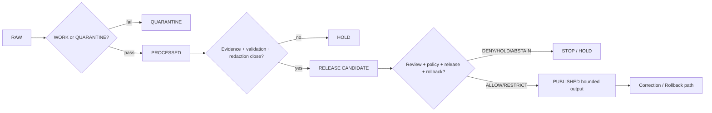

<!-- [KFM_META_BLOCK_V2]
doc_id: kfm://policy/domains/archaeology/promotion
title: Archaeology Promotion Policy README
type: policy-readme
version: v0.1
status: draft
owners: OWNER_TBD — Archaeology steward · Sensitivity reviewer · Rights-holder representative · Release authority · Correction reviewer · Policy steward · Docs steward
created: 2026-06-15
updated: 2026-06-15
policy_label: restricted
related:
  - ../README.md
  - ../../../../docs/runbooks/archaeology/PROMOTION_RUNBOOK.md
  - ../../../../docs/domains/archaeology/PUBLICATION_AND_POLICY.md
  - ../../../../docs/domains/archaeology/SENSITIVITY.md
  - ../../../../docs/domains/archaeology/PIPELINE.md
  - ../../../../docs/domains/archaeology/PRESERVATION_MATRIX.md
  - ../../../../docs/runbooks/archaeology/ROLLBACK_RUNBOOK.md
  - ../../../../policy/sensitivity/archaeology/
  - ../../../../policy/release/archaeology/
  - ../../../../schemas/contracts/v1/release/release_manifest.schema.json
  - ../../../../contracts/release/promotion_decision.md
  - ../../../../contracts/release/rollback_card.md
  - ../../../../contracts/governance/review_record.md
  - ../../../../contracts/evidence/evidence_bundle.md
  - ../../../../tests/domains/archaeology/
  - ../../../../fixtures/domains/archaeology/
tags: [kfm, policy, domains, archaeology, promotion, lifecycle, gate, deny-by-default, release, rollback, redaction, evidence]
notes:
  - "Initial README for the Archaeology promotion policy sublane."
  - "This lane is for policy checks that govern Archaeology promotion through lifecycle gates; it is not the promotion runbook, release authority, lifecycle data store, receipt store, or schema authority."
  - "Promotion is a governed state transition, not a file move; missing artifacts or unresolved sensitivity should HOLD or DENY."
  - "Concrete policy files, bundle syntax, fixtures, tests, CI binding, and runtime enforcement remain NEEDS VERIFICATION."
[/KFM_META_BLOCK_V2] -->

<a id="top"></a>

<div align="center">

# Archaeology Promotion Policy

`policy/domains/archaeology/promotion/`

**Policy sublane for Archaeology promotion gates: admission, normalization, validation, catalog closure, release readiness, rollback readiness, and fail-closed handling of sensitive archaeological material.**


[Scope](#1-scope) · [Repo fit](#2-repo-fit) · [Boundary](#3-authority-boundary) · [Inputs](#5-inputs) · [Exclusions](#6-exclusions) · [Promotion gates](#7-promotion-gates) · [Definition of done](#14-definition-of-done)

</div>

---

> [!IMPORTANT]
> **Status:** draft / `NEEDS VERIFICATION`  
> **Owners:** `OWNER_TBD` — Archaeology steward · Sensitivity reviewer · Rights-holder representative · Release authority · Correction reviewer · Policy steward · Docs steward  
> **Path:** `policy/domains/archaeology/promotion/README.md`  
> **Responsibility root:** `policy/` — policy-as-code and policy documentation  
> **Truth posture:** CONFIRMED file path / PROPOSED Archaeology promotion-policy sublane / UNKNOWN runtime enforcement

> [!CAUTION]
> Archaeology promotion must fail closed when exact site locations, burials, human remains, sacred sites, unresolved cultural sensitivity, collection security, private-landowner detail, or looting-risk exposure may cross a gate without a named policy decision, receipt, review record, release manifest, and rollback target.

---

## Quick jump

- [1. Scope](#1-scope)
- [2. Repo fit](#2-repo-fit)
- [3. Authority boundary](#3-authority-boundary)
- [4. Default posture](#4-default-posture)
- [5. Inputs](#5-inputs)
- [6. Exclusions](#6-exclusions)
- [7. Promotion gates](#7-promotion-gates)
- [8. Diagram](#8-diagram)
- [9. Decision vocabulary](#9-decision-vocabulary)
- [10. Promotion obligations](#10-promotion-obligations)
- [11. Gate artifact expectations](#11-gate-artifact-expectations)
- [12. Inspection path](#12-inspection-path)
- [13. Validation expectations](#13-validation-expectations)
- [14. Definition of done](#14-definition-of-done)
- [15. Open verification items](#15-open-verification-items)

---

## 1. Scope

`policy/domains/archaeology/promotion/` is a proposed policy sublane for Archaeology lifecycle-promotion decisions.

It should describe and eventually bind policy checks that decide whether an Archaeology object, candidate, layer, graph projection, evidence bundle, or release candidate may advance from one lifecycle state to the next.

In scope:

- gate checks for RAW, WORK, QUARANTINE, PROCESSED, CATALOG, TRIPLET, and PUBLISHED transitions
- promotion decisions for sensitive Archaeology material
- required artifacts, receipts, review records, policy decisions, and rollback targets
- failure reason codes for deny, hold, abstain, and error paths
- separation-of-duties requirements before release-adjacent promotion
- public-bound trust membrane checks

Out of scope:

- operational step-by-step runbook text
- release approval itself
- lifecycle data storage
- precise site/source data
- schema definitions and semantic contracts
- public UI or API implementation
- receipt/proof storage
- package or pipeline code

[Back to top](#top)

---

## 2. Repo fit

| Concern | Owning root | Expected relationship |
|---|---|---|
| Archaeology promotion policy | `policy/domains/archaeology/promotion/` | This README and future promotion policy files, if accepted |
| Archaeology policy parent | `policy/domains/archaeology/` | Domain policy boundary and shared Archaeology obligations |
| Promotion runbook | `docs/runbooks/archaeology/PROMOTION_RUNBOOK.md` | Operational procedure and checklist; not executable policy |
| Publication doctrine | `docs/domains/archaeology/PUBLICATION_AND_POLICY.md` | Governance reference for trust-membrane crossing |
| Sensitivity doctrine | `docs/domains/archaeology/SENSITIVITY.md` | Sensitivity and redaction posture |
| Release authority | `release/` | ReleaseManifest, correction, supersession, and rollback authority |
| Receipts and proofs | `data/receipts/`, `data/proofs/`, or verified homes | Stored trust artifacts, not this lane |
| Runtime policy evaluation | `packages/policy-runtime/` | Evaluator helper code; not policy authority |
| Tests and fixtures | `tests/domains/archaeology/`, `fixtures/domains/archaeology/` | Enforceability proof; presence remains `NEEDS VERIFICATION` |

## 3. Authority boundary

This lane may define policy checks for whether a promotion gate can pass. It must not store the promoted data, perform the transform, approve the release, or replace the runbook.

```text
policy/domains/archaeology/promotion/ = promotion policy gates
policy/domains/archaeology/           = parent Archaeology policy lane
docs/runbooks/archaeology/            = operational runbooks
docs/domains/archaeology/             = domain doctrine and policy intent
data/                                 = lifecycle artifacts, receipts, proofs, registry
release/                              = publication, correction, rollback control
schemas/contracts/v1/                 = machine-readable shapes
contracts/                            = semantic meaning
```

## 4. Default posture

Promotion policy should return `HOLD`, `DENY`, or `ABSTAIN` when support is missing.

A promotion gate should not advance when any of these are unresolved:

- source identity and role
- rights posture
- sovereignty or cultural authority
- sensitivity tier or per-record sensitivity rank
- precise-geometry redaction/generalization status
- EvidenceRef to EvidenceBundle closure
- ValidationReport status
- RedactionReceipt, TransformReceipt, or ReviewRecord requirement
- ReleaseManifest, RollbackCard, or CorrectionNotice requirement
- separation-of-duties requirement
- public-surface trust membrane check

## 5. Inputs

| Input family | Examples | Required posture |
|---|---|---|
| Gate context | admission, normalization, validation, catalog closure, release, rollback | Explicit and lifecycle-valid |
| Archaeology object context | CandidateFeature, ArchaeologicalSite, ArtifactRecord, Survey, RemoteSensingAnomaly, ThreeDDocumentation | Object family known or held |
| Source context | SHPO, tribal steward, survey, museum, LiDAR, geophysics, remote sensing | Source role, rights, and authority recorded |
| Sensitivity context | exact geometry, burial, sacred site, human remains, looting risk, collection security | Fail closed when unresolved |
| Evidence context | EvidenceRef, EvidenceBundle status, citation validation | Must close before catalog/release |
| Review context | cultural review, steward review, sensitivity reviewer, rights-holder representative, release authority | Required when materiality applies |
| Release context | ReleaseManifest, RollbackCard, CorrectionNotice, stale-state, supersession | Required for public-impacting promotion |
| Audit context | PolicyDecision, PromotionDecision, RunReceipt, decision id, reason code | Required for consequential decisions |

## 6. Exclusions

| Does not belong here | Correct home |
|---|---|
| Promotion runbook prose | `docs/runbooks/archaeology/PROMOTION_RUNBOOK.md` |
| Lifecycle artifacts | `data/` lifecycle roots |
| Release manifests and rollback cards | `release/` |
| Stored receipts and proofs | `data/receipts/`, `data/proofs/`, or verified homes |
| Archaeology schemas | `schemas/contracts/v1/archaeology/` or accepted schema home |
| Archaeology contracts | `contracts/domains/archaeology/` or accepted contract home |
| Pipeline implementation | `pipelines/domains/archaeology/` |
| Package helper code | `packages/domains/archaeology/` |
| Public API or UI implementation | `apps/` and governed UI/API packages |
| Raw precise locations or restricted cultural material | Governed restricted lifecycle stores only |

## 7. Promotion gates

| Gate | Policy question | Default posture |
|---|---|---|
| `admit_to_raw` | Is the source admissible and rights minimally recorded? | Hold without SourceDescriptor and rights posture |
| `raw_to_work_or_quarantine` | Can source material enter working transform, or must it be isolated? | Quarantine unresolved, invalid, or over-exposed material |
| `work_to_processed` | Do validation, sensitivity, redaction, and transform receipts support normalization? | Hold without ValidationReport and required receipts |
| `processed_to_catalog` | Can evidence, graph, catalog, and review closure be asserted? | Hold without EvidenceBundle closure and review record |
| `catalog_to_release_candidate` | Can a release candidate be assembled without trust-membrane bypass? | Hold without PolicyDecision and separation-of-duties plan |
| `release_candidate_to_published` | Can public-safe release proceed? | Deny/Hold without ReleaseManifest, RollbackCard, and redaction proof |
| `published_to_corrected_or_rolled_back` | Can release be corrected, superseded, or rolled back? | Require CorrectionNotice or RollbackCard |

## 8. Diagram



## 9. Decision vocabulary

| Decision | Meaning | Required behavior |
|---|---|---|
| `ALLOW` | Promotion may advance under supplied Archaeology context | Scope to gate, artifact, version, audience, and release context |
| `DENY` | Promotion would expose prohibited material or violate governance | Preserve prior state; do not expose protected detail |
| `RESTRICT` | Promotion may advance only with redaction, generalization, audience restriction, or delayed release | Preserve obligations downstream |
| `HOLD` | Required artifact, review, receipt, release, or rollback support is missing | Do not advance gate |
| `ABSTAIN` | Policy cannot decide because support is unresolved | Preserve unresolved handles where safe |
| `ERROR` | Policy machinery, schema, runtime, or repository support failed | Fail closed and record failure |

## 10. Promotion obligations

| Obligation | Example effect |
|---|---|
| `source_descriptor_required` | Admission cannot proceed without source identity, role, rights, and hash |
| `validation_report_required` | WORK cannot become PROCESSED without validator pass or explicit hold path |
| `redaction_receipt_required` | Sensitive material cannot advance without a named redaction/generalization receipt |
| `evidence_bundle_required` | Catalog/release cannot advance without EvidenceRef closure |
| `review_record_required` | Cultural, sovereignty, or sensitivity material requires steward review record |
| `separation_of_duties_required` | Author, sensitivity reviewer, rights-holder representative, and release authority must be separated where material |
| `release_manifest_required` | Public-bound promotion requires release manifest |
| `rollback_required` | Public-bound promotion requires rollback target and correction path |
| `public_bypass_denied` | Public clients cannot read RAW, WORK, QUARANTINE, PROCESSED, or unreleased candidates |

## 11. Gate artifact expectations

A promotion policy record or gate manifest should identify:

- gate id and lifecycle transition;
- object family and artifact refs;
- source descriptor and source role;
- sensitivity tier/rank and redaction profile;
- EvidenceBundle closure status;
- validation reports and transform receipts;
- required reviewers and review status;
- policy decision, reason code, and obligations;
- release manifest, rollback card, and correction path where relevant;
- fixture IDs proving allow, deny, hold, abstain, and error behavior.

## 12. Inspection path

Concrete promotion policy files, modules, manifests, tests, fixtures, validators, and CI remain `NEEDS VERIFICATION`.

```bash
find policy/domains/archaeology/promotion -maxdepth 4 -type f | sort
find docs/runbooks/archaeology docs/domains/archaeology release contracts schemas/contracts/v1 -maxdepth 5 -type f 2>/dev/null | grep -Ei 'promotion|release|rollback|redaction|review|evidence|archaeology' | sort
find tests/domains/archaeology fixtures/domains/archaeology -maxdepth 5 -type f 2>/dev/null | grep -Ei 'promotion|release|rollback|deny|redaction|evidence' | sort
```

## 13. Validation expectations

Useful validation for this lane should cover:

- missing SourceDescriptor blocks admission;
- missing ValidationReport blocks WORK to PROCESSED;
- unresolved precise geometry or sensitive category returns `DENY`, `HOLD`, or `RESTRICT`;
- missing RedactionReceipt blocks catalog or public-bound release;
- missing EvidenceBundle closure returns `ABSTAIN` or `HOLD`;
- missing separation-of-duties review blocks release candidate promotion;
- missing ReleaseManifest or RollbackCard blocks public-bound promotion;
- public clients cannot reach unreleased lifecycle states;
- denied and held gates preserve prior state and emit safe reason codes.

## 14. Definition of done

- [ ] Owners are confirmed and `OWNER_TBD` is replaced.
- [ ] Promotion policy files and bundle structure are inventoried.
- [ ] Runtime policy language and bundle location are confirmed.
- [ ] Gate IDs and input envelope shapes are linked to contracts or schemas.
- [ ] Fixtures cover allow, deny, restrict, hold, abstain, and error outcomes for each gate.
- [ ] Required artifact checks are tested.
- [ ] Separation-of-duties checks are tested.
- [ ] Release and rollback integration is linked and tested.
- [ ] Public API bypass checks are covered by tests or policy fixtures.

## 15. Open verification items

| Item | Why it matters |
|---|---|
| Confirm actual child files under `policy/domains/archaeology/promotion/` | Prevents stale empty-lane claims |
| Confirm Rego/OPA or equivalent policy language | Prevents non-runnable guidance |
| Confirm promotion decision schema and contract paths | Required for machine-checkable gates |
| Confirm receipt schemas and storage homes | Required for auditability |
| Confirm tests and fixtures | Required before enforcement claims |
| Confirm release-gate integration | Required before publication claims |
| Confirm rollback drill coverage | Required for reversible public release |
| Confirm public trust-membrane tests | Prevents lifecycle bypass |

<details>
<summary>Appendix A — no-loss preservation note</summary>

The target file was an empty placeholder. This README adds a bounded Archaeology promotion-policy sublane without claiming runtime enforcement, policy modules, tests, fixtures, schema coverage, receipt storage, CI coverage, or release-gate integration.

It preserves the Archaeology promotion doctrine that promotion is a governed state transition, not a file move, and that exact archaeological site locations and sensitive categories fail closed at every gate.

</details>

## Status summary

`policy/domains/archaeology/promotion/` should define Archaeology promotion policy only when backed by reviewed gate definitions, artifacts, receipts, tests, release integration, and rollback support.

It should preserve lifecycle boundaries and deny-by-default sensitive-domain handling without becoming the runbook, release authority, lifecycle store, public API, schema authority, or receipt/proof home.

<p align="right"><a href="#top">Back to top</a></p>
