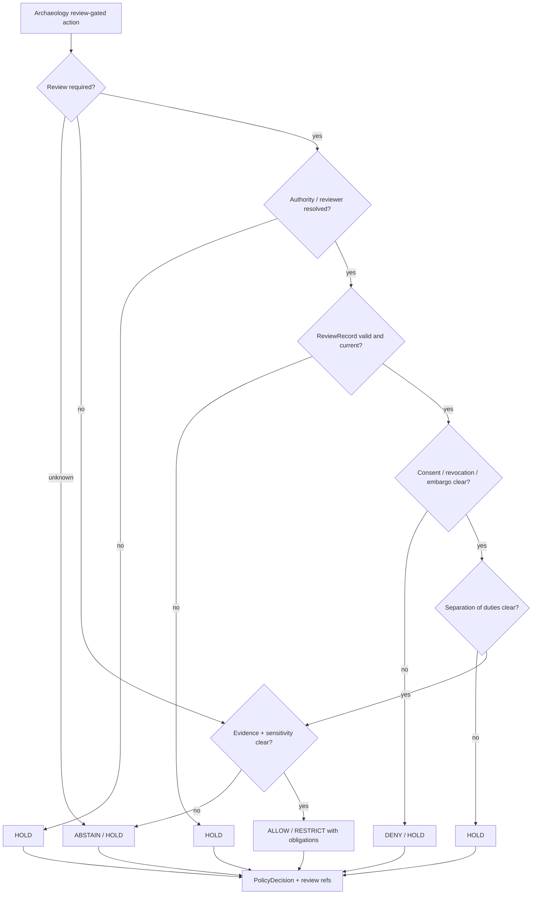

<!-- [KFM_META_BLOCK_V2]
doc_id: kfm://policy/domains/archaeology/review
title: Archaeology Review Policy README
type: policy-readme
version: v0.1
status: draft
owners: OWNER_TBD — Archaeology steward · Cultural-review liaison · Sensitivity reviewer · Rights-holder representative · Release authority · Policy steward · Docs steward
created: 2026-06-15
updated: 2026-06-15
policy_label: restricted
related:
  - ../README.md
  - ../../../../docs/domains/archaeology/CULTURAL_REVIEW.md
  - ../../../../docs/domains/archaeology/PUBLICATION_AND_POLICY.md
  - ../../../../docs/domains/archaeology/SENSITIVITY.md
  - ../../../../docs/runbooks/archaeology/PROMOTION_RUNBOOK.md
  - ../../../../docs/runbooks/archaeology/ROLLBACK_RUNBOOK.md
  - ../../../../policy/sensitivity/archaeology/
  - ../../../../policy/consent/archaeology/
  - ../../../../policy/release/archaeology/
  - ../../../../schemas/contracts/v1/governance/review_record.schema.json
  - ../../../../schemas/contracts/v1/governance/cultural_review.schema.json
  - ../../../../schemas/contracts/v1/governance/steward_review.schema.json
  - ../../../../schemas/contracts/v1/governance/consent_receipt.schema.json
  - ../../../../schemas/contracts/v1/governance/revocation_manifest.schema.json
  - ../../../../contracts/governance/review_record.md
  - ../../../../tests/domains/archaeology/
  - ../../../../fixtures/domains/archaeology/
tags: [kfm, policy, domains, archaeology, review, cultural-review, stewardship, sovereignty, CARE, consent, fail-closed]
notes:
  - "Initial README for the Archaeology review policy sublane."
  - "This lane is for policy checks that decide whether Archaeology review requirements are satisfied; it is not the cultural-review doctrine document, review-record schema home, consent store, or release authority."
  - "Cultural review records governance of who reviews, when, how recorded, and how revoked; it does not define the substance of cultural knowledge."
  - "Concrete policy files, bundle syntax, fixtures, tests, review-record schemas, CI binding, and runtime enforcement remain NEEDS VERIFICATION."
[/KFM_META_BLOCK_V2] -->

<a id="top"></a>

<div align="center">

# Archaeology Review Policy

`policy/domains/archaeology/review/`

**Policy sublane for Archaeology review gates: cultural review, steward review, sensitivity review, rights-holder review, consent/revocation checks, CARE obligations, and separation-of-duties readiness.**


[Scope](#1-scope) · [Repo fit](#2-repo-fit) · [Boundary](#3-authority-boundary) · [Inputs](#5-inputs) · [Exclusions](#6-exclusions) · [Review gates](#7-review-gates) · [Definition of done](#14-definition-of-done)

</div>

---

> [!IMPORTANT]
> **Status:** draft / `NEEDS VERIFICATION`  
> **Owners:** `OWNER_TBD` — Archaeology steward · Cultural-review liaison · Sensitivity reviewer · Rights-holder representative · Release authority · Policy steward · Docs steward  
> **Path:** `policy/domains/archaeology/review/README.md`  
> **Responsibility root:** `policy/` — policy-as-code and policy documentation  
> **Truth posture:** CONFIRMED file path / PROPOSED Archaeology review-policy sublane / UNKNOWN runtime enforcement

> [!CAUTION]
> This lane must not convert cultural authority into KFM-owned meaning. For Indigenous, cultural, sacred, burial, oral-history, or community-controlled material, KFM records review status, obligations, consent, revocation, and authority references; it does not define the substance of the cultural knowledge.

---

## Quick jump

- [1. Scope](#1-scope)
- [2. Repo fit](#2-repo-fit)
- [3. Authority boundary](#3-authority-boundary)
- [4. Default posture](#4-default-posture)
- [5. Inputs](#5-inputs)
- [6. Exclusions](#6-exclusions)
- [7. Review gates](#7-review-gates)
- [8. Diagram](#8-diagram)
- [9. Decision vocabulary](#9-decision-vocabulary)
- [10. Review obligations](#10-review-obligations)
- [11. Review-record expectations](#11-review-record-expectations)
- [12. Inspection path](#12-inspection-path)
- [13. Validation expectations](#13-validation-expectations)
- [14. Definition of done](#14-definition-of-done)
- [15. Open verification items](#15-open-verification-items)

---

## 1. Scope

`policy/domains/archaeology/review/` is a proposed policy sublane for Archaeology review requirements.

It should describe and eventually bind policy checks that decide whether the required cultural, steward, sensitivity, rights-holder, consent, sovereignty, and release-adjacent reviews are present and valid enough for a requested lifecycle transition, render, export, or release candidate.

In scope:

- review-required decisions for archaeology-sensitive object classes
- cultural review, steward review, sensitivity review, rights-holder review, and release-authority review posture
- consent, revocation, embargo, waiver, and CARE obligation checks
- review-record completeness and digest-closure expectations
- separation-of-duties checks for material public-impacting actions
- finite policy outcomes and safe reason codes
- live fail-closed handling for revoked or superseded review state

Out of scope:

- cultural knowledge substance or interpretation
- review-record JSON Schema definitions
- consent-token storage
- release approval itself
- lifecycle data storage
- public UI or API implementation
- operational consultation procedure text
- precise site/source data or protected cultural content

[Back to top](#top)

---

## 2. Repo fit

| Concern | Owning root | Expected relationship |
|---|---|---|
| Archaeology review policy | `policy/domains/archaeology/review/` | This README and future review policy files, if accepted |
| Archaeology policy parent | `policy/domains/archaeology/` | Domain policy boundary and shared Archaeology obligations |
| Cultural-review doctrine | `docs/domains/archaeology/CULTURAL_REVIEW.md` | Human-facing protocol for who reviews, what records result, consent, revocation, and CARE posture |
| Sensitivity doctrine | `docs/domains/archaeology/SENSITIVITY.md` | Human-facing sensitivity, redaction, sovereignty, consent, and review workflow posture |
| Publication doctrine | `docs/domains/archaeology/PUBLICATION_AND_POLICY.md` | Trust-membrane and release governance reference |
| Review schemas | `schemas/contracts/v1/governance/` or accepted schema home | Machine shapes remain separate |
| Review contracts | `contracts/governance/` or accepted contract home | Semantic meaning remains separate |
| Consent policy | `policy/consent/archaeology/` or accepted consent lane | Consent/revocation policy integration remains `NEEDS VERIFICATION` |
| Release authority | `release/` | Publication, correction, supersession, and rollback authority |

## 3. Authority boundary

This lane may decide whether review requirements are satisfied. It must not perform consultation, define cultural content, own review schemas, store consent records, approve release, or publish material.

```text
policy/domains/archaeology/review/ = review policy gates
policy/domains/archaeology/        = parent Archaeology policy lane
docs/domains/archaeology/          = doctrine, cultural-review protocol, sensitivity posture
schemas/contracts/v1/governance/   = review / consent / revocation machine shapes
contracts/governance/              = review-record semantic meaning
data/                              = lifecycle artifacts, receipts, proofs, restricted records
release/                           = publication, correction, rollback control
```

## 4. Default posture

Review policy should return `HOLD`, `DENY`, or `ABSTAIN` when review support is missing or unresolved.

A review gate should not pass when any of these are unresolved:

- whether review is required for the object class and audience
- named authority or rights-holder representative
- authority-to-control reference
- sensitivity tier and per-record sensitivity rank
- consent, revocation, embargo, waiver, or retention state
- CARE labels and obligations
- ReviewRecord / CulturalReview / StewardReview presence
- review digest closure and reviewer identity
- separation-of-duties for release-adjacent actions
- rollback and correction path for public-impacting material

## 5. Inputs

| Input family | Examples | Required posture |
|---|---|---|
| Review context | required review type, reviewer role, review status, review timestamp | Explicit and auditable |
| Authority context | steward org, authority_to_control, rights-holder representative, cultural-review liaison | Required where cultural or sovereignty-bearing material is in scope |
| Archaeology object context | site, artifact, survey, oral history, remote-sensing derivative, 3D documentation, candidate feature | Object family known or held |
| Sensitivity context | exact geometry, sacred site, burial/human remains, looting risk, collection security, cultural knowledge | Fail closed when unresolved |
| Consent / revocation context | consent receipt, revocation manifest, embargo, waiver, retention condition | Checked as live input |
| Evidence context | EvidenceRef, EvidenceBundle status, citation validation | Required for claim-bearing outputs |
| Release context | candidate, released, superseded, withdrawn, rollback requested | Required for public-impacting actions |
| Audit context | PolicyDecision, ReviewRecord digest, reason code, obligations, unresolved handles | Required for consequential decisions |

## 6. Exclusions

| Does not belong here | Correct home |
|---|---|
| Cultural review protocol prose | `docs/domains/archaeology/CULTURAL_REVIEW.md` |
| Review schemas | `schemas/contracts/v1/governance/` |
| Review semantic contracts | `contracts/governance/` |
| Consent records and revocation manifests as stored artifacts | governed `data/`, receipt/proof, or consent homes |
| Release manifests and rollback cards | `release/` |
| Lifecycle artifacts and precise protected data | `data/` lifecycle roots with strict controls |
| Consultation notes containing sensitive substance | governed restricted stores, not public docs |
| Public API or UI surfaces | `apps/` and governed UI/API packages |
| Operational release approval | `release/` plus accepted governance workflows |

## 7. Review gates

| Gate | Policy question | Default posture |
|---|---|---|
| `review_required` | Does this object/audience/lifecycle stage require review? | Require review for sensitive or uncertain material |
| `review_record_present` | Is the required ReviewRecord/CulturalReview/StewardReview present? | Hold when missing |
| `authority_to_control_resolved` | Is the controlling authority identified? | Hold or deny when unresolved |
| `consent_live` | Is consent valid, unrevoked, and within scope? | Deny or hold when revoked, expired, absent, or ambiguous |
| `care_obligations_preserved` | Are CARE labels and obligations preserved downstream? | Restrict or hold when missing |
| `separation_of_duties_clear` | Are reviewer, author, release authority, and rights-holder roles separated when materiality requires it? | Hold when collapsed |
| `review_supersession_clear` | Is older review state superseded, stale, or withdrawn? | Hold until current review state is resolved |

## 8. Diagram



## 9. Decision vocabulary

| Decision | Meaning | Required behavior |
|---|---|---|
| `ALLOW` | Review requirements are satisfied for the scoped action | Preserve review refs, obligations, audience, and version |
| `DENY` | Consent, revocation, authority, sensitivity, or policy blocks action | Do not expose protected detail or cultural substance |
| `RESTRICT` | Action may proceed only with audience, redaction, citation, embargo, or review obligations | Preserve obligations downstream |
| `HOLD` | Required review, authority, consent, separation-of-duties, or current-state support is missing | Do not promote or render publicly |
| `ABSTAIN` | Policy cannot decide because support is unresolved | Preserve unresolved handles where safe |
| `ERROR` | Policy machinery, schema, runtime, repository, or review-record validation failed | Fail closed and record failure |

## 10. Review obligations

| Obligation | Example effect |
|---|---|
| `cultural_review_required` | Route material to cultural reviewer before promotion or render |
| `steward_review_required` | Require domain steward review for sensitive object classes |
| `rights_holder_review_required` | Require rights-holder representative sign-off where applicable |
| `sensitivity_review_required` | Require sensitivity reviewer before any bounded public output |
| `consent_check_required` | Check consent, revocation, embargo, retention, and waiver state |
| `care_obligations_required` | Preserve CARE labels, obligations, and benefit commitments |
| `separation_of_duties_required` | Prevent author/reviewer/release authority collapse where material |
| `current_review_required` | Reject stale, superseded, withdrawn, or revoked review state |
| `restricted_audience_required` | Limit to steward, reviewer, rights-holder, or authenticated surface |

## 11. Review-record expectations

A future review-policy record or policy input should identify:

- review type and object family;
- required reviewer role and reviewer authority;
- authority-to-control reference;
- consent, revocation, embargo, and retention status;
- sensitivity tier/rank and CARE obligations;
- evidence references and source role;
- review status, timestamp, digest, and supersession state;
- policy outcome, reason code, and obligations;
- downstream release, rollback, or correction implications;
- fixture IDs proving allow, deny, restrict, hold, abstain, and error behavior.

## 12. Inspection path

Concrete review policy files, modules, manifests, tests, fixtures, schemas, and CI remain `NEEDS VERIFICATION`.

```bash
find policy/domains/archaeology/review -maxdepth 4 -type f | sort
find docs/domains/archaeology schemas/contracts/v1/governance contracts/governance policy/consent policy/sensitivity -maxdepth 5 -type f 2>/dev/null | grep -Ei 'review|cultural|steward|consent|revocation|care|sovereignty' | sort
find tests/domains/archaeology fixtures/domains/archaeology -maxdepth 5 -type f 2>/dev/null | grep -Ei 'review|cultural|consent|revocation|sovereignty|care' | sort
```

## 13. Validation expectations

Useful validation for this lane should cover:

- sensitive archaeology object without required ReviewRecord returns `HOLD`;
- missing authority_to_control returns `HOLD` or `DENY`;
- revoked, expired, or out-of-scope consent returns `DENY` or `HOLD`;
- stale or superseded review state returns `HOLD`;
- reviewer-role collapse returns `HOLD` where separation of duties is required;
- CARE obligations survive downstream transforms and release candidates;
- public surfaces cannot show protected detail just because a review exists;
- policy decisions emit safe reason codes and receipt-ready metadata.

## 14. Definition of done

- [ ] Owners are confirmed and `OWNER_TBD` is replaced.
- [ ] Review policy files and bundle structure are inventoried.
- [ ] Runtime policy language and bundle location are confirmed.
- [ ] ReviewRecord, CulturalReview, StewardReview, ConsentReceipt, and RevocationManifest schemas/contracts are linked.
- [ ] Fixtures cover allow, deny, restrict, hold, abstain, and error outcomes.
- [ ] Consent and revocation checks are wired as live inputs.
- [ ] Separation-of-duties checks are tested.
- [ ] CARE obligation preservation is tested.
- [ ] Release and rollback integration is linked and tested.

## 15. Open verification items

| Item | Why it matters |
|---|---|
| Confirm actual child files under `policy/domains/archaeology/review/` | Prevents stale empty-lane claims |
| Confirm Rego/OPA or equivalent policy language | Prevents non-runnable guidance |
| Confirm governance schema paths | Required for machine-checkable review records |
| Confirm consent/revocation integration | Required for live fail-closed review state |
| Confirm tests and fixtures | Required before enforcement claims |
| Confirm reviewer-role registry | Required for separation-of-duties checks |
| Confirm CARE label propagation | Required for cultural sovereignty obligations |
| Confirm release-gate integration | Required before publication claims |

<details>
<summary>Appendix A — no-loss preservation note</summary>

The target file was an empty placeholder. This README adds a bounded Archaeology review-policy sublane without claiming runtime enforcement, policy modules, tests, fixtures, schema coverage, consent storage, CI coverage, or release-gate integration.

It preserves the cultural-review doctrine that KFM records who reviews, when, how review is recorded, and how revocation is handled, but does not define the substance of cultural knowledge.

</details>

## Status summary

`policy/domains/archaeology/review/` should define Archaeology review policy only when backed by accepted review-record shapes, consent/revocation integration, fixtures, tests, and release-gate support.

It should keep review requirements fail-closed, authority-aware, obligation-preserving, and auditable without becoming cultural-knowledge authority, schema home, release authority, lifecycle data store, public API, or consent store.

<p align="right"><a href="#top">Back to top</a></p>
