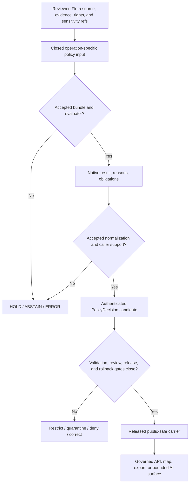

# policy/domains/flora

> **One-line purpose.** `policy/domains/flora/` is KFM's Flora-specific admissibility-policy source lane: it may decide whether a bounded operation over botanical material is allowable, restricted, held, denied, or abstained from under explicit source-role, evidence, rights, sensitivity, precision, review, lifecycle, and release context—without creating botanical truth, clearing rights, performing a geoprivacy transform, approving release, or publishing anything.

<!-- [KFM_META_BLOCK_V2]
doc_id: kfm://policy/domains/flora
title: Flora Domain Policy Boundary and Activation Contract
type: readme; directory-readme; boundary-compact; domain-policy-boundary
version: v0.1.0
status: draft; repository-grounded; canonical-lane-projection; scaffold-corpus; evaluator-unbound; inactive; fail-closed-authoring-contract; sensitivity-aware; non-release; non-publication
owner: NEEDS VERIFICATION — .github/CODEOWNERS routes /policy/ and the sensitive-domain documentation path to @bartytime4life; accepted Flora-policy stewardship, specialist sensitivity review, and independent approval remain unproved
created: 2026-05-08
updated: 2026-08-13
current_path: policy/domains/flora/README.md
owning_root: policy/
responsibility: Document the Flora-specific admissibility-policy boundary, exact local inventory, present rule semantics, candidate evaluation contract, activation requirements, validation limits, trust membrane, and rollback posture without becoming domain doctrine, contract, schema, evidence, rights, sensitivity, evaluator, release, or publication authority.
policy_label: internal-operating-policy; repository-public; flora-domain; admissibility; source-role-aware; evidence-bound; rights-aware; sensitivity-aware; geoprivacy-aware; fail-closed; release-gated; correction-aware; rollback-aware
base_commit: 1cd3da895de521c70096f6d04b406c412b70f707
base_tree: 3698ce464862410821e82593b036e2202e26929b
target_prior_blob: b040bff13e654cff9d2f7336d6d6783c8467eaa9
target_tree: 7ec0d779bbb4506a4c6bd0bac15052dad3de3f29
parent_domain_policy_blob: ed9be975c9da2c7d77d94fab621db39f23953813
domain_lane_register_blob: 1bfc6f91cfa713a5e3d51ece011b63b46310734f
directory_rules_blob: fd49a0b83e55cef52c1124281f093e263526898d
directory_rules_adr_blob: b01322ef64f8c2b1ecb41de7ef4685b97cfa2a62
flora_domain_docs_blob: 43a47d828c4926e539790a055a5e1034c6ce62bc
flora_sensitivity_policy_readme_blob: 4c65abec24135f7e4467fd108e163cdce594d5f9
flora_domain_workflow_blob: 3fe6b1ba8150960692b6b2fc764c6aa31d09565c
flora_smoke_test_blob: 18d15781b78487de4c786c5ee38254f3a48e49e3
policy_runtime_core_blob: e7e14cf39ae6919fbbc80f1b471de6b907292edb
truth_posture: CONFIRMED accepted Directory Rules placement, proposed machine registration of the canonical Flora lane, complete 24-entry direct-child inventory, 16 default-only or comment-only Rego modules, three PROPOSED placeholder YAML profiles, four .gitkeep-only support directories, no domain-local native Rego test, no accepted Flora policy bundle or evaluator, one separately governed synthetic public-safe fixture suite, and explicit proof/release workflow holds / PROPOSED candidate Flora-policy input, result, obligation, activation, and rollback contract / CONFLICTED allow-default and deny-default package semantics, duplicate or overlapping rule-family names, and doctrine language that describes enforcement while implementation remains scaffolded / UNKNOWN accepted owner, canonical entrypoint, evaluator binding, native-to-outward normalization, governed consumer, authenticated receipt persistence, required-check coupling, production enforcement, and public-surface behavior
notes:
  - "This revision replaces the original 822-byte greenfield scaffold with a repository-grounded boundary contract."
  - "No Rego, YAML profile, contract, schema, registry record, fixture, validator, test, workflow, package, pipeline, bundle, evaluator, lifecycle record, release object, deployment, or public behavior is created or modified."
  - "Static inventory and badges describe the pinned repository snapshot; they are not policy activation, sensitivity clearance, review, release, deployment, or publication evidence."
[/KFM_META_BLOCK_V2] -->

**Quick navigation:** [Purpose](#purpose) · [Authority](#authority-level) · [Status](#status) · [Belongs](#what-belongs-here) · [Exclusions](#what-does-not-belong-here) · [Children](#current-direct-child-map) · [Rules](#current-rule-inventory) · [Inputs](#candidate-policy-input) · [Results](#result-and-decision-model) · [Sensitivity](#sensitivity-geoprivacy-and-safe-representation) · [Composition](#source-role-taxonomy-and-cross-domain-composition) · [Activation](#activation-boundary) · [Lifecycle](#lifecycle-and-public-trust-membrane) · [Validation](#validation) · [Review](#review-burden) · [Related](#related-surfaces) · [Done](#definition-of-done) · [Open work](#open-verification-register) · [Rollback](#correction-revocation-and-rollback)

> [!IMPORTANT]
> **Safe current conclusion at `main@1cd3da895de5`:** this is a real canonical domain-policy path containing policy-shaped source, but it is not an accepted or active Flora policy system. Fourteen modules declare only `default allow := false`; two declare `default deny := false` and contain only commented example rules. Three YAML files label themselves `PROPOSED` placeholders, and `fixtures/`, `sensitivity/`, `taxonomy_tiebreak/`, and `tests/` contain only `.gitkeep`. No local native Rego test, accepted entrypoint, executable bundle, evaluator binding, decision normalization, or governed consumer was established.

> [!CAUTION]
> The proposed machine register records Flora with a T4 sensitivity baseline, and Flora doctrine says exact rare or culturally sensitive plant locations should be protected by default. Those are strong authoring constraints, not proof that this lane currently enforces them. Missing policy activation, incomplete context, ambiguous taxonomic identity, unresolved rights, or unknown sensitivity must never be treated as permission to expose exact or reverse-engineerable location detail.

> [!WARNING]
> A file path, `default allow := false`, empty deny set, schema pass, synthetic fixture pass, successful workflow, generated receipt, pull request, map style, hidden UI field, or lack of an observed denial cannot create evidence, infer rights or consent, authenticate review, perform redaction, approve release, or make botanical material public-safe.

---

## Purpose

`policy/domains/flora/` owns the **Flora-specific portion of KFM admissibility policy source**.

Its bounded question is:

> Given an exact operation, audience, Flora subject, source role, evidence and rights posture, taxonomic identity, geometry and precision, sensitivity and stewardship context, lifecycle state, review state, policy identity, and rollback support, may the requested operation proceed—and with which restrictions, reasons, and enforceable obligations?

Representative operations include candidate admission, transformation, join, rendering, export, evidence display, indexing, AI answer preparation, release consideration, correction, and withdrawal. A policy evaluation may constrain one such operation; it does not perform the operation or establish the facts supplied to it.

The separation is deliberate:

- Flora doctrine and contracts define botanical meaning;
- schemas define machine shape;
- source registries and evidence records establish reviewed context;
- rights and sensitivity lanes establish independent policy inputs or decisions;
- this lane owns Flora-specific admissibility rule source;
- an accepted runtime would evaluate an immutable policy identity;
- governed callers would enforce every result and obligation; and
- release authority would separately approve, correct, withdraw, or roll back public artifacts.

[Back to top](#top)

---

## Authority level

**Canonical Flora child lane within the singular `policy/` responsibility root; non-doctrinal, non-contract, non-schema, non-registry, non-evidence, non-legal, non-runtime, non-release, and non-publication authority.**

Accepted [ADR-0029](../../../docs/adr/ADR-0029-adopt-directory-governance-standard-v2.md) adopts [Directory Rules v2](../../../docs/doctrine/directory-rules.md). Their domain placement law uses `policy/domains/<lane>/`; the [machine domain-lane register](../../../control_plane/domain_lane_register.yaml) projects `flora` as one of 13 canonical lanes while explicitly remaining `PROPOSED`, `machine_projection_only`, and unable to adopt sensitivity policy or release anything. The [parent domain-policy README](../README.md) supplies the inherited boundary.

| Responsibility | Owning surface | Role of this lane |
|---|---|---|
| Flora scope and doctrine | [`docs/domains/flora/`](../../../docs/domains/flora/README.md) | Consume reviewed meaning; do not restate botanical truth as rule fact. |
| Object-family meaning | [`contracts/domains/flora/`](../../../contracts/domains/flora/README.md) | Evaluate stable semantic inputs; do not redefine them. |
| Machine shape | [`schemas/contracts/v1/domains/flora/`](../../../schemas/contracts/v1/domains/flora/README.md) | Require exact versions; do not become schema authority. |
| Source identity and admission state | [`data/registry/sources/flora/`](../../../data/registry/sources/flora/README.md) | Consume reviewed references; do not activate a source. |
| Rights admissibility | [`policy/rights/`](../../rights/README.md) | Compose an independent result; do not infer permission from source availability. |
| Flora sensitivity and geoprivacy | [`policy/sensitivity/flora/`](../../sensitivity/flora/README.md) | Compose independent controls; do not collapse sensitivity into general domain policy. |
| Flora-specific admissibility source | `policy/domains/flora/` | Own reviewed rules and this local boundary contract. |
| Evaluation and normalization | an accepted bundle and evaluator, potentially under [`packages/policy-runtime/`](../../../packages/policy-runtime/README.md) | Supply immutable source and entrypoint identity; do not execute itself. |
| Fixtures, tests, and validators | [`fixtures/domains/flora/`](../../../fixtures/domains/flora/README.md), [`tests/domains/flora/`](../../../tests/domains/flora/README.md), and [`tools/validators/domains/flora/`](../../../tools/validators/domains/flora/README.md) | Prove only the bounded behavior actually exercised. |
| Lifecycle and proof state | governed `data/` lanes | Consume stable references; do not write or promote lifecycle state. |
| Release and rollback | [`release/candidates/flora/`](../../../release/candidates/flora/README.md) and shared release controls | Supply one prerequisite; never approve or publish. |
| Public delivery | governed APIs and released public-safe artifacts | Consume normalized decisions server-side; never load repository policy directly. |

[`CODEOWNERS`](../../../.github/CODEOWNERS) routes `/policy/` to `@bartytime4life`. That is review-request routing, not an accepted Flora steward, sensitivity specialist, rights holder, sovereign-community representative, independent approver, completed review, or release authority.

[Back to top](#top)

---

## Status

| Surface | Evidence at `1cd3da895de5` | Safe status |
|---|---|---:|
| Target README before this revision | 822-byte greenfield scaffold | **CONFIRMED placeholder baseline** |
| Domain identity | `flora` appears in both human and proposed machine lane registers | **CONFIRMED path; projected governance authority** |
| Direct lane | 24 direct children and four nested `.gitkeep` files | **CONFIRMED complete inventory** |
| Local Rego | 16 modules; no non-default executable rule body | **PROPOSED / scaffolded / inactive** |
| Local YAML | `geoprivacy.yaml`, `rights.yaml`, and `sensitivity.yaml` self-label `PROPOSED` | **PLACEHOLDER profiles** |
| Local native tests | `policy/domains/flora/tests/` contains only `.gitkeep` | **NOT ESTABLISHED** |
| Package consumers | No exact package consumer was established for the reviewed package names | **NONE FOUND in reviewed repository search** |
| General evaluator | `packages/policy-runtime/.../core.py` is a one-line greenfield placeholder | **UNBOUND / inactive** |
| Flora fixture validation | `domain-flora` executes one bounded synthetic public-safe fixture suite | **CONFIRMED conformance slice; not policy evaluation** |
| Proof and release production | The Flora workflow records explicit holds; the candidate lane establishes no child dossier | **HELD / not established** |
| Public artifacts and runtime enforcement | No release-bound Flora policy consumer or publication path was established | **UNKNOWN; no authority inferred** |

### Current maturity

This lane is **M0 — scaffold corpus**.

Repository presence and conservative defaults are useful starting evidence, but activation requires more than parseable Rego. No accepted policy profile currently binds a request shape to one entrypoint, finite results, stable reasons, obligations, evaluator identity, decision envelope, consumer enforcement, receipts, expiry, correction, or rollback.

The surrounding Flora domain is more mature in narrow, separate places: schema-bound Python normalizers, intake-governance candidates, source-readiness materiality fixtures, specimen-record validation, and a public-safe synthetic smoke suite exist. Their workflows explicitly deny policy, release, and publication authority. They must not be cited as proof that these Rego modules run.

[Back to top](#top)

---

## What belongs here

- this README and Flora-domain policy-family documentation;
- reviewed, versioned, declarative rules whose primary responsibility is Flora-specific admissibility;
- rules for exact named operations such as render, join, export, evidence display, AI-answer preparation, transformation, release consideration, correction, and withdrawal;
- source-role, evidence, rights, sensitivity, taxonomic-resolution, precision, freshness, review, and lifecycle prerequisites expressed against explicit inputs;
- fail-closed handling for missing, malformed, ambiguous, stale, revoked, superseded, incompatible, or unreviewed context;
- public-safe reason codes and enforceable obligation identifiers;
- explicit package names, entrypoints, effective times, version and digest identity, supersession, and compatibility notes;
- Flora-specific restriction composition, including join-induced sensitivity and stricter-result preservation;
- local engine-native tests only if an accepted test-placement profile deliberately permits them; and
- links to canonical contracts, schemas, registries, fixtures, executable tests, validators, consumers, receipts, proofs, release records, corrections, withdrawals, and rollback targets.

A file belongs here because it **decides a Flora-specific operation under supplied governed context**. Mentioning a plant, license, taxon, occurrence, geometry, map layer, or sensitivity concern is not enough.

[Back to top](#top)

---

## What does not belong here

| Do not place this in `policy/domains/flora/` | Correct responsibility or handling |
|---|---|
| Botanical doctrine, conservation interpretation, or taxonomic authority | `docs/domains/flora/`, accepted domain governance, and semantic contracts |
| Source payloads, specimens, observations, coordinates, images, or field notes | governed RAW, WORK, QUARANTINE, or source systems |
| Source admission, registry identity, or source-of-record facts | `data/registry/sources/flora/` and source governance |
| Full license text, rights-holder claims, agreements, or legal conclusions | governed rights evidence and authorized legal or rights-holder systems |
| Contract semantics or object-family definitions | `contracts/domains/flora/` or shared contract homes |
| JSON Schema, DTO shape, enums, or validation vocabulary | `schemas/contracts/v1/domains/flora/` or shared schema homes |
| EvidenceBundles, proof packs, citation records, review records, or receipts | their evidence, proof, review, and receipt lanes |
| Evaluated decision instances, runtime caches, or activation state | accepted decision, runtime, deployment, and receipt systems |
| Reusable fixture packs and executable integration suites | root `fixtures/` and `tests/` unless an accepted native profile says otherwise |
| Normalizers, taxonomy resolvers, pipelines, APIs, UI, map, search, graph, or AI implementation | `packages/`, `pipelines/`, `apps/`, and other implementation roots |
| ReleaseManifest, PromotionDecision, CorrectionNotice, WithdrawalNotice, or RollbackCard | `release/` |
| Public botanical layers, tiles, payloads, exports, or reports | released public-safe carriers under governed delivery paths |
| Credentials, access tokens, private agreements, restricted payloads, living-person information, genomic material, exact sensitive locations, culturally protected knowledge, or control-defeating transform parameters | keep out of Git, examples, reasons, logs, receipts, and public review; use authorized restricted systems |
| A parallel Flora mega-root or duplicated cross-domain truth | preserve responsibility-root placement and resolve drift through reviewed governance |

Existing scaffolds do not reserve unlimited authority. Consolidate, replace, or retire them only through a bounded change that records compatibility, consumers, tests, correction, and rollback.

[Back to top](#top)

---

## Current direct-child map

Directory Rules requires a full directory README to expose its direct children. This is the complete tracked map at the pinned base.

| Direct child | Type | Current repository evidence | Safe interpretation |
|---|---|---|---|
| `README.md` | Boundary documentation | Greenfield scaffold before this revision | Documentation only; no activation |
| [`abstain_on_ambiguous.rego`](./abstain_on_ambiguous.rego) | Rego | `default deny := false`; example body commented | Default/comment scaffold |
| [`citation.rego`](./citation.rego) | Rego | `default allow := false` only | Default-only scaffold |
| [`deny_unpublished.rego`](./deny_unpublished.rego) | Rego | `default deny := false`; example body commented | Default/comment scaffold |
| [`fixtures/`](./fixtures/) | Directory | `.gitkeep` only | Placeholder, not a fixture pack |
| [`flora_publication_gate.rego`](./flora_publication_gate.rego) | Rego | `default allow := false` only | Default-only scaffold |
| [`flora_rights.rego`](./flora_rights.rego) | Rego | `default allow := false` only | Default-only scaffold |
| [`flora_source_role.rego`](./flora_source_role.rego) | Rego | `default allow := false` only | Default-only scaffold |
| [`flora_taxonomy_resolution.rego`](./flora_taxonomy_resolution.rego) | Rego | `default allow := false` only | Default-only scaffold |
| [`geoprivacy.rego`](./geoprivacy.rego) | Rego | `default allow := false` only | Default-only scaffold |
| [`geoprivacy.yaml`](./geoprivacy.yaml) | YAML | `status: PROPOSED`; placeholder note | Declaration scaffold, not a transform profile |
| [`joins.rego`](./joins.rego) | Rego | `default allow := false` only | Default-only scaffold |
| [`promotion.rego`](./promotion.rego) | Rego | `default allow := false` only | Default-only scaffold |
| [`promotion_gate.rego`](./promotion_gate.rego) | Rego | `default allow := false` only | Default-only scaffold |
| [`redaction.rego`](./redaction.rego) | Rego | `default allow := false` only | Default-only scaffold |
| [`release_gate.rego`](./release_gate.rego) | Rego | `default allow := false` only | Default-only scaffold |
| [`rights.rego`](./rights.rego) | Rego | `default allow := false` only | Default-only scaffold |
| [`rights.yaml`](./rights.yaml) | YAML | `status: PROPOSED`; placeholder note | Declaration scaffold, not rights clearance |
| [`sensitivity.rego`](./sensitivity.rego) | Rego | `default allow := false` only | Default-only scaffold |
| [`sensitivity.yaml`](./sensitivity.yaml) | YAML | `status: PROPOSED`; placeholder note | Declaration scaffold, not classification authority |
| [`sensitivity/`](./sensitivity/) | Directory | `.gitkeep` only | Placeholder; not the separate canonical sensitivity lane |
| [`source_role.rego`](./source_role.rego) | Rego | `default allow := false` only | Default-only scaffold |
| [`taxonomy_tiebreak/`](./taxonomy_tiebreak/) | Directory | `.gitkeep` only | Placeholder; no tie-break algorithm or decision record |
| [`tests/`](./tests/) | Directory | `.gitkeep` only | Placeholder; no native Rego test |

The four `.gitkeep` files are nested implementation placeholders, not additional direct children. The similarly named local `sensitivity/` directory must not be confused with [`policy/sensitivity/flora/`](../../sensitivity/flora/README.md).

[Back to top](#top)

---

## Current rule inventory

### Default-only allow packages

Fourteen modules declare a unique package plus `default allow := false` and no positive rule body:

| File | Package |
|---|---|
| [`citation.rego`](./citation.rego) | `kfm.generated.policy.domains.flora.citation` |
| [`flora_publication_gate.rego`](./flora_publication_gate.rego) | `kfm.generated.policy.domains.flora.flora_publication_gate` |
| [`flora_rights.rego`](./flora_rights.rego) | `kfm.generated.policy.domains.flora.flora_rights` |
| [`flora_source_role.rego`](./flora_source_role.rego) | `kfm.generated.policy.domains.flora.flora_source_role` |
| [`flora_taxonomy_resolution.rego`](./flora_taxonomy_resolution.rego) | `kfm.generated.policy.domains.flora.flora_taxonomy_resolution` |
| [`geoprivacy.rego`](./geoprivacy.rego) | `kfm.generated.policy.domains.flora.geoprivacy` |
| [`joins.rego`](./joins.rego) | `kfm.generated.policy.domains.flora.joins` |
| [`promotion.rego`](./promotion.rego) | `kfm.generated.policy.domains.flora.promotion` |
| [`promotion_gate.rego`](./promotion_gate.rego) | `kfm.generated.policy.domains.flora.promotion_gate` |
| [`redaction.rego`](./redaction.rego) | `kfm.generated.policy.domains.flora.redaction` |
| [`release_gate.rego`](./release_gate.rego) | `kfm.generated.policy.domains.flora.release_gate` |
| [`rights.rego`](./rights.rego) | `kfm.generated.policy.domains.flora.rights` |
| [`sensitivity.rego`](./sensitivity.rego) | `kfm.generated.policy.domains.flora.sensitivity` |
| [`source_role.rego`](./source_role.rego) | `kfm.generated.policy.domains.flora.source_role` |

`allow == false` is not a complete outward decision. It supplies no stable reason, obligation, restriction, abstention, error, input digest, policy digest, evaluator identity, expiry, or receipt.

### Default-only deny packages

| File | Package | Current content |
|---|---|---|
| [`abstain_on_ambiguous.rego`](./abstain_on_ambiguous.rego) | `kfm.flora_abstain_on_ambiguous` | `default deny := false`; illustrative unresolved-evidence rule commented out |
| [`deny_unpublished.rego`](./deny_unpublished.rego) | `kfm.flora_deny_unpublished` | `default deny := false`; illustrative unresolved-evidence rule commented out |

An empty or false denial is not affirmative permission. The packages define no explicit `allow`, abstention, restriction, or normalized decision, and no accepted caller contract states how their result composes with the fourteen allow-default packages.

### Naming and composition drift

The lane contains apparent overlaps—`flora_rights.rego` and `rights.rego`, `flora_source_role.rego` and `source_role.rego`, `promotion.rego` and `promotion_gate.rego`, plus `flora_publication_gate.rego` and `release_gate.rego`. Current source comments point to different planning documents, but no accepted bundle manifest, entrypoint map, precedence rule, supersession record, or consolidation decision explains whether these are aliases, layers, or independent checks.

Treat each as an inactive scaffold until that ambiguity is resolved. Do not import every package and invent composition by filename.

[Back to top](#top)

---

## Candidate policy input

No accepted local input profile exists. A future operation-specific profile should be closed, versioned, schema-bound, fixture-backed, and limited to the minimum context needed for the decision.

| Input family | Minimum candidate fields | Owning authority |
|---|---|---|
| Request | operation ID and type, audience, purpose, caller identity/class, request time | governed caller contract |
| Flora subject | stable object reference, object family, owning lane, candidate representation | Flora contracts and lifecycle records |
| Taxonomy | accepted concept reference, source authority, synonym/crosswalk state, uncertainty, effective time | Flora semantic and taxonomy authorities |
| Source role | observation, specimen, survey, range, modeled distribution, habitat association, restoration, or synthetic-summary role | source/domain contracts and reviewed registry state |
| Evidence | resolvable evidence references, closure status, scope, limitations, freshness | evidence and proof systems |
| Rights | reviewed rights/terms decision reference, attribution and redistribution obligations, expiry/revocation state | rights evidence and policy |
| Sensitivity | classification reference, rare/protected/cultural/stewardship posture, audience limits, effective time | accepted sensitivity and stewardship authority |
| Geometry and time | exact requested precision, available safe representation, coordinate uncertainty, valid and observed time | domain contract plus governed transform state |
| Transform | requested or completed redaction/generalization reference, public-safe output digest, protected parameters omitted | accepted transform contract and receipt |
| Lifecycle | stage, candidate/release identity, review state, correction/withdrawal status | lifecycle and release systems |
| Policy identity | immutable bundle, module, entrypoint, evaluator, vocabulary, and effective-time references | accepted policy/runtime governance |
| Recovery | expiry, supersession, correction, cache-invalidation, withdrawal, and rollback target | release/runtime governance |

Inputs must contain stable references and reviewed states, not copied secrets, raw restricted payloads, exact sensitive examples, private agreement text, or untrusted prose treated as authority. Policy evaluation must be deterministic and no-network; missing context remains explicit.

No current module consumes this table. It is an authoring contract for future acceptance work, not a backfilled schema or runtime claim.

[Back to top](#top)

---

## Result and decision model

The repository currently exposes at least three distinct axes. Preserve them until an accepted normalization contract says otherwise.

| Axis | Current examples | Meaning and limit |
|---|---|---|
| Engine-native local values | `allow == false`, `deny == false`, or a future reason set | Package-specific evaluation detail; incomplete as an outward decision |
| Canonical outward policy outcomes | `ANSWER`, `ABSTAIN`, `DENY`, `ERROR` in the proposed `PolicyDecision` family | Decision-envelope vocabulary; not currently bound to these packages |
| Operation handling | proceed, restrict/generalize, hold for review, abstain, deny, or fail | Caller behavior; requires an accepted mapping and obligation interpreter |
| Validation | `PASS`, `FAIL`, findings | Conformance result; never policy permission |
| Lifecycle and release | candidate, held, released, withdrawn, superseded | State owned outside this lane |

Until normalization is accepted:

- do not map `allow == false` mechanically to `DENY` without preserving whether the cause is inapplicability, missing context, abstention, restriction, or failure;
- do not map `deny == false` to `ANSWER` or permission;
- do not collapse `ABSTAIN`, `DENY`, `ERROR`, review hold, and release hold;
- do not discard reasons, obligations, policy/input/evaluator identity, effective time, or unresolved state; and
- do not let a client reinterpret engine-native values.

At the orchestration boundary, a missing accepted profile, entrypoint, evaluator, required input, safe mapping, or obligation interpreter must produce a finite non-permissive handling result—hold, abstain, deny, or error according to the accepted operation contract. The present scaffolds do not implement that guarantee themselves.

[Back to top](#top)

---

## Sensitivity, geoprivacy, and safe representation

Flora can carry exact or inferable locations for rare, protected, culturally significant, steward-controlled, or vulnerable plants. The [machine lane projection](../../../control_plane/domain_lane_register.yaml) records a proposed T4 baseline for Flora and explicitly says its sensitivity authority is pending. The public-facing [sensitivity posture](../../../docs/domains/flora/SENSITIVITY_POSTURE.md) states a deny-by-default stance, while the actual [`policy/sensitivity/flora/`](../../sensitivity/flora/README.md) lane remains a proposed scaffold with default-only modules.

The safe present rule is therefore procedural and fail-closed:

1. Exact or reverse-engineerable sensitive geometry is not public by default.
2. Source quality, schema validity, open licensing, or botanical importance does not clear sensitivity.
3. Generalization, aggregation, suppression, withholding, or delayed release must be performed by an accepted transform, not by prose or map styling.
4. A public-safe derivative must bind to the restricted source, transform identity, parameters or protected parameter reference, result digest, reviewer state, and correction/rollback path through an appropriate receipt.
5. Join-induced sensitivity must be recomputed over the result; individually public inputs can create a sensitive output.
6. Culturally governed or community-controlled knowledge requires the applicable rights-holder, steward, or sovereign-community process; this repository lane cannot stand in for it.
7. If safe precision or audience cannot be established, withhold, restrict, hold, deny, or abstain.

Client-side hiding, disabled popups, low opacity, clustering, zoom limits, rounded coordinates, or omitted labels are not security or policy controls. Public clients should receive only released, server-governed public-safe material.

[Back to top](#top)

---

## Source role, taxonomy, and cross-domain composition

### Source-role anti-collapse

Observation, specimen, survey, range, modeled distribution, habitat association, restoration record, and generated summary are different evidentiary roles. A policy may require or restrict a role for a particular claim, but it cannot promote a model to an observation or a source mention to occurrence proof.

The repository contains executable no-network Flora normalizer and intake-classification slices under [`packages/domains/flora/`](../../../packages/domains/flora/README.md). They preserve source-profile and handling distinctions, but their workflows explicitly say they are not policy, source admission, release, or public-use authority. Their outputs become policy inputs only through an accepted contract and reviewed lifecycle handoff.

### Taxonomic uncertainty

Policy must bind to a taxonomic concept and effective context, not merely a display name. Unresolved synonymy, conflicting authorities, ambiguous identification, or stale crosswalk state may change sensitivity, rights, evidence scope, and public representation. The current `flora_taxonomy_resolution.rego` and `taxonomy_tiebreak/` path do not implement resolution.

### Cross-domain joins

Flora commonly joins habitat, soil, hydrology, agriculture, hazards, fauna, archaeology, and people/land context. Composition must:

- preserve every source role and evidence scope;
- retain the most restrictive applicable rights, sensitivity, consent, audience, precision, and retention obligation;
- detect location or identity inference introduced by the join;
- keep owner-lane facts distinguishable from derived cross-lane interpretation;
- require an accepted reduction rule before removing or weakening any obligation; and
- return an explicit hold or denial when obligations conflict or cannot be enforced.

No current `joins.rego` body implements these requirements.

[Back to top](#top)

---

## Activation boundary

File presence is never activation. A future Flora policy slice becomes eligible for governed use only when all of the following are accepted and inspectable:

1. owner, specialist reviewers, independent approval, and change authority;
2. exact operation scope and public-safe threat model;
3. semantic input contract and closed schema;
4. immutable module, package, bundle, entrypoint, evaluator, and vocabulary identity;
5. deterministic, no-network evaluation semantics and resource limits;
6. conservative defaults, finite reasons, obligations, effective time, expiry, and supersession;
7. native positive, negative, malformed, ambiguous, stale, revoked, join-induced, and adversarial fixtures/tests;
8. accepted native-to-outward decision normalization;
9. governed caller behavior for every result and obligation;
10. authenticated decision/receipt persistence, replay, and correction;
11. release-gate integration and proof that public clients cannot bypass it;
12. required CI/check enforcement and reviewed dependency/supply-chain closure; and
13. rollback, cache invalidation, reevaluation, withdrawal, and correction drills.

None of those conditions is satisfied merely by this README. The current general policy runtime core is a placeholder, and no accepted Flora bundle or consumer was established.

[Back to top](#top)

---

## Lifecycle and public trust membrane

- Policy evaluates explicit context; it does not secretly fetch facts or move data between lifecycle stages.
- `RAW -> WORK / QUARANTINE -> PROCESSED -> CATALOG / TRIPLET -> PUBLISHED` remains a governed state machine, not a directory copy.
- Validation, policy, review, and release are independent gates. Passing one never implies the others.
- Public UI, MapLibre, search, graph, export, and AI surfaces consume released public-safe representations through governed interfaces. They do not query this repository lane or internal lifecycle stores directly.
- A policy change affecting released outputs requires impact analysis, reevaluation, correction or withdrawal where necessary, cache invalidation, and a reviewed rollback target.

[Back to top](#top)

---

## Validation

### What is established

- The complete lane inventory was inspected at the pinned tree.
- All 16 Rego modules were read: 14 are package/comment/default-allow-only; two are package/comment/default-deny-only with commented examples.
- The three YAML files explicitly identify themselves as `PROPOSED` placeholders.
- The four support directories contain only `.gitkeep`.
- [`tests/domains/flora/test_flora_smoke.py`](../../../tests/domains/flora/test_flora_smoke.py) and [`domain-flora.yml`](../../../.github/workflows/domain-flora.yml) exercise one deterministic, no-network, synthetic public-safe fixture profile.
- The same workflow records explicit proof and release readiness holds.
- Separate Flora normalizer, intake-governance, source-readiness, and specimen workflows validate bounded non-policy slices.

### What is not established

- no `*_test.rego` or other native Rego test under this lane;
- no executable local fixture pack;
- no accepted package entrypoint or composition order;
- no policy bundle membership, digest, evaluator, or runtime selection;
- no mapping to the outward `PolicyDecision` vocabulary;
- no governed caller or obligation interpreter;
- no authenticated decision receipt, replay, expiry, or revocation behavior;
- no required-check or branch-rule proof; and
- no production, release, or public-surface enforcement observation.

### Minimum validation for a future rule change

| Gate | Required evidence |
|---|---|
| Formatting and parse | pinned OPA provenance; `opa fmt --fail`; `opa check --strict` or accepted equivalent |
| Native behavior | deterministic native tests for allow-like, restrict, hold/abstain, deny, error, malformed, missing, stale, revoked, and conflicting input |
| Schema/semantic alignment | accepted input/output schemas plus semantic validators and positive/negative fixtures |
| Sensitivity safety | exact-location denial, safe-representation, inference, join-induced, and protected-reason tests |
| Rights and source role | missing/expired/revoked rights, attribution, redistribution, source-role mismatch, and evidence-scope tests |
| Normalization | engine-native to outward decision mapping with reason/obligation preservation |
| Consumer enforcement | negative integration tests proving every obligation is enforced server-side |
| Supply chain | immutable dependency/bundle closure, integrity verification, no hidden network, no secrets |
| Lifecycle/release | candidate hold, release denial, correction, withdrawal, cache invalidation, and rollback rehearsal |
| Provenance | exact source, input, bundle, evaluator, decision, test, and receipt digests |

A green workflow proves only its named scope. It is not botanical truth, sensitivity clearance, rights clearance, review, release, deployment, or publication authority.

[Back to top](#top)

---

## Review burden

This README changes documentation only, but it sits in a sensitive-domain policy path. Review should confirm that wording does not silently activate policy or weaken exact-location protection.

| Change type | Minimum review concern |
|---|---|
| README or metadata only | policy boundary, Flora domain accuracy, sensitivity language, links, no authority overclaim |
| Rule/default/reason change | policy steward, Flora specialist, sensitivity/geoprivacy specialist, native tests, compatibility and consumer impact |
| Rights or cultural/stewardship behavior | verified rights, legal, steward, or sovereign-community process as applicable; do not encode placeholder identities |
| Input/output contract or schema | domain, contract, schema, runtime, validator, fixture, and migration review |
| Bundle/evaluator/consumer activation | policy runtime, security, supply-chain, platform, release, independent approval, and rollback proof |
| Public representation change | sensitivity, geoprivacy, rights, evidence, API/UI/map/export/AI, release, correction, and rollback review |

Accepted named specialists and separation-of-duties controls remain **NEEDS VERIFICATION**. Do not replace missing governance with invented teams or unverified handles.

[Back to top](#top)

---

## Related surfaces

| Surface | Relationship |
|---|---|
| [`policy/domains/`](../README.md) | Parent domain-policy boundary and child-lane contract |
| [`docs/domains/flora/`](../../../docs/domains/flora/README.md) | Flora scope, doctrine, architecture, lifecycle, rights, sensitivity, and publication guidance |
| [`control_plane/domain_lane_register.yaml`](../../../control_plane/domain_lane_register.yaml) | Proposed machine projection of canonical lane identity and sensitivity baseline |
| [`contracts/domains/flora/`](../../../contracts/domains/flora/README.md) | Flora semantic contracts and object-family meaning |
| [`schemas/contracts/v1/domains/flora/`](../../../schemas/contracts/v1/domains/flora/README.md) | Machine shape for Flora contracts and decision-adjacent artifacts |
| [`data/registry/sources/flora/`](../../../data/registry/sources/flora/README.md) | Source identity, descriptor, and admission-control boundary |
| [`policy/rights/`](../../rights/README.md) | Cross-cutting rights admissibility boundary |
| [`policy/sensitivity/flora/`](../../sensitivity/flora/README.md) | Separate Flora sensitivity/geoprivacy policy scaffold |
| [`fixtures/domains/flora/`](../../../fixtures/domains/flora/README.md) | Reusable synthetic Flora fixtures |
| [`tests/domains/flora/`](../../../tests/domains/flora/README.md) | Bounded Flora conformance tests and explicit proof/release gaps |
| [`tools/validators/domains/flora/`](../../../tools/validators/domains/flora/README.md) | Flora validators; validation is not policy permission |
| [`packages/domains/flora/`](../../../packages/domains/flora/README.md) | Reusable Flora helper and normalizer implementation |
| [`pipelines/domains/flora/`](../../../pipelines/domains/flora/README.md) | Flora transformation pipeline boundary |
| [`policy/bundles/`](../../bundles/README.md) | Governed bundle boundary; no active Flora bundle established |
| [`policy/decision/`](../../decision/README.md) | Decision-envelope boundary and vocabulary context |
| [`packages/policy-runtime/`](../../../packages/policy-runtime/README.md) | Proposed evaluator/runtime home; current core remains placeholder |
| [`data/proofs/flora/`](../../../data/proofs/flora/README.md) | Flora proof-support lane; current production remains held |
| [`release/candidates/flora/`](../../../release/candidates/flora/README.md) | Pre-publication candidate review boundary; no child dossier established |
| [`data/published/flora/`](../../../data/published/flora/README.md) | Downstream released public-safe carrier lane; path presence is not publication |
| [`apps/explorer-web/src/features/domains/flora/`](../../../apps/explorer-web/src/features/domains/flora/README.md) | Flora UI surface downstream of governed decisions and released carriers |

[Back to top](#top)

---

## Definition of done

### Documentation boundary

- [x] Same-path purpose and responsibility-root placement are explicit.
- [x] Accepted Directory Rules and the proposed machine lane projection are qualified independently.
- [x] All 24 direct children and four nested placeholders are represented.
- [x] All 16 Rego packages, their exact default polarity, and absence of live rule bodies are recorded.
- [x] YAML profiles, local tests, evaluator, consumer, proof, release, and public-surface maturity are not overclaimed.
- [x] Rights, sensitivity, taxonomy, source role, evidence, lifecycle, runtime, review, and release authorities remain separate.
- [x] Activation, validation, review, correction, rollback, and open-work conditions are explicit.

### First accepted Flora policy slice

- [ ] Accepted owner, Flora specialist, sensitivity/geoprivacy reviewer, and independent approver are recorded.
- [ ] One exact operation and threat model are selected.
- [ ] Duplicate/overlapping rule-family names are resolved or versioned deliberately.
- [ ] Input contract, closed schema, and minimum-data profile are accepted.
- [ ] Rule package, bundle, entrypoint, evaluator, and vocabulary identities are immutable.
- [ ] Default behavior and finite results/reasons/obligations are coherent across packages.
- [ ] Native positive, negative, malformed, ambiguous, stale, revoked, inference, and cross-domain tests pass.
- [ ] Rights, sensitivity, taxonomy, source-role, and evidence composition is explicit.
- [ ] Native-to-outward decision normalization is accepted and tested.
- [ ] A governed server-side consumer enforces every result and obligation.
- [ ] Authenticated receipts support replay, expiry, correction, revocation, and supersession.
- [ ] Release gates, required checks, cache invalidation, and rollback drills close.
- [ ] Public clients cannot bypass the governed decision or recover protected information.

[Back to top](#top)

---

## Open verification register

| ID | Question | Status |
|---|---|---:|
| FLORAPOL-001 | Who owns Flora policy, who provides botanical and sensitivity review, and what independent approval is required? | **NEEDS VERIFICATION** |
| FLORAPOL-002 | Which exact operation is the first accepted policy slice, and what is its closed input profile? | **UNKNOWN** |
| FLORAPOL-003 | Are the paired `flora_*` and generic rule names aliases, layers, replacements, or separate decisions? | **CONFLICTED / NEEDS ADR OR MIGRATION** |
| FLORAPOL-004 | How do `default allow := false` and `default deny := false` packages compose without accidental permission or semantic loss? | **CONFLICTED** |
| FLORAPOL-005 | Which sensitivity taxonomy and baseline are accepted, and how is the proposed T4 projection reconciled with executable rules? | **PROPOSED / NEEDS VERIFICATION** |
| FLORAPOL-006 | What accepted transform and receipt contract proves a Flora representation is public-safe? | **UNKNOWN** |
| FLORAPOL-007 | Which rights profiles and reviewed terms records are authoritative for each source and operation? | **PROPOSED / NEEDS VERIFICATION** |
| FLORAPOL-008 | Which taxonomic authority, crosswalk, uncertainty, and effective-time rules govern evaluation? | **UNKNOWN** |
| FLORAPOL-009 | Where are the native Rego fixtures/tests, and which pinned OPA version and command are authoritative? | **ABSENT / NEEDS IMPLEMENTATION** |
| FLORAPOL-010 | What immutable Flora bundle, entrypoint, evaluator, resource limit, and activation record are accepted? | **UNKNOWN** |
| FLORAPOL-011 | How are native booleans or reason sets normalized to outward decisions and obligations? | **UNKNOWN / NEEDS ADR** |
| FLORAPOL-012 | Which governed server-side consumer enforces the first slice and proves client bypass is impossible? | **UNKNOWN** |
| FLORAPOL-013 | Where are authenticated decision receipts stored, retained, replayed, expired, revoked, and corrected? | **UNKNOWN** |
| FLORAPOL-014 | How are cross-domain obligation conflicts and join-induced sensitivity reduced without weakening protection? | **UNKNOWN** |
| FLORAPOL-015 | Which workflow checks are required, and how are sensitive-domain review and separation of duties enforced? | **UNKNOWN / NEEDS VERIFICATION** |
| FLORAPOL-016 | What release and rollback drill proves reevaluation, withdrawal, cache invalidation, and public correction? | **UNKNOWN** |
| FLORAPOL-017 | Which Flora doctrine statements currently overstate enforcement relative to scaffolded policy, and how will that drift be reconciled? | **CONFLICTED / NEEDS VERIFICATION** |

[Back to top](#top)

---

## Correction, revocation, and rollback

### For this documentation change

- Before merge: close the draft PR and abandon the review branch.
- After merge: revert the documentation commit through normal review; do not rewrite shared history.
- Recheck links, inventory, base claims, and generated-receipt binding after any rebase or substantive edit.
- This change has no runtime rollback because it activates no rule, bundle, evaluator, source, lifecycle transition, release, deployment, or public artifact.

### For a future active policy change

Git rollback alone is insufficient. A governed rollback must identify the prior immutable policy/evaluator binding, invalidate stale decisions and caches, reevaluate affected candidates and releases, withdraw or correct unsafe public carriers, preserve audit history, notify the appropriate stewards, and prove that the protected state is restored.

Revoked rights, newly sensitive classification, taxonomic correction, source withdrawal, evidence invalidation, or policy supersession must propagate forward. Public restriction must be at least as fast and reliable as exposure.

[Back to top](#top)

---

## ADRs and drift triggers

This README creates no new ADR and accepts no policy profile. Accepted ADR-0029 governs placement only.

Separate reviewed governance is required to:

- add, remove, rename, merge, or re-home the Flora domain lane;
- accept or change sensitivity tiers, reason/obligation vocabularies, or decision normalization;
- consolidate overlapping rule packages or break package/entrypoint compatibility;
- accept an evaluator, bundle format, activation mechanism, trust root, or public consumer;
- permit hidden network access, request-selected policy, client-side policy enforcement, or direct internal-store access;
- merge rights, sensitivity, evidence, review, or release authority into this lane; or
- weaken exact-location, cultural/stewardship, correction, or rollback controls.

Record drift when documentation says a rule is enforced but only a scaffold exists; a module gains behavior without native tests and a consumer contract; defaults disagree across packages; a public surface interprets absence of denial as permission; a transform is performed only in UI; a source role or taxonomic concept collapses; or a released carrier cannot be traced to immutable policy and rollback evidence.

[Back to top](#top)

---

## Last reviewed

**2026-08-13**, against `main@1cd3da895de521c70096f6d04b406c412b70f707` and complete recursive tree `3698ce464862410821e82593b036e2202e26929b`.

Review again when any direct child changes; a native Rego test, bundle, evaluator, input profile, decision mapping, consumer, receipt, required check, release integration, or public carrier appears; the domain or sensitivity registers change; overlapping package names are reconciled; or an accepted reviewer/owner assignment is recorded.

[Back to top](#top)

---

<strong>No-loss and evidence ledger</strong>

| Original scaffold element | Disposition in this revision |
|---|---|
| Exact path H1 | **RETAINED** as the single H1 |
| Purpose | **REPAIRED** from generic “policy home” wording to an operation-specific admissibility boundary |
| Authority level `canonical` | **QUALIFIED** as canonical placement under accepted Directory Rules with projected lane-registration authority and no activation implication |
| “All policy-bearing materials” belongs statement | **NARROWED** to policy source and local documentation; contracts, schemas, fixtures, tests, packages, pipelines, registries, and lifecycle artifacts remain in their own roots |
| Cross-domain exclusion | **RETAINED AND EXPANDED** with join composition and no-parallel-authority rules |
| Inputs and outputs “see related folders” | **REPLACED** with a candidate closed input profile, finite result axes, and explicit ownership boundaries |
| Validation pointer | **REPAIRED** to the exact local test absence and bounded external Flora fixture/workflow evidence |
| Review burden | **EXPANDED** without inventing owner identities |
| Related folders | **REPLACED** with verified repository links and responsibility descriptions |
| `PROPOSED (greenfield scaffold)` status | **RETAINED AS CURRENT MATURITY**, enriched with complete inventory and activation conditions |

Evidence snapshot: base `1cd3da8…`; tree `3698ce4…`; prior target `b040bff…`; parent domain-policy README `ed9be97…`; machine lane register `1bfc6f9…`; Flora docs `43a47d8…`; sensitivity scaffold `4c65abe…`; Flora workflow `3fe6b1b…`; synthetic smoke test `18d1578…`; placeholder runtime core `e7e14cf…`.

## Changelog

| Version | Date | Change | Rollback |
|---|---|---|---|
| greenfield scaffold | 2026-05-08 | Added the short generic domain-policy placeholder. | Restore blob `b040bff13e654cff9d2f7336d6d6783c8467eaa9`. |
| v0.1.0 | 2026-08-13 | Reconciled canonical placement, all direct children, exact default semantics, separate Flora validation slices, sensitivity and rights boundaries, activation requirements, trust membrane, open work, and rollback. | Before merge, close the draft PR. After merge, revert the documentation commit through review. |

## Status summary

`policy/domains/flora/` is a confirmed canonical domain-policy path with 16 policy-shaped Rego modules and three declarative placeholders. It is not yet an accepted policy system. The rule corpus has defaults but no live rule bodies, the local fixtures/tests and deeper support directories are placeholders, the general runtime is unbound, and no normalized consumer, receipt, release gate, or production enforcement was established.

Until ownership, package composition, input shape, sensitivity and rights dependencies, native tests, immutable bundle/evaluator identity, decision normalization, caller enforcement, receipts, required checks, release integration, and rollback drills are accepted and observed, this lane remains **repository-grounded, scaffolded, evaluator-unbound, fail-closed at the orchestration boundary, non-release, and non-publication**.

<a href="#top">Back to top</a>

