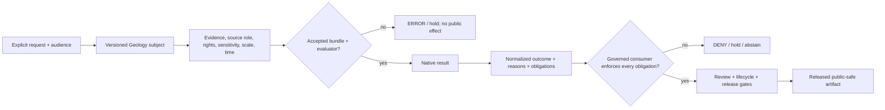

<!-- [KFM_META_BLOCK_V2]
doc_id: kfm://policy/domains/geology
title: Geology and Natural Resources Domain Policy Boundary
type: policy-readme; directory-readme; domain-policy-boundary; policy-index
version: v0.1
status: draft; repository-grounded; proposed-default-only-source; adjacent-bounded-fixture-profiles; evaluator-unbound; fail-closed-at-integration; non-release; non-publication; not-scientific-or-regulatory-authority
owners: "@bartytime4life — verified CODEOWNERS review route; Geology, Natural Resources, policy, source-role, rights, sensitivity, spatial, contract/schema, validator/test, runtime, release, security, and docs stewardship assignments NEEDS VERIFICATION"
created: 2026-05-08
updated: 2026-08-13
policy_label: repository-public; restricted-review; policy; geology; natural-resources; source-role-aware; resource-anti-collapse; rights-aware; sensitivity-aware; exact-location-aware; scale-aware; time-aware; fail-closed; release-gated; correction-aware; rollback-aware
current_path: policy/domains/geology/README.md
owning_root: policy/
responsibility: >
  Define the Geology and Natural Resources domain-policy boundary; inventory the complete local
  source posture; preserve observation, interpretation, model, regulatory, administrative,
  occurrence, deposit, estimate, production, extraction, reclamation, source-role, rights,
  sensitivity, precision, review, release, correction, and rollback distinctions; and identify the
  evidence required before any geology policy may be assembled, selected, evaluated, enforced, or
  used by a public surface.
truth_posture: >
  CONFIRMED accepted ADR-0029 placement authority, canonical singular policy root, complete
  sixteen-blob recursive Geology policy lane, ten default-only Rego scaffolds with no operative
  rule bodies or native Rego tests, one proposed placeholder policy JSON, three proposed
  placeholder rights YAML files, four bounded no-network adjacent Python validation profiles,
  thirty-eight valid-JSON Geology schemas of mixed maturity, seven comment-only pipeline modules,
  eleven inactive pipeline-spec placeholders, a three-job Geology workflow with proof and publish
  holds, inactive shared decision vocabularies, documentation-only bundle lane, and placeholder
  general policy runtime / PROPOSED reviewed Geology input profile, normalized decision mapping,
  local reason and obligation binding, immutable bundle identity, evaluator integration, governed
  consumer enforcement, decision receipts, correction propagation, and rollback drill /
  CONFLICTED allow-false versus deny-false local defaults, intent-bearing filenames versus empty
  rule bodies, split package namespaces, split validator roots, stale adjacent README inventories,
  older policy-path projections versus the current local sensitivity and release children, and
  validation-profile outcomes versus policy outcomes / UNKNOWN accepted Geology policy owner,
  source-specific rights terms, active bundle, evaluator, authenticated decision emitter,
  production consumer, required-check coupling, deployment binding, release integration, and
  public behavior.
evidence_snapshot:
  repository: bartytime4life/Kansas-Frontier-Matrix
  repository_id: "1059091169"
  visibility: public
  base_ref: main
  base_commit: 1cd3da895de521c70096f6d04b406c412b70f707
  complete_tree: 3698ce464862410821e82593b036e2202e26929b
  prior_blob: 30125b2c59563bbb1307295373f1b9013010ebe9
  policy_root_blob: 6c5021f9d92778581a4e9331a9dd6ddb7efc5e35
  policy_domains_parent_blob: ed9be975c9da2c7d77d94fab621db39f23953813
  geology_docs_readme_blob: 9f56f449a300f418f0debe2485f574744a1f0bc9
  geology_policy_intent_blob: a1e14edad44ea6e0a876a0243cabd19bf773c96e
  geology_sensitivity_blob: da38ee9e251e1dd30aabed732c0b70f1692f0111
  geology_source_role_matrix_blob: 1143c82a5de023424509aa13d8c0fe72e2437bd1
  geology_contracts_readme_blob: b7b74cf8f62edacd709785d50c27ec497c192c4a
  geology_schemas_readme_blob: beb2ee7a82ff77305f8259b554e9fe458349a123
  geology_fixtures_readme_blob: 04f35c86b9a14d88ae70e4cc906bae99391f2b37
  geology_tests_readme_blob: 843ce6f9f0cd005809e02c3ba25373000bc8e2d8
  geology_validators_readme_blob: ebfae810716f8ed8f9b52f85dfb864cb600d0951
  geology_pipeline_specs_readme_blob: c8428aedb58df307dda12095a35e8b61aed7f07b
  geology_pipelines_readme_blob: 92e81442203ad08a8b357ddde6a8b69093bc7cab
  geology_source_registry_readme_blob: 0bb2d794e3179186abfa371a3c99532f50d2c571
  domain_geology_workflow_blob: 74d6de5d27d7704957a89d025fdbbd2a7a01043e
  policy_test_workflow_blob: ac8f125e8a4d3634d86f66836d2aa2c0e3925e75
  decision_vocabulary_blob: ae68a9f3cf80308f18bd04207ef2c85057750f12
  reviewer_roles_blob: 01559907b2622606f35bb9a8ae5d0347e9b7e263
  policy_bundles_readme_blob: 0a13a9c9beddfa764d47e5dd6a2ea7ef91bf0d53
  policy_runtime_core_blob: e7e14cf39ae6919fbbc80f1b471de6b907292edb
  directory_rules_blob: fd49a0b83e55cef52c1124281f093e263526898d
  adr_0029_blob: b01322ef64f8c2b1ecb41de7ef4685b97cfa2a62
  codeowners_blob: dd2a84aa514d8ecd9208bc347f90f9a2ed37dd61
related:
  - ../README.md
  - ../../README.md
  - ../../../docs/domains/geology/README.md
  - ../../../docs/domains/geology/POLICY.md
  - ../../../docs/domains/geology/SENSITIVITY.md
  - ../../../docs/domains/geology/SOURCE_ROLE_MATRIX.md
  - ../../../docs/domains/geology/CANONICAL_PATHS.md
  - ../../../contracts/domains/geology/README.md
  - ../../../schemas/contracts/v1/domains/geology/README.md
  - ../../../fixtures/domains/geology/README.md
  - ../../../tests/domains/geology/README.md
  - ../../../tools/validators/domains/geology/README.md
  - ../../../tools/validators/geology/README.md
  - ../../../pipeline_specs/geology/README.md
  - ../../../pipelines/domains/geology/README.md
  - ../../../data/registry/sources/geology/README.md
  - ../../../data/proofs/geology/README.md
  - ../../../release/candidates/geology/README.md
  - ../../../contracts/policy/policy_input_bundle_profile_v1.md
  - ../../../contracts/policy/policy_decision_semantics_profile_v1.md
  - ../../decision/vocabulary.v1.json
  - ../../decision/reviewer_roles.v1.json
  - ../../bundles/README.md
  - ../../../packages/policy-runtime/README.md
  - ../../../.github/workflows/domain-geology.yml
  - ../../../.github/workflows/policy-test.yml
  - ../../../docs/doctrine/directory-rules.md
  - ../../../docs/adr/ADR-0029-adopt-directory-governance-standard-v2.md
  - ../../../docs/doctrine/ai-build-operating-contract.md
tags:
  - kfm
  - policy
  - geology
  - natural-resources
  - source-role
  - observation
  - interpretation
  - model
  - anti-collapse
  - resource-class
  - rights
  - sensitivity
  - public-safe-geometry
  - boreholes
  - well-logs
  - geochemistry
  - mineral-resources
  - finite-outcomes
  - release-gated
  - correction
  - rollback
notes:
  - "This revision changes only policy/domains/geology/README.md plus the required AI-generated provenance receipt."
  - "No Rego or YAML rule, policy value, numeric threshold, source term, bundle, evaluator, schema, contract, fixture, test, validator, workflow, source record, lifecycle object, proof, release artifact, deployment, or public behavior is created or changed."
  - "File presence, a proposed default, a passing bounded fixture workflow, and a generated receipt are not policy activation, approval, proof, release, or publication."
  - "Main advanced during authoring only through policy/domains/atmosphere/README.md; the Geology target and cited Geology evidence remained unchanged, and this snapshot was re-pinned before review."
  - "KFM is not an official geologic survey, regulator, mineral-property authority, reserve certifier, engineering authority, or emergency service."
[/KFM_META_BLOCK_V2] -->

<a id="top"></a>

# Geology and Natural Resources Policy Boundary

> **One-line purpose.** `policy/domains/geology/` is the proposed home for Geology-specific admissibility rules; it must keep evidence character, source role, resource claim class, rights, sensitivity, spatial precision, review, and release state intact without becoming geology truth, an evaluator, a release decision, or a public data source.

<p>
  
  
  
  
  
  
  
</p>

> [!IMPORTANT]
> **The lane exists; active Geology policy does not.** Ten Rego files contain package declarations and defaults only. The three rights YAML files and one policy JSON are explicit placeholders. No accepted bundle, selector, evaluator, native Geology Rego test, authenticated decision emitter, or governed consumer was verified.

> [!CAUTION]
> **Local defaults are not semantically uniform.** Eight scaffolds default `allow := false`; two intent-bearing files default `deny := false`. With no operative rule bodies or accepted normalization contract, none may be treated as a complete fail-closed policy.

> [!WARNING]
> **A green `domain-geology` workflow does not run these Rego files.** It proves four bounded, synthetic/no-network validation profiles and preserves explicit proof and release holds. It does not validate Geology truth, resolve rights, apply policy, promote data, approve release, deploy, or publish.

**Quick links:** [Purpose](#purpose) · [Authority](#authority-level) · [Status](#status-and-repository-evidence) · [Inventory](#current-policy-inventory) · [Belongs](#what-belongs-here) · [Exclusions](#what-does-not-belong-here) · [Spine](#geology-policy-spine) · [Inputs](#minimum-policy-input-contract) · [Decisions](#decision-vocabulary-and-normalization) · [Obligations](#reason-codes-and-obligations) · [Public surfaces](#public-surface-and-lifecycle-contract) · [Validation](#validation-tests-and-ci) · [Review](#review-burden-and-separation-of-duties) · [Rollback](#correction-supersession-and-rollback) · [Related](#related-folders) · [Conflicts](#conflict-register) · [Sequence](#smallest-sound-activation-sequence) · [Done](#definition-of-done) · [Open](#open-verification-register) · [Evidence](#evidence-ledger)

---

## Purpose

This lane should answer one bounded question:

> Given explicit Geology evidence and a requested operation, is that operation admissible for the stated audience, and which restrictions or obligations must a governed consumer enforce?

### In scope

- source-role sufficiency for observed, regulatory, modeled, aggregate, administrative, candidate, and synthetic material;
- preservation of observation, interpretation, model, compilation, and generated-output character;
- occurrence, deposit, estimate, extraction, production, permit, reclamation, and reserve anti-collapse;
- source rights, redistribution terms, attribution, and stale or unresolved terms;
- exact subsurface, well-log, sample, geochemistry, mineral/resource, extraction-site, and reconstruction-sensitive location exposure;
- public-safe geometry, attribute suppression, aggregation, audience, export, delay, review, and withholding requirements;
- evidence, lifecycle, review, release, correction, supersession, and rollback prerequisites; and
- finite, machine-consumable reasons and obligations after an accepted evaluator exists.

### Out of scope

- defining Geology object meaning or scientific conclusions;
- certifying reserves, economic viability, mineral rights, title, permits, regulatory compliance, engineering suitability, or public safety;
- source fetching, hidden evidence retrieval, data transformation, geometry generalization, lifecycle mutation, release approval, deployment, or publication;
- deciding canonical schema, contract, source-registry, validator, pipeline, or UI topology; and
- turning a map, model, cross-section, AI summary, validator result, commit, pull request, or workflow into evidence authority.

### Non-goals

This README does not activate a rule, choose a threshold, bless a source, resolve rights, assign a human steward, establish a bundle format, create an evaluator, authenticate a decision, or authorize a public endpoint.

[Back to top](#top)

---

## Authority level

Accepted [ADR-0029](../../../docs/adr/ADR-0029-adopt-directory-governance-standard-v2.md) adopts [Directory Rules v2](../../../docs/doctrine/directory-rules.md). Together with the [`policy/` root contract](../../README.md) and [`policy/domains/` boundary](../README.md), they place domain-specific policy source under `policy/domains/<lane>/`.

That placement is canonical. The present Geology source is still proposed and inactive.

| Boundary field | Current evidence |
|---|---|
| Canonical responsibility root | `policy/` — normative admissibility source and policy packaging |
| Domain segment | `policy/domains/geology/` — Geology-specific source and boundary documentation |
| Local owner | **NEEDS VERIFICATION.** CODEOWNERS routes `/policy/` to `@bartytime4life`; it does not assign Geology, rights, sensitivity, runtime, or release authority. |
| Local scope ID | `kfm://policy/domains/geology` identifies this README only; no accepted evaluator scope or bundle ID was found. |
| Current authority | Documentation and proposed source placement; no decision, transform, lifecycle, release, deployment, or publication authority |

### Responsibility split

| Concern | Owning surface | Role of this lane |
|---|---|---|
| Domain scope and doctrine | [`docs/domains/geology/`](../../../docs/domains/geology/README.md) | Consume reviewed meaning; do not redefine science. |
| Semantic object meaning | [`contracts/domains/geology/`](../../../contracts/domains/geology/README.md) | Reference accepted object and claim identities. |
| Machine shape | [`schemas/contracts/v1/domains/geology/`](../../../schemas/contracts/v1/domains/geology/README.md) | Require accepted shapes; do not host schemas. |
| Source admission | [`data/registry/sources/geology/`](../../../data/registry/sources/geology/README.md) | Evaluate explicit admitted references; do not admit sources. |
| Geology admissibility source | `policy/domains/geology/` | Own reviewed Geology-specific rules after acceptance. |
| Shared outcome semantics | [`policy/decision/`](../../decision/README.md) and policy contracts | Normalize through accepted shared vocabularies; do not fork them locally. |
| Bundle assembly and selection | [`policy/bundles/`](../../bundles/README.md) | Supply accepted source only; do not self-activate by path presence. |
| Evaluation mechanics | [`packages/policy-runtime/`](../../../packages/policy-runtime/README.md) or another accepted runtime | Remain evaluator-agnostic until accepted. |
| Validation | fixtures, tests, validators, and workflows | Prove bounded behavior; never become policy or approval. |
| Lifecycle and evidence | `data/`, receipts, proofs, and catalogs | Consume explicit references; never mutate them here. |
| Release and publication | [`release/`](../../../release/README.md) and governed consumers | Supply decision context; never approve, deploy, or publish. |

[Back to top](#top)

---

## Status and repository evidence

### Pinned snapshot

The complete, untruncated repository tree at `main@1cd3da895de5` contains 16,987 entries. The observations below are exact for that snapshot and do not imply current runtime or branch-protection state.

| Surface | Confirmed snapshot | Safe interpretation |
|---|---|---|
| Geology policy lane | 16 blobs: this README, 10 Rego, 1 JSON, 3 YAML, 1 empty marker | Real placement; proposed source only. |
| Rego semantics | 8 `allow := false`, 2 `deny := false`, 0 operative rule bodies | Default-only scaffolds; no coherent decision surface. |
| Local rights files | 3 proposed placeholder YAML files | Names are not accepted license or terms determinations. |
| Local policy data | 1 proposed placeholder JSON | No public-safe geometry rule data or threshold is implemented. |
| Native Geology Rego tests | 0 | Local Rego behavior is unproved. |
| Geology schemas | 38 valid JSON Schema files: 20 empty permissive, 15 generic three-field permissive, 3 substantive closed profiles | Mixed shape maturity; the schema-index README is stale. |
| Geology tests | 4 workflow-accepted substantive modules, 4 placeholder test modules, 1 empty initializer | Four bounded profiles; not general policy coverage. |
| Geology validators | 4 workflow-accepted substantive modules and 6 placeholders across two roots | Bounded validation with unresolved root split. |
| Geology pipeline modules | 7 one-line, comment-only Python placeholders | No executable Geology pipeline is established. |
| Geology pipeline specifications | 6 documentation-inventory placeholders plus 5 empty-stage YAML files | No active parser, consumer, scheduler, or source binding. |
| Geology source-registry lane | README plus empty marker | No live Geology source descriptor exists there. |
| Domain workflow | 3 jobs; validation runs four bounded profiles; proof and release-dry-run jobs preserve holds | Read-only readiness and fixture evidence only. |
| Policy bundle/runtime | Documentation-only bundle lane; `policy-runtime/core.py` is comment-only | No accepted Geology bundle, selector, or evaluator. |
| Geology proof/release lanes | Proof README plus marker; release-candidate README only | No proof payload or accepted release candidate. |

### Maturity boundary

The four adjacent substantive profiles are:

1. frozen synthetic resource-class/source-role anti-collapse;
2. one announcement-bound GMD 3 AEM campaign candidate with current state kept unknown;
3. metadata-only public-safe geometry assessment that leaves coherent candidates on `HOLD`; and
4. version-pinned production material-change assessment with `NO_CHANGE`, `REVIEW`, `HOLD`, or `ERROR` validation outcomes.

They do not evaluate the ten local Rego files. Their outcomes are profile results, not authenticated `PolicyDecision` values.

### Safe default

Until an accepted input profile, bundle, evaluator, normalization layer, consumer, receipt, and release binding exist, a caller must treat Geology policy as **unavailable**, not permissive. A missing or unverified evaluator context must not fall through to publication or export.

[Back to top](#top)

---

## Current policy inventory

```text
policy/domains/geology/
├── README.md
├── abstain_on_ambiguous.rego
├── borehole-rights.rego
├── deny_unpublished.rego
├── public-geometry.rego
├── public_safe_geometry.policy.json
├── release/
│   ├── public_safe_geometry.rego
│   └── source_role_anti_collapse.rego
├── resource-class-anti-collapse.rego
├── rights/
│   ├── kcc_terms.yaml
│   ├── kgs_terms.yaml
│   └── usgs_ngmdb_terms.yaml
├── sensitivity/
│   ├── borehole_exact_geometry.rego
│   ├── extraction_site_exposure.rego
│   └── well_log_disclosure.rego
└── sublanes/surficial/.gitkeep
```

### Rego source

| File | Current body | Result/default | Classification |
|---|---|---|---|
| [`abstain_on_ambiguous.rego`](./abstain_on_ambiguous.rego) | Comments and example only | `deny := false` | **PROPOSED / CONFLICTED** — name promises abstention; no abstain result exists. |
| [`borehole-rights.rego`](./borehole-rights.rego) | Package and default only | `allow := false` | **PROPOSED scaffold** |
| [`deny_unpublished.rego`](./deny_unpublished.rego) | Comments and example only | `deny := false` | **PROPOSED / CONFLICTED** — name promises denial; no denial rule exists. |
| [`public-geometry.rego`](./public-geometry.rego) | Package and default only | `allow := false` | **PROPOSED scaffold** |
| [`release/public_safe_geometry.rego`](./release/public_safe_geometry.rego) | Package and default only | `allow := false` | **PROPOSED scaffold** |
| [`release/source_role_anti_collapse.rego`](./release/source_role_anti_collapse.rego) | Package and default only | `allow := false` | **PROPOSED scaffold** |
| [`resource-class-anti-collapse.rego`](./resource-class-anti-collapse.rego) | Package and default only | `allow := false` | **PROPOSED scaffold** |
| [`sensitivity/borehole_exact_geometry.rego`](./sensitivity/borehole_exact_geometry.rego) | Package and default only | `allow := false` | **PROPOSED scaffold** |
| [`sensitivity/extraction_site_exposure.rego`](./sensitivity/extraction_site_exposure.rego) | Package and default only | `allow := false` | **PROPOSED scaffold** |
| [`sensitivity/well_log_disclosure.rego`](./sensitivity/well_log_disclosure.rego) | Package and default only | `allow := false` | **PROPOSED scaffold** |

Eight files use `kfm.generated.policy.domains.geology...` packages; the two deny-default stubs use `kfm.geology_...` packages. No accepted namespace, entrypoint, composition order, or native-to-outward normalization was found.

### Policy data and rights placeholders

| File | Current content | Safe interpretation |
|---|---|---|
| [`public_safe_geometry.policy.json`](./public_safe_geometry.policy.json) | Status, path, source-doc reference, placeholder note | Not a policy value, precision profile, transform instruction, or activation record. |
| [`rights/kcc_terms.yaml`](./rights/kcc_terms.yaml) | Proposed status and source-doc pointer | Does not establish KCC terms, rights, redistribution, or attribution. |
| [`rights/kgs_terms.yaml`](./rights/kgs_terms.yaml) | Proposed status and source-doc pointer | Does not establish KGS terms, rights, redistribution, or attribution. |
| [`rights/usgs_ngmdb_terms.yaml`](./rights/usgs_ngmdb_terms.yaml) | Proposed status and source-doc pointer | Does not establish USGS NGMDB terms, rights, redistribution, or attribution. |

### Activation prohibition

No consumer may glob this directory, choose every `.rego` file, infer entrypoints from filenames, or treat a default as an active rule. Activation requires an accepted manifest, exact source digests, evaluator compatibility, input contract, normalized outcome mapping, test coverage, approval, effective time, consumer allowlist, receipt plan, and rollback target.

[Back to top](#top)

---

## What belongs here

- this boundary README and reviewed Geology-specific declarative policy source;
- accepted rules for source-role sufficiency and observation/interpretation/model preservation;
- accepted rules preventing occurrence, deposit, estimate, production, permit, operation, and reserve collapse;
- accepted rights, sensitivity, public-safe precision, audience, export, delay, review, and release prerequisites;
- stable packages, entrypoints, reason codes, obligations, effective times, expiry, and supersession metadata after acceptance;
- references to paired contracts, schemas, fixtures, native tests, bundle membership, evaluator profiles, receipts, consumers, correction plans, and rollback targets; and
- documentation of current holds, conflicts, and verification gaps.

## What does not belong here

- Geology doctrine, scientific interpretation, map-unit definitions, contracts, or schemas;
- source descriptors, source payloads, credentials, rights agreements, or exact protected geometry;
- fixtures, Python validators, tests, pipeline code, lifecycle objects, catalogs, receipts, proofs, or release records;
- UI hiding, client-only generalization, map style, API serialization, or export code presented as policy;
- numeric thresholds copied from prose without adopted authority, units, provenance, effective time, and tests;
- generated or AI-authored rule bodies promoted without human review and native negative tests; or
- cross-domain rules forced into Geology merely because one input mentions geology.

[Back to top](#top)

---

## Geology policy spine

### Knowledge character must travel

Every candidate must retain how it is known. At minimum, the source-role matrix distinguishes:

| Role | Boundary |
|---|---|
| `observed` | Direct reading or first-hand record tied to place and time; not automatically a scientific interpretation. |
| `regulatory` | Determination or filing by a governing body; not an observed geologic event. |
| `modeled` | Derived from inputs and assumptions; uncertainty and model lineage remain visible. |
| `aggregate` | Summary over a unit; cannot be read back as a per-place or per-record observation. |
| `administrative` | Registration/accounting compilation; not field observation. |
| `candidate` | Awaiting validation; never public merely because it is well formed. |
| `synthetic` | Simulated, reconstructed, or AI-generated; never first-hand evidence. |

The source role is assigned at admission and must survive normalization, joins, policy evaluation, rendering, export, correction, and release.

### Anti-collapse rules

The following distinctions are mandatory even before executable policy exists:

- **observation is not interpretation**; a map polygon or formation pick is not the measurement that informed it;
- **interpretation is not model**; a cross-section, surface, inversion, or 3D representation carries authorship, assumptions, vintage, uncertainty, and a reality boundary;
- **GeologicUnit is not Lithology, GeologicAge, or StratigraphicInterval**; related descriptors must not silently become interchangeable identities;
- **BoreholeReference is not WellLogReference or CoreSample**; a location/reference does not prove a log curve, recovered material, or formation pick;
- **MineralOccurrence is not ResourceDeposit or ResourceEstimate**; presence, delineation, and modeled quantity are separate claim classes;
- **production, permit, administrative, extraction, and reclamation records are not physical-geology truth**; they may support bounded context only in their preserved source roles;
- **regulatory is not observed**, **aggregate is not per-place**, **modeled is not observed**, **candidate is not public**, and **synthetic is not evidence**; and
- **AI text is not evidence**; a governed answer must cite resolvable evidence and preserve limitations.

### Spatial, scale, depth, and time

A Geology policy input cannot be judged from coordinates alone. Review requires explicit:

- horizontal CRS and datum;
- vertical datum, depth reference, and units where applicable;
- source scale or resolution and the requested output scale;
- exact, generalized, aggregated, withheld, or absent geometry posture;
- observation time, valid time, source revision, publication time, and policy evaluation time;
- uncertainty and interpretation/model version; and
- whether a join makes the output more sensitive or more precise than either input.

Exact borehole, well-log, core, sample, geochemistry, mineral/resource, extraction-site, and private-property-linked geometry fails closed for public exposure until an accepted profile proves a public-safe derivative and its receipt, review, and release references.

### Cross-domain boundary

Hydrostratigraphy may link Geology to Hydrology; it does not let this lane own water measurements, aquifer operations, or hydrologic policy. Soil, Hazards, Archaeology, Habitat, Roads, Settlements, Agriculture, and People/Land remain separately governed. A cross-domain join inherits the strictest applicable obligation and may create a more sensitive output than either input.

### Official-authority boundary

KFM may organize evidence and explain released limitations. It must not present itself as the issuing survey, regulator, rights holder, reserve certifier, engineering authority, or emergency service. Governed public surfaces retain citations and direct users to the responsible official source when an authoritative determination matters.

[Back to top](#top)

---

## Minimum policy input contract

The shared [`PolicyInputBundle` explicit-context profile](../../../contracts/policy/policy_input_bundle_profile_v1.md) is `PROPOSED_INACTIVE`, fixture-only, and non-evaluator. It is a useful minimum candidate boundary, not an active contract.

### Shared input families

| Family | Minimum candidate context | Fail-closed condition |
|---|---|---|
| Request | Stable request/candidate ID, bounded operation, audience, purpose | Unknown or overbroad operation/audience |
| Subject | Object family, subject ID/version, domain, lifecycle phase | Ambiguous identity or phase |
| Evidence | Resolvable evidence references, citation state, freshness | Missing, unresolved, stale, or unsupported evidence |
| Source | Descriptor references, source roles, source-head/version | Unadmitted source or role collapse |
| Rights | License/terms posture, attribution, reuse/export permissions, review time | Unknown, expired, conflicting, or restricted terms |
| Sensitivity | Classification, geometry/attribute posture, join risk, requested precision | Unresolved classification or unsafe precision |
| Review | Required roles, reviewed candidate digest, decision time | Missing or mismatched review |
| Release | Candidate/release state, manifest reference where applicable, rollback reference | No accepted candidate, manifest, or rollback target |
| Evaluator | Bundle ID/version/digest, entrypoint, evaluator version, fail-closed mode | Missing, stale, untrusted, or inactive evaluator context |

### Geology-specific extension

An accepted Geology profile should additionally require:

- object family and claim class;
- knowledge character and source role;
- observation/interpretation/model lineage;
- CRS, horizontal datum, vertical datum, depth reference, units, scale, resolution, and uncertainty;
- source vintage, revision, observed time, valid time, and correction/supersession state;
- exact/internal geometry reference and proposed public derivative reference without embedding protected coordinates in policy logs;
- resource, extraction, production, permit, reclamation, or regulatory context as distinct references; and
- cross-domain joins with their inherited obligations.

### No hidden fetch

Policy evaluation must be deterministic over explicit, immutable references and normalized context. A rule or evaluator must not fetch live sources, infer missing rights, resolve identity from UI properties, query a private registry implicitly, or log protected payloads to fill a missing input.

[Back to top](#top)

---

## Decision vocabulary and normalization

### Candidate outward vocabulary

The shared [`vocabulary.v1.json`](../../decision/vocabulary.v1.json) and [`PolicyDecision` semantics profile](../../../contracts/policy/policy_decision_semantics_profile_v1.md) are `PROPOSED_INACTIVE`. They define candidate outward outcomes:

| Outcome | Candidate meaning |
|---|---|
| `ANSWER` | The bounded operation may proceed only after every attached obligation is enforced. |
| `ABSTAIN` | Evidence or source support is insufficient for the requested claim or operation. |
| `DENY` | Rights, consent, sensitivity, precision, or another policy boundary prohibits the operation. |
| `ERROR` | Input, bundle, evaluator, or decision context is incomplete or unverifiable. |

### Native result conflict

Local Rego currently exposes only boolean `allow` or `deny` defaults. Adjacent validation profiles expose `PASS`/`FAIL`, `HOLD`, `REVIEW`, `NO_CHANGE`, or `ERROR` for their own bounded purposes. These are not interchangeable vocabularies.

Before activation, an accepted normalization contract must define:

1. each native entrypoint and result shape;
2. deterministic precedence when multiple rules apply;
3. the outward outcome, reasons, and obligations;
4. how unknown, missing, stale, conflict, and evaluator failure remain distinct;
5. whether any conditional allow is represented as `ANSWER` with enforced obligations; and
6. how consumer enforcement and decision receipts prove the mapping.

No caller may translate `deny := false` to `ANSWER`, treat `allow := false` as an authenticated `DENY`, or convert a validator `HOLD` into policy authority by convention.

[Back to top](#top)

---

## Reason codes and obligations

### Shared candidate codes

The inactive shared registry contains nine reason codes and eight obligation codes. The most directly relevant Geology candidates include:

| Candidate reason | Geology use |
|---|---|
| `EVIDENCE_UNRESOLVED` | Required observations, interpretations, source heads, or citations do not resolve. |
| `EVIDENCE_STALE` | The evidence vintage is outside the admitted window for the operation. |
| `RIGHTS_UNKNOWN` | Reuse, redistribution, attribution, export, or public-display rights are unresolved. |
| `SENSITIVITY_UNRESOLVED` | Classification or public-safe transform posture is unresolved. |
| `PUBLIC_PRECISION_UNSAFE` | Requested geometry or attributes exceed approved public-safe precision. |
| `POLICY_INPUT_INCOMPLETE` | Explicit operation, audience, evidence, rights, sensitivity, review, release, or evaluator context is incomplete. |
| `POLICY_BUNDLE_UNAVAILABLE` | The selected bundle or evaluator cannot be authenticated or reproduced. |

| Candidate obligation | Geology use |
|---|---|
| `ATTACH_CITATIONS` | Carry resolvable evidence citations and source roles. |
| `ATTACH_RIGHTS_NOTICE` | Carry approved license, terms, attribution, or reuse notice. |
| `GENERALIZE_GEOMETRY` | Use the approved public-safe representation before exposure. |
| `REDACT_EXACT_LOCATION` | Remove exact coordinates and location-bearing attributes. |
| `WITHHOLD_EXPORT` | Permit only a bounded view while blocking download or bulk export. |
| `DELAY_PUBLICATION` | Enforce an accepted embargo or delayed-release condition. |
| `REQUIRE_STEWARD_REVIEW` | Bind review to the exact candidate version. |
| `VERIFY_ROLLBACK_TARGET` | Prove an executable rollback target before promotion or release. |

### Current local posture

No accepted Geology-specific reason registry, obligation registry, or reduction binding exists. README prose and `GEOLPOL-*` verification IDs below are documentation aids only; they are not runtime codes.

An obligation is not satisfied because it appears in a decision. The governed consumer must prove the transform, suppression, citation, notice, audience, export, delay, review, or rollback action before the operation proceeds.

[Back to top](#top)

---

## Public surface and lifecycle contract



### Non-bypass rules

- Public APIs, maps, exports, UI, and AI surfaces consume governed APIs and released public-safe artifacts; they do not read this directory or internal lifecycle stores directly.
- Hiding a layer, rounding a coordinate in the browser, omitting a field from a tooltip, or refusing an AI answer is not proof that the underlying artifact is public-safe.
- A public derivative requires explicit lineage to its restricted source, transform receipt, reviewed precision/attribute posture, policy decision, release record, correction path, and rollback target.
- Exact protected geometry and unnecessary personal, operator, parcel, credential, or restricted-source detail must not enter policy logs, decision reasons, telemetry, or public error messages.
- Policy is one prerequisite in `RAW -> WORK / QUARANTINE -> PROCESSED -> CATALOG / TRIPLETS -> PUBLISHED`; it is not the transition itself.

### Mutation and retention

This lane stores versioned policy source and documentation only. It does not mutate source records, evidence, candidates, catalog objects, triplets, published artifacts, or release records. Accepted policy versions, decision receipts, review records, transform receipts, and rollback targets require their own retention and access rules; those periods remain **NEEDS VERIFICATION**.

[Back to top](#top)

---

## Validation, tests, and CI

### Native policy validation

Current result: **not established for Geology**.

- No `_test.rego` file exists below `policy/domains/geology/`.
- [`policy-test.yml`](../../../.github/workflows/policy-test.yml) is a broad readiness hold; it does not evaluate these rules.
- The general policy runtime remains a placeholder.
- No accepted bundle manifest, selector, evaluator version, entrypoint registry, or decision receipt binds these sources.

### Bounded adjacent profiles

[`domain-geology.yml`](../../../.github/workflows/domain-geology.yml) defines these command-bearing checks:

```bash
python tests/domains/geology/test_source_role_anti_collapse.py --verbose
python tests/domains/geology/test_aem_campaign.py --verbose
python -m pytest -q -p no:cacheprovider tests/domains/geology/test_public_safe_geometry.py
python -m pytest -q -p no:cacheprovider tests/domains/geology/test_production_material_change.py
```

The workflow also executes the paired validators and validates the public-safe-geometry generated receipt. Its `build-proof-geology` and `publish-dry-run-geology` jobs intentionally fail closed if unreviewed proof or release implementations surface while preserving explicit readiness holds.

### What green means

A green workflow means the four declared synthetic/document-bounded profiles retained their exact polarity and the proof/release holds remained intact. It does **not** mean:

- the ten Geology Rego files parsed or executed;
- source rights, scientific validity, or current source state were resolved;
- occurrence, deposit, estimate, reserve, production, or permit status is officially correct;
- an exact geometry was transformed or made safe;
- an EvidenceBundle, ProofPack, PolicyDecision, or ReleaseManifest was created;
- a branch rule requires this workflow; or
- any API, map, export, deployment, release, or publication is authorized.

### Minimum future policy test matrix

An executable Geology bundle needs native positive, negative, malformed, missing-context, stale-evidence, rights-unknown, sensitivity-unknown, exact-location, unsafe-join, source-role-collapse, resource-class-collapse, obligation-enforcement, evaluator-failure, supersession, correction, replay, and rollback cases. Tests must pin input, bundle, evaluator, expected reasons/obligations, and decision bytes.

[Back to top](#top)

---

## Review burden and separation of duties

### Current route

[`CODEOWNERS`](../../../.github/CODEOWNERS) routes `/policy/` to `@bartytime4life`. That is a review-request route, not proof of expertise, approval, independent review, release authority, or policy activation.

The shared [`reviewer_roles.v1.json`](../../decision/reviewer_roles.v1.json) is `PROPOSED_INACTIVE` and assigns no people. Candidate roles include domain, evidence, policy, release, and security/privacy review.

### Review matrix

| Change | Minimum review concerns | Additional gate |
|---|---|---|
| README-only clarification | Docs, Geology domain, policy boundary | Repository facts and links verified |
| Rule body or policy data | Geology domain, policy semantics, evidence/source role | Native tests and bundle/entrypoint review |
| Rights or source terms | Source and rights expertise | Current upstream terms and effective date |
| Sensitivity or public precision | Geology, spatial, security/privacy | Reconstruction and export review |
| Resource-class or regulatory rule | Geology and Natural Resources expertise | Anti-collapse negative fixtures |
| Bundle/evaluator/normalization | Policy runtime, security, supply chain | Deterministic build, digest, replay, failure-mode review |
| Consumer, promotion, or release binding | Consumer owner and independent release reviewer | Exact artifact, obligations, receipt, rollback drill |

### Separation rules

- The author of a trust-bearing policy change should not be its sole approver.
- A domain reviewer cannot substitute for source-rights, sensitivity, runtime, security, or release review when those concerns change.
- Generated receipts prove provenance, not correctness or approval.
- CODEOWNERS, workflow presence, green checks, and a merged commit do not by themselves prove required-review or branch-protection enforcement.

[Back to top](#top)

---

## Correction, supersession, and rollback

### Policy change discipline

An accepted policy change must carry an immutable version/digest, effective time, superseded version, affected entrypoints and consumers, reevaluation scope, decision invalidation rules, correction/withdrawal path, cache invalidation plan, and tested rollback target.

Changing a rule does not silently rewrite prior decisions. Consumers must know which policy and evaluator produced each decision and whether that decision remains current after source, rights, sensitivity, evidence, policy, or release correction.

### README-only rollback

This revision changes documentation only. Before merge, close the draft PR and abandon the branch. After merge, revert the documentation commit through review; the prior README blob is:

```text
30125b2c59563bbb1307295373f1b9013010ebe9
```

Restoring that blob rolls back only this README. It cannot roll back any future bundle, evaluator, decision, lifecycle, release, deployment, or public state.

[Back to top](#top)

---

## Related folders

| Surface | Why it matters |
|---|---|
| [`docs/domains/geology/`](../../../docs/domains/geology/README.md) | Domain scope, object families, source roles, sensitivity intent, and open questions |
| [`contracts/domains/geology/`](../../../contracts/domains/geology/README.md) | Semantic object and claim boundaries |
| [`schemas/contracts/v1/domains/geology/`](../../../schemas/contracts/v1/domains/geology/README.md) | Machine shapes of mixed maturity |
| [`fixtures/domains/geology/`](../../../fixtures/domains/geology/README.md) | Synthetic public-safe fixture profiles |
| [`tests/domains/geology/`](../../../tests/domains/geology/README.md) | Bounded executable tests plus placeholders |
| [`tools/validators/domains/geology/`](../../../tools/validators/domains/geology/README.md) | Three substantive domain-root validators plus placeholders |
| [`tools/validators/geology/`](../../../tools/validators/geology/README.md) | Alternate validator root containing the substantive public-safe-geometry validator |
| [`pipeline_specs/geology/`](../../../pipeline_specs/geology/README.md) | Inactive declarative placeholders |
| [`pipelines/domains/geology/`](../../../pipelines/domains/geology/README.md) | Comment-only executable placeholders and pipeline boundary docs |
| [`data/registry/sources/geology/`](../../../data/registry/sources/geology/README.md) | Draft admission boundary with no live descriptors |
| [`data/proofs/geology/`](../../../data/proofs/geology/README.md) | Documentation-only proof hold |
| [`release/candidates/geology/`](../../../release/candidates/geology/README.md) | Documentation-only release-candidate hold |
| [`policy/decision/`](../../decision/README.md) | Shared inactive outcome, reason, obligation, and reviewer-role candidates |
| [`policy/bundles/`](../../bundles/README.md) | Documentation-led bundle boundary; no active Geology bundle |
| [`packages/policy-runtime/`](../../../packages/policy-runtime/README.md) | Placeholder general evaluator package |

[Back to top](#top)

---

## Conflict register

| ID | Conflict | Safe disposition |
|---|---|---|
| GEOLPOL-001 | `abstain_on_ambiguous.rego` and `deny_unpublished.rego` contain no named result and default `deny := false`. | Do not activate; define finite results and native negative tests first. |
| GEOLPOL-002 | Eight files use `kfm.generated...` packages while two use `kfm.geology_...`. | Adopt one reviewed namespace/entrypoint contract before bundling. |
| GEOLPOL-003 | `allow := false` and `deny := false` defaults coexist without precedence or normalization. | Do not infer an outward decision from either boolean. |
| GEOLPOL-004 | Older Geology docs project `policy/sensitivity/geology/` or `policy/release/geology/`; current files live under `policy/domains/geology/{sensitivity,release}/`. | Reconcile through accepted placement review; do not duplicate rule authority. |
| GEOLPOL-005 | The schema index says no concrete schemas were confirmed; the pinned tree contains 38, of which only 3 are substantive closed profiles. | Refresh the schema index separately; do not treat file count as maturity. |
| GEOLPOL-006 | Validator source is split between `tools/validators/domains/geology/` and `tools/validators/geology/`. | Resolve ownership and migration before declaring a canonical validator command. |
| GEOLPOL-007 | Adjacent README/header prose describes two or three bounded profiles; the current workflow executes four. | Treat the workflow definition as current command evidence and repair prose in a separate scoped change. |
| GEOLPOL-008 | Shared outward outcomes and local/native/profile outcomes differ. | Accept a lossless normalization contract before consumer binding. |
| GEOLPOL-009 | Rights YAML filenames imply source-specific terms but contain only placeholder metadata. | Verify current authoritative terms; never infer permission from the file name. |
| GEOLPOL-010 | No accepted Geology bundle, evaluator, consumer, decision receipt, proof producer, or release dry run exists. | Preserve the hold; activation requires dependency closure. |

[Back to top](#top)

---

## Smallest sound activation sequence

1. Resolve owners, reviewer identities, package namespace, entrypoints, and the local sensitivity/release placement conflict.
2. Accept one bounded operation and explicit Geology input profile with no hidden fetches.
3. Replace the relevant placeholder contract/schema/policy surfaces with reviewed, versioned semantics—without broadening unrelated files.
4. Implement one rule family with native Rego positive, negative, malformed, missing, stale, and evaluator-failure tests.
5. Define exact source digests, bundle manifest, evaluator version, normalized decision mapping, reasons, obligations, and replay record.
6. Bind one governed non-public consumer that enforces every obligation and emits authenticated decision receipts.
7. Prove correction, supersession, cache invalidation, and rollback with synthetic/public-safe fixtures.
8. Add independent review and release integration only after the bounded slice closes.
9. Consider a public surface only from released public-safe artifacts with citations, rights notices, and official-authority boundaries.

This sequence is intentionally narrow. Directory coverage, bulk rule generation, live source ingestion, UI work, or AI integration is not a substitute for closing the first governed slice.

[Back to top](#top)

---

## Definition of done

### This README revision

- [x] Replaces the greenfield scaffold at the same canonical path.
- [x] Applies the accepted Directory Rules boundary without creating a new root.
- [x] Inventories all 16 local blobs and all 10 Rego defaults exactly.
- [x] Separates proposed local source from four bounded adjacent validation profiles.
- [x] Records schema, pipeline, source-registry, proof, release, bundle, and runtime maturity without overclaiming.
- [x] Preserves source-role, resource-class, rights, sensitivity, precision, public-surface, correction, and rollback boundaries.
- [x] Uses repository-resolving links and stable conflict/open-verification IDs.
- [ ] Human review is complete.

### Active Geology policy

- [ ] Accepted owner, reviewers, package namespace, entrypoints, and placement decisions exist.
- [ ] Complete input and decision contracts, reason codes, obligations, and schemas are accepted.
- [ ] Native policy tests prove allow-like, deny, abstain, error, malformed, stale, conflict, and obligation behavior.
- [ ] An immutable bundle, selector, evaluator, normalization layer, and authenticated receipt are accepted.
- [ ] A governed consumer enforces obligations and denies bypass.
- [ ] Source rights, sensitivity, public-safe geometry, evidence, review, release, correction, and rollback close for one bounded slice.
- [ ] Hosted checks, required-review controls, and independent approval are verified.
- [ ] Deployment or publication occurs only through separately authorized release work.

[Back to top](#top)

---

## Open verification register

| ID | Question | Status |
|---|---|---:|
| GEOLPOL-V001 | Who owns Geology policy and who independently reviews source role, rights, sensitivity, runtime, and release? | **NEEDS VERIFICATION** |
| GEOLPOL-V002 | Which package namespace, entrypoints, and result shapes are canonical? | **CONFLICTED / NEEDS ADR** |
| GEOLPOL-V003 | Which current upstream rights and attribution terms apply to each KGS, KCC, USGS NGMDB, and future source descriptor? | **UNKNOWN** |
| GEOLPOL-V004 | Which Geology object, claim-role, scale, datum, time, and uncertainty vocabularies are accepted? | **NEEDS VERIFICATION** |
| GEOLPOL-V005 | Which public-safe geometry and attribute profiles are approved per object family and audience? | **UNKNOWN** |
| GEOLPOL-V006 | How are observation, interpretation, model, regulatory, administrative, aggregate, candidate, and synthetic roles normalized into policy input? | **PROPOSED / NEEDS VERIFICATION** |
| GEOLPOL-V007 | How are occurrence, deposit, estimate, reserve, production, permit, extraction, and reclamation distinctions tested across joins? | **PARTIAL / NEEDS VERIFICATION** |
| GEOLPOL-V008 | How are native booleans and profile outcomes mapped to `ANSWER`, `ABSTAIN`, `DENY`, or `ERROR` without loss? | **CONFLICTED / NEEDS ADR** |
| GEOLPOL-V009 | What bundle format, manifest, selector, evaluator version, integrity check, activation record, expiry, and rollback contract are accepted? | **UNKNOWN** |
| GEOLPOL-V010 | Which consumer is the first governed Geology policy integration, and how does it prove obligation enforcement? | **UNKNOWN** |
| GEOLPOL-V011 | Where are authenticated decision receipts retained, replayed, expired, corrected, and revoked? | **UNKNOWN** |
| GEOLPOL-V012 | How will the split validator roots and stale adjacent README inventories be reconciled without hiding history? | **NEEDS VERIFICATION** |
| GEOLPOL-V013 | Which Geology workflow checks are required by repository rules and which reviews must be independent? | **UNKNOWN / NEEDS VERIFICATION** |
| GEOLPOL-V014 | What rollback drill proves prior-policy restoration, stale-decision invalidation, consumer cache invalidation, and public correction? | **UNKNOWN** |

[Back to top](#top)

---

## Evidence ledger

| Claim | Evidence | Truth label |
|---|---|---:|
| Canonical policy placement | ADR-0029, Directory Rules, policy root, domain-policy parent | **CONFIRMED** |
| Complete local inventory and defaults | Untruncated pinned tree plus exact source bytes | **CONFIRMED** |
| No operative local rule bodies or native tests | Exact ten Rego files and recursive policy tree | **CONFIRMED** |
| Four bounded adjacent profiles | `domain-geology.yml`, accepted test/validator inventories, exact commands | **CONFIRMED bounded** |
| Mixed schema maturity | Exact 38 JSON files: 20 empty permissive, 15 generic permissive, 3 substantive closed | **CONFIRMED** |
| Pipeline/spec inactivity | Seven comment-only Python files; six inventory placeholders; five empty-stage YAML files | **CONFIRMED** |
| No live source descriptors, proof payload, or release candidate | Exact source/proof/release lane inventories and workflow holds | **CONFIRMED at snapshot** |
| Active bundle, evaluator, decision emitter, consumer, deployment, publication | No accepted binding established | **UNKNOWN / not proved** |
| Geology policy and specialist owners | CODEOWNERS route only | **NEEDS VERIFICATION** |

### No-loss reconciliation

| Prior scaffold element | v0.1 disposition |
|---|---|
| Purpose | **KEEP / REPAIR** — narrow from generic domain lane to Geology admissibility policy. |
| Authority level | **KEEP / CLARIFY** — canonical placement, proposed inactive source. |
| What belongs here | **REPAIR** — policy source only, not every domain artifact. |
| What does not belong here | **KEEP / ENRICH** — explicit responsibility-root exclusions. |
| Inputs and outputs | **REPAIR** — explicit candidate input and normalized-decision boundary. |
| Validation | **REPAIR** — distinguish zero native Rego tests from four adjacent bounded profiles. |
| Review burden | **KEEP / ENRICH** — CODEOWNERS route plus unassigned specialist review. |
| Related folders | **REPAIR** — exact repository-resolving navigation. |
| Proposed status | **KEEP / ENRICH** — complete maturity, conflict, and activation holds. |

### Reproducibility note

Counts and classifications in this README were recomputed from the complete pinned tree and exact file bytes. They are repository facts for the recorded snapshot, not policy, approval, current-run, branch-protection, deployment, release, or publication evidence.

[Back to top](#top)

---

## Changelog

| Version | Date | Change | Rollback |
|---|---|---|---|
| v0.1 | 2026-08-13 | Replaced the 828-byte greenfield scaffold with a repository-grounded Geology policy boundary, complete local inventory, maturity model, anti-collapse spine, validation limits, conflict register, activation sequence, and rollback contract. | Restore blob `30125b2c59563bbb1307295373f1b9013010ebe9` through reviewed Git history. |

## Status summary

`policy/domains/geology/` is the canonical Geology policy placement and contains meaningful design intent, but it is not an active policy system. Every local policy artifact is a proposed scaffold or placeholder; the only executable Geology evidence is four adjacent bounded validation profiles that deliberately stop short of policy, proof, release, and publication authority.

Until ownership, rights, namespaces, inputs, native tests, bundle identity, evaluator, normalization, consumers, receipts, independent review, correction, release, and rollback are accepted and observed, this lane remains **draft, evaluator-unbound, fail-closed at integration, non-release, and non-publication**.

<p align="right"><a href="#top">Back to top</a></p>
