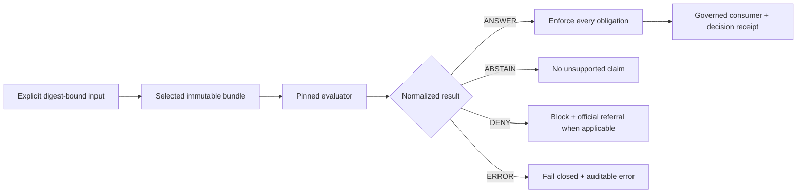

<!-- [KFM_META_BLOCK_V2]
doc_id: kfm://policy/domains/hazards
title: Hazards Domain Policy Boundary
type: policy-readme; directory-readme; domain-policy-boundary; policy-index
version: v0.1
status: draft; repository-grounded; proposed-default-only-source; adjacent-bounded-fixture-profiles; evaluator-unbound; fail-closed-at-integration; not-for-life-safety; non-release; non-publication; not-alert-or-regulatory-authority
owners: "@bartytime4life — verified CODEOWNERS review route; Hazards, emergency-management boundary, source-role, temporal, rights, sensitivity, spatial, contract/schema, validator/test, runtime, release, security, and docs stewardship assignments NEEDS VERIFICATION"
created: NEEDS VERIFICATION
updated: 2026-08-13
policy_label: repository-public; restricted-review; policy; hazards; not-for-life-safety; official-referral; source-role-aware; object-family-aware; time-aware; freshness-aware; rights-aware; sensitivity-aware; evidence-bound; fail-closed; release-gated; correction-aware; rollback-aware
current_path: policy/domains/hazards/README.md
owning_root: policy/
responsibility: >
  Define the Hazards domain-policy boundary; inventory the complete local policy-source posture;
  preserve event, observation, detection, model, regulatory context, administrative action,
  declaration, aggregate, candidate, synthetic, warning/advisory context, source-role, time,
  freshness, rights, sensitivity, evidence, official-referral, review, release, correction, and
  rollback distinctions; and identify the evidence required before any Hazards policy may be
  assembled, selected, evaluated, enforced, or used by a public surface.
truth_posture: >
  CONFIRMED accepted ADR-0029 placement authority, canonical singular policy root, complete
  ten-blob Hazards policy lane, seven default-only Rego scaffolds with no operative rule bodies or
  native Rego tests, one proposed referrals placeholder, one empty operational marker, five
  allow-false and two deny-false defaults, twenty-three valid-JSON Hazards schemas of mixed
  maturity, four substantive bounded validator profiles across two Hazards validator roots, two
  substantive root test modules plus one vacuous smoke module and ten placeholder root modules,
  additional bounded tests outside the root, seven comment-only pipeline modules, fourteen
  inactive pipeline-spec YAMLs, a three-job domain workflow with one USDM materiality validation
  job and explicit proof/release holds, six proposed release-manifest placeholders, no active
  candidate, proof payload, Hazards receipt payload, catalog record, rollback record, or published
  Hazards bytes / PROPOSED reviewed Hazards input profile, finite decision normalization, local
  reason and obligation binding, native rule tests, immutable bundle identity, evaluator
  integration, governed consumer enforcement, authenticated decision receipts, correction
  propagation, and rollback drill / CONFLICTED allow-false versus deny-false local defaults,
  intent-bearing filenames versus empty rule bodies, split package namespaces, split schema,
  registry, and validator homes, a duplicate NOAA Storm Events registry projection, stale adjacent
  inventories versus current executable profiles, canonical seven source roles versus older
  four-role template comments, and validation-profile outcomes versus policy outcomes / UNKNOWN
  accepted Hazards policy owner, authoritative source terms, active bundle, evaluator,
  authenticated decision emitter, production consumer, required-check coupling, deployment
  binding, release integration, and public behavior.
evidence_snapshot:
  repository: bartytime4life/Kansas-Frontier-Matrix
  repository_id: "1059091169"
  visibility: public
  base_ref: main
  base_commit: 299c8a81325689c68a38304ce7b14921342dcdd0
  complete_tree: 0db9f6b7974ddf1867c54f42f797a2919e6cf9f8
  complete_tree_entries: 16991
  prior_blob: 6118f23a6cd480494f92e8355cbfe61b19a0c25c
  hazards_policy_tree: fafb76a87563c382597fa1e3b48f0965e57626ae
  policy_root_blob: 6c5021f9d92778581a4e9331a9dd6ddb7efc5e35
  policy_domains_parent_blob: ed9be975c9da2c7d77d94fab621db39f23953813
  hazards_docs_readme_blob: 8aeff8396db3e38f71999a61c42fb94c39f2d579
  hazards_life_safety_blob: 62c06931cd832a1fbaf1d0e909bc80532bebca30
  hazards_source_role_blob: 412130e2fac611f39e05558daced8ba7fc1000cd
  hazards_publication_boundary_blob: 156504c6589f78aef013f0d37c82503f8b38a7d2
  hazards_contracts_readme_blob: 9e042fab5bfb1b6c9659aba030f072e0033e4e9b
  hazards_schemas_readme_blob: 2e8fa3c0cd987936d0bdd07024a41c78247d02a0
  hazards_fixtures_readme_blob: 133f34cb5e94a9e8faeae2cb148dc62b97863e64
  hazards_tests_readme_blob: 9cac0ce1a3699bfb88fd925b021575ae410e15ab
  hazards_domain_validators_readme_blob: 20b1f0851475cfc14aacdd3248f9ff1133595296
  hazards_broad_validators_readme_blob: c3b68e4750978fa3bc08f6617f3699a93f5663ad
  hazards_pipeline_specs_readme_blob: 22fc0f45780100d21ff0462ac2375b461cb5bb6a
  hazards_pipelines_readme_blob: cc016fb4d3c62ca6bf0a828eba3fbad86d22ee04
  hazards_source_registry_readme_blob: bed3a870b83afce8a461a152e782c7a1e1897be6
  hazards_proofs_readme_blob: e04728cd8a84c685925ef888cd76ceb56f7155e7
  hazards_release_candidates_readme_blob: 36f40b042d69b7d67a8421f358748c241a9654d8
  domain_hazards_workflow_blob: a77b7d7e926a375a1d8bc29a0d2609c0d619e068
  policy_test_workflow_blob: ac8f125e8a4d3634d86f66836d2aa2c0e3925e75
  decision_vocabulary_blob: ae68a9f3cf80308f18bd04207ef2c85057750f12
  reviewer_roles_blob: 01559907b2622606f35bb9a8ae5d0347e9b7e263
  policy_bundles_readme_blob: 0a13a9c9beddfa764d47e5dd6a2ea7ef91bf0d53
  policy_runtime_core_blob: e7e14cf39ae6919fbbc80f1b471de6b907292edb
  directory_rules_blob: fd49a0b83e55cef52c1124281f093e263526898d
  adr_0029_blob: b01322ef64f8c2b1ecb41de7ef4685b97cfa2a62
  codeowners_blob: dd2a84aa514d8ecd9208bc347f90f9a2ed37dd61
related:
  - ../README.md
  - ../../README.md
  - ../../../docs/domains/hazards/README.md
  - ../../../docs/domains/hazards/ARCHITECTURE.md
  - ../../../docs/domains/hazards/LIFE_SAFETY_BOUNDARY.md
  - ../../../docs/domains/hazards/SOURCE_ROLE_MATRIX.md
  - ../../../docs/domains/hazards/PUBLICATION_AND_BOUNDARY.md
  - ../../../docs/domains/hazards/DROUGHT_ANTI_COLLAPSE.md
  - ../../../docs/architecture/hazards-trust-membrane.md
  - ../../../contracts/domains/hazards/README.md
  - ../../../schemas/contracts/v1/domains/hazards/README.md
  - ../../../fixtures/domains/hazards/README.md
  - ../../../tests/domains/hazards/README.md
  - ../../../tools/validators/domains/hazards/README.md
  - ../../../tools/validators/hazards/README.md
  - ../../../pipeline_specs/hazards/README.md
  - ../../../pipelines/domains/hazards/README.md
  - ../../../data/registry/sources/hazards/README.md
  - ../../../data/registry/hazards/README.md
  - ../../../data/proofs/hazards/README.md
  - ../../../release/candidates/hazards/README.md
  - ../../../packages/domains/hazards/README.md
  - ../../../contracts/policy/policy_input_bundle_profile_v1.md
  - ../../../contracts/policy/policy_decision_semantics_profile_v1.md
  - ../../decision/vocabulary.v1.json
  - ../../decision/reviewer_roles.v1.json
  - ../../bundles/README.md
  - ../../../packages/policy-runtime/README.md
  - ../../../.github/workflows/domain-hazards.yml
  - ../../../.github/workflows/policy-test.yml
  - ../../../docs/doctrine/directory-rules.md
  - ../../../docs/adr/ADR-0029-adopt-directory-governance-standard-v2.md
tags:
  - kfm
  - policy
  - hazards
  - not-for-life-safety
  - official-referral
  - source-role
  - anti-collapse
  - time
  - freshness
  - expiry
  - rights
  - sensitivity
  - evidence
  - public-safe
  - fail-closed
  - release-gated
  - correction
  - rollback
[/KFM_META_BLOCK_V2] -->

<a id="top"></a>

# Hazards Domain Policy Boundary

> **Draft, repository-grounded, and inactive.** This directory is the canonical Hazards policy-source lane. It is not an emergency alert system, current-condition service, regulatory authority, policy bundle, evaluator, release decision, deployment, or public-safety approval.

| Signal | Repository-grounded posture |
|---|---|
| Policy source | **7 proposed default-only Rego files; 0 operative rule bodies** |
| Native policy tests | **0** |
| Adjacent bounded validation | **Established for selected synthetic profiles; not policy evaluation** |
| Proof and release | **Explicit holds; no active candidate or published payload** |
| Public/life-safety authority | **Denied** |
| Safe integration default | **Fail closed** |

## Purpose

`policy/domains/hazards/` owns Hazards-specific **admissibility and use constraints**. It should eventually answer whether an already-identified, evidence-bound Hazards operation may proceed, must abstain, must be denied, or failed to evaluate—and which obligations a governed consumer must enforce.

The lane protects analysis and planning uses of historical, observed, modeled, regulatory, administrative, aggregate, candidate, synthetic, and time-bounded operational context. Its most important invariant is negative: **KFM is never the issuer or interpreter of life-safety instructions.** A referral points to an official authority; it does not relay, paraphrase, or replace that authority's guidance.

### In scope

- Hazards policy entrypoint intent for focus answers, Evidence Drawer projections, freshness, layer manifests, and feature resolution.
- Denial of unpublished, unsupported, role-collapsed, stale, expired, overly precise, rights-unknown, sensitivity-unknown, or life-safety-framed operations.
- Abstention when evidence, time, issuer, source role, object family, release state, or evaluator context is unresolved.
- Preservation of source role, object family, knowledge character, spatial support, time kind, validity, expiry, correction, and release state.
- Official-source referral and not-for-life-safety obligations.
- Policy bundle, evaluator, consumer, receipt, review, correction, and rollback requirements.

### Out of scope

- Domain doctrine, architecture, terminology, or source-family research.
- Contract prose, JSON Schema, fixtures, tests, validators, packages, connectors, pipelines, registry records, lifecycle data, proof payloads, receipts, catalog objects, release candidates, release manifests, or published bytes.
- Live-source retrieval, source admission, hazard detection, event confirmation, forecasting, warning issuance, emergency notification, public routing, or deployment.
- Owning Hydrology, Atmosphere/Air, Geology, Soil, Agriculture, Infrastructure, Transportation, or other neighboring-domain truth.

### Non-goals

This lane must not make KFM:

- an emergency, alert, warning, watch, advisory, evacuation, shelter, rescue, routing, or incident-command authority;
- a verifier of current conditions or a substitute for NWS, FEMA, USGS, Kansas emergency-management, public-health, water-system, or local authority channels;
- an insurance, legal, regulatory, engineering, medical, or property-safety determination service;
- a mechanism for converting detections into confirmed events, models into observations, regulatory zones into observed impacts, or declarations into measurements; or
- a publication shortcut around evidence, rights, sensitivity, review, release, correction, and rollback.

[Back to top](#top)

---

## Authority level

The **directory placement is canonical** under accepted ADR-0029 and Directory Rules. The **contents are proposed and inactive**. Canonical placement does not activate rules, settle semantics, establish expertise, or authorize a consumer.

Authority is layered:

1. accepted repository governance and ADRs control placement and change process;
2. accepted Hazards doctrine and contracts control meaning;
3. accepted schemas control machine shape;
4. admitted sources, evidence, rights, sensitivity, review, and release records control a candidate's support;
5. an immutable selected policy bundle plus evaluator controls an actual policy result; and
6. a governed consumer must enforce every obligation and emit an authenticated receipt.

No lower layer may silently manufacture authority owned by a higher one. This README documents the boundary; it is not itself a bundle, decision, review, or release record.

### Responsibility split

| Responsibility | Canonical home | This lane's relationship |
|---|---|---|
| Hazards doctrine and life-safety boundary | [`docs/domains/hazards/`](../../../docs/domains/hazards/README.md) | Consume; do not redefine |
| Semantic objects | [`contracts/domains/hazards/`](../../../contracts/domains/hazards/README.md) | Require accepted references |
| Machine shapes | [`schemas/contracts/v1/domains/hazards/`](../../../schemas/contracts/v1/domains/hazards/README.md) | Validate inputs/results; do not own schemas |
| Source admission | [`data/registry/sources/hazards/`](../../../data/registry/sources/hazards/README.md) | Require admitted descriptors; do not fetch |
| Evidence and proof support | [`data/proofs/hazards/`](../../../data/proofs/hazards/README.md) | Require resolvable support; do not generate it |
| Policy source | `policy/domains/hazards/` | **Own here** |
| Bundle and evaluator | [`policy/bundles/`](../../bundles/README.md), [`packages/policy-runtime/`](../../../packages/policy-runtime/README.md) | Require accepted immutable binding |
| Candidate/release decision | [`release/candidates/hazards/`](../../../release/candidates/hazards/README.md), `release/` | Policy may constrain; cannot approve |
| Public carrier | Governed API and released public-safe artifacts | Consumer must enforce; no direct source access |

[Back to top](#top)

---

## Status and repository evidence

### Pinned snapshot

This revision was reconciled against `main@299c8a81325689c68a38304ce7b14921342dcdd0`, complete tree `0db9f6b7974ddf1867c54f42f797a2919e6cf9f8`, with 16,991 untruncated entries. Counts below are facts for that snapshot, not promises about later branches or deployments.

### Maturity boundary

| Surface | Confirmed inventory | Safe conclusion |
|---|---:|---|
| Direct policy lane | 10 blobs: README, 7 Rego, 1 YAML, 1 empty marker | Proposed source only |
| Rego logic | 5 `allow := false`; 2 `deny := false`; no operative bodies | No usable entrypoint or outward decision |
| Native Rego tests | 0 | Policy semantics unproved |
| Hazards schemas | 23 JSON Schemas: 2 empty permissive, 15 generic permissive, 6 substantive closed profiles | Mixed maturity; file count is not acceptance |
| Root Hazards tests | 13 test modules: 2 substantive, 1 vacuous smoke, 10 placeholder-only | Selected behavior only |
| Hazards validators | 4 substantive profiles across two roots; 4 `NotImplementedError` placeholders | Bounded checks, not a domain policy engine |
| Domain workflow | 3 jobs: USDM materiality validation, proof hold, release hold | One bounded validation slice; no proof/release |
| Pipelines | 7 comment-only Python modules | No executable domain pipeline |
| Pipeline specs | 9 documentation placeholders + 5 empty-stage YAMLs | Inactive inventory |
| Source registry | 1 subtype-first placeholder + 5 domain-first TBD templates; empty registers | No admitted active source established |
| Release manifests | 6 `PROPOSED` placeholder YAMLs | No release |
| Proof/candidate/receipt/catalog/rollback/published lanes | README and empty-marker posture | No operative payload established |
| Domain package | `0.0.0`, empty `__init__`, 3 comment-only modules | No domain runtime established |
| General policy runtime | Comment-only core module | No evaluator established |

### Safe default

Until native rules, bundle identity, evaluator behavior, normalization, obligations, consumers, receipts, independent review, and rollback are accepted and observed, integration must treat this lane as **unavailable** and fail closed. A filename, default, schema, fixture, validator, test, workflow, manifest, badge, merge, or green check is not policy activation.

[Back to top](#top)

---

## Current policy inventory

### Rego source

| File | Package | Exact executable content | Current posture |
|---|---|---|---|
| [`focus.rego`](focus.rego) | `kfm.generated.policy.domains.hazards.focus` | `default allow := false` | Proposed default-only scaffold |
| [`drawer.rego`](drawer.rego) | `kfm.generated.policy.domains.hazards.drawer` | `default allow := false` | Proposed default-only scaffold |
| [`freshness.rego`](freshness.rego) | `kfm.generated.policy.domains.hazards.freshness` | `default allow := false` | Proposed default-only scaffold |
| [`layer_manifest.rego`](layer_manifest.rego) | `kfm.generated.policy.domains.hazards.layer_manifest` | `default allow := false` | Proposed default-only scaffold |
| [`feature_resolver.rego`](feature_resolver.rego) | `kfm.generated.policy.domains.hazards.feature_resolver` | `default allow := false` | Proposed default-only scaffold |
| [`deny_unpublished.rego`](deny_unpublished.rego) | `kfm.hazards_deny_unpublished` | `default deny := false`; example body commented out | Filename/default conflict; inactive |
| [`abstain_on_ambiguous.rego`](abstain_on_ambiguous.rego) | `kfm.hazards_abstain_on_ambiguous` | `default deny := false`; example body commented out | Filename/default/result conflict; inactive |

There are no named operative rule bodies, imports, data lookups, reason codes, obligations, entrypoint registry, precedence rules, conflict resolution, bundle manifest, or `_test.rego` files in this lane.

### Policy data and structural placeholders

| Path | Exact content class | What it does not prove |
|---|---|---|
| [`referrals.yaml`](referrals.yaml) | `status: PROPOSED` documentation-inventory placeholder | Approved authorities, URLs, locale behavior, freshness, or runtime referral rendering |
| `operational/.gitkeep` | Empty directory marker | Operational policy, current-warning support, or alerting authority |

### Activation prohibition

Do not bundle or call these files as policy merely because their defaults look conservative. `allow := false` and `deny := false` are opposite boolean polarities, while the intended outward vocabulary is finite and richer than either boolean. Without an accepted namespace, entrypoint contract, precedence model, result schema, normalization layer, evaluator version, and tests, an adapter could turn a conservative-looking source into an unsafe result.

[Back to top](#top)

---

## What belongs here

- Reviewed Hazards-specific Rego or equivalent policy source.
- Small, versioned policy data that is genuinely policy-owned and carries provenance, effective time, and supersession state.
- Native policy tests colocated according to the repository's accepted policy-test convention.
- A directory index that records entrypoints, dependencies, bundle membership, result semantics, and activation state.
- Migration notes for namespace, entrypoint, and result-shape changes.

Every trust-bearing artifact must identify an owner, reviewer burden, input contract, finite result, reason and obligation vocabulary, version/digest, effective state, correction path, and rollback target.

## What does not belong here

- Human doctrine or architecture prose beyond this policy boundary index.
- Contracts, schemas, fixtures, validators, application/runtime code, connector code, pipeline code, or pipeline specifications.
- Source descriptors, credentials, raw/work/quarantine/processed data, evidence bundles, proof packs, receipts, catalog records, release candidates, manifests, or published artifacts.
- Official warning text copied as KFM guidance, emergency instructions, real-time notification logic, current-condition assertions, or authoritative regulatory determinations.
- Exact sensitive infrastructure, private-property, personal, health, credential, or restricted-source payloads.
- Duplicate policy authority under an alias or neighboring domain.

[Back to top](#top)

---

## Hazards policy spine

### Life-safety and official-authority boundary

The non-negotiable rule is:

> **KFM Hazards supports evidence-bound analysis and planning; it never issues, interprets, or replaces life-safety guidance.**

A request for protective action, evacuation, shelter, route safety, emergency response, or a current official determination must not be converted into a best-effort answer. The policy result should be `DENY` with a bounded obligation to refer the user to the relevant official authority. The referral is a pointer, not a relay: KFM must not paraphrase the authority's instructions as its own.

Operational warning, watch, and advisory material may be represented only as explicitly attributed, time-bounded context when an accepted product contract and released public carrier permit it. Expired context must never be rendered as current.

### Source-role anti-collapse

The repository's Hazards doctrine uses seven canonical source roles:

| Role | Hazards example | Forbidden promotion |
|---|---|---|
| `observed` | Instrument reading, direct detection, first-hand evidentiary record | Not regulatory or administrative truth |
| `regulatory` | NFHL-style legal/regulatory hazard context | Not an observed flood event |
| `modeled` | Smoke trajectory, modeled surface, derived magnitude | Not an observation |
| `aggregate` | Drought or frequency summary over a unit | Not per-place truth |
| `administrative` | Disaster declaration or proclamation | Not physical observation |
| `candidate` | Unverified or quarantined record | Not public verified truth |
| `synthetic` | Scenario, reconstruction, simulation, AI text | Never observed reality or primary evidence |

Operational context is an object/product posture with issuer and validity semantics; it is not permission to invent an eighth source role or bypass the seven-role contract. Promotion preserves role. A new authoritative determination requires a separately admitted source and governed transition; it is not a relabeling operation.

### Object-family anti-collapse

At minimum, policy must preserve these separations:

- `HazardEvent` is not `HazardObservation`, detection, forecast, warning, advisory, declaration, or regulatory area.
- A FIRMS/HMS-style detection is not a confirmed incident, perimeter, or protective-action signal.
- A model is not an observation, and uncertainty does not disappear at publication.
- A disaster declaration is an administrative/legal act, not proof that a physical event occurred at every mapped place.
- A regulatory flood zone is not observed inundation, a forecast, insurance advice, or parcel determination.
- An exposure/resilience rollup is a derived aggregate, not facility condition, person-level risk, or emergency priority.
- AI-generated prose is not evidence, issuer language, current-condition confirmation, or policy output.

### Drought separation

Physical drought severity and legal drought stage are separate object families with separate authorities and clocks. `DroughtObservation` may carry physical classifications such as USDM categories; `DroughtDeclaration` may carry a legal stage supported by its instrument. Neither may be derived from the other by convenience mapping, and unresolved legal instruments must not produce an asserted legal stage.

### Time, freshness, and correction

The following time kinds must remain explicit where applicable:

```text
event_time != observation_time != source_time != issue_time != valid_from
!= expiry_time != retrieval_time != processing_time != release_time
!= correction_time
```

Missing, malformed, contradictory, future-incoherent, stale, expired, rescinded, superseded, or correction-invalidating time evidence must yield a finite hold, abstention, denial, or error. A cache, map tile, search result, export, graph edge, screenshot, or AI summary cannot outlive the released state it represents.

### Rights, sensitivity, and reconstruction risk

Unknown storage, transformation, redistribution, attribution, export, or public-use rights block public promotion. The most restrictive applicable sensitivity posture travels across joins. Exact critical-infrastructure, facility, private-property, person, health, or emergency-operations detail must not be exposed merely because each source is individually public.

Policy must assess both direct fields and reconstruction risk across geometry, attributes, scale, time, neighboring-domain joins, search, graph, export, and repeated queries. Public-safe generalization or redaction is an obligation, not a suggestion.

### Cross-domain boundary

Hazards may reference neighboring-domain evidence without taking ownership:

- Hydrology owns gauges, hydrologic networks, and canonical water observations.
- Atmosphere/Air owns weather, smoke, air-quality, and atmospheric observations/models.
- Geology owns geologic and seismic context within its accepted boundary.
- Settlements/Infrastructure owns facilities, lifelines, and dependencies.
- Roads/Rail/Trade owns transportation state and network truth.
- Agriculture, Soil, Habitat, Flora, Fauna, Archaeology, and People/Land retain their own canonical objects and sensitivity burdens.

The Hazards policy receives released references and derived context; it does not copy or silently reinterpret those truths.

[Back to top](#top)

---

## Minimum policy input contract

No accepted Hazards policy input profile is currently bound. The following is a **candidate minimum**, not an active schema:

```text
request_id
operation
audience / consumer_id
subject_ref + subject_digest
object_family
knowledge_character
source_descriptor_refs[] + source_roles[]
evidence_refs[] + evidence_bundle_ref
rights_state + sensitivity_state
geometry_posture + scale + uncertainty
event/source/issue/valid/expiry/retrieval/release/correction times
official_issuer_ref + official_source_referral
life_safety_intent
review_state + release_state
policy_bundle_ref + evaluator_version
```

### Shared input families

[`policy_input_bundle_profile_v1.md`](../../../contracts/policy/policy_input_bundle_profile_v1.md) is the shared candidate boundary. Hazards should extend it without weakening explicit operation, audience, subject, evidence, rights, sensitivity, review, release, and evaluator context.

### Hazards-specific extension

Hazards input must make these conditions machine-visible:

- the exact requested operation: view, render, answer, export, join, promote, release, correct, or withdraw;
- whether the request concerns historical analysis, regulatory context, modeled context, current-sensitive operational context, or life-safety action;
- object family and source role for every material input;
- issuer, issue/validity/expiry/rescission state for operational or administrative context;
- neighboring-domain ownership and released-reference status;
- public geometry/attribute profile and reconstruction review;
- official-source referral contract; and
- correction, supersession, withdrawal, and rollback dependencies.

### No hidden fetch

Policy evaluation must be deterministic over explicit, digest-bound input and bundle data. It must not fetch live feeds, dereference unpinned URLs, infer current conditions, consult a model, geocode a sensitive location, or mutate lifecycle/release state during evaluation. Missing support is an abstention, denial, or error—not permission to retrieve or improvise.

[Back to top](#top)

---

## Decision vocabulary and normalization

The shared [`vocabulary.v1.json`](../../decision/vocabulary.v1.json) proposes `ANSWER`, `ABSTAIN`, `DENY`, and `ERROR`, but is explicitly `PROPOSED_INACTIVE`. Local validators also emit profile-bounded terms such as `PASS`, `FAIL`, `HOLD`, `PROMOTION_CANDIDATE`, `NON_EVENT`, `REVIEW_REQUIRED`, `STALE`, and `EXPIRED`. None is automatically a policy result.

### Candidate outward vocabulary

| Outcome | Candidate meaning | Hazards example |
|---|---|---|
| `ANSWER` | The exact bounded operation may proceed only with all obligations enforced | Render a released historical context layer with citations and caveats |
| `ABSTAIN` | Evidence or context is insufficient to answer safely | Current state or issuer validity unresolved |
| `DENY` | The operation crosses a prohibited boundary | Life-safety instruction, unreleased public exposure, unsafe precision |
| `ERROR` | The bundle, evaluator, input, integrity, or normalization failed | Missing evaluator version or unverifiable bundle digest |

For a request asking what action to take during a current hazard, the candidate result is `DENY` plus an official-referral obligation. It is never `ANSWER` with hedged protective advice.

### Native result conflict

| Source result | Why it cannot be exposed directly |
|---|---|
| `allow := false` | Does not distinguish deny, abstain, error, or missing obligation |
| `deny := false` | Could be misread as allow despite no affirmative authorization |
| Validator `PASS` | Proves only the bounded fixture/profile assertions |
| `PROMOTION_CANDIDATE` | Materiality classification; explicitly not promotion authorization |
| Workflow green | May include successful readiness holds |

An accepted normalization contract must preserve result source, entrypoint, bundle digest, evaluator version, reasons, obligations, and any conflict. Unknown or conflicting native results fail closed.



Every box after input remains **PROPOSED / UNBOUND** for Hazards.

[Back to top](#top)

---

## Reason codes and obligations

### Shared candidate codes

The inactive shared vocabulary defines reusable reasons including `EVIDENCE_STALE`, `EVIDENCE_UNRESOLVED`, `RIGHTS_UNKNOWN`, `SENSITIVITY_UNRESOLVED`, `PUBLIC_PRECISION_UNSAFE`, `POLICY_INPUT_INCOMPLETE`, and `POLICY_BUNDLE_UNAVAILABLE`. It proposes obligations including `ATTACH_CITATIONS`, `ATTACH_RIGHTS_NOTICE`, `GENERALIZE_GEOMETRY`, `REDACT_EXACT_LOCATION`, `REQUIRE_STEWARD_REVIEW`, `VERIFY_ROLLBACK_TARGET`, and `WITHHOLD_EXPORT`.

### Hazards-specific candidates

The following codes are design candidates only; they do not exist as accepted executable vocabulary:

| Candidate reason | Candidate outcome | Intended use |
|---|---:|---|
| `LIFE_SAFETY_INSTRUCTION_DENIED` | `DENY` | Protective-action or emergency-response request |
| `OFFICIAL_ISSUER_UNRESOLVED` | `ABSTAIN` | Warning/advisory/declaration issuer cannot be verified |
| `OPERATIONAL_CONTEXT_EXPIRED` | `DENY` | Expired context requested as current |
| `CURRENT_CONDITION_UNRESOLVED` | `ABSTAIN` | Evidence does not support a current-state claim |
| `SOURCE_ROLE_CONFLICT` | `DENY` | Roles collapse or disagree materially |
| `OBJECT_FAMILY_CONFLICT` | `DENY` | Observation/event/detection/model/declaration semantics collapse |
| `TEMPORAL_ROLE_CONFLICT` | `DENY` | Event, validity, expiry, retrieval, or release time is misused |
| `REGULATORY_AS_OBSERVED` | `DENY` | Regulatory area presented as observed impact |
| `DETECTION_AS_CONFIRMED_EVENT` | `DENY` | Remote detection presented as confirmed incident |
| `AGGREGATE_AS_PLACE_TRUTH` | `DENY` | Aggregate mapped to a single place/person/facility claim |
| `PUBLIC_CARRIER_UNRELEASED` | `DENY` | Internal candidate requested on a public surface |

Hazards-specific obligation candidates include `ATTACH_NOT_FOR_LIFE_SAFETY_NOTICE`, `ATTACH_OFFICIAL_SOURCE_REFERRAL`, `PRESERVE_SOURCE_ROLE`, `SURFACE_ISSUER_AND_VALIDITY`, `SURFACE_FRESHNESS_AND_EXPIRY`, `PRESERVE_UNCERTAINTY`, and `INVALIDATE_STALE_DERIVATIVES`. Exact wording, localization, destination allowlists, and enforcement points require review.

[Back to top](#top)

---

## Public surface and lifecycle contract

### Non-bypass rules

- Public API, map, search, graph, export, Evidence Drawer, Focus Mode, screenshot, and AI surfaces may consume only governed, released, public-safe carriers.
- No client may read RAW, WORK, QUARANTINE, internal source APIs, registry internals, fixtures, proof internals, candidate records, or policy source directly.
- A disclaimer without enforcement does not make an unsafe carrier safe.
- Every public Hazards projection must preserve object family, source role, issuer/authority, time/freshness/expiry, uncertainty, evidence citations, correction state, and release state where material.
- Exact protected geometry and unnecessary personal, property, facility, health, credential, or restricted-source detail must not enter decision reasons, logs, telemetry, public errors, or AI prompts.
- Policy is one prerequisite in `RAW -> WORK / QUARANTINE -> PROCESSED -> CATALOG / TRIPLET -> PUBLISHED`; it is not the transition, release, or publication itself.

### Mutation and retention

This lane stores versioned policy source and documentation only. Evaluation must not mutate sources, observations, candidates, evidence, catalogs, release state, public aliases, caches, or notifications. Accepted policy versions, bundle manifests, decision receipts, review records, correction links, and rollback targets require separate immutable retention rules; those periods remain **NEEDS VERIFICATION**.

[Back to top](#top)

---

## Validation, tests, and CI

### Native policy validation

Current result: **not established for Hazards**.

- No `_test.rego` file exists below `policy/domains/hazards/`.
- No local rule body consumes Hazards fields or emits reasons/obligations.
- [`policy-test.yml`](../../../.github/workflows/policy-test.yml) remains a broad policy-readiness surface, not evidence that these rules execute.
- No accepted Hazards bundle, selector, evaluator, entrypoint registry, normalized decision schema, or decision receipt binds these sources.

### Bounded adjacent profiles

The repository does contain meaningful, no-network Hazards validation. These profiles are important evidence, but none is a policy evaluator:

| Profile | Confirmed executable evidence | Boundary |
|---|---|---|
| USDM materiality | 6 unit tests; validator; 4 valid + 5 invalid synthetic cases; `make hazards-validate`; `domain-hazards` and briefing campaign wiring | Classifies materiality/hold/non-event; never authorizes promotion or publication |
| Drinking-water advisory | Closed schema; validator; 12 tests; fixture matrix; dedicated workflow; shared advisory checks | Candidate advisory semantics only; no current public-health or life-safety authority |
| NFHL/NLD/NID source-role | Closed schema; validator; 9 tests; fixture matrix; dedicated workflow | Preserves regulatory/inventory roles and public-safe geometry; no flood-event or infrastructure-condition truth |
| Drought observation/declaration | 3 closed schemas; deterministic validator; positive/negative fixtures; schema tests | Enforces physical-observation versus legal-declaration separation |
| KDHE HAB snapshot | Closed schema; 8 valid + 5 invalid fixtures; schema tests | Snapshot and stale/source-unavailable semantics; publication and alerting remain denied |
| Shared advisory mechanics | Shared contract/schema validator tests used by briefing/drinking-water workflows | Mechanical envelope support, not Hazards policy or issuer authority |

### Root test posture

The exact `tests/domains/hazards/` root contains:

- 2 substantive modules: `test_validate_usdm_materiality.py` and `test_drinking_water_advisory.py`;
- 1 vacuous smoke module whose only assertion is `assert True`;
- 10 modules containing only proposed placeholder docstrings; and
- 1 empty `__init__.py`.

Additional substantive NFHL/NLD/NID, drought, HAB, and shared-advisory tests live outside that root. A parent README or `pytest tests/domains/hazards` command therefore does not describe the complete executable picture.

### Validator posture

`tools/validators/domains/hazards/` contains 7 scripts: 3 substantive profiles (`USDM`, drinking-water advisory, NFHL/NLD/NID) and 4 greenfield `NotImplementedError` placeholders. `tools/validators/hazards/` contains the substantive drought-family validator plus a stale routing README and marker. The split roots and stale indexes must be reconciled before declaring a canonical Hazards validator command.

### Domain workflow

[`domain-hazards.yml`](../../../.github/workflows/domain-hazards.yml) has three jobs:

1. `validate-hazards` runs `make hazards-validate`, covering deterministic synthetic USDM materiality only.
2. `build-proof-hazards` verifies the documented no-proof posture and holds if a proof implementation appears without governed wiring.
3. `publish-dry-run-hazards` verifies the no-candidate/no-command posture and preserves a release hold.

The workflow forbids network access and explicitly disclaims source admission, current-condition validation, policy evaluation, proof construction, lifecycle promotion, release, deployment, and publication.

### What green means

A green Hazards workflow may mean a bounded fixture profile passed or an explicit readiness hold remained intact. It does **not** mean:

- current conditions, warning validity, issuer status, legal status, public-health status, or source freshness were verified;
- the seven Rego files parsed or executed;
- an EvidenceBundle, ProofPack, PolicyDecision, ReleaseManifest, or published artifact was produced;
- source rights, sensitivity, reconstruction risk, independent review, or branch protection closed;
- a public API, map, export, search, graph, AI answer, deployment, release, or notification is authorized; or
- KFM is safe for emergency use.

### Minimum future policy test matrix

An executable Hazards policy bundle needs native positive, negative, malformed, missing-context, stale, expired, rescinded, superseded, rights-unknown, sensitivity-unknown, unsafe-precision, unsafe-join, source-role-collapse, object-family-collapse, time-role-collapse, issuer-unresolved, life-safety-instruction, official-referral, obligation-enforcement, evaluator-failure, replay, correction, withdrawal, and rollback tests. Tests must pin exact input, bundle, evaluator, expected reasons/obligations, and decision bytes.

[Back to top](#top)

---

## Threat model and failure behavior

| Failure | Required posture |
|---|---|
| KFM framed as alert/issuer or asked for protective action | `DENY`; official referral; no paraphrased advice |
| Current-sensitive support missing, stale, expired, rescinded, or contradictory | `ABSTAIN` or `DENY`; never silently reuse cached state |
| Source role or object family collapses | `DENY`; preserve both records and conflict evidence |
| Rights or sensitivity unresolved | `DENY` public use; quarantine/review as applicable |
| Public precision or cross-lane join unsafe | `DENY` or require reviewed generalization/redaction |
| Evidence unresolved | `ABSTAIN`; no plausible completion |
| Bundle/evaluator unavailable or digest mismatch | `ERROR`; fail closed |
| Obligation cannot be enforced by consumer | Block the operation; do not downgrade the obligation |
| Candidate, fixture, workflow, or manifest placeholder mistaken for release | `DENY`; require immutable released artifact and review record |
| Decision or carrier superseded/corrected | Invalidate dependent caches/derivatives; preserve lineage |

Telemetry and public errors must expose stable public-safe codes, not sensitive input values, restricted geometry, internal policy data, credentials, stack traces, or unreviewed official-message text.

[Back to top](#top)

---

## Review burden and separation of duties

### Current route

[`CODEOWNERS`](../../../.github/CODEOWNERS) routes `/policy/` to `@bartytime4life`. That is a review-request route, not proof of Hazards expertise, emergency-management authority, approval, independent review, release authority, or activation.

The shared [`reviewer_roles.v1.json`](../../decision/reviewer_roles.v1.json) is `PROPOSED_INACTIVE` and assigns no people. Candidate roles include domain, evidence, policy, release, and security/privacy review.

### Review matrix

| Change | Minimum review concerns | Additional gate |
|---|---|---|
| README-only clarification | Docs, Hazards domain, policy boundary | Repository facts and links verified |
| Rule body or policy data | Hazards meaning, policy semantics, evidence/source role | Native tests and bundle/entrypoint review |
| Life-safety/referral behavior | Hazards, safety boundary, official-source routing, legal/security review | Absolute denial cases and approved referral destinations |
| Time/freshness/expiry | Domain, source, temporal semantics | Stale/expired/rescinded negative fixtures |
| Rights or source terms | Source and rights expertise | Current authoritative terms and effective date |
| Sensitivity/public precision | Hazards, spatial, security/privacy | Reconstruction and export review |
| Cross-domain join | Every owning domain plus policy/sensitivity | Most-restrictive posture and no-authority-transfer tests |
| Bundle/evaluator/normalization | Policy runtime, security, supply chain | Deterministic build, digest, replay, failure-mode review |
| Consumer/promotion/release | Consumer owner and independent release reviewer | Exact artifact, obligations, receipt, correction, rollback drill |

### Separation rules

- The author of a trust-bearing policy change should not be its sole approver.
- Domain review cannot substitute for emergency-boundary, source-rights, temporal, sensitivity, runtime, security, or release review when those concerns change.
- An official source is authoritative for its own product; KFM reviewers cannot convert that into KFM authority.
- Generated receipts prove provenance, not correctness or approval.
- CODEOWNERS, workflow presence, green checks, placeholder manifests, and a merged commit do not by themselves prove required review, activation, release, or branch-protection enforcement.

[Back to top](#top)

---

## Correction, supersession, and rollback

### Policy change discipline

An accepted policy change must carry an immutable version/digest, effective time, superseded version, affected entrypoints and consumers, reevaluation scope, decision invalidation rules, referral-list impact, correction/withdrawal path, cache invalidation plan, and tested rollback target.

Changing policy does not silently rewrite earlier source records or decisions. Consumers must know which source, evidence, policy bundle, evaluator, and release produced each carrier and whether it remains current after issuer, time, rights, sensitivity, evidence, policy, correction, withdrawal, or release change.

Six files under `release/manifests/` use Hazards release-like names but contain only `PROPOSED` placeholder metadata. They are not rollback targets, accepted manifests, or evidence of any release.

### README-only rollback

This revision changes documentation only. Before merge, close the draft PR and abandon the branch. After merge, revert the documentation commit through review; the prior README blob is:

```text
6118f23a6cd480494f92e8355cbfe61b19a0c25c
```

Restoring that blob rolls back only this README. It cannot roll back any future rule bundle, evaluator, decision, source admission, lifecycle transition, release, deployment, alert referral, cache, or public state.

[Back to top](#top)

---

## Related folders

| Surface | Why it matters |
|---|---|
| [`docs/domains/hazards/`](../../../docs/domains/hazards/README.md) | Mission, object families, life-safety boundary, source roles, time, publication, and open questions |
| [`docs/architecture/hazards-trust-membrane.md`](../../../docs/architecture/hazards-trust-membrane.md) | Cross-surface trust and public-boundary architecture |
| [`contracts/domains/hazards/`](../../../contracts/domains/hazards/README.md) | Semantic object and candidate-profile boundaries |
| [`schemas/contracts/v1/domains/hazards/`](../../../schemas/contracts/v1/domains/hazards/README.md) | Machine shapes of mixed maturity |
| [`fixtures/domains/hazards/`](../../../fixtures/domains/hazards/README.md) | Synthetic profiles and documentation-only fixture lanes |
| [`tests/domains/hazards/`](../../../tests/domains/hazards/README.md) | Two substantive root profiles, one vacuous smoke test, and placeholders |
| [`tools/validators/domains/hazards/`](../../../tools/validators/domains/hazards/README.md) | Three substantive domain-root validators plus placeholders |
| [`tools/validators/hazards/`](../../../tools/validators/hazards/README.md) | Alternate root containing the substantive drought-family validator |
| [`pipeline_specs/hazards/`](../../../pipeline_specs/hazards/README.md) | Fourteen inactive declarative placeholders/empty-stage specs |
| [`pipelines/domains/hazards/`](../../../pipelines/domains/hazards/README.md) | Seven comment-only pipeline modules and boundary documentation |
| [`data/registry/sources/hazards/`](../../../data/registry/sources/hazards/README.md) | Subtype-first registry lane with one placeholder descriptor |
| [`data/registry/hazards/`](../../../data/registry/hazards/README.md) | Conflicting domain-first registry lane with TBD templates and empty registers |
| [`data/proofs/hazards/`](../../../data/proofs/hazards/README.md) | Documentation-only proof hold |
| [`data/receipts/hazards/`](../../../data/receipts/hazards/README.md) | Documentation-only domain receipt lane |
| [`data/rollback/hazards/`](../../../data/rollback/hazards/README.md) | Documentation-only rollback-support lane |
| [`catalog/domain/hazards/`](../../../catalog/domain/hazards/README.md) | Documentation-only catalog projection |
| [`data/catalog/domain/hazards/`](../../../data/catalog/domain/hazards/README.md) | Documentation-only lifecycle catalog lane |
| [`data/published/hazards/`](../../../data/published/hazards/README.md) | No published payload bytes established |
| [`data/published/layers/hazards/`](../../../data/published/layers/hazards/README.md) | README/marker-only flood-event and NFHL layer lanes |
| [`release/candidates/hazards/`](../../../release/candidates/hazards/README.md) | No active candidate established |
| [`packages/domains/hazards/`](../../../packages/domains/hazards/README.md) | `0.0.0` placeholder domain package |
| [`policy/decision/`](../../decision/README.md) | Shared inactive outcome, reason, obligation, and reviewer-role candidates |
| [`policy/bundles/`](../../bundles/README.md) | Documentation-led bundle boundary; no Hazards bundle |
| [`packages/policy-runtime/`](../../../packages/policy-runtime/README.md) | Placeholder general evaluator package |
| [`domain-hazards.yml`](../../../.github/workflows/domain-hazards.yml) | One bounded validation job plus proof/release holds |

[Back to top](#top)

---

## Conflict register

| ID | Conflict | Safe disposition |
|---|---|---|
| HAZPOL-001 | Five files default `allow := false`; two intent-bearing files default `deny := false`. | Do not infer an outward decision; adopt finite results and precedence first. |
| HAZPOL-002 | Five Rego files use `kfm.generated...`; two use `kfm.hazards_...`. | Accept one namespace and entrypoint contract before bundling. |
| HAZPOL-003 | Filenames imply focus/drawer/freshness/referral/deny/abstain behavior, but no operative body implements it. | Treat all direct policy behavior as unimplemented. |
| HAZPOL-004 | Canonical seven-role doctrine conflicts with older four-role comments in domain-first source templates. | Use no descriptor as active until roles are reconciled and reviewed. |
| HAZPOL-005 | Source registry is split between subtype-first and domain-first homes, including duplicate NOAA Storm Events projections. | Select one canonical record; use migration pointers, not divergent authority. |
| HAZPOL-006 | Schema docs describe unresolved homes and stale inventory; exact tree has 23 schemas across permissive and substantive classes. | Resolve placement and pairing; do not equate count with acceptance. |
| HAZPOL-007 | Validator logic is split across `tools/validators/domains/hazards/` and `tools/validators/hazards/`; both READMEs understate current executables. | Choose a canonical routing contract and refresh indexes separately. |
| HAZPOL-008 | Root test README says executables need verification; exact tree has two substantive root profiles, one vacuous smoke test, ten placeholders, plus external tests. | Report exact module class; do not claim whole-domain coverage. |
| HAZPOL-009 | Pipeline-spec README inventories nine source profiles; exact tree has those nine plus five empty-stage specs. | Treat all 14 as inactive and repair the index separately. |
| HAZPOL-010 | Several adjacent READMEs describe `domain-hazards` as TODO/hold-only; current workflow executes USDM materiality. | Treat workflow bytes as current command evidence and preserve proof/release holds. |
| HAZPOL-011 | Six release-like manifest names exist, but each is a short `PROPOSED` placeholder. | Do not mint aliases, candidates, rollback targets, or release claims from them. |
| HAZPOL-012 | Bounded validators emit profile outcomes that differ from proposed policy outcomes. | Accept a lossless normalization contract before consumer binding. |
| HAZPOL-013 | Drought physical observation and legal declaration are related but non-derivable families. | Keep schemas, evidence, clocks, authorities, and joins separate. |
| HAZPOL-014 | Strong life-safety/referral doctrine exists, but direct policy source does not enforce it. | Preserve non-public, fail-closed posture until native rules and consumer tests exist. |
| HAZPOL-015 | No active Hazards bundle, evaluator, decision emitter, proof producer, candidate, released payload, or governed policy consumer is established. | Preserve the hold; activation requires dependency closure. |

[Back to top](#top)

---

## Smallest sound activation sequence

1. Resolve owners, independent reviewers, package namespace, entrypoints, source-role vocabulary, and canonical schema/registry/validator homes.
2. Choose one bounded, non-life-safety operation and one released or synthetic/public-safe carrier; do not start with live alerting.
3. Accept an explicit Hazards input profile and finite decision/reason/obligation contract with no hidden fetches.
4. Implement one rule family with native positive, negative, malformed, stale, expired, role-collapse, life-safety, referral, and evaluator-failure tests.
5. Build an immutable bundle manifest with exact source digests, entrypoints, evaluator version, normalization mapping, effective state, and rollback target.
6. Bind one governed non-public consumer that enforces every obligation and emits authenticated decision receipts.
7. Prove evidence closure, rights, sensitivity, public-safe representation, correction, withdrawal, cache invalidation, and rollback using synthetic fixtures.
8. Add independent review and bounded release integration only after the slice closes.
9. Consider a public surface only from released public-safe artifacts with visible issuer, time, role, evidence, correction, and official-authority boundaries.
10. Keep emergency instruction, alert issuance, and current operational authority outside KFM permanently.

Directory coverage, bulk rule generation, live-source ingestion, UI work, or AI integration is not a substitute for closing the first governed slice.

[Back to top](#top)

---

## Definition of done

### This README revision

- [x] Replaces the greenfield scaffold at the same canonical path.
- [x] Applies accepted Directory Rules without creating a new root or alias.
- [x] Inventories all 10 local policy blobs and all 7 Rego defaults exactly.
- [x] Separates inactive policy source from bounded adjacent executable profiles.
- [x] Reconciles schema, test, validator, workflow, pipeline/spec, registry, package, proof, candidate, release, and published maturity without overclaiming.
- [x] Preserves life-safety, official-referral, source-role, object-family, time, rights, sensitivity, evidence, public-surface, correction, and rollback boundaries.
- [x] Records conflicts and uses repository-resolving links.
- [ ] Human review is complete.

### Active Hazards policy

- [ ] Accepted owner, independent reviewers, namespace, entrypoints, and responsibility-home decisions exist.
- [ ] Complete input and decision contracts, reason codes, obligations, referral rules, and schemas are accepted.
- [ ] Native policy tests prove allow-like, deny, abstain, error, malformed, stale, expired, role-collapse, unsafe-join, life-safety, and obligation behavior.
- [ ] An immutable bundle, selector, evaluator, normalization layer, and authenticated receipt are accepted.
- [ ] A governed consumer enforces obligations and denies bypass.
- [ ] Evidence, rights, sensitivity, time, official-source referral, release, correction, withdrawal, and rollback close for one bounded slice.
- [ ] Hosted checks, required-review controls, and independent approval are verified.
- [ ] Deployment or publication occurs only through separately authorized release work.

[Back to top](#top)

---

## Open verification register

| ID | Question | Status |
|---|---|---:|
| HAZPOL-V001 | Who owns Hazards policy and who independently reviews safety boundary, source role, time, rights, sensitivity, runtime, and release? | **NEEDS VERIFICATION** |
| HAZPOL-V002 | Which package namespace, entrypoints, precedence rules, and result shapes are canonical? | **CONFLICTED / NEEDS ADR** |
| HAZPOL-V003 | Which canonical schema, source-registry, and validator homes survive migration? | **CONFLICTED / NEEDS ADR** |
| HAZPOL-V004 | Which official-source referral destinations, allowlists, locales, update rules, and failure behavior are accepted? | **UNKNOWN** |
| HAZPOL-V005 | Which Hazards object-family and knowledge-character vocabularies are accepted machine contracts? | **PARTIAL / NEEDS VERIFICATION** |
| HAZPOL-V006 | How are warning/advisory context, issuer authority, validity, expiry, rescission, and historical retention normalized? | **PROPOSED / NEEDS VERIFICATION** |
| HAZPOL-V007 | Which public-safe geometry, attribute, export, search, and graph profiles are approved per object family and audience? | **UNKNOWN** |
| HAZPOL-V008 | How are local booleans and bounded profile outcomes mapped to `ANSWER`, `ABSTAIN`, `DENY`, or `ERROR` without loss? | **CONFLICTED / NEEDS ADR** |
| HAZPOL-V009 | Which current upstream rights, attribution, issuer, and reuse terms apply to every Hazards source? | **UNKNOWN** |
| HAZPOL-V010 | What bundle format, selector, evaluator version, integrity check, activation record, expiry, and rollback contract are accepted? | **UNKNOWN** |
| HAZPOL-V011 | Which consumer is the first governed Hazards policy integration, and how does it prove referral/obligation enforcement? | **UNKNOWN** |
| HAZPOL-V012 | Where are authenticated decision receipts retained, replayed, expired, corrected, withdrawn, and revoked? | **UNKNOWN** |
| HAZPOL-V013 | Which bounded Hazards checks are required by repository rules, and which reviews must be independent? | **UNKNOWN / NEEDS VERIFICATION** |
| HAZPOL-V014 | How are neighboring-domain releases and the most-restrictive policy propagated through joins? | **NEEDS VERIFICATION** |
| HAZPOL-V015 | What rollback drill proves prior-policy restoration, stale-decision invalidation, cache/public-alias invalidation, and correction propagation? | **UNKNOWN** |
| HAZPOL-V016 | Which stale adjacent indexes will be repaired without hiding their historical evidence boundary? | **NEEDS VERIFICATION** |

[Back to top](#top)

---

## Evidence ledger

| Claim | Evidence | Truth label |
|---|---|---:|
| Canonical policy placement | ADR-0029, Directory Rules, policy root, domain-policy parent | **CONFIRMED** |
| Complete local inventory and defaults | Untruncated pinned tree plus exact source bytes | **CONFIRMED** |
| No operative local rule bodies or native Rego tests | Exact 7 Rego files and recursive policy tree | **CONFIRMED** |
| Life-safety and official-referral boundary | Hazards README, life-safety doc, publication boundary, trust-membrane note | **CONFIRMED doctrine / implementation partial** |
| Source-role and drought anti-collapse | Source-role matrix, drought doc, contracts/schemas/fixtures/tests | **CONFIRMED doctrine; bounded executable profiles** |
| Mixed schema maturity | Exact 23 JSON files: 2 empty permissive, 15 generic permissive, 6 substantive closed | **CONFIRMED** |
| Mixed test/validator maturity | Exact tree and exact Python bytes across both Hazards roots | **CONFIRMED** |
| One bounded domain workflow slice | Current `domain-hazards.yml` commands and fixture paths | **CONFIRMED bounded** |
| Pipeline/spec inactivity | 7 comment-only Python files; 9 inventory placeholders; 5 empty-stage YAMLs | **CONFIRMED** |
| No accepted source activation | Placeholder/TBD descriptors and empty registers | **CONFIRMED at snapshot** |
| No proof, candidate, receipt, catalog, rollback, or published payload | Exact lane inventories and workflow holds | **CONFIRMED at snapshot** |
| Active bundle, evaluator, decision emitter, consumer, deployment, publication | No accepted binding established | **UNKNOWN / not proved** |
| Hazards policy and specialist owners | CODEOWNERS route only | **NEEDS VERIFICATION** |

### No-loss reconciliation

| Prior scaffold element | v0.1 disposition |
|---|---|
| Purpose | **KEEP / REPAIR** — narrow from generic domain lane to Hazards admissibility policy. |
| Authority level | **KEEP / CLARIFY** — canonical placement, proposed inactive source. |
| What belongs here | **REPAIR** — policy source only, not every domain artifact. |
| What does not belong here | **KEEP / ENRICH** — explicit responsibility-root and safety exclusions. |
| Inputs and outputs | **REPAIR** — explicit candidate input and finite normalized-decision boundary. |
| Validation | **REPAIR** — distinguish zero native Rego tests from bounded adjacent profiles. |
| Review burden | **KEEP / ENRICH** — CODEOWNERS route plus unassigned specialist review. |
| Related folders | **REPAIR** — exact repository-resolving navigation. |
| Proposed status | **KEEP / ENRICH** — complete maturity, conflict, safety, proof, and activation holds. |

### Reproducibility note

Counts and classifications in this README were recomputed from the complete pinned tree and exact file bytes. They are repository facts for the recorded snapshot, not policy, approval, current-condition, issuer, branch-protection, deployment, release, notification, or publication evidence.

[Back to top](#top)

---

## Changelog

| Version | Date | Change | Rollback |
|---|---|---|---|
| v0.1 | 2026-08-13 | Replaced the 828-byte greenfield scaffold with a repository-grounded Hazards policy boundary, complete local inventory, safety/anti-collapse spine, mixed-maturity validation map, conflict register, activation sequence, and rollback contract. | Restore blob `6118f23a6cd480494f92e8355cbfe61b19a0c25c` through reviewed Git history. |

## Status summary

`policy/domains/hazards/` is the canonical Hazards policy placement and sits beside strong doctrine plus several bounded executable fixture profiles. It is not an active policy system. Every local policy artifact is a default-only scaffold, placeholder, or empty marker; no native policy tests, bundle, evaluator, normalized result, governed consumer, decision receipt, proof payload, active candidate, or released Hazards payload closes the trust chain.

Until ownership, namespaces, inputs, native tests, bundle identity, evaluator, normalization, referral obligations, consumers, receipts, independent review, correction, release, and rollback are accepted and observed, this lane remains **draft, evaluator-unbound, fail-closed at integration, not-for-life-safety, non-release, and non-publication**.

<p align="right"><a href="#top">Back to top</a></p>
