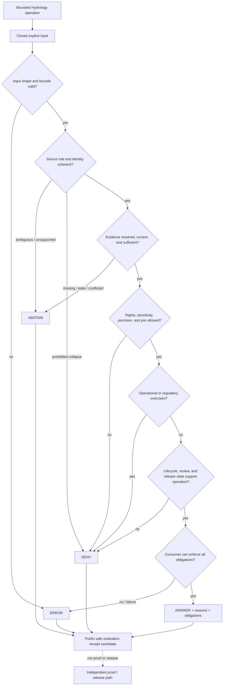

<!-- [KFM_META_BLOCK_V2]
doc_id: kfm://policy/domains/hydrology
title: Hydrology Domain Policy README
type: readme
classification: directory-readme; domain-policy-boundary; hydrology; policy-index
version: v0.1
status: draft; repository-grounded; mixed-maturity; direct-policy-scaffolds; evaluator-unbound; proof-held; non-release; non-publication
owners: "@bartytime4life — verified CODEOWNERS review route; Hydrology, source, identity, measurement, rights, sensitivity, evidence, policy, contract/schema, validator/test, runtime, release, security, correction/rollback, and docs stewardship assignments NEEDS VERIFICATION"
created: 2026-05-08
updated: 2026-08-13
supersedes_version: unversioned greenfield scaffold
policy_label: public; policy; hydrology; source-role; freshness; public-safe; finite-outcomes; no-life-safety-authority; no-public-authority
current_path: policy/domains/hydrology/README.md
owning_root: policy/
responsibility: "Hydrology-specific policy boundary and repository index for source-role separation, identity, time, units, sensitivity, evidence, finite decisions, obligations, composition, review, public-surface constraints, validation, activation, correction, and rollback without creating hydrologic truth, regulatory or warning authority, runtime enforcement, release, or publication."
base_commit: 299c8a81325689c68a38304ce7b14921342dcdd0
base_tree: 0db9f6b7974ddf1867c54f42f797a2919e6cf9f8
prior_blob: 6d4a011079d647b58a44ad70e15ee4a980d00896
lane_tree: 5cd905c18ac2ae71dae054ca0ad00ecf02ab85eb
truth_posture: "CONFIRMED canonical policy-root placement, CODEOWNERS routing, complete eight-source direct Rego inventory, six allow-default-false scaffolds, two deny-default-false stubs, no native Hydrology Rego tests, 34 direct semantic contracts, 40 mixed-maturity schemas, 101 JSON fixtures, eight substantive and six placeholder direct domain tests, five schema wrappers, five semantic validators, two dedicated validator subtrees, three validator placeholders, seven workflow-executed bounded domain families, multiple dedicated no-network candidate and watcher profiles, one fixture-first pipeline implementation, empty proof/receipt/candidate/public payload lanes, empty policy-gate register, placeholder Explorer feature modules, and explicit proof/release holds / PROPOSED bounded Hydrology policy architecture, inputs, normalization, obligations, public-surface contract, native test matrix, and reversible implementation sequence / CONFLICTED allow-versus-deny result polarity, generated-versus-short package namespaces, local workflow outcomes versus outward outcomes, duplicated registry topology, stale adjacent indexes, and first-proof intent versus held proof implementation / UNKNOWN accepted bundle, evaluator, decision emitter, obligation handlers, production consumers, required-check coupling, deployment enforcement, proof graduation, release behavior, and public behavior / NEEDS VERIFICATION functional owners, policy values, source authority, freshness windows, datum and unit profiles, sensitivity transforms, evaluator compatibility, negative policy tests, correction propagation, withdrawal, and rollback drills."
related:
  - ../README.md
  - ../../README.md
  - ../../../docs/domains/hydrology/README.md
  - ../../../docs/domains/hydrology/SOURCE_ROLE_MATRIX.md
  - ../../../docs/domains/hydrology/PUBLICATION_POSTURE.md
  - ../../../docs/domains/hydrology/THIN_SLICE.md
  - ../../../contracts/domains/hydrology/README.md
  - ../../../schemas/contracts/v1/domains/hydrology/README.md
  - ../../../fixtures/domains/hydrology/README.md
  - ../../../tests/domains/hydrology/README.md
  - ../../../tools/validators/domains/hydrology/README.md
  - ../../../pipeline_specs/hydrology/README.md
  - ../../../pipelines/domains/hydrology/README.md
  - ../../../data/registry/hydrology/README.md
  - ../../../data/registry/sources/hydrology/README.md
  - ../../../data/proofs/hydrology/README.md
  - ../../../data/receipts/hydrology/README.md
  - ../../../data/published/hydrology/README.md
  - ../../../release/candidates/hydrology/README.md
  - ../../joins/habitat-hydrology/README.md
  - ../../bundles/README.md
  - ../../decision/vocabulary.v1.json
  - ../../../contracts/policy/policy_input_bundle_profile_v1.md
  - ../../../contracts/policy/policy_decision_vocabulary.md
  - ../../../packages/policy-runtime/README.md
  - ../../../docs/adr/ADR-0009-hydrology-is-the-first-proof-bearing-lane.md
  - ../../../docs/adr/ADR-0026-hydrology-source-spine-starts-with-wbd-huc12.md
  - ../../../docs/adr/ADR-0029-adopt-directory-governance-standard-v2.md
  - ../../../docs/doctrine/directory-rules.md
  - ../../../control_plane/domain_lane_register.yaml
  - ../../../control_plane/cross_domain_seam_register.yaml
  - ../../../control_plane/policy_gate_register.yaml
  - ../../../.github/CODEOWNERS
  - ../../../.github/workflows/domain-hydrology.yml
tags:
  - kfm
  - policy
  - hydrology
  - source-role
  - nfhl-anti-collapse
  - evidence
  - freshness
  - identity
  - units
  - datum
  - sensitivity
  - public-safe
  - finite-outcomes
  - no-network
  - proof-held
  - release-gated
  - correction
  - rollback
notes:
  - "This revision changes only policy/domains/hydrology/README.md plus the required AI-generated provenance receipt."
  - "No Rego rule, policy value, source descriptor, bundle, evaluator, contract, schema, fixture, validator, test, workflow, pipeline, review record, receipt instance, proof, release artifact, data object, deployment, or public behavior is created or changed."
  - "File presence is not policy activation; a green fixture-profile or watcher check is not Hydrology policy enforcement, proof-bearing graduation, release, warning, or publication."
  - "NFHL regulatory context is not observed flooding; modeled or derived hydrology is not an observation; a candidate is not a released fact; KFM is not an emergency, navigation, engineering, insurance, or regulatory authority."
  - "CODEOWNERS routes review but does not assign Hydrology, source, scientific, regulatory, policy, rights, sensitivity, proof, release, or independent-approval authority."
  - "Main advanced during preparation through unrelated topology, generated-receipt, People alias, and legacy geoprivacy changes; the target blob and cited Hydrology surfaces remained byte-identical before this final repin."
[/KFM_META_BLOCK_V2] -->

<a id="top"></a>

# Hydrology Domain Policy

> **One-line purpose.** Govern Hydrology-specific source admission, identity, freshness, sensitivity, render, answer, export, promotion, and release-adjacent decisions while keeping observation, model, regulation, candidate state, evidence, review, receipt, proof, release, and public serving explicitly separate.

<p>
  
  
  
  
  
  
  
  
</p>

> [!IMPORTANT]
> **This lane becomes executable policy only when an exact rule set, input contract, bundle identity, evaluator, decision normalization, obligation handlers, tests, consumer binding, and review state are accepted together.** Today it contains a repository-grounded boundary plus proposed Rego scaffolds. The repository's substantive Hydrology validators exercise bounded candidate and fixture profiles, not these rules.

> [!CAUTION]
> **The current Rego surfaces cannot be safely composed by filename.** Six modules expose only `default allow := false`; two expose `default deny := false` and have no active deny rules. The first shape denies only when a caller queries `allow`. The second denies nothing if a caller treats an empty `deny` set as permission. No accepted caller contract selects, composes, or normalizes either result model.

> [!WARNING]
> **Hydrology context is not operational authority.** FEMA NFHL material is regulatory context, not an observed flood. Gauge data may be provisional or stale. A modeled hydrograph is not a measurement. KFM must not present any Hydrology artifact as an emergency alert, evacuation instruction, navigation aid, engineering conclusion, insurance determination, permit decision, or official regulatory interpretation.

**Quick links:** [Purpose](#purpose) · [Authority](#authority-level) · [Status](#status-and-repository-evidence) · [Belongs](#what-belongs-here) · [Does not](#what-does-not-belong-here) · [Default](#default-posture) · [Families](#policy-family-map) · [Inputs](#minimum-policy-input-contract) · [Decisions](#decision-vocabulary-and-normalization) · [Obligations](#obligation-families) · [Inventory](#confirmed-policy-inventory) · [Invariants](#hydrology-policy-invariants) · [Flow](#hydrology-policy-flow) · [Composition](#cross-lane-composition) · [Public surfaces](#public-surface-contract) · [Validation](#validation-tests-and-ci) · [Review](#review-burden-and-separation-of-duties) · [Related](#related-folders) · [Conflicts](#adrs-and-conflict-register) · [Sequence](#smallest-sound-implementation-sequence) · [Done](#definition-of-done) · [Open](#open-verification-register) · [Rollback](#maintenance-correction-and-rollback)

---

## Purpose

`policy/domains/hydrology/` is the Hydrology segment under KFM's canonical singular `policy/` responsibility root.

Its durable question is:

> Given a fully declared Hydrology operation and governed context, what bounded action is permitted, refused, held, or left unanswered—and which obligations must every downstream system preserve without manufacturing hydrologic, regulatory, or life-safety authority?

A complete implementation should decide only after it knows:

1. the exact operation, object version, feature identity, spatial extent, time interval, and audience;
2. whether the material is observed, regulatory, modeled, aggregate, administrative, candidate, or synthetic;
3. source identity, source role, rights, terms, acquisition state, and immutable source snapshot;
4. evidence references, resolution state, freshness, uncertainty, qualifiers, and claim support;
5. HUC, reach, gauge, well, aquifer-context, crosswalk, geometry, and version identity;
6. parameter code, unit, datum, timezone, provisional status, quality flags, and no-data semantics;
7. sensitivity, infrastructure, private-property, owner-identity, public-precision, and join posture;
8. lifecycle, validation, review, transform, release, correction, withdrawal, and rollback state;
9. the exact policy source, bundle digest, evaluator profile, and normalization contract in use; and
10. whether the consumer can enforce every obligation before materialization.

### In scope

- source admission, role, rights, and allowed-claim decisions;
- HUC, reach, waterbody, gauge, observation, well, aquifer-context, and crosswalk identity prerequisites;
- observation-versus-model-versus-regulation anti-collapse;
- freshness, time-window, provisional-data, parameter, unit, datum, qualifier, and uncertainty requirements;
- public render, search, export, graph, API, map, tile, screenshot, embedding, and governed-AI answer gates;
- sensitivity, precision, aggregation, redaction, withholding, and audience obligations;
- lifecycle promotion and release-adjacent prerequisites;
- finite outward outcomes, public-safe reason codes, and enforceable obligations;
- policy replay, correction, withdrawal, supersession, and rollback requirements; and
- deterministic, synthetic, no-network native policy tests after semantics are accepted.

### Out of scope

- defining Hydrology object meaning or asserting that an observation, model, zone, or boundary is true;
- defining JSON Schema shapes;
- fetching, normalizing, interpreting, or storing source and lifecycle data;
- creating source authority, evidence, review, receipt, proof, release, or publication records;
- choosing scientific, regulatory, sensitivity, or freshness thresholds without accepted authority;
- serving maps, APIs, exports, search, graphs, alerts, or AI responses;
- issuing flood, drought, water-quality, navigation, engineering, insurance, permit, or emergency advice; and
- storing credentials, private well-owner data, restricted infrastructure detail, or other sensitive payloads.

[Back to top](#top)

---

## Authority level

**Canonical policy responsibility after acceptance / non-authoritative for every adjacent concern.**

Accepted Directory Rules place policy rules and bundles under `policy/`. That placement assigns responsibility; it does not activate a file or prove that a rule is correct, accepted, tested, selected, or enforced.

| Concern | Authority home | This lane's role |
|---|---|---|
| Hydrology policy source | Accepted sources under `policy/` | May own reviewed domain-specific decision logic after acceptance. |
| Hydrology doctrine and intent | [`docs/domains/hydrology/`](../../../docs/domains/hydrology/README.md) | Implements cited intent; does not silently convert doctrine or proposals into runtime policy. |
| Object meaning | [`contracts/domains/hydrology/`](../../../contracts/domains/hydrology/README.md) | Consumes semantic meaning; does not redefine it. |
| Machine shape | [`schemas/contracts/v1/domains/hydrology/`](../../../schemas/contracts/v1/domains/hydrology/README.md) | Consumes accepted schemas; policy is not shape authority. |
| Source identity and role | Accepted source registries and SourceDescriptor records | Evaluates supplied facts; does not invent source authority. |
| Measurements and models | Governed observations, model records, and receipts | Preserves role, time, units, datum, qualifiers, uncertainty, and lineage. |
| Evidence and uncertainty | EvidenceRef/EvidenceBundle and proof lanes | Requires support; cannot create evidence or proof closure. |
| Validation | `tools/validators/` and `tests/` | Is checked there; a pass does not authorize policy, proof, or release. |
| Policy packaging | [`policy/bundles/`](../../bundles/README.md) | A future accepted bundle may bind exact rules and dependencies; none is established for Hydrology. |
| Policy execution | Accepted evaluator/runtime | Executes an exact accepted bundle; the current general runtime is unbound. |
| Receipts and proofs | `data/receipts/` and `data/proofs/` | May require references; stores no instances here. |
| Release, correction, withdrawal, rollback | [`release/`](../../../release/README.md) | Receives policy state; remains separate release authority. |
| Public API, UI, map, export, search, graph, AI | Governed applications and released carriers | Must preserve outcomes and obligations; cannot choose policy ad hoc. |
| CI | `.github/workflows/` | Orchestrates checks; green fixture checks and explicit holds are not production enforcement. |
| GitHub review routing | [`.github/CODEOWNERS`](../../../.github/CODEOWNERS) | Routes `/policy/` to `@bartytime4life`; does not assign functional or independent authority. |

### Governing order

When policy sources appear to disagree, stop promotion and resolve the conflict in this order:

1. KFM core invariants and accepted operating law.
2. Accepted ADRs that explicitly change responsibility or policy.
3. Accepted domain, source, scientific, regulatory, rights, sensitivity, and review authority.
4. Accepted semantic contracts and machine profiles.
5. Accepted policy bundle and evaluator binding.
6. Documentation, proposals, scaffolds, fixtures, and planning material.

The most restrictive applicable source, role, rights, sensitivity, audience, join, lifecycle, and release posture wins until an authorized decision closes ambiguity.

[Back to top](#top)

---

## Status and repository evidence

### Current evidence verdict

| Surface | Status | Safe conclusion |
|---|---:|---|
| Direct lane | **CONFIRMED** | One README and eight Rego sources are present. |
| Direct Rego sources | **CONFIRMED PROPOSED SCAFFOLDS** | Six expose only `default allow := false`; two expose `default deny := false` with commented examples. |
| Hydrology-native Rego tests | **NOT ESTABLISHED** | No direct native Rego test file or accepted Hydrology policy fixture evaluator was found. |
| Hydrology policy bundle | **NOT ESTABLISHED** | No accepted manifest, lock, selector, digest, activation record, or packaged Hydrology bundle was found. |
| Policy-gate register | **EMPTY / PROPOSED** | `control_plane/policy_gate_register.yaml` contains no entries. |
| General policy runtime | **UNBOUND / PLACEHOLDER** | The `0.0.0` package boundary exists, but no functional general evaluator or Hydrology consumer binding is established. |
| Domain doctrine | **SUBSTANTIVE / MIXED AUTHORITY** | Rich lane, source-role, publication, and thin-slice documentation exists; proposal text is not executable policy acceptance. |
| Direct domain contracts | **34 FILES / DRAFT** | A broad semantic surface exists; contract presence is not implementation or acceptance. |
| Domain schemas | **40 / MIXED** | Thirteen closed substantive profiles, three shared aliases, twelve permissive three-field shapes, and twelve empty permissive scaffolds exist. |
| JSON fixtures | **101 DIRECT + CONTRACT PROFILE FILES** | Synthetic and candidate examples are substantial in several families; inventory is not policy polarity coverage. |
| Direct domain tests | **8 SUBSTANTIVE / 6 PLACEHOLDER** | Eight bounded Python modules execute; six remain exact one-line placeholders. |
| Domain validators | **12 SUBSTANTIVE OR WRAPPER / 3 PLACEHOLDER** | Five schema wrappers, five semantic validators, two dedicated validator subtrees, and three exact placeholders are explicitly inventoried. |
| Broad domain workflow | **7 BOUNDED FAMILIES + HOLDS** | Candidate/fixture families execute under no-network guards; broader semantics, evidence closure, proof, and release remain held. |
| Focused workflows | **MULTIPLE BOUNDED PROFILES** | WBD, NWIS, NHDPlus, cutover, crosswalk, and QC workflows validate fixture-first candidates or assessments without activating policy. |
| Pipeline specifications | **1 FIXTURE-FIRST / 12 PLACEHOLDER** | `wbd_huc12_ingest.yaml` binds a no-network implementation; five specs have empty stages and seven are explicit placeholders. |
| Domain pipeline implementation | **ONE BOUNDED PRODUCER / BROAD STUBS** | One WBD HUC12 candidate producer is substantive; seven top-level modules are one-line placeholders and `promote.py` is a non-authoritative hard-coded scaffold. |
| Source registry topology | **DUPLICATED / MIXED** | Twelve domain-first descriptors and nine alternate source-first placeholders coexist; canonical topology and per-source authority remain unresolved. |
| Proof, domain receipts, candidate, published payloads | **ZERO IN BOUNDED LANES** | Their READMEs exist, but no non-marker payload is established in the direct Hydrology proof, receipt, candidate, or published directories. |
| Explorer Hydrology feature code | **PLACEHOLDER** | `EvidenceDrawer.tsx`, `FocusFlow.tsx`, and `layers.ts` each export only a placeholder. |
| Proof-bearing designation | **PROPOSED / HELD** | ADR-0009 remains proposed; the readiness workflow explicitly does not build proof. |
| Release dry run | **HELD** | No accepted Hydrology candidate manifest contract or release dry-run command is established. |
| Production consumers, deployment, public behavior | **UNKNOWN / NOT ASSERTED** | No accepted end-to-end policy enforcement path was proved. |

### Truth labels

| Label | Meaning in this README |
|---|---|
| `CONFIRMED` | Directly inspected in the pinned repository snapshot. |
| `PROPOSED` | Intended design, draft doctrine, inactive profile, or scaffold without accepted activation. |
| `UNKNOWN` | The bounded repository evidence does not establish the claim. |
| `NEEDS VERIFICATION` | A concrete owner, decision, value, binding, or operational fact must be checked before reliance. |
| `CONFLICTED` | Current sources or machine surfaces disagree and must not be silently normalized. |
| `HOLD` | The repository deliberately blocks advancement until named prerequisites close. |

### Pinned authoring snapshot

| Evidence | Pinned value |
|---|---|
| Base ref | `main` |
| Base commit | `299c8a81325689c68a38304ce7b14921342dcdd0` |
| Base tree | `0db9f6b7974ddf1867c54f42f797a2919e6cf9f8` |
| Prior README blob | `6d4a011079d647b58a44ad70e15ee4a980d00896` |
| Direct lane tree | `5cd905c18ac2ae71dae054ca0ad00ecf02ab85eb` |
| Prior target commit | `bb46a21bec35c653b3f543074c3026a786f50b32` |
| Directory placement | ADR-0029 `accepted`; exact policy behavior remains unaccepted |
| Review route | `/policy/ @bartytime4life` in CODEOWNERS |

### What changed from the greenfield scaffold

- preserved the same Hydrology policy-lane purpose and `PROPOSED` posture;
- corrected the overbroad word `canonical` into a precise responsibility-root boundary;
- inventoried every direct Rego source and exposed its actual result polarity;
- separated executable Hydrology candidate/fixture validation from direct policy execution;
- reconciled contracts, schemas, fixtures, tests, validators, workflows, pipelines, registries, proof, release, and Explorer posture;
- added explicit inputs, finite outcomes, obligations, invariants, composition, public-surface constraints, native test requirements, activation sequence, correction, and rollback; and
- retained every implementation claim behind pinned evidence and explicit non-effects.

[Back to top](#top)

---

## What belongs here

- Hydrology-specific declarative admissibility rules;
- source-role anti-collapse and allowed-claim rules;
- admission prerequisites for Hydrology operations after source facts are supplied;
- freshness, provisional-data, parameter, unit, datum, qualifier, and uncertainty policy;
- groundwater, infrastructure, private-property, and public-precision exposure policy;
- Hydrology render, answer, export, promotion, and release-adjacent gates;
- stable package names, entrypoints, rule versions, reason codes, obligations, and supersession notes;
- policy-owned immutable lookup data that contains no secrets or source payloads;
- native policy tests when their owning rule and fixture convention are explicit; and
- links to contracts, schemas, fixtures, validators, consumers, receipts, proofs, release, correction, and rollback.

A file belongs here because its primary responsibility is **Hydrology admissibility**, not merely because it mentions water, sources, maps, or release.

[Back to top](#top)

---

## What does not belong here

| Do not put this here | Owning responsibility |
|---|---|
| Hydrology object definitions | `contracts/domains/hydrology/` |
| JSON Schema, DTO, or enum shape | `schemas/contracts/v1/domains/hydrology/` |
| Source descriptors and source state | accepted `data/registry/` surfaces |
| Connector, fetch, normalize, crosswalk, watcher, or pipeline code | `connectors/`, `pipelines/`, `tools/`, or `packages/` by responsibility |
| RAW, WORK, QUARANTINE, PROCESSED, CATALOG, or PUBLISHED payloads | `data/<phase>/hydrology/` |
| EvidenceBundles, proofs, validation reports, receipts, or review records | evidence, proof, receipt, report, or review roots |
| Scientific or regulatory thresholds presented as policy without acceptance | governed decisions and versioned profiles |
| Policy evaluator, adapter, CLI, service, or reusable runtime | accepted package/application/runtime root |
| Release manifests, approvals, corrections, withdrawals, rollback cards | `release/` |
| Public API routes, UI, MapLibre behavior, tiles, exports, alerts, or AI responses | governed applications and released carriers |
| Credentials, signed URLs, restricted well-owner data, dam internals, or private infrastructure details | denied; use governed secret/restricted stores and public-safe references |
| A second policy authority under a source, docs, schema, test, or pipeline lane | migrate through accepted authority; never duplicate |

[Back to top](#top)

---

## Default posture

Until one rule slice is accepted and bound, this lane is **inactive and fail-closed**:

- missing or ambiguous policy inputs do not become permission;
- missing evidence or stale claim support produces `ABSTAIN`, not a guessed answer;
- prohibited exposure or unresolved rights/sensitivity produces `DENY`;
- malformed input, evaluator failure, unknown result, or obligation-handler failure produces `ERROR` or a stricter denial at a safety boundary;
- candidates stay candidates;
- regulatory material stays regulatory;
- modeled or derived material stays modeled or derived;
- provisional observations retain provisional status;
- public consumers use only governed, released, public-safe carriers; and
- no workflow, commit, pull request, merge, schema pass, receipt, or README grants release or publication.

### Fail-closed does not mean “always deny”

The desired posture distinguishes four conditions:

| Condition | Outward result | Why |
|---|---|---|
| Evidence and policy support the bounded operation | `ANSWER` | The exact request may proceed with obligations. |
| Support is missing, stale, ambiguous, conflicting, or outside scope | `ABSTAIN` | KFM cannot responsibly support the requested claim or action. |
| Policy forbids the operation or exposure | `DENY` | A rights, sensitivity, role, lifecycle, audience, or release rule blocks it. |
| Evaluation or enforcement cannot complete safely | `ERROR` | Input, schema, evaluator, consumer, or infrastructure failed. |

These are proposed semantics inherited from shared inactive profiles. They are not produced by the current Hydrology Rego scaffolds.

[Back to top](#top)

---

## Policy family map

| Family | Bounded decision question | Current direct source | Current state |
|---|---|---|---|
| Admission | Is this operation's Hydrology object/source/evidence context admissible? | `admission.rego` | Allow-false scaffold only |
| Ambiguity | Is identity, evidence, role, or scope too ambiguous to proceed? | `abstain_on_ambiguous.rego` | Deny-false stub; name/result mismatch |
| Publication state | Is the requested object released for the intended public operation? | `deny_unpublished.rego` | Deny-false stub; no active rule |
| Freshness | Is claim support current enough for this operation and audience? | `freshness.rego` | Allow-false scaffold only |
| General sensitivity | Does sensitivity permit this precision, audience, join, and output? | `sensitivity.rego` | Allow-false scaffold only |
| Groundwater sensitivity | May well, owner, aquifer-context, or related location detail be exposed? | `groundwater_sensitivity.rego` | Allow-false scaffold only |
| Release prerequisites | Are policy-owned prerequisites present for release review? | `release.rego` | Allow-false scaffold only |
| NFHL source-role separation | Is NFHL kept regulatory and distinct from observed flooding? | `source_role/nfhl_anti_collapse.rego` | Allow-false scaffold only |

Missing but expected policy families include identity ambiguity, unit/datum integrity, provisional-data handling, model/observation separation, operational-warning disclaimer, rights, cross-domain joins, obligation enforcement, correction, withdrawal, and rollback. Their absence must remain visible rather than inferred from filenames.

[Back to top](#top)

---

## Minimum policy input contract

A future Hydrology evaluator must receive a closed, explicit, size-bounded input. It must not fetch missing facts.

| Input group | Minimum content | Fail-closed examples |
|---|---|---|
| Operation | capability, purpose, audience, output class, request time | unknown operation; public audience omitted |
| Subject | stable object ref, domain, object family, lifecycle state, candidate/release identity | raw payload substituted for governed ref |
| Source | descriptor ref, snapshot/version, role, rights, terms, acquisition state | unadmitted source; role missing; terms unresolved |
| Identity | HUC level/code, reach/waterbody version, gauge/site ID, well/aquifer relation, crosswalk state | split/merge ambiguity; stale crosswalk; identity relabeling |
| Measurement | parameter code, value class, unit, datum, timezone, valid/retrieval time, qualifier, provisional state | incompatible units; missing datum; time ambiguity |
| Model/derivative | model or transform ID, version, run receipt, inputs, uncertainty, role | modeled output presented as observation |
| Evidence | EvidenceRef and EvidenceBundle refs, resolution, freshness, citation state, uncertainty | unresolved, stale, unsupported, or conflicted evidence |
| Rights/sensitivity | rights status, sensitivity class, public precision, infrastructure/private-property flags, transform receipt | unknown rights; unsafe exact location; missing transform |
| Review/release | reviewer state, candidate/release refs, correction and rollback refs | unpublished object; missing rollback; unauthenticated review |
| Evaluation | bundle ID/version/digest, evaluator ID/version/checksum, entrypoint, input hash, deadline | unaccepted bundle; unknown evaluator; timeout |
| Consumer capability | supported obligations, cache posture, public-safe renderer/exporter version | consumer cannot enforce required obligation |

### Input minimization

- pass references and bounded public-safe facts, not source payloads;
- exclude credentials, tokens, private-owner fields, and protected infrastructure detail;
- avoid hidden registry, network, model, or lifecycle lookups;
- bind the exact source snapshot and policy/evaluator identity;
- canonicalize and hash input before evaluation; and
- log only public-safe reason codes and opaque references.

The shared [`PolicyInputBundle` profile](../../../contracts/policy/policy_input_bundle_profile_v1.md) is useful design pressure but remains `PROPOSED_INACTIVE` and does not provide a Hydrology-specific accepted input contract.

[Back to top](#top)

---

## Decision vocabulary and normalization

### Canonical outward outcomes

| Outcome | Meaning | Hydrology examples |
|---|---|---|
| `ANSWER` | The exact operation is supported and permitted with enforceable obligations. | Render a released public-safe HUC boundary with source vintage and evidence. |
| `ABSTAIN` | KFM lacks sufficient current, unambiguous, admissible support. | Ambiguous reach bridge; stale gauge support; unsupported future-flood inference. |
| `DENY` | Policy prohibits the operation or exposure. | NFHL presented as observed flooding; unreleased candidate; unsafe well-owner detail. |
| `ERROR` | Safe evaluation or obligation enforcement failed. | Invalid input; evaluator unavailable; unknown result; required transform handler failed. |

### Local workflow terms

Hydrology validators and workflows also use local result terms such as `PASS`, `KEEP_BASELINE`, `REVIEW_RECALIBRATION`, `HOLD`, `DENY`, `APPROVE`, and exit codes. Those terms belong to their bounded profiles. They are not automatically outward policy outcomes.

Examples:

- the HUC12–COMID crosswalk validator distinguishes `PASS`, `HOLD`, and `DENY`;
- the adaptive-threshold proposal distinguishes `KEEP_BASELINE`, `REVIEW_RECALIBRATION`, `HOLD`, and `ERROR`;
- `promote.py` can emit a synthetic `APPROVE`, but it is a scaffold and not promotion authority;
- `WORKFLOW_HOLD` records missing readiness; it is not a persisted PolicyDecision; and
- successful JSON Schema validation is neither `ANSWER` nor release approval.

### Current direct-rule incompatibility

The eight direct modules provide only two engine-native shapes:

```text
default allow := false     # six sources; no rule can make allow true
default deny := false      # two sources; no active deny member exists
```

Before any bundle can include them, KFM must accept:

1. one package/entrypoint convention;
2. one native result model;
3. explicit mapping to `ANSWER | ABSTAIN | DENY | ERROR`;
4. precedence for multiple rules and obligations;
5. unknown, parse, timeout, and version-skew behavior; and
6. parity tests proving native and normalized results match.

No caller may treat “no deny member” as permission or “allow false” as a complete outward decision without that contract.

[Back to top](#top)

---

## Obligation families

A future `ANSWER` may carry obligations. A consumer that cannot enforce all mandatory obligations must fail closed.

| Obligation family | Representative requirement |
|---|---|
| Source disclosure | Show source family, snapshot/vintage, role, and authoritative limits. |
| Knowledge character | Label observed, regulatory, modeled, aggregate, administrative, candidate, or synthetic material. |
| Time and freshness | Show valid/retrieval time, freshness state, and provisional status where applicable. |
| Measurement context | Preserve parameter, unit, datum, timezone, qualifier, QA flags, and uncertainty. |
| Identity context | Preserve HUC level/version, reach/waterbody identity, and crosswalk ambiguity. |
| Evidence | Provide resolvable public-safe citations and Evidence Drawer references. |
| Public-safe precision | Generalize, aggregate, redact, or withhold sensitive well/infrastructure/private-property detail. |
| Regulatory separation | Display NFHL as regulatory context and never as observed inundation or forecast. |
| Model separation | Label model/derivative version, run, inputs, and uncertainty; never relabel as measurement. |
| Life-safety disclaimer | Direct users to official sources; do not issue warnings or operational instructions. |
| Release state | Serve only accepted released carriers; expose release/correction/stale state. |
| Correction and rollback | Bind correction, withdrawal, cache invalidation, and rollback references. |

Obligations are not prose suggestions. Each accepted obligation needs a stable code, version, handler, negative bypass tests, monitoring, and correction behavior.

[Back to top](#top)

---

## Confirmed policy inventory

### Direct Rego sources

| Source | Package | Default | Operative rules | Safe interpretation |
|---|---|---:|---:|---|
| `abstain_on_ambiguous.rego` | `kfm.hydrology_abstain_on_ambiguous` | `deny := false` | 0 | Greenfield deny-set example only; does not abstain or deny. |
| `admission.rego` | `kfm.generated.policy.domains.hydrology.admission` | `allow := false` | 0 | Deny-by-default-shaped scaffold only. |
| `deny_unpublished.rego` | `kfm.hydrology_deny_unpublished` | `deny := false` | 0 | Does not deny unpublished material. |
| `freshness.rego` | `kfm.generated.policy.domains.hydrology.freshness` | `allow := false` | 0 | No freshness semantics or window. |
| `groundwater_sensitivity.rego` | `kfm.generated.policy.domains.hydrology.groundwater_sensitivity` | `allow := false` | 0 | No well, owner, aquifer, or precision policy. |
| `release.rego` | `kfm.generated.policy.domains.hydrology.release` | `allow := false` | 0 | No release prerequisites or authority. |
| `sensitivity.rego` | `kfm.generated.policy.domains.hydrology.sensitivity` | `allow := false` | 0 | No sensitivity values or transforms. |
| `source_role/nfhl_anti_collapse.rego` | `kfm.generated.policy.domains.hydrology.source_role.nfhl_anti_collapse` | `allow := false` | 0 | No executable NFHL separation behavior. |

There are no policy-owned data files, native test files, bundle manifests, lock files, evaluator bindings, or activation records in this direct lane.

### Adjacent machine and lifecycle surfaces

| Surface | Confirmed inventory | Policy-relevant conclusion |
|---|---:|---|
| Semantic contracts | 34 direct Markdown contracts | Broad meaning exists; policy must consume accepted versions. |
| Domain schemas | 40 JSON Schemas | Thirteen closed profiles and three aliases are useful; 24 remain permissive. |
| Fixtures | 101 JSON files across direct and contract profile roots | Several families have valid/invalid polarity; no direct Rego polarity suite exists. |
| Direct domain tests | 14 Python modules | Eight substantive, six one-line placeholders. |
| Domain validators | 15 Python modules | Five wrappers, five semantic validators, two dedicated validators, three placeholders. |
| Focused workflows | 9 Hydrology-relevant workflow files | Candidate/fixture checks and readiness holds; no direct policy evaluation. |
| Pipeline specs | 13 YAML specs | One implemented fixture-first profile, twelve placeholders. |
| Direct pipeline Python | 9 files | One substantive candidate producer, seven one-line placeholders, one approval-shaped scaffold. |
| Domain-first source descriptors | 12 YAML descriptors | Most authority/role fields remain `TBD`; WBD HUC12 is more specific. |
| Alternate source-first descriptors | 9 YAML placeholders | All are `PROPOSED`; overlaps require migration/alias decisions. |
| Direct proof/receipt/candidate/published payloads | 0 | Documentation boundaries exist; no lifecycle payload is established. |
| Explorer Hydrology modules | 3 two-line placeholder files | No Evidence Drawer, Focus flow, or layer behavior is implemented there. |

### Schema maturity split

| Class | Count | Examples | Meaning |
|---|---:|---|---|
| Closed substantive/profile schemas | 13 | aquifer observations, identity bridge, WBD candidate/material-change, NHDPlus revision, cutover, QC | Reject unknown fields and encode bounded candidate semantics. |
| Shared schema aliases | 3 | DecisionEnvelope, EvidenceBundle, RunReceipt | Close over shared machine shapes; alias validity is not semantic closure. |
| Minimal permissive shapes | 12 | domain observation, layer/release manifests, promotion decision, source-state hash | Require very little and allow unknown fields. |
| Empty permissive scaffolds | 12 | flow observation, gauge, HUC unit, reach, well, NFHL zone, watershed | File presence without meaningful domain constraints. |

The current contract and schema READMEs contain older counts. This document records current inspected files and treats those indexes as separate modernization debt; it does not rewrite their authority.

### Executed bounded families

The broad `domain-hydrology` workflow currently records seven executed families:

1. EvidenceBundle alias shape;
2. separated AquiferObservation/AquiferContextLink shape;
3. public-safe flow fixture;
4. NHDPlus waterbody crosswalk;
5. adaptive-threshold proposal;
6. HydroIdentityBridge; and
7. Streamflow QC context.

It also runs eight substantive direct test modules and a cross-domain environmental-observation boundary test. Dedicated workflows separately exercise WBD HUC12 material change and ingest-candidate behavior, USGS Water API cutover, NWIS county capture, NHDPlus network revision, and the HUC12–COMID manifest.

These checks demonstrate deterministic candidate/profile behavior. They do not:

- evaluate any direct Hydrology Rego source;
- resolve real EvidenceRefs or source authority;
- validate all Hydrology identities, observations, units, datums, freshness, or NFHL interpretation;
- create proof, promotion, release, deployment, warning, or publication state; or
- grant scientific, regulatory, engineering, insurance, navigation, or life-safety authority.

### Safe interpretation

Hydrology currently has **meaningful machine-checked islands inside a held end-to-end lane**. Those islands are valuable evidence and must not be downgraded to “everything is a stub.” They also must not be inflated into policy enforcement, proof-bearing graduation, release, or public operation.

[Back to top](#top)

---

## Hydrology policy invariants

### Identity and topology

1. A HUC code is interpreted only with its declared digit level, source snapshot, and geometry/version identity.
2. A legacy COMID is not a current NHDPlus HR identifier.
3. Split, merge, retired, non-exact, and unresolved bridges are not exact one-to-one matches.
4. Crosswalk output is a typed relation with its own evidence and receipt, not silent identity replacement.
5. Gauge, well, reach, waterbody, HUC, and aquifer-context identities remain distinct.
6. Promotion never upgrades a candidate identity or ambiguous crosswalk into verified identity.

### Source-role anti-collapse

1. **Observation ≠ regulatory determination.** A gauge reading cannot prove an NFHL designation; an NFHL zone cannot prove observed inundation.
2. **Observation ≠ model.** A modeled or reconstructed hydrograph retains model identity, inputs, run receipt, and uncertainty.
3. **Boundary/network ≠ observation.** WBD or NHDPlus geometry cannot prove current flow, stage, quality, or flood extent.
4. **Administrative ≠ observed event.** A permit, well roster, or water-right compilation is not a measurement timeline.
5. **Aggregate ≠ per-place fact.** HUC/county summaries cannot be projected to parcels, sites, or people without accepted support.
6. **Candidate/synthetic ≠ observed reality.** Fixtures, generated summaries, proposals, and candidate records remain visibly non-authoritative.
7. Source role is assigned through governed admission and cannot be upgraded merely by normalization, promotion, release, or display.

### Time, measurements, and uncertainty

1. Valid time, retrieval time, source vintage, release time, and correction time remain distinct.
2. Near-real-time or provisional observations preserve source qualifiers and may require later correction.
3. Freshness is operation-specific; a window suitable for historical context may be unsafe for current-condition claims.
4. Parameter code, unit, datum, timezone, qualifier, no-data convention, and uncertainty are part of meaning.
5. Unit conversion and datum transformation require versioned methods and receipts; they are not silent display formatting.
6. Missing, stale, conflicting, or unsupported temporal context yields `ABSTAIN` or a stricter result.
7. A trend, threshold, event, or causal claim requires its own accepted analytical contract and evidence.

### Rights, sensitivity, and public exposure

1. Public-source availability does not automatically authorize every redistribution, precision, join, or derivative.
2. Well-owner identity, precise private-property context, critical infrastructure detail, and operational vulnerabilities require explicit review.
3. Generalization, aggregation, redaction, or suppression is a versioned transform with a receipt and reconstruction-risk test.
4. Public presentation must preserve source, role, time, uncertainty, rights, sensitivity, evidence, and release posture.
5. A `T0` lane-register baseline is a coarse projection, not universal permission for every Hydrology field or join.

### Operational and regulatory boundaries

1. KFM does not issue flood, drought, water-quality, navigation, evacuation, or other life-safety alerts.
2. KFM does not replace FEMA, USGS, NWS, state agencies, local emergency management, utilities, engineers, insurers, or regulators.
3. Public Hydrology context must direct users to official current sources for operational decisions.
4. Policy may restrict exposure; it cannot manufacture scientific or regulatory authority.
5. A successful check, receipt, proof candidate, release candidate, or merge is not publication.

[Back to top](#top)

---

## Hydrology policy flow



The diagram is a proposed evaluation model. The current direct rule sources do not implement it, and the current workflows do not emit this normalized decision path.

[Back to top](#top)

---

## Cross-lane composition

Hydrology policy composes with shared and domain-specific gates. It never overrides another lane's authority.

| Adjacent lane | Hydrology contributes | Adjacent lane retains |
|---|---|---|
| Hazards | observed flow/level context; NFHL as regulatory context only | hazard event, warning, declaration, exposure, and emergency meaning |
| Geology | observation/well reference for typed aquifer context | hydrostratigraphic and geological interpretation |
| Soil | hydrologic context and reach/HUC identity | soil observation, survey, and interpretation meaning |
| Agriculture | water availability, drought, and irrigation context at admitted scale | crop, field, producer, and yield meaning; private-land sensitivity |
| Habitat | watershed/reach/wetland context | habitat condition, suitability, connectivity, and sensitivity |
| Fauna | HUC/reach and water-observation context | occurrence, taxon, population, and sensitive-location authority |
| Settlements/infrastructure | public-safe flood/water context | asset identity, vulnerability, interior, and critical-facility sensitivity |
| Atmosphere | declared precipitation/drought context where accepted | atmospheric observation/model/advisory authority |

### Required reduction rules

- the most restrictive applicable rights, sensitivity, audience, precision, and release state wins;
- joining public-safe fields can still create a restricted or reverse-engineerable result;
- every join requires explicit purpose, typed relation, source/evidence refs, time compatibility, and consumer obligations;
- one lane cannot rewrite another lane's identity or promote context into proof;
- unknown seam status produces `ABSTAIN` or `DENY`, never an inferred join; and
- cross-domain results require correction and rollback propagation to every derived carrier.

### Registered and proposed seams

- The machine seam register records `fauna--hydrology--aquatic-occurrence-context` as `HOLD_UNRESOLVED`, with `public_join_allowed: false`.
- [`policy/joins/habitat-hydrology/`](../../joins/habitat-hydrology/README.md) documents a proposed policy boundary; it is not an accepted public join.
- Hydrology–Hazards and Hydrology–Geology relationships appear in doctrine and contracts but must not be treated as registered public joins without accepted seam, policy, and consumer evidence.

[Back to top](#top)

---

## Public-surface contract

A future Hydrology public surface may materialize a result only when it can prove all of the following:

- it reads through a governed API or released public-safe carrier, not canonical internal stores;
- the exact object/layer/release identity is admitted and current;
- source role, rights, evidence, time, units, datum, qualifiers, uncertainty, and correction state are available;
- the output does not collapse regulation, observation, model, aggregate, candidate, or synthetic material;
- sensitivity and public precision are approved for the complete joined output;
- every required disclaimer, citation, badge, transform, and withholding obligation is enforced;
- unpublished, withdrawn, superseded, stale, or corrected carriers fail closed;
- public caches, tiles, exports, screenshots, indexes, embeddings, and AI context share the same policy posture; and
- official-source referral is visible for operational or life-safety questions.

| Public surface | Minimum negative test |
|---|---|
| Map/layer | Cannot load a WORK/QUARANTINE/PROCESSED path or unreleased candidate. |
| Evidence Drawer | Cannot omit role, time, source, uncertainty, or correction state. |
| Focus/AI response | Cannot answer without cited evidence or convert NFHL into observed flooding. |
| Search/index | Cannot reveal withheld fields or stale/withdrawn objects. |
| Export/download | Cannot bypass precision, rights, sensitivity, or release obligations. |
| Graph/join | Cannot infer parcel, person, species, asset, or event truth from aggregate context. |
| Cache/tile/screenshot | Cannot outlive correction, withdrawal, release expiry, or policy change. |

### Anti-bypass rule

Policy must apply before every materialization path—not only the primary UI. Alternate API routes, debug endpoints, server rendering, exports, bulk downloads, tiles, search indexes, graphs, embeddings, screenshots, cached payloads, and model context must not bypass the same decision and obligations.

The current Explorer Hydrology feature modules are placeholders. Their README expresses intended boundaries but does not prove an implemented public consumer.

[Back to top](#top)

---

## Validation, tests, and CI

### Current executable evidence

| Check | What it proves now | What it does not prove |
|---|---|---|
| `domain-hydrology` inventory checks | Exact accepted/placeholder test and validator inventories have not silently changed. | Direct Rego semantics or activation. |
| Seven bounded domain families | Candidate/profile shape, selected semantics, and expected-invalid polarity execute under no-network guards. | Source authority, complete Hydrology semantics, evidence closure, or policy. |
| Dedicated WBD candidate/material-change workflows | Deterministic fixture-first candidate and material-change behavior plus receipt integrity. | Live WBD fetch, source activation, lifecycle write, promotion, or release. |
| USGS cutover and NWIS capture workflows | Bounded offline assessment/normalizer behavior from captured inputs. | Live endpoint authority, transport, RAW persistence, or hydrologic interpretation. |
| NHDPlus revision and crosswalk workflows | Synthetic revision/crosswalk classifications and hold polarity. | Live network change, authoritative identity migration, or policy decision. |
| Hydrology proof workflow | Assumptions supporting the explicit proof hold remain visible. | Proof production, evidence/catalog closure, or proof-bearing status. |
| Release dry-run job | Candidate and command absence remain explicit. | Release review, dry-run, manifest, deployment, or publication. |
| Direct Hydrology Rego | Static source inventory only. | Parse success, native tests, bundle compatibility, evaluator behavior, or consumer enforcement. |

### Minimum native policy test matrix

Each accepted rule family needs deterministic positive, negative, missing, stale, ambiguous, conflict, and evaluator-failure coverage.

| Case | Expected outward result |
|---|---|
| Released public-safe HUC context with resolved evidence | `ANSWER` with source/vintage obligations |
| Missing or unresolved EvidenceBundle | `ABSTAIN` |
| Stale observation for a current-condition question | `ABSTAIN` |
| Ambiguous split/merge reach bridge | `ABSTAIN` |
| Unknown rights or unresolved sensitivity | `DENY` |
| Unpublished candidate or direct internal-store path | `DENY` |
| NFHL cited as observed flood or forecast | `DENY` |
| Modeled hydrograph labeled as observed | `DENY` |
| Unsafe well-owner or infrastructure precision | `DENY` |
| Invalid units/datum or malformed policy input | `ERROR` or stricter denied boundary |
| Evaluator unavailable, timeout, unknown package/result | `ERROR` or stricter denied boundary |
| Consumer lacks a mandatory obligation handler | `ERROR` or `DENY` before materialization |

### Required test properties

- synthetic or demonstrably public-safe fixtures only;
- no network, DNS, socket, secret, clock, locale, or unordered-map dependence;
- exact package, entrypoint, evaluator version, and bundle digest;
- native-to-outward parity assertions;
- stable public-safe reasons and obligations;
- mutation/branch coverage sufficient to catch permissive defaults;
- cross-lane and reverse-inference negative cases;
- correction, withdrawal, expiry, cache invalidation, and rollback tests; and
- no writes to lifecycle, proof, receipt, release, deployment, or public stores.

### Local inspection commands

The following commands describe current bounded checks. They do not activate policy:

```bash
# Current direct source inventory and polarity.
find policy/domains/hydrology -type f -name '*.rego' -print | sort
rg -n '^(package|default (allow|deny))' policy/domains/hydrology

# Broad deterministic Hydrology candidate/profile checks used by CI.
python -m pytest -q -p no:cacheprovider \
  tests/domains/hydrology/test_hydrology_smoke.py \
  tests/domains/hydrology/test_aquifer_observation.py \
  tests/domains/hydrology/test_aquifer_context_link.py \
  tests/domains/hydrology/test_nhdplus_hr_ambiguity.py \
  tests/domains/hydrology/test_adaptive_threshold_proposal.py \
  tests/domains/hydrology/test_hydro_identity_bridge.py \
  tests/domains/hydrology/test_streamflow_qc_context_assessment.py

python tests/domains/hydrology/test_public_safe_flow_fixture.py --verbose
```

No repository-native Hydrology OPA command is accepted today. Do not invent `opa test` coverage or bundle activation until rule tests, evaluator pinning, and package/entrypoint semantics are added together.

[Back to top](#top)

---

## Security, privacy, and log minimization

### Never emit publicly

- credentials, cookies, tokens, signed URLs, private endpoints, or raw request headers;
- precise private-well ownership or contact data;
- sensitive dam, intake, treatment, control-system, or critical-infrastructure detail;
- restricted source payloads or unreviewed exact locations;
- full policy inputs containing protected attributes;
- internal reviewer identity or notes beyond approved public-safe references; or
- rule internals that materially increase bypass or reconstruction risk.

### Safe diagnostics

Prefer:

- opaque object, release, evidence, policy, and receipt references;
- input, source, bundle, evaluator, and output digests;
- public-safe stable reason and obligation codes;
- coarse source role, lifecycle, and freshness categories;
- bounded timing and evaluator health without payloads; and
- explicit redaction counts and transform identifiers.

Diagnostics are operational evidence, not permission, proof, release, or publication authority.

[Back to top](#top)

---

## Review burden and separation of duties

CODEOWNERS routes `/policy/` changes to `@bartytime4life`. That is repository review routing, not accepted Hydrology, scientific, regulatory, rights, policy, proof, release, or independent-review authority.

### Review matrix

| Change class | Minimum proposed review posture |
|---|---|
| README-only evidence clarification | Policy-aware maintainer plus docs review |
| Rule package or native policy test | Policy steward, Hydrology steward, validator reviewer |
| Source role/admission/rights | Source steward, Hydrology subject-matter review, rights review |
| Identity/crosswalk | Hydrology identity steward, source steward, contract/schema/validator review |
| Unit/datum/freshness/provisional rule | Hydrology subject-matter review, policy, validator, consumer review |
| Groundwater/infrastructure/private-property exposure | Hydrology, privacy/security, sensitivity, affected-domain, release review |
| NFHL/regulatory/operational boundary | Hydrology, regulatory-source, Hazards, policy, public-language review |
| Cross-domain join | Every participating domain, seam governance, sensitivity, public-consumer review |
| Bundle/evaluator activation | Policy runtime, supply-chain/security, CI, consumer, release review |
| Promotion/release/correction/rollback binding | Independent release, correction, rollback, policy, evidence review |

### Separation rules

- an author does not self-accept a material policy behavior change;
- source admission does not grant policy or release approval;
- policy evaluation does not create evidence or proof;
- validation does not authenticate review;
- promotion does not publish;
- release approval does not silently alter policy; and
- emergency, scientific, engineering, insurance, and regulatory authority cannot be assigned by repository role labels.

[Back to top](#top)

---

## Child-file contract

Every future active source in this lane must document:

1. stable policy ID, version, package, and exact entrypoint;
2. status, owner, reviewers, acceptance evidence, and effective/expiry times;
3. closed input contract and size/encoding/duplicate-key behavior;
4. engine-native result shape and outward normalization;
5. stable public-safe reasons and obligations;
6. source-role, evidence, rights, sensitivity, identity, time, unit, datum, lifecycle, and release dependencies;
7. precedence and composition with shared and cross-domain policy;
8. deterministic/no-network behavior and timeout limits;
9. native positive/negative tests and fixture paths;
10. bundle manifest, digest, evaluator, and compatibility constraints;
11. obligation handlers and consumer parity tests;
12. evaluation receipt, replay, monitoring, correction, withdrawal, and rollback behavior;
13. deprecation, supersession, and migration plan; and
14. explicit non-effects: no truth creation, source admission, proof, release, warning, or publication.

### Naming and package discipline

- choose one accepted package namespace pattern;
- do not encode behavior solely in a filename;
- avoid duplicate entrypoints for the same decision;
- version behavior in immutable bundle identity rather than silent aliases;
- keep policy data non-sensitive and immutable;
- treat unknown inputs and result codes as fail-closed; and
- require an ADR or migration record before moving authority between roots or registry topologies.

[Back to top](#top)

---

## Related folders

| Lane | Relationship | Current maturity |
|---|---|---|
| [`policy/domains/`](../README.md) | Parent domain-policy boundary | Draft, repository-grounded |
| [`policy/`](../../README.md) | Canonical policy responsibility root | Mixed; one bounded Rego lane elsewhere, general evaluator unbound |
| [`docs/domains/hydrology/`](../../../docs/domains/hydrology/README.md) | Domain doctrine, sources, publication, lifecycle, thin slice | Substantive documentation; proposals and stale claims remain |
| [`contracts/domains/hydrology/`](../../../contracts/domains/hydrology/README.md) | Hydrology semantic meaning | 34 direct contracts; index counts are stale |
| [`schemas/contracts/v1/domains/hydrology/`](../../../schemas/contracts/v1/domains/hydrology/README.md) | Machine shape | 40 mixed-maturity schemas; index counts are stale |
| [`fixtures/domains/hydrology/`](../../../fixtures/domains/hydrology/README.md) | Reusable synthetic/public-safe candidates | Mixed; several bounded families are substantive |
| [`tests/domains/hydrology/`](../../../tests/domains/hydrology/README.md) | Domain behavior tests | Eight substantive direct modules, six placeholders |
| [`tools/validators/domains/hydrology/`](../../../tools/validators/domains/hydrology/README.md) | Domain validators | Twelve substantive/wrapper modules, three placeholders |
| [`pipeline_specs/hydrology/`](../../../pipeline_specs/hydrology/README.md) | Pipeline declarations | One fixture-first implemented spec, twelve placeholders; README is stale |
| [`pipelines/domains/hydrology/`](../../../pipelines/domains/hydrology/README.md) | Domain pipeline behavior | One bounded producer; broad stubs and documentation |
| [`data/registry/hydrology/`](../../../data/registry/hydrology/README.md) | Domain-first registry candidate | Twelve source descriptors; authority mostly unresolved |
| [`data/registry/sources/hydrology/`](../../../data/registry/sources/hydrology/README.md) | Alternate source-first registry candidate | Nine proposed placeholders; topology conflict unresolved |
| [`data/proofs/hydrology/`](../../../data/proofs/hydrology/README.md) | Hydrology proof boundary | Explicit hold; no direct proof payload |
| [`data/receipts/hydrology/`](../../../data/receipts/hydrology/README.md) | Domain receipt boundary | No direct non-marker payload |
| [`release/candidates/hydrology/`](../../../release/candidates/hydrology/README.md) | Candidate dossier boundary | No child candidate dossier |
| [`data/published/hydrology/`](../../../data/published/hydrology/README.md) | Published-data boundary | No direct non-marker payload |
| [`policy/bundles/`](../../bundles/README.md) | Policy packaging boundary | No accepted Hydrology bundle |
| [`policy/decision/`](../../decision/vocabulary.v1.json) | Shared inactive outward vocabulary | Concrete `PROPOSED_INACTIVE` profile |
| [`packages/policy-runtime/`](../../../packages/policy-runtime/README.md) | Proposed general evaluator package | `0.0.0` placeholder/unbound |
| [`apps/explorer-web/.../hydrology/`](../../../apps/explorer-web/src/features/domains/hydrology/README.md) | Intended public feature boundary | Three placeholder implementation modules |

[Back to top](#top)

---

## ADRs and conflict register

| Topic | Current evidence | Required action |
|---|---|---|
| Responsibility placement | ADR-0029 accepts Directory Rules v2 and singular `policy/`. | Keep same-path authority here; use governed migration for structural change. |
| First proof-bearing lane | ADR-0009 is `draft` with effective status `proposed`. | Accept/revise/supersede separately; acceptance would still not prove graduation. |
| WBD/HUC12 source spine | ADR-0026 remains proposed. | Accept only with source identity, rights, snapshot, fixtures, and migration evidence. |
| Direct result surface | Six modules use `allow`; two use `deny`; none emits PolicyDecision. | Select one native contract and outward normalization. |
| Permissive-by-absence deny stubs | Two deny-named modules default `deny := false` with no active rules. | Exclude from bundles until replaced by tested fail-closed behavior. |
| Package namespace | `kfm.generated.policy...` and `kfm.hydrology...` coexist. | Choose a versioned namespace and migration plan. |
| Local outcome terms | `PASS/HOLD/DENY`, proposal states, `APPROVE`, and outward outcomes coexist. | Define profile-specific normalization; never infer mappings. |
| Source registry topology | Domain-first and source-first descriptor homes overlap. | Decide canonical instance home, aliases, migration, and consumer closure. |
| Source authority | Most domain-first descriptors use `TBD`; source-first files are `PROPOSED`. | Verify owners, roles, rights, versions, endpoints, and admissibility. |
| Schema/contract indexes | Current README counts trail the file tree. | Modernize those indexes separately with receipts; do not hide current files. |
| Pipeline documentation | README still describes earlier placeholder posture despite later bounded implementation. | Reconcile one lane at a time without claiming live-source activation. |
| Hydrology proof | ADR intent coexists with explicit workflow hold and zero direct proof payload. | Implement accepted closure producer and graduation packet before any proof claim. |
| Release dry run | No candidate dossier or accepted command exists. | Define contract, synthetic dossier, independent review, correction, rollback. |
| Domain sensitivity | Machine lane baseline is `T0`, while well/infrastructure/private-property risks exist. | Accept field/join-specific sensitivity and public-precision profiles. |
| Cross-domain seams | Fauna–Hydrology is registered `HOLD_UNRESOLVED`; other joins are mostly documentary. | Close typed seam, policy, public-join, and consumer evidence per relationship. |
| Policy gate registry | Register is empty. | Add an entry only after rule, bundle, evaluator, owner, consumer, and rollback evidence close. |

Until these conflicts close, the safe posture is no direct policy activation, no proof-bearing claim, and no permissive public inference.

[Back to top](#top)

---

## Smallest sound implementation sequence

### Phase 0 — accept authority and vocabulary

1. Confirm functional owners and independent review routes.
2. Resolve ADR-0009 and ADR-0026 without conflating decision acceptance with implementation proof.
3. Decide canonical source-registry topology and source-role authority.
4. Accept object identity, role, time, parameter, unit, datum, qualifier, uncertainty, sensitivity, and public-precision semantics.
5. Accept outward outcomes, public-safe reasons, obligations, and reviewer-role vocabulary.

### Phase 1 — bind explicit machine contracts

6. Define a closed Hydrology policy input profile with size, encoding, duplicate-key, and unknown-field behavior.
7. Define exact normalized decision and evaluation-binding profiles.
8. Define source, identity, transform, review, correction, withdrawal, and rollback references.
9. Add synthetic valid/invalid fixtures with explicit expected outcomes.
10. Validate that fixtures contain no credentials, private-owner data, or sensitive infrastructure detail.

### Phase 2 — implement one thin rule slice

11. Choose one bounded operation, such as denying NFHL-as-observed-flood materialization.
12. Replace only that scaffold with one versioned package and deterministic public-safe reasons.
13. Add native tests for answer, abstain, deny, error, missing input, role collapse, stale evidence, and evaluator failure.
14. Add native-to-outward and obligation parity tests.
15. Keep every other scaffold explicitly excluded from the bundle.

### Phase 3 — package and evaluate

16. Create an immutable bundle manifest with exact source/data hashes and dependency closure.
17. Pin an approved OPA/evaluator build by version and checksum.
18. Implement a no-hidden-fetch input builder and normalized decision emitter.
19. Emit public-safe evaluation receipts binding input hash, bundle, evaluator, outcome, reasons, obligations, and time.
20. Add timeout, parse, version-skew, unknown-result, and replay tests.

### Phase 4 — prove one consumer

21. Implement obligation handlers in one governed consumer using released fixture carriers.
22. Test API/UI/map/export/search/AI bypass paths.
23. Prove cache and derived-carrier invalidation on correction, withdrawal, release, and policy change.
24. Add monitoring for missing/stale evaluator and obligation enforcement.
25. Keep live source activation, proof graduation, release, and publication disabled.

### Phase 5 — proof, release, and recovery integration

26. Complete one deterministic no-network evidence/proof slice under accepted ADR criteria.
27. Bind policy as one input to a synthetic candidate dossier and release dry run.
28. Independently review source, evidence, rights, sensitivity, joins, corrections, and rollback.
29. Execute withdrawal, cache invalidation, and rollback drills against exact bytes.
30. Register and activate a gate only after exact-head hosted checks and authorized human acceptance.

This sequence makes one narrow path provable before broadening coverage.

[Back to top](#top)

---

## Definition of done

### Governance and authority

- [ ] Functional owners and independent reviewers are authenticated and recorded.
- [ ] Required ADRs are accepted, not draft or README-only intent.
- [ ] Source-registry topology and source admission authority are resolved.
- [ ] Scientific, regulatory, rights, sensitivity, and public-language review boundaries are explicit.

### Policy source and packaging

- [ ] Every active source has an accepted ID, version, package, input, result, reasons, obligations, owner, and review state.
- [ ] No active source relies on filename semantics or permissive-by-absence `deny := false` behavior.
- [ ] One immutable bundle manifest binds exact source/data hashes and dependencies.
- [ ] Bundle selection and activation are explicit, authenticated, observable, and reversible.

### Evaluation and decisions

- [ ] Closed Hydrology input and normalized decision profiles are accepted.
- [ ] Evaluator identity, checksum, compatibility, timeout, and failure behavior are pinned.
- [ ] No hidden source, network, model, registry, or lifecycle fetch occurs during evaluation.
- [ ] Every outcome carries safe reasons, obligations, bundle/evaluator identity, and replay metadata.

### Tests and enforcement

- [ ] Native rule tests are nonempty, deterministic, synthetic, no-network, and branch adequate.
- [ ] Engine-native and outward normalized decisions have parity tests.
- [ ] Every obligation has consumer enforcement and negative bypass tests.
- [ ] Role, identity, time, units, datum, sensitivity, join, and reverse-inference cases are covered.
- [ ] CI proves exact-head source, fixture, bundle, evaluator, and consumer bytes.

### Proof, release, and recovery

- [ ] Policy remains one input, not truth, proof, review, or release authority.
- [ ] ADR-0009 graduation gates close through reproducible artifacts, not documentation claims.
- [ ] A synthetic candidate and release dry run exist without live activation or sensitive leakage.
- [ ] Correction, withdrawal, cache invalidation, supersession, and rollback drills pass.
- [ ] Authorized independent review accepts the exact bundle and consumer scope.

[Back to top](#top)

---

## Open verification register

| Priority | Item | Closure evidence |
|---:|---|---|
| P0 | Confirm Hydrology, source, policy, rights, sensitivity, proof, release, and independent-review authority. | Authenticated assignments and governed review protocol |
| P0 | Replace or quarantine the two permissive-by-absence deny stubs. | Reviewed rule, native negative tests, bundle exclusion/activation evidence |
| P0 | Select one Rego result model, namespace, and outward normalization. | Accepted contract, fixtures, tests, evaluator binding |
| P0 | Accept NFHL regulatory/observed anti-collapse behavior. | Reviewed rule/profile, negative consumer tests, public-language review |
| P0 | Resolve source descriptor topology and authority. | Canonical register, aliases/migration, validated descriptors, consumer closure |
| P0 | Define exact Hydrology policy input authority and no-hidden-fetch behavior. | Closed profile, validator, fixtures, native tests |
| P1 | Accept identity/crosswalk ambiguity rules. | Versioned identity contracts, bridge tests, correction behavior |
| P1 | Accept time, freshness, provisional, unit, datum, qualifier, and uncertainty profiles. | Reviewed values/methods, fixtures, receipts, boundary tests |
| P1 | Define well, private-property, and infrastructure sensitivity. | Field/join profiles, transforms, reconstruction tests, stewardship review |
| P1 | Modernize stale contract, schema, pipeline-spec, pipeline, validator, and Explorer indexes. | Separate repository-grounded README updates and receipts |
| P1 | Bind one direct rule to a checksum-pinned evaluator and immutable bundle. | Manifest, evaluator receipt, CI, replay |
| P1 | Prove obligations in one governed consumer. | Positive/negative consumer tests and monitoring |
| P1 | Close registered and proposed cross-domain seams. | Typed seam contracts, policy, public-join decisions, correction tests |
| P2 | Produce accepted Hydrology evidence/proof closure. | Deterministic producer, proof artifacts, validators, receipts, graduation review |
| P2 | Build a synthetic candidate dry run and rollback drill. | Candidate dossier, independent decision record, correction/rollback evidence |
| P2 | Determine required-check and production significance. | Repository rules evidence and deployment/consumer mapping |

[Back to top](#top)

---

## Maintenance, correction, and rollback

### Change discipline

For every change to this lane:

1. pin current base commit and target blob;
2. inventory direct and adjacent rule sources;
3. identify semantic, schema, source, bundle, evaluator, consumer, proof, and release dependencies;
4. classify the change as documentation, behavior, value, vocabulary, package, bundle, evaluator, or activation;
5. update native and consumer tests before claiming enforcement;
6. require materiality-appropriate independent review;
7. bind generated provenance for AI-authored changes;
8. verify hosted checks against the exact head; and
9. retain a reversible prior target.

### Policy correction

If a rule, value, source role, transform, review fact, bundle, evaluator, or consumer is unsafe:

- disable or deselect the affected bundle through an authorized mechanism;
- fail closed for the affected operation and audience;
- preserve evidence and audit records without leaking protected content;
- identify every decision, cache, export, tile, index, graph, embedding, screenshot, and published carrier derived from it;
- issue governed correction, withdrawal, or supersession records;
- purge or invalidate affected caches and derivatives;
- re-evaluate under a corrected accepted bundle;
- notify authorized stewards and affected domain/release owners through governed channels; and
- perform after-action review before reactivation.

### README rollback

This documentation revision can be reverted to prior blob `6d4a011079d647b58a44ad70e15ee4a980d00896` from commit `bb46a21bec35c653b3f543074c3026a786f50b32` if the modernization is rejected. Reverting the README does not change Rego behavior, deactivate an external consumer, reverse a proof or release, or withdraw a public carrier.

[Back to top](#top)

---

## No-loss and evidence ledger

### Greenfield concepts preserved and clarified

| Original concept | v0.1 treatment |
|---|---|
| Hydrology policy home | Preserved under accepted responsibility-root placement. |
| Canonical authority label | Narrowed to canonical policy responsibility, not semantic, source, runtime, proof, release, or publication authority. |
| Policy rules and bundles belong here | Preserved for reviewed rule source; bundle instances remain in the owning packaging lane. |
| Contracts, schemas, pipelines, and release artifacts do not belong here | Preserved and expanded into a complete responsibility matrix. |
| Explicit inputs and decisions | Preserved with a closed Hydrology-specific input model and finite outcomes. |
| Validation and review | Preserved while separating candidate/profile validation from direct policy execution. |
| Proposed greenfield status | Preserved; substantive adjacent islands are recorded without claiming activation. |

### Evidence ledger

| Evidence | Verified conclusion | Non-conclusion |
|---|---|---|
| Target history and lane tree | Prior README and complete direct rule inventory were pinned before authoring. | History does not prove acceptance. |
| ADR-0029 and Directory Rules | `policy/` is the canonical policy responsibility root. | Placement does not activate Hydrology policy. |
| Eight direct Rego sources | Exact package/default content and scaffold state are known. | No accepted semantics, bundle, evaluator, or enforcement. |
| Hydrology domain docs | Strong source-role, public-safety, and proof-slice intent exists. | Doctrine/proposals are not executable policy or proof. |
| 34 contracts and 40 schemas | Broad semantic and machine surfaces exist. | Presence does not establish acceptance; 24 schemas are permissive. |
| 101 JSON fixtures | Several bounded families have concrete examples. | Fixtures are not source custody, evidence, receipts, proofs, policy, or publication. |
| Tests and validators | Eight direct tests and twelve validator/wrapper modules are substantive. | None natively evaluates the direct Rego lane. |
| Nine relevant workflows | Multiple no-network profiles execute and proof/release holds are explicit. | Green checks do not activate sources, policy, proof, release, or publication. |
| Pipeline specs and implementation | One fixture-first WBD candidate producer is implemented. | No live fetch, lifecycle write, promotion, or release. |
| Registry surfaces | Two overlapping topologies and mixed descriptor maturity exist. | No canonical topology or complete source admission is inferred. |
| Proof/receipt/candidate/published lanes | No direct non-marker payload exists in bounded directories. | Absence is not permanent and does not erase generated authoring receipts elsewhere. |
| Explorer feature files | Three implementation files are placeholders. | No public route or production behavior is established. |
| CODEOWNERS | `@bartytime4life` is the verified GitHub review route. | No functional or independent approval authority is established. |

[Back to top](#top)

---

## Changelog

| Version | Date | Change |
|---|---|---|
| v0.1 | 2026-08-13 | Replaced the unversioned greenfield scaffold with a repository-grounded Hydrology policy boundary; inventoried all eight direct Rego sources; reconciled contracts, schemas, fixtures, tests, validators, workflows, pipelines, registries, proof, release, and Explorer maturity; exposed polarity, namespace, vocabulary, registry, index, and proof conflicts; added explicit inputs, outcomes, obligations, Hydrology invariants, public-surface and cross-lane controls, validation matrix, implementation sequence, correction, rollback, no-loss, and evidence ledgers. |
| Scaffold | 2026-05-08 | Created a proposed Hydrology policy-home orientation with purpose, authority, placement, input/output, validation, and related-folder prompts. |

---

## Maintainer summary

`policy/domains/hydrology/` is the correct responsibility lane for accepted Hydrology policy source, but its present eight Rego modules are proposed scaffolds rather than a coherent executable policy. Hydrology also has real, deterministic candidate and fixture validation that should be preserved as bounded evidence—not mistaken for direct policy execution, proof-bearing graduation, release, or publication. The immediate work is to resolve source and decision authority, accept one closed input/result contract, implement and natively test one thin anti-collapse rule, package it immutably, bind it to a checksum-pinned evaluator, prove obligations in one governed consumer, and keep proof, release, warnings, and public operation separate until independent review and rollback evidence close.

<p align="right"><a href="#top">Back to top</a></p>
