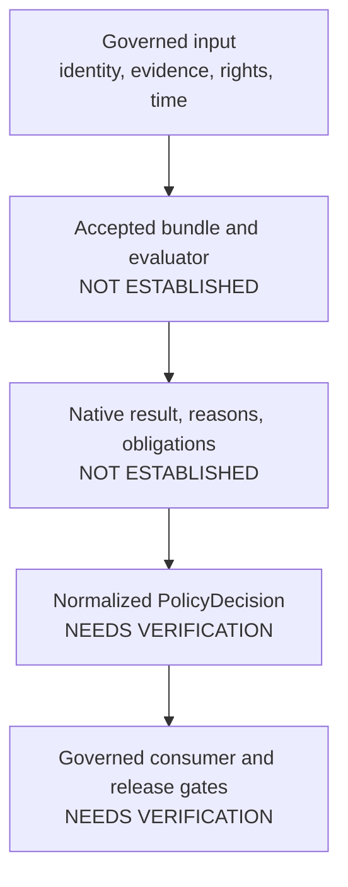

<!-- [KFM_META_BLOCK_V2]
doc_id: kfm://policy/domains/roads-rail-trade
title: Roads, Rail & Trade Domain Policy
type: readme; directory-readme; domain-policy-boundary; policy-index
version: v0.1
status: draft; experimental; PROPOSED (greenfield scaffold); repository-grounded; policy-source-scaffolds; bounded-corridor-route-validation; evaluator-unbound; fail-closed; non-release; non-publication
owners: "@bartytime4life — verified CODEOWNERS review route; Roads/Rail/Trade domain stewardship, policy approval, sensitivity and rights review, evaluator ownership, consumer ownership, independent review, and release authority NEEDS VERIFICATION"
created: 2026-05-08
updated: 2026-08-13
current_path: policy/domains/roads-rail-trade/README.md
owning_root: policy/
responsibility: >
  Define the local boundary for Roads, Rail & Trade admissibility-policy source; inventory
  the current rule scaffolds and bounded validation evidence; state required inputs,
  outcomes, obligations, composition, exposure, review, correction, and rollback limits;
  and prevent file presence, workflow success, maps, graphs, AI output, or repository state
  from being mistaken for active policy, transport truth, operational guidance, release, or publication.
policy_label: internal-operating-policy; repository-public; transport-policy; source-role-aware; rights-aware; sensitivity-aware; time-aware; fail-closed; release-gated; correction-aware; rollback-aware
truth_posture: >
  CONFIRMED accepted ADR-0029 placement, the singular policy responsibility root, verified
  CODEOWNERS routing, a PROPOSED machine-projected roads-rail-trade lane, 16 direct Rego
  sources, two deny-default-false greenfield stubs, fourteen allow-default-false generated
  scaffolds, no operative non-default rule body, no direct native Rego test, one bounded
  no-network CorridorRoute schema/validator slice, explicit proof and release workflow holds,
  and no policy-source change in this revision / PROPOSED policy families, inputs, outward
  decision normalization, reason and obligation handling, cross-domain composition, and
  public-surface enforcement / CONFLICTED unresolved transport alias posture and native
  boolean vocabularies versus outward finite outcomes / UNKNOWN accepted bundle, evaluator,
  authenticated decision authority, governed consumer, receipt persistence, required-check
  enforcement, policy activation, release integration, production operation, correction
  propagation, and rollback execution.
evidence_snapshot:
  repository: bartytime4life/Kansas-Frontier-Matrix
  repository_id: "1059091169"
  visibility: public
  base_ref: main
  base_commit: 299c8a81325689c68a38304ce7b14921342dcdd0
  prior_blob: 508062700bc3f56fb05914290fc160d7634b53f4
  policy_root_blob: 6c5021f9d92778581a4e9331a9dd6ddb7efc5e35
  policy_domains_parent_blob: ed9be975c9da2c7d77d94fab621db39f23953813
  directory_rules_blob: fd49a0b83e55cef52c1124281f093e263526898d
  adr_0029_blob: b01322ef64f8c2b1ecb41de7ef4685b97cfa2a62
  root_registry_blob: 024f668b5f0a9239bafa4f8b09e2afd86300ff8c
  domain_lane_register_blob: 1bfc6f91cfa713a5e3d51ece011b63b46310734f
  human_domain_register_blob: 7cd641d99e1e4e3b3823f608d63679a438590c3a
  codeowners_blob: dd2a84aa514d8ecd9208bc347f90f9a2ed37dd61
  domain_workflow_blob: 391fead3fdd0d7ecead6464be7946cbaf68247e0
  domain_docs_blob: b4e2d45f183986040622882f2fe2a090ef9a118d
  domain_contracts_blob: 79422f2b9fddd8a2755f54e43f94890881223b98
  domain_schemas_blob: 09e5fb6d39662093a202d8aecc6d380452ceb093
  domain_package_blob: 9128920c1b4fac85b12650a5ccb65272212f89c2
  domain_tests_blob: 3c362bf18f228e5b23a533eb4fc0214ca80a614a
related:
  - ../README.md
  - ../../README.md
  - ../../../docs/domains/roads-rail-trade/README.md
  - ../../../docs/registers/DOMAIN_LANE.md
  - ../../../control_plane/domain_lane_register.yaml
  - ../../../contracts/domains/roads-rail-trade/README.md
  - ../../../schemas/contracts/v1/domains/roads-rail-trade/README.md
  - ../../../fixtures/domains/roads-rail-trade/README.md
  - ../../../tests/domains/roads-rail-trade/README.md
  - ../../../packages/domains/roads-rail-trade/README.md
  - ../../../tools/validators/domains/roads-rail-trade/README.md
  - ../../../.github/workflows/domain-roads-rail-trade.yml
  - ../../../release/candidates/roads-rail-trade/README.md
  - ../../../docs/doctrine/directory-rules.md
  - ../../../docs/adr/ADR-0029-adopt-directory-governance-standard-v2.md
tags:
  - kfm
  - policy
  - roads-rail-trade
  - transport
  - domain-policy
  - source-role
  - rights
  - sensitivity
  - temporal-validity
  - generalization
  - evidence
  - finite-outcomes
  - governed-api
  - no-live-routing
  - release-gated
  - correction
  - rollback
notes:
  - "This revision substantively updates only this README; the required generated-work receipt records provenance separately."
  - "No Rego source, policy value, contract, schema, fixture, validator, test, workflow, bundle, evaluator, consumer, decision, lifecycle object, release artifact, deployment, publication, or public behavior is created or changed."
  - "The literal PROPOSED (greenfield scaffold) posture is retained because the current domain workflow checks it and the direct Rego files remain non-operative scaffolds."
  - "The parent domain-policy README is a separately pinned repository snapshot; its inventory should be re-reviewed after this child documentation change rather than edited without a complete recount."
[/KFM_META_BLOCK_V2] -->

<a id="top"></a>

# Roads, Rail & Trade Domain Policy

> **One-line purpose.** `policy/domains/roads-rail-trade/` is the local policy-source boundary for Roads, Rail & Trade admissibility questions; it is not transport truth, a live routing or alert authority, an evaluator, a release decision, or a public-data surface.


| Impact field | Current posture |
|---|---|
| **Status** | **Experimental — `PROPOSED (greenfield scaffold)`** |
| **Inherited parent** | [`policy/domains/`](../README.md), under the canonical [`policy/`](../../README.md) responsibility root |
| **GitHub review route** | `@bartytime4life` through [`CODEOWNERS`](../../../.github/CODEOWNERS); functional steward and independent approver assignments remain **NEEDS VERIFICATION** |
| **Change class** | Documentation-only, same-path, additive boundary clarification |
| **Runtime effect** | None; no policy source, evaluator, consumer, release, deployment, or publication behavior changes |

**Quick navigation:** [Purpose](#purpose) · [Authority](#authority-and-repo-fit) · [Status](#status-and-repository-evidence) · [Directory map](#current-direct-child-map) · [Belongs](#what-belongs-here) · [Inputs](#required-policy-input-boundary) · [Inventory](#current-policy-source-inventory) · [Posture](#default-posture-and-finite-results) · [Sensitivity](#rights-sensitivity-and-harmful-precision) · [Composition](#cross-domain-composition) · [Public surfaces](#public-surface-and-governed-ai-boundary) · [Validation](#validation-tests-and-workflow-evidence) · [Review](#review-burden) · [Done](#definition-of-done) · [Open verification](#open-verification-register) · [Related](#related-folders) · [Rollback](#maintenance-correction-and-rollback)

> [!IMPORTANT]
> **Safe conclusion at `main@299c8a813256`:** this directory is a correctly placed policy lane with 16 Rego files, but every direct source is still a stub or scaffold. The repository proves a bounded, synthetic, no-network `CorridorRoute` schema/validator slice; it does not prove a Roads/Rail/Trade policy bundle, evaluator, authenticated decision, governed consumer, policy receipt, proof producer, release dry run, or production enforcement.

> [!CAUTION]
> KFM must not present this lane as live closure, detour, safe-passage, legal-access, bridge-condition, rail-status, emergency, regulatory, or operational guidance. Current, safety-critical decisions belong to the competent official authority and require current authoritative evidence outside this documentation lane.

> [!WARNING]
> The machine register records `transport -> roads-rail-trade` under **unresolved aliases**, while the physical `policy/domains/roads/` child has no accepted mapping to this lane. Do not treat either spelling as an accepted writable alias, migrate files, or infer equivalence from a similar name without the required governed decision.

---

## Purpose

This directory owns the **Roads, Rail & Trade-specific portion of KFM admissibility-policy source and its local boundary documentation**. Its eventual role is to answer bounded questions such as:

- whether a route, segment, crossing, facility, corridor, operator-status claim, access restriction, graph projection, map layer, export, or AI-supported answer has enough governed context for the requested operation;
- whether source role, EvidenceBundle resolution, rights, sensitivity, temporal validity, lifecycle state, review, release, correction, and rollback prerequisites are satisfied;
- whether geometry, attributes, relations, or citations must be generalized, redacted, withheld, delayed, quarantined, or sent to specialist review;
- whether a derived network edge or narrative projection is being mistaken for canonical route or segment evidence; and
- whether a finite denial, abstention, hold, restriction, or error is required instead of an affirmative result.

The current files do **not** implement that complete behavior. This README records the boundary and the gap without upgrading scaffolds to active policy.

[Back to top](#top)

---

## Authority and repo fit

Accepted [ADR-0029](../../../docs/adr/ADR-0029-adopt-directory-governance-standard-v2.md) adopts [Directory Rules v2](../../../docs/doctrine/directory-rules.md). Directory Rules §9.3 assigns policy source to the singular `policy/` root, §12 places domains as segments inside responsibility roots, and §16 classifies a domain lane as `BOUNDARY_COMPACT`.

This README inherits the boundary defined by [`policy/domains/README.md`](../README.md). It documents the local lane; it does not create the domain, accept an alias, activate a rule, authenticate a result, approve a release, or publish data.

| Concern | Owning surface | Role of this directory |
|---|---|---|
| Domain identity and path slug | Accepted decisions, Directory Rules, and synchronized registers | Consume the reviewed `roads-rail-trade` identity; never rename or multiply it through file placement. |
| Human domain doctrine | [`docs/domains/roads-rail-trade/`](../../../docs/domains/roads-rail-trade/README.md) | Link and constrain policy intent; never copy domain truth into policy source. |
| Object meaning | [`contracts/domains/roads-rail-trade/`](../../../contracts/domains/roads-rail-trade/README.md) | Consume semantic contracts; never redefine route, segment, status, crossing, or graph meaning here. |
| Machine shape | [`schemas/contracts/v1/domains/roads-rail-trade/`](../../../schemas/contracts/v1/domains/roads-rail-trade/README.md) | Require accepted shapes; never host schema authority. |
| Domain admissibility source | This directory | Own reviewed local rule source after acceptance and activation. |
| Evaluation mechanics | [`packages/policy-runtime/`](../../../packages/policy-runtime/README.md) or another accepted evaluator | Supply accepted source; never embed reusable runtime implementation here. |
| Fixtures, tests, and validators | [`fixtures/`](../../../fixtures/domains/roads-rail-trade/README.md), [`tests/`](../../../tests/domains/roads-rail-trade/README.md), and [`tools/validators/`](../../../tools/validators/domains/roads-rail-trade/README.md) | Prove bounded behavior; passing is not a policy decision or transport fact. |
| Lifecycle records and payloads | `data/<phase>/`, receipts, proofs, and registries | Evaluate explicit references; never store or mutate these objects here. |
| Release, correction, and rollback | [`release/`](../../../release/candidates/roads-rail-trade/README.md) and its accepted object-family lanes | Supply a required result; never approve, publish, correct, withdraw, or roll back alone. |
| Public enforcement | Governed APIs and released public-safe artifacts | Consumers enforce accepted obligations; clients never load these Rego files directly. |

### Local ownership and scope identity

| Field | Evidence-backed value |
|---|---|
| Path | `policy/domains/roads-rail-trade/` |
| Parent | `policy/domains/` |
| README profile | `BOUNDARY_COMPACT` |
| Document ID | `kfm://policy/domains/roads-rail-trade` — document identity only, not an evaluator scope or bundle ID |
| GitHub review route | `@bartytime4life` for `/policy/` |
| Domain/policy steward | **NEEDS VERIFICATION** |
| Independent approver | **NEEDS VERIFICATION** |
| Accepted evaluator and bundle owner | **UNKNOWN** |
| Release/publication authority | Not owned here |

[Back to top](#top)

---

## Status and repository evidence

### Current maturity snapshot

| Surface | Confirmed state at the pinned base | Safe interpretation |
|---|---|---|
| Prior README | 855-byte generic greenfield scaffold | Replaced in place by a repository-grounded boundary document; policy maturity does not change. |
| Direct inventory | `README.md` plus 16 `.rego` files | File presence proves inventory only. |
| Native packages | Two `kfm.roads_rail_trade_*` packages and fourteen `kfm.generated.policy.domains.roads_rail_trade.*` packages | Namespace convergence and accepted entrypoints remain unresolved. |
| Rule bodies | No non-default operative rule body in any direct Rego file | No complete decision behavior exists here. |
| Defaults | Two `default deny := false`; fourteen `default allow := false` | Mixed native shapes are scaffolding, not a coherent finite decision contract. |
| Direct native Rego tests | None under this lane | Rule parsing, polarity, reasons, obligations, and negative behavior are not natively proved. |
| Domain schema slice | One bounded `CorridorRoute` schema profile with deterministic fixtures, validator, and tests | Schema/fixture behavior only; not policy evaluation, source admission, route truth, or publication. |
| Hosted workflow | `domain-roads-rail-trade` runs readiness checks and the CorridorRoute slice; proof and release jobs remain explicit holds | A green workflow is not active policy, proof closure, release approval, or public safety. |
| Policy bundle/evaluator | No accepted lane bundle, manifest, selector, evaluator, or entrypoint was proved | **UNKNOWN / NEEDS VERIFICATION** |
| Decision receipts and replay | No authenticated lane decision-receipt flow was proved | **UNKNOWN** |
| Governed consumer | No API, UI, MapLibre, export, graph, or AI consumer enforcement path was proved | **UNKNOWN** |
| Required-check enforcement | Workflow source exists; settings significance was not established | **NEEDS VERIFICATION** |
| Release/publication | Workflow preserves explicit proof and release-dry-run holds | No release, deployment, promotion, or publication authority. |

### Maturity classification

The correct lane posture remains **`PROPOSED (greenfield scaffold)`**.

That phrase is both semantically accurate and a current workflow guard. Removing it would assert a maturity transition that must first reconcile executable rules, fixtures, native tests, package and entrypoint identity, bundle/evaluator compatibility, outcome normalization, governed consumers, decision receipts, review, release integration, correction, and rollback.

[Back to top](#top)

---

## Current direct-child map

Verified at `main@299c8a813256`; direct children only:

```text
policy/domains/roads-rail-trade/
├── README.md                               — local boundary and evidence index
├── abstain_on_ambiguous.rego               — deny-default-false greenfield stub
├── critical_facility_review.rego           — allow-default-false generated scaffold
├── deny_unpublished.rego                   — deny-default-false greenfield stub
├── graph_projection_non_canonical.rego     — allow-default-false generated scaffold
├── historic_overprecision_deny.rego        — allow-default-false generated scaffold
├── indigenous_corridor_review.rego         — allow-default-false generated scaffold
├── legal_status_deny.rego                  — allow-default-false generated scaffold
├── operator_status_temporal.rego           — allow-default-false generated scaffold
├── overprecision_historic_routes.rego      — allow-default-false generated scaffold
├── public_generalization_required.rego     — allow-default-false generated scaffold
├── rights.rego                             — allow-default-false generated scaffold
├── route_designation_separation.rego       — allow-default-false generated scaffold
├── sensitivity_critical_facilities.rego    — allow-default-false generated scaffold
├── sensitivity_indigenous_corridors.rego   — allow-default-false generated scaffold
├── source_rights_gate.rego                 — allow-default-false generated scaffold
└── source_role.rego                        — allow-default-false generated scaffold
```

No subdirectory, native Rego test, bundle manifest, generated decision, receipt, proof, or release artifact is present in this lane at the pinned base.

[Back to top](#top)

---

## What belongs here

- this boundary README and accepted Roads/Rail/Trade-specific declarative policy source;
- rules that evaluate explicit route, segment, corridor, crossing, facility, operator-status, restriction, graph, map, export, or AI-operation context;
- Roads/Rail/Trade-specific source-role, evidence-resolution, rights, sensitivity, precision, freshness, lifecycle, review, release, correction, and rollback prerequisites;
- accepted package names, entrypoints, versions, finite results, public-safe reason codes, and enforceable obligations;
- bounded restrictions requiring generalization, redaction, withholding, delay, quarantine, review, or abstention;
- domain-specific cross-lane composition rules when an accepted decision assigns ownership here;
- supersession and effective-time notes for accepted rule versions; and
- links to the authoritative contracts, schemas, fixtures, tests, validators, bundles, evaluators, consumers, receipts, release gates, corrections, and rollback targets.

A rule belongs here because its primary responsibility is **Roads/Rail/Trade admissibility**, not merely because it mentions transportation.

## What does not belong here

| Prohibited content or responsibility | Correct home or behavior |
|---|---|
| Route, segment, crossing, facility, or status semantic definitions | `contracts/domains/roads-rail-trade/` |
| JSON Schema, DTO, enum, or field shape | `schemas/contracts/v1/domains/roads-rail-trade/` |
| Domain doctrine, architecture, source guides, or narrative interpretation | `docs/domains/roads-rail-trade/` |
| Source payloads, credentials, or canonical source registry instances | Connectors, secret stores, and accepted `data/registry/` lanes |
| RAW, WORK, QUARANTINE, PROCESSED, CATALOG, TRIPLET, or PUBLISHED payloads | The corresponding `data/<phase>/roads-rail-trade/` lane |
| EvidenceBundles, proofs, decisions, reviews, or receipts emitted at runtime | Their accepted evidence, proof, decision, review, or receipt roots |
| Evaluator, adapter, CLI, service, graph builder, or reusable runtime code | `packages/`, `apps/`, `runtime/`, or `tools/` by responsibility |
| Generic fixtures and tests | Root `fixtures/` and `tests/` lanes |
| Release manifests, approvals, correction notices, withdrawals, or rollback cards | `release/` object-family lanes |
| Real restricted geometry, sensitive facility details, cultural-route specifics, or private operational data | Do not commit; use synthetic, redacted, generalized, or access-controlled references |
| Live routing, detour, closure, safe-passage, legal-access, rail-status, or emergency guidance | Competent current official authorities; KFM may cite context only after governance |
| A second transport policy authority under `roads/`, `transport/`, or another alias | Denied until an accepted alias/migration decision establishes compatibility |
| Generated language presented as a grant, decision, fact, release, or publication approval | Governed evidence, evaluation, review, and release flow |

[Back to top](#top)

---

## Required policy input boundary

No direct Rego file currently implements a complete, accepted input contract. A future evaluator must consume an **explicit, versioned, replayable input bundle** and must not fetch missing facts silently.

| Input class | Minimum context before an affirmative result | Fail-closed condition |
|---|---|---|
| Operation | Stable capability, requested action, audience, purpose, evaluation time | Unknown, overbroad, or unregistered operation |
| Object and identity | Stable object/version refs, domain, object family, route/segment/relationship identity | Name, geometry, graph edge, or display feature substituted for governed identity |
| Space and time | Requested precision, CRS/profile, observed/effective/valid/retrieved times, uncertainty | Missing or conflated temporal state; precision exceeds support |
| Source role | SourceDescriptor refs and explicit official, observed, historical, derived, contextual, or modeled role | Context or derived source presented as legal or operational authority |
| Evidence | EvidenceRef values resolved to the required EvidenceBundle state, citations, confidence, freshness | Unresolved, stale, contradicted, revoked, or insufficient support |
| Rights and access | License/terms, permitted operation, attribution, access class, retention posture | Unknown, expired, incompatible, or restricted rights |
| Sensitivity | Classification, harmful-precision assessment, required transform, review state | Critical, cultural, private, or restricted detail lacks accepted handling |
| Lifecycle and release | Current/requested phase, validation/proof refs, review, release, correction, withdrawal, rollback refs | Skipped transition, absent review, or ungoverned public exposure |
| Policy execution | Accepted bundle ID/version/digest, evaluator profile/version, entrypoint, input hash | Unaccepted, unverifiable, or non-replayable execution context |

### Input invariants

- Route identity, route membership, route designation, road or rail segment identity, operator assignment, operational status, access restriction, crossing, and graph edge remain distinct.
- Historical evidence cannot be silently upgraded to present legal, operational, or engineering authority.
- A graph, tile, map feature, search result, AI summary, or narrative story node is a projection or interpretation, not the policy input's root truth.
- Missing EvidenceBundle, rights, sensitivity, time, review, release, correction, or rollback context never becomes implicit approval.
- Cross-domain references remain references; this evaluator must not overwrite the owning domain's claims or restrictions.

[Back to top](#top)

---

## Outputs and authority limits

An accepted future evaluation may emit:

- an engine-native result with stable reasons and obligations;
- a normalized `PolicyDecision` candidate using an accepted closed vocabulary;
- required generalization, redaction, withholding, audience, delay, review, citation, or re-evaluation obligations;
- bundle/evaluator/input/output digests for replay;
- explicit object, evidence, rights, sensitivity, review, release, correction, and rollback references; or
- a finite hold, abstention, denial, or error when the request cannot proceed safely.

No such output is currently established by the direct Rego scaffolds. Even after implementation, a policy result would not by itself:

- prove a route, segment, crossing, facility, operator, condition, restriction, or graph claim;
- authenticate evidence, rights, review, or source authority;
- create or promote lifecycle state;
- approve release or publication;
- provide safe routing, emergency, legal, regulatory, or engineering advice; or
- make a map, export, graph, AI answer, commit, pull request, workflow, badge, or generated receipt authoritative.

[Back to top](#top)

---

## Current policy source inventory

### Native-shape summary

| Source family | Files | Package form | Current executable content | Maturity |
|---|---:|---|---|---|
| Greenfield deny stubs | 2 | `kfm.roads_rail_trade_<name>` | `default deny := false`; comments only beyond the default | `PROPOSED`; no operative denial or abstention behavior |
| Generated allow scaffolds | 14 | `kfm.generated.policy.domains.roads_rail_trade.<name>` | `default allow := false`; no non-default rule body | `PROPOSED`; no accepted input, reason, obligation, or entrypoint contract |

### Policy-intent families

File names are **intent cues**, not accepted requirements or proof that the named control exists.

| Intended concern | Current files | Confirmed implementation posture |
|---|---|---|
| Evidence ambiguity and publication state | [`abstain_on_ambiguous.rego`](./abstain_on_ambiguous.rego), [`deny_unpublished.rego`](./deny_unpublished.rego) | Deny-default-false stubs with commented examples only; no abstain result and no publication gate. |
| Source role and rights | [`source_role.rego`](./source_role.rego), [`rights.rego`](./rights.rego), [`source_rights_gate.rego`](./source_rights_gate.rego) | Allow-default-false scaffolds; no source taxonomy, rights input, reason, obligation, or test. |
| Route identity and legal status | [`route_designation_separation.rego`](./route_designation_separation.rego), [`legal_status_deny.rego`](./legal_status_deny.rego) | Allow-default-false scaffolds; no operative separation or legal-authority rule. |
| Temporal operator/status handling | [`operator_status_temporal.rego`](./operator_status_temporal.rego) | Allow-default-false scaffold; no time fields or rule body. |
| Historic-route precision | [`historic_overprecision_deny.rego`](./historic_overprecision_deny.rego), [`overprecision_historic_routes.rego`](./overprecision_historic_routes.rego) | Two allow-default-false scaffolds with overlapping names; consolidation and exact ownership **NEEDS VERIFICATION**. |
| Public generalization | [`public_generalization_required.rego`](./public_generalization_required.rego) | Allow-default-false scaffold; no transform profile, receipt requirement, or consumer binding. |
| Critical-facility review and sensitivity | [`critical_facility_review.rego`](./critical_facility_review.rego), [`sensitivity_critical_facilities.rego`](./sensitivity_critical_facilities.rego) | Allow-default-false scaffolds; overlap, reviewer identity, thresholds, and obligations remain unaccepted. |
| Indigenous/cultural corridor review and sensitivity | [`indigenous_corridor_review.rego`](./indigenous_corridor_review.rego), [`sensitivity_indigenous_corridors.rego`](./sensitivity_indigenous_corridors.rego) | Allow-default-false scaffolds; no sovereignty, cultural-review, consent, or public-safe transform implementation. |
| Graph non-canonicity | [`graph_projection_non_canonical.rego`](./graph_projection_non_canonical.rego) | Allow-default-false scaffold; no graph/record binding or consumer enforcement. |

### Structural conflicts to preserve until resolved

1. Two package namespaces coexist without an accepted canonical package or bundle manifest.
2. `abstain_on_ambiguous` exposes a `deny` default and no abstain result.
3. Deny-named stubs default `deny` to `false`, while generated scaffolds default `allow` to `false`.
4. Several intent families have overlapping file names without a consolidation, supersession, or ownership decision.
5. No accepted mapping connects native booleans to a complete outward finite-outcome vocabulary.

Do not “clean up” these conflicts by rewriting defaults, renaming packages, deleting scaffolds, or merging files as a documentation side effect. Each change requires explicit semantics, fixtures, native tests, compatibility review, bundle/evaluator wiring, and rollback.

[Back to top](#top)

---

## Default posture and finite results

The **system posture must fail closed**, but the present files do not yet form that system.

When material source, evidence, rights, sensitivity, time, lifecycle, review, release, correction, or rollback context is missing, stale, conflicted, revoked, or unsupported, the accepted future contract must produce a finite non-affirmative result. Depending on the accepted vocabulary, that may be `ABSTAIN`, `DENY`, `RESTRICT`, `HOLD`, or `ERROR`.

| Condition | Required safe direction | Current implementation |
|---|---|---|
| Evidence or source role unresolved | Abstain, hold, or deny; request bounded missing context | Not implemented |
| Rights or permitted operation unclear | Deny or hold; do not expose or transform | Not implemented |
| Sensitivity or harmful precision unresolved | Withhold, generalize only through an accepted transform, or route to review | Not implemented |
| Temporal state stale or conflated | Abstain or deny current-status claims | Not implemented |
| Legal/operational authority unsupported | Deny authoritative framing | Not implemented |
| Graph or rendered feature treated as canonical | Deny the collapse and require canonical references | Not implemented |
| Release, correction, or rollback closure absent | Hold public use | Not implemented |
| Malformed or evaluator-incompatible input | Error and quarantine the candidate operation | Not implemented |

### Native-to-outward normalization

The direct sources expose `allow` or `deny` booleans. Adjacent repository documentation also uses outward terms such as `ANSWER`, `ABSTAIN`, `DENY`, and `ERROR`, while parent policy material discusses allow-like, restriction, hold, abstention, denial, and error states.

No accepted mapping was proved. A future normalizer must preserve, rather than collapse:

- engine-native result and package/entrypoint version;
- reasons and missing prerequisites;
- obligations and their enforcing consumer;
- uncertainty, stale state, restriction, hold, abstention, denial, and execution error;
- input, bundle, evaluator, output, and decision digests; and
- review, expiry, supersession, correction, withdrawal, and rollback lineage.

Unsupported normalization must fail closed. It must never convert “unknown,” “not evaluated,” “not applicable,” “held,” or “error” into allow.

[Back to top](#top)

---

## Rights, sensitivity, and harmful precision

The proposed machine register assigns the lane a `T0` baseline. The human register describes **T0 mostly, with T2/T4 for sensitive condition detail**, and separately warns that sensitivity defaults remain proposed pending a governing decision. Treat the stricter applicable posture as safe context; do not present either register as an activated evaluator rule.

### Required fail-safe concerns

- **Critical transport facilities and dependencies:** exact condition, dependency, access, vulnerability, or operational detail may create security or public-safety risk. Withhold or generalize unless an accepted policy, purpose, audience, review, and release path supports the operation.
- **Indigenous, cultural, treaty, historic, or community mobility corridors:** source permission, sovereignty, cultural review, attribution, and harmful-precision obligations may exceed ordinary public-data rules. Absence of an objection is not consent.
- **Historic routes:** coarse, uncertain, interpretive, or single-source evidence must not become a falsely precise line, legal alignment, or current route claim.
- **Rights-restricted source material:** map or record availability does not prove redistribution, derivative-use, AI-use, or public-display rights.
- **Current condition and access:** KFM is not a live safety or legal-status authority. Stale or contextual material must never be framed as current operational guidance.

Generalization, aggregation, redaction, audience restriction, delay, or withholding is an obligation-bearing transform, not a cosmetic edit. Where required, preserve the source geometry, transform profile, reason, output digest, reviewer state, effective time, supersession, correction, and rollback lineage in the proper receipt and release surfaces.

[Back to top](#top)

---

## Cross-domain composition

Roads, rail, and trade claims frequently cross domain boundaries. Composition must use governed references and the most restrictive applicable obligation; this lane does not absorb another domain's truth.

| Adjacent domain or authority | Relationship | Non-collapse rule |
|---|---|---|
| Settlements & Infrastructure | Depots, yards, bridges, facilities, municipal and infrastructure identity | Transport relations may reference assets; they do not become infrastructure canonical truth or expose protected dependencies. |
| Hydrology | Fords, ferries, bridges, river crossings, flood context | A transport crossing does not replace waterbody, flow, flood, or regulatory evidence. |
| Archaeology and cultural heritage | Historic routes, sites, surveys, sacred or sensitive places | Exact archaeological or cultural detail remains governed by the stricter sovereignty and sensitivity posture. |
| Hazards | Closure context, flood, fire, smoke, weather, disaster, or incident effects | Context is not a KFM alert, detour, safe-passage instruction, or official current status. |
| People, DNA & Land | Ownership, residency, genealogy, community history, parcel relations | Private person-parcel joins, living-person information, and consent obligations remain separately governed. |
| Geology, soil, habitat, flora, and fauna | Terrain, substrate, environmental context, stewardship, sensitive occurrence | Transport accessibility or proximity never authorizes exact sensitive-location exposure. |

### Composition invariants

- A weaker lane cannot downgrade a stronger denial, restriction, sensitivity, rights, consent, review, or release obligation.
- The receiving consumer must understand and enforce every surviving obligation; unsupported obligations require abstention or denial.
- Cross-domain joins require explicit identity, time, source, evidence, and policy lineage.
- A graph edge may connect governed references; it cannot replace their canonical records or erase disagreement.
- Correction or withdrawal in an upstream domain must trigger bounded re-evaluation of dependent transport projections, caches, exports, maps, and AI answers.

[Back to top](#top)

---

## Trust membrane and lifecycle

The flow below is the required governance shape, **not a claim of current end-to-end implementation**.



Policy participates in, but does not replace, the lifecycle:

```text
RAW -> WORK / QUARANTINE -> PROCESSED -> CATALOG / TRIPLET -> PUBLISHED
```

- A policy evaluation may constrain a proposed operation; it does not perform promotion.
- A repository path, commit, pull request, green workflow, map, graph, screenshot, AI answer, receipt, or proof does not make an object PUBLISHED.
- Public use requires the accepted evidence, identity, rights, sensitivity, validation, review, release, correction, and rollback closure appropriate to consequence.
- Watchers and validators may propose or test work; they do not publish.
- A changed policy version affecting released material requires re-evaluation, supersession, correction or withdrawal where necessary, cache invalidation, and a transparent rollback target.

[Back to top](#top)

---

## Public-surface and governed-AI boundary

### Governed API, map, graph, and export

- Ordinary public clients consume governed APIs or released public-safe artifacts; they do not read Rego source, candidate data, or internal stores.
- MapLibre layers and Evidence Drawer content must preserve source, time, confidence, evidence, sensitivity, generalization, review, and release context made available by the governed interface.
- Network graphs, tiles, indexes, and search projections are rebuildable delivery surfaces. They are not route, legal, operational, or evidence authority.
- Denied, abstained, restricted, stale, withheld, and unavailable states must remain visible; a client must not turn absence into an affirmative claim.
- Exports must carry the accepted rights, attribution, sensitivity, time, correction, and rollback obligations that survive policy evaluation.

### Governed AI

An AI-assisted answer must follow this order:

1. define the bounded question and requested operation;
2. retrieve governed references;
3. resolve required EvidenceRefs to EvidenceBundle support;
4. apply accepted policy and sensitivity checks;
5. answer with citations and bounded confidence, narrow the scope, or abstain.

Generated language cannot substitute for route evidence, current status, legal authority, policy evaluation, human review, or release state. If the required evidence or policy path is unavailable, the correct answer is a visible limitation or abstention—not a plausible route narrative.

[Back to top](#top)

---

## Exposure, mutation, and retention

| Concern | Local rule |
|---|---|
| Repository exposure | This README and policy source are repository-public; that does not make referenced data or decisions public. |
| Permitted writers | Feature-branch contributors with review; active rule changes require accepted ownership and validation beyond CODEOWNERS routing. |
| Runtime mutation | None. Rego source is versioned repository input, not a runtime state store. |
| Decision retention | Emitted decisions and receipts belong in accepted decision/receipt lanes with replay and expiry support, not here. |
| Sensitive content | Real restricted geometry, private operational detail, credentials, or protected cultural information is prohibited. |
| Supersession | Accepted policy versions require effective time, digest, predecessor/successor, consumer cutover, and rollback. |
| Correction | Incorrect policy documentation or behavior must be narrowed or superseded transparently; released reliance may require downstream correction or withdrawal. |

[Back to top](#top)

---

## Validation, tests, and workflow evidence

### Current executable evidence

The repository's [`domain-roads-rail-trade`](../../../.github/workflows/domain-roads-rail-trade.yml) workflow:

- runs on pull requests, pushes to `main`, and manual dispatch;
- grants `contents: read` only and disables checkout credential persistence;
- sets deterministic no-network-oriented environment values;
- verifies required boundary paths;
- parses the lane's JSON Schema and fixture inventory;
- runs the bounded `CorridorRoute` schema tests and fixture validator;
- confirms four broader validator roots remain documentation-only scaffolds;
- checks that this README still contains `PROPOSED (greenfield scaffold)`;
- records a hold for broader Roads/Rail/Trade semantic validation; and
- preserves explicit holds for proof production and release dry-run behavior.

The workflow does **not** parse or test these 16 Rego files, assemble a bundle, evaluate a policy input, authenticate a decision, prove route truth, emit a proof, approve release, or publish data.

### Focused current commands

These commands are documented by the verified schema lane and executed by the domain workflow:

```bash
KFM_NO_NETWORK=1 PYTHONHASHSEED=0 TZ=UTC \
  python -m pytest -q tests/schemas/test_corridor_route_contract.py

KFM_NO_NETWORK=1 PYTHONHASHSEED=0 TZ=UTC \
  python tools/validators/domains/roads-rail-trade/validate_corridor_route.py --fixtures
```

Passing proves only the bounded schema, deterministic hash, temporal, source-role, and public-safety checks implemented by the `CorridorRoute` profile and fixtures. It does not prove a route is true, current, legally designated, operationally safe, policy-approved, reviewed, released, or published.

### Required before any direct rule is called active

- [ ] Canonical package namespace, rule family, entrypoint, and version are accepted.
- [ ] A complete operation-specific input contract and outward decision contract are accepted.
- [ ] Safe reasons and enforceable obligations have stable registries and consumer handlers.
- [ ] Positive, deny, abstain, restrict/hold, malformed, stale, revoked, and cross-domain fixtures are synthetic and rights-safe.
- [ ] OPA or another accepted evaluator is pinned, compatible, and invoked with no hidden network or credentials.
- [ ] Native rule tests cover every default and operative branch.
- [ ] Bundle manifest, selector, digest, activation, expiry, supersession, and rollback are defined.
- [ ] Decision receipts bind input, source, evidence, bundle, evaluator, result, reasons, obligations, and review state.
- [ ] Governed consumers prove fail-closed obligation enforcement.
- [ ] Required-check and independent-review significance are verified from repository controls.
- [ ] Release, correction, withdrawal, cache invalidation, and rollback drills pass at the required risk level.

### Documentation-change checks

For this README, reviewers should verify one H1, logical heading order, balanced fences and HTML comments, valid local links and anchors, direct-child-only inventory, no stale or invented implementation claims, no sensitive detail, final newline, clean diff, and a schema-valid generated-work receipt with the final README SHA-256.

[Back to top](#top)

---

## Review burden

[`CODEOWNERS`](../../../.github/CODEOWNERS) routes `/policy/` changes to `@bartytime4life`. That route is a GitHub review request mechanism; it is not a domain stewardship assignment, independent approval, `PolicyDecision`, release approval, or proof that review occurred.

| Change type | Minimum review concern |
|---|---|
| README-only current-state correction | Policy-root owner routing; verify evidence, boundaries, links, uncertainty, and receipt binding. |
| Rule semantics, defaults, package, or entrypoint | Policy owner, domain specialist, fixtures/tests, evaluator compatibility, consumer impact, and rollback. |
| Rights or source-role behavior | Source/rights review and affected operation-specific terms. |
| Critical-facility or harmful-precision handling | Security/sensitivity review and public-safe transform validation. |
| Indigenous or cultural corridor handling | Appropriate sovereignty, cultural, community, rights, and attribution review; reviewer identities remain **NEEDS VERIFICATION**. |
| Cross-domain composition | Review by each affected domain owner and the consuming policy/runtime boundary. |
| Public API, UI, map, graph, export, or AI enforcement | Consumer owner, policy/sensitivity review, negative-state tests, and public-boundary validation. |
| Release-affecting change | Independent release review, immutable artifact identity, correction/withdrawal path, and rollback evidence. |

The author, generator, or workflow must not be treated as the sole approver for a policy-significant change.

[Back to top](#top)

---

## Definition of done

### This documentation revision

- [x] Existing same-path canonical target and prior bytes inspected.
- [x] Accepted Directory Rules placement and `BOUNDARY_COMPACT` fields applied.
- [x] All 16 direct Rego files inventoried without promoting scaffolds to implementation.
- [x] Mixed packages, defaults, overlaps, and missing native tests surfaced.
- [x] Bounded CorridorRoute validation separated from policy, proof, and release maturity.
- [x] Inputs, outputs, sensitivity, composition, public-path, review, correction, and rollback boundaries documented.
- [x] Exact workflow maturity marker retained.
- [x] No policy source, runtime, lifecycle, release, deployment, or publication behavior changed.
- [ ] Authorized human review complete.
- [ ] Hosted exact-head checks complete.

### Active Roads/Rail/Trade policy

- [ ] Accepted owner, reviewers, package, entrypoints, version, and bundle identity exist.
- [ ] Direct source has operative rules with stable reasons and obligations.
- [ ] Native positive and negative tests run under the accepted evaluator.
- [ ] Input assembly and native-to-outward normalization are deterministic and replayable.
- [ ] Rights, sensitivity, temporal, source-role, alias, and cross-domain behavior are resolved.
- [ ] A governed consumer enforces every obligation and visible negative state.
- [ ] Authenticated decision receipts, monitoring, expiry, supersession, and correction work.
- [ ] Release integration and rollback are independently reviewed and tested.

Until the active-policy list closes, this lane remains a documented scaffold rather than an enforcement system.

[Back to top](#top)

---

## Open verification register

| ID | Open question | Current status |
|---|---|---:|
| RRT-POL-001 | Who is the accepted Roads/Rail/Trade domain-policy steward and independent approver? | **NEEDS VERIFICATION** |
| RRT-POL-002 | What accepted decision resolves the `transport -> roads-rail-trade` alias and the unrelated physical `roads/` child? | **UNKNOWN / NEEDS ADR** |
| RRT-POL-003 | Which direct scaffolds should be implemented, consolidated, superseded, or retired? | **NEEDS VERIFICATION** |
| RRT-POL-004 | What canonical package namespace, entrypoints, versions, and native result shape are accepted? | **UNKNOWN** |
| RRT-POL-005 | What operation-specific input profiles bind route, segment, status, evidence, rights, sensitivity, time, review, and release context? | **UNKNOWN** |
| RRT-POL-006 | How are native `allow`/`deny` results normalized without collapsing restriction, hold, abstention, denial, and error? | **CONFLICTED / NEEDS VERIFICATION** |
| RRT-POL-007 | Where are Roads/Rail/Trade reason codes and obligations owned, versioned, reduced, and enforced? | **UNKNOWN** |
| RRT-POL-008 | What accepted sensitivity tiers and transform profiles govern critical facilities, cultural corridors, historic precision, and condition detail? | **PROPOSED / NEEDS VERIFICATION** |
| RRT-POL-009 | Which source roles may support legal designation, operator status, current condition, or restriction claims? | **NEEDS VERIFICATION per operation** |
| RRT-POL-010 | What native Rego fixtures and tests prove all positive and fail-closed paths? | **ABSENT** |
| RRT-POL-011 | What bundle manifest, evaluator, selector, integrity, activation, expiry, and rollback contract is accepted? | **UNKNOWN** |
| RRT-POL-012 | Which governed consumer first enforces these decisions and obligations end to end? | **UNKNOWN** |
| RRT-POL-013 | Where are authenticated decision receipts retained and replayed, expired, revoked, corrected, and superseded? | **UNKNOWN** |
| RRT-POL-014 | Which workflow checks are required by branch controls, and how is independent review enforced? | **NEEDS VERIFICATION** |
| RRT-POL-015 | What proof, candidate-manifest, release-dry-run, correction, withdrawal, cache-invalidation, and rollback paths are accepted? | **UNKNOWN / WORKFLOW HOLD** |
| RRT-POL-016 | When will the parent domain-policy inventory be repinned after this child README ceases to be a short scaffold? | **NEEDS VERIFICATION** |

[Back to top](#top)

---

## Related folders

| Surface | Relationship and current limit |
|---|---|
| [`../README.md`](../README.md) | Parent domain-policy boundary, lane inventory, and activation contract. |
| [`../../README.md`](../../README.md) | Canonical policy-root authority and general evaluator hold. |
| [`../../../docs/domains/roads-rail-trade/`](../../../docs/domains/roads-rail-trade/README.md) | Human domain doctrine and source interpretation; not executable policy. |
| [`../../../docs/registers/DOMAIN_LANE.md`](../../../docs/registers/DOMAIN_LANE.md) | Human lane index and proposed sensitivity posture; alias conflicts remain visible. |
| [`../../../control_plane/domain_lane_register.yaml`](../../../control_plane/domain_lane_register.yaml) | Proposed machine projection; records `transport` as unresolved alias. |
| [`../../../contracts/domains/roads-rail-trade/`](../../../contracts/domains/roads-rail-trade/README.md) | Semantic object-family contracts and non-authority boundaries. |
| [`../../../schemas/contracts/v1/domains/roads-rail-trade/`](../../../schemas/contracts/v1/domains/roads-rail-trade/README.md) | Machine shapes, including the bounded `CorridorRoute` profile. |
| [`../../../fixtures/domains/roads-rail-trade/`](../../../fixtures/domains/roads-rail-trade/README.md) | Synthetic fixture boundary; the root README remains a short scaffold. |
| [`../../../tests/domains/roads-rail-trade/`](../../../tests/domains/roads-rail-trade/README.md) | Domain test-family boundary; direct policy behavior remains unproved. |
| [`../../../packages/domains/roads-rail-trade/`](../../../packages/domains/roads-rail-trade/README.md) | Proposed domain package behavior and finite outcomes; not policy activation. |
| [`../../../tools/validators/domains/roads-rail-trade/`](../../../tools/validators/domains/roads-rail-trade/README.md) | Bounded CorridorRoute validator lane. |
| [`../../bundles/`](../../bundles/README.md) | Policy bundle boundary; no accepted Roads/Rail/Trade bundle was proved. |
| [`../../../packages/policy-runtime/`](../../../packages/policy-runtime/README.md) | General evaluator boundary; accepted runtime binding remains unproved. |
| [`../../../data/registry/sources/roads-rail-trade/`](../../../data/registry/sources/roads-rail-trade/README.md) | Source registry documentation; policy does not own source identity. |
| [`../../../data/proofs/roads-rail-trade/`](../../../data/proofs/roads-rail-trade/README.md) | Proof lane with explicit workflow hold; not policy or release authority. |
| [`../../../release/candidates/roads-rail-trade/`](../../../release/candidates/roads-rail-trade/README.md) | Candidate boundary; a candidate is not a release. |
| [`../../../data/published/roads-rail-trade/`](../../../data/published/roads-rail-trade/README.md) | Released public-safe payload lane; this policy directory cannot write it. |
| [`../../../.github/workflows/domain-roads-rail-trade.yml`](../../../.github/workflows/domain-roads-rail-trade.yml) | Bounded validation/readiness workflow with explicit proof and release holds. |

[Back to top](#top)

---

## ADRs and compatibility posture

- [ADR-0029](../../../docs/adr/ADR-0029-adopt-directory-governance-standard-v2.md) is accepted and makes Directory Rules v2 effective for placement.
- No accepted decision reviewed for this revision activates these Rego sources, accepts a Roads/Rail/Trade bundle/evaluator, or grants release/publication authority.
- The `transport` alias is recorded as unresolved by the proposed machine register. The physical `roads/` policy child has no registered alias mapping. This README does not resolve either condition.
- Adding, renaming, merging, or retiring a domain lane or compatibility path is an ADR-class change with migration, reference repair, correction, and rollback.

[Back to top](#top)

---

## Maintenance, correction, and rollback

### Review triggers

Re-review this README when:

- a direct file is added, removed, renamed, consolidated, or gains operative rules;
- package, entrypoint, default, reason, obligation, or outcome semantics change;
- an alias or canonical path decision is accepted;
- a bundle, evaluator, input profile, decision normalizer, receipt store, or governed consumer is established;
- rights, source-role, sensitivity, temporal, or public-safe transform requirements change;
- domain fixtures, native Rego tests, validators, workflow commands, or required-check settings change;
- a public API, MapLibre layer, graph, export, or AI surface consumes the policy;
- a release, correction, withdrawal, cache invalidation, or rollback relies on the policy; or
- repository drift makes the pinned evidence snapshot materially stale.

### Correction rule

If this README overstates current behavior:

1. mark the affected claim `CONFLICTED` or `NEEDS VERIFICATION`;
2. narrow or remove the claim without hiding prior reliance;
3. link the correcting repository evidence;
4. update generated provenance for the corrected bytes;
5. notify affected policy, domain, sensitivity, consumer, and release reviewers; and
6. re-evaluate, correct, withdraw, or roll back any downstream artifact that relied on the error.

### Rollback

For this documentation-only revision, restore prior blob `508062700bc3f56fb05914290fc160d7634b53f4` and revert the paired generated-work receipt in the same review. No Rego source, policy behavior, data, runtime, release, deployment, or public state requires restoration.

For a future active-policy change, rollback must use the accepted bundle/version/digest boundary, preserve decision and receipt lineage, block uncertain new use, invalidate affected caches and projections, and correct or withdraw released outputs through their governing release surfaces.

[Back to top](#top)

---

## Changelog

| Date | Version | Change | Status |
|---|---|---|---|
| 2026-05-08 | Unversioned | Generic 32-line greenfield scaffold created in commit `bb46a21bec35c653b3f543074c3026a786f50b32`. | Originating review and intended version remain unverified. |
| 2026-08-13 | v0.1 | Replaced the generic scaffold with a repository-grounded domain-policy boundary; inventoried 16 Rego scaffolds, current defaults and namespaces, bounded CorridorRoute validation, workflow holds, authority limits, inputs, outcomes, sensitivity, composition, public surfaces, review, correction, and rollback. | Documentation and provenance only; direct policy remains `PROPOSED (greenfield scaffold)`. |

[Back to top](#top)

---

## Evidence ledger

| Evidence | Confirmed observation | Limitation |
|---|---|---|
| Target tree at `main@299c8a813256` | One README and 16 direct Rego files | Snapshot must be rechecked on target or base drift. |
| All 16 direct Rego sources | Two deny-default-false stubs; fourteen allow-default-false scaffolds; no non-default rule body | Static source inspection is not evaluator execution. |
| ADR-0029 and Directory Rules | Singular `policy/` placement and `BOUNDARY_COMPACT` profile are accepted | Placement does not establish policy maturity or ownership. |
| Policy root and parent domain README | Policy source is distinct from semantics, schemas, evidence, runtime, release, and publication | Parent inventory is separately pinned and requires re-review after child changes. |
| Domain lane registers | `roads-rail-trade` is projected; `transport` is unresolved; human sensitivity notes add T2/T4 escalation | Machine authority and sensitivity adoption remain proposed/needs verification. |
| CODEOWNERS | `/policy/` routes to `@bartytime4life` | Does not prove functional stewardship, required approval, or separation of duties. |
| Domain contracts and schemas | Roads/Rail/Trade semantic index exists; one bounded CorridorRoute schema profile is documented | Contract/schema presence does not activate policy or prove route truth. |
| Domain tests and package READMEs | Test and finite-outcome boundaries are documented | Direct native Rego behavior and consumer enforcement remain unproved. |
| `domain-roads-rail-trade.yml` | Executes path/readiness checks, CorridorRoute tests and validator, and explicit holds | Does not run Rego, produce proof, approve release, or publish. |
| Proof and candidate lanes | Documentation exists with deliberate workflow holds | No accepted proof producer, candidate manifest, release dry run, or publication authority. |

---

**KFM rule:** Roads/Rail/Trade policy may decide only from explicit governed context, must fail closed when that context or enforcement path is incomplete, and must never let a scaffold, map, graph, workflow, receipt, export, or AI answer substitute for evidence, current official authority, review, release, correction, or rollback.

<p align="right"><a href="#top">Back to top</a></p>
