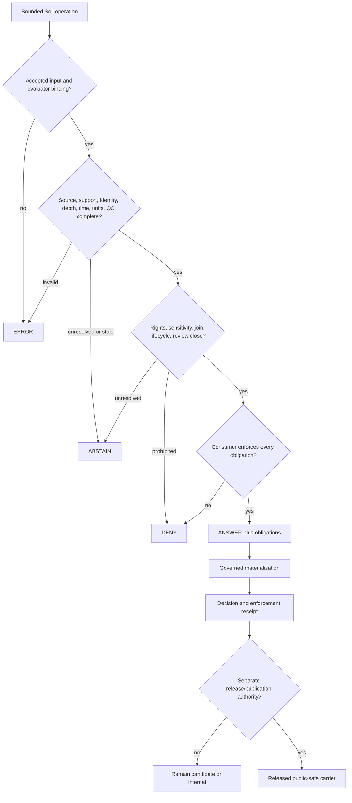

<!-- [KFM_META_BLOCK_V2]
doc_id: kfm://policy/domains/soil
title: Soil Domain Policy README
type: readme
classification: directory-readme; domain-policy-boundary; soil; policy-index
version: v0.1
status: draft; repository-grounded; mixed-maturity; one-fixture-only-guard; direct-policy-scaffolds; evaluator-unbound; proof-held; non-release; non-publication
owners: "@bartytime4life — verified CODEOWNERS review route; Soil, source, scientific, identity, measurement, rights, sensitivity, evidence, policy, contract/schema, validator/test, runtime, release, security, correction/rollback, and docs stewardship assignments NEEDS VERIFICATION"
created: 2026-05-08
updated: 2026-08-13
supersedes_version: unversioned greenfield scaffold
policy_label: public; policy; soil; support-type; source-role; identity; depth; time; units; public-safe; finite-outcomes; no-advice-authority; no-public-authority
current_path: policy/domains/soil/README.md
owning_root: policy/
responsibility: "Soil-specific policy boundary and repository index for source-role and support-type separation, identity, depth, time, units, quality, rights, sensitivity, evidence, finite decisions, obligations, composition, review, public-surface constraints, validation, activation, correction, and rollback without creating Soil truth, scientific or advisory authority, runtime enforcement, release, or publication."
base_commit: 96467cda05c74399b87b4ba9e8a5913c0d182c20
base_tree: e11649f4a72dd5534c715fb706cea249f72b5a82
prior_blob: 551e67681f90b1c3c717c3421f1782e155121865
lane_tree: d1a9b74477c29e1deb49180e21a93911fb71d442
truth_posture: "CONFIRMED canonical policy-root placement, CODEOWNERS routing, six direct Rego sources, one substantive fixture-only watcher guard, three allow-default-false scaffolds, two deny-default-false stubs, no native Soil Rego tests, 27 direct semantic contracts plus their README, 38 mixed-maturity schemas plus their README, 89 JSON fixtures among 128 fixture-lane files, 22 validator workflows plus one broad Soil workflow, mixed substantive and placeholder validators/tests/pipelines, one inactive manual-only watcher, one held Agriculture–Soil seam, duplicate source-registry topology, and empty direct proof/receipt/candidate/published payload lanes / PROPOSED bounded Soil policy architecture, inputs, normalization, obligations, public-surface contract, native test matrix, and reversible implementation sequence / CONFLICTED allow-versus-deny result polarity, generated-versus-short package namespaces, profile-local support-type vocabularies, local PASS/HOLD/ALLOW results versus outward decisions, duplicate registry topology, and stale adjacent indexes versus inspected repository bytes / UNKNOWN accepted Soil bundle, evaluator, decision emitter, obligation handlers, production consumers, required-check coupling, deployment enforcement, proof graduation, release behavior, and public behavior / NEEDS VERIFICATION functional owners, source authority, rights, canonical support types, units and depth profiles, freshness windows, sensitivity transforms, evaluator compatibility, negative policy tests, correction propagation, withdrawal, and rollback drills."
related:
  - ../README.md
  - ../../README.md
  - ../../../docs/domains/soil/README.md
  - ../../../docs/domains/soil/ARCHITECTURE.md
  - ../../../docs/domains/soil/IDENTITY_MODEL.md
  - ../../../docs/domains/soil/DATA_LIFECYCLE.md
  - ../../../docs/domains/soil/SOURCES.md
  - ../../../docs/domains/soil/VERIFICATION.md
  - ../../../contracts/domains/soil/README.md
  - ../../../contracts/soil/README.md
  - ../../../schemas/contracts/v1/domains/soil/README.md
  - ../../../fixtures/domains/soil/README.md
  - ../../../tests/domains/soil/README.md
  - ../../../tools/validators/domains/soil/README.md
  - ../../../pipeline_specs/soil/README.md
  - ../../../pipeline_specs/watchers/soil_ssurgo_gnatsgo.json
  - ../../../pipelines/domains/soil/README.md
  - ../../../data/registry/soil/README.md
  - ../../../data/registry/sources/soil/README.md
  - ../../../data/proofs/soil/README.md
  - ../../../data/receipts/soil/README.md
  - ../../../data/published/layers/soil/README.md
  - ../../../release/candidates/soil/README.md
  - ../../../docs/runbooks/soil/PROMOTION_RUNBOOK.md
  - ../../bundles/README.md
  - ../../decision/vocabulary.v1.json
  - ../../../contracts/policy/policy_input_bundle_profile_v1.md
  - ../../../contracts/policy/policy_decision_vocabulary.md
  - ../../../packages/policy-runtime/README.md
  - ../../../docs/adr/ADR-0029-adopt-directory-governance-standard-v2.md
  - ../../../docs/adr/ADR-0031-shared-watcher-ownership-and-placement.md
  - ../../../docs/doctrine/directory-rules.md
  - ../../../control_plane/domain_lane_register.yaml
  - ../../../control_plane/cross_domain_seam_register.yaml
  - ../../../control_plane/policy_gate_register.yaml
  - ../../../control_plane/watcher_registry.json
  - ../../../.github/CODEOWNERS
  - ../../../.github/workflows/domain-soil.yml
tags:
  - kfm
  - policy
  - soil
  - support-type
  - source-role
  - ssurgo
  - soil-moisture
  - identity
  - depth
  - units
  - time
  - quality
  - evidence
  - sensitivity
  - public-safe
  - finite-outcomes
  - no-network
  - proof-held
  - release-gated
  - correction
  - rollback
notes:
  - "This revision changes only policy/domains/soil/README.md plus the required AI-generated provenance receipt."
  - "No Rego rule, policy value, source descriptor, watcher, bundle, evaluator, contract, schema, fixture, validator, test, workflow, pipeline, review record, receipt instance, proof, release artifact, data object, deployment, or public behavior is created or changed."
  - "File presence is not policy activation; a green fixture-profile or watcher check is not general Soil policy enforcement, proof-bearing graduation, release, advisory authority, or publication."
  - "Static survey, gridded derivative, station observation, satellite grid, pedon/profile evidence, and interpretation are distinct support roles and must not collapse."
  - "CODEOWNERS routes review but does not assign Soil, source, scientific, policy, rights, sensitivity, proof, release, or independent-approval authority."
  - "Planning lineage: KFM Soil Architecture Extended Pro PDF-Only Planning Report, 25 pages, SHA-256 7c2d498212b9ad56f3ba37bf91f841e9f328794e8aa4940f8f665a4116c5aaea; the report explicitly had no mounted repository, so its proposed paths and claims were checked against current repository evidence before use."
  - "Main advanced during preparation through an unrelated legacy policy/domains/air removal and Settlements–Infrastructure README merge; the Soil target blob and cited Soil surfaces remained unchanged before this repin."
[/KFM_META_BLOCK_V2] -->

<a id="top"></a>

# Soil Domain Policy

> **One-line purpose.** Govern Soil-specific source admission, support-type separation, identity, depth, time, units, quality, sensitivity, render, answer, export, promotion, and release-adjacent decisions while keeping survey, observation, model, interpretation, evidence, review, receipt, proof, release, and public serving explicitly separate.

<p>
  
  
  
  
  
  
  
  
</p>

> [!IMPORTANT]
> **This lane becomes executable general Soil policy only when an exact rule set, input contract, bundle identity, evaluator, decision normalization, obligation handlers, tests, consumer binding, and review state are accepted together.** Today, one direct Rego module guards an inactive, fixture-only watcher specification. The other five direct modules are scaffolds. Substantive Soil validators and workflows exercise bounded fixture and candidate profiles; they do not activate these rules as a general policy plane.

> [!CAUTION]
> **The direct Rego surfaces cannot be safely composed by filename.** Three modules expose only `default allow := false`; two expose `default deny := false` with no operative deny body. The watcher uses `allow` plus a populated `deny` set. No accepted caller contract selects, composes, or normalizes those different result shapes, and no Soil-native Rego test proves them.

> [!WARNING]
> **Soil context is not parcel, field-condition, scientific, engineering, conservation-compliance, legal, economic, agricultural, hydrologic, hazard, or public-advice authority.** A map unit is not a farm boundary. A station is not area truth. A satellite or modeled grid is not an in-situ observation. A pedon is not map-unit truth without a declared derivation. An interpretation is not a recommendation.

**Quick links:** [Purpose](#purpose) · [Authority](#authority-level) · [Status](#status-and-repository-evidence) · [Belongs](#what-belongs-here) · [Does not](#what-does-not-belong-here) · [Default](#default-posture) · [Families](#policy-family-map) · [Inputs](#minimum-policy-input-contract) · [Decisions](#decision-vocabulary-and-normalization) · [Obligations](#obligation-families) · [Inventory](#confirmed-policy-inventory) · [Invariants](#soil-policy-invariants) · [Flow](#soil-policy-flow) · [Composition](#cross-lane-composition) · [Public surfaces](#public-surface-contract) · [Validation](#validation-tests-and-ci) · [Review](#review-burden-and-separation-of-duties) · [Related](#related-folders) · [Conflicts](#adrs-and-conflict-register) · [Sequence](#smallest-sound-implementation-sequence) · [Done](#definition-of-done) · [Open](#open-verification-register) · [Rollback](#maintenance-correction-and-rollback)

---

## Purpose

`policy/domains/soil/` is the Soil segment under KFM's canonical singular `policy/` responsibility root.

Its durable question is:

> Given a fully declared Soil operation and governed context, what bounded action is permitted, refused, held, or left unanswered—and which obligations must downstream systems preserve without manufacturing Soil, source, scientific, advisory, release, or publication authority?

A complete evaluation should decide only after it knows:

1. the exact operation, object version, feature identity, spatial support, depth interval, time interval, and audience;
2. whether the material is static survey, gridded derivative, station observation, satellite/model grid, reference-station context, pedon/profile evidence, interpretation, candidate, or synthetic fixture;
3. source identity, source role, rights, terms, acquisition state, immutable snapshot, and correction posture;
4. evidence references, resolution state, validation, uncertainty, qualifiers, and allowed claim;
5. map-unit, component, horizon, pedon/profile, station, grid-cell, and version identity—including MUKEY/COKEY/CHKEY where applicable;
6. property, method, depth basis, unit, timezone, observation and retrieval time, quality flags, no-data semantics, and support resolution;
7. sensitivity, private-farm or parcel linkage, public precision, export, join, and downstream-use posture;
8. lifecycle, review, transform, promotion, release, correction, withdrawal, and rollback state;
9. the exact policy source, bundle digest, evaluator profile, and normalization contract in use; and
10. whether the consumer can enforce every obligation before materialization.

### In scope

- source admission, role, rights, and allowed-claim decisions;
- map-unit, component, horizon, pedon/profile, station, grid, observation, and version-identity prerequisites;
- support-type and source-role anti-collapse;
- depth, unit, time, cadence, quality, uncertainty, resolution, and no-data requirements;
- public render, search, export, graph, API, map, tile, screenshot, embedding, and governed-AI answer gates;
- sensitivity, precision, aggregation, redaction, withholding, audience, and join obligations;
- lifecycle promotion and release-adjacent prerequisites;
- finite outward outcomes, public-safe reason codes, and enforceable obligations;
- policy replay, correction, withdrawal, supersession, and rollback requirements; and
- deterministic, synthetic, no-network native policy tests after semantics are accepted.

### Out of scope

- defining Soil object meaning or asserting a survey, observation, model, property, profile, or interpretation is true;
- defining JSON Schema shapes;
- fetching, normalizing, joining, interpreting, or storing source and lifecycle data;
- creating source authority, evidence, review, receipt, proof, release, or publication records;
- choosing scientific, agronomic, regulatory, rights, sensitivity, unit, depth, quality, or freshness thresholds without accepted authority;
- serving maps, APIs, exports, search, graphs, recommendations, alerts, or AI responses;
- issuing agricultural, irrigation, engineering, foundation, conservation, compliance, hazard, environmental, land-use, legal, or economic advice; and
- storing credentials, private farm/operator/parcel links, restricted sensors, or other sensitive payloads.

[Back to top](#top)

---

## Authority level

**Canonical policy responsibility after acceptance / non-authoritative for every adjacent concern.**

Accepted Directory Rules place policy rules and bundles under `policy/`. Placement assigns responsibility; it does not activate a file or prove that a rule is correct, accepted, tested, selected, enforced, released, or public.

| Concern | Authority home | This lane's role |
|---|---|---|
| Soil policy source | Accepted sources under `policy/` | May own reviewed Soil-specific decision logic after acceptance. |
| Soil doctrine and intent | [`docs/domains/soil/`](../../../docs/domains/soil/README.md) | Implements cited intent; does not silently convert proposals into runtime policy. |
| Object meaning | [`contracts/domains/soil/`](../../../contracts/domains/soil/README.md) | Consumes semantic meaning; does not redefine it. |
| Machine shape | [`schemas/contracts/v1/domains/soil/`](../../../schemas/contracts/v1/domains/soil/README.md) | Consumes accepted schemas; policy is not shape authority. |
| Source identity and role | Accepted source registries and SourceDescriptor records | Evaluates supplied facts; does not invent source authority. |
| Measurements, surveys, and models | Governed source records, observations, derivatives, and receipts | Preserves support, role, identity, depth, time, units, quality, uncertainty, and lineage. |
| Evidence and uncertainty | EvidenceRef/EvidenceBundle and proof lanes | Requires support; cannot create evidence or proof closure. |
| Validation | `tools/validators/` and `tests/` | Is checked there; a pass does not authorize policy, proof, release, or publication. |
| Policy packaging | [`policy/bundles/`](../../bundles/README.md) | A future accepted bundle may bind exact rules and dependencies; none is established for Soil. |
| Policy execution | Accepted evaluator/runtime | Executes an exact accepted bundle; the current general runtime is unbound. |
| Receipts and proofs | `data/receipts/` and `data/proofs/` | May require references; stores no instances here. |
| Release, correction, withdrawal, rollback | [`release/`](../../../release/README.md) | Receives policy state; remains separate release authority. |
| Public API, UI, map, export, search, graph, AI | Governed applications and released carriers | Must preserve outcomes and obligations; cannot choose policy ad hoc. |
| CI | `.github/workflows/` | Orchestrates checks; green fixture checks and explicit holds are not production enforcement. |
| GitHub review routing | [`.github/CODEOWNERS`](../../../.github/CODEOWNERS) | Routes `/policy/` to `@bartytime4life`; does not assign functional or independent authority. |

### Governing order

When sources appear to disagree, stop promotion and resolve the conflict in this order:

1. KFM core invariants and accepted operating law.
2. Accepted ADRs that explicitly change responsibility or policy.
3. Accepted Soil, source, scientific, rights, sensitivity, and review authority.
4. Accepted semantic contracts and machine profiles.
5. Accepted policy bundle and evaluator binding.
6. Documentation, proposals, scaffolds, fixtures, workflows, and planning material.

The most restrictive applicable source, support type, role, rights, sensitivity, audience, join, lifecycle, and release posture wins until authorized review closes ambiguity.

[Back to top](#top)

---

## Status and repository evidence

### Current evidence verdict

| Surface | Status | Safe conclusion |
|---|---:|---|
| Direct lane | **CONFIRMED** | One README and six Rego sources are present. |
| Direct Rego sources | **1 GUARD / 5 SCAFFOLDS** | `watcher_spec.rego` has a bounded fixture-only deny set; three modules expose only `default allow := false`; two expose only `default deny := false` plus comments. |
| Soil-native Rego tests | **NOT ESTABLISHED** | No direct native Rego test or accepted Soil policy fixture evaluator was found. |
| Soil policy bundle | **NOT ESTABLISHED** | No accepted manifest, lock, selector, digest, activation record, or packaged Soil bundle was found. |
| Policy-gate register | **EMPTY / PROPOSED** | `control_plane/policy_gate_register.yaml` contains no entries. |
| General policy runtime | **UNBOUND / PLACEHOLDER** | The general package boundary exists, but no functional evaluator or Soil consumer binding is established. |
| Domain documentation | **23 FILES / SUBSTANTIVE, MIXED AUTHORITY** | Architecture, identity, lifecycle, source, verification, API, UI, release, and backlog guidance exists; draft prose is not policy acceptance. |
| Direct domain contracts | **27 + README / DRAFT** | A broad semantic surface exists; contract presence is not acceptance or implementation. |
| Domain schemas | **38 + README / MIXED** | Twenty-one closed substantive schemas, three aliases/projections, nine permissive three-field shapes, and five empty permissive scaffolds were inspected. |
| Fixture lane | **128 FILES / 89 JSON** | Substantial positive, negative, candidate, and expected-result material exists; fixtures remain synthetic or bounded evidence. |
| Direct domain tests | **4 SUBSTANTIVE / 5 PLACEHOLDER** | Four substantive modules cover 57 tests; five exact seven-line documentation placeholders contain no tests. |
| Validator tests | **17 SUBSTANTIVE MODULES** | Focused contract/profile behavior is tested; this is not native Rego coverage. |
| Local authoring sweep | **111 PASS / 1 SUITE FAIL / DEPENDENCY HOLDS** | All 69 broad Soil tests and 42 selected standard-library validator tests passed. The component–horizon fixture matrix failed because stored `spec_hash` values differ from the current deterministic calculator. `jsonschema`-dependent suites and OPA execution were unavailable locally. |
| Domain validators | **18 SUBSTANTIVE / 4 PLACEHOLDER** | Twenty-two Python validator files exist; catalog-matrix, EvidenceBundle, generic schema, and source-descriptor validators are exact placeholders. |
| Broad domain workflow | **BOUNDED SUITES + HOLDS** | Standard-library fixture suites and SSURGO package drift execute; proof and release-dry-run jobs are explicit holds. |
| Focused workflows | **22 COMMAND-BEARING FILES** | Focused candidate, schema, validator, normalizer, watcher, and convergence checks exist; workflow presence is not a current run, required check, or production policy proof. |
| Pipeline specifications | **5 EMPTY-STAGE YAML / 5 INACTIVE JSON + WATCHER** | Five YAML specs have `stages: []`; five domain JSON profiles and one shared watcher spec are substantive but proposed/inactive. |
| Domain pipeline implementation | **2 FIXTURE-ONLY MODULES / 7 TOP-LEVEL STUBS** | Mesonet normalizer and station-health modules are substantive; ingest through rollback top-level modules are one-line placeholders. |
| Domain package | **PLACEHOLDER** | Identity, layers, and observations modules are one-line placeholders; the initializer is empty. |
| Source registry topology | **DUPLICATED / PROPOSED** | Nine source-first path stubs and four domain-first templates coexist; no canonical topology or activated source is established. |
| Watcher register | **ONE INACTIVE ENTRY** | The Soil SSURGO/gNATSGO candidate watcher is manual-only, network-denied, output-limited to WORK/QUARANTINE, and not authorized for raw admission, promotion, release, or publication. |
| Cross-domain seam | **ONE HELD ENTRY** | The Agriculture–Soil suitability seam is `HOLD_UNRESOLVED`, forbids public join, and has no seam contract. |
| Proof, direct receipts, candidate, published payloads | **ZERO IN BOUNDED LANES** | READMEs and markers exist, but no non-marker payload is established in the direct Soil proof, receipt, candidate, or published-layer directories. |
| Generated receipts mentioning Soil | **AUTHORING PROVENANCE ONLY** | Generated documentation/provenance receipts are not Soil runtime receipts, evidence, proof, release, or publication. |
| Explorer Soil feature code | **MIXED / UNPROVED** | EvidenceDrawer re-exports a shared controller/view model; FocusFlow and layers remain placeholders; no direct Soil UI runtime test was established. |
| Production consumers, deployment, public behavior | **UNKNOWN / NOT ASSERTED** | No accepted end-to-end policy enforcement path was proved. |

### Truth labels

| Label | Meaning in this README |
|---|---|
| `CONFIRMED` | Directly inspected in the pinned repository snapshot. |
| `INFERRED` | A narrow conclusion follows from inspected evidence but is not itself an accepted authority record. |
| `PROPOSED` | Intended design, draft doctrine, inactive profile, or scaffold without accepted activation. |
| `UNKNOWN` | The bounded repository evidence does not establish the claim. |
| `NEEDS VERIFICATION` | A concrete owner, decision, value, binding, or operational fact must be checked before reliance. |
| `CONFLICTED` | Current sources or machine surfaces disagree and must not be silently normalized. |
| `HOLD` | The repository deliberately blocks advancement until named prerequisites close. |

### Pinned authoring snapshot

| Evidence | Pinned value |
|---|---|
| Base ref | `main` |
| Base commit | `96467cda05c74399b87b4ba9e8a5913c0d182c20` |
| Base tree | `e11649f4a72dd5534c715fb706cea249f72b5a82` |
| Prior README blob | `551e67681f90b1c3c717c3421f1782e155121865` |
| Direct lane tree | `d1a9b74477c29e1deb49180e21a93911fb71d442` |
| Directory placement | ADR-0029 `accepted`; exact Soil policy behavior remains unaccepted |
| Review route | `/policy/ @bartytime4life` in CODEOWNERS |
| Planning-lineage PDF | SHA-256 `7c2d498212b9ad56f3ba37bf91f841e9f328794e8aa4940f8f665a4116c5aaea`; no mounted repository during report creation |

### What changed from the greenfield scaffold

- preserved the Soil policy-home purpose and `PROPOSED` posture;
- corrected the overbroad word `canonical` into a precise policy responsibility boundary;
- replaced generic input/output text with Soil-specific support, source, identity, depth, time, unit, quality, evidence, decision, and obligation contracts;
- inventoried the direct Rego semantics and incompatible result shapes;
- reconciled adjacent documentation with inspected, newer repository surfaces without modifying those indexes;
- separated workflow-executed fixture/profile validation from policy activation, proof, release, and publication;
- made duplicate registries, profile-local vocabulary, and the held Agriculture–Soil seam explicit;
- added finite outcomes, public-surface rules, implementation order, review burden, correction, and rollback expectations; and
- retained unresolved authority as `UNKNOWN`, `NEEDS VERIFICATION`, `CONFLICTED`, or `HOLD` instead of filling gaps with prose.

[Back to top](#top)

---

## What belongs here

- reviewed Soil-specific declarative rules for bounded operations;
- package and entrypoint declarations for those rules;
- source-role and support-type sufficiency rules;
- rules requiring stable map-unit, component, horizon, pedon/profile, station, grid, observation, and version identity;
- depth, unit, time, timezone, cadence, quality, uncertainty, resolution, and no-data prerequisites;
- rights, sensitivity, audience, precision, render, export, join, and governed-AI constraints;
- promotion and release-adjacent preconditions that do not themselves promote or release;
- public-safe reason codes and enforceable obligations;
- correction, withdrawal, supersession, and rollback requirements; and
- links to accepted contracts, schemas, fixtures, native tests, bundles, evaluators, consumers, proofs, and release controls.

A tracked or syntactically valid rule is not active merely because it lives here.

## What does not belong here

| Content or responsibility | Correct home or behavior |
|---|---|
| Soil doctrine, architecture, source guides, or domain status | `docs/domains/soil/` |
| Semantic definitions | `contracts/domains/soil/` |
| JSON Schema, DTO, enum, or field shape | `schemas/contracts/v1/domains/soil/` |
| Source descriptors or state | Accepted registry and lifecycle roots |
| RAW through PUBLISHED payloads | `data/<phase>/...` under accepted routing |
| EvidenceBundle, receipt, proof, review, decision, or release instances | Their accepted evidence, receipt, proof, review, and release roots |
| Evaluator, adapter, CLI, service, or reusable runtime | `packages/`, `apps/`, `runtime/`, or `tools/` by responsibility |
| Generic fixtures and validator suites | `fixtures/`, `tests/`, and `tools/validators/` |
| Public UI, API, map, tile, export, search, graph, or AI response | Governed application/runtime roots |
| Credentials, private farm/operator/parcel data, or restricted sensor detail | Denied here; use references and synthetic fixtures |
| Scientific, agronomic, regulatory, engineering, legal, or economic conclusions | Accepted qualified authority outside this policy lane |
| Independently evolving compatibility policy under `contracts/soil/` | Compatibility guard only; semantic authority remains under `contracts/domains/soil/` |

[Back to top](#top)

---

## Default posture

Fail closed when material context is missing, stale, conflicted, untrusted, unsupported, outside the evaluator's accepted scope, or unenforceable by the consumer.

Depending on the accepted outward contract, the result must normalize to one of:

- `ANSWER` only when the operation is admissible and every obligation can be enforced;
- `ABSTAIN` when evidence is unresolved, stale, ambiguous, or insufficient for the requested claim;
- `DENY` when rights, sensitivity, public precision, source/support role, private joins, or explicit policy prohibit the operation; or
- `ERROR` when the bundle, evaluator, input, schema, or operational path is unavailable or invalid.

Do not silently turn `PASS`, `ALLOW`, `NORMALIZED`, `VALID`, or an empty `deny` set into outward permission. Do not turn `HOLD`, `QUARANTINE`, candidate state, or a successful workflow into publication.

### Soil-safe defaults

| Condition | Safe default |
|---|---|
| Unknown source role or support type | `DENY` the requested claim or `ERROR` for invalid input; never infer an alias. |
| Static survey presented as current field condition | `ABSTAIN` or `DENY`, with vintage/time caveat preserved. |
| Station observation presented as area-wide truth | `DENY` or require an accepted spatial derivation and uncertainty disclosure. |
| Satellite/model grid presented as in-situ observation | `DENY`; retain model/assimilation and grid identity. |
| Missing MUKEY/COKEY/CHKEY continuity where required | `ABSTAIN` or `ERROR`; do not fabricate a join. |
| Invalid or missing horizon depth, unit, method, or basis | `ABSTAIN` or `ERROR`; do not interpolate silently. |
| Unresolved rights or redistribution terms | `DENY`. |
| Private farm/operator/parcel/yield join | `DENY`; the registered seam explicitly prohibits it. |
| Missing evidence or stale observation | `ABSTAIN`. |
| Missing accepted bundle/evaluator | `ERROR`. |
| Consumer cannot enforce obligations | `DENY` or `ERROR`; never emit a partially protected answer. |
| No proof, release record, or public carrier | Keep candidate or internal state; do not publish. |

[Back to top](#top)

---

## Policy family map

| Family | Bounded question | Required context | Typical obligation or refusal |
|---|---|---|---|
| Source admission | May this exact source snapshot support this operation? | Descriptor, source role, rights, terms, version, acquisition state | deny unknown rights; attach source and terms |
| Support type | Is the evidence kind compatible with the requested claim? | Survey/grid/station/satellite/profile/interpretation role | deny role collapse; disclose support and resolution |
| Identity | Are object and version keys stable and traceable? | MUKEY/COKEY/CHKEY, station/grid/profile IDs, source vintage | abstain on unresolved lineage |
| Depth and method | Is the vertical interval and measurement basis usable? | top/bottom depth, unit, method, aggregation | reject inverted/ambiguous depth; disclose basis |
| Time and freshness | Is the claim valid for the requested time? | observation, retrieval, source vintage, cadence, timezone, evaluated-at | abstain when stale; attach time caveat |
| Units and quality | Are values comparable and quality state preserved? | unit, conversion, QC, uncertainty, no-data semantics | reject unsafe conversion; disclose QC and uncertainty |
| Sensitivity and privacy | Can geometry/attributes be exposed to this audience? | audience, precision, private linkage, restricted source posture | generalize, redact, aggregate, withhold export |
| Render and answer | May a map, drawer, API, export, or AI response materialize? | released carrier, citations, policy decision, obligation support | cite, label, restrict, abstain, or deny |
| Join | May Soil context compose with another lane? | accepted seam, join contract, keys, role allocation, public posture | hold unresolved seams; preserve both authorities |
| Promotion | May a candidate advance to the next lifecycle review? | validation, evidence, review, materiality, rollback target | hold; require review and rollback verification |
| Release-adjacent | Are prerequisites ready for release authority to decide? | candidate manifest, proof, policy decision, correction plan | report readiness only; never self-release |
| Correction and rollback | Can affected outputs be found and reversed? | exact hashes, dependency graph, supersession, withdrawal, rollback target | withhold until propagation and rollback are executable |

[Back to top](#top)

---

## Minimum policy input contract

Policy evaluation must receive explicit, immutable facts. It must not fetch missing facts or infer authority from a path, file name, badge, workflow, URL, or public availability.

| Input family | Minimum fields | Fail-closed trigger |
|---|---|---|
| Evaluation | request ID, evaluated-at, operation, policy scope, bundle digest, evaluator profile | missing or unverifiable evaluator context |
| Actor and audience | authenticated class, purpose, public/restricted/steward audience | missing identity where access differs |
| Object identity | object family, canonical ID, version, source IDs, spatial support | unresolved alias, lineage, or version |
| Survey hierarchy | MUKEY, COKEY, CHKEY as applicable; relationship and source vintage | broken or fabricated continuity |
| Spatial support | geometry reference, scale/resolution, station/grid/map-unit/profile support, precision | support mismatch or unsafe precision |
| Depth | top, bottom, unit, basis, aggregation/interpolation method | missing, inverted, incompatible, or ambiguous depth |
| Time | source vintage, observation time, retrieval time, timezone, cadence, evaluated-at, freshness profile | stale, future, unordered, or ambiguous time |
| Measurement | property, value/no-data state, unit, method, QC, uncertainty | unsafe conversion or lost qualifier |
| Source | descriptor reference, role, authority posture, rights, terms, snapshot digest, correction state | unknown role, rights, or immutable source state |
| Evidence | EvidenceRefs, resolution, validation, claim binding, conflicts | unresolved support for a consequential claim |
| Sensitivity | class, private linkage, public precision, transform, audience restriction | unresolved sensitivity or unenforceable transform |
| Lifecycle | current state, candidate hash, validation, review, receipt, proof, release, correction, rollback | missing prerequisite or state leap |
| Join | seam ID, accepted contract, participant ownership, keys, output role, public posture | held/unregistered seam or authority collapse |
| Consumer | capability to enforce citations, labels, precision, redaction, access, export, delay, correction | unsupported obligation |

### Input rules

1. Evaluate exact, content-addressed candidate versions.
2. Reject undeclared fields where the accepted schema closes the object.
3. Preserve source-native identifiers and declared crosswalks.
4. Preserve no-data, unknown, not-applicable, below-detection, withheld, and invalid states separately.
5. Bind evidence to the exact claim and candidate, not merely the domain.
6. Treat source and support roles as admission-time facts, not display labels.
7. Require units and timezones at the boundary; never infer from familiarity.
8. Require a consumer-capability declaration before returning obligations.
9. Perform no hidden network access or mutable lookup during deterministic evaluation.
10. Emit no secret, sensitive payload, internal path, or non-public reason detail in a public result.

[Back to top](#top)

---

## Decision vocabulary and normalization

The proposed outward vocabulary contains exactly four outcomes:

| Outcome | Meaning | May materialize? |
|---|---|---|
| `ANSWER` | The bounded operation may proceed only with every attached obligation enforced. | Yes, after enforcement. |
| `ABSTAIN` | KFM cannot support the requested claim or operation from admissible evidence. | No asserted answer. |
| `DENY` | Policy prohibits the operation. | No. |
| `ERROR` | The policy system or input cannot produce a trustworthy decision. | No. |

Local profile results such as `PASS`, `HOLD`, `ALLOW`, `NORMALIZED`, `VALID`, `INVALID`, `QUARANTINE`, or `REVIEW_REQUIRED` are internal states. They require one accepted, tested normalization layer before any public or release consumer relies on them.

### Normalization requirements

- bind the exact local result vocabulary and version;
- map every value, including unknown values, to one outward outcome;
- preserve public-safe reason codes and private diagnostic detail separately;
- union obligations monotonically—the stricter applicable obligation wins;
- reject contradictory outcomes or unsupported obligations;
- make missing mappings an `ERROR`, never an implicit `ANSWER`;
- record policy source, bundle digest, evaluator identity, input hash, output hash, and evaluated-at; and
- prove parity across evaluator, API, UI, export, map, and AI surfaces.

### Direct Rego polarity conflict

| Shape | Present modules | Risk without a caller contract |
|---|---|---|
| `default allow := false` only | `release`, `soil_moisture_validator`, `support_type_separation` | Always false if queried directly; this proves neither intended denial reasons nor full semantics. |
| `default deny := false` only | `abstain_on_ambiguous`, `deny_unpublished` | A caller expecting a deny set may see no operative denial; a caller querying boolean `deny` sees only false. |
| `allow` plus `deny contains ...` | `watcher_spec` | Bounded behavior exists, but only for the inactive fixture-only watcher input shape. |

Do not combine these modules until package names, entrypoints, result types, input schemas, reason codes, tests, bundle membership, and evaluator behavior are accepted together.

[Back to top](#top)

---

## Obligation families

An `ANSWER` is incomplete until every obligation is enforceable and evidenced.

| Obligation | Soil application |
|---|---|
| Attach citations | Carry source, snapshot, evidence, method, and relevant contract references. |
| Attach rights notice | Preserve approved attribution, license, terms, and redistribution conditions. |
| Label support type | State survey, station, satellite/model grid, profile, derivative, or interpretation role. |
| Label time and quality | Preserve vintage, observation/retrieval time, timezone, cadence, QC, uncertainty, and caveats. |
| Label scale and resolution | Prevent map-unit, station, grid, pedon, and display-resolution collapse. |
| Generalize geometry | Reduce public precision to an accepted representation. |
| Redact or aggregate | Remove private identifiers or unsafe attribute combinations before exposure. |
| Withhold export | Permit a bounded display only when bulk or feature-level export remains disallowed. |
| Restrict joins | Prevent unaccepted cross-domain, private farm/operator/parcel, or yield linkage. |
| Require steward review | Bind a qualified reviewer to the exact candidate version. |
| Delay publication | Enforce embargo, freshness, or source-term timing. |
| Verify rollback target | Prove the exact prior carrier and reversal procedure before advancement. |
| Propagate correction | Identify and supersede every affected layer, API response, export, cache, citation, and AI artifact. |

If an API, UI, renderer, exporter, tile builder, search index, graph, or AI adapter cannot enforce an obligation, it must not materialize the result.

[Back to top](#top)

---

## Confirmed policy inventory

Verified direct sources at the pinned snapshot:

| File | Package | Observed body | Classification |
|---|---|---|---|
| [`abstain_on_ambiguous.rego`](abstain_on_ambiguous.rego) | `kfm.soil_abstain_on_ambiguous` | `default deny := false`; commented example only | `PROPOSED` deny-polarity stub |
| [`deny_unpublished.rego`](deny_unpublished.rego) | `kfm.soil_deny_unpublished` | `default deny := false`; commented example only | `PROPOSED` deny-polarity stub |
| [`release.rego`](release.rego) | `kfm.generated.policy.domains.soil.release` | `default allow := false` only | generated-namespace scaffold |
| [`soil_moisture_validator.rego`](soil_moisture_validator.rego) | `kfm.generated.policy.domains.soil.soil_moisture_validator` | `default allow := false` only | generated-namespace scaffold |
| [`support_type_separation.rego`](support_type_separation.rego) | `kfm.generated.policy.domains.soil.support_type_separation` | `default allow := false` only | generated-namespace scaffold |
| [`watcher_spec.rego`](watcher_spec.rego) | `kfm.soil_watcher_spec` | Nine deny conditions plus `allow if count(deny) == 0` | substantive but inactive fixture-only guard |

### What the watcher guard actually establishes

For its expected input shape, it refuses:

- network authorization;
- execution authorization;
- RAW admission authorization;
- promotion authorization;
- release authorization;
- publication authorization;
- an execution mode other than `FIXTURE_ONLY`;
- a network mode other than `DENY`; and
- any output target other than `WORK` or `QUARANTINE`.

This is a useful safety boundary. It does **not** establish source activation, live retrieval, general Soil admissibility, promotion, release, publication, runtime integration, or production enforcement. The matching watcher-register entry is inactive, manual-only, has no endpoint, source descriptor, activation, or signature, and authorizes none of those effects.

### Missing activation evidence

No accepted Soil-specific evidence was found for:

- native Rego parse/evaluation tests;
- negative and obligation tests for all direct packages;
- bundle manifest, dependency lock, digest, signature, or activation record;
- canonical input/output contract binding;
- accepted evaluator version or package selector;
- obligation-handler conformance;
- authenticated decision emission and receipt persistence;
- governed consumer integration;
- required-check or deployment enforcement;
- proof-bearing graduation;
- release approval; or
- public publication.

[Back to top](#top)

---

## Soil policy invariants

1. **Source role is fixed at admission.** Display or downstream convenience cannot upgrade a source's authority.
2. **Support types do not collapse.** Static survey, gridded derivative, station observation, satellite/model grid, reference station, pedon/profile evidence, and interpretation remain distinct.
3. **Map units are not parcels or live field conditions.** Geometry and attributes retain survey scale, vintage, and uncertainty.
4. **MUKEY/COKEY/CHKEY continuity is explicit.** No convenience join may discard hierarchy or provenance.
5. **Depth is part of identity and meaning.** Top, bottom, unit, basis, and aggregation/interpolation method remain attached.
6. **Units and quality never disappear.** Conversion, QC, qualifiers, uncertainty, and no-data semantics are inspectable.
7. **Observation time differs from retrieval and source vintage.** Freshness is operation- and support-specific.
8. **Stations are not area truth.** Spatial assignment or interpolation requires a declared method, support, and uncertainty.
9. **Satellite and modeled products are not in-situ measurements.** Assimilation, algorithm, grid, depth class, cadence, and quality remain visible.
10. **Pedons and profiles are not map-unit truth by default.** Projection requires a declared relationship and derivation.
11. **Interpretations are method-bound derivatives.** Suitability, erosion, hydrologic group, or other ratings are not advice or adjacent-domain truth.
12. **Evidence is claim-bound.** A citation or EvidenceBundle supports only the claim, scope, version, and operation it actually covers.
13. **Rights and sensitivity survive transformation.** Derived files do not erase upstream obligations.
14. **Cross-domain composition is monotonic.** Joining never weakens either lane's restrictions and never transfers authority silently.
15. **Lifecycle state is explicit.** A validated fixture, candidate, or workflow result is not PROCESSED, CATALOG, PUBLISHED, proof, or release by implication.
16. **Public surfaces consume released carriers.** Browsers and AI adapters do not query mutable RAW/WORK state or choose policy source.
17. **Corrections propagate.** Superseded source, profile, policy, or interpretation state must reach every derived carrier.
18. **Uncertainty produces finite behavior.** Ambiguity becomes `ABSTAIN`, `DENY`, `ERROR`, or a named obligation—not confident prose.

### Support-type anti-collapse matrix

| Support role | May support | Must not be presented as |
|---|---|---|
| Static survey | map-unit/component/horizon context at declared scale and vintage | live field condition, parcel truth, or station observation |
| Gridded derivative | modeled or rasterized property context at declared grid/resolution | source-native survey or direct observation |
| Station observation | time/depth-specific point measurement with QC | countywide, fieldwide, or grid-cell truth without derivation |
| Satellite/model grid | algorithmic/assimilated grid estimate with uncertainty | in-situ sensor reading or exact root-zone truth without profile support |
| Reference station | contextual climate/soil series at the station | local farm or parcel condition |
| Pedon/profile evidence | vertical profile observation or projection | map-unit-wide property without an accepted relationship |
| Interpretation | method/version-bound rating or derivative | scientific fact, recommendation, regulatory decision, or adjacent-domain truth |

[Back to top](#top)

---

## Soil policy flow



### Lifecycle membrane

```text
source reference
  -> explicit acquisition authority
  -> RAW or fixture boundary
  -> WORK / QUARANTINE
  -> deterministic normalization and validation
  -> PROCESSED candidate
  -> catalog / triplet / evidence closure
  -> policy evaluation + obligations
  -> review + proof + rollback readiness
  -> separate release decision
  -> PUBLISHED carrier
  -> governed API / UI / export / AI
```

The currently registered Soil watcher is intentionally bounded to the early `WORK / QUARANTINE` portion of this flow. It authorizes no later transition.

[Back to top](#top)

---

## Cross-lane composition

Soil may contribute governed context without absorbing another lane's authority.

| Adjacent lane | Permitted Soil contribution | Soil must not claim |
|---|---|---|
| Agriculture | Released Soil map-unit, component, property, or suitability context | crop/yield observation, farm management, operator intent, parcel truth, or advice |
| Hydrology | Hydrologic soil group, infiltration, or property context | streamflow, groundwater, flood extent, water quality, or water-rights truth |
| Geology | Soil/parent-material context through explicit crosswalks | lithology, stratigraphy, borehole, or mineral-resource authority |
| Habitat / Flora / Fauna | Released Soil context and evidence links | occurrence, habitat condition, restoration priority, or ecological authority |
| Hazards | Reviewed Soil support for a declared derivative | forecast, emergency guidance, warning, or operational hazard authority |
| People / Land | Public-safe generalized Soil context | owner, title, living-person, private parcel, farm, or field-level truth |

### Registered Agriculture–Soil seam

The control-plane register contains one Soil seam: `agriculture--soil--suitability-context`.

- status: `HOLD_UNRESOLVED`;
- relation: contextual join;
- Soil retains authority only for `soil_component`, `soil_map_unit`, and `soil_property` context;
- Agriculture retains authority for agricultural observation, crop, and yield context;
- prohibited inferences include private farm/operator/parcel/yield linkage and treating a Soil property as observed crop yield;
- `public_join_allowed: false`; and
- `seam_contract_path: null`.

Therefore, no public or release path may claim this join is accepted. A future seam contract must define identity, scale, version, privacy, evidence, policy, correction, and rollback behavior before the hold can close.

### Composition rule

For every join:

1. identify each lane's authority and prohibited inferences;
2. bind accepted versions and join keys;
3. preserve both source/support roles and evidence chains;
4. compute the strictest rights, sensitivity, precision, audience, export, and retention obligations;
5. reject authority transfer or support-type collapse;
6. record the exact join policy and result; and
7. make correction and rollback traverse both inputs and all outputs.

[Back to top](#top)

---

## Public-surface contract

Public surfaces may consume only released, public-safe carriers and a normalized policy result. They must not infer admissibility from repository presence, schema validity, workflow success, a public upstream URL, or a candidate file.

### Required public behavior

- display source, support type, spatial scale/resolution, depth, units, time/vintage, quality, uncertainty, and method where relevant;
- preserve citations and rights notices;
- distinguish static survey, observation, model/grid, profile evidence, and interpretation in language and symbology;
- expose public-safe reason text for abstention, denial, or unavailability without leaking restricted detail;
- enforce precision, redaction, aggregation, export, audience, and join obligations consistently;
- avoid “current,” “at this field,” “exact,” “measured,” “official,” “safe,” “suitable,” or recommendation language unless the accepted evidence and authority explicitly support it;
- keep correction, supersession, and withdrawal state visible; and
- provide no result when the policy bundle, evidence, obligation enforcement, or released carrier is unavailable.

### Surface parity

| Surface | Must preserve | Must not do |
|---|---|---|
| Map / tile | released carrier, role-aware legend, scale/resolution, time/depth caveat | render mutable candidate state or imply parcel precision |
| Evidence drawer | exact citations, source/support role, validation, policy result, correction state | synthesize missing proof or hide unresolved evidence |
| API | versioned schema, finite outcome, obligations, public-safe reasons, stable IDs | return raw internal diagnostics or bypass policy |
| Export | rights, attribution, lineage, units, time, scale, obligations | broaden allowed use or join private context |
| Search / graph | released identities, version, relationship role, sensitivity | treat an edge as authority transfer |
| Governed AI | cite-or-abstain, scope/time/support caveats, finite policy result | create Soil truth, advice, release authority, or unsupported precision |

The current Soil Explorer feature directory does not prove this contract end to end. A shared EvidenceDrawer re-export and placeholder FocusFlow/layer files are implementation clues, not public-behavior evidence.

[Back to top](#top)

---

## Validation, tests, and CI

Validation must distinguish syntax, schema, semantic profile, policy, integration, proof, release, and public behavior.

| Layer | Existing evidence | Still required for activation |
|---|---|---|
| Markdown and links | Repository documentation tooling | Exact-path, fragment, metadata, freshness, render, and no-loss checks for this README |
| JSON syntax | 38 direct schemas and 89 JSON fixtures can be parsed deterministically | Accepted schema versions and registry coupling |
| Schema/profile validation | Many focused Soil validators and workflows | Close placeholder validators and bind accepted contracts/schemas |
| Semantic anti-collapse | Smoke, station moisture, SMAP L4, identity, map-unit/component/join, support, time, materiality, yearly-diff, watcher families | Harmonized accepted vocabulary and full negative/edge coverage |
| Direct Rego syntax | No local native proof established | Checksum-pinned OPA parse/format/eval |
| Direct Rego behavior | No Soil-native Rego tests found | Positive, negative, malformed-input, unknown-field, obligation, and normalization tests for all packages |
| Bundle/evaluator | Not established | Manifest, lock, digest, signature, selector, evaluator profile, and deterministic replay |
| Consumer integration | Not established | API/UI/export/map/AI parity and obligation enforcement tests |
| Decision receipts | No direct Soil runtime receipt payload | Exact input/output/policy/evaluator binding and persistence test |
| Proof | Direct Soil proof lane contains no payload | Accepted proof profile and closure review |
| Release/rollback | Candidate lane contains no candidate record | Dry run, correction propagation, withdrawal, and rollback drill |
| Public behavior | Not established | Released-carrier-only end-to-end checks |

### Existing bounded executable evidence

The repository contains meaningful bounded code and tests, including:

- public-safe Soil smoke validation;
- station soil-moisture QC and deduplication;
- SMAP L4 support-role anti-collapse;
- Soil-moisture observation finite-outcome fixtures;
- map-unit, component, horizon-join, identity, layer, observation, and validation-report profiles;
- support-type profile and alias-map checks;
- time-caveat behavior;
- promotion-materiality and SSURGO yearly-diff profiles;
- a fixture-only Mesonet normalizer and station-health evaluator;
- SSURGO watcher and SDA micro-snapshot fixture suites; and
- schema/evidence-drawer convergence checks.

Five direct domain test modules remain documentation-only placeholders. Four validator modules remain exact placeholders. Seven top-level pipeline modules and three domain-package modules remain one-line stubs. These gaps must stay visible beside the substantive families.

The authoring sweep also found current deterministic drift in the component–horizon fixture family: the stored candidate `spec_hash` values no longer match `expected_identity()` in `validate_component_horizon_join.py`. That suite is **not green** at this snapshot. This documentation-only change neither repairs nor conceals the mismatch; the fixtures, validator, contract, and intended hash profile require a separate bounded review.

### CI interpretation

- A workflow file is orchestration source, not evidence that a run passed at the candidate commit.
- A green schema or fixture job is not native Rego proof.
- The broad Soil workflow's proof and release-dry-run holds are intentional safety evidence.
- The runtime-proof workflow may create review artifacts in CI; it does not establish a tracked proof payload or release authority.
- Required-check and branch-protection coupling are operational facts and remain `UNKNOWN` until verified through authorized repository settings evidence.
- Hosted exact-head CI must be reviewed after the branch and draft pull request exist.

[Back to top](#top)

---

## Review burden and separation of duties

No single actor should author source semantics, policy, tests, evidence, approval, and release for a consequential Soil change.

| Change class | Minimum review burden before acceptance |
|---|---|
| Documentation-only boundary | Documentation steward plus policy steward; verify no authority or activation claim changed |
| Source role, rights, or terms | Source steward, rights reviewer, Soil steward, and policy reviewer |
| Support type or identity | Soil semantic steward, schema/contract reviewer, validator/test reviewer, and affected consumer owner |
| Depth, units, time, QC, or uncertainty | Qualified Soil/data reviewer plus contract, schema, validator, and policy reviewers |
| Sensitivity, precision, export, or private join | Sensitivity/privacy reviewer, affected domain stewards, policy reviewer, and independent approver |
| Rego semantics | Policy author, independent policy reviewer, native-test reviewer, evaluator owner, and affected consumer owner |
| Bundle/evaluator binding | Policy runtime owner, security reviewer, operations owner, and independent approver |
| Promotion or release readiness | Evidence/proof reviewer, release authority, rollback owner, and correction owner |
| Public wording or visualization | Soil steward, evidence reviewer, accessibility/cartography reviewer as applicable, and public-surface owner |

CODEOWNERS is a review route only. It does not prove that these functional roles exist, are independent, or approved the exact candidate.

### Review packet

Every policy-affecting candidate should include:

1. exact changed files and candidate hashes;
2. authority citations and truth labels;
3. semantic, schema, policy, evaluator, and consumer impacts;
4. positive, negative, malformed-input, and obligation tests;
5. fixture provenance and synthetic/public-safe declaration;
6. source, rights, sensitivity, privacy, and cross-lane assessment;
7. decision-normalization and public-reason mapping;
8. correction, withdrawal, and rollback plan;
9. proof and release non-effects or explicit authority records; and
10. unresolved questions that remain holds.

[Back to top](#top)

---

## Related folders

```text
docs/domains/soil/                         human scope, architecture, identity, lifecycle, source, verification
contracts/domains/soil/                    canonical Soil semantic contracts after acceptance
contracts/soil/                            compatibility lane; not parallel authority
schemas/contracts/v1/domains/soil/         machine shapes
policy/domains/soil/                       this boundary and direct declarative source
fixtures/domains/soil/                     synthetic and bounded candidate fixtures
tests/domains/soil/                        direct domain tests
tests/validators/domains/soil/             validator behavior tests
tools/validators/domains/soil/             deterministic validators
packages/domains/soil/                     reusable domain package boundary
pipelines/domains/soil/                    lifecycle transformations
pipeline_specs/soil/                       domain pipeline/profile specs
pipeline_specs/watchers/                   shared watcher specs
tools/ingest/ssurgo_watch/                 bounded SSURGO watch tooling
tests/ingest/ssurgo_watch/                 watcher and SDA fixture tests
data/registry/soil/                         domain-first registry projection/templates
data/registry/sources/soil/                 source-first path stubs
data/proofs/soil/                           proof payload lane; currently empty except docs/marker
data/receipts/soil/                         runtime receipt lane; currently empty except docs/marker
data/published/layers/soil/                 published-layer lane; currently empty except docs/marker
release/candidates/soil/                    candidate lane; currently README-only
docs/runbooks/soil/                         no-network, promotion, rollback, and source-refresh runbooks
apps/explorer-web/src/features/domains/soil/ downstream UI feature boundary
control_plane/watcher_registry.json         inactive Soil watcher projection
control_plane/cross_domain_seam_register.yaml held Agriculture–Soil seam
```

### Compatibility and topology guards

- `contracts/domains/soil/` is the semantic authority path after acceptance; `contracts/soil/` is a compatibility guard, not a second evolving contract authority.
- `data/registry/soil/sources/` and `data/registry/sources/soil/` currently coexist. This README does not choose a winner; accepted Directory Rules, an ADR, or a migration decision must do so.
- Shared watcher specification placement follows the shared watcher boundary; the direct Soil Rego guard remains domain policy source.
- Generated receipts under `data/receipts/generated/` prove authoring/provenance operations only. They do not populate the direct Soil runtime-receipt lane.

[Back to top](#top)

---

## ADRs and conflict register

### Governing decisions

| Decision | Status | Effect here |
|---|---:|---|
| [ADR-0029](../../../docs/adr/ADR-0029-adopt-directory-governance-standard-v2.md) | accepted | Places domain policy under `policy/domains/<lane>/`; does not accept Soil rule semantics. |
| [ADR-0031](../../../docs/adr/ADR-0031-shared-watcher-ownership-and-placement.md) | inspect before reliance | Provides watcher placement lineage; exact operational authority remains bounded by current register/spec evidence. |
| [Directory Rules v2](../../../docs/doctrine/directory-rules.md) | adopted through ADR-0029 | Controls responsibility roots and conflict handling. |

### Open conflicts

| Conflict | Current safe posture | Closure evidence required |
|---|---|---|
| `allow` versus `deny` direct Rego result shapes | Do not compose or activate | accepted entrypoints, result types, normalization, native tests, bundle, evaluator |
| `kfm.generated...` versus short Soil package namespaces | Treat as separate unbound packages | namespace/version decision and migration compatibility tests |
| Profile-local support-type vocabularies | No global enum inferred | semantic contract, canonical schema, alias map, fixtures, consumer migration |
| `PASS/HOLD/ALLOW` versus outward `ANSWER/ABSTAIN/DENY/ERROR` | Local states only | accepted exhaustive normalization and parity tests |
| Duplicate source-registry topology | Neither path gains authority by presence | accepted path decision, migration, compatibility guard, link repair |
| Stale adjacent README claims versus newer files | Inspected bytes control this inventory | update child indexes in separate exact-scope changes |
| Component–horizon stored hashes versus deterministic validator output | Treat the fixture family as failing, not proof-bearing | identify intended hash inputs, regenerate reviewed synthetic fixtures, and pass exact matrix/hosted checks |
| Substantive validators versus placeholder package/pipeline core | Bounded validation only | implemented lifecycle and consumer bindings with proofs |
| Runtime-proof workflow versus empty tracked proof lane | No proof graduation claimed | accepted proof profile, exact-head artifact review, closure receipt |
| Shared EvidenceDrawer re-export versus no direct Soil UI proof | UI behavior unproved | direct integration, obligation parity, accessibility, and released-carrier tests |
| Planning report proposals versus current repository | Planning lineage only | current path/authority evidence and accepted decisions |

No conflict may be resolved by whichever file is newer, more detailed, or more convenient. Use accepted authority and record the decision.

[Back to top](#top)

---

## Smallest sound implementation sequence

1. **Close authority and ownership.** Name Soil, source, scientific, rights, sensitivity, policy, evaluator, proof, release, correction, and rollback roles.
2. **Resolve topology.** Decide the source-registry authority path and preserve explicit compatibility during migration.
3. **Freeze semantics.** Accept object, support-type, source-role, identity, depth, time, unit, quality, no-data, and interpretation contracts.
4. **Close schemas.** Replace permissive scaffolds, align aliases, register versions, and repair stale indexes.
5. **Complete fixtures.** Add synthetic positive, negative, boundary, malformed, stale, conflict, rights, sensitivity, join, correction, and rollback cases.
6. **Complete validators.** Replace four direct placeholders and prove deterministic error codes and no-network behavior.
7. **Implement lifecycle slices.** Replace package/pipeline stubs in one narrow source/support family without activating live retrieval by implication.
8. **Accept policy input and output.** Bind exact schema, package, entrypoints, finite outcomes, reasons, and obligations.
9. **Implement native policy tests.** Parse and evaluate every package with checksum-pinned OPA, including malformed input and incompatible-polarity regression cases.
10. **Package and bind.** Create an accepted bundle manifest, lock, digest/signature, evaluator profile, selector, replay vector, and consumer binding.
11. **Prove obligation parity.** Test API, UI, map, tile, export, search, graph, and AI surfaces against the same decision vectors.
12. **Close the watcher slice.** Only after source authority, rights, activation, endpoint, signatures, operational limits, and rollback are accepted may the inactive fixture-only watcher seek another state.
13. **Close cross-lane seams.** Resolve the Agriculture–Soil hold with an accepted contract and privacy-safe tests before any join exposure.
14. **Generate receipts and proof.** Persist exact decisions, enforcement evidence, correction targets, and proof closure.
15. **Run release and rollback drills.** Verify candidate, correction, withdrawal, cache invalidation, and restoration behavior.
16. **Seek separate authority.** Human review, proof graduation, release, deployment, and publication remain distinct decisions.

Each step should be reviewable and reversible. Later steps must not be represented as complete because an earlier artifact exists.

[Back to top](#top)

---

## Definition of done

This lane is ready to claim **implemented Soil policy** only when all of the following are evidenced for the exact accepted version:

- [ ] functional owners and independent review roles are accepted;
- [ ] source-registry and compatibility topology is resolved;
- [ ] support-type, source-role, identity, depth, time, unit, quality, no-data, and interpretation semantics are accepted;
- [ ] contracts and schemas are closed, versioned, registered, and mutually consistent;
- [ ] source authority, rights, terms, sensitivity, and allowed claims are explicit;
- [ ] direct Rego packages, entrypoints, result shapes, reasons, and obligations are coherent;
- [ ] native positive, negative, malformed-input, boundary, conflict, and obligation tests pass;
- [ ] an exact bundle manifest, lock, digest/signature, evaluator, and selector are accepted;
- [ ] local outcomes normalize exhaustively to `ANSWER`, `ABSTAIN`, `DENY`, or `ERROR`;
- [ ] consumers prove obligation parity and released-carrier-only access;
- [ ] decision and enforcement receipts persist with exact hashes;
- [ ] the Agriculture–Soil seam remains held or closes through an accepted contract and tests;
- [ ] correction, withdrawal, supersession, and rollback are executable;
- [ ] proof closure is accepted for the exact candidate;
- [ ] required-check and deployment bindings are verified; and
- [ ] separate release and publication authorities approve the exact version.

Until then, this README is a repository-grounded boundary and implementation guide—not activation, proof, release, or publication evidence.

[Back to top](#top)

---

## Open verification register

| ID | Question | Blocking effect | Required evidence |
|---|---|---|---|
| SOIL-POL-001 | Who holds Soil semantic, scientific, source, policy, and independent review authority? | Blocks acceptance | governed owner and reviewer records |
| SOIL-POL-002 | Which source-registry topology is canonical? | Blocks activation and correction routing | accepted path decision and migration plan |
| SOIL-POL-003 | What is the accepted support-type vocabulary and alias policy? | Blocks reliable composition | accepted contract, schema, alias map, fixtures |
| SOIL-POL-004 | Which direct Rego packages and entrypoints are intended? | Blocks bundle creation | accepted package/entrypoint inventory |
| SOIL-POL-005 | How do boolean allow, boolean deny, deny sets, and local profile outcomes normalize? | Blocks all consumers | exhaustive normalization contract and tests |
| SOIL-POL-006 | Which depth, unit, timezone, cadence, freshness, QC, and uncertainty profiles are authoritative? | Blocks scientific reliance | accepted profiles and qualified review |
| SOIL-POL-007 | Which source snapshots, roles, rights, and terms are accepted? | Blocks live intake and public use | accepted descriptors and activation decisions |
| SOIL-POL-008 | How are private farm/operator/parcel and sensitive station linkages classified? | Blocks joins and precision | sensitivity/privacy review and transforms |
| SOIL-POL-009 | What exact bundle and evaluator execute Soil policy? | Blocks runtime claims | manifest, lock, digest/signature, evaluator binding |
| SOIL-POL-010 | Which consumers can enforce every obligation? | Blocks materialization | capability registry and parity tests |
| SOIL-POL-011 | Are focused workflows required checks for the exact branch? | Blocks operational enforcement claim | authorized settings evidence and exact-head runs |
| SOIL-POL-012 | What closes the inactive watcher and Agriculture–Soil seam holds? | Blocks watcher/join advancement | accepted authority, contracts, tests, reviews |
| SOIL-POL-013 | What constitutes Soil proof-bearing graduation? | Blocks proof claim | accepted proof profile and closure record |
| SOIL-POL-014 | How do corrections propagate through layers, API, exports, caches, graph, citations, and AI? | Blocks release | dependency index and successful drill |
| SOIL-POL-015 | What rollback target and withdrawal behavior is required? | Blocks release | executable rollback card and rehearsal evidence |
| SOIL-POL-016 | Which public language and symbology are approved for survey, observation, model, profile, and interpretation? | Blocks public surface | reviewed content/cartography contract and tests |
| SOIL-POL-017 | Why do component–horizon fixture hashes differ from the current deterministic identity calculator? | Blocks reliance on that profile | bounded root-cause review, regenerated reviewed fixtures or corrected validator, and exact-head pass |

Open items remain holds. Do not convert them into defaults through implementation convenience.

[Back to top](#top)

---

## Maintenance, correction, and rollback

### Change procedure

1. Pin `main`, the target blob, direct lane tree, and relevant authority/evidence files.
2. Search open and recent exact-target work to avoid parallel authority.
3. Classify the change as documentation, semantic, schema, policy, evaluator, consumer, source, proof, release, or public behavior.
4. Re-run the review burden for every affected class.
5. Update contracts, schemas, fixtures, validators, native policy tests, bundle, evaluator, consumers, and documentation in dependency order.
6. Record exact hashes, decisions, reasons, obligations, reviewers, and non-effects.
7. Run no-network deterministic checks and hosted exact-head CI.
8. Verify correction, withdrawal, and rollback targets before acceptance.
9. Keep release and publication as separate authorized actions.

### Correction trigger

Open a correction when any of the following changes materially:

- source snapshot, source role, authority, rights, or terms;
- map-unit/component/horizon identity or crosswalk;
- support type, scale, resolution, depth, unit, time, QC, or uncertainty;
- semantic contract or schema interpretation;
- policy source, bundle, evaluator, normalization, reason, or obligation;
- sensitivity, precision, audience, export, or join posture;
- evidence resolution, review, proof, or release state; or
- public carrier, citation, language, legend, cache, graph, or AI answer.

### Rollback requirements

A safe rollback must identify:

- exact current and target versions/hashes;
- affected source, registry, lifecycle, catalog, layer, API, export, UI, graph, cache, and AI artifacts;
- policy and schema compatibility during the rollback window;
- correction and withdrawal notices;
- obligation preservation;
- cache/index invalidation and rebuild order;
- evidence and receipt retention; and
- a post-rollback validation and public-parity check.

Deleting a file, reverting a commit, or disabling a workflow alone is not a complete rollback.

[Back to top](#top)

---

## Evidence and no-loss ledger

| Evidence family | Preserved conclusion |
|---|---|
| Prior README | Preserved policy-home purpose, authority intent, inputs/outputs, validation/review expectations, related folders, and proposed status. |
| Accepted directory governance | Soil policy belongs under the singular `policy/domains/soil/` responsibility path. |
| Direct Rego bytes | Exactly one bounded watcher guard and five scaffolds; incompatible polarity and namespaces remain unresolved. |
| Domain docs/contracts/schemas | Substantial, mixed-maturity architecture exists; presence is not acceptance. |
| Fixtures/tests/validators | Bounded semantic and anti-collapse coverage is real; placeholder families and missing native Rego proof remain visible. |
| Workflows/pipelines | Twenty-two focused workflows and two fixture-only implementations coexist with broad stubs and explicit proof/release holds. |
| Registries/control plane | Source topology is duplicated; watcher is inactive; Agriculture–Soil seam is held. |
| Trust-output lanes | No direct Soil proof, runtime receipt, release candidate, or published-layer payload is established. |
| Explorer feature lane | Shared drawer reuse exists, but FocusFlow/layers and end-to-end public policy enforcement are unproved. |
| Planning PDF | Preserved as planning lineage after hashing and visual/text inspection; its no-repository limitation prevents treating proposals as current implementation fact. |

### Non-effects of this README revision

This documentation change does not:

- modify or activate a Rego rule;
- accept a source, support type, unit, depth, freshness, quality, sensitivity, or policy value;
- create a contract, schema, fixture, validator, test, workflow, pipeline, watcher, registry entry, or UI behavior;
- resolve the duplicate registry topology or Agriculture–Soil seam;
- create evidence, review, receipt, proof, candidate, release, correction, withdrawal, rollback, deployment, or publication state;
- establish a required check or production consumer; or
- authorize scientific, advisory, regulatory, engineering, agricultural, hydrologic, hazard, legal, economic, or public claims.

[Back to top](#top)

---

## Changelog

| Version | Date | Change |
|---|---|---|
| v0.1 | 2026-08-13 | Replaced the 17-line greenfield scaffold with a repository-grounded Soil policy boundary, exact maturity inventory, anti-collapse invariants, finite decision and obligation model, public-surface contract, review burden, reversible implementation sequence, open verification register, and correction/rollback guidance. |

## Maintainer summary

Keep this lane precise, fail-closed, and boring in the best sense: exact policy source, exact input, exact evaluator, finite outcome, enforceable obligations, recorded evidence, reversible state. Soil complexity belongs in explicit contracts and proofs—not in implied authority.

[Back to top](#top)
