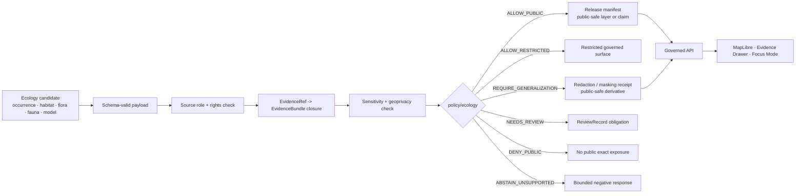

<!-- [KFM_META_BLOCK_V2]
doc_id: kfm://doc/<TODO-policy-ecology-readme-uuid>
title: Ecology Policy
type: standard
version: v1
status: draft
owners: <TODO_VERIFY_OWNER>
created: <TODO_VERIFY_CREATED_YYYY-MM-DD>
updated: 2026-04-29
policy_label: <TODO_VERIFY_POLICY_LABEL>
related: [../README.md, ../bundles/README.md, ../fixtures/README.md, ../tests/README.md, ../policy-runtime/README.md, ../../contracts/README.md, ../../schemas/README.md, ../../data/README.md, ../../tests/policy/README.md, ../../tools/validators/README.md]
tags: [kfm, policy, ecology, biodiversity, habitat, fauna, flora, sensitivity, geoprivacy]
notes: [Target file requested as policy/ecology/README.md; no mounted KFM repository was available during this drafting session, so doc_id, owner, created date, policy label, active-branch inventory, and exact related-link validity need repo-backed verification.]
[/KFM_META_BLOCK_V2] -->

<a id="top"></a>

# Ecology Policy

Deny-by-default policy guidance for ecology claims, biodiversity sensitivity, source-role authority, geoprivacy, and public-safe ecological publication in KFM.

<div align="left">


</div>

> [!IMPORTANT]
> **Status:** experimental  
> **Owners:** `<TODO_VERIFY_OWNER>`  
> **Path:** `policy/ecology/README.md`  
> **Authority class:** supporting policy leaf under `policy/`  
> **Truth posture:** **CONFIRMED** KFM ecology/governance doctrine; **PROPOSED** local file shape and rule families; **UNKNOWN** current repo implementation depth  
> **Quick jumps:** [Scope](#scope) · [Repo fit](#repo-fit) · [Accepted inputs](#accepted-inputs) · [Exclusions](#exclusions) · [Current evidence boundary](#current-evidence-boundary) · [Directory tree](#directory-tree) · [Quickstart](#quickstart) · [Usage](#usage) · [Diagram](#diagram) · [Operating tables](#operating-tables) · [Task list](#task-list--definition-of-done) · [FAQ](#faq) · [Appendix](#appendix)

> [!WARNING]
> This README is not proof that `policy/ecology/` already exists on the active branch. It is a repo-ready target document for the requested path. Before merge, verify the active checkout, ownership, parent policy conventions, schema homes, runner tooling, and relative links.

---

## Scope

`policy/ecology/` governs **policy decisions for ecology-related claims**, not ecology data itself.

This lane is for policy rules and review guidance that decide whether ecology, habitat, fauna, flora, biodiversity, or ecosystem-service material may be released, generalized, restricted, held for review, or denied from public surfaces.

The core policy question is:

> Can this ecological claim or layer be exposed to this audience, at this precision, with this evidence, source role, rights posture, sensitivity treatment, review state, and release state?

### In scope

| Policy concern | What this leaf should decide |
|---|---|
| **Source-role authority** | Whether a source is suitable for the claim being made: legal status, occurrence evidence, specimen evidence, monitoring evidence, habitat context, model support, or corroboration. |
| **Sensitive-location handling** | Whether exact coordinates, nest/den/roost/hibernacula/spawning locations, rare plant localities, steward-controlled records, or private-land observations must be denied, held, generalized, masked, or redacted. |
| **Rights and release posture** | Whether record-level rights, source terms, steward permissions, attribution, or redistribution limits block public release. |
| **Habitat / fauna / flora separation** | Whether a policy payload incorrectly treats a habitat surface as occurrence proof, a range map as a specimen, a model output as an observation, or a public generalized layer as internal truth. |
| **Evidence and review gates** | Whether `EvidenceRef` resolution, `EvidenceBundle` closure, review record, redaction receipt, catalog linkage, and release state are sufficient for the requested exposure. |
| **Public UI and AI safety** | Whether MapLibre popups, Evidence Drawer payloads, Focus Mode answers, exports, and story nodes may present the claim or must return a bounded negative outcome. |

[Back to top](#top)

---

## Repo fit

`policy/ecology/README.md` is a **child policy lane** under the parent policy surface. It should consume validated contract inputs and produce policy dispositions; it must not become the schema home, source registry, data lifecycle, validator suite, publication system, or UI runtime.

| Direction | Surface | Relationship |
|---|---|---|
| Upstream | [`../README.md`](../README.md) | Parent policy surface. Defines repo-wide policy role, deny-by-default posture, and policy authority boundaries. |
| Sibling | [`../bundles/README.md`](../bundles/README.md) | Candidate home for bundle-level rule packs. Ecology bundles should follow parent bundle conventions if present. |
| Sibling | [`../fixtures/README.md`](../fixtures/README.md) | Candidate home for policy fixtures. Ecology fixtures should prove allow, deny, abstain, hold, review, redaction, and generalization behavior. |
| Sibling | [`../tests/README.md`](../tests/README.md) | Candidate home for bundle-local assertions. Repo-wide proof still belongs under `tests/`. |
| Sibling | [`../policy-runtime/README.md`](../policy-runtime/README.md) | Runtime coordination lane. Ecology policy should not hide runtime mediation here. |
| Lateral | [`../../contracts/README.md`](../../contracts/README.md) | Contract authority for trust-bearing objects such as `DecisionEnvelope`, `EvidenceBundle`, release manifests, and runtime envelopes if verified in repo. |
| Lateral | [`../../schemas/README.md`](../../schemas/README.md) | Schema authority or schema-adjacent documentation. This README must not resolve `contracts/` versus `schemas/` by duplication. |
| Lateral | [`../../data/README.md`](../../data/README.md) | Lifecycle zones and released artifacts. Ecology policy governs exposure but does not own raw, work, quarantine, processed, catalog, proof, or published data. |
| Downstream | [`../../tests/policy/README.md`](../../tests/policy/README.md) | Repo-facing policy behavior verification. Ecology policy changes that affect release or runtime behavior need tests here or in the repo-confirmed equivalent. |
| Downstream | [`../../tools/validators/README.md`](../../tools/validators/README.md) | Validator lane. Validators should verify structure and proof closure before policy decides exposure. |

> [!NOTE]
> Some related paths are doctrine-aligned but still **NEEDS VERIFICATION** in the active checkout. Do not merge this file until relative links are checked from `policy/ecology/`.

[Back to top](#top)

---

## Accepted inputs

`policy/ecology/` should stay compact, typed, and reviewable.

| Input class | What belongs here | Examples |
|---|---|---|
| Ecology policy rules | Rule packs that evaluate ecological exposure and publication decisions | sensitivity rules, source-role rules, public precision rules, rights gates, review obligations |
| Policy fixtures | Small positive and negative payloads that prove policy behavior | public-safe habitat context, restricted rare-species occurrence, unknown rights record, modeled habitat mistaken as occurrence |
| Reason and obligation mappings | Local mappings only when they are repo-approved and do not duplicate shared vocabularies | `SENSITIVE_EXACT_LOCATION_PUBLIC_REQUEST`, `UNKNOWN_RIGHTS`, `SOURCE_ROLE_MISMATCH`, `REQUIRES_GEOPRIVACY_RECEIPT` |
| Review notes | Lightweight guidance for ecology-specific review burden | steward review expectations, exact-location denial rules, public aggregation thresholds |
| Bundle manifests | Manifests that identify ecology policy bundles and fixtures | bundle ID, version, owner, related contracts, fixture paths, validator expectations |

### Input prerequisites

Before an ecology policy rule makes a release decision, the candidate payload should already be:

- schema-valid against the repo-confirmed contract home;
- tied to a source descriptor or source-role registry entry;
- resolved or resolvable through `EvidenceRef` → `EvidenceBundle`;
- labeled for sensitivity, rights, review, and release state;
- explicit about spatial support, precision, time support, and uncertainty;
- bounded to a requested audience or surface.

[Back to top](#top)

---

## Exclusions

Do not place these here.

| Excluded item | Where it should go instead | Why |
|---|---|---|
| Raw occurrence records, specimen records, monitoring records, or source downloads | `data/raw/`, `data/work/`, `data/quarantine/`, or repo-confirmed ecology lifecycle homes | Policy evaluates exposure; it does not store ecological truth. |
| Habitat rasters, range maps, PMTiles, GeoParquet, or public layer assets | `data/processed/`, `data/published/`, catalog/release homes, or repo-confirmed delivery surfaces | Derived artifacts must remain rebuildable and cataloged. |
| Source descriptors and source-role registries | `data/registry/`, `docs/domains/*`, or repo-confirmed registry homes | Policy consumes source roles; it should not become the source registry. |
| JSON Schemas, OpenAPI, DTO definitions, or shared trust-object contracts | `contracts/`, `schemas/`, or repo-confirmed machine-contract homes | Avoid parallel contract authority. |
| Validators, ingestion probes, and source fetchers | `tools/validators/`, `tools/probes/`, pipeline homes, or repo-confirmed equivalents | Validation and observation happen before policy decisions. |
| MapLibre components, Evidence Drawer components, Focus Mode UI, or AI adapters | `apps/`, `packages/`, `docs/`, or repo-confirmed runtime/UI homes | Policy returns dispositions; UI and AI consume governed outcomes. |
| Live source credentials, restricted access keys, or steward-only sensitive records | secure runtime/secret management and restricted data homes | This README is public-facing documentation unless reclassified. |

[Back to top](#top)

---

## Current evidence boundary

**CONFIRMED in this drafting session**

- The requested target path is `policy/ecology/README.md`.
- The visible workspace available during drafting did not expose a mounted KFM Git checkout.
- Attached KFM doctrine consistently treats KFM as governed, evidence-first, map-first, time-aware, and policy-aware.
- Attached KFM ecology-adjacent doctrine treats habitat, fauna, and flora as distinct governed lanes with source-role, sensitivity, public-safety, and evidence-bundle requirements.

**PROPOSED in this README**

- The local `policy/ecology/` directory shape.
- Ecology-specific rule bundle names.
- Example disposition names and reason codes.
- Fixture groups, quickstart commands, and task list.

**UNKNOWN until active repo verification**

- Whether `policy/ecology/` already exists.
- Whether `policy/` uses Rego, JSON policy data, TypeScript, Python, another engine, or a mixed pattern for this leaf.
- Whether `contracts/` or `schemas/` is the canonical machine-contract home for ecology policy payloads.
- Exact owners, `CODEOWNERS` coverage, workflow gates, branch protections, current fixtures, and active CI behavior.

[Back to top](#top)

---

## Directory tree

### Target leaf map

```text
policy/
└── ecology/
    └── README.md
```

### Doctrine-aligned local growth shape

The structure below is **PROPOSED**. Keep it as a starter map, not a claim of checked-in files.

<details>
<summary><strong>PROPOSED ecology policy shape</strong></summary>

```text
policy/ecology/
├── README.md
├── bundles/
│   ├── source_roles.rego
│   ├── sensitivity.rego
│   ├── rights.rego
│   ├── geoprivacy.rego
│   ├── publication.rego
│   └── runtime.rego
├── fixtures/
│   ├── allow/
│   │   └── public_habitat_context.fixture.json
│   ├── deny/
│   │   └── sensitive_exact_occurrence_public.fixture.json
│   ├── abstain/
│   │   └── modeled_habitat_used_as_occurrence.fixture.json
│   ├── needs-review/
│   │   └── unknown_rights_pollinator_record.fixture.json
│   └── generalize/
│       └── rare_species_grid_mask.fixture.json
├── tests/
│   └── README.md
└── ecology_policy_profiles.json
```

</details>

### Reading rule

Use the tree above only after the real checkout confirms parent conventions. If the repo already has a different policy layout, preserve the **policy semantics** and adapt the filenames through an ADR or migration note.

[Back to top](#top)

---

## Quickstart

Run these from the repository root after mounting the real KFM checkout.

### 1. Inspect the current policy surface

```bash
find policy -maxdepth 4 \( -type f -o -type d \) 2>/dev/null | sort

sed -n '1,260p' policy/README.md 2>/dev/null || true
sed -n '1,220p' policy/bundles/README.md 2>/dev/null || true
sed -n '1,220p' policy/fixtures/README.md 2>/dev/null || true
sed -n '1,220p' policy/tests/README.md 2>/dev/null || true
sed -n '1,220p' policy/policy-runtime/README.md 2>/dev/null || true
```

### 2. Verify ecology-adjacent authority before adding rules

```bash
git grep -n "habitat\|fauna\|flora\|biodiversity\|species\|taxon\|occurrence\|sensitive\|geoprivacy\|redaction\|EvidenceBundle\|DecisionEnvelope\|ReleaseManifest\|Focus Mode\|Evidence Drawer" -- \
  policy contracts schemas data docs tools tests apps packages 2>/dev/null || true
```

### 3. Check ownership, workflow, and schema-home signals

```bash
sed -n '1,220p' .github/CODEOWNERS 2>/dev/null || true
sed -n '1,260p' .github/workflows/README.md 2>/dev/null || true
sed -n '1,260p' contracts/README.md 2>/dev/null || true
sed -n '1,260p' schemas/README.md 2>/dev/null || true
```

### 4. Run policy checks only after the runner is verified

```bash
# Example only. Replace with the repo-confirmed policy runner.
conftest test policy/ecology/fixtures \
  --policy policy/ecology/bundles
```

> [!CAUTION]
> Do not add live-source checks to policy tests. Ecology policy fixtures should be no-network, deterministic, and small enough to review in a pull request.

[Back to top](#top)

---

## Usage

### Policy evaluation posture

An ecology policy decision should be made over a validated candidate payload, not over raw source files or rendered map features.

```text
candidate payload
  -> schema / contract validation
  -> source-role and rights resolution
  -> evidence bundle closure
  -> sensitivity and geoprivacy checks
  -> review and release-state checks
  -> ecology policy disposition
```

### Descriptive disposition set

Use repo-confirmed `DecisionEnvelope` or policy enums if they exist. Until verified, treat these as descriptive placeholders.

| Disposition | Use when | Public-facing effect |
|---|---|---|
| `ALLOW_PUBLIC` | Evidence, rights, review, sensitivity, and release state support public exposure at requested precision. | Claim or layer may be exposed through governed release surfaces. |
| `ALLOW_RESTRICTED` | Evidence is valid but the audience or precision must be restricted. | Restricted API or steward-only surface only. |
| `REQUIRE_GENERALIZATION` | Claim may be public only after masking, aggregation, grid/H3 generalization, or geometry suppression. | Public exact geometry denied; public-safe derivative may proceed after receipt. |
| `NEEDS_REVIEW` | Steward, rights, taxonomy, sensitivity, or release-state review is incomplete. | Hold; do not publish. |
| `DENY_PUBLIC` | Public exposure would leak sensitive exact location, private/steward-controlled record detail, rights-restricted material, or unsupported authority. | Deny from public UI, export, API, AI, and story surfaces. |
| `ABSTAIN_UNSUPPORTED` | The requested claim type is not supported by the evidence role or release state. | Return a bounded negative outcome with reason and obligation codes. |

### Rule of thumb

If the candidate cannot explain **what it is**, **where it came from**, **what role the source plays**, **what precision is safe**, **what review state applies**, and **what evidence bundle supports it**, the safe policy outcome is not public release.

[Back to top](#top)

---

## Diagram



> [!IMPORTANT]
> Map features, AI answers, story nodes, popups, and exports are downstream of this policy path. They must not read raw ecology stores or unpublished candidate data as a shortcut.

[Back to top](#top)

---

## Operating tables

### Ecology policy pressure matrix

| Pressure | Default policy posture | Required proof before public release |
|---|---|---|
| Sensitive exact occurrence geometry | Deny public exact exposure. | Geoprivacy transform, redaction/generalization receipt, review state, and release-safe derivative. |
| Unknown rights or unclear redistribution terms | Hold or deny public release. | Source terms, rights profile, attribution, record-level license handling, and review decision. |
| Occurrence aggregator used for legal status | Deny or abstain. | Legal/status claims require a verified authoritative status source, not occurrence corroboration alone. |
| Modeled habitat used as occurrence proof | Abstain or require claim rewrite. | Evidence role must match claim role; habitat model is context/support unless separately reviewed. |
| Public layer without EvidenceBundle closure | Hold. | `EvidenceRef` resolution to `EvidenceBundle`, catalog linkage, review state, and release manifest. |
| Rare species, rare plants, protected habitat, nest/den/roost/hibernacula/spawning sites | Deny public exact detail by default. | Steward-approved publication profile and public-safe geometry. |
| Private land or controlled-access observations | Hold or restrict. | Privacy, rights, steward, and access-class review. |
| AI/Focus Mode answer about ecology claim | Answer only from released evidence; otherwise abstain or deny. | Runtime response must cite evidence and preserve policy outcome. |

### Source-role guide

These are policy role examples, not active connector claims.

| Source family | Suitable role | Not suitable for |
|---|---|---|
| State or federal legal/status authority, once verified | Legal or conservation-status authority for its jurisdiction and scope. | Unreviewed occurrence inference outside its role. |
| Heritage / controlled rare-species systems | Sensitive occurrence context, steward-controlled review, restricted evidence. | Public exact-location publication by default. |
| Occurrence aggregators and community science records | Occurrence evidence or corroboration after quality, rights, and sensitivity checks. | Legal-status authority or unmasked public sensitive coordinates. |
| Museum, herbarium, specimen, and collection records | Specimen evidence with collection metadata and rights constraints. | Current presence claim without interpretation and review. |
| Habitat, landcover, wetland, soils, hydrology, climate, and geology layers | Environmental context, covariates, or support. | Species occurrence proof by themselves. |
| Species distribution models, range maps, habitat suitability models | Modeled context with uncertainty and support limits. | Observation/specimen/monitoring evidence unless explicitly backed. |

### Minimum public-release checks

| Check | Required before public exposure? | Notes |
|---|---:|---|
| Source descriptor or source-role reference | Yes | Unknown source role should fail closed. |
| Rights profile | Yes | Unknown rights block public release. |
| Sensitivity label | Yes | Missing sensitivity classification blocks public release. |
| Geoprivacy decision | Yes for spatial biodiversity records | Exact sensitive geometry is denied by default. |
| EvidenceBundle closure | Yes | Public claims must be reconstructable. |
| Review state | Yes | Some ecology claims require steward or domain review. |
| Release manifest / published state | Yes | Promotion is a governed transition, not a file move. |
| Correction and withdrawal path | Yes | Public releases must remain reversible. |

[Back to top](#top)

---

## Task list & definition of done

Before merging this README or adding ecology policy rules:

- [ ] Verify `policy/ecology/` existence or create it through a small PR.
- [ ] Replace `<TODO-policy-ecology-readme-uuid>` with a repo-approved `kfm://doc/<uuid>`.
- [ ] Verify owner from `CODEOWNERS` or governance records and update `<TODO_VERIFY_OWNER>`.
- [ ] Verify created date and policy label.
- [ ] Confirm parent `policy/` layout and runner conventions.
- [ ] Confirm contract/schema authority for policy input payloads.
- [ ] Add no-network ecology fixtures for at least one allow, deny, needs-review, abstain, and generalization case.
- [ ] Add tests that prove public exact sensitive occurrence geometry is denied.
- [ ] Add tests that prove unknown rights block public promotion.
- [ ] Add tests that prove habitat/model support cannot masquerade as occurrence/specimen evidence.
- [ ] Add or reference redaction/geoprivacy receipt expectations.
- [ ] Validate all relative links from `policy/ecology/README.md`.
- [ ] Record any naming or schema-home conflicts in an ADR or migration note.
- [ ] Ensure downstream UI, API, and Focus Mode surfaces consume policy outcomes rather than bypassing them.

Definition of done: this lane is merge-ready only when its README, rule bundles, fixtures, tests, and cross-links can explain exactly why an ecology candidate is public-safe, restricted, held, denied, or unsupported.

[Back to top](#top)

---

## FAQ

### Does `policy/ecology/` publish ecology layers?

No. It only decides policy dispositions over validated candidates. Publishing belongs to release and data publication surfaces.

### Can this policy use GBIF, iNaturalist, eBird, herbarium, or other occurrence records directly?

No. Policy may evaluate a payload that references those source roles, but it should not fetch, store, or normalize live source data. Record rights, sensitivity, and source-role meaning must be resolved before policy release decisions.

### Can a habitat suitability model support an occurrence claim?

Not by itself. A model can be context or support. Treating modeled habitat as occurrence evidence is a source-role mismatch unless additional occurrence/specimen/monitoring evidence supports the claim.

### Can public maps show exact sensitive species locations?

Default answer: no. Exact sensitive locations require steward approval and restricted access. Public outputs should use approved generalization, masking, aggregation, suppression, or delayed publication.

### Where should policy tests live?

Bundle-local fixtures can live near this lane if the repo uses that pattern. Repo-facing proof should also exist under `tests/policy/` or the repo-confirmed equivalent when policy affects runtime, release, correction, or public UI behavior.

[Back to top](#top)

---

## Appendix

<details>
<summary><strong>Starter ecology reason codes — PROPOSED until contract vocabulary is verified</strong></summary>

| Candidate reason code | Meaning |
|---|---|
| `SENSITIVE_EXACT_LOCATION_PUBLIC_REQUEST` | Public request asks for exact or overly precise sensitive ecological location. |
| `UNKNOWN_RIGHTS` | Source or record-level rights are not sufficient for public release. |
| `SOURCE_ROLE_MISMATCH` | Source role does not support the requested claim type. |
| `EVIDENCE_BUNDLE_MISSING` | Candidate lacks resolvable evidence closure. |
| `REVIEW_RECORD_REQUIRED` | Domain, steward, rights, or sensitivity review is required before decision. |
| `GEOPRIVACY_RECEIPT_REQUIRED` | Public-safe derivative requires masking/redaction/generalization receipt. |
| `RELEASE_STATE_NOT_PUBLISHED` | Candidate has not passed governed promotion. |
| `MODEL_OUTPUT_NOT_OBSERVATION` | Candidate treats modeled output as direct observation/specimen evidence. |
| `PUBLIC_LAYER_NOT_TRUTH_SOURCE` | Candidate relies on a rendered or generalized layer as canonical truth. |

</details>

<details>
<summary><strong>Starter ecology obligations — PROPOSED until contract vocabulary is verified</strong></summary>

| Candidate obligation | Expected action |
|---|---|
| `OBTAIN_STEWARD_REVIEW` | Secure required steward/domain review before release. |
| `VERIFY_SOURCE_TERMS` | Confirm source terms, rights, attribution, and redistribution posture. |
| `RESOLVE_EVIDENCE_BUNDLE` | Attach or resolve the supporting `EvidenceBundle`. |
| `APPLY_GEOPRIVACY_TRANSFORM` | Produce an approved generalized or redacted derivative. |
| `EMIT_REDACTION_RECEIPT` | Record the geoprivacy transform and reason. |
| `REWRITE_CLAIM_TO_MATCH_SOURCE_ROLE` | Narrow the claim so the evidence role can support it. |
| `ROUTE_TO_RESTRICTED_SURFACE` | Keep valid but sensitive material off public surfaces. |
| `ADD_NEGATIVE_FIXTURE` | Add a regression fixture for the failure mode before merge. |

</details>

<details>
<summary><strong>Pre-publish checklist</strong></summary>

- [ ] Badges present.
- [ ] Owner placeholder resolved or explicitly approved.
- [ ] Status present.
- [ ] Quick jumps present.
- [ ] Scope, repo fit, accepted inputs, and exclusions included.
- [ ] Directory tree included and clearly truth-labeled.
- [ ] Quickstart snippets are language-tagged.
- [ ] Mermaid diagram included.
- [ ] Tables clarify source roles, gates, and outcomes.
- [ ] Task list defines completion and review gates.
- [ ] Long reference material wrapped in `<details>`.
- [ ] Relative links verified from `policy/ecology/`.
- [ ] No implementation maturity, route, schema, workflow, or test claim exceeds current evidence.
- [ ] Sensitive ecology public-release posture remains fail-closed.

</details>

[Back to top](#top)
