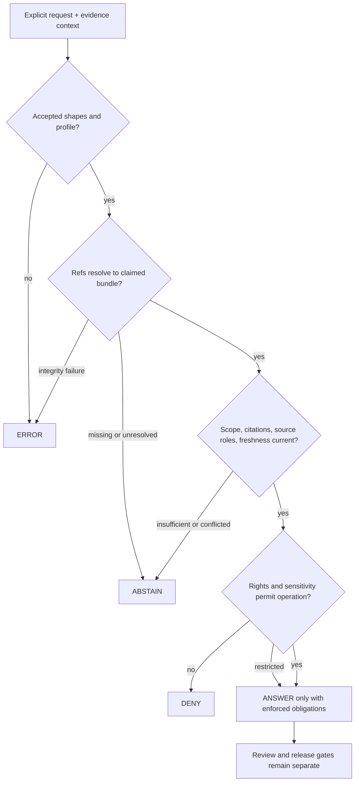

<!-- [KFM_META_BLOCK_V2]
doc_id: kfm://policy/evidence
title: policy/evidence/ — Evidence Admissibility and Claim-Support Boundary
type: policy-readme; directory-readme; evidence-admissibility-boundary
version: v0.2
status: draft; repository-grounded; documentation-only; executable-evidence-policy-not-established
owners: OWNER_TBD — Evidence steward · Policy steward · Source steward · Rights/sensitivity steward · Validation steward · Runtime steward · Release steward · Docs steward
created: NEEDS VERIFICATION — a greenfield stub existed before v0.2
updated: 2026-07-20
policy_label: "public-governance; restricted-review; evidence-admissibility; cite-or-abstain; fail-closed; obligation-preserving; no-evidence-storage; no-proof-authority; no-release-authority; no-publication-authority"
current_path: policy/evidence/README.md
owning_root: policy/
responsibility: define and index the policy boundary for evidence admissibility, EvidenceRef resolution posture, EvidenceBundle claim support, citation sufficiency, source-role preservation, rights, sensitivity, freshness, correction, and public-safe finite outcomes without becoming contract, schema, validator, resolver, evidence store, proof store, receipt store, release authority, or publisher
truth_posture: CONFIRMED target stub, singular policy root, EvidenceRef and EvidenceBundle contracts, fielded PROPOSED schemas, minimal schema fixtures, dedicated shape validators, focused EvidenceRef validator tests, generic evidence-family schema harness, closed PolicyDecision outcome enum, policy/evidence schema pointers, read-only pull-request workflows, and scaffolded resolver package / PROPOSED evidence-admissibility input, gate sequence, reason codes, obligations, composition, runtime binding, and implementation sequence / CONFLICTED EvidenceBundle schema naming variants and evidence-policy-family representation in the current PolicyDecision enum / UNKNOWN active evidence-policy rules, accepted bundle, evaluator binding, exhaustive consumers, current CI results, branch-protection significance, production enforcement, receipt emission, and release integration / NEEDS VERIFICATION owners, accepted outcome mapping, direct policy modules, evidence-policy fixtures and tests, reason-code and obligation registries, resolver-to-policy integration, correction propagation, and rollback automation
evidence_snapshot:
  repository: bartytime4life/Kansas-Frontier-Matrix
  visibility: public
  base_ref: main
  base_commit: 2b31ccbd9ba5b3fe6772ea1b0165eca45bdfebb0
  prior_blob: 61f9a3f699e69fef56e0fe04a6a415ff539f0363
  inventory_method: authenticated GitHub connector reads of the target, governing placement doctrine, adjacent policy lanes, evidence contracts and schemas, fixtures, validators, tests, resolver package, ADRs, drift register, CODEOWNERS, pull-request template, and triggering workflows
  direct_lane_files_confirmed:
    - policy/evidence/README.md
  bounded_inventory_note: the target README was read directly; no active evidence-policy rule module, accepted bundle membership, runtime evaluator binding, emitted PolicyDecision, release integration, or production enforcement was established by this documentation task; bounded non-observation is not proof of permanent absence
related:
  - ../README.md
  - ../decision/README.md
  - ../bundles/README.md
  - ../../contracts/evidence/README.md
  - ../../contracts/evidence/evidence_ref.md
  - ../../contracts/evidence/evidence_bundle.md
  - ../../contracts/evidence/citation_validation_report.md
  - ../../contracts/policy/policy_decision.md
  - ../../schemas/contracts/v1/evidence/README.md
  - ../../schemas/contracts/v1/evidence/evidence_ref.schema.json
  - ../../schemas/contracts/v1/evidence/evidence_bundle.schema.json
  - ../../schemas/contracts/v1/policy/policy_decision.schema.json
  - ../../fixtures/contracts/v1/evidence/evidence_ref/README.md
  - ../../fixtures/contracts/v1/evidence/evidence_bundle/README.md
  - ../../tools/validators/validate_evidence_ref.py
  - ../../tools/validators/validate_evidence_bundle.py
  - ../../tests/schemas/test_common_contracts.py
  - ../../tests/schemas/test_evidence_ref_validator.py
  - ../../packages/evidence-resolver/README.md
  - ../../data/proofs/README.md
  - ../../data/receipts/README.md
  - ../../release/README.md
  - ../../docs/doctrine/directory-rules.md
  - ../../docs/architecture/contract-schema-policy-split.md
  - ../../docs/registers/DRIFT_REGISTER.md
  - ../../.github/workflows/policy-test.yml
  - ../../.github/workflows/evidence-resolver.yml
tags: [kfm, policy, evidence, EvidenceRef, EvidenceBundle, citations, source-role, rights, sensitivity, freshness, correction, cite-or-abstain, fail-closed, finite-outcomes, obligations, release-gated]
notes:
  - "v0.2 replaces the one-line greenfield stub with a repository-grounded evidence-policy boundary."
  - "Shape validation is confirmed for a bounded evidence slice; evidence resolution, admissibility evaluation, and public enforcement are not established."
  - "This README defines policy posture and implementation obligations. It is not executable policy and does not authorize release or publication."
[/KFM_META_BLOCK_V2] -->

<a id="top"></a>

# Evidence Admissibility and Claim-Support Policy

`policy/evidence/`

> **One-line purpose.** Define the fail-closed policy boundary for deciding whether resolved evidence support is sufficient, permissible, current, and appropriately scoped for a requested KFM operation—without storing evidence, resolving references, proving claims, approving release, or publishing artifacts.


**Quick navigation:** [Status](#status-and-evidence-boundary) · [Purpose](#purpose) · [Authority](#authority-and-repository-fit) · [Scope](#scope) · [Inputs](#required-evaluation-input) · [Gate model](#evidence-admissibility-gate-model) · [Outcomes](#finite-outcomes-and-normalization) · [Obligations](#obligations) · [Lifecycle](#lifecycle-and-public-interface-boundary) · [Sensitivity](#rights-sensitivity-and-source-role) · [Validation](#validation-tests-and-ci) · [Implementation](#smallest-sound-implementation-sequence) · [Done](#definition-of-done) · [Open](#open-verification-register) · [Evidence](#evidence-ledger) · [Rollback](#correction-supersession-and-rollback)

> [!IMPORTANT]
> **Safe current conclusion:** the repository has fielded, `PROPOSED` EvidenceRef and EvidenceBundle schemas, minimal valid/invalid schema fixtures, dedicated schema-shape validator wrappers, a focused EvidenceRef validator test, and read-only readiness workflows. It does **not** yet establish an accepted EvidenceRef-to-EvidenceBundle resolver, active evidence-policy rules, an accepted policy bundle, evaluator binding, evidence-specific decision normalization, obligation enforcement, production consumers, or release integration.

> [!CAUTION]
> Schema-valid evidence is not necessarily admissible evidence. An EvidenceBundle is not a PolicyDecision, ReviewRecord, ReleaseManifest, or publication. A passing validator, workflow, pull request, or generated receipt must never be treated as claim truth or public-release permission.

---

## Status and evidence boundary

| Surface | Current repository evidence | Safe conclusion |
|---|---|---|
| `policy/evidence/README.md` | **CONFIRMED** one-line greenfield stub at the pinned base | The lane is declared but the prior README supplied no executable policy. |
| EvidenceRef contract | **CONFIRMED draft contract** | Defines a governed pointer and pre-closure posture; does not prove resolution. |
| EvidenceBundle contract | **CONFIRMED draft contract** | Defines claim-scope support and authority boundaries; remains `PROPOSED`. |
| Evidence schemas | **CONFIRMED fielded schemas / `PROPOSED` status** | Machine shape is defined for the inspected profiles. |
| Evidence schema naming | **CONFLICTED** | Underscore and hyphen EvidenceBundle variants are documented; no duplicate authority may be inferred. |
| Evidence fixtures | **CONFIRMED minimal shape fixtures** | EvidenceRef has two valid and three invalid documented cases; EvidenceBundle has one valid and one missing-`bundle_id` invalid case. |
| Dedicated validators | **CONFIRMED wrappers** | Both wrappers delegate to the shared JSON Schema runner; they do not resolve or evaluate evidence. |
| Focused validator tests | **CONFIRMED for EvidenceRef** | Valid and missing-`ref` CLI polarity is tested. No focused EvidenceBundle test was found at the checked path. |
| Generic schema harness | **CONFIRMED code** | Includes the `evidence` family and evaluates discovered valid/invalid fixture lanes. |
| PolicyDecision shape | **CONFIRMED closed `PROPOSED` schema** | `outcome` is limited to `ANSWER`, `ABSTAIN`, `DENY`, or `ERROR`; `policy_family` has no `evidence` value. |
| Evidence resolver package | **CONFIRMED scaffold** | Package metadata and documentation exist; production resolver implementation is not established. |
| Evidence resolver workflow | **CONFIRMED read-only readiness/hold workflow** | Checks repository boundaries and emits holds; it resolves no evidence. |
| Evidence-policy execution | **NOT ESTABLISHED** | No accepted direct rule, bundle, evaluator binding, or emitted evidence PolicyDecision was verified. |
| Current CI results and required-check status | **UNKNOWN / NEEDS VERIFICATION** | Workflow definitions exist; current run results and branch-protection significance were not inspected before authoring. |

### Truth labels

- **CONFIRMED** — verified from the pinned repository state in this update.
- **PROPOSED** — a design, gate, field, obligation, or implementation step not established as active behavior.
- **UNKNOWN** — available evidence is insufficient to support a current-state claim.
- **NEEDS VERIFICATION** — a concrete repository, runtime, policy, or review check is required.
- **CONFLICTED** — inspected authorities or representations disagree and must not be silently normalized.

[Back to top](#top)

---

## Purpose

This lane answers one bounded policy question:

> For this exact operation, claim scope, audience, and time, may the caller use the supplied resolved evidence support—and, if so, under which enforceable obligations?

The answer must preserve KFM's evidence-first posture:

- EvidenceRef identifies supporting material but does not close a claim by itself;
- EvidenceBundle carries claim-scope support but does not grant policy permission or release approval;
- source roles, citations, rights, sensitivity, transforms, integrity, freshness, review, release, correction, and rollback remain inspectable;
- generated language, map layers, tiles, graph projections, indexes, dashboards, and screenshots remain downstream carriers;
- missing or unresolved support produces a finite fail-closed outcome rather than a plausible guess.

This README is documentation and policy design guidance. It is not an executable rule module, active bundle, decision record, receipt, proof, release record, or public interface.

[Back to top](#top)

---

## Authority and repository fit

Directory Rules assign **admissibility** to the singular `policy/` responsibility root. The existing target therefore remains correctly placed under `policy/evidence/`; this revision creates no parallel contract, schema, evidence, proof, receipt, release, or publication authority.

| Responsibility | Owning surface | Role of `policy/evidence/` |
|---|---|---|
| EvidenceRef and EvidenceBundle meaning | [`contracts/evidence/`](../../contracts/evidence/README.md) | Consume the accepted semantics; never redefine them. |
| Machine-checkable evidence shape | [`schemas/contracts/v1/evidence/`](../../schemas/contracts/v1/evidence/README.md) | Require an accepted profile; never become schema authority. |
| EvidenceRef-to-EvidenceBundle helper logic | [`packages/evidence-resolver/`](../../packages/evidence-resolver/README.md) | Consume a resolver result or explicit governed snapshot; never hide lookup behavior inside policy. |
| Evidence admissibility rules and posture | `policy/evidence/` | Define reviewed allow/restrict/abstain/deny behavior and obligations when implementation is accepted. |
| Finite outcome normalization | [`policy/decision/`](../decision/README.md) | Normalize through the accepted decision model; never invent a fifth outcome. |
| Immutable evaluated policy bundle | [`policy/bundles/`](../bundles/README.md) | Package reviewed rules and pins; directory presence is not activation. |
| Valid and invalid examples | [`fixtures/contracts/v1/evidence/`](../../fixtures/contracts/v1/evidence/evidence_ref/README.md) and future policy fixtures | Prove bounded cases; never become policy authority. |
| Validator implementation | [`tools/validators/`](../../tools/validators/validate_evidence_ref.py) | Validate declared shape or semantics; never authorize use or release. |
| Enforceability proof | [`tests/`](../../tests/schemas/test_common_contracts.py) | Assert behavior; a passing test is not a decision instance. |
| Materialized proof support | [`data/proofs/`](../../data/proofs/README.md) | Store governed proof-support records; never author policy. |
| Process memory | [`data/receipts/`](../../data/receipts/README.md) | Record evaluation/transform/review activity; a receipt is not proof or approval. |
| Release, correction, withdrawal, rollback | [`release/`](../../release/README.md) | Own release-facing decisions; policy evidence is only one required input. |
| Public API, UI, map, export, search, and AI | governed application/runtime roots | Receive released, policy-filtered results only. |

### Document authority and supersession

- v0.2 supersedes the one-line stub at this same path.
- It does not create a second policy root or a new canonical evidence contract.
- No inspected ADR affecting this lane was accepted; ADR-0001, ADR-0011, and ADR-0020 remain `proposed`.
- Current contracts, schemas, executable tests, active bundle records, runtime decisions, receipts, proofs, reviews, and release records outrank this README for implementation claims.
- Authority or placement conflicts must remain visible in the drift register or an accepted ADR; they must not be resolved by prose alone.

[Back to top](#top)

---

## Scope

### In scope

- admissibility of EvidenceRef- and EvidenceBundle-backed operations;
- claim-scope sufficiency and evidence closure posture;
- unresolved, missing, stale, superseded, corrected, or conflicted support;
- source authority and source-role preservation;
- citation sufficiency and inspectability;
- rights, license, terms, sensitivity, audience, purpose, and exposure posture;
- transform, redaction, generalization, aggregation, and derivation obligations;
- integrity, checksum, and `spec_hash` posture for the accepted profile;
- finite outcomes, safe reason handling, and obligation preservation;
- public, export, map, API, search, graph, and AI evidence gates;
- correction, withdrawal, downstream invalidation, and rollback triggers.

### Out of scope

- defining EvidenceRef, EvidenceBundle, PolicyDecision, receipt, proof, review, or release object meaning;
- defining or duplicating JSON Schema;
- fetching source material or resolving references through hidden network, filesystem, registry, or model calls;
- storing EvidenceBundles, proofs, receipts, catalogs, release records, or lifecycle data;
- implementing the resolver, policy runtime, public API, UI, map, pipeline, or connector;
- source admission, release approval, deployment, or publication;
- secrets, credentials, restricted payloads, exact sensitive locations, living-person data, DNA/genomic data, or protected cultural knowledge.

[Back to top](#top)

---

## Required evaluation input

A consequential evidence decision must use an explicit, versioned caller-supplied input. Policy must not infer missing facts from a filename, directory, UI state, cached summary, model output, or ambient repository state.

| Input family | Minimum content | Fail-closed posture when unresolved |
|---|---|---|
| Requested operation | Stable operation, purpose, audience, and intended effect | No `ANSWER` outside an explicit scope. |
| Claim scope | Exact claim, spatial/temporal bounds, requested precision, and intended carrier | `ABSTAIN` or narrowed scope. |
| EvidenceRef set | References, kinds, resolver profile, and closure posture | `ABSTAIN` when material refs are missing or unresolved. |
| EvidenceBundle | Bundle identity, version/profile, claim scope, and resolved membership | `ABSTAIN` for missing closure; `ERROR` for malformed or integrity-failed closure. |
| Source support | Source records, source roles, authority limits, provenance, and source-head/freshness state | No role collapse; unresolved authority blocks an authoritative answer. |
| Citations | Citation identifiers, targets, validation state, and coverage of the claim | `ABSTAIN` when support is incomplete or cannot be inspected. |
| Rights and terms | License, use restrictions, attribution, redistribution, and expiry/change state | `DENY`, `ABSTAIN`, or restricted handling according to accepted policy. |
| Sensitivity | Domain, classification, reconstruction risk, exact-location risk, living-person/genomic flags, and required transform | Default deny or protected narrowing when policy support is missing. |
| Transform lineage | Ordered normalization, redaction, generalization, aggregation, and derivation records | `ERROR` or `ABSTAIN` when lineage is malformed or insufficient. |
| Integrity | Checksums, accepted canonicalization profile, `spec_hash`, signatures/attestations when required | `ERROR` on failed integrity; never downgrade to low confidence. |
| Time and correction | Source, observed, valid, retrieval, evaluation, release, expiry, supersession, correction, and withdrawal times where material | `ABSTAIN` or hold from use until current-head status is resolved. |
| Policy execution | Accepted bundle ID/version/digest, evaluator profile, and normalization profile | `ERROR` if the evaluated policy identity cannot be trusted. |
| Review and release | Required review state, release state, correction path, and rollback target | Policy success alone cannot authorize public release. |

The names and exact machine shape of an evidence-policy input carrier remain **PROPOSED / NEEDS VERIFICATION**. Do not add ad hoc fields to the current closed `PolicyDecision` schema to carry unresolved context.

[Back to top](#top)

---

## Evidence admissibility gate model

The gate sequence below is a **PROPOSED implementation model**, not current executable behavior.



### Gate rules

1. Validate the declared input and evidence profiles before interpreting content.
2. Resolve refs through a governed resolver or accept an explicit, independently verifiable lookup snapshot.
3. Verify bundle membership, claim scope, integrity, and current-head/correction state.
4. Preserve every source role and authority limit; corroborating, contextual, derived, restricted, or model-produced material must not silently become primary support.
5. Verify citations cover the requested claim at the requested spatial, temporal, and precision scope.
6. Evaluate rights, sensitivity, audience, purpose, and reconstruction risk.
7. Normalize to the accepted finite outcome and attach enforceable obligations.
8. Preserve review, release, correction, and rollback as separate downstream gates.

A gate may permit only the stated operation. It does not make the underlying claim true, create evidence closure, approve release, or authorize publication.

[Back to top](#top)

---

## Finite outcomes and normalization

The inspected `PolicyDecision` schema permits exactly:

```text
ANSWER | ABSTAIN | DENY | ERROR
```

| Outcome | Evidence-policy use | Must not mean |
|---|---|---|
| `ANSWER` | The exact operation is supported for the supplied scope and audience, and every required obligation is enforceable. | Universal truth, unrestricted access, review completion, release approval, or publication. |
| `ABSTAIN` | Required evidence is missing, unresolved, stale, conflicted, insufficient, outside the supported claim scope, or not responsibly citable. | Policy prohibition, evaluator failure, or permission to guess. |
| `DENY` | Rights, sensitivity, consent/access posture, protected detail, or another policy rule prohibits the requested operation. | Mere absence of evidence or a broken evaluator. |
| `ERROR` | Input shape, resolver, integrity, profile, bundle, registry, evaluator, or normalization machinery failed or cannot be trusted. | A merits-based denial or evidence-based abstention. |

### Normalization constraints

- `ALLOW`, `RESTRICT`, `HOLD`, `PASS`, and `FAIL` may appear as engine-native or operational terms only after an accepted mapping defines their meaning.
- `HOLD`, `REVIEW_REQUIRED`, `QUARANTINED`, `STALE`, and `SUPERSEDED` are not valid values in the current `PolicyDecision.outcome` field.
- The current `PolicyDecision.policy_family` enum does not contain `evidence`. Do not emit a schema-invalid family value. Evidence checks must either map to an existing accepted family for the exact operation or wait for a deliberate contract/schema decision.
- A narrowed, redacted, generalized, delayed, or audience-restricted result may remain `ANSWER` only when the narrowed scope and all obligations are explicit and enforced.
- Multi-gate composition must preserve the most protective result without converting `ERROR` into `ABSTAIN`, `ABSTAIN` into a guess, or `DENY` into a cosmetic warning.

[Back to top](#top)

---

## Obligations

The obligation names below are **PROPOSED semantics**, not a confirmed registry.

| Obligation family | Typical trigger | Required effect |
|---|---|---|
| Citation preservation | Any claim-bearing answer | Keep resolvable evidence links and claim-scope association. |
| Scope narrowing | Bundle support is narrower than the request | Answer only the supportable spatial, temporal, topical, or precision scope. |
| Redaction or generalization | Sensitive or reconstructable detail | Apply an accepted transform and retain a protected transform receipt. |
| Audience restriction | Rights, terms, role, or sensitivity limits | Return only through an authorized governed interface. |
| Attribution | License or source terms require credit | Preserve required attribution without exposing protected material. |
| Delayed exposure or reevaluation | Embargo, expiry, stale source, pending review, or correction | Prevent use until the declared trigger is satisfied. |
| Steward review | Source authority, conflict, rights, sensitivity, or correction remains unresolved | Preserve safe handles and route review without leaking restricted detail. |
| Downstream invalidation | Ref, bundle, source, citation, or release is corrected, superseded, or withdrawn | Re-evaluate dependent catalogs, projections, exports, maps, caches, and AI summaries. |
| Receipt emission | Consequential policy evaluation or transform | Record bundle/evaluator/input/result identity in an accepted receipt lane. |
| Release check | Public or semi-public use | Require independent review and release records; do not infer approval from `ANSWER`. |

An obligation is not complete merely because its name appears in a decision. Completion needs independently verifiable evidence from the owning implementation or governance surface.

[Back to top](#top)

---

## Lifecycle and public interface boundary

Evidence policy participates in—but does not perform—the lifecycle:

```text
RAW -> WORK / QUARANTINE -> PROCESSED -> CATALOG / TRIPLET -> PUBLISHED
```

| Stage or surface | Evidence-policy posture |
|---|---|
| RAW | Preserve immutable source capture, rights, provenance, and restrictions; not a public source. |
| WORK / QUARANTINE | Permit governed resolution and review only for authorized purposes; unresolved or sensitive material stays protected. |
| PROCESSED | Require transform lineage, identity, integrity, and source-role preservation. |
| CATALOG / TRIPLET | Permit discovery/projection only with non-authority labeling and resolvable support. |
| PUBLISHED | Require policy, evidence closure, validation, review, release, correction, and rollback support appropriate to the claim. |
| Governed API | Enforce the finite result and obligations; public clients do not choose policy bundles or read internal stores. |
| Map / Evidence Drawer | Render only policy-filtered, released evidence context; the projection is not canonical truth. |
| Export / search / graph | Preserve evidence, scope, sensitivity, correction, and release posture; derived indexes stay derived. |
| Focus Mode / AI | Retrieve and resolve evidence before generation; cite supported material or abstain. |

Promotion is a governed state transition, not a file move, schema pass, policy result, workflow result, commit, merge, or generated artifact.

[Back to top](#top)

---

## Rights, sensitivity, and source role

Evidence policy must fail closed when material rights, sensitivity, source authority, or disclosure context is unresolved.

### Source-role rules

- Preserve the role declared by the accepted source contract or registry.
- Do not promote corroborating or contextual support into primary authority merely because it agrees.
- Keep derived and model-produced material visibly downstream of the sources and transforms that produced it.
- Keep restricted material usable only within its authorized purpose and audience.
- Preserve disagreement. Source conflict is a reviewable evidence state, not a reason to average claims into false certainty.

### Sensitive-material rules

- Exact rare-species, rare-plant, archaeology, cultural, infrastructure, living-person, land/title, consent, DNA/genomic, and security-relevant detail defaults to denial, generalization, redaction, quarantine, staged access, or delayed exposure unless evidence and policy explicitly support release.
- A valid checksum does not clear rights or sensitivity.
- A public source does not make every field safe to republish.
- Redaction or generalization must preserve reason, input/output identity, transform lineage, reviewer state, and rollback or correction target without exposing the protected original through public diagnostics.
- Policy, logging, tests, fixtures, and pull-request text must not leak the sensitive detail they are meant to protect.

[Back to top](#top)

---

## Validation, tests, and CI

### Confirmed repository checks

| Surface | Confirmed behavior | What it does not prove |
|---|---|---|
| `tools/validators/validate_evidence_ref.py` | Runs the shared JSON Schema validator against the EvidenceRef schema and fixture root. | Reference resolution, bundle closure, rights, sensitivity, or release. |
| `tools/validators/validate_evidence_bundle.py` | Runs the shared JSON Schema validator against the EvidenceBundle schema and fixture root. | Claim truth, citation sufficiency, current-head state, or policy permission. |
| `tests/schemas/test_evidence_ref_validator.py` | Checks valid EvidenceRef acceptance and missing-`ref` rejection. | Cross-record resolution or evidence policy. |
| `tests/schemas/test_common_contracts.py` | Includes the evidence family and checks discovered valid/invalid schema fixtures. | Complete evidence-family coverage, semantic closure, or policy enforcement. |
| `.github/workflows/evidence-resolver.yml` | Performs read-only readiness checks and explicit holds. | No evidence is resolved and no policy decision is emitted. |
| `.github/workflows/policy-test.yml` | Preserves policy-test readiness holds with read-only permissions. | No policy bundle is evaluated. |
| `contracts-validate.yml` and `schema-validation.yml` | Run repository-owned schema/contract checks on pull requests. | A green result is not evidence truth, release approval, or publication. |

### Repository-native commands

These commands are grounded in the inspected paths but were **not run in this API-only documentation task**:

```bash
python tools/validators/validate_evidence_ref.py \
  fixtures/contracts/v1/evidence/evidence_ref/valid/valid_1.json

python tools/validators/validate_evidence_bundle.py \
  fixtures/contracts/v1/evidence/evidence_bundle/valid/valid_1.json

python -m pytest -q tests/schemas/test_evidence_ref_validator.py
python -m pytest -q tests/schemas/test_common_contracts.py
make test
```

### Required future negative cases

| Case | Required fail-closed posture |
|---|---|
| Missing required EvidenceRef field or unsupported `kind` | `ERROR` at input/shape validation. |
| EvidenceRef cannot resolve | `ABSTAIN` with a safe unresolved-reference reason. |
| `bundle_ref` does not resolve | `ABSTAIN`, unless integrity evidence indicates `ERROR`. |
| Bundle membership or digest mismatch | `ERROR`; never silently rebuild or substitute support. |
| Bundle claim scope is narrower than the request | Narrowed `ANSWER` with obligations or `ABSTAIN`. |
| Citation set does not support the requested claim | `ABSTAIN`. |
| Source authority or role is conflicted | `ABSTAIN` pending review; preserve the conflict. |
| Rights or terms are missing or expired | No `ANSWER`; exact `ABSTAIN` versus `DENY` mapping requires accepted policy. |
| Sensitivity policy prohibits the requested detail | `DENY` or an explicitly policy-approved narrower result. |
| Transform lineage is missing or malformed | `ERROR` or `ABSTAIN` according to the accepted boundary; never infer a transform. |
| Evidence is stale, superseded, corrected, or withdrawn | No stale `ANSWER`; route correction/current-head review. |
| Policy bundle, evaluator, or normalization profile cannot be trusted | `ERROR`. |
| Shape-valid EvidenceBundle conflicts with release state | Block public use; policy success does not override release. |
| Diagnostic would expose protected evidence | Return a safe reason and protected internal handle only. |

[Back to top](#top)

---

## Smallest sound implementation sequence

1. Resolve the EvidenceBundle duplicate-name/profile conflict without creating parallel schema authority.
2. Accept the evidence-policy input boundary, finite outcome mapping, policy-family representation, reason-code registry, and obligation registry.
3. Define deterministic resolver input/result semantics and implement no-hidden-I/O EvidenceRef-to-EvidenceBundle resolution with valid, unresolved, denied, stale, corrected, mismatched, and error fixtures.
4. Add reviewed evidence-policy rules under this lane using exact filenames chosen from repository convention; keep rule source separate from immutable evaluated bundles.
5. Add policy fixtures and tests for `ANSWER`, `ABSTAIN`, `DENY`, and `ERROR`, including obligation enforcement and sensitive diagnostic redaction.
6. Pin the accepted policy bundle, evaluator version, normalization profile, and replay inputs; prove CI/runtime digest parity.
7. Integrate the governed API and internal consumers so they preserve outcomes and obligations without exposing internal stores or allowing clients to choose policy.
8. Emit accepted receipts and connect evidence policy to review, release, correction, withdrawal, and rollback gates.
9. Record current runs, owners, branch-protection significance, and production enforcement before advancing maturity labels.

Exact new filenames, module names, registry IDs, and bundle formats remain **NEEDS VERIFICATION** until the relevant stewards accept them.

[Back to top](#top)

---

## Definition of done

### Documentation revision

- [x] Replaces the greenfield stub without creating a parallel authority.
- [x] States scope, exclusions, repository fit, inputs, finite outcomes, obligations, failure modes, validation, implementation sequence, and rollback.
- [x] Distinguishes confirmed shape validation from unproved resolution and policy enforcement.
- [x] Surfaces schema naming and PolicyDecision family conflicts.
- [x] Preserves cite-or-abstain, fail-closed sensitivity, lifecycle, public-interface, correction, and rollback invariants.
- [x] Uses only verified repository-relative links in this revision.

### Executable evidence-policy capability

- [ ] Evidence policy owners and independent review roles are accepted.
- [ ] EvidenceRef/EvidenceBundle canonical profiles and resolver semantics are accepted.
- [ ] Evidence-policy input, reason, obligation, and policy-family representations are contract/schema-backed.
- [ ] Direct policy rules, valid/invalid/denied/abstain/error fixtures, and deterministic tests exist.
- [ ] Accepted bundle/evaluator/digest and CI/runtime parity are proved.
- [ ] Resolver, policy, governed API, receipts, review, release, correction, and rollback are integrated.
- [ ] Sensitive diagnostics and public projections are proven non-leaking.
- [ ] Current CI, branch-protection, runtime, and release evidence supports promotion.

This README being complete does not make the executable capability complete.

[Back to top](#top)

---

## Open verification register

| Item | Status | Evidence needed |
|---|---|---|
| Evidence-policy owners and separation of duties | **NEEDS VERIFICATION** | Accepted stewardship assignments and review records. |
| Direct `policy/evidence/` rule inventory | **UNKNOWN** beyond the directly read README | Complete tree or mounted checkout at the final head. |
| Canonical EvidenceBundle schema/profile | **CONFLICTED / NEEDS VERIFICATION** | Schema-steward decision plus migration/deprecation evidence for duplicate variants. |
| Evidence policy family in `PolicyDecision` | **CONFLICTED / NEEDS VERIFICATION** | Accepted mapping to an existing family or reviewed contract/schema revision. |
| Resolver result contract and implementation | **NOT ESTABLISHED** | Accepted semantics, code, deterministic fixtures, tests, and consumer evidence. |
| Evidence reason-code and obligation registries | **NOT ESTABLISHED** | Accepted machine registries, tests, and compatibility rules. |
| Active policy bundle and evaluator | **UNKNOWN** | Immutable bundle manifest, digest, selector, evaluator profile, and review evidence. |
| Runtime and governed API consumers | **UNKNOWN** | Exhaustive imports/routes/adapters plus runtime tests or traces. |
| Receipt, proof, review, and release integration | **UNKNOWN** | Emitted records and tests linking one decision through correction and rollback. |
| Current workflow results | **NEEDS VERIFICATION** | Pull-request checks for the resulting commit. |
| Required-check / branch-protection status | **UNKNOWN** | Repository ruleset or branch-protection evidence. |
| Production enforcement and public safety | **UNKNOWN** | Deployment configuration, policy digest parity, runtime logs, and governed release evidence. |

[Back to top](#top)

---

## Evidence ledger

Evidence was read from `bartytime4life/Kansas-Frontier-Matrix@2b31ccbd9ba5b3fe6772ea1b0165eca45bdfebb0` unless otherwise stated.

| Evidence | Status | Supports | Does not prove |
|---|---|---|---|
| Prior `policy/evidence/README.md` blob `61f9a3f699e69fef56e0fe04a6a415ff539f0363` | **CONFIRMED** | Target existed as a one-line greenfield stub. | Executable policy, ownership, or current maturity. |
| [`docs/doctrine/directory-rules.md`](../../docs/doctrine/directory-rules.md) | **CONFIRMED doctrine file** | Singular `policy/` placement and responsibility-root separation. | That any specific rule module or evaluator exists. |
| [`docs/architecture/contract-schema-policy-split.md`](../../docs/architecture/contract-schema-policy-split.md) | **CONFIRMED draft architecture file** | Meaning/shape/admissibility/test separation. | Accepted ADR status or runtime enforcement. |
| [`contracts/evidence/evidence_ref.md`](../../contracts/evidence/evidence_ref.md) | **CONFIRMED draft contract** | EvidenceRef pointer meaning, closure limits, and public/AI posture. | Resolution, policy, review, or release behavior. |
| [`contracts/evidence/evidence_bundle.md`](../../contracts/evidence/evidence_bundle.md) | **CONFIRMED draft contract** | EvidenceBundle claim-support meaning and authority boundaries. | Claim truth, policy permission, or release approval. |
| [`evidence_ref.schema.json`](../../schemas/contracts/v1/evidence/evidence_ref.schema.json) | **CONFIRMED fielded `PROPOSED` schema** | Required `ref` and `kind`, optional `bundle_ref`, closed shape, fixture/validator/policy pointers. | Referential resolution or bundle closure. |
| [`evidence_bundle.schema.json`](../../schemas/contracts/v1/evidence/evidence_bundle.schema.json) | **CONFIRMED fielded `PROPOSED` schema** | Required claim scope, refs, sources, citations, rights, sensitivity, transforms, checksums, and spec hash. | Admissibility, freshness, current-head status, or release. |
| Evidence fixture READMEs | **CONFIRMED minimal inventory** | Bounded positive/negative schema cases. | Complete semantic, resolver, policy, or sensitive-case coverage. |
| Evidence validator wrappers | **CONFIRMED executable source** | JSON Schema runner binding and fixture roots. | Evidence-policy evaluation. |
| [`tests/schemas/test_evidence_ref_validator.py`](../../tests/schemas/test_evidence_ref_validator.py) | **CONFIRMED executable test source** | Valid and missing-`ref` CLI polarity. | Cross-record resolution or production behavior. |
| [`tests/schemas/test_common_contracts.py`](../../tests/schemas/test_common_contracts.py) | **CONFIRMED executable test source** | Evidence-family discovery and valid/invalid schema behavior. | Non-vacuous coverage of every evidence schema or policy behavior. |
| [`policy_decision.schema.json`](../../schemas/contracts/v1/policy/policy_decision.schema.json) | **CONFIRMED closed `PROPOSED` schema** | Four outcomes and current policy-family enum. | Accepted evidence-family mapping, evaluator, or emitted decisions. |
| [`packages/evidence-resolver/README.md`](../../packages/evidence-resolver/README.md) | **CONFIRMED repository-grounded package README** | Resolver package is documented as a scaffold with unresolved profile conflicts. | Current production resolver implementation. |
| [`evidence-resolver.yml`](../../.github/workflows/evidence-resolver.yml) | **CONFIRMED read-only workflow** | Readiness checks, explicit holds, and no publication authority. | Successful current run or resolved evidence. |
| [`policy-test.yml`](../../.github/workflows/policy-test.yml) | **CONFIRMED read-only workflow** | Policy readiness holds and no emitted PolicyDecision. | Active policy evaluation. |
| [`docs/registers/DRIFT_REGISTER.md`](../../docs/registers/DRIFT_REGISTER.md) | **CONFIRMED register file** | Existing repository drift tracking surface. | That every evidence-policy conflict is registered or resolved. |

[Back to top](#top)

---

## Correction, supersession, and rollback

Correct this README when:

- the target lane gains, loses, renames, or activates policy rules;
- EvidenceRef, EvidenceBundle, PolicyDecision, resolver, or bundle profiles change;
- reason codes, obligations, policy-family mapping, fixtures, tests, workflows, consumers, or release gates become accepted;
- a current-state claim no longer matches the repository;
- a rights, sensitivity, source-role, correction, or public-safety rule changes.

Correction must preserve the superseded statement, why it changed, the evidence for the correction, downstream impact, and the rollback target where material. Do not erase historical uncertainty by rewriting it as if it never existed.

Rollback target for this documentation revision:

```text
prior blob: 61f9a3f699e69fef56e0fe04a6a415ff539f0363
```

Before merge, rollback means leaving or closing the draft pull request; branch deletion requires separate authorization. After merge, create a transparent revert of the documentation commit and re-run applicable checks. Reverting this README changes documentation only; it does not alter evidence records, policy rules, bundles, schemas, contracts, fixtures, tests, validators, resolver behavior, runtime decisions, receipts, proofs, release state, deployment, or publication.

[Back to top](#top)
