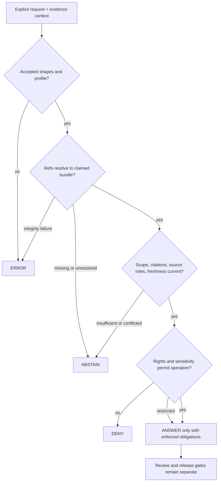

<!-- [KFM_META_BLOCK_V2]
doc_id: kfm://policy/evidence
title: policy/evidence/ — Evidence Admissibility and Claim-Support Boundary
type: policy-readme; directory-readme; boundary-compact; evidence-admissibility-boundary
version: v0.3
status: draft; repository-grounded; current-state-reconciled; documentation-only; bounded-resolver-candidate; executable-evidence-policy-not-established; evaluator-unbound; fail-closed; non-release; non-publication
owner: NEEDS VERIFICATION — .github/CODEOWNERS routes /policy/ to @bartytime4life; accepted evidence stewardship, separation of duties, and independent approval controls remain unproved
created: NEEDS VERIFICATION — an initial empty path preceded the 2026-05-08 greenfield stub
updated: 2026-08-13
policy_label: repository-facing; evidence-admissibility; cite-or-abstain; fail-closed; obligation-preserving; no-evidence-storage; no-proof-authority; no-release-authority; no-publication-authority
current_path: policy/evidence/README.md
owning_root: policy/
canonical_relationship: PROPOSED evidence-admissibility source boundary; the bounded evidence-resolver candidate is a non-authoritative helper, bundle_closure_required.rego is an untested greenfield stub, and neither establishes active policy, an accepted bundle, evaluator binding, or public permission
directory_governance: accepted ADR-0029 adopts Directory Rules v2; policy/ is the singular policy-source root; this same-path BOUNDARY_COMPACT README remains documentation-only
evidence_snapshot:
  repository: bartytime4life/Kansas-Frontier-Matrix
  visibility: public
  base_ref: main
  base_commit: 163110232387b4442c2fcd73d2ea3b79fd39484a
  target_baseline_blob: a940ded7c4ae299dd5e6a70764c1e7dd7292b9e7
  target_initial_empty_blob: 8b137891791fe96927ad78e64b0aad7bded08bdc
  target_greenfield_stub_blob: 61f9a3f699e69fef56e0fe04a6a415ff539f0363
  evidence_rego_blob: d60a9ea030ca57f5d577dabd760343e9d73a725c
  policy_root_blob: 6c5021f9d92778581a4e9331a9dd6ddb7efc5e35
  decision_policy_readme_blob: 1ab41e00cb77c0bb34e2169a13261486f5b9c7dd
  bundles_policy_readme_blob: 77f59c399fbce668c916cbbc385009121d6169f4
  evidence_contract_root_blob: e0eaf9072faf42edc020787bb6926be9fc5c49e1
  evidence_ref_contract_blob: afd3a964435445edbb694b5edf16e2b6ddd49a92
  evidence_bundle_contract_blob: 731c348832add23cddd14e796aa56ce2b9268259
  citation_validation_report_contract_blob: 29c507e76a9c15c44f2c195b7342e93630cdc701
  policy_decision_contract_blob: ebfe97f98263e6309db6d2772cb2c5e548819650
  evidence_schema_root_blob: 57e8d9e36000147be8d56a1a8615e920f172dd13
  evidence_ref_schema_blob: 42f499df613a9d68e5ca6fc5ec75ff8058c155b9
  evidence_bundle_schema_blob: cf5256831b63dca46a5f68b168441adcf68b8751
  policy_decision_schema_blob: 1472d26a42c73f17545b4464a275412ffa1d098e
  evidence_resolver_readme_blob: d64f112e9fe6538178c74dd31cc751235781c7f3
  evidence_resolver_workflow_blob: 776bf8773ffc1f00b08a04b86a747248978a539f
  policy_test_workflow_blob: ac8f125e8a4d3634d86f66836d2aa2c0e3925e75
  directory_rules_blob: fd49a0b83e55cef52c1124281f093e263526898d
  adr_0029_blob: b01322ef64f8c2b1ecb41de7ef4685b97cfa2a62
  codeowners_blob: dd2a84aa514d8ecd9208bc347f90f9a2ed37dd61
  contributing_blob: de5bf143e601e36a794e6e5442ae8f91c6f75aad
  pull_request_template_blob: c5624d7dbc2b83055421b4fb4542794bafa10bee
  open_overlapping_pull_requests_found: "0 at preflight"
  inventory_method: authenticated GitHub reads of the exact target history and direct tree, governing doctrine and ADR, adjacent policy lanes, evidence contracts and schemas, fixtures, validators, tests, bounded resolver package, workflows, ownership routing, contribution policy, and pull-request controls
  direct_lane_files_confirmed:
    - policy/evidence/README.md
    - policy/evidence/bundle_closure_required.rego
  bounded_inventory_note: the complete direct lane was inspected; no accepted evidence-admissibility rule set, evidence-native Rego test, bundle membership, evaluator binding, emitted evidence PolicyDecision, governed runtime consumer, release integration, or production enforcement was established
related:
  - ../README.md
  - ./bundle_closure_required.rego
  - ../decision/README.md
  - ../bundles/README.md
  - ../../contracts/evidence/README.md
  - ../../contracts/evidence/evidence_ref.md
  - ../../contracts/evidence/evidence_bundle.md
  - ../../contracts/evidence/citation_validation_report.md
  - ../../contracts/policy/policy_decision.md
  - ../../schemas/contracts/v1/evidence/README.md
  - ../../schemas/contracts/v1/evidence/evidence_ref.schema.json
  - ../../schemas/contracts/v1/evidence/evidence_bundle.schema.json
  - ../../schemas/contracts/v1/policy/policy_decision.schema.json
  - ../../fixtures/contracts/v1/evidence/evidence_ref/README.md
  - ../../fixtures/contracts/v1/evidence/evidence_bundle/README.md
  - ../../tools/validators/validate_evidence_ref.py
  - ../../tools/validators/validate_evidence_bundle.py
  - ../../tests/schemas/test_common_contracts.py
  - ../../tests/schemas/test_evidence_ref_validator.py
  - ../../packages/evidence-resolver/README.md
  - ../../data/proofs/README.md
  - ../../data/receipts/README.md
  - ../../release/README.md
  - ../../docs/doctrine/directory-rules.md
  - ../../docs/adr/ADR-0029-adopt-directory-governance-standard-v2.md
  - ../../docs/architecture/contract-schema-policy-split.md
  - ../../docs/registers/DRIFT_REGISTER.md
  - ../../.github/workflows/policy-test.yml
  - ../../.github/workflows/evidence-resolver.yml
  - ../../.github/CODEOWNERS
  - ../../CONTRIBUTING.md
  - ../../.github/PULL_REQUEST_TEMPLATE.md
tags: [kfm, policy, evidence, EvidenceRef, EvidenceBundle, citations, source-role, rights, sensitivity, freshness, correction, resolver-candidate, Rego-stub, cite-or-abstain, fail-closed, finite-outcomes, obligations, release-gated]
truth_posture: CONFIRMED populated v0.2 target, exact two-file direct lane, untested bundle_closure_required Rego stub with default deny false and no operative deny rule, singular policy root, accepted ADR-0029 placement, current evidence contracts and PROPOSED schemas, bounded internal v1alpha1 resolver candidate with synthetic fixtures and tests, read-only resolver CI, closed PolicyDecision outcomes without an evidence family, and broader policy-test inventory that does not evaluate this Rego lane / PROPOSED evidence-admissibility input, gate sequence, reason codes, obligations, rule semantics, bundle/evaluator binding, consumer enforcement, correction propagation, and implementation sequence / CONFLICTED EvidenceBundle schema naming/profile representations and evidence-family representation in PolicyDecision / UNKNOWN accepted evidence-policy owners, active bundle and evaluator, native evidence-policy fixtures and tests, governed consumers, decision receipts, required-check enforcement, production operation, and release integration
notes:
  - "v0.3 reconciles the existing v0.2 README with current main and preserves its substantive policy doctrine."
  - "The implemented resolver result is internal and authoritative=false; RESOLVED does not mean evidence truth, policy ANSWER, review approval, release, or publication."
  - "bundle_closure_required.rego is a proposed stub, has no operative deny rule beyond default deny=false, and has no evidence-native Rego test in the inspected lane; it must not be treated as an allow decision."
  - "This revision creates no rule semantics, schema, contract, fixture, evaluator, policy bundle, runtime route, decision record, release object, or publication state."
[/KFM_META_BLOCK_V2] -->

<a id="top"></a>

# Evidence Admissibility and Claim-Support Policy

`policy/evidence/`

> **One-line purpose.** Define the fail-closed policy boundary for deciding whether resolved evidence support is sufficient, permissible, current, and appropriately scoped for a requested KFM operation—without storing evidence, resolving references, proving claims, approving release, or publishing artifacts.

[](#status-and-evidence-boundary)
[](#current-directory-map)
[](#validation-tests-and-ci)
[](#status-and-evidence-boundary)
[](#evidence-admissibility-gate-model)
[](#authority-and-repository-fit)

**Quick navigation:** [Status](#status-and-evidence-boundary) · [Directory](#current-directory-map) · [Purpose](#purpose) · [Authority](#authority-and-repository-fit) · [Boundary contract](#boundary_compact-responsibility-signature) · [Scope](#scope) · [Inputs](#required-evaluation-input) · [Gate model](#evidence-admissibility-gate-model) · [Outcomes](#finite-outcomes-and-normalization) · [Obligations](#obligations) · [Lifecycle](#lifecycle-and-public-interface-boundary) · [Sensitivity](#rights-sensitivity-and-source-role) · [Validation](#validation-tests-and-ci) · [Implementation](#smallest-sound-implementation-sequence) · [Done](#definition-of-done) · [Open](#open-verification-register) · [Evidence](#evidence-ledger) · [Changelog](#changelog) · [Rollback](#correction-supersession-and-rollback)

> [!IMPORTANT]
> **Safe current conclusion:** KFM now has a bounded, deterministic `kfm/evidence-ref-bundle-candidate/v1alpha1` resolver implementation with synthetic fixtures, standard-library tests, fail-closed negative checks, and read-only CI. That candidate is explicitly non-authoritative and performs no policy evaluation. The repository still does **not** establish an accepted evidence-admissibility rule set, evidence policy bundle, evaluator binding, evidence-family PolicyDecision mapping, governed consumer enforcement, decision-receipt flow, release integration, or production operation.

> [!CAUTION]
> **Shape-valid or locally `RESOLVED` evidence is not necessarily admissible evidence.** An EvidenceBundle is not a PolicyDecision, ReviewRecord, ReleaseManifest, proof of claim truth, or publication. A passing validator, resolver check, workflow, pull request, or receipt must never be treated as public-release permission.

> [!WARNING]
> [`bundle_closure_required.rego`](bundle_closure_required.rego) is a proposed greenfield stub. Its only operative decision is `default deny := false`; the sample deny rule is commented out, and the inspected policy-test workflow inventories but does not evaluate this lane. No caller may interpret `deny = false` as evidence closure, `ANSWER`, release approval, or an implicit allow path.

---

## Status and evidence boundary

Evidence snapshot: `main@163110232387b4442c2fcd73d2ea3b79fd39484a`; target baseline blob `a940ded7c4ae299dd5e6a70764c1e7dd7292b9e7`.

| Surface | Current repository evidence | Safe conclusion |
|---|---|---|
| `policy/evidence/README.md` | **CONFIRMED populated v0.2 baseline** | This v0.3 revision reconciles the substantive README in place; it does not create executable policy behavior. |
| Direct lane inventory | **CONFIRMED exactly this README plus `bundle_closure_required.rego`** | The complete direct lane was inspected; no hidden child rule, fixture, test, or bundle is inferred. |
| `bundle_closure_required.rego` | **CONFIRMED proposed greenfield stub** | It declares `package kfm.bundle_closure_required` and `default deny := false`; its example deny rule is commented out. The file is not an accepted allow rule or evidence-closure proof. |
| EvidenceRef and EvidenceBundle contracts | **CONFIRMED repository-facing contracts** | They define pointer and claim-support meaning; neither proves resolution, admissibility, review, or release. |
| Evidence schemas | **CONFIRMED fielded / `PROPOSED`** | Machine shape exists for the inspected profiles; EvidenceBundle naming/profile conflict remains unresolved. |
| Evidence fixtures and schema validators | **CONFIRMED bounded positive/negative coverage** | Schema and CLI polarity do not prove semantic closure or policy permission. |
| Evidence resolver package | **CONFIRMED bounded internal v1alpha1 candidate** | Pure caller-supplied evaluation returns local `RESOLVED / UNRESOLVED / DENIED / ERROR` with `authoritative: false`; it performs no network lookup, policy evaluation, review, release, or publication. |
| Evidence resolver workflow | **CONFIRMED read-only executable CI definition** | It runs the bounded candidate and negative profiles with `KFM_NO_NETWORK=1`. A green job is bounded candidate evidence only. |
| PolicyDecision shape | **CONFIRMED closed `PROPOSED` schema** | `outcome` is `ANSWER / ABSTAIN / DENY / ERROR`; `policy_family` has no `evidence` value. |
| Policy-test workflow | **CONFIRMED static drift guard** | It inventories all Rego files but recognizes only `policy/rego/release_gate_v1_test.rego` as a native Rego test and does not evaluate this evidence stub. |
| Active evidence-admissibility execution | **NOT ESTABLISHED** | No accepted rule semantics, native evidence-policy tests, bundle membership, evaluator binding, emitted decision, governed consumer, or release gate was verified. |
| Directory governance | **CONFIRMED accepted ADR-0029 and Directory Rules v2** | `policy/` is the singular policy-source root; this README is a BOUNDARY_COMPACT contract, not implementation proof. |
| Ownership | **PARTIAL / NEEDS VERIFICATION** | CODEOWNERS routes `/policy/` to `@bartytime4life`; evidence stewardship and independent approval controls are unproved. |
| Current CI results and required-check status | **NEEDS VERIFICATION / UNKNOWN** | Exact-head workflow results can be observed on the resulting pull request; branch-protection significance and production enforcement were not established. |

### Current directory map

Verified from the pinned recursive tree and direct file reads:

```text
policy/evidence/
├── README.md                       # This documentation-only boundary
└── bundle_closure_required.rego    # PROPOSED, untested greenfield stub
```

No direct child fixture, test, bundle manifest, evaluator configuration, decision record, or release record exists in this lane at the pinned snapshot.

### Evidence limits and truth labels

- **CONFIRMED** — verified from the pinned repository state in this update.
- **PROPOSED** — a design, gate, field, obligation, rule, or implementation step not established as accepted active behavior.
- **PARTIAL** — a bounded implementation or routing surface exists, but the complete authority or control is not proved.
- **UNKNOWN** — available evidence is insufficient to support a current-state claim.
- **NEEDS VERIFICATION** — a concrete repository, runtime, policy, ownership, review, or release check is required.
- **CONFLICTED** — inspected authorities or representations disagree and must not be silently normalized.
- **NOT ESTABLISHED** — the inspected evidence does not support treating the capability as active.

A bounded non-observation is not proof of permanent absence. Any later branch, bundle, runtime, ruleset, or deployment claim must be re-verified at its own exact revision.

[Back to top](#top)

---

## Purpose

This lane answers one bounded policy question:

> For this exact operation, claim scope, audience, and time, may the caller use the supplied resolved evidence support—and, if so, under which enforceable obligations?

The answer must preserve KFM's evidence-first posture:

- EvidenceRef identifies supporting material but does not close a claim by itself;
- EvidenceBundle carries claim-scope support but does not grant policy permission or release approval;
- source roles, citations, rights, sensitivity, transforms, integrity, freshness, review, release, correction, and rollback remain inspectable;
- generated language, map layers, tiles, graph projections, indexes, dashboards, and screenshots remain downstream carriers;
- missing or unresolved support produces a finite fail-closed outcome rather than a plausible guess.

This README is documentation and policy design guidance. It is not an executable rule module, active bundle, decision record, receipt, proof, release record, or public interface.

[Back to top](#top)

---

## Authority and repository fit

Directory Rules assign **admissibility** to the singular `policy/` responsibility root. The existing target therefore remains correctly placed under `policy/evidence/`; this revision creates no parallel contract, schema, evidence, proof, receipt, release, or publication authority.

| Responsibility | Owning surface | Role of `policy/evidence/` |
|---|---|---|
| EvidenceRef and EvidenceBundle meaning | [`contracts/evidence/`](../../contracts/evidence/README.md) | Consume the accepted semantics; never redefine them. |
| Machine-checkable evidence shape | [`schemas/contracts/v1/evidence/`](../../schemas/contracts/v1/evidence/README.md) | Require an accepted profile; never become schema authority. |
| EvidenceRef-to-EvidenceBundle helper logic | [`packages/evidence-resolver/`](../../packages/evidence-resolver/README.md) | Consume a resolver result or explicit governed snapshot; never hide lookup behavior inside policy. |
| Evidence admissibility rules and posture | `policy/evidence/` | Define reviewed allow/restrict/abstain/deny behavior and obligations when implementation is accepted. |
| Finite outcome normalization | [`policy/decision/`](../decision/README.md) | Normalize through the accepted decision model; never invent a fifth outcome. |
| Immutable evaluated policy bundle | [`policy/bundles/`](../bundles/README.md) | Package reviewed rules and pins; directory presence is not activation. |
| Valid and invalid examples | [`fixtures/contracts/v1/evidence/`](../../fixtures/contracts/v1/evidence/evidence_ref/README.md) and future policy fixtures | Prove bounded cases; never become policy authority. |
| Validator implementation | [`tools/validators/`](../../tools/validators/validate_evidence_ref.py) | Validate declared shape or semantics; never authorize use or release. |
| Enforceability proof | [`tests/`](../../tests/schemas/test_common_contracts.py) | Assert behavior; a passing test is not a decision instance. |
| Materialized proof support | [`data/proofs/`](../../data/proofs/README.md) | Store governed proof-support records; never author policy. |
| Process memory | [`data/receipts/`](../../data/receipts/README.md) | Record evaluation/transform/review activity; a receipt is not proof or approval. |
| Release, correction, withdrawal, rollback | [`release/`](../../release/README.md) | Own release-facing decisions; policy evidence is only one required input. |
| Public API, UI, map, export, search, and AI | governed application/runtime roots | Receive released, policy-filtered results only. |

### BOUNDARY_COMPACT responsibility signature

| Field | Current boundary |
|---|---|
| Purpose and parent | Define the evidence-admissibility and claim-support policy boundary under the singular `policy/` root. |
| Local owner | **NEEDS VERIFICATION.** `.github/CODEOWNERS` routes `/policy/` to `@bartytime4life`; accepted evidence stewardship and independent approval controls remain unproved. |
| Belongs here | Reviewed evidence-admissibility source, policy-family routing, deterministic composition posture, public-safe reason semantics, obligation semantics, and links to accepted fixtures/tests/bundles when they exist. |
| Prohibited here | Canonical contract or schema definitions, source/evidence payloads, hidden lookup, mutable resolver state, credentials, sensitive diagnostics, proofs, receipts, review records, release records, deployments, or publication. |
| Inputs | Explicit versioned operation, claim scope, caller-supplied EvidenceRef/EvidenceBundle and resolver posture, source roles, citations, rights, sensitivity, lineage, integrity, time/correction, evaluator identity, review, and release context. |
| Outputs | Future normalized policy posture and enforceable obligations through accepted contracts; this README emits no decision, and the current Rego stub supplies no accepted decision semantics. |
| Exposure | Repository-facing governance documentation. Restricted evidence and precise sensitive material remain in approved protected systems and governed references. |
| Mutation and retention | None. Policy evaluation should be deterministic over explicit input; persistence belongs to accepted decision, receipt, proof, review, or release lanes. |
| Validation | Schema validators and tests, bounded resolver fixtures/tests, native policy fixtures/tests, bundle/evaluator parity, governed consumer tests, and release/correction evidence. Only the first two bounded layers are currently established. |
| Related authority | Evidence contracts and schemas define meaning/shape; resolver code supplies non-authoritative candidate posture; policy/decision normalizes accepted outcomes; policy/bundles packages reviewed source; release owns publication-facing decisions. |
| Status and open work | Documentation is current-state reconciled. Ownership, Rego-stub disposition, evidence-family mapping, accepted rules, bundles, evaluator binding, consumers, receipts, and release enforcement remain open. |

### Document authority and supersession

- v0.3 supersedes the v0.2 README at this same path and preserves its substantive policy model.
- v0.2 superseded the 2026-05-08 one-line greenfield stub; the initial empty blob and greenfield stub remain provenance, not rollback targets for this revision.
- Accepted ADR-0029 makes Directory Rules v2 the current placement authority. This lane remains a BOUNDARY_COMPACT policy boundary under the singular `policy/` root.
- CODEOWNERS is review routing, not proof of subject-matter stewardship, separation of duties, policy acceptance, or production ownership.
- The direct Rego stub is repository evidence, not higher authority than accepted contracts, schemas, policy decisions, bundles, tests, runtime records, reviews, receipts, proofs, or release records.
- Current contracts, schemas, executable tests, accepted bundle records, runtime decisions, receipts, proofs, reviews, and release records outrank this README for implementation claims.
- Authority, profile, or placement conflicts must remain visible in an accepted ADR, drift register, or migration record; prose must not silently resolve them.

[Back to top](#top)

---

## Scope

### In scope

- admissibility of EvidenceRef- and EvidenceBundle-backed operations;
- claim-scope sufficiency and evidence closure posture;
- unresolved, missing, stale, superseded, corrected, or conflicted support;
- source authority and source-role preservation;
- citation sufficiency and inspectability;
- rights, license, terms, sensitivity, audience, purpose, and exposure posture;
- transform, redaction, generalization, aggregation, and derivation obligations;
- integrity, checksum, and `spec_hash` posture for the accepted profile;
- finite outcomes, safe reason handling, and obligation preservation;
- public, export, map, API, search, graph, and AI evidence gates;
- correction, withdrawal, downstream invalidation, and rollback triggers.

### Out of scope

- defining EvidenceRef, EvidenceBundle, PolicyDecision, receipt, proof, review, or release object meaning;
- defining or duplicating JSON Schema;
- fetching source material or resolving references through hidden network, filesystem, registry, or model calls;
- storing EvidenceBundles, proofs, receipts, catalogs, release records, or lifecycle data;
- implementing the resolver, policy runtime, public API, UI, map, pipeline, or connector;
- source admission, release approval, deployment, or publication;
- secrets, credentials, restricted payloads, exact sensitive locations, living-person data, DNA/genomic data, or protected cultural knowledge.

[Back to top](#top)

---

## Required evaluation input

A consequential evidence decision must use an explicit, versioned caller-supplied input. Policy must not infer missing facts from a filename, directory, UI state, cached summary, model output, or ambient repository state.

| Input family | Minimum content | Fail-closed posture when unresolved |
|---|---|---|
| Requested operation | Stable operation, purpose, audience, and intended effect | No `ANSWER` outside an explicit scope. |
| Claim scope | Exact claim, spatial/temporal bounds, requested precision, and intended carrier | `ABSTAIN` or narrowed scope. |
| EvidenceRef set | References, kinds, resolver profile, and closure posture | `ABSTAIN` when material refs are missing or unresolved. |
| EvidenceBundle | Bundle identity, version/profile, claim scope, and resolved membership | `ABSTAIN` for missing closure; `ERROR` for malformed or integrity-failed closure. |
| Source support | Source records, source roles, authority limits, provenance, and source-head/freshness state | No role collapse; unresolved authority blocks an authoritative answer. |
| Citations | Citation identifiers, targets, validation state, and coverage of the claim | `ABSTAIN` when support is incomplete or cannot be inspected. |
| Rights and terms | License, use restrictions, attribution, redistribution, and expiry/change state | `DENY`, `ABSTAIN`, or restricted handling according to accepted policy. |
| Sensitivity | Domain, classification, reconstruction risk, exact-location risk, living-person/genomic flags, and required transform | Default deny or protected narrowing when policy support is missing. |
| Transform lineage | Ordered normalization, redaction, generalization, aggregation, and derivation records | `ERROR` or `ABSTAIN` when lineage is malformed or insufficient. |
| Integrity | Checksums, accepted canonicalization profile, `spec_hash`, signatures/attestations when required | `ERROR` on failed integrity; never downgrade to low confidence. |
| Time and correction | Source, observed, valid, retrieval, evaluation, release, expiry, supersession, correction, and withdrawal times where material | `ABSTAIN` or hold from use until current-head status is resolved. |
| Policy execution | Accepted bundle ID/version/digest, evaluator profile, and normalization profile | `ERROR` if the evaluated policy identity cannot be trusted. |
| Review and release | Required review state, release state, correction path, and rollback target | Policy success alone cannot authorize public release. |

The names and exact machine shape of an evidence-policy input carrier remain **PROPOSED / NEEDS VERIFICATION**. Do not add ad hoc fields to the current closed `PolicyDecision` schema to carry unresolved context.

[Back to top](#top)

---

## Evidence admissibility gate model

The gate sequence below is a **PROPOSED implementation model**, not current executable behavior.


```mermaid
flowchart TD
    R["Explicit request + evidence context"] --> S{"Accepted shapes and profile?"}
    S -->|no| E["ERROR"]
    S -->|yes| X{"Refs resolve to claimed bundle?"}
    X -->|missing or unresolved| A["ABSTAIN"]
    X -->|integrity failure| E
    X -->|yes| C{"Scope, citations, source roles, freshness current?"}
    C -->|insufficient or conflicted| A
    C -->|yes| P{"Rights and sensitivity permit operation?"}
    P -->|no| D["DENY"]
    P -->|restricted| O["ANSWER only with enforced obligations"]
    P -->|yes| O
    O --> G["Review and release gates remain separate"]
```

### Gate rules

1. Validate the declared input and evidence profiles before interpreting content.
2. Resolve refs through a governed resolver or accept an explicit, independently verifiable lookup snapshot.
3. Verify bundle membership, claim scope, integrity, and current-head/correction state.
4. Preserve every source role and authority limit; corroborating, contextual, derived, restricted, or model-produced material must not silently become primary support.
5. Verify citations cover the requested claim at the requested spatial, temporal, and precision scope.
6. Evaluate rights, sensitivity, audience, purpose, and reconstruction risk.
7. Normalize to the accepted finite outcome and attach enforceable obligations.
8. Preserve review, release, correction, and rollback as separate downstream gates.

A gate may permit only the stated operation. It does not make the underlying claim true, create evidence closure, approve release, or authorize publication.

[Back to top](#top)

---

## Finite outcomes and normalization

The inspected `PolicyDecision` schema permits exactly:

```text
ANSWER | ABSTAIN | DENY | ERROR
```

| Outcome | Evidence-policy use | Must not mean |
|---|---|---|
| `ANSWER` | The exact operation is supported for the supplied scope and audience, and every required obligation is enforceable. | Universal truth, unrestricted access, review completion, release approval, or publication. |
| `ABSTAIN` | Required evidence is missing, unresolved, stale, conflicted, insufficient, outside the supported claim scope, or not responsibly citable. | Policy prohibition, evaluator failure, or permission to guess. |
| `DENY` | Rights, sensitivity, consent/access posture, protected detail, or another policy rule prohibits the requested operation. | Mere absence of evidence or a broken evaluator. |
| `ERROR` | Input shape, resolver, integrity, profile, bundle, registry, evaluator, or normalization machinery failed or cannot be trusted. | A merits-based denial or evidence-based abstention. |

### Normalization constraints

- `ALLOW`, `RESTRICT`, `HOLD`, `PASS`, and `FAIL` may appear as engine-native or operational terms only after an accepted mapping defines their meaning.
- `HOLD`, `REVIEW_REQUIRED`, `QUARANTINED`, `STALE`, and `SUPERSEDED` are not valid values in the current `PolicyDecision.outcome` field.
- The current `PolicyDecision.policy_family` enum does not contain `evidence`. Do not emit a schema-invalid family value. Evidence checks must either map to an existing accepted family for the exact operation or wait for a deliberate contract/schema decision.
- A narrowed, redacted, generalized, delayed, or audience-restricted result may remain `ANSWER` only when the narrowed scope and all obligations are explicit and enforced.
- Multi-gate composition must preserve the most protective result without converting `ERROR` into `ABSTAIN`, `ABSTAIN` into a guess, or `DENY` into a cosmetic warning.

[Back to top](#top)

---

## Obligations

The obligation names below are **PROPOSED semantics**, not a confirmed registry.

| Obligation family | Typical trigger | Required effect |
|---|---|---|
| Citation preservation | Any claim-bearing answer | Keep resolvable evidence links and claim-scope association. |
| Scope narrowing | Bundle support is narrower than the request | Answer only the supportable spatial, temporal, topical, or precision scope. |
| Redaction or generalization | Sensitive or reconstructable detail | Apply an accepted transform and retain a protected transform receipt. |
| Audience restriction | Rights, terms, role, or sensitivity limits | Return only through an authorized governed interface. |
| Attribution | License or source terms require credit | Preserve required attribution without exposing protected material. |
| Delayed exposure or reevaluation | Embargo, expiry, stale source, pending review, or correction | Prevent use until the declared trigger is satisfied. |
| Steward review | Source authority, conflict, rights, sensitivity, or correction remains unresolved | Preserve safe handles and route review without leaking restricted detail. |
| Downstream invalidation | Ref, bundle, source, citation, or release is corrected, superseded, or withdrawn | Re-evaluate dependent catalogs, projections, exports, maps, caches, and AI summaries. |
| Receipt emission | Consequential policy evaluation or transform | Record bundle/evaluator/input/result identity in an accepted receipt lane. |
| Release check | Public or semi-public use | Require independent review and release records; do not infer approval from `ANSWER`. |

An obligation is not complete merely because its name appears in a decision. Completion needs independently verifiable evidence from the owning implementation or governance surface.

[Back to top](#top)

---

## Lifecycle and public interface boundary

Evidence policy participates in—but does not perform—the lifecycle:

```text
RAW -> WORK / QUARANTINE -> PROCESSED -> CATALOG / TRIPLET -> PUBLISHED
```

| Stage or surface | Evidence-policy posture |
|---|---|
| RAW | Preserve immutable source capture, rights, provenance, and restrictions; not a public source. |
| WORK / QUARANTINE | Permit governed resolution and review only for authorized purposes; unresolved or sensitive material stays protected. |
| PROCESSED | Require transform lineage, identity, integrity, and source-role preservation. |
| CATALOG / TRIPLET | Permit discovery/projection only with non-authority labeling and resolvable support. |
| PUBLISHED | Require policy, evidence closure, validation, review, release, correction, and rollback support appropriate to the claim. |
| Governed API | Enforce the finite result and obligations; public clients do not choose policy bundles or read internal stores. |
| Map / Evidence Drawer | Render only policy-filtered, released evidence context; the projection is not canonical truth. |
| Export / search / graph | Preserve evidence, scope, sensitivity, correction, and release posture; derived indexes stay derived. |
| Focus Mode / AI | Retrieve and resolve evidence before generation; cite supported material or abstain. |

Promotion is a governed state transition, not a file move, schema pass, policy result, workflow result, commit, merge, or generated artifact.

[Back to top](#top)

---

## Rights, sensitivity, and source role

Evidence policy must fail closed when material rights, sensitivity, source authority, or disclosure context is unresolved.

### Source-role rules

- Preserve the role declared by the accepted source contract or registry.
- Do not promote corroborating or contextual support into primary authority merely because it agrees.
- Keep derived and model-produced material visibly downstream of the sources and transforms that produced it.
- Keep restricted material usable only within its authorized purpose and audience.
- Preserve disagreement. Source conflict is a reviewable evidence state, not a reason to average claims into false certainty.

### Sensitive-material rules

- Exact rare-species, rare-plant, archaeology, cultural, infrastructure, living-person, land/title, consent, DNA/genomic, and security-relevant detail defaults to denial, generalization, redaction, quarantine, staged access, or delayed exposure unless evidence and policy explicitly support release.
- A valid checksum does not clear rights or sensitivity.
- A public source does not make every field safe to republish.
- Redaction or generalization must preserve reason, input/output identity, transform lineage, reviewer state, and rollback or correction target without exposing the protected original through public diagnostics.
- Policy, logging, tests, fixtures, and pull-request text must not leak the sensitive detail they are meant to protect.

[Back to top](#top)

---

## Validation, tests, and CI

### Confirmed repository checks

| Surface | Confirmed behavior | What it does not prove |
|---|---|---|
| `tools/validators/validate_evidence_ref.py` | Runs the shared JSON Schema validator against the EvidenceRef schema and fixture root. | Reference resolution, bundle closure, rights, sensitivity, policy, or release. |
| `tools/validators/validate_evidence_bundle.py` | Runs the shared JSON Schema validator against the EvidenceBundle schema and fixture root. | Claim truth, citation sufficiency, current-head state, or policy permission. |
| `tests/schemas/test_evidence_ref_validator.py` | Checks valid EvidenceRef acceptance and missing-`ref` rejection. | Cross-record resolution or evidence policy. |
| `tests/schemas/test_common_contracts.py` | Includes the evidence family and checks discovered valid/invalid schema fixtures. | Complete evidence-family coverage, semantic closure, or policy enforcement. |
| `packages/evidence-resolver/` | Implements the internal `kfm/evidence-ref-bundle-candidate/v1alpha1` profile as pure standard-library checks over explicit caller-supplied snapshots. | Live registry resolution, claim-scope inference, authoritative closure, policy evaluation, public outcomes, or production consumers. |
| `make evidence-resolver` | Package documentation records 21 synthetic profile fixtures and 19 standard-library tests under `KFM_NO_NETWORK=1`. | Acceptance of the resolver contract or equivalence to a policy `ANSWER`. |
| `make evidence-resolver-deny` | Requires every negative fixture to remain non-`RESOLVED` with expected local status and issue codes. | Evidence truth, rights/sensitivity clearance, review, release, or publication. |
| `.github/workflows/evidence-resolver.yml` | Runs the bounded candidate and negative profiles with read-only contents permission, no secrets, and no network-dependent test command. | A live lookup, active evidence policy, successful current run, or required-check enforcement. |
| `policy/evidence/bundle_closure_required.rego` | Declares the package and `default deny := false`; the example deny rule is commented out. | Any accepted allow/deny semantics, closure evaluation, or safe consumer behavior. |
| `.github/workflows/policy-test.yml` | Inventories Rego and preserves a broad policy hold; the only recognized native Rego test is the separately governed release-gate test. | Formatting, compilation, or evaluation of this evidence stub; an active evidence bundle; an emitted PolicyDecision. |
| `contracts-validate.yml` and `schema-validation.yml` | Run repository-owned schema/contract checks on pull requests. | A green result is not evidence truth, policy permission, release approval, or publication. |

### Repository-native commands

These commands are grounded in the inspected paths. They were not run in a local checkout during this connector-only documentation update; exact-head hosted results must be read from the resulting pull request.

```bash
python tools/validators/validate_evidence_ref.py \
  fixtures/contracts/v1/evidence/evidence_ref/valid/valid_1.json

python tools/validators/validate_evidence_bundle.py \
  fixtures/contracts/v1/evidence/evidence_bundle/valid/valid_1.json

python -m pytest -q tests/schemas/test_evidence_ref_validator.py
python -m pytest -q tests/schemas/test_common_contracts.py

make evidence-resolver
make evidence-resolver-deny
make test
```

No evidence-native Rego test command is claimed. Before this lane can become active, its rule source must have accepted semantics, syntax/format validation, positive and negative fixtures, native evaluation tests, bundle identity, evaluator parity, and governed consumer tests.

### Required future negative cases

| Case | Required fail-closed posture |
|---|---|
| Missing required EvidenceRef field or unsupported `kind` | `ERROR` at input/shape validation. |
| EvidenceRef cannot resolve | `ABSTAIN` with a safe unresolved-reference reason. |
| `bundle_ref` does not resolve | `ABSTAIN`, unless integrity evidence indicates `ERROR`. |
| Bundle membership or digest mismatch | `ERROR`; never silently rebuild or substitute support. |
| Bundle claim scope is narrower than the request | Narrowed `ANSWER` with obligations or `ABSTAIN`. |
| Citation set does not support the requested claim | `ABSTAIN`. |
| Source authority or role is conflicted | `ABSTAIN` pending review; preserve the conflict. |
| Rights or terms are missing or expired | No `ANSWER`; exact `ABSTAIN` versus `DENY` mapping requires accepted policy. |
| Sensitivity policy prohibits the requested detail | `DENY` or an explicitly policy-approved narrower result. |
| Transform lineage is missing or malformed | `ERROR` or `ABSTAIN` according to the accepted boundary; never infer a transform. |
| Evidence is stale, superseded, corrected, or withdrawn | No stale `ANSWER`; route correction/current-head review. |
| Policy bundle, evaluator, or normalization profile cannot be trusted | `ERROR`. |
| Shape-valid EvidenceBundle conflicts with release state | Block public use; policy success does not override release. |
| Diagnostic would expose protected evidence | Return a safe reason and protected internal handle only. |

[Back to top](#top)

---

## Smallest sound implementation sequence

1. Assign accepted evidence-policy stewardship and independent review controls; resolve the canonical EvidenceBundle schema/profile conflict and the PolicyDecision evidence-family representation.
2. Decide the disposition of [`bundle_closure_required.rego`](bundle_closure_required.rego): transparently remove/supersede the greenfield stub or replace it at the same authority path with reviewed fail-closed semantics. Never let `default deny := false` become an implicit permit convention.
3. Accept the evidence-policy input boundary, finite outcome mapping, reason-code registry, obligation registry, and diagnostic-redaction rules without duplicating contract or schema authority.
4. Either graduate the bounded resolver candidate through accepted input/result contracts, fixtures, tests, compatibility rules, and governed consumers or keep it explicitly internal and non-authoritative.
5. Add native evidence-policy fixtures and deterministic tests for `ANSWER`, `ABSTAIN`, `DENY`, and `ERROR`, including unresolved refs, integrity mismatch, stale/corrected support, rights, sensitivity, scope narrowing, obligation enforcement, and protected diagnostics.
6. Pin the accepted rule source, immutable bundle ID/version/digest, evaluator version, entrypoint, normalization profile, and replay inputs; prove CI/runtime digest and result parity.
7. Integrate governed API and internal consumers so they preserve outcomes and obligations, reject untrusted evaluator context, avoid hidden evidence stores, and never allow clients to select policy.
8. Emit accepted decision/transform receipts and connect evidence policy to review, release, correction, withdrawal, downstream invalidation, and rollback gates.
9. Record exact required checks, operational ownership, deployment identity, production enforcement, incident/correction evidence, and release proof before advancing maturity labels.

Exact future package names, entrypoints, registry IDs, reason codes, obligation IDs, bundle formats, and migration mechanics remain **NEEDS VERIFICATION** until accepted by the relevant stewards.

[Back to top](#top)

---

## Definition of done

### Documentation revision

- [x] Reconciles the populated v0.2 README in place without creating a parallel authority.
- [x] Preserves purpose, scope, exclusions, inputs, gate model, finite outcomes, obligations, lifecycle, rights/sensitivity, failure modes, implementation sequence, and rollback.
- [x] Records the exact two-file direct lane and the current blob-backed evidence snapshot.
- [x] Distinguishes schema validation, bounded resolver behavior, policy evaluation, review, release, and publication.
- [x] Corrects the resolver from “scaffold” to an internal non-authoritative v1alpha1 candidate with bounded fixtures/tests and read-only CI.
- [x] Surfaces `bundle_closure_required.rego` as an untested permissive-default stub rather than active evidence policy.
- [x] Records accepted ADR-0029 placement, CODEOWNERS routing limits, EvidenceBundle profile conflict, and PolicyDecision family incompatibility.
- [x] Adds the Directory Rules v2 BOUNDARY_COMPACT signature, no-loss ledger, changelog, evidence ledger, and v0.2 rollback target.
- [x] Uses repository-relative links verified at the pinned snapshot.

### Executable evidence-policy capability

- [ ] Evidence-policy owners, independent review, and separation-of-duties controls are accepted.
- [ ] EvidenceRef/EvidenceBundle canonical profiles and resolver semantics are accepted.
- [ ] The Rego stub is removed/superseded or replaced by reviewed fail-closed rule semantics with native tests.
- [ ] Evidence-policy input, reason, obligation, and policy-family representations are contract/schema-backed.
- [ ] Direct policy rules plus valid/invalid/deny/abstain/error fixtures and deterministic tests exist.
- [ ] Accepted bundle/evaluator/entrypoint/digest and CI/runtime parity are proved.
- [ ] Resolver, policy, governed API, receipts, review, release, correction, withdrawal, and rollback are integrated.
- [ ] Sensitive diagnostics and public projections are proven non-leaking.
- [ ] Current required checks, production enforcement, incident response, and release evidence support promotion.

This README being complete does not make the executable capability complete. Any unchecked item remains a hold, not an implied implementation.

[Back to top](#top)

---

## Open verification register

| Item | Status | Evidence needed |
|---|---|---|
| Evidence-policy owners and separation of duties | **NEEDS VERIFICATION** | Accepted stewardship assignments, independent approval controls, and review records. |
| `bundle_closure_required.rego` disposition | **PROPOSED STUB / HOLD** | Accepted removal/supersession or reviewed rule semantics, native fixtures/tests, bundle membership, and evaluator behavior. |
| Canonical EvidenceBundle schema/profile | **CONFLICTED / NEEDS VERIFICATION** | Schema-steward decision plus compatibility, migration, and deprecation evidence for duplicate representations. |
| Evidence policy family in PolicyDecision | **CONFLICTED / NEEDS VERIFICATION** | Accepted mapping to an existing family or a deliberately versioned contract/schema/fixture/consumer migration. |
| Resolver candidate graduation | **PARTIAL / NEEDS VERIFICATION** | Accepted resolver contracts, canonical inputs, compatibility policy, governed consumers, and authority decision; current `authoritative: false` posture remains binding. |
| Evidence reason-code and obligation registries | **NOT ESTABLISHED** | Accepted machine registries, redaction rules, tests, and compatibility guarantees. |
| Active policy bundle and evaluator | **UNKNOWN / NOT ESTABLISHED** | Immutable bundle manifest and digest, selector/entrypoint, evaluator profile, review evidence, and replay parity. |
| Native evidence-policy fixtures and tests | **NOT ESTABLISHED** | Positive/negative/adversarial cases plus direct execution of the accepted evidence rule source. |
| Runtime and governed API consumers | **UNKNOWN** | Exhaustive imports, routes, adapters, caches, failure behavior, and exact-head runtime tests/traces. |
| Receipt, proof, review, and release integration | **UNKNOWN** | Emitted records and tests linking one decision through correction, withdrawal, downstream invalidation, and rollback. |
| Current workflow results | **NEEDS VERIFICATION** | Exact-head pull-request runs and logs for the resulting documentation commit. |
| Required-check / branch-protection status | **UNKNOWN** | Repository ruleset or branch-protection evidence naming required contexts. |
| Production enforcement and public safety | **UNKNOWN** | Deployment configuration, evaluator/bundle digest parity, runtime logs, incident/correction evidence, and governed release records. |

The direct `policy/evidence/` inventory itself is no longer unknown at this snapshot. Future changes must refresh the pinned tree and this register.

[Back to top](#top)

---

## Evidence ledger

Evidence was read from `bartytime4life/Kansas-Frontier-Matrix@163110232387b4442c2fcd73d2ea3b79fd39484a` unless a historical revision is named explicitly.

### No-loss ledger

| v0.2 asset | v0.3 disposition |
|---|---|
| Evidence-first purpose and cite-or-abstain posture | **Preserved.** The current resolver candidate is explicitly separated from admissibility and truth. |
| Authority split among contracts, schemas, resolver, policy, decision normalization, bundles, tests, proofs, receipts, release, and public consumers | **Preserved and strengthened** with the accepted Directory Rules v2 BOUNDARY_COMPACT signature. |
| In-scope and out-of-scope boundaries | **Preserved.** No evidence storage, hidden lookup, schema authority, release authority, or publication authority is added. |
| Explicit evaluation inputs and ordered admissibility gates | **Preserved.** Current machine and resolver limitations are made more explicit. |
| Four finite outcomes and PolicyDecision family conflict | **Preserved.** No fifth outcome or schema-invalid `policy_family: evidence` is invented. |
| Proposed obligations, lifecycle controls, rights, sensitivity, source roles, correction, and rollback | **Preserved.** None is misreported as an active registry or enforcement path. |
| Schema fixtures, validators, and focused tests | **Preserved and refreshed** against current blobs. |
| Resolver and workflow posture | **Corrected without loss.** “Scaffold/readiness only” is superseded by the bounded internal v1alpha1 implementation and executable synthetic CI, while its non-authoritative limits remain explicit. |
| Direct policy-rule inventory | **Corrected without loss.** The previously unknown lane now records the Rego stub, its exact permissive default, absence of operative deny logic, and absence of native evidence-policy evaluation. |
| Implementation sequence, definition of done, open register, and rollback | **Preserved and updated** so completed documentation work cannot be confused with executable capability. |
| Historical stub provenance | **Retained** as lineage; the rollback target is correctly advanced to the v0.2 baseline blob. |

### Repository evidence

| Evidence | Status | Supports | Does not prove |
|---|---|---|---|
| Current target blob `a940ded7c4ae299dd5e6a70764c1e7dd7292b9e7` | **CONFIRMED v0.2 baseline** | The target was already a substantive 529-line evidence-policy boundary before this revision. | That every current implementation claim in v0.2 remained accurate. |
| Historical empty blob `8b137891791fe96927ad78e64b0aad7bded08bdc` and greenfield stub blob `61f9a3f699e69fef56e0fe04a6a415ff539f0363` | **CONFIRMED lineage** | The path progressed from empty to one-line stub before v0.2. | Current policy maturity or the correct v0.3 rollback target. |
| [`bundle_closure_required.rego`](bundle_closure_required.rego), blob `d60a9ea030ca57f5d577dabd760343e9d73a725c` | **CONFIRMED proposed stub** | Package declaration, `default deny := false`, and commented example only; path history shows one upload commit. | Accepted semantics, fail-closed evaluation, closure, native tests, bundle activation, or consumer safety. |
| [`policy/README.md`](../README.md), blob `6c5021f9d92778581a4e9331a9dd6ddb7efc5e35` | **CONFIRMED current policy root** | Singular policy responsibility, mixed maturity, and policy-wide authority limits. | Activation of this evidence lane. |
| [Directory Rules v2](../../docs/doctrine/directory-rules.md), blob `fd49a0b83e55cef52c1124281f093e263526898d`, and [ADR-0029](../../docs/adr/ADR-0029-adopt-directory-governance-standard-v2.md), blob `b01322ef64f8c2b1ecb41de7ef4685b97cfa2a62` | **CONFIRMED doctrine / accepted decision** | Singular `policy/` placement and BOUNDARY_COMPACT obligations. | Evidence-policy implementation or ownership. |
| [EvidenceRef contract](../../contracts/evidence/evidence_ref.md), blob `afd3a964435445edbb694b5edf16e2b6ddd49a92`, and [EvidenceBundle contract](../../contracts/evidence/evidence_bundle.md), blob `731c348832add23cddd14e796aa56ce2b9268259` | **CONFIRMED contracts** | Pointer meaning, claim-support meaning, closure limits, and authority boundaries. | Resolution, admissibility, truth, review, or release. |
| [EvidenceRef schema](../../schemas/contracts/v1/evidence/evidence_ref.schema.json), blob `42f499df613a9d68e5ca6fc5ec75ff8058c155b9`, and [EvidenceBundle schema](../../schemas/contracts/v1/evidence/evidence_bundle.schema.json), blob `cf5256831b63dca46a5f68b168441adcf68b8751` | **CONFIRMED fielded / PROPOSED** | Current closed shapes and required fields. | Referential resolution, claim closure, freshness, admissibility, or release. |
| Evidence fixture READMEs and validator/test source | **CONFIRMED bounded coverage** | Positive/negative schema examples, shared validator bindings, EvidenceRef CLI polarity, and generic evidence-family discovery. | Complete semantic, resolver, policy, or sensitive-case coverage. |
| [PolicyDecision schema](../../schemas/contracts/v1/policy/policy_decision.schema.json), blob `1472d26a42c73f17545b4464a275412ffa1d098e` | **CONFIRMED closed / PROPOSED** | `ANSWER / ABSTAIN / DENY / ERROR` and the current family enum. | Accepted evidence-family mapping, evaluator, or emitted decisions. |
| [Evidence resolver README](../../packages/evidence-resolver/README.md), blob `d64f112e9fe6538178c74dd31cc751235781c7f3` | **CONFIRMED bounded implementation contract** | Internal v1alpha1 candidate, pure explicit inputs, local finite results, `authoritative: false`, 21 synthetic profiles, 19 tests, and no hidden I/O. | Live registry resolution, policy evaluation, public API, production consumer, review, release, or publication. |
| [Evidence resolver workflow](../../.github/workflows/evidence-resolver.yml), blob `776bf8773ffc1f00b08a04b86a747248978a539f` | **CONFIRMED read-only CI definition** | Bounded candidate and negative jobs, no secrets, `KFM_NO_NETWORK=1`, and explicit authority disclaimers. | Successful exact-head run, required-check status, active policy, or production behavior. |
| [Policy-test workflow](../../.github/workflows/policy-test.yml), blob `ac8f125e8a4d3634d86f66836d2aa2c0e3925e75` | **CONFIRMED static drift guard** | Rego inventory, a single separately governed native release-gate test lane, bundle-payload holds, and no general evaluator. | Formatting, compilation, or evaluation of the evidence Rego stub. |
| [CODEOWNERS](../../.github/CODEOWNERS), blob `dd2a84aa514d8ecd9208bc347f90f9a2ed37dd61` | **CONFIRMED review route** | `/policy/` changes route to `@bartytime4life`. | Evidence stewardship, independence, acceptance, or enforcement. |
| [CONTRIBUTING.md](../../CONTRIBUTING.md), blob `de5bf143e601e36a794e6e5442ae8f91c6f75aad`, and [pull-request template](../../.github/PULL_REQUEST_TEMPLATE.md), blob `c5624d7dbc2b83055421b4fb4542794bafa10bee` | **CONFIRMED governance surfaces** | Evidence-backed, reviewable, reversible change expectations. | That all controls are required or enforced on the target branch. |

[Back to top](#top)

---

## Changelog

### v0.3 — 2026-08-13

- reconciled v0.2 against `main@163110232387b4442c2fcd73d2ea3b79fd39484a`;
- recorded the exact two-file lane and current evidence snapshot;
- corrected resolver status from scaffold/readiness-only to bounded internal v1alpha1 candidate with synthetic fixtures, standard-library tests, negative checks, and read-only CI;
- documented the Rego stub's `default deny := false` posture, commented-only example, lack of native evidence-policy testing, and non-authoritative status;
- added accepted Directory Rules v2 / ADR-0029 placement, BOUNDARY_COMPACT responsibility signature, ownership-routing limits, no-loss ledger, updated open register, and correct v0.2 rollback target;
- preserved all v0.2 policy doctrine and created no executable behavior.

### v0.2 — 2026-07-20

- replaced the one-line greenfield stub with the repository-grounded evidence-admissibility boundary;
- established the documented purpose, scope, inputs, gate model, finite outcomes, obligations, lifecycle, validation posture, implementation sequence, and rollback discipline.

### Earlier lineage

- initial empty blob: `8b137891791fe96927ad78e64b0aad7bded08bdc`;
- 2026-05-08 greenfield stub blob: `61f9a3f699e69fef56e0fe04a6a415ff539f0363`.

[Back to top](#top)

---

## Correction, supersession, and rollback

Correct this README when:

- the direct lane gains, loses, renames, removes, supersedes, tests, bundles, or activates policy rules;
- the Rego stub's semantics or disposition changes;
- EvidenceRef, EvidenceBundle, PolicyDecision, resolver, bundle, evaluator, or normalization profiles change;
- reason codes, obligations, fixtures, tests, workflows, consumers, receipts, or release gates become accepted;
- a current-state claim no longer matches the repository;
- a rights, sensitivity, source-role, correction, withdrawal, or public-safety rule changes.

Correction must preserve the superseded statement, why it changed, the supporting evidence, downstream impact, migration or invalidation requirement, and rollback target where material. Do not erase historical uncertainty by rewriting it as if it never existed.

Rollback target for this documentation revision:

```text
prior v0.2 blob: a940ded7c4ae299dd5e6a70764c1e7dd7292b9e7
historical greenfield stub blob: 61f9a3f699e69fef56e0fe04a6a415ff539f0363
```

The historical stub is provenance only, not the normal rollback target.

Before merge, rollback means leaving or closing the draft pull request; branch deletion requires separate authorization. After merge, create a transparent revert of the documentation commit and re-run applicable checks. Reverting this README changes documentation only; it does not alter the Rego stub, evidence records, policy rules, bundles, schemas, contracts, fixtures, tests, validators, resolver behavior, runtime decisions, receipts, proofs, reviews, release state, deployment, or publication.

[Back to top](#top)
