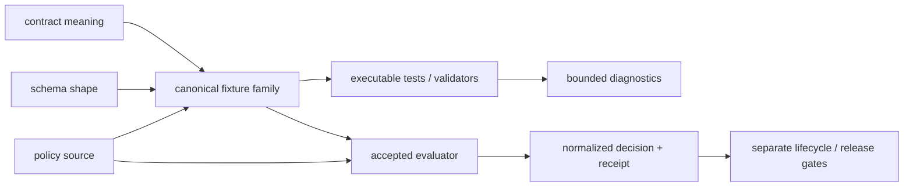

<!-- [KFM_META_BLOCK_V2]
doc_id: kfm://doc/policy-fixtures-readme
title: policy/fixtures/ — Policy-Local Fixture Placeholder and Routing Boundary
type: readme
version: v0.1.0
status: draft; BOUNDARY_COMPACT; repository-grounded; placeholder-only; placement-hold; no-executable-payloads; non-authoritative; non-release; non-publication
owner: NEEDS VERIFICATION — CODEOWNERS routes /policy/ to @bartytime4life; accepted fixture stewardship and independent policy approval were not established
created: 2026-02-21
updated: 2026-08-13
current_path: policy/fixtures/README.md
owning_root: policy/
policy_label: internal; policy; fixture-routing; placeholder; synthetic-public-safe-only; fail-closed; non-release; non-publication
responsibility: Document the held policy-local fixture path, route reusable policy fixtures to the canonical fixtures root, preserve current placeholder inventory, and define graduation and rollback requirements without becoming fixture, policy, schema, test, runtime, release, or publication authority.
base_commit: e6de606175bb1d352c00000486808f2e7e0f7b2f
prior_blob: af9ebe85e5687cb9c582b135d97e0426e22633cf
directory_governance: ADR-0029 accepts Directory Rules v2; root fixtures/ is canonical for reusable test fixtures, root tests/ is canonical for executable conformance, and policy/ remains canonical only for normative admissibility source
truth_posture: CONFIRMED 46-byte target stub, complete direct-child inventory, empty Fauna and living-person placeholder lanes, no executable or semantic fixture payload in this directory, canonical reusable policy fixtures under root fixtures/, bounded Pass 12 OPA fixture execution, PolicyDecision shape-fixture readiness coverage, and policy-test executable-payload hold / PROPOSED BOUNDARY_COMPACT routing, admission, migration, determinism, sensitivity, and review contract / NEEDS VERIFICATION accepted disposition of this path, migration of empty child lanes, general policy-fixture schema, fixture steward, evaluator-backed PolicyDecision cases, runtime parity, required-check enforcement, and retirement criteria
related:
  - ../README.md
  - ../../fixtures/README.md
  - ../../fixtures/contracts/v1/policy/README.md
  - ../../fixtures/contracts/v1/policy/policy_decision/README.md
  - ../../fixtures/policy/release_gate_v1/
  - ../../tests/policy/README.md
  - ../tests/README.md
  - ../rego/README.md
  - ../bundles/README.md
  - ../../tools/validators/policy/README.md
  - ../../docs/doctrine/directory-rules.md
  - ../../docs/adr/ADR-0029-adopt-directory-governance-standard-v2.md
  - ../../.github/workflows/policy-test.yml
  - ../../.github/workflows/pass12-release-policy-v1.yml
tags: [kfm, policy, fixtures, routing, placeholder, deterministic, synthetic, public-safe, valid, invalid, deny, abstain, hold, error, correction, rollback]
notes:
  - "This revision replaces a greenfield stub with routing and non-ownership guidance. It moves no payload and admits no new fixture home."
  - "Earlier Git history proposed policy-local fixture packs and CI/runtime parity. Those useful verification goals are preserved as future graduation requirements, but current accepted Directory Rules make root fixtures/ the reusable-fixture authority."
  - "A fixture result is bounded test evidence, not source truth, policy authority, an evaluated decision, human approval, release authority, or publication permission."
[/KFM_META_BLOCK_V2] -->

<a id="top"></a>

# policy :: fixtures

> **One-line purpose.** `policy/fixtures/` is a held, policy-local placeholder and routing boundary; it records where policy-related fixtures must go and what would be required to admit this path, without becoming a second fixture authority, policy evaluator, test suite, decision store, release gate, or publication surface.

[](#status-and-evidence)
[](#admission-and-graduation-gate)
[](#placement-and-authority)
[](#status-and-evidence)
[](#sensitive-and-public-exposure-boundary)
[](#authority-level)

**Quick navigation:** [Purpose](#purpose) · [Authority](#authority-level) · [Status](#status-and-evidence) · [Placement](#placement-and-authority) · [Directory](#current-direct-child-map) · [Belongs](#what-belongs-here) · [Routing](#canonical-fixture-routing) · [Evidence](#current-executable-and-shape-evidence) · [Case contract](#future-fixture-case-contract) · [Sensitive data](#sensitive-and-public-exposure-boundary) · [Inputs/outputs](#inputs-and-outputs) · [Lifecycle](#lifecycle-and-trust-boundary) · [Validation](#validation) · [Graduation](#admission-and-graduation-gate) · [Review](#ownership-and-review) · [Contributing](#contributor-guidance) · [Rollback](#correction-migration-and-rollback) · [Open work](#open-verification-register)

> [!IMPORTANT]
> **Safe current conclusion at `main@e6de606175bb`:** this directory contains documentation and empty markers only. Its tracked descendants are this README, a one-newline Fauna README, and two `.gitkeep` files. No JSON, YAML, Rego, Python, shell, expected output, fixture manifest, schema, validator, runner, report, or decision instance is implemented here.

> [!CAUTION]
> Accepted Directory Rules make root [`fixtures/`](../../fixtures/README.md) the canonical home for reusable synthetic test inputs and expected outputs. A path named `policy/fixtures/`, an earlier aspirational README, or a green readiness workflow does not authorize a second writable fixture home. New reusable policy fixtures must be routed by their primary assertion unless an accepted migration or bounded colocation decision says otherwise.

---

## Purpose

This README gives `policy/fixtures/` a current, reviewable boundary while the repository decides whether the path should be retired, migrated, or retained as a narrowly governed compatibility or colocation lane.

It answers five practical questions:

1. What is actually present in this directory now?
2. Which root owns reusable policy fixtures and executable policy tests?
3. How should contract-shape, rule-semantic, domain, and test-local cases be routed?
4. What must a safe, deterministic fixture family record?
5. What evidence and review would be required before this path could acquire payloads?

The directory inherits the parent [`policy/`](../README.md) trust boundary but does not inherit permission to store every artifact related to policy. Policy source defines admissibility; fixtures model bounded inputs and expected outputs; tests execute assertions; validators and evaluators implement checking; workflows orchestrate commands; emitted decisions and release records live elsewhere.

**Local scope ID:** `path:policy/fixtures/` — repository-path identity only. No independent fixture-family, bundle, evaluator, decision, or release identity is accepted.

[Back to top](#top)

---

## Authority level

**Documentation and placement-routing boundary only; no independent fixture, policy, schema, test, evaluator, evidence, decision, review, release, or publication authority.**

This lane may explain a held path and prevent misplacement. It cannot:

- define policy meaning, machine shape, or executable admissibility rules;
- declare an example canonical, factual, rights-cleared, consented, complete, or public-safe beyond its reviewed synthetic scope;
- convert an expected result into an authoritative `PolicyDecision`;
- prove that CI and runtime use the same bundle, evaluator, input, or normalization;
- authenticate a reviewer, satisfy an obligation, promote lifecycle state, or approve release;
- create a fixture authority parallel to root `fixtures/`;
- expose real sensitive material merely because it is placed in a test-shaped file.

CODEOWNERS routing of `/policy/` to `@bartytime4life` is a confirmed review route. It is not fixture stewardship, policy approval, branch-protection evidence, separation of duties, release approval, or publication authority.

[Back to top](#top)

---

## Status and evidence

| Field | Current posture |
|---|---|
| README profile | `BOUNDARY_COMPACT` under Directory Rules §16.3 |
| Placement | Existing child of canonical `policy/`; same-path documentation update |
| Implementation maturity | **CONFIRMED placeholder-only** |
| Directory disposition | **HOLD / NEEDS DIRECTORY REVIEW** |
| Canonical reusable-fixture owner | Root [`fixtures/`](../../fixtures/README.md) |
| Executable-test owner | Root [`tests/`](../../tests/README.md), normally [`tests/policy/`](../../tests/policy/README.md) for cross-cutting policy tests |
| Owner signal | `@bartytime4life` through `/policy/` CODEOWNERS routing; accepted local steward and independent approver **NEEDS VERIFICATION** |
| Repository exposure | Publicly readable Git content; only synthetic, minimized, public-safe material may ever be considered |
| Mutation | Versioned repository change through review |
| Retention | Preserve until reviewed migration, retirement, or bounded-admission disposition; no independent retention entitlement |
| Runtime effect | **None** |
| Release/publication effect | **None** |

### Evidence labels used here

| Label | Meaning |
|---|---|
| **CONFIRMED** | Verified from the pinned repository tree, exact file bytes, executable definition, or accepted decision |
| **PROPOSED** | Candidate future behavior or disposition; not current implementation |
| **NEEDS VERIFICATION** | Checkable but not established strongly enough to act on |
| **UNKNOWN** | No adequate current evidence; do not infer a safe answer |
| **HOLD** | Do not expand, activate, migrate, or rely on the lane until the named dependency closes |

### Current implementation evidence

| Surface | Observed state | Safe interpretation |
|---|---|---|
| `policy/fixtures/README.md` | 46-byte `Greenfield bundle stub.` before this revision | The path existed, but the stub defined no fixture contract or implementation. |
| `domains/fauna/README.md` | One newline | No Fauna fixture guidance or payload is implemented here. |
| `domains/fauna/.gitkeep` | Empty marker | Path presence only; not a case, suite, or consumer binding. |
| `living_persons/.gitkeep` | Empty marker | Path presence only; no living-person fixture is admitted here. |
| Executable extensions | No `.py`, `.sh`, or `.rego` descendants | No local runner, evaluator, policy test, or executable convention. |
| Semantic payloads | No JSON, YAML, CSV, GeoJSON, expected-output, manifest, or fixture-schema descendants | No reusable fixture family is implemented here. |
| `policy-test` workflow | Requires this README and fails if executable payloads appear under `policy/fixtures/` or `policy/tests/` | Confirmed readiness hold; not fixture execution or placement authority. |
| Open exact-target PR search | None found before authoring at the pinned snapshot | No current PR survivor was identified; branch and base drift still require recheck before publication. |

Directory Rules `DIR-ROOT-005` and `DIR-README-002` apply: a README, `.gitkeep`, directory name, or generated scaffold does not establish implementation or maturity.

[Back to top](#top)

---

## Placement and authority

Accepted [ADR-0029](../../docs/adr/ADR-0029-adopt-directory-governance-standard-v2.md) makes [Directory Rules v2](../../docs/doctrine/directory-rules.md) effective. The machine projection in [`control_plane/root_registry.yaml`](../../control_plane/root_registry.yaml) records separate canonical responsibilities:

| Responsibility | Canonical home | Consequence for `policy/fixtures/` |
|---|---|---|
| Normative allow, deny, hold, restrict, and abstain rules | [`policy/`](../README.md) | This lane cannot store data instances or become a decision store. |
| Reusable synthetic, valid, invalid, denied, abstaining, held, erroneous, corrected, or golden cases | [`fixtures/`](../../fixtures/README.md) | New reusable policy fixtures route to the root fixture family that matches the assertion. |
| Executable conformance, boundary, negative, integration, and end-to-end evidence | [`tests/`](../../tests/README.md) | General policy tests route to [`tests/policy/`](../../tests/policy/README.md). |
| Semantic meaning and promises | [`contracts/`](../../contracts/README.md) | A fixture illustrates a contract; it cannot define the contract. |
| Machine-checkable shape | [`schemas/`](../../schemas/README.md) | A fixture may pass a schema; it cannot become schema authority. |
| Repository validators and fixture operators | [`tools/validators/`](../../tools/validators/README.md) | Shared checking code does not belong in this lane. |
| Workflow orchestration | [`.github/workflows/`](../../.github/workflows/README.md) | A workflow may consume fixtures; it does not change placement authority. |
| Runtime evaluation and normalization | An accepted evaluator/runtime package | Replaying a fixture is not a production decision. |
| Decision, receipt, proof, and review instances | Accepted accountability and lifecycle lanes | Expected output is not an emitted instance. |
| Release, correction, withdrawal, and rollback decisions | [`release/`](../../release/README.md) | Fixture success cannot approve or publish. |

### Parallel-lane drift

The current repository contains several fixture-shaped paths with different maturity:

| Path | Current evidence | Posture |
|---|---|---|
| [`fixtures/contracts/v1/policy/`](../../fixtures/contracts/v1/policy/README.md) | Fourteen direct object/profile fixture families with mixed shape and semantic validators | **Canonical reusable contract/profile fixture family** under root `fixtures/`. |
| [`fixtures/policy/release_gate_v1/`](../../fixtures/policy/release_gate_v1/) | Four JSON rule-input cases executed by the dedicated Pass 12 workflow | **Confirmed bounded policy-rule fixture family**. |
| [`fixtures/domains/fauna/`](../../fixtures/domains/fauna/README.md) | Public-safe Fauna fixture lanes with a bounded accepted validation corpus | **Canonical domain fixture lane**. |
| [`fixtures/domains/people-dna-land/`](../../fixtures/domains/people-dna-land/README.md) | Synthetic sensitive-domain fixture lanes, including consent and living-person denial cases | **Canonical domain fixture lane with deny-first posture**. |
| [`policy/rego/release_gate_v1_test.rego`](../rego/release_gate_v1_test.rego) | One bounded engine-native test co-located with its Rego rule | **Specific reviewed implementation; not blanket fixture placement authority**. |
| `policy/fixtures/` | This boundary and empty markers | **Placeholder drift / HOLD**. |
| [`policy/tests/`](../tests/README.md) | Boundary README and empty markers | **Placeholder drift / HOLD**. |

Some older or proposed documentation still names `policy/fixtures/` as a future golden-fixture home. Those documents remain context, not current placement authority. Current accepted Directory Rules and the root registry control. Resolving stale references requires a bounded documentation/migration change; it does not justify new payloads here.

[Back to top](#top)

---

## Current direct-child map

Verified against the complete tracked tree at `main@e6de606175bb1d352c00000486808f2e7e0f7b2f`:

```text
policy/fixtures/
├── README.md          # this routing boundary; no fixture authority
├── domains/           # placeholder container; only an empty Fauna lane below it
└── living_persons/    # empty sensitive-domain placeholder
```

Per Directory Rules `DIR-README-003`, this is a direct-child map only. The deeper one-newline `domains/fauna/README.md` and `.gitkeep` files are recorded in the evidence table rather than expanded into an aspirational tree.

> [!NOTE]
> `domains/fauna/` and `living_persons/` are observed historical names, not endorsed taxonomy. Do not add sibling domains, copy their structure, or treat them as aliases for the populated root fixture families while the disposition remains open.

[Back to top](#top)

---

## What belongs here

While this lane is on **HOLD**, only narrowly bounded boundary-preserving content belongs here:

- this README and corrections to its repository-grounded guidance;
- public-safe navigation or compatibility notices that prevent fixture misplacement;
- existing empty markers until an accepted convergence decision disposes of them;
- a reviewed migration pointer naming one canonical target, owner, consumers, compatibility period, and exit condition.

Content belongs here because it preserves or explains the held path—not because it concerns policy or fixtures.

### What is prohibited

| Do not place or claim here | Correct route or reason |
|---|---|
| Reusable policy request/expected-result cases | [`fixtures/policy/`](../../fixtures/policy/) or a contract/domain fixture family under root `fixtures/` |
| Policy contract/schema valid and invalid examples | [`fixtures/contracts/v1/policy/`](../../fixtures/contracts/v1/policy/README.md) |
| Fauna policy/sensitivity examples | [`fixtures/domains/fauna/`](../../fixtures/domains/fauna/README.md) after domain and consumer review |
| Living-person, consent, genealogy, DNA, or land examples | A reviewed synthetic lane such as [`fixtures/domains/people-dna-land/`](../../fixtures/domains/people-dna-land/README.md); never real records |
| General executable policy tests | [`tests/policy/`](../../tests/policy/README.md) |
| New co-located Rego tests by analogy | Require a profile-specific native-runner decision; the Pass 12 test is not blanket authority |
| Policy rules, bundles, or activation state | The owning policy family, [`policy/rego/`](../rego/README.md), or [`policy/bundles/`](../bundles/README.md) as governed |
| Fixture schema or canonical decision vocabulary | `schemas/` and `contracts/`; do not define shape or meaning through examples |
| Evaluator, loader, CLI, API, or runtime adapter | Accepted `packages/`, `runtime/`, `apps/`, or `tools/` lane by responsibility |
| Test results, JUnit, coverage, logs, caches, or downloaded tools | Ephemeral CI or governed QA artifact storage |
| Evaluated decisions, receipts, proofs, reviews, approvals, or releases | Their accepted accountability, data, proof, review, or release families |
| Real people, emails, identifiers, DNA, coordinates, private-land joins, source exports, restricted terms, secrets, or credentials | **Do not commit**; use synthetic/minimized public-safe cases in the canonical fixture root |

[Back to top](#top)

---

## Canonical fixture routing

Choose a path from the **primary assertion**, not from topical proximity to policy.

| Question the case must answer | Canonical route | Current example or consumer |
|---|---|---|
| Does a policy contract/schema accept or reject this object shape? | [`fixtures/contracts/v1/policy/<family>/`](../../fixtures/contracts/v1/policy/README.md) | The common schema harness discovers matching valid/invalid fixture directories. |
| Does a named Rego rule allow or deny an exact engine input with stable reasons? | A reviewed family under [`fixtures/policy/`](../../fixtures/policy/) | Pass 12 uses `fixtures/policy/release_gate_v1/`. |
| Does a cross-cutting policy boundary hold in implementation? | [`tests/policy/`](../../tests/policy/README.md) with canonical fixtures as needed | `policy-boundary-guards` runs the bounded structural/static/API suite. |
| Does a validator preserve policy-profile shape and semantics? | `fixtures/contracts/v1/policy/<profile>/` plus `tests/validators/` and [`tools/validators/policy/`](../../tools/validators/policy/README.md) | Multiple inactive fixture-first policy profiles follow this split. |
| Does a Fauna or other domain behavior stay public-safe? | [`fixtures/domains/<domain>/`](../../fixtures/domains/) | Fauna has a bounded synthetic validation corpus. |
| Is a case used by only one narrowly scoped test and not reusable? | The verified test-local fixture lane beneath root `tests/` | Document the consumer; do not silently create a reusable authority. |
| Does CI/runtime parity hold for an accepted policy profile? | Canonical fixture family plus accepted bundle/evaluator/runtime integration tests | **Not established generally**; requires exact identity and replay evidence. |

### Routing sequence



The fixture family models inputs and expected outputs. It does not become any upstream authority or downstream decision instance shown in the diagram.

[Back to top](#top)

---

## Current executable and shape evidence

### Pass 12 rule-input fixtures

The repository currently has one bounded executable Rego fixture family at [`fixtures/policy/release_gate_v1/`](../../fixtures/policy/release_gate_v1/):

| Fixture | Expected result checked by workflow |
|---|---|
| `allow_public.json` | `allow == true` |
| `deny_missing_evidence.json` | `allow == false`; includes `MISSING_EVIDENCE` |
| `deny_missing_sensitivity.json` | `allow == false`; includes `MISSING_SENSITIVITY_REVIEW` |
| `deny_missing_attestation.json` | `allow == false`; includes `MISSING_REQUIRED_ATTESTATION` |

[`pass12-release-policy-v1.yml`](../../.github/workflows/pass12-release-policy-v1.yml) downloads checksum-pinned OPA 1.19.0, formats and tests the paired Rego source, evaluates these four inputs, and checks the three denial reasons. The profile remains `PROPOSED_INACTIVE`; passing does not select an active bundle, authenticate evidence or review, approve release, or publish.

### PolicyDecision shape fixtures

[`policy-test.yml`](../../.github/workflows/policy-test.yml) confirms a separate shape-only baseline under [`fixtures/contracts/v1/policy/policy_decision/`](../../fixtures/contracts/v1/policy/policy_decision/README.md):

- at least two valid JSON fixtures;
- at least three invalid JSON fixtures with expected-error companions;
- six required top-level fields;
- finite current outcome and policy-family enums;
- discovery by `tests/schemas/test_common_contracts.py`;
- absence of the schema-declared dedicated `PolicyDecision` validator and declared policy path.

That job explicitly holds evaluator-backed input matrices, reason/obligation semantics, bundle identity, and emitted decisions. Shape polarity is not policy evaluation.

### Broader fixture-first policy profiles

The canonical [`fixtures/contracts/v1/policy/`](../../fixtures/contracts/v1/policy/README.md) directory currently has fourteen direct profile/object-family subdirectories. Their maturity is mixed: some are shape fixtures, some have deterministic semantic validators, and some are proposed or fixture-only. Directory presence does not promote every family to active policy or runtime enforcement.

No current executable or shape evidence depends on a payload beneath `policy/fixtures/`; the broad workflow requires only this README and preserves the lane-level hold.

[Back to top](#top)

---

## Future fixture case contract

The following is a **review checklist for fixtures routed to their accepted canonical lane**, not a new schema and not permission to add payloads here.

### Minimum case identity

| Field or fact | Requirement |
|---|---|
| Case ID | Stable, unique, deterministic, and not silently repurposed |
| Purpose | One bounded behavior or defect the case is designed to exercise |
| Fixture posture | Explicit `valid`, `invalid`, `allow`, `deny`, `restrict`, `abstain`, `hold`, `error`, `stale`, `corrected`, `superseded`, `rollback`, or `golden` posture as applicable |
| System under test | Exact validator, rule entrypoint, adapter, consumer, or workflow command |
| Authority references | Contract, schema, policy/profile, reason/obligation vocabulary, and accepted decisions actually governing the case |
| Input identity | Exact file bytes or digest, fixed time, pinned random seed, and synthetic identifiers |
| Expected result | Finite outcome plus stable public-safe reasons and enforceable obligations where applicable |
| Execution identity | Tool/evaluator version, bundle/profile ID and digest, entrypoint, and normalization version where relevant |
| Sensitive posture | Synthetic/public-safe classification and review of reconstruction or disclosure risk |
| Consumer | Named test, validator, workflow, or review surface; orphan fixtures remain **HOLD** |
| Supersession | Prior case/version relationship, compatibility effect, correction path, and rollback target |

### Fixture design invariants

1. **Synthetic and minimized.** Include only the fields needed to exercise the assertion.
2. **Deterministic.** Fix timestamps, order, IDs, hashes, seeds, and evaluator versions.
3. **No network by default.** A fixture must not fetch missing context or depend on live source state.
4. **Positive and negative pressure.** Pair acceptance with denial, abstention, hold, malformed, or error cases where behavior is consequential.
5. **Reasons and obligations are first-class.** Do not check only a Boolean when the accepted contract carries reasons or duties.
6. **Unknown stays unknown.** Missing evidence, rights, consent, sensitivity, identity, review, or release context must not become allow.
7. **One authority per layer.** Fixtures illustrate contracts, schemas, and policy; they never redefine them.
8. **No production dependency.** Applications and policy evaluators must not load repository fixtures as live data or configuration.
9. **No silent golden refresh.** A changed expected output requires an explained behavior change and reviewer-visible before/after evidence.
10. **Bounded proof only.** Passing supports the exact case, command, environment, and revision—nothing broader.

### Suggested naming posture

Prefer names that expose the governed family, operation, expected posture, and stable case identity without encoding sensitive facts:

```text
<family>/<operation>/<expected-posture>_<case-id>.<ext>
```

Examples are illustrative only:

```text
release_gate_v1/deny_missing_evidence.json
policy_decision/invalid/invalid_missing_decision_id.json
fauna/sensitive_deny/deny_unresolved_review.json
```

Follow the owning fixture family's existing convention when one exists; do not introduce a competing filename grammar from this README.

[Back to top](#top)

---

## Sensitive and public-exposure boundary

Repository fixtures are publicly readable test carriers. Sensitive-domain negative cases must prove denial without reproducing the harm.

### Never commit

- real living-person names, contact details, account IDs, family links, precise dates, or private attributes;
- DNA/genomic sequences, kit/vendor identifiers, inferred kinship, or raw genealogy-source identifiers;
- exact rare-species, archaeology, burial, sacred, private-land, critical-infrastructure, hazard, or protected coordinates;
- source-restricted exports, proprietary terms, private correspondence, credentials, tokens, signed URLs, or production logs;
- values that allow re-identification or reconstruction when combined with other committed fields;
- private reviewer notes, legal advice, hidden rationales, prompts, or model chain-of-thought.

### Safe modeling techniques

- synthetic identifiers and clearly artificial values;
- generalized or withheld geometry rather than jittered real points;
- nonnumeric sentinel values when numeric precision would resemble a real location;
- fixed historic or synthetic timestamps;
- minimal public reason codes that do not reveal the protected fact;
- denial/hold cases that reference a synthetic status rather than embedding restricted evidence;
- separate review of each fixture and its expected output for reconstruction risk.

The empty `living_persons/` marker is not an invitation to add real or pseudonymized person records. Candidate cases must first be routed to a reviewed canonical synthetic domain lane and pass privacy, consent, rights, policy, and fixture stewardship review.

[Back to top](#top)

---

## Inputs and outputs

### Current inputs

This placeholder has no runtime or evaluator inputs. Its documentation is maintained from:

- the exact repository tree, target bytes, and file history;
- the parent policy contract and accepted Directory Rules;
- the root fixture and test boundaries;
- current contract/schema fixture families;
- actual Rego source, native tests, fixture inputs, validators, and workflow commands;
- CODEOWNERS and contribution/receipt requirements.

### Current outputs

The only current output is human-readable placement and contributor guidance. It emits no fixture result, `PolicyDecision`, receipt, proof, review record, release decision, artifact, deployment, or publication.

### Future routed fixture outputs

A canonical fixture family may contain input cases, expected outputs, expected-error text, manifests, golden results, or safe documentation. Those remain test carriers. Diagnostics produced by a test or workflow belong in logs or governed QA artifact storage and do not become authoritative decisions merely because they match expected bytes.

[Back to top](#top)

---

## Lifecycle and trust boundary

```text
contract meaning + schema shape + reviewed policy source
                         │
                         ▼
          canonical synthetic fixture family
                         │
                         ▼
       deterministic validator / test / evaluator replay
                         │
                         ▼
              bounded diagnostic evidence
                         │
                         ▼
       separate review, decision, lifecycle, and release actions
```

Fixtures never enter the KFM knowledge lifecycle as source truth. They are not RAW, WORK, QUARANTINE, PROCESSED, CATALOG/TRIPLET, or PUBLISHED instances. A fixture may model one of those shapes, but it does not acquire that state.

Likewise, a test may model admission, promotion, release, correction, withdrawal, or rollback. Running it cannot perform those operations. Public clients must not load repository fixtures, policy source, internal registries, or test outputs as live data.

[Back to top](#top)

---

## Mutability, retention, and reproducibility

| Concern | Boundary |
|---|---|
| Source mutation | Versioned Git review; fixture input and directly coupled expected output change together |
| Golden output | Never refresh automatically without an explained semantic change and reviewable diff |
| Time | Fixed ISO-8601 values unless temporal variation is the behavior under test |
| Randomness | Remove it or pin and record the seed |
| Ordering | Canonicalize when order is not the behavior; assert order explicitly when it is |
| IDs and hashes | Deterministic toy values, clearly distinguished from digests expected to verify |
| External dependencies | No network, secret, mutable tag, wall clock, or live service by default |
| Generation | Record source, generator, version, command, digest, determinism, and derived-only edit rule |
| Retention | Preserve while consumed or needed for compatibility/replay; retirement requires consumer search and migration review |
| Deletion | Remove consumers and references deliberately, retain supersession facts, and keep a mechanical rollback route |

A fixture must not be rewritten to make a failing implementation appear green. When behavior legitimately changes, update the governing contract/policy/schema as applicable, explain the compatibility effect, change tests and fixtures together, and preserve prior-version cases where replay or migration requires them.

[Back to top](#top)

---

## Validation

### Current `policy-test` boundary

[`policy-test.yml`](../../.github/workflows/policy-test.yml) currently performs four relevant checks:

1. requires `policy/fixtures/README.md` as policy-readiness evidence;
2. verifies the bounded Pass 12 rule/test/fixture/workflow packet exists;
3. confirms PolicyDecision valid/invalid shape fixtures and common-harness discovery;
4. fails if `.py`, `.sh`, or `.rego` payloads appear beneath `policy/fixtures/` or `policy/tests/` without deliberate evaluator/test graduation.

It permits additive documentation and semantic fixture files mechanically. That implementation detail is **not** placement permission. Directory Rules, root ownership, consumer evidence, and the graduation gate below still govern any proposed payload.

### Current command-bearing surfaces

```bash
# Broad policy readiness and placeholder holds; not a repository-wide evaluator.
# Run through the hosted policy-test workflow or reproduce its exact Python checks.

# Canonical schema/contract fixture harness.
pytest tests/schemas/test_common_contracts.py

# Bounded native Rego profile, using the reviewed OPA 1.19.0 binary.
opa fmt --fail \
  policy/rego/release_gate_v1.rego \
  policy/rego/release_gate_v1_test.rego

opa test \
  policy/rego/release_gate_v1.rego \
  policy/rego/release_gate_v1_test.rego

# Repository-wide fixture/validator baselines where applicable.
python tools/validate_all.py --profile full
make validate

# Documentation and diff hygiene.
git diff --check
```

The dedicated hosted Pass 12 workflow also evaluates all four JSON fixtures and checks stable denial reasons. A local `opa` executable must be provenance- and version-checked before its output is compared with hosted evidence.

> [!WARNING]
> `make fixtures` currently prints a readiness TODO and exits successfully. It is not fixture regeneration or validation evidence. `make policy` likewise remains a broad readiness marker rather than a repository-wide OPA execution command.

### README acceptance checks

For this documentation-only revision, verify at minimum:

- exactly one H1 and logical heading progression;
- a current direct-child-only map;
- every repository-relative link and local fragment resolves;
- no tabs, trailing whitespace, malformed fence, or missing final newline;
- inventory and maturity claims match the pinned tree and workflow bytes;
- no example is presented as an accepted schema, policy, evaluator result, or permission to populate this lane;
- the remote diff contains only this README and its required generated-work receipt;
- exact-head hosted results are reported without treating workflow presence or success as required-check, review, release, or publication proof.

### What passing does not prove

Passing any current fixture or documentation check does not prove:

- factual truth, source authority, completeness, rights, consent, sensitivity clearance, or legal admissibility;
- that every rule family has positive and negative coverage;
- that a policy bundle is selected or an evaluator is accepted;
- that CI and production runtime use identical bytes or normalization;
- that reasons and obligations are complete or enforced downstream;
- that branch protection requires the workflow or that independent review occurred;
- admission, promotion, release, deployment, publication, correction propagation, or rollback completion.

[Back to top](#top)

---

## Admission and graduation gate

`policy/fixtures/` remains **HOLD** until an accepted decision answers why this path must exist beside canonical root `fixtures/` and how it avoids independent evolution.

Before any non-document payload is admitted here, the same dependency-closed change must establish:

- [ ] an accepted classification: compatibility mirror, generated view, bounded engine-native colocation, migration source, or retirement target;
- [ ] one canonical writable source and an explicit prohibition on hand-edited divergence;
- [ ] a scope ID, owner, reviewers, permitted writers, consumer set, retention rule, and exit condition;
- [ ] the reason canonical `fixtures/policy/`, `fixtures/contracts/v1/policy/`, or `fixtures/domains/<domain>/` cannot own the case;
- [ ] an accepted case contract or paired semantic contract and schema where machine shape is required;
- [ ] deterministic valid, invalid, deny, abstain, hold, error, correction, and rollback coverage appropriate to the policy family;
- [ ] stable reason and obligation semantics plus non-disclosure tests;
- [ ] an accepted bundle/entrypoint/evaluator/normalization identity for evaluator-backed cases;
- [ ] a named test/validator consumer and dedicated workflow command with pinned dependencies and least privilege;
- [ ] CI/runtime parity or a clear statement that the fixture is not a runtime-replay corpus;
- [ ] migration/reference repair for all duplicate or stale paths, including the current empty child lanes;
- [ ] public-safe sensitive-domain review and proof that no real/reconstructable protected material is committed;
- [ ] correction, supersession, cache invalidation, and mechanical rollback behavior;
- [ ] updated parent/sibling READMEs, Directory Rules evidence, and any required ADR or drift-register entry;
- [ ] exact-head hosted validation and verified repository-control posture without treating it as release approval.

Passing this checklist supports an admission review. It does not itself admit the path, activate a policy profile, approve a source, merge a PR, or release anything.

[Back to top](#top)

---

## Ownership and review

| Change class | Minimum review posture |
|---|---|
| README-only clarification | Policy-aware maintainer and documentation review; verify no prose creates fixture or operational authority |
| Canonical contract/schema fixture | Contract owner, schema owner, fixture steward, validator/test owner |
| Rego input or expected policy result | Policy steward, rule/profile owner, fixture steward, evaluator/test owner |
| Domain fixture | Domain steward plus fixture and consumer review |
| Living-person, DNA, consent, rare-species, archaeology, private-land, or other sensitive case | Authorized domain/privacy/consent/stewardship reviewer plus policy and security review; synthetic public-safe data only |
| Golden-output change | Consumer owner and compatibility reviewer with explicit before/after semantics |
| New generator, mirror, or compatibility lane | Directory governance, tooling, consumer, migration, and rollback review |
| CI/runtime parity or release-affecting fixture | Policy runtime, security, affected consumer, validation, and release reviewers |

The fixture author or generator must not be treated as the sole approver for policy-significant or sensitive-domain behavior. A generated receipt records process memory; it does not authenticate review.

### Mandatory re-review triggers

- direct-child inventory or canonical fixture routing changes;
- a payload, executable extension, schema, manifest, generator, or mirror appears here;
- a fixture outcome, reason, obligation, golden result, time model, or sensitive transform changes;
- a contract, schema, policy package, bundle, evaluator, adapter, or consumer changes;
- `policy-test`, Pass 12, common fixture harness, `make fixtures`, or aggregate validation semantics change;
- root registry, Directory Rules, CODEOWNERS, branch protection, required checks, or bypass actors change;
- a correction, revocation, withdrawal, security finding, rights conflict, consent change, or disclosure risk affects a fixture family.

[Back to top](#top)

---

## Contributor guidance

### Before adding or changing a policy-related fixture

1. Pin current `main`, inspect the target family, and search consumers, open PRs, and recent commits.
2. Identify the primary assertion and route it using [Canonical fixture routing](#canonical-fixture-routing).
3. Read the governing contract, schema, policy/profile, fixture-family README, validator/test, and workflow.
4. Use synthetic, minimized, no-network input; perform a separate sensitive-content and reconstruction-risk review.
5. Define the expected finite outcome, reasons, obligations, and failure polarity before writing bytes.
6. Add the narrowest negative companion that proves fail-closed behavior.
7. Run the consumer-specific check, then the relevant aggregate and documentation checks.
8. Record checks not run as `NOT RUN` or `SKIPPED`; do not convert missing evidence into PASS.
9. Include generated-work provenance when AI materially authors the fixture or documentation.
10. Keep merge, activation, release, deployment, and publication as separate authorized actions.

### Review checklist

- [ ] Canonical path and primary responsibility are explicit.
- [ ] No parallel fixture authority or hand-edited mirror is created.
- [ ] Case identity, posture, consumer, and expected polarity are unambiguous.
- [ ] Contract/schema/policy authority remains outside fixture bytes.
- [ ] Input and expected output are deterministic and reviewable.
- [ ] Positive and consequential negative states are covered.
- [ ] Reasons and obligations are checked where the contract carries them.
- [ ] No real, restricted, personal, genomic, precise, secret, or reconstructable material is present.
- [ ] Tests and workflows exercise the actual changed bytes.
- [ ] Passing claims remain bounded to the checked command and revision.
- [ ] Compatibility, supersession, correction, and rollback are explicit.
- [ ] Human review and repository-control evidence remain separate from generated provenance and green checks.

[Back to top](#top)

---

## Correction, migration, and rollback

### Documentation correction

For an error in this README:

1. pin current `main`, the target blob, and any overlapping work;
2. correct the smallest documentation/provenance set;
3. rerun structure, inventory, links, fragments, receipt, and sensitive-content checks;
4. preserve the prior blob and review trail in Git history;
5. state that documentation rollback changes no fixture, policy, evaluator, decision, or release state.

The pre-modernization README is blob `af9ebe85e5687cb9c582b135d97e0426e22633cf`. A normal revert can restore it together with removal of the paired generated-work receipt.

### Fixture correction

If a fixture is wrong, unsafe, stale, or bound to the wrong authority:

- stop relying on it and mark affected checks/results as held;
- preserve the defective case identity and review history when audit or replay requires it;
- add a corrected/superseding case rather than silently rewriting a regression anchor;
- update expected output, tests, validators, manifests, docs, and consumers as one dependency-closed slice;
- scan derived logs and artifacts for sensitive leakage and use the private security path when needed;
- rerun affected compatibility, negative, correction, and rollback cases;
- do not treat fixture correction as correction of any real source, decision, release, or public artifact.

### Path convergence

Moving or retiring `policy/fixtures/` requires an inventory of every reference and external consumer, a canonical target, compatibility class, mapping, writer freeze, validation parity, rollback target, and exit criteria. Empty markers may be easy to move mechanically, but path identity and stale documentation still require review. Do not delete this lane or redirect it informally from this README-only change.

[Back to top](#top)

---

## Related surfaces

| Surface | Relationship and authority limit |
|---|---|
| [`../README.md`](../README.md) | Parent normative-policy boundary and current mixed-maturity evidence. |
| [`../../fixtures/README.md`](../../fixtures/README.md) | Canonical reusable-fixture root and synthetic/public-safe contract. |
| [`../../fixtures/contracts/v1/policy/README.md`](../../fixtures/contracts/v1/policy/README.md) | Canonical policy contract/profile fixture family with mixed maturity. |
| [`../../fixtures/contracts/v1/policy/policy_decision/README.md`](../../fixtures/contracts/v1/policy/policy_decision/README.md) | PolicyDecision valid/invalid shape-fixture boundary. |
| [`../../fixtures/policy/release_gate_v1/`](../../fixtures/policy/release_gate_v1/) | Four bounded Pass 12 Rego input fixtures. |
| [`../../fixtures/domains/fauna/README.md`](../../fixtures/domains/fauna/README.md) | Canonical Fauna fixture lane with bounded public-safe validation evidence. |
| [`../../fixtures/domains/people-dna-land/README.md`](../../fixtures/domains/people-dna-land/README.md) | Canonical synthetic sensitive-domain fixture lane; living-person and DNA posture remains deny-first. |
| [`../../tests/policy/README.md`](../../tests/policy/README.md) | Canonical cross-cutting policy/trust-boundary executable test lane. |
| [`../tests/README.md`](../tests/README.md) | Companion held policy-local test path and routing boundary. |
| [`../rego/README.md`](../rego/README.md) | Rego source lane and the one bounded native-test profile. |
| [`../bundles/README.md`](../bundles/README.md) | Bundle packaging/selection boundary; no general active bundle. |
| [`../../tools/validators/policy/README.md`](../../tools/validators/policy/README.md) | Policy-profile validator inventory and limits. |
| [`../../.github/workflows/policy-test.yml`](../../.github/workflows/policy-test.yml) | Broad readiness and placeholder/executable-payload hold. |
| [`../../.github/workflows/pass12-release-policy-v1.yml`](../../.github/workflows/pass12-release-policy-v1.yml) | Dedicated checksum-pinned OPA fixture execution for Pass 12 only. |
| [`../../docs/doctrine/directory-rules.md`](../../docs/doctrine/directory-rules.md) | Adopted placement and README contract. |
| [`../../docs/adr/ADR-0029-adopt-directory-governance-standard-v2.md`](../../docs/adr/ADR-0029-adopt-directory-governance-standard-v2.md) | Accepted decision making Directory Rules v2 effective. |
| [`../../control_plane/root_registry.yaml`](../../control_plane/root_registry.yaml) | Machine projection of root responsibilities; projection is not independent authority. |
| [`../../CONTRIBUTING.md`](../../CONTRIBUTING.md) | Contribution, fixture safety, validation, review, receipt, and rollback discipline. |

[Back to top](#top)

---

## Open verification register

| ID | Open question | Required evidence | Safe posture until closed |
|---|---|---|---|
| `PFX-001` | Should `policy/fixtures/` be retired, migrated, or retained as a bounded compatibility/colocation lane? | Accepted path decision, consumer inventory, migration map, writer/exit rules | HOLD; documentation and markers only. |
| `PFX-002` | What is the accepted relationship among `fixtures/policy/`, `fixtures/contracts/v1/policy/`, domain fixtures, and this path? | Fixture ownership matrix and reference repair | Route by primary assertion to root `fixtures/`; do not duplicate. |
| `PFX-003` | Where should the empty Fauna placeholder converge? | Domain steward review, consumer mapping, comparison with `fixtures/domains/fauna/` | Add nothing here; use canonical Fauna lane. |
| `PFX-004` | Where should the empty `living_persons/` placeholder converge? | Privacy/consent/domain review and canonical synthetic-family decision | No person data here; treat the marker as unimplemented. |
| `PFX-005` | Is a general policy-fixture semantic contract/schema needed? | Accepted contract, schema, versioning, negative fixtures, validator, tests | Use family-specific contracts; do not invent shape here. |
| `PFX-006` | Which policy families have complete allow/deny/restrict/abstain/hold/error/correction coverage? | Machine inventory, consumer bindings, expected-polarity tests | UNKNOWN per family; do not infer completeness. |
| `PFX-007` | Are every fixture's reason codes and obligations validated and enforced? | Vocabulary bindings, evaluator tests, consumer obligation checks | Treat shape-only or Boolean checks as bounded evidence. |
| `PFX-008` | Does CI execute the same bundle, evaluator, input, and normalization as runtime? | Digest-bound CI/runtime replay and production consumer evidence | General parity UNKNOWN; no production claim. |
| `PFX-009` | Which fixture steward and independent reviewers are accepted? | Governance assignment and effective review controls | CODEOWNERS routing only; no independent approval assumed. |
| `PFX-010` | Are policy workflows required, strict, and protected against bypass? | Current rulesets, branch protection, required checks, approvals, bypass actors | Workflow files and green runs are insufficient. |
| `PFX-011` | Which older docs still direct writers to `policy/fixtures/` or `tests/fixtures/`? | Repository-wide reference inventory and bounded repair PR | Treat them as proposed/stale context, not placement law. |
| `PFX-012` | How are fixture corrections, unsafe-byte incidents, golden migrations, and retirement completion proved? | Runbook, manifests, tests, security path, rollback drill | Preserve history; fail closed; do not silently rewrite. |

[Back to top](#top)

---

## Last evidence review

- Date: 2026-08-13
- Repository: `bartytime4life/Kansas-Frontier-Matrix`
- Snapshot: `main@e6de606175bb1d352c00000486808f2e7e0f7b2f`
- Prior target blob: `af9ebe85e5687cb9c582b135d97e0426e22633cf`
- Tree source: complete, non-truncated recursive Git tree
- Direct children confirmed: `README.md`, `domains/`, `living_persons/`
- Local fixture/executable payloads confirmed: none
- Exact-target open PRs found before authoring: none
- Hosted exact-head result for this revision: pending branch publication
- Accepted disposition, steward, runtime parity, and production enforcement: **NEEDS VERIFICATION / UNKNOWN**

Evidence inspected includes the current target and history, full repository tree, parent policy README, root fixture and test boundaries, companion policy-tests and Rego READMEs, Pass 12 fixtures and workflow, PolicyDecision fixture family and schema harness, broad `policy-test` workflow, policy validators, accepted ADR-0029, Directory Rules v2, root registry, CODEOWNERS, contribution guide, and pull-request/generated-receipt requirements.

[Back to top](#top)

---

## No-loss and evidence ledger

| Prior or adjacent signal | Disposition in this revision |
|---|---|
| Stable H1 `policy :: fixtures` | Preserved exactly. |
| Current greenfield bundle stub | Preserved as explicit placeholder-only maturity; not upgraded to implementation. |
| Earlier policy-semantic fixture concept | Preserved as future case/graduation guidance, routed to the canonical root. |
| CI/runtime parity goal | Preserved as an unverified graduation requirement requiring exact digests and replay. |
| Fail-closed negative cases | Preserved through valid/invalid/deny/abstain/hold/error design guidance. |
| Reasons and obligations | Preserved as first-class expected-result requirements, not invented vocabularies. |
| Sensitive-data warning | Strengthened with synthetic/minimized and reconstruction-risk controls. |
| Current empty Fauna and living-person lanes | Preserved in the observed map without endorsing or populating them. |
| Root fixture authority | Reconciled to accepted Directory Rules, root registry, and populated canonical families. |
| Actual Pass 12 and PolicyDecision evidence | Recorded with exact scope and non-effects. |
| Validation, review, correction, migration, and rollback | Added as explicit dependency-closed contracts. |

This revision changes documentation and generated provenance only. It changes no fixture payload, Rego rule, contract, schema, validator, test, workflow, bundle, evaluator, decision, registry, runtime, release, deployment, publication, or public behavior.

[Back to top](#top)

---

## Changelog

### v0.1.0 — 2026-08-13

- replaced the 46-byte greenfield stub with a repository-grounded `BOUNDARY_COMPACT` README;
- documented placeholder-only maturity and the exact direct-child map;
- established root `fixtures/` and root `tests/` routing without moving or admitting payloads;
- reconciled current Pass 12 rule-input fixtures, PolicyDecision shape fixtures, and broader fixture-first policy profiles;
- added deterministic case guidance, sensitive/public-exposure controls, validation limits, graduation requirements, contributor review, correction/migration/rollback, and twelve open verification items;
- preserved useful historical fixture goals without reviving stale placement or runtime claims.

[Back to top](#top)
