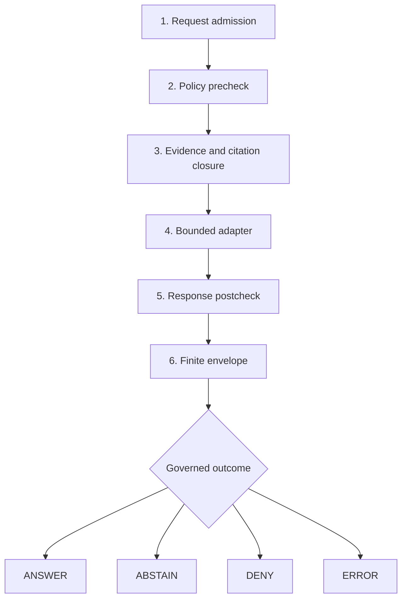

<!-- [KFM_META_BLOCK_V2]
doc_id: kfm://policy/focus
title: Focus Mode Runtime Policy Boundary
type: readme
version: v0.3
status: draft; BOUNDARY_COMPACT; repository-grounded; scaffold-only; focus-policy-inactive; finite-envelope-shape-proved; evaluator-unbound; fail-closed; non-release; non-publication
owner: NEEDS VERIFICATION — .github/CODEOWNERS routes /policy/ to @bartytime4life; accepted Focus policy stewardship, independent approval controls, and a local scope ID were not established
created: 2026-07-22
updated: 2026-08-13
current_path: policy/focus/README.md
owning_root: policy/
policy_label: public; policy; focus-mode; request-admission; response-admission; citation-closure; finite-envelope; trust-membrane; fail-closed; non-release; non-publication
responsibility: Define the local Focus Mode policy-source boundary, composition rules, current scaffold evidence, activation gates, and correction posture without claiming an active bundle, evaluator, governed consumer, release decision, or publication authority.
canonical_relationship: Focus Mode is a composition scope rather than a domain or root under adopted Directory Rules v2; this same-path policy sublane may hold Focus-specific admissibility source but must compose, not duplicate, the general access, capability, consent, evidence, render, sensitivity, promotion, release, and runtime boundaries.
directory_governance: Accepted ADR-0029 adopts Directory Rules v2; policy/ is the singular policy-source root; this BOUNDARY_COMPACT README documents the existing focus sublane without creating a policy family or activating its rules.
evidence_repository: bartytime4life/Kansas-Frontier-Matrix
evidence_base_ref: main
evidence_base_commit: 7ac4330b26419664ee92fb5c9feb66374097f033
target_baseline_blob: b67abf1b788790eedf77724b46e3022ea732c5f6
target_historical_stub_blob: f20943b20fa5ac21c4ba7769e3ec14f463685bea
policy_root_blob: 6c5021f9d92778581a4e9331a9dd6ddb7efc5e35
citation_rule_blob: cec2ca53fe8847ebbd3c8c1509ee467c3529f76b
finite_envelope_rule_blob: e985b305766a17d6c8333124476b628e03c6d07b
request_rule_blob: d10b78b74ee7e4ec561a65ed03807ea8eb62215e
response_rule_blob: 228da73d080d30e77bb532e14eeb325e3ffa722c
focus_schema_readme_blob: 5debcb6f96e5eaa2e5bd91effa8e9c16c50c2e8d
runtime_envelope_contract_blob: 97ff95ba5527968f3db70cd710682176444e4cde
runtime_envelope_schema_blob: 8b86e7db8b18b65a56a4e639dfc54e1b2db93155
policy_decision_schema_blob: 1472d26a42c73f17545b4464a275412ffa1d098e
focus_workflow_blob: 001b3e7b86922a5dd52aecf9b0201a711d6bd35a
policy_workflow_blob: ac8f125e8a4d3634d86f66836d2aa2c0e3925e75
governed_api_route_registry_blob: 3418168d0b267160d6ad6dd87f289e880ef4a024
directory_rules_blob: fd49a0b83e55cef52c1124281f093e263526898d
adr_0029_blob: b01322ef64f8c2b1ecb41de7ef4685b97cfa2a62
root_registry_blob: 024f668b5f0a9239bafa4f8b09e2afd86300ff8c
codeowners_blob: dd2a84aa514d8ecd9208bc347f90f9a2ed37dd61
open_overlapping_pull_requests_found: "0"
related:
  - ../README.md
  - ../bundles/README.md
  - ../decision/README.md
  - ../runtime/README.md
  - ../../contracts/ui/focus_request.md
  - ../../contracts/ui/focus_response.md
  - ../../contracts/focus_mode/README.md
  - ../../contracts/policy/policy_input_bundle.md
  - ../../contracts/policy/policy_decision.md
  - ../../contracts/runtime/runtime_response_envelope.md
  - ../../schemas/contracts/v1/focus/README.md
  - ../../schemas/contracts/v1/policy/policy_decision.schema.json
  - ../../schemas/contracts/v1/runtime/runtime_response_envelope.schema.json
  - ../../tests/fixtures/focus/README.md
  - ../../tests/runtime_proof/test_envelope_finite_outcomes.py
  - ../../apps/governed-api/README.md
  - ../../docs/architecture/ui/FOCUS_FLOW.md
  - ../../docs/architecture/governed-ai/FOCUS_FLOW.md
  - ../../docs/doctrine/directory-rules.md
  - ../../docs/adr/ADR-0029-adopt-directory-governance-standard-v2.md
  - ../../control_plane/root_registry.yaml
  - ../../.github/workflows/focus-mock-test.yml
  - ../../.github/workflows/policy-test.yml
tags: [kfm, policy, focus-mode, request, response, citation, evidence, finite-outcomes, trust-membrane, fail-closed, ANSWER, ABSTAIN, DENY, ERROR]
truth_posture: CONFIRMED accepted singular policy-root placement, Focus as composition scope, populated v0.2 baseline, exact four-file Rego scaffold inventory, two default-deny request/response entrypoint stubs, two inactive default-deny-false requirement stubs, proposed contract surfaces, unresolved Focus/UI request-response schema overlap, canonical runtime-envelope aliasing, closed proposed runtime-envelope shape with deterministic four-outcome fixture proof, no Focus fixture payloads, no Focus API route, placeholder general policy runtime, and CODEOWNERS routing / PROPOSED BOUNDARY_COMPACT contract, evaluation order, composition rules, reason and obligation semantics, tests, activation gates, and correction behavior / UNKNOWN accepted Focus policy owner and scope ID, canonical request-response schema home, active bundle and evaluator binding, complete native rules and tests, governed API integration, decision receipts and replay, production consumers, required-check enforcement, independent approval, release integration, and publication enforcement
notes:
  - "This v0.3 revision reconciles the existing v0.2 README with current main. It changes documentation only and does not modify the four Rego files."
  - "Accepted ADR-0029 resolves policy-root and Directory Rules placement authority; it does not accept a Focus-specific policy family, rule package, evaluator, API route, release, or publication."
  - "The Focus-local runtime response envelope schema is a compatibility alias to the canonical runtime schema. Focus/UI request and response schema ownership remains unresolved."
  - "The focus-mock-test workflow proves canonical finite-envelope shape separately from its explicit mock-Focus readiness hold; neither job evaluates policy/focus rules."
[/KFM_META_BLOCK_V2] -->

<a id="top"></a>

# Focus Mode Runtime Policy Boundary

> **One-line purpose.** `policy/focus/` is the local policy-source boundary for admitting bounded Focus Mode requests and responses across the governed trust membrane—without becoming request or response semantics, machine shape, evidence truth, model authority, runtime implementation, release approval, or publication authority.

[](#status-and-evidence)
[](#inherited-authority-owner-and-scope)
[](#current-rule-inventory)
[](#validation)
[](#fail-closed-posture)
[](#inherited-authority-owner-and-scope)

**Quick navigation:** [Purpose](#purpose) · [Authority](#inherited-authority-owner-and-scope) · [Status](#status-and-evidence) · [Directory](#current-direct-child-map) · [Belongs](#what-belongs-here) · [Exclusions](#what-does-not-belong-here) · [Inputs](#explicit-policy-input-profile) · [Flow](#proposed-gate-sequence) · [Outcomes](#normalized-outcomes) · [Authoring](#policy-authoring-contract) · [Safety](#fail-closed-posture) · [Validation](#validation) · [Review](#review-burden) · [Activation](#activation-gates) · [Related](#related-surfaces) · [ADRs](#adrs) · [Open work](#open-verification-register) · [Evidence](#no-loss-and-evidence-ledger) · [Rollback](#correction-supersession-and-rollback) · [History](#change-history)

> [!IMPORTANT]
> **Safe current conclusion:** the path and its four Rego files are repository-present, but Focus policy is not active. The request and response modules contain only `default allow := false`; the citation and finite-envelope modules contain only `default deny := false` plus commented examples. No Focus bundle, evaluator binding, native rule tests, Focus fixture payloads, Focus API route, emitted decision, or end-to-end consumer proof is established.

> [!CAUTION]
> **Do not mount the current requirement stubs as enforcement.** In `citation_validation_required.rego` and `finite_envelope_required.rego`, `default deny := false` is not evidence of a fail-closed rule. The files are explicitly marked as having no real rules. Activation must wait for reviewed entrypoints, complete deny/allow semantics, native tests, bundle identity, evaluator binding, and governed-consumer proof.

> [!NOTE]
> The repository does have a separate, deterministic proof for the canonical `RuntimeResponseEnvelope` machine shape and its four outcomes. That proves fixture/schema behavior only; it does not prove Focus request admission, evidence resolution, citation closure, policy evaluation, adapter behavior, response admission, release eligibility, or publication.

---

## Purpose

Focus Mode asks KFM to turn a bounded user question and governed map context into one finite, trust-visible outcome. This lane documents the policy boundary that would decide:

- whether the request is admissible for the actor, audience, scope, and operation;
- whether evidence, citation, rights, consent, sensitivity, freshness, release, and correction context are sufficient;
- which obligations must be enforced before any answer can cross the trust membrane;
- whether a candidate response may normalize to `ANSWER`, `ABSTAIN`, `DENY`, or `ERROR`.

The governing invariant is:

> **A Focus answer is a governed response, not raw model output.**

Policy decides admissibility. It cannot create evidence, authenticate review, clear rights by assertion, infer consent, downgrade sensitivity, validate its own execution, approve release, or make generated language true.

This README is a directory contract and implementation boundary. It is not an executable ruleset, accepted Focus ADR, API contract, runtime receipt, release decision, deployment instruction, or publication action.

[Back to top](#top)

## Inherited authority, owner, and scope

| Field | Current boundary |
|---|---|
| Parent authority | [`policy/`](../README.md), KFM's singular responsibility root for reviewed allow, deny, hold, restrict, and abstain rule source. |
| README profile | `BOUNDARY_COMPACT`; this lane changes policy-composition, disclosure, evidence, model, runtime, and public-trust assumptions. |
| Governing placement | Accepted [ADR-0029](../../docs/adr/ADR-0029-adopt-directory-governance-standard-v2.md) adopts [Directory Rules v2](../../docs/doctrine/directory-rules.md). Sections 9.3 and 16 separate policy from contracts and schemas and define this local README contract. |
| Focus scope rule | Directory Rules §12.4 defines Focus Mode as a **composition scope**, not a domain or top-level root. A Focus operation references governed domain lanes; it does not copy their truth or create a parallel domain authority. |
| Machine projection | [`root_registry.yaml`](../../control_plane/root_registry.yaml) projects `policy/` as canonical, internal, versioned, durable policy-rule authority and prohibits data instances, release decisions, and schemas. The projection does not create or activate this sublane. |
| Current path disposition | **PLACE** for this same-path boundary and existing inactive scaffolds; **HOLD** for operational activation, a new policy family, or duplicated rules until the open gates below close. |
| Local owner | **NEEDS VERIFICATION.** CODEOWNERS routes `/policy/` review to `@bartytime4life`; routing is not accepted Focus stewardship or independent approval evidence. |
| Local scope ID | **NOT ESTABLISHED.** No accepted policy-family, bundle, evaluator profile, capability ID, or release gate uniquely names this lane. |
| Exposure | Repository-public documentation and source scaffolds; intended evaluator inputs, decisions, and protected context remain governed/internal. |
| Mutation and retention | Versioned Git review; durable while referenced. Runtime, API, model, client, and release systems must not write policy source. |
| Release/publication effect | None. Rule presence, validation, workflow success, a pull request, or a policy result cannot approve release or publication. |

The prior v0.2 README correctly avoided creating a parallel root, but its authority preflight is now stale. Accepted ADR-0029 resolves the singular `policy/` root and canonical Directory Rules path. The remaining question is narrower: which Focus-specific decisions belong in this sublane, and which must remain compositions of general policy families?

[Back to top](#top)

## Status and evidence

### Truth labels

| Label | Use |
|---|---|
| **CONFIRMED** | Directly supported by inspected repository bytes at the pinned base. |
| **PROPOSED** | Intended behavior or documentation without complete executable proof. |
| **INFERRED** | A named conclusion derived from multiple confirmed facts. |
| **CONFLICTED / NEEDS VERIFICATION** | Competing ownership, shape, vocabulary, or enforcement claims remain unresolved. |
| **UNKNOWN** | No sufficient repository evidence was established. |

File presence, schema validity, workflow presence, green CI, or fluent documentation must not be promoted into runtime enforcement evidence.

### Current evidence matrix

| Surface | Confirmed state at `main@216253e9863c` | Safe conclusion |
|---|---|---|
| This README | Populated v0.2 repository-grounded baseline | v0.3 reconciles authority and current evidence in place; no executable bytes change. |
| Policy placement | ADR-0029 accepted; canonical Directory Rules live at `docs/doctrine/directory-rules.md` | `policy/` is the singular policy-source root; the old competing-copy claim is closed. |
| Focus scope | Directory Rules §12.4 treats Focus Mode as a composition scope | Focus may compose domain and general policy lanes; it is not a new root or domain. |
| Request rule | `focus_request.rego` has a package declaration and `default allow := false` only | Request admission is not implemented. |
| Response rule | `focus_response.rego` has a package declaration and `default allow := false` only | Response admission is not implemented. |
| Citation rule | `citation_validation_required.rego` has `default deny := false` and a commented example only | Citation closure is not enforced. |
| Finite-envelope rule | `finite_envelope_required.rego` has `default deny := false` and a commented example only | Finite-envelope use is not enforced by this lane. |
| Rego packages | Two modules use `kfm.generated.policy.focus.*`; two use `kfm.*` | Entrypoint and package convergence is **NEEDS VERIFICATION** before bundling. |
| Focus contracts | UI request/response and Focus payload semantic documents exist with draft/proposed posture | Semantic documentation does not prove mounted runtime behavior. |
| Focus schemas | Focus request, response, and citation-report files are permissive proposed stubs; UI request/response stubs also exist | Request/response schema ownership remains **CONFLICTED / NEEDS VERIFICATION**. |
| Runtime envelope | Focus-local path is a compatibility alias to the canonical proposed runtime schema; the canonical shape is closed and fixture-tested | One canonical shape is established for testing; semantic outcome selection and Focus integration remain unproved. |
| Policy decision | Proposed schema closes outcomes and families; `focus` is not an allowed `policy_family` | Compose accepted families or deliberately version contract/schema; do not emit `policy_family: focus`. |
| Policy input | Permissive parent contract plus a fixture-only, non-evaluator explicit-context profile | Context coherence checks do not decide policy. |
| Focus fixtures | `tests/fixtures/focus/` contains its README and `.gitkeep` only | No Focus request/response payload matrix exists. |
| Focus workflow | Static mock-readiness hold plus deterministic canonical envelope-shape proof | It runs no Focus policy, adapter, model, or Focus request. |
| General policy workflow | Broad static readiness holds; a separately governed Pass 12 lane has bounded OPA proof | No repository-wide evaluator or Focus bundle is established. |
| Policy runtime | `packages/policy-runtime` remains a `0.0.0` placeholder | No functional general evaluator or Focus adapter is established. |
| Governed API | Route registry contains `/bootstrap`, `/layers`, and `/evidence` GET-only abstaining scaffolds | No Focus route or Focus policy consumer is established. |
| Required checks and independent approval | Not proved by repository files | Workflow presence and CODEOWNERS routing are not branch-protection or separation-of-duties evidence. |

### Current maturity

- directory boundary: **documented**;
- canonical policy-root placement: **accepted**;
- Focus-specific rule logic: **inactive scaffolds**;
- request/response schema authority: **unresolved overlap**;
- canonical runtime-envelope machine shape: **proposed and fixture-tested**;
- Focus fixture suite: **absent**;
- bundle, evaluator, and replay binding: **not established**;
- governed API Focus consumer: **not established**;
- end-to-end four-outcome Focus proof: **not established**;
- release and publication authority: **none**.

[Back to top](#top)

## Current direct-child map

Verified against the pinned tree. This map shows direct children only, as required by Directory Rules §16.4.

```text
policy/focus/
├── README.md                              # this BOUNDARY_COMPACT contract
├── citation_validation_required.rego      # inactive default-deny-false scaffold
├── finite_envelope_required.rego          # inactive default-deny-false scaffold
├── focus_request.rego                     # inactive default-allow-false scaffold
└── focus_response.rego                    # inactive default-allow-false scaffold
```

No bundle manifest, Rego test module, data document, fixture payload, evaluator configuration, decision instance, receipt, proof, release object, or generated output belongs in this directory merely because it concerns Focus.

[Back to top](#top)

## What belongs here

- this local boundary README;
- Focus-specific request-admission and response-admission policy source;
- Focus-specific citation and finite-envelope obligations that cannot be expressed once in a general policy family;
- explicit composition rules for existing access, capability, consent, evidence, render, sensitivity, promotion, release, correction, and runtime policy decisions;
- stable package names, entrypoints, reason codes, obligation identifiers, bundle membership, versions, supersession notes, and activation status;
- colocated native Rego tests only after the repository's accepted test and bundle convention is applied to this lane;
- migration notes when a Focus rule moves to a more general canonical policy family.

A source file belongs here because its primary responsibility is **Focus-specific admissibility**. Merely mentioning Focus, AI, evidence, citations, maps, or finite outcomes is not sufficient.

## What does not belong here

| Prohibited material | Correct responsibility |
|---|---|
| Request, response, payload, evidence, or runtime-envelope meaning | [`contracts/`](../../contracts/README.md) |
| JSON Schema, DTOs, enums, or generated types | [`schemas/`](../../schemas/README.md) |
| Evidence records, citations, proof packs, or source payloads | governed evidence, proof, and source roots |
| Policy decision instances, runtime receipts, or audit records | accepted process, receipt, or accountability lanes |
| Prompts, model weights, embeddings, model routing, or adapter code | governed runtime and package/application boundaries |
| UI components, map interaction code, browser calls, or client-side policy source | `apps/explorer-web/` through governed interfaces |
| Evaluator, API, worker, CLI, or reusable orchestration code | `packages/`, `apps/`, `runtime/`, or `tools/` by responsibility |
| General access, evidence, rights, consent, sensitivity, release, promotion, or runtime rules duplicated for convenience | their canonical policy family |
| Sensitive coordinates, living-person data, DNA/genomic material, cultural-resource details, private infrastructure, or secrets | prohibited here; use synthetic/redacted references in governed tests |
| Release manifests, approvals, corrections, withdrawals, or rollback cards | [`release/`](../../release/README.md) |
| Generated answers or examples presented as evidence or policy grants | governed examples/fixtures with explicit non-authority posture |

Policy may consume stable references and public-safe decision summaries. It must not copy protected payloads into rules, test data, logs, reason strings, receipts, or documentation.

[Back to top](#top)

## Explicit policy input profile

A future evaluation must receive a versioned, schema-valid, explicit input bundle. It must not fetch missing facts silently or let the model choose its own policy context.

| Input class | Minimum governed context | Fail-closed trigger |
|---|---|---|
| Operation | request ID, capability, contract version, evaluation time | unknown, ambiguous, or unsupported operation |
| Actor and audience | authenticated/anonymous class, purpose, scope, public/restricted/steward audience | missing identity context where outcomes differ |
| Question and composition scope | bounded question, domain references, requested geography, time horizon, interaction intent | unbounded scope or Focus treated as copied domain truth |
| Map context | released feature, layer, viewport, selection, place, and time references | raw payload or internal-store handle substituted for governed refs |
| Evidence and citations | eligible EvidenceRefs, bundle status, claim bindings, source roles, lineage, freshness, citation validation | unresolved, stale, conflicted, insufficient, or audience-unsafe support |
| Rights, consent, sensitivity | applicable rights, consent/revocation, classification, redaction/generalization, disclosure decisions | absent, expired, revoked, denied, or unsupported state |
| Lifecycle, review, release | lifecycle status, validation/proof refs, reviewer state, release/correction/rollback refs | skipped state or ungoverned public exposure |
| Policy execution | bundle ID/version/digest, evaluator profile/version, entrypoint, normalized input hash | unaccepted, unverifiable, or non-replayable execution context |
| Runtime controls | adapter identity, finite-envelope contract, timeout, tool and resource limits | unknown adapter, hidden I/O, unbounded execution, or incompatible envelope |

The current `PolicyInputBundle` parent remains permissive, and explicit-context profile v1 is `PROPOSED_INACTIVE`, fixture-only, and non-evaluator. The table above is an activation requirement, not a claim about current machine enforcement.

### Input invariants

1. Pass stable references and bounded summaries across the trust membrane; do not expose protected payloads so a model can decide whether they are protected.
2. Preserve absent, unknown, stale, conflicted, restricted, denied, revoked, and false as distinct states.
3. Normalize timestamps, identifiers, versions, and audience before evaluation.
4. Reject unsupported schema, policy, bundle, evaluator, and adapter versions.
5. Treat stale rights, consent, release, correction, or withdrawal context as ineligible until re-evaluated.
6. Require deterministic results for the same normalized input, immutable bundle, evaluator version, and external decision set.
7. Record replay-safe hashes and refs without placing protected input content in public reasons or receipts.

[Back to top](#top)

## Proposed gate sequence

The architecture documents describe a precheck/evidence/adapter/postcheck flow. The sequence below is **PROPOSED** until contracts, rules, bundle selection, evaluator execution, and consumers are proved together.



| Gate | Required decision | Failure posture |
|---|---|---|
| 1. Request admission | Operation, version, actor/audience, scope, and capabilities are supported. | `DENY` or `ERROR`; no hidden widening. |
| 2. Policy precheck | Access, rights, consent, sensitivity, release, correction, and geography constraints permit bounded context assembly. | `DENY`, `ABSTAIN`, or `ERROR` by cause. |
| 3. Evidence and citation closure | Material claim candidates have eligible evidence and non-leaking citation bindings. | `ABSTAIN` for insufficient support; `DENY` for prohibited disclosure; `ERROR` for broken machinery. |
| 4. Bounded adapter | Approved adapter receives only admitted context with explicit tool, time, network, and resource bounds. | `ERROR`; never direct UI/model or raw-store fallback. |
| 5. Response postcheck | Candidate text, citations, obligations, audience, corrections, and leakage posture are re-evaluated. | Non-answer outcome; raw model text is discarded. |
| 6. Finite envelope | Canonical schema and semantic invariants pass, with replay/correction refs where required. | `ERROR`; never an unknown or free-form fifth outcome. |

Release and publication remain later, independent decisions. A valid Focus envelope is not automatically a released or public artifact.

[Back to top](#top)

## Normalized outcomes

`PolicyDecision` and `RuntimeResponseEnvelope` currently use the same closed outward vocabulary, but they are different objects. One Focus operation may compose several family-specific policy decisions before producing one runtime envelope.

| Outcome | Meaning at the Focus boundary | Must not mean |
|---|---|---|
| `ANSWER` | A bounded response may proceed only after required evidence, citation, policy, rights, sensitivity, release, envelope, and postcheck conditions pass and all obligations are enforceable. | Model completion, claim proof, release approval, or publication. |
| `ABSTAIN` | The operation is not prohibited, but admissible support, freshness, review, or closure is insufficient. | Hidden denial, technical failure, or permission to guess. |
| `DENY` | Policy prohibits the requested operation or disclosure for the evaluated context. | Evidence shortage alone or a leaking explanation of protected facts. |
| `ERROR` | Shape, integrity, registry, bundle, evaluator, adapter, timeout, or runtime machinery failed or cannot be trusted. | A denial on policy merits or a best-effort answer. |

### Engine-result normalization

- `ALLOW` may contribute to `ANSWER` only after every later gate and obligation passes.
- `RESTRICT` may normalize to `ANSWER` only when its narrowed/redacted/generalized scope is explicit, enforceable, revalidated, and audience-eligible; otherwise classify the cause.
- `HOLD` is an operational/review state, not a fifth public outcome; it normally maps to `ABSTAIN` when machinery is healthy but the system cannot responsibly proceed.
- `PASS` and `FAIL` are validation results, not Focus outcomes.
- An unknown, ambiguous, or unmappable native result becomes `ERROR`.

The current proposed `PolicyDecision` schema admits `promotion`, `access`, `render`, `capability`, `consent`, and `sensitivity` families only. An implementation must compose those accepted families or deliberately version the semantic contract and schema. It must not invent `policy_family: focus` in emitted data.

### Candidate reasons and obligations

Reason and obligation vocabularies remain **PROPOSED** until accepted registries, interpreters, fixtures, and consumer tests exist.

Safe reason classes should distinguish:

- malformed or unsupported request;
- insufficient or conflicted evidence;
- failed or unsafe citation closure;
- access, consent, rights, sensitivity, or release denial;
- correction, withdrawal, or revocation;
- bundle, evaluator, adapter, envelope, or timeout error.

Candidate obligations include:

- attach validated evidence and citation references;
- generalize or redact geography, identity, timing, attributes, or counts;
- show limitations, source role, freshness, attribution, correction, or withdrawal state;
- withhold ineligible layers or fields;
- prohibit caching, export, sharing, or downstream promotion;
- require human review or re-evaluation;
- attach policy-decision and process-receipt references;
- invalidate prior output after correction, rights change, consent revocation, or release rollback.

Unknown or unenforceable obligations fail closed. Public reason text must never disclose the protected fact that caused a denial.

[Back to top](#top)

## Policy authoring contract

Any change that turns a scaffold into executable rule source must:

1. name the exact semantic contract, schema, policy input profile, package, entrypoint, bundle, evaluator, and consuming stage;
2. define missing-field, unknown-value, conflict, stale-state, timeout, and evaluator-failure behavior;
3. use one reviewed package and entrypoint convention; the current mixed package namespaces are not an accepted bundle interface;
4. preserve fail-closed behavior without claiming that a default alone proves correct policy;
5. emit stable, non-sensitive reason codes and schema-approved obligations;
6. compose general policy-family decisions rather than copying their rule logic into Focus;
7. include positive, negative, boundary, mutation, correction, revocation, rollback, and no-bypass tests;
8. pin evaluator and dependency provenance and avoid unreviewed network or secret access;
9. document supersession, compatibility, rollback, and replay behavior;
10. update this status matrix and evidence snapshot in the same reviewed change.

### Current rule inventory

| File | Current entrypoint signal | Activation blocker |
|---|---|---|
| `focus_request.rego` | `package kfm.generated.policy.focus.focus_request`; `default allow := false` | no rules, input contract, reasons, tests, bundle, evaluator, or consumer |
| `focus_response.rego` | `package kfm.generated.policy.focus.focus_response`; `default allow := false` | no rules, postcheck contract, reasons, tests, bundle, evaluator, or consumer |
| `citation_validation_required.rego` | `package kfm.citation_validation_required`; `default deny := false` | no active deny rule; commented example only; namespace differs |
| `finite_envelope_required.rego` | `package kfm.finite_envelope_required`; `default deny := false` | no active deny rule; commented example only; namespace differs |

Do not infer a single evaluation result by reading these defaults together. No accepted composition document currently binds the four packages into one decision.

[Back to top](#top)

## Fail-closed posture

Focus must refuse unsafe progress when required context or machinery is absent, stale, conflicted, untrusted, or unauthorized.

| Condition | Required posture |
|---|---|
| Missing or unsupported request version | `ERROR` or `DENY` by cause |
| Unbounded question or scope | `DENY` or bounded re-request; never silent expansion |
| Missing or insufficient evidence | `ABSTAIN` |
| Failed citation closure | `ABSTAIN`, `DENY`, or `ERROR` by cause; never uncited `ANSWER` |
| Rights, consent, access, sensitivity, or release prohibits disclosure | `DENY` |
| Exact protected geometry, identity, timing, counts, or attributes would leak | `DENY` unless an accepted transform is selected, enforced, and revalidated |
| Unknown bundle, evaluator, adapter, or obligation | `ERROR` |
| Invalid or unknown envelope outcome | `ERROR` |
| Correction, withdrawal, revocation, or rollback affects prior output | invalidate eligibility and re-evaluate; preserve audit history |
| UI-to-model, model-to-internal-store, or public-client-to-canonical-store bypass | block |

Sensitivity, rights, consent, release, and audience are independent dimensions. Passing one cannot clear another. Denials and abstentions must not leak protected facts through reason text, citation metadata, geometry, counts, timing, cache keys, status codes, or differential behavior.

[Back to top](#top)

## Validation

### What is proved now

| Surface | Current proof | Limit |
|---|---|---|
| `focus-mock-test / mock-focus-flows` | Exact static inventories, placeholder adapter, open Focus schemas, four rule bytes, example posture, missing Focus payload fixtures, and missing repository-native mock command remain deliberate. | Runs no Focus request, model, adapter, evidence resolution, citation validation, or policy evaluation. |
| `focus-mock-test / finite-envelope-shape` | Standard-library tests cover canonical aliasing, closed shape, all four outcomes, valid fixtures, and fail-closed invalid fixtures. | Shape proof only; no Focus semantic or runtime proof. |
| `policy-test` | Broad repository policy readiness guards and the absence of an accepted general bundle/evaluator remain explicit. | Evaluates no `policy/focus` rule and emits no decision. |
| Runtime envelope validator | Canonical schema and fixture wiring are executable and deterministic. | Does not select a semantically correct Focus outcome. |
| Documentation validators | Structure, metadata, links, and generated-receipt shape can be checked for this revision. | Documentation quality is not runtime conformance. |

Representative repository-native commands:

```bash
# CONFIRMED finite-envelope machine-shape proof; no Focus policy runs.
python -m unittest tests.runtime_proof.test_envelope_finite_outcomes --verbose

# CONFIRMED canonical envelope fixture validation.
python tools/validators/validate_runtime_response_envelope.py --fixtures

# Readiness sentinel only; this is intentionally not a policy test.
make policy
```

Expected output from `make policy` is a TODO message. It must not be reported as an OPA test or green policy evaluation.

### Minimum executable proof

Before this lane can be called active:

- [ ] Focus request/response semantic and schema authority is reconciled.
- [ ] One explicit normalized input profile is accepted and fixture-covered.
- [ ] All four rule modules contain reviewed logic with fail-closed edge behavior.
- [ ] Package names, entrypoints, data documents, and bundle membership are stable.
- [ ] Native rule tests cover every allow/deny/abstain/error branch and obligation.
- [ ] Focus-local synthetic fixtures cover `ANSWER`, `ABSTAIN`, `DENY`, and `ERROR`.
- [ ] Negative tests cover missing citations, unresolved/stale/corrected evidence, rights denial, revoked consent, sensitivity leakage, malformed envelopes, unknown outcomes, adapter failure, evaluator timeout, and direct-bypass attempts.
- [ ] Immutable bundle identity and deterministic evaluator binding are established.
- [ ] Native results normalize into accepted `PolicyDecision` and runtime-envelope shapes.
- [ ] Governed API precheck and postcheck integration is proved without direct model or internal-store bypass.
- [ ] Decision receipts, replay, correction, revocation, cache invalidation, and rollback are proved.
- [ ] Workflow permissions, action provenance, network, secrets, artifacts, forks, and publication effects receive threat review.
- [ ] Required-check enforcement and independent review are evidenced outside repository prose.

[Back to top](#top)

## Review burden

Every change must include:

- a pinned base commit and exact changed-path inventory;
- authority, placement, drift, and overlapping-work preflight;
- a no-loss comparison for revised documentation;
- explicit truth labels for current versus proposed behavior;
- affected contract, schema, bundle, evaluator, fixture, workflow, consumer, correction, and rollback references;
- deterministic, no-network validation proportional to the change;
- negative-path evidence for executable changes;
- a generated receipt for AI-authored material;
- review through the policy CODEOWNER and every affected contract/schema/domain/security/privacy/release owner;
- no merge, activation, deployment, release, or publication claim until its separate authority and evidence gates close.

| Change class | Minimum additional review posture |
|---|---|
| README-only reconciliation | Policy-aware maintainer and documentation review. |
| Rule module or native test | Policy owner, affected family/domain owner, and validation reviewer. |
| Identity, access, rights, consent, living-person, DNA, cultural, rare-species, or infrastructure behavior | Relevant specialist plus policy, privacy/security, and release review. |
| Contract, schema, family, or outcome change | Contract, schema, policy, validator, runtime/API/UI, migration, and compatibility review. |
| Bundle, selector, evaluator, signing, or activation | Policy runtime, supply-chain/security, application, operations, and release review. |
| Correction, revocation, rollback, release, or publication coupling | Evidence/proof, policy, release, operations, and independent trust review. |

Documentation-only changes do not authorize policy activation, schema migration, deployment, release, or publication.

[Back to top](#top)

## Activation gates

The smallest dependency-closed implementation sequence is:

1. settle Focus versus UI request/response schema ownership and migration/alias behavior;
2. accept or revise request, response, policy-input, policy-decision, and runtime-envelope semantics and shapes together;
3. define how Focus composes existing policy families and outward outcomes; add a new family only through deliberate contract/schema versioning and required authority;
4. converge the four packages and implement deterministic request, citation, response, and envelope rules;
5. add native tests and complete synthetic four-outcome plus negative-path fixtures;
6. package an immutable bundle and bind a deterministic evaluator with reason/obligation interpretation and replay-safe receipts;
7. integrate precheck and postcheck into the governed API while keeping adapters and stores behind the trust membrane;
8. prove consumer rendering, evidence/citation closure, correction, revocation, rollback, no-bypass, and public-safe behavior;
9. evidence required checks, independent review, and the separate release decision before changing maturity.

No later step may be used to pretend an earlier dependency is complete.

[Back to top](#top)

## Related surfaces

| Surface | Relationship |
|---|---|
| [`policy/`](../README.md) | Parent policy-source authority and mixed-maturity root contract. |
| [`policy/bundles/`](../bundles/README.md) | Candidate packaging boundary; no active Focus bundle. |
| [`policy/decision/`](../decision/README.md) | Policy-decision vocabulary and normalization boundary. |
| [`policy/runtime/`](../runtime/README.md) | General runtime-policy source boundary; do not duplicate Focus rules there. |
| [UI FocusRequest](../../contracts/ui/focus_request.md) / [FocusResponse](../../contracts/ui/focus_response.md) | Proposed UI-facing semantic request and response profiles. |
| [Focus Mode contracts](../../contracts/focus_mode/README.md) | Payload/projection meaning; not request admission or policy execution. |
| [PolicyInputBundle](../../contracts/policy/policy_input_bundle.md) / [explicit profile v1](../../contracts/policy/policy_input_bundle_profile_v1.md) | Proposed input meaning and inactive coherence profile. |
| [PolicyDecision](../../contracts/policy/policy_decision.md) | Proposed decision meaning and closed current family vocabulary. |
| [RuntimeResponseEnvelope](../../contracts/runtime/runtime_response_envelope.md) | Canonical finite runtime-envelope meaning. |
| [Focus schema family](../../schemas/contracts/v1/focus/README.md) | Proposed request/response/citation scaffolds and runtime-envelope compatibility alias. |
| [PolicyDecision schema](../../schemas/contracts/v1/policy/policy_decision.schema.json) | Closed proposed outcome and policy-family shape. |
| [Runtime envelope schema](../../schemas/contracts/v1/runtime/runtime_response_envelope.schema.json) | Closed proposed machine shape with fixture proof. |
| [Focus fixtures](../../tests/fixtures/focus/README.md) | Synthetic fixture taxonomy; no payloads currently present. |
| [Runtime envelope proof test](../../tests/runtime_proof/test_envelope_finite_outcomes.py) | Deterministic finite-shape evidence; not Focus policy evidence. |
| [Governed API](../../apps/governed-api/README.md) | Intended trust-membrane consumer; no Focus route currently present. |
| [UI Focus flow](../../docs/architecture/ui/FOCUS_FLOW.md) | Draft client-side design context. |
| [Governed-AI Focus flow](../../docs/architecture/governed-ai/FOCUS_FLOW.md) | Draft server-side design context. |
| [Focus Mode documentation](../../docs/focus-mode/README.md) | Geographic/composition-scope planning; not policy source. |
| [Directory Rules](../../docs/doctrine/directory-rules.md) | Adopted placement, scope, dependency, and README rules. |
| [`focus-mock-test`](../../.github/workflows/focus-mock-test.yml) | Static Focus readiness hold plus separate finite-envelope proof. |
| [`policy-test`](../../.github/workflows/policy-test.yml) | General policy readiness holds; no Focus evaluation. |

[Back to top](#top)

## ADRs

| Record | Current status | Relevance |
|---|---|---|
| [ADR-0029](../../docs/adr/ADR-0029-adopt-directory-governance-standard-v2.md) | **accepted** | Adopts Directory Rules v2 and singular policy-root placement; does not activate Focus policy. |
| [ADR-0001](../../docs/adr/ADR-0001-schema-home--schemas-contracts-v1-is-canonical.md) | proposed/draft | Schema-home design context. |
| [ADR-0002](../../docs/adr/ADR-0002-contracts-vs-schemas-split.md) | proposed/draft | Contract versus schema separation. |
| [ADR-0003](../../docs/adr/ADR-0003-policy-singular-is-canonical-%28policies-is-compatibility%29.md) | proposed/draft | Narrow policy/policies compatibility question; policy-root placement is already adopted by ADR-0029. |
| [ADR-0004](../../docs/adr/ADR-0004-apps-governed-api-is-the-trust-membrane.md) | proposed/draft | Governed API trust-membrane design. |
| [ADR-0008](../../docs/adr/ADR-0008-ollama-subordinate-to-governed-api.md) | proposed/draft | Model runtime subordination. |
| [ADR-0010](../../docs/adr/ADR-0010-deny-by-default-for-dna-rare-species-archaeology-infrastructure.md) | proposed/draft | Sensitive-domain default-deny design. |
| [ADR-0019](../../docs/adr/ADR-0019-ai-adapter-contract-and-finite-envelopes.md) | proposed/draft | Adapter and finite-envelope design. |
| [ADR-0020](../../docs/adr/ADR-0020-abstain-is-a-first-class-decision.md) | proposed | Abstention semantics. |
| [ADR-0027](../../docs/adr/ADR-0027-county-focus-mode-control-plane.md) | proposed | County Focus composition/control-plane design. |
| `ADR-0028 — State-scale Focus Mode scope.md` | proposed | State-scale Focus composition design. |
| [Focus model adapter boundary](../../docs/adr/ADR-focus-model-adapter-boundary.md) | proposed scaffold | Adapter-boundary design context. |

No accepted Focus-specific ADR was established at the pinned base. Proposed records cannot amend accepted placement, activate packages, create a new policy family, or prove runtime behavior.

[Back to top](#top)

## Open verification register

| ID | Open question | Current posture | Close only with |
|---|---|---|---|
| `FOCUS-POL-001` | Which decisions are genuinely Focus-specific, and what local scope ID identifies them? | `NEEDS VERIFICATION` | Reviewed responsibility map, scope ID, no-duplication proof, and owner acceptance |
| `FOCUS-POL-002` | Which Focus/UI request and response schema paths are canonical? | `CONFLICTED / NEEDS VERIFICATION` | Accepted schema-owner decision plus alias/migration and consumer plan |
| `FOCUS-POL-003` | How do composed decisions map when `focus` is not a current policy-family value? | `NEEDS VERIFICATION` | Accepted composition/normalization profile or deliberately versioned contract and schema |
| `FOCUS-POL-004` | What packages, entrypoints, bundle, selector, and evaluator own the four modules? | `NEEDS VERIFICATION` | Converged namespace, immutable bundle manifest, evaluator identity, native tests, and runtime binding |
| `FOCUS-POL-005` | Which reason and obligation vocabularies are accepted and enforced by API and clients? | `NEEDS VERIFICATION` | Accepted registries, interpreters, fixtures, negative tests, and consumer proof |
| `FOCUS-POL-006` | What exact governed API route and method carry Focus? | `NEEDS VERIFICATION` | Implemented route, contract binding, boundary tests, and integration evidence |
| `FOCUS-POL-007` | Which workflow checks are required and branch-protected? | `UNKNOWN` | Repository-settings evidence plus observed required-check behavior |
| `FOCUS-POL-008` | Who owns Focus policy and supplies independent sensitive/release review? | `NEEDS VERIFICATION` | Accepted ownership, review roles, and observed approval evidence |
| `FOCUS-POL-009` | How are prior answers invalidated after correction, withdrawal, rights change, consent revocation, or rollback? | `NEEDS VERIFICATION` | Accepted lifecycle contract, receipts, replay, cache invalidation, and end-to-end tests |

[Back to top](#top)

## No-loss and evidence ledger

### No-loss reconciliation

| v0.2 concern | v0.3 disposition |
|---|---|
| Purpose, evidence-first posture, and directory contract | Preserved and tightened. |
| Policy-root and Directory Rules authority | Corrected from unresolved to accepted through ADR-0029; remaining sublane questions narrowed. |
| Four Rego scaffold findings | Preserved with exact current package/default evidence and activation warning. |
| Inputs and eight-stage design | Preserved as an explicit input profile and six grouped gates without dropping precheck, evidence, citations, adapter, envelope, postcheck, release, or correction concerns. |
| Four public outcomes and engine normalization | Preserved; distinction between `PolicyDecision` and runtime envelope made explicit. |
| Sensitivity, rights, consent, and trust membrane | Preserved and strengthened with non-leaking failure posture. |
| Validation and fixture requirements | Preserved; current finite-envelope proof added and separated from Focus policy proof. |
| Related contracts, schemas, workflows, ADRs, and apps | Revalidated against the pinned tree; canonical doctrine link corrected. |
| Smallest implementation sequence and definition of done | Preserved as dependency-closed activation gates. |
| Open verification register | Preserved, narrowed where authority is now settled, and expanded for ownership and correction closure. |
| Correction and rollback | Preserved with exact baseline and unchanged-rule boundary. |

### Evidence ledger

| Evidence | Use | Limitation |
|---|---|---|
| Accepted ADR-0029 and Directory Rules v2 | Policy-root authority, Focus composition scope, dependency direction, README profile | Do not activate a Focus rule, family, evaluator, route, release, or publication. |
| Root Registry | Machine projection of `policy/` class, exposure, mutation, retention, and prohibitions | Projection is not self-authorizing. |
| `policy/README.md` | Parent boundary, current mixed maturity, general evaluator hold | Root-level bounded Rego evidence does not transfer to Focus. |
| Four Focus Rego blobs | Exact current packages, defaults, and missing logic | Presence/defaults do not prove evaluation or safe enforcement. |
| Focus/UI/runtime/policy contracts and schemas | Current meaning, shape, alias, overlap, outcomes, and family vocabulary | Most remain proposed; consumer and semantic enforcement are unproved. |
| Focus and policy workflows | Exact static holds and finite-envelope proof boundary | Workflow names or green conclusions are not runtime policy evidence. |
| Focus fixture lane | Current README-plus-`.gitkeep` inventory | No executable Focus payload matrix. |
| Governed API route registry and tests | Exact three-route abstaining scaffold and boundary posture | No Focus route or policy integration. |
| CODEOWNERS | Review routing to `@bartytime4life` | Not accepted stewardship, independent approval, or required-check evidence. |
| Proposed Focus and AI ADRs/architecture | Design lineage and open decisions | Proposed/draft records are not accepted authority. |

### Last reviewed

- Date: `2026-08-13`
- Repository: `bartytime4life/Kansas-Frontier-Matrix`
- Base: `main@7ac4330b26419664ee92fb5c9feb66374097f033`
- Replaced README blob: `b67abf1b788790eedf77724b46e3022ea732c5f6`
- Historical greenfield-stub blob: `f20943b20fa5ac21c4ba7769e3ec14f463685bea`
- Changed executable policy files: none
- Overlapping open pull requests found for this path at preflight: `0`
- Review mode: read-before-write, repository and GitHub evidence, documentation-only scope

Re-review when rule bytes, package names, schema ownership, decision families, outcomes, contracts, fixtures, bundles, evaluator/runtime wiring, API routes, consumers, correction behavior, CODEOWNERS, required checks, Directory Rules, or governing ADR status changes.

[Back to top](#top)

## Correction, supersession, and rollback

Corrections must preserve the distinction between observed facts and proposed behavior. When implementation closes an open item, update the evidence matrix, maturity statement, activation checklist, open register, evidence snapshot, and last-reviewed base together.

For this documentation-only revision:

1. prefer a forward correction that cites the incorrect claim and replacement evidence;
2. if exact rollback is required, restore README blob `b67abf1b788790eedf77724b46e3022ea732c5f6` and remove only this revision's generated receipt in the same reviewed change;
3. do not modify or claim rollback of the four unchanged Rego blobs;
4. preserve Git and receipt history; do not delete evidence to make the current state appear cleaner;
5. re-run documentation, metadata, link, receipt, and sensitive-content checks.

Reverting this README cannot activate or deactivate runtime policy because this revision changes no Rego, schema, contract, fixture, workflow, evaluator, API route, release object, deployment, or published artifact.

[Back to top](#top)

## Change history

| Version | Date | Change |
|---|---|---|
| `v0.3` | 2026-08-13 | Reconciled accepted Directory Rules authority, current schema aliasing and overlap, exact rule packages/defaults, finite-envelope proof, absent Focus fixtures/API route, activation gates, no-loss evidence, and exact rollback. |
| `v0.2` | 2026-07-22 | Replaced the historical greenfield stub with the first repository-grounded Focus policy boundary and implementation guide. |
| greenfield stub | before 2026-07-22 | Four-line placeholder with no usable boundary contract. |

[Back to top](#top)
