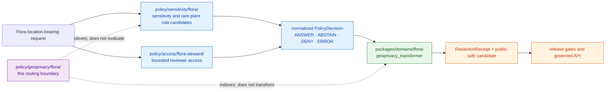

<!-- [KFM_META_BLOCK_V2]
doc_id: kfm://policy/geoprivacy/flora
title: Flora Geoprivacy Policy Routing Boundary
type: policy-readme
version: v0.1
status: draft; placement-conflicted; non-executable; fail-closed
owner: NEEDS VERIFICATION — policy steward, Flora steward, sensitivity reviewer, rights reviewer, security/privacy reviewer, release reviewer, docs steward
created: 2026-07-24
updated: 2026-07-24
policy_label: public
current_path: policy/geoprivacy/flora/README.md
owning_root: policy/
canonical_relationship: CONFLICTED / NEEDS VERIFICATION — the current Flora path register names policy/sensitivity/flora/ and policy/domains/flora/; this existing path is retained as a non-authoritative routing boundary until placement is resolved
related:
  - ../../README.md
  - ../../sensitivity/flora/README.md
  - ../../sensitivity/flora/rare_plant_geoprivacy.md
  - ../../sensitivity/flora/rare_plant_geoprivacy.rego
  - ../../access/flora-steward/README.md
  - ../../../docs/domains/flora/CANONICAL_PATHS.md
  - ../../../docs/domains/flora/RIGHTS_AND_SENSITIVITY.md
  - ../../../docs/doctrine/directory-rules.md
  - ../../../docs/adr/ADR-0003-policy-singular-is-canonical-(policies-is-compatibility).md
  - ../../../contracts/policy/policy_input_bundle.md
  - ../../../contracts/policy/policy_decision.md
  - ../../../contracts/domains/flora/rare_plant_record.md
  - ../../../contracts/domains/flora/occurrence_public.md
  - ../../../contracts/domains/flora/redaction_receipt.md
  - ../../../packages/domains/flora/geoprivacy_transformer/README.md
  - ../../../tools/validators/geoprivacy/README.md
tags: [kfm, policy, geoprivacy, flora, sensitivity, rare-plants, fail-closed, public-safe, routing-boundary]
truth_posture: CONFIRMED existing empty target, singular policy root, current flora path-register relationship, scaffold sensitivity policy, and fail-closed default / PROPOSED routing-boundary contract, decision prerequisites, obligations, reason codes, tests, and convergence plan / UNKNOWN accepted evaluator, active bundle, runtime enforcement, fixtures, receipts, review ownership, and release integration
notes:
  - "The target existed as an empty tracked file at the inspected base. This revision completes the README without moving or duplicating executable policy."
  - "Executable Flora geoprivacy rule candidates currently live under policy/sensitivity/flora/ and remain PROPOSED scaffolds."
  - "This README does not accept an ADR, activate a policy bundle, authorize exact-location access, approve a release, or make any Flora record public-safe."
[/KFM_META_BLOCK_V2] -->

# Flora Geoprivacy Policy Routing Boundary

> **One-line purpose.** `policy/geoprivacy/flora/` documents a fail-safe routing boundary for Flora location-exposure policy while preventing this existing path from becoming parallel authority to the current `policy/sensitivity/flora/` rule candidates.

**Quick navigation:** [Purpose](#purpose-and-scope) · [Placement](#repository-placement-and-authority) · [Status](#status-and-verification-boundary) · [Inputs](#policy-input-and-evidence-prerequisites) · [Outcomes](#decision-surface) · [Rules](#fail-closed-operating-rules) · [Obligations](#obligations-and-reason-codes) · [Validation](#validation-and-representative-tests) · [Review](#review-and-escalation) · [Rollback](#correction-supersession-and-rollback) · [Open verification](#open-verification-register)

> [!IMPORTANT]
> **Safe current conclusion:** the repository has an empty tracked README at this path, while the Flora canonical-path register names [`policy/sensitivity/flora/`](../../sensitivity/flora/README.md) and `policy/domains/flora/` as the intended policy lanes. The present executable-looking rare-plant rule is only a fail-closed scaffold (`default allow := false`), and no accepted evaluator, active bundle, rule test suite, runtime enforcement, or release integration is established.

> [!CAUTION]
> **Do not place executable Flora geoprivacy rules in this directory while placement remains unresolved.** Adding a second independently editable rule set here would create parallel policy authority. Resolve the relationship through an accepted ADR or a repository-approved migration note first.

> [!WARNING]
> Exact rare, protected, steward-controlled, or culturally sensitive plant locations are **not public by default**. A map style, hidden field, generalized label, package helper, reviewer view, successful schema check, pull request, or policy-shaped JSON object is not proof that a location is safe to expose.

---

## Purpose and scope

This README makes the existing `policy/geoprivacy/flora/` path understandable and safe to review without pretending that the path is already canonical or executable.

It has three bounded responsibilities:

1. **Route maintainers** to the current Flora sensitivity, access, contract, transform, validator, and release surfaces.
2. **State the fail-closed geoprivacy posture** that every future implementation must preserve.
3. **Prevent authority drift** by prohibiting duplicated rule modules until the path relationship is explicitly resolved.

### In scope

- public versus restricted exposure of Flora location-bearing records;
- exact, generalized, withheld, delayed, steward-only, and denied location representations;
- rare, protected, steward-controlled, and culturally sensitive plant-location handling;
- join-induced sensitivity when individually low-risk sources create a high-risk derived product;
- the policy inputs, evidence prerequisites, finite outcomes, obligations, reason codes, reviews, receipts, and tests required for a governed decision;
- the relationship between sensitivity policy, access policy, deterministic transforms, validation, release, correction, and rollback.

### Out of scope

- botanical or taxonomic truth;
- source admission, license interpretation, or rights clearance by assertion;
- executable geoprivacy transformation code;
- canonical object meaning or machine shape;
- exact sensitive coordinates, source-native restricted identifiers, or sensitive taxon lists;
- authentication, credential, role-assignment, or secret management;
- evidence creation, proof closure, lifecycle promotion, release approval, publication, or public API routing;
- migration of policy files between directories in this README-only change.

[Back to top](#top)

---

## Repository placement and authority

`policy/` is KFM's singular policy responsibility root. This file is inside that root, but **being under `policy/` does not make every nested path independently authoritative**.

Current repository evidence creates a placement conflict:

| Surface | Current evidence | Authority consequence |
|---|---|---|
| [`policy/README.md`](../../README.md) | Names singular `policy/` as the admissibility root; evaluator and bundle remain unbound. | Governs the root boundary, not this nested path's canonicality. |
| [`docs/domains/flora/CANONICAL_PATHS.md`](../../../docs/domains/flora/CANONICAL_PATHS.md) | Names `policy/sensitivity/flora/` and `policy/domains/flora/`; explicitly says their relationship needs verification. | Does not name `policy/geoprivacy/flora/` as a policy home. |
| [`policy/sensitivity/flora/README.md`](../../sensitivity/flora/README.md) | Exists as a proposed scaffold. | Current sensitivity-lane candidate, not active policy. |
| [`rare_plant_geoprivacy.rego`](../../sensitivity/flora/rare_plant_geoprivacy.rego) | Contains a generated package declaration and `default allow := false`. | Fail-closed scaffold only; no accepted semantics or execution proof. |
| [`ADR-0003`](../../../docs/adr/ADR-0003-policy-singular-is-canonical-%28policies-is-compatibility%29.md) | Proposed; confirms the singular root and forbids parallel policy authority if accepted. | Supports one policy root, but does not settle these nested Flora lanes. |
| This path | Tracked README existed with empty content at the inspected base. | Complete as a routing boundary; do not add executable rules yet. |

### Interim classification

Until a reviewed decision resolves the nested layout, treat this directory as:

- **non-executable**;
- **non-canonical**;
- **navigation and migration guidance only**;
- **fail-closed when a consumer attempts to depend on it as a rule bundle**.

If the repository later chooses this path as canonical, the change must move or supersede the existing sensitivity rules through a documented migration with one source of truth, updated imports, tests, bundle manifests, receipts, and rollback. It must not copy rules and leave both locations active.

### Responsibility map

The diagram is a responsibility map, not proof that the complete flow is implemented.

[Back to top](#top)

---

## Status and verification boundary

| Surface | Status | Safe statement |
|---|---:|---|
| Target README at base | **CONFIRMED empty tracked file** | This revision supplies the missing directory contract in place. |
| Root policy posture | **CONFIRMED mixed maturity** | Policy source exists, but accepted evaluation and release enforcement are unproved. |
| Flora sensitivity README | **CONFIRMED proposed scaffold** | It is not domain-reviewed policy authority yet. |
| Rare-plant Markdown rule | **CONFIRMED proposed scaffold** | It contains no authoritative rule contract. |
| Rare-plant Rego rule | **CONFIRMED fail-closed scaffold** | `default allow := false` proves only a default declaration, not correct evaluation. |
| Flora geoprivacy transformer README | **CONFIRMED implementation proposal** | Describes deterministic public-safety transforms; package implementation and tests remain unverified. |
| Policy evaluator and active bundle | **UNKNOWN / NEEDS VERIFICATION** | No accepted engine, bundle digest, selector, or deployment was proved. |
| Native policy tests and fixtures | **UNKNOWN / NEEDS VERIFICATION** | No representative geoprivacy decision suite was proved for this path. |
| Runtime enforcement and decision receipts | **UNKNOWN / NEEDS VERIFICATION** | No complete request-to-decision-to-receipt flow was proved. |
| Release integration | **UNKNOWN / NEEDS VERIFICATION** | No proof that Flora public artifacts are gated by an evaluated geoprivacy decision. |
| Nested path decision | **CONFLICTED / NEEDS VERIFICATION** | `policy/geoprivacy/flora/` versus `policy/sensitivity/flora/` is unresolved. |

This README is a **documentation improvement only**. It does not activate a policy, accept an ADR, change a rule, clear rights, resolve sensitivity, grant access, or approve publication.

[Back to top](#top)

---

## What belongs here

While the path relationship remains unresolved, only the following belong here:

- this README;
- a future approved migration or deprecation notice;
- links to the single canonical Flora geoprivacy policy home;
- bounded compatibility notes needed to prevent consumers from loading this path as an independent policy bundle;
- an explicit supersession pointer after an accepted decision.

After a reviewed placement decision, this list may be revised to match the accepted architecture.

## What does not belong here

- `.rego`, policy data, taxon deny lists, source-rights maps, or independently versioned bundles;
- copies of rules from `policy/sensitivity/flora/`;
- exact or reversible sensitive location data;
- contracts, JSON Schemas, fixtures, validator code, package code, receipts, proofs, or release objects;
- application routes, MapLibre filters, UI-only hiding rules, or direct model prompts;
- generated prose presented as a policy decision;
- policy exceptions without governed inputs, review, evidence, obligations, expiry, and replay metadata.

[Back to top](#top)

---

## Policy input and evidence prerequisites

A Flora geoprivacy decision must evaluate an explicit, versioned context. It must not fetch or infer missing trust facts silently.

| Input family | Minimum context | Fail-closed condition |
|---|---|---|
| Operation | stable capability such as public feature projection, export, steward review, or release-candidate validation | unknown, overly broad, or unversioned operation |
| Actor and audience | authenticated subject/service class, purpose, public/restricted/steward audience | identity or purpose missing where access differs |
| Object and scope | stable Flora record reference, object family, spatial/temporal scope, requested precision | raw payload substituted for governed refs |
| Taxon and knowledge character | accepted/raw taxon context, rare/protected/cultural flags, observed/modeled/aggregate role | ambiguous identity or modeled product presented as occurrence |
| Source and evidence | `SourceDescriptor` refs, source role, resolvable `EvidenceRef`/`EvidenceBundle`, freshness and citation context | missing source role, evidence closure, or current support |
| Rights | redistribution class, license/terms, attribution, steward obligations | rights unknown, expired, restricted, or not applicable to the requested output |
| Sensitivity | tier/classification, exact-location state, join-induced sensitivity, prior transforms | missing, stale, unsupported, or downgraded without review |
| Geometry | internal geometry reference, source precision, coordinate uncertainty, requested public representation | public request includes unreviewed exact or reversible geometry |
| Review and release | review record, transform approval, candidate/release state, correction and rollback refs | skipped review or absent release context for public exposure |
| Policy execution | bundle ID/version/digest, entrypoint, evaluator profile/version, input hash, evaluation time | unaccepted, non-replayable, or unavailable evaluator context |

Missing required context must remain missing. A caller must not replace an unresolved fact with a permissive default.

[Back to top](#top)

---

## Decision surface

The repository's normalized `PolicyDecision` contract uses the outward outcomes:

- `ANSWER` — the requested bounded operation is admissible with explicit obligations;
- `ABSTAIN` — evidence or required context is insufficient to make a safe decision;
- `DENY` — policy prohibits the requested operation or exposure;
- `ERROR` — evaluation failed or the request could not be processed safely.

`restrict`, `generalize`, `withhold`, `delay`, `steward-only`, and `review-required` are policy effects, obligations, or workflow states. They must not become an undocumented competing outcome vocabulary.

### Representative decision matrix

The matrix is **PROPOSED** until aligned with accepted contracts, policy modules, and tests.

| Request state | Expected normalized outcome | Required effect |
|---|---:|---|
| Public exact location for a rare, protected, steward-controlled, or culturally sensitive plant | `DENY` | no public geometry; no internal reference leakage |
| Public-safe derivative with confirmed source role, rights, evidence, sensitivity transform, review, and release context | `ANSWER` | enforce approved precision, attach obligations and receipt refs; still not release approval |
| Rights, evidence, sensitivity, taxon identity, or review state unresolved | `ABSTAIN` or `DENY` according to the accepted contract | no public geometry; route to quarantine or review |
| Request exposes `internal_geometry_ref`, before/after coordinate pairs, or source-native restricted IDs | `DENY` | remove exposure; record safe reason code and audit reference |
| Modeled range or habitat surface requested as an exact observed occurrence | `DENY` or `ABSTAIN` | preserve source role and knowledge character |
| Evaluator unavailable, bundle digest invalid, input malformed, or schema validation failed | `ERROR` | no permissive fallback; safe diagnostic only |
| Authorized steward requests a bounded review view | `ANSWER` only with capability, purpose, scope, freshness, audit, and least-privilege obligations | review access does not clear rights, sensitivity, evidence, or release |

[Back to top](#top)

---

## Fail-closed operating rules

1. **Exact sensitive Flora geometry is denied on public surfaces by default.**
2. **Source quality does not override sensitivity.** A well-supported rare-plant record can still be unsafe at exact precision.
3. **Rights and sensitivity are independent gates.** Passing one does not relax the other.
4. **Missing context is not public eligibility.** Unknown rights, source role, evidence, review, release state, or sensitivity must not become implicit allow.
5. **Transforms occur before public rendering or export.** Client-side hiding, style filters, zoom thresholds, and popup omission are not geoprivacy controls.
6. **Public-safe derivatives preserve lineage.** The output must retain the evidence, policy, transform, review, and release references needed to reconstruct why it is safe.
7. **Random jitter is not a default method.** Any noise-based method requires an explicit threat model, deterministic or reproducible specification, receipt, residual-risk review, and approval.
8. **Join-induced sensitivity is evaluated on the product.** Combining benign county, taxonomic, habitat, or occurrence inputs may create a sensitive derivative.
9. **Models do not become observations.** Range, habitat-suitability, and inferred surfaces retain their source role and uncertainty.
10. **No raw sensitive data in logs or errors.** Use redacted identifiers, digests, and safe reason codes.
11. **Reviewer access is not public release.** Viewing exact geometry for a bounded review does not make it public-safe.
12. **Policy is not publication authority.** An `ANSWER` may satisfy one gate; release still requires evidence, validation, proof, review, manifest, correction, and rollback closure.
13. **No policy fallback from this directory.** A consumer that cannot resolve the accepted Flora geoprivacy bundle must fail closed rather than load a duplicate or improvised rule set here.

[Back to top](#top)

---

## Obligations and reason codes

The accepted policy contract must define stable, machine-readable reason codes and obligations. The following are **candidate vocabulary**, not an adopted enum.

### Candidate reason codes

| Code | Meaning |
|---|---|
| `precise_sensitive_location_denied` | requested public precision exposes a protected location |
| `unknown_rights` | redistribution or source terms are unresolved |
| `missing_evidence_bundle` | consequential exposure lacks resolvable evidence support |
| `steward_review_missing` | required domain/sensitivity review is absent or stale |
| `public_geometry_not_generalized` | requested output does not satisfy the approved transform |
| `public_payload_exposes_internal_ref` | payload or log leaks a restricted pointer or identifier |
| `ambiguous_taxon_identity` | taxonomic identity is unresolved for the requested decision |
| `model_as_observation` | a modeled or aggregate surface is being treated as observed occurrence evidence |
| `join_induced_sensitivity_unresolved` | the derived product has not been reclassified after joining sources |
| `policy_bundle_unavailable` | accepted bundle or evaluator context cannot be resolved |

### Candidate obligations

- expose no internal geometry or restricted source identifier;
- enforce the approved precision bucket or withhold geometry;
- attach `PolicyDecision`, `RedactionReceipt`, review, and run-receipt references;
- preserve source role, knowledge character, limitations, and coordinate uncertainty;
- carry required attribution and rights statements;
- prohibit bulk extraction, re-identification, reverse geocoding, or coordinate reconstruction where applicable;
- set expiry, re-evaluation, and revocation requirements for time-bounded access;
- emit a safe audit reference without logging protected content;
- require release-gate re-evaluation when source, policy, sensitivity, review, or transform versions change.

Decision and receipt instances belong in their governed data/release locations, not in this documentation directory.

[Back to top](#top)

---

## What this policy does not decide

This README and any future policy module in the accepted Flora geoprivacy lane do **not** decide:

- whether a botanical claim is true;
- whether a taxon identification is accepted;
- whether source terms have actually been cleared;
- whether an `EvidenceBundle` is complete;
- how a transform is implemented;
- whether a candidate has passed schema, topology, quality, catalog, or proof validation;
- whether a reviewer has authority outside an explicit capability decision;
- whether a release is approved or published;
- whether a correction, withdrawal, or rollback has been executed;
- whether generated language, a map, a tile, a badge, a test result, a commit, or a pull request is authoritative.

[Back to top](#top)

---

## Validation and representative tests

### Current validation posture

- The visible rare-plant Rego file is a scaffold with `default allow := false`.
- The visible sensitivity README and Markdown rule are scaffolds.
- The repository policy root reports an unbound evaluator and no accepted active bundle.
- No repository-approved Flora geoprivacy command, native rule-test suite, fixture matrix, replay receipt, or required CI result was verified for this directory.

**Repository-approved executable command:** `UNKNOWN / NEEDS VERIFICATION`.

### Required no-network test families before activation

| Test | Expected result |
|---|---:|
| rare/protected exact point requested for public map | `DENY` |
| public payload contains internal geometry reference | `DENY` |
| rights status unknown | fail closed with contract-defined `DENY` or `ABSTAIN` |
| required evidence missing | `ABSTAIN` |
| taxon identity ambiguous for sensitivity classification | `ABSTAIN` or `DENY` |
| modeled surface requested as exact occurrence | `DENY` |
| approved generalized derivative with complete evidence, rights, review, and transform context | `ANSWER` with obligations |
| steward review capability valid but release approval absent | review `ANSWER`; publication still blocked |
| policy bundle digest mismatch or evaluator unavailable | `ERROR` |
| join creates newly sensitive derivative | public exact exposure blocked pending reclassification |
| transform output exceeds approved precision | `DENY` |
| logs or errors contain raw coordinates | test failure |
| policy version changes | prior decision expires or is re-evaluated according to contract |
| correction increases restriction | downstream caches and release candidates invalidated or held |

### Activation gate

Do not call Flora geoprivacy policy active until all applicable items are closed:

- nested path relationship resolved with one canonical rule home;
- accepted semantic contract and machine schema;
- accepted evaluator, version, entrypoint, bundle identity, digest, and selector;
- positive, negative, abstention, and error fixtures using synthetic/public-safe data;
- native policy tests plus boundary and integration tests;
- deterministic reason-code and obligation enforcement;
- governed API/review consumer with no direct lifecycle-store shortcut;
- decision receipts, input hashes, replay verification, and safe audit events;
- transform receipt and public-payload validation;
- release-gate integration, correction, withdrawal, cache invalidation, and rollback tests;
- observed required-check success and reviewed ownership.

Passing these checks would prove only the tested policy behavior and integration. It would not prove that every source is rights-cleared, every record is correctly classified, or every future release is safe.

[Back to top](#top)

---

## Review and escalation

A documentation-only clarification requires policy-aware and docs review. Any move toward executable or release-affecting behavior requires a larger review set.

| Change class | Minimum review posture |
|---|---|
| README clarification or link repair | policy-aware maintainer + docs reviewer |
| nested path classification or migration | policy + architecture + docs + affected Flora owner; ADR or migration note when authority changes |
| sensitivity rule or reason/obligation change | policy + Flora steward + sensitivity/privacy reviewer + tests/validator reviewer |
| rights-dependent behavior | rights/source steward + policy + Flora steward + release reviewer |
| exact-location access or reviewer capability | access/security + Flora steward + sensitivity reviewer + audit/operations reviewer |
| evaluator, bundle, selector, signing, or activation | policy runtime + supply-chain/security + validation + operations + release review |
| release, correction, withdrawal, or rollback effect | policy + evidence/proof + release + operations, with separation of duties where required |

`CODEOWNERS` routing, a requested review, or a pull-request approval is not by itself proof of accepted policy stewardship, source rights, sensitivity clearance, or publication authority.

### Escalate instead of guessing when

- source rights or redistribution terms are unclear;
- the location concerns rare/protected/culturally sensitive plants;
- tribal, sovereign, community, or steward restrictions may apply;
- a transform can be reversed or combined with other data to re-identify a location;
- exact precision is requested outside a bounded steward workflow;
- a public-safe derivative would materially change meaning or utility;
- an evaluator, bundle, receipt, review, release, or rollback reference cannot be resolved.

[Back to top](#top)

---

## Correction, supersession, and rollback

### Documentation rollback

This README can be reverted to its prior empty blob or superseded by a reviewed path decision. Reverting documentation does not roll back policy behavior, because no policy behavior is activated by this file.

### Policy rollback requirements

A future executable Flora geoprivacy policy change must provide:

- immutable policy and bundle identity;
- prior accepted bundle or rule version;
- migration/supersession record when paths or packages change;
- consumer and import inventory;
- fixture and replay comparison against the prior version;
- correction or withdrawal handling for affected release candidates and published artifacts;
- cache and derived-artifact invalidation where exposure changes;
- a rollback target that restores rule, bundle, selector, evaluator, and decision-replay compatibility together.

Never correct a sensitivity exposure by silently deleting history or overwriting prior receipts. Preserve the correction lineage and the fact that earlier public state existed.

[Back to top](#top)

---

## Related authoritative and implementation surfaces

### Policy and placement

- [`policy/README.md`](../../README.md) — singular admissibility root and current maturity boundary.
- [`policy/sensitivity/flora/README.md`](../../sensitivity/flora/README.md) — current Flora sensitivity-lane scaffold.
- [`rare_plant_geoprivacy.md`](../../sensitivity/flora/rare_plant_geoprivacy.md) and [`rare_plant_geoprivacy.rego`](../../sensitivity/flora/rare_plant_geoprivacy.rego) — proposed scaffold pair.
- [`policy/access/flora-steward/README.md`](../../access/flora-steward/README.md) — bounded steward-review access posture.
- [`Directory Rules`](../../../docs/doctrine/directory-rules.md) — responsibility-root and no-parallel-authority doctrine.
- [`ADR-0003`](../../../docs/adr/ADR-0003-policy-singular-is-canonical-%28policies-is-compatibility%29.md) — proposed singular policy-root decision.

### Flora doctrine and contracts

- [`CANONICAL_PATHS.md`](../../../docs/domains/flora/CANONICAL_PATHS.md) — current Flora lane and placement register.
- [`RIGHTS_AND_SENSITIVITY.md`](../../../docs/domains/flora/RIGHTS_AND_SENSITIVITY.md) — rights, sensitivity, tiers, transforms, and public-safe posture.
- [`rare_plant_record.md`](../../../contracts/domains/flora/rare_plant_record.md) — rare-plant object meaning.
- [`occurrence_public.md`](../../../contracts/domains/flora/occurrence_public.md) — public-safe occurrence meaning.
- [`redaction_receipt.md`](../../../contracts/domains/flora/redaction_receipt.md) — transform-lineage receipt meaning.
- [`PolicyInputBundle`](../../../contracts/policy/policy_input_bundle.md) and [`PolicyDecision`](../../../contracts/policy/policy_decision.md) — policy input and normalized outcome semantics.

### Implementation and validation

- [`geoprivacy_transformer`](../../../packages/domains/flora/geoprivacy_transformer/README.md) — proposed deterministic transform helper; not policy authority.
- [`geoprivacy validator`](../../../tools/validators/geoprivacy/README.md) — repository validator lane; inspect implementation before relying on it.

[Back to top](#top)

---

## Open verification register

| ID | Question | Status | Closure evidence |
|---|---|---|---|
| `FLORA-GP-001` | Which nested path is the single canonical Flora geoprivacy rule home? | **CONFLICTED / NEEDS VERIFICATION** | accepted ADR or migration decision plus updated path register |
| `FLORA-GP-002` | Should this directory be removed, retained as compatibility, or promoted after migration? | **NEEDS VERIFICATION** | reviewed deprecation/migration record |
| `FLORA-GP-003` | Which evaluator, version, entrypoint, and bundle format are accepted? | **UNKNOWN** | accepted runtime/bundle contract and observed execution |
| `FLORA-GP-004` | Which `PolicyInputBundle` fields are mandatory for geoprivacy? | **NEEDS VERIFICATION** | accepted semantic contract, schema, and fixtures |
| `FLORA-GP-005` | Which reason codes and obligations are canonical? | **NEEDS VERIFICATION** | contract/schema enum and native rule tests |
| `FLORA-GP-006` | Which sensitivity tier scheme is accepted, and who may approve a transition? | **NEEDS VERIFICATION** | accepted ADR/policy plus reviewer mapping |
| `FLORA-GP-007` | Which deterministic transform methods and precision buckets are approved? | **UNKNOWN** | threat model, transform spec, tests, and review record |
| `FLORA-GP-008` | Where are `RedactionReceipt`, decision receipt, and audit instances persisted? | **NEEDS VERIFICATION** | accepted receipt schemas and lifecycle paths |
| `FLORA-GP-009` | Which synthetic/public-safe fixtures cover rare-plant, rights, join, and error cases? | **UNKNOWN** | fixture inventory and license/sensitivity review |
| `FLORA-GP-010` | Which governed API and review-console consumers enforce the decisions? | **UNKNOWN** | implementation, contract tests, and runtime evidence |
| `FLORA-GP-011` | Which CI checks are required and branch-protected? | **UNKNOWN** | workflow configuration, observed run, and ruleset evidence |
| `FLORA-GP-012` | How quickly do revocation, correction, and policy changes invalidate caches and prior decisions? | **UNKNOWN** | operational contract and tested rollback drill |
| `FLORA-GP-013` | Who owns policy, Flora sensitivity review, rights review, security review, and release approval? | **NEEDS VERIFICATION** | accepted stewardship and separation-of-duties record |

[Back to top](#top)

---

## Last reviewed

**2026-07-24 — README completion against the inspected `main` state.**

This review confirms the documentation and placement conflict described above. It does not accept the nested path, activate policy, verify runtime enforcement, clear any source or location, or approve release.

---

## Maintainer checklist

Before expanding this directory beyond the README:

- [ ] resolve the nested path relationship;
- [ ] identify one canonical rule source and remove duplicate authority;
- [ ] align contracts, schemas, evaluator, bundle, tests, and receipts;
- [ ] use only synthetic or already public-safe fixtures;
- [ ] test `ANSWER`, `ABSTAIN`, `DENY`, and `ERROR` paths;
- [ ] verify that exact sensitive geometry never enters logs, public payloads, tiles, exports, or AI context;
- [ ] prove correction, revocation, cache invalidation, and rollback behavior;
- [ ] keep release approval outside this policy directory.

> **Final boundary:** evidence and source role establish support; policy decides admissibility; deterministic transforms produce public-safe candidates; validators test behavior; release governs publication; public clients consume only released outputs through governed interfaces.

[Back to top](#top)
