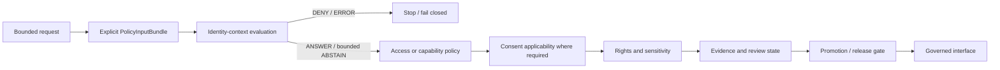

<!-- [KFM_META_BLOCK_V2]
doc_id: kfm://policy/identity
title: Identity Context Policy Boundary and Routing Contract
type: policy-readme
version: v0.1
status: draft; repository-grounded; empty-target-completion; identity-context-routing; non-credential; non-authentication-provider; evaluator-unbound; fail-closed; non-release; non-publication
owner: NEEDS VERIFICATION — identity steward, policy steward, security/privacy reviewer, access steward, consent steward, governed-API maintainer, audit steward, release reviewer, docs steward
created: 2026-07-24
updated: 2026-07-24
policy_label: repository-facing; identity-context; subject-binding; service-identity; assurance; access-input; capability-input; consent-input; least-privilege; privacy-minimization; fail-closed; no-secrets; non-release
current_path: policy/identity/README.md
owning_root: policy/
canonical_relationship: PROPOSED identity-context policy routing boundary; current PolicyDecision schema does not include an identity policy family, so identity posture must feed accepted access, capability, or consent evaluations unless contracts and schemas are deliberately versioned
evidence_snapshot:
  repository: bartytime4life/Kansas-Frontier-Matrix
  base_ref: main
  target_prior_blob: 8b137891791fe96927ad78e64b0aad7bded08bdc
  policy_root_blob: fa9378a6a699d0985fd018dbdb9f27c15efcb1c3
  access_policy_readme_blob: ca53007caa4ee15ac3ec0c1305169a42d188755e
  consent_policy_readme_blob: 5c56e988cbfa7b613fa39feec3c8f7f5bb44ce1b
  policy_input_contract_blob: 545c352681dd0db0cd4d169a5d2f9c364356457c
  policy_input_schema_blob: b89db4b1730c61258441e0eed037276b910b1990
  policy_decision_contract_blob: ebfe97f98263e6309db6d2772cb2c5e548819650
  policy_decision_schema_blob: 1472d26a42c73f17545b4464a275412ffa1d098e
  identity_token_contract_blob: 745bb43868afe132c7d6bac79fa210d620ccdba1
  deterministic_identity_package_blob: 7362df62340d27334242a8f5cebfa8909317d4b8
  identity_validator_readme_blob: cbeb616f6dee0967a84dc1a1285b195ee2324972
  people_identity_model_blob: 28c1000b66e82542d8c74cbde5d488a2805de7b0
  open_overlapping_pull_requests_found: "0"
related:
  - ../README.md
  - ../access/README.md
  - ../consent/README.md
  - ../bundles/README.md
  - ../../contracts/policy/policy_input_bundle.md
  - ../../contracts/policy/policy_decision.md
  - ../../contracts/common/identity_token.md
  - ../../schemas/contracts/v1/policy/policy_input_bundle.schema.json
  - ../../schemas/contracts/v1/policy/policy_decision.schema.json
  - ../../packages/policy-runtime/README.md
  - ../../packages/identity/README.md
  - ../../tools/validators/identity/README.md
  - ../../apps/governed-api/README.md
  - ../../docs/doctrine/directory-rules.md
  - ../../docs/domains/people-dna-land/IDENTITY_MODEL.md
  - ../../release/README.md
tags: [kfm, policy, identity, authentication-context, subject, service, issuer, assurance, revocation, access, capability, consent, privacy, audit, fail-closed]
truth_posture: CONFIRMED empty tracked target, singular policy root, access and consent boundaries, PolicyInputBundle and PolicyDecision contracts, placeholder input schema, closed decision-family schema without identity, non-credential IdentityToken contract, deterministic-identity package scaffold, identity-validator documentation, and unproved evaluator/bundle/runtime/release integration / PROPOSED identity-context routing contract, assurance inputs, evaluation order, reason codes, obligations, composition rules, tests, convergence plan, correction, revocation, and rollback / UNKNOWN accepted identity provider, claim vocabulary, assurance profile, credential verifier, subject mapping, delegation model, active bundle, native tests, runtime enforcement, audit sink, decision receipts, branch-protection enforcement, and production operation
notes:
  - "This revision completes an existing empty README in place. It creates no credential, identity-provider integration, policy module, schema, contract, fixture, validator, runtime route, access grant, release object, or publication state."
  - "IdentityToken, deterministic object identity, person/entity resolution, authentication, and authorization are distinct concerns and must not be collapsed."
  - "The current PolicyDecision schema permits promotion, access, render, capability, consent, and sensitivity only; policy_family=identity is schema-invalid at the inspected snapshot."
  - "Secrets, raw credentials, bearer tokens, private keys, password material, biometric templates, protected identifiers, and full identity-provider assertions must never be placed in this repository-facing README."
[/KFM_META_BLOCK_V2] -->

<a id="top"></a>

# Identity Context Policy Boundary

> **One-line purpose.** `policy/identity/` documents how KFM evaluates whether supplied actor, service, issuer, subject-binding, freshness, revocation, and assurance context is sufficient for a bounded governed operation—without becoming an identity provider, credential store, person-resolution system, identifier grammar, access grant, or release authority.

[](#status-and-evidence)
[](#purpose)
[](#decision-family-compatibility)
[](#default-posture)
[](#secret-and-sensitive-data-boundary)
[](#authority-boundary)

**Quick navigation:** [Purpose](#purpose) · [Authority](#authority-level) · [Status](#status-and-evidence) · [Scope](#scope-and-bounded-context) · [Distinctions](#identity-concept-separation) · [Belongs](#what-belongs-here) · [Exclusions](#what-does-not-belong-here) · [Inputs](#explicit-policy-input-profile) · [Evaluation](#evaluation-order) · [Decisions](#decision-family-compatibility) · [Outcomes](#normalized-outcomes) · [Reasons](#reason-code-vocabulary) · [Obligations](#obligation-vocabulary) · [Composition](#policy-family-composition) · [Threats](#threat-model) · [Validation](#validation-and-acceptance) · [Review](#review-burden) · [Rollback](#correction-revocation-and-rollback) · [Open work](#open-verification-register)

> [!IMPORTANT]
> **Identity context is an input to a bounded policy decision; it is not permission by itself.** A verified subject or service may still lack the required capability, purpose, evidence, rights, sensitivity clearance, review state, or release state. Identity checks must never bypass the independent gates that govern the requested operation.

> [!CAUTION]
> **A valid identifier is not authenticated identity.** `IdentityToken`, deterministic IDs, `spec_hash`, domain entity identifiers, person-resolution candidates, login credentials, and policy subject context are different governed concepts. Shape validity, hash equality, identifier stability, or a successful person match does not authenticate a caller or authorize an action.

> [!WARNING]
> **Do not place secrets or protected identity assertions in this README or public fixtures.** Passwords, private keys, API keys, bearer tokens, session tokens, JWT bodies, refresh tokens, biometric templates, raw identity-provider assertions, government identifiers, private contact details, or living-person linkage data belong only in approved secure systems and synthetic/redacted test surfaces.

---

## Purpose

`policy/identity/` exists to define a bounded policy-routing question:

> Is the explicit identity context supplied for this actor, service, delegate, or governed caller sufficiently current, trusted, correctly bound, purpose-compatible, audience-compatible, non-revoked, and privacy-minimized for the requested operation?

A future accepted identity-context policy may evaluate:

- actor or service subject references;
- subject type and caller class;
- issuer or verifier references;
- authentication or verification event references;
- assertion freshness and validity windows;
- revocation, suspension, dispute, or compromise state;
- audience and purpose binding;
- requested capability and object scope;
- service-to-service and delegated-call context;
- subject-to-account or subject-to-steward mapping status;
- separation-of-duties conflicts;
- step-up or re-verification requirements;
- privacy-minimization and audit obligations.

This lane must remain subordinate to explicit contracts, schemas, accepted policy bundles, governed runtime enforcement, and release controls. It cannot infer identity from operator memory, UI state, IP address, map interaction, source data, AI output, a stable object ID, or a display name.

[Back to top](#top)

---

## Authority level

This README is a **repository-facing identity-context policy boundary**. It documents the intended responsibility split and fail-closed posture. It is not an executable policy bundle and does not establish deployed authentication or authorization.

| Concern | Owning surface | Role of `policy/identity/` |
|---|---|---|
| Policy-relevant identity context | `policy/identity/` if this lane is accepted | Define or route identity-context conditions used by bounded policy evaluations. |
| Access authorization | [`policy/access/`](../access/README.md) | Consume identity context and decide a capability-specific access request. |
| Consent applicability | [`policy/consent/`](../consent/README.md) | Consume holder/subject/representative binding without treating identity as consent. |
| Policy input meaning | [`contracts/policy/policy_input_bundle.md`](../../contracts/policy/policy_input_bundle.md) | Supplies semantic input families; this README does not redefine the contract. |
| Policy decision meaning | [`contracts/policy/policy_decision.md`](../../contracts/policy/policy_decision.md) | Supplies finite outcome semantics and accepted policy-family values. |
| Policy machine shape | [`schemas/contracts/v1/policy/`](../../schemas/contracts/v1/policy/) | Defines accepted machine fields and enums. |
| Authentication and credential verification | approved security/runtime infrastructure | Outside this repository-facing policy README; no secrets or credentials live here. |
| Deterministic object identity | [`packages/identity/`](../../packages/identity/README.md), contracts, domain identity models | Separate from caller authentication and policy subject assurance. |
| Typed governed references | [`contracts/common/identity_token.md`](../../contracts/common/identity_token.md) | `IdentityToken` is a reference carrier, not a credential or proof of identity. |
| Identity validation | [`tools/validators/identity/`](../../tools/validators/identity/README.md) | Checks declared identity/reference rules; validator pass is not authentication or authorization. |
| Runtime policy evaluation | [`packages/policy-runtime/`](../../packages/policy-runtime/README.md) or an accepted evaluator | Executes accepted bundles; this README contains no runtime code. |
| Governed enforcement | [`apps/governed-api/`](../../apps/governed-api/README.md) and approved internal surfaces | Enforces normalized decisions and obligations. |
| Release and publication | [`release/`](../../release/README.md) | Identity policy cannot approve publication or release. |

A future rule in this lane may constrain or block an operation. It cannot create personhood, ownership, kinship, actor authority, source truth, evidence closure, consent, rights clearance, sensitivity clearance, release approval, or public truth.

[Back to top](#top)

---

## Status and evidence

### Current repository state

| Surface | Current status | Safe conclusion |
|---|---:|---|
| `policy/identity/README.md` | **CONFIRMED empty tracked file before this revision** | This update completes the file in place without adding executable behavior. |
| `policy/README.md` | **CONFIRMED repository-grounded mixed-maturity root** | `policy/` owns admissibility; evaluator, bundle, receipts, and release integration remain unproved. |
| `policy/access/README.md` | **CONFIRMED v0.2** | Access policy expects an authenticated subject but explicitly leaves identity-provider mappings and deployed enforcement unverified. |
| `policy/consent/README.md` | **CONFIRMED v0.2** | Consent is subject/holder bound but identity proof remains independent and cannot create consent. |
| `PolicyInputBundle` contract | **CONFIRMED semantic contract** | Recommends explicit operation, audience, object, evidence, rights, sensitivity, review, release, and evaluator context. |
| `PolicyInputBundle` schema | **CONFIRMED permissive placeholder** | Requires only `id`; identity-context fields are not machine-enforced. |
| `PolicyDecision` contract/schema | **CONFIRMED finite and closed** | Outcomes are `ANSWER | ABSTAIN | DENY | ERROR`; policy families exclude `identity`. |
| `IdentityToken` contract | **CONFIRMED draft contract** | Defines a typed reference carrier and explicitly denies credential or proof-of-identity use. |
| `packages/identity/` | **CONFIRMED implementation scaffold** | Deterministic identifier package is documentation-heavy, version `0.0.0`, and not an authentication system. |
| `tools/validators/identity/` | **CONFIRMED README; executable coverage unproved** | Validation routing exists; validation cannot authenticate or authorize. |
| Domain person identity model | **CONFIRMED draft documentation** | Person/DNA/land entity resolution is domain semantics, not caller authentication policy. |
| Executable identity policy | **NOT ESTABLISHED by bounded search** | No accepted identity policy module, bundle entrypoint, or native identity-policy test was proved. |
| Identity provider, verifier, mapping, revocation service | **UNKNOWN** | No deployed provider or claim vocabulary is asserted here. |
| Governed consumer enforcement | **UNKNOWN / NEEDS VERIFICATION** | No end-to-end identity-context decision and obligation path was proved. |
| Release or publication effect | **None** | This README cannot authorize release, public access, or publication. |

### Current verification boundary

**CONFIRMED:** the target is an empty tracked file; the adjacent policy, contract, schema, package, and validator documentation above exists.

**PROPOSED:** the identity-context scope, inputs, evaluation order, reason codes, obligations, composition rules, tests, migration sequence, and rollback discipline in this README.

**UNKNOWN / NEEDS VERIFICATION:** accepted identity provider, claim names, issuer registry, assurance profile, subject mapping, service identity model, delegation, credential verification, revocation checks, native policy modules, bundle selection, evaluator wiring, audit sink, decision receipts, governed consumers, CI enforcement, and production behavior.

This README is not implementation proof.

[Back to top](#top)

---

## Scope and bounded context

### In scope

- policy conditions for trusting supplied actor or service identity context;
- subject, service, delegate, representative, and issuer binding;
- identity-context freshness, expiry, revocation, suspension, dispute, and compromise state;
- operation-, purpose-, audience-, interface-, and object-specific identity requirements;
- required step-up or re-verification conditions;
- identity minimization and non-disclosure obligations;
- identity-context composition with access, capability, consent, sensitivity, evidence, and release gates;
- stable public-safe reason codes and enforceable obligations;
- audit and replay metadata that does not contain secrets;
- correction, supersession, cache invalidation, and rollback expectations;
- synthetic positive and negative test scenarios.

### Out of scope

- identity-provider implementation;
- password, secret, key, session, OAuth, OpenID Connect, SAML, JWT, certificate, or hardware-token handling;
- credential issuance, storage, rotation, or recovery;
- choosing a vendor, protocol, cryptographic suite, or assurance standard;
- deterministic object-ID grammar;
- `IdentityToken` field meaning or schema;
- person, family, DNA, land, source, dataset, feature, evidence, or release identity resolution;
- deduplication or entity matching;
- access authorization;
- consent creation or revocation;
- sensitivity classification;
- rights clearance;
- evidence truth;
- lifecycle promotion;
- release approval;
- public API, UI, map, export, search, graph, vector, or AI implementation.

[Back to top](#top)

---

## Identity concept separation

The word **identity** has several incompatible meanings in KFM. This lane must keep them separate.

| Identity concept | Meaning | Correct responsibility | Not equivalent to |
|---|---|---|---|
| Policy subject identity context | Who or what is requesting a bounded operation, how that identity was verified, and whether the context is current and trusted | This policy boundary plus approved security/runtime systems | Access permission, consent, release approval |
| Authentication credential | Secret or signed material used by an approved verifier | Secure runtime/identity infrastructure outside repository-facing docs | `IdentityToken`, object ID, person record |
| `IdentityToken` | Compact typed reference to a governed thing | `contracts/common/identity_token.md` and paired schema | Login token, bearer token, proof of identity |
| Deterministic object identity | Stable identifier/profile for a KFM object, run, source, feature, or reference | `packages/identity/`, contracts, schemas, domain models | Authenticated caller identity |
| Domain person/entity identity | Evidence-bound resolution of a person, family, parcel, specimen, place, feature, or other domain entity | Domain docs/contracts/schemas/pipelines | Account identity or authorization |
| Source identity | Identity and role of a source system/dataset | SourceDescriptor and source registry | Caller identity |
| Evidence identity | Identity of EvidenceRefs, bundles, proof objects, or receipts | Evidence/proof/receipt contracts and stores | Identity-provider assertion |
| Release identity | Identity of a candidate, manifest, correction, withdrawal, or rollback object | `release/` contracts and records | Access grant or user identity |

### Non-collapse rules

1. A valid object identifier does not authenticate a caller.
2. A resolved person record does not prove the account holder is that person.
3. A valid `IdentityToken` does not prove the referenced object exists.
4. Authentication does not authorize a capability.
5. Authorization does not establish consent.
6. Consent does not establish identity.
7. An access decision does not clear sensitivity, rights, evidence, or release.
8. An issuer name does not establish issuer trust.
9. A stable subject mapping does not guarantee current authorization.
10. An AI-produced name match or entity match is not identity proof.
11. A reviewer's role label is not an active capability grant.
12. A commit author, email address, username, display name, or UI session state is not sufficient policy identity context by itself.

[Back to top](#top)

---

## What belongs here

Appropriate content for `policy/identity/` includes:

- this README and future reviewed identity-context policy modules after placement and bundle acceptance;
- rules that require explicit actor/service/subject references;
- issuer and verifier allow/deny/hold conditions expressed without secret material;
- freshness, expiry, revocation, suspension, dispute, and compromise checks;
- audience, purpose, interface, operation, and object-binding checks;
- step-up or re-verification requirements;
- service identity and delegated-caller constraints;
- subject-mapping ambiguity and mismatch handling;
- separation-of-duties identity conflicts;
- privacy-minimization obligations;
- safe reason-code and obligation vocabularies;
- synthetic native policy tests if the repository accepts colocation;
- links to contracts, schemas, runtime, access, consent, audit, release, correction, and rollback surfaces.

A rule belongs here only when its primary responsibility is **whether identity context is sufficient for a policy evaluation**. Identity semantics, credentials, implementation mechanics, domain matching, and authorization remain elsewhere.

[Back to top](#top)

---

## What does not belong here

| Do not put this in `policy/identity/` | Correct responsibility |
|---|---|
| Passwords, passphrases, private keys, API keys, recovery codes, secrets | Approved secret-management and identity infrastructure |
| Bearer tokens, refresh tokens, session tokens, JWT bodies, identity-provider assertions | Runtime verification systems; never repository-facing docs or fixtures |
| Credential verification implementation | Approved security/runtime package or service |
| Identity-provider configuration or deployment secrets | `infra/`, secure configuration systems, or deployment-specific secret stores |
| `IdentityToken` semantic definition | [`contracts/common/identity_token.md`](../../contracts/common/identity_token.md) |
| Identity schemas and enums | `schemas/contracts/v1/` |
| Deterministic identifier implementation | [`packages/identity/`](../../packages/identity/README.md) |
| Identity validators | [`tools/validators/identity/`](../../tools/validators/identity/README.md) |
| Person/entity resolution rules | domain docs, contracts, schemas, and pipelines |
| Access-control capability rules | [`policy/access/`](../access/README.md) |
| Consent rules | [`policy/consent/`](../consent/README.md) |
| Rights or sensitivity rules | applicable `policy/` families |
| Real person, account, contact, biometric, DNA, or protected identifier data | denied from public documentation; use synthetic/redacted fixtures |
| Emitted PolicyDecisions, audit events, receipts, or proofs | accepted data/report/receipt/proof roots |
| Release manifests, approvals, corrections, withdrawals, rollback cards | [`release/`](../../release/README.md) |
| Public routes or UI behavior | governed applications |
| AI-generated identity assertions | never authoritative; route to evidence and policy review |

[Back to top](#top)

---

## Explicit policy input profile

Identity-context evaluation must consume explicit, versioned, inspectable context. It must not silently fetch missing identity facts or trust unverified UI/runtime state.

| Input family | Minimum proposed context | Fail-closed trigger |
|---|---|---|
| Bundle identity | input-bundle ID, version, spec hash, evaluation time | mutable or unidentifiable input |
| Requested operation | capability/operation, interface, target object, purpose | generic or missing operation |
| Caller class | person, steward, reviewer, service, worker, automation, delegated caller | unknown caller class where policy differs |
| Subject reference | non-secret governed reference to the caller/subject | missing, malformed, or ambiguous subject |
| Subject mapping | mapping version/status, account-to-subject or service-to-principal relation | unresolved, conflicting, stale, or revoked mapping |
| Issuer/verifier context | governed issuer/verifier reference, trust status, verification event reference | untrusted, unknown, disabled, or missing issuer |
| Verification context | method/profile reference, verification time, validity interval, result | unverifiable, expired, insufficient, or errored verification |
| Audience and purpose | intended service/interface/audience and declared purpose | audience or purpose mismatch |
| Capability/access context | requested capability, assignment/reference, scope, expiry, revocation | missing, inactive, expired, or revoked capability |
| Delegation context | delegator/delegate refs, chain depth, scope, expiry, consent/authority refs where applicable | unverified or over-broad delegation |
| Separation of duties | current role/capability conflicts, reviewer/release separation | incompatible roles for the requested action |
| Consent context | subject/holder/representative binding and current consent applicability | identity mismatch, revoked consent, or unresolved representative |
| Sensitivity/rights context | sensitivity, rights, precision, restricted audience, export constraints | unresolved protected context |
| Evidence/review/release context | evidence status, review refs, release state, correction and rollback refs | identity being used to bypass independent gates |
| Revocation/freshness context | revocation check time/result, compromise state, decision expiry | stale or failed revocation check |
| Evaluator context | accepted bundle ID/digest/version, entrypoint, evaluator version, fail-closed mode | unknown, stale, or unaccepted evaluator |

### Data minimization

Input bundles should use governed references and bounded verification results rather than raw credentials or full identity-provider assertions. Policy receipts and logs should record digests, references, decisions, reasons, obligations, timestamps, and safe metadata—not secrets or unnecessary personal data.

### No hidden fetches

If required identity context is missing, the evaluator must not silently retrieve it from:

- browser state;
- cookies or session objects not represented in the governed input;
- operator memory;
- network location;
- source records;
- graph/search/vector indexes;
- prior AI prompts;
- model output;
- deployment environment variables;
- cached authorization decisions;
- mutable “latest identity” pointers.

A governed fetch may occur only if it produces a new explicit input bundle or receipt under an accepted contract.

[Back to top](#top)

---

## Default posture

| Condition | Default normalized posture |
|---|---|
| Missing subject or service reference | `ABSTAIN` or `ERROR`, depending on input validity |
| Unauthenticated or unverified caller for a protected operation | `DENY` |
| Unknown or untrusted issuer/verifier | `DENY` or `ERROR` |
| Expired, revoked, suspended, disputed, or compromised identity context | `DENY` |
| Subject mapping is ambiguous or conflicting | `ABSTAIN` |
| Audience, purpose, interface, or object binding mismatch | `DENY` |
| Verification profile insufficient for requested risk | `ABSTAIN` with step-up obligation or `DENY` |
| Revocation service/check unavailable where required | `ERROR` |
| Valid identity but capability missing | access/capability policy returns `DENY` |
| Valid identity and capability, but rights/sensitivity/evidence/release unresolved | independent gate blocks or abstains |
| Caller cannot enforce identity-related obligations | `DENY` or `ERROR` |
| Public operation attempts to expose identity context or protected identifiers | `DENY` |

Unknown identity context never becomes implicit permission.

[Back to top](#top)

---

## Evaluation order

The recommended evaluation order is deliberately fail-closed.

```text
1. Validate the PolicyInputBundle shape and immutable identity.
2. Identify the exact operation, target, interface, audience, and purpose.
3. Confirm caller class and non-secret subject/service reference.
4. Resolve the declared issuer/verifier and its accepted trust state.
5. Validate verification event status, freshness, validity, and revocation.
6. Validate subject/account/service mapping and detect conflicts.
7. Validate audience, purpose, interface, object, and scope binding.
8. Validate delegation, representative, or service-chain context when present.
9. Check separation-of-duties and incompatible-role conditions.
10. Compose identity posture into access, capability, or consent evaluation.
11. Apply sensitivity, rights, evidence, review, lifecycle, and release gates.
12. Produce a canonical finite PolicyDecision candidate with reasons and obligations.
13. Persist receipt-ready metadata without secrets or unnecessary personal data.
14. Enforce decision expiry, revocation, correction, and cache invalidation.
```

Any failed prerequisite must stop the allow path. Downstream policy families may become more restrictive; they must not override an identity `DENY` or evaluator `ERROR` with permission.

[Back to top](#top)

---

## Decision-family compatibility

### Current schema constraint

The inspected `PolicyDecision` schema permits these `policy_family` values:

```text
promotion | access | render | capability | consent | sensitivity
```

It does **not** permit `identity`.

Therefore:

- `policy_family: identity` is schema-invalid at the inspected repository state;
- this README must not invent a canonical standalone identity decision family;
- identity context should feed the accepted policy family governing the operation;
- a future standalone identity family requires deliberate contract, schema, fixture, validator, consumer, migration, and rollback changes.

### Current composition mapping

| Identity-context use | Current compatible policy family | Rationale |
|---|---|---|
| May a subject perform a bounded action? | `access` | Identity is one prerequisite for capability-specific authorization. |
| May a service or worker invoke a bounded governed capability? | `capability` | Service identity and invocation binding constrain the capability gate. |
| Does a holder/subject/representative binding satisfy a consent gate? | `consent` | Identity informs applicability but does not create consent. |
| May identity-bearing content be rendered publicly? | `render` plus sensitivity/access composition | Rendering requires exposure-specific policy beyond caller identity. |
| May a candidate be promoted/released? | `promotion` plus independent identity/access/sensitivity gates | Identity cannot substitute for release governance. |

### Example normalized decision candidate

```yaml
decision_id: poldec:example:access:identity-context
outcome: ABSTAIN
policy_family: access
reasons:
  - identity_subject_mapping_unresolved
obligations:
  - resolve_subject_mapping
  - require_fresh_identity_verification
evaluated_at: "2026-07-24T00:00:00Z"
```

This example is illustrative, not a live decision, credential, access grant, or accepted fixture.

[Back to top](#top)

---

## Normalized outcomes

Identity-related results must use the canonical finite outcome vocabulary through the applicable policy family.

| Outcome | Identity-context meaning | Downstream posture |
|---|---|---|
| `ANSWER` | Identity context is sufficient for this exact gate, subject to obligations | Continue to access, consent, sensitivity, evidence, review, and release gates |
| `ABSTAIN` | Identity support is unresolved, ambiguous, stale, insufficient, or outside the evaluator's scope | Do not infer identity or permission; request bounded remediation |
| `DENY` | Policy blocks the operation due to identity-context failure, mismatch, revocation, untrusted issuer, or prohibited exposure | Stop the operation and minimize public detail |
| `ERROR` | Input, verifier, evaluator, integrity, revocation-check, or runtime failure prevents a trusted decision | Fail closed; do not reuse a prior allow result without explicit freshness rules |

An `ANSWER` means only that the identity-context prerequisite passed for the evaluated operation. It does not imply access, consent, rights, sensitivity clearance, evidence closure, review approval, release, or publication.

[Back to top](#top)

---

## Reason-code vocabulary

Reason codes are **PROPOSED** until accepted in contracts, schemas, policy modules, fixtures, and consumer tests.

### Missing or unresolved context

- `identity_context_missing`
- `identity_subject_reference_missing`
- `identity_subject_mapping_unresolved`
- `identity_subject_mapping_conflicted`
- `identity_caller_class_unknown`
- `identity_issuer_unknown`
- `identity_verification_context_missing`
- `identity_delegation_context_missing`
- `identity_revocation_status_unknown`

### Invalid, stale, or prohibited context

- `identity_issuer_untrusted`
- `identity_assertion_invalid`
- `identity_assertion_expired`
- `identity_context_stale`
- `identity_revoked`
- `identity_suspended`
- `identity_compromise_suspected`
- `identity_subject_mismatch`
- `identity_audience_mismatch`
- `identity_purpose_mismatch`
- `identity_interface_mismatch`
- `identity_object_scope_mismatch`
- `identity_delegation_unverified`
- `identity_delegation_scope_exceeded`
- `identity_separation_of_duties_conflict`
- `identity_replay_suspected`
- `identity_provider_unavailable`
- `identity_revocation_check_failed`

### Boundary violations

- `identity_token_credential_misuse`
- `deterministic_id_authentication_misuse`
- `domain_identity_authentication_misuse`
- `ai_identity_inference_denied`
- `identity_secret_exposure_denied`
- `identity_claim_overcollection_denied`
- `identity_context_public_export_denied`
- `identity_context_hidden_fetch_denied`
- `identity_policy_family_unsupported`
- `identity_obligation_not_enforceable`

Public explanations should avoid revealing whether a specific person, account, service, protected identifier, or restricted record exists.

[Back to top](#top)

---

## Obligation vocabulary

Obligations are **PROPOSED** and must be enforced by governed consumers before an operation proceeds.

### Verification and freshness

- `require_fresh_identity_verification`
- `require_step_up_verification`
- `recheck_identity_revocation`
- `resolve_subject_mapping`
- `resolve_issuer_trust`
- `verify_service_identity`
- `verify_delegation_chain`
- `expire_identity_decision`
- `do_not_reuse_stale_identity_decision`

### Scope and least privilege

- `restrict_to_named_capability`
- `restrict_to_assigned_objects`
- `restrict_to_declared_purpose`
- `restrict_to_declared_interface`
- `restrict_to_declared_audience`
- `restrict_to_authorization_window`
- `require_separation_of_duties`
- `require_independent_review`
- `block_bulk_identity_lookup`
- `block_identity_context_export`

### Privacy and audit

- `minimize_identity_claims`
- `redact_identity_details`
- `store_identity_references_only`
- `do_not_log_credentials`
- `do_not_log_raw_identity_assertions`
- `audit_identity_decision`
- `audit_delegated_action`
- `bind_receipt_to_input_hash`
- `invalidate_identity_decision_cache`
- `propagate_revocation_to_dependents`

If a caller cannot satisfy every mandatory obligation, it must return `DENY` or `ERROR` rather than silently continue.

[Back to top](#top)

---

## Policy-family composition

Identity-context evaluation is one independent gate in a larger governed decision.



### Composition rules

1. The most restrictive applicable outcome wins unless an accepted composer defines a stricter fail-closed rule.
2. Identity `ANSWER` does not override access, consent, rights, sensitivity, evidence, review, or release failure.
3. Identity `DENY` or `ERROR` cannot be converted to `ANSWER` by a lower-trust UI, cache, model, or caller.
4. Identity `ABSTAIN` cannot be treated as anonymous public permission when the operation requires authenticated context.
5. Anonymous public access, where supported, must be an explicit access-policy mode—not an identity-resolution failure fallback.
6. Consent-holder identity must be evaluated separately from consent validity and scope.
7. Service identity must not inherit human steward capabilities without explicit capability mapping.
8. Delegation must be bounded, time-limited, purpose-specific, and independently auditable.
9. Break-glass identity context must not bypass access, audit, sensitivity, or release gates.
10. Cached identity results must expire and respond to revocation, correction, compromise, and policy changes.

[Back to top](#top)

---

## Secret and sensitive data boundary

### Never store here

- passwords or password hashes;
- secret questions or recovery codes;
- private keys or signing material;
- API keys;
- bearer, refresh, session, or access tokens;
- raw JWT, SAML, OIDC, or provider assertion bodies;
- biometric templates or raw biometric data;
- government-issued identifiers;
- protected account identifiers;
- real living-person linkage datasets;
- full email addresses, phone numbers, or addresses used as identity proof;
- DNA/genomic identity material;
- screenshots of authentication systems containing real data;
- production issuer metadata that reveals security posture;
- exploit-specific thresholds or detection details.

### Allowed documentation posture

This README may name generic context families, reason codes, obligations, review roles, and safe synthetic examples. Operational configuration must use approved secure systems, least privilege, auditability, rotation, incident response, and separation of duties.

[Back to top](#top)

---

## Threat model

| Threat | Failure mode | Required posture |
|---|---|---|
| Identifier/authentication confusion | Stable object ID or `IdentityToken` is accepted as caller proof | Explicitly deny credential misuse |
| Subject-mapping collision | Multiple accounts or records map ambiguously to one subject | Abstain; require governed resolution |
| Account/person conflation | Account holder is assumed to be a domain person entity | Keep policy subject and domain entity identity separate |
| Service/human conflation | Worker or service inherits human privileges | Require caller class and capability-specific mapping |
| Confused deputy | Authorized service uses identity context outside intended purpose/scope | Bind purpose, audience, interface, object, and operation |
| Replay | Old verification or decision is reused after expiry/revocation | Freshness, nonce/reference, expiry, revocation, cache invalidation |
| Stale role mapping | Removed steward retains cached capability | Recheck capability and revocation; invalidate caches |
| Delegation escalation | Delegate receives broader power than delegator or requested task | Bound chain, scope, expiry, purpose, and audit |
| Issuer spoofing | Untrusted issuer string is treated as trusted | Use governed issuer reference and trust state |
| Claim overcollection | More identity data is collected/logged than needed | Minimize inputs, use refs, redact logs |
| Secret leakage | Credentials or assertions enter docs, receipts, logs, errors, or AI context | Deny, redact, incident handling, synthetic fixtures only |
| AI identity inference | Model-generated match is treated as verified identity | Deny authority; require governed evidence and verification |
| Break-glass normalization | Emergency/admin path becomes normal workflow | Isolate, time-limit, audit, independently review |
| Release confusion | Identity `ANSWER` is treated as publication approval | Keep release gate independent |

Threat controls must be proven with synthetic negative tests and governed runtime evidence before production use is claimed.

[Back to top](#top)

---

## Outputs

A future identity-context evaluation may produce:

- an engine-native result;
- a normalized `PolicyDecision` candidate under `access`, `capability`, or `consent`;
- public-safe reason codes;
- enforceable obligations;
- input and bundle digests;
- non-secret issuer/verifier references;
- freshness and expiry metadata;
- revocation-check references;
- audit-event references;
- receipt-ready replay metadata;
- an explicit readiness hold.

It must not produce:

- credentials;
- identity-provider assertions;
- personhood proof;
- a universal subject profile;
- access grants outside the evaluated operation;
- consent;
- rights or sensitivity clearance;
- evidence closure;
- release approval;
- public identity data;
- AI-generated identity truth.

[Back to top](#top)

---

## Validation and acceptance

### Current proof limits

| Validation surface | What it can prove | What it cannot prove |
|---|---|---|
| Markdown/source validation | README structure, links, anchors, and stated boundary | Identity policy execution |
| `PolicyInputBundle` schema | Current minimal shape (`id`, optional strings, additional properties) | Required identity context |
| `PolicyDecision` schema | Finite outcomes and closed family enum | Correct identity evaluation |
| `IdentityToken` schema/contract | Typed reference shape and semantic non-credential boundary | Authentication or authorization |
| Identity validator README | Intended validation routing and boundary | Executable coverage |
| Policy readiness workflow/root status | Missing evaluator/bundle prerequisites remain visible | Any identity rule was evaluated |
| Future native policy tests | Rule behavior for supplied synthetic inputs | Production provider or runtime correctness alone |
| Governed consumer tests | Obligations are enforced at named interfaces | Complete deployment or branch-protection posture |
| Release dry run | Identity decisions compose without bypassing release gates | General production publication safety |

### Minimum synthetic scenario matrix

| Scenario | Expected result | Key assertion |
|---|---|---|
| Fresh trusted service identity, bounded capability | `ANSWER` with obligations | Identity prerequisite passes only |
| Missing subject reference | `ABSTAIN` or `ERROR` | No implicit identity |
| Untrusted issuer | `DENY` | Issuer string alone is insufficient |
| Expired verification | `DENY` | Freshness is mandatory |
| Revoked identity context | `DENY` | Revocation overrides cache |
| Revocation check unavailable | `ERROR` | Fail closed |
| Subject mapping conflict | `ABSTAIN` | No guessed mapping |
| Audience mismatch | `DENY` | Assertion is audience-bound |
| Purpose mismatch | `DENY` | Identity context is purpose-bound |
| Delegation exceeds scope | `DENY` | No privilege expansion |
| `IdentityToken` used as login credential | `DENY` | Reference is not credential |
| Deterministic object ID used as user identity | `DENY` | Object identity is not caller identity |
| AI-generated name match | `DENY` | Model output is not identity proof |
| Valid identity but missing capability | Access policy `DENY` | Authentication is not authorization |
| Valid identity but consent revoked | Consent policy `DENY` | Identity is not consent |
| Valid identity but release absent | Release gate blocks | Identity is not publication |
| Caller cannot enforce minimization obligation | `DENY` or `ERROR` | Obligations are mandatory |

### Required implementation evidence before graduation

- accepted placement and ownership;
- accepted identity-context contract/profile;
- hardened `PolicyInputBundle` schema;
- deliberate decision-family composition;
- approved evaluator and immutable bundle;
- synthetic valid/invalid fixtures;
- native policy tests;
- identity-verifier adapter tests;
- subject-mapping conflict tests;
- delegation and separation-of-duties tests;
- revocation and cache-invalidation tests;
- audit minimization tests;
- governed API and worker consumer tests;
- receipt/replay tests;
- correction, compromise, and rollback drills;
- observed required CI checks;
- security/privacy review;
- no secret or protected data in repository fixtures.

[Back to top](#top)

---

## Review burden

| Change class | Minimum review posture |
|---|---|
| README-only clarification | Policy-aware maintainer plus docs review |
| Identity-context rule | Identity, policy, security/privacy, affected application, and validation review |
| Issuer/verifier trust rule | Identity/security, supply-chain or platform owner, policy, and operations review |
| Subject mapping or delegation | Identity, privacy, affected domain, access, audit, and application review |
| Consent-holder/representative binding | Identity, consent, privacy, People-DNA-Land specialist, and legal/rights review as applicable |
| Living-person, DNA, genealogy, land, or protected identity linkage | Specialist review plus privacy/security, consent, evidence, release, and separation of duties |
| Bundle, selector, signing, activation | Policy runtime, identity platform, security, validation, and release review |
| Schema/contract/family change | Contracts, schemas, policy, migration, fixtures, validators, consumers, and rollback review |
| Break-glass behavior | Security/incident, policy, identity, audit, operations, and independent post-event review |
| Release/correction/withdrawal/rollback | Release, policy, evidence/proof, security/privacy, and operations review |

CODEOWNERS routing is not proof of accepted stewardship or independent approval.

[Back to top](#top)

---

## Related folders

| Surface | Relationship |
|---|---|
| [`policy/README.md`](../README.md) | Canonical admissibility-root boundary |
| [`policy/access/`](../access/README.md) | Capability-specific authorization using identity context |
| [`policy/consent/`](../consent/README.md) | Consent applicability using subject/holder binding |
| [`policy/bundles/`](../bundles/README.md) | Future bundle packaging/activation boundary |
| [`contracts/policy/`](../../contracts/policy/) | Policy input and decision meaning |
| [`schemas/contracts/v1/policy/`](../../schemas/contracts/v1/policy/) | Policy machine shape and current enum constraint |
| [`contracts/common/identity_token.md`](../../contracts/common/identity_token.md) | Typed governed reference; not a credential |
| [`packages/identity/`](../../packages/identity/README.md) | Deterministic object-identifier package boundary |
| [`tools/validators/identity/`](../../tools/validators/identity/README.md) | Identity/reference validation routing |
| [`docs/domains/people-dna-land/IDENTITY_MODEL.md`](../../docs/domains/people-dna-land/IDENTITY_MODEL.md) | Domain person/DNA/land identity semantics; not caller authentication |
| [`packages/policy-runtime/`](../../packages/policy-runtime/README.md) | Future policy-evaluation helper boundary |
| [`apps/governed-api/`](../../apps/governed-api/README.md) | Intended enforcement/trust-membrane surface |
| [`release/`](../../release/README.md) | Release, correction, withdrawal, and rollback authority |

No relationship above proves runtime integration or accepted policy placement.

[Back to top](#top)

---

## ADRs and convergence decisions

Before this lane becomes executable authority, maintainers should resolve:

1. Whether `policy/identity/` is an accepted cross-cutting policy family, a routing index, or a transitional path.
2. Whether identity remains an input dimension to `access`, `capability`, and `consent`, or becomes a new versioned `PolicyDecision.policy_family`.
3. Which system verifies credentials and produces bounded identity-context references.
4. Which issuer/verifier registry and trust model are authoritative.
5. Which subject, service, account, steward, delegate, and representative mappings are governed.
6. Which assurance/freshness vocabulary is accepted without leaking security posture.
7. Which contracts and schemas carry identity context.
8. Which reasons and obligations are canonical.
9. How identity, access, capability, consent, sensitivity, and release decisions compose.
10. How revocation, compromise, correction, expiry, cache invalidation, and rollback propagate.
11. Which audit artifacts are emitted and where they live.
12. Which owners and independent reviewers are required.

Do not settle these questions by adding a README, custom enum value, ad hoc claim name, or hidden runtime convention.

[Back to top](#top)

---

## Smallest sound implementation sequence

1. Keep this README documentation-only.
2. Inventory actual identity providers, verifiers, subject mappings, consumers, and credential boundaries without copying secrets.
3. Decide the lane's canonical relationship through an ADR or accepted policy-family decision.
4. Define a semantic identity-context profile under the appropriate contract root.
5. Harden `PolicyInputBundle` schema with explicit identity-context references and negative cases.
6. Decide whether current `access`/`capability`/`consent` families remain sufficient.
7. Define reason codes, obligations, expiry, revocation, and composition semantics.
8. Add synthetic fixtures with no real identities or credentials.
9. Implement native policy rules in the accepted bundle home.
10. Pin evaluator, bundle digest, selector, and fail-closed behavior.
11. Add verifier and subject-mapping adapters behind governed runtime boundaries.
12. Add access/capability/consent composition tests.
13. Add audit minimization, receipt, replay, correction, and rollback tests.
14. Bind approved consumers and prove they enforce obligations.
15. Run a no-network CI proof and a controlled revocation/cache-invalidation drill.
16. Review security, privacy, living-person, consent, and release posture before activation.

Each step should be reversible and should not silently make the next step authoritative.

[Back to top](#top)

---

## Correction, revocation, and rollback

Identity context is time-sensitive and correctable.

### Required behavior

- New verification or mapping results create new immutable decision/input records.
- Revocation, suspension, compromise, or dispute invalidates dependent cached decisions.
- Mapping corrections preserve prior lineage rather than rewriting historical receipts.
- A subject merge or split in a domain model does not silently rewrite policy subject history.
- Issuer trust changes trigger re-evaluation where required.
- Decision expiry is explicit and enforced.
- Break-glass decisions expire quickly and receive independent review.
- Public or restricted outputs derived from invalid identity context are withdrawn or corrected through release governance.
- Rollback restores the prior policy/runtime state without erasing incident or correction records.

### Documentation rollback

This README can be reverted to the prior empty blob without changing runtime behavior because it activates no rules. If future implementation depends on this lane, rollback must include contracts, schemas, policy bundles, selectors, adapters, caches, receipts, consumer behavior, migration records, and release effects—not merely this Markdown file.

[Back to top](#top)

---

## Open verification register

| ID | Question | Status | Closure evidence |
|---|---|---|---|
| `IDENTITY-POL-001` | Is `policy/identity/` an accepted policy family, routing index, or transitional path? | **NEEDS VERIFICATION** | accepted ADR or governing policy decision |
| `IDENTITY-POL-002` | Does identity remain an input to access/capability/consent or become a new decision family? | **NEEDS VERIFICATION** | contract/schema version decision and migration |
| `IDENTITY-POL-003` | Which identity provider/verifier systems are approved? | **UNKNOWN** | security-reviewed architecture and deployment evidence |
| `IDENTITY-POL-004` | Which issuer and verifier references are authoritative? | **UNKNOWN** | governed registry and tests |
| `IDENTITY-POL-005` | Which subject/account/service mapping model is accepted? | **UNKNOWN** | contract, schema, resolver, fixtures, and review |
| `IDENTITY-POL-006` | Which verification, freshness, and assurance vocabulary is accepted? | **UNKNOWN** | versioned profile and security review |
| `IDENTITY-POL-007` | Which delegation and representative-binding rules are accepted? | **UNKNOWN** | contracts, policy, synthetic tests, audit proof |
| `IDENTITY-POL-008` | Which identity-context fields become required in PolicyInputBundle? | **NEEDS VERIFICATION** | accepted schema plus valid/invalid fixtures |
| `IDENTITY-POL-009` | Which reason codes and obligations are canonical? | **PROPOSED** | contract/schema review and consumer tests |
| `IDENTITY-POL-010` | Which evaluator, bundle, entrypoint, and selector are accepted? | **UNKNOWN** | pinned runtime and observed native tests |
| `IDENTITY-POL-011` | Which governed applications enforce identity-related obligations? | **UNKNOWN** | implementation and contract tests |
| `IDENTITY-POL-012` | Which audit schema/sink minimizes identity data safely? | **UNKNOWN** | threat-reviewed contract and tests |
| `IDENTITY-POL-013` | How do revocation and compromise invalidate decisions and caches? | **UNKNOWN** | operational contract and drill |
| `IDENTITY-POL-014` | How are domain person identity and policy subject identity linked without collapse? | **NEEDS VERIFICATION** | explicit crosswalk contract and privacy review |
| `IDENTITY-POL-015` | Which CI checks are required and branch-protected? | **UNKNOWN** | workflow runs and ruleset evidence |
| `IDENTITY-POL-016` | Who owns identity, policy, security, privacy, access, consent, audit, runtime, and release review? | **NEEDS VERIFICATION** | accepted stewardship and separation-of-duties record |
| `IDENTITY-POL-017` | Has a revocation, correction, cache invalidation, and rollback drill succeeded? | **UNKNOWN** | signed drill report and verified state |
| `IDENTITY-POL-018` | Are public fixtures and logs free of credentials and protected identity data? | **NEEDS VERIFICATION** | secret scan, fixture review, and log tests |

[Back to top](#top)

---

## Last reviewed

**2026-07-24 — initial repository-grounded completion of the previously empty README.**

This review confirms the documented repository surfaces and current contract/schema incompatibility with an `identity` policy family. It does not accept the lane, activate an evaluator, approve an identity provider, verify a person or service, grant access, establish consent, clear sensitivity or rights, approve release, or create publication state.

---

## Maintainer checklist

Before adding executable identity policy or child lanes:

- [ ] resolve the lane's placement and decision-family relationship;
- [ ] identify approved identity verifiers and governed reference contracts;
- [ ] separate credentials, policy subjects, object IDs, `IdentityToken`, and domain entity identities;
- [ ] harden PolicyInputBundle with explicit non-secret identity context;
- [ ] keep `PolicyDecision` schema and consumers aligned;
- [ ] use synthetic fixtures only;
- [ ] test expiry, revocation, compromise, mapping conflict, audience/purpose mismatch, delegation, and replay;
- [ ] test access/capability/consent composition;
- [ ] minimize identity data in inputs, logs, receipts, and errors;
- [ ] prove obligations are enforced by governed consumers;
- [ ] prove correction, cache invalidation, withdrawal, and rollback;
- [ ] keep release approval and publication outside this directory.

> **Final boundary:** identity context may establish whether a bounded policy prerequisite is satisfied; access decides capability, consent decides applicability, sensitivity and rights constrain exposure, evidence supports claims, release governs publication, and public clients consume only governed outputs.

[Back to top](#top)
