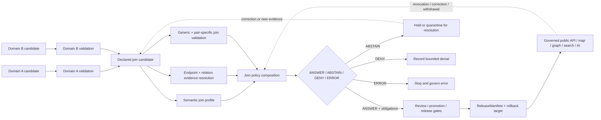

<!-- [KFM_META_BLOCK_V2]
doc_id: kfm://policy/joins
title: Cross-Domain Join Admissibility Policy Boundary and Composition Contract
type: policy-readme
version: v0.1
status: draft; repository-grounded; empty-target-completion; cross-domain-join-admissibility; composition-boundary; pair-policy-routing; evaluator-unbound; ADR-S-14-open; fail-closed; non-semantic; non-schema; non-release; non-publication
owner: NEEDS VERIFICATION — join policy steward, cross-domain architecture steward, affected domain stewards, source steward, evidence steward, rights reviewer, sensitivity reviewer, consent/privacy reviewer, validation steward, governed-API maintainer, release reviewer, docs steward
created: 2026-07-24
updated: 2026-07-24
policy_label: repository-facing; joins; cross-domain; cross-lane; relation-admissibility; source-role-anti-collapse; most-restrictive-posture; evidence-bound; rights-aware; consent-aware; sensitivity-monotonic; time-aware; spatially-bounded; correction-aware; fail-closed; no-public-bypass
current_path: policy/joins/README.md
owning_root: policy/
canonical_relationship: PROPOSED cross-domain join admissibility and policy-composition boundary; semantic join meaning remains under contracts/joins/ or an accepted relation contract home, machine shape remains under accepted schemas/contracts/v1/ join or relation profiles, and current PolicyDecision schema does not include a joins family
evidence_snapshot:
  repository: bartytime4life/Kansas-Frontier-Matrix
  base_ref: main
  target_prior_blob: 8b137891791fe96927ad78e64b0aad7bded08bdc
  directory_rules_blob: 2affb080e6f0043867c64c7f06c1ca52030fbd55
  policy_root_blob: fa9378a6a699d0985fd018dbdb9f27c15efcb1c3
  policy_data_readme_blob: 4d0f03755e788fd6fbd7fea14f5a46babb688460
  cross_lane_architecture_blob: 521007752082798a285db0204faf3ee091a3894a
  joins_contract_index_blob: e31c295b48b41a4da3e861d4536a07f2bbe1660e
  joins_schema_index_blob: 6b8ff3f4c82a7ab256b86d31c33c27d0cf0cf959
  relations_schema_index_blob: 28678976c1cdaa215fc824627baa476d17dd3bbf
  joins_validator_index_blob: c67c66136b3c16857f1957f5d72ff61f6235372d
  cross_domain_validator_blob: 06873dea443c02aa0b70425a981a66b5cd79f365
  agriculture_soil_validator_blob: d6f3cf61e0e5ac1fc15ae508e9168b4f25c2a3a2
  person_parcel_validator_blob: a3d491b6cb2910b1729185ec746eb252847008a2
  policy_decision_schema_blob: 1472d26a42c73f17545b4464a275412ffa1d098e
  open_overlapping_pull_requests_found: "0"
related:
  - ../README.md
  - ../data/README.md
  - ../geoprivacy/README.md
  - ../access/README.md
  - ../consent/README.md
  - ../sensitivity/README.md
  - ../promotion/README.md
  - ../bundles/README.md
  - ../../docs/doctrine/directory-rules.md
  - ../../docs/architecture/cross-lane-join-policy.md
  - ../../docs/architecture/cross-domain/cross-lane-relations.md
  - ../../docs/architecture/cross-domain/source-role-anti-collapse.md
  - ../../docs/architecture/cross-domain/shared-kernel.md
  - ../../docs/architecture/cross-domain/trust-membrane.md
  - ../../contracts/joins/README.md
  - ../../contracts/crosswalks/README.md
  - ../../contracts/policy/policy_input_bundle.md
  - ../../contracts/policy/policy_decision.md
  - ../../schemas/contracts/v1/joins/README.md
  - ../../schemas/contracts/v1/relations/README.md
  - ../../schemas/contracts/v1/policy/policy_input_bundle.schema.json
  - ../../schemas/contracts/v1/policy/policy_decision.schema.json
  - ../../tools/validators/joins/README.md
  - ../../tools/validators/cross-domain-joins/README.md
  - ../../tools/validators/joins/agriculture-soil/README.md
  - ../../tools/validators/joins/person-parcel/README.md
  - ../../data/registry/sources/README.md
  - ../../data/proofs/
  - ../../data/receipts/
  - ../../apps/governed-api/README.md
  - ../../release/README.md
tags: [kfm, policy, joins, cross-domain, cross-lane, relations, source-role, evidence-bundle, sensitivity, consent, rights, geoprivacy, correction, rollback, fail-closed]
truth_posture: CONFIRMED empty tracked target, singular policy root, draft cross-lane architecture, join semantic contract index, overlapping join/relation schema-family guardrails, join validator indexes, pair-specific validator READMEs, closed PolicyDecision family enum without joins, and unproved evaluator/bundle/runtime/release integration / PROPOSED parent join-policy routing contract, explicit input profile, five-check composition, posture normalization, reason codes, obligations, child-lane contract, tests, review, correction, and rollback / CONFLICTED join-versus-relation schema authority and open ADR-S-14 placement/standing / UNKNOWN accepted join policy family, active pair policy modules, native tests, bundle selector, runtime composer, decision receipts, public-surface enforcement, branch-protection requirements, and production operation
notes:
  - "This revision completes an existing empty README in place. It creates no join contract, relation schema, policy rule, policy family, fixture, validator, EvidenceBundle, receipt, graph edge, runtime route, release object, or publication state."
  - "The current PolicyDecision schema permits promotion, access, render, capability, consent, and sensitivity only; policy_family=joins is schema-invalid at the inspected snapshot."
  - "Join endpoint validity is not relation validity, and a valid relation is not automatically admissible for a requested audience, surface, lifecycle transition, or public use."
  - "A join may be more restrictive than every input because composition can create inference, re-identification, geoprivacy, title, critical-infrastructure, cultural, or source-role risks that no input exposes alone."
  - "No exact sensitive locations, living-person linkages, private parcel associations, credentials, restricted identifiers, or reverse-engineering thresholds belong in this repository-facing README or public fixtures."
[/KFM_META_BLOCK_V2] -->

<a id="top"></a>

# Cross-Domain Join Admissibility Policy Boundary

> **One-line purpose.** `policy/joins/` documents how KFM decides whether a proposed binary or multi-way relationship across independently governed domains is admissible for a named operation and audience—without becoming relation truth, a join schema, a validator, a graph authority, a lifecycle store, a release decision, or a publication path.

[](#status-and-evidence)
[](#purpose)
[](#sensitivity-and-composition-risk)
[](#policydecision-compatibility)
[](#join-posture-model)
[](#authority-level)

**Quick navigation:** [Purpose](#purpose) · [Authority](#authority-level) · [Status](#status-and-evidence) · [Scope](#scope-and-bounded-context) · [Separation](#join-concept-separation) · [Invariants](#keystone-invariants) · [Belongs](#what-belongs-here) · [Exclusions](#what-does-not-belong-here) · [Inputs](#explicit-policy-input-profile) · [Checks](#five-join-admissibility-checks) · [Relation validity](#endpoint-validity-is-not-relation-validity) · [Risk](#sensitivity-and-composition-risk) · [Postures](#join-posture-model) · [Compatibility](#policydecision-compatibility) · [Composition](#decision-composition) · [Outcomes](#normalized-outcomes) · [Reasons](#reason-code-vocabulary) · [Obligations](#obligation-vocabulary) · [Child lanes](#child-join-policy-contract) · [Surfaces](#public-surface-controls) · [Lifecycle](#governed-lifecycle-and-trust-flow) · [Threats](#threat-model) · [Validation](#validation-and-acceptance) · [Review](#review-burden) · [Rollback](#correction-revocation-and-rollback) · [Open work](#open-verification-register)

> [!IMPORTANT]
> **Join permission is not relation truth.** A join policy decision may say whether a declared relationship candidate may be evaluated, retained, reviewed, rendered, exported, promoted, or released for one bounded use. It cannot prove either endpoint, prove the relation, transfer domain authority, create evidence, clear rights, infer consent, or approve publication.

> [!CAUTION]
> **The current `PolicyDecision` contract has no `joins` policy family.** The inspected schema permits only `promotion`, `access`, `render`, `capability`, `consent`, and `sensitivity`. This README therefore treats join policy as a composition and routing boundary over applicable existing families unless a versioned contract/schema migration is reviewed, tested, and adopted.

> [!WARNING]
> **A join can create a new sensitive fact.** Two individually public records can become restricted when combined. Location inference, living-person linkage, private land association, rare-species inference, archaeology inference, infrastructure exposure, source-role laundering, or identity narrowing must be evaluated on the produced relationship and every derivative surface—not only on the source rows.

---

## Purpose

`policy/joins/` exists to answer one bounded question:

> Given explicit endpoint references, a declared relation profile, source-role and evidence posture, rights, consent, sensitivity, identity, cardinality, temporal and spatial scope, uncertainty, requested operation, audience, lifecycle state, review state, release state, correction lineage, and evaluator context, may this join be used—and under which enforceable obligations?

A mature join-policy boundary should:

- prevent cross-domain relationships from laundering authority;
- preserve every endpoint's owning domain, identity, source role, evidence, and caveats;
- require independent support for the relation assertion itself;
- compute sensitivity and exposure risk on the composed result;
- distinguish low-risk joins from steward-gated and denied joins;
- normalize multiple required policy-family decisions into one finite caller posture;
- require obligations that callers can actually enforce;
- preserve corrections, revocations, source changes, and rollback dependencies;
- keep public APIs, maps, graphs, exports, search, tiles, screenshots, embeddings, and AI inside the governed trust membrane.

This README documents the boundary and convergence target. It does not activate a rule bundle or claim runtime enforcement.

[Back to top](#top)

---

## Authority level

`policy/joins/` is a **proposed cross-cutting admissibility lane under the singular `policy/` responsibility root**.

| Concern | Authority home | Role of `policy/joins/` |
|---|---|---|
| Join or relation semantic meaning | [`contracts/joins/`](../../contracts/joins/README.md), [`contracts/crosswalks/`](../../contracts/crosswalks/README.md), or an accepted relation contract | Consume declared meaning; never redefine it here. |
| Endpoint object meaning | Owning domain contracts and doctrine | Preserve endpoint authority; never merge domains. |
| Join/relation machine shape | Accepted profile under [`schemas/contracts/v1/joins/`](../../schemas/contracts/v1/joins/README.md), [`schemas/contracts/v1/relations/`](../../schemas/contracts/v1/relations/README.md), or an accepted domain lane | Require a pinned shape; never choose a schema home by prose alone. |
| Admissibility and exposure | `policy/` | Document and eventually own reviewed join-specific policy composition if placement is accepted. |
| Endpoint source identity and role | Source contracts and `data/registry/sources/` | Require resolved source context; never invent or upgrade roles. |
| Evidence and proof | Evidence/proof roots | Require endpoint and relation support; never create evidence truth here. |
| Join validation | `tools/validators/cross-domain-joins/`, `tools/validators/joins/`, pair validators | Depend on deterministic validation; never substitute README prose for checks. |
| Joined lifecycle materialization | Governed `data/` phase roots | Policy decides admissibility; it does not store joined records. |
| Graph, map, search, vector, export, API, and AI delivery | Governed application/runtime roots | Consume released, obligation-compliant results only. |
| Release, correction, withdrawal, rollback | `release/` | Require governed references; never approve or publish. |

Directory Rules place admissibility under `policy/`, contracts under `contracts/`, machine shape under `schemas/`, validators under `tools/`, lifecycle data under `data/`, and release decisions under `release/`. This parent path is therefore responsibility-aligned **only as a policy boundary**. It must not become a second contract, schema, graph, evidence, or release home.

[Back to top](#top)

---

## Status and evidence

### Current repository state

| Surface | Status | Safe conclusion |
|---|---:|---|
| `policy/joins/README.md` | **CONFIRMED empty before this revision** | This update completes the tracked parent README in place. |
| Singular `policy/` root | **CONFIRMED** | Admissibility belongs under `policy/`; implementation maturity remains mixed. |
| Cross-lane architecture | **CONFIRMED draft** | Defines source-role preservation, most-restrictive sensitivity, EvidenceBundle composition, receipt expectations, authority preservation, and OPEN / STEWARD-REVIEW / DENIED postures; ADR-S-14 remains open. |
| `contracts/joins/README.md` | **CONFIRMED draft** | Semantic join-contract lane exists and points to `policy/joins/` for admissibility. |
| Join schema family | **CONFIRMED mixed / PROPOSED** | `schemas/contracts/v1/joins/` contains guardrails and one permissive Habitat–Fauna scaffold. |
| Relation schema family | **CONFIRMED guardrail / placement-conflicted** | `relations/` overlaps `joins/`; canonical placement is unresolved. |
| Generic join validator | **CONFIRMED README-only direct lane** | No direct executable, dedicated tests, fixtures, or workflow were established by its bounded inspection. |
| Pair-specific validator index | **CONFIRMED README** | Agriculture–Soil and Person–Parcel child validator READMEs exist; executable behavior remains unproved. |
| `PolicyDecision` schema | **CONFIRMED closed / PROPOSED** | Outcomes are `ANSWER | ABSTAIN | DENY | ERROR`; policy families do not include `joins`. |
| Active join policy modules | **NOT SURFACED by bounded search** | No active pair rule set, accepted bundle, selector, or evaluator is established here. |
| Runtime composer, receipts, release integration | **UNKNOWN / NEEDS VERIFICATION** | Documentation and validator READMEs do not prove operational enforcement. |

### Evidence boundary

This README may state repository facts verified above and doctrine carried by the inspected cross-lane architecture. It must not claim:

- ADR-S-14 is accepted;
- `policy/joins/` is an active rule family;
- a join evaluator or decision composer is deployed;
- join contracts and schemas have converged on one canonical family;
- any pair-specific join is automatically OPEN, reviewed, valid, or public-safe;
- the current join validators execute or pass;
- required reviews, branch protection, decision receipts, or rollback drills are operational;
- any joined graph edge, map layer, API payload, export, or AI answer is released.

Those claims remain `UNKNOWN` or `NEEDS VERIFICATION` until current implementation evidence proves them.

[Back to top](#top)

---

## Scope and bounded context

### In scope

- policy-relevant composition of binary and n-ary cross-domain relations;
- endpoint ownership, identity, source role, rights, consent, sensitivity, evidence, time, space, and uncertainty checks;
- operation- and audience-specific admissibility;
- OPEN, STEWARD-REVIEW, and DENIED posture routing;
- normalization to finite runtime-facing outcomes;
- pair-specific policy routing and inheritance rules;
- public-surface exposure controls;
- join-induced inference and reconstruction risk;
- dependency tracking, correction propagation, revocation, withdrawal, and rollback;
- synthetic, no-network fixtures and deterministic negative-path testing.

### Out of scope

- defining what a relationship means;
- choosing or creating join/relation schemas;
- computing the join;
- resolving domain identities or canonical records;
- issuing credentials, consent, evidence, receipts, reviews, manifests, or release approvals;
- writing RAW, WORK, QUARANTINE, PROCESSED, CATALOG, TRIPLET, or PUBLISHED data;
- storing graph edges, vector indexes, tiles, screenshots, or caches;
- publishing joined claims or allowing public clients to read internal stores;
- treating AI-generated relationships as evidence.

[Back to top](#top)

---

## Join concept separation

The word **join** is overloaded. KFM must keep the following concepts separate.

| Concept | What it is | What it is not | Owning surface |
|---|---|---|---|
| Endpoint object | A domain-owned entity, observation, assertion, feature, event, or record | A join-derived replacement for another domain's object | Domain contracts and schemas |
| Relation assertion | A claim that two or more endpoints stand in a declared relationship | Proof merely because endpoints exist | Join/relation semantic contract + evidence |
| Join profile | The accepted meaning, direction, cardinality, temporal/spatial semantics, and allowed uses | Policy permission or runtime result | Contract/profile authority |
| Join schema | Machine shape of a relation object | Relation truth or public safety | Accepted schema family |
| Join candidate | A computed or proposed relationship instance | Released graph truth | Governed lifecycle data |
| Join validator result | Deterministic findings against configured rules | Policy approval, EvidenceBundle, or release approval | `tools/validators/` and report roots |
| Join policy posture | Admissibility for a named operation and audience | Endpoint truth or relation truth | `policy/` |
| EvidenceBundle | Support for endpoint and relation claims | Policy permission | Evidence/proof roots |
| Transform or aggregation receipt | Record of how a derivative was produced | Proof the relationship is true or safe | Receipt roots |
| ReviewRecord | Steward review of a bounded candidate/use | Automatic publication | Governance/review roots |
| ReleaseManifest | Approved release binding for a public-safe artifact | Semantic meaning or policy source | `release/` |
| Graph/map/search/vector projection | A downstream representation | Sovereign truth | Governed application/data projection roots |
| AI narrative | Interpretation of released evidence | Evidence, relation creation, or permission | Governed AI runtime |

Collapsing any two rows silently is a trust failure.

[Back to top](#top)

---

## Keystone invariants

1. **Endpoint ownership remains intact.** A joined record cannot transfer canonical authority from one domain to another.
2. **Endpoint validity is not relation validity.** Each endpoint may be valid while the asserted relation is unsupported, ambiguous, stale, or false.
3. **Source roles never collapse.** Observed, regulatory, modeled, aggregate, administrative, candidate, synthetic, and public-safe roles remain distinguishable for every endpoint and derivative.
4. **Promotion never upgrades source role.** Lifecycle movement cannot relabel modeled as observed, aggregate as per-place, or candidate as verified.
5. **Sensitivity is monotonic across composition.** The output is at least as restrictive as the most restrictive input and may be stricter because of join-induced inference risk.
6. **Rights compose independently.** Every source's terms, attribution, redistribution, export, and derivative restrictions remain applicable; permissive rights on one side do not erase restrictions on another.
7. **Consent is explicit, scoped, current, and revocable.** Consent on one endpoint does not imply consent for the relation, audience, purpose, derivative, or downstream reuse.
8. **Evidence supports endpoints and the relation.** Consequential joins require resolvable endpoint evidence plus support for the relation method or assertion.
9. **Time is explicit.** Observation, validity, relationship, retrieval, review, release, and correction time must not be collapsed into one timestamp.
10. **Space is explicit.** Geometry precision, support scale, aggregation unit, spatial predicate, coordinate reference, and generalization state remain visible.
11. **Cardinality and uncertainty are explicit.** A many-to-many probabilistic relation cannot be presented as a single deterministic fact.
12. **No hidden fetches.** Policy evaluates the explicit bundle and governed references; missing context never becomes an unlogged resolver call or model assumption.
13. **No lifecycle bypass.** A policy result, validator pass, graph edge, schema pass, or join receipt cannot move a candidate directly to PUBLISHED.
14. **Obligations are enforceable or the operation fails closed.** A caller that cannot redact, generalize, withhold, audit, review, invalidate, or limit export must not proceed.
15. **Corrections propagate through dependency edges.** Endpoint withdrawal, rights change, consent revocation, sensitivity escalation, stale evidence, or relation correction invalidates affected derivatives, caches, indexes, and answers.
16. **Public clients use governed interfaces only.** They do not read policy source, internal join candidates, source registries, proofs, receipts, or non-released graph stores directly.
17. **AI is interpretive.** It may summarize released join evidence with qualifications; it may not create relation truth or repair missing support.
18. **Denied joins remain auditable.** A refusal is recorded through safe reason codes and governed references rather than disappearing without trace.

[Back to top](#top)

---

## What belongs here

Good fits for `policy/joins/` include:

- this parent README;
- reviewed declarative rules for join-specific admissibility after placement and evaluator acceptance;
- operation-specific composition rules for required policy families;
- pair-specific child lanes that tighten the parent invariants;
- join-posture registries or rule-source inputs only after a canonical machine home is accepted;
- stable reason-code and obligation vocabularies paired with contracts, schemas, fixtures, tests, and consumers;
- policies for source-role preservation, sensitivity escalation, rights/consent composition, review routing, public-safe transforms, and derivative invalidation;
- policy references to accepted join profiles, validators, evidence, reviews, receipts, and release records;
- synthetic native tests if the repository accepts a colocated policy-test convention.

A file belongs here because its primary responsibility is **admissibility of a join use**, not because it mentions two domains.

[Back to top](#top)

---

## What does not belong here

| Do not put in `policy/joins/` | Correct responsibility |
|---|---|
| Join or relation semantic definitions | `contracts/joins/`, `contracts/crosswalks/`, or accepted contract lane |
| Join/relation JSON Schemas, DTOs, enums, or field shapes | Accepted `schemas/contracts/v1/` family |
| Domain object meaning or identity rules | Owning domain docs/contracts/schemas |
| Join computation, resolvers, graph builders, ETL, or spatial engines | `packages/`, `pipelines/`, `apps/`, or `tools/` by responsibility |
| Validator code and validation reports | `tools/validators/` and accepted report roots |
| Source descriptors and registry instances | `data/registry/sources/` |
| EvidenceBundles and proof packs | Evidence/proof roots |
| TransformReceipts, AggregationReceipts, decision receipts, review records | Accepted receipt/review roots |
| Joined RAW/WORK/QUARANTINE/PROCESSED/CATALOG/TRIPLET/PUBLISHED data | Governed `data/` phase roots |
| Graph edges, vector indexes, map tiles, screenshots, exports, search indexes | Governed projection/delivery roots |
| Release manifests, correction notices, withdrawal records, rollback cards | `release/` |
| Secrets, credentials, private keys, bearer tokens, restricted endpoint identifiers | Approved secure systems, never repository-facing policy docs |
| Real sensitive join fixtures | Synthetic or safely generalized fixtures only |
| A universal “joins are allowed” grant | Operation-, audience-, profile-, evidence-, and release-specific decisions only |
| A second policy outcome contract | `contracts/policy/` and paired schemas |
| AI-generated relationship assertions | Governed evidence intake and review, not policy source |

[Back to top](#top)

---

## Explicit policy input profile

A join-policy evaluation should receive an explicit, immutable `PolicyInputBundle` or accepted equivalent. The current schema is permissive and does not enforce the complete profile below.

### Evaluation identity

- input bundle ID and version;
- canonical content hash where practical;
- evaluation request ID;
- join candidate ID or immutable reference;
- accepted join-profile ID, version, and digest;
- evaluator, bundle, entrypoint, and rule digest;
- evaluation time and timeout posture.

### Requested operation and audience

- operation such as `compute`, `retain`, `review`, `catalog`, `graph`, `render`, `query`, `answer`, `export`, `promote`, `release`, `correct`, `withdraw`, or `rollback`;
- audience class such as internal, steward, restricted reviewer, partner, public, export consumer, map runtime, search runtime, or governed AI;
- intended surface and purpose;
- requested precision, fields, geometry, time window, and quantity;
- requested lifecycle transition, if any.

### Endpoint context

For every endpoint:

- endpoint label and position in the relation;
- owning domain and object family;
- immutable object reference and digest;
- identity-resolution status;
- source descriptor reference and source role;
- evidence references and resolver status;
- rights, access, citation, and redistribution posture;
- sensitivity and public-safe transform state;
- consent or living-person posture where applicable;
- observation/validity/retrieval/release/correction times;
- geometry reference, precision, support scale, and generalization state;
- lifecycle, review, release, supersession, correction, and withdrawal state.

### Relation assertion context

- controlled predicate or relation type;
- directionality and endpoint order;
- cardinality;
- assertion method: identifier, crosswalk, reviewed manual, temporal, spatial, derived, modeled, aggregate, or another accepted profile value;
- relation evidence references;
- temporal overlap and validity interval;
- spatial predicate, tolerance/profile reference, and coordinate context;
- uncertainty, confidence, alternatives, and contradiction state;
- relation-specific caveats and prohibited interpretations;
- pairwise and joint-coherence status for multi-way joins.

### Dependency and governance context

- required policy-family decisions or inputs;
- review records and reviewer classes;
- transform and aggregation receipt references;
- correction, revocation, withdrawal, and rollback references;
- downstream derivative, cache, tile, graph, search, export, embedding, and AI dependency references;
- prior join decisions and supersession links;
- public-safe explanation profile and sensitive-detail minimization rules.

Missing, stale, ambiguous, contradicted, untrusted, or schema-incompatible context fails closed.

[Back to top](#top)

---

## Five join-admissibility checks

The inspected cross-lane architecture proposes five load-bearing checks. ADR-S-14 remains open, so this README records them as the current doctrine-backed target rather than claiming accepted executable policy.

| # | Check | Required policy posture | Blocking condition |
|---|---|---|---|
| 1 | **Source-role preservation** | Every endpoint role and derivative role remain explicit and non-collapsed. | Modeled becomes observed, aggregate becomes per-place, administrative becomes event evidence, candidate becomes public truth, or synthetic becomes reality. |
| 2 | **Most-restrictive sensitivity** | Output posture is at least the strictest input and may escalate for composition risk. | Join downgrades, averages, or omits sensitivity, or treats aggregation as automatic permission. |
| 3 | **EvidenceBundle composition** | Required endpoint and relation evidence resolve; support remains separable by endpoint and assertion. | One side's evidence is missing, flattened, stale, unresolved, contradicted, or substituted with generated text. |
| 4 | **Receipt readiness** | Required transform/aggregation/review/decision references and reproducibility metadata are present before governed transition. | Join logic or derivative cannot be replayed, audited, corrected, or invalidated. |
| 5 | **Authority preservation** | No domain, source, model, aggregate, or joined derivative acquires authority it did not hold before composition. | Join transfers identity, title, taxonomy, regulatory, legal, life-safety, cultural, or release authority. |

All five must pass for an OPEN posture. Pair-specific policy may add stricter checks but cannot weaken these.

### Additional relation mechanics

The generic validator boundary also requires explicit checks for:

- endpoint identity and referential integrity;
- relation-profile validity;
- direction and cardinality;
- temporal coherence;
- spatial coherence and scale compatibility;
- uncertainty and contradiction;
- lifecycle, review, release, correction, and rollback references;
- public-surface reconstruction risk;
- joint coherence for n-ary joins.

A mechanically valid endpoint pair does not satisfy these relation-level requirements automatically.

[Back to top](#top)

---

## Endpoint validity is not relation validity

A join policy must distinguish at least four questions:

1. **Do the referenced endpoints exist and conform to their own contracts?**
2. **Is the asserted relationship supported under the declared method and profile?**
3. **Is that relationship admissible for the requested operation and audience?**
4. **Is a specific derivative released and safe for the intended public surface?**

Possible states include:

| Endpoint state | Relation state | Policy posture | Safe conclusion |
|---|---|---|---|
| Both valid | Unsupported relation | `ABSTAIN` or `DENY` | Do not manufacture the relation. |
| One unresolved | Relation cannot be evaluated | `ABSTAIN` or `ERROR` | Resolve or quarantine; no public use. |
| Both valid | Supported low-risk relation | Potential `ANSWER` with obligations | Still requires operation, audience, lifecycle, and release checks. |
| Both valid | Supported but sensitive relation | `ABSTAIN` for review or `DENY` for public | Relation truth does not imply exposure permission. |
| Both valid | Relation contradicted | `DENY` or `ABSTAIN` | Preserve contradictions and alternatives. |
| Both valid | Relation valid but stale | `ABSTAIN` | Re-evaluate freshness and dependencies. |
| Both valid | Relation valid and released, but obligation cannot be enforced | `DENY` or `ERROR` | Caller must not proceed. |

[Back to top](#top)

---

## Sensitivity and composition risk

### Most-restrictive baseline

The join inherits at least the most restrictive applicable endpoint posture. It must never average sensitivity downward.

### Join-induced escalation

A join may require a stricter posture when the composition creates new information, including:

- a public habitat layer that narrows a restricted occurrence location;
- a public parcel geometry joined to a living-person assertion;
- public roads joined to archaeology clues that reveal a site;
- public hazard summaries joined to precise infrastructure assets;
- separate public records that re-identify an individual or family;
- an aggregate value joined to a point or parcel that falsely creates per-place precision;
- modeled and observed records combined in a way that hides role distinctions;
- historical or administrative sources joined into an unsupported legal or title conclusion;
- multiple low-risk pairwise relations that form a high-risk multi-way inference.

### Sensitivity composition rule

**PROPOSED:**

```text
effective_join_posture = max(
  endpoint_postures,
  relation_profile_floor,
  operation_and_audience_floor,
  join_induced_inference_risk,
  unresolved_rights_or_consent_floor,
  correction_or_revocation_floor
)
```

The formula is semantic guidance, not an accepted executable enum or implementation.

### Rights and consent remain independent

- Rights permission on one endpoint does not grant derivative rights over another endpoint.
- Public availability is not redistribution permission.
- Consent for one purpose, audience, field, precision, or time window does not cover a joined derivative automatically.
- Revocation, expiry, dispute, or representative-authority change invalidates dependent uses.
- Unknown rights or consent do not become implicit permission.

[Back to top](#top)

---

## Join posture model

The inspected architecture proposes three join postures. They describe **join governance posture**, not the canonical `PolicyDecision.outcome` enum.

### OPEN

Appropriate only when:

- all required checks pass;
- all required evidence resolves;
- endpoint and relation rights/consent/sensitivity are public-safe for the operation;
- no pair-specific rule requires review or denial;
- no novel or joint-coherence risk remains;
- required receipts and obligations can be satisfied;
- later promotion and release gates remain available.

OPEN means the join may proceed to the next governed stage for the evaluated operation. It does **not** mean published.

### STEWARD-REVIEW

Appropriate when:

- a known pair policy requires review;
- the join is novel or its profile is unaccepted;
- T2/T3, consent-bearing, culturally sensitive, title-sensitive, rare-species, archaeology, infrastructure, or other specialist review applies;
- source-role combinations or multi-way composition are not pre-approved;
- public-safe transformation might exist but is not yet reviewed;
- contradictions, uncertainty, or rights questions require accountable judgment.

The candidate remains non-public. Runtime-facing policy normally maps unresolved required review to `ABSTAIN`; a public request may map to `DENY` while restricted review remains possible.

### DENIED

Appropriate when:

- a pair rule explicitly denies the requested use;
- a T4 or equivalent protected input cannot be made safe for the join context;
- source-role collapse cannot be repaired;
- a living-person × identifiable-location relation is requested publicly;
- the join enables adversary mapping, re-identification, looting, targeting, title overclaim, or other prohibited inference;
- required consent is revoked or absent with no lawful/accepted alternative;
- required obligations cannot be enforced;
- a denied join is repackaged under a different label.

DENIED is operation- and audience-specific where possible, but some relation forms may be denied for all ordinary public uses.

### New join default

Until ADR-S-14 and pair-specific policy are accepted, a novel join should default to **STEWARD-REVIEW or fail-closed abstention**, not OPEN.

[Back to top](#top)

---

## `PolicyDecision` compatibility

The current schema defines:

```text
outcome = ANSWER | ABSTAIN | DENY | ERROR
policy_family = promotion | access | render | capability | consent | sensitivity
```

It does not define `joins`, `relation`, or `cross-domain` as a policy family.

### Current compatible posture

Until a reviewed migration changes the contract, join admissibility should be represented through the applicable existing families:

| Join concern | Existing policy family candidate | Boundary |
|---|---|---|
| Sensitivity and composition risk | `sensitivity` | Can block or obligate generalization/withholding; does not prove relation truth. |
| Consent applicability | `consent` | Applies where subjects, representatives, living-person data, DNA, or consent-bearing records participate. |
| Who may compute, inspect, export, or administer a join | `access` or `capability` | Capability-specific and purpose-bound; access is not publication. |
| Map, tile, popup, search, screenshot, or public projection | `render` | Enforces public-surface obligations and reconstruction limits. |
| Lifecycle advancement | `promotion` | Decides whether a supported candidate may advance; does not repair join defects. |

A governed join coordinator may compose these decisions. The coordinator must not silently emit `policy_family=joins` while the schema rejects it.

### Deliberate migration option

Adding a new family would require, at minimum:

1. accepted semantic rationale and ADR/decision;
2. updated `PolicyDecision` contract and schema version;
3. valid and invalid fixtures;
4. validator updates;
5. policy runtime, bundle, selector, and entrypoint updates;
6. consumer and obligation-interpreter migration;
7. receipt/replay and audit updates;
8. compatibility period and rollback plan;
9. observed CI and integration evidence.

This README performs none of those changes.

[Back to top](#top)

---

## Decision composition

**PROPOSED compatibility algorithm:**

1. Identify every policy family required by the join profile, operation, audience, endpoint classes, and intended surface.
2. Evaluate each required family against the same immutable input snapshot or explicitly linked snapshots.
3. Preserve every decision ID, family, evaluator version, reasons, obligations, and evaluation time.
4. Compose the caller posture using fail-closed precedence.
5. Union compatible obligations without weakening any family.
6. Treat obligation conflicts, stale decisions, or mismatched input hashes as `ERROR` or `DENY` according to the accepted contract.
7. Record the composition through a governed receipt or decision-envelope mechanism once such a mechanism is accepted.

### Proposed precedence

```text
required ERROR   -> ERROR
else any DENY    -> DENY
else any ABSTAIN -> ABSTAIN
else all ANSWER  -> ANSWER with union of obligations
```

This precedence applies only to **required** families. Optional informational decisions must not override required policy.

### Obligation composition

- Obligations accumulate; permissive families cannot remove restrictive obligations.
- `withhold_exact_location` cannot be canceled by `allow_render`.
- `no_export` cannot be canceled by general access permission.
- `require_steward_review` blocks public action until review is resolved.
- `attach_source_role` and `attach_limitations` remain mandatory across API, UI, export, and AI surfaces.
- A caller that cannot interpret an obligation must fail closed.
- Conflicting obligations must surface as an error or escalation, not silent preference.

### Freshness and binding

Every composed decision should bind to:

- the same join candidate or a declared compatible version;
- the same endpoint and relation evidence snapshot;
- the same requested operation and audience;
- the same policy bundle/evaluator versions;
- current rights, consent, sensitivity, review, release, and correction state.

Reusing a decision outside that scope is prohibited.

[Back to top](#top)

---

## Normalized outcomes

| Outcome | Meaning for a join request | Typical routing |
|---|---|---|
| `ANSWER` | All required policy families allow the exact operation and obligations can be enforced. | Proceed only to the next governed stage; not automatic release. |
| `ABSTAIN` | Support, identity, relation profile, rights, consent, sensitivity, review, freshness, or evaluator context is unresolved. | Hold, review, resolve, or quarantine; do not manufacture a relation or public answer. |
| `DENY` | Policy blocks the operation or audience. | Stop the requested use; preserve safe audit/correction references. |
| `ERROR` | Invalid input, schema conflict, evaluator failure, stale/mismatched decision, obligation conflict, timeout, or process-integrity failure. | Stop and route to governed error/quarantine handling. |

### Outcome does not equal lifecycle state

A runtime outcome and an operational state remain distinct:

- `ABSTAIN` may correspond to a review hold in PROCESSED or QUARANTINE.
- `DENY` may prohibit public use while retaining a restricted internal candidate.
- `ANSWER` may allow review or cataloging but not promotion or release.
- `ERROR` may require retry, correction, quarantine, or withdrawal.

[Back to top](#top)

---

## Reason-code vocabulary

The codes below are **PROPOSED**. They must not be treated as canonical until contracts, schemas, policy modules, fixtures, validators, and consumers agree.

### Profile and identity

- `JOIN_PROFILE_MISSING`
- `JOIN_PROFILE_UNACCEPTED`
- `JOIN_PROFILE_HASH_MISMATCH`
- `ENDPOINT_REFERENCE_MISSING`
- `ENDPOINT_IDENTITY_UNRESOLVED`
- `ENDPOINT_OWNER_UNRESOLVED`
- `ENDPOINT_DOMAIN_MISMATCH`
- `RELATION_PREDICATE_UNSUPPORTED`
- `RELATION_DIRECTION_INVALID`
- `CARDINALITY_UNSUPPORTED`
- `JOINT_COHERENCE_UNRESOLVED`

### Source role and authority

- `SOURCE_ROLE_MISSING`
- `SOURCE_ROLE_COLLAPSE`
- `SOURCE_ROLE_UPGRADE_ATTEMPT`
- `AGGREGATE_TO_PLACE_COLLAPSE`
- `MODELED_TO_OBSERVED_COLLAPSE`
- `ADMINISTRATIVE_TO_EVENT_COLLAPSE`
- `SYNTHETIC_TO_REALITY_COLLAPSE`
- `AUTHORITY_TRANSFER_ATTEMPT`
- `DOMAIN_OWNERSHIP_COLLAPSE`

### Evidence and uncertainty

- `ENDPOINT_EVIDENCE_UNRESOLVED`
- `RELATION_EVIDENCE_UNRESOLVED`
- `EVIDENCE_SNAPSHOT_MISMATCH`
- `EVIDENCE_STALE`
- `RELATION_CONTRADICTED`
- `UNCERTAINTY_MISSING`
- `ALTERNATIVE_RELATION_OMITTED`
- `RECEIPT_REQUIREMENT_UNSATISFIED`

### Rights, consent, and sensitivity

- `RIGHTS_UNRESOLVED`
- `DERIVATIVE_RIGHTS_DENIED`
- `ATTRIBUTION_OBLIGATION_MISSING`
- `CONSENT_REQUIRED`
- `CONSENT_SCOPE_MISMATCH`
- `CONSENT_EXPIRED`
- `CONSENT_REVOKED`
- `SENSITIVITY_POSTURE_MISSING`
- `SENSITIVITY_DOWNGRADE_ATTEMPT`
- `JOIN_INFERENCE_RISK_ESCALATION`
- `REIDENTIFICATION_RISK`
- `GEOPRIVACY_RISK`
- `LIVING_PERSON_LOCATION_JOIN_DENIED`
- `CRITICAL_ASSET_PRECISION_DENIED`
- `CULTURAL_OR_ARCHAEOLOGY_EXPOSURE_DENIED`

### Time, space, and use

- `TEMPORAL_SCOPE_MISSING`
- `TEMPORAL_SCOPE_INCOMPATIBLE`
- `SPATIAL_PROFILE_MISSING`
- `SPATIAL_SCOPE_INCOMPATIBLE`
- `PRECISION_EXCEEDS_POLICY`
- `SUPPORT_SCALE_COLLAPSE`
- `AUDIENCE_UNRESOLVED`
- `PURPOSE_UNRESOLVED`
- `PUBLIC_SURFACE_UNSAFE`
- `EXPORT_NOT_ALLOWED`
- `INSTRUCTION_CLASS_OUTPUT_DENIED`

### Governance, lifecycle, and runtime

- `REQUIRED_POLICY_FAMILY_MISSING`
- `JOIN_POLICY_FAMILY_UNRESOLVED`
- `REVIEW_REQUIRED`
- `REVIEW_STALE`
- `RELEASE_REFERENCE_MISSING`
- `ROLLBACK_TARGET_MISSING`
- `CORRECTION_DEPENDENCY_UNRESOLVED`
- `WITHDRAWN_ENDPOINT_DEPENDENCY`
- `DECISION_INPUT_HASH_MISMATCH`
- `DECISION_STALE`
- `OBLIGATION_UNSUPPORTED_BY_CALLER`
- `OBLIGATION_CONFLICT`
- `EVALUATOR_UNAVAILABLE`
- `EVALUATOR_TIMEOUT`
- `POLICY_BUNDLE_UNACCEPTED`

Public explanations should map these to bounded language without revealing protected locations, person identities, infrastructure details, sensitive predicates, or attack thresholds.

[Back to top](#top)

---

## Obligation vocabulary

The obligations below are **PROPOSED** and require an accepted interpreter before callers rely on them.

### Preserve meaning and support

- `preserve_endpoint_references`
- `preserve_endpoint_domains`
- `preserve_source_roles`
- `preserve_relation_profile`
- `attach_endpoint_evidence_refs`
- `attach_relation_evidence_refs`
- `surface_uncertainty`
- `surface_cardinality`
- `surface_temporal_scope`
- `surface_spatial_support`
- `attach_limitations`
- `attach_source_attribution`

### Restrict exposure

- `withhold_exact_location`
- `generalize_geometry`
- `aggregate_output`
- `reduce_precision`
- `delay_publication`
- `suppress_sensitive_predicate`
- `deny_public_render`
- `deny_public_search`
- `deny_public_graph_edge`
- `deny_export`
- `deny_embedding`
- `deny_ai_answer`
- `restricted_audience_only`
- `no_cache`
- `short_cache_ttl`

### Require governance

- `require_join_steward_review`
- `require_each_domain_steward_review`
- `require_privacy_review`
- `require_rights_review`
- `require_sensitivity_review`
- `require_cultural_review`
- `require_security_review`
- `require_release_review`
- `require_separation_of_duties`
- `require_transform_receipt`
- `require_aggregation_receipt`
- `require_review_record`
- `require_release_manifest`
- `require_rollback_target`

### Preserve correction and revocation

- `register_dependency_edges`
- `recompute_on_endpoint_change`
- `recompute_on_policy_change`
- `invalidate_graph_projection`
- `invalidate_tiles_and_caches`
- `invalidate_search_and_vector_indexes`
- `invalidate_exports`
- `invalidate_ai_citations`
- `propagate_consent_revocation`
- `propagate_rights_change`
- `propagate_sensitivity_escalation`
- `withdraw_public_derivative`
- `preserve_supersession_lineage`

An obligation is mandatory. If a caller cannot enforce it, the operation cannot proceed.

[Back to top](#top)

---

## Child join policy contract

No executable child join-policy lane was established by the bounded search used for this revision. References to pair-specific policy homes exist in architecture and contract documentation, but path mention is not implementation evidence.

A future child lane under `policy/joins/<pair-or-profile>/` must:

1. identify the accepted pair/profile and owning domains;
2. reference the semantic join contract and canonical schema profile;
3. inherit every parent invariant without weakening it;
4. declare endpoint source-role, rights, consent, sensitivity, evidence, time, space, and uncertainty requirements;
5. define OPEN, STEWARD-REVIEW, and DENIED posture conditions;
6. map its posture to existing `PolicyDecision` families or a reviewed migrated contract;
7. define stable reason codes and obligations;
8. define public-safe transformations and forbidden outputs;
9. require synthetic valid, invalid, abstain, deny, error, correction, and rollback fixtures;
10. identify validators, runtime consumers, receipt destinations, review owners, and release gates;
11. preserve pair orientation and slug conventions;
12. include deprecation, correction, supersession, and rollback behavior.

### Pair-specific validator evidence

| Validator lane | Confirmed documentation posture | Policy implication |
|---|---|---|
| Agriculture × Soil | Shared validator README preserves Soil ownership, MUKEY/COKEY/CHKEY identity, support type, source role, aggregation, evidence, release, and correction boundaries. | A future policy lane may tighten field/operator, private business, geometry-scope, and derivative-exposure rules; it must not redefine Soil or Agriculture meaning. |
| Person × Parcel | Shared validator README applies fail-closed living-person, consent, privacy, title-sensitive, parcel-sensitive, DNA/genealogy, and public-surface controls. | A future policy lane must deny or tightly gate identifiable living-person/parcel relationships and cannot turn assessor/tax or parcel geometry into title truth. |
| Generic cross-domain | Generic validator README preserves ownership, source role, sensitivity, evidence, time, space, uncertainty, lifecycle, correction, and public boundaries. | Every pair lane must inherit generic outcomes and may only become stricter. |

### Example posture register

The draft cross-lane architecture records representative postures, including:

- aggregate Soil × Agriculture may be OPEN when scope and roles align, while farm/operator detail is DENIED for public release;
- living-person × parcel is DENIED for public use, while bounded deceased historical context may be lower risk;
- Hazards × Settlements summary may require steward review, while precise critical-asset exposure is DENIED;
- Hydrology × Fauna generally requires steward review because joined geometry may reveal sensitive occurrence context;
- Atmosphere × Hazards may be OPEN only when observed, modeled, regulatory, and aggregate roles remain explicit;
- novel Frontier Matrix compositions default to steward review.

These are doctrine-backed orientation examples, not proof of active pair rules.

[Back to top](#top)

---

## Public surface controls

A join's risk must be evaluated on every derivative surface.

| Surface | Required controls | Fail-closed condition |
|---|---|---|
| Catalog/triplet | Relation profile, endpoint refs, evidence, source roles, uncertainty, sensitivity, policy and review state | Unsupported relation or missing posture enters discovery as truth |
| Graph | Edge predicate, direction, confidence, provenance, visibility, correction lineage | Sensitive or unsupported edge becomes traversable or authoritative |
| Map/tile | Generalization floor, audience projection, source-role labels, release state, cache invalidation | Zoom, styling, combination, or cached tiles reconstruct protected detail |
| API | Governed DTO, obligations enforced server-side, no internal-store access | Raw candidate, policy source, proof store, or restricted relation leaks |
| Search | Visibility filter, safe snippets, predicate suppression, stale-index invalidation | Search reveals hidden relationship or precise location |
| Export/download | Explicit export permission, rights/consent, field allowlist, quantity and precision limits | Bulk export enables reconstruction or prohibited redistribution |
| Focus Mode/evidence drawer | Resolved evidence, source-role qualification, limitations, bounded explanation | Generated narrative overstates or omits caveats |
| Screenshot/print | Render policy, watermark/labels where required, sensitive-overlay suppression | Visual composition reveals what API fields individually hide |
| Embedding/vector retrieval | Public-safe corpus only, visibility metadata, deletion/revocation propagation | Vector search reconstructs withheld relationships |
| AI answer | Cite-or-abstain, resolved released evidence, source-role qualification, no instruction/alert overreach | Model memory or raw join context substitutes for evidence or policy |
| Cache/CDN | Decision-bound keying, short TTL where needed, revocation and withdrawal invalidation | Old allowed derivative survives a blocking change |

Client-side concealment is never sufficient. Sensitive data must be excluded, transformed, or denied before ordinary public delivery.

[Back to top](#top)

---

## Governed lifecycle and trust flow



Rules:

- join evaluation does not replace endpoint-domain validation;
- policy composition does not compute the join;
- `ANSWER` does not bypass promotion or release;
- review and release records live outside this directory;
- public surfaces consume only released, obligation-compliant derivatives;
- correction and withdrawal re-enter policy evaluation and invalidate downstream carriers.

[Back to top](#top)

---

## Threat model

| Threat | Failure | Required posture |
|---|---|---|
| Source-role laundering | Model, aggregate, administrative, candidate, or synthetic content is presented as observed truth | Preserve roles; deny collapse; surface qualifications |
| Authority laundering | One domain's object or reviewer is treated as authority for another domain | Preserve domain ownership and specialist review |
| Proximity-as-identity | Spatial closeness becomes identity, residence, ownership, occurrence, or causation | Require accepted spatial predicate and relation evidence |
| Temporal collapse | Records from incompatible times become a current relationship | Require explicit intervals and overlap rules |
| Scale collapse | County/tract/grid aggregate becomes parcel, point, person, or site truth | Preserve support scale; deny or aggregate |
| Re-identification | Public records combine into living-person or protected identity linkage | Escalate sensitivity; deny or tightly restrict |
| Geoprivacy inference | Habitat, roads, hydrology, or other context reveals a protected occurrence/site | Evaluate produced geometry and derivative surfaces |
| Title/legal overclaim | Parcel, assessor, tax, genealogy, or instrument context becomes legal ownership truth | Preserve assertion/caveat posture; deny legal conclusion |
| Critical-asset exposure | Joined infrastructure and hazard details enable adversary mapping | Deny precision; allow only reviewed summary where appropriate |
| Cultural/archaeology exposure | Public context reveals sacred, burial, cultural, or archaeological locations | Specialist review; generalize, stage, or deny |
| Consent scope expansion | Consent for one record or purpose is reused for a new joined derivative | Re-evaluate exact operation, audience, purpose, fields, time, and derivative |
| Rights laundering | Open rights on one input hide restrictions on another | Apply all relevant rights and derivative terms |
| Pairwise-safe / jointly-unsafe | Each pair passes but an n-way join creates a prohibited inference | Require joint-coherence and aggregate risk evaluation |
| Policy-family omission | Join coordinator evaluates only one of several required families | Determine required family set from profile and operation; fail closed |
| Stale decision replay | Old policy result is reused after source, consent, sensitivity, or release change | Bind decisions to hashes and invalidate dependencies |
| Obligation stripping | API, UI, export, or AI drops required limitations or restrictions | Enforce obligations server-side and test consumers |
| Cache persistence | Withdrawn join remains in tiles, graph, search, vector, export, or AI caches | Dependency-aware invalidation and rollback drill |
| Denied-join renaming | Prohibited relation is called integration, enrichment, crosswalk, or context | Evaluate structure and effect, not label |
| AI relation fabrication | Model invents a relation from plausible context | Require relation evidence; abstain without closure |

[Back to top](#top)

---

## Validation and acceptance

### Current validation posture

- Generic and pair-specific validator READMEs exist.
- The generic direct validator lane reported no established executable, dedicated tests, fixtures, or workflow in its bounded inspection.
- Join and relation schema families overlap and remain placement-conflicted.
- The current `PolicyDecision` shape is concrete but has no join family.
- The policy root remains evaluator-unbound and bundle-unaccepted.

Therefore, this README cannot claim active join-policy enforcement.

### Minimum synthetic fixture matrix

| Fixture | Expected posture |
|---|---|
| Public aggregate × public aggregate at compatible support scale, all evidence resolved | Candidate OPEN / normalized `ANSWER` with attribution and limitations |
| Modeled × observed with roles preserved and clear uncertainty | Pair-policy dependent; often review; never relabel output as observed |
| Modeled labeled as observed | `DENY` |
| Aggregate joined to individual parcel/person | `DENY` or `ABSTAIN` depending operation; public use denied |
| Living-person × identifiable parcel | `DENY` for public use |
| Deceased historical person × settlement with evidence and low sensitivity | Candidate OPEN or review per accepted profile |
| Restricted species occurrence × public habitat | `DENY` or steward review with public-safe derivative only |
| Public habitat that reconstructs restricted occurrence | `DENY` for unsafe surface |
| Critical infrastructure × precise hazard | `DENY` for adversary-mapping use |
| Public hazard summary × generalized settlement | Steward review or OPEN only under accepted profile |
| Endpoint evidence resolved but relation evidence missing | `ABSTAIN` |
| Relation contradicted by another source | `ABSTAIN` or `DENY`; contradiction remains visible |
| Rights unknown on one endpoint | `ABSTAIN` or `DENY` |
| Consent revoked after prior join release | New use `DENY`; trigger invalidation/withdrawal obligations |
| Pairwise-safe three-way join producing re-identification | `DENY` or steward review after joint-coherence check |
| Required review missing | `ABSTAIN`; public request may be `DENY` |
| Evaluator unavailable or bundle hash mismatch | `ERROR` |
| Caller cannot enforce no-export/generalization obligation | `DENY` or `ERROR` |
| Endpoint withdrawn after release | Re-evaluation, derivative withdrawal, cache invalidation |

Fixtures must be synthetic, no-network, non-secret, and free of real sensitive locations or living-person linkages.

### Required test families

1. Contract/schema pairing and canonical path tests.
2. Valid/invalid join-shape tests.
3. Endpoint ownership and referential-integrity tests.
4. Source-role anti-collapse tests.
5. Evidence endpoint-plus-relation closure tests.
6. Rights, consent, sensitivity, and geoprivacy composition tests.
7. Temporal, spatial, cardinality, uncertainty, and contradiction tests.
8. OPEN / STEWARD-REVIEW / DENIED posture tests.
9. `PolicyDecision` family-compatibility and composition tests.
10. Obligation union, conflict, and unsupported-caller tests.
11. Pair-specific Agriculture–Soil and Person–Parcel negative-path tests.
12. Multi-way joint-coherence tests.
13. Catalog, graph, map, API, search, export, screenshot, embedding, and AI leakage tests.
14. Correction, revocation, withdrawal, cache invalidation, and rollback tests.
15. No-network, read-only CI and deterministic replay tests.

### Activation gates

Before executable join policy is treated as active, require:

- accepted standing for `policy/joins/` and closure or replacement of ADR-S-14;
- accepted join/relation contract and schema placement rules;
- accepted `PolicyInputBundle` profile for joins;
- deliberate decision on composed existing families versus a versioned join family;
- accepted evaluator, immutable bundle, selector, and entrypoint;
- pair-policy registry and one authoritative child home per join profile;
- native valid/invalid/abstain/deny/error fixtures and tests;
- generic and pair-specific validator integration;
- obligation interpreter in every governed consumer;
- decision receipt/replay, safe audit, and dependency graph;
- review ownership and separation of duties;
- release dry run and public-surface leakage tests;
- correction, revocation, withdrawal, cache invalidation, and rollback drill;
- observed required-check success and branch-protection evidence.

[Back to top](#top)

---

## Review burden

| Change class | Minimum review posture |
|---|---|
| README-only boundary clarification | Policy-aware maintainer + docs review |
| Generic join rule | Join policy + cross-domain architecture + validator reviewer |
| Pair-specific rule | Both/all affected domain stewards + join policy + validator reviewer |
| Source-role or authority rule | Source steward + affected domains + policy reviewer |
| Contract/schema placement or shape | Contract + schema + join + domain + migration reviewers |
| Rights or derivative-use rule | Rights reviewer + affected source/domain owners |
| Living-person, consent, DNA, genealogy, parcel/title | Privacy/consent + People/DNA/Land + policy + release review |
| Rare species, habitat, archaeology, cultural, or sensitive location | Relevant specialist + sensitivity/geoprivacy + policy + release review |
| Critical infrastructure or life-safety context | Security/infrastructure/hazards + policy + release review |
| Outcome normalization or decision-family change | Contracts + schemas + policy runtime + consumers + migration review |
| Bundle, selector, signing, or activation | Policy runtime + supply-chain/security + validation + release review |
| Public map/API/search/export/AI obligation | Application owner + policy + privacy/security + release review |
| Correction, revocation, withdrawal, rollback | Policy + evidence/proof + release + operations, with separation of duties |

A reviewer of endpoint A should not automatically approve endpoint B's domain meaning or the relation assertion. Material public releases should separate rule authoring, validation, domain review, and release approval as maturity permits.

[Back to top](#top)

---

## Correction, revocation, and rollback

### Dependency registration

Every admitted joined derivative should identify:

- endpoint object and source references;
- endpoint and relation EvidenceBundle references;
- join profile and schema version;
- policy decisions and evaluator/bundle hashes;
- transform/aggregation/review/release records;
- downstream catalog, graph, map, tile, search, export, vector, screenshot, cache, and AI references;
- correction, withdrawal, supersession, and rollback targets.

### Re-evaluation triggers

- endpoint correction, withdrawal, supersession, or deletion;
- source descriptor role, rights, access, cadence, or sensitivity change;
- consent expiry, suspension, dispute, or revocation;
- new evidence or contradiction;
- relation-profile or schema change;
- policy bundle or evaluator change;
- review expiry or reversal;
- release correction or withdrawal;
- discovery of reconstruction, re-identification, or obligation failure.

### Required response

1. Stop new affected uses.
2. Mark prior decisions stale or superseded.
3. Re-evaluate the join against current inputs.
4. Withdraw or restrict affected public derivatives when required.
5. Invalidate caches, graph/search/vector indexes, exports, screenshots where controllable, and AI retrieval/citation references.
6. Preserve prior receipts and decisions for audit; do not silently rewrite history.
7. Emit correction, supersession, withdrawal, and rollback records in their accepted homes.
8. Verify public surfaces no longer expose the blocked relation.

### Documentation rollback

Reverting this README restores the prior empty tracked file. That rollback changes documentation only; it cannot undo any future executable rule, contract, schema, data, receipt, release, or public artifact. Operational rollback must follow the dependency and release procedures above.

[Back to top](#top)

---

## Open verification register

| ID | Question | Status | Closure evidence |
|---|---|---|---|
| `JOIN-POL-001` | Is `policy/joins/` an accepted canonical policy lane, a routing index, or a transitional path? | **NEEDS VERIFICATION** | accepted ADR or policy-root decision |
| `JOIN-POL-002` | Will ADR-S-14 adopt OPEN / STEWARD-REVIEW / DENIED or another posture model? | **NEEDS VERIFICATION** | accepted ADR and migration notes |
| `JOIN-POL-003` | Is join policy represented by composed existing families or a new versioned family? | **UNKNOWN** | contract/schema/runtime decision |
| `JOIN-POL-004` | Which join/relation semantic contract family is canonical? | **NEEDS VERIFICATION** | contract registry and migration decision |
| `JOIN-POL-005` | Which schema family is canonical: `joins/`, `relations/`, domain lane, or profile-specific placement? | **CONFLICTED** | ADR/schema migration and compatibility tests |
| `JOIN-POL-006` | Which accepted join profile fields are required? | **UNKNOWN** | contract, schema, fixtures, validator |
| `JOIN-POL-007` | Which source-role vocabulary and transition rules are canonical? | **NEEDS VERIFICATION** | accepted source contract/schema/ADR |
| `JOIN-POL-008` | Which sensitivity vocabulary and composition algorithm are canonical? | **NEEDS VERIFICATION** | accepted rubric, policy, fixtures |
| `JOIN-POL-009` | Which rights and derivative-rights composition rules are accepted? | **UNKNOWN** | rights contract/policy and tests |
| `JOIN-POL-010` | Which consent applicability and revocation rules govern joined derivatives? | **UNKNOWN** | consent profile, policy, synthetic tests |
| `JOIN-POL-011` | Which endpoint and relation EvidenceBundle requirements are canonical? | **NEEDS VERIFICATION** | evidence contract and join fixtures |
| `JOIN-POL-012` | Which transform, aggregation, decision, and review receipts are required? | **NEEDS VERIFICATION** | accepted receipt contracts/schemas |
| `JOIN-POL-013` | Which generic reason codes and obligations are canonical? | **PROPOSED** | contract/schema/consumer review |
| `JOIN-POL-014` | Which pair-specific join policy lanes currently exist and are authoritative? | **UNKNOWN** | recursive inventory and ownership review |
| `JOIN-POL-015` | Which pair slug and orientation convention is accepted? | **UNKNOWN** | naming ADR and migration tests |
| `JOIN-POL-016` | Which evaluator, bundle, selector, and entrypoint are accepted? | **UNKNOWN** | pinned runtime and observed native tests |
| `JOIN-POL-017` | Which join validators execute and which are required checks? | **UNKNOWN** | executable inventory, workflow runs, ruleset evidence |
| `JOIN-POL-018` | How are pair-specific validators registered with the generic validator? | **UNKNOWN** | registry/config plus tests |
| `JOIN-POL-019` | How are n-ary joint-coherence checks implemented beyond pairwise checks? | **UNKNOWN** | algorithm, fixtures, performance tests |
| `JOIN-POL-020` | Which join posture is the default for novel profiles? | **NEEDS VERIFICATION** | accepted ADR and policy tests |
| `JOIN-POL-021` | Which governed service composes policy-family decisions? | **UNKNOWN** | implementation and contract tests |
| `JOIN-POL-022` | Which audit/receipt sink records denied and abstained joins safely? | **UNKNOWN** | threat-reviewed contract and tests |
| `JOIN-POL-023` | Which dependency graph supports correction and revocation cascades? | **UNKNOWN** | implementation and drill evidence |
| `JOIN-POL-024` | Which graph, map, search, export, vector, screenshot, and AI surfaces enforce obligations? | **UNKNOWN** | consumer inventory and leakage tests |
| `JOIN-POL-025` | How are tile, graph, search, vector, export, and AI caches invalidated? | **UNKNOWN** | operational contract and drill |
| `JOIN-POL-026` | Which sensitive join classes are always denied for ordinary public use? | **NEEDS VERIFICATION** | specialist-reviewed pair policies |
| `JOIN-POL-027` | Which joins can move from steward review to OPEN, and on what evidence? | **UNKNOWN** | pattern-history and approval contract |
| `JOIN-POL-028` | How are jurisdiction-specific rules composed without harmonization collapse? | **UNKNOWN** | jurisdiction policy profile and tests |
| `JOIN-POL-029` | What receipt fan-out and resolver budgets apply to large joins? | **UNKNOWN** | resource-bound contract and benchmarks |
| `JOIN-POL-030` | Who owns join policy, architecture, schemas, validation, domains, privacy/security, and release approval? | **NEEDS VERIFICATION** | accepted stewardship and separation-of-duties record |
| `JOIN-POL-031` | Has an end-to-end admit/review/deny/release/correct/rollback join drill succeeded? | **UNKNOWN** | signed drill report and verified state |
| `JOIN-POL-032` | Are fixtures, logs, reasons, and receipts free of protected relationship details? | **NEEDS VERIFICATION** | secret/sensitivity scans and log tests |
| `JOIN-POL-033` | Are denied joins prevented from being reintroduced under crosswalk, enrichment, integration, or context labels? | **UNKNOWN** | structural policy tests and runtime guards |
| `JOIN-POL-034` | Are endpoint validity, relation validity, policy admissibility, and release approval distinct in every contract and consumer? | **UNKNOWN** | contract tests and architecture guards |

[Back to top](#top)

---

## Last reviewed

**2026-07-24 — initial repository-grounded completion of the previously empty parent README.**

This review confirms the documented repository surfaces, current schema incompatibility with `policy_family=joins`, and the open architecture/placement questions described above. It does not accept ADR-S-14, activate join rules, prove a relation, approve a pair lane, create a graph edge, authorize a public surface, approve release, or create publication state.

---

## Maintainer checklist

Before adding executable join policy or child lanes:

- [ ] resolve `policy/joins/` standing and ADR-S-14;
- [ ] settle join/relation/domain contract and schema placement;
- [ ] identify one authoritative pair/profile home and slug convention;
- [ ] preserve endpoint domain ownership and source roles;
- [ ] require endpoint and relation evidence separately;
- [ ] implement most-restrictive and join-induced sensitivity evaluation;
- [ ] decide composed existing families versus a versioned join family;
- [ ] harden `PolicyInputBundle` with explicit non-secret join context;
- [ ] define reason codes and enforceable obligations through contracts/schemas;
- [ ] use synthetic, no-network fixtures only;
- [ ] test endpoint, relation, pairwise, and n-ary joint coherence;
- [ ] test rights, consent, sensitivity, geoprivacy, re-identification, title, cultural, and infrastructure risks;
- [ ] test Agriculture–Soil and Person–Parcel negative paths;
- [ ] bind generic and pair-specific validators;
- [ ] bind governed consumers and reject unknown obligations;
- [ ] register dependencies and prove invalidation across graph, map, search, export, vector, caches, screenshots, and AI;
- [ ] prove correction, revocation, withdrawal, and rollback;
- [ ] keep semantic meaning, machine shape, evidence, receipts, lifecycle data, release approval, and publication outside this directory.

> **Final boundary:** domains own endpoints; contracts define relation meaning; schemas constrain shape; validators test declared behavior; join policy decides bounded admissibility by composing independent gates; evidence supports claims; review resolves accountable judgment; release governs publication; and public clients consume only released, obligation-compliant derivatives through governed interfaces.

[Back to top](#top)
