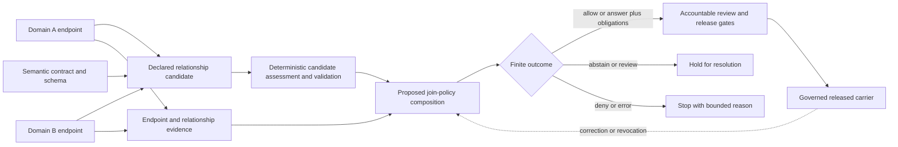

<!-- [KFM_META_BLOCK_V2]
doc_id: kfm://policy/joins
title: policy/joins/ — Cross-Domain Join Admissibility Policy Boundary
type: readme
version: v0.2
status: draft; BOUNDARY_COMPACT; repository-grounded; proposed-inactive; pair-routing-documented; candidate-assessments-implemented; evaluator-unbound; ADR-S-14-open; non-semantic; non-schema; non-release; non-publication
owner: NEEDS VERIFICATION — CODEOWNERS routes /policy/ changes to @bartytime4life; no accepted join-policy steward or independent release authority was established
created: 2026-07-24
updated: 2026-08-13
policy_label: repository-facing; policy; joins; cross-domain; source-role-preserving; most-restrictive; evidence-bound; rights-aware; consent-aware; sensitivity-monotonic; correction-aware; proposed-inactive; non-release; non-publication
current_path: policy/joins/README.md
owning_root: policy/
responsibility: Define the local policy-source boundary and child routing contract for operation-specific cross-domain join admissibility without defining relation meaning or shape, computing joins, creating evidence or decisions, executing policy, approving release, or publishing derivatives.
base_commit: ad31275429d715ad92002f8f2e160299193c9f50
prior_blob: 2d2736cb33bf9ede95e00cffb2fd45914106aea2
prior_tree: e31073337547b53f0dd075c1d244dabd91684131
directory_governance: ADR-0029 accepts Directory Rules v2 and singular policy/ placement; ADR-S-14 remains an open backlog item rather than an accepted join-policy decision
truth_posture: CONFIRMED accepted policy-root placement, exact three-entry direct-child tree, two substantive pair-routing children, no executable policy source in this lane, two separate fixture-first join candidate assessments with 39 synthetic cases and dedicated read-only workflows, README-only generic and pair-validator routing lanes, closed PolicyDecision family enum without joins, and empty PROPOSED policy-gate register / PROPOSED BOUNDARY_COMPACT contract, five-check architecture, three-posture model, child-lane authoring requirements, reason and obligation vocabulary, and future conservative composition / CONFLICTED joins-versus-relations-versus-domain schema placement / NEEDS VERIFICATION accepted lane standing, steward assignments, pair registry and slug rules, policy input profile, bundle and evaluator binding, native policy tests, decision normalization, governed consumers, required-check enforcement, correction propagation, release integration, and production operation
related:
  - ../README.md
  - ../access/README.md
  - ../consent/README.md
  - ../sensitivity/README.md
  - ../geoprivacy/README.md
  - ../promotion/README.md
  - ../bundles/README.md
  - ./habitat-fauna/README.md
  - ./habitat-hydrology/README.md
  - ../../docs/adr/ADR-0029-adopt-directory-governance-standard-v2.md
  - ../../docs/doctrine/directory-rules.md
  - ../../docs/architecture/cross-lane-join-policy.md
  - ../../docs/architecture/cross-domain/cross-lane-relations.md
  - ../../docs/architecture/cross-domain/source-role-anti-collapse.md
  - ../../contracts/joins/README.md
  - ../../contracts/joins/cross_lane_join_assessment.md
  - ../../contracts/joins/historical_network_proximity_assessment.md
  - ../../contracts/policy/policy_decision.md
  - ../../schemas/contracts/v1/joins/README.md
  - ../../schemas/contracts/v1/relations/README.md
  - ../../schemas/contracts/v1/policy/policy_decision.schema.json
  - ../../tools/joins/README.md
  - ../../tools/validators/joins/README.md
  - ../../tools/validators/cross-domain-joins/README.md
  - ../../tests/joins/README.md
  - ../../control_plane/policy_gate_register.yaml
tags: [kfm, policy, joins, cross-domain, cross-lane, relation-admissibility, source-role, evidence, sensitivity, consent, rights, geoprivacy, correction, rollback, fail-closed]
[/KFM_META_BLOCK_V2] -->

<a id="top"></a>
<a id="cross-domain-join-admissibility-policy-boundary"></a>

# policy :: joins

`policy/joins/` is KFM's local policy-source boundary for deciding whether a
declared relationship candidate between independently governed domains is
admissible for a named operation and audience. It inherits the authority and
limitations of [`policy/`](../README.md).

> [!IMPORTANT]
> **Safe current conclusion:** this lane is documented but inactive. It has two
> substantive pair-routing children and no Rego module, accepted policy bundle,
> selector, evaluator, or decision emitter. Separate tooling implements two
> deterministic, synthetic, non-publishing join assessments; those assessments
> emit candidate or validation results, not join-policy decisions.

The strongest current implementation evidence is therefore candidate
assessment and validation evidence outside this directory—not active policy
enforcement inside it.

> [!CAUTION]
> A matching key, spatial overlap, proximity result, schema-valid relation,
> validator `PASS`, candidate `ALLOW`, workflow success, or filename cannot
> prove either endpoint, prove the relationship, clear rights, infer consent,
> downgrade sensitivity, approve release, or authorize publication.

**Quick navigation:** [Purpose](#purpose) · [Authority](#authority-level) ·
[Status](#status-and-evidence) · [Map](#current-direct-child-map) ·
[Scope](#scope-and-bounded-context) · [Separation](#join-concept-separation) ·
[Invariants](#keystone-invariants) · [Belongs](#what-belongs-here) ·
[Prohibited](#what-does-not-belong-here) · [Inputs](#explicit-policy-input-profile) ·
[Checks](#five-join-admissibility-checks) · [Risk](#sensitivity-and-composition-risk) ·
[Postures](#join-posture-model) · [Decisions](#policydecision-compatibility) ·
[Children](#child-join-policy-contract) · [Surfaces](#public-surface-controls) ·
[Evidence](#related-contracts-schemas-tools-tests-and-workflows) ·
[Validation](#validation-and-acceptance) · [Contributing](#contributor-contract) ·
[Correction](#correction-revocation-and-rollback) ·
[Verification](#open-verification-register) · [No-loss review](#evidence-review-and-no-loss-ledger)

## Purpose

This boundary may hold reviewed, versioned policy source for operation-specific
join admissibility. A mature rule family could evaluate whether explicit
endpoint references, declared relationship semantics, source roles, evidence,
rights, consent, sensitivity, time, space, cardinality, uncertainty, review,
release, correction, and rollback context support a bounded use.

The policy question is:

> Given a declared relationship candidate and complete governed context, may
> this caller evaluate, retain, review, render, export, promote, or release the
> derivative for this operation and audience—and which restrictions,
> abstentions, denials, or obligations apply?

This README documents the boundary and convergence target. It does not activate
a rule, accept a pair profile, create a relationship, emit a `PolicyDecision`,
or authorize a lifecycle or publication effect.

## Authority level

| Concern | Owning surface | Relationship to this lane |
|---|---|---|
| Join-policy source and admissibility | [`policy/`](../README.md) and this lane if accepted | May own operation-specific rule source; does not own evaluated instances. |
| Endpoint meaning and authority | Participating domain contracts and doctrine | Consume stable references; never merge or transfer domain authority. |
| Relationship meaning | [`contracts/joins/`](../../contracts/joins/README.md), crosswalk contracts, or an accepted domain contract | Consume declared semantics; never redefine them in policy. |
| Machine shape | [`schemas/contracts/v1/joins/`](../../schemas/contracts/v1/joins/README.md), [`relations/`](../../schemas/contracts/v1/relations/README.md), or an accepted domain profile | Require a pinned shape; prose here cannot settle schema placement. |
| Candidate computation | [`tools/joins/`](../../tools/joins/README.md) or a bounded implementation lane | Compute inspectable candidates; never infer policy permission. |
| Validation | [`tools/validators/joins/`](../../tools/validators/joins/README.md), [`cross-domain-joins/`](../../tools/validators/cross-domain-joins/README.md), and pair validators | Test declared behavior; a pass is not relation truth or policy approval. |
| Evidence, source identity, and rights | Evidence, proof, registry, and rights-owning roots | Policy consumes resolvable context; it cannot invent support or clear terms. |
| Evaluation mechanics | An accepted policy evaluator and runtime | Execute accepted source; no such local binding is established here. |
| Decision, review, and release instances | Governed process and [`release/`](../../release/README.md) lanes | May cite policy identity; must not be stored beside policy source. |
| Public maps, APIs, search, exports, graphs, and AI | Governed application and released-carrier surfaces | Consume released, obligation-compliant derivatives only. |

Accepted [ADR-0029](../../docs/adr/ADR-0029-adopt-directory-governance-standard-v2.md)
makes [Directory Rules v2](../../docs/doctrine/directory-rules.md) effective for
placement. Directory Rules §9.3 separates semantic contracts, machine schemas,
and policy source. The machine [root registry](../../control_plane/root_registry.yaml)
projects `policy/` as canonical policy-rule authority and prohibits data
instances, release decisions, and schemas. That projection records adopted
governance; it does not activate this child lane.

CODEOWNERS routes `/policy/` changes to `@bartytime4life`. Routing does not prove
join-policy stewardship, affected-domain review, independence, qualification,
policy acceptance, or release authority.

## Status and evidence

All observations in this section are pinned to
`main@ad31275429d715ad92002f8f2e160299193c9f50`.

| Surface | Confirmed state | Safe interpretation |
|---|---|---|
| Target README | Substantive v0.1 draft, blob `2d2736cb33bf9ede95e00cffb2fd45914106aea2` | This v0.2 update modernizes an existing boundary; the target is not an empty stub. |
| Local tree | Tree `e31073337547b53f0dd075c1d244dabd91684131`; README plus two direct child directories | The local navigation surface is known exactly. |
| Local policy source | No `.rego`, executable, bundle manifest, selector, evaluator binding, or native policy test under `policy/joins/` | The lane is documentation-only and inactive. |
| Habitat–Fauna child | Substantive draft [`habitat-fauna/README.md`](./habitat-fauna/README.md) | Pair-specific routing and risk guidance exists; no active pair rule is established. |
| Habitat–Hydrology child | Substantive draft [`habitat-hydrology/README.md`](./habitat-hydrology/README.md) with a documented `riparian/` child | Pair-wide and riparian guidance exists; no active pair rule is established. |
| Cross-lane architecture | Draft [architectural foundation](../../docs/architecture/cross-lane-join-policy.md) records five checks and three postures | It identifies ADR-S-14 as open; it is design evidence, not accepted runtime policy. |
| Join contracts | Draft parent plus proposed `CrossLaneJoinAssessment`, inactive historical proximity profile, and people-settlements lane | Meaning exists in bounded profiles; candidate meaning does not establish general relationship truth. |
| Join and relation schemas | Concrete assessment schemas, one permissive Habitat–Fauna scaffold, and multiple README-only guardrails | `joins/` versus `relations/` versus domain placement remains unresolved. |
| Generic candidate tooling | Two deterministic Python helpers under `tools/joins/` | They implement bounded candidate assessment, not policy evaluation. |
| Synthetic evidence | 19 cross-lane cases plus 20 historical-proximity cases and 20 focused test functions | Passing proves the documented fixture profiles only. |
| Dedicated workflows | Read-only cross-lane and historical-proximity workflows use pinned actions, install declared test dependencies, and run the helpers under `KFM_NO_NETWORK=1` | They validate those profile paths; neither workflow is a join-policy evaluator. |
| Validator routing lanes | Generic, Agriculture–Soil, and Person–Parcel validator directories contain READMEs and marker files only | Their detailed invariants are guidance; direct executable behavior remains absent. |
| `PolicyDecision` | Closed proposed schema with `ANSWER`, `ABSTAIN`, `DENY`, `ERROR`; families are `promotion`, `access`, `render`, `capability`, `consent`, `sensitivity` | `policy_family: joins` is schema-invalid at this baseline. |
| Policy-gate register | [`PROPOSED`](../../control_plane/policy_gate_register.yaml) with an empty `entries` list | No active join gate, bundle, evaluator, required check, or consumer is registered. |
| Runtime, decision receipts, release integration | No complete local flow established | Production enforcement, replay, correction propagation, and public-surface binding remain unverified. |

The current candidate tools materially improve the July evidence baseline, but
they do not close the policy gap. This README must not claim that ADR-S-14 is
accepted, a join policy family is active, a pair is OPEN, a decision is
authentic, or a joined derivative is released.

## Current direct-child map

The map is verified from the complete direct-child tree at the pinned baseline.
It shows this directory and direct children only, as required by Directory
Rules `DIR-README-003` through `DIR-README-005`.

```text
policy/joins/
├── README.md                # this parent boundary and contributor contract
├── habitat-fauna/           # pair-routing documentation; no local executable policy
└── habitat-hydrology/       # pair-routing documentation; owns its nested child index
```

[`habitat-hydrology/`](./habitat-hydrology/README.md) documents its nested
`riparian/` lane. The nested path is intentionally omitted from this
direct-child map; parent navigation must not flatten grandchildren into a
speculative topology.

Path presence establishes routing, not acceptance or activation. Neither child
may weaken parent invariants or become a parallel contract, schema, evidence,
decision, release, or publication authority.

## Scope and bounded context

### In scope

- operation- and audience-specific admissibility of binary and n-ary joins;
- endpoint authority, identity, source-role, and lifecycle preservation;
- independent endpoint and relationship evidence requirements;
- rights, consent, sensitivity, geoprivacy, and composition-risk evaluation;
- temporal, spatial, cardinality, uncertainty, and contradiction posture;
- conservative composition of applicable policy families;
- pair-specific routing and no-silent-inheritance rules;
- enforceable public-surface obligations; and
- correction, revocation, withdrawal, dependency invalidation, and rollback.

### Out of scope

- defining relationship semantics or domain truth;
- choosing a canonical join, relation, or domain schema home by prose;
- computing a join or resolving canonical identity;
- creating evidence, receipts, review records, decisions, manifests, or
  rollback cards;
- writing RAW, WORK, QUARANTINE, PROCESSED, CATALOG, TRIPLET, or PUBLISHED
  records;
- storing graph edges, tiles, indexes, exports, screenshots, or caches;
- authenticating actors or resolving private credentials; and
- releasing, serving, deploying, promoting, or publishing a derivative.

## Join concept separation

| Concept | Bounded meaning | Must not be collapsed into |
|---|---|---|
| Endpoint | Domain-owned object, observation, assertion, feature, or event | A join-derived replacement for another domain's object. |
| Relationship contract | Semantic statement of what a link means | Evidence that the link is true or permission to use it. |
| Join/relation schema | Machine constraints on a relationship object | Semantic authority, validation success, or release approval. |
| Candidate assessment | Deterministic report that a declared predicate matched or could not safely proceed | Canonical identity, relationship truth, or policy allow. |
| Validator result | Conformance finding against declared rules and inputs | Evidence closure, policy decision, reviewer authority, or publication. |
| Join-policy evaluation | Operation-specific admissibility result under accepted policy | Computation of the relationship or approval of downstream release. |
| `PolicyDecision` | Finite outward record for one accepted policy family | Join contract, evaluator, review, or release record. |
| Released derivative | Governed carrier after complete trust and release closure | A direct copy of internal candidate or policy state. |

### Endpoint validity is not relation validity

Two valid endpoints do not prove a relationship. A schema-valid relationship
does not prove its evidence, currentness, rights, consent, or admissibility. An
admissible use does not authorize every other operation or audience, and a
policy result does not approve release.

Each layer must retain its own identity, version, support, reviewer posture,
and correction path. Callers must not infer a stronger layer from a weaker one.

## Keystone invariants

1. **Domains retain authority.** A join never transfers endpoint ownership or
   lets one domain assert another domain's truth.
2. **Source roles remain separate.** Observed, regulatory, modeled, aggregate,
   administrative, candidate, and synthetic roles do not merge or upgrade.
3. **Support is independent.** Endpoint evidence and relationship evidence are
   resolved separately; one side's support cannot stand in for the other.
4. **Composition may become stricter.** The derivative inherits the most
   restrictive applicable posture and may escalate further when the join
   creates a new inference or re-identification risk.
5. **Rights and consent do not transfer.** Permission for an input, purpose, or
   audience does not silently authorize a new relationship or derivative.
6. **Time, space, scale, and uncertainty travel with the claim.** Proximity is
   not connectivity; overlap is not causation; an aggregate is not per-place
   truth.
7. **Obligations are mandatory.** A caller that cannot enforce a restriction,
   attribution, generalization, review, correction, or rollback obligation must
   fail closed.
8. **Public use remains release-gated.** No candidate, validator result, policy
   source file, policy outcome, workflow, commit, or pull request publishes a
   derivative.

## What belongs here

Subject to accepted contracts, schemas, policy conventions, and evaluator
binding, this lane may contain:

- declarative policy source whose primary responsibility is cross-domain join
  admissibility;
- generic rules that preserve endpoint authority, source role, evidence,
  rights, consent, sensitivity, temporal/spatial support, review, and release
  boundaries;
- pair- or profile-specific child policy source that inherits the parent
  contract without weakening it;
- finite native outcomes, public-safe reason codes, and obligations with an
  accepted normalization and consumer contract;
- policy package, entrypoint, version, effective-time, supersession, and
  correction metadata; and
- narrowly paired native policy tests when an accepted convention establishes
  their placement and execution.

A file belongs here because it evaluates **admissibility**, not merely because
it mentions joins, relationships, crosswalks, graphs, domains, privacy, or
release.

## What does not belong here

| Prohibited material or claim | Owning surface or required action |
|---|---|
| Endpoint or relationship meaning | Participating domain contracts and [`contracts/joins/`](../../contracts/joins/README.md). |
| JSON Schema, DTO, enum, or field shape | [`schemas/`](../../schemas/README.md). |
| Join computation, SQL, geometry, matching, or candidate helper | [`tools/joins/`](../../tools/joins/README.md), packages, or pipelines by responsibility. |
| Generic validator implementation | [`tools/validators/`](../../tools/validators/README.md). |
| Source descriptors, rights records, or credentials | Governed registry, rights, identity, and secret-management systems. |
| EvidenceBundles, proofs, citations, or claim truth | Evidence and proof roots. |
| Evaluated decisions, reviews, receipts, manifests, corrections, withdrawals, or rollback cards | Their governed process, data, proof, or release object families. |
| Lifecycle data or joined records | Applicable `data/` lifecycle lane. |
| Reusable generic fixtures and tests | Root [`fixtures/`](../../fixtures/README.md) and [`tests/`](../../tests/README.md), except an accepted native-policy convention. |
| API, UI, graph, map, search, export, vector, cache, or AI implementation | Governed application, package, runtime, or released-carrier surface. |
| Real sensitive coordinates, living-person links, DNA/genomic content, private parcel associations, protected cultural records, or exploit-enabling infrastructure detail | Keep out of Git, policy reasons, fixtures, logs, documentation, and generated receipts; use synthetic or governed references. |
| A candidate `ALLOW`, validator `PASS`, schema-valid object, workflow, review comment, merge, or deployment presented as policy or publication proof | Resolve the complete governed decision and release chain instead. |

## Explicit policy input profile

An operational evaluation must receive explicit, normalized, versioned context
and must not silently fetch or infer missing facts.

| Input family | Minimum governed context | Fail-closed trigger |
|---|---|---|
| Evaluation | Stable request, operation, purpose, audience, caller class, evaluation time, and policy identity | Anonymous, broad, unsupported, stale, or non-replayable evaluation. |
| Endpoints | Stable refs, owning domains, object versions/digests, source roles, lifecycle states, and correction posture | Unresolved identity, wrong domain, role collapse, withdrawn object, or mutable ref. |
| Relationship | Accepted semantic profile, predicate, direction, cardinality, schema/profile version, and candidate identity | Missing or ambiguous meaning, unsupported direction, unsafe cardinality, or unpinned shape. |
| Evidence | Endpoint EvidenceRefs plus independent relationship support, resolution state, provenance, and freshness | Missing, unresolved, stale, contradictory, or one-sided support. |
| Time and space | Valid and observation times, geometry/support refs, CRS/geography version, precision, scale, tolerance, and uncertainty | Incompatible time, scale, geography, precision, or hidden uncertainty. |
| Rights and consent | Terms, derivative-use posture, purpose limitation, consent applicability, scope, expiry, dispute, and revocation state | Unknown, expired, inherited, contradicted, revoked, or out-of-scope permission. |
| Sensitivity and harm | Endpoint classifications, join-induced inference risk, geoprivacy, living-person, cultural, infrastructure, and reconstruction context | Missing classification, downgrade, harmful precision, or unreviewed new sensitive fact. |
| Governance | Validation refs, required reviews, release/correction/rollback refs, obligations, and consumer capabilities | Missing review, unaccepted policy, unsupported obligation, or absent rollback target. |

No accepted join-specific `PolicyInputBundle` profile is established by this
lane. The table is a future authoring requirement, not a claim that current
code consumes these fields.

## Five join-admissibility checks

The draft cross-lane architecture proposes five controls. This README preserves
them as design requirements without claiming acceptance or execution.

| Check | Required result | Failure example |
|---|---|---|
| Source-role preservation | Every contributing role remains explicit on the derivative. | Modeled context is presented as observation. |
| Most-restrictive tier | The result uses the strictest applicable input posture and escalates for join-induced risk. | Restricted detail becomes public because the other endpoint is public. |
| EvidenceBundle composition | Endpoint and relationship support remain separately resolvable; support is referenced rather than flattened. | One endpoint's evidence silently substitutes for the relation. |
| Receipt and process memory | Required transform, aggregation, policy, review, and release records are produced in accepted homes. | A derivative appears without reproducible process identity. |
| Authority preservation | No domain, validator, tool, policy result, or consumer claims authority it does not own. | Agriculture asserts Fauna identity without Fauna authority. |

All five compose conservatively: failing or lacking one required control blocks
the operation. Operational policy must additionally evaluate relationship
validity, time, space, uncertainty, rights, consent, caller capability, and
release context rather than treating the five labels as a complete input
schema.

## Sensitivity and composition risk

A join can create a protected fact even when each input is public. Policy must
evaluate the produced relationship and every derivative surface, not merely the
source rows.

| Composition risk | Required posture |
|---|---|
| Living-person, residence, parcel, family, or genomic narrowing | Deny ordinary public use unless a reviewed, consent-compatible, purpose-limited profile explicitly supports a safer derivative. |
| Rare species, habitat, hydrology, roads, or terrain reconstruction | Withhold or generalize exact support; route material inference risk to geoprivacy and specialist review. |
| Archaeological, burial, sacred, or cultural location inference | Restrict by default and require accountable cultural/specialist review. |
| Critical infrastructure plus hazard, access, or topology detail | Deny exploit-enabling precision; separate public summary from operational detail. |
| Assessor, tax, parcel, probate, or genealogy context | Preserve administrative/evidentiary caveats; never emit title, residence, heirship, or legal conclusions. |
| Aggregate or modeled context joined to a point, person, parcel, or event | Preserve support scale and role; abstain or deny per-place overclaim. |
| Pairwise-safe n-way composition | Re-evaluate the complete set; pairwise permission cannot authorize jointly unsafe reconstruction. |

Rights, consent, sensitivity, geoprivacy, and security are independent gates.
Passing one does not satisfy another. Unknown or conflicting context must not be
silently converted into OPEN.

## Join posture model

The architecture's three postures remain **PROPOSED** while ADR-S-14 is open.

| Posture | Bounded meaning | Required handling |
|---|---|---|
| `OPEN` | An accepted profile supports the exact operation and audience with complete inputs and enforceable obligations. | Continue only to downstream review, lifecycle, and release gates; never infer publication. |
| `STEWARD-REVIEW` | Accountable judgment or specialist review is required before the operation can proceed. | Hold or abstain; preserve reasons and do not expose the candidate publicly. |
| `DENIED` | The operation is prohibited or cannot be made safe under the declared profile. | Stop the operation; record only bounded, non-sensitive reasons in an accepted process lane. |

No pair in this directory is proven OPEN. Novel, unregistered, ambiguous, or
unsupported profiles fail closed to review, abstention, denial, or error under
the applicable accepted policy; documentation cannot choose that final mapping.

## PolicyDecision compatibility

The current proposed `PolicyDecision` schema is closed. It permits:

- outcomes `ANSWER`, `ABSTAIN`, `DENY`, and `ERROR`; and
- families `promotion`, `access`, `render`, `capability`, `consent`, and
  `sensitivity`.

It does **not** permit `policy_family: joins`. Until a reviewed versioned change
is adopted, join-specific policy must either compose applicable existing-family
decisions through an accepted contract or remain an engine-native/internal
result that is not mislabeled as `PolicyDecision`.

### Decision composition

Conservative composition should preserve each required family result, reason,
obligation, evaluator identity, input identity, and effective time. Decisions
must not be averaged. An allow from one family cannot erase a denial, abstention,
error, or unmet obligation from another.

No accepted composer, native-to-outward mapping, or join decision emitter is
established here.

### Normalized outcomes

| Current or proposed vocabulary | Boundary |
|---|---|
| Candidate assessment `ALLOW` | May emit a reviewable candidate only; it is not `PolicyDecision.ANSWER`. |
| Candidate assessment `ABSTAIN`, `DENY`, `ERROR` | Bounded helper outcome; policy and runtime normalization remain separate. |
| Proposed posture `OPEN`, `STEWARD-REVIEW`, `DENIED` | Architecture vocabulary awaiting ADR and policy acceptance. |
| `PolicyDecision.ANSWER`, `ABSTAIN`, `DENY`, `ERROR` | Closed outward vocabulary for the six currently enumerated families. |
| Release or publication state | Never inferred from any vocabulary above. |

### Reason-code vocabulary

The v0.1 README proposed a broad reason vocabulary. It remains unregistered and
non-authoritative. A future accepted profile should use stable, public-safe
codes in these categories:

| Category | Representative proposed codes |
|---|---|
| Input and profile | `PROFILE_UNKNOWN`, `OPERATION_UNSUPPORTED`, `REQUIRED_CONTEXT_MISSING` |
| Endpoint and authority | `ENDPOINT_INVALID`, `DOMAIN_AUTHORITY_COLLAPSE`, `SOURCE_ROLE_COLLAPSE` |
| Relationship and evidence | `RELATION_PROFILE_MISSING`, `RELATION_EVIDENCE_UNRESOLVED`, `RELATION_CONTRADICTED` |
| Time, space, and uncertainty | `TEMPORAL_MISMATCH`, `SPATIAL_SUPPORT_MISMATCH`, `CARDINALITY_UNSAFE`, `UNCERTAINTY_UNSUPPORTED` |
| Rights, consent, and sensitivity | `RIGHTS_UNRESOLVED`, `CONSENT_UNRESOLVED`, `JOIN_INDUCED_SENSITIVITY`, `GEOPRIVACY_RISK` |
| Review and lifecycle | `REVIEW_REQUIRED`, `RELEASE_REFERENCE_MISSING`, `ROLLBACK_TARGET_MISSING`, `DECISION_STALE` |
| System and caller | `OBLIGATION_UNSUPPORTED_BY_CALLER`, `EVALUATOR_UNAVAILABLE`, `POLICY_BUNDLE_UNACCEPTED` |

Reasons must not echo protected identities, coordinates, predicates, private
review notes, credentials, hidden thresholds, or exploit-relevant details.

### Obligation vocabulary

Proposed obligations fall into four non-collapsible groups:

- preserve endpoint references, domains, source roles, relationship profile,
  evidence, uncertainty, time, space, and attribution;
- restrict exposure through withholding, generalization, aggregation, field
  allowlists, export denial, delay, or public-safe explanation;
- require accountable domain, privacy, rights, sensitivity, cultural,
  security, release, and separation-of-duties review; and
- register dependencies and propagate source, consent, rights, sensitivity,
  policy, correction, withdrawal, cache, index, export, and AI invalidation.

An obligation is mandatory. If a consumer cannot interpret and enforce every
applicable obligation, the operation cannot proceed.

## Child join policy contract

Current direct child lanes are documentation and routing boundaries:

| Child | Current posture | Parent requirement |
|---|---|---|
| [`habitat-fauna/`](./habitat-fauna/README.md) | Draft, evaluator-unbound, sensitive-ecology and geoprivacy aware | Preserve Habitat and Fauna authority, endpoint versus relation support, join-induced sensitivity, and no-public-bypass rules. |
| [`habitat-hydrology/`](./habitat-hydrology/README.md) | Draft pair parent with one documented riparian child | Preserve Habitat product roles, Hydrology source roles, topology and scale limits, and non-regulatory/non-life-safety boundaries. |

A child under `policy/joins/<pair-or-profile>/` must:

1. identify its accepted pair/profile, orientation, purpose, and owning domains;
2. reference the semantic contract and canonical machine profile;
3. inherit every parent invariant without weakening or silently replacing it;
4. declare complete endpoint, relationship, evidence, rights, consent,
   sensitivity, time, space, uncertainty, review, release, and rollback inputs;
5. define finite native outcomes, stable reasons, enforceable obligations, and
   accepted normalization;
6. name its package, version, entrypoint, bundle, evaluator, tests, consumers,
   decision/receipt homes, supersession, and correction behavior;
7. use synthetic, no-network positive and negative fixtures, including
   abstain, deny, error, revocation, leakage, and rollback cases; and
8. remain non-semantic, non-schema, non-evidence, non-release, and
   non-publication authority.

No silent inheritance is allowed. A child may tighten a parent boundary but
must not omit it, replace it with a filename, or infer acceptance from an
adjacent contract, schema, validator, workflow, or pair README.

## Public surface controls

Joined risk must be evaluated on every derivative surface. Client-side hiding
is not a safety boundary.

| Surface | Required controls | Fail-closed condition |
|---|---|---|
| Catalog and graph | Declared predicate, endpoint refs, roles, evidence, uncertainty, visibility, correction lineage | Unsupported or sensitive relationship becomes discoverable truth. |
| Map and tiles | Generalization floor, audience projection, source-role labels, release state, cache invalidation | Zoom, style, overlay, or cached tiles reconstruct protected detail. |
| API and search | Governed DTO, server-side obligation enforcement, visibility filter, safe snippets, stale-index invalidation | Candidate or hidden relationship leaks through raw fields or search. |
| Export and screenshot | Explicit permission, field allowlist, quantity/precision limits, surface-aware suppression | Bulk or visual composition defeats controls applied to individual records. |
| Embeddings and retrieval | Public-safe corpus, visibility metadata, deletion and revocation propagation | Vector similarity reconstructs or preserves a withdrawn relationship. |
| Focus Mode and AI | Cite-or-abstain, resolved released evidence, role qualification, bounded explanation | Generated language invents, strengthens, or retains a relationship. |
| Cache and CDN | Decision-bound keys, bounded retention, correction and withdrawal invalidation | A previously allowed derivative survives a blocking change. |

### Governed lifecycle and trust flow


```mermaid
flowchart LR
  A[Domain A endpoint] --> J[Declared relationship candidate]
  B[Domain B endpoint] --> J
  C[Semantic contract and schema] --> J
  J --> V[Deterministic candidate assessment and validation]
  A --> E[Endpoint and relationship evidence]
  B --> E
  V --> P[Proposed join-policy composition]
  E --> P
  P --> O{Finite outcome}
  O -->|allow or answer plus obligations| R[Accountable review and release gates]
  O -->|abstain or review| H[Hold for resolution]
  O -->|deny or error| X[Stop with bounded reason]
  R --> U[Governed released carrier]
  U -. correction or revocation .-> P
```

The candidate assessment nodes are partly implemented in bounded fixture
profiles. The policy composer, complete decision flow, and public enforcement
shown here are convergence targets and remain unverified.

## Threat model

| Threat | Failure | Required defense |
|---|---|---|
| Authority laundering | One domain, tool, or model becomes authority for another endpoint | Stable domain refs, independent support, and domain review. |
| Source-role collapse | Modeled, aggregate, regulatory, administrative, candidate, or synthetic context is presented as observation | Preserve every role and deny upgrade-by-join. |
| Proximity inflation | Nearness or overlap becomes connectivity, causation, service, ownership, or membership | Explicit predicate, limitations, uncertainty, and relation evidence. |
| Scale collapse | Aggregate or generalized support becomes point, parcel, person, or site truth | Preserve support scale; abstain, aggregate, generalize, or deny. |
| Re-identification | Public inputs combine into a protected identity or location | Evaluate join-induced sensitivity and every derivative surface. |
| Rights or consent laundering | Permission on one input is reused for another purpose or derivative | Compose all terms and exact purpose/audience consent; fail closed. |
| Pairwise-safe n-way inference | Individually safe links produce a prohibited combined fact | Require whole-set coherence and reconstruction testing. |
| Obligation stripping | API, UI, export, or AI drops required restrictions | Server-side enforcement and consumer contract tests. |
| Stale decision replay | Old posture survives source, policy, consent, review, or release change | Bind inputs and versions; expire and invalidate dependencies. |
| Cache persistence | Withdrawn relation remains in tiles, graph, search, vector, export, or AI | Dependency-aware correction, withdrawal, and rollback drills. |
| Denied-join renaming | A prohibited join reappears as enrichment, context, integration, or crosswalk | Evaluate structure and effect rather than labels. |
| AI fabrication | Plausible generated text creates or strengthens a relationship | Require resolved relationship support; cite or abstain. |

## Related contracts, schemas, tools, tests, and workflows

| Surface | Current evidence | Boundary preserved here |
|---|---|---|
| [`contracts/joins/`](../../contracts/joins/README.md) | Draft semantic lane with people-settlements and two bounded assessment profiles | Contract meaning is not policy permission. |
| [`cross_lane_join_assessment.md`](../../contracts/joins/cross_lane_join_assessment.md) | Proposed fixture-first, exact-key and synthetic spatial-temporal candidate profile | `ALLOW` emits a candidate report only. |
| [`historical_network_proximity_assessment.md`](../../contracts/joins/historical_network_proximity_assessment.md) | Proposed inactive proximity profile | Distance and time overlap do not prove relationship, route use, causation, or authority. |
| [`schemas/contracts/v1/joins/`](../../schemas/contracts/v1/joins/README.md) | Mixed concrete assessment schemas and guardrail lanes | Shape does not prove truth, policy, or release. |
| [`schemas/contracts/v1/relations/`](../../schemas/contracts/v1/relations/README.md) | README-only relation guardrails with join overlap | Placement remains conflicted; no parallel schema authority is created. |
| [`join_candidates.py`](../../tools/joins/join_candidates.py) | Parameterized in-memory SQLite and synthetic spatial-temporal helper | No network, file write, identity authority, policy decision, release, or publication. |
| [`historical_network_proximity.py`](../../tools/joins/historical_network_proximity.py) | Deterministic synthetic proximity validator | No real coordinates, geometry execution, source resolution, relationship truth, or release. |
| [`tests/joins/`](../../tests/joins/README.md) | 20 focused test functions over 39 cases | Tests prove bounded fixture behavior, not external source or public fitness. |
| [`cross-lane-join-assessment.yml`](../../.github/workflows/cross-lane-join-assessment.yml) | Read-only, pinned-action workflow; installs declared dependencies and runs tests with `KFM_NO_NETWORK=1` | Does not execute this policy lane. |
| [`historical-network-proximity-assessment.yml`](../../.github/workflows/historical-network-proximity-assessment.yml) | Read-only, pinned-action workflow; installs declared dependencies and runs tests with `KFM_NO_NETWORK=1` | Does not establish a historical relation or policy permission. |
| [`tools/validators/joins/`](../../tools/validators/joins/README.md) | README index with Agriculture–Soil and Person–Parcel documentation children | Direct executable registration remains absent. |
| [`tools/validators/cross-domain-joins/`](../../tools/validators/cross-domain-joins/README.md) | Generic validator design README and marker only | Design guidance is not an implemented generic validator. |
| [`PolicyDecision`](../../contracts/policy/policy_decision.md) | Proposed semantic contract with closed paired schema | No `joins` family and no accepted join normalization. |

## Validation and acceptance

### Current validation posture

The local lane contains documentation only. The repository does have executable
candidate-assessment evidence, but it remains separate from policy execution.

Current focused commands are:

```bash
# Generic exact-key and synthetic spatial-temporal candidate profile.
python tools/joins/join_candidates.py --fixtures
python -m pytest tests/joins/test_join_candidates.py \
  -q --strict-config --strict-markers

# Historical place/route proximity profile.
python tools/joins/historical_network_proximity.py --fixtures
python tests/joins/test_historical_network_proximity.py --verbose

# This README's repository-native documentation checks.
python tools/validators/docs/meta-block/check_meta_blocks.py \
  --repo-root . --profile required --format text policy/joins/README.md
python tools/validators/docs/link-check/check_links.py \
  --repo-root . --format text policy/joins/README.md
```

Passing these checks can prove deterministic fixture polarity, schema and
identity coherence for the bounded assessment profiles, no-network/no-write
guards tested by those suites, and README metadata/link integrity. It cannot
prove endpoint truth, real geometry, relationship truth, rights, consent,
policy acceptance, evaluator operation, reviewer authority, release, rollback
execution, public safety, or production enforcement.

### Activation gates

Before this lane or a child is described as active, require:

- accepted lane standing and closure or replacement of ADR-S-14;
- accepted contract and schema placement with migration rules for overlaps;
- accepted policy input and native/outward outcome contracts;
- stable package, version, entrypoint, bundle, selector, evaluator, and digest
  binding;
- native positive, review, abstain, deny, error, sensitive, correction, and
  rollback tests;
- generic and pair-specific validator registration without duplicate logic;
- governed consumers that reject unknown reasons and obligations;
- decision and receipt emission, replay, expiry, supersession, and safe audit;
- accountable owners, affected-domain review, and separation of duties;
- release dry run, public-surface leakage tests, and correction/rollback drill;
  and
- observed required-check enforcement at the exact accepted head.

## Contributor contract

Before adding or changing join-policy source or a child lane:

1. pin the current base, target bytes, local tree, governing decisions, and
   overlapping work;
2. identify the exact operation, pair/profile, orientation, owning domains,
   semantic contract, schema, policy input, evaluator, consumer, and outcome
   vocabulary;
3. keep semantic, schema, evidence, lifecycle, decision, receipt, review,
   release, and publication artifacts in their owning roots;
4. preserve source roles and independent endpoint/relationship support;
5. model rights, consent, sensitivity, geoprivacy, time, space, scale,
   uncertainty, contradiction, correction, and rollback explicitly;
6. use synthetic, deterministic, no-network fixtures with representative
   allow/review/abstain/deny/error and unsafe-composition cases;
7. provide native policy tests plus consumer/obligation and leakage tests;
8. document package, version, entrypoint, bundle, evaluator, normalization,
   reasons, obligations, effective time, supersession, and migration;
9. inspect triggered automation for secrets, elevated permissions, external
   effects, deployment, release, promotion, or publication; and
10. never treat a green check, approval comment, merge, deployment, or file
    presence as relationship truth or public authorization.

README-only clarification may update this file and its generated authoring
receipt. Behavioral changes require the smallest dependency-closed slice across
policy source, native tests, fixtures, contracts/schemas when their meaning or
shape changes, evaluator wiring, consumers, workflows, and documentation.

## Review burden

| Change class | Minimum review posture |
|---|---|
| README-only boundary clarification | Policy-aware maintainer plus docs review. |
| Generic join rule or native test | Join-policy, cross-domain architecture, and validation review. |
| Pair-specific rule | Every affected domain steward plus join-policy and validation review. |
| Contract/schema placement or shape | Contract, schema, domain, policy, migration, and compatibility review. |
| Source-role or authority rule | Source steward, affected domains, policy, and architecture review. |
| Rights, consent, living-person, DNA, genealogy, parcel, or title context | Rights/privacy/consent, People/DNA/Land, policy, security, and release review. |
| Rare species, habitat, archaeology, cultural, or sensitive location | Relevant specialist, sensitivity/geoprivacy, policy, and release review. |
| Critical infrastructure or life-safety context | Security/infrastructure/hazards, policy, and release review. |
| Outcome, family, reason, or obligation change | Contracts, schemas, policy runtime, every governed consumer, and migration review. |
| Bundle, selector, evaluator, signing, or activation | Policy runtime, supply chain/security, validation, operations, and release review. |
| Public-surface or correction/rollback behavior | Application owner, policy, privacy/security, evidence/proof, release, and operations review. |

A reviewer for one endpoint does not automatically approve the other endpoint,
the relationship, policy composition, or release. Material public effects
should separate rule authoring, validation, domain judgment, and release
approval as accepted controls permit.

## Correction, revocation, and rollback

### Documentation correction

If a repository fact in this README becomes wrong, correct the claim, evidence
pin, related links, direct-child map, no-loss ledger, and generated receipt in
one reviewable change. Do not rewrite historical receipts or imply that a docs
correction changes prior runtime state.

### Future policy correction and supersession

An accepted join-policy change should preserve the prior source, version,
effective interval, evaluator and bundle identity, affected profiles and
consumers, superseding rule, migration posture, and reason for change. A
blocking endpoint, evidence, rights, consent, sensitivity, review, policy, or
release change should stop new uses, stale prior decisions, re-evaluate
dependents, and propagate restriction or withdrawal through graph, map, tile,
search, export, vector, cache, screenshot, and AI carriers.

Prior decisions and receipts remain audit history. Correction must not silently
rewrite them to appear current.

### Repository rollback

Before merge, abandon or close the draft branch/PR rather than rewriting shared
history. After merge, revert the exact modernization commit or use a reviewed
forward fix. Reverting this README restores the substantive v0.1 boundary at
blob `2d2736cb33bf9ede95e00cffb2fd45914106aea2`; it does **not** restore an empty
file and cannot undo any future policy, decision, release, or public effect.

Operational rollback must follow the dependency, correction, withdrawal, and
release procedures for the affected artifacts; a Git revert alone may be
insufficient after public reliance.

## Open verification register

| ID | Question | Current state | Closure evidence |
|---|---|---|---|
| `JOIN-POL-001` | Is this lane canonical, routing-only, or transitional? | **NEEDS VERIFICATION** | Accepted ADR or policy-root decision closing ADR-S-14. |
| `JOIN-POL-002` | Which three-posture model and default for novel profiles is accepted? | **NEEDS VERIFICATION** | Accepted ADR, policy source, fixtures, and migration notes. |
| `JOIN-POL-003` | Are join decisions composed from existing families or represented by a versioned new family? | **CONFLICTED / UNKNOWN** | Contract, schema, evaluator, and consumer decision. |
| `JOIN-POL-004` | Which relationship contract and schema placement is canonical? | **CONFLICTED** | Registry/ADR plus compatibility and migration tests. |
| `JOIN-POL-005` | Which join input profile, reason codes, and obligations are accepted? | **PROPOSED / NEEDS VERIFICATION** | Accepted contracts, schemas, fixtures, and interpreters. |
| `JOIN-POL-006` | Which pair orientation, slug, registry, and child-home rules apply? | **UNKNOWN** | Naming/registry decision and duplicate-authority checks. |
| `JOIN-POL-007` | Who owns generic policy, each pair, privacy/security review, and release approval? | **NEEDS VERIFICATION** | Accepted stewardship and separation-of-duties records. |
| `JOIN-POL-008` | Which bundle, selector, evaluator, entrypoint, and normalization are accepted? | **UNKNOWN** | Pinned implementation and native/outward contract tests. |
| `JOIN-POL-009` | How do candidate tools and generic/pair validators register without becoming policy? | **UNKNOWN** | Registry/configuration plus integration and negative tests. |
| `JOIN-POL-010` | How are n-way coherence and reconstruction risk evaluated beyond pairwise checks? | **UNKNOWN** | Algorithm, synthetic fixtures, limits, and performance tests. |
| `JOIN-POL-011` | Which rights, derivative-use, consent, sensitivity, and geoprivacy profiles are canonical? | **NEEDS VERIFICATION** | Accepted profiles, specialist review, and revocation tests. |
| `JOIN-POL-012` | Which endpoint, relationship, transform, aggregation, decision, review, and release records are mandatory? | **NEEDS VERIFICATION** | Accepted object-family contracts and closure tests. |
| `JOIN-POL-013` | Which governed service enforces obligations on every derivative surface? | **UNKNOWN** | Consumer inventory, conformance, and leakage tests. |
| `JOIN-POL-014` | Which dependency graph propagates correction, revocation, withdrawal, and cache invalidation? | **UNKNOWN** | Implementation plus successful rollback drill. |
| `JOIN-POL-015` | Which workflows are required checks and what independent review is enforced? | **UNKNOWN** | Current ruleset and exact-head hosted evidence. |
| `JOIN-POL-016` | Has an end-to-end admit/review/deny/release/correct/rollback exercise succeeded? | **UNKNOWN** | Signed drill report with verified state. |
| `JOIN-POL-017` | Are fixtures, logs, reasons, decisions, and receipts free of protected relationship detail? | **NEEDS VERIFICATION** | Secret, privacy, sensitivity, and harmful-precision tests. |
| `JOIN-POL-018` | Are denied relationships blocked when renamed as context, enrichment, integration, or crosswalk? | **UNKNOWN** | Structural policy and consumer tests. |

## Evidence review and no-loss ledger

This modernization reviewed the complete v0.1 target and its current direct
dependencies. Material elements received these dispositions:

| Baseline element | Disposition | Result in v0.2 |
|---|---|---|
| Path, `doc_id`, created date, and policy-root identity | **KEEP** | Same path, stable ID, lineage, and parent authority. |
| Purpose, scope, exclusions, and non-publication boundary | **CLARIFY** | Shorter responsibility-first language with explicit current non-effects. |
| July “empty target” and README-only ecosystem claims | **REPAIR** | Replaced with current blob/tree evidence, substantive children, two implemented assessment profiles, tests, and workflows. |
| Five architectural checks and three postures | **KEEP / SURFACE_CONFLICT** | Preserved as proposed while ADR-S-14 remains open. |
| Endpoint validity versus relationship validity | **KEEP** | Preserved as a distinct compatibility anchor and layered authority rule. |
| Most-restrictive and join-induced sensitivity | **KEEP / ENRICH** | Preserved with current composition-risk and derivative-surface guidance. |
| PolicyDecision incompatibility | **KEEP / CLARIFY** | Reverified against the closed family enum and separated from candidate `ALLOW`. |
| Long reason-code and obligation lists | **CONSOLIDATE** | Preserved by category with representative proposed tokens and interpreter requirements. |
| Child-lane contract and pair examples | **REPAIR / ENRICH** | Bound to the two current direct children and no-silent-inheritance rule. |
| Public surfaces, lifecycle flow, and threat model | **CONSOLIDATE** | Preserved in compact tables and one evidence-labeled Mermaid flow. |
| Validation, review, correction, revocation, and rollback | **REPAIR / ENRICH** | Added verified current commands, proof limits, contributor gates, and correct rollback target. |
| Thirty-four-item open register | **CONSOLIDATE** | Reduced to 18 decision-oriented items without converting unknowns into facts. |
| External badge wall | **REMOVE_WITH_EVIDENCE** | Removed as decorative/external dependency; status remains in metadata and prose. |
| Stable heading anchors | **KEEP** | Material v0.1 headings remain headings or explicit compatibility anchors. |

Other than the separately validated generated authoring receipt, no contract,
schema, rule, fixture, validator, helper, test, workflow, registry, bundle,
evaluator, consumer, operational decision or receipt, review, release,
deployment, rollback execution, publication, or public behavior changes in
this slice.

## Last reviewed

**2026-08-13 — repository-grounded BOUNDARY_COMPACT modernization at
`main@ad31275429d715ad92002f8f2e160299193c9f50`.**

This review confirms the exact local tree, current candidate-assessment
implementation and its limits, README-only validator routing lanes, closed
`PolicyDecision` family enum, open ADR-S-14 posture, and unresolved operational
policy flow. It does not accept the lane or a pair, activate a policy, prove a
relationship, authenticate support or review, authorize release, or create
publication state.

## Maintainer checklist

Before adding executable policy or another child:

- [ ] resolve lane standing, ADR-S-14, and ownership;
- [ ] settle semantic and schema placement without parallel authority;
- [ ] register one pair/profile home and orientation;
- [ ] preserve endpoint domains, source roles, evidence, and correction state;
- [ ] evaluate rights, consent, sensitivity, geoprivacy, time, space, scale,
      uncertainty, and n-way reconstruction risk;
- [ ] decide composed existing families versus a versioned join family;
- [ ] bind accepted inputs, outcomes, reasons, obligations, bundle, evaluator,
      and consumers;
- [ ] add synthetic allow/review/abstain/deny/error and rollback tests;
- [ ] prove obligation enforcement and public-surface non-leakage;
- [ ] register dependencies and prove correction, withdrawal, cache
      invalidation, and rollback; and
- [ ] keep relationship meaning, machine shape, evidence, lifecycle data,
      decisions, receipts, release approval, and publication outside this lane.

> **Final boundary:** domains own endpoints; contracts define relationship
> meaning; schemas constrain shape; tools compute candidates; validators test
> declared behavior; policy decides bounded admissibility; evidence supports
> claims; accountable review resolves judgment; release governs publication;
> and public clients consume only released, obligation-compliant derivatives
> through governed interfaces.

[Back to top](#top)
