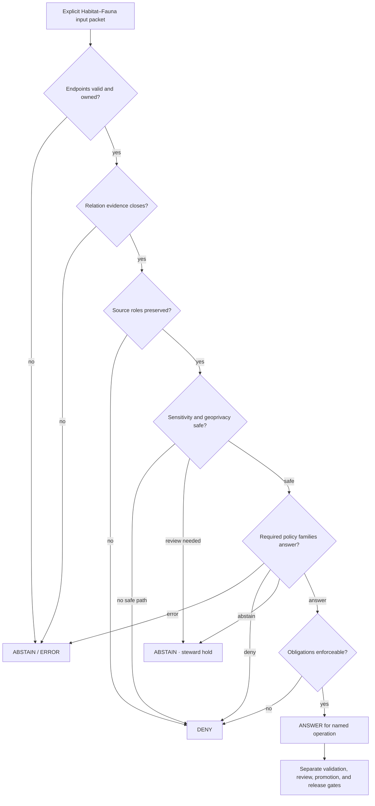

<!-- [KFM_META_BLOCK_V2]
doc_id: kfm://policy/joins/habitat-fauna
title: Habitat–Fauna Join Admissibility Policy Boundary
type: policy-readme
version: v0.1
status: draft; repository-grounded; empty-target-completion; pair-specific-join-policy; habitat-fauna; sensitive-ecology; geoprivacy-routed; evaluator-unbound; ADR-S-14-open; fail-closed; non-semantic; non-schema; non-validator; non-release; non-publication
owner: NEEDS VERIFICATION — Habitat steward, Fauna steward, join-policy steward, sensitivity/geoprivacy reviewer, evidence steward, source steward, validation steward, governed-API maintainer, release reviewer, docs steward
created: 2026-07-24
updated: 2026-07-24
policy_label: repository-facing; habitat-fauna; cross-domain-join; rare-species; sensitive-site; occurrence; habitat-context; suitability; corridor; source-role-aware; evidence-bound; most-restrictive-wins; public-safe-geometry; fail-closed; no-public-bypass
current_path: policy/joins/habitat-fauna/README.md
owning_root: policy/
canonical_relationship: PROPOSED pair-specific child under the existing policy/joins path; parent standing, ADR-S-14, join-versus-relation schema placement, and executable bundle authority remain unresolved
evidence_snapshot:
  repository: bartytime4life/Kansas-Frontier-Matrix
  base_ref: main
  target_prior_blob: 8b137891791fe96927ad78e64b0aad7bded08bdc
  directory_rules_blob: 2affb080e6f0043867c64c7f06c1ca52030fbd55
  policy_root_blob: fa9378a6a699d0985fd018dbdb9f27c15efcb1c3
  parent_policy_joins_blob: 8b137891791fe96927ad78e64b0aad7bded08bdc
  geoprivacy_policy_index_blob: a70e691881c0d6bc3e2ebd48290e9c4cb1b90f0e
  habitat_domain_policy_blob: 8456c65196354695b8eb5b8178ecb61cfc12b7dd
  fauna_domain_policy_blob: 39b7c7dd859614ab9ae9a72208f693056c97f2c6
  habitat_geoprivacy_doctrine_blob: 0ea402475a7f5246278dea199f6b964f3dbd344f
  fauna_policy_doctrine_blob: 36f9ddaa5dd3ce7d2f8499ae3ca18acbbdfe772c
  cross_lane_architecture_blob: 521007752082798a285db0204faf3ee091a3894a
  join_contract_index_blob: e31c295b48b41a4da3e861d4536a07f2bbe1660e
  habitat_fauna_join_schema_blob: 5db6f1b09b2ebafbeb788ab177a8a77b8a31ba6b
  broad_habitat_fauna_validator_blob: 5a29e5ad2eced6655b58fc6aa699c2bd2918a2ce
  habitat_fauna_geoprivacy_validator_blob: d5793421bdf91a4ddd256c3556bddbce51901eaa
  thin_slice_proof_pipeline_blob: b9432391968c7f06947489ebc5113a52ef6d6855
  thin_slice_release_candidate_blob: d5c3990bfdf8563721724d1e885022f28ba3f1df
  policy_decision_schema_blob: 1472d26a42c73f17545b4464a275412ffa1d098e
  open_overlapping_pull_requests_found: "0"
related:
  - ../README.md
  - ../../README.md
  - ../../geoprivacy/README.md
  - ../../domains/habitat/README.md
  - ../../domains/fauna/README.md
  - ../../../docs/doctrine/directory-rules.md
  - ../../../docs/architecture/cross-lane-join-policy.md
  - ../../../docs/domains/habitat/SENSITIVITY_AND_GEOPRIVACY.md
  - ../../../docs/domains/fauna/POLICY.md
  - ../../../contracts/joins/README.md
  - ../../../contracts/policy/policy_input_bundle.md
  - ../../../contracts/policy/policy_decision.md
  - ../../../schemas/contracts/v1/joins/habitat-fauna-join.schema.json
  - ../../../schemas/contracts/v1/policy/policy_input_bundle.schema.json
  - ../../../schemas/contracts/v1/policy/policy_decision.schema.json
  - ../../../tools/validators/habitat-fauna/README.md
  - ../../../tools/validators/geoprivacy/habitat-fauna/README.md
  - ../../../tools/validators/cross-domain-joins/README.md
  - ../../../pipelines/proofs/habitat_fauna_thin_slice/README.md
  - ../../../release/candidates/habitat/habitat_fauna_thin_slice/README.md
  - ../../../data/registry/sources/README.md
  - ../../../apps/governed-api/README.md
  - ../../../release/README.md
tags: [kfm, policy, joins, habitat, fauna, geoprivacy, sensitive-species, evidence-bundle, source-role, public-safe-geometry, review, correction, rollback]
truth_posture: CONFIRMED empty target, singular policy root, Habitat/Fauna doctrine and ownership split, geoprivacy routing index, domain-policy scaffolds, draft cross-lane architecture, semantic join-contract index, permissive Habitat–Fauna schema scaffold, broad and geoprivacy validator READMEs, documentation-first proof/release lanes, closed PolicyDecision family enum without joins, and unproved evaluator/bundle/runtime/release integration / PROPOSED pair-specific policy boundary, explicit input profile, Habitat–Fauna checks, posture matrix, reason codes, obligations, tests, review, correction, revocation, and rollback / CONFLICTED parent standing, ADR-S-14 acceptance, join-versus-relation schema authority, and policy placement among joins/geoprivacy/sensitivity/domain lanes / UNKNOWN accepted pair policy module, rule package, bundle selector, native tests, runtime composer, decision receipts, public-surface enforcement, required CI, and production operation
notes:
  - "This revision completes an existing empty README in place. It creates no Habitat or Fauna object, relation contract, schema field, policy rule, policy family, fixture, validator, EvidenceBundle, transform receipt, graph edge, runtime route, release object, or publication state."
  - "Habitat owns landscape, patch, ecological-system, suitability, corridor, restoration, and uncertainty products. Fauna owns taxon, occurrence, range, sensitive-site, telemetry, and animal-event truth. The join transfers no ownership."
  - "The current PolicyDecision schema permits promotion, access, render, capability, consent, and sensitivity only; policy_family=joins and policy_family=habitat-fauna are schema-invalid at the inspected snapshot."
  - "Exact geoprivacy thresholds, generalization radii, grid sizes, geohash precision, buffer parameters, sensitive coordinates, protected identifiers, or reverse-engineering thresholds must not appear in this repository-facing README."
[/KFM_META_BLOCK_V2] -->

<a id="top"></a>

# Habitat–Fauna Join Admissibility Policy Boundary

> **One-line purpose.** `policy/joins/habitat-fauna/` documents how KFM decides whether a Habitat–Fauna relationship candidate may be retained, reviewed, modeled, rendered, exported, promoted, or released for a named audience—without becoming Habitat truth, Fauna occurrence truth, a relation schema, a geoprivacy parameter store, a validator, a proof, a release decision, or a publication path.

[](#status-and-evidence)
[](#purpose)
[](#join-induced-and-derivation-induced-sensitivity)
[](#geoprivacy-boundary)
[](#pair-posture-model)
[](#authority-level)

**Quick navigation:** [Purpose](#purpose) · [Authority](#authority-level) · [Status](#status-and-evidence) · [Scope](#scope-and-bounded-context) · [Ownership](#domain-ownership-boundary) · [Separation](#concept-separation) · [Invariants](#keystone-invariants) · [Belongs](#what-belongs-here) · [Exclusions](#what-does-not-belong-here) · [Inputs](#explicit-policy-input-profile) · [Checks](#habitat-fauna-admissibility-checks) · [Sensitivity](#join-induced-and-derivation-induced-sensitivity) · [Geoprivacy](#geoprivacy-boundary) · [Postures](#pair-posture-model) · [Compatibility](#policydecision-compatibility) · [Outcomes](#normalized-outcomes) · [Matrix](#representative-decision-matrix) · [Reasons](#reason-code-vocabulary) · [Obligations](#obligation-vocabulary) · [Surfaces](#public-surface-controls) · [Lifecycle](#governed-lifecycle-and-trust-flow) · [Threats](#threat-model) · [Validation](#validation-and-acceptance) · [Review](#review-burden) · [Rollback](#correction-revocation-withdrawal-and-rollback) · [Open work](#open-verification-register)

> [!IMPORTANT]
> **Join admissibility is not ecological truth.** This lane may determine whether a declared Habitat–Fauna relationship is safe and sufficiently governed for one operation. It cannot prove that a species occurs at a place, prove that habitat is suitable, transfer taxonomic authority to Habitat, transfer landscape/model authority to Fauna, create evidence, or approve release.

> [!CAUTION]
> **Habitat outputs can reveal protected Fauna places even when the source Habitat layer is public.** Policy must evaluate the produced relation, geometry, model surface, graph edge, tile, search result, export, screenshot, embedding, and AI response—not just the two source records.

> [!WARNING]
> **No public operational thresholds belong here.** Exact occurrence coordinates, nests, dens, roosts, hibernacula, spawning or aggregation sites, telemetry detail, steward-withheld identifiers, transform radii, grid sizes, geohash precision, masking parameters, and reconstruction limits remain in restricted governed systems and steward-gated policy/test surfaces.

---

## Purpose

`policy/joins/habitat-fauna/` exists to answer one bounded policy-routing question:

> Given explicit Habitat and Fauna endpoint references, a declared relation profile, source roles, evidence, rights, sensitivity, geoprivacy posture, time, space, uncertainty, model lineage, requested operation, audience, surface, lifecycle state, review state, release state, correction lineage, and evaluator context, may the Habitat–Fauna join be used—and under which enforceable obligations?

A mature pair policy should:

- preserve independent Habitat and Fauna authority;
- require evidence for both endpoints and for the relation assertion;
- keep observation, range, model, regulatory, aggregate, candidate, and public-safe products distinct;
- detect join-induced and derivation-induced sensitivity;
- route exact-location and reconstruction risk through the accepted geoprivacy boundary;
- apply the most restrictive applicable posture and allow stricter posture when composition adds risk;
- distinguish low-risk public-safe context from steward-review and denied uses;
- normalize all required policy-family decisions into one finite caller result;
- require public-safe geometry and transform lineage where any sensitive Fauna context is involved;
- preserve review, release, correction, withdrawal, and rollback dependencies;
- keep every public consumer behind governed interfaces.

This README is a routing and review contract. It does not activate policy.

[Back to top](#top)

---

## Authority level

**PROPOSED pair-specific policy boundary under an existing tracked path; non-semantic, non-schema, non-validator, non-evidence, non-runtime, non-release, and non-publication authority.**

The target path already exists under singular `policy/`, which Directory Rules assign to admissibility. Current repository evidence does not settle:

- whether `policy/joins/` is accepted as the canonical cross-domain policy lane;
- whether ADR-S-14 adopts the proposed OPEN / STEWARD-REVIEW / DENIED model;
- whether Habitat–Fauna pair policy belongs here, under `policy/geoprivacy/`, under domain policy lanes, or in a composed bundle without pair directories;
- whether the machine relationship shape belongs under `joins/`, `relations/`, or an accepted profile-specific schema lane;
- whether executable pair policy, a bundle selector, native tests, or runtime consumers exist.

| Responsibility | Owning surface | Role of this README |
|---|---|---|
| Habitat object meaning | Habitat doctrine and contracts | Consume Habitat definitions; never redefine them. |
| Fauna object and occurrence meaning | Fauna doctrine and contracts | Consume Fauna definitions; never redefine them. |
| Relationship meaning | [`contracts/joins/`](../../../contracts/joins/README.md) or an accepted relation contract home | Require a declared profile; never create relation truth. |
| Relationship shape | accepted join/relation schema home | Require an accepted schema; never define fields here. |
| Source identity and role | source contracts and [`data/registry/sources/`](../../../data/registry/sources/README.md) | Evaluate explicit refs; never invent or upgrade roles. |
| Evidence support | evidence/proof roots | Require endpoint and relation support; never create an EvidenceBundle. |
| Sensitivity and geoprivacy | accepted sensitivity/geoprivacy policy | Route and compose; never publish thresholds or exact locations. |
| Broad pair validation | [`tools/validators/habitat-fauna/`](../../../tools/validators/habitat-fauna/README.md) | Require deterministic results; validation is not policy permission. |
| Pair geoprivacy validation | [`tools/validators/geoprivacy/habitat-fauna/`](../../../tools/validators/geoprivacy/habitat-fauna/README.md) | Require leakage checks; never select transforms here. |
| Proof orchestration | [`pipelines/proofs/habitat_fauna_thin_slice/`](../../../pipelines/proofs/habitat_fauna_thin_slice/README.md) | May demonstrate bounded behavior; proof pass is not release. |
| Release-candidate review | [`release/candidates/habitat/habitat_fauna_thin_slice/`](../../../release/candidates/habitat/habitat_fauna_thin_slice/README.md) | Candidate dossier is not release authority. |
| Public enforcement | governed APIs, renderers, exports, search, graph, and AI adapters | Consume normalized decisions and enforce every obligation. |
| Release, correction, withdrawal, rollback | [`release/`](../../../release/README.md) | Remains the only release-governance authority. |

[Back to top](#top)

---

## Status and evidence

### Current repository state

| Surface | Current evidence | Safe conclusion |
|---|---:|---|
| `policy/joins/habitat-fauna/README.md` | **CONFIRMED empty tracked file** | This revision completes it in place. |
| Parent `policy/joins/README.md` on inspected `main` | **CONFIRMED empty tracked file** | Parent modernization is separate work; this child must remain independently bounded. |
| Singular `policy/` root | **CONFIRMED** | Admissibility belongs under `policy/`; presence does not prove enforcement. |
| Habitat and Fauna domain policy READMEs | **CONFIRMED short greenfield scaffolds** | Domain policy placement is documented; executable authority is unproved. |
| Habitat geoprivacy doctrine | **CONFIRMED draft** | Join-induced and derivation-induced exposure, produced-output evaluation, and public-safe geometry posture are documented. |
| Fauna policy doctrine | **CONFIRMED draft** | Exact sensitive occurrences/sites are deny-by-default; public derivatives require governed transforms, review, and policy. |
| Cross-lane architecture | **CONFIRMED draft / ADR-S-14 open** | Five checks and three postures are proposed, not accepted runtime behavior. |
| Habitat–Fauna join schema | **CONFIRMED permissive PROPOSED scaffold** | Empty properties and `additionalProperties: true` do not enforce pair semantics or safety. |
| Broad pair validator README | **CONFIRMED documentation / executable NEEDS VERIFICATION** | Ownership, role, evidence, geoprivacy handoff, correction, and release checks are documented. |
| Pair geoprivacy validator README | **CONFIRMED documentation / executable NEEDS VERIFICATION** | Produced-geometry and reconstruction-risk checks are documented. |
| Thin-slice proof lane | **CONFIRMED documentation and readiness holds** | No accepted executable proof producer or emitted proof inventory is established. |
| Thin-slice release-candidate lane | **CONFIRMED README-only direct inventory** | No child candidate dossier or release is established. |
| `PolicyDecision` schema | **CONFIRMED closed enum** | There is no `joins`, `relation`, `geoprivacy`, or `habitat-fauna` family. |
| Pair policy module, bundle, tests, runtime, receipts | **UNKNOWN / NEEDS VERIFICATION** | No complete governed evaluation flow is established here. |

### Truth labels

- **CONFIRMED** — verified from current repository files and current-session reads.
- **PROPOSED** — a design, vocabulary, rule, obligation, test, or placement not accepted or proved active.
- **NEEDS VERIFICATION** — checkable but not established strongly enough to rely on.
- **UNKNOWN** — no adequate evidence was found.
- **CONFLICTED** — repository surfaces claim overlapping or incompatible authority.

### Evidence limits

This update does not prove:

- that a Habitat–Fauna relation contract is accepted;
- that the permissive schema validates meaningful fields;
- that a pair-specific Rego or equivalent module exists;
- that the parent joins policy lane is accepted;
- that geoprivacy thresholds or transforms are configured;
- that validators execute or are required CI checks;
- that any EvidenceBundle, receipt, review, release candidate, or public artifact exists;
- that caches, graph edges, tiles, search, exports, embeddings, or AI enforce pair obligations;
- that production operation occurred.

[Back to top](#top)

---

## Scope and bounded context

### In scope

This lane may eventually govern policy conditions for declared Habitat–Fauna relationships involving:

- Habitat patches, ecological systems, land cover, stewardship zones, habitat classes, suitability surfaces, connectivity, corridors, restoration opportunity, and uncertainty surfaces;
- Fauna taxon, conservation status, public occurrence, restricted occurrence, range polygon, seasonal range, migration route, sensitive site, telemetry, mortality, disease, breeding, aggregation, and monitoring context;
- relation assertions such as `supports`, `overlaps`, `used_by`, `modeled_from`, `within_range`, `connects`, `context_for`, and other accepted controlled predicates;
- joins used for catalog/triplet projection, model input, map display, graph projection, search, export, review, Focus Mode, AI explanation, promotion, and release review;
- pair-specific sensitivity, geoprivacy, source-role, evidence, review, and correction obligations.

### Out of scope

This lane does not own:

- Habitat object definitions or identifiers;
- Fauna taxonomy, occurrence, range, site, or animal-event truth;
- relation semantic contracts;
- JSON Schema or DTO shape;
- join computation or model implementation;
- exact sensitive coordinates or geometry;
- geoprivacy parameter values;
- source descriptors or registry instances;
- EvidenceBundle, receipt, review, validation, or release instances;
- release approval or publication;
- public map, graph, API, export, search, tile, embedding, or AI implementation.

### Requested operations

Policy must be operation-specific. Representative operations include:

```text
evaluate_join
retain_join_candidate
derive_habitat_context
train_or_score_model
create_corridor_or_connectivity_product
catalog_relation
graph_project
render_map
render_tile
show_popup
search
export
download
summarize
answer_with_ai
promote
release_review
correct
withdraw
rollback
```

A decision for one operation never grants all others.

[Back to top](#top)

---

## Domain ownership boundary

### Habitat retains authority over

- habitat patches and patch identity;
- ecological systems and habitat classes;
- land-cover and ecoregion context;
- suitability, connectivity, corridor, restoration-opportunity, and stewardship products;
- Habitat-owned uncertainty, model lineage, and derived indicators;
- Habitat-side correction and stale-state posture.

### Fauna retains authority over

- taxonomic identity and crosswalks;
- conservation and legal status;
- occurrence evidence and occurrence representation;
- restricted and public occurrence split;
- range and seasonal range;
- migration routes and animal movement context;
- sensitive sites, including nests, dens, roosts, hibernacula, spawning, breeding, and aggregation sites;
- telemetry, mortality, disease, and other animal-event records;
- Fauna-side sensitivity, geoprivacy, correction, and stale-state posture.

### The join owns neither side

A join record may carry stable references and an evidence-backed relation assertion. It must not:

- copy Fauna occurrence fields into a Habitat canonical object;
- turn Habitat suitability into observed presence;
- turn a range polygon into an exact occurrence;
- turn regulatory critical-habitat context into direct evidence that an animal is present;
- turn a modeled corridor into an observed migration route;
- turn a public Habitat layer into permission to disclose restricted Fauna context;
- let either domain rewrite the other domain's source role, sensitivity, evidence, or release state.

[Back to top](#top)

---

## Concept separation

| Concept | Meaning | Must not collapse into |
|---|---|---|
| Habitat endpoint validity | Habitat object conforms to its governing meaning and shape. | Proof that Fauna uses or occurs in it. |
| Fauna endpoint validity | Fauna object conforms to its governing meaning and shape. | Proof that Habitat is suitable or occupied. |
| Relation validity | Evidence supports the declared relation between endpoints. | Policy permission or release approval. |
| Pair policy admissibility | The requested use is allowed or constrained under explicit context. | Relation truth or ecological truth. |
| Geoprivacy clearance | The produced derivative satisfies accepted harmful-precision controls. | Release approval or evidence closure. |
| Validator pass | Configured checks passed for a packet. | PolicyDecision, ReviewRecord, EvidenceBundle, or ReleaseManifest. |
| Transform receipt | Records a deterministic transform. | Claim truth or permission. |
| Proof-harness pass | Demonstrates scoped invariants using accepted fixtures and code. | Live-data completeness or release. |
| Release-candidate dossier | Packet for review. | ReleaseManifest or publication. |
| Graph edge | Projection of an accepted relationship. | Sovereign truth. |
| Map/AI output | Public or restricted representation. | Root evidence or policy authority. |

[Back to top](#top)

---

## Keystone invariants

1. **Endpoint ownership remains separate.**
2. **Endpoint validity is not relation validity.**
3. **Relation validity is not policy admissibility.**
4. **Policy admissibility is not release approval.**
5. **Fauna occurrence and sensitive-site authority never transfers to Habitat.**
6. **Habitat model and landscape authority never transfers to Fauna.**
7. **Source roles remain fixed and visible.**
8. **Modeled, aggregate, regulatory, administrative, candidate, synthetic, and observed inputs never collapse.**
9. **Every consequential endpoint and the relation assertion require appropriate evidence support.**
10. **The produced relation and every derivative surface are evaluated for sensitivity.**
11. **The pair may be stricter than either endpoint alone.**
12. **Most-restrictive applicable policy wins.**
13. **Exact sensitive Fauna geometry is denied to ordinary public use by default.**
14. **A public-safe geometry, transform receipt, review, and release support are required where policy permits a derivative.**
15. **No style-only, popup-only, or prompt-only hiding counts as redaction.**
16. **Novel, ambiguous, stale, conflicted, or unsupported joins fail closed.**
17. **Unknown obligations cannot be ignored by consumers.**
18. **Correction, source change, sensitivity escalation, and withdrawal propagate to every derivative.**
19. **Public clients never read RAW, WORK, QUARANTINE, restricted Fauna, canonical geometry, or policy source directly.**
20. **Generated language cannot infer an unapproved relationship or reconstruct a protected location.**

[Back to top](#top)

---

## What belongs here

Appropriate future contents may include:

- this pair-policy README;
- reviewed declarative rules for Habitat–Fauna use admissibility after placement is accepted;
- pair-specific policy routing metadata;
- stable reason-code and obligation references once owned by accepted contracts/schemas;
- pair-specific native policy tests if the repository accepts colocation;
- migration and supersession notes;
- links to Habitat, Fauna, join-contract, schema, validator, evidence, geoprivacy, review, release, correction, and rollback surfaces;
- no-secret, no-exact-location documentation of required policy behavior.

A rule belongs here only when its primary responsibility is **whether a declared Habitat–Fauna relationship may be used for a bounded operation**.

[Back to top](#top)

---

## What does not belong here

| Do not place here | Correct responsibility |
|---|---|
| Habitat or Fauna object meaning | domain doctrine and contracts |
| Taxonomy, occurrence, range, sensitive-site, telemetry, or animal-event truth | Fauna domain |
| Habitat patch, suitability, corridor, restoration, or ecological-system truth | Habitat domain |
| Join/relation semantic contracts | `contracts/joins/` or accepted relation contract home |
| JSON Schema, DTOs, enums, or field shape | accepted schema home |
| Join computation, model code, graph builder, or pipeline | `packages/`, `pipelines/`, or accepted implementation root |
| Validator code and reports | `tools/validators/` and accepted report/receipt roots |
| Exact sensitive locations or restricted identifiers | restricted lifecycle systems only |
| Geoprivacy thresholds and transform parameters | steward-gated policy/configuration surfaces |
| SourceDescriptor instances | source registry |
| EvidenceBundles, proofs, or citations | evidence/proof roots |
| RedactionReceipt, AggregationReceipt, TransformReceipt, ReviewRecord, PolicyDecision instances | accepted receipt/review/decision roots |
| RAW through PUBLISHED materializations | `data/` lifecycle roots |
| ReleaseManifest, CorrectionNotice, WithdrawalNotice, RollbackCard | `release/` |
| Public tiles, API responses, graph edges, exports, screenshots, embeddings, or AI answers | governed application/runtime roots |
| Credentials, private URLs, API keys, bearer tokens | approved secret systems, never docs |
| A second independently evolving sensitivity or geoprivacy authority | prohibited without migration/ADR |

[Back to top](#top)

---

## Explicit policy input profile

The current `PolicyInputBundle` schema is permissive and does not enforce the following pair context. These are **PROPOSED semantic requirements**.

### Evaluation identity

- immutable evaluation/request id;
- pair profile id, version, and digest;
- evaluator/bundle id, version, entrypoint, and digest;
- evaluation time and decision expiry;
- prior decision refs and supersession posture.

### Requested use

- exact operation;
- purpose;
- audience;
- interface and surface;
- requested spatial precision;
- export/download/cache intent;
- requested lifecycle transition.

### Habitat endpoint

- stable Habitat object ref and digest;
- object type and owning domain;
- contract/schema profile refs;
- source descriptor refs and source role;
- lifecycle, review, release, correction, and stale-state posture;
- model lineage and uncertainty where derived;
- EvidenceRefs/EvidenceBundle refs;
- sensitivity and public-safe status.

### Fauna endpoint

- stable Fauna object ref and digest;
- object type and owning domain;
- taxon/status/occurrence/range/site profile refs as applicable;
- source descriptor refs and source role;
- occurrence representation class: restricted, public-safe, aggregate, range, modeled, or other accepted class;
- sensitive-site, telemetry, breeding, aggregation, mortality, disease, or other flags without embedding protected values;
- lifecycle, review, release, correction, and stale-state posture;
- EvidenceRefs/EvidenceBundle refs;
- sensitivity and geoprivacy status.

### Relation assertion

- controlled predicate;
- direction and cardinality;
- relation method: identifier, crosswalk, reviewed manual, model-derived, spatial, temporal, or other accepted method;
- relation evidence refs separate from endpoint evidence;
- confidence and uncertainty;
- temporal scope;
- spatial profile and join method;
- model/algorithm refs and receipts where derived;
- known limitations and excluded interpretations.

### Rights, sensitivity, and geoprivacy

- source rights and derivative-rights posture;
- public/restricted audience allowances;
- effective sensitivity and how it was computed;
- join-induced sensitivity flag;
- reverse-engineering and re-identification risk posture;
- public-safe geometry ref where required;
- transform receipt refs;
- required specialist reviews;
- no exact sensitive values in the policy input.

### Governance and release

- validation report refs;
- required broad pair and geoprivacy validator results;
- review refs;
- release-candidate and ReleaseManifest refs where applicable;
- correction, withdrawal, revocation, and rollback refs;
- dependency/invalidation refs for graph, map, search, export, tile, vector, screenshot, cache, and AI surfaces.

### Fail-closed rule

Missing, malformed, stale, conflicted, untrusted, or non-resolvable required context never becomes implicit permission.

[Back to top](#top)

---

## Habitat-Fauna admissibility checks

The pair policy strengthens the generic join checks with Habitat–Fauna-specific controls.

### Check 1 — domain authority preservation

Verify that Habitat remains Habitat context/model authority and Fauna remains taxon/occurrence/site authority.

**Block when:**

- Habitat emits an occurrence assertion;
- Fauna emits a Habitat canonical object;
- a relation profile assigns endpoint ownership to the wrong domain;
- a derivative drops endpoint owner/type metadata.

### Check 2 — source-role preservation

Verify every endpoint and relation input retains admitted source role and support type.

**Block when:**

- modeled suitability is labeled observed;
- regulatory habitat designation is labeled occurrence evidence;
- aggregate range is presented as a point occurrence;
- candidate or synthetic context is presented as released ecological truth;
- a join silently chooses the stronger-looking role.

### Check 3 — endpoint evidence support

Verify consequential Habitat and Fauna endpoints resolve required evidence.

**Block when:**

- either side has unresolved EvidenceRefs;
- one side's EvidenceBundle is silently reused for the other;
- a public-safe derivative loses its restricted-source lineage;
- stale or withdrawn evidence remains active.

### Check 4 — relation evidence support

Verify the relationship itself has support separate from endpoint validity.

**Block when:**

- proximity alone is treated as use/occupancy;
- spatial overlap is treated as biological dependence;
- model output is treated as observed association;
- a graph edge is created without relation evidence;
- the predicate is missing, ambiguous, or unsupported.

### Check 5 — temporal and spatial validity

Verify the relation is valid for declared time, geometry, resolution, and method.

**Block when:**

- occurrence and Habitat vintages do not overlap as required;
- seasonal or migration context is ignored;
- geometry resolution exceeds source support;
- point-in-polygon or nearest-neighbor logic invents identity;
- corridor endpoints or hotspots narrow a sensitive site.

### Check 6 — model and uncertainty posture

Verify models remain models and uncertainty is visible.

**Block when:**

- suitability becomes presence;
- corridor becomes observed migration;
- density surface becomes count truth;
- model training on restricted occurrences creates a reversible surface;
- uncertainty and model limitations disappear from public output.

### Check 7 — sensitivity composition

Verify the output applies the most restrictive applicable posture and additional composition risk.

**Block when:**

- a public Habitat endpoint weakens restricted Fauna posture;
- sensitivity is averaged;
- the output inherits only the lowest tier;
- a new inference risk is ignored because no input was individually exact.

### Check 8 — geoprivacy and produced-output safety

Verify the produced geometry and derivatives cannot reconstruct protected Fauna context.

**Block when:**

- exact geometry reaches a public-bound candidate;
- public-safe geometry is missing when required;
- a transform receipt is missing;
- tiles, screenshots, graph edges, search, exports, embeddings, or AI can reverse-engineer location;
- model inversion or temporal differencing can recover withheld sites.

### Check 9 — review and release support

Verify required Habitat, Fauna, sensitivity/geoprivacy, and release reviews are closed for the requested operation.

**Block when:**

- a novel pair profile lacks review;
- required stewards disagree;
- release state is missing, stale, withdrawn, or unrelated;
- a proof or candidate dossier is treated as release approval.

### Check 10 — correction and rollback closure

Verify the joined derivative can be invalidated and removed safely.

**Block when:**

- dependency graph is missing;
- Fauna restriction changes cannot invalidate Habitat derivatives;
- cached tiles/graphs/search/AI remain active after correction;
- rollback would restore unsafe geometry;
- superseded evidence remains silently preferred.

All applicable checks must pass or return an explicit negative result.

[Back to top](#top)

---

## Join-induced and derivation-induced sensitivity

### Join-induced sensitivity

A relationship becomes sensitive because the two endpoints are combined.

Examples:

- a public Habitat patch joined to a restricted occurrence;
- a public corridor joined to a nest, den, roost, hibernaculum, or spawning site;
- a public land-cover cell joined to telemetry or breeding aggregation;
- a public ecological-system polygon joined to a steward-withheld taxon record.

### Derivation-induced sensitivity

A model or derivative reveals information not visible in a simple row join.

Examples:

- a suitability surface that reconstructs restricted training occurrences;
- a corridor whose endpoints identify a sensitive site;
- a density or hotspot layer that defeats point redaction;
- repeated time slices that reveal seasonal protected locations;
- an AI summary that names a narrow place from released contextual clues;
- a graph neighborhood that reveals a hidden occurrence through adjacent edges.

### Sensitivity composition rule

```text
effective_pair_posture =
  most_restrictive(
    habitat_endpoint_posture,
    fauna_endpoint_posture,
    source_rights_posture,
    relation_posture,
    requested_surface_posture,
    join_induced_risk,
    derivation_induced_risk
  )
```

This expression is **illustrative**, not an implemented algorithm.

The effective posture may be stricter than every input. It must never be weaker than the strongest applicable restriction.

[Back to top](#top)

---

## Geoprivacy boundary

This pair lane decides whether geoprivacy clearance is required. It does not own exact thresholds or transform implementation.

### Route to geoprivacy when

- any Fauna endpoint is restricted, sensitive, steward-controlled, or exact;
- any Habitat product derives from or can reconstruct protected Fauna locations;
- the requested surface increases spatial precision or interpretability;
- a corridor, density, suitability, hotspot, graph edge, search result, or AI answer narrows a protected place;
- source terms require obscuring or withholding;
- the produced output is more revealing than either source endpoint.

### Required posture where a safer derivative is permitted

- public-safe geometry exists and is different from the protected geometry;
- deterministic transform identity/version is recorded;
- appropriate `RedactionReceipt`, `AggregationReceipt`, or equivalent governed receipt resolves;
- Habitat and Fauna stewards approve where required;
- sensitivity/geoprivacy review closes;
- broad pair and geoprivacy validators pass;
- release review is complete;
- correction and rollback targets do not restore protected geometry;
- all public derivatives and caches can be invalidated.

### Always forbidden in this public README

- transform parameter values;
- exact coordinates;
- named restricted records;
- protected site identifiers;
- grid size;
- geohash precision;
- buffer distance;
- jitter radius;
- reconstruction threshold;
- attack-specific leakage limits.

[Back to top](#top)

---

## Pair posture model

The following model is **PROPOSED** while ADR-S-14 remains open.

### OPEN candidate

A pair may be considered an OPEN candidate only when all of the following are true:

- both endpoints and the relation use released, public-safe representations;
- no restricted occurrence, sensitive site, telemetry detail, protected breeding/aggregation context, or reverse-engineerable derivative is involved;
- source roles and uncertainty remain visible;
- relation evidence closes;
- rights allow the requested derivative;
- broad pair and surface-specific validators pass;
- no specialist review is required by accepted policy;
- release governance still approves the final artifact.

OPEN does not mean automatically published.

### STEWARD-REVIEW

Use STEWARD-REVIEW when any of the following applies:

- the join profile is novel or unsettled;
- one side is reviewer/restricted but a bounded derivative may be possible;
- a suitability, corridor, density, range, seasonal, mortality, disease, or model-derived relation needs interpretation;
- a public-safe transform is proposed;
- join-induced or derivation-induced sensitivity is plausible;
- rights, source role, time, uncertainty, or relation evidence needs accountable judgment;
- Habitat and Fauna stewards must confirm ownership and allowed interpretation;
- release reviewers must assess surface-specific leakage.

Until review closes, public outcome is `ABSTAIN` or `DENY`.

### DENIED

Deny ordinary public use when:

- exact sensitive occurrence or sensitive-site geometry is involved;
- the relation would expose nests, dens, roosts, hibernacula, spawning, breeding, aggregation, or telemetry detail;
- no non-reversible public-safe representation exists;
- the join enables harmful location inference, adversarial collection, disturbance, or exploitation;
- source role is collapsed;
- Habitat suitability is presented as observed presence;
- relation evidence is absent or contradicted;
- public output violates source rights;
- a required obligation cannot be enforced;
- correction, withdrawal, or rollback cannot reliably remove unsafe derivatives.

### Default for novel joins

Until ADR-S-14 and pair policy are accepted, a novel Habitat–Fauna relation is **not OPEN by default**. It remains STEWARD-REVIEW or DENIED according to the most restrictive applicable posture.

[Back to top](#top)

---

## PolicyDecision compatibility

The current schema permits these `policy_family` values:

```text
promotion
access
render
capability
consent
sensitivity
```

It does not permit:

```text
joins
relation
cross-domain
geoprivacy
habitat-fauna
```

Therefore this README must not emit a schema-invalid family.

### Compatible composition target

A governed Habitat–Fauna request may require:

- `sensitivity` — pair sensitivity, exact-location, geoprivacy, or derived-risk posture;
- `access` — whether a reviewer or service may inspect restricted context;
- `capability` — whether a bounded join/model/export action is allowed;
- `render` — whether a map, tile, popup, graph, search, screenshot, or AI-facing representation may be exposed;
- `promotion` — whether a candidate may advance through lifecycle/release gates;
- `consent` — only when an accepted context makes consent applicable; never inferred.

### Decision composition rule

```text
if any required decision == ERROR:
    ERROR
elif any required decision == DENY:
    DENY
elif any required decision == ABSTAIN:
    ABSTAIN
elif any required obligation is unknown or unenforceable:
    DENY or ERROR according to accepted consumer contract
else:
    ANSWER with the union of mandatory obligations
```

This is a **PROPOSED normalization rule**, not verified runtime behavior.

### Migration option

Creating `policy_family=joins` would require, at minimum:

1. accepted semantic contract change;
2. versioned schema change;
3. valid/invalid fixtures;
4. validator updates;
5. policy runtime support;
6. consumer migration;
7. receipt/replay updates;
8. compatibility period;
9. correction and rollback plan;
10. accepted ADR or policy-root decision.

[Back to top](#top)

---

## Normalized outcomes

| Outcome | Habitat–Fauna meaning | Downstream posture |
|---|---|---|
| `ANSWER` | Required pair, sensitivity, access/capability, render, evidence, review, and release prerequisites support the exact operation, and obligations are enforceable. | Proceed only for the named operation and representation. |
| `ABSTAIN` | Evidence, relation profile, freshness, rights, review, or policy context is insufficient or unresolved. | Do not infer or publish; surface a bounded safe explanation. |
| `DENY` | Policy blocks the requested use, precision, audience, surface, or derivative. | Stop, withhold, quarantine, restrict, or preserve only a safer reviewed representation. |
| `ERROR` | Input shape, evaluator, bundle, integrity, dependency, or consumer enforcement failed. | Stop; never convert failure into permission. |

Negative outcomes are first-class and auditable.

[Back to top](#top)

---

## Representative decision matrix

The table is **PROPOSED** and does not replace accepted pair rules.

| Habitat context | Fauna context | Requested use | Candidate posture | Required treatment |
|---|---|---|---|---|
| Released ecoregion | Released generalized range | County/state summary | OPEN candidate | Preserve range/source roles, uncertainty, evidence, and release refs. |
| Released land cover | Released public occurrence | Low-resolution contextual map | STEWARD-REVIEW by default | Confirm relation meaning and no location narrowing. |
| Habitat patch | Restricted exact occurrence | Public map | DENIED | Withhold exact relation; evaluate only a separately reviewed safer derivative. |
| Corridor | Nest/den/roost/hibernaculum/spawning site | Public map/export | DENIED | No exact edge or endpoint exposure. |
| Suitability model | Restricted training occurrences | Public raster | STEWARD-REVIEW or DENIED | Model-inversion testing, public-safe transform, receipts, dual-domain review. |
| Density/hotspot surface | Sensitive occurrence set | Public tile | DENIED unless proven non-reconstructive | Aggregate/generalize and validate every tile/zoom/cache surface. |
| Released Habitat patch | Generalized migration route | Public contextual layer | STEWARD-REVIEW | Preserve seasonal/time uncertainty and route generalization. |
| Habitat suitability | Modeled Fauna range | AI explanation | STEWARD-REVIEW | Qualify both as models; cite evidence; prohibit presence claim. |
| Critical-habitat regulatory layer | Occurrence evidence | Public answer | STEWARD-REVIEW | Regulatory status and occurrence evidence remain separate. |
| Habitat corridor | Telemetry track | Public graph | DENIED precise / possible reviewed summary | No path reconstruction or edge leakage. |
| Restoration opportunity | Conservation status only | Planning context | OPEN candidate | Do not imply occurrence or guaranteed benefit. |
| Habitat patch | Mortality/disease point | Public map | STEWARD-REVIEW or DENIED precise | Treat precise event as sensitive until ratified; generalize if allowed. |
| Habitat model | Candidate Fauna record | Promotion | ABSTAIN | Candidate evidence cannot support release-grade relation. |
| Released Habitat context | Withdrawn Fauna occurrence | Any public use | DENIED | Invalidate derivative, caches, graph/search/AI references. |
| Public Habitat polygon | Unknown Fauna source role | Any consequential use | ABSTAIN | Resolve SourceDescriptor/source role first. |
| Valid endpoints | Missing relation evidence | Catalog/graph | ABSTAIN | Endpoint validity does not prove relation. |
| Valid relation | Missing release state | Public map/API | ABSTAIN or DENY | Complete release governance. |
| Public-safe derivative | Missing transform receipt | Public exposure | DENY | Receipt is mandatory where transform is policy-significant. |
| Reviewed derivative | Unknown consumer obligation | Any surface | ERROR or DENY | Consumer must reject unknown mandatory obligations. |
| Synthetic Habitat/Fauna fixtures | Test-only use | CI | ANSWER for test scope | Never relabel fixture success as live ecological truth. |

[Back to top](#top)

---

## Reason-code vocabulary

These codes are **PROPOSED** until accepted by contracts, schemas, tests, and consumers.

### Input and profile

- `HF_JOIN_PROFILE_MISSING`
- `HF_JOIN_PROFILE_UNACCEPTED`
- `HF_JOIN_PROFILE_HASH_MISMATCH`
- `HF_OPERATION_MISSING`
- `HF_AUDIENCE_MISSING`
- `HF_SURFACE_MISSING`
- `HF_EVALUATOR_CONTEXT_MISSING`
- `HF_POLICY_BUNDLE_UNACCEPTED`

### Endpoint and authority

- `HF_HABITAT_ENDPOINT_UNRESOLVED`
- `HF_FAUNA_ENDPOINT_UNRESOLVED`
- `HF_DOMAIN_AUTHORITY_COLLAPSE`
- `HF_FAUNA_OCCURRENCE_OWNERSHIP_VIOLATION`
- `HF_HABITAT_MODEL_OWNERSHIP_VIOLATION`
- `HF_ENDPOINT_TYPE_MISMATCH`
- `HF_SOURCE_ROLE_UNRESOLVED`
- `HF_SOURCE_ROLE_COLLAPSE`
- `HF_MODEL_AS_OBSERVATION_DENIED`
- `HF_RANGE_AS_OCCURRENCE_DENIED`
- `HF_REGULATORY_AS_OCCURRENCE_DENIED`

### Evidence and relation

- `HF_HABITAT_EVIDENCE_UNRESOLVED`
- `HF_FAUNA_EVIDENCE_UNRESOLVED`
- `HF_RELATION_EVIDENCE_MISSING`
- `HF_RELATION_PREDICATE_UNACCEPTED`
- `HF_PROXIMITY_NOT_RELATION`
- `HF_RELATION_CONTRADICTED`
- `HF_RELATION_UNCERTAINTY_MISSING`
- `HF_TEMPORAL_SCOPE_INVALID`
- `HF_SPATIAL_SCOPE_UNSUPPORTED`

### Sensitivity and geoprivacy

- `HF_SENSITIVE_FAUNA_SITE_EXACT`
- `HF_JOIN_INDUCED_SENSITIVITY`
- `HF_DERIVATION_INDUCED_SENSITIVITY`
- `HF_MOST_RESTRICTIVE_POSTURE_VIOLATED`
- `HF_PUBLIC_SAFE_GEOMETRY_MISSING`
- `HF_TRANSFORM_RECEIPT_MISSING`
- `HF_RECONSTRUCTION_RISK_UNRESOLVED`
- `HF_MODEL_INVERSION_RISK`
- `HF_TILE_LEAKAGE_RISK`
- `HF_GRAPH_EDGE_LEAKAGE_RISK`
- `HF_SEARCH_LEAKAGE_RISK`
- `HF_AI_LOCATION_INFERENCE_RISK`

### Rights, review, release, correction

- `HF_RIGHTS_UNRESOLVED`
- `HF_DERIVATIVE_RIGHTS_BLOCK`
- `HF_HABITAT_REVIEW_MISSING`
- `HF_FAUNA_REVIEW_MISSING`
- `HF_SENSITIVITY_REVIEW_MISSING`
- `HF_RELEASE_REFERENCE_MISSING`
- `HF_RELEASE_WITHDRAWN`
- `HF_CORRECTION_LINEAGE_MISSING`
- `HF_ROLLBACK_TARGET_MISSING`
- `HF_DEPENDENCY_GRAPH_MISSING`
- `HF_CACHE_INVALIDATION_UNPROVED`
- `HF_OBLIGATION_UNSUPPORTED`

Reason strings must not reveal sensitive facts.

[Back to top](#top)

---

## Obligation vocabulary

These obligations are **PROPOSED** and mandatory only after accepted contract/schema adoption.

### Ownership and evidence

- `preserve_habitat_ownership`
- `preserve_fauna_ownership`
- `preserve_source_roles`
- `preserve_model_observation_distinction`
- `attach_habitat_evidence_refs`
- `attach_fauna_evidence_refs`
- `attach_relation_evidence_refs`
- `surface_relation_uncertainty`
- `surface_model_lineage`
- `surface_temporal_scope`
- `surface_spatial_scope`

### Geoprivacy and sensitivity

- `withhold_exact_fauna_geometry`
- `use_public_safe_geometry`
- `attach_redaction_receipt`
- `attach_aggregation_receipt`
- `apply_most_restrictive_posture`
- `require_reconstruction_risk_test`
- `require_model_inversion_test`
- `suppress_sensitive_graph_edges`
- `block_location_narrowing_search`
- `block_exact_export`
- `block_ai_location_inference`

### Review and audience

- `require_habitat_steward_review`
- `require_fauna_steward_review`
- `require_sensitivity_geoprivacy_review`
- `require_release_review`
- `limit_to_reviewer_audience`
- `limit_to_named_capability`
- `prohibit_secondary_use`
- `prohibit_download`
- `prohibit_caching`
- `expire_decision_at`
- `recheck_before_render`

### Public explanation

- `attach_citations`
- `label_modeled_output`
- `label_generalized_geometry`
- `show_source_role`
- `show_sensitivity_transform`
- `show_uncertainty`
- `show_not_occurrence_disclaimer`
- `show_not_habitat_guarantee_disclaimer`
- `abstain_when_evidence_unresolved`

### Correction and rollback

- `register_dependency_edges`
- `invalidate_map_tiles`
- `invalidate_graph_projection`
- `invalidate_search_index`
- `invalidate_exports`
- `invalidate_embeddings`
- `invalidate_ai_context`
- `withdraw_public_derivative`
- `preserve_supersession_lineage`
- `verify_rollback_does_not_restore_sensitive_geometry`

If a caller cannot understand and enforce every mandatory obligation, it must fail closed.

[Back to top](#top)

---

## Public surface controls

### Map and layer

Require released public-safe geometry, source-role qualification, uncertainty, transform/review refs, and no exact or reverse-engineerable sensitive Fauna context.

### Tiles

Validate every zoom and generalization floor. A coarse source does not guarantee a safe tile if clipping, boundaries, or repeated requests reveal protected places.

### Popup and evidence drawer

Do not include hidden exact fields, restricted identifiers, precise event times, or clues that narrow a protected site. Display EvidenceBundle-backed citations and safe limitations only.

### Search and autocomplete

Prevent queries from returning or ranking narrow Habitat locations because they correlate with restricted Fauna records. Do not expose counts or names that permit differencing attacks.

### Graph and triplet projection

Suppress or generalize edges that reveal a sensitive occurrence/site. The graph is a projection, not a bypass around map policy.

### Export and download

Re-evaluate the export as its own operation. A viewable aggregate does not imply downloadable row-level or geometry-level access.

### Screenshot and print

Treat screenshots, print views, static exports, and cached thumbnails as public derivatives. Policy must cover them explicitly.

### Embeddings and vector retrieval

Do not embed protected coordinates or relationship facts into retrievable vectors. Deletion and correction must propagate to indexes.

### AI and Focus Mode

AI may explain a released public-safe relation with citations and role qualifications. It must not infer occurrence, identify sensitive sites, convert suitability into presence, or answer from internal/restricted context.

### Release dossier

A candidate dossier may collect references and blockers. It is not a ReleaseManifest, public artifact, or permission to expose joined data.

[Back to top](#top)

---

## Governed lifecycle and trust flow

```text
Habitat endpoint + Fauna endpoint + relation evidence
    -> endpoint/domain validation
    -> generic cross-domain validation
    -> Habitat–Fauna pair validation
    -> sensitivity/geoprivacy evaluation
    -> pair policy composition
    -> evidence/review closure
    -> catalog/triplet candidate
    -> promotion/release governance
    -> public-safe governed interface
```

### Lifecycle law

```text
RAW -> WORK / QUARANTINE -> PROCESSED -> CATALOG / TRIPLET -> PUBLISHED
```

A join evaluation, validator pass, proof-harness pass, candidate dossier, or policy decision cannot skip lifecycle stages.

### Finite flow



The diagram is a design target, not proof of implementation.

[Back to top](#top)

---

## Threat model

| Threat | Failure | Required control |
|---|---|---|
| Authority laundering | Habitat claims Fauna occurrence truth or Fauna claims Habitat model truth. | Explicit endpoint ownership and contract profiles. |
| Source-role collapse | Modeled/regulatory/aggregate becomes observed. | Role-preserving fields, reasons, validators, and UI labels. |
| Proximity inflation | Spatial overlap becomes biological use or presence. | Separate relation evidence and accepted predicate. |
| Join-induced geoprivacy leak | Public Habitat geometry identifies protected Fauna site. | Most-restrictive pair policy and produced-output testing. |
| Model inversion | Suitability/density/corridor surface reconstructs restricted occurrences. | Inversion testing, transforms, denial where unsafe. |
| Temporal differencing | Repeated releases reveal seasonal or current protected locations. | Delay, aggregation, time generalization, cache control. |
| Graph leakage | Hidden occurrence is inferred from edges/neighbors. | Edge suppression/generalization and query policy. |
| Search leakage | Counts, facets, or autocomplete narrow a protected place. | Minimum result thresholds and deny/abstain behavior. |
| Export escalation | Public visualization becomes precise downloadable data. | Operation-specific export decision and obligations. |
| Screenshot/cache persistence | Unsafe content survives correction. | Dependency tracking and invalidation drills. |
| Rights laundering | Source terms are lost in the derivative. | Rights composition and derivative-rights checks. |
| Review bypass | Novel join treated as routine. | Default steward review while policy is unsettled. |
| Fixture leakage | Real protected data enters tests. | Synthetic/no-network fixtures and sensitivity scans. |
| AI inference | Model reconstructs location or presence from context. | Released context only, cite-or-abstain, prompt-independent policy. |
| Rollback regression | Rollback restores unsafe geometry or stale relation. | Rollback target safety verification. |
| Name evasion | Denied join reappears as enrichment, crosswalk, context, or integration. | Structural detection based on endpoints and predicate, not labels. |

[Back to top](#top)

---

## Validation and acceptance

### Current validation posture

Current repository evidence documents validator lanes and a permissive schema scaffold. It does not establish:

- a complete Habitat–Fauna policy input schema;
- accepted join fields or relation contract;
- executable pair policy;
- native pair-policy tests;
- a required CI check;
- an operational decision composer;
- emitted decisions or receipts;
- public consumer enforcement.

### Required synthetic fixture families

#### Positive

- released ecoregion × released generalized range for summary use;
- released land cover × public-safe occurrence with no location narrowing;
- conservation status × Habitat context for non-occurrence planning;
- generalized seasonal range × generalized corridor with visible uncertainty;
- fixture-only proof packet that preserves all authority boundaries.

#### Abstain

- unresolved Habitat EvidenceRef;
- unresolved Fauna EvidenceRef;
- missing relation evidence;
- unknown source role;
- stale relation profile;
- conflicting time windows;
- missing audience or operation;
- missing release state.

#### Deny

- exact sensitive occurrence × public Habitat patch;
- nest/den/roost/hibernaculum/spawning site × public corridor;
- telemetry × public graph/export;
- model inversion risk unresolved;
- suitability labeled observed presence;
- range polygon labeled exact occurrence;
- regulatory designation labeled presence;
- missing public-safe geometry;
- missing transform receipt;
- rights-denied derivative;
- withdrawn Fauna source still joined;
- unknown mandatory obligation.

#### Error

- invalid policy packet;
- policy bundle hash mismatch;
- evaluator timeout or failure;
- unsupported schema/profile version;
- dependency graph corruption;
- consumer cannot parse obligations.

### Surface tests

- map zoom and popup leakage;
- tile boundary and caching leakage;
- graph neighborhood inference;
- search and count differencing;
- export precision escalation;
- screenshot/thumbnail persistence;
- embedding deletion and retrieval;
- AI location inference and source-role collapse;
- correction/withdrawal invalidation;
- rollback safety.

### Acceptance gates

Before executable pair policy is treated as active, require:

1. accepted parent/pair placement;
2. accepted relation contract;
3. accepted join/relation schema with closed meaningful fields;
4. complete policy input profile;
5. accepted decision composition;
6. synthetic valid/invalid fixtures;
7. native policy tests;
8. broad pair and geoprivacy validators;
9. runtime consumer tests;
10. decision/receipt replay;
11. review and separation-of-duties rules;
12. correction, withdrawal, cache invalidation, and rollback drills;
13. observed required CI success;
14. explicit activation and rollback record.

[Back to top](#top)

---

## Review burden

| Change class | Required review posture |
|---|---|
| README clarification | Docs + join-policy-aware maintainer. |
| Pair rule or reason code | Habitat steward + Fauna steward + policy + validation review. |
| Sensitive-location or geoprivacy behavior | Habitat + Fauna + sensitivity/geoprivacy + security/privacy review. |
| Relation meaning | Contract steward + both domain stewards + evidence review. |
| Schema change | Schema + contract + both domain stewards + fixture/validator review. |
| Model-derived relation | Habitat/Fauna model owners + evidence + sensitivity review. |
| Exact or potentially reconstructive location use | Fauna/sensitivity/geoprivacy specialist review; fail closed without ownership. |
| Public map/graph/search/export/AI behavior | Governed application owner + policy + release + security/privacy review. |
| Bundle/evaluator/selector change | Policy runtime + supply-chain/security + validation + release review. |
| Promotion or release | Evidence/proof + both domain stewards + release authority; separation of duties where required. |
| Correction/withdrawal/rollback | Both domain stewards + release + operations + affected consumer owners. |

CODEOWNERS routing is not proof that accountable specialist review occurred.

[Back to top](#top)

---

## Child and sibling boundary

This lane must coordinate without duplicating authority.

| Concern | Route |
|---|---|
| Parent cross-domain join policy | `policy/joins/README.md` when accepted and substantive |
| Broad geoprivacy policy | `policy/geoprivacy/README.md` |
| Habitat domain policy | `policy/domains/habitat/` |
| Fauna domain policy | `policy/domains/fauna/` |
| Domain sensitivity policy | accepted `policy/sensitivity/...` homes |
| Relation meaning | `contracts/joins/` or accepted relation contract home |
| Machine shape | accepted `schemas/contracts/v1/joins/` or `relations/` profile |
| Broad pair validation | `tools/validators/habitat-fauna/` |
| Pair geoprivacy validation | `tools/validators/geoprivacy/habitat-fauna/` |
| Proof orchestration | `pipelines/proofs/habitat_fauna_thin_slice/` |
| Candidate review | `release/candidates/habitat/habitat_fauna_thin_slice/` |
| Release/correction/rollback | shared `release/` records |

### No parallel authority rule

Do not copy:

- domain sensitivity thresholds into this README;
- geoprivacy parameters from restricted policy;
- relation fields from schema into policy prose as competing authority;
- validator reason codes into policy without an accepted registry;
- release criteria into this lane as if it could approve release.

[Back to top](#top)

---

## Correction, revocation, withdrawal, and rollback

### Re-evaluation triggers

Re-evaluate every affected pair decision when:

- Habitat or Fauna evidence is corrected, withdrawn, superseded, or expires;
- a SourceDescriptor role, rights, cadence, or access posture changes through a new governed record;
- Fauna sensitivity increases;
- a location becomes protected or steward-withheld;
- a model or transform is found reversible;
- relation evidence is contradicted;
- a policy bundle or evaluator is superseded;
- an obligation interpreter changes;
- a public consumer or cache topology changes;
- release state changes.

### Required cascade

```text
blocking change
  -> identify affected pair decisions
  -> invalidate decision caches
  -> hold or deny affected relation products
  -> invalidate graph/search/vector/map/tile/export/AI derivatives
  -> issue correction/withdrawal records
  -> preserve prior evidence and decision lineage
  -> rebuild only from accepted current inputs
  -> re-run policy, validation, review, and release
```

### Rollback rules

Rollback must:

- target a known digest/version;
- preserve superseded records and receipts;
- never restore exact sensitive geometry;
- never restore a withdrawn relation;
- re-check source roles and rights;
- re-check public-safe geometry;
- invalidate newer caches and aliases safely;
- emit a rollback record in the accepted release/governance home.

Reverting this README restores the prior empty file but changes no runtime behavior because this document activates none.

[Back to top](#top)

---

## Implementation sequence

The smallest sound implementation sequence is:

1. resolve parent `policy/joins/` standing and ADR-S-14;
2. settle Habitat–Fauna relation contract placement;
3. settle `joins/` versus `relations/` schema authority;
4. replace the permissive schema scaffold with a reviewed closed shape;
5. define the complete non-secret policy input profile;
6. choose composed existing families versus a versioned joins family;
7. define reason/obligation contracts and schemas;
8. create synthetic no-network fixtures;
9. implement pair policy and native tests;
10. bind broad and geoprivacy validators;
11. bind a governed decision composer;
12. bind map, graph, search, export, tile, vector, screenshot, and AI consumers;
13. implement receipt/replay and dependency tracking;
14. run correction, withdrawal, cache invalidation, and rollback drills;
15. activate only through reviewed bundle/release controls.

Do not start with public routes or live sensitive data.

[Back to top](#top)

---

## Open verification register

| ID | Question | Status | Closure evidence |
|---|---|---|---|
| `HF-JOIN-POL-001` | Is `policy/joins/habitat-fauna/` an accepted pair-policy home? | **NEEDS VERIFICATION** | accepted ADR/policy-root decision |
| `HF-JOIN-POL-002` | Is the parent `policy/joins/` lane canonical, transitional, or routing-only? | **NEEDS VERIFICATION** | parent decision and migration note |
| `HF-JOIN-POL-003` | Will ADR-S-14 adopt OPEN / STEWARD-REVIEW / DENIED? | **NEEDS VERIFICATION** | accepted ADR |
| `HF-JOIN-POL-004` | Which Habitat–Fauna relation contract is canonical? | **UNKNOWN** | accepted contract/profile |
| `HF-JOIN-POL-005` | Does schema authority belong under `joins/` or `relations/`? | **CONFLICTED** | ADR/schema migration |
| `HF-JOIN-POL-006` | Which fields replace the permissive Habitat–Fauna schema scaffold? | **UNKNOWN** | closed schema + fixtures |
| `HF-JOIN-POL-007` | Which endpoint object families are in initial scope? | **NEEDS VERIFICATION** | domain steward matrix |
| `HF-JOIN-POL-008` | Which predicates are accepted and what do they mean? | **UNKNOWN** | relation contract |
| `HF-JOIN-POL-009` | What relation evidence is required beyond endpoint evidence? | **NEEDS VERIFICATION** | evidence contract + fixtures |
| `HF-JOIN-POL-010` | Which source-role vocabulary is canonical? | **NEEDS VERIFICATION** | accepted source contract/schema/ADR |
| `HF-JOIN-POL-011` | Which sensitivity vocabulary is canonical? | **NEEDS VERIFICATION** | accepted rubric/policy |
| `HF-JOIN-POL-012` | Which geoprivacy profile and transform receipts are accepted? | **UNKNOWN** | restricted policy + public contracts |
| `HF-JOIN-POL-013` | Which model-inversion and reconstruction tests are required? | **UNKNOWN** | threat model + executable tests |
| `HF-JOIN-POL-014` | Which Habitat products may derive from restricted Fauna inputs? | **NEEDS VERIFICATION** | pair policy + steward review |
| `HF-JOIN-POL-015` | Which Fauna object classes may participate in public-safe joins? | **NEEDS VERIFICATION** | Fauna policy matrix |
| `HF-JOIN-POL-016` | Which rights composition rules govern derivatives? | **UNKNOWN** | rights policy/tests |
| `HF-JOIN-POL-017` | Does pair policy use composed families or a versioned joins family? | **UNKNOWN** | contract/schema/runtime decision |
| `HF-JOIN-POL-018` | Which generic reason codes and obligations are canonical? | **PROPOSED** | contract/schema/consumer tests |
| `HF-JOIN-POL-019` | Which broad pair validator executable exists? | **UNKNOWN** | executable inventory/run |
| `HF-JOIN-POL-020` | Which geoprivacy validator executable exists? | **UNKNOWN** | executable inventory/run |
| `HF-JOIN-POL-021` | Are pair validators required CI checks? | **UNKNOWN** | workflow/ruleset evidence |
| `HF-JOIN-POL-022` | Does the thin-slice proof harness execute? | **UNKNOWN** | observed proof run |
| `HF-JOIN-POL-023` | Are synthetic fixture payloads present and reviewed? | **NEEDS VERIFICATION** | fixture inventory/sensitivity scan |
| `HF-JOIN-POL-024` | Are executable thin-slice tests present? | **UNKNOWN** | test inventory and run |
| `HF-JOIN-POL-025` | Has an EvidenceBundle or proof receipt been emitted? | **UNKNOWN** | governed artifact inventory |
| `HF-JOIN-POL-026` | Is any Habitat–Fauna release candidate active? | **UNKNOWN** | child dossier + release records |
| `HF-JOIN-POL-027` | Which service composes pair decisions? | **UNKNOWN** | implementation/contract tests |
| `HF-JOIN-POL-028` | Which surfaces enforce pair obligations? | **UNKNOWN** | consumer inventory/tests |
| `HF-JOIN-POL-029` | How are graph/search/vector/map/tile/AI caches invalidated? | **UNKNOWN** | operational contract/drill |
| `HF-JOIN-POL-030` | Which pair classes are always denied for public use? | **NEEDS VERIFICATION** | specialist-reviewed policy matrix |
| `HF-JOIN-POL-031` | Which pair classes can graduate from review to OPEN? | **UNKNOWN** | accepted pattern-history contract |
| `HF-JOIN-POL-032` | How are temporal differencing and repeated-release risks controlled? | **UNKNOWN** | policy/tests |
| `HF-JOIN-POL-033` | Which mortality/disease relations are safe, if any? | **NEEDS VERIFICATION** | Fauna/Habitat steward decision |
| `HF-JOIN-POL-034` | How are critical-habitat regulatory layers kept distinct from occurrence evidence? | **NEEDS VERIFICATION** | contract/validator tests |
| `HF-JOIN-POL-035` | Who owns pair policy, geoprivacy, evidence, validation, runtime, and release approval? | **NEEDS VERIFICATION** | stewardship/separation-of-duties record |
| `HF-JOIN-POL-036` | Has an end-to-end answer/abstain/deny/error drill succeeded? | **UNKNOWN** | signed test report |
| `HF-JOIN-POL-037` | Has correction/withdrawal/cache invalidation/rollback succeeded end to end? | **UNKNOWN** | signed operational drill |
| `HF-JOIN-POL-038` | Are public docs, fixtures, logs, and receipts free of protected details? | **NEEDS VERIFICATION** | secret/sensitivity scans |
| `HF-JOIN-POL-039` | Are denied relations blocked from returning as enrichment/context/model features? | **UNKNOWN** | structural/runtime guards |
| `HF-JOIN-POL-040` | Are endpoint validity, relation validity, policy permission, and release approval distinct in all consumers? | **UNKNOWN** | contract tests and architecture guards |

[Back to top](#top)

---

## Last reviewed

**2026-07-24 — initial repository-grounded completion of the previously empty Habitat–Fauna join-policy README.**

This review confirms the documented paths, current evidence boundary, permissive schema scaffold, documentation-first validator/proof/release posture, and incompatibility with `policy_family=joins`. It does not accept the pair lane, close ADR-S-14, prove a relationship, activate geoprivacy rules, authorize protected Fauna use, approve a model, issue a receipt, approve release, or create publication state.

---

## Maintainer checklist

Before adding executable pair policy:

- [ ] resolve parent and child policy placement;
- [ ] settle contract and schema authority;
- [ ] replace the permissive schema scaffold;
- [ ] preserve Habitat and Fauna ownership;
- [ ] preserve source roles and model/observation distinctions;
- [ ] require separate endpoint and relation evidence;
- [ ] implement join-induced and derivation-induced sensitivity;
- [ ] route exact-location risk through accepted geoprivacy controls;
- [ ] keep thresholds and protected values out of public docs/tests;
- [ ] choose compatible decision-family composition;
- [ ] define reason codes and enforceable obligations through contracts/schemas;
- [ ] use synthetic no-network fixtures only;
- [ ] test broad pair and geoprivacy negative paths;
- [ ] test model inversion and every derivative surface;
- [ ] bind governed consumers and reject unknown obligations;
- [ ] register all derivative dependencies;
- [ ] prove correction, withdrawal, cache invalidation, and rollback;
- [ ] keep evidence, receipts, lifecycle data, release approval, and publication outside this directory.

> **Final boundary:** Habitat owns habitat context and models; Fauna owns taxon, occurrence, range, sensitive-site, and animal-event truth; contracts define the relation; schemas constrain shape; validators test behavior; pair policy decides bounded use by composing accepted gates; geoprivacy protects produced outputs; evidence supports claims; review resolves accountable judgment; release governs publication; and public clients consume only released, obligation-compliant derivatives through governed interfaces.

[Back to top](#top)
