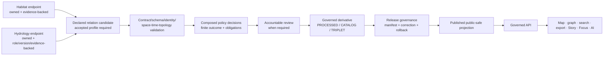

<!-- [KFM_META_BLOCK_V2]
doc_id: kfm://policy/joins/habitat-hydrology
title: Habitat–Hydrology Join Admissibility Policy Boundary and Child-Lane Index
type: policy-readme
version: v0.1
status: draft; repository-grounded; empty-target-completion; pair-specific-join-policy; habitat-hydrology; child-lane-index; riparian-child-confirmed; evaluator-unbound; ADR-S-14-open; fail-closed; non-semantic; non-schema; non-validator; non-regulatory; non-life-safety; non-release; non-publication
owner: NEEDS VERIFICATION — Habitat steward, Hydrology steward, join-policy steward, source steward, evidence steward, rights/sensitivity reviewer, hydrology regulatory-context reviewer, validation steward, governed-API maintainer, release reviewer, security reviewer, docs steward
created: 2026-07-24
updated: 2026-07-24
policy_label: repository-facing; habitat-hydrology; cross-domain-join; pair-policy-index; hydro-feature; reach-identity; habitat-patch; wetlands; riparian; flood-context; source-role-aware; evidence-bound; most-restrictive-wins; time-aware; topology-aware; fail-closed; no-regulatory-determination; no-life-safety; no-public-bypass
current_path: policy/joins/habitat-hydrology/README.md
owning_root: policy/
canonical_relationship: PROPOSED Habitat–Hydrology pair-policy routing and composition boundary under the substantive policy/joins parent; the confirmed riparian child is indexed here, while semantic contract placement, schema authority, validator placement, ADR-S-14, and executable bundle authority remain unresolved
evidence_snapshot:
  repository: bartytime4life/Kansas-Frontier-Matrix
  base_ref: main
  target_prior_blob: 8b137891791fe96927ad78e64b0aad7bded08bdc
  directory_rules_blob: 2affb080e6f0043867c64c7f06c1ca52030fbd55
  policy_root_blob: fa9378a6a699d0985fd018dbdb9f27c15efcb1c3
  parent_policy_joins_blob: 2d2736cb33bf9ede95e00cffb2fd45914106aea2
  riparian_child_blob: b35a1c950a70ef924e7bdc5056313e254a66d866
  habitat_cross_lane_blob: d6f9bc2b104e425cb84932dd35d28a781ed67329
  habitat_patch_contract_blob: 70a84b8f44d25a281997fb6d5f6ff2a267d4dec2
  hydrology_source_role_matrix_blob: 1adfcf08805bee8cc43e3e405a6ef515d3efaf66
  hydrology_hydro_feature_contract_blob: e84ab458c192b0dfdd4279bea8311ab19872031c
  habitat_domain_policy_blob: 8456c65196354695b8eb5b8178ecb61cfc12b7dd
  hydrology_domain_policy_blob: 6d4a011079d647b58a44ad70e15ee4a980d00896
  join_contract_index_blob: e31c295b48b41a4da3e861d4536a07f2bbe1660e
  policy_decision_schema_blob: 1472d26a42c73f17545b4464a275412ffa1d098e
  pair_contract_checked_path: NOT_FOUND — contracts/joins/habitat-hydrology/README.md
  pair_schema_checked_path: NOT_FOUND — schemas/contracts/v1/joins/habitat-hydrology/README.md
  pair_validator_checked_path: NOT_FOUND — tools/validators/joins/habitat-hydrology/README.md
  open_overlapping_pull_requests_found: "0"
related:
  - ../README.md
  - ./riparian/README.md
  - ../../README.md
  - ../../domains/habitat/README.md
  - ../../domains/hydrology/README.md
  - ../../geoprivacy/README.md
  - ../../sensitivity/README.md
  - ../../access/README.md
  - ../../promotion/README.md
  - ../../../docs/doctrine/directory-rules.md
  - ../../../docs/architecture/cross-lane-join-policy.md
  - ../../../docs/architecture/ecology-cross-domain.md
  - ../../../docs/domains/habitat/cross-domain.md
  - ../../../docs/domains/hydrology/SOURCE_ROLE_MATRIX.md
  - ../../../contracts/joins/README.md
  - ../../../contracts/domains/habitat/habitat_patch.md
  - ../../../contracts/domains/hydrology/hydro_feature.md
  - ../../../contracts/domains/hydrology/reach_identity.md
  - ../../../contracts/policy/policy_input_bundle.md
  - ../../../contracts/policy/policy_decision.md
  - ../../../schemas/contracts/v1/policy/policy_input_bundle.schema.json
  - ../../../schemas/contracts/v1/policy/policy_decision.schema.json
  - ../../../pipelines/cross_lane/riparian_vegetation/README.md
  - ../../../data/registry/sources/README.md
  - ../../../apps/governed-api/README.md
  - ../../../release/README.md
tags: [kfm, policy, joins, habitat, hydrology, riparian, wetlands, hydro-feature, reach-identity, habitat-patch, source-role, evidence-bundle, time, topology, review, correction, rollback]
truth_posture: CONFIRMED empty target, singular policy root, substantive generic joins-policy parent, merged riparian child, Habitat/Hydrology ownership doctrine, HabitatPatch and HydroFeature semantic boundaries, Hydrology source-role anti-collapse rules, greenfield domain-policy scaffolds, absent checked pair contract/schema/validator parents, closed PolicyDecision family enum without joins, and unproved evaluator/bundle/runtime/release integration / PROPOSED pair-wide routing contract, shared input profile, admissibility checks, child-lane rules, posture composition, reason codes, obligations, tests, review, correction, revocation, and rollback / CONFLICTED join-versus-relation schema authority, pair contract placement, pair policy versus domain-policy composition, and ADR-S-14 acceptance / UNKNOWN accepted pair policy module, relation profiles beyond riparian, rule package, bundle selector, native tests, runtime composer, decision receipts, required CI, public-surface enforcement, and production operation
notes:
  - "This revision completes an existing empty README in place. It creates no Habitat or Hydrology object, relation contract, schema field, policy rule, policy family, fixture, validator, EvidenceBundle, receipt, graph edge, runtime route, release object, regulatory determination, alert, or publication state."
  - "Habitat owns HabitatPatch, ecological systems, suitability, corridors, restoration opportunity, stewardship zones, and habitat-support interpretations. Hydrology owns HydroFeature, ReachIdentity, network and wetland context, observations, regulatory flood context, and hydrologic source-role truth. The pair policy transfers no ownership."
  - "The merged riparian child is the only confirmed child lane in bounded indexed evidence. This parent does not infer additional accepted sublanes from topic similarity."
  - "The current PolicyDecision schema permits promotion, access, render, capability, consent, and sensitivity only; policy_family=joins and policy_family=habitat-hydrology are schema-invalid at the inspected snapshot."
  - "Habitat–Hydrology policy must not become wetland-jurisdiction determination, floodplain certification, observed-flood evidence, stream-access or private-land inference, water-allocation advice, emergency guidance, or ecological management prescription."
  - "No protected locations, private-land associations, restricted infrastructure details, operational thresholds, or exploitable reconstruction parameters belong in this repository-facing README or public fixtures."
[/KFM_META_BLOCK_V2] -->

<a id="top"></a>

# Habitat–Hydrology Join Admissibility Policy Boundary

> **One-line purpose.** `policy/joins/habitat-hydrology/` is the pair-wide policy-routing and composition boundary for relationships between Habitat-owned products and Hydrology-owned features, observations, models, or regulatory context—without becoming domain truth, relation meaning, machine shape, a validator, a pipeline, a regulatory determination, a release decision, or a publication path.

[](#status-and-evidence)
[](#purpose)
[](#current-child-lane-index)
[](#hydrology-source-role-boundary)
[](#pair-posture-model)
[](#regulatory-legal-and-life-safety-boundary)
[](#authority-level)

**Quick navigation:** [Purpose](#purpose) · [Authority](#authority-level) · [Status](#status-and-evidence) · [Scope](#scope-and-bounded-context) · [Child lanes](#current-child-lane-index) · [Ownership](#domain-ownership-boundary) · [Separation](#concept-separation) · [Invariants](#keystone-invariants) · [Belongs](#what-belongs-here) · [Exclusions](#what-does-not-belong-here) · [Inputs](#explicit-policy-input-profile) · [Checks](#pair-wide-admissibility-checks) · [Hydrology roles](#hydrology-source-role-boundary) · [Habitat roles](#habitat-product-role-boundary) · [Space and time](#temporal-spatial-scale-and-topology-boundary) · [Risk](#composition-and-inference-risk) · [Regulatory boundary](#regulatory-legal-and-life-safety-boundary) · [Postures](#pair-posture-model) · [Compatibility](#policydecision-compatibility) · [Composition](#decision-composition) · [Outcomes](#normalized-outcomes) · [Reasons](#reason-code-vocabulary) · [Obligations](#obligation-vocabulary) · [Child contract](#child-lane-contract) · [Surfaces](#public-surface-controls) · [Lifecycle](#governed-lifecycle-and-trust-flow) · [Threats](#threat-model) · [Validation](#validation-and-acceptance) · [Review](#review-burden) · [Implementation](#smallest-sound-implementation-sequence) · [Rollback](#correction-revocation-withdrawal-and-rollback) · [Open work](#open-verification-register)

> [!IMPORTANT]
> **Pair-policy permission is not ecological or hydrologic truth.** This lane may decide whether a declared Habitat–Hydrology relationship may be evaluated or used for one bounded operation. It cannot prove either endpoint, prove the relationship, establish causality, transfer authority, create evidence, approve a model, determine legal status, approve release, or publish an artifact.

> [!CAUTION]
> **Hydrology context is role-sensitive.** A stream network feature is not a flow observation; a modeled moisture surface is not an observation; a regulatory flood zone is not an observed flood event; a watershed aggregate is not a per-patch reading. Every relation and derivative must preserve those distinctions.

> [!WARNING]
> **KFM is not a regulatory, legal, emergency, engineering, or land-management authority.** This lane must not produce wetland-jurisdiction determinations, floodplain or floodway certification, insurance conclusions, emergency alerts, evacuation advice, water-allocation decisions, access or title conclusions, engineering design, restoration prescriptions, or agricultural instructions.

---

## Purpose

`policy/joins/habitat-hydrology/` exists to answer one bounded policy-routing question:

> Given explicit Habitat and Hydrology endpoint references, a declared relation profile, source roles, evidence, rights, sensitivity, identity and version, temporal and spatial scope, topology, uncertainty, requested operation, audience, surface, lifecycle state, review state, release state, correction lineage, and evaluator context, may the Habitat–Hydrology relationship be used—and under which enforceable obligations?

A mature pair-policy boundary should:

- preserve independent Habitat and Hydrology authority;
- route relation-specific questions to accepted child profiles;
- require evidence for both endpoints and for the relation assertion;
- distinguish network identity, observation, model, regulatory context, aggregate, administrative record, and candidate material;
- distinguish HabitatPatch, land-cover observation, ecological-system classification, suitability model, corridor, and restoration candidate;
- prevent adjacency or overlap from being presented as connectivity, dependence, condition, cause, or legal status;
- preserve source version, geometry lineage, time, scale, CRS, topology method, and uncertainty;
- apply the most restrictive applicable rights, sensitivity, access, render, and release posture;
- allow a stricter result when composition creates new inference risk;
- normalize all required policy-family decisions into one finite caller result;
- preserve review, correction, withdrawal, cache invalidation, and rollback dependencies;
- keep public maps, graphs, search, exports, screenshots, vector indexes, AI, and Story/Focus surfaces behind governed interfaces.

This README is an index, routing contract, and review boundary. It does not activate policy.

[Back to top](#top)

---

## Authority level

**PROPOSED pair-specific admissibility and routing boundary under the existing singular `policy/` responsibility root.**

Directory Rules assign responsibility by function:

| Responsibility | Owning surface | Role of this README |
|---|---|---|
| Habitat object meaning | Habitat contracts and doctrine | Consume definitions; never redefine Habitat truth. |
| Hydrology object meaning | Hydrology contracts and doctrine | Consume definitions; never redefine Hydrology truth. |
| Habitat–Hydrology relation meaning | An accepted join/relation contract | Require a declared profile; never create relation truth. |
| Machine shape | An accepted join/relation schema | Require a closed versioned shape; never define fields here. |
| Source identity and role | Source contracts and `data/registry/sources/` | Require explicit refs; never invent or upgrade source roles. |
| Evidence and proof | Evidence contracts and proof roots | Require endpoint and relation support; never create evidence. |
| Pair admissibility | `policy/` | Define bounded allow/restrict/abstain/deny composition if accepted. |
| Domain-specific policy | `policy/domains/habitat/`, `policy/domains/hydrology/` | Consume domain decisions; do not duplicate their rules here. |
| Sensitivity/geoprivacy | Accepted policy lanes | Compose decisions; do not publish protected thresholds or exact locations. |
| Validation | `tools/validators/`, `tests/`, `fixtures/` | Depend on deterministic checks; validation is not permission. |
| Pipeline execution | `pipelines/` and accepted specs | Execute reviewed composition; cannot approve or publish. |
| Lifecycle materializations | `data/` phase roots | Store candidates and derivatives; policy does not store payloads. |
| Release, correction, rollback | `release/` | Own release-governance transitions and records. |
| Public delivery | Governed API and application roots | Enforce obligations on released derivatives only. |

The requested path already exists as a tracked empty file. That confirms repository placement, not canonical standing, accepted semantics, executable policy, or runtime maturity.

### Directory Rules basis

The owning root is `policy/` because the primary responsibility is **admissibility**. The path does not authorize:

- a parallel domain root;
- a new relation contract family;
- a new schema family;
- a second source registry;
- a pair-specific data lifecycle;
- a pair-specific release authority;
- direct public reads from policy source;
- or any bypass around the governed API trust membrane.

[Back to top](#top)

---

## Status and evidence

### Current repository state

| Surface | Current evidence | Safe conclusion |
|---|---|---|
| `policy/joins/habitat-hydrology/README.md` | **CONFIRMED empty tracked file** | This revision completes the pair parent in place. |
| `policy/joins/README.md` | **CONFIRMED substantive draft** | Defines generic join-policy routing and composition; remains evaluator-unbound and ADR-S-14-open. |
| `policy/joins/habitat-hydrology/riparian/README.md` | **CONFIRMED substantive child** | Riparian is the only confirmed child in bounded indexed evidence. |
| Habitat cross-lane doctrine | **CONFIRMED draft doctrine** | Habitat consumes substrate, moisture, wetlands, and riparian context without owning Hydrology truth. |
| Hydrology source-role matrix | **CONFIRMED draft doctrine** | Observed, modeled, regulatory, aggregate, administrative, candidate, and synthetic roles must not collapse. |
| HabitatPatch contract | **CONFIRMED draft semantic contract** | HabitatPatch is a Habitat object and is not Hydrology truth or regulatory critical habitat. |
| HydroFeature contract | **CONFIRMED draft semantic contract** | HydroFeature is network/context geometry and is not observation, regulation, event, or public layer truth. |
| Habitat/Hydrology domain-policy READMEs | **CONFIRMED greenfield scaffolds** | Domain policy ownership is named, but executable domain policy is not established. |
| Pair semantic contract parent | **NOT FOUND at checked path** | `contracts/joins/habitat-hydrology/README.md` is not established. |
| Pair schema parent | **NOT FOUND at checked path** | `schemas/contracts/v1/joins/habitat-hydrology/README.md` is not established. |
| Pair validator parent | **NOT FOUND at checked path** | `tools/validators/joins/habitat-hydrology/README.md` is not established. |
| `PolicyDecision` schema | **CONFIRMED closed proposed schema** | Outcomes are finite; `policy_family=joins` and `habitat-hydrology` are invalid. |
| Active policy module, bundle, evaluator, decision composer, receipts, required CI, release integration | **UNKNOWN / NEEDS VERIFICATION** | Documentation does not prove operational enforcement. |

### Truth labels

- **CONFIRMED** — verified from current repository bytes in this work.
- **PROPOSED** — a design, profile, placement, reason code, obligation, or workflow not accepted and implemented.
- **UNKNOWN** — no sufficient current evidence establishes the state.
- **NEEDS VERIFICATION** — a concrete check remains before action.
- **CONFLICTED** — current repository surfaces overlap or disagree and require coordinated resolution.

### Evidence limits

This README does not claim:

- a complete child-lane inventory;
- accepted Habitat–Hydrology predicates;
- operational domain policy;
- an accepted join schema or relation schema;
- executable validators;
- native policy tests;
- a selected OPA/Rego package;
- a bundle selector;
- a runtime decision-composition service;
- emitted pair decisions or receipts;
- a release candidate;
- a production route;
- or public use.

[Back to top](#top)

---

## Scope and bounded context

### In scope

This parent lane may document shared pair-wide admissibility requirements for relationships between Habitat-owned and Hydrology-owned objects, including:

- explicit endpoint ownership;
- relation-profile routing;
- source-role preservation;
- feature and object version compatibility;
- spatial, temporal, scale, CRS, and topology checks;
- endpoint and relation evidence;
- rights, sensitivity, access, and public-exposure composition;
- regulatory and life-safety denials;
- finite policy outcomes;
- caller obligations;
- child-lane registration;
- correction, revocation, invalidation, and rollback requirements.

### Out of scope

This lane does not own:

- Habitat or Hydrology object semantics;
- a universal definition of “riparian,” “wetland,” “aquatic,” “floodplain,” “hydrologically supported,” or “connected”;
- source acquisition;
- hydrography identity;
- measurement interpretation;
- model production;
- regulatory determinations;
- relation contracts;
- JSON Schema;
- geometry algorithms;
- topology engines;
- policy runtime;
- fixtures or executable tests;
- data instances;
- release records;
- maps, tiles, graphs, exports, AI answers, or stories.

### Pair-wide versus child-specific responsibility

The parent owns shared pair posture only. A child lane is required when a relationship family has distinct:

- predicates;
- endpoint classes;
- evidence requirements;
- spatial/topology method;
- temporal semantics;
- sensitivity or rights posture;
- reviewer chain;
- denials;
- obligations;
- correction triggers;
- or rollback dependencies.

The confirmed `riparian/` child specializes these concerns. Its presence does not make every Habitat–Hydrology relation “riparian.”

[Back to top](#top)

---

## Current child-lane index

### Confirmed child

| Child | Scope | Current posture |
|---|---|---|
| [`riparian/`](./riparian/README.md) | Habitat–Hydrology riparian relation admissibility, including proximity-versus-connectivity, network/observation/regulatory distinctions, topology/time/scale, and non-regulatory boundaries. | **CONFIRMED substantive README / executable behavior UNKNOWN** |

### No inferred children

Bounded repository search did not establish additional child READMEs under this pair parent. Therefore this README does **not** claim accepted child lanes for:

- wetlands;
- aquatic habitat;
- floodplain context;
- drought support;
- groundwater-dependent habitat;
- water-quality habitat;
- hydroperiod;
- stream-corridor connectivity;
- restoration;
- or any other topic.

These may be valid future profiles, domain-owned concepts, aliases, or inappropriate pair-policy splits. Each requires evidence and placement review before creation.

### Child registration requirements

A new child should not be added until:

1. the relation concept is not already owned by a domain contract;
2. the relation meaning is accepted or explicitly marked PROPOSED;
3. the parent pair posture is applicable;
4. endpoint object families are named;
5. source-role rules are defined;
6. evidence and relation-support requirements are defined;
7. rights/sensitivity/regulatory implications are reviewed;
8. the child name and orientation avoid alias drift;
9. schema and validator homes are settled or clearly held;
10. correction and rollback dependencies are defined.

[Back to top](#top)

---

## Domain ownership boundary

### Habitat retains authority over

- `HabitatPatch`;
- `LandCoverObservation`;
- `EcologicalSystem`;
- Habitat quality and condition interpretations;
- `SuitabilityModel` and its uncertainty/model lineage;
- `ConnectivityEdge`;
- `Corridor`;
- `Restoration Opportunity`;
- `StewardshipZone`;
- Habitat-support interpretations derived from cited context.

### Hydrology retains authority over

- `HydroFeature`;
- `ReachIdentity`;
- `Watershed` and `HUCUnit`;
- stream, lake, wetland, reservoir, canal, and network context;
- `GaugeSite`;
- `FlowObservation`;
- `WaterLevelObservation`;
- `WaterQualityObservation`;
- hydrographs and upstream traces with explicit roles;
- regulatory flood context such as `NFHLZone`;
- observed flood-event evidence;
- hydrologic source roles, versions, and authority limits.

### The join may own only a bounded relation candidate

An accepted relation object may assert only the declared relationship between references. It does not absorb either endpoint.

```text
Habitat object truth        -> Habitat
Hydrology object truth      -> Hydrology
Relationship meaning        -> accepted join/relation contract
Relationship machine shape  -> accepted schema
Admissibility               -> policy composition
Validation                  -> validators/tests
Evidence support            -> EvidenceBundle/proof roots
Release                     -> release/
Public delivery             -> governed interfaces
```

### Ownership transfer is denied

The following are invalid:

- Habitat re-labeling hydrologic context as a Habitat observation;
- Hydrology re-labeling a Habitat interpretation as a hydrologic measurement;
- a join object becoming the canonical HabitatPatch;
- a join object becoming the canonical HydroFeature or ReachIdentity;
- a regulatory zone becoming an observed event;
- a modeled surface becoming an observation;
- an aggregate watershed value becoming a patch-level measurement;
- a map intersection becoming a scientific or legal determination.

[Back to top](#top)

---

## Concept separation

### Endpoint validity

Endpoint validity asks whether each referenced Habitat or Hydrology object is valid under its own contract, schema, source, evidence, time, and lifecycle posture.

It does not prove the relationship.

### Relation validity

Relation validity asks whether a declared predicate between endpoints is supported, meaningful, temporally and spatially coherent, and conformant to an accepted relation profile.

It does not grant permission.

### Policy admissibility

Policy admissibility asks whether the valid relation may be used for a named operation, audience, precision, surface, lifecycle transition, or release context.

It does not approve release.

### Validation

Validation determines whether declared contracts, schemas, rules, and obligations were satisfied.

Validation does not create policy permission or evidence.

### Review

Review records accountable human judgment where policy or novelty requires it.

Review does not create scientific truth.

### Release

Release governs whether an approved artifact set may become available to a defined audience and how it can be corrected or rolled back.

A release manifest cannot repair missing evidence, source-role collapse, rights uncertainty, or a forbidden regulatory inference.

### Rendering and AI

Maps, graph edges, search results, exports, story nodes, Focus Mode responses, and AI summaries are downstream presentations. They cannot strengthen the underlying relation or relax its policy.

[Back to top](#top)

---

## Keystone invariants

1. **Domain ownership remains separate.**
2. **Relation meaning is explicit.**
3. **Endpoint evidence and relation evidence remain distinct.**
4. **Source role is fixed at admission and preserved.**
5. **Observed, modeled, regulatory, aggregate, administrative, candidate, and synthetic states do not collapse.**
6. **Sensitivity is evaluated on the produced relation and derivative surfaces.**
7. **The most restrictive applicable posture wins.**
8. **Composition may increase restriction beyond either input.**
9. **Spatial overlap is not causality, connectivity, dependence, condition, or legal status.**
10. **Time, scale, source version, CRS, and topology are part of relation meaning.**
11. **Unknown required context fails closed.**
12. **Policy does not silently fetch missing facts.**
13. **Validation is not permission.**
14. **A proof pass is not release approval.**
15. **A map style is not redaction.**
16. **A schema-valid object may still be semantically or policy-invalid.**
17. **Public clients use governed interfaces.**
18. **Consequential claims resolve to evidence or abstain.**
19. **Corrections propagate to every derivative and cache.**
20. **Promotion is a governed state transition, not a file move.**
21. **AI is interpretive, never root truth.**
22. **No regulatory or life-safety authority is implied.**

[Back to top](#top)

---

## What belongs here

Appropriate content under this parent may include:

- this README;
- child-lane indexes;
- pair-wide policy routing notes;
- shared pair-wide input requirements;
- shared source-role and anti-collapse rules;
- shared reason-code and obligation vocabularies when accepted;
- child registration and deprecation rules;
- migration notes for pair-policy path changes;
- links to accepted contracts, schemas, validators, fixtures, tests, receipts, reviews, release records, correction paths, and rollback targets;
- policy module source only after package, entrypoint, bundle, tests, and ownership are accepted;
- synthetic native policy tests only if the repository accepts colocated policy tests.

### Placement test

A file may belong here when its primary question is:

> “May this declared Habitat–Hydrology relationship be used for this operation and audience, and what obligations apply?”

If its primary question is meaning, shape, computation, storage, validation, release, or presentation, it belongs elsewhere.

[Back to top](#top)

---

## What does not belong here

| Do not place here | Correct responsibility |
|---|---|
| Habitat or Hydrology semantic contracts | `contracts/domains/<domain>/` |
| Habitat–Hydrology relation meaning | accepted `contracts/joins/` or relation contract home |
| JSON Schema | `schemas/contracts/v1/` |
| Source descriptors or registry instances | source contracts and `data/registry/sources/` |
| Raw or derived data | governed `data/<phase>/` lanes |
| EvidenceBundles or proof packs | evidence/proof roots |
| Receipts, validation reports, and review records | accepted receipt/report/review roots |
| Geometry, topology, temporal-alignment, or model code | `packages/`, `pipelines/`, or `tools/` |
| Generic fixtures or tests | `fixtures/` and `tests/` |
| Release manifests, promotion decisions, corrections, withdrawals, rollback cards | `release/` |
| Public API routes, UI, map, graph, search, export, AI, or Story Player logic | governed application/runtime roots |
| Wetland or floodplain legal determinations | qualified external authority, not KFM |
| Emergency or life-safety guidance | qualified official alerting authority, not KFM |
| Engineering, restoration, water-allocation, or management instructions | qualified responsible authority, not this lane |
| Exact protected locations or operational security details | restricted governed systems |
| Secrets, credentials, private endpoints, or proprietary payloads | approved secret/restricted storage |
| A second independently evolving pair-policy root | migration/compatibility only after review |

[Back to top](#top)

---

## Explicit policy input profile

The current `PolicyInputBundle` schema is not known to enforce this complete profile. A pair evaluator must receive explicit, versioned, non-secret context.

### Request context

| Field family | Minimum content |
|---|---|
| Operation | stable operation/capability name and requested effect |
| Audience | public, reviewer, steward, restricted, system, or accepted class |
| Purpose | bounded stated purpose |
| Surface | API, map, tile, graph, search, export, screenshot, vector, Story, Focus, AI, internal review |
| Requested precision | geometry, scale, attribute, time, and uncertainty precision |
| Evaluation time | explicit timestamp |

### Habitat endpoint context

- stable Habitat object ref;
- object family and version;
- source descriptor refs;
- source role or product role;
- observation/model/regulatory/aggregate status as applicable;
- geometry ref and CRS/geography version;
- observation or effective time;
- EvidenceRef/EvidenceBundle status;
- sensitivity, rights, release, correction, and rollback refs.

### Hydrology endpoint context

- stable Hydrology object ref;
- object family and version;
- source descriptor and source-family refs;
- source role;
- hydrography/network vintage;
- feature ID or ReachIdentity ref;
- observation time, model run time, regulatory effective time, or aggregate period;
- geometry ref, CRS, topology/network version;
- EvidenceRef/EvidenceBundle status;
- rights, sensitivity, release, correction, and rollback refs.

### Relation context

- relation profile ID and version;
- predicate;
- orientation;
- relation candidate ID;
- method/algorithm version;
- spatial operation and tolerance profile ref;
- temporal-alignment profile ref;
- scale/precision profile ref;
- uncertainty/confidence representation;
- endpoint evidence refs;
- independent relation-evidence refs;
- transform or model lineage;
- validation refs;
- prior review and policy refs;
- correction/supersession lineage.

### Policy execution context

- accepted bundle ID/version/digest;
- evaluator profile and version;
- entrypoint;
- input hash;
- dependency decision refs;
- evaluation time;
- replay metadata;
- caller identity/class where access differs.

### Forbidden inputs

The policy input must not embed:

- credentials;
- source-system secrets;
- private endpoints;
- exact protected locations unnecessary to the decision;
- living-person private data;
- private-land owner identities;
- restricted infrastructure detail;
- proprietary source payloads;
- raw unbounded geometry blobs;
- arbitrary prompts;
- model hidden state;
- secret geoprivacy or security parameters.

Use governed refs and minimum necessary attributes.

[Back to top](#top)

---

## Pair-wide admissibility checks

A Habitat–Hydrology relation should fail closed unless all applicable checks pass.

### Check 1 — Endpoint identity

Both endpoint refs resolve to stable, versioned objects under their owning domains.

Failures include unresolved IDs, alias ambiguity, object-family mismatch, superseded objects without accepted lineage, unsupported versions, and mutable references.

### Check 2 — Domain ownership

The relation preserves Habitat and Hydrology ownership.

Failures include Habitat claiming Hydrology observation truth, Hydrology claiming Habitat interpretation truth, relation objects replacing endpoints, and copied fields that create parallel authority.

### Check 3 — Declared relation meaning

A recognized profile and predicate define what the relation means.

Failures include generic `related_to` used for a consequential claim, predicate inferred from folder name, unclear orientation, adjacency used as connectivity, intersection used as dependence, context used as causality, and co-display used as relation evidence.

### Check 4 — Source-role preservation

Every contributing source/product role remains visible.

Failures include modeled as observed, regulatory as observed event, aggregate as per-place truth, administrative compilation as observation, candidate as released, and synthetic presentation as observed reality.

### Check 5 — Version compatibility

Hydrography, object, geography, schema, method, and relation-profile versions are explicit and compatible.

Failures include NHDPlus/3DHP vintages silently mixed, stale ReachIdentity mapping, old HabitatPatch geometry joined to a newer network without crosswalk, incompatible CRS/geography versions, and missing method version.

### Check 6 — Spatial and topology validity

The relation method is appropriate for the predicate.

Failures include uncontrolled buffer intersection, nearest-feature join without bounded semantics, line/polygon contact treated as flow connectivity, catchment membership inferred from display geometry, topology error, invalid geometry, scale mismatch, and precision beyond source support.

### Check 7 — Temporal alignment

Time kinds and validity intervals are compatible.

Failures include current habitat claim from historical hydrology without caveat, observation and model times conflated, regulatory effective date omitted, seasonal relation applied year-round, stale endpoint not marked, and forecast treated as current observation.

### Check 8 — Endpoint evidence

Each endpoint has resolvable evidence appropriate to the claim.

Failures include missing EvidenceBundle, citation mismatch, unsupported object identity, source authority outside permitted claims, and stale or withdrawn evidence.

### Check 9 — Relation evidence

The relationship itself has support beyond endpoint validity.

Failures include relation asserted only because geometries overlap, relation generated by an unreviewed model, relation evidence from a different time/scale, omitted uncertainty, and withdrawn relation evidence.

### Check 10 — Rights and purpose

Source terms and derivative rights permit the requested operation and audience.

Failures include unknown rights, restricted redistribution, purpose incompatibility, export prohibition, unenforceable attribution, and public use broader than source terms.

### Check 11 — Sensitivity and inference risk

The produced relation and every derivative surface are evaluated for new risk.

Failures include protected ecological location inference, private-land condition inference, critical infrastructure inference, cultural or archaeological inference, water-access inference, repeated-release differencing, graph/search/vector reconstruction, and model-inversion risk.

### Check 12 — Regulatory, legal, and life-safety boundary

The relation does not claim authority KFM does not possess.

Failures include wetland jurisdiction, floodplain/floodway certification, insurance determination, permitting conclusion, observed flood inferred from regulatory context, emergency alert, water allocation decision, and engineering or management instruction.

### Check 13 — Review and novelty

Novel, high-impact, sensitive, disputed, or policy-significant relations receive accountable review.

Failures include missing or unqualified reviewer, unresolved disagreement, missing separation of duties where required, expired review, and review not bound to exact inputs and versions.

### Check 14 — Release, correction, and rollback readiness

Public or semi-public use has release support and reversible dependencies.

Failures include unreleased endpoint or derivative, missing manifest/decision refs, no correction or withdrawal path, no rollback target, no dependency graph, and no cache invalidation plan.

### Composition rule

All required checks compose with AND semantics. A relation is not “mostly admissible.”

```text
endpoint_valid
AND ownership_preserved
AND relation_declared
AND source_roles_preserved
AND versions_compatible
AND spatial_topology_valid
AND temporal_alignment_valid
AND endpoint_evidence_closed
AND relation_evidence_closed
AND rights_allow
AND sensitivity_allow
AND regulatory_boundary_preserved
AND required_review_complete
AND release_and_rollback_ready
```

A failed check produces `ABSTAIN`, `DENY`, or `ERROR` according to cause. It never silently degrades to permission.

[Back to top](#top)

---

## Hydrology source-role boundary

Hydrology source roles are load-bearing for pair policy.

| Hydrology input | Role | Pair-policy implication |
|---|---|---|
| NHDPlus/3DHP feature identity | observed/network identity or modeled derivative as admitted | May support feature/network context; does not prove flow observation or legal status. |
| NWIS gauge reading | observed | May support a time-bounded observation relationship; does not become a habitat condition without a declared model/relation. |
| Modeled hydrograph or moisture surface | modeled | Must retain model lineage and uncertainty; cannot be labeled observed. |
| FEMA NFHL zone | regulatory | May provide regulatory flood context only; cannot prove observed flooding. |
| HUC summary | aggregate | May support unit-level context; cannot become a patch-level observation. |
| State permit/allocation roster | administrative | Cannot be presented as hydrologic observation or access permission. |
| Candidate flood mark | candidate | Cannot reach public surfaces until validated and promoted through governed state. |
| AI or visualization reconstruction | synthetic/representation | Cannot become source evidence or observation. |

### Canonical anti-collapse denials

- modeled product labeled as observed;
- regulatory zone labeled as observed flood;
- aggregate cited as per-place truth;
- administrative compilation cited as observation;
- candidate exposed as released;
- synthetic content presented as observed reality.

### HydroFeature and ReachIdentity separation

`HydroFeature` is generic source/network context. `ReachIdentity` is stable reach identity across vintages. A pair relation must not:

- use a source feature ID as a timeless reach ID without an accepted crosswalk;
- join across versions without recording the mapping;
- treat a generalized public feature as canonical exact geometry;
- treat a reach or feature as a measurement;
- treat a network relation as observed hydraulic behavior.

### Regulatory context separation

```text
NFHLZone           = regulatory context
ObservedFloodEvent = observed event evidence
Forecast/model     = modeled or official forecast context
HydroFeature       = network/context feature
```

These families must remain distinct in contracts, schemas, policy inputs, validators, APIs, map legends, story text, exports, and AI answers.

[Back to top](#top)

---

## Habitat product-role boundary

### HabitatPatch

A `HabitatPatch` is a discrete Habitat unit or public-safe patch geometry. It is not a Hydrology feature, water observation, regulatory critical habitat by implication, wetland-jurisdiction determination, suitability model, corridor, restoration instruction, or release authority.

### Land-cover and ecological-system context

Land-cover observations and ecological-system classifications may support Habitat interpretation. They do not prove hydrologic connectivity, current water presence, hydroperiod, flood exposure, wetland legal status, or observed ecological condition beyond their supported scope.

### Suitability and quality products

Suitability models, quality scores, and uncertainty surfaces are derived products. Pair policy must require model identity and version, training/input lineage, source-role preservation, uncertainty, time/geography scope, relation evidence, sensitivity review, and non-prescriptive wording.

They must not be rendered or summarized as observations.

### Corridors and connectivity

A Habitat corridor or connectivity edge is not a stream/reach/network edge unless an accepted relation explicitly connects them. Spatial coincidence does not merge graph authorities.

### Restoration opportunities

A restoration opportunity is a candidate interpretation. It is not a wetland delineation, engineering design, permit, land-use order, management prescription, or proof of ownership/access.

[Back to top](#top)

---

## Temporal, spatial, scale, and topology boundary

### Time kinds remain explicit

| Time kind | Example | Rule |
|---|---|---|
| Source vintage | NHDPlus/3DHP snapshot | Must be pinned and compatible with identity mapping. |
| Observation time | gauge or water-quality reading | Must remain observation-specific. |
| Model run time | hydrograph, moisture, suitability | Must be distinct from observation time. |
| Regulatory effective time | flood-zone designation | Must not be treated as event time. |
| Habitat observation/classification time | land-cover/ecological classification date | Must align with relation claim. |
| Validity interval | seasonal or time-bounded relationship | Must be explicit. |
| Release time | publication event | Does not change source role or scientific meaning. |
| Correction/withdrawal time | invalidation event | Must propagate to derivatives. |

### Spatial semantics remain explicit

A relation profile must specify whether it means intersection, containment, adjacency, within-distance, same catchment, upstream/downstream relation, network-connected, floodplain context, wetland context, modeled moisture support, observed hydrologic support, or another accepted predicate.

These are not interchangeable.

### Scale and precision

Pair policy should deny or hold when Habitat geometry is finer than Hydrology support, an aggregate unit is projected to patch precision, generalized geometry is rejoined to reconstruct restricted detail, topology tolerance changes meaning, display scale is mistaken for evidence scale, or uncertainty grows but is not surfaced.

### CRS and geography versions

Every consequential relation should carry or resolve CRS, datum, geography/network version, transformation method, geometry digest, topology method/version, and precision/tolerance profile.

Silent reprojection or cross-version joining is a correctness and auditability failure.

### Proximity is not connectivity

Nearest-feature or buffer joins may support candidate context only when the contract says so. They do not prove flow exchange, groundwater dependence, seasonal inundation, riparian function, ecological condition, legal wetland status, or causality.

[Back to top](#top)

---

## Composition and inference risk

A Habitat–Hydrology join can create information not directly present in either endpoint.

| Risk | Example | Default posture |
|---|---|---|
| Source-role laundering | regulatory flood context described as observed inundation | **DENY** |
| Scale laundering | HUC aggregate described as patch-level moisture | **DENY** |
| Model laundering | modeled suitability or hydrograph described as observation | **DENY** |
| Causality inflation | intersection described as hydrologic support or ecological cause | **ABSTAIN / DENY** |
| Legal inference | mapped wetland context described as jurisdictional wetland | **DENY** |
| Life-safety inference | flood context described as KFM warning | **DENY** |
| Private-land inference | relationship used to infer access, ownership, operations, or land condition | **DENY / STEWARD-REVIEW** |
| Sensitive ecology inference | hydrologic context narrows protected species or habitat location | **STEWARD-REVIEW / DENY** |
| Infrastructure inference | relationship reveals critical intake, levee, dam, or utility detail | **STEWARD-REVIEW / DENY** |
| Repeated-release differencing | successive generalized releases reveal hidden boundary/condition | **STEWARD-REVIEW / DENY** |
| Graph reconstruction | relation graph allows sensitive network or location inference | **STEWARD-REVIEW / DENY** |
| AI synthesis inflation | generated explanation exceeds cited relation meaning | **ABSTAIN / DENY** |

Risk is evaluated on relation objects, derived layers, graph edges, tiles, popups, search results, exports, screenshots, animations, story nodes, vector embeddings, AI answers, caches, and combinations of released versions.

Individually safe inputs do not guarantee a safe composition.

[Back to top](#top)

---

## Regulatory, legal, and life-safety boundary

### Always outside KFM pair authority

This lane must not issue or imply:

- Clean Water Act jurisdiction;
- wetland delineation;
- ordinary-high-water-mark determination;
- floodplain or floodway certification;
- Base Flood Elevation certification;
- flood-insurance conclusion;
- permitting decision;
- legal property/access conclusion;
- easement or ownership conclusion;
- water-right allocation;
- emergency alert;
- evacuation route or rescue instruction;
- engineering design;
- infrastructure-security assessment for public use;
- restoration, grazing, farming, or land-management prescription.

### Contextual use

KFM may present released, evidence-backed, source-role-qualified context such as a HabitatPatch intersecting a released HydroFeature, a Habitat interpretation associated with a watershed, regulatory flood context clearly labeled regulatory, observed hydrology clearly labeled observed and time-bounded, modeled conditions clearly labeled modeled with uncertainty, or generalized public-safe riparian context through an accepted child profile.

### Required disclaimers are not sufficient

A disclaimer cannot repair wrong source role, missing evidence, unsupported relation, legal inference, sensitive exposure, invalid geometry, missing release state, or a prohibited operation.

The operation must be denied or narrowed.

[Back to top](#top)

---

## Pair posture model

OPEN / STEWARD-REVIEW / DENIED are proposed governance classifications inherited from the generic joins architecture. They are not current `PolicyDecision.outcome` values.

### OPEN — proposed

A pair use may be considered OPEN only when the relation profile is accepted, all checks pass, endpoints and relation are public-safe and released, source roles are preserved, no sensitive/private/regulatory/legal/infrastructure/life-safety implication exists, no novel method is used, obligations are enforceable, and correction/rollback dependencies are registered.

OPEN still requires normal release and governed-interface controls.

### STEWARD-REVIEW — proposed working default

Use STEWARD-REVIEW when the relation profile is new or changed, topology/scale/time/version alignment is uncertain, modeled input is consequential, sensitive ecology/private land/culture/infrastructure may be inferred, regulatory context is combined with observation/model data, the output feeds a public surface, repeated-release risk exists, or a child lane has not established a stable pattern.

### DENIED

Deny when source-role collapse occurs, relation meaning is absent, endpoint or relation evidence fails, rights prohibit use, protected detail would be exposed, legal/regulatory/life-safety status would be inferred, aggregate/model/regulatory context is presented as observation, private access/ownership/operations would be inferred, obligations cannot be enforced, rollback is impossible for public consequence, or a denied relation is repackaged as context/enrichment/crosswalk/feature/AI narrative.

### Novel relations

A novel pair relation defaults to STEWARD-REVIEW or DENIED—not OPEN—until its contract, evidence, tests, obligations, reviewers, and operational behavior are accepted.

[Back to top](#top)

---

## PolicyDecision compatibility

The current `PolicyDecision` schema permits:

```text
outcome:
  ANSWER | ABSTAIN | DENY | ERROR

policy_family:
  promotion | access | render | capability | consent | sensitivity
```

It does not permit `joins`, `habitat-hydrology`, `riparian`, `hydrology`, `habitat`, `regulatory`, `rights`, or `geoprivacy`.

### Current compatible posture

Until a versioned migration is accepted, callers should compose applicable existing family decisions rather than emit a schema-invalid pair family.

Typical dependencies may include capability, access, consent, sensitivity, render, and promotion. Rights and relation validity may remain separate governed inputs/checks until canonical policy families are settled.

### Versioned migration option

A future dedicated pair/join family requires contract change, schema change, fixtures, validator changes, runtime changes, consumer changes, migration rules, compatibility declaration, replay/receipt updates, and release/rollback review.

README prose cannot create the family.

[Back to top](#top)

---

## Decision composition

### Conservative composition rule

A composed decision should return the most restrictive result required by any applicable gate.

Suggested precedence:

```text
ERROR
  > DENY
  > ABSTAIN
  > ANSWER
```

This precedence is **PROPOSED** and needs contract/runtime acceptance.

### Do not average decisions

Invalid patterns include four allows outweigh one denial, sensitivity allow overriding rights denial, render allow overriding unreleased state, reviewer approval overriding source-role collapse, release manifest overriding missing evidence, and schema validity overriding relation invalidity.

### Obligation union

When the result is `ANSWER`, obligations should be the deterministic union of all applicable family and pair obligations.

If obligations conflict or the caller cannot enforce them, return `ABSTAIN`, `DENY`, or `ERROR`.

### Decision provenance

A composed result should preserve every dependency decision ref, family/version, evaluator/bundle identity, input hash, reasons, obligations, evaluation time, relation profile, endpoint versions, review refs, release refs, and correction/rollback dependencies.

[Back to top](#top)

---

## Normalized outcomes

### ANSWER

Use only when all checks pass, every policy gate allows, the caller can enforce every obligation, the requested output is released or appropriately restricted, evidence/release refs resolve, and no prohibited authority implication remains.

`ANSWER` means the bounded operation is admissible—not that the relation is scientifically certain.

### ABSTAIN

Use when endpoint or relation evidence is incomplete, predicate meaning is unresolved, source role is ambiguous, version/time/scale/topology cannot be aligned, novelty review is incomplete, rights/sensitivity are unknown, rollback context is missing, or the question exceeds supported claim scope.

### DENY

Use when the operation is prohibited, role collapse occurs, legal/regulatory/life-safety inference is requested, protected detail would be exposed, private access/ownership/operations would be inferred, rights prohibit use, public precision is unsafe, a denied relation is repackaged, or obligations cannot prevent harm.

### ERROR

Use when input/schema is malformed, evaluator/dependency fails, bundle/profile is unavailable or untrusted, version cannot be resolved, validator crashes, receipt/replay state cannot be produced, or invariant conflict prevents deterministic evaluation.

### No hidden fifth outcome

Pending, hold, review-required, generalized, restricted, stale, superseded, and withdrawn are reasons, obligations, or state fields—not substitutes for the four current runtime outcomes unless contracts are deliberately versioned.

[Back to top](#top)

---

## Reason-code vocabulary

The following codes are **PROPOSED** review vocabulary, not canonical schema values.

### Identity and placement

- `HH_ENDPOINT_REF_UNRESOLVED`
- `HH_ENDPOINT_TYPE_MISMATCH`
- `HH_ENDPOINT_VERSION_UNSUPPORTED`
- `HH_RELATION_PROFILE_MISSING`
- `HH_RELATION_PROFILE_UNACCEPTED`
- `HH_RELATION_ORIENTATION_AMBIGUOUS`
- `HH_CHILD_LANE_UNREGISTERED`
- `HH_CONTRACT_HOME_UNRESOLVED`
- `HH_SCHEMA_HOME_UNRESOLVED`

### Ownership and role

- `HH_DOMAIN_OWNERSHIP_COLLAPSE`
- `HH_SOURCE_ROLE_UNRESOLVED`
- `HH_MODELED_AS_OBSERVED`
- `HH_REGULATORY_AS_OBSERVED_EVENT`
- `HH_AGGREGATE_AS_PER_PLACE`
- `HH_ADMINISTRATIVE_AS_OBSERVATION`
- `HH_CANDIDATE_EXPOSED`
- `HH_SYNTHETIC_AS_REALITY`
- `HH_HABITAT_PRODUCT_ROLE_COLLAPSE`

### Spatial, temporal, scale, topology

- `HH_HYDROGRAPHY_VERSION_MISMATCH`
- `HH_GEOGRAPHY_VERSION_MISMATCH`
- `HH_CRS_MISMATCH`
- `HH_TOPOLOGY_PROFILE_MISSING`
- `HH_TOPOLOGY_INVALID`
- `HH_SCALE_MISMATCH`
- `HH_PRECISION_UNSUPPORTED`
- `HH_TEMPORAL_SCOPE_MISSING`
- `HH_TEMPORAL_MISMATCH`
- `HH_STALE_ENDPOINT`
- `HH_PROXIMITY_NOT_CONNECTIVITY`
- `HH_INTERSECTION_NOT_CAUSALITY`

### Evidence and rights

- `HH_ENDPOINT_EVIDENCE_MISSING`
- `HH_RELATION_EVIDENCE_MISSING`
- `HH_EVIDENCE_UNRESOLVED`
- `HH_CITATION_INVALID`
- `HH_SOURCE_AUTHORITY_EXCEEDED`
- `HH_RIGHTS_UNKNOWN`
- `HH_RIGHTS_PROHIBIT_USE`
- `HH_PURPOSE_INCOMPATIBLE`
- `HH_ATTRIBUTION_UNENFORCEABLE`

### Sensitivity and harm

- `HH_SENSITIVITY_UNRESOLVED`
- `HH_COMPOSITION_RISK_INCREASED`
- `HH_PROTECTED_ECOLOGY_INFERENCE`
- `HH_PRIVATE_LAND_INFERENCE`
- `HH_INFRASTRUCTURE_INFERENCE`
- `HH_CULTURAL_LOCATION_INFERENCE`
- `HH_RECONSTRUCTION_RISK`
- `HH_REPEATED_RELEASE_DIFFERENCING`

### Regulatory and authority

- `HH_WETLAND_JURISDICTION_PROHIBITED`
- `HH_FLOOD_CERTIFICATION_PROHIBITED`
- `HH_INSURANCE_CONCLUSION_PROHIBITED`
- `HH_PERMITTING_CONCLUSION_PROHIBITED`
- `HH_LIFE_SAFETY_GUIDANCE_PROHIBITED`
- `HH_WATER_ALLOCATION_PROHIBITED`
- `HH_ACCESS_OR_TITLE_INFERENCE_PROHIBITED`
- `HH_ENGINEERING_OR_MANAGEMENT_PRESCRIPTION_PROHIBITED`

### Review, release, rollback

- `HH_REVIEW_REQUIRED`
- `HH_REVIEW_INCOMPLETE`
- `HH_REVIEW_EXPIRED`
- `HH_RELEASE_STATE_UNRESOLVED`
- `HH_NOT_RELEASED`
- `HH_OBLIGATION_UNENFORCEABLE`
- `HH_CORRECTION_PATH_MISSING`
- `HH_WITHDRAWAL_PATH_MISSING`
- `HH_ROLLBACK_TARGET_MISSING`
- `HH_DEPENDENCY_GRAPH_MISSING`
- `HH_CACHE_INVALIDATION_UNPROVED`

### System

- `HH_INPUT_INVALID`
- `HH_PROFILE_VERSION_UNAVAILABLE`
- `HH_POLICY_BUNDLE_UNAVAILABLE`
- `HH_EVALUATOR_FAILURE`
- `HH_DEPENDENCY_DECISION_FAILURE`
- `HH_RECEIPT_FAILURE`
- `HH_REPLAY_CONTEXT_INCOMPLETE`

[Back to top](#top)

---

## Obligation vocabulary

The following obligations are **PROPOSED**.

### Evidence and provenance

- `require_endpoint_evidence_refs`
- `require_relation_evidence_refs`
- `require_source_descriptor_refs`
- `require_source_role_surface`
- `require_relation_profile_surface`
- `require_model_lineage`
- `require_uncertainty_surface`
- `require_citation_validation`
- `require_decision_dependencies`
- `require_input_hash_and_policy_digest`

### Spatial, temporal, and version

- `require_hydrography_version`
- `require_reach_identity_version`
- `require_habitat_object_version`
- `require_geography_version`
- `require_crs_and_transform`
- `require_topology_profile`
- `require_scale_and_precision_profile`
- `require_temporal_alignment`
- `require_observation_model_regulatory_time_labels`
- `require_stale_state_banner`

### Public safety and role clarity

- `label_modeled`
- `label_regulatory_context`
- `label_aggregate_scope`
- `label_candidate_or_unreviewed`
- `show_uncertainty_and_caveats`
- `show_non_regulatory_disclaimer`
- `show_non_life_safety_disclaimer`
- `prevent_legal_or_management_language`
- `generalize_or_withhold_sensitive_context`
- `prevent_reconstruction_across_surfaces`

### Access and rendering

- `restrict_audience`
- `deny_public_export`
- `deny_graph_projection`
- `deny_vector_indexing`
- `deny_story_or_focus_use`
- `deny_ai_answer`
- `enforce_zoom_or_scale_floor`
- `enforce_attribute_allowlist`
- `disable_screenshot_or_static_export`
- `use_governed_api_only`

### Review and release

- `require_habitat_steward_review`
- `require_hydrology_steward_review`
- `require_regulatory_context_review`
- `require_sensitivity_or_security_review`
- `require_release_manifest_ref`
- `require_correction_notice_ref`
- `require_withdrawal_path`
- `require_rollback_card_ref`
- `require_dependency_registration`
- `require_cache_invalidation_plan`

### Caller enforcement

A caller must reject unknown obligations. Treating an unknown obligation as advisory defeats policy composition.

[Back to top](#top)

---

## Child-lane contract

Every child under `policy/joins/habitat-hydrology/` should state:

### Identity

- stable child ID;
- child slug and orientation;
- parent ref;
- version;
- status;
- owners/reviewers;
- evidence snapshot;
- supersession/migration posture.

### Scope

- exact relation family;
- endpoint object families;
- accepted predicates;
- spatial/topology method;
- temporal semantics;
- scale/precision semantics;
- source-role combinations;
- supported operations and audiences.

### Boundaries

- what the child may decide;
- what it cannot prove;
- domain ownership;
- regulatory/legal/life-safety exclusions;
- sensitive/private/infrastructure exclusions;
- relation versus model versus observation distinctions.

### Inputs and outputs

- explicit input profile;
- dependency decisions;
- finite output mapping;
- reason codes;
- obligations;
- receipt/replay requirements.

### Evidence and validation

- endpoint evidence;
- relation evidence;
- contract/schema refs;
- validator refs;
- positive/negative fixtures;
- native policy tests;
- CI/required-check posture.

### Operation

- consumer inventory;
- release linkage;
- correction/revocation triggers;
- dependency graph;
- cache invalidation;
- rollback.

### No silent inheritance

A child may inherit parent invariants, but it must explicitly define where its relation semantics, risks, checks, denials, and reviewers differ.

[Back to top](#top)

---

## Public surface controls

A pair decision applies to every surface derived from the relation.

### Governed API

The API should resolve released policy-compliant derivatives, enforce audience/purpose, return finite outcomes, surface roles/caveats, avoid internal store handles, reject unknown obligations, preserve decision/release refs, and support correction/invalidation.

### Maps and tiles

Map delivery should use released public-safe geometry, preserve modeled/regulatory/aggregate labels, respect scale/precision floors, prevent style-only hiding, avoid sensitive inference from neighboring layers, invalidate withdrawn/corrected tiles, and preserve evidence/release inspection paths.

### Popups and drawers

UI details should display endpoint ownership, relation meaning, source roles, time/scale/uncertainty, governed evidence links, and non-regulatory/non-life-safety posture where material, without stronger narrative than the relation supports.

### Graphs and search

Graph and search systems should keep relation edges derived, enforce edge-level policy, prevent restricted neighbor expansion and autocomplete leakage, avoid inference beyond release scope, and invalidate stale edges/indexes.

### Exports and screenshots

Exports and static captures should carry release/evidence lineage, preserve caveats/role labels, enforce policy independently of UI, avoid hidden/restricted fields, and remain revocable or traceable where required.

### Vector indexes and AI

Vector/AI systems should index only permitted released projections, not index protected detail, not reconstruct denied relations, cite evidence, preserve roles/time/scale/uncertainty/release state, abstain when support fails, refuse legal/life-safety/management conclusions, and invalidate embeddings after correction/withdrawal.

### Story and Focus Mode

Narrative surfaces should consume released governed envelopes, preserve relation qualification, avoid converting context into causality, surface finite outcomes, maintain Evidence Drawer access, not turn animation/camera paths into proof, preserve 2D/3D evidence parity, and respect correction/rollback.

[Back to top](#top)

---

## Governed lifecycle and trust flow



### Lifecycle invariant

```text
RAW -> WORK / QUARANTINE -> PROCESSED -> CATALOG / TRIPLET -> PUBLISHED
```

Pair policy does not create a shortcut. A relation may be held in WORK/QUARANTINE, materialized in PROCESSED, cataloged or projected as TRIPLET, and released only after governed gates.

### Forbidden shortcuts

```text
source overlap -> public relation
schema pass -> release
validator pass -> policy allow
review comment -> ReviewRecord
merged PR -> publication
map display -> evidence
AI explanation -> relation truth
file move -> promotion
```

A mature evaluation should produce or link normalized policy decisions for applicable families, composition receipt or replay metadata, validation report refs, review refs, relation/transform receipt refs when applicable, release refs, correction refs, and rollback refs.

This README emits none.

[Back to top](#top)

---

## Threat model

### Authority laundering

**Threat:** one domain’s object is presented as if owned by the other.

**Controls:** explicit endpoint ownership, relation object separation, source-role labels, schema/contract validation, consumer tests.

### Role laundering

**Threat:** modeled, regulatory, aggregate, administrative, candidate, or synthetic material is presented as observed.

**Controls:** role-preserving DTOs, policy denials, UI labels, negative fixtures, AI abstention tests.

### Proximity inflation

**Threat:** spatial overlap or nearness is presented as connectivity, dependence, condition, or cause.

**Controls:** accepted predicates, method profile, topology validation, relation evidence, caveats, denial of unsupported language.

### Regulatory inference

**Threat:** context becomes wetland/flood/legal determination.

**Controls:** prohibited-use rules, reason codes, consumer wording tests, regulatory-context review, and actual denial rather than disclaimer-only behavior.

### Sensitive reconstruction

**Threat:** released relation narrows protected ecology, private land, culture, or infrastructure.

**Controls:** output-first sensitivity evaluation, generalization/withholding, repeated-release analysis, graph/vector/AI controls, invalidation.

### Stale version joins

**Threat:** old Habitat geometry and new Hydrology network create false or untraceable relations.

**Controls:** version pinning, crosswalks, stale-state policy, temporal tests, correction cascades.

### Cache persistence

**Threat:** withdrawn or corrected relations remain in tiles, search, graph, exports, screenshots, vectors, or AI.

**Controls:** dependency registry, invalidation receipts, cache purge drills, alias/release resolution, rollback tests.

### Policy bypass

**Threat:** caller ignores obligation or uses direct internal stores.

**Controls:** governed API only, deny-by-default consumers, obligation allowlist, architecture tests, no direct canonical-store access.

### Filename/path authority confusion

**Threat:** a file under this path is treated as accepted policy because it exists.

**Controls:** explicit status, bundle/entrypoint identity, native tests, activation records, review, receipts, runtime evidence.

[Back to top](#top)

---

## Validation and acceptance

### Documentation validation

For this README:

- Markdown parses;
- fences balance;
- heading hierarchy is valid;
- internal anchors resolve;
- relative paths are reviewable;
- truth labels are explicit;
- no sensitive operational values are included.

### Contract and schema validation

Before pair objects are accepted:

- relation contract exists;
- endpoint refs and predicates are closed;
- schema home is settled;
- schema rejects invalid shape;
- versions and IDs are deterministic;
- fixtures include valid/invalid cases;
- validators run deterministically.

### Policy validation

Before policy is active:

- evaluator/version accepted;
- bundle manifest/digest accepted;
- entrypoint accepted;
- complete input profile enforced;
- native positive/negative tests exist;
- every denial class is tested;
- reasons and obligations are schema-bound;
- unknown obligation fails closed;
- replay is deterministic;
- receipts are safe and auditable.

### Required synthetic fixture classes

| Class | Expected result |
|---|---|
| Released HabitatPatch + compatible released HydroFeature + accepted low-risk relation | `ANSWER` with labels and release obligations |
| Unresolved endpoint evidence | `ABSTAIN` |
| Missing relation evidence | `ABSTAIN` |
| Modeled hydrology labeled observed | `DENY` |
| NFHL regulatory context presented as observed flood | `DENY` |
| HUC aggregate presented as patch reading | `DENY` |
| Proximity presented as hydrologic connectivity | `ABSTAIN` or `DENY` |
| Wetland-jurisdiction conclusion | `DENY` |
| Emergency guidance request | `DENY` |
| Private-land/access inference | `DENY` |
| Sensitive ecological inference | steward review mapped to finite outcome until reviewed |
| Unsupported version/CRS/topology | `ERROR` or `ABSTAIN` per failure class |
| Review required but absent | `ABSTAIN` or `DENY` |
| Unreleased derivative | `ABSTAIN` or `DENY` |
| Unknown obligation at consumer | fail closed |
| Corrected endpoint | dependent relation invalidated |
| Withdrawn relation | public derivatives and caches invalidated |
| Rollback drill | prior safe release restored without unsafe resurrection |

### Surface leakage tests

Test API, map, tile, popup/drawer, graph, search/autocomplete, export, screenshot/static image, Story/Focus, vector index, AI, telemetry/logs, caches, and repeated-release differencing.

### Acceptance gates

This parent should not be treated as active policy until placement is accepted, owners assigned, contract/schema strategies accepted, relation-profile registry accepted, domain-policy dependencies accepted, evaluator/bundle accepted, tests/fixtures pass, validators/CI are wired, consumers enforce obligations, receipts/replay work, release/correction/rollback drills pass, sensitive/security review passes, and documentation matches observed behavior.

[Back to top](#top)

---

## Review burden

### README-only changes

Require a policy-aware maintainer, Habitat or Hydrology reviewer, docs review, and path/authority review when boundaries change.

### Shared pair rules

Require Habitat steward, Hydrology steward, join-policy steward, contracts/schema reviewer, validation reviewer, evidence/source reviewer, and release reviewer.

### Sensitive or high-consequence changes

Add relevant reviewers for rights/privacy, rare species/habitat, private land/title/access, cultural/archaeological concerns, infrastructure/security, regulatory flood context, life-safety boundaries, and AI/vector/search leakage.

### Executable policy

Require policy-runtime owner, package/bundle owner, supply-chain/security review, native test review, consumer owners, CI/ruleset review, and correction/rollback owner.

### Separation of duties

Policy authorship, validation, accountable review, release approval, and deployment should not silently collapse into one unreviewed action where consequence warrants separation.

CODEOWNERS routing alone is not proof of stewardship, review, approval, or release authority.

[Back to top](#top)

---

## Smallest sound implementation sequence

1. Confirm whether this path is canonical pair routing, transitional, or documentation-only.
2. Inventory children and aliases; confirm `riparian/`.
3. Assign Habitat, Hydrology, policy, evidence, validation, release, and security owners.
4. Settle semantic placement without parallel homes.
5. Settle schema placement.
6. Define relation-profile registry with stable IDs, versions, predicates, methods, and reviewers.
7. Harden endpoint contracts/schemas.
8. Define complete input profile with no hidden fetches or raw sensitive payloads.
9. Choose current-family composition versus versioned join family.
10. Define reasons and obligations through contracts/schemas.
11. Implement deterministic fail-closed pair evaluator.
12. Bind child policy, starting with `riparian/` only after dependencies are accepted.
13. Build synthetic fixtures.
14. Implement identity, role, version, space/time/topology, evidence, rights, sensitivity, and release validators.
15. Add native policy tests and CI.
16. Bind one fixture-only governed consumer before public UI.
17. Emit safe receipts/replay metadata.
18. Register dependencies.
19. Test correction, withdrawal, invalidation, and rollback.
20. Update docs and ADRs to observed behavior.

Each step should remain independently reversible.

[Back to top](#top)

---

## Correction, revocation, withdrawal, and rollback

### Correction triggers

Re-evaluate dependent pair relations when endpoint identity changes, an endpoint is corrected/superseded, source role changes through a new descriptor, source terms change, evidence is withdrawn, network/geography version changes, relation method changes, policy/bundle changes, sensitivity increases, release state changes, or a security/reconstruction issue is discovered.

### Restriction-first correction

When credible harm is possible:

1. disable public use;
2. mark stale/held/withdrawn;
3. invalidate caches/indexes;
4. preserve audit lineage;
5. investigate and rebuild;
6. release a corrected version only after gates close.

### Dependency invalidation

A relation dependency graph should reach processed derivatives, catalog/triplet records, graph edges, layers/tiles, API responses, search indexes, exports, story/focus payloads, vector indexes, AI caches, traceable static artifacts, and release manifests/aliases.

### Rollback this README

Ordinary Git rollback restores the prior empty tracked blob:

```text
8b137891791fe96927ad78e64b0aad7bded08bdc
```

### Rollback future executable changes

Rollback must disable affected bundle/entrypoint, restore prior accepted bundle digest and compatible consumer behavior, invalidate decisions/caches from the bad version, preserve receipts/audit evidence, restore prior safe release if applicable, verify protected or withdrawn data is not resurrected, and record correction/rollback in accepted homes.

[Back to top](#top)

---

## Open verification register

| ID | Question | Status | Closure evidence |
|---|---|---|---|
| `HH-POL-001` | Is this an accepted canonical pair-policy parent? | **NEEDS VERIFICATION** | accepted ADR/policy-root decision |
| `HH-POL-002` | Is `policy/joins/` canonical, transitional, or routing-only? | **NEEDS VERIFICATION** | accepted parent decision |
| `HH-POL-003` | Will ADR-S-14 adopt OPEN / STEWARD-REVIEW / DENIED? | **NEEDS VERIFICATION** | accepted ADR |
| `HH-POL-004` | Is `riparian/` the only current child after recursive/history inventory? | **NEEDS VERIFICATION** | recursive and Git-history inventory |
| `HH-POL-005` | Which additional pair profiles, if any, are justified? | **UNKNOWN** | domain/relation inventory |
| `HH-POL-006` | What is the canonical semantic contract home? | **UNKNOWN** | contract/ADR decision |
| `HH-POL-007` | Does schema authority belong under joins, relations, or another profile? | **CONFLICTED** | schema ADR/migration |
| `HH-POL-008` | Which endpoint object families are initially supported? | **NEEDS VERIFICATION** | steward matrix |
| `HH-POL-009` | Which relation predicates are canonical? | **UNKNOWN** | accepted relation contracts |
| `HH-POL-010` | Which relation-profile registry owns IDs and versions? | **UNKNOWN** | accepted registry/config |
| `HH-POL-011` | Which hydrography/network versions are supported? | **UNKNOWN** | version registry/crosswalk tests |
| `HH-POL-012` | Which Habitat object versions are supported? | **UNKNOWN** | contract/schema registry |
| `HH-POL-013` | Which source-role vocabulary is canonical? | **NEEDS VERIFICATION** | accepted source contract/schema |
| `HH-POL-014` | Which Habitat product-role vocabulary is canonical? | **NEEDS VERIFICATION** | accepted contracts/schemas |
| `HH-POL-015` | What relation evidence is required beyond endpoint evidence? | **UNKNOWN** | evidence contract/fixtures |
| `HH-POL-016` | Which spatial predicates and topology methods are accepted? | **UNKNOWN** | method registry/tests |
| `HH-POL-017` | Which temporal-alignment profiles are accepted? | **UNKNOWN** | temporal contract/fixtures |
| `HH-POL-018` | Which scale and precision profiles are accepted? | **UNKNOWN** | scale policy/tests |
| `HH-POL-019` | Which CRS/geography transformations are accepted? | **UNKNOWN** | transform registry/tests |
| `HH-POL-020` | Which rights rules govern derived pair products? | **UNKNOWN** | rights policy/tests |
| `HH-POL-021` | Which sensitive ecological combinations require geoprivacy? | **NEEDS VERIFICATION** | specialist-reviewed matrix |
| `HH-POL-022` | Which private-land combinations are denied? | **NEEDS VERIFICATION** | privacy/land review |
| `HH-POL-023` | Which infrastructure combinations are denied or generalized? | **NEEDS VERIFICATION** | security review |
| `HH-POL-024` | Which regulatory-context rules are canonical? | **NEEDS VERIFICATION** | policy/legal review |
| `HH-POL-025` | Which operations can be OPEN? | **UNKNOWN** | accepted posture register |
| `HH-POL-026` | Which operations always require review? | **UNKNOWN** | accepted policy matrix |
| `HH-POL-027` | Which operations are always denied? | **NEEDS VERIFICATION** | specialist-reviewed denial register |
| `HH-POL-028` | Does pair policy compose current families or add a versioned family? | **UNKNOWN** | contract/schema/runtime decision |
| `HH-POL-029` | Which reason codes and obligations are canonical? | **PROPOSED** | contract/schema/consumer tests |
| `HH-POL-030` | Which generic pair validator executable exists? | **UNKNOWN** | executable inventory/run |
| `HH-POL-031` | Which child-specific validator executables exist? | **UNKNOWN** | executable inventory/run |
| `HH-POL-032` | Which policy modules, bundles, selectors, and entrypoints are accepted? | **UNKNOWN** | pinned runtime/native tests |
| `HH-POL-033` | Which service composes decisions? | **UNKNOWN** | implementation/contract tests |
| `HH-POL-034` | Which callers enforce obligations? | **UNKNOWN** | consumer inventory/tests |
| `HH-POL-035` | Which tests are required CI checks? | **UNKNOWN** | workflow/ruleset evidence |
| `HH-POL-036` | Which synthetic fixture family is accepted? | **UNKNOWN** | fixture inventory/security scan |
| `HH-POL-037` | Have endpoint and relation EvidenceBundles been emitted? | **UNKNOWN** | governed artifact inventory |
| `HH-POL-038` | Have pair decisions or composition receipts been emitted? | **UNKNOWN** | receipt inventory |
| `HH-POL-039` | Is any Habitat–Hydrology release active? | **UNKNOWN** | release records |
| `HH-POL-040` | How are dependency graphs registered? | **UNKNOWN** | implementation/tests |
| `HH-POL-041` | How are caches and indexes invalidated? | **UNKNOWN** | operational contract/drill |
| `HH-POL-042` | How is repeated-release differencing controlled? | **UNKNOWN** | policy/tests |
| `HH-POL-043` | How are denied relations blocked from returning as enrichment or model features? | **UNKNOWN** | structural/runtime guards |
| `HH-POL-044` | Who owns pair policy, evidence, validation, runtime, review, and release? | **NEEDS VERIFICATION** | stewardship/separation-of-duties record |
| `HH-POL-045` | Has an ANSWER/ABSTAIN/DENY/ERROR drill succeeded? | **UNKNOWN** | signed test report |
| `HH-POL-046` | Has correction/withdrawal/invalidation/rollback succeeded? | **UNKNOWN** | signed operational drill |
| `HH-POL-047` | Are public docs, fixtures, logs, reasons, and receipts free of protected detail? | **NEEDS VERIFICATION** | secret/sensitivity scans |
| `HH-POL-048` | Are endpoint validity, relation validity, policy permission, and release approval distinct everywhere? | **UNKNOWN** | contract tests/architecture guards |
| `HH-POL-049` | Can every public derivative be traced and rolled back without restoring unsafe data? | **UNKNOWN** | release and rollback drill |
| `HH-POL-050` | Does documentation match observed runtime behavior? | **UNKNOWN** | implementation review/tests |

[Back to top](#top)

---

## Last reviewed

**2026-07-24 — initial repository-grounded completion of the previously empty Habitat–Hydrology pair-policy parent README.**

This review confirms the pair path, generic joins-policy parent, merged riparian child, domain ownership doctrine, source-role anti-collapse requirements, HabitatPatch and HydroFeature boundaries, absent checked pair contract/schema/validator parents, greenfield domain-policy scaffolds, and incompatibility with `policy_family=joins`.

It does not accept this pair parent, close ADR-S-14, accept a relation contract, define machine shape, prove any relationship, activate policy, run a validator or pipeline, issue a decision or receipt, determine wetland/flood/legal status, approve release, or create publication state.

---

## Maintainer checklist

Before adding or changing pair policy:

- [ ] confirm this parent’s standing;
- [ ] inventory child lanes and aliases;
- [ ] settle semantic contract placement;
- [ ] settle schema placement;
- [ ] define accepted endpoint families;
- [ ] define accepted predicates and relation profiles;
- [ ] preserve Habitat and Hydrology ownership;
- [ ] preserve observed/modeled/regulatory/aggregate/administrative/candidate/synthetic distinctions;
- [ ] pin object, source, network, geography, method, and policy versions;
- [ ] require endpoint and relation evidence separately;
- [ ] validate spatial, topology, temporal, scale, CRS, and uncertainty semantics;
- [ ] block proximity-as-connectivity and context-as-causality;
- [ ] block wetland jurisdiction, flood certification, legal, and life-safety uses;
- [ ] route sensitive ecology, private land, cultural, and infrastructure risk through restrictive review;
- [ ] choose compatible policy-family composition;
- [ ] define reason codes and obligations through contracts/schemas;
- [ ] use synthetic, no-network, non-sensitive fixtures;
- [ ] bind generic and child-specific validators;
- [ ] test every derivative surface and repeated-release behavior;
- [ ] bind governed consumers and reject unknown obligations;
- [ ] register all dependencies;
- [ ] prove correction, withdrawal, invalidation, and rollback;
- [ ] keep evidence, receipts, lifecycle data, release approval, regulatory authority, and publication outside this directory.

> **Final boundary:** Habitat owns habitat objects and interpretations; Hydrology owns water-feature identity, observations, models, regulatory context, and source-role truth; accepted contracts define relationships; schemas constrain shape; validators test behavior; pair policy decides bounded use by composing accepted gates; evidence supports claims; review resolves accountable judgment; release governs publication; and public clients consume only released, obligation-compliant derivatives through governed interfaces.

[Back to top](#top)
