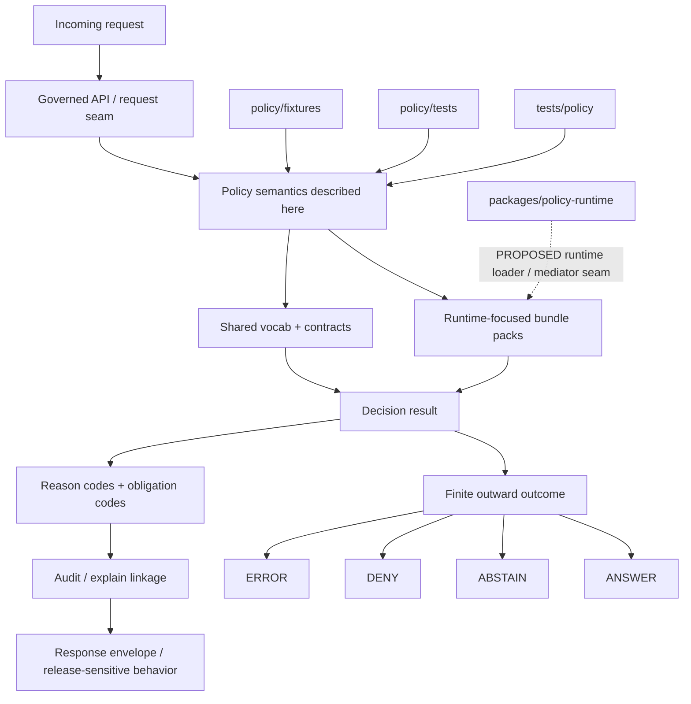

<!-- [KFM_META_BLOCK_V2]
doc_id: kfm://doc/<uuid-NEEDS-VERIFICATION>
title: Policy Runtime
type: standard
version: v1
status: draft
owners: @bartytime4life
created: 2026-03-22
updated: 2026-03-23
policy_label: public
related: [../README.md, ../bundles/README.md, ../bundles/runtime/README.md, ../fixtures/README.md, ../tests/README.md, ../../tests/README.md, ../../tests/policy/README.md, ../../contracts/README.md, ../../schemas/README.md, ../../.github/workflows/README.md]
tags: [kfm, policy, runtime]
notes: [doc_id placeholder pending repo-backed document registry verification, dates grounded in current public file history on main, owner grounded in .github/CODEOWNERS]
[/KFM_META_BLOCK_V2] -->

# Policy Runtime

_Runtime-facing policy semantics, decision coordination, and CI/runtime parity for KFM trust-bearing responses, publication decisions, and visible negative states._

> **Status:** experimental  
> **Owners:** `@bartytime4life`  
>     
>
> **Repo fit:** `policy/policy-runtime/README.md` · Up: [`../README.md`](../README.md) · Related: [`../bundles/README.md`](../bundles/README.md), [`../bundles/runtime/README.md`](../bundles/runtime/README.md), [`../fixtures/README.md`](../fixtures/README.md), [`../tests/README.md`](../tests/README.md), [`../../tests/policy/README.md`](../../tests/policy/README.md), [`../../contracts/README.md`](../../contracts/README.md), [`../../schemas/README.md`](../../schemas/README.md), [`../../.github/workflows/README.md`](../../.github/workflows/README.md)
>
> **Quick jumps:** [Scope](#scope) · [Repo fit](#repo-fit) · [Inputs](#accepted-inputs) · [Exclusions](#exclusions) · [Directory tree](#directory-tree) · [Quickstart](#quickstart) · [Usage](#usage) · [Diagram](#runtime-policy-shape) · [Tables](#boundary-matrix) · [Task list](#task-list--definition-of-done) · [FAQ](#faq) · [Appendix](#appendix)

> [!IMPORTANT]
> This directory is a **runtime-policy documentation and coordination seam**, not proof of a mounted runtime implementation.
>
> Keep a hard boundary between:
> 1. **policy artifacts** such as rule packs, fixtures, and policy tests, and
> 2. **runtime glue** such as bundle loaders, decision mediators, or request adapters, which belong in a verified runtime package path only after the repo proves them.

---

## Scope

`policy/policy-runtime/` documents how KFM policy behaves **at request time and at release-significant runtime seams**.

This README exists to keep the policy/runtime boundary inspectable. It is the place to describe:

- finite runtime outcomes
- decision/result grammar
- reason and obligation vocabulary expectations
- CI/runtime semantic parity
- explainability and audit-link expectations
- handoff points between policy bundles, fixtures, tests, contracts, schemas, and any future runtime package

### Status posture used here

| Label | Meaning in this directory |
|---|---|
| **CONFIRMED** | Present in the current public repo snapshot or explicitly established by attached doctrinal material. |
| **INFERRED** | Strongly implied by nearby docs and directory relationships, but not directly proven as mounted implementation. |
| **PROPOSED** | Recommended structure or operating rule that fits KFM doctrine and current repo patterns. |
| **UNKNOWN** | Not verified from the current public repo surfaces or attached corpus. |
| **NEEDS VERIFICATION** | Review item before treating this README as implementation truth. |

[Back to top](#policy-runtime)

---

## Repo fit

### Why this README exists

The public repo exposes `policy/` as a first-class top-level area, and the current `main` branch also exposes a dedicated `policy/policy-runtime/` subtree. At the same time, the adjacent policy and test docs repeatedly warn against converting documentation seams into unverified implementation claims.

That makes this file responsible for one thing above all:

**keeping the runtime-policy boundary explicit without pretending the mounted runtime is already proven.**

### Current public-main snapshot

| Path | Role here | Confidence |
|---|---|---|
| `policy/policy-runtime/README.md` | This boundary and coordination document | **CONFIRMED** |
| `policy/bundles/README.md` | Bundle-lane directory contract and executable-rule placement guidance | **CONFIRMED** |
| `policy/bundles/runtime/README.md` | Runtime bundle subtree scaffold | **CONFIRMED path / scaffold-only current snapshot** |
| `policy/fixtures/README.md` | Policy fixture lane | **CONFIRMED path / README-only current snapshot** |
| `policy/tests/README.md` | Bundle-local policy assertion lane | **CONFIRMED path / README-only current snapshot** |
| `tests/policy/README.md` | Repo-facing policy behavior proof lane | **CONFIRMED path / README-only current snapshot** |
| `../../contracts/README.md` | Stronger working signal for machine-readable trust-bearing contracts | **CONFIRMED** |
| `../../schemas/README.md` | Secondary schema surface with explicit drift cautions | **CONFIRMED** |
| `../../.github/workflows/README.md` | Workflow policy/documentation seam; current public `main` shows README only | **CONFIRMED path / README-only current snapshot** |
| `packages/policy-runtime/` | Possible future runtime implementation seam for loaders/mediators/adapters | **PROPOSED** |

### Practical interpretation

Use this directory to explain runtime policy behavior and to point maintainers to the correct artifact homes.

Do **not** use it to imply that the repo already contains:

- a mounted policy decision point
- request-time bundle loaders
- live OPA/Rego wiring
- merge-blocking runtime policy workflows on the current public branch
- a verified `packages/policy-runtime/` implementation

[Back to top](#policy-runtime)

---

## Accepted inputs

The following content belongs here:

- runtime outcome grammar and response semantics
- mapping notes between policy decisions and outward API/UI behavior
- documentation of required joins such as `policy_bundle_version`, `reason_codes`, `obligation_codes`, `audit_ref`, or equivalent runtime trace handles
- explain-trace expectations for request-time decisions
- CI/runtime parity notes for policy evaluation
- references to runtime-focused bundle packs, fixtures, and tests
- review checklists for runtime-significant policy changes
- correction and withdrawal behavior where runtime decisions affect public meaning

### Typical examples

- “What does `DENY` mean on a public request surface?”
- “Which obligations must survive into the outward envelope?”
- “Which fixtures prove runtime abstention behavior?”
- “Where do runtime policy bundles live versus contract files?”
- “How should a corrected or withdrawn release affect runtime answers?”

[Back to top](#policy-runtime)

---

## Exclusions

The following do **not** belong in this directory:

| Does **not** belong here | Put it here instead |
|---|---|
| Executable policy bundles and rule files | [`../bundles/runtime/README.md`](../bundles/runtime/README.md) and that subtree |
| Runtime policy fixtures | [`../fixtures/README.md`](../fixtures/README.md) |
| Bundle-local policy assertions | [`../tests/README.md`](../tests/README.md) |
| Repo-facing policy behavior proofs | [`../../tests/policy/README.md`](../../tests/policy/README.md) |
| Canonical contract authority for shared runtime objects | [`../../contracts/README.md`](../../contracts/README.md) |
| Competing schema families that drift from contract authority | Reconcile at `../../contracts/` first |
| Secrets, tokens, policy credentials, signing material | Secret manager / verified infra path |
| HTTP handlers, bundle loaders, decision mediators, adapter code | Verified runtime package such as `packages/policy-runtime/` |
| Product-surface copy and interaction design | Product/app/UI docs |
| Ad hoc scratch notes or one-off experiments | issue / ADR / runbook / draft location with explicit scope |

### Core rule

This directory should **explain** runtime policy.  
It should not quietly become the place where runtime policy is **implemented by accident**.

[Back to top](#policy-runtime)

---

## Directory tree

### Current public-main shape

```text
policy/
├── README.md
├── bundles/
│   ├── README.md
│   └── runtime/
│       └── README.md
├── fixtures/
│   └── README.md
├── policy-runtime/
│   └── README.md
└── tests/
    └── README.md

tests/
└── policy/
    └── README.md

.github/
└── workflows/
    └── README.md
```

### Current directory-local shape

```text
policy/policy-runtime/
└── README.md
```

### Doctrine-aligned responsibility map

```text
policy/
├── bundles/
│   └── runtime/          # runtime-focused rule packs / manifests / bundle notes
├── fixtures/             # valid / invalid / deny / abstain / correction fixtures
├── tests/                # bundle-local parity checks and negative-path policy assertions
└── policy-runtime/
    └── README.md         # this boundary + coordination surface

tests/
└── policy/               # repo-facing policy behavior proofs and trust-bearing regressions

contracts/
├── v1/                   # canonical object shapes and contract families
├── fixtures/             # contract-level valid / invalid examples
└── README.md

schemas/
└── README.md             # secondary schema surface; drift risk if treated as co-equal authority

packages/
└── policy-runtime/       # PROPOSED runtime loader / mediator / adapter package
```

> [!NOTE]
> The map above is intentionally mixed:
> - the **current public-main tree** is repo-visible
> - the **responsibility split** is doctrine-aligned
> - the **runtime package seam** remains **PROPOSED** until a mounted implementation proves it

[Back to top](#policy-runtime)

---

## Quickstart

### 1) Inspect the runtime-policy seam

```bash
find policy -maxdepth 4 \
  \( -path './policy/policy-runtime' \
  -o -path './policy/bundles/runtime' \
  -o -path './policy/fixtures' \
  -o -path './policy/tests' \) \
  -print
```

### 2) Inspect repo-facing policy proof neighbors

```bash
find tests -maxdepth 4 \
  \( -path './tests/policy' -o -path './tests/policy/*' \) \
  -print
```

### 3) Inspect contract and schema neighbors before editing runtime semantics

```bash
find contracts schemas -maxdepth 4 -type f | sort
```

### 4) Search for finite runtime outcomes and policy vocabulary

```bash
grep -RInE 'ANSWER|ABSTAIN|DENY|ERROR|reason_codes|obligation_codes|policy_bundle_version|audit_ref' \
  policy tests contracts schemas .github 2>/dev/null
```

### 5) Check whether workflow-backed policy gates are actually present

```bash
find .github/workflows -maxdepth 2 -type f | sort
grep -RInE 'opa|rego|conftest|policy' .github/workflows 2>/dev/null
```

### 6) Confirm whether a runtime implementation seam exists before documenting it as fact

```bash
find packages -maxdepth 3 -type d -name 'policy-runtime' 2>/dev/null
```

> [!WARNING]
> If the mounted checkout does **not** prove a runtime package, keep all package-level references in this README marked **PROPOSED** or **NEEDS VERIFICATION**.

[Back to top](#policy-runtime)

---

## Usage

### When you change runtime outcomes or decision semantics

1. Update the adjacent policy docs first so runtime meaning stays aligned with [`policy/README.md`](../README.md).
2. Reconcile outward semantics with `contracts/` before adding local prose.
3. Add or update fixtures for:
   - allow / answer
   - abstain
   - deny
   - error
   - correction-sensitive cases where applicable
4. Check that docs, fixtures, and tests still describe the same finite grammar.

### When you add a runtime-focused policy family

1. Put executable rule content in `../bundles/runtime/`.
2. Put examples and negative cases in `../fixtures/`.
3. Put bundle-local assertions in `../tests/`.
4. Put repo-facing trust and regression proof in `../../tests/policy/` when the new family affects cross-surface runtime behavior.
5. Add a short entry here only if the new rule family changes how runtime decisions are interpreted by Explore, Dossier, Story, Focus, Compare, Export, or review surfaces.

### When CI and runtime semantics drift

Treat that as a trust failure, not a wording issue.

Use this directory to record:

- what drift occurred
- which path was stronger (`CI`, `runtime`, or contract authority)
- what fixtures were added to prevent recurrence
- whether the incident requires correction or withdrawal behavior in public surfaces

### When public meaning can change

If a runtime decision changes what a user can see or rely on, document the expected relationship between:

- decision
- obligation
- outward envelope
- evidence linkage
- audit linkage
- correction or withdrawal behavior

[Back to top](#policy-runtime)

---

## Runtime policy shape



### Reading rule for the diagram

- **Solid lines** represent the runtime-policy meaning this README should describe.
- **Dashed line** represents a likely implementation seam that must stay **PROPOSED** until verified.
- **Finite outcome set** is intentional: runtime trust depends on explicit negative states, not fallback prose.

[Back to top](#policy-runtime)

---

## Boundary matrix

| Surface | Primary job | Must not do | Status |
|---|---|---|---|
| `policy/policy-runtime/` | Explain runtime policy behavior and boundaries | Pretend runtime implementation exists because the directory exists | **CONFIRMED path** |
| `policy/bundles/runtime/` | Hold runtime-focused rule packs / bundle notes | Become the canonical contract home | **CONFIRMED path / scaffold-only current snapshot** |
| `policy/fixtures/` | Hold valid/invalid/deny/abstain/correction examples | Replace real tests | **CONFIRMED path / README-only current snapshot** |
| `policy/tests/` | Hold bundle-local policy assertions and parity checks | Quietly diverge from runtime behavior | **CONFIRMED path / README-only current snapshot** |
| `tests/policy/` | Hold repo-facing policy behavior proofs | Drift from contract/runtime semantics while still passing prose review | **CONFIRMED path / README-only current snapshot** |
| `contracts/` | Own canonical shared object shapes and vocabularies | Be bypassed by local one-off schemas | **CONFIRMED** |
| `schemas/` | Remain a secondary schema surface unless authority is explicitly redefined | Drift into a competing schema universe | **CONFIRMED risk seam** |
| `.github/workflows/` | Carry workflow-backed gates when they exist | Be described here as current enforcement if only README scaffolding is present | **CONFIRMED path / README-only current snapshot** |
| `packages/policy-runtime/` | Load bundles, mediate decisions, adapt to runtime request flow | Be documented here as implemented without proof | **PROPOSED** |

[Back to top](#policy-runtime)

---

## Runtime result grammar

| Outcome | Meaning | Minimum runtime expectation | Public-surface consequence |
|---|---|---|---|
| `ANSWER` | A supported response may be emitted | policy allow, evidence linkage, outward envelope, audit linkage | show answer with traceable support |
| `ABSTAIN` | Evidence is insufficient or scope must narrow | explicit abstention semantics, not silent omission | preserve trust by refusing unsupported synthesis |
| `DENY` | Policy blocks the action or surface | deny result plus visible reason class / obligation handling as allowed | fail closed rather than leak or improvise |
| `ERROR` | Runtime could not complete safely | error path must remain accountable and non-fabricating | do not convert operational failure into plausible prose |

### Working interpretation

There is **no uncited fifth outcome**.

If a case does not qualify as `ANSWER`, it must remain visibly negative, constrained, or incomplete rather than being smoothed over for convenience.

[Back to top](#policy-runtime)

---

## Runtime-facing fields that must stay explicit

| Field or concept | Why it matters | Where authority should live |
|---|---|---|
| `reason_codes` | Makes denials, abstentions, and holds reconstructable | shared vocab / contract authority |
| `obligation_codes` | Carries required follow-on behavior | shared vocab / contract authority |
| `policy_bundle_version` | Lets runtime behavior be traced to a specific rule set | policy + contract seam |
| `audit_ref` | Connects user-visible behavior to runtime and review history | runtime / audit seam |
| evidence refs | Prevent unsupported “citation-like” prose | contracts + evidence resolver seam |
| correction / withdrawal refs | Keep change visible instead of silent | correction / release seam |
| finite outcome enum | Preserves fail-closed behavior | outward response contract |

[Back to top](#policy-runtime)

---

## Task list / definition of done

### Minimum review gate for this README

- [ ] Mounted checkout inspected before claiming implementation facts.
- [ ] All relative links in this README resolve.
- [ ] Any mention of runtime glue remains **PROPOSED** unless the package path is confirmed.
- [ ] Any mention of OPA/Rego stays scoped as starter direction unless actual mounted bundles/tests are visible.
- [ ] `contracts/` remains the named authority for shared runtime object shapes.
- [ ] `schemas/` is not silently treated as a second sovereign schema home.
- [ ] Runtime outcome grammar here matches adjacent policy and contract docs.
- [ ] At least one negative-path example exists for deny or abstain behavior before this README is called “stable.”
- [ ] CI/runtime parity expectations are documented without implying checked-in workflow YAML that is not present.
- [ ] Correction-sensitive runtime behavior is described where public meaning can change.

### Stronger completion state

- [ ] `policy/bundles/runtime/` contains real runtime-focused rule packs.
- [ ] `policy/fixtures/` contains request/decision/result fixtures.
- [ ] `policy/tests/` contains bundle-local parity or regression checks.
- [ ] `tests/policy/` contains repo-facing policy behavior proofs.
- [ ] `contracts/` contains the canonical runtime envelope and decision-related artifacts.
- [ ] The mounted workspace confirms whether `packages/policy-runtime/` exists and what it owns.
- [ ] This README no longer has to rely on scaffold-only neighbor directories for context.

[Back to top](#policy-runtime)

---

## FAQ

### Does this directory contain the policy engine?

No. This path is the **documentation and coordination surface** for runtime policy semantics. Engine code, bundle loading, request mediation, or adapter logic must be verified elsewhere before being documented as implementation fact.

### Is `policy/policy-runtime/` the same thing as `packages/policy-runtime/`?

No.

`policy/policy-runtime/` is a repo-visible documentation seam under `policy/`.  
`packages/policy-runtime/` is a **PROPOSED** implementation seam commonly referenced by nearby doctrine. Treat them as related but not interchangeable.

### Does this README prove executable runtime policy files already exist?

No.

A README can define the boundary and expectations without proving the subtree has mounted bundles, fixtures, tests, or runtime code behind it.

### Why keep a README-only directory?

Because KFM benefits from **visible seams**. A thin directory can still be useful if it clarifies where trust-bearing responsibilities belong and prevents accidental authority mixing while implementation catches up.

### Should canonical runtime response shapes live here?

No. Put canonical shared object shapes under `contracts/`, then link to them from here.

### What is the main failure mode to avoid?

The main failure mode is **trust theater**: rich prose that makes runtime governance sound implemented when the mounted repo has not yet proven bundles, fixtures, tests, loaders, or workflow gates.

[Back to top](#policy-runtime)

---

## Appendix

<details>
<summary><strong>Verification backlog and maintainer notes</strong></summary>

### Open verification items

| Item | Current posture |
|---|---|
| Is `policy/policy-runtime/` more than a boundary seam on the public branch? | **NEEDS VERIFICATION** |
| Are runtime-focused bundles mounted under `policy/bundles/runtime/` beyond scaffold text? | **NEEDS VERIFICATION** |
| Are runtime fixtures present under `policy/fixtures/` beyond README guidance? | **NEEDS VERIFICATION** |
| Are bundle-local runtime policy tests present under `policy/tests/`? | **NEEDS VERIFICATION** |
| Are repo-facing runtime behavior proofs present under `tests/policy/`? | **NEEDS VERIFICATION** |
| Does a real `packages/policy-runtime/` package exist? | **NEEDS VERIFICATION** |
| Are merge-blocking runtime policy workflows checked in on the mounted branch? | **NEEDS VERIFICATION** |
| Which shared contracts are authoritative for runtime outcomes and decision semantics? | **NEEDS VERIFICATION** |

### Suggested inspection sequence

```bash
# 1) policy subtree
find policy -maxdepth 5 -print | sort

# 2) repo-facing policy proofs
find tests/policy -maxdepth 5 -print | sort

# 3) contract / schema overlap
find contracts schemas -maxdepth 5 -print | sort

# 4) runtime package seam
find packages -maxdepth 5 -print | sort | grep 'policy-runtime' || true

# 5) workflow evidence
find .github/workflows -maxdepth 3 -type f | sort

# 6) vocabulary and outcome semantics
grep -RInE 'ANSWER|ABSTAIN|DENY|ERROR|reason_codes|obligation_codes|policy_bundle_version' \
  policy tests contracts schemas .github 2>/dev/null
```

### PROPOSED runtime artifact families to reconcile against contracts

- `DecisionEnvelope`
- `RuntimeResponseEnvelope`
- `EvidenceBundle`
- `ReviewRecord` when separation of duty or public release review applies
- `CorrectionNotice` where runtime-visible meaning is superseded, withdrawn, or narrowed

### Maintenance note

Keep this README short on implementation claims and strong on boundaries.

When the mounted repo proves more, move authority outward to:

- `contracts/` for shared shapes
- `policy/bundles/runtime/` for executable bundle packs
- `policy/tests/` for bundle-local parity assertions
- `tests/policy/` for repo-facing runtime behavior proof
- `packages/policy-runtime/` for runtime glue

Then reduce the explanatory weight here instead of duplicating it.

</details>

[Back to top](#policy-runtime)
