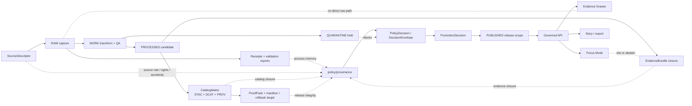

<!-- [KFM_META_BLOCK_V2]
doc_id: kfm://doc/TODO-NEEDS-UUID
title: Provenance Policy
type: standard
version: v1
status: draft
owners: TODO-NEEDS-POLICY-OWNER
created: TODO-YYYY-MM-DD
updated: 2026-04-27
policy_label: TODO-NEEDS-VERIFICATION__public_or_restricted
related: [../README.md, ../../README.md, ../../contracts/README.md, ../../schemas/README.md, ../../data/receipts/README.md, ../../data/proofs/README.md, ../../data/catalog/README.md, ../../tools/attest/README.md, ../../tools/validators/promotion_gate/README.md, ../../tests/policy/README.md]
tags: [kfm, policy, provenance, evidence, receipts, proofs, promotion, catalog, fail-closed]
notes: [Target path supplied by current task. Active checkout, owner, doc_id, created date, policy label, exact sibling inventory, policy runner, and CI wiring remain NEEDS VERIFICATION.]
[/KFM_META_BLOCK_V2] -->

<a id="top"></a>

# Provenance Policy

Fail-closed policy lane for checking whether KFM evidence, receipts, catalog closure, proof objects, and release candidates are traceable enough to move forward.


> [!IMPORTANT]
> **Status:** experimental  
> **Owners:** `TODO-NEEDS-POLICY-OWNER`  
> **Path:** `policy/provenance/README.md`  
> **Evidence posture:** CONFIRMED doctrine from attached KFM corpus; INFERRED lane role from the requested path; UNKNOWN active-branch implementation depth.  
> **Quick jumps:** [Scope](#scope) · [Repo fit](#repo-fit) · [Accepted inputs](#accepted-inputs) · [Exclusions](#exclusions) · [Directory tree](#directory-tree) · [Quickstart](#quickstart) · [Usage](#usage) · [Diagram](#diagram) · [Policy tables](#policy-tables) · [Task list](#task-list--definition-of-done) · [FAQ](#faq) · [Appendix](#appendix)

> [!WARNING]
> This README defines the lane contract. It does **not** prove that `policy/provenance/` already contains runnable Rego, Conftest fixtures, workflow enforcement, branch protection, or emitted `PolicyDecision` artifacts in the active checkout.

---

## Scope

`policy/provenance/` is the policy-facing place for provenance rules that decide whether a candidate artifact, dataset version, runtime response, map layer, story export, or promotion package has enough traceable support to proceed.

In KFM terms, this lane protects the path from fluent or visually persuasive output to inspectable evidence. It should help answer:

- Does every consequential claim resolve from `EvidenceRef` to a policy-safe `EvidenceBundle`?
- Are run receipts and validation reports available without pretending they are release proof?
- Does the candidate close the catalog triplet before publication?
- Are proof packs, manifests, attestations, checksums, rollback targets, and correction references attached to the exact release they justify?
- Do unknown rights, unresolved sensitivity, stale sources, missing citations, or broken lineage fail closed?

This lane is **policy**, not storage. It should express rules, fixtures, denials, obligations, and decision shape. It should not become a second catalog, second proof store, or hidden publication script.

[Back to top](#top)

---

## Repo fit

`policy/provenance/` is a child lane of `policy/`. It is upstream of promotion and runtime trust decisions, but downstream of schemas, contracts, source descriptors, receipts, catalog records, and proof artifacts.

| Relation | Surface | Status in this README | Boundary |
| --- | --- | --- | --- |
| Parent policy lane | [`../README.md`](../README.md) | NEEDS VERIFICATION in active checkout | Repo-wide policy orientation and shared policy vocabulary. |
| Root orientation | [`../../README.md`](../../README.md) | NEEDS VERIFICATION in active checkout | KFM-wide purpose, trust posture, and contributor orientation. |
| Contract authority | [`../../contracts/README.md`](../../contracts/README.md) | NEEDS VERIFICATION in active checkout | Defines object contracts; this lane only evaluates policy over them. |
| Schema authority | [`../../schemas/README.md`](../../schemas/README.md) | NEEDS VERIFICATION in active checkout | Defines machine-readable shapes; this lane should not fork schema law. |
| Receipts | [`../../data/receipts/README.md`](../../data/receipts/README.md) | NEEDS VERIFICATION in active checkout | Process memory and validation outputs consumed by provenance policy. |
| Proofs | [`../../data/proofs/README.md`](../../data/proofs/README.md) | NEEDS VERIFICATION in active checkout | Release-significant proof packs and attestations; not duplicated here. |
| Catalog closure | [`../../data/catalog/README.md`](../../data/catalog/README.md) | NEEDS VERIFICATION in active checkout | STAC/DCAT/PROV closure target consumed by policy checks. |
| Attestation helpers | [`../../tools/attest/README.md`](../../tools/attest/README.md) | NEEDS VERIFICATION in active checkout | Signing, digest, and attestation helpers; this lane only requires or evaluates their outputs. |
| Promotion gate | [`../../tools/validators/promotion_gate/README.md`](../../tools/validators/promotion_gate/README.md) | NEEDS VERIFICATION in active checkout | Validator/runtime caller that may invoke provenance policy. |
| Policy tests | [`../../tests/policy/README.md`](../../tests/policy/README.md) | NEEDS VERIFICATION in active checkout | Expected home for policy fixtures and regression tests. |

> [!NOTE]
> If the active repo proves different homes for contracts, schemas, tests, or validation runners, update this README through an ADR-backed path correction instead of creating parallel authority.

[Back to top](#top)

---

## Accepted inputs

This directory may define policy rules and tests over these provenance-bearing inputs:

- `SourceDescriptor` summaries with source role, rights, sensitivity, cadence, steward, access method, and freshness posture.
- `IngestReceipt`, `RunReceipt`, `AIReceipt`, and `ValidationReport` references used as process memory.
- `EvidenceRef` and resolved `EvidenceBundle` references for inspectable claims.
- `CatalogMatrix` or equivalent catalog-closure reports that connect STAC, DCAT, PROV, assets, lineage, and evidence references.
- `ReleaseManifest`, `MapReleaseManifest`, `GeoManifest`, `ProofPack`, or equivalent release-scope manifests.
- `PolicyDecision`, `DecisionEnvelope`, `PromotionDecision`, `ReviewRecord`, `CorrectionNotice`, and rollback target metadata.
- Public-safe fixtures that prove allow, deny, hold/abstain, and error behavior without live sources.
- Policy modules that are small, reviewable, and bound to the repo’s confirmed policy runner.

[Back to top](#top)

---

## Exclusions

Do **not** put these here:

| Excluded item | Why not | Preferred surface |
| --- | --- | --- |
| RAW, WORK, QUARANTINE, or PROCESSED data | Policy must not become data storage. | `data/raw/`, `data/work/`, `data/quarantine/`, `data/processed/` |
| Generated run receipts or validation reports | Receipts are process memory, not policy code. | `data/receipts/` |
| Release proof packs, signatures, attestations, or checksum bundles | Proofs must stay attached to the exact release they justify. | `data/proofs/`, `tools/attest/` |
| Catalog records | Catalog closure is evaluated here, not authored here. | `data/catalog/` |
| JSON Schema or contract definitions | Avoid schema-home drift. | `schemas/`, `contracts/` |
| Live connector code or source watchers | Provenance policy should consume their outputs, not run them. | `pipelines/`, `tools/probes/`, `.github/workflows/` |
| Direct model prompts, model adapters, or free-form AI answers | AI is downstream of evidence and policy. | governed AI/runtime surfaces |
| Secrets, private signing keys, provider tokens, or steward-only locations | Policy docs and fixtures must not leak restricted operational material. | approved secret manager or access-controlled store |

[Back to top](#top)

---

## Directory tree

The active branch inventory is UNKNOWN. The tree below is a **minimum target shape** to verify or adapt, not a claim of current files.

```text
policy/provenance/
├── README.md                         # this lane contract
├── source_admission.rego             # PROPOSED: source descriptor / rights / sensitivity checks
├── evidence_closure.rego             # PROPOSED: EvidenceRef -> EvidenceBundle closure checks
├── catalog_closure.rego              # PROPOSED: STAC + DCAT + PROV closure checks
├── release_integrity.rego            # PROPOSED: manifest, digest, proof, rollback checks
├── runtime_traceability.rego         # PROPOSED: runtime response / Focus / Drawer provenance checks
└── fixtures/                         # PROPOSED: tiny policy inputs only, no live source mirrors
    ├── allow_minimal_release.json
    ├── deny_missing_evidence_bundle.json
    ├── deny_unknown_rights.json
    ├── deny_unresolved_sensitivity.json
    ├── hold_stale_source.json
    └── error_malformed_policy_input.json
```

[Back to top](#top)

---

## Quickstart

Start by proving the active checkout before trusting any path, runner, or fixture name.

```bash
# Non-destructive inspection from repo root.
git status --short
git branch --show-current || true

find policy/provenance -maxdepth 3 -type f | sort 2>/dev/null || true
find policy tests schemas contracts data tools .github -maxdepth 3 -type f | sort | head -300
```

After the repo’s policy runner is confirmed, wire the smallest fixture-backed check. The command below is intentionally marked **NEEDS VERIFICATION** because this session did not verify OPA, Conftest, workflow YAML, or package scripts in a mounted checkout.

```bash
# NEEDS VERIFICATION: example only until the active repo confirms the policy toolchain.
conftest test \
  --policy policy/provenance \
  policy/provenance/fixtures/*.json
```

> [!TIP]
> The first useful implementation is not a large policy bundle. It is one tiny valid fixture, one tiny invalid fixture, one fail-closed rule, and one CI-visible result.

[Back to top](#top)

---

## Usage

### What this lane should enforce

Use provenance policy at the points where KFM could otherwise publish, answer, export, or display something more confidently than its evidence allows.

| Gate | Candidate question | Fail-closed examples |
| --- | --- | --- |
| Source admission | Is the source allowed to participate in this claim or release class? | Missing rights, unknown source role, unresolved sensitivity, stale source caveat not carried forward. |
| Lifecycle transition | Is the candidate allowed to move toward `PROCESSED`, `CATALOG`, `TRIPLET`, or `PUBLISHED`? | Attempted publication from RAW/WORK, unresolved QUARANTINE reason, validation errors. |
| Evidence closure | Can each consequential claim resolve to a policy-safe `EvidenceBundle`? | Missing bundle, unresolved `EvidenceRef`, citation mismatch, restricted evidence exposed to public surface. |
| Catalog closure | Do STAC, DCAT, PROV, manifests, assets, and evidence refs cross-link without guesswork? | Broken catalog refs, missing provenance entity/activity/agent links, asset hash missing. |
| Release integrity | Does the release scope have proof, manifest, rollback, and correction hooks? | Detached proof pack, no rollback target, unsigned or unverifiable manifest where required. |
| Runtime and export | Can the API, Evidence Drawer, Focus Mode, story, or export show trust state honestly? | Direct raw path, direct model client, hidden DENY/ABSTAIN, missing audit ref, missing correction state. |

### Expected decision posture

A provenance policy decision should be machine-readable and reviewable. Exact enums remain **NEEDS VERIFICATION** until the active schemas are inspected, but decisions should carry at least:

- candidate identity
- checked transition or surface
- outcome
- reason codes
- obligations or remediation
- policy version or `spec_hash`
- evidence/catalog/proof references checked
- audit or receipt reference
- reviewer handoff when manual review is required

> [!IMPORTANT]
> A polished map, narrative, export, or Focus answer does not compensate for missing provenance. KFM should prefer a visible denial or abstention over a plausible unsupported result.

[Back to top](#top)

---

## Diagram



[Back to top](#top)

---

## Policy tables

### Provenance rule matrix

| Rule family | Minimum pass condition | Deny or hold when |
| --- | --- | --- |
| Source role | Every source has declared role, owner/steward, rights, cadence, and freshness basis. | Source role is unknown, rights are unverified, or source caveats are not carried forward. |
| Evidence resolution | Every public claim has `EvidenceRef` values resolvable to policy-safe `EvidenceBundle` objects. | Evidence is missing, restricted, stale, contradicted, or not linked to the claim scope. |
| Receipt availability | Process memory is queryable enough for replay, audit, correction, and release review. | Candidate cannot identify transform inputs, validation reports, run context, or tool/spec version. |
| Catalog closure | STAC/DCAT/PROV or equivalent catalog records cross-link dataset, assets, lineage, agents, activities, and evidence refs. | Any catalog leg is missing or cannot be joined to the release candidate. |
| Proof attachment | Release proof is attached to the exact release scope it supports. | Proof is detached, generic, unverifiable, or points to a different artifact/digest/version. |
| Sensitivity and rights | Public output carries rights class, sensitivity posture, transforms, obligations, and review state. | Exact sensitive location, private data, living-person/DNA, cultural/archaeological, critical infrastructure, or restricted evidence is exposed without approved transform/review. |
| Rollback and correction | Release candidate declares rollback target or correction path appropriate to significance. | Public-facing release has no rollback target, correction notice path, or supersession behavior. |
| Runtime trust | Runtime surfaces expose finite outcomes, citations, audit refs, and negative states. | UI/AI/export hides missing evidence, citation failure, denied policy, stale source, or withdrawn release. |

### Artifact boundary matrix

| Object | This lane may require it | This lane may store it | Notes |
| --- | ---: | ---: | --- |
| `SourceDescriptor` | Yes | No | Source admission belongs upstream in registry/contracts. |
| `RunReceipt` / `IngestReceipt` / `ValidationReport` | Yes | No | Keep receipts in receipt surfaces. |
| `EvidenceBundle` | Yes | No | Resolve and check; do not duplicate full bundles here. |
| `CatalogMatrix` | Yes | No | Evaluate closure; catalog owns records. |
| `ReleaseManifest` / `GeoManifest` | Yes | No | Evaluate release scope and integrity. |
| `ProofPack` / attestation | Yes | No | Proofs remain attached to release artifacts. |
| `PolicyDecision` | Yes | Maybe | Store only if repo convention says policy decisions live here; otherwise emit to receipts/proofs/reports. |
| Tiny test fixtures | Yes | Yes | Fixtures should be public-safe and intentionally minimal. |

[Back to top](#top)

---

## Task list / definition of done

Before this lane is considered active:

- [ ] Confirm `policy/provenance/` exists or create it through a small PR.
- [ ] Verify the owner from `CODEOWNERS` or assign a lane owner in the same PR.
- [ ] Verify whether the repo uses OPA/Rego, Conftest, another policy runner, or a custom validator.
- [ ] Confirm schema and contract homes before naming exact imports.
- [ ] Add one allowed fixture and at least four denied/held fixtures:
  - [ ] missing `EvidenceBundle`
  - [ ] unknown rights
  - [ ] unresolved sensitivity
  - [ ] broken catalog closure
  - [ ] detached proof or missing rollback target
- [ ] Ensure the policy emits machine-readable reasons and obligations.
- [ ] Add or link tests in the repo’s confirmed test location.
- [ ] Wire CI only after local fixture behavior is deterministic.
- [ ] Confirm this README’s relative links against the active checkout.
- [ ] Update `created`, `owners`, `policy_label`, and `doc_id` in the KFM Meta Block.
- [ ] Record any path or enum decision in an ADR if the active repo differs from this README.

[Back to top](#top)

---

## FAQ

### Why is provenance policy separate from proof storage?

Policy rules decide whether provenance is sufficient. Proof storage preserves release-significant evidence. Combining them would make it harder to audit whether a release was blocked by policy, missing proof, or broken storage.

### Can this lane sign artifacts?

No. Signing and attestation helpers belong in `tools/attest/` or another verified helper surface. This lane may require signature evidence or verify that a signature reference exists, but it should not own signing keys or signing workflows.

### Can a candidate pass when rights are unknown?

No. KFM’s default posture is fail-closed when rights, sensitivity, source terms, or release permissions are unclear.

### Should policy fixtures include real sensitive records?

No. Use tiny public-safe fixtures that prove the rule behavior without mirroring restricted evidence, exact sensitive locations, secrets, private identity data, or steward-only context.

### Is this README proof that promotion gates already call provenance policy?

No. That wiring remains **NEEDS VERIFICATION** until workflow YAML, validator entrypoints, and passing/failing CI runs are inspected in the active repository.

[Back to top](#top)

---

## Appendix

<details>
<summary>Illustrative policy input shape — not a confirmed schema</summary>

```json
{
  "candidate_id": "candidate:example-release",
  "transition": "catalog_to_published",
  "surface": "published_layer",
  "source_descriptors": [
    {
      "source_id": "source:example",
      "source_role": "authoritative_context",
      "rights_status": "public_release_allowed",
      "sensitivity_status": "public_safe",
      "freshness_status": "current"
    }
  ],
  "evidence": {
    "evidence_refs": ["evidence_ref:example-claim-1"],
    "bundle_refs": ["evidence_bundle:example-claim-1"],
    "citation_validation": "pass"
  },
  "catalog": {
    "catalog_matrix_ref": "catalog_matrix:example-release",
    "stac_closed": true,
    "dcat_closed": true,
    "prov_closed": true
  },
  "release": {
    "release_manifest_ref": "release_manifest:example-release",
    "proof_pack_ref": "proof_pack:example-release",
    "rollback_target": "release:previous",
    "correction_path": "correction_notice:example"
  },
  "review": {
    "review_state": "approved",
    "review_ref": "review:example"
  }
}
```

</details>

<details>
<summary>Illustrative decision shape — not a confirmed schema</summary>

```json
{
  "decision_id": "policy_decision:example",
  "candidate_id": "candidate:example-release",
  "policy_lane": "policy/provenance",
  "outcome": "DENY",
  "reason_codes": [
    "MISSING_EVIDENCE_BUNDLE",
    "CATALOG_PROV_NOT_CLOSED"
  ],
  "obligations": [
    "Resolve every EvidenceRef to a policy-safe EvidenceBundle.",
    "Close PROV links before promotion."
  ],
  "checked_refs": {
    "source_descriptors": [],
    "receipts": [],
    "catalog_matrix": null,
    "release_manifest": null,
    "proof_pack": null
  },
  "checked_at": "NEEDS_VERIFICATION",
  "policy_version": "NEEDS_VERIFICATION"
}
```

</details>

<details>
<summary>Open verification backlog</summary>

- Confirm whether `policy/provenance/` already exists in the active branch.
- Confirm policy runner and exact invocation.
- Confirm whether `PolicyDecision` artifacts are stored under policy, receipts, proofs, or reports.
- Confirm exact enum set for policy decisions versus runtime response outcomes.
- Confirm how promotion gates consume provenance decisions.
- Confirm whether catalog closure uses `CatalogMatrix`, direct STAC/DCAT/PROV validation, or both.
- Confirm whether proof packs and attestations are mandatory for all releases or only release-significant artifacts.
- Confirm owner, policy label, and access posture for this README.
- Confirm if any provenance policy content should be restricted because it exposes security-sensitive controls.
- Confirm relative links before merge.

</details>

[Back to top](#top)
