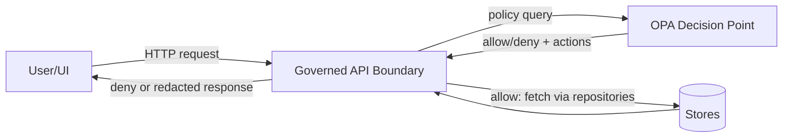
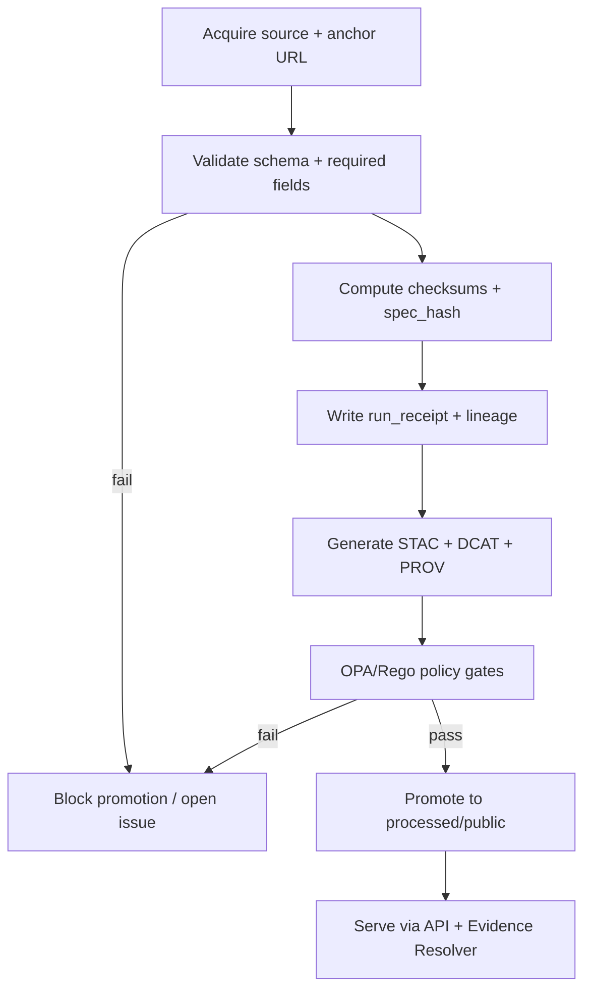

<!--
File: policy/rego/kfm/README.md
KFM = Kansas Frontier Matrix
This README is a governed artifact: changes require review and policy tests.
-->

# KFM Policy Pack (OPA/Rego) 🛡️
[](https://www.openpolicyagent.org/)
[](https://www.openpolicyagent.org/docs/latest/policy-language/)
[](https://www.conftest.dev/)
[](#fail-closed-by-design)
[](#focus-mode-policies-kfmai)

KFM policies are **the central governance enforcement layer** for:
- **CI merge-blocking gates** (Conftest + `opa test`)
- **Runtime authorization & redaction decisions** (OPA sidecar or embedded evaluation)
- **Dataset promotion gates** (Raw → Work → Processed) to prevent publishing unverified artifacts

> ✅ KFM non-negotiables enforced by policy (and validators/CI):
> - **Trust membrane:** UI/external clients never access DBs directly; all access goes through governed APIs.
> - **Fail-closed:** policy checks default deny, and errors/missing inputs deny.
> - **Promotion gates:** no dataset is promoted/published without **STAC/DCAT/PROV** + checksums + validation.
> - **Focus Mode:** must **cite or abstain**, and always produce an `audit_ref`.  
>
> These invariants are treated as hard system-level contracts. (See “Core Invariants” below.)  
> _If you find a way to bypass these with new code, that is a bug: fix the system, don’t weaken policy._

---

## Table of Contents
- [Core Invariants](#core-invariants)
- [What Lives Here](#what-lives-here)
- [Fail-Closed by Design](#fail-closed-by-design)
- [Directory Layout](#directory-layout)
- [How Policies Are Used](#how-policies-are-used)
- [Policy Packages and Decisions](#policy-packages-and-decisions)
- [Input Contracts](#input-contracts)
- [Outputs and Decision Shape](#outputs-and-decision-shape)
- [Running Locally](#running-locally)
- [Testing](#testing)
- [CI Wiring](#ci-wiring)
- [Emergency Deny Switch](#emergency-deny-switch)
- [Governance and Change Control](#governance-and-change-control)
- [Troubleshooting](#troubleshooting)
- [References](#references)

---

## Core Invariants

These are **KFM-wide guarantees** this policy pack must uphold (or explicitly support upholding):

| Invariant | Why it exists | Minimum enforcement (policy + system) |
|---|---|---|
| No UI direct DB access (Trust Membrane) | Prevents bypassing governance/audit | Network isolation + API gateway boundary + code/infra checks |
| No dataset promotion without STAC/DCAT/PROV | Ensures traceability and discoverability | Promotion gate rules + validators + merge-blocking CI |
| Focus Mode must cite or abstain | Prevents ungrounded/unsafe answers; enables audit | Policy rules + output schema validation + audit ledger write |
| Policy fails closed | Safety under partial failures and missing inputs | Default deny + strict input validation + “deny on error” semantics |

> **Verification step (repo):** confirm the repo’s current canonical “invariants” doc and ensure this README matches it exactly.  
> If a mismatch is found, treat it as a governance incident and reconcile with the smallest change.

---

## What Lives Here

This directory is the **OPA bundle root** (or bundle source) for KFM’s governed decisions.

### Coverage areas (expected)
- **AI answer gate**: enforce **cite-or-abstain** and sensitivity safety (`kfm.ai`)
- **Data access**: allow/deny data access based on actor role and dataset sensitivity (`kfm.data`)
- **Promotion gate**: deny publishing when required catalog/provenance artifacts are missing (`kfm.promotion`)
- **Sensitivity + redaction**: compute/require redaction actions for restricted geographies (`kfm.sensitivity`)
- **Audit invariants**: require `audit_ref` and bind decisions to policy bundle version (`kfm.audit`)
- **Story Node governance (optional)**: validate Story Node evidence/citation references are resolvable (`kfm.story`)

> ⚠️ Some exact packages/paths may vary depending on the repo layout.  
> Where specifics aren’t confirmed in the repo, this README provides **safe defaults** plus a verification checklist.

---

## Fail-Closed by Design

### Required properties
1. **Default deny** for all authorizing decisions:
   ```rego
   default allow := false
   ```
2. **Explicit allow rules only** (no “implicit” fallthrough).
3. **Deny on missing required keys** (input validation is mandatory; do not rely on runtime exceptions).
4. **Deny on policy evaluation errors**:
   - In CI: treat evaluation errors as build failures.
   - At runtime: treat evaluation errors as **deny** (and log an audit event).

### Toolchain drift guard (important)
Conftest and OPA behavior can change across versions (e.g., Rego syntax defaults). This repo must include:
- **Pinned tool versions** (OPA/Conftest/cosign validators)
- **Rego compatibility tests** to prevent silent CI drift (e.g., ensure policies run under Rego v1 defaults or explicitly pinned flags)

---

## Directory Layout

> If your repo already has a structure, align this README to match it.  
> The structure below is the **recommended** KFM layout.

```text
policy/
└─ rego/
   └─ kfm/                                           # KFM OPA policy pack (source-of-truth)
      ├─ README.md                                   # (This file) how to run, bundle layout, and fail-closed rules
      │
      ├─ data/                                       # Governed static inputs (versioned; reviewed like code)
      │  ├─ sensitivity.json                         # Sensitivity classes/flags (public/restricted + CARE/FAIR tags)
      │  ├─ license_policy.json                      # License allow/deny lists + SPDX-like IDs + attribution rules
      │  └─ config.json                              # Feature flags / emergency controls (e.g., global deny switch)
      │
      ├─ lib/                                        # Shared Rego helpers (pure functions; no policy decisions here)
      │  ├─ input_validation.rego                    # Input shape checks + safe defaults (prevents undefined behavior)
      │  ├─ strings.rego                             # String helpers (normalization, matching, formatting)
      │  └─ evidence_refs.rego                       # Citation/EvidenceRef helpers (parsing, canonical forms)
      │
      ├─ kfm/                                        # Policy modules (OPA packages: package kfm.*)
      │  ├─ ai.rego                                  # Focus Mode gate: cite-or-abstain + response validation
      │  ├─ data.rego                                # Dataset access control (allow/deny by actor/scope/sensitivity)
      │  ├─ promotion.rego                           # Promotion gates (STAC/DCAT/PROV + digests/receipts prerequisites)
      │  ├─ sensitivity.rego                         # Sensitivity constraints + redaction decisions (precision/field rules)
      │  ├─ audit.rego                               # Audit invariants (required fields + policy bundle version surfacing)
      │  └─ story.rego                               # (Optional) Story Node evidence enforcement (citations/assets rules)
      │
      └─ tests/                                      # OPA unit tests (opa test …) for each module
         ├─ ai_test.rego                             # Tests for kfm.ai (citations, abstain shape, edge cases)
         ├─ data_test.rego                           # Tests for kfm.data (deny-by-default, role/scope matrix)
         ├─ promotion_test.rego                      # Tests for kfm.promotion (missing lineage, gating behavior)
         ├─ sensitivity_test.rego                    # Tests for kfm.sensitivity (redaction vs deny, precision limits)
         ├─ audit_test.rego                          # Tests for kfm.audit (audit record requirements + bundle metadata)
         └─ story_test.rego                          # Tests for kfm.story (citation rules, required evidence refs)

```

### “Source of truth” rule
- Policies under `policy/rego/kfm/` are **the authoritative policy source**.
- Runtime deployments must load this bundle (or a signed build artifact derived from it).
- CI must run tests against this directory for every PR affecting governed artifacts.

---

## How Policies Are Used

### 1) CI / Pull Request gates (Conftest + `opa test`)
Policies run on **changed artifacts** (datasets, catalogs, Story Nodes, manifests, etc.).

**Minimum CI hardening set (recommended):**
- Validate governed Markdown + Story Nodes
- Validate STAC/DCAT/PROV for new/changed datasets
- Run OPA policy tests (default deny, cite-or-abstain)

### 2) Runtime requests (OPA decision point)
APIs call OPA before serving:
- datasets / tiles / features / downloads
- story nodes
- Focus Mode answers

### 3) Pipeline promotion gates (publish prevention)
Promotion to **processed/public** is blocked unless:
1) license present  
2) sensitivity classification present  
3) schema/geospatial checks pass  
4) checksums computed  
5) STAC/DCAT/PROV exist and validate  
6) audit event recorded  
7) human approval if sensitive  

---

## Policy Packages and Decisions

> Naming convention: `package kfm.<domain>`

### Focus Mode policies (`kfm.ai`)
**Goal:** enforce “cite-or-abstain” and sensitivity constraints for AI responses.

**Documented baseline pattern:**
```rego
package kfm.ai
default allow := false

allow if {
  input.answer.has_citations == true
  input.answer.sensitivity_ok == true
}

# Optional extension: require at least N citations for nontrivial answers.
min_citations := 1
allow if {
  input.answer.has_citations == true
  count(input.answer.citations) >= min_citations
  input.answer.sensitivity_ok == true
}
```

**Recommended behavior if evidence is insufficient:** return an abstain response with an audit reference (the API still writes an audit event).

---

### Data access policies (`kfm.data`)
**Goal:** deny by default; allow only if dataset is public or the actor has elevated role.

**Documented baseline:**
```rego
package kfm.data
default allow := false

allow if {
  input.resource.kind == "dataset"
  input.resource.sensitivity == "public"
}

allow if {
  input.resource.kind == "dataset"
  input.resource.sensitivity != "public"
  input.actor.role == "reviewer"
}

allow if {
  input.actor.role == "admin"
}
```

> **Sensitive record safety:** policies may also return an **action** like “mask coordinates” if a user is allowed only generalized geometry.

---

### Promotion gate policies (`kfm.promotion`)
**Goal:** prevent publishing or promotion when required evidence is missing:
- STAC/DCAT/PROV presence + schema validation
- checksums and run records
- license + sensitivity fields
- signed receipts/attestations (if required by the Promotion Contract)

---

### Sensitivity & redaction policies (`kfm.sensitivity`)
**Goal:** enforce sensitivity taxonomy and return required redaction actions.

Policy should be able to answer:
- Is this dataset allowed to be served to this role?
- If allowed, must results be generalized or masked?
- Is human approval required to promote?

---

### Audit policies (`kfm.audit`)
**Goal:** ensure audit invariants:
- outputs include an `audit_ref`
- decisions are traceable to the **policy bundle version/hash**
- policy denies if `audit_ref` is missing where required (e.g., Focus Mode)

---

## Input Contracts

### Common policy input envelope (recommended)
Every runtime decision should accept a consistent envelope:

```json
{
  "actor": {
    "role": "public|reviewer|admin",
    "attributes": {}
  },
  "request": {
    "endpoint": "/api/v1/ai/query",
    "context": {}
  },
  "resource": {
    "kind": "dataset|story|tile|download|ai_answer",
    "id": "dataset_id_or_story_id",
    "sensitivity": "public|restricted|high",
    "license": "CC-BY-4.0"
  },
  "answer": {
    "text": "...",
    "has_citations": true,
    "citations": [{"ref": "prov://..."}],
    "sensitivity_ok": true
  }
}
```

### Input validation is mandatory
Implement shared helpers in `lib/input_validation.rego` so every package:
- checks required keys exist
- checks types are correct
- denies if input is malformed

> **Rule:** if input is missing required keys → deny (fail closed).

---

## Outputs and Decision Shape

OPA decisions should be machine-actionable. Preferred pattern:

```json
{
  "allow": false,
  "reason": "missing_citations",
  "actions": [
    {"type": "abstain", "message": "I can't answer from verified sources for this view."}
  ],
  "audit": {
    "audit_ref": "audit_...",
    "policy_bundle_sha": "sha256:..."
  }
}
```

### Evidence references
KFM uses resolvable evidence reference schemes, e.g.:
- `prov://...`, `stac://...`, `dcat://...`, `doc://...`, `graph://...`

> **Acceptance criterion:** given any `citation.ref` in a Focus Answer, the UI can resolve it to a human-readable evidence view in ≤ 2 API calls.

---

## Running Locally

### Prereqs
- `opa` (Open Policy Agent)
- `conftest`

> **Pin versions** in tooling manifests/scripts and keep a compatibility test to detect drift.

### Quick commands
Run unit tests:
```bash
opa test -v policy/rego/kfm
```

Evaluate a decision locally:
```bash
opa eval \
  --data policy/rego/kfm \
  --input ./examples/focus_input.json \
  "data.kfm.ai.allow"
```

Conftest against a catalog directory:
```bash
conftest test data/catalog \
  --policy policy/rego/kfm \
  --all-namespaces
```

---

## Testing

### Required tests
- ✅ `opa test` unit tests for every package (at least deny-by-default, allow-happy-path)
- ✅ Golden fixtures for:
  - Focus Mode cite-or-abstain
  - dataset access restrictions
  - promotion gate failures (missing license, missing PROV, missing STAC/DCAT, checksum mismatch)
- ✅ Compatibility tests for Rego/Conftest defaults to prevent silent failures

### Example Focus Mode unit tests (pattern)
```rego
package kfm.ai_test

import data.kfm.ai

test_allow_with_citations if {
  ai.allow with input as {
    "answer": {"has_citations": true, "sensitivity_ok": true, "citations": [{"id":"c1"}]}
  }
}

test_deny_without_citations if {
  not ai.allow with input as {
    "answer": {"has_citations": false, "sensitivity_ok": true, "citations": []}
  }
}

test_deny_if_sensitivity_not_ok if {
  not ai.allow with input as {
    "answer": {"has_citations": true, "sensitivity_ok": false, "citations": [{"id":"c1"}]}
  }
}
```

---

## CI Wiring

### Merge-blocking behavior
CI must fail if:
- policy tests fail
- governed docs/stories/citations fail validation
- STAC/DCAT/PROV artifacts are missing or invalid for changed datasets
- promotion gate rules fail on new/changed data intended for publishing

### Suggested CI stages
1. **Lint & validate** governed Markdown + Story Nodes
2. **Validate** STAC/DCAT/PROV (+ cross-link resolution)
3. **Policy tests**: `opa test -v policy/rego/kfm`
4. **Conftest checks** on changed files (or critical directories)
5. **(Optional) Supply-chain**: verify signatures/attestations before promotion

---

## Emergency Deny Switch

KFM requires an emergency policy switch that can disable public endpoints and Focus Mode **without deploying code**.

Recommended implementation:
- `policy/rego/kfm/data/config.json` includes:
  - `emergency_deny_all: true|false`
  - `disable_ai_query: true|false`
  - `disable_public_downloads: true|false`

Then a shared helper enforces:
- if emergency deny is enabled → deny (fail closed)

> **Rule:** Emergency deny is a governance tool. It should be auditable and restricted to admin operations.

---

## Governance and Change Control

This directory is a **governed artifact**. All changes must include:
- ✅ policy + test updates
- ✅ a clear rationale (PR description)
- ✅ security + governance review when access controls or sensitivity rules change
- ✅ backward compatibility notes (or version bump strategy)

### Definition of Done (policy change)
- [ ] Default deny preserved
- [ ] Input validation updated if schema changed
- [ ] Unit tests added/updated
- [ ] CI gates updated (if new checks introduced)
- [ ] Policy bundle hash/version tracking updated
- [ ] Regression fixtures updated (golden tests)
- [ ] If touching sensitive rules: add explicit redaction tests

---

## Troubleshooting

### “My policy unexpectedly allows something”
- Confirm `default allow := false` exists and no wildcard rule is bypassing validation.
- Run `opa test -v` and inspect rule traces.
- Confirm the input envelope includes the correct `resource.sensitivity` and `actor.role`.

### “Conftest started failing after an upgrade”
- Check pinned Conftest/OPA versions.
- Run Rego compatibility tests.
- If Conftest defaults changed (e.g., Rego v1 defaults), explicitly pin flags or update syntax.

---

## References

Primary KFM internal anchors (expected in repo/docs):
- **KFM Next-Gen Blueprint & Primary Guide** (prepared 2026-02-12)
- **KFM Integration patterns** (“fail-closed”, “Promotion Contract”, acceptance harness)
- Catalog standards: **STAC / DCAT / PROV** requirements and validators
- CI hardening checklist (docs/stories/data/policy/supply-chain)

External references (operational):
- Open Policy Agent (OPA) documentation
- Conftest documentation / release notes (version behavior)
- JSON Canonicalization Scheme (RFC 8785) (if used for spec hashing)

---

### Appendix: Conceptual Flow Diagrams

#### Runtime request → policy decision (trust membrane)


#### Promotion pipeline (fail-closed)


